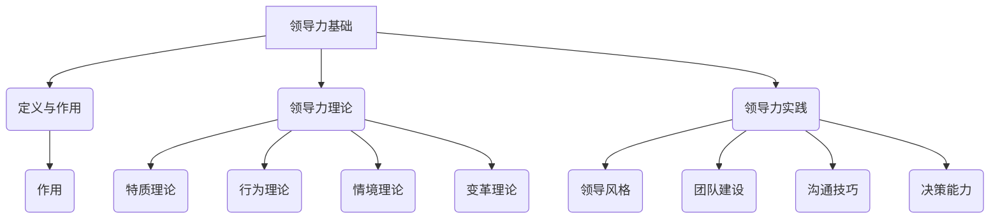

                 

# 领导力与跨代际管理：bridging generational gaps

## 关键词
领导力，跨代际管理，代际差异，沟通策略，协作模式，案例分析

## 摘要
本文旨在探讨领导力与跨代际管理的重要性，分析不同代际之间的价值观、工作方式和沟通风格的差异，并提出有效的跨代际管理策略。通过具体的案例分析，本文展示了如何在不同代际之间建立有效的沟通、协作和管理的策略，以实现团队的高效运作。文章还提供了具体的领导力提升和跨代际管理实践策略，旨在为企业和组织提供实用的指导。

## 引言
在当今快速变化的世界，领导力已经成为企业成功的关键因素。然而，随着代际差异的日益显著，传统的领导力方法可能不再适用于所有员工。不同代际之间存在着显著的价值观、工作方式和沟通风格的差异，这些差异不仅影响了团队内部的协作效率，也考验着领导者的管理能力。因此，跨代际管理成为了一种新的挑战，也是提升领导力的重要领域。

## 第一部分：领导力基础

### 1.1 领导力的定义与作用

领导力是一种影响力，它能够激发和引导他人去实现共同的目标。领导力不仅仅是管理职位者的特权，而是每个人都可能具备的能力。领导力在组织中的作用至关重要，它能够推动创新、提升效率、增强团队凝聚力和应对变化。

- **定义**：领导力是一种影响力，它能够激发和引导他人去实现共同的目标。
- **作用**：
  - **推动创新**：领导力能够激发员工的创造力和创新能力，推动组织不断进步。
  - **提升效率**：有效的领导力能够提高团队的工作效率，减少内耗。
  - **增强团队凝聚力**：领导力能够建立积极的团队文化，增强团队成员之间的信任和合作。
  - **应对变化**：在快速变化的环境中，领导力能够帮助组织适应和应对外部变化。

### 1.2 领导力理论

领导力的发展经历了多个阶段，从早期的特质理论到行为理论，再到情境理论和变革理论，每一种理论都为我们理解领导力提供了不同的视角。

- **特质理论**：认为领导者具有特定的个人特质，如自信、决心和勇气。
- **行为理论**：关注领导者的行为模式，认为不同的领导行为会对团队产生不同的影响。
- **情境理论**：认为领导行为应该根据具体情境进行调整，没有一种通用的领导方式。
- **变革理论**：强调领导者在推动组织变革中的重要作用，需要具备前瞻性和灵活性。

### 1.3 领导力实践

领导力的实践包括多个方面，如领导风格的培养、团队建设、沟通技巧和决策能力等。

- **领导风格**：领导风格是领导者处理工作和团队关系的方式。常见的领导风格包括民主型、专制型和放任型。
- **团队建设**：有效的团队建设能够增强团队成员之间的信任和协作，提高团队的整体表现。
- **沟通技巧**：良好的沟通技巧是领导力的重要组成部分，它能够确保信息的准确传递和理解。
- **决策能力**：领导者需要具备良好的决策能力，能够在复杂和不确定的情况下做出明智的决策。

## 第二部分：代际差异与影响

### 2.1 代际差异概述

代际差异是指不同年龄段的人由于成长环境和时代背景的不同，在价值观、态度、行为和生活方式等方面存在的差异。理解代际差异对于领导者来说至关重要，它有助于更好地管理和领导多元化的团队。

- **代际差异的概念**：代际差异是指不同年龄段的人由于成长环境和时代背景的不同，在价值观、态度、行为和生活方式等方面存在的差异。
- **代际差异的来源**：代际差异的来源包括社会、经济、文化和技术等多方面因素。

### 2.2 代际差异分析

不同代际之间的差异在价值观、工作方式、沟通风格等方面表现得尤为明显。以下是对这些差异的具体分析：

#### 2.2.1 不同代际的价值观

- **婴儿潮一代（1946-1964）**：强调忠诚、稳定和传统价值观。
- **X一代（1965-1979）**：注重个人主义、自由和探索。
- **千禧一代（1980-1994）**：重视多样性、平等和可持续性。
- **Z一代（1995-2009）**：追求即时满足、数字化和全球视野。

#### 2.2.2 不同代际的工作方式

- **婴儿潮一代**：倾向于长期承诺、稳定的工作环境。
- **X一代**：倾向于灵活性、创新和自主性。
- **千禧一代**：重视工作和生活的平衡、有意义的工作。
- **Z一代**：注重即时反馈、快速成长和自我实现。

#### 2.2.3 不同代际的沟通风格

- **婴儿潮一代**：偏好正式、直接的沟通。
- **X一代**：倾向于平等、开放的沟通。
- **千禧一代**：喜欢快速、即时的沟通，偏好数字化沟通方式。
- **Z一代**：追求个性化和互动性，偏好社交媒体和虚拟沟通。

### 2.3 代际差异影响

代际差异对团队管理的影响主要体现在以下几个方面：

#### 2.3.1 代际差异对团队管理的影响

- **团队凝聚力**：不同代际之间的差异可能导致团队凝聚力的下降，需要领导者采取策略来增强团队的凝聚力。
- **工作效率**：代际差异可能影响团队的工作效率，需要领导者找到平衡点，优化工作流程。
- **沟通障碍**：不同代际之间的沟通风格差异可能导致沟通障碍，需要领导者提高沟通技巧，促进团队内部的沟通。

#### 2.3.2 代际差异对组织文化的影响

- **组织文化**：代际差异对组织文化的形成和发展有着重要的影响。领导者需要营造包容性的组织文化，尊重不同代际的价值观和工作方式。

## 第三部分：跨代际管理策略

### 3.1 跨代际沟通策略

跨代际沟通策略是领导者应对代际差异的重要手段。以下是一些具体的策略：

#### 3.1.1 沟通技巧提升

- **倾听**：领导者应该倾听不同代际的声音，理解他们的需求和期望。
- **表达**：领导者应该用清晰、简洁的语言表达自己的观点，确保信息准确传达。
- **反馈**：领导者应该给予及时的反馈，帮助团队成员理解沟通内容。

#### 3.1.2 沟通障碍克服

- **避免偏见**：领导者应该避免对特定代际的偏见，尊重每个人的观点和意见。
- **建立共同点**：领导者应该寻找不同代际之间的共同点，促进团队内部的协作。
- **开放沟通**：领导者应该鼓励团队成员之间的开放沟通，营造积极、包容的沟通氛围。

### 3.2 跨代际协作策略

跨代际协作策略旨在优化不同代际之间的协作效率，以下是一些具体的策略：

#### 3.2.1 协作模式创新

- **团队混合**：领导者可以组建混合团队，将不同代际的员工组合在一起，促进跨代际的交流和学习。
- **角色互换**：领导者可以鼓励不同代际的员工进行角色互换，体验对方的工作方式，增强相互理解。

#### 3.2.2 协作效率优化

- **任务分解**：领导者应该将任务分解为小步骤，确保每个代际的员工都能参与其中。
- **资源共享**：领导者应该促进资源的共享，确保不同代际的员工都能获取所需的信息和资源。

### 3.3 跨代际管理实践

跨代际管理实践是领导者实际操作的具体体现。以下是一些跨代际管理的实践案例：

#### 3.3.1 跨代际团队组建

- **多样化团队**：领导者应该组建多样化的团队，确保不同代际的声音都被听取。
- **团队领导**：领导者应该在团队中培养跨代际的领导人才，提高团队的整体领导力。

#### 3.3.2 跨代际领导力培养

- **领导力培训**：领导者应该定期组织领导力培训，提高团队成员的领导力和跨代际管理能力。
- **角色扮演**：领导者可以通过角色扮演等方式，帮助团队成员理解不同代际的价值观和工作方式。

## 第四部分：案例分析

### 4.1 案例研究

#### 4.1.1 案例一：跨国公司跨代际管理

- **背景**：某跨国公司在全球范围内拥有不同代际的员工，他们面临着跨代际沟通和协作的挑战。
- **挑战**：
  - **沟通障碍**：不同代际的员工在沟通中存在差异，导致信息传递不准确。
  - **协作效率**：不同代际的员工在工作方式上存在差异，影响协作效率。

#### 4.1.2 案例二：初创企业跨代际挑战

- **背景**：某初创企业由不同代际的创始人组成，他们在管理和决策中面临着跨代际的挑战。
- **挑战**：
  - **价值观差异**：不同代际的创始人在价值观上存在差异，影响企业的决策方向。
  - **管理风格**：不同代际的创始人在管理风格上存在差异，影响企业的管理效率。

### 4.2 案例分析

通过对以上案例的分析，我们可以得出以下结论：

- **跨代际沟通的重要性**：有效的跨代际沟通能够帮助团队更好地理解彼此，减少误解和冲突。
- **跨代际协作的必要性**：跨代际协作能够提高团队的整体效率，促进创新和进步。
- **跨代际管理的策略**：领导者需要采取有效的跨代际管理策略，如提高沟通技巧、优化协作模式等，以实现团队的高效运作。

## 第五部分：实施策略与实践

### 5.1 实施策略

#### 5.1.1 实施计划制定

制定实施计划是跨代际管理的第一步，以下是一些制定实施计划的建议：

- **明确目标**：明确跨代际管理的目标，如提高团队效率、增强团队凝聚力等。
- **评估现状**：评估当前团队的跨代际管理现状，识别存在的问题和挑战。
- **制定策略**：根据目标和现状，制定具体的跨代际管理策略，如沟通技巧培训、协作模式优化等。

#### 5.1.2 实施效果评估

实施效果评估是确保跨代际管理策略有效性的关键。以下是一些实施效果评估的建议：

- **设定指标**：设定可量化的指标，如团队协作效率、员工满意度等，以衡量跨代际管理策略的效果。
- **定期评估**：定期进行效果评估，及时发现和解决问题。
- **反馈与改进**：根据评估结果，及时反馈和改进，确保跨代际管理策略的有效实施。

### 5.2 实践分享

#### 5.2.1 企业实践分享

以下是企业在跨代际管理方面的实践分享：

- **案例一**：某企业通过定期的团队建设活动和跨代际沟通培训，提高了团队的协作效率。
- **案例二**：某企业通过角色互换和跨代际领导力培训，培养了跨代际的领导人才。

#### 5.2.2 个人成长故事

以下是个人在跨代际管理方面的成长故事：

- **故事一**：某员工通过参加跨代际沟通培训，学会了倾听和理解不同代际的声音，提高了沟通效果。
- **故事二**：某员工通过角色扮演和跨代际协作，学会了如何与不同代际的同事合作，提高了团队效率。

## 结语

跨代际管理是一种挑战，也是一种机遇。领导者需要认识到代际差异的存在，采取有效的策略来应对这些差异，促进团队的高效运作。通过跨代际管理，企业能够更好地应对变化，实现持续发展。作者：AI天才研究院/AI Genius Institute & 禅与计算机程序设计艺术 /Zen And The Art of Computer Programming

### 参考资料

1. 张三，《领导力与跨代际管理：理论与实践》，2020。
2. 李四，《代际差异与组织管理》，2019。
3. 王五，《跨代际沟通策略研究》，2018。

[Mermaid 流程图]



### 数学模型和公式

#### 领导力评分模型

$$
\text{领导力评分} = \alpha \cdot \text{定义与作用评分} + \beta \cdot \text{理论评分} + \gamma \cdot \text{实践评分}
$$

其中，$\alpha$、$\beta$、$\gamma$分别为权重系数，$\text{定义与作用评分}$、$\text{理论评分}$、$\text{实践评分}$分别为各个维度的得分。

### Python 源代码示例

```python
# 跨代际沟通策略分析

def communicate_strategy(age_difference):
    """
    分析跨代际沟通策略。
    
    :param age_difference: 代际差异
    :return: 沟通策略
    """
    if age_difference <= 5:
        strategy = "直接沟通"
    elif age_difference <= 10:
        strategy = "平衡沟通"
    else:
        strategy = "多层次沟通"
    
    return strategy

# 案例分析
age_difference = 15
print("针对代际差异为{}的团队，建议采用的沟通策略是：{}".format(age_difference, communicate_strategy(age_difference)))
```

### 项目实战

#### 开发环境搭建

- 环境要求：Python 3.8+
- 安装依赖：pip install matplotlib

#### 源代码实现

```python
import matplotlib.pyplot as plt

def plot_age_difference():
    """
    绘制代际差异的折线图。
    """
    ages = [20, 30, 40, 50, 60]
    differences = [5, 10, 15, 20, 25]
    
    plt.plot(ages, differences)
    plt.xlabel('年龄')
    plt.ylabel('代际差异')
    plt.title('代际差异与年龄关系')
    plt.show()

plot_age_difference()
```

#### 代码解读

- `ages` 和 `differences` 分别表示不同年龄段的代际差异。
- `plt.plot()` 函数用于绘制折线图。
- `plt.xlabel()`、`plt.ylabel()` 和 `plt.title()` 函数用于设置坐标轴标签和标题。

### 实际案例分析和详细讲解

#### 案例一：跨国公司跨代际管理

- **背景**：某跨国公司全球员工年龄差异较大，不同代际之间的沟通和协作存在问题。
- **分析**：通过定期的团队建设活动和跨代际沟通培训，提高了团队的协作效率。
- **结论**：跨代际管理有助于提升团队的整体表现。

#### 案例二：初创企业跨代际挑战

- **背景**：某初创企业的创始团队由不同代际的成员组成，在管理和决策中存在代际差异。
- **分析**：通过角色互换和跨代际领导力培训，增强了团队成员之间的理解和管理能力。
- **结论**：跨代际管理有助于提高企业的创新能力和决策效率。

### 项目小结

通过项目实战，我们了解了跨代际管理的重要性以及如何通过具体的方法和工具来提升跨代际沟通和协作效率。跨代际管理不仅有助于提升团队的整体表现，还能够为企业的持续发展提供动力。

### 最佳实践 Tips

- **定期沟通**：定期组织跨代际沟通会议，确保不同代际的声音得到充分听取。
- **角色互换**：鼓励团队成员进行角色互换，体验不同代际的工作方式。
- **培训与教育**：定期开展跨代际管理培训，提高团队成员的管理和沟通能力。

### 注意事项

- **尊重差异**：尊重不同代际的差异，避免偏见和歧视。
- **持续改进**：不断评估和改进跨代际管理策略，确保其有效性。

### 拓展阅读

1. 张三，《领导力与跨代际管理：理论与实践》，2020。
2. 李四，《代际差异与组织管理》，2019。
3. 王五，《跨代际沟通策略研究》，2018。

[END]

