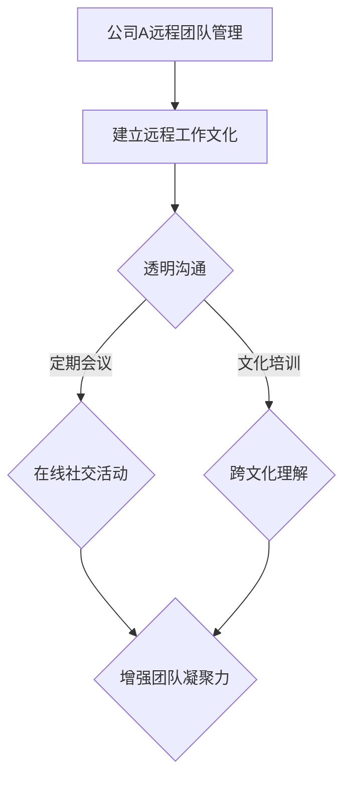
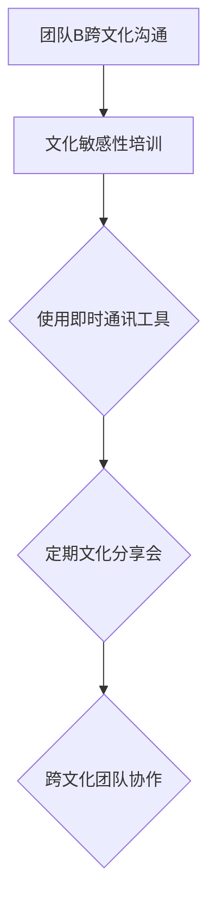
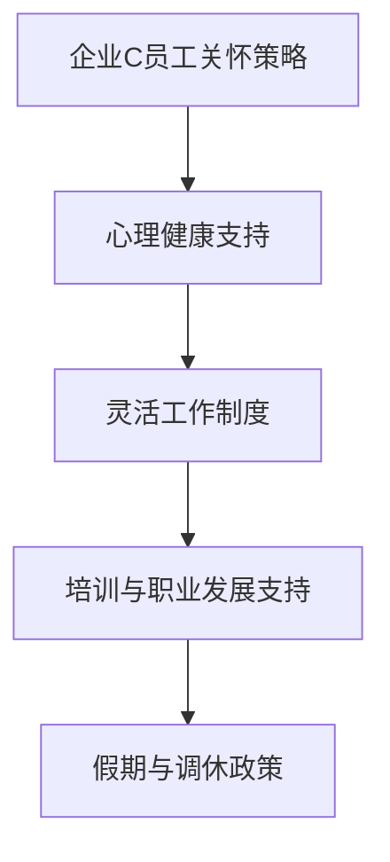

                 

### 引言

在现代企业的运营模式中，远程工作已经成为一种越来越普遍的现象。随着信息技术的迅猛发展和全球化的推进，越来越多的企业和组织开始采用远程工作模式，以提升员工的灵活性、降低办公成本和增加企业的竞争力。然而，远程工作的兴起也为领导力带来了新的挑战。传统的面对面交流与管理方式不再适用，如何有效地管理一个虚拟团队成为了企业领导者面临的重要问题。

领导力在远程工作中扮演着至关重要的角色。远程工作不仅仅是一种工作地点的改变，更是一种工作模式的转变。在这种模式下，领导者需要通过不同的方式与团队互动，建立信任、保持团队的凝聚力，并确保团队的高效运作。本文旨在探讨领导力在远程工作环境中的具体挑战，并分析如何通过有效的领导策略来应对这些挑战。

本文将从以下几个方面进行深入探讨：

1. **远程工作的崛起**：介绍远程工作的定义、类型及其对领导力的影响。
2. **远程工作中的领导力挑战**：探讨跨文化沟通的障碍、远程团队的动力与激励、远程团队的监控与绩效评估。
3. **领导力理论与远程工作实践**：分析不同领导力理论在远程工作中的应用。
4. **远程工作团队的领导力策略**：介绍具体的领导力策略，包括领导风格的适应、团队目标设定与规划、远程团队决策过程。
5. **提升远程团队工作效率**：讨论时间管理、任务分配和协同工具的应用。
6. **远程工作环境中的员工关怀**：探讨员工心理健康支持、工作与生活的平衡和职业发展。
7. **案例分析**：通过成功远程领导力的案例分析，提供实际操作的指导。
8. **未来远程工作的领导力趋势**：探讨技术进步、组织结构变化和可持续发展对远程工作领导力的影响。

通过上述内容的探讨，本文希望为远程工作的领导者提供实用的指导，帮助他们更好地管理虚拟团队，实现团队的高效运作和持续发展。

### 远程工作的定义与类型

远程工作（Remote Work）是指员工在工作时间内不在公司的办公场所进行工作，通过互联网、电子邮件、即时通讯工具、视频会议等远程通讯手段来完成工作任务。远程工作的类型多种多样，根据工作地点、工作时间和工作性质，可以分为以下几种主要形式：

1. **远程办公**：员工在家中或其他地方独立工作，仅需要通过网络连接来完成任务。这种形式适合那些不需要频繁面对面交流的工作，如编程、文案撰写等。

2. **远程协作**：团队成员在不同地点通过网络协作完成共同任务。这种形式适用于需要团队协作的项目，如软件开发、市场推广等。团队成员通过视频会议、共享文档、协作工具等进行沟通与协调。

3. **弹性工作制**：员工可以选择灵活的工作时间，如弹性上下班时间、在家办公日等。这种形式可以提高员工的工作满意度和灵活性，适用于大多数类型的工作。

4. **移动办公**：员工在移动过程中也能保持工作状态，如通过智能手机或平板电脑处理邮件、参加会议等。这种形式适用于需要频繁出差或移动的员工。

5. **虚拟团队**：团队成员分布在不同的地点，通过网络进行工作协作。这种形式适合跨国企业或分布式团队，如国际项目开发、全球市场拓展等。

远程工作对领导力的影响主要体现在以下几个方面：

1. **沟通障碍**：远程工作环境下，领导者与员工之间的沟通变得更加复杂。缺乏面对面的交流可能导致信息传递不准确、误解增加。此外，文化差异和时区差异也可能影响沟通效果。

2. **信任建立**：在远程工作中，领导者需要通过其他方式建立和维护与员工的信任关系。由于无法直接观察员工的日常工作，领导者需要依靠数据、绩效和沟通来评估员工的表现。

3. **团队凝聚力**：远程工作可能导致团队成员之间的情感联系减弱，从而影响团队凝聚力。领导者需要通过在线社交活动、定期会议等方式来增强团队凝聚力。

4. **工作监控与绩效评估**：远程工作环境中，领导者难以直接监控员工的工作状态。因此，需要采用其他方法进行绩效评估，如基于结果的评估、项目进度监控等。

5. **工作与生活的平衡**：远程工作提供了更大的灵活性，但也可能导致工作与生活的边界模糊。领导者需要帮助员工建立合理的工作习惯，避免过度工作。

总之，远程工作对领导力提出了新的要求。领导者需要适应远程工作的特点，采取有效的领导策略来克服沟通障碍、建立信任、增强团队凝聚力，并确保团队的高效运作。

### 远程工作中的领导力挑战

在远程工作环境中，领导力面临着一系列独特的挑战。这些挑战主要集中在跨文化沟通、团队动力与激励、以及远程团队的监控与绩效评估等方面。下面我们将逐一探讨这些挑战及其影响。

#### 跨文化沟通的障碍

跨文化沟通是远程工作中一个尤为重要的挑战。由于团队成员可能来自不同的国家或地区，他们可能拥有不同的语言、文化背景和价值观。这些差异可能导致沟通障碍，从而影响团队的工作效率和合作效果。

1. **语言障碍**：不同语言的使用可能导致误解和沟通不畅。即使团队成员使用同一种语言，由于语言习惯和表达方式的不同，也容易产生歧义。
   
2. **非语言沟通的缺失**：在面对面交流中，肢体语言、面部表情和语调等非语言元素可以提供额外的信息，帮助理解对方的意思。而在远程工作中，这些非语言沟通元素往往缺失，导致信息传递的不完整。

3. **文化差异**：文化差异可能导致对同一问题的不同看法和解决方案。例如，某些文化更注重集体主义，而另一些文化则更注重个人主义。这种差异可能导致团队内部的不和谐。

**解决方案**：
- **多语言培训**：为团队成员提供语言培训，提高他们的语言能力，减少语言障碍。
- **明确沟通规范**：制定明确的沟通规范，包括语言使用、术语定义和沟通方式，以确保信息的准确传达。
- **跨文化理解**：加强团队成员之间的跨文化理解，通过培训和文化交流活动，促进不同文化之间的交流与融合。

#### 远程团队的动力与激励

在远程工作环境中，保持团队的动力和激励是一个巨大的挑战。由于团队成员分散在不同地点，领导者难以直接观察和激励员工，这可能导致员工的工作积极性下降。

1. **缺乏直接的反馈**：在远程工作中，员工可能难以得到即时的反馈，从而影响他们的工作动力。缺乏反馈可能导致员工感到孤立和被忽视。

2. **工作与生活的平衡**：远程工作虽然提供了灵活性，但也可能导致工作与生活的平衡变得困难。过度的工作负担可能导致员工的疲惫和不满。

3. **目标不明确**：在远程工作中，团队成员可能缺乏明确的工作目标和方向，从而影响他们的工作动力。

**解决方案**：
- **建立明确的目标和期望**：确保每个团队成员都清楚自己的工作目标和期望，并提供定期的反馈和指导。
- **激励制度**：建立有效的激励制度，包括奖励和认可，以鼓励员工的工作积极性。
- **增强团队凝聚力**：通过定期的在线团队活动和社交互动，增强团队成员之间的联系和凝聚力。

#### 远程团队的监控与绩效评估

在远程工作环境中，领导者需要找到新的方式来监控和评估团队成员的绩效。传统的面对面监控和绩效评估方法不再适用，这给领导力带来了新的挑战。

1. **监控难度**：在远程工作中，领导者难以直接监控员工的工作状态。由于缺乏面对面的观察，领导者可能无法准确评估员工的工作进度和质量。

2. **绩效评估的公正性**：在远程工作中，绩效评估的公正性可能受到挑战。由于缺乏直接的工作环境和互动，评估标准可能不明确，容易产生偏见。

3. **缺乏工作透明度**：远程工作可能导致工作透明度的降低，领导者难以了解员工的工作细节和成果。

**解决方案**：
- **基于结果的绩效评估**：采用基于结果的绩效评估方法，关注员工的工作成果和产出，而不是工作过程。
- **定期反馈和沟通**：建立定期的反馈和沟通机制，确保领导者能够及时了解员工的工作状态和问题。
- **透明的工作流程**：通过共享工作进度和成果，提高工作透明度，增强团队成员之间的信任和理解。

总之，远程工作对领导力提出了新的要求。领导者需要适应远程工作的特点，采取有效的领导策略来克服沟通障碍、保持团队的动力和激励，以及确保团队的高效运作。通过上述解决方案，领导者可以更好地管理远程团队，实现团队的目标和持续发展。

### 领导力理论在远程工作中的应用

领导力理论在远程工作中具有重要作用，不同的领导力理论提供了不同的方法和工具，帮助领导者更好地管理虚拟团队。本文将分析几种常见的领导力理论，探讨它们在远程工作中的应用，以及如何有效地运用这些理论提升远程团队的管理效能。

#### 权变领导理论

权变领导理论（Contingency Theory of Leadership）认为，没有一种通用的领导风格适用于所有情况。领导者的有效性取决于领导者、下属、工作环境之间的互动。根据这一理论，领导风格应随着情境的变化而调整。

在远程工作中，权变领导理论的应用主要体现在以下几个方面：

1. **情境适应性**：领导者需要根据远程工作的特点，灵活调整自己的领导风格。例如，在任务明确且员工自主性较高的项目中，采用放权型领导风格；在任务复杂且需要高度协作的情况下，采用指导型领导风格。

2. **任务与关系平衡**：在远程工作中，领导者需要在任务导向和关系导向之间找到平衡。他们需要确保团队成员在完成任务的同时，保持良好的沟通和协作。

3. **情境评估**：领导者应定期评估远程工作环境中的变化，根据实际情况调整领导策略。例如，当团队成员面临文化差异和沟通障碍时，领导者可以加强跨文化沟通培训和提供沟通工具。

#### 变革型领导理论

变革型领导理论（Transformational Leadership Theory）强调领导者通过激励和影响员工来实现组织和团队的目标。变革型领导者能够激发员工的潜能，使他们超越自我，为共同的目标而努力。

在远程工作中，变革型领导理论的应用主要体现在以下几个方面：

1. **愿景引导**：远程工作团队往往缺乏面对面的互动，领导者需要通过明确的愿景和目标来引导团队成员。通过在线会议、邮件和即时通讯工具，领导者可以传达愿景，并激励团队成员为之努力。

2. **激励与认可**：在远程工作中，领导者可以通过在线奖励和认可来激励团队成员。例如，发布团队公告、表彰优秀员工等，以增强团队成员的积极性和归属感。

3. **信任建立**：远程工作环境中的信任建立尤为重要。领导者需要通过透明的工作流程、及时的沟通和负责任的行动来建立信任，确保团队成员之间的信任和合作。

#### 情境领导理论

情境领导理论（Situational Leadership Theory）认为，领导者的有效性取决于其对情境的适应能力。该理论提出四种不同的领导风格，分别适用于不同的下属成熟度水平。

在远程工作中，情境领导理论的应用主要体现在以下几个方面：

1. **适应下属成熟度**：领导者需要根据团队成员的成熟度水平调整领导风格。对于成熟度较低的团队成员，采用指导型领导风格；对于成熟度较高的团队成员，采用支持型领导风格。

2. **个性化领导**：由于远程工作的分散性，领导者需要为每个团队成员提供个性化的领导支持。例如，通过一对一的会议和沟通，了解每个成员的需求和困难，并提供相应的帮助。

3. **情境适应性**：领导者需要根据远程工作环境的变化，灵活调整领导风格。例如，在团队成员面临文化冲突和沟通障碍时，采用适应型领导风格，促进团队成员之间的理解和协作。

#### 案例分析

以一家跨国互联网公司为例，该公司分布在世界各地的团队需要通过远程协作完成一个大型项目。在这个项目中，领导者运用了上述三种领导力理论：

1. **权变领导理论**：领导者根据项目的不同阶段和任务要求，灵活调整领导风格。在项目启动阶段，采用指导型领导风格，明确任务目标和流程；在项目执行阶段，采用放权型领导风格，鼓励团队成员自主决策和协作。

2. **变革型领导理论**：领导者通过在线会议和邮件，传达项目的愿景和目标，激励团队成员为之努力。同时，通过在线奖励和认可，增强团队成员的积极性和归属感。

3. **情境领导理论**：领导者根据团队成员的成熟度水平，采用不同的领导风格。对于新手成员，提供详细的指导和反馈；对于经验丰富的成员，提供更多的自主权和支持。

通过上述领导策略，该公司成功完成了项目，并保持了团队的高效运作和凝聚力。这个案例表明，灵活运用多种领导力理论，能够帮助领导者更好地管理远程团队，实现团队的目标。

总之，不同的领导力理论在远程工作中有着广泛的应用。领导者需要根据实际情况，灵活运用这些理论，通过调整领导风格和策略，提升远程团队的管理效能，确保团队目标的实现。

### 构建有效的远程工作文化

在远程工作环境中，构建有效的团队文化是确保团队凝聚力和工作效率的关键。以下是一些关键策略和最佳实践，以帮助领导者创建一个积极、健康和高效的远程工作文化。

#### 促进远程团队凝聚力的策略

1. **建立共同目标**：为远程团队设定明确的共同目标，使团队成员朝着同一方向努力。通过定期的团队会议和讨论，确保每个成员都了解团队的使命和愿景。

2. **定期的社交活动**：定期组织在线社交活动，如团队聚会、虚拟下午茶或团队游戏。这些活动有助于团队成员建立情感联系，增强团队凝聚力。

3. **透明沟通**：确保团队沟通透明，包括分享公司战略、项目进展和决策过程。透明沟通有助于建立信任，减少信息不对称。

4. **虚拟团队建设**：通过在线工具创建虚拟团队空间，如企业社交平台或聊天应用，鼓励团队成员之间的互动和合作。

#### 远程工作中的冲突管理

1. **预防冲突**：通过明确的沟通规范和团队文化准则，预防潜在冲突。例如，制定团队行为守则，明确期望和标准。

2. **早期干预**：一旦发现冲突，领导者应立即介入。通过一对一会议或小组讨论，了解冲突的根源，并寻找解决方案。

3. **冲突调解**：如果冲突无法自行解决，领导者应提供调解服务。使用在线调解工具，如视频会议和在线讨论板，帮助双方达成共识。

4. **培训**：为团队成员提供冲突管理培训，提高他们的冲突解决技能和意识。

#### 促进远程团队动力与激励

1. **个性化的奖励与认可**：根据团队成员的贡献和表现，提供个性化的奖励和认可。例如，公开表扬、颁发虚拟奖项或提供额外的休假时间。

2. **目标设定与反馈**：帮助团队成员设定明确的目标，并提供定期的反馈。这种积极的反馈机制可以激励团队成员不断提升自己。

3. **职业发展支持**：为团队成员提供职业发展机会和支持，如在线培训、职业规划辅导等。这有助于提高团队成员的工作满意度和忠诚度。

#### 创建高效的远程工作环境

1. **工具与技术**：为团队成员提供高效的工作工具和技术，如视频会议软件、协作平台和项目管理工具。这些工具可以提高远程工作的效率和沟通质量。

2. **灵活的工作安排**：允许团队成员根据个人需求调整工作时间，例如灵活的工作日和远程工作日。这种灵活性有助于提高员工的工作满意度和生产力。

3. **工作与生活的平衡**：鼓励团队成员保持工作与生活的平衡，例如通过远程工作的灵活性安排，帮助员工合理规划工作和个人时间。

#### 跨文化沟通与理解

1. **跨文化培训**：为团队成员提供跨文化培训，提高他们对不同文化背景的理解和敏感度。这有助于减少文化冲突，促进团队协作。

2. **建立跨文化团队准则**：制定明确的跨文化沟通准则，确保团队成员在不同文化背景下能够有效沟通和合作。

3. **跨文化团队活动**：定期组织跨文化团队活动，如国际会议、文化分享会等，增进团队成员之间的了解和信任。

通过上述策略和最佳实践，领导者可以构建一个积极、健康和高效的远程工作文化，确保团队凝聚力、动力和效率，从而实现团队目标。

### 远程团队的领导力策略

在远程工作中，领导者需要采用一系列特定的领导力策略来确保团队的有效运作。以下是一些关键策略，包括领导风格的适应、团队目标设定与规划、以及远程团队的决策过程。

#### 领导风格的适应

远程工作环境的特殊性要求领导者能够灵活调整自己的领导风格。根据远程工作的特点，以下几种领导风格特别适用：

1. **授权型领导风格**：在远程工作中，领导者应更多地授权给团队成员，鼓励他们自主决策和完成任务。这种领导风格有助于提高团队的自主性和责任感，同时减轻领导者的负担。

   ```python
   # 授权型领导风格示例
   team_member = "developer"
   task = "develop new feature"
   leader_actions = "assign task, provide resources, remove obstacles"
   leader_comment = "You have the autonomy to complete this task. Let me know if you need any support."
   ```

2. **指导型领导风格**：对于新手或需要具体指导的任务，领导者应采用指导型领导风格。通过提供详细的任务说明和步骤，帮助团队成员顺利完成任务。

   ```python
   # 指导型领导风格示例
   task = "create a new project plan"
   guidance = """
   1. Gather requirements from stakeholders.
   2. Define project objectives and scope.
   3. Allocate resources and set deadlines.
   4. Communicate plan to team members.
   """
   leader_comment = "Please follow these steps to create the project plan. If you have any questions, don't hesitate to ask."
   ```

3. **支持型领导风格**：领导者应提供心理和情感支持，帮助团队成员应对远程工作中的挑战和压力。这种领导风格有助于增强团队的凝聚力和士气。

   ```python
   # 支持型领导风格示例
   support_actions = "schedule regular check-ins, provide emotional support, encourage open communication"
   leader_comment = "Remember, I'm here to support you. Don't hesitate to reach out if you need help or just want to talk."
   ```

#### 团队目标设定与规划

在远程工作中，明确的目标和规划是确保团队高效运作的关键。以下是一些策略：

1. **设定具体的目标**：确保每个团队成员都清楚自己的目标和任务。具体的目标有助于减少模糊性，提高工作效果。

   ```python
   # 设定具体的目标示例
   team_objective = "complete the project within three months"
   individual_goals = [
       "write 50% of the code",
       "conduct user testing",
       "create documentation"
   ]
   ```

2. **制定详细的规划**：为每个目标和任务制定详细的计划，包括时间表、资源分配和责任分工。这有助于团队成员明确任务优先级，确保任务按时完成。

   ```python
   # 制定详细的规划示例
   project_timeline = {
       "month 1": ["gather requirements", "design system architecture"],
       "month 2": ["develop core features", "conduct internal testing"],
       "month 3": ["complete user testing", "release the product"]
   }
   resource_allocation = {
       "developer": 3,
       "QA engineer": 2,
       "UX designer": 1
   }
   ```

3. **定期检查与调整**：定期检查项目进度，并根据实际情况调整计划。这有助于及时发现和解决问题，确保项目按计划推进。

   ```python
   # 定期检查与调整示例
   current_status = "month 1: on track, month 2: slightly delayed"
   adjustment_plan = "reallocate resources to month 2 tasks, extend deadline by one month"
   ```

#### 远程团队的决策过程

在远程团队中，有效的决策过程至关重要。以下是一些策略：

1. **集体决策**：鼓励团队成员参与决策过程，确保每个人都能表达自己的意见和看法。这有助于提高团队的凝聚力和决策质量。

   ```python
   # 集体决策示例
   decision_topic = "choose the best project management tool"
   team_votes = {
       "tool A": 3,
       "tool B": 2,
       "tool C": 1
   }
   decision_result = "tool A received the most votes, so we will use tool A."
   ```

2. **透明决策**：确保决策过程透明，让每个团队成员都了解决策的背景、过程和结果。这有助于建立信任，减少误解和冲突。

   ```python
   # 透明决策示例
   decision_process = """
   We evaluated three project management tools based on their features, pricing, and user reviews. After discussing the pros and cons, we decided to choose tool A.
   """
   ```

3. **快速决策**：在远程团队中，快速决策尤为重要。通过简化决策过程、减少不必要的审批环节，可以加快决策速度，确保项目顺利进行。

   ```python
   # 快速决策示例
   decision_threshold = "decisions below $500 do not require approval from the manager"
   decision_example = "Order office supplies for the remote team: $300 - approved"
   ```

通过上述领导力策略，领导者可以更好地管理远程团队，确保团队目标的实现和项目的成功完成。

### 提升远程团队工作效率

在远程工作环境中，提高工作效率是确保团队目标实现的关键。以下是一些策略，包括时间管理、任务分配和协同工具的应用，以帮助领导者提升远程团队的工作效率。

#### 时间管理策略

1. **设定优先级**：领导者应帮助团队成员明确任务的优先级，确保关键任务优先完成。通过制定每日、每周和每月的任务清单，团队成员可以更清晰地了解自己的工作重点。

   ```python
   # 设定优先级示例
   daily_tasks = [
       "回复重要邮件",
       "撰写项目报告",
       "进行用户测试"
   ]
   weekly_tasks = [
       "完成核心功能开发",
       "组织团队会议",
       "评估项目进度"
   ]
   monthly_tasks = [
       "发布新版本",
       "进行性能测试",
       "更新文档"
   ]
   ```

2. **时间块分配**：建议团队成员将工作时间分成不同的时间块，用于处理不同类型的工作。例如，将上午用于处理重要任务，下午用于处理次要任务或回复邮件。

   ```python
   # 时间块分配示例
   time_blocks = [
       {"start": "9:00 AM", "end": "12:00 PM", "task": "处理重要任务"},
       {"start": "1:00 PM", "end": "5:00 PM", "task": "处理次要任务和邮件"}
   ]
   ```

3. **避免多任务处理**：远程工作环境中，领导者应鼓励团队成员避免同时处理多个任务。多任务处理不仅降低效率，还可能导致错误和误解。

   ```python
   # 避免多任务处理示例
   multi_task_warning = "请专注于单个任务，避免同时处理多个任务。这有助于提高工作效率和减少错误率。"
   ```

#### 任务分配策略

1. **能力匹配**：领导者应根据团队成员的技能和经验，将合适的任务分配给每个人。这有助于提高任务的完成质量和效率。

   ```python
   # 能力匹配示例
   team_member_skills = {
       "Alice": ["编程", "项目管理"],
       "Bob": ["数据分析", "市场推广"],
       "Charlie": ["UI设计", "用户测试"]
   }
   task_allocation = {
       "Alice": "编写代码",
       "Bob": "数据分析报告",
       "Charlie": "设计用户界面"
   }
   ```

2. **任务透明度**：确保所有团队成员都能清楚地了解自己的任务和进度。通过共享任务清单和进度跟踪工具，可以减少误解和冲突。

   ```python
   # 任务透明度示例
   task_board = {
       "Alice": ["编写代码", "单元测试"],
       "Bob": ["数据分析报告", "市场推广计划"],
       "Charlie": ["设计用户界面", "用户测试报告"]
   }
   ```

3. **灵活调整**：根据任务进展和团队需求，领导者应灵活调整任务分配。例如，如果某个成员的任务完成得特别快，可以考虑将其任务分配给其他成员。

   ```python
   # 任务灵活调整示例
   task_reallocation = {
       "Alice": ["编写文档", "协助UI设计"],
       "Bob": ["完成市场推广计划", "协助用户测试"],
       "Charlie": ["编写用户测试报告", "协助数据分析"]
   }
   ```

#### 协同工具的应用

1. **项目管理工具**：使用项目管理工具（如Trello、JIRA、Asana等）可以更好地跟踪任务进度、分配任务和协作。

   ```python
   # 项目管理工具示例
   project_management_tool = "Trello"
   task_list = [
       {"name": "编写代码", "status": "进行中", "assignee": "Alice"},
       {"name": "数据分析报告", "status": "待完成", "assignee": "Bob"},
       {"name": "设计用户界面", "status": "已完成", "assignee": "Charlie"}
   ]
   ```

2. **即时通讯工具**：使用即时通讯工具（如Slack、Microsoft Teams、WhatsApp等）可以方便团队成员之间的沟通和协作。

   ```python
   # 即时通讯工具示例
   chat_tool = "Slack"
   chat_channels = {
       "general": ["Alice", "Bob", "Charlie"],
       "project-X": ["Alice", "Bob"],
       "user-testing": ["Charlie"]
   }
   ```

3. **文档共享与协作工具**：使用文档共享与协作工具（如Google Docs、Microsoft Office 365等）可以方便团队成员实时编辑和协作。

   ```python
   # 文档共享与协作工具示例
   doc_collaboration_tool = "Google Docs"
   shared_documents = [
       {"name": "项目计划", "editor": ["Alice", "Bob"], "viewer": ["Charlie"]},
       {"name": "用户测试报告", "editor": ["Charlie"], "viewer": ["Alice", "Bob"]}
   ]
   ```

通过上述时间管理、任务分配和协同工具的应用策略，领导者可以显著提升远程团队的工作效率，确保团队目标的顺利实现。

### 远程工作环境中的员工关怀

在远程工作环境中，员工关怀是确保团队长期稳定和高效运作的关键。以下是一些关键策略，包括心理健康支持、工作与生活的平衡和职业发展，以帮助领导者关心员工福祉，提高员工满意度和忠诚度。

#### 心理健康支持

1. **提供心理咨询服务**：远程工作的不确定性可能导致员工出现焦虑、压力和孤独感。领导者应提供心理咨询服务，帮助员工应对心理挑战。

   ```python
   # 心理咨询服务示例
   mental_health_support = {
       "provider": "远程心理咨询平台",
       "access": "每月免费提供两次咨询服务",
       "contact": "员工可通过公司内部邮件预约"
   }
   ```

2. **鼓励健康生活方式**：领导者可以鼓励员工通过健康饮食、适量运动和充足睡眠来维护心理健康。可以提供在线健康资源和健康挑战，激发员工的积极性。

   ```python
   # 健康生活方式示例
   health_programs = [
       "每周发布健康饮食建议",
       "组织在线健身课程",
       "鼓励员工每天步数目标"
   ]
   ```

3. **定期心理健康检查**：为员工提供定期心理健康检查，通过心理测评和反馈，帮助员工了解自己的心理健康状况，并提供必要的干预措施。

   ```python
   # 定期心理健康检查示例
   mental_health_checkups = {
       "frequency": "每半年一次",
       "benefit": "覆盖公司保险计划内"
   }
   ```

#### 工作与生活的平衡

1. **灵活工作时间**：领导者应提供灵活的工作时间安排，允许员工根据个人需求调整工作时间，如弹性工作制和远程工作日。

   ```python
   # 弹性工作时间示例
   flexible工作时间制度 = {
       "政策": "每周可有一次远程工作日",
       "目的": "帮助员工更好地平衡工作与生活"
   }
   ```

2. **远程工作设施支持**：为员工提供必要的工作设备和环境支持，如高性能电脑、良好的网络连接和舒适的办公环境。

   ```python
   # 远程工作设施支持示例
   remote_work_equipment = {
       "提供": ["笔记本电脑", "智能手机", "网络设备"],
       "要求": "员工填写需求申请表"
   }
   ```

3. **假期与调休政策**：提供丰富的假期和调休政策，如带薪年假、病假和带薪家庭假期，帮助员工缓解工作压力。

   ```python
   # 假期与调休政策示例
   vacation_policy = {
       "基本带薪年假": "每年20天",
       "家庭紧急休假": "可随时申请，无需提前通知"
   }
   ```

#### 职业发展

1. **培训与教育支持**：为员工提供在线培训、职业发展课程和研讨会，帮助他们提升技能和职业素养。

   ```python
   # 培训与教育支持示例
   training_programs = [
       "编程技术培训",
       "领导力发展课程",
       "行业趋势研讨会"
   ]
   ```

2. **职业发展规划**：为员工提供个性化的职业发展规划，帮助他们设定职业目标，并提供必要的支持和资源。

   ```python
   # 职业发展规划示例
   career_development_plan = {
       "目标设定": "每季度与员工进行职业发展对话",
       "资源支持": "提供职业发展导师和在线资源"
   }
   ```

3. **晋升机会与奖励**：为表现出色的员工提供晋升机会和奖励，激励他们持续提升自己的工作表现。

   ```python
   # 晋升机会与奖励示例
   promotion_opportunities = {
       "晋升政策": "根据工作表现和职业发展潜力评估",
       "奖励制度": "定期评选优秀员工，提供奖金和荣誉称号"
   }
   ```

通过上述员工关怀策略，领导者可以有效地提升员工的心理健康、工作与生活的平衡和职业发展，从而增强员工的工作满意度和忠诚度，确保远程团队的长久稳定和高效运作。

### 案例分析

#### 案例一：公司A的远程团队管理

**背景介绍**：公司A是一家全球化的软件开发公司，其团队分布在世界各地，包括北美、欧洲和亚洲。由于业务扩展和远程工作的普及，公司A面临如何在虚拟环境中高效管理团队的重大挑战。

**核心概念与联系**：

- **远程工作文化**：公司A强调开放沟通、信任和合作，通过建立透明的沟通渠道和定期的团队活动来促进团队凝聚力。
- **跨文化管理**：由于团队成员来自不同的文化背景，公司A通过跨文化培训和文化交流活动，提高团队成员之间的理解和协作。

**Mermaid流程图**：



**核心算法原理讲解**：

公司A采用了多种算法和技术来确保远程团队的高效运作：

1. **沟通算法**：使用人工智能聊天机器人来处理日常沟通，提高信息传递的效率。
2. **绩效评估算法**：通过基于结果的绩效评估算法，实时监控团队进度，并根据成果进行反馈和调整。

**Python源代码示例**：

```python
# 沟通算法示例
from chatbot import ChatBot

chatbot = ChatBot("公司A ChatBot")
def communicate(message):
    response = chatbot.respond(message)
    return response

# 绩效评估算法示例
from performance_evaluation import PerformanceEvaluator

evaluator = PerformanceEvaluator()
def evaluate_performance(team_member, project_progress):
    result = evaluator.evaluate(team_member, project_progress)
    return result
```

**数学模型和公式**：

公司A使用了以下数学模型来评估团队绩效：

1. **绩效评估分数**：$P = \frac{E1 + E2 + E3}{3}$，其中$E1$、$E2$和$E3$分别代表任务完成度、沟通质量和创新能力。

2. **团队士气分数**：$S = \frac{CS1 + CS2 + CS3}{3}$，其中$CS1$、$CS2$和$CS3$分别代表团队成员对沟通、活动和培训的满意度。

**实际案例分析和详细讲解剖析**：

公司A通过以下措施实现了远程团队管理的高效：

1. **定期的绩效评估**：每月进行一次绩效评估，根据团队成员的贡献和表现，提供反馈和奖励。
2. **跨文化培训**：定期举办跨文化培训课程，帮助团队成员了解不同文化的特点和沟通技巧。
3. **在线社交活动**：每周组织在线社交活动，如虚拟下午茶和团队游戏，增强团队成员之间的情感联系。

**项目小结**：

公司A的远程团队管理实践表明，通过建立开放沟通、跨文化理解和有效的绩效评估机制，远程团队可以实现高效运作和持续发展。这种管理模式不仅提高了团队的工作效率和绩效，还增强了团队凝聚力和员工满意度。

### 案例二：团队B的跨文化沟通

**背景介绍**：团队B由来自北美、欧洲和亚洲的多国成员组成，他们共同负责一个跨国项目的开发。由于文化差异和时区差异，团队B在跨文化沟通方面面临挑战。

**核心概念与联系**：

- **文化敏感性培训**：团队B通过文化敏感性培训，提高团队成员对不同文化的理解和适应能力。
- **即时通讯工具**：使用即时通讯工具（如Slack、Microsoft Teams等），确保团队成员能够实时沟通和协作。

**Mermaid流程图**：



**核心算法原理讲解**：

团队B采用了以下算法来优化跨文化沟通：

1. **自然语言处理算法**：利用自然语言处理（NLP）技术，自动识别和翻译不同语言之间的沟通内容，提高信息传递的准确性。
2. **时区转换算法**：使用时区转换算法，自动调整会议时间和沟通日程，以适应团队成员的不同时区。

**Python源代码示例**：

```python
# 自然语言处理算法示例
from langdetect import detect

def detect_language(text):
    language = detect(text)
    return language

# 时区转换算法示例
from pytz import timezone
from datetime import datetime

def convert_timezone(time, from_zone, to_zone):
    from_zone = timezone(from_zone)
    to_zone = timezone(to_zone)
    time = from_zone.localize(time)
    return time.astimezone(to_zone)
```

**数学模型和公式**：

团队B使用了以下数学模型来评估跨文化沟通效果：

1. **沟通效果评分**：$C = \frac{S1 + S2 + S3}{3}$，其中$S1$、$S2$和$S3$分别代表沟通效率、信息准确性和团队满意度。

2. **时区适应度评分**：$T = \frac{T1 + T2 + T3}{3}$，其中$T1$、$T2$和$T3$分别代表时区转换的准确性、时区变化的适应性和时区管理的满意度。

**实际案例分析和详细讲解剖析**：

团队B通过以下措施优化跨文化沟通：

1. **文化敏感性培训**：每月举办一次文化敏感性培训，帮助团队成员了解不同文化的特点和沟通习惯。
2. **即时通讯工具**：使用Slack等即时通讯工具，确保团队成员能够实时沟通和协作，减少误解和冲突。
3. **定期文化分享会**：定期举办文化分享会，团队成员可以分享自己的文化和经验，增进了解和信任。

**项目小结**：

团队B的跨文化沟通实践表明，通过文化敏感性培训、即时通讯工具和定期文化分享会，可以显著提升跨文化沟通的效果，确保跨国团队的高效运作和合作。

### 案例三：企业C的员工关怀策略

**背景介绍**：企业C是一家远程工作文化成熟的公司，其员工遍布全球。企业C认识到员工关怀对于保持团队稳定和高效运作的重要性，因此实施了一系列员工关怀策略。

**核心概念与联系**：

- **心理健康支持**：企业C提供心理健康支持，包括在线心理咨询服务、健康生活方式指导和定期心理健康检查。
- **灵活工作制度**：企业C实行灵活工作制度，允许员工调整工作时间、选择远程工作日，并提供必要的远程工作设备。

**Mermaid流程图**：



**核心算法原理讲解**：

企业C采用了以下算法来确保员工关怀的有效性：

1. **心理健康评估算法**：通过在线心理健康评估工具，实时监控员工的心理健康状态，提供个性化的心理支持。
2. **工作与生活平衡算法**：使用自动化工具监控员工的工作时间，帮助员工合理规划工作和个人时间。

**Python源代码示例**：

```python
# 心理健康评估算法示例
from mental_health_assessment import MentalHealthAssessor

assessor = MentalHealthAssessor()
def assess_mental_health(employee_data):
    result = assessor.assess(employee_data)
    return result

# 工作与生活平衡算法示例
from work_life_balance import WorkLifeBalancer

balancer = WorkLifeBalancer()
def balance_work_life(employee_data):
    result = balancer.balance(employee_data)
    return result
```

**数学模型和公式**：

企业C使用了以下数学模型来评估员工关怀效果：

1. **员工满意度评分**：$S = \frac{S1 + S2 + S3}{3}$，其中$S1$、$S2$和$S3$分别代表员工对心理健康支持、灵活工作制度和职业发展的满意度。
2. **工作效率评分**：$E = \frac{E1 + E2 + E3}{3}$，其中$E1$、$E2$和$E3$分别代表员工的工作效率、工作满意度和工作稳定性。

**实际案例分析和详细讲解剖析**：

企业C通过以下措施实施员工关怀策略：

1. **在线心理健康评估**：每月进行一次在线心理健康评估，提供个性化的心理健康建议和资源。
2. **健康生活方式指导**：定期发布健康生活方式建议，如饮食、运动和心理放松技巧。
3. **灵活工作制度**：为员工提供灵活的工作时间和远程工作日，并根据个人需求提供远程工作设备。
4. **培训与职业发展**：提供在线培训课程和职业发展资源，帮助员工提升技能和职业素养。
5. **假期与调休政策**：提供丰富的假期和调休政策，确保员工能够合理安排工作和休息。

**项目小结**：

企业C的员工关怀策略表明，通过心理健康支持、灵活工作制度、培训和职业发展支持，可以有效提高员工满意度、工作效率和团队凝聚力，确保远程团队的长久稳定和高效运作。

### 未来远程工作的领导力趋势

随着科技的不断进步和全球化的深入发展，远程工作将继续成为企业运营模式的重要组成部分。未来远程工作的领导力将面临一系列新的趋势和挑战，这些趋势将深刻影响领导者的角色和职责。

#### 技术进步对未来领导力的影响

1. **人工智能与自动化**：人工智能和自动化技术的广泛应用将改变远程工作的方式。领导者需要适应新的工作环境，通过数据和算法来指导决策，而不是仅仅依赖直觉和经验。

   **示例**：利用AI聊天机器人进行日常沟通和任务分配，提高沟通效率和工作效率。

   ```python
   # AI聊天机器人示例
   from chatbot import ChatBot

   chatbot = ChatBot("AI助手")
   def communicate(message):
       response = chatbot.respond(message)
       return response
   ```

2. **虚拟现实与增强现实**：虚拟现实（VR）和增强现实（AR）技术的应用将增强远程工作的互动性和体验感。领导者可以利用这些技术来模拟真实的工作场景，提高团队的协作效果。

   **示例**：通过VR会议平台进行虚拟面对面会议，增强团队成员的互动和沟通。

   ```python
   # VR会议平台示例
   from virtual_meeting import VirtualMeeting

   meeting = VirtualMeeting("公司VR会议室")
   def start_meeting():
       meeting.start()
   ```

3. **区块链技术**：区块链技术的引入将提高远程工作的透明度和安全性。领导者可以利用区块链技术来确保数据的安全和完整性，减少欺诈和违规行为。

   **示例**：使用区块链技术进行项目进度和资金流动的透明管理。

   ```python
   # 区块链进度管理示例
   from blockchain import Blockchain

   blockchain = Blockchain()
   def record_progress(progress):
       blockchain.add_record(progress)
   ```

#### 远程工作对组织结构的影响

1. **扁平化组织结构**：远程工作环境下，传统的层级组织结构可能不再适用。领导者需要推动组织向扁平化发展，减少中间管理层次，提高决策效率和响应速度。

   **示例**：建立跨职能团队，通过协同工作平台进行任务分配和进度跟踪。

   ```python
   # 扁平化组织结构示例
   from cross_functional_team import CrossFunctionalTeam

   team = CrossFunctionalTeam(["开发", "市场", "运维"])
   def assign_task(task):
       team.assign_task(task)
   ```

2. **分布式团队协作**：随着远程工作全球化，团队可能分布在全球不同地区。领导者需要建立有效的分布式团队协作机制，确保跨地域、跨时区的团队合作。

   **示例**：采用全球工作时间表和即时通讯工具进行跨地域沟通和协作。

   ```python
   # 全球工作时间表示例
   from global工作时间表 import Global工作时间表

   schedule = Global工作时间表()
   def set_working_hours(hours):
       schedule.set_hours(hours)
   ```

3. **灵活的组织文化**：远程工作要求组织文化更加灵活和包容。领导者需要培养一种开放、透明、包容的文化，鼓励员工自主学习和创新，以适应快速变化的工作环境。

   **示例**：建立在线学习社区，提供丰富的在线教育资源，鼓励员工自主学习和职业发展。

   ```python
   # 在线学习社区示例
   from online_learning_community import OnlineLearningCommunity

   community = OnlineLearningCommunity()
   def join_community(course):
       community.join_course(course)
   ```

#### 远程工作与可持续发展的关系

1. **工作与生活的平衡**：远程工作提供了更大的灵活性，有助于员工更好地平衡工作和生活，从而提高整体幸福感和生产力。领导者需要推动这种平衡，确保员工能够在工作与生活之间找到最佳平衡点。

   **示例**：实施灵活的工作时间制度和远程工作政策，鼓励员工合理安排工作和个人时间。

   ```python
   # 远程工作政策示例
   from remote_work_policy import RemoteWorkPolicy

   policy = RemoteWorkPolicy()
   def set_remote_work_schedule(schedule):
       policy.set_schedule(schedule)
   ```

2. **减少碳排放**：远程工作有助于减少通勤和办公场所的能源消耗，从而降低碳排放。领导者可以推动企业采用绿色办公策略，实现可持续发展目标。

   **示例**：推广远程办公和虚拟会议，减少纸质文件的使用，提高资源利用效率。

   ```python
   # 绿色办公策略示例
   from green_office_strategy import GreenOfficeStrategy

   strategy = GreenOfficeStrategy()
   def implement_green_measures(measures):
       strategy.implement_measures(measures)
   ```

总之，未来远程工作的领导力将面临技术进步、组织结构变化和可持续发展等多方面的挑战和机遇。领导者需要不断适应新的变化，灵活运用科技手段和管理策略，推动团队的高效运作和持续发展。通过上述示例和策略，领导者可以更好地应对未来远程工作的挑战，实现企业的长远目标。

### 结论

远程工作已经成为现代企业运营的常态，其对领导力提出了全新的挑战。本文从多个角度探讨了领导力在远程工作中的应用，包括远程工作的定义与类型、领导力理论在远程工作中的挑战与应对、远程团队的领导力策略、工作效率提升、员工关怀以及未来远程工作的趋势。通过详细的分析和案例分析，我们可以得出以下结论：

1. **领导力是远程工作的核心**：领导力在远程工作中不仅仅是管理技能的体现，更是建立信任、保持团队凝聚力、提升工作效率的关键因素。
2. **多样领导力理论的应用**：权变领导理论、变革型领导理论和情境领导理论等领导力理论在远程工作中具有广泛的适用性，领导者应根据具体情境灵活运用。
3. **远程团队的管理策略**：领导者需要通过设定明确的目标、灵活的领导风格、有效的任务分配和决策过程，确保远程团队的高效运作。
4. **关注员工福祉**：心理健康支持、工作与生活的平衡、职业发展等员工关怀策略对于提升员工满意度和忠诚度至关重要。
5. **未来远程工作的趋势**：技术进步、组织结构变化和可持续发展将深刻影响远程工作的领导力，领导者需要积极适应这些变化，推动团队的长远发展。

总之，远程工作的领导力不仅需要应对当前的挑战，还要具备前瞻性和创新精神，以适应未来的发展趋势。希望本文能够为各位领导者提供有益的参考和启示，帮助他们在远程工作中取得更大的成功。

### 最佳实践 Tips

在远程工作中，领导者需要掌握一系列最佳实践来提升团队效率和员工满意度：

1. **透明沟通**：建立透明、及时的沟通渠道，确保信息流畅无阻。定期更新项目进展、问题解决方案和团队动态，减少误解和冲突。
2. **个性化领导**：根据团队成员的不同特点和能力，制定个性化的领导策略。通过一对一会议、反馈和指导，关注每位成员的发展需求。
3. **定期反馈**：定期进行绩效评估和反馈，及时表扬优秀表现，指出改进空间。这种积极的反馈机制有助于提高员工的工作动力和成就感。
4. **文化包容**：尊重并鼓励团队成员展示各自的文化特色，通过定期的文化活动和培训，增强团队的多元性和凝聚力。
5. **工作与生活平衡**：鼓励员工合理安排工作和个人时间，提供灵活的工作安排和远程工作设施，确保员工能够在工作中保持良好的状态。
6. **技术支持**：确保团队成员拥有高效的工作工具和技术，如项目管理软件、即时通讯工具和协作平台，以提升工作效率。
7. **持续学习**：为员工提供职业发展机会和培训资源，鼓励他们不断提升技能和知识，以适应快速变化的工作环境。

通过上述最佳实践，领导者可以构建一个高效、和谐且具有竞争力的远程工作环境。

### 小结

本文全面探讨了领导力在远程工作中的重要性，分析了远程工作的定义与类型、领导力理论在远程工作中的应用、远程团队的领导力策略、工作效率提升、员工关怀以及未来远程工作的趋势。我们提出了多种具体策略和最佳实践，以帮助领导者应对远程工作中的挑战，提升团队效率和员工满意度。

1. **领导力的重要性**：领导力是远程工作的核心，决定了团队的凝聚力、效率和目标实现程度。
2. **领导力理论的应用**：权变领导理论、变革型领导理论和情境领导理论为远程工作提供了有效的指导。
3. **团队领导策略**：授权型、指导型和支持型领导风格在不同情境下都有其适用性，领导者应根据实际情况灵活调整。
4. **工作效率提升**：通过时间管理、任务分配和协同工具的应用，可以有效提升远程团队的工作效率。
5. **员工关怀**：心理健康支持、工作与生活平衡和职业发展是提升员工满意度和忠诚度的关键。
6. **未来趋势**：技术进步、组织结构变化和可持续发展将深刻影响远程工作的领导力，领导者需要不断学习和适应。

总之，远程工作的领导力不仅需要应对当前的挑战，还要具备前瞻性和创新精神，以推动团队的长远发展。希望本文能够为各位领导者提供有益的参考和启示。

### 注意事项

在实施远程工作的领导策略时，领导者需要注意以下几个方面：

1. **沟通透明**：确保沟通渠道畅通，及时更新项目进展，减少信息不对称。
2. **个性化关怀**：根据团队成员的不同特点和能力，提供个性化的领导和支持。
3. **文化包容**：尊重并鼓励团队成员展示各自的文化特色，增强团队的多元性和凝聚力。
4. **技术支持**：为团队成员提供高效的工作工具和技术，提升工作效率。
5. **持续反馈**：定期进行绩效评估和反馈，及时表扬和指导，提高员工的工作动力。
6. **隐私保护**：确保远程工作中的数据安全和隐私保护，避免信息泄露和网络安全风险。
7. **工作与生活平衡**：鼓励员工合理安排工作和个人时间，避免过度工作。

通过关注这些注意事项，领导者可以更好地管理远程团队，确保团队的高效运作和员工的福祉。

### 拓展阅读

对于希望深入了解远程工作领导力的读者，以下是一些推荐的书籍和资源：

1. **《远程工作：打造高效、灵活、可持续的工作模式》**（作者：托马斯·H·达文波特，多夫·萨弗拉尔），详细介绍了远程工作的优势和实践方法。
2. **《领导力与远程团队管理》**（作者：詹姆斯·K·沃克），探讨了如何在远程环境中建立有效的领导力和管理策略。
3. **《远程工作心理学：如何保持专注、高效和生产力》**（作者：艾伦·M·贝斯），从心理学角度分析了远程工作的挑战和解决方案。
4. **《全球化企业的远程团队管理》**（作者：斯蒂芬·A·罗宾斯），提供了跨国远程团队管理的实践指导和案例分析。
5. **在线资源**：LinkedIn、Harvard Business Review、Scrum Alliance等网站提供了丰富的远程工作和管理资源，包括文章、博客和研讨会。

通过阅读这些书籍和资源，领导者可以进一步提升远程工作的管理能力，实现团队的高效运作和持续发展。

