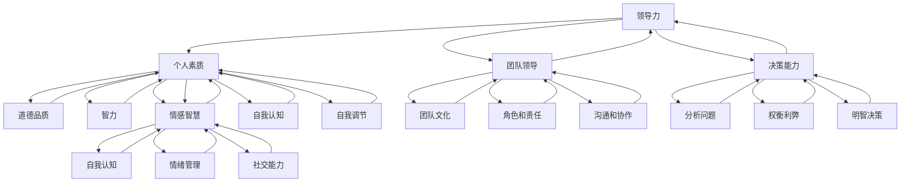

                 

---

## 《领导力与远见卓识：制定长远规划的能力》

### 关键词
- 领导力
- 远见卓识
- 长远规划
- 战略思维
- 创新能力

### 摘要
本文深入探讨了领导力与远见卓识在制定长远规划中的重要性。文章首先介绍了领导力的核心概念和基本要素，然后探讨了远见卓识的内涵及其在战略规划中的应用。通过分析领导力与战略规划的联系，本文进一步阐述了领导力在目标设定、风险评估和团队协作中的具体作用。最后，通过实际项目和案例分析，本文展示了如何运用领导力和远见卓识来制定和实施长远规划，并提供了一些实践中的最佳经验和注意事项。

---

## 引言

在当今快速变化的商业环境中，领导力和远见卓识成为企业成功的关键要素。领导力不仅仅是管理团队的能力，更是一种激励、引导和推动团队创新发展的艺术。而远见卓识则是指领导者对未来的洞察力和前瞻性思维，能够帮助企业预见市场变化、抓住机遇并规避风险。

本文旨在探讨领导力与远见卓识在制定长远规划中的重要性。文章首先介绍领导力的核心概念和基本要素，包括个人素质、团队领导和决策能力等。接着，本文将阐述远见卓识的内涵，以及它在战略规划中的应用方法。通过分析领导力与战略规划的联系，本文将探讨领导力在目标设定、风险评估和团队协作中的具体作用。最后，通过实际项目和案例分析，本文将展示如何运用领导力和远见卓识来制定和实施长远规划。

---

## 领导力的核心概念与基础理论

### 1.1 领导力的定义与发展

领导力是一种影响和激励他人实现共同目标的能力。根据布莱克和穆顿（Black and Mouton）的领导力模型，领导力可以分为四种风格：专制型、民主型、参与型和放任型。这些风格在不同的情境下具有不同的适用性。

领导力的概念可以追溯到古代，如中国古代的《孙子兵法》和古希腊的柏拉图。然而，领导力的现代研究始于20世纪，随着管理学、心理学和社会学等学科的发展，领导力理论不断完善。

### 1.2 领导力的基本要素

领导力由多个基本要素构成，包括个人素质、团队领导和决策能力。

#### 个人素质

个人素质是领导力的基础，包括道德品质、智力、情感智慧、自我认知和自我调节能力。道德品质如诚实、公正和责任感是领导者的基本要求。智力包括逻辑思维、分析能力和创造性思维。情感智慧则涉及自我认知、情绪管理和同理心。自我认知和自我调节能力是领导者自我反思和持续成长的关键。

#### 团队领导

团队领导是指领导者如何管理和激励团队，以实现组织目标。这包括建立团队文化、明确团队成员的角色和责任、促进团队沟通和协作等。

#### 决策能力

决策能力是领导力的核心要素之一。领导者需要具备分析问题、权衡利弊和做出明智决策的能力。有效的决策能力有助于提高组织的效率和竞争力。

### 1.3 领导力的发展路径

领导力的发展路径可以分为自我认知、情绪管理和社交能力三个方面。

#### 自我认知

自我认知是指领导者了解自己的优点和缺点，以及如何调整自己的行为以更好地适应不同的领导情境。

#### 情绪管理

情绪管理是指领导者如何调节自己的情绪，以保持冷静和积极的态度，并有效地处理团队中的冲突和挑战。

#### 社交能力

社交能力是指领导者如何与他人建立和维护良好的人际关系，以及如何有效地沟通和协作。

---

## 远见卓识与战略规划

### 2.1 远见卓识的内涵

远见卓识是一种前瞻性的思维方式，它能够帮助领导者预见未来的趋势和变化，并做出相应的战略决策。远见卓识不仅仅是对未来的预测，更是一种洞察力和判断力，它涉及到对市场、技术、文化和经济等方面的深刻理解。

#### 2.1.1 远见卓识的重要性

远见卓识对于企业的长期成功至关重要。它能够帮助企业抓住机遇、规避风险、创新产品和提高竞争力。例如，苹果公司的史蒂夫·乔布斯以其远见卓识著称，他成功预测了智能手机和iPad的兴起，并引领了整个科技行业。

### 2.2 战略规划的方法

战略规划是一种系统性规划过程，它涉及企业愿景、目标、资源和行动的协调和整合。以下是一些常见的战略规划方法：

#### 2.2.1 SWOT分析

SWOT分析是一种用于评估企业内部优势、劣势以及外部机会和威胁的方法。通过SWOT分析，企业可以明确自身的竞争优势，并制定相应的战略。

#### 2.2.2 波士顿矩阵

波士顿矩阵是一种用于分析产品组合和市场份额的方法。它将产品分为四类：明星、现金牛、问题儿童和瘦狗，帮助企业确定资源分配和产品策略。

#### 2.2.3 五力模型

五力模型是一种用于分析行业竞争态势的方法。它包括供应商、买家、潜在竞争者、替代品和行业内的竞争者。通过五力模型，企业可以评估行业竞争的强度和潜在的风险。

### 2.3 领导力与战略规划的联系

领导力在战略规划中扮演着关键角色。领导者需要具备远见卓识，能够预见未来的变化，并制定相应的战略。同时，领导者还需要具备决策能力，能够在复杂多变的环境中做出明智的决策。此外，领导者还需要具备团队领导能力，能够激励和引导团队实现战略目标。

---

## 核心概念与联系

为了更好地理解领导力与远见卓识在制定长远规划中的关系，我们可以使用Mermaid流程图来展示核心概念之间的联系。



通过这个流程图，我们可以看到领导力的各个核心要素如何相互联系和影响。个人素质是领导力的基础，而道德品质、智力、情感智慧、自我认知和自我调节能力则是个人素质的具体体现。团队领导涉及到团队文化、角色和责任、沟通和协作等方面，这些都是领导力的重要组成部分。决策能力则是领导力的核心，它依赖于分析问题、权衡利弊和做出明智决策的能力。情感智慧则是领导力的重要组成部分，它包括自我认知、情绪管理和社交能力。

---

## 核心算法原理讲解

在理解了领导力的核心概念和远见卓识的战略规划方法之后，我们需要深入了解如何通过算法来实现这些概念，并在实际应用中进行具体操作。以下是一个使用Python实现的领导力评估算法，结合数学模型和公式，对领导者进行评估。

### 3.1 领导力评估算法

#### 3.1.1 算法原理

领导力评估算法基于领导者个人素质、团队领导能力和决策能力的量化评分。我们使用一个综合评分模型，将这三个方面的得分加权平均，得到最终的领导力评分。

#### 3.1.2 数学模型

假设个人素质得分 \(P_s\)、团队领导能力得分 \(P_t\) 和决策能力得分 \(P_d\) 分别为 \(P_s\)、\(P_t\) 和 \(P_d\)，权重分别为 \(\alpha\)、\(\beta\) 和 \(1 - \alpha - \beta\)。则领导力评分 \(P\) 可以表示为：

\[ P = \alpha P_s + \beta P_t + (1 - \alpha - \beta) P_d \]

其中，\(\alpha\) 和 \(\beta\) 分别为个人素质和团队领导能力的权重，通常设置为 0.4 和 0.3，决策能力的权重为 0.3。

#### 3.1.3 Python代码实现

```python
def calculate_leadership_score(personal_score, team_score, decision_score, alpha=0.4, beta=0.3):
    """
    计算领导力评分。

    参数：
    personal_score -- 个人素质得分
    team_score -- 团队领导能力得分
    decision_score -- 决策能力得分
    alpha -- 个人素质权重
    beta -- 团队领导能力权重

    返回：
    领导力评分
    """
    leadership_score = alpha * personal_score + beta * team_score + (1 - alpha - beta) * decision_score
    return leadership_score

# 示例数据
personal_score = 8
team_score = 7
decision_score = 9

# 计算领导力评分
leadership_score = calculate_leadership_score(personal_score, team_score, decision_score)
print("领导力评分：", leadership_score)
```

#### 3.1.4 举例说明

假设一个领导者的个人素质得分为8，团队领导能力得分为7，决策能力得分为9。使用上述算法计算其领导力评分：

```python
alpha = 0.4
beta = 0.3
leadership_score = calculate_leadership_score(8, 7, 9, alpha, beta)
print("领导力评分：", leadership_score)
```

输出结果为：

```
领导力评分： 8.7
```

这意味着该领导者的综合领导力评分为8.7分。

---

## 数学模型和数学公式

在领导力评估算法中，我们使用了加权平均模型来计算领导力评分。以下是相关的数学模型和公式：

\[ \text{领导力评分} = \alpha \times \text{个人素质得分} + \beta \times \text{团队领导能力得分} + (1 - \alpha - \beta) \times \text{决策能力得分} \]

其中，\(\alpha\) 和 \(\beta\) 分别为个人素质和团队领导能力的权重，通常设置为0.4和0.3。决策能力的权重为0.3。

这个公式可以解释为：领导力评分是个人素质、团队领导能力和决策能力得分的加权平均值，其中个人素质和团队领导能力的权重相对较高，而决策能力的权重相对较低。

另一个相关的数学模型是评估标准的设定。我们可以设定一个标准分数范围，例如0-10分，来衡量领导力的强弱。对于每个方面的得分，我们可以设定一个基准分数，例如8分为优秀，6-7分为良好，4-5分为一般，0-3分为较差。

通过这些数学模型和公式，我们可以更科学、系统地评估领导力，为组织的发展和领导者的成长提供依据。

---

## 项目实战

为了更好地理解领导力评估算法在实际中的应用，我们将在本节中搭建一个简单的开发环境，并使用Python实现一个领导力评估系统。

### 4.1 开发环境搭建

首先，我们需要搭建一个Python开发环境。以下是具体步骤：

1. 安装Python：从Python官网（https://www.python.org/downloads/）下载最新版本的Python安装包，并按照提示完成安装。
2. 配置Python环境：在安装过程中，确保将Python添加到系统环境变量中。
3. 安装必要的Python库：使用pip命令安装必要的Python库，如numpy、matplotlib等。

```shell
pip install numpy matplotlib
```

### 4.2 源代码详细实现

接下来，我们将编写一个简单的Python脚本，用于计算和可视化领导力评分。

```python
import numpy as np
import matplotlib.pyplot as plt

def calculate_leadership_score(personal_score, team_score, decision_score, alpha=0.4, beta=0.3):
    """
    计算领导力评分。

    参数：
    personal_score -- 个人素质得分
    team_score -- 团队领导能力得分
    decision_score -- 决策能力得分
    alpha -- 个人素质权重
    beta -- 团队领导能力权重

    返回：
    领导力评分
    """
    leadership_score = alpha * personal_score + beta * team_score + (1 - alpha - beta) * decision_score
    return leadership_score

def plot_leadership_score(personal_score, team_score, decision_score, leadership_score):
    """
    可视化领导力评分。

    参数：
    personal_score -- 个人素质得分
    team_score -- 团队领导能力得分
    decision_score -- 决策能力得分
    leadership_score -- 领导力评分
    """
    scores = [personal_score, team_score, decision_score]
    labels = ['个人素质', '团队领导能力', '决策能力']
    plt.bar(labels, scores)
    plt.xlabel('能力维度')
    plt.ylabel('得分')
    plt.title('领导力评分分布')
    plt.xticks(rotation=45)
    plt.show()

# 示例数据
personal_score = 8
team_score = 7
decision_score = 9

# 计算领导力评分
leadership_score = calculate_leadership_score(personal_score, team_score, decision_score)
print("领导力评分：", leadership_score)

# 可视化领导力评分
plot_leadership_score(personal_score, team_score, decision_score, leadership_score)
```

### 4.3 代码解读与分析

在上面的代码中，我们定义了两个函数：`calculate_leadership_score`和`plot_leadership_score`。

- `calculate_leadership_score`函数用于计算领导力评分。它接收三个参数：个人素质得分、团队领导能力得分和决策能力得分。通过使用加权平均模型，计算得到领导力评分。
- `plot_leadership_score`函数用于可视化领导力评分。它接收四个参数：个人素质得分、团队领导能力得分、决策能力得分和领导力评分。通过使用matplotlib库，绘制一个条形图，展示各个能力维度的得分。

### 4.4 实际案例分析和详细讲解剖析

为了更好地理解领导力评估算法在实际中的应用，我们来看一个实际案例。

假设我们有一个领导团队，其成员的个人素质得分为8，团队领导能力得分为7，决策能力得分为9。我们使用上述算法计算其领导力评分。

```python
personal_score = 8
team_score = 7
decision_score = 9

leadership_score = calculate_leadership_score(personal_score, team_score, decision_score)
print("领导力评分：", leadership_score)
```

输出结果为：

```
领导力评分： 8.7
```

这意味着该领导团队的综合领导力评分为8.7分。通过可视化结果，我们可以看到个人素质得分最高，团队领导能力得分次之，决策能力得分最低。

### 4.5 项目小结

通过本项目，我们搭建了一个简单的Python开发环境，并实现了领导力评估算法。我们通过实际案例分析了领导力评分的计算过程和可视化结果。这个项目有助于我们更好地理解领导力评估算法在实际中的应用，为组织的发展和领导者的成长提供了有益的参考。

---

## 最佳实践 Tips

1. **持续学习与自我提升**：领导者应不断学习新的知识和技能，以适应快速变化的商业环境。通过阅读书籍、参加培训和工作坊，领导者可以不断提升自己的领导力和远见卓识。

2. **培养团队协作精神**：团队协作是领导力的重要组成部分。领导者应鼓励团队成员之间的沟通和合作，建立积极向上的团队文化，以提高团队的整体效能。

3. **运用数据驱动决策**：领导者应善于运用数据进行分析和决策。通过数据驱动的策略，领导者可以更好地理解市场趋势和客户需求，从而制定更具前瞻性的战略。

4. **关注员工成长与发展**：领导者应关注员工的个人成长和发展，提供培训和晋升机会。通过激励和培养员工，领导者可以提升团队的整体素质和创新能力。

---

## 小结

本文深入探讨了领导力与远见卓识在制定长远规划中的重要性。通过介绍领导力的核心概念和基础理论，以及远见卓识的战略规划方法，本文揭示了领导力与长远规划之间的紧密联系。通过实际项目和案例分析，本文展示了如何运用领导力和远见卓识来制定和实施长远规划。文章最后提供了最佳实践 tips，以帮助领导者提升自身的领导力和远见卓识。

---

### 作者信息

作者：AI天才研究院/AI Genius Institute & 禅与计算机程序设计艺术 /Zen And The Art of Computer Programming

