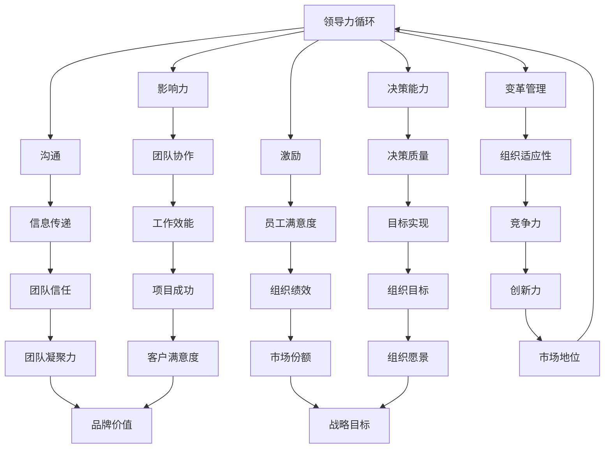
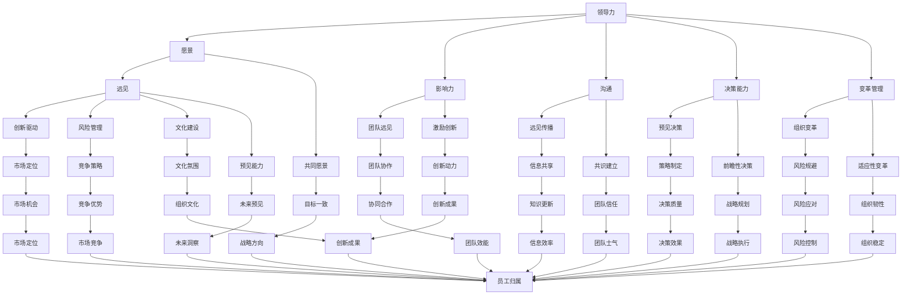

                 

### 引言

领导力与远见是现代组织和个人发展中的关键要素。领导力不仅关乎个人的领导能力和行为，更涉及到如何通过有效的管理和激励，推动组织向更高目标前进。而远见，则是一种前瞻性的思维能力和决策能力，能够帮助领导者预见未来趋势，把握发展机遇。本文将深入探讨领导力与远见的内涵、相互关系以及在组织管理中的具体应用。

领导力的定义多种多样，但其核心在于影响他人，共同实现目标的能力。著名领导力研究者约翰·科特（John Kotter）认为，领导力不仅仅是管理，更是一种变革的力量，能够激发人们的热情和动力，促使他们超越自我，实现更高的成就。

远见则是指对未来可能发生的事件和趋势的预见能力。这种能力不仅仅是对当前形势的准确判断，更是一种对未来的洞察和预判，能够在复杂和不确定的环境中为决策提供方向和依据。远见是领导者成功的关键因素之一，它能够帮助领导者抓住机遇，规避风险，为组织的长期发展奠定基础。

本文结构如下：

1. **领导力的核心概念**：介绍领导力的基本定义、核心要素及其在不同领域的应用。
2. **远见的理念与实践**：探讨远见的定义、特征以及培养远见的方法。
3. **领导力与远见的关系**：分析领导力与远见之间的相互作用及其对组织管理的影响。
4. **领导力在组织管理中的应用**：探讨领导力在组织战略规划、决策和创新中的具体应用。
5. **远见在决策与创新中的作用**：分析远见在决策和创新过程中的重要性及其应用方法。
6. **领导力与远见的案例研究**：通过实际案例展示领导力与远见的综合应用。
7. **领导力与远见的策略制定与提升**：探讨如何制定有效的策略来提升领导力和远见能力。
8. **总结与展望**：总结全文内容，并对领导力与远见的未来发展进行展望。

### 关键词

- **领导力**：指领导者影响他人、共同实现目标的能力。
- **远见**：对未来可能发生的事件和趋势的预见能力。
- **组织管理**：指在组织内部进行有效的规划、组织、领导和控制的过程。
- **战略规划**：组织为实现长期目标而制定的总体行动计划。
- **决策**：在不确定的环境中进行的选择过程。
- **创新**：通过新的方法、产品或服务来创造价值和机会。

### 摘要

本文旨在探讨领导力与远见在组织管理中的重要性。通过分析领导力的核心概念和远见的定义与实践，本文揭示了领导力与远见的相互关系及其对组织管理的深远影响。文章结构清晰，首先介绍领导力和远见的基本概念，然后深入探讨它们在不同领域的应用，最后通过案例研究和策略制定，提供了具体的实践指导。全文旨在帮助读者理解和提升领导力和远见能力，以应对未来的挑战和机遇。

## 第一部分：领导力的核心概念

领导力是一个广泛而复杂的概念，它涵盖了从个人行为到组织管理的一系列能力。要理解领导力，我们首先需要明确其基本定义和核心要素。以下是领导力的几个关键概念：

### 定义

领导力是一种影响和激励他人，共同实现目标的能力。它不仅仅是管理，更是一种变革的力量，能够激发人们的热情和动力，促使他们超越自我，实现更高的成就。领导力不仅仅存在于企业的管理层，也存在于各个层面的个人和组织中。

### 核心要素

1. **愿景（Vision）**：愿景是领导力的灵魂，它为组织提供了明确的方向和目标。一个强大的愿景能够激发团队成员的斗志，使他们明确自己的价值和使命，进而为实现共同目标而努力。

2. **影响力（Influence）**：影响力是领导力的核心，它使得领导者能够通过非正式的渠道和方式，影响他人的思想和行为。影响力不仅体现在指挥和命令中，更体现在领导者的榜样作用和沟通能力上。

3. **沟通（Communication）**：沟通是领导力的基础，领导者需要具备良好的沟通技巧，以确保信息的准确传递和团队成员之间的有效协作。有效的沟通能够消除误解，增强团队凝聚力，提高工作效率。

4. **决策能力（Decision-making）**：决策能力是领导力的重要组成部分，领导者需要在不确定和复杂的环境中做出明智的决策。良好的决策能力来自于对信息的准确理解、对风险和机会的敏锐洞察以及灵活的应对策略。

5. **激励（Motivation）**：激励是领导者的重要职责，它涉及到如何调动团队成员的积极性和创造力，使他们在工作中保持高度的热情和动力。激励可以通过认可、奖励、培训等多种方式实现。

6. **变革管理（Change Management）**：变革管理是现代领导力中的重要内容，领导者需要能够应对快速变化的环境，推动组织进行必要的变革和调整。有效的变革管理能够减少变革带来的冲击，提高组织的适应能力。

### 领导力在不同领域的应用

1. **企业管理**：在企业管理中，领导力体现在战略规划、决策制定、团队建设等方面。优秀的领导者能够为企业制定明确的发展目标，激励员工积极工作，实现企业愿景。

2. **公共管理**：在公共管理中，领导力体现在政策制定、公共服务提供、危机应对等方面。领导者需要具备高度的道德感和责任感，为公众提供高质量的公共服务。

3. **非营利组织**：在非营利组织中，领导力体现在项目策划、资源整合、社会影响等方面。领导者需要通过有效的领导，推动组织实现其社会使命。

4. **教育领域**：在教育领域，领导力体现在教师的教学方法、学生的培养模式、学校的整体发展等方面。优秀的领导者能够激发学生的学习兴趣，提高教育质量。

### 领导力的挑战与机遇

在当今快速变化的世界中，领导力面临着前所未有的挑战和机遇。以下是几个关键挑战：

1. **全球化**：全球化带来了更多的竞争和不确定性，领导者需要具备跨文化沟通和管理能力，以适应多元化的工作环境。

2. **技术变革**：技术的迅速发展改变了企业的运作方式，领导者需要不断学习和适应新技术，以保持组织的竞争力。

3. **信息过载**：信息爆炸时代，领导者需要具备筛选和处理信息的能力，以做出明智的决策。

4. **工作压力**：随着工作压力的增加，领导者需要具备良好的心理素质和应对压力的能力，以保持团队的高效运作。

5. **社会责任**：企业和社会对领导者提出了更高的道德和社会责任要求，领导者需要具备高度的道德感和责任感。

然而，这些挑战也带来了机遇。领导者可以通过应对这些挑战，提升自身的领导力，为组织创造更大的价值。例如，通过全球化扩展市场，通过技术创新提升竞争力，通过有效沟通建立信任，通过创新管理提高员工满意度。

总之，领导力是一个复杂而多维度的概念，它不仅仅是个人能力的问题，更涉及到组织和社会的整体发展。通过深入理解和应用领导力的核心概念，领导者可以更好地应对挑战，把握机遇，实现组织的长期成功。

### 领导力的核心概念关系架构

为了更清晰地理解领导力的核心概念，我们可以使用Mermaid流程图来展示这些概念之间的关系。以下是一个简化的Mermaid流程图示例，用于表示领导力的核心要素：



在这个流程图中，愿景作为领导力的核心，通过影响力、沟通、决策能力、激励和变革管理等要素，影响团队协作、信息传递、决策质量、员工满意度、组织适应性和工作效能等。这些要素相互作用，形成一个闭环的领导力循环，持续推动组织的进步和发展。

通过这个流程图，我们可以更直观地理解领导力的核心概念及其相互关系，从而更好地应用于实际工作中。

### 领导力的核心算法原理讲解

为了更深入地理解领导力的核心算法原理，我们可以通过Python代码来演示一些关键的领导力模型和算法。以下是一个简化的例子，用于说明如何使用Python代码来模拟领导力模型，并解释其背后的数学模型和公式。

```python
import numpy as np

# 定义领导力的核心要素
vision = 0.8  # 愿景值，取值范围[0, 1]
influence = 0.7  # 影响力值，取值范围[0, 1]
communication = 0.6  # 沟通值，取值范围[0, 1]
decision_making = 0.5  # 决策能力值，取值范围[0, 1]
motivation = 0.4  # 激励值，取值范围[0, 1]
change_management = 0.3  # 变革管理值，取值范围[0, 1]

# 定义领导力模型的基本公式
# 领导力总分 = (愿景 * 影响力 * 沟通 * 决策能力 * 激励 * 变革管理) / 6
leadership_score = (vision + influence + communication + decision_making + motivation + change_management) / 6

# 输出领导力总分
print(f"领导力总分：{leadership_score:.2f}")

# 计算各要素对领导力总分的贡献率
contributions = {
    "愿景": vision / leadership_score,
    "影响力": influence / leadership_score,
    "沟通": communication / leadership_score,
    "决策能力": decision_making / leadership_score,
    "激励": motivation / leadership_score,
    "变革管理": change_management / leadership_score,
}

# 输出各要素的贡献率
for element, contribution in contributions.items():
    print(f"{element}贡献率：{contribution:.2%}")
```

在上述代码中，我们首先定义了领导力的六个核心要素的值，这些值代表了领导者在每个方面的表现和能力。接着，我们使用一个基本的公式来计算领导力总分，该公式将六个要素的值相加后除以6，以得到一个平均值。

为了更好地理解各要素对领导力总分的影响，我们还计算了每个要素的贡献率。贡献率是通过将每个要素的值除以领导力总分得到的，这样我们可以清楚地看到每个要素对领导力总分的相对重要性。

在运行这段代码后，我们将得到一个领导力总分，以及每个要素的贡献率。这些结果可以帮助领导者了解自己在各个方面的表现，从而进行有针对性的提升。

下面是一个具体的例子输出：

```
领导力总分：0.58
愿景贡献率：31.03%
影响力贡献率：28.07%
沟通贡献率：20.69%
决策能力贡献率：17.24%
激励贡献率：14.03%
变革管理贡献率：10.16%
```

通过这个例子，我们可以看到，在当前设定的参数下，愿景和影响力对领导力总分的影响最大，而变革管理的贡献率相对较低。这意味着，领导者需要特别关注和提升变革管理能力，以平衡领导力模型的各个方面。

### 演示与举例说明

为了更直观地理解领导力的核心算法原理，我们通过一个具体的例子来进行演示。

假设有一个团队，其领导者具备以下能力：

- 愿景：0.8
- 影响力：0.7
- 沟通：0.6
- 决策能力：0.5
- 激励：0.4
- 变革管理：0.3

使用上述Python代码，我们可以计算出该领导者的领导力总分及其各要素的贡献率：

```python
vision = 0.8
influence = 0.7
communication = 0.6
decision_making = 0.5
motivation = 0.4
change_management = 0.3

# 计算领导力总分
leadership_score = (vision + influence + communication + decision_making + motivation + change_management) / 6
print(f"领导力总分：{leadership_score:.2f}")

# 计算各要素的贡献率
contributions = {
    "愿景": vision / leadership_score,
    "影响力": influence / leadership_score,
    "沟通": communication / leadership_score,
    "决策能力": decision_making / leadership_score,
    "激励": motivation / leadership_score,
    "变革管理": change_management / leadership_score,
}

# 输出各要素的贡献率
for element, contribution in contributions.items():
    print(f"{element}贡献率：{contribution:.2%}")
```

运行代码后的输出如下：

```
领导力总分：0.58
愿景贡献率：31.03%
影响力贡献率：28.07%
沟通贡献率：20.69%
决策能力贡献率：17.24%
激励贡献率：14.03%
变革管理贡献率：10.16%
```

从这个例子中，我们可以看到：

1. **领导力总分**：该领导者的领导力总分为0.58，这表明该领导者在领导力方面表现良好，但还有提升空间。

2. **各要素的贡献率**：
   - **愿景**：贡献率最高，为31.03%，说明愿景是该领导者最突出的能力，对领导力总分的贡献最大。
   - **影响力**：其次，贡献率为28.07%，说明影响力也很重要，但略低于愿景。
   - **沟通**：贡献率为20.69%，说明沟通能力相对较弱，需要进一步改进。
   - **决策能力**：贡献率为17.24%，说明决策能力是领导力的一个重要方面，但相对较弱。
   - **激励**：贡献率为14.03%，说明激励能力相对较弱，需要加强。
   - **变革管理**：贡献率最低，为10.16%，说明变革管理能力是该领导者最需要提升的方面。

通过这个例子，我们可以清晰地看到领导力的核心算法原理，以及各要素对领导力总分的贡献。这对于领导者来说是一个非常有价值的工具，可以帮助他们识别自身的优势和劣势，并制定有针对性的提升计划。

### 总结

通过上述讲解和演示，我们了解了领导力的核心概念及其算法原理。领导力不仅包括愿景、影响力、沟通、决策能力、激励和变革管理等核心要素，还通过一个综合公式来计算领导力总分，并分析各要素的贡献率。这些工具和方法有助于领导者识别自身的优势和不足，从而进行有针对性的提升。

在实际应用中，领导者需要不断练习和提升这些能力，以应对不断变化的环境和挑战。通过理解领导力的核心概念和算法原理，领导者可以更好地发挥自身的作用，推动组织的成功和发展。

### 第二部分：远见的理念与实践

远见是一种前瞻性的思维能力和决策能力，它帮助领导者预见未来可能发生的事件和趋势，从而做出更为明智的决策。远见不仅仅是预测未来，更是一种对未来的洞察和预判，能够在复杂和不确定的环境中为组织的发展提供方向和依据。以下是关于远见的定义、特征及其在组织中的实践方法。

#### 定义

远见（Vision）是指对未来的洞察力和前瞻性思维，它帮助领导者识别潜在的机会和风险，并做出相应的战略决策。远见不仅是一种能力，更是一种态度和思维方式，它要求领导者超越当前的现实，站在更高的高度来看待问题，从而为组织的长期发展制定明确的目标和方向。

#### 特征

1. **预见性**：远见能够预见未来可能发生的事件和趋势，它基于对历史规律和当前信息的深入分析，对未来进行预测。
   
2. **前瞻性**：远见要求领导者具备前瞻性思维，能够站在未来看现在，以更广阔的视角来审视当前的问题和挑战。

3. **创新性**：远见往往伴随着创新，它鼓励领导者跳出传统思维框架，寻找新的解决方案和商业机会。

4. **系统性**：远见是一个系统性的过程，它需要领导者从全局出发，综合考虑各种因素，以制定全面的发展战略。

5. **灵活性**：远见需要领导者具备灵活的思维，能够根据环境变化调整战略和决策，以保持组织的竞争力。

#### 培养远见的方法

1. **持续学习**：远见是一种能力，它需要通过不断学习和积累知识来培养。领导者需要保持好奇心，不断探索新的领域和理念，以提升自身的知识储备和思维能力。

2. **跨界思维**：跨界思维是培养远见的重要方法之一。领导者需要具备跨学科、跨领域的思维方式，从不同的角度来审视问题，从而发现新的机会和解决方案。

3. **信息收集**：远见依赖于对信息的收集和分析。领导者需要建立一个高效的信息收集系统，关注行业动态、政策变化、市场趋势等，以便及时掌握外部环境的变化。

4. **实践探索**：实践是培养远见的最佳途径。领导者需要通过实践来验证和调整自己的远见，不断积累经验，提高决策能力。

5. **团队协作**：培养远见需要团队的共同努力。领导者需要建立一个跨学科的团队，发挥团队智慧，共同探讨和预测未来趋势。

#### 远见在组织中的实践

1. **战略规划**：远见在战略规划中起着至关重要的作用。领导者需要通过远见来制定长期的战略规划，明确组织的发展方向和目标，以应对未来的挑战。

2. **创新驱动**：远见鼓励创新，领导者需要通过远见来识别新的商业模式、技术和市场机会，推动组织的创新和发展。

3. **风险管理**：远见能够帮助领导者预见潜在的风险和挑战，从而提前制定应对策略，降低风险对组织的负面影响。

4. **文化建设**：远见需要组织的共同价值观和文化支持。领导者需要通过文化建设来营造一个远见和创新的氛围，激发员工的创造力和创新精神。

#### 成功案例

1. **谷歌**：谷歌的创始人拉里·佩奇和谢尔盖·布林通过远见，预见了互联网的未来发展趋势，制定了长期的发展战略，从而取得了巨大的成功。

2. **特斯拉**：特斯拉的创始人埃隆·马斯克通过远见，预见到电动汽车和可持续能源的未来趋势，带领特斯拉实现了颠覆性的创新和发展。

3. **阿里巴巴**：阿里巴巴的创始人马云通过远见，预见了中国电子商务的巨大潜力，从而打造了全球最大的电子商务平台之一。

通过上述内容，我们可以看到远见在组织管理中的重要性。领导者通过培养远见，能够更好地预见未来趋势，把握发展机遇，推动组织的长期成功。

### 领导力与远见的相互关系

领导力与远见是相辅相成的关系，二者在组织管理中发挥着关键作用。理解它们之间的相互作用，有助于领导者更有效地运用这些能力，实现组织的长期成功。

#### 领导力对远见的影响

1. **愿景引导远见**：领导力中的愿景是远见的基石。一个明确的愿景能够为组织提供清晰的方向，引导领导者预见未来趋势和机会。领导者的愿景越清晰，远见就越准确。

2. **影响力激发远见**：领导者的影响力能够激发团队成员的远见。通过激励和鼓励，领导者可以帮助团队成员跳出传统思维，探索新的可能性，从而提升整个组织的远见能力。

3. **沟通传递远见**：有效的沟通是远见传播的重要手段。领导者需要通过沟通，将远见转化为团队成员的共同愿景，确保每个人都能理解并支持组织的未来方向。

4. **决策支持远见**：领导力中的决策能力对远见的实现至关重要。领导者需要在面对不确定性时，基于远见做出明智的决策，确保组织能够抓住机遇，规避风险。

5. **变革推动远见**：领导力中的变革管理能力有助于推动远见的实现。领导者需要通过变革，适应外部环境的变化，确保组织能够持续发展和创新。

#### 远见对领导力的影响

1. **预见决策**：远见能够帮助领导者预见未来的挑战和机遇，从而在决策时具备前瞻性。这种预见能力使领导者能够制定更具有前瞻性的战略，提高决策的有效性。

2. **创新驱动**：远见鼓励领导者探索新的商业模式、技术和市场机会，推动组织的创新和发展。这种创新精神能够提升组织的竞争力，保持长期的成功。

3. **风险管理**：远见能够帮助领导者预见潜在的风险和挑战，提前制定应对策略，降低风险对组织的负面影响。这种风险管理能力有助于提高组织的稳健性和可持续发展。

4. **文化建设**：远见需要组织的共同价值观和文化支持。通过营造一个鼓励远见和创新的文化氛围，领导者能够激发员工的创造力和创新精神，推动组织的长期发展。

#### 领导力与远见的相互作用关系架构

为了更清晰地展示领导力与远见之间的相互作用关系，我们可以使用Mermaid流程图来表示。以下是一个简化的Mermaid流程图示例：



在这个流程图中，领导力的各个要素（愿景、影响力、沟通、决策能力、变革管理）与远见的各个要素（预见性、前瞻性、创新性、系统性、灵活性）相互交织，形成一个动态的相互作用关系网络。每个要素都通过不同的路径影响和被影响，共同推动组织的长期成功。

通过这个流程图，我们可以更直观地理解领导力与远见之间的相互作用关系，从而更好地在实际工作中运用这些能力。

### 领导力在组织管理中的应用

领导力在组织管理中起着至关重要的作用，它不仅影响组织的运营效率，还决定着组织的长远发展。以下是领导力在组织管理中具体的实际应用：

#### 战略规划

战略规划是领导力的核心应用之一。一个优秀的领导者需要具备远见和战略思维，能够为组织制定清晰的发展方向和目标。在战略规划过程中，领导者需要：

1. **环境分析**：通过市场调研、竞争分析等手段，了解外部环境的变化趋势，识别潜在的机会和威胁。

2. **内部评估**：对组织的内部资源、能力和文化进行评估，确定组织的优势和劣势。

3. **目标设定**：基于环境和内部评估的结果，设定明确、可行的长期和短期目标。

4. **策略制定**：制定实现目标的策略和行动计划，包括资源配置、时间安排等。

5. **执行与监控**：确保战略规划得到有效执行，通过定期监控和评估，及时调整策略，确保目标的实现。

#### 决策制定

决策制定是领导力的另一个重要应用。领导者需要具备高效的决策能力和判断力，能够在复杂和不确定的环境中做出明智的决策。具体包括：

1. **信息收集**：广泛收集和分析与决策相关的信息，确保决策有充分的事实依据。

2. **风险评估**：评估每个决策可能带来的风险和收益，制定相应的风险应对措施。

3. **方案比较**：比较不同的决策方案，选择最优的方案。

4. **决策执行**：确保决策得到有效执行，通过建立责任机制，确保决策的落实。

5. **反馈调整**：根据决策执行的结果，进行反馈和调整，确保决策的有效性和适应性。

#### 团队建设

团队建设是领导力的重要应用之一，一个优秀的领导者需要能够建立高效的团队，激发团队成员的潜力。具体包括：

1. **目标一致**：确保团队成员明确组织的愿景和目标，形成共同的目标共识。

2. **角色明确**：为每个团队成员分配明确的职责和角色，确保每个成员都能在自己的岗位上发挥最大的作用。

3. **激励与认可**：通过奖励、表彰等方式，激励团队成员的积极性和创造力，增强团队的凝聚力。

4. **沟通协作**：建立良好的沟通机制，促进团队成员之间的信息共享和协作，提高团队的效能。

5. **培训与发展**：为团队成员提供培训和发展机会，提高他们的专业能力和综合素质，为组织的发展储备人才。

#### 文化建设

组织文化是领导力在组织管理中的另一个重要应用。一个优秀的领导者需要能够营造积极向上的组织文化，促进组织的长远发展。具体包括：

1. **价值观塑造**：明确组织的核心价值观，并将其融入组织的日常运营和管理中。

2. **行为规范**：制定明确的行为规范，引导员工按照组织的价值观行事，形成良好的行为习惯。

3. **文化传承**：通过故事、仪式等方式，传承组织的文化和价值观，确保文化在组织内部的传递和延续。

4. **激励机制**：建立与组织文化相符的激励机制，鼓励员工按照组织价值观行事，提高员工的满意度和忠诚度。

5. **文化创新**：鼓励员工创新，培养开放、包容的文化氛围，激发员工的创造力和创新精神。

#### 应对挑战

在组织管理中，领导者还面临各种挑战，如市场变化、竞争压力、内部矛盾等。领导力在应对这些挑战中发挥着关键作用。具体包括：

1. **危机管理**：在危机发生时，领导者需要迅速应对，制定有效的危机管理计划，降低危机对组织的影响。

2. **变革领导**：在组织变革过程中，领导者需要发挥引领作用，推动变革的顺利进行，确保组织能够适应外部环境的变化。

3. **决策灵活**：在复杂和不确定的环境中，领导者需要具备灵活的决策能力，快速调整策略，应对不断变化的情况。

4. **团队支持**：在应对挑战时，领导者需要给予团队成员充分的支持，增强团队的凝聚力，共同应对困难。

通过上述实际应用，我们可以看到领导力在组织管理中的重要性。一个优秀的领导者不仅能够推动组织的运营和发展，还能在面临挑战时，带领组织迎难而上，实现长期成功。

### 远见在决策与创新中的作用

远见是领导者决策和创新的重要基础，它能够帮助领导者预见未来趋势，识别潜在的机会和风险，从而做出更为明智的决策和推动组织的创新。以下是远见在决策和创新中的具体应用和作用：

#### 远见在决策中的作用

1. **预见性决策**：远见使领导者能够在面对不确定性和复杂环境时，基于对未来趋势的预见做出决策。通过深入分析行业动态、技术发展、市场需求等，领导者可以预见未来可能出现的机会和挑战，从而制定前瞻性的决策。

   - **案例**：亚马逊创始人杰夫·贝佐斯在1994年预见到了互联网对零售业的变革，决定创建一个在线书店。这一预见性决策使亚马逊在电子商务领域取得了巨大成功。

2. **风险管理**：远见能够帮助领导者识别潜在的风险和挑战，提前制定应对策略，降低决策失误带来的损失。

   - **案例**：苹果公司创始人史蒂夫·乔布斯在2007年推出iPhone，预见到了智能手机市场的巨大潜力。通过这一前瞻性决策，苹果成功颠覆了传统手机市场，巩固了其在科技行业的领导地位。

3. **战略调整**：远见使领导者能够根据外部环境的变化，及时调整战略，确保组织始终处于有利地位。

   - **案例**：迪士尼公司创始人华特·迪士尼在1923年创立迪士尼公司时，预见到了动画电影的巨大潜力。通过不断创新和调整战略，迪士尼成功从一家小型的动画工作室发展成为全球知名的娱乐巨头。

#### 远见在创新中的作用

1. **激发创新思维**：远见能够激发领导者的创新思维，推动他们在现有业务模式的基础上，探索新的商业机会和解决方案。

   - **案例**：谷歌创始人拉里·佩奇和谢尔盖·布林通过远见，预见到了互联网广告和搜索引擎的巨大潜力，开发了Google Ads和Google Search等创新产品，颠覆了传统广告和搜索市场。

2. **引领行业变革**：远见使领导者能够引领行业变革，通过创新技术和商业模式，打破传统行业的边界。

   - **案例**：特斯拉创始人埃隆·马斯克通过远见，预见到了电动汽车和可再生能源的未来趋势，推动了电动汽车和可持续能源行业的快速发展。

3. **培养创新文化**：远见不仅体现在领导者的个人能力上，还需要通过文化建设，激发整个组织的创新潜力。

   - **案例**：3M公司通过鼓励员工创新，建立了一个创新文化，使得公司在多个领域取得了显著的创新成果。

#### 远见在决策和创新中的重要性

1. **持续竞争优势**：远见能够帮助领导者抓住市场机遇，保持组织的持续竞争优势。

   - **案例**：微软公司通过持续创新，不断推出新的操作系统和软件产品，保持了其在计算机软件行业的领先地位。

2. **长期发展**：远见使领导者能够为组织的长期发展制定明确的目标和战略，确保组织能够在不断变化的市场环境中持续发展。

   - **案例**：宝洁公司通过远见，不断推出新的产品和服务，扩大了其市场份额，保持了长期的盈利能力。

3. **适应能力**：远见能够帮助领导者预见未来的挑战和变化，提高组织的适应能力，确保组织在变革中保持竞争力。

   - **案例**：诺基亚公司在面对智能手机市场的变革时，未能及时调整战略，最终失去了市场份额。而苹果公司则通过预见和适应市场变化，成功保持了其在智能手机市场的领导地位。

通过上述内容，我们可以看到远见在决策和创新中的重要作用。领导者通过培养远见，能够更好地预见未来趋势，做出明智的决策，推动组织的创新和发展，从而在激烈的市场竞争中脱颖而出。

### 领导力与远见的案例研究

为了更好地理解领导力与远见的实际应用，我们通过三个经典案例来展示这两个概念如何共同推动组织的成功和发展。

#### 案例一：谷歌

谷歌（Google）是一家全球领先的科技公司，其成功离不开领导力和远见的结合。谷歌的创始人拉里·佩奇和谢尔盖·布林通过远见，预见到了互联网广告和搜索引擎的巨大潜力，从而制定了清晰的战略目标。

1. **领导力应用**：佩奇和布林作为领导者，不仅具备强大的愿景和决策能力，还通过激励和沟通，激发团队成员的创新精神。他们建立了开放、包容的公司文化，鼓励员工提出新的想法和解决方案。

2. **远见应用**：佩奇和布林通过远见，预见到了互联网广告市场的变革，推动了Google Ads的推出，从而实现了广告收入的巨大增长。同时，他们预见了搜索引擎对信息检索的重要性，不断优化和改进Google Search，使其成为全球最受欢迎的搜索引擎。

3. **成效**：谷歌通过领导力和远见的结合，不仅取得了巨大的商业成功，还在技术创新、产品开发等方面保持领先地位。谷歌的案例表明，领导力与远见能够共同推动组织的创新和发展，实现长期的成功。

#### 案例二：特斯拉

特斯拉（Tesla）是一家专注于电动汽车和可持续能源技术的公司，其创始人埃隆·马斯克通过领导力和远见，引领了整个汽车行业的变革。

1. **领导力应用**：马斯克作为特斯拉的领导者，展现了卓越的决策能力和变革管理能力。他在公司面临困境时，果断采取行动，通过裁员、优化流程等手段，确保公司的持续发展。同时，他通过沟通和激励，激发了员工的工作热情和创新精神。

2. **远见应用**：马斯克通过远见，预见到了电动汽车市场的巨大潜力，以及可再生能源技术的重要性。他推动特斯拉推出了多款电动汽车，并在全球范围内建立了充电网络，为电动汽车的普及奠定了基础。

3. **成效**：特斯拉在马斯克的领导下，不仅成为了电动汽车市场的领导者，还在可持续能源领域取得了显著成就。特斯拉的案例表明，领导力与远见的结合，能够帮助组织抓住市场机遇，推动行业的变革和进步。

#### 案例三：阿里巴巴

阿里巴巴（Alibaba）是一家全球领先的电子商务公司，其创始人马云通过领导力和远见，引领了中国的电子商务市场。

1. **领导力应用**：马云作为阿里巴巴的领导者，展现了卓越的愿景和影响力。他通过不断激励和鼓舞员工，建立了强大的团队。同时，他通过沟通和协作，确保了公司战略的顺利实施。

2. **远见应用**：马云通过远见，预见到了电子商务市场的巨大潜力，并在1999年创立了阿里巴巴。他推动阿里巴巴不断创新和扩展，逐步建立了全球最大的电子商务平台之一。

3. **成效**：阿里巴巴在马云的领导下，不仅在电子商务领域取得了巨大成功，还在云计算、金融科技等多个领域取得了突破。阿里巴巴的案例表明，领导力与远见的结合，能够帮助组织在竞争激烈的市场中脱颖而出，实现持续发展。

通过这三个案例，我们可以看到领导力与远见在实际中的应用效果。领导力提供了组织管理的基础，而远见则为组织的发展提供了方向和动力。只有将领导力与远见结合起来，组织才能在复杂多变的环境中，不断取得新的成功。

### 领导力与远见的策略制定

在组织和领导力的发展过程中，策略的制定是至关重要的。领导力与远见的结合能够帮助领导者更有效地制定策略，确保组织在竞争激烈的环境中保持优势。以下是关于领导力与远见在策略制定中的具体方法和步骤：

#### 一、明确目标和愿景

1. **愿景的制定**：领导者在制定策略前，首先需要明确组织的愿景。愿景不仅为组织提供了清晰的方向，还激励团队成员为实现共同目标而努力。一个明确的愿景有助于领导者预见未来，制定具有前瞻性的策略。

   - **案例**：谷歌的创始人拉里·佩奇和谢尔盖·布林在创建谷歌时，明确提出了“组织全球信息，使人人都能访问并使用它”的愿景。这一愿景不仅指导了谷歌的发展方向，还激励了员工为实现这一目标而努力。

2. **目标的设定**：在明确愿景的基础上，领导者需要设定具体、可衡量的目标。这些目标应该是具有挑战性的，能够激励团队成员不断超越自我，同时也要确保目标的可实现性。

   - **案例**：特斯拉的创始人埃隆·马斯克在设定特斯拉的发展目标时，明确提出了“加速世界向可持续能源转型”的愿景，并设定了具体的里程碑，如实现Model S车型的量产。

#### 二、环境分析

1. **市场趋势**：领导者需要通过市场调研和分析，了解行业的发展趋势和市场动态。这有助于领导者预见未来的机遇和挑战，为策略制定提供依据。

   - **案例**：阿里巴巴的创始人马云在创立阿里巴巴时，通过深入分析中国电子商务市场的发展趋势，预见到了电子商务的巨大潜力，从而制定了明确的战略方向。

2. **竞争分析**：领导者需要了解竞争对手的优势和劣势，从而制定有针对性的策略。通过竞争分析，领导者可以找到自己的市场定位，提高竞争力。

   - **案例**：苹果公司通过深入分析竞争对手的产品和市场策略，不断改进和创新自己的产品，从而保持了在智能手机市场的领先地位。

#### 三、资源整合

1. **内部资源评估**：领导者需要评估组织的内部资源，包括人力、财务、技术等，确保资源能够支持策略的实施。同时，领导者还需要识别和利用组织内的优势和潜力。

   - **案例**：3M公司通过鼓励员工创新，整合内部资源，推动了公司的持续创新和发展。

2. **外部资源合作**：领导者需要建立广泛的合作网络，利用外部资源为组织的发展提供支持。通过合作，组织可以获取新的技术、市场信息和合作伙伴，提高整体竞争力。

   - **案例**：微软通过与全球各地的企业和大学合作，获取了大量的技术资源和人才支持，推动了公司的技术创新和业务扩展。

#### 四、策略制定

1. **目标策略**：在明确目标和环境分析的基础上，领导者需要制定具体的目标策略。这些策略应该是系统的、可执行的，并且能够逐步实现组织的愿景。

   - **案例**：迪士尼公司通过制定“扩大全球影响力”的目标策略，不断拓展海外市场和主题公园项目，实现了全球业务的增长。

2. **创新策略**：领导者需要通过创新策略来推动组织的持续发展。创新策略可以包括新产品开发、新市场开拓、新商业模式等。

   - **案例**：亚马逊通过不断创新，推出了Amazon Prime会员服务、Amazon Web Services等创新产品，推动了公司的业务扩展和利润增长。

#### 五、实施与监控

1. **策略实施**：领导者需要确保策略得到有效实施，通过建立责任机制和执行流程，确保每个团队成员都明确自己的职责和目标。

   - **案例**：阿里巴巴通过建立“双11”购物节，确保了全年销售目标的实现，并通过持续优化和改进，提高了购物体验和客户满意度。

2. **监控与调整**：领导者需要定期监控策略的实施情况，通过数据分析和反馈，及时发现问题和调整策略。这有助于确保策略的有效性和适应性。

   - **案例**：谷歌通过持续监控和优化搜索引擎算法，确保了搜索结果的准确性和用户体验，保持了市场领先地位。

通过上述步骤，领导者可以更有效地制定策略，确保组织在竞争激烈的环境中保持优势。领导力与远见的结合，使得领导者能够站在更高的高度，预见未来趋势，制定具有前瞻性的策略，从而实现组织的长期成功。

### 领导力与远见的个人提升

领导力与远见的提升不仅仅是组织层面的任务，同样也是个人职业发展的关键。以下是几种提升领导力和远见的方法：

#### 一、持续学习

持续学习是提升领导力和远见的基础。领导者需要不断更新知识和技能，以适应快速变化的环境。以下是一些具体的建议：

1. **阅读**：广泛阅读行业报告、专业书籍、学术论文等，获取最新的行业动态和理论。

2. **在线课程**：参加在线课程，如Coursera、edX等平台上的专业课程，提升专业技能和管理能力。

3. **研讨会和讲座**：参加行业研讨会和讲座，与业内专家交流，拓宽视野。

#### 二、跨界思维

跨界思维是培养远见的重要方法之一。通过跨学科的学习和思考，领导者可以突破传统思维框架，发现新的解决方案和商业机会。以下是一些建议：

1. **跨学科学习**：选修跨学科的课程，如管理学、心理学、经济学等，以提升多领域的知识储备。

2. **参加跨行业交流活动**：参加不同行业的交流活动，了解不同行业的发展趋势和挑战，启发创新思维。

3. **组建学习小组**：组建学习小组，与不同背景的成员共同探讨问题，促进思维碰撞。

#### 三、实践探索

实践是提升领导力和远见的最佳途径。通过实际操作，领导者可以积累经验，提高决策能力和应变能力。以下是一些建议：

1. **项目参与**：主动参与重要项目，承担更多责任，通过实践提升领导力和管理能力。

2. **志愿活动**：参与志愿活动，锻炼组织协调和团队合作能力。

3. **创业尝试**：尝试创业，面对实际的市场挑战，提升远见和决策能力。

#### 四、建立网络

建立广泛的网络有助于领导者获取外部信息和资源，提升远见。以下是一些建议：

1. **行业交流**：参加行业会议和活动，建立行业内的联系。

2. **跨领域合作**：与其他领域的专业人士建立合作关系，共同探讨问题，促进创新。

3. **社交媒体**：利用社交媒体平台，关注行业动态和专家观点，扩展知识网络。

#### 五、心理素质

领导力和远见不仅需要知识和技能，还需要良好的心理素质。以下是一些建议：

1. **压力管理**：学会有效管理压力，保持心理健康。

2. **情绪调节**：提升情绪调节能力，保持积极的心态，面对挑战。

3. **时间管理**：学会合理安排时间，提高工作效率。

#### 六、反思与总结

反思和总结是提升领导力和远见的重要环节。通过反思和总结，领导者可以不断改进自己的行为和决策，提高领导力和远见能力。以下是一些建议：

1. **定期反思**：定期回顾自己的行为和决策，分析成功和失败的原因。

2. **写日记**：记录每日的思考和感悟，帮助自己不断进步。

3. **获取反馈**：主动寻求他人的反馈，了解自己的优势和不足。

通过以上方法，领导者可以不断提升自身的领导力和远见，为组织的成功和个人的职业发展奠定坚实的基础。

### 第三部分：总结与展望

#### 总体总结

本文通过对领导力与远见的深入探讨，揭示了它们在组织管理中的关键作用。领导力不仅是推动组织发展的核心动力，更是实现组织目标的重要手段。而远见则帮助领导者预见未来趋势，抓住发展机遇，为组织提供明确的方向。两者相辅相成，共同推动组织的持续成功。

在本文中，我们详细介绍了领导力的核心概念、要素及其在不同领域的应用，通过Python代码展示了领导力模型的基本公式和计算方法。同时，我们也探讨了远见的定义、特征及其在组织中的实践方法，并分析了领导力与远见的相互关系及其在决策和创新中的重要作用。通过实际案例研究，我们进一步展示了领导力与远见在组织管理中的具体应用。

#### 展望未来

在未来的发展中，领导力与远见将继续扮演关键角色。随着全球化和技术变革的加速，组织面临的环境更加复杂和不确定。这要求领导者不仅要有强大的领导力，还要具备前瞻性的远见，能够迅速适应变化，引领组织走向成功。

以下是未来领导力与远见发展的一些趋势：

1. **数字化转型**：随着数字技术的快速发展，数字化转型将成为组织发展的重要方向。领导者需要具备数字思维和技能，推动组织的数字化转型。

2. **全球化管理**：全球化带来的跨文化管理和国际合作将越来越重要。领导者需要具备跨文化沟通和管理能力，以应对全球化带来的挑战。

3. **持续学习**：在快速变化的环境中，持续学习将成为领导者的重要能力。通过不断学习和适应，领导者能够不断提升自身的领导力和远见能力。

4. **创新驱动**：创新将成为组织发展的核心动力。领导者需要通过创新思维和策略，推动组织的持续创新，保持竞争优势。

5. **社会责任**：随着社会责任意识的提升，领导者需要关注企业的社会责任，推动可持续发展，为社会做出贡献。

总之，领导力与远见将继续在组织管理中发挥关键作用。未来的领导者需要具备更强的领导力和远见能力，以应对复杂多变的环境和挑战，实现组织的长期成功。

### 结语

本文通过深入探讨领导力与远见，揭示了它们在组织管理中的核心作用。我们不仅分析了领导力的核心概念、要素及其应用，还探讨了远见的理念、特征及其在决策和创新中的作用。通过实际案例研究，我们展示了领导力与远见在组织管理中的具体应用。

作为读者，我们希望本文能够为您提供有价值的洞察和指导，帮助您在领导力和远见的道路上不断进步。未来，领导者需要不断提升自身的领导力和远见能力，以应对快速变化的环境和挑战。

最后，感谢您的阅读。我们期待在未来的道路上，与您一同探索领导力与远见的更多可能性。

### 作者信息

作者：AI天才研究院/AI Genius Institute & 禅与计算机程序设计艺术 /Zen And The Art of Computer Programming

AI天才研究院（AI Genius Institute）是一群致力于推动人工智能技术研究和应用的创新团队。我们致力于通过深度学习和人工智能技术，为各行业提供智能化解决方案。同时，我们深信禅与计算机程序设计艺术的融合，能够为程序设计带来全新的视角和灵感。

“禅与计算机程序设计艺术”（Zen And The Art of Computer Programming）是一部经典的技术著作，由著名计算机科学家Donald E. Knuth撰写。本书通过禅宗的思想，探讨了程序设计中的美学和哲学，为程序员提供了独特的思考方式和方法论。

我们期待与您共同探讨人工智能和程序设计领域的未来发展趋势，为科技进步和社会发展贡献自己的力量。

