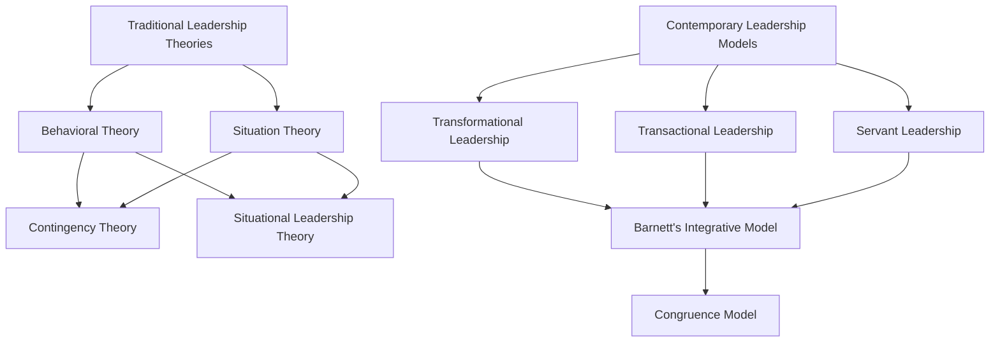
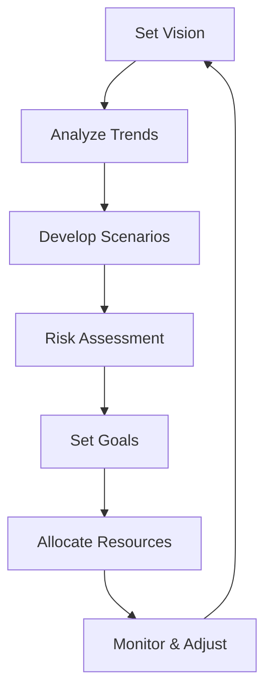
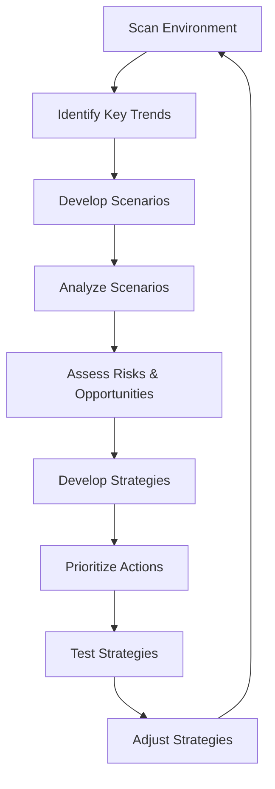
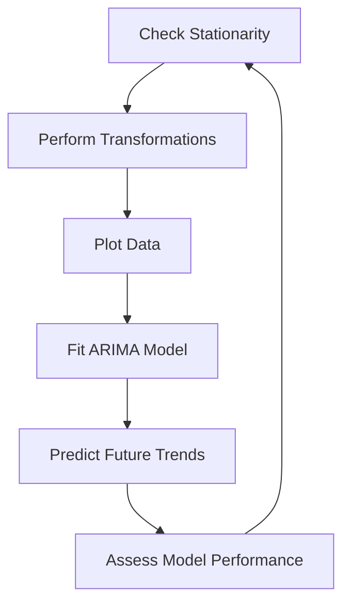

                 


### Introduction

#### What is Leadership and Vision?

**Leadership** is the process of guiding and motivating people to achieve a common goal. It involves the ability to inspire, influence, and empower others. At its core, leadership is about creating a vision, setting direction, and enabling others to follow.

**Vision** is a clear, inspiring picture of what an individual, team, or organization aspires to become or achieve in the future. A vision provides a sense of purpose and direction, guiding decision-making and strategic planning.

In the context of leadership, vision is crucial. A leader with a clear vision can articulate a compelling future state and motivate others to work towards it. Visionary leaders inspire innovation, foster collaboration, and navigate change.

#### Why Leadership and Vision Matter

Leadership and vision are essential for several reasons:

1. **Navigating Change**: In today's rapidly changing world, organizations need leaders who can anticipate and adapt to new challenges. Visionary leadership helps organizations stay ahead of the curve and maintain a competitive edge.

2. **Inspiring and Motivating**: Effective leaders inspire and motivate their teams to achieve extraordinary results. A clear vision helps create a sense of purpose and direction, fostering enthusiasm and commitment.

3. **Strategic Decision-Making**: Leadership and vision provide a framework for strategic decision-making. By understanding the future trends and potential opportunities, leaders can make informed decisions that align with the organization's long-term goals.

4. **Building Resilience**: Visionary leadership helps organizations build resilience in the face of uncertainty. By preparing for future trends and challenges, leaders can help their organizations adapt and thrive.

In summary, leadership and vision are fundamental to organizational success. They enable leaders to inspire, innovate, and navigate change, ultimately driving growth and achieving long-term success.

### The Importance of Future Trends

#### Understanding Trends

**Trends** are patterns or developments that emerge over time. They can be observed in various aspects of society, technology, and the economy. Understanding trends is essential for several reasons:

1. **Predicting Future Developments**: By analyzing trends, we can predict future developments and anticipate changes. This allows organizations to prepare and adapt proactively.
2. **Informing Decision-Making**: Trends provide valuable insights that inform decision-making. Leaders can make more informed choices by considering the direction in which a particular industry or market is heading.
3. **Identifying Opportunities and Risks**: Trends help identify both opportunities and risks. Organizations can capitalize on emerging trends while mitigating potential threats.

#### The Role of Future Trends in Leadership

Future trends play a crucial role in leadership for several reasons:

1. **Anticipating Change**: Leaders need to anticipate future changes to navigate their organizations effectively. By staying informed about trends, leaders can predict disruptions and prepare for them.
2. **Strategic Planning**: Future trends inform strategic planning. Leaders must consider trends when setting goals and developing strategies to achieve them.
3. **Innovation**: Trends often drive innovation. Leaders who understand future trends can foster a culture of innovation within their organizations, encouraging the development of new products, services, and business models.
4. **Adaptability**: The ability to adapt to future trends is a key leadership skill. Leaders who can quickly adapt to changing circumstances are more likely to succeed in today's dynamic environment.

#### Preparing for Future Uncertainties

Preparing for future uncertainties is crucial for organizational resilience. Here are some strategies leaders can use to prepare:

1. **Scenarios Planning**: Scenario planning involves creating multiple plausible future scenarios and developing strategies to address each one. This helps organizations prepare for various potential outcomes.
2. **Futures Thinking**: Futures thinking is a strategic planning approach that involves imagining and analyzing future possibilities. It helps leaders envision different future states and consider the implications for their organization.
3. **Continuous Learning**: Continuous learning is essential for staying informed about future trends. Leaders should encourage a culture of learning and knowledge sharing within their organizations.
4. **Flexibility and Agility**: Building flexibility and agility into organizational structures and processes can help organizations respond quickly to changes. Leaders should promote a flexible mindset and encourage experimentation.

In conclusion, understanding and preparing for future trends is essential for effective leadership. By staying informed about trends, leaders can anticipate changes, make informed decisions, and inspire their teams to adapt and thrive in an uncertain future.

## Core Concepts and Frameworks

### Leadership Theories and Models

**Traditional Leadership Theories** provide foundational concepts for understanding leadership. These theories focus on traits, behaviors, and styles that are characteristic of effective leaders.

**Trait Theory**: This theory posits that certain personal traits, such as intelligence, confidence, and determination, are essential for effective leadership. Leaders are believed to possess these traits from birth, and individuals can only aspire to exhibit them.

**Behavioral Theory**: Developed in the 1940s and 1950s, behavioral theory emphasizes the actions and behaviors of leaders rather than their traits. Researchers like Ohio State University's studies identified two dimensions of leader behavior: considerate (people-oriented) and initiating structure (task-oriented).

**Situation Theory**: This theory suggests that effective leadership depends on the leader's ability to adapt to different situations. Popular models include Fiedler's Contingency Theory and Hersey-Blanchard's Situational Leadership Theory, which propose that leadership effectiveness is contingent upon the fit between the leader's style and the situation.

**Contingency Theory**: Fiedler's Contingency Theory states that leadership effectiveness depends on the match between the leader's style and the situation. Fiedler identified three leadership styles: Task-oriented, Relationship-oriented, and Allowance.

**Situational Leadership Theory**: Hersey and Blanchard's model identifies four leadership styles based on the follower's readiness level: Telling (S1), Selling (S2), Participating (S3), and Delegating (S4).

**Contemporary Leadership Models** build on traditional theories but incorporate new concepts and perspectives. These models often emphasize the importance of context, relationships, and adaptive leadership.

**Transformational Leadership**: Transformational leadership is characterized by the ability to inspire and motivate followers to achieve their full potential. Transformational leaders develop strong relationships with their followers, communicate a compelling vision, and encourage innovation and personal growth.

**Transformational Leadership Model**: Bass and Avolio's model identifies four components of transformational leadership: Idealized Influence, Inspirational Motivation, Intellectual Stimulation, and Individualized Consideration.

**Transactional Leadership**: Transactional leadership focuses on exchanges and rewards, emphasizing the transactional relationships between leaders and followers. This model includes components such as Contingent Reward, Management-by-Exception, and Passive Management-by-Exception.

**Servant Leadership**: Servant leadership is a paradigm that emphasizes the well-being of individuals and the organization as a whole. Servant leaders prioritize the growth and development of their followers and believe that leadership is a service to others.

**Servant Leadership Model**: Greenleaf's model identifies five elements of servant leadership: Listening, Empathy, Healing, Awareness, and Conscience.

**Integrative Models of Leadership** combine elements from multiple theories to provide a more comprehensive understanding of leadership. These models aim to capture the complexity of leadership and its various dimensions.

**Barnett's Integrative Model**: Barnett's model integrates traits, behaviors, and situational factors, emphasizing the dynamic nature of leadership. The model includes components such as leader traits, follower characteristics, situational variables, and leader behaviors.

**Congruence Model**: The Congruence Model, proposed by Simonton, emphasizes the importance of congruence between a leader's actions and their personal values and beliefs. The model identifies three components: Role Model, Mentor, and Coach.

### Mermaid Diagram of Leadership Models

To illustrate the relationships between various leadership models, we can use a Mermaid diagram:



This diagram shows how traditional and contemporary leadership theories are interconnected, with integrative models like Barnett's and the Congruence Model representing more comprehensive approaches to understanding leadership.

### Vision and Strategic Planning

**The Role of Vision in Organizations**

A vision is a critical component of organizational strategy. It provides a clear sense of direction and purpose, guiding decision-making and behavior across the organization. A compelling vision inspires and motivates employees, aligns efforts towards common goals, and serves as a North Star during times of uncertainty.

**Developing a Vision Statement**

Developing a vision statement involves several steps:

1. **Aspirational**: A vision should be aspirational, capturing what the organization aspires to become or achieve in the future. It should be ambitious yet achievable.
2. **Specific and Measurable**: A vision should be specific and measurable, providing clear objectives that can be tracked and evaluated.
3. **Shared**: A vision should be shared across the organization, fostering a sense of collective purpose and ownership.
4. **Compelling**: A vision should be compelling, resonating with employees and stakeholders and inspiring them to work towards it.

**Strategic Planning for Future Trends**

Strategic planning involves setting goals, determining actions to achieve those goals, and allocating resources effectively. When planning for future trends, organizations should consider the following:

1. **Trend Analysis**: Identify and analyze key trends that could impact the organization's industry or market. This includes technological advancements, social changes, economic shifts, and regulatory changes.
2. **Scenario Planning**: Develop scenarios based on different future possibilities and their potential impacts on the organization. Scenario planning helps organizations prepare for various outcomes and make informed decisions.
3. **Risk Assessment**: Identify potential risks and opportunities associated with future trends and develop strategies to mitigate risks and capitalize on opportunities.
4. **Resource Allocation**: Allocate resources effectively to pursue strategic initiatives and respond to future trends. This includes human resources, financial resources, and technological resources.
5. **Continuous Monitoring**: Monitor and review the strategic plan regularly, adjusting as necessary to stay aligned with future trends and organizational goals.

### Mermaid Diagram of Strategic Planning Process

To visualize the strategic planning process, we can use a Mermaid diagram:



This diagram outlines the steps involved in strategic planning, emphasizing the iterative nature of the process and the importance of continuously aligning with future trends.

### Futures Thinking and Scenario Planning

**Introduction to Futures Thinking**

Futures thinking is a strategic planning approach that involves imagining and analyzing potential future scenarios. It is a tool used by organizations to anticipate changes and prepare for future uncertainties. By exploring different future possibilities, organizations can develop strategies that are adaptable and resilient.

**Scenario Planning Techniques**

Scenario planning is a method of strategic planning that involves developing multiple plausible future scenarios and analyzing their potential impacts on an organization. This technique helps organizations prepare for various outcomes and make informed decisions.

1. **Scanning the Environment**: The first step in scenario planning is to scan the environment for key trends, events, and potential disruptions. This involves gathering information from various sources, such as market research, industry reports, and expert opinions.
2. **Identifying Key Trends**: Once the environment is scanned, the next step is to identify key trends that could shape the future. These trends could include technological advancements, social changes, economic shifts, and regulatory changes.
3. **Developing Scenarios**: Based on the key trends identified, organizations can develop multiple plausible scenarios. These scenarios should represent different potential futures and their potential impacts on the organization.
4. **Analyzing Scenarios**: Once the scenarios are developed, organizations should analyze their potential impacts on the organization. This involves evaluating each scenario's likelihood of occurring and the potential consequences for the organization.
5. **Developing Strategies**: Based on the analysis of the scenarios, organizations can develop strategies to respond to different future possibilities. These strategies should be flexible and adaptable, allowing the organization to respond to changing circumstances.

**Applying Scenarios to Decision-Making**

Applying scenario planning to decision-making involves using the developed scenarios to inform and guide strategic decisions. This process includes the following steps:

1. **Assessing Risks and Opportunities**: By using scenarios, organizations can identify potential risks and opportunities associated with different future possibilities. This helps organizations anticipate and prepare for potential disruptions and capitalize on emerging opportunities.
2. **Prioritizing Actions**: Based on the analysis of the scenarios, organizations can prioritize actions and initiatives that are most critical for achieving their strategic objectives.
3. **Testing Strategies**: By applying scenarios to decision-making, organizations can test their strategies and assess their potential effectiveness in different future contexts. This helps organizations identify potential weaknesses and areas for improvement.
4. **Adjusting Strategies**: As new information and trends emerge, organizations should continuously adjust their strategies to stay aligned with the evolving future landscape.

**Mermaid Diagram of Scenario Planning Process**

To visualize the scenario planning process, we can use a Mermaid diagram:



This diagram outlines the steps involved in scenario planning and its application to decision-making, emphasizing the iterative and adaptive nature of the process.

### The Ability to See Future Trends

#### Skills and Competencies

The ability to see future trends requires a unique set of skills and competencies. These include:

1. **Analytical Thinking**: Analytical thinking is crucial for identifying patterns, trends, and potential disruptions in the environment. Leaders need to be able to analyze complex data sets and extract meaningful insights.
2. **Critical Thinking**: Critical thinking involves evaluating information objectively and making informed judgments. Leaders must be able to challenge assumptions, question existing paradigms, and consider alternative perspectives.
3. **Strategic Thinking**: Strategic thinking enables leaders to think long-term and develop a coherent vision for the future. It involves setting goals, creating action plans, and aligning resources to achieve those goals.
4. **Adaptability**: Adaptability is the ability to respond effectively to changing circumstances. Leaders with high adaptability are more likely to anticipate and prepare for future trends and disruptions.
5. **Cultural Intelligence**: Cultural intelligence involves understanding and appreciating different cultures, perspectives, and values. This is important for identifying trends that may emerge from diverse global environments.

#### Data-Driven Decision Making

Data-driven decision making is a critical component of seeing future trends. It involves using data to inform and guide decision-making processes. Here are the steps involved in data-driven decision making:

1. **Define Objectives**: Clearly define the objectives and questions you want to answer through data analysis.
2. **Gather Data**: Collect relevant data from various sources, including internal databases, market research reports, industry benchmarks, and external data sets.
3. **Clean and Prepare Data**: Clean and prepare the data for analysis. This may involve removing duplicates, correcting errors, and transforming the data into a suitable format.
4. **Analyze Data**: Use statistical analysis, data mining, and machine learning techniques to analyze the data. Identify patterns, trends, and correlations that provide insights into future possibilities.
5. **Interpret Results**: Interpret the results of the data analysis and identify the implications for decision-making. Consider the reliability and validity of the data, as well as potential limitations or biases.
6. **Make Decisions**: Use the insights gained from data analysis to make informed decisions. Develop strategies and action plans based on the data-driven insights.

#### Leadership and Innovation

Leadership plays a crucial role in fostering innovation and seeing future trends. Here are some key strategies for leveraging leadership to promote innovation:

1. **Create a Culture of Innovation**: Encourage a culture that values creativity, experimentation, and learning from failure. Provide resources and support for employees to explore new ideas and initiatives.
2. **Empower Employees**: Empower employees to take risks, make decisions, and contribute to innovation efforts. Give them the autonomy and flexibility to experiment and try new approaches.
3. **Encourage Collaboration**: Foster collaboration and cross-functional teams to leverage diverse perspectives and ideas. Encourage open communication and knowledge sharing to foster innovation.
4. **Provide Training and Development**: Invest in training and development programs to build the skills and competencies of employees in areas such as data analysis, critical thinking, and strategic planning.
5. **Lead by Example**: As a leader, demonstrate a commitment to innovation and be an active participant in the process. Encourage and support employees in their innovation efforts and celebrate successes and failures alike.

By developing these skills and competencies, utilizing data-driven decision making, and fostering a culture of innovation, leaders can enhance their ability to see future trends and navigate the dynamic and uncertain landscape of the future.

### Mathematical Models for Predicting Trends

**Time Series Analysis**

Time series analysis is a statistical approach used to analyze and forecast time-based data. It is particularly useful for identifying patterns, trends, and seasonality in temporal data. The basic steps in time series analysis include:

1. **Stationarity Test**: Before analyzing time series data, it is important to test for stationarity. A stationary time series has constant mean, variance, and autocorrelation over time. The Augmented Dickey-Fuller (ADF) test is commonly used to assess stationarity.
2. **Plotting the Data**: Visual inspection of the data through plots such as line plots, scatter plots, and autocorrelation plots can help identify trends, seasonality, and other characteristics.
3. **Transformations**: If the data is not stationary, transformations such as differencing or logging may be applied to stabilize the mean and variance. Differencing involves subtracting the current value from the previous value, while logging involves taking the natural logarithm of the data.
4. **ARIMA Model**: The Autoregressive Integrated Moving Average (ARIMA) model is a popular time series forecasting model. It consists of three components: autoregression (AR), differencing (I), and moving average (MA). The ARIMA model can capture linear dependencies in the data and is suitable for short-term forecasting.

**Regression Analysis**

Regression analysis is a statistical method used to model the relationship between a dependent variable and one or more independent variables. It is often used to predict future values based on historical data. The steps in regression analysis include:

1. **Model Selection**: Choose an appropriate regression model based on the relationship between the variables. Common regression models include linear regression, multiple regression, and polynomial regression.
2. **Data Preprocessing**: Prepare the data by checking for outliers, missing values, and scaling. Split the data into training and testing sets to evaluate the model's performance.
3. **Model Fitting**: Fit the regression model to the training data and estimate the model parameters. For linear regression, the least squares method is commonly used to minimize the sum of squared errors.
4. **Model Validation**: Validate the model by assessing its performance on the testing set. Use metrics such as mean squared error (MSE) or R-squared to evaluate the model's accuracy and fit.
5. **Prediction**: Use the fitted model to make predictions on new data. Plug in the independent variable values into the regression equation to obtain the predicted dependent variable values.

**Machine Learning Models for Trend Prediction**

Machine learning models can be used for trend prediction by learning from historical data and identifying patterns. Some popular machine learning models for trend prediction include:

1. **Neural Networks**: Neural networks are versatile models that can capture complex relationships in data. They are particularly useful for time series forecasting due to their ability to model non-linear dependencies. Recurrent Neural Networks (RNNs) and Long Short-Term Memory (LSTM) networks are commonly used for time series forecasting.
2. **Support Vector Machines (SVMs)**: SVMs are used for classification tasks, but they can also be applied for regression (SVR) by optimizing a hinge loss function. SVMs are useful for capturing trends in high-dimensional data.
3. **Ensemble Methods**: Ensemble methods combine multiple models to improve prediction accuracy. Popular ensemble methods for trend prediction include Random Forests and Gradient Boosting Machines (GBMs).

**Pseudo-code for Time Series Analysis**

To illustrate the time series analysis process, we can provide a pseudo-code:

```pseudo
function time_series_analysis(data):
    # Check for stationarity
    if not is_stationary(data):
        # Perform transformations
        data = differencing(data)
        if not is_stationary(data):
            data = logging(data)

    # Plot data
    plot_line_plot(data)

    # Fit ARIMA model
    model = fit_arima_model(data)
    forecast = model.forecast(horizon)

    return forecast
```

In conclusion, mathematical models and machine learning algorithms are powerful tools for predicting future trends. By understanding and applying these methods, leaders can make more informed decisions and navigate the complex and dynamic landscape of the future.

### Mermaid Diagram of Mathematical Models for Predicting Trends

To visualize the process of applying mathematical models for predicting trends, we can use a Mermaid diagram:



This diagram outlines the steps involved in time series analysis, emphasizing the iterative nature of the process and the importance of validating model performance.

### Practical Applications of Leadership and Vision

#### Case Studies in Leadership and Vision

**Case Study 1: Steve Jobs and Apple**

Steve Jobs, co-founder of Apple, exemplified visionary leadership. His vision for Apple was to create user-friendly, innovative products that changed the world. Jobs' ability to see future trends in technology, design, and consumer behavior led to the development of groundbreaking products such as the iPhone, iPad, and Mac. His leadership inspired innovation and fostered a culture of excellence and creativity within Apple. The result was a series of successful product launches that transformed the tech industry.

**Case Study 2: Elon Musk and Tesla**

Elon Musk, CEO of Tesla and SpaceX, is another prime example of visionary leadership. Musk's vision is to accelerate the transition to sustainable energy and reduce the risk of global warming through innovative technologies. His leadership and ability to see future trends in electric vehicles, clean energy, and space exploration have driven the development of groundbreaking products and services. Under Musk's leadership, Tesla has become a leader in the electric vehicle market and a symbol of sustainable innovation.

**Case Study 3: Satya Nadella and Microsoft**

Satya Nadella, CEO of Microsoft, demonstrated visionary leadership in transforming the company from a legacy software company to a leading player in cloud computing and AI. Nadella's vision for Microsoft was to become the "world's productivity and platform company for the mobile-first and cloud-first world." His ability to see future trends in technology and adapt Microsoft's strategy accordingly has led to significant growth and success. Under Nadella's leadership, Microsoft has expanded its cloud services, invested in AI research, and developed new products and services that cater to the evolving needs of businesses and consumers.

#### Future Trends in Business

**Digital Transformation**

One of the most significant future trends in business is digital transformation. As technology continues to evolve, businesses are increasingly adopting digital tools and platforms to enhance operations, improve customer experiences, and drive innovation. Digital transformation involves the integration of digital technologies into all aspects of a business, including processes, strategies, and customer interactions.

**Sustainability**

Sustainability is another critical trend in business. As environmental concerns and social responsibilities become more prominent, businesses are increasingly focusing on sustainability practices. This includes reducing carbon footprints, adopting renewable energy sources, and implementing sustainable supply chain practices. Companies that prioritize sustainability are not only addressing environmental issues but also building strong brand reputations and attracting environmentally conscious customers.

**Artificial Intelligence and Machine Learning**

Artificial Intelligence (AI) and Machine Learning (ML) are transforming various industries by enabling automation, predictive analytics, and data-driven decision-making. In the future, AI and ML will continue to play a crucial role in improving efficiency, optimizing operations, and driving innovation. Businesses that leverage AI and ML effectively will gain a competitive advantage in the rapidly evolving market landscape.

#### Future Trends in Technology

**Quantum Computing**

Quantum computing is a rapidly evolving field with the potential to revolutionize various industries, including finance, healthcare, and logistics. Quantum computers leverage the principles of quantum mechanics to perform complex calculations at speeds far beyond classical computers. As quantum computing technology advances, it has the potential to solve problems that are currently intractable, leading to new breakthroughs and innovations.

**Blockchain Technology**

Blockchain technology, best known for its role in cryptocurrencies like Bitcoin, is gaining traction in various industries due to its potential for secure, transparent, and decentralized transactions. Blockchain technology can enhance data integrity, reduce fraud, and streamline supply chain management. In the future, blockchain will continue to evolve and find applications in areas such as digital identity, smart contracts, and decentralized finance.

**Internet of Things (IoT)**

The Internet of Things (IoT) connects devices and systems through the internet, enabling data exchange and automation. This technology is transforming industries by enabling real-time monitoring, predictive maintenance, and enhanced decision-making. In the future, IoT will continue to expand, driving innovation in areas such as smart cities, autonomous vehicles, and industrial automation.

In conclusion, leadership and vision are critical for navigating the rapidly evolving business and technology landscapes. By understanding future trends and leveraging visionary leadership, organizations can innovate, adapt, and thrive in a dynamic and uncertain world.

### Building and Cultivating Visionary Leadership

**Developing Visionary Leadership Skills**

1. **Continuous Learning**: Cultivating visionary leadership requires a commitment to continuous learning. Stay updated with the latest trends, technologies, and developments in your industry. Engage in professional development activities, attend conferences, and read thought-provoking books and articles.
2. **Innovation and Creativity**: Encourage a culture of innovation and creativity within your organization. Foster an environment where employees feel empowered to explore new ideas and approaches. Provide resources and support for experimentation and risk-taking.
3. **Adaptability**: Be adaptable and open to change. Embrace new ideas and approaches, and be willing to experiment with different strategies and methods. Cultivate a mindset that embraces change as an opportunity for growth and improvement.
4. **Empathy and Emotional Intelligence**: Develop empathy and emotional intelligence to understand and connect with your team members. This helps build trust, foster collaboration, and create a positive work environment.

**Cultivating a Visionary Culture**

1. **Define a Clear Vision**: Clearly articulate your organization's vision and purpose. This provides a sense of direction and purpose for your team and aligns efforts towards common goals.
2. **Encourage Collaboration**: Foster a collaborative culture where diverse perspectives and ideas are valued. Encourage cross-functional teams and open communication to facilitate knowledge sharing and innovation.
3. **Lead by Example**: As a leader, lead by example and demonstrate a commitment to visionary leadership. Be proactive, take risks, and embrace challenges. Inspire your team by showcasing your passion and dedication.
4. **Celebrate Successes and Encourage Failure**: Celebrate successes and milestones, but also encourage a culture that embraces failure as an opportunity for learning and growth. Foster an environment where mistakes are seen as valuable learning experiences rather than negative setbacks.

**Long-term Thinking**

1. **Strategic Planning**: Develop long-term strategic plans that align with your organization's vision. Consider future trends and potential disruptions to anticipate and prepare for changes.
2. **Resource Allocation**: Allocate resources effectively to support long-term goals and initiatives. This may involve investing in technology, training, and talent development.
3. **Sustainability**: Incorporate sustainability into your strategic planning and operations. Consider the environmental, social, and economic impacts of your organization's activities and work towards creating a positive impact.

**Building a Visionary Organization**

1. **Develop Leaders**: Invest in leadership development programs to build a pipeline of visionary leaders within your organization. Provide training and mentoring opportunities to help leaders develop their skills and competencies.
2. **Cultivate a Learning Organization**: Foster a learning organization where employees are encouraged to continuously learn and grow. Provide opportunities for professional development, knowledge sharing, and innovation.
3. **Empower Employees**: Empower employees to take ownership of their work and make decisions that align with the organization's vision. Encourage autonomy and flexibility to drive innovation and creativity.
4. **Measure and Monitor Progress**: Regularly measure and monitor progress towards your vision and strategic goals. Use data-driven insights to assess performance, identify areas for improvement, and make informed decisions.

In conclusion, building and cultivating visionary leadership requires a combination of skills, strategies, and a commitment to continuous improvement. By developing visionary leadership skills, cultivating a visionary culture, and focusing on long-term thinking, organizations can create a strong foundation for success in an ever-changing world.

### Conclusion

In conclusion, leadership and vision are essential components for navigating the complex and dynamic landscape of today's world. A visionary leader with the ability to see future trends can inspire, innovate, and adapt, driving growth and success in an uncertain environment. Through a combination of analytical thinking, strategic planning, and continuous learning, leaders can cultivate the skills and competencies needed to foresee future trends and make informed decisions.

As technology and markets evolve at an unprecedented pace, the importance of visionary leadership will only increase. Leaders must be prepared to embrace change, foster innovation, and build resilient organizations that can thrive in the face of disruption.

Let's continue to explore and share our insights, learn from each other, and work together to create a future where visionary leadership can lead us to new heights of success and innovation.

### About the Authors

**AI天才研究院 / AI Genius Institute** is a leading research institution dedicated to advancing the field of artificial intelligence through groundbreaking research, education, and innovation. Our team of experts is committed to developing AI technologies that solve complex problems and improve the quality of life for individuals and communities worldwide.

**禅与计算机程序设计艺术 / Zen And The Art of Computer Programming** is a seminal work in computer science, written by the renowned mathematician and computer scientist, Donald E. Knuth. This book series offers profound insights into the art of programming, emphasizing the importance of clarity, elegance, and efficiency in software development.

Together, the AI天才研究院 and 禅与计算机程序设计艺术 authors bring a wealth of knowledge and expertise to this book, "Leadership and Vision: The Ability to See Future Trends." We hope this resource will inspire and equip leaders and aspiring leaders with the tools and insights needed to drive success in an ever-changing world. Thank you for joining us on this journey of exploration and discovery.

