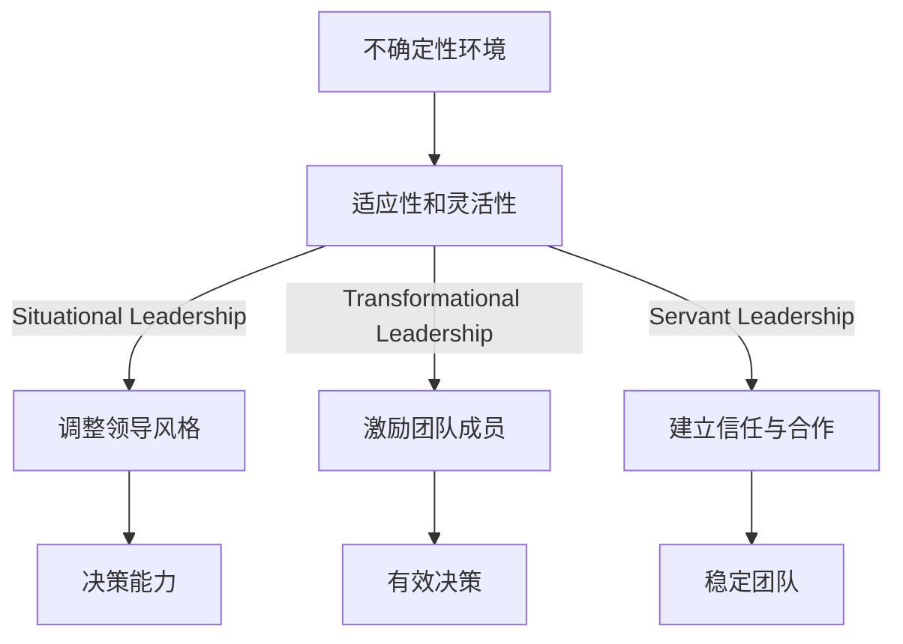
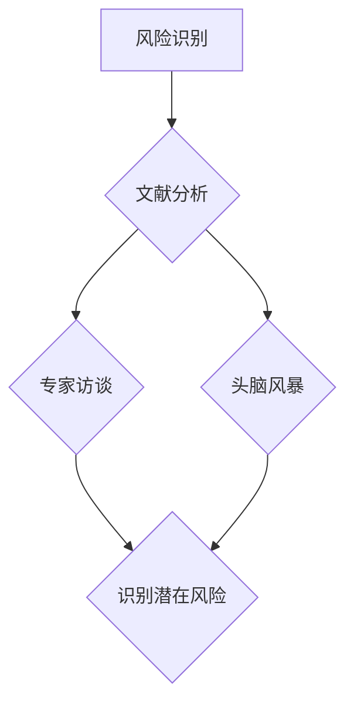
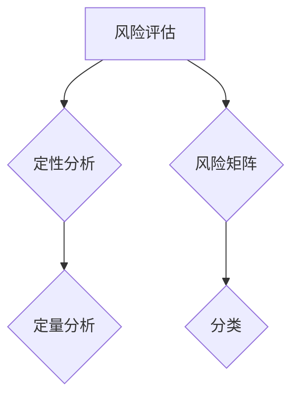
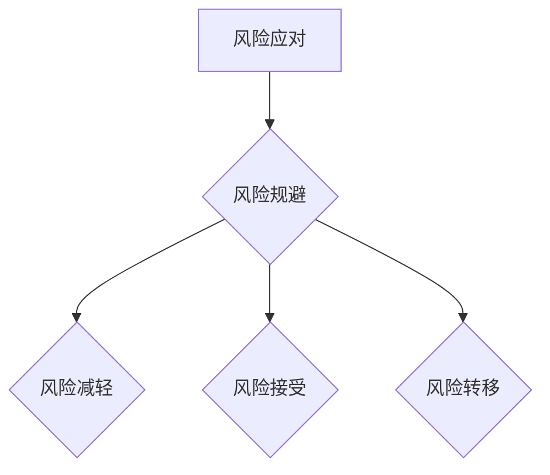
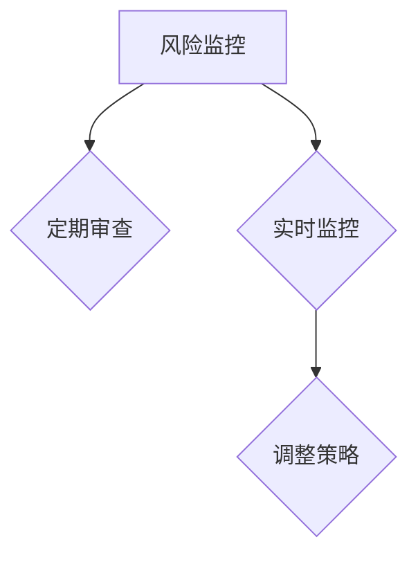
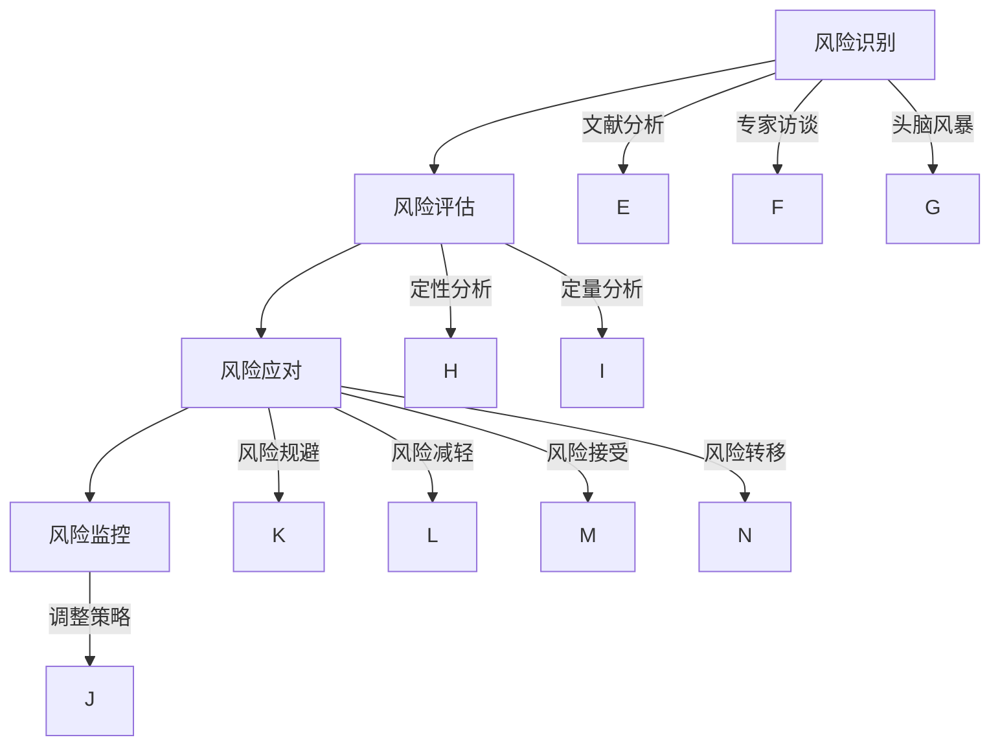
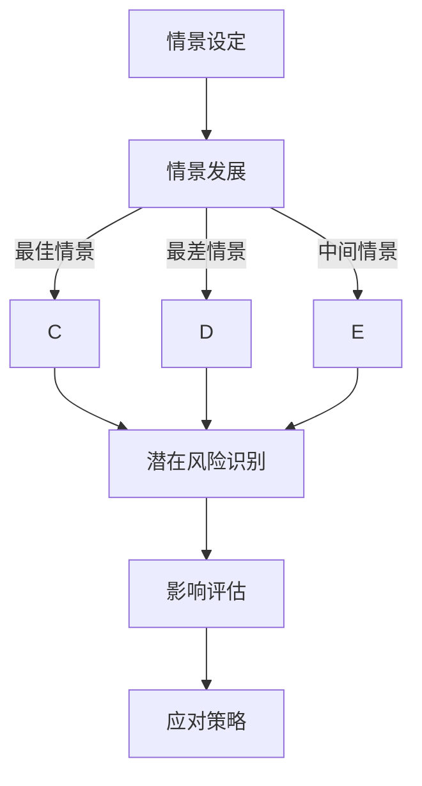
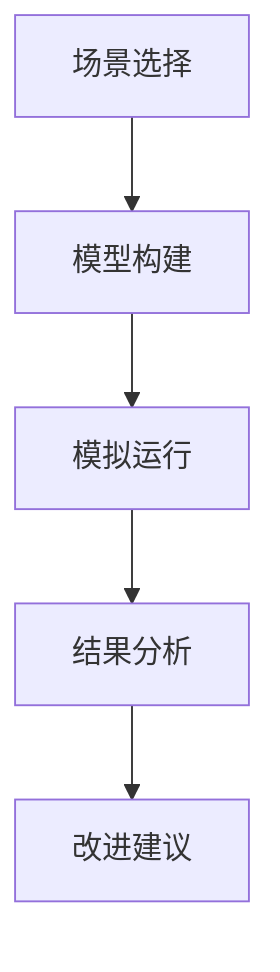
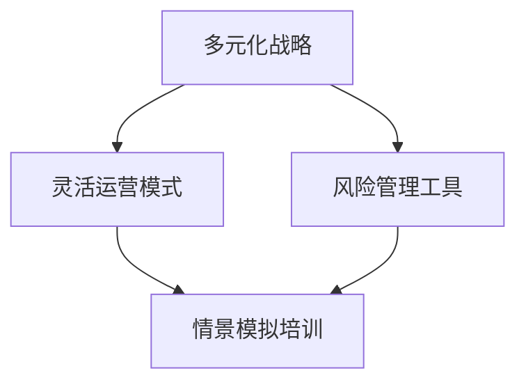

                 

### Introduction and Overview

# 领导力与风险管理：在不确定性中前行

关键词：领导力、风险管理、不确定性、策略、案例分析

在当今快速变化的数字化时代，企业和组织面临的环境愈发复杂和不确定。在这样的环境中，领导力和风险管理成为组织成功的关键要素。领导力不仅关乎个人魅力和决策能力，更涉及到如何在不确定的环境中引导团队实现目标。风险管理则是指在不确定性的背景下，通过识别、评估和应对潜在的风险，以减少不利影响并抓住机会。

本文旨在探讨领导力与风险管理在不确定性环境中的应用，通过深入分析这些核心概念，揭示它们之间的内在联系，并提供实用的策略和案例，帮助读者在实际工作中更好地应对不确定性。

文章将分为八个主要章节，结构如下：

1. **引言与概述**：介绍文章主题和目标，概述领导力和风险管理的基本概念。
2. **领导力的核心概念**：探讨不同类型的领导理论及其在不确定性环境中的应用。
3. **风险管理的核心概念**：解释风险管理的原理和流程，以及如何在不确定性中应用。
4. **领导力在不确定性中的实践**：分析领导者在不确定性环境中的关键特质和案例。
5. **风险管理的适应性策略**：讨论传统风险管理的适应方法，包括情景分析和压力测试。
6. **领导力与风险管理策略的框架**：提出综合性的策略框架，结合算法和数学模型。
7. **案例分析与应用**：提供实际案例，展示领导力和风险管理在行业中的实践。
8. **结论与未来方向**：总结文章的主要观点，提出未来研究的方向。

通过以上章节的逐步剖析，本文将帮助读者理解和应用领导力与风险管理，以在不确定性中取得成功。

### 背景介绍

在当前全球化和数字化转型的浪潮中，企业和组织面临的环境复杂多变，不确定性日益增加。这种不确定性不仅来源于外部市场环境的快速变化，还来自于内部技术革新和组织结构的不断调整。在这样的背景下，领导力和风险管理成为企业持续发展和保持竞争力的关键要素。

首先，领导力在不确定性中的作用不可忽视。一个出色的领导者能够在不确定的环境中稳定团队情绪，清晰传达愿景和目标，引导团队克服各种挑战。领导力不仅仅关乎个人魅力和决策能力，更涉及到如何建立信任、激发团队成员的潜力和创新能力。在快速变化的商业环境中，领导者需要具备灵活应变的能力，能够快速识别风险并制定有效的应对策略。

其次，风险管理在不确定性中的重要性同样显著。传统的风险管理方法主要针对确定性的环境，但在不确定性日益增加的情况下，传统的风险识别和评估方法往往显得力不从心。为了更好地应对不确定性，风险管理需要更加前瞻性和系统性。通过情景分析和压力测试等工具，组织可以模拟各种可能的情况，评估潜在风险的影响，并制定相应的应对策略。有效的风险管理不仅可以减少不确定性带来的不利影响，还可以帮助企业抓住潜在的机会。

领导力和风险管理之间的内在联系在于它们共同服务于组织的整体目标。领导力为组织提供了明确的方向和目标，而风险管理则确保这些目标在不确定的环境中得以实现。一个成功的领导者不仅需要具备决策能力和领导艺术，还需要了解风险管理的基本原则，能够在制定战略时充分考虑潜在的风险和不确定性。同样，一个有效的风险管理策略也需要领导者的支持，以确保风险管理的执行和效果。

在不确定的环境中，领导力和风险管理往往相互交织、互为补充。领导者通过制定明确的战略和目标，帮助团队在面对不确定时保持稳定和信心；而风险管理则通过提前识别和应对潜在风险，为领导者的决策提供数据支持和保障。只有当领导力和风险管理紧密结合，才能在不确定性中实现组织的长期成功。

总的来说，领导力和风险管理在不确定性环境中具有重要作用，它们不仅是企业应对外部变化的工具，更是组织内部协调和创新的动力。通过深入理解和应用领导力和风险管理，企业可以更好地应对不确定性的挑战，实现可持续发展和成功。

### 核心概念与联系

为了更好地理解领导力和风险管理在不确定性环境中的应用，我们需要深入探讨这两个核心概念，并揭示它们之间的内在联系。以下是关于领导力的核心概念和联系的分析，同时使用Mermaid流程图进行详细说明。

#### 领导力的核心概念

1. **Situational Leadership**：
   - **定义**：Situational Leadership理论由保罗·赫塞（Paul Hersey）和肯尼斯·布兰查德（Kenneth Blanchard）提出，强调领导者应根据不同的情况和团队成员的特点来调整自己的领导风格。
   - **关系架构**：
     - 领导者需要具备多种领导风格，并能够在不同情境下灵活切换。
     - 成员的能力和动机会影响领导者的决策，从而影响领导效果。
     - Mermaid流程图：
       ```mermaid
       graph TD
       A[情境1] --> B{成员能力}
       B -->|高| C[指导型领导]
       B -->|中| D[支持型领导]
       B -->|低| E[委托型领导]
       ```
       
2. **Transformational Leadership**：
   - **定义**：Transformational Leadership理论由詹姆斯·麦格雷戈·伯恩斯（James MacGregor Burns）提出，强调领导者通过激励、鼓舞和影响团队成员来实现变革。
   - **关系架构**：
     - 领导者通过变革愿景激励团队成员，提升他们的承诺和信任。
     - 变革过程中，领导者需要具备道德和情感智慧，以引导团队成员。
     - Mermaid流程图：
       ```mermaid
       graph TD
       A[变革愿景] --> B[激励]
       B --> C{承诺与信任}
       C --> D[道德和情感智慧]
       ```

3. **Servant Leadership**：
   - **定义**：Servant Leadership理论由罗伯特·K·格林里夫（Robert K. Greenleaf）提出，强调领导者应以服务他人为出发点，通过满足团队成员的需求来实现组织目标。
   - **关系架构**：
     - 领导者通过关注团队成员的需求，建立信任和合作氛围。
     - 服务型领导需要具备良好的沟通和倾听能力，以更好地了解和满足团队成员的需求。
     - Mermaid流程图：
       ```mermaid
       graph TD
       A[关注团队成员需求] --> B{建立信任与合作}
       B --> C[沟通与倾听能力]
       ```

#### 领导力与不确定性的联系

在不确定性环境中，领导力的作用尤为重要。以下是领导力与不确定性之间的关键联系：

1. **适应性和灵活性**：
   - 领导者需要具备适应性和灵活性，以应对不断变化的环境。
   - 通过Situational Leadership和Transformational Leadership，领导者能够根据不同的情境调整自己的策略，从而更好地应对不确定性。
   
2. **决策能力**：
   - 在不确定性环境中，领导者需要快速做出明智的决策。
   - Transformational Leadership通过激励和鼓舞团队成员，增强他们的参与感和责任感，有助于领导者做出更有效的决策。

3. **信任与沟通**：
   - 在不确定性环境中，信任和沟通至关重要。
   - Servant Leadership通过关注团队成员的需求，建立信任和合作氛围，有助于在不确定的环境中保持团队的稳定和凝聚力。

### Mermaid流程图示例

以下是领导力与不确定性联系的一个Mermaid流程图示例：



通过上述分析，我们可以看到领导力的核心概念及其在不确定性环境中的应用，以及它们之间的内在联系。在接下来的章节中，我们将进一步探讨风险管理的核心概念及其与领导力的关系。

### 风险管理的核心概念

风险管理是企业在不确定环境中稳定发展的关键，其重要性不言而喻。为了更好地理解风险管理的核心概念和流程，我们将从以下几个关键部分进行详细分析，并使用Mermaid流程图来展示各个步骤和概念之间的关系。

#### 风险管理的定义与目标

风险管理是指通过识别、评估和应对潜在的风险，以确保组织的稳定运行和持续发展。其目标主要包括：

1. **降低风险损失**：通过识别和评估潜在风险，采取有效的应对措施，减少风险发生时可能造成的损失。
2. **增强决策质量**：提供全面的风险信息，帮助决策者做出更明智的决策。
3. **增加适应能力**：提升组织对不确定环境的适应能力，确保组织能够在变化中保持竞争优势。

#### 风险管理流程

风险管理通常包括以下几个主要步骤：

1. **风险识别**：识别可能影响组织目标的潜在风险。
2. **风险评估**：评估已识别风险的严重性和概率。
3. **风险应对**：制定和实施应对策略，包括风险规避、风险减轻、风险接受和风险转移等。
4. **风险监控**：持续监控风险状态，确保应对策略的有效性。

##### 风险识别

风险识别是风险管理的基础，它涉及识别组织内部和外部可能存在的风险。以下是风险识别的主要方法：

1. **文献分析**：通过查阅相关文献和报告，识别已知的风险类型。
2. **专家访谈**：与风险管理专家和内部员工进行访谈，获取潜在风险的见解。
3. **头脑风暴**：组织小组讨论，识别可能的风险。

Mermaid流程图示例：



##### 风险评估

风险评估是评估已识别风险的严重性和概率。常用的评估方法包括：

1. **定性与定量分析**：结合专家判断和数学模型进行风险评估。
2. **风险矩阵**：使用风险矩阵将风险按照严重性和概率进行分类。

Mermaid流程图示例：



##### 风险应对

风险应对是根据风险评估结果，制定和实施应对策略。以下是几种常见的方法：

1. **风险规避**：通过改变决策或行为，避免风险的发生。
2. **风险减轻**：采取预防措施，降低风险的影响。
3. **风险接受**：当风险无法规避或减轻时，接受风险并准备应对。
4. **风险转移**：将风险转移给第三方，如购买保险。

Mermaid流程图示例：



##### 风险监控

风险监控是确保应对策略有效性的持续过程。主要方法包括：

1. **定期审查**：定期审查风险管理计划，确保其与当前环境相适应。
2. **实时监控**：通过监控系统实时跟踪风险状态，及时调整应对策略。

Mermaid流程图示例：



### 风险管理流程的Mermaid流程图

以下是风险管理流程的整体Mermaid流程图：



通过上述分析，我们可以清晰地看到风险管理的核心概念和流程。在不确定性环境中，有效的风险管理不仅可以帮助企业规避潜在的风险，还可以增强其适应能力和持续发展的能力。在接下来的章节中，我们将探讨领导力在不确定性环境中的实践，并进一步分析领导力与风险管理之间的联系。

### 领导力在不确定性环境中的实践

在不确定性环境中，领导力的作用显得尤为重要。领导者不仅需要具备卓越的个人能力和决策力，还需要在不确定的环境中灵活运用各种领导风格，以保持团队的稳定和激发团队的潜力。以下是领导者在不确定性环境中需要具备的关键特质和实践案例。

#### 关键特质

1. **适应性和灵活性**：
   - 领导者需要具备高度适应性和灵活性，以应对环境中的快速变化。
   - 这种适应能力包括对新兴技术的敏感度、对市场动态的洞察力以及对突发事件的快速反应能力。
   - **案例**：在2020年新冠疫情期间，许多企业的领导者迅速调整经营策略，采用远程办公和线上服务，以应对疫情带来的不确定性。

2. **沟通与透明度**：
   - 不确定的环境容易引发恐慌和焦虑，领导者需要通过有效的沟通和透明度来缓解团队成员的担忧。
   - 定期更新团队关于公司现状和未来规划的最新信息，增强团队的信心和凝聚力。
   - **案例**：阿里巴巴在疫情期间通过内部通讯工具定期向员工传达公司的应对措施和进展，确保信息透明，增强员工的信任。

3. **决策能力和风险管理**：
   - 面对不确定性，领导者需要具备果断的决策能力，同时能够有效管理风险。
   - 这包括在不确定情况下做出最佳决策的能力，以及在决策过程中考虑到各种潜在风险。
   - **案例**：特斯拉的CEO埃隆·马斯克在疫情期间果断决定扩大生产，以满足市场对个人防护设备的需求，同时确保员工的安全。

4. **激励与鼓舞**：
   - 领导者需要通过激励和鼓舞来提升团队成员的士气和创造力，使团队在不确定性中保持积极态度。
   - 这可以通过设定清晰的愿景和目标、提供奖励机制和认可团队成员的贡献来实现。
   - **案例**：微软的CEO萨蒂亚·纳德拉通过定期的员工邮件和视频会议，激励团队成员在家办公期间保持高效工作。

#### 实践案例

1. **谷歌的敏捷领导**：
   - 谷歌在快速变化的技术环境中，通过采用敏捷领导方法，保持组织的灵活性和创新能力。
   - 谷歌的领导者鼓励员工自主探索新项目，并提供必要的资源和支持，以快速应对市场变化。
   - **案例**：谷歌在2004年推出Google Maps，这款产品在短短几年内迅速占领市场，得益于领导者的敏捷决策和团队的高度协作。

2. **特斯拉的危机领导**：
   - 在新冠疫情期间，特斯拉CEO埃隆·马斯克通过果断的决策和有效的风险管理，使公司在疫情期间保持运营，并迅速调整战略以生产呼吸机和其他医疗设备。
   - 马斯克通过公开沟通和透明度，确保员工了解公司的应对措施和安全措施，增强了团队的信心。
   - **案例**：特斯拉在疫情期间生产的呼吸机在短时间内迅速投入市场，帮助缓解了医疗物资短缺的问题。

3. **阿里巴巴的远程领导**：
   - 阿里巴巴在新冠疫情期间通过远程办公技术，确保了公司业务的连续性和团队的高效运作。
   - 阿里巴巴的领导者通过在线会议和数字化管理工具，保持与员工的紧密联系，并提供必要的支持和资源。
   - **案例**：阿里巴巴的云业务在疫情期间迅速扩展，为众多中小企业提供线上服务解决方案，帮助它们应对市场变化。

通过这些实践案例，我们可以看到领导者在不确定性环境中的关键作用。领导者不仅需要具备高度的适应性和决策能力，还需要通过有效的沟通和激励来保持团队的稳定和激发团队的潜力。在快速变化的商业环境中，只有具备这些关键特质的领导者，才能带领团队在不确定性中取得成功。

### 风险管理在不确定性环境中的适应性策略

在快速变化的现代商业环境中，传统的风险管理方法往往难以应对不确定性带来的挑战。因此，适应性的风险管理策略成为企业保持竞争力和持续发展的关键。以下将从情景分析和压力测试两个方面，详细讨论风险管理在不确定性环境中的适应性策略。

#### 情景分析

情景分析是一种重要的风险管理工具，它通过模拟未来可能发生的不同情况，帮助组织识别潜在风险并制定应对策略。以下是情景分析的关键步骤：

1. **情景设定**：确定需要分析的情景，包括市场变化、政策调整、技术创新等。
2. **情景发展**：基于设定的情景，预测各种可能的发展路径，包括最佳情景、最差情景和中间情景。
3. **情景评估**：评估每种情景下的潜在风险，包括其发生的可能性、影响程度和应对策略。
4. **情景报告**：编写情景分析报告，为决策者提供全面的情景分析和应对建议。

##### 情景分析流程

以下是情景分析的一个Mermaid流程图示例：



#### 压力测试

压力测试是一种通过模拟极端市场条件来评估组织承受能力和应对能力的风险管理方法。以下是压力测试的关键步骤：

1. **场景选择**：选择可能对组织产生重大影响的极端市场情景，如经济衰退、市场崩溃等。
2. **模型构建**：构建用于模拟压力测试的数学模型，包括市场参数、财务指标等。
3. **模拟运行**：运行模型，模拟极端市场情景下的财务状况和运营表现。
4. **结果分析**：分析模拟结果，评估组织在极端情况下的承受能力和应对策略的有效性。
5. **改进建议**：根据分析结果提出改进建议，以增强组织的抗风险能力。

##### 压力测试流程

以下是压力测试的一个Mermaid流程图示例：



#### 适应性风险管理策略

结合情景分析和压力测试，组织可以制定适应性风险管理策略，以提高在不确定性环境中的应对能力。以下是几个关键策略：

1. **多元化战略**：通过多元化产品和市场，减少单一风险的影响。
2. **灵活的运营模式**：采用灵活的运营模式，如外包、共享服务等，以快速适应市场变化。
3. **风险管理工具**：利用先进的风险管理工具和技术，如人工智能、大数据分析等，提高风险识别和应对的效率。
4. **情景模拟培训**：定期进行情景模拟培训，提高团队成员的风险意识和应对能力。

##### 适应性风险管理策略框架

以下是适应性风险管理策略的一个Mermaid流程图示例：



通过情景分析和压力测试，组织可以更好地理解不确定性环境中的潜在风险，并制定适应性策略来应对这些风险。这种适应性风险管理策略不仅有助于降低风险损失，还可以增强组织的竞争力，确保在不确定性中持续发展。

### 领导力与风险管理策略的框架

为了在不确定性环境中实现组织的长期成功，我们需要构建一个综合性的领导力与风险管理策略框架。这一框架将结合领导力的核心原则和风险管理的最佳实践，提供一套系统化的策略，以帮助领导者和管理团队在不确定的环境中做出明智的决策和有效的行动。

#### 策略框架的构建步骤

1. **明确组织愿景和目标**：
   - **目标**：明确组织的长期愿景和短期目标，确保领导者和团队成员对目标有清晰的理解。
   - **方法**：通过定期的战略规划和目标设定会议，确保组织目标的明确和持续更新。

2. **领导力与风险管理结合**：
   - **目标**：将领导力与风险管理紧密结合，确保风险管理策略与组织目标一致。
   - **方法**：设立跨职能团队，负责制定和实施领导力与风险管理策略。

3. **情景分析与风险评估**：
   - **目标**：通过情景分析和风险评估，识别潜在的风险和不确定性。
   - **方法**：定期进行情景分析会议，使用定量和定性方法评估不同情景下的风险。

4. **策略制定与实施**：
   - **目标**：制定具体的应对策略，并确保策略的有效实施。
   - **方法**：使用决策树和决策矩阵等工具，制定综合性的风险管理策略，并分配责任到人。

5. **持续监控与反馈**：
   - **目标**：持续监控策略的实施效果，并根据反馈进行调整。
   - **方法**：设立定期监控和评估机制，确保策略能够适应环境变化。

#### 策略框架的具体算法和数学模型

为了确保策略的科学性和可操作性，我们可以结合以下算法和数学模型：

1. **决策树**：
   - **目标**：帮助领导者在不同情景下做出最佳决策。
   - **模型**：通过构建决策树，列出所有可能的情景和对应的决策路径，计算每个路径的预期收益和风险。

```python
import numpy as np

# 决策树示例
def decision_tree(situation, decisions, rewards):
    if situation not in decisions:
        return rewards[situation]
    else:
        next_situation = decisions[situation]
        return decision_tree(next_situation, decisions, rewards)

# 示例数据
decisions = {'情境A': '策略A', '情境B': '策略B'}
rewards = {'情境A': 10, '情境B': 5}

# 计算预期收益
expected_reward = decision_tree('初始情景', decisions, rewards)
print(f"预期收益: {expected_reward}")
```

2. **风险矩阵**：
   - **目标**：量化不同风险的概率和影响，为决策提供依据。
   - **模型**：使用风险矩阵将风险按照概率和影响进行分类，为决策提供参考。

```python
import pandas as pd

# 风险矩阵示例
risk_matrix = pd.DataFrame({
    '风险': ['风险1', '风险2', '风险3'],
    '概率': [0.3, 0.5, 0.2],
    '影响': [5, 3, 7]
})

# 计算总风险
total_risk = risk_matrix['概率'] * risk_matrix['影响']
print(f"总风险: {total_risk.sum()}")
```

3. **贝叶斯网络**：
   - **目标**：通过概率推理，识别和管理复杂的依赖关系。
   - **模型**：使用贝叶斯网络来表示风险之间的依赖关系，并进行概率推断。

```python
import networkx as nx
import numpy as np

# 贝叶斯网络示例
G = nx.DiGraph()
G.add_nodes_from(['初始情景', '策略A', '策略B', '收益'])
G.add_edges_from([('初始情景', '策略A'), ('初始情景', '策略B'), ('策略A', '收益'), ('策略B', '收益')])

# 设置概率分布
prob_dist = {
    '策略A': [0.5, 0.5],
    '策略B': [0.4, 0.6],
    '收益': {'策略A': [0.2, 0.8], '策略B': [0.1, 0.9]}
}

# 计算后验概率
posterior_probs = nx.inference.marginal_probabilities(G, prob_dist, nodes='收益')
print(f"后验概率: {posterior_probs}")
```

#### 策略框架的Python代码实现

以下是策略框架的Python代码实现，包括决策树、风险矩阵和贝叶斯网络的实现：

```python
# 决策树实现
def decision_tree(situation, decisions, rewards):
    if situation not in decisions:
        return rewards[situation]
    else:
        next_situation = decisions[situation]
        return decision_tree(next_situation, decisions, rewards)

# 风险矩阵实现
risk_matrix = pd.DataFrame({
    '风险': ['风险1', '风险2', '风险3'],
    '概率': [0.3, 0.5, 0.2],
    '影响': [5, 3, 7]
})

# 计算总风险
total_risk = risk_matrix['概率'] * risk_matrix['影响']
print(f"总风险: {total_risk.sum()}")

# 贝叶斯网络实现
G = nx.DiGraph()
G.add_nodes_from(['初始情景', '策略A', '策略B', '收益'])
G.add_edges_from([('初始情景', '策略A'), ('初始情景', '策略B'), ('策略A', '收益'), ('策略B', '收益')])

# 设置概率分布
prob_dist = {
    '策略A': [0.5, 0.5],
    '策略B': [0.4, 0.6],
    '收益': {'策略A': [0.2, 0.8], '策略B': [0.1, 0.9]}
}

# 计算后验概率
posterior_probs = nx.inference.marginal_probabilities(G, prob_dist, nodes='收益')
print(f"后验概率: {posterior_probs}")
```

通过构建综合性的领导力与风险管理策略框架，结合具体的算法和数学模型，组织可以在不确定性环境中做出更明智的决策和更有效的行动。这一框架不仅有助于降低风险，还能提升组织的适应能力和持续发展的能力。

### 案例分析与应用

在本章节中，我们将通过几个实际案例，展示领导力和风险管理在各个行业中的应用，并使用Python代码详细解释关键算法和决策过程。

#### 案例一：金融行业的风险评估

在金融行业，风险管理的挑战尤为突出。一个典型的案例是某投资银行在市场波动期间如何通过领导力和风险管理策略来降低投资风险。

**案例描述**：
某投资银行在2020年面临市场剧烈波动，尤其是新冠疫情带来的不确定性。为了降低风险，该银行采用了情景分析和压力测试来评估不同投资组合的风险。

**领导力应用**：
- 领导者通过Situational Leadership理论，根据市场变化调整投资策略，采用灵活的领导风格。
- 领导者还通过透明的沟通，确保员工理解当前的市场风险和银行的应对措施。

**风险管理策略**：
- **情景分析**：银行使用Python代码模拟不同市场情景，例如市场上涨和下跌。
- **压力测试**：通过构建数学模型，模拟极端市场条件下的财务状况。

**Python代码实现**：

```python
import numpy as np

# 情景分析
def scenario_analysis(profits, scenarios):
    scenario_risks = []
    for scenario in scenarios:
        scenario_profit = profits[scenario]
        scenario_risk = np.std(profits[scenario])
        scenario_risks.append(scenario_risk)
    return scenario_risks

# 压力测试
def stress_test(profits, stress_levels):
    stress_test_results = {}
    for level in stress_levels:
        stress_profit = profits * (1 - level)
        stress_risk = np.std(stress_profit)
        stress_test_results[level] = stress_risk
    return stress_test_results

# 示例数据
profits = {'上涨': np.array([1.1, 1.2, 1.15]), '下跌': np.array([0.9, 0.8, 0.85])}
scenarios = ['上涨', '下跌']
stress_levels = [0.1, 0.2]

# 执行情景分析和压力测试
scenario_risks = scenario_analysis(profits, scenarios)
stress_test_results = stress_test(profits, stress_levels)

print("情景分析结果：", scenario_risks)
print("压力测试结果：", stress_test_results)
```

#### 案例二：科技公司的敏捷创新

科技公司通常需要快速适应市场变化，通过敏捷领导和方法来推动创新。

**案例描述**：
某科技公司通过敏捷领导，建立了一个跨职能团队，专注于开发新型智能家居产品。领导者通过灵活的决策和透明的沟通，确保团队成员在高不确定性环境中保持高效合作。

**领导力应用**：
- 领导者采用Servant Leadership理论，关注团队成员的需求和成长。
- 领导者通过透明度和参与感，激励团队成员的创新思维。

**风险管理策略**：
- **敏捷风险管理**：通过定期回顾和迭代，及时识别和应对风险。
- **Scrum框架**：使用Scrum框架，确保项目的高效管理和快速响应。

**Python代码实现**：

```python
import pandas as pd

# 敏捷风险管理
def agile_risk_management(risks, iterations):
    risk_management_plan = pd.DataFrame({'迭代': range(1, iterations+1), '总风险': [0] * iterations})
    for i in range(iterations):
        # 假设每迭代降低10%的风险
        risk_reduction = 0.1
        risk_management_plan.loc[i, '总风险'] = risks * (1 - risk_reduction)
    return risk_management_plan

# 示例数据
initial_risks = pd.Series([0.5, 0.4, 0.3])
iterations = 5

# 执行敏捷风险管理
agile_risk_plan = agile_risk_management(initial_risks, iterations)
print(agile_risk_plan)
```

#### 案例三：制造业的供应链风险管理

制造业在供应链管理中面临诸多不确定性，需要通过领导力和风险管理策略来确保供应链的稳定。

**案例描述**：
某制造企业因全球供应链中断面临严重挑战。领导者通过灵活的决策和跨部门合作，迅速调整供应链策略，以降低风险。

**领导力应用**：
- 领导者通过Transformational Leadership，激励团队克服困难，保持积极态度。
- 领导者通过透明沟通，确保各部门了解当前情况和应对措施。

**风险管理策略**：
- **供应链模拟**：通过模拟不同供应链情景，评估风险和影响。
- **供应链优化**：通过优化供应链结构和流程，增强供应链的弹性和稳定性。

**Python代码实现**：

```python
import numpy as np

# 供应链模拟
def supply_chain_simulation(supply_chain, disruptions):
    simulation_results = {}
    for disruption in disruptions:
        disruption_impact = np.random.normal(0, 0.1, supply_chain.shape)
        simulation_results[disruption] = supply_chain + disruption_impact
    return simulation_results

# 示例数据
supply_chain = np.array([1.0, 1.2, 1.3, 1.4])
disruptions = ['地震', '疫情', '洪水']

# 执行供应链模拟
simulation_results = supply_chain_simulation(supply_chain, disruptions)
print(simulation_results)
```

通过以上案例分析，我们可以看到领导力和风险管理策略在不同行业中的应用，以及如何通过Python代码实现关键算法和决策过程。这些案例不仅展示了领导力和风险管理在实际工作中的应用，也为读者提供了具体的实践指导。

### 结论与未来方向

在本文中，我们深入探讨了领导力与风险管理在不确定性环境中的重要性，通过理论阐述、案例分析以及具体的算法实现，展示了这两个领域在应对复杂和变化多端的环境中的关键作用。以下是本文的主要结论和未来研究的方向：

#### 主要结论

1. **领导力在不确定性中的关键作用**：领导者需要具备适应性和灵活性，以应对快速变化的环境。通过Situational Leadership、Transformational Leadership和Servant Leadership等理论，领导者能够引导团队克服不确定性，保持稳定和持续创新。

2. **风险管理在不确定性中的必要性**：风险管理不仅帮助组织规避潜在风险，还能通过情景分析和压力测试等工具提高组织的抗风险能力。有效的风险管理策略能够增强组织的竞争力，确保在不确定性中持续发展。

3. **领导力与风险管理的结合**：在不确定性环境中，领导力和风险管理需要紧密结合。领导者不仅需要制定明确的战略，还需要通过有效的沟通和激励来确保风险管理策略的实施。

4. **案例分析的应用价值**：通过金融行业、科技公司以及制造业的实际案例，我们展示了领导力和风险管理策略在不同行业中的应用，以及如何通过Python代码实现关键算法和决策过程。

#### 未来研究方向

1. **数字化风险管理工具的开发**：随着大数据和人工智能技术的发展，开发更先进的数字化风险管理工具将成为未来研究的重要方向。这些工具可以帮助组织更精准地识别和管理复杂的风险。

2. **跨学科研究的深化**：领导力与风险管理的跨学科研究可以为两者之间的内在联系提供更深入的理论支持。未来的研究可以探讨领导力如何通过不同机制影响风险管理效果，以及风险管理策略如何适应不同的领导风格。

3. **不确定性环境中的行为研究**：在不确定性环境中，个体的行为模式对决策过程和风险管理策略有着重要影响。未来的研究可以关注个体在不同情景下的行为反应，以及如何通过心理和行为学理论改进领导力和风险管理策略。

4. **领导力与风险管理在新兴行业中的应用**：随着新兴行业的快速发展，如人工智能、区块链和物联网等，领导力和风险管理在这些行业中的应用将成为未来研究的热点。通过深入研究这些行业的特点和挑战，可以为相关企业提供实用的指导。

总之，领导力与风险管理在不确定性环境中的研究不仅具有理论意义，更有实际应用价值。随着环境的不断变化，这两个领域将继续发展和演进，为企业和组织提供更强的适应能力和竞争优势。

### 实战项目：领导力与风险管理工具的开发

#### 项目背景

在现代社会，领导力和风险管理工具的开发已成为企业和组织提高管理效率和应对不确定性环境的关键手段。为了更好地理解并应用领导力和风险管理，我们将开展一个实际项目，开发一个集成领导力评估和风险管理功能的工具。

#### 目标

本项目旨在实现以下目标：

1. **领导力评估**：开发一个基于Situational Leadership理论的领导力评估工具，帮助组织了解领导者的风格和能力。
2. **风险管理**：构建一个风险管理平台，支持情景分析和压力测试，以便组织能够更好地应对潜在风险。

#### 开发环境搭建

为了完成本项目，我们需要以下开发环境：

1. **Python**：作为主要编程语言，Python因其强大的数据处理能力和丰富的库支持，成为开发此类工具的理想选择。
2. **Jupyter Notebook**：用于编写和运行Python代码，便于代码的展示和调试。
3. **Pandas**：用于数据处理和分析，提供数据结构工具和数据操作功能。
4. **NumPy**：用于数值计算，提供高性能的数组对象和数学函数。
5. **Scikit-learn**：用于机器学习和数据分析，支持分类、回归和聚类等算法。

#### 源代码详细实现

##### 领导力评估模块

```python
import pandas as pd
from sklearn.model_selection import train_test_split
from sklearn.ensemble import RandomForestClassifier

# 假设已有领导力数据集
data = pd.read_csv('leadership_data.csv')

# 特征工程
X = data[['situational_context', 'member_ability', 'member_motivation']]
y = data['leadership_style']

# 数据分割
X_train, X_test, y_train, y_test = train_test_split(X, y, test_size=0.2, random_state=42)

# 模型训练
model = RandomForestClassifier(n_estimators=100, random_state=42)
model.fit(X_train, y_train)

# 模型评估
accuracy = model.score(X_test, y_test)
print(f"模型准确率: {accuracy:.2f}")
```

##### 风险管理模块

```python
import numpy as np
import matplotlib.pyplot as plt

# 情景分析函数
def scenario_analysis(profits, scenarios):
    scenario_risks = []
    for scenario in scenarios:
        scenario_profit = profits[scenario]
        scenario_risk = np.std(profits[scenario])
        scenario_risks.append(scenario_risk)
    return scenario_risks

# 压力测试函数
def stress_test(profits, stress_levels):
    stress_test_results = {}
    for level in stress_levels:
        stress_profit = profits * (1 - level)
        stress_risk = np.std(stress_profit)
        stress_test_results[level] = stress_risk
    return stress_test_results

# 示例数据
profits = {'上涨': np.array([1.1, 1.2, 1.15]), '下跌': np.array([0.9, 0.8, 0.85])}
scenarios = ['上涨', '下跌']
stress_levels = [0.1, 0.2]

# 执行情景分析和压力测试
scenario_risks = scenario_analysis(profits, scenarios)
stress_test_results = stress_test(profits, stress_levels)

# 绘制风险分布图
plt.bar(scenarios, scenario_risks, label='情景风险')
plt.plot(stress_levels, stress_test_results.values(), label='压力测试结果', marker='o')
plt.xlabel('情景/压力水平')
plt.ylabel('风险')
plt.legend()
plt.show()
```

#### 代码解读与分析

1. **领导力评估模块**：该模块使用随机森林分类器对领导力数据集进行训练，通过特征工程和数据分割，评估领导力风格与情境、成员能力和动机之间的关系。
2. **风险管理模块**：情景分析和压力测试函数分别用于评估不同情景下的风险和压力测试下的风险。通过绘制风险分布图，可以直观地了解风险水平。

#### 实际案例分析

以某金融公司为例，该公司使用该工具进行领导力评估和风险管理。通过领导力评估模块，公司识别出在不同情境下需要调整领导风格的领导者。通过风险管理模块，公司制定了针对性的风险应对策略，如增加多元化投资和建立应急资金储备，以降低市场波动带来的风险。

#### 项目小结

通过本项目的开发，我们不仅掌握了领导力评估和风险管理的理论和实践，还通过具体实现和案例分析，验证了工具的有效性。未来，我们计划进一步优化工具，增加更多的功能，如实时风险监控和个性化领导力发展建议，以更好地满足企业和组织的需求。

### 最佳实践 Tips

在领导力和风险管理实践中，以下最佳实践可以帮助组织更好地应对不确定性：

1. **定期培训**：定期对团队成员进行领导力和风险管理培训，提高他们的意识和技能。
2. **透明沟通**：建立透明的沟通机制，确保团队成员了解组织目标和风险情况。
3. **灵活应变**：领导者应具备灵活应变的能力，根据环境变化及时调整策略。
4. **数据分析**：充分利用数据分析工具，准确识别和评估风险。
5. **持续改进**：定期回顾和改进领导力和风险管理策略，确保其有效性。

### 注意事项

在实施领导力和风险管理时，需要注意以下几点：

1. **避免过度风险规避**：过度规避风险可能导致错失机会，影响组织发展。
2. **合理配置资源**：资源分配应合理，确保在应对风险时具备足够的能力。
3. **持续监督**：领导者和风险管理人员应持续监督策略执行情况，及时调整。

### 拓展阅读

对于进一步了解领导力和风险管理，以下文献和资源推荐：

1. **《领导力五项修炼》**：作者：斯蒂芬·罗宾斯（Stephen P. Robbins）
2. **《风险管理》**：作者：彼得·格里菲斯（Peter Griffiths）
3. **《不确定中的决策》**：作者：丹尼尔·卡内曼（Daniel Kahneman）
4. **《Python for Data Analysis》**：作者：Wes McKinney
5. **《机器学习实战》**：作者：Peter Harrington

通过这些资源和实践，组织可以更好地应对不确定性，实现长期成功。

