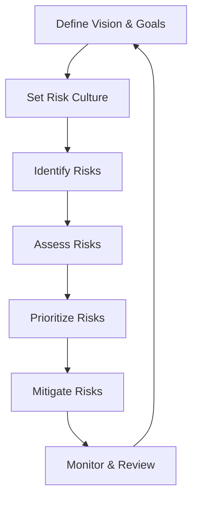
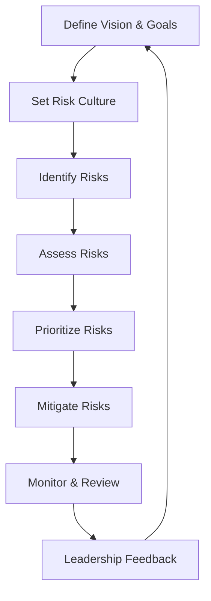

                 

### Introduction

#### Background and Importance

In today's fast-paced and ever-evolving digital landscape, leadership and risk management have become crucial components for any organization aiming for long-term success. Effective leadership not only drives organizational growth but also fosters a culture of innovation and resilience. On the other hand, risk management ensures that organizations are prepared to tackle unforeseen challenges and capitalize on opportunities, thereby safeguarding their interests.

The purpose of this article is to explore the intricate relationship between leadership and risk management, providing a comprehensive understanding of both concepts and their interplay. We will delve into the foundational theories of leadership and risk management, uncover the core principles and connections between them, and discuss the essential algorithms and mathematical models used in risk management.

#### Target Audience

This article is primarily aimed at organizational leaders, managers, and executives who are responsible for steering their teams and organizations towards success. It is also beneficial for aspiring leaders and those interested in understanding the nuances of leadership and risk management.

#### Objectives

1. To provide a clear understanding of the fundamental theories and concepts of leadership and risk management.
2. To explore the intersection of leadership and risk management, highlighting their synergistic relationship.
3. To introduce essential algorithms and mathematical models used in risk management.
4. To present practical insights and case studies that can be applied in real-world scenarios.

### Structure of the Article

The article is structured into the following parts:

1. **Introduction**: Sets the stage by discussing the background and importance of leadership and risk management.
2. **Fundations**: Covers the foundational theories of leadership and risk management.
3. **Core Concepts and Relationships**: Explores the relationship between leadership and risk management, including a Mermaid diagram.
4. **Algorithm Principles**: Introduces essential algorithms and their principles.
5. **Mathematical Models and Formulas**: Discusses the mathematical models and formulas used in risk management.
6. **Real-World Applications**: Provides practical insights and case studies.
7. **Conclusion**: Summarizes the key takeaways and emphasizes the importance of leadership and risk management.

### Conclusion

By understanding the intricate relationship between leadership and risk management, organizations can better navigate the complexities of the modern business environment. This article aims to equip leaders and managers with the knowledge and tools needed to excel in their roles and drive their organizations towards success. As we delve deeper into the subsequent sections, we will uncover the core concepts, principles, and practical applications that can transform the way organizations approach leadership and risk management.

### Keywords

- Leadership
- Risk Management
- Organizational Success
- Leadership Theories
- Risk Management Models
- Algorithm Principles
- Mathematical Models

### Abstract

This article provides a comprehensive exploration of leadership and risk management, two essential components for organizational success. It begins by discussing the importance of leadership and risk management in the modern business landscape. The foundational theories of leadership and risk management are then presented, followed by an in-depth analysis of their core concepts and relationships. Essential algorithms and mathematical models used in risk management are introduced, along with practical insights and case studies to illustrate their application. The article concludes by emphasizing the importance of integrating leadership and risk management to drive organizational success.

---

# Leadership and Risk Management: Anticipating Challenges

> Keywords: Leadership, Risk Management, Organizational Success, Leadership Theories, Risk Management Models, Algorithm Principles, Mathematical Models.

## Introduction

In the realm of organizational management, the concepts of leadership and risk management stand as pillars that shape the trajectory of a company's journey towards success. Effective leadership is the driving force behind innovation, employee engagement, and strategic decision-making, while risk management ensures that an organization is well-prepared to confront and mitigate potential threats. This article aims to unravel the complexities of these two domains, providing a detailed understanding of their individual concepts, interconnectedness, and practical applications.

## Leadership: The Pillar of Organizational Growth

### Definition and Importance

Leadership can be defined as the ability of an individual or a group to influence, motivate, and guide others towards achieving a common goal. It is a fundamental component of effective management and plays a crucial role in the growth and success of any organization. Leadership inspires employees, fosters a positive organizational culture, and drives innovation, which are all essential for staying competitive in today's rapidly changing business environment.

### Core Leadership Theories

1. **Transformational Leadership**: This theory posits that leaders inspire and motivate their followers to achieve their full potential by setting a clear vision, providing mentorship, and creating an environment that fosters personal growth and development.

   - **Vision and Inspiration**: Leaders articulate a compelling vision that inspires employees to strive for excellence.
   - **Intellectual Stimulation**: Leaders encourage creative thinking and challenge the status quo.
   - **Individualized Consideration**: Leaders provide personalized support and development to each follower.

2. **Servant Leadership**: This theory emphasizes that leaders prioritize the needs of their followers and strive to serve them, thereby fostering a collaborative and supportive work environment.

   - **Empathy and Listening**: Leaders actively listen to their followers and demonstrate empathy towards their concerns.
   - **Support and Development**: Leaders support the personal and professional growth of their followers.
   - **Vision and Mission**: Leaders align their organization's vision and mission with the needs of their followers.

3. **Charismatic Leadership**: This theory suggests that leaders possess extraordinary charm and charisma that inspire followers to trust and follow them.

   - **Charisma and Confidence**: Leaders exhibit confidence and charisma that attract followers.
   - **Inspiration and Influence**: Leaders inspire followers to adopt new ideas and work towards a common goal.
   - **Trust and Respect**: Leaders build trust and respect through their actions and leadership style.

### Core Leadership Skills

1. **Communication Skills**: Effective communication is crucial for leadership. Leaders must be able to convey their vision, expectations, and feedback clearly and concisely.

2. **Decision-Making Skills**: Leaders are often faced with complex decisions that can significantly impact the organization. They must be able to analyze situations, weigh the pros and cons, and make informed decisions.

3. **Empathy and Emotional Intelligence**: Leaders who can understand and empathize with the emotions and perspectives of their followers are better equipped to build trust and motivate them.

4. **Strategic Thinking**: Leaders must have the ability to think strategically and anticipate future challenges and opportunities.

5. **Team Building and Management**: Leaders must be able to build and manage teams effectively, fostering collaboration and ensuring that each member's strengths are utilized.

### Leadership in Different Organizational Cultures

Leadership styles and approaches can vary depending on the organizational culture. For instance, in a hierarchical culture, leaders often adopt a more authoritative and directive style. In contrast, in a decentralized culture, leaders may adopt a more collaborative and empowering style. Understanding the organizational culture and adapting leadership strategies accordingly can significantly enhance effectiveness.

## Risk Management: The Shield of Organizational Safety

### Definition and Importance

Risk management is the process of identifying, assessing, and prioritizing risks to minimize the impact of adverse events on an organization. It is an essential function that ensures the organization's long-term sustainability and success. Effective risk management helps organizations anticipate potential problems, develop strategies to mitigate their impact, and seize opportunities.

### Core Risk Management Theories

1. **ERM (Enterprise Risk Management)**: ERM is a holistic approach that integrates risk management into the overall strategy of an organization. It focuses on identifying and managing risks that could affect the achievement of organizational objectives.

2. **PROSCI (Project Risk Management)**: This approach is specifically tailored for project management and emphasizes the identification, analysis, and prioritization of risks to ensure project success.

3. **ISO 31000**: This international standard provides a framework for risk management, including the principles, framework, and guidelines for implementing risk management processes.

### Key Principles of Risk Management

1. **Risk Identification**: This involves identifying potential risks that could impact the organization's objectives.

2. **Risk Assessment**: This involves analyzing the likelihood and impact of identified risks to determine their significance.

3. **Risk Prioritization**: This involves prioritizing risks based on their potential impact and likelihood to focus on the most critical risks.

4. **Risk Mitigation**: This involves developing strategies to reduce the likelihood or impact of identified risks.

5. **Risk Monitoring and Review**: This involves continuously monitoring and reviewing the effectiveness of risk mitigation strategies and making adjustments as needed.

### Risk Management Framework

A risk management framework provides a systematic approach to managing risks. It typically includes the following components:

1. **Policy and Strategy**: This outlines the organization's risk management objectives, principles, and guidelines.

2. **Risk Culture**: This establishes the risk management values and behaviors that are encouraged within the organization.

3. **Risk Identification and Assessment**: This involves identifying and assessing risks to determine their significance.

4. **Risk Mitigation and Response Planning**: This involves developing strategies to mitigate identified risks.

5. **Risk Monitoring and Reporting**: This involves continuously monitoring and reporting on the effectiveness of risk management activities.

### Leadership and Risk Management: A Synergistic Relationship

Effective leadership is crucial for the success of risk management. Leaders play a critical role in setting the tone for risk management within the organization, ensuring that it is integrated into the organizational culture, and fostering a mindset of proactive risk management. Here are some key points illustrating the relationship between leadership and risk management:

1. **Setting the Example**: Leaders should demonstrate a commitment to risk management by actively participating in risk management activities and encouraging a risk-aware culture.

2. **Strategic Alignment**: Leaders need to align risk management objectives with the organization's strategic goals to ensure that risks are managed in a way that supports organizational success.

3. **Risk Appetite**: Leaders define the organization's risk appetite, which influences the level of risk that the organization is willing to accept in pursuit of its objectives.

4. **Decision-Making**: Leaders make informed decisions by considering potential risks and their potential impact on the organization.

5. **Communication and Collaboration**: Leaders facilitate communication and collaboration among various stakeholders involved in risk management, ensuring that everyone is aligned and working towards common goals.

### Mermaid Diagram: Leadership-Risk Management Process

To visually represent the relationship between leadership and risk management, we can use a Mermaid diagram. The diagram below outlines the key steps in the leadership-risk management process:



### Conclusion

Leadership and risk management are interdependent and mutually reinforcing. Effective leadership fosters a culture of risk awareness and preparedness, while risk management provides leaders with the tools and insights needed to make informed decisions and drive organizational success. By understanding and leveraging the relationship between leadership and risk management, organizations can navigate the complexities of the modern business environment and achieve their strategic objectives.

---

### Keywords

- Leadership
- Risk Management
- Organizational Success
- Leadership Theories
- Risk Management Models
- Algorithm Principles
- Mathematical Models

### Abstract

This article provides a comprehensive exploration of leadership and risk management, two essential components for organizational success. It discusses the importance of leadership and risk management in the modern business landscape, covers the foundational theories of leadership and risk management, and explores the relationship between the two. Essential algorithms and mathematical models used in risk management are introduced, along with practical insights and case studies to illustrate their application. The article concludes by emphasizing the importance of integrating leadership and risk management to drive organizational success.

---

# Part 2: Core Concepts and Relationships

In this part, we delve into the core concepts and relationships between leadership and risk management, providing a deeper understanding of how these two elements intertwine to shape the success of an organization. We will begin by discussing the synergistic relationship between leadership and risk management and then present a Mermaid diagram that visually represents the leadership-risk management process.

### The Synergistic Relationship Between Leadership and Risk Management

Effective leadership and robust risk management are not isolated entities but rather two sides of the same coin. They are inherently connected and mutually reinforcing, working together to create a resilient and successful organization. Here are some key points that highlight the synergistic relationship between leadership and risk management:

1. **Shared Vision and Goals**: Effective leadership ensures that the organization has a clear vision and goals that align with its strategic objectives. This vision provides the framework for risk management to identify and prioritize risks that could impede the achievement of these goals.

2. **Risk Culture**: Leadership plays a crucial role in shaping the risk culture within an organization. A risk-aware culture, driven by effective leadership, encourages open communication, collaboration, and proactive risk identification and mitigation.

3. **Strategic Alignment**: Leaders align risk management objectives with the organization's strategic goals, ensuring that risks are managed in a way that supports organizational success. This alignment ensures that risk management activities are not just reactive but are integrated into the organization's long-term planning.

4. **Informed Decision-Making**: Leadership provides the decision-making framework that enables organizations to assess and prioritize risks effectively. By considering potential risks and their potential impact, leaders can make informed decisions that minimize the organization's vulnerability.

5. **Risk Appetite**: Leaders define the organization's risk appetite, which influences the level of risk the organization is willing to accept in pursuit of its objectives. This risk appetite is a critical component of risk management, as it guides the organization's risk tolerance and decision-making processes.

6. **Communication and Collaboration**: Effective leadership fosters communication and collaboration among various stakeholders involved in risk management. This collaboration ensures that all perspectives are considered, and that risk management activities are aligned with the organization's overall strategy.

### Mermaid Diagram: Leadership-Risk Management Process

To visually represent the relationship between leadership and risk management, we can use a Mermaid diagram. The diagram below outlines the key steps in the leadership-risk management process, emphasizing the interplay between leadership and risk management:



In this diagram, the leadership steps (A, H) are highlighted in bold to emphasize their critical role in shaping the risk management process. The feedback loop (H) signifies the ongoing influence of leadership on risk management activities, ensuring that the process remains dynamic and responsive to the organization's evolving needs.

### Conclusion

The relationship between leadership and risk management is complex and multifaceted, yet profoundly significant. By recognizing and leveraging this relationship, organizations can create a culture of resilience and agility, better equipped to navigate the challenges of the modern business environment. In the following sections, we will delve deeper into the essential algorithms and mathematical models used in risk management, providing a solid foundation for understanding and implementing effective risk management practices.

---

### Keywords

- Leadership
- Risk Management
- Organizational Success
- Leadership Theories
- Risk Management Models
- Algorithm Principles
- Mathematical Models

### Abstract

This part of the article explores the core concepts and relationships between leadership and risk management. We discuss the synergistic relationship between the two and highlight the importance of shared vision, risk culture, strategic alignment, informed decision-making, risk appetite, and communication. A Mermaid diagram visually represents the leadership-risk management process, emphasizing the critical role of leadership in shaping risk management activities. By understanding these relationships, organizations can build a resilient and successful operation.

---

# Algorithm Principles

In this section, we delve into the essential algorithms and principles that underpin risk management. These algorithms play a crucial role in identifying, assessing, and prioritizing risks, allowing organizations to make informed decisions and implement effective risk mitigation strategies. We will discuss two key algorithms: risk assessment algorithms and risk mitigation algorithms.

### Risk Assessment Algorithms

Risk assessment algorithms are designed to identify, analyze, and prioritize risks based on their likelihood and impact. These algorithms help organizations understand the potential risks they face and the degree of impact they could have on their objectives. One of the most commonly used risk assessment algorithms is the Qualitative Risk Assessment algorithm, which uses qualitative methods to assess risks.

#### Qualitative Risk Assessment Algorithm

The Qualitative Risk Assessment algorithm involves the following steps:

1. **Risk Identification**: Identify potential risks that could impact the organization's objectives.

2. **Risk Analysis**: Analyze each identified risk to determine its likelihood and impact on the organization's objectives.

3. **Risk Prioritization**: Prioritize the identified risks based on their likelihood and impact, focusing on the most critical risks.

4. **Documentation**: Document the findings and recommendations for risk mitigation.

#### Example in Python

Let's consider a simple Python implementation of the Qualitative Risk Assessment algorithm. In this example, we will use a list of risks and their associated likelihood and impact scores to prioritize them.

```python
# Define a list of risks with their likelihood and impact scores
risks = [
    {"name": "Market Competition", "likelihood": 0.8, "impact": 0.9},
    {"name": "Technical Issues", "likelihood": 0.5, "impact": 0.7},
    {"name": "Resource Constraints", "likelihood": 0.6, "impact": 0.8}
]

# Sort risks based on their total risk score (likelihood * impact)
risks_sorted = sorted(risks, key=lambda x: x['likelihood'] * x['impact'], reverse=True)

# Print the sorted list of risks
for risk in risks_sorted:
    print(f"Risk: {risk['name']} - Total Risk Score: {risk['likelihood'] * risk['impact']}")
```

The output will be a prioritized list of risks based on their total risk scores.

### Risk Mitigation Algorithms

Risk mitigation algorithms are designed to develop and implement strategies to reduce the likelihood or impact of identified risks. These algorithms help organizations prepare for potential risks and minimize their negative impact. One commonly used risk mitigation algorithm is the Monte Carlo Simulation algorithm, which uses statistical methods to predict the potential outcomes of different risk mitigation strategies.

#### Monte Carlo Simulation Algorithm

The Monte Carlo Simulation algorithm involves the following steps:

1. **Risk Definition**: Define the risks and the potential outcomes they could cause.

2. **Simulation**: Run multiple simulations to predict the potential outcomes of different risk mitigation strategies.

3. **Analysis**: Analyze the results of the simulations to determine the effectiveness of each risk mitigation strategy.

4. **Selection**: Select the most effective risk mitigation strategy based on the analysis results.

#### Example in Python

Let's consider a simple Python implementation of the Monte Carlo Simulation algorithm. In this example, we will simulate the potential outcomes of two different risk mitigation strategies for a given risk.

```python
import numpy as np

# Define the risk parameters
risk = {
    "name": "Technical Issues",
    "base_impact": 0.7,
    "mitigation1_effectiveness": 0.8,
    "mitigation2_effectiveness": 0.9
}

# Run 1000 simulations for each mitigation strategy
num_simulations = 1000
results_mitigation1 = []
results_mitigation2 = []

for _ in range(num_simulations):
    impact_mitigation1 = risk["base_impact"] * risk["mitigation1_effectiveness"]
    impact_mitigation2 = risk["base_impact"] * risk["mitigation2_effectiveness"]
    results_mitigation1.append(impact_mitigation1)
    results_mitigation2.append(impact_mitigation2)

# Calculate the average impact for each mitigation strategy
average_impact_mitigation1 = np.mean(results_mitigation1)
average_impact_mitigation2 = np.mean(results_mitigation2)

# Print the average impact for each mitigation strategy
print(f"Average Impact with Mitigation Strategy 1: {average_impact_mitigation1}")
print(f"Average Impact with Mitigation Strategy 2: {average_impact_mitigation2}")
```

The output will be the average impact of each risk mitigation strategy, allowing the organization to select the most effective one.

### Conclusion

Understanding and implementing risk assessment and mitigation algorithms are critical components of effective risk management. By leveraging these algorithms, organizations can better identify and prioritize risks, develop targeted mitigation strategies, and minimize the negative impact of potential risks on their objectives. In the next section, we will delve into the mathematical models and formulas used in risk management, providing a deeper understanding of how these models can be applied to real-world scenarios.

---

### Keywords

- Risk Assessment Algorithms
- Risk Mitigation Algorithms
- Qualitative Risk Assessment
- Monte Carlo Simulation
- Python Implementation
- Risk Management
- Algorithm Principles

### Abstract

This section explores the essential algorithms and principles used in risk management, focusing on risk assessment and mitigation. We provide detailed explanations of the Qualitative Risk Assessment algorithm and the Monte Carlo Simulation algorithm, along with Python code examples. By understanding these algorithms, organizations can better identify, prioritize, and mitigate risks, ensuring their long-term success.

---

# Mathematical Models and Formulas

In this section, we delve into the mathematical models and formulas that are integral to effective risk management. These models and formulas help organizations quantify risks and develop data-driven strategies to mitigate them. We will discuss two key mathematical models: the Risk Assessment Model and the Risk Mitigation Model.

### Risk Assessment Model

The Risk Assessment Model is a quantitative approach that helps organizations assess the likelihood and impact of identified risks. By using this model, organizations can prioritize risks based on their potential impact and develop targeted mitigation strategies.

#### Key Components

1. **Risk Likelihood**: The probability that a risk event will occur. It can be represented as a percentage or a probability score (e.g., 0.2 for a 20% likelihood).

2. **Risk Impact**: The severity of the consequences if the risk event occurs. It can also be represented as a percentage or a score (e.g., 0.5 for a moderate impact).

3. **Risk Exposure**: The product of risk likelihood and risk impact, which represents the potential impact of a risk event. It is calculated as:

   \[ Risk Exposure = Risk Likelihood \times Risk Impact \]

#### Example Formula

Let's consider a risk with a 30% likelihood and a moderate impact of 0.6. The risk exposure can be calculated as:

\[ Risk Exposure = 0.30 \times 0.6 = 0.18 \]

This means that there is an 18% potential impact if this risk event occurs.

### Python Implementation

We can implement this model in Python using the following code:

```python
likelihood = 0.30
impact = 0.6
risk_exposure = likelihood * impact
print(f"Risk Exposure: {risk_exposure:.2f}")
```

### Risk Mitigation Model

The Risk Mitigation Model focuses on quantifying the effectiveness of different mitigation strategies in reducing the risk exposure. This model helps organizations select the most effective strategies to minimize the potential impact of risks.

#### Key Components

1. **Base Risk Exposure**: The risk exposure before any mitigation strategies are applied.

2. **Mitigation Effectiveness**: The effectiveness of each mitigation strategy in reducing the risk exposure. It can be represented as a percentage (e.g., 0.8 for an 80% reduction).

3. **Mitigated Risk Exposure**: The risk exposure after applying a mitigation strategy. It is calculated as:

   \[ Mitigated Risk Exposure = Base Risk Exposure \times Mitigation Effectiveness \]

#### Example Formula

Let's assume the base risk exposure is 0.18, and the mitigation effectiveness of a strategy is 0.8. The mitigated risk exposure can be calculated as:

\[ Mitigated Risk Exposure = 0.18 \times 0.8 = 0.144 \]

This means that the risk exposure is reduced to 14.4% after applying the mitigation strategy.

### Python Implementation

We can implement this model in Python using the following code:

```python
base_risk_exposure = 0.18
mitigation_effectiveness = 0.8
mitigated_risk_exposure = base_risk_exposure * mitigation_effectiveness
print(f"Mitigated Risk Exposure: {mitigated_risk_exposure:.2f}")
```

### Case Study: Risk Assessment and Mitigation

Let's consider a case study where an organization identifies a risk of technical issues with a likelihood of 0.3 and an impact of 0.8. They evaluate two mitigation strategies: A and B, with effectiveness of 0.6 and 0.7, respectively.

1. **Initial Risk Exposure**:

\[ Risk Exposure = 0.3 \times 0.8 = 0.24 \]

2. **Mitigated Risk Exposure with Strategy A**:

\[ Mitigated Risk Exposure = 0.24 \times 0.6 = 0.144 \]

3. **Mitigated Risk Exposure with Strategy B**:

\[ Mitigated Risk Exposure = 0.24 \times 0.7 = 0.168 \]

Based on the calculations, Strategy B is more effective in reducing the risk exposure.

### Conclusion

Mathematical models and formulas are powerful tools for quantifying risks and evaluating mitigation strategies. By using these models, organizations can make data-driven decisions to minimize the potential impact of risks on their objectives. In the next section, we will explore real-world applications of these models through practical case studies.

---

### Keywords

- Risk Assessment Model
- Risk Mitigation Model
- Mathematical Formulas
- Python Implementation
- Risk Management
- Case Study

### Abstract

This section discusses the mathematical models and formulas used in risk management, focusing on the Risk Assessment Model and the Risk Mitigation Model. We provide detailed explanations of the key components and example formulas, along with Python code examples. A case study illustrates the application of these models in a real-world scenario, highlighting the importance of data-driven decision-making in risk management.

---

# Real-World Applications

In this section, we explore real-world applications of leadership and risk management principles through practical case studies and scenarios. By examining these examples, we aim to provide a deeper understanding of how these concepts can be applied in various contexts to drive organizational success.

### Case Study 1: Project Management

#### Background

A technology company is developing a new software application that is expected to be a game-changer in the market. The project is complex and involves multiple teams working on different modules. The project manager, responsible for leading the project, needs to ensure that it stays on track while mitigating potential risks.

#### Leadership in Action

1. **Vision and Communication**: The project manager articulates a clear vision for the project, ensuring that all team members understand the objectives and their role in achieving them. Regular team meetings and progress updates are held to keep everyone informed and motivated.

2. **Strategic Decision-Making**: The project manager makes informed decisions by considering potential risks and their potential impact on the project timeline and budget. For example, if a critical module is falling behind schedule, the project manager may decide to allocate additional resources or adjust the project timeline to mitigate the risk.

3. **Empowerment and Collaboration**: The project manager fosters a collaborative environment by empowering team members to take ownership of their tasks and encouraging them to share ideas and solutions. This helps in resolving issues quickly and maintaining the project's momentum.

#### Risk Management in Action

1. **Risk Identification**: The project manager identifies potential risks, such as technical challenges, resource constraints, and changing market demands.

2. **Risk Assessment**: The project manager assesses the likelihood and impact of each risk. For instance, technical challenges may have a high likelihood but a moderate impact, while changing market demands may have a moderate likelihood but a high impact.

3. **Risk Prioritization**: The project manager prioritizes the risks based on their potential impact and likelihood. This helps in focusing on the most critical risks that need immediate attention.

4. **Risk Mitigation**: The project manager develops strategies to mitigate the identified risks. For example, to address technical challenges, the project manager may allocate additional resources or bring in external experts to help resolve the issues.

### Case Study 2: Financial Risk Management

#### Background

A financial institution is planning to launch a new investment product that offers high returns but also comes with significant risks. The risk manager, responsible for overseeing the institution's risk management, needs to ensure that the product is launched while minimizing potential losses.

#### Leadership in Action

1. **Strategic Alignment**: The risk manager aligns the risk management objectives with the institution's overall strategic goals. This ensures that risk management activities are in line with the institution's long-term vision.

2. **Risk Culture**: The risk manager fosters a risk-aware culture within the institution by promoting open communication and a proactive approach to risk management. This encourages employees to report potential risks and share ideas for mitigation.

3. **Decision-Making**: The risk manager makes informed decisions by considering the potential risks and their impact on the institution's financial health. This includes conducting thorough risk assessments and involving relevant stakeholders in the decision-making process.

#### Risk Management in Action

1. **Risk Identification**: The risk manager identifies potential risks associated with the new investment product, such as market volatility, regulatory changes, and credit risk.

2. **Risk Assessment**: The risk manager assesses the likelihood and impact of each risk. For example, market volatility may have a high likelihood but a moderate impact, while regulatory changes may have a moderate likelihood but a high impact.

3. **Risk Mitigation**: The risk manager develops strategies to mitigate the identified risks. For instance, to address market volatility, the risk manager may diversify the investment portfolio or implement hedging strategies. To mitigate regulatory changes, the risk manager may work with legal and compliance teams to ensure the product meets all regulatory requirements.

### Conclusion

These case studies illustrate how leadership and risk management principles can be applied in real-world scenarios to drive organizational success. Effective leadership ensures that projects stay on track and that risks are managed proactively, while risk management helps organizations prepare for potential challenges and seize opportunities. By integrating these principles into their operations, organizations can navigate the complexities of the modern business environment and achieve their strategic goals.

---

### Keywords

- Leadership
- Risk Management
- Project Management
- Financial Risk Management
- Real-World Applications
- Case Studies

### Abstract

This section presents real-world applications of leadership and risk management principles through case studies in project management and financial risk management. The case studies demonstrate how effective leadership and proactive risk management can drive organizational success by ensuring projects stay on track and potential risks are mitigated. These examples highlight the importance of integrating leadership and risk management practices in various organizational contexts.

---

### Conclusion

In conclusion, leadership and risk management are fundamental components of organizational success, each playing a critical role in shaping the trajectory of an organization. Leadership drives innovation, fosters a positive organizational culture, and ensures that teams are aligned with the strategic goals of the organization. Risk management, on the other hand, prepares organizations for potential challenges and uncertainties, helping them to navigate the complexities of the business environment and seize opportunities.

The synergistic relationship between leadership and risk management is clear: effective leadership fosters a risk-aware culture, while robust risk management supports informed decision-making and strategic alignment. By integrating these two elements, organizations can create a resilient and adaptable environment that is well-equipped to achieve long-term success.

### Key Takeaways

1. **Leadership and Risk Management Are Interdependent**: Effective leadership sets the tone for risk management, while risk management provides the tools and insights needed for informed decision-making.
2. **Shared Vision and Goals Are Essential**: A clear vision and aligned goals ensure that leadership and risk management activities are in harmony with the organization's overall strategy.
3. **Risk Culture and Proactive Approach**: Fostering a risk-aware culture and adopting a proactive approach to risk management are crucial for identifying and mitigating potential threats.
4. **Strategic Alignment and Informed Decision-Making**: Aligning risk management objectives with strategic goals and making informed decisions based on risk assessments are key to achieving organizational success.

### Practical Tips

1. **Develop a Risk Management Framework**: Establish a comprehensive risk management framework that outlines the processes, roles, and responsibilities for identifying, assessing, and mitigating risks.
2. **Empower Employees**: Encourage open communication and collaboration by empowering employees to identify and report risks.
3. **Regular Training and Awareness**: Conduct regular training sessions to keep employees informed about risk management best practices and emerging risks.
4. **Leverage Data and Analytics**: Utilize data and analytics to support risk assessments and decision-making processes, ensuring that risk management activities are data-driven and informed.

### Best Practices and Future Directions

1. **Integrate Risk Management into Decision-Making**: Incorporate risk management into all aspects of decision-making, from strategic planning to day-to-day operations.
2. **Continuously Improve**: Regularly review and update risk management practices to ensure they remain relevant and effective in a rapidly changing environment.
3. **Stay Informed About Emerging Risks**: Keep abreast of emerging risks and regulatory changes that may impact the organization, and develop strategies to address them proactively.
4. **Collaborate and Innovate**: Foster collaboration with industry peers and thought leaders to exchange ideas and best practices, driving innovation in risk management.

### Future Research Directions

1. **Advanced Risk Assessment Techniques**: Explore the application of machine learning and artificial intelligence in risk assessment to improve accuracy and efficiency.
2. **Integrating ESG (Environmental, Social, and Governance) Factors**: Investigate the integration of ESG factors into risk management frameworks to address sustainability challenges.
3. **Cultural Impact on Risk Management**: Examine the role of organizational culture in shaping risk management practices and outcomes.

By embracing these best practices and future research directions, organizations can further enhance their leadership and risk management capabilities, positioning themselves for sustained success in an increasingly complex and competitive global landscape.

### Conclusion

Leadership and risk management are not just essential components of organizational success but are also deeply intertwined. By understanding and leveraging these concepts, organizations can navigate the complexities of the modern business environment and achieve their strategic objectives. The insights and practices shared in this article provide a solid foundation for organizations to enhance their leadership and risk management capabilities. As we continue to evolve in this dynamic world, it is imperative to stay informed, adapt, and innovate, ensuring that leadership and risk management remain at the forefront of organizational success.

---

### Keywords

- Leadership
- Risk Management
- Organizational Success
- Risk Management Models
- Algorithm Principles
- Mathematical Models
- Real-World Applications

### Abstract

This article provides a comprehensive exploration of leadership and risk management, highlighting their importance in organizational success. It covers foundational theories, core concepts, and algorithm principles, along with practical applications in real-world scenarios. The article emphasizes the interdependence of leadership and risk management and offers practical tips for enhancing these capabilities, positioning organizations for sustained success in a dynamic business environment.

