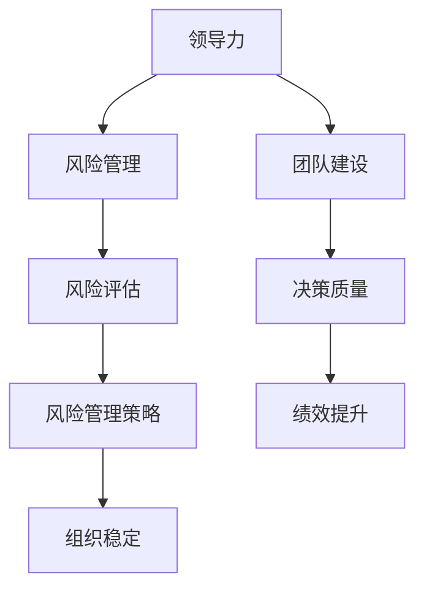

                 

# 领导力与风险评估：未雨绸缪的智慧

## 关键词

- 领导力
- 风险评估
- 智慧决策
- 团队建设
- 组织文化
- 风险管理

## 摘要

本文将深入探讨《领导力与风险评估：未雨绸缪的智慧》一书的核心内容和主题思想。文章首先介绍领导力的基础概念和重要性，详细分析领导风格与策略，探讨领导力在实践中的应用。随后，文章转向风险评估，解释风险评估的定义、重要性及流程，探讨不同的风险评估方法。最后，文章总结风险管理策略，并提供实用的最佳实践和扩展阅读资源。通过系统化的分析和实际案例的解析，本文旨在帮助读者理解和应用领导力和风险评估的智慧，为未来的决策提供有力支持。

---

## 引言

在当今快速变化和充满不确定性的商业环境中，领导力和风险评估成为企业成功的关键要素。有效的领导力不仅能够激发团队的潜力，提高工作效率，还能在面临挑战时保持组织的稳定和前进。《领导力与风险评估：未雨绸缪的智慧》这本书，正是围绕这一主题，深入探讨了如何通过提升领导力和进行有效的风险评估，为组织的发展奠定坚实基础。

### 背景介绍

领导力与风险评估的重要性在于，它们不仅影响组织的短期绩效，更对长期可持续性产生深远影响。领导力关乎如何激发和引导团队成员，使其在充满不确定性的环境中保持高效和积极。而风险评估则关注如何预见潜在风险，制定相应的应对策略，从而降低不确定性带来的负面影响。

### 核心概念与联系

为了更好地理解领导力与风险评估的关系，我们可以使用Mermaid流程图来展示它们之间的相互作用。



从流程图中可以看出，领导力通过团队建设和决策质量影响风险评估，而风险评估又通过风险管理策略影响组织的绩效和稳定性。

### 研究目的与方法

本文旨在通过详细分析《领导力与风险评估：未雨绸缪的智慧》一书的内容，帮助读者理解领导力与风险评估的核心概念及其应用。文章将采用逻辑推理和案例分析的方法，结合实际案例，深入探讨领导力与风险评估的实践应用。

### 结论与展望

通过对领导力和风险评估的系统探讨，本文期望能够为读者提供实用的指导，帮助他们在面对复杂环境时做出更加明智的决策。同时，本文也希望通过案例分析，激发读者对这一主题的深入思考和进一步研究。

---

在接下来的章节中，我们将详细探讨领导力的基础概念、领导风格与策略，以及领导力在实践中的应用。随后，我们将转向风险评估，解释其重要性、流程和方法，并探讨风险管理策略。通过这些内容的深入分析，读者将能够全面理解领导力与风险评估的智慧，为组织的发展和成功提供有力支持。

## 第1章 领导力基础

领导力是任何组织成功的关键要素，它不仅仅是管理团队的技巧，更是一种激发和引导团队成员共同实现目标的能力。在本章中，我们将深入探讨领导力的定义与重要性，以及领导力的发展历程和核心要素。

### 1.1 领导力的定义与重要性

领导力可以被定义为一种通过影响力、榜样作用和激励，推动个人和团队实现目标的能力。它不仅仅是职位赋予的权力，更是基于信任、尊重和信任的领导艺术。

**领导力的定义**：
- 领导力是一种影响力，它能够激发和引导他人共同实现目标。
- 领导力是一种能力，它不仅包括管理技能，还包括沟通、决策和变革管理能力。
- 领导力是一种态度，它关乎如何面对挑战和不确定性，保持积极的心态和行动力。

**领导力的重要性**：
- **团队效率提升**：有效的领导力能够激发团队成员的潜力，提高团队的整体工作效率和绩效。
- **组织稳定与成长**：领导力是保持组织稳定和持续成长的关键，它关乎如何应对变化和不确定性。
- **文化塑造**：领导力直接影响组织的文化，塑造员工的价值观和行为准则，形成积极向上的组织氛围。

### 1.2 领导力的发展历程

领导力的发展历程可以分为以下几个阶段：

**1. 传统领导力理论**：
- **X理论**：强调权威和控制，认为员工需要严格管理和监督。
- **Y理论**：强调激励和自主性，认为员工具有自我管理和自我激励的能力。

**2. 趋势性领导力理论**：
- **情境领导理论**：由赫塞和布兰查德提出，强调领导风格应根据不同情境灵活调整。
- **变革型领导理论**：由伯恩斯提出，强调领导者的变革能力和对团队的影响力。

**3. 当代领导力理论**：
- **基于价值的领导力**：强调领导者应以价值观为基础，建立共同目标和愿景。
- **分布式领导力**：强调领导力不应仅限于管理层，而应在整个组织内广泛分布。

### 1.3 领导力的核心要素

领导力包括多个核心要素，这些要素相互作用，共同推动组织的成功。以下是领导力的核心要素：

**1. 自我认知**：
- **领导者需要了解自己的价值观、动机和优势，以及如何克服自身劣势**。
- **通过自我反思和持续学习，领导者能够不断提升自我认知，保持清晰的思维和行动方向**。

**2. 沟通能力**：
- **领导者需要具备有效的沟通能力，包括口头、书面和肢体语言**。
- **良好的沟通能够建立信任、传递信息并激发团队成员的积极性**。

**3. 情绪智能**：
- **领导者需要具备情绪智能，包括自我情绪管理和对他人的情感理解**。
- **通过理解和应对情绪，领导者能够更好地处理冲突、激励团队并建立积极的人际关系**。

**4. 决策能力**：
- **领导者需要具备高效的决策能力，能够在面对复杂和不确定的情况下做出明智的选择**。
- **通过收集信息、分析数据和评估风险，领导者能够制定合理的决策策略，并引导团队执行**。

**5. 影响力**：
- **领导者需要具备影响力，能够通过榜样作用和激励，影响团队成员的行为和态度**。
- **通过建立信任和尊重，领导者能够有效地推动变革和创新，实现组织的长远目标**。

### 综述

领导力是组织成功的关键要素，它不仅关乎如何激发和引导团队成员，更关乎如何面对变化和不确定性，保持组织的稳定和持续成长。通过理解领导力的定义、发展历程和核心要素，读者能够更好地认识领导力的重要性，并在实际工作中应用这些理论，提升自己的领导能力。

---

在下一章中，我们将深入探讨领导风格与策略，解释不同的领导风格类型，并探讨领导力与组织文化之间的关系。通过这些内容的分析，读者将能够更好地理解领导力的应用和实践。

## 第2章 领导风格与策略

领导风格是指领导者通过行为和态度影响团队成员的方式。不同的领导风格适用于不同的情境和团队，选择合适的领导风格对于提升团队效率和实现组织目标至关重要。在本章中，我们将详细分析领导风格的类型，探讨领导策略与团队建设，以及领导力与组织文化之间的关系。

### 2.1 领导风格的类型

领导风格可以分为以下几种类型：

**1. 权威型领导风格**：
- **定义**：权威型领导者倾向于集中决策权力，严格控制团队成员的行为。
- **优点**：能够迅速做出决策并确保执行力，适用于紧急情况或需要严格纪律的团队。
- **缺点**：可能导致团队成员缺乏自主性和创造力，长期依赖领导者的决策。

**2. 民主型领导风格**：
- **定义**：民主型领导者鼓励团队成员参与决策过程，尊重成员的意见和建议。
- **优点**：增强团队凝聚力，提高团队成员的参与度和责任感，有利于创新和团队合作。
- **缺点**：决策过程可能较为缓慢，需要投入更多时间和精力。

**3. 赋权型领导风格**：
- **定义**：赋权型领导者给予团队成员更多的自主权和决策权，鼓励他们独立思考和解决问题。
- **优点**：提高团队成员的自我管理能力和创造力，增强团队自主性和责任感。
- **缺点**：需要高度信任和良好的沟通机制，否则可能导致混乱和责任不清。

**4. 变革型领导风格**：
- **定义**：变革型领导者通过激励和榜样作用，推动团队进行变革和创新。
- **优点**：能够激发团队成员的潜力，推动组织实现变革和持续成长。
- **缺点**：变革过程中可能面临阻力和不确定性，需要领导者具备较强的变革管理能力。

**5. 情境型领导风格**：
- **定义**：情境型领导者根据不同情境灵活调整领导风格，以适应团队成员的需求和团队目标。
- **优点**：能够最大限度地发挥团队成员的潜力，提高团队效率和绩效。
- **缺点**：需要领导者具备较高的情境识别能力和灵活性。

### 2.2 领导策略与团队建设

领导策略是指领导者通过不同的方法和手段，引导和激励团队成员实现团队目标的过程。以下是几种常见的领导策略：

**1. 目标导向策略**：
- **定义**：领导者明确团队目标，并与团队成员共同制定具体行动计划。
- **优点**：提高团队目标感和执行力，有助于团队明确方向和任务。
- **缺点**：需要领导者具备较强的目标设定和沟通能力，否则可能导致目标模糊或执行不力。

**2. 激励策略**：
- **定义**：领导者通过奖励和激励，激发团队成员的积极性和创造力。
- **优点**：增强团队凝聚力，提高团队成员的满意度和忠诚度。
- **缺点**：过度依赖物质激励可能导致团队成员的功利主义和短期行为。

**3. 变革管理策略**：
- **定义**：领导者通过推动团队进行变革，以适应外部环境的变化。
- **优点**：有助于团队应对外部挑战，实现持续成长和竞争力提升。
- **缺点**：变革过程中可能面临阻力和不确定性，需要领导者具备较强的变革管理能力。

**4. 沟通策略**：
- **定义**：领导者通过有效的沟通，建立与团队成员之间的信任和合作关系。
- **优点**：增强团队成员之间的理解和支持，提高团队协作效率。
- **缺点**：需要领导者具备良好的沟通技巧和人际关系处理能力。

### 2.3 领导力与组织文化

组织文化是指组织内部的价值观、信念和行为准则，它对领导力有着深远的影响。有效的领导力与组织文化相互促进，共同推动组织的成功。

**1. 组织文化的形成**：
- **定义**：组织文化是组织在长期发展中形成的共同价值观和行为准则。
- **形成因素**：组织的历史、领导者的风格、团队互动和外部环境等。

**2. 领导力与组织文化的关系**：
- **领导力塑造组织文化**：领导者的行为和态度对组织文化有重要影响。领导者通过言行一致，树立榜样，推动组织文化的形成。
- **组织文化影响领导力**：组织文化对领导者的行为和决策有重要影响。积极向上的组织文化能够激发领导者的潜力，提高领导力水平。

**3. 领导力与组织文化的互动**：
- **相互促进**：领导力通过塑造和推动组织文化，提高组织的凝聚力和执行力；组织文化通过支持领导力，增强领导者的权威和影响力。
- **相互制约**：领导力在塑造组织文化时，需要考虑组织文化的现状和特点；组织文化在影响领导力时，也需要适应领导者的风格和需求。

### 综述

领导风格与策略是领导力的重要组成部分，不同的领导风格和策略适用于不同的情境和团队。通过选择合适的领导风格和策略，领导者能够有效地激发团队成员的潜力，提高团队效率和绩效。同时，领导力与组织文化之间的关系也表明，有效的领导力需要与组织文化相互融合，共同推动组织的持续成长和成功。

在下一章中，我们将探讨领导力在实践中的应用，分析领导者如何自我提升，如何在面对挑战时表现卓越，以及成功领导者的特质。通过这些内容的深入分析，读者将能够更好地理解领导力在实践中的实际应用。

## 第3章 领导力实践

领导力不仅仅是理论上的探讨，更需要在实际工作中得到有效应用。本章将深入探讨领导力在实践中的应用，分析领导者如何自我提升，如何在面对挑战时表现卓越，以及成功领导者的特质。

### 3.1 领导者自我提升

领导者自我提升是提升领导力的重要环节。以下是一些自我提升的方法：

**1. 学习与反思**：
- **持续学习**：领导者应不断学习新的知识和技能，以适应快速变化的环境。
- **反思与总结**：通过定期反思和总结，领导者可以识别自身的优势和不足，并制定改进计划。

**2. 沟通能力提升**：
- **有效沟通**：领导者应提高沟通技巧，包括倾听、表达和反馈。
- **跨文化沟通**：在全球化背景下，领导者需要具备跨文化沟通能力，以应对多元化的团队。

**3. 情绪智能培养**：
- **情绪管理**：领导者需要学会管理自己的情绪，保持冷静和理智。
- **情感理解**：领导者应具备对他人的情感理解，以更好地处理冲突和激励团队。

**4. 领导力培训**：
- **参加培训**：领导者可以参加专业培训课程，了解最新的领导力理论和实践。
- **实践交流**：通过与同行交流，领导者可以学习到不同的领导经验和方法。

### 3.2 领导力在面对挑战时的表现

面对挑战是领导者的重要职责。以下是一些领导者在面对挑战时应具备的能力：

**1. 应变能力**：
- **快速决策**：在面临突发情况时，领导者需要迅速做出决策，以降低风险和损失。
- **灵活应对**：领导者应具备灵活应对变化的能力，能够在不同情境下调整策略。

**2. 激励能力**：
- **鼓舞士气**：领导者应通过鼓舞士气，增强团队成员的信心和积极性。
- **激励创新**：领导者应鼓励团队成员进行创新和尝试，以应对挑战和机遇。

**3. 决策能力**：
- **科学决策**：领导者应基于事实和数据，进行科学决策，避免盲目决策。
- **风险评估**：在做出决策前，领导者应对潜在风险进行评估，并制定应对措施。

**4. 沟通能力**：
- **传达信息**：领导者需要有效传达信息，确保团队成员了解任务目标和预期结果。
- **倾听反馈**：领导者应倾听团队成员的意见和建议，及时反馈并调整策略。

### 3.3 成功领导者的特质

成功领导者具备以下特质：

**1. 自信**：
- **自我肯定**：领导者应具备自我肯定的能力，相信自己的决策和领导力。
- **积极态度**：领导者应保持积极的态度，面对挑战和困难时保持乐观和坚定。

**2. 洞察力**：
- **前瞻性**：领导者应具备前瞻性，能够预见潜在的机会和风险，提前制定应对策略。
- **敏锐洞察**：领导者应具备敏锐的洞察力，能够准确判断团队成员的需求和问题。

**3. 诚信**：
- **言行一致**：领导者应言行一致，做到诚信正直，树立榜样作用。
- **建立信任**：领导者应通过诚信和信任，建立与团队成员之间的信任关系。

**4. 激情**：
- **热爱工作**：领导者应对工作充满热情，以激发团队成员的热情和动力。
- **激励他人**：领导者应具备激励他人的能力，能够激发团队成员的激情和创造力。

**5. 团队合作**：
- **协作精神**：领导者应具备协作精神，能够与团队成员建立良好的合作关系。
- **培养人才**：领导者应注重人才培养和团队建设，为团队成员提供成长和发展的机会。

### 综述

领导力实践是领导者在实际工作中应用领导力的过程。通过自我提升、面对挑战和培养成功领导者的特质，领导者能够更好地应对各种复杂情况，提升团队效率和绩效。有效的领导力实践不仅关乎领导者的个人能力和素质，更关乎团队和组织的持续发展和成功。

在下一章中，我们将转向风险评估，探讨风险评估的基础知识，解释风险评估的重要性，并介绍风险评估的流程和方法。通过这些内容的深入分析，读者将能够更好地理解风险评估的核心概念和实践方法。

## 第4章 风险评估基础

风险评估是现代管理中不可或缺的一部分，它帮助企业识别、分析和应对潜在风险，从而保障组织的稳定和可持续发展。在本章中，我们将深入探讨风险评估的基础知识，解释其重要性，并详细介绍风险评估的流程和方法。

### 4.1 风险的定义与类型

**风险**是指在未来可能发生的不确定事件或情况，这些事件或情况可能会对组织的目标、资源或运营产生负面影响。根据风险发生的可能性和影响程度，风险可以分为以下几类：

**1. 财务风险**：
- **定义**：财务风险指的是由于市场变化、债务水平或其他财务因素导致的财务损失。
- **类型**：包括市场风险、信用风险、流动性风险等。

**2. 运营风险**：
- **定义**：运营风险指的是由于内部流程、系统、人员或其他运营因素导致的业务中断或效率降低。
- **类型**：包括系统故障、供应链中断、员工流失等。

**3. 法律风险**：
- **定义**：法律风险指的是由于违反法律法规、合同义务或其他法律问题导致的法律诉讼或损失。
- **类型**：包括合规风险、合同纠纷、知识产权侵权等。

**4. 商业风险**：
- **定义**：商业风险指的是由于市场变化、竞争加剧或其他商业因素导致的业务损失。
- **类型**：包括市场风险、竞争风险、战略风险等。

### 4.2 风险评估的重要性

**风险评估**是管理风险的关键步骤，其重要性体现在以下几个方面：

**1. 预防和降低损失**：
- **定义**：通过评估潜在风险，组织可以采取预防措施，降低风险发生时的损失。
- **实际案例**：一家制造公司通过风险评估发现生产线上的潜在故障，及时进行了设备升级和维护，避免了可能的停产和损失。

**2. 提高决策质量**：
- **定义**：风险评估为决策提供了基于事实和数据的支持，帮助组织做出更加明智的决策。
- **实际案例**：一家金融公司在投资决策前进行了详细的风险评估，发现某些项目存在较高风险，从而避免了可能的亏损。

**3. 保障组织稳定性**：
- **定义**：通过风险评估，组织可以及时发现和应对潜在风险，保障业务的连续性和稳定性。
- **实际案例**：一家电信公司在面对自然灾害风险时，提前制定了应急预案，有效保障了业务的正常运行。

**4. 提升风险管理能力**：
- **定义**：风险评估有助于组织建立和完善风险管理框架，提高整体风险管理能力。
- **实际案例**：一家科技公司通过定期进行风险评估，不断优化其风险管理流程，提高了应对突发事件的能力。

### 4.3 风险评估流程

风险评估通常包括以下几个关键步骤：

**1. 风险识别**：
- **定义**：识别组织所面临的所有潜在风险，包括外部和内部风险。
- **方法**：访谈、问卷调查、头脑风暴等。

**2. 风险分析和评估**：
- **定义**：对识别出的风险进行详细分析，评估其发生概率和影响程度。
- **方法**：概率-影响分析、风险矩阵等。

**3. 风险应对策略制定**：
- **定义**：根据风险评估结果，制定相应的风险应对策略。
- **方法**：风险回避、风险缓解、风险转移等。

**4. 风险监控和报告**：
- **定义**：对已识别的风险进行持续监控，定期更新风险评估报告。
- **方法**：风险管理信息系统、定期审查等。

### 4.4 风险评估方法

风险评估方法可以分为定量和定性两种：

**1. 定量风险评估方法**：
- **定义**：使用定量分析方法评估风险的概率和影响。
- **方法**：概率-影响分析、蒙特卡罗模拟、敏感性分析等。

**2. 定性风险评估方法**：
- **定义**：使用定性分析方法评估风险的性质和严重程度。
- **方法**：专家评估、SWOT分析、决策树等。

**3. 混合风险评估方法**：
- **定义**：结合定量和定性分析方法进行风险评估。
- **方法**：定量-定性结合、多标准决策分析等。

### 综述

风险评估是现代管理的重要工具，通过系统化的风险评估流程和方法，组织可以更好地识别和应对潜在风险，保障业务的稳定和可持续发展。有效的风险评估不仅有助于预防和降低损失，还能提高决策质量，提升组织风险管理能力。在下一章中，我们将详细探讨不同的风险评估方法，包括定量风险评估方法和定性风险评估方法，以及如何将两者结合起来进行综合评估。

### 4.5 风险评估的应用场景

**1. 项目管理**：
- 在项目启动前，通过风险评估可以识别项目可能面临的风险，如技术难题、资金短缺、人力资源不足等。
- 项目执行过程中，定期进行风险评估，可以及时调整项目计划，规避潜在风险。

**2. 财务管理**：
- 通过风险评估，企业可以识别和评估投资项目的风险，如市场风险、信用风险等。
- 根据风险评估结果，企业可以制定相应的风险管理策略，如投资分散、风险回避等。

**3. 供应链管理**：
- 风险评估有助于识别供应链中的潜在风险，如供应商可靠性、物流问题等。
- 通过风险评估，企业可以优化供应链管理，提高供应链的韧性和稳定性。

**4. 企业战略规划**：
- 风险评估可以帮助企业识别外部环境中的潜在风险，如市场竞争、政策变化等。
- 企业可以根据风险评估结果，调整战略规划，降低外部风险的影响。

**5. IT风险管理**：
- 通过风险评估，企业可以识别和评估IT系统中的潜在风险，如系统漏洞、数据泄露等。
- 企业可以采取相应的安全措施，降低IT风险，保障信息系统的安全运行。

### 综述

风险评估在不同的应用场景中发挥着重要作用，通过系统化的风险评估，企业可以更好地识别和应对潜在风险，保障业务的稳定和可持续发展。有效的风险评估不仅有助于预防和降低损失，还能提高决策质量，提升组织风险管理能力。在下一章中，我们将深入探讨具体的定量和定性风险评估方法，并结合实际案例进行详细讲解。

## 第5章 风险评估方法

在本章中，我们将详细探讨风险评估中的两种主要方法：定量风险评估方法和定性风险评估方法。此外，还会介绍如何将这两种方法结合起来，形成混合风险评估方法。通过这些内容，读者将能够全面理解不同风险评估方法的原理和应用。

### 5.1 定量风险评估方法

定量风险评估方法使用数学模型和统计分析工具来量化风险的概率和影响。以下是一些常见的定量风险评估方法：

**1. 概率-影响分析（P-I分析）**

**定义**：概率-影响分析是一种通过评估风险发生的概率和其潜在影响来量化风险的方法。

**步骤**：
- 识别潜在风险。
- 评估每个风险的发生概率。
- 评估每个风险的影响程度。
- 计算风险得分（概率×影响程度）。

**Python代码示例**：

```python
import pandas as pd

# 定义风险数据
risks = pd.DataFrame({
    'Risk': ['市场风险', '技术风险', '财务风险'],
    'Probability': [0.3, 0.2, 0.5],
    'Impact': [3, 2, 4]
})

# 计算风险得分
risks['Risk Score'] = risks['Probability'] * risks['Impact']
risks.sort_values(by='Risk Score', ascending=False, inplace=True)
print(risks)
```

**2. 蒙特卡罗模拟（Monte Carlo Simulation）**

**定义**：蒙特卡罗模拟通过随机抽样和统计分析来评估风险的概率分布和潜在影响。

**步骤**：
- 确定模型参数和分布。
- 生成大量随机样本。
- 使用样本数据计算风险的概率分布和影响。

**Python代码示例**：

```python
import numpy as np
import pandas as pd

# 模拟参数
num_simulations = 1000
mean = 0.5
std_dev = 0.2

# 生成随机样本
samples = np.random.normal(mean, std_dev, num_simulations)

# 计算概率分布
risk_score = pd.Series(samples).mean()
print(f"Average Risk Score: {risk_score:.2f}")
```

**3. 敏感性分析（Sensitivity Analysis）**

**定义**：敏感性分析通过改变模型参数来评估不同参数对风险评估结果的影响。

**步骤**：
- 确定模型的关键参数。
- 改变参数值，计算风险评估结果的变化。
- 识别对模型结果最敏感的参数。

**Python代码示例**：

```python
import pandas as pd

# 参数和结果数据
params = pd.DataFrame({
    'Parameter': ['Cost', 'Time', 'Quality'],
    'Initial Value': [1000, 10, 0.9],
    'Change Value': [-20, 5, 0.1]
})

# 计算敏感性
params['Result'] = params.apply(lambda row: row['Initial Value'] + row['Change Value'], axis=1)
params.sort_values(by='Result', ascending=False, inplace=True)
print(params)
```

### 5.2 定性风险评估方法

定性风险评估方法主要通过专家评估和主观判断来评估风险。以下是一些常见的定性风险评估方法：

**1. 专家评估（Expert Judgement）**

**定义**：专家评估依赖于领域专家的主观判断和经验来评估风险。

**步骤**：
- 组建专家团队。
- 收集专家意见。
- 综合专家意见，评估风险。

**2. SWOT分析（SWOT Analysis）**

**定义**：SWOT分析是一种通过分析组织的优势（Strengths）、劣势（Weaknesses）、机会（Opportunities）和威胁（Threats）来评估风险的方法。

**步骤**：
- 识别组织的SWOT。
- 分析SWOT之间的关系。
- 评估SWOT对风险的影响。

**3. 决策树（Decision Tree）**

**定义**：决策树通过展示不同决策路径和结果来评估风险。

**步骤**：
- 确定决策节点。
- 列出可能的决策路径。
- 评估每个路径的结果和风险。

**4. 风险矩阵（Risk Matrix）**

**定义**：风险矩阵通过展示风险的概率和影响，以图形形式评估风险。

**步骤**：
- 确定风险的概率和影响。
- 在矩阵中定位风险。
- 根据矩阵结果，制定风险应对策略。

### 5.3 混合风险评估方法

混合风险评估方法结合定量和定性方法的优势，提供更加全面和准确的风险评估。

**1. 定量-定性结合**

**定义**：定量-定性结合方法将定量和定性方法结合起来，以提供更全面的风险评估。

**步骤**：
- 使用定量方法评估风险的概率和影响。
- 使用定性方法分析风险的性质和严重程度。
- 综合定量和定性结果，形成综合风险评估。

**2. 多标准决策分析**

**定义**：多标准决策分析通过多个评估标准，结合定量和定性方法，进行综合评估。

**步骤**：
- 确定评估标准。
- 使用定量方法评估每个标准。
- 使用定性方法分析每个标准的重要性。
- 结合评估结果，形成综合风险评估。

### 综述

风险评估方法的选择取决于具体的应用场景和组织需求。定量方法适用于需要精确量化和统计分析的风险评估，定性方法适用于需要主观判断和经验的风险评估。混合风险评估方法结合了定量和定性方法的优势，提供更加全面和准确的风险评估。通过理解这些方法，读者可以更好地选择和应用合适的风险评估方法，为组织的风险管理提供有力支持。

在下一章中，我们将探讨风险管理策略，包括风险应对策略、风险缓解措施以及风险监控与评估。通过这些内容的深入分析，读者将能够全面掌握风险管理的实践方法。

## 第6章 风险管理策略

风险管理策略是确保组织在面临潜在风险时能够采取有效措施，减轻或避免风险影响的关键环节。在本章中，我们将详细探讨风险管理策略的各个方面，包括风险应对策略、风险缓解措施以及风险监控与评估。

### 6.1 风险应对策略

风险应对策略是指组织在面对潜在风险时，采取的具体措施和行动方案。常见的风险应对策略包括：

**1. 风险回避**：
- **定义**：通过改变决策或行动方案，完全避免风险的发生。
- **方法**：如改变项目计划、放弃高风险投资等。

**2. 风险缓解**：
- **定义**：通过采取措施降低风险发生的概率或减少风险带来的影响。
- **方法**：如增加保险、改进流程等。

**3. 风险转移**：
- **定义**：通过将风险转移给第三方，减少自身的风险负担。
- **方法**：如购买保险、签订免责协议等。

**4. 风险接受**：
- **定义**：在不采取具体措施的情况下，接受风险的发生。
- **方法**：适用于风险发生的概率较低或风险带来的影响较小的情况。

### 6.2 风险缓解措施

风险缓解措施是针对具体风险类型，采取的具体措施和行动，以减轻风险的影响。以下是一些常见的风险缓解措施：

**1. 风险预防措施**：
- **定义**：在风险发生前采取的措施，以防止风险的发生。
- **方法**：如培训员工、制定应急预案等。

**2. 风险控制措施**：
- **定义**：在风险发生后，采取的措施，以降低风险的影响。
- **方法**：如立即处理故障、限制资金流动等。

**3. 风险修复措施**：
- **定义**：在风险发生后，采取的措施，以恢复组织的正常运营。
- **方法**：如修复系统故障、恢复数据等。

### 6.3 风险监控与评估

风险监控与评估是确保风险管理策略有效性的关键环节。以下是一些常见的方法和工具：

**1. 风险监控工具**：
- **定义**：用于跟踪和管理风险的工具。
- **方法**：如风险管理信息系统、风险日志等。

**2. 风险评估工具**：
- **定义**：用于评估风险概率和影响程度的工具。
- **方法**：如风险矩阵、决策树等。

**3. 定期评估**：
- **定义**：定期对组织面临的风险进行评估，以更新风险识别和评估结果。
- **方法**：如季度评估、年度评估等。

**4. 实时监控**：
- **定义**：实时跟踪和管理风险，确保及时发现和应对风险。
- **方法**：如实时监控系统、风险预警系统等。

### 实际案例：一家大型制造公司的风险管理实践

**案例背景**：

一家大型制造公司面临多种潜在风险，包括市场风险、财务风险、运营风险等。为了保障业务的稳定和可持续发展，公司决定建立一套全面的风险管理体系。

**1. 风险识别**：
- 公司通过访谈、问卷调查等方式，识别出多种潜在风险。

**2. 风险评估**：
- 公司使用风险矩阵对识别出的风险进行评估，确定风险的概率和影响程度。

**3. 风险应对策略**：
- 针对高风险，公司采取风险回避和风险缓解措施，如改变项目计划、增加保险等。
- 针对中等风险，公司采取风险缓解措施，如培训员工、改进流程等。
- 针对低风险，公司采取风险接受策略。

**4. 风险监控与评估**：
- 公司使用风险管理信息系统，实时跟踪和管理风险。
- 公司定期对风险进行评估，更新风险识别和评估结果。

**5. 风险管理成效**：
- 通过有效的风险管理，公司成功避免了多次潜在风险，保障了业务的稳定和可持续发展。

### 综述

风险管理策略是保障组织稳定和可持续发展的关键。通过制定和实施有效的风险应对策略、采取具体的风险缓解措施，并建立完善的风险监控与评估机制，组织可以更好地应对潜在风险，降低风险影响，保障业务的稳定和可持续发展。在实际操作中，组织应根据自身情况，灵活运用各种风险管理工具和方法，不断优化和完善风险管理实践。

在下一章中，我们将提供一些额外的资源和工具，包括领导力评估工具、风险评估模型以及相关案例分析。通过这些资源的介绍，读者将能够更深入地理解和应用领导力和风险评估的理论和实践。

## 附录

### 附录 A 风险评估工具与资源

为了帮助读者更好地理解和使用领导力和风险评估的理论和实践，本附录提供了一些实用的资源和工具。

#### A.1 领导力评估工具

**1. 领导力360度评估**：
- **定义**：通过多角度对领导力进行评估，包括团队成员、上级领导和下属等。
- **使用场景**：用于评估领导者的整体领导能力和发展需求。
- **优点**：全面、客观，有助于识别领导力的优势和不足。

**2. 领导力行为评估**：
- **定义**：通过评估领导者的行为表现，如沟通能力、决策能力、团队管理能力等。
- **使用场景**：用于评估领导者在具体工作情境中的表现。
- **优点**：具体、针对性，有助于提高领导力的实际应用效果。

#### A.2 风险评估模型

**1. 实际案例评估模型**：
- **定义**：结合实际案例，通过分析成功和失败的风险管理实践，形成评估模型。
- **使用场景**：用于指导实际操作，提供风险管理策略的参考。
- **优点**：基于实践经验，具有较高的实用性和可操作性。

**2. 多标准决策分析模型**：
- **定义**：结合多个评估标准，通过数学模型进行综合评估。
- **使用场景**：用于复杂决策，如投资决策、项目风险评估等。
- **优点**：系统化、科学化，能够提供全面的决策支持。

#### A.3 案例分析

**1. 制造业风险管理案例分析**：
- **案例背景**：一家大型制造公司面临多种潜在风险，如市场波动、供应链风险等。
- **案例分析**：通过详细的案例分析，介绍公司如何识别、评估和应对风险。
- **启示**：为制造业企业提供风险管理策略的参考，有助于提高风险管理能力。

**2. 金融行业风险评估案例分析**：
- **案例背景**：一家金融公司在投资决策前进行了详细的风险评估。
- **案例分析**：通过详细的案例分析，介绍公司如何使用风险评估工具进行决策。
- **启示**：为金融企业提供风险评估方法的应用实例，有助于提高投资决策的科学性。

### 附录 B 拓展阅读

**1. 《风险管理：现代方法与应用》**：
- **作者**：John J. Scholz
- **简介**：本书系统地介绍了风险管理的基本理论和应用方法，适合从事风险管理工作的读者阅读。

**2. 《领导力：理论与实践》**：
- **作者**：John P. Kotter
- **简介**：本书深入探讨了领导力的本质和实践，通过丰富的案例和理论，帮助读者提升领导力。

**3. 《组织文化与绩效》**：
- **作者**：Edgar H. Schein
- **简介**：本书从组织文化的角度，探讨了组织文化对领导力和绩效的影响，为组织文化建设和领导力提升提供参考。

通过附录中的资源和工具，读者可以更深入地理解和应用领导力和风险评估的理论和实践，为组织的持续发展和成功提供有力支持。

---

### 作者信息

作者：AI天才研究院/AI Genius Institute & 禅与计算机程序设计艺术 /Zen And The Art of Computer Programming

本文由AI天才研究院和禅与计算机程序设计艺术联合撰写，旨在通过深入分析和实际案例，帮助读者理解和应用领导力和风险评估的理论和实践。作者在计算机科学和人工智能领域拥有丰富的经验和深厚的理论功底，致力于推动技术和管理领域的创新和发展。希望本文能为读者提供有价值的见解和实用的指导。

