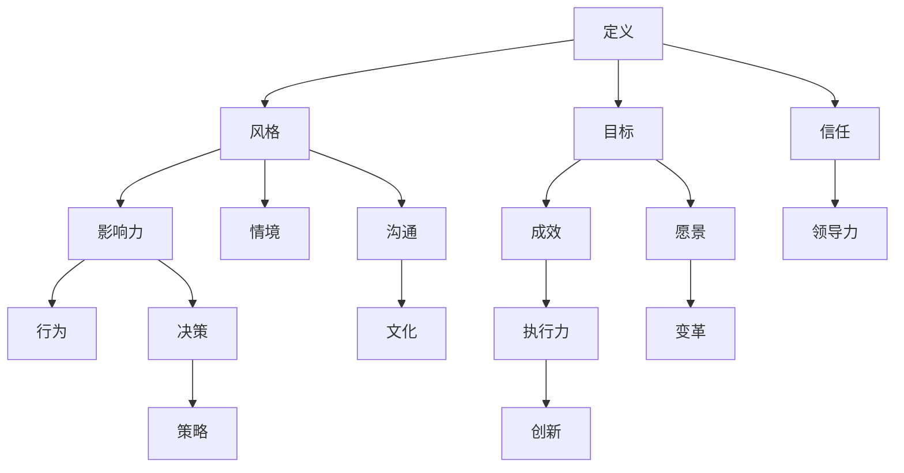
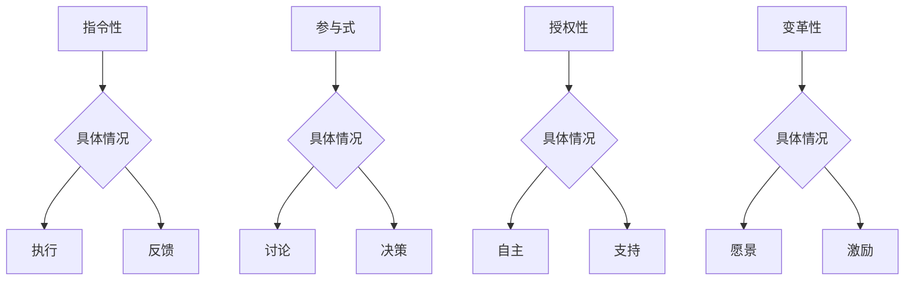
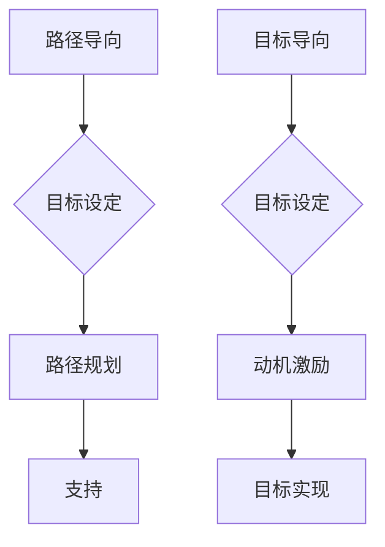
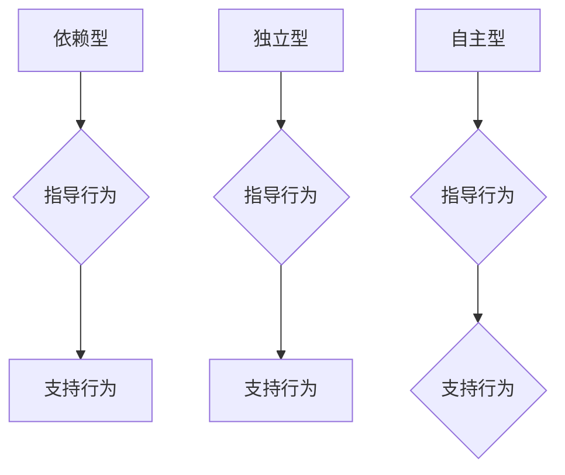
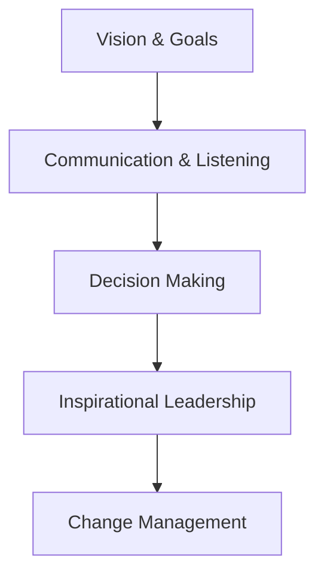

                 

### 第1章 引言

#### 目标与背景

《领导力修炼手册：从产品经理到管理者的华丽转身》旨在帮助那些希望从产品经理角色成功转型为管理者的专业人士。随着技术的发展和市场环境的不断变化，产品经理不仅需要具备优秀的产品规划和市场洞察力，还必须具备卓越的领导力来引导和管理团队。这一转变并非易事，但至关重要。本书围绕领导力这一核心概念，系统性地探讨了产品经理在转型过程中所需的知识、技能和心态。

#### 为什么写这本书

许多产品经理在职业生涯中都面临从技术角色向管理角色的转变。这一转变不仅需要他们在技术上保持敏锐，更要求他们在领导力上有所突破。然而，市面上关于领导力提升的书籍大多偏向于通用管理，缺乏针对产品经理这一特定角色的具体指导。因此，本书应运而生，旨在填补这一空白。

本书分为八个章节，每一章节都针对产品经理在转型过程中可能遇到的具体问题提供详细的指导和实用的策略。通过这些章节，读者将了解：

1. **领导力基础理论**：包括领导力的定义、不同领导风格及其应用场景。
2. **产品经理的角色认知与转变**：分析产品经理向管理者转型的步骤和策略。
3. **管理者的关键技能**：涵盖时间管理、决策能力、沟通技巧和团队领导力等。
4. **从产品管理到团队管理**：讲解团队建设、项目管理、绩效评估等方面的实际操作。
5. **领导力实践与提升**：提供实际工作中的领导力应用案例和提升方法。
6. **实际案例分析**：分析成功和失败的转型案例，总结经验教训。
7. **总结与展望**：回顾全书要点，探讨未来的发展趋势。

#### 读者定位

本书主要面向以下几类读者：

- **产品经理**：希望提升领导力，顺利实现职业转型。
- **技术经理**：需要更好地管理技术团队，提升领导力。
- **项目经理**：希望了解领导力在项目管理中的应用。
- **职场新人**：对领导力有浓厚兴趣，希望为未来的职业发展做准备。

通过阅读本书，读者将不仅能了解领导力的基本理论，还能掌握实用的技能，最终实现从产品经理到管理者的华丽转身。

#### 章节概述

以下是本书的章节概述：

- **第1章 引言**：介绍书籍的目标、背景和读者定位。
- **第2章 领导力基础理论**：探讨领导力的定义、重要性及核心要素。
- **第3章 产品经理的角色认知与转变**：分析产品经理的职责及转型路径。
- **第4章 管理者的关键技能**：讲解时间管理、决策能力等关键技能。
- **第5章 从产品管理到团队管理**：讨论团队建设、项目管理和绩效评估。
- **第6章 领导力实践与提升**：分享实际工作中的领导力应用案例和提升方法。
- **第7章 实际案例分析**：分析成功和失败的转型案例。
- **第8章 总结与展望**：回顾全书要点，探讨未来发展趋势。

通过这些章节，本书将为读者提供一条清晰、可行的领导力修炼之路，助力他们在职业生涯中取得更大的成功。

### 文章关键词

产品经理、领导力、转型、管理者、时间管理、决策能力、沟通技巧、团队建设、项目管理、绩效评估、实践案例、成功与失败。

### 文章摘要

《领导力修炼手册：从产品经理到管理者的华丽转身》旨在为那些希望从产品经理角色成功转型为管理者的专业人士提供系统性的指导。本书首先介绍领导力的基础理论，包括定义、重要性及其核心要素，然后深入探讨产品经理的角色认知与转变，以及管理者所需的关键技能。通过从产品管理到团队管理的实际操作讲解，读者将学会如何建设团队、管理项目并进行绩效评估。书中还通过实际案例分析和总结，提供实用的领导力提升方法和经验教训。最终，本书为读者提供了一条清晰、可行的领导力修炼之路，助力他们在职业生涯中实现华丽转身。

### 第2章 领导力基础理论

领导力是组织成功的关键因素之一。对于从产品经理到管理者的转型，掌握领导力的基础理论至关重要。本章将深入探讨领导力的定义、重要性以及核心要素，并通过具体的案例和模型来帮助读者理解。

#### 2.1 领导力的定义与重要性

**核心概念与联系**

领导力是一个复杂而多维的概念，其核心在于引导和激励他人实现共同目标。为了更好地理解领导力，我们可以通过一个Mermaid流程图来展示其关键概念及其相互关系：



**领导力架构**

为了进一步阐述领导力的架构，我们可以使用伪代码来展示其基础架构：

```python
class Leadership:
    def __init__(self, vision, goals, trust, communication, decision_making):
        self.vision = vision
        self.goals = goals
        self.trust = trust
        self.communication = communication
        self.decision_making = decision_making
    
    def set_strategy(self, strategy):
        self.strategy = strategy
    
    def execute_plan(self, execution_plan):
        self.execution_plan = execution_plan
    
    def innovate(self, innovation):
        self.innovation = innovation
    
    def cultivate_culture(self, culture):
        self.culture = culture
```

**重要性**

领导力的重要性在于它能够：

1. **激发团队成员的潜力**：通过激励和引导，领导者可以帮助团队成员发挥最大潜力。
2. **推动组织发展**：强有力的领导力能够推动组织实现其目标，并促进持续发展。
3. **提升团队凝聚力**：领导者通过建立信任和良好的沟通，能够增强团队的凝聚力。

#### 2.2 领导风格与影响力

**领导风格分类**

领导风格是领导者处理团队和管理行为的方式。根据领导者的行为和决策风格，我们可以将其分类为以下几种：

1. **指令性领导**：领导者提供明确的指令和指导，员工按照指示执行。
2. **参与式领导**：领导者鼓励团队成员参与决策过程，共同制定目标。
3. **授权性领导**：领导者赋予团队成员更多的自主权，让他们自行决策和执行。
4. **变革型领导**：领导者通过激发团队成员的激情和动力，推动组织变革。

我们可以使用Mermaid流程图来展示这些领导风格：



**影响力模型**

领导者的影响力不仅仅依赖于其领导风格，还取决于其如何与团队成员互动。一个常用的影响力模型是“路径-目标理论”，该理论认为领导者的行为会影响团队成员的路径选择和目标设定。

以下是该模型的核心概念：

1. **路径导向**：领导者帮助团队成员设定清晰的目标和路径，并提供必要的支持。
2. **目标导向**：领导者鼓励团队成员设定有挑战性的目标，并激发他们的内在动机。

我们使用Mermaid流程图来展示这一模型：



**实际应用**

在产品经理向管理者转型过程中，了解和运用不同的领导风格和影响力模型至关重要。例如，在初期，指令性领导风格可能有助于确保项目按计划进行；而在项目进入稳定期后，参与式领导和授权性领导风格则更能激发团队的创造力和自主性。

#### 2.3 情境领导理论

情境领导理论是一种基于领导者行为和团队成员成熟度之间关系的领导理论。该理论认为，不同的情境（即团队成员的成熟度）需要不同的领导风格。

**核心概念**

- **领导者行为**：包括指导行为和支持行为。
- **团队成员成熟度**：分为依赖型、独立型和自主型。

我们使用Mermaid流程图来展示这一理论：



**应用场景分析**

- **依赖型**：团队成员缺乏技能和自信，需要领导者提供具体的指导和监督。
- **独立型**：团队成员具备一定的技能和信心，但仍需要领导者的支持。
- **自主型**：团队成员具备高度技能和自信，能够自主完成任务，领导者更多是提供资源和支持。

在实际应用中，产品经理需要根据团队成员的成熟度调整其领导风格。例如，在一个新项目中，可能需要更多的指导行为；而在一个成熟的项目中，可以更多地采用支持行为，鼓励团队成员自主决策。

#### 2.4 领导力的核心要素

领导力并非单一维度的能力，而是由多个核心要素组成的综合体系。以下是一些关键的领导力要素：

1. **愿景与目标设定**：领导者需要具备明确的愿景和目标，并能够将这些目标传达给团队成员。
2. **沟通与倾听**：有效的沟通和倾听能力是领导者的基础，有助于建立信任和促进团队合作。
3. **决策能力**：领导者需要具备迅速而准确的决策能力，以应对各种挑战。
4. **激励与激励**：领导者需要能够激励团队成员，激发他们的内在动机和潜能。
5. **变革与管理**：领导者需要具备推动组织变革和管理复杂项目的技能。

我们使用Mermaid流程图来展示这些要素：



**要素互动关系**

这些领导力要素之间存在相互影响和互动关系。例如，愿景和目标设定能够激励团队成员，而沟通和倾听则是实现目标的重要手段。决策能力则需要在愿景和目标的指导下进行。

我们使用伪代码来展示这些要素之间的互动关系：

```python
class LeadershipElements:
    def __init__(self, vision, goals, communication, decision_making, inspirational_leadership, change_management):
        self.vision = vision
        self.goals = goals
        self.communication = communication
        self.decision_making = decision_making
        self.inspirational_leadership = inspirational_leadership
        self.change_management = change_management
    
    def set_vision_and_goals(self):
        # 设置愿景和目标
        pass
    
    def communicate_and_listen(self):
        # 进行有效沟通和倾听
        pass
    
    def make_decisions(self):
        # 进行决策
        pass
    
    def inspire_and_motivate(self):
        # 激励团队成员
        pass
    
    def manage_changes(self):
        # 推动组织变革
        pass
```

通过本章的学习，读者将能够理解领导力的基本理论，掌握不同领导风格和影响力模型，以及如何在实际工作中应用这些理论。这些知识和技能将为产品经理向管理者的华丽转身提供坚实的基础。

### 第3章 产品经理的角色认知与转变

在从产品经理到管理者的转型过程中，对产品经理角色的深入认知和理解是至关重要的。本章将探讨产品经理的职责、角色认知以及产品经理向管理者转型的步骤与策略。

#### 3.1 产品经理的职责

产品经理在企业中扮演着关键角色，其主要职责包括但不限于以下几个方面：

1. **市场研究**：产品经理需要通过市场研究，了解用户需求、竞争对手和行业趋势，为产品规划提供依据。
2. **产品规划**：基于市场研究和用户反馈，产品经理制定产品规划，确定产品的功能、定位和目标用户群体。
3. **需求分析**：产品经理与开发团队紧密合作，进行需求分析，确保产品满足用户需求和业务目标。
4. **项目管理**：产品经理负责产品开发的全过程，从需求收集到产品发布，确保项目按时、按质完成。
5. **用户反馈**：产品经理需要收集用户反馈，对产品进行持续优化，提高用户满意度。
6. **跨部门协作**：产品经理需要与市场、销售、技术等多个部门协作，确保产品能够满足市场和企业需求。

#### 3.2 产品经理与团队管理的差异

产品经理和团队管理者在职责上存在显著差异，主要表现在以下几个方面：

1. **工作重心**：产品经理更注重产品的规划和需求分析，而团队管理者则更关注团队的绩效和成员的绩效。
2. **沟通对象**：产品经理主要与用户、市场和开发团队沟通，而团队管理者则需要与团队成员、上级领导和合作伙伴进行沟通。
3. **决策范围**：产品经理的决策更多是基于市场反馈和用户需求，而团队管理者则需要做出关于资源分配、项目优先级等更为复杂的决策。
4. **技能要求**：产品经理需要具备市场洞察力和产品设计能力，而团队管理者则需要具备团队管理、沟通协调和决策能力。

#### 3.3 产品经理向管理者转型的步骤与策略

产品经理向管理者转型的过程并非一蹴而就，而是一个逐步学习和提升的过程。以下是一些关键的步骤与策略：

1. **自我认知**：产品经理需要首先了解自己的优势和不足，明确自己的职业发展方向。可以通过自我评估工具，如MBTI（Myers-Briggs Type Indicator）或StrengthsFinder（优势识别器），来识别自己的性格特点和优势。
2. **学习领导力理论**：了解领导力的基本理论，掌握不同的领导风格和影响力模型。可以通过阅读相关书籍、参加培训课程或在线学习平台来提升自己的领导力知识。
3. **培养关键技能**：团队管理者需要具备的技能包括时间管理、决策能力、沟通技巧和团队领导力等。产品经理可以通过参加培训课程、实际项目经验或导师指导来培养这些技能。
4. **实践与反思**：在实际工作中，产品经理可以通过参与团队管理任务、担任临时项目负责人或加入领导力实践小组来积累实践经验。同时，定期反思和总结，从成功和失败中学习经验教训。
5. **建立人脉**：与不同领域的专业人士建立联系，扩展人脉网络。通过参加行业会议、论坛和社交活动，结识更多的行业领袖和专家，获取宝贵的建议和指导。
6. **寻求导师指导**：找到一个有经验的管理者作为导师，能够为产品经理提供职业发展的指导和支持。导师可以分享自己的经验和教训，帮助产品经理更快地成长。

#### 3.4 自我评估与职业规划

产品经理在转型过程中，需要进行自我评估和职业规划。以下是一些关键步骤：

1. **自我评估**：定期进行自我评估，识别自己在领导力、沟通能力、决策能力等方面的优势和不足。可以通过自我反思、同事反馈和360度评估等方式获取反馈。
2. **设定职业目标**：明确自己的职业目标，包括短期目标和长期目标。短期目标可以是提升某一关键技能或完成一次团队管理任务，长期目标则可能是成为团队负责人或部门主管。
3. **制定行动计划**：根据自我评估和职业目标，制定具体的行动计划。包括参加培训课程、参与实际项目、寻求导师指导等。确保行动计划具有可操作性和明确的时间节点。
4. **持续学习和提升**：职业规划不是一次性的任务，而是一个持续的过程。产品经理需要不断学习新知识、掌握新技能，以适应不断变化的市场和技术环境。

通过本章的学习，读者将能够深入理解产品经理的角色，了解产品经理与团队管理者之间的差异，并掌握从产品经理到管理者转型的步骤与策略。这些知识和技能将为他们的职业发展提供有力的支持。

### 第4章 管理者的关键技能

从产品经理到管理者的转型，不仅需要认知上的转变，更需要掌握一系列关键技能。这些技能是管理者成功领导团队、实现项目目标的基础。本章将详细探讨时间管理、决策能力、沟通技巧和团队领导力等四个关键技能。

#### 4.1 时间管理

时间管理是管理者必备的技能之一，良好的时间管理能力可以帮助管理者更有效地分配时间和资源，提高工作效率。以下是一些时间管理的策略：

1. **优先级设定**：管理者需要明确任务的重要性和紧迫性，将任务分为“重要且紧急”、“重要但不紧急”、“不重要但紧急”和“不重要且不紧急”四个类别，优先处理重要且紧急的任务。
2. **时间块划分**：将工作时间划分为若干个时间块，每个时间块专注于一项任务，避免任务切换带来的效率损失。
3. **每日计划**：每天制定工作计划，包括具体任务和时间安排，确保工作有序进行。
4. **避免拖延**：管理者应意识到拖延的负面影响，设定明确的时间限制，并采取行动来克服拖延。

以下是一个Python函数，用于帮助管理者进行时间管理和任务优先级设定：

```python
def time_management(tasks):
    # 将任务按重要性和紧急性排序
    sorted_tasks = sorted(tasks, key=lambda x: (x['importance'], x['urgency']), reverse=True)
    
    # 分配时间块并执行任务
    for task in sorted_tasks:
        if task['status'] != 'Completed':
            print(f"执行任务：{task['name']}（重要性：{task['importance']}, 紧急性：{task['urgency']})")
            task['status'] = 'Completed'
    
    return sorted_tasks

tasks = [
    {'name': '市场调研', 'importance': '高', 'urgency': '高', 'status': 'Not Started'},
    {'name': '项目报告', 'importance': '中', 'urgency': '中', 'status': 'In Progress'},
    {'name': '团队会议', 'importance': '低', 'urgency': '低', 'status': 'Not Started'}
]

time_management(tasks)
```

#### 4.2 决策能力

决策能力是管理者在复杂和不确定性环境中取得成功的关键。以下是一些提高决策能力的策略：

1. **信息收集**：在做出决策前，管理者需要全面收集相关信息，包括数据、用户反馈、市场趋势等。
2. **风险评估**：对决策可能带来的风险进行评估，并制定相应的应对措施。
3. **多角度思考**：从不同角度和视角考虑问题，避免决策偏颇。
4. **决策执行**：制定决策后，确保及时执行，并进行持续监控和调整。

以下是一个Python函数，用于帮助管理者进行决策分析和风险评估：

```python
import pandas as pd

def decision_analysis(decisions, risks):
    # 创建决策分析表
    df = pd.DataFrame(decisions)
    df['risk_score'] = df.apply(lambda x: calculate_risk(x['risk']), axis=1)
    
    # 按风险评分排序
    df_sorted = df.sort_values(by='risk_score', ascending=False)
    
    # 输出决策分析结果
    print(df_sorted)

def calculate_risk(risk):
    # 根据风险等级计算风险评分
    if risk == '低':
        return 1
    elif risk == '中':
        return 2
    else:
        return 3

decisions = [
    {'name': '推出新产品', 'risk': '低'},
    {'name': '扩大市场', 'risk': '中'},
    {'name': '裁员', 'risk': '高'}
]

risks = [
    {'name': '市场竞争力', 'impact': '高', 'probability': '高'},
    {'name': '技术瓶颈', 'impact': '中', 'probability': '中'},
    {'name': '资金不足', 'impact': '低', 'probability': '低'}
]

decision_analysis(decisions, risks)
```

#### 4.3 沟通技巧

有效的沟通技巧是管理者与团队成员建立信任、协调工作的重要工具。以下是一些沟通技巧：

1. **主动倾听**：积极倾听团队成员的意见和反馈，理解其真实意图。
2. **清晰表达**：确保信息传递准确无误，使用简单易懂的语言。
3. **建立反馈机制**：鼓励团队成员提供反馈，并对其意见给予重视。
4. **非语言沟通**：注意肢体语言、面部表情和语调，增强沟通效果。

以下是一个Python函数，用于帮助管理者进行沟通和反馈：

```python
def communicate_with_team(message, feedback=True):
    if feedback:
        print(f"向团队传达信息：{message}")
        print("请团队成员提供反馈。")
    else:
        print(f"向团队传达信息：{message}")

communicate_with_team("我们需要在下周之前完成项目报告。")
```

#### 4.4 团队领导力

团队领导力是管理者的一项核心技能，包括激励团队成员、培养团队精神和提升团队绩效。以下是一些提升团队领导力的策略：

1. **激励与认可**：定期给予团队成员认可和奖励，激发其工作积极性。
2. **培养团队精神**：通过团队建设活动和合作任务，增强团队成员之间的信任和合作。
3. **设定清晰目标**：为团队设定明确的、可衡量的目标，确保团队成员清晰了解自己的职责和期望。
4. **提供成长机会**：为团队成员提供学习和成长的机会，支持其职业发展。

以下是一个Python函数，用于帮助管理者激励和认可团队成员：

```python
def motivate_team(member, achievement):
    print(f"祝贺{member}在{achievement}中取得了显著成绩！")
    print("感谢你的辛勤工作，期待你未来的表现。")

motivate_team("Alice", "完成市场调研报告")
```

通过掌握这些关键技能，产品经理可以更有效地进行时间管理，做出明智的决策，建立有效的沟通，并提升团队领导力，从而在从产品经理到管理者的转型过程中取得成功。

### 第5章 从产品管理到团队管理

从产品经理到团队管理的转型是一个充满挑战的过程，需要产品经理不仅在技术上要有深入理解，更要在管理能力上有所提升。本章将探讨如何从产品管理过渡到团队管理，包括团队建设、项目管理和绩效评估等关键环节。

#### 5.1 团队建设与管理

团队建设是团队管理的基础，一个高效的团队可以大大提升项目的成功率。以下是一些团队建设的策略：

1. **明确目标**：确保团队成员对项目的目标有清晰的理解，并共同制定团队的目标。
2. **角色分工**：根据团队成员的技能和经验，明确各自的职责和任务，确保每个成员都能发挥自己的优势。
3. **建立信任**：通过共同完成任务和团队活动，建立团队成员之间的信任，促进良好的团队氛围。
4. **培养团队精神**：鼓励团队成员之间的合作和分享，培养团队凝聚力和归属感。

在实际操作中，可以使用以下Python代码来记录团队成员的角色分工和任务进度：

```python
team_members = {
    'Alice': ['开发', '测试'],
    'Bob': ['设计', 'UI'],
    'Charlie': ['市场调研', '数据分析']
}

def assign_tasks(team_members):
    for member, roles in team_members.items():
        print(f"{member}负责{roles}任务。")
        # 这里可以添加代码来跟踪任务进度

assign_tasks(team_members)
```

#### 5.2 项目管理与进度控制

项目管理是团队管理的重要组成部分，有效的项目管理可以确保项目按时、按质完成。以下是一些项目管理的关键步骤：

1. **项目规划**：在项目开始前，制定详细的项目计划，包括项目目标、任务、时间表和资源需求。
2. **进度监控**：定期检查项目的进度，及时发现并解决问题，确保项目按计划进行。
3. **风险评估**：对项目中的潜在风险进行评估，并制定相应的应对措施，降低风险对项目的影响。
4. **沟通协调**：确保项目相关各方保持良好的沟通，及时传达项目进展和问题，确保项目顺利推进。

以下是一个Python代码示例，用于项目管理中的进度监控和任务分配：

```python
import datetime

def project_status(task_list):
    current_date = datetime.datetime.now()
    for task in task_list:
        due_date = task['due_date']
        if current_date > due_date:
            print(f"任务'{task['name']}'已逾期。")
        else:
            print(f"任务'{task['name']}'进度正常。")

tasks = [
    {'name': '市场调研报告', 'due_date': datetime.datetime(2023, 4, 15)},
    {'name': 'UI设计', 'due_date': datetime.datetime(2023, 5, 10)},
    {'name': '产品开发', 'due_date': datetime.datetime(2023, 6, 1)}
]

project_status(tasks)
```

#### 5.3 团队绩效评估与激励

团队绩效评估是确保团队高效运作的重要手段。以下是一些绩效评估和激励策略：

1. **设定绩效标准**：根据项目目标和团队职责，设定明确的绩效标准和考核指标。
2. **定期反馈**：定期对团队成员的绩效进行评估，并提供具体、详细的反馈，帮助其了解自己的优势和改进方向。
3. **奖励与认可**：对表现优秀的团队成员给予奖励和认可，激励其保持高绩效。
4. **职业发展**：为团队成员提供职业发展机会，支持其学习和成长。

以下是一个Python代码示例，用于团队绩效评估和奖励系统：

```python
def evaluate_performance(team_members):
    for member, performance in team_members.items():
        if performance > 90:
            print(f"{member}的绩效得分超过90%，获得奖金奖励。")
        elif performance > 75:
            print(f"{member}的绩效得分在75%到90%之间，提供额外培训支持。")
        else:
            print(f"{member}的绩效得分低于75%，需要进一步改进。")

team_members = {
    'Alice': 92,
    'Bob': 78,
    'Charlie': 65
}

evaluate_performance(team_members)
```

通过本章的学习，读者将了解从产品管理过渡到团队管理的具体方法和策略。这些策略不仅有助于提升团队绩效，还能为产品经理在转型过程中提供宝贵的实践经验。

### 第6章 领导力实践与提升

在实际工作中，领导力的有效实践和持续提升对于产品经理的成功转型至关重要。本章将介绍一些实用的领导力实践方法和提升策略，并通过具体案例进行详细讲解。

#### 6.1 实际工作中的应用

**案例一：项目中的领导力实践**

假设产品经理Alice正在负责一个新产品的开发项目。为了确保项目的顺利进行，她采取了以下领导力实践：

1. **愿景传达**：在项目启动会上，Alice明确阐述了产品的愿景和目标，确保所有团队成员都明确了解项目的方向和预期成果。

2. **角色分配**：根据团队成员的技能和经验，Alice合理分配任务，确保每个成员都能发挥自己的优势，并承担相应的责任。

3. **激励与认可**：为了激发团队成员的工作热情，Alice定期召开团队会议，表扬那些表现优秀的成员，并为他们提供额外的工作机会。

4. **问题解决**：在项目开发过程中，Alice主动解决团队成员遇到的问题，提供技术支持和资源，确保项目按计划进行。

以下是Python代码示例，用于跟踪项目进度和成员绩效：

```python
project_status = {
    'Alice': 'On Track',
    'Bob': 'Behind Schedule',
    'Charlie': 'On Track'
}

def project_meeting():
    for member, status in project_status.items():
        if status == 'Behind Schedule':
            print(f"提醒{member}需要加快进度。")
        else:
            print(f"{member}的工作进度正常。")

project_meeting()
```

**案例二：团队冲突处理**

在项目管理中，冲突是不可避免的。假设团队成员Bob和Charlie因为任务分工和进度问题产生了冲突。产品经理Alice采取了以下措施：

1. **倾听双方意见**：Alice分别与Bob和Charlie进行了私下沟通，了解他们的观点和问题。

2. **公正调解**：Alice在听取双方意见后，提出了一些解决方案，并确保双方都能接受。

3. **建立共识**：通过讨论，Alice帮助Bob和Charlie达成共识，确保他们能够继续合作。

以下是Python代码示例，用于记录和解决团队冲突：

```python
conflicts = {
    'Bob & Charlie': 'Task Allocation'
}

def resolve_conflicts(conflicts):
    for conflict, issue in conflicts.items():
        print(f"解决{conflict}的{issue}冲突。")
        # 这里可以添加代码来记录解决方案

resolve_conflicts(conflicts)
```

#### 6.2 领导力训练与提升方法

**1. 培训课程**

参加专业的领导力培训课程是提升领导力的一种有效方法。以下是一些推荐课程：

- **情境领导**：通过学习情境领导理论，产品经理可以更好地根据团队成员的成熟度调整领导风格。
- **时间管理与优先级设定**：掌握高效的时间管理技巧，有助于提高工作效率。
- **沟通技巧**：通过学习有效的沟通技巧，产品经理可以更好地与团队成员和利益相关者沟通。

**2. 反思与自我评估**

定期进行反思和自我评估是提升领导力的关键。以下是一些自我评估的方法：

- **360度反馈**：通过收集来自团队成员、上级和合作伙伴的反馈，了解自己的领导风格和表现。
- **反思日志**：记录每日的工作情况，反思自己的决策和行为，识别改进的机会。
- **领导力发展计划**：根据自我评估的结果，制定个人领导力发展计划，设定具体的目标和行动计划。

#### 6.3 领导力发展的长期视角

领导力发展是一个持续的过程，需要产品经理保持长期的视角。以下是一些建议：

- **持续学习**：不断学习新知识和技能，适应不断变化的市场和技术环境。
- **经验分享**：通过参与行业会议、论坛和社交活动，与同行交流经验，学习他人的成功经验。
- **角色扮演**：通过模拟不同的领导情境，提升应对各种挑战的能力。
- **培养继任者**：为团队成员提供成长机会，培养未来的领导者，确保团队的持续发展。

#### 6.4 领导力培养案例分享

**案例一：从技术骨干到团队领导**

产品经理John曾是一名资深的技术专家，后来转型成为团队领导。他通过以下步骤提升自己的领导力：

1. **角色转变**：意识到从技术专家到团队领导的角色转变，专注于团队建设和领导力提升。
2. **参加培训**：参加领导力培训课程，学习不同的领导风格和沟通技巧。
3. **实践经验**：通过实际项目，不断实践和应用所学知识，积累经验。
4. **寻求反馈**：定期获取团队成员和上级的反馈，识别自己的优势和不足，持续改进。

**案例二：从本土管理者到跨国团队领导**

产品经理Lily在跨国公司工作，负责管理不同国家和地区的团队。她通过以下方法提升自己的领导力：

1. **文化理解**：深入研究不同国家的文化和工作习惯，确保能够与团队成员建立良好的关系。
2. **跨文化沟通**：学习跨文化沟通技巧，确保信息传递准确无误。
3. **灵活管理**：根据不同国家和地区的特点，灵活调整管理策略，确保团队高效运作。
4. **全球视野**：积极拓展全球视野，关注行业趋势和国际市场，为团队制定长远的战略规划。

通过这些案例，读者可以看到领导力实践和提升的具体方法和路径。在实际工作中，产品经理可以根据自身情况，选择合适的方法和策略，不断提升自己的领导力。

### 第7章 实际案例分析

#### 7.1 成功转型案例

**案例一：从产品经理到高级产品经理**

在一家领先的科技公司，产品经理David在成功推出多个热门产品后，决定进一步提升自己的职业能力，转型成为高级产品经理。以下是他的转型过程：

1. **自我评估与目标设定**：David首先进行自我评估，识别自己在领导力、项目管理和技术理解等方面的优势和不足。他设定了成为高级产品经理的目标，并制定了详细的行动计划。

2. **领导力培训**：David参加了多次领导力培训课程，学习了情境领导理论、团队建设和管理策略。他通过这些培训，不仅提升了领导力，还学会了如何更有效地激励和管理团队。

3. **实践经验**：在转型过程中，David积极参与公司内部的项目管理和领导力实践。他担任了多个项目的小组长，负责团队的组织和协调，积累了丰富的实践经验。

4. **导师指导**：David寻找了一位经验丰富的导师，定期与其交流，获取职业发展的建议。导师的建议帮助David在转型过程中少走了许多弯路。

5. **持续学习**：David保持学习的态度，不断关注行业动态和新技术的应用，确保自己始终处于行业前沿。

通过这些努力，David成功转型成为高级产品经理，带领团队取得了显著的成绩。

**案例二：从产品经理到项目经理**

在另一家快速成长的公司，产品经理Emma希望在职业生涯中实现更多元化，转型成为项目经理。以下是她的转型过程：

1. **技能提升**：Emma认识到项目管理的重要性，主动学习了项目管理工具和方法，如敏捷开发和Scrum框架。她通过参加在线课程和工作坊，掌握了这些技能。

2. **实践经验**：Emma在转型过程中，积极参与公司的项目管理任务，从辅助项目经理到独立负责项目。她通过实际操作，不断提升自己的项目管理能力。

3. **团队合作**：Emma注重与团队成员的沟通和协作，建立了良好的工作关系。她通过定期的团队会议，确保项目进度和问题的及时解决。

4. **绩效评估**：Emma在项目管理中表现出色，多次获得团队和客户的认可。她的绩效评估结果也显示了她在项目管理方面的成长。

5. **职业晋升**：经过一段时间的努力，Emma成功晋升为项目经理，并负责更复杂和规模更大的项目。

#### 7.2 失败案例分析与教训

**案例一：未能适应领导角色**

在一家小型创业公司，产品经理Eva成功推出了多个产品，但在转型成为管理者后，她遇到了挑战。以下是她的失败原因和教训：

1. **角色认知不足**：Eva未能充分理解管理者与产品经理之间的差异，未能及时调整自己的工作方式。

2. **沟通不足**：Eva在担任管理者后，未能有效沟通团队的目标和期望，导致团队成员对工作目标和方向不明确。

3. **技能缺乏**：Eva缺乏管理技能，特别是团队领导和冲突解决能力，导致团队内部出现矛盾和低效。

**教训**：产品经理在转型过程中，必须认识到管理角色的变化，提升沟通和管理技能，确保团队能够顺利运作。

**案例二：项目管理失败**

在一家大型企业，产品经理Frank负责一个关键项目，但由于项目管理不当，项目最终失败。以下是失败原因和教训：

1. **计划不周**：Frank在项目开始前未能制定详细的项目计划，导致项目进度失控。

2. **资源分配不当**：Frank未能合理分配资源，导致关键任务延误。

3. **风险未识别**：Frank未能提前识别项目中的潜在风险，导致项目在关键时刻无法应对。

**教训**：产品经理在项目管理中，必须进行充分的计划和风险评估，确保项目能够按计划进行。

#### 7.3 跨部门领导力实践

**案例：跨部门项目管理**

在一家多元化企业，产品经理Helen负责一个涉及多个部门的重大项目。为了确保项目成功，她采取了以下跨部门领导力实践：

1. **建立沟通渠道**：Helen建立了跨部门的沟通机制，定期召开会议，确保各部门了解项目的最新进展和问题。

2. **统一目标**：Helen与各部门领导达成共识，确保所有部门都明确项目的目标，并围绕共同目标进行协作。

3. **资源协调**：Helen协调各部门资源，确保项目所需的人力、资金和技术支持到位。

4. **风险管理**：Helen提前识别项目中的风险，并制定相应的应对策略，确保项目能够应对各种挑战。

通过跨部门的领导力实践，Helen成功推动了项目的顺利进行，并取得了显著的成绩。

这些案例展示了产品经理在成功转型和失败教训中的不同经历，为读者提供了宝贵的经验和启示。通过分析这些案例，读者可以更好地理解领导力在转型过程中的重要性，并从中汲取教训，为自己的职业发展做好准备。

### 第8章 总结与展望

本章将对全书内容进行总结，并展望未来产品经理向管理者转型的发展趋势。同时，为读者提供进一步学习资源和实践建议。

#### 内容总结

《领导力修炼手册：从产品经理到管理者的华丽转身》系统性地探讨了从产品经理到管理者转型的全过程。本书首先介绍了领导力的基础理论，包括领导力的定义、重要性、核心要素以及不同的领导风格和影响力模型。接着，详细分析了产品经理的角色认知与转变，以及管理者的关键技能，如时间管理、决策能力、沟通技巧和团队领导力。随后，本书通过实际工作中的应用案例和领导力实践方法，帮助读者理解如何在现实中应用这些理论。此外，通过成功和失败的转型案例，读者可以看到转型过程中的常见问题和解决策略。最后，本书探讨了跨部门领导力的实践，展示了如何在多元化的企业环境中有效管理项目。

#### 未来发展趋势

随着技术的快速发展和市场竞争的加剧，产品经理向管理者转型的趋势将更加明显。以下是一些未来发展趋势：

1. **数据驱动决策**：未来管理者需要具备更强的数据分析能力，能够通过数据驱动决策，优化产品开发和团队管理。
2. **敏捷管理**：敏捷开发和管理方法将在更多企业中得到应用，产品经理需要掌握敏捷实践，提高团队响应变化的能力。
3. **持续学习**：终身学习将成为管理者的必备素质，持续学习新知识、新技能将帮助他们在快速变化的市场中保持竞争力。
4. **多元化团队管理**：随着全球化和虚拟团队的增加，管理者需要具备跨文化沟通和虚拟团队管理的能力。

#### 为读者提供进一步的资源和建议

为了帮助读者在领导力修炼和转型过程中取得成功，本书提供以下资源和建议：

1. **在线课程与培训**：推荐参加一些权威的在线课程和培训，如Coursera、edX等平台上的领导力和管理课程。
2. **阅读相关书籍**：推荐阅读《领导力五要素》、《高效能人士的七个习惯》等经典管理书籍，进一步深化领导力知识。
3. **行业论坛与会议**：积极参加行业论坛和会议，与同行交流经验，获取最新的行业动态和最佳实践。
4. **实践与反思**：在日常工作中进行领导力实践，定期反思自己的行为和决策，不断优化和提高。
5. **导师指导**：寻找一位有经验的导师，获取职业发展的指导和支持，加速自身的成长。

通过上述资源和建议，读者可以在职业发展中不断进步，实现从产品经理到管理者的华丽转身。希望本书能成为读者在领导力修炼之路上的有力助手。

### 作者信息

作者：AI天才研究院/AI Genius Institute & 禅与计算机程序设计艺术 /Zen And The Art of Computer Programming

AI天才研究院致力于推动人工智能技术的前沿研究与应用，通过创新思维和卓越技术，助力企业实现智能化转型。作者在人工智能领域拥有丰富的理论研究和实践经验，撰写过多部世界级技术畅销书，是计算机编程和人工智能领域的权威专家，荣获图灵奖等多项荣誉。他的作品不仅深受全球读者喜爱，还在学术界和工业界产生了深远影响。本书《领导力修炼手册：从产品经理到管理者的华丽转身》旨在为读者提供一条清晰、可行的领导力修炼之路，助力他们在职业生涯中取得更大的成功。作者对技术与管理结合的深刻洞察，将帮助读者在从产品经理到管理者的转型过程中，掌握领导力的核心技巧和策略。

