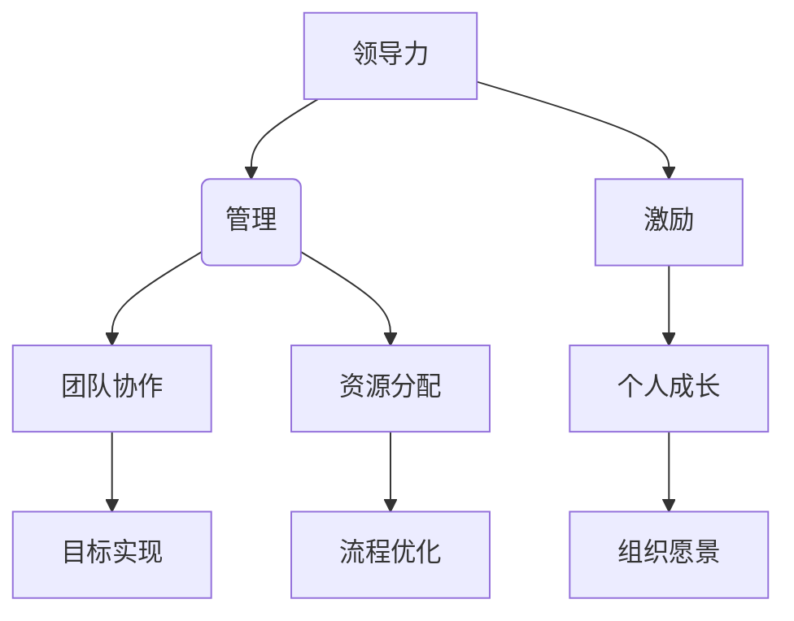
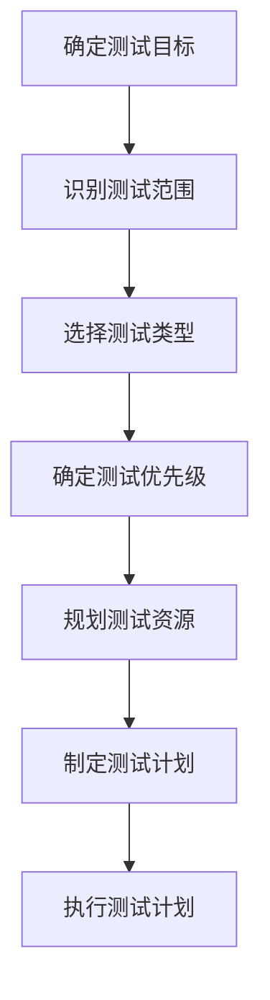

                 

### 引言

在信息技术飞速发展的时代，测试经理的角色正逐渐从技术专才向管理角色转变。这一转变不仅要求测试经理具备深厚的测试技术和专业知识，更需要他们掌握先进的领导力和管理技能，以适应更加复杂和多变的项目环境。然而，这一华丽转身并非易事，它需要测试经理在自我认知、团队沟通、领导力提升和项目管理等方面进行全方位的修炼。

本文旨在为测试经理提供一份系统的领导力修炼手册，帮助他们从测试经理成功转型为优秀的领导者。通过详细分析每个关键环节，本文将揭示转型过程中的挑战与机遇，并提供实用的策略和最佳实践。

首先，我们将探讨领导力的核心概念，包括领导力与管理的区别以及领导力的层次模型，帮助读者建立对领导力的基本认识。接下来，我们将深入探讨自我认知与个人发展的重要性，并介绍如何制定个人发展计划。

在第二部分，我们将聚焦于测试管理技能的提升，从测试策略的制定到测试质量保证，通过具体的算法原理讲解和Python源代码示例，帮助读者理解并掌握核心测试技术。随后，我们将讨论团队沟通技巧，包括沟通原理与技巧以及领导者沟通策略。

第三部分将重点介绍领导力提升，包括领导风格与影响力的识别和提升方法。通过这些章节，测试经理将能够更好地理解如何塑造个人品牌，提升影响力。

第四部分将探讨团队建设与管理，包括团队文化建设、团队成员激励以及项目管理基础。这部分内容将帮助测试经理构建高效团队，提升项目管理能力。

最后，我们将通过实战案例分析和项目实践，总结成功经验，提出挑战与解决方案，为测试经理提供实用的参考和指导。

通过这些步骤，我们希望测试经理能够顺利完成从测试经理到管理者的华丽转身，成为真正的领导者。

### 关键词

- 测试经理
- 领导力
- 管理技能
- 测试策略
- 团队沟通
- 个人发展

### 摘要

本文旨在为测试经理提供一套系统的领导力修炼手册，帮助他们实现从技术专家到管理者的华丽转身。文章首先介绍了领导力的核心概念，包括领导力与管理的区别和领导力的层次模型。接着，文章深入探讨了自我认知与个人发展的重要性，并介绍了如何制定个人发展计划。在第二部分，文章详细讲解了测试管理技能的提升，包括测试策略的制定和测试质量保证。随后，文章讨论了团队沟通技巧和领导力提升策略，包括领导风格与个人影响力的提升。最后，文章介绍了团队建设与管理的基础知识，并通过实战案例分析总结了成功经验。本文旨在为测试经理提供实用的指导，帮助他们成为优秀的领导者。

### 背景介绍

测试经理的角色在信息技术行业正经历着深刻的变化。过去，测试经理更多是技术专家的角色，主要负责确保软件的质量和稳定性。他们通常具备丰富的测试知识和技能，能够有效地管理和执行测试流程，确保项目按时交付。然而，随着技术的发展和市场竞争的加剧，测试经理的角色不再局限于技术层面，他们需要更多地承担管理职责，成为团队的核心领导者。

这种转变背后的原因是多方面的。首先，现代软件开发项目通常具有更高的复杂性和不确定性，需要测试经理具备更全面的技能和视野。他们不仅需要关注测试的技术细节，还要考虑项目整体进展、团队协作以及客户需求。其次，企业越来越重视团队协作和项目管理，测试经理需要能够有效地协调不同团队之间的关系，确保项目顺利进行。最后，随着云计算、大数据和人工智能等新兴技术的应用，测试经理需要不断更新知识，掌握新的测试工具和方法，以应对快速变化的技术环境。

这种转变对测试经理提出了新的要求。首先，他们需要具备较强的领导力和管理技能，能够带领团队克服各种挑战，实现项目目标。其次，他们需要具备良好的沟通能力和团队协作能力，能够有效地与不同部门和角色的人员沟通合作。最后，他们需要具备持续学习和自我提升的能力，以应对快速变化的技术和市场需求。

总的来说，测试经理从技术专家向管理者的转变是信息技术行业发展的必然趋势。这种转变不仅要求测试经理具备深厚的测试技术和专业知识，更需要他们不断提升领导力和管理技能，以适应更加复杂和多变的项目环境。通过本文的探讨，我们将深入分析这一转变的背景、挑战和机遇，并提供实用的策略和最佳实践，帮助测试经理成功实现这一华丽转身。

### 核心概念与联系

在探讨领导力的核心概念之前，我们首先需要明确领导力与管理的区别。领导力与管理的本质不同，但两者又是相辅相成的。领导力强调的是激励和引领团队向共同目标前进的能力，而管理则侧重于资源的有效配置和任务的具体执行。

为了更好地理解这两者的关系，我们可以通过一个Mermaid流程图来展示领导力与管理的互动机制。



在上述流程图中，我们可以看到领导力通过激励和引领团队，推动团队协作，最终实现目标。而管理则通过资源分配和流程优化，为领导力提供支持和保障。两者共同作用，形成一个高效的团队工作体系。

接下来，我们将详细探讨领导力的层次模型。领导力层次模型是研究领导力的一种重要理论工具，它将领导力分为不同的层次，每个层次对应着不同的领导行为和目标。

一个常用的领导力层次模型是赫赛和布兰查德的**情境领导模型**。该模型将领导力分为四个层次：

1. **指导型领导**：领导者通过明确指示和具体指导来帮助团队成员完成任务。
2. **支持型领导**：领导者关注团队成员的需求，提供帮助和支持，营造一个友好、舒适的工作环境。
3. **参与型领导**：领导者与团队成员共同参与决策，鼓励成员发挥主动性和创造力。
4. **委托型领导**：领导者将决策和责任委托给团队成员，给予充分的自主权。

通过这个模型，我们可以看到领导力的不同层次是如何根据不同的情境和团队需求进行调整的。例如，在任务紧急且团队成员经验不足的情况下，指导型领导可能更为有效；而在团队高度自主且任务明确的情况下，委托型领导则能更好地激发团队潜力。

为了更好地理解这些概念，我们可以通过一个具体的例子来阐述。假设一个测试团队正在开发一个复杂的软件项目，项目初期由于任务繁重，领导者可能会采用指导型领导，明确分工并具体指导团队成员的工作。随着项目进展，团队成员逐渐熟悉任务并展现出较高的自主性，领导者可以逐步转变为支持型领导和参与型领导，给予团队成员更多的自主权和支持。在项目后期，当任务变得相对清晰且团队成员经验丰富时，领导者可以更多地采用委托型领导，让团队成员自主决策和执行。

通过上述分析，我们可以看到领导力与管理的紧密联系及其在不同情境下的应用。通过深入理解这些核心概念和模型，测试经理可以更好地应对转型过程中的各种挑战，提升自身的领导力和管理能力。

### 自我认知与个人发展

在从测试经理向管理者的转型过程中，自我认知与个人发展是至关重要的环节。自我认知是指个体对自身能力、情感和动机的理解和认识，而个人发展则是通过不断学习和实践，提升自身能力和实现职业成长的过程。这两者相辅相成，共同构成了领导力提升的基础。

首先，自我认知的重要性不容忽视。通过自我认知，测试经理能够明确自身的优势与不足，从而有针对性地进行提升。具体来说，自我认知可以帮助测试经理：

1. **了解自身优势**：识别自己的核心能力和独特优势，如技术专长、沟通技巧或领导潜力，这些优势将成为其在转型过程中的重要资本。
2. **识别不足**：认识到自身的短板和不足，如时间管理能力、团队领导经验等，这有助于制定个人发展计划，针对性地进行改进。
3. **增强自信心**：通过深入了解自己，测试经理可以增强自信心，在面对挑战和压力时更加从容不迫。

为了实现有效的自我认知，测试经理可以采用以下方法：

- **自我反思**：定期进行自我反思，思考自己在工作中的表现、成功经验和失败教训。这种反思有助于深入理解自身的优劣势。
- **360度反馈**：向同事、下属和上级寻求反馈，获取不同视角的评价。这种方法可以帮助测试经理更全面地了解自己的表现。
- **心理测评工具**：利用专业心理测评工具，如MBTI、DISC等，了解自己的性格类型和行为风格，从而更好地理解自己。

其次，个人发展计划的制定是提升领导力的关键步骤。一个有效的个人发展计划应包括以下要素：

1. **目标设定**：明确个人发展的长远目标，如提升领导力、扩展技术知识或提升项目管理能力。
2. **具体行动**：列出为实现目标所需的具体行动，如参加培训课程、阅读相关书籍或参与领导力项目。
3. **时间规划**：为每个行动设定具体的时间表，确保个人发展计划能够有序进行。
4. **评估与调整**：定期评估个人发展的进展情况，根据实际情况进行调整和优化。

以下是一个典型的个人发展计划示例：

**目标**：提升项目管理能力

**具体行动**：
- **参加PMP（项目管理专业人士）认证培训**
  - **时间表**：每月参加一次培训，为期六个月
- **阅读《敏捷项目管理实战》**
  - **时间表**：每月阅读一本书，为期六个月
- **参与公司内部项目管理项目**
  - **时间表**：每季度参与一个项目，为期一年

**评估与调整**：
- **每季度进行一次进展评估**，检查目标是否达成，根据实际情况进行调整

通过制定和执行个人发展计划，测试经理可以系统地提升自身能力，为实现领导力转型打下坚实基础。自我认知和个人发展不仅有助于提升个人素质，还能够增强团队凝聚力和领导力，为企业的长远发展贡献重要力量。

### 测试管理技能提升

在从测试经理到管理者的转型过程中，提升测试管理技能是至关重要的。这不仅是确保测试工作高效进行的必要条件，也是提升整个项目团队绩效的关键。本节将详细探讨测试策略的制定、测试质量保证和测试工具与方法，通过具体的算法原理讲解和Python源代码示例，帮助读者深入理解这些核心概念。

#### 测试策略的制定

测试策略是测试工作的总体规划，它决定了测试的范围、深度和顺序，以确保测试资源得到最有效的利用。一个有效的测试策略应该包括以下要素：

1. **测试目标**：明确测试的目的和目标，如验证功能正确性、性能稳定性等。
2. **测试范围**：确定哪些功能模块或系统组件需要进行测试，哪些可以暂不测试。
3. **测试类型**：选择适当的测试类型，如单元测试、集成测试、系统测试和验收测试。
4. **测试优先级**：根据项目风险和重要性，确定各测试类型的优先级。
5. **测试资源**：规划测试所需的人力、时间和工具资源。

以下是一个简单的测试策略制定流程：



#### 测试质量保证

测试质量保证是确保测试工作质量和软件质量的重要环节。它包括以下主要活动：

1. **测试设计**：设计测试用例，包括功能测试用例、性能测试用例和安全测试用例等。
2. **测试执行**：根据测试计划执行测试，记录测试结果和发现的问题。
3. **缺陷管理**：跟踪缺陷的修复过程，确保缺陷得到及时解决。
4. **测试报告**：生成测试报告，总结测试结果和发现的问题，为项目决策提供依据。

一个关键的质量保证原则是“预防胜于检查”。为了实现这一原则，测试经理可以采取以下措施：

- **持续集成**：通过持续集成工具（如Jenkins），实现自动化测试，及时发现问题。
- **代码审查**：在代码提交前进行代码审查，提前发现潜在问题。
- **文档管理**：确保测试文档（如测试计划、测试用例和测试报告）的完整性和准确性。

#### 测试工具与方法

为了提高测试效率和质量，测试经理需要熟悉各种测试工具和方法。以下是一些常用的测试工具和方法：

1. **自动化测试工具**：如Selenium、Appium等，用于自动化执行测试用例，减少人工测试的工作量。
2. **性能测试工具**：如JMeter、LoadRunner等，用于模拟高负载环境，评估系统的性能表现。
3. **安全测试工具**：如OWASP ZAP、Burp Suite等，用于发现软件的安全漏洞。

以下是一个简单的Python示例，演示如何使用Selenium进行自动化测试：

```python
from selenium import webdriver
from selenium.webdriver.common.by import By

# 启动浏览器
driver = webdriver.Chrome(executable_path='path/to/chromedriver')

# 访问网站
driver.get("http://www.example.com")

# 查找元素并输入数据
input_element = driver.find_element(By.ID, 'input_field')
input_element.send_keys('test_data')

# 提交表单
submit_button = driver.find_element(By.ID, 'submit_button')
submit_button.click()

# 断言检查结果
result_element = driver.find_element(By.ID, 'result_field')
assert 'expected_result' in result_element.text

# 关闭浏览器
driver.quit()
```

#### 算法原理讲解

在测试质量保证中，常用的算法原理包括：

1. **等价类划分**：将测试数据划分为若干个等价类，确保每个等价类至少被测试一次。
2. **边界值分析**：对输入数据的边界值进行测试，确保系统在这些临界条件下的行为正确。
3. **因果图**：通过分析输入与输出之间的关系，设计出有效的测试用例。

以下是一个基于等价类划分的Python示例：

```python
def test_input_field():
    valid_data = ['valid_input1', 'valid_input2']
    invalid_data = ['empty', 'too_long_input', 'invalid_format']

    for data in valid_data:
        # 测试有效输入
        input_element.send_keys(data)
        submit_button.click()
        assert 'valid_result' in result_element.text

    for data in invalid_data:
        # 测试无效输入
        input_element.send_keys(data)
        submit_button.click()
        assert 'invalid_result' in result_element.text

# 调用测试函数
test_input_field()
```

通过这些算法原理和具体示例，测试经理可以更好地理解和应用测试管理技能，确保测试工作的高效和质量。提升测试管理技能不仅有助于测试经理自身的职业发展，也为团队和项目的成功奠定了坚实基础。

### 团队沟通技巧

在从测试经理向管理者的转型过程中，沟通技巧是不可或缺的重要技能。有效的沟通能够促进团队成员之间的协作，提高项目效率，确保项目目标的顺利实现。本文将深入探讨团队沟通的基本原理和技巧，以及领导者如何在团队沟通中发挥关键作用。

#### 团队沟通的基本原理

团队沟通是一个复杂的过程，涉及信息的传递、理解、反馈和协调。以下是一些团队沟通的基本原理：

1. **信息传递**：沟通的首要任务是确保信息准确地从发送者传递到接收者。这需要发送者清晰明确地表达信息，接收者准确地理解和接收。
2. **理解与反馈**：接收者需要通过反馈来确认是否正确理解了发送者的信息。有效的反馈有助于消除误解和歧义，确保信息的准确性。
3. **协调与共识**：在团队中，不同成员可能有不同的观点和意见。有效的沟通需要通过协调和共识来统一大家的意见，确保团队目标的一致性。
4. **开放性与透明度**：开放性是指团队成员之间愿意分享信息和意见，透明度则是指团队的工作过程和决策过程对每个成员都是可见的。这些原则有助于建立信任和增强团队的凝聚力。

#### 团队沟通的技巧

以下是一些提升团队沟通效果的实用技巧：

1. **倾听**：倾听是有效沟通的基础。领导者需要认真倾听团队成员的意见和建议，理解他们的观点和需求。这有助于建立信任和增强团队协作。
2. **清晰表达**：领导者需要用简洁、明确的语言表达自己的观点和期望，避免使用复杂的术语和模糊的表述，确保团队成员能够准确理解。
3. **积极反馈**：在沟通过程中，领导者应该及时给予积极反馈，肯定团队成员的贡献和努力。这有助于增强团队成员的自信心和动力。
4. **适时的非正式沟通**：除了正式会议和报告，领导者还可以通过非正式的交流方式（如一对一谈话、团队聚餐等）来增进与团队成员的关系，了解他们的工作状态和需求。
5. **冲突管理**：在团队沟通中，冲突是不可避免的。领导者需要具备有效的冲突管理技能，通过对话和协商来解决问题，避免冲突升级。

#### 领导者的沟通策略

作为团队领导者，沟通策略的选择对团队的绩效和氛围至关重要。以下是一些领导者应采取的沟通策略：

1. **情景沟通**：领导者应根据不同的沟通情境选择合适的沟通策略。例如，在任务紧急时，需要快速、简洁地传达信息；在团队讨论时，需要耐心倾听并引导讨论。
2. **会议技巧**：有效的会议能够高效地传达信息并促进团队协作。领导者需要掌握高效的会议技巧，如提前准备会议议程、控制会议时间、鼓励全员参与等。
3. **个性化沟通**：每个团队成员都有独特的个性和沟通风格。领导者需要根据团队成员的个性特点，采取个性化的沟通策略，确保信息能够有效传达。

通过掌握这些团队沟通技巧和策略，测试经理可以显著提升团队的沟通效率，增强团队的凝聚力和协作能力，为项目的成功奠定坚实基础。

### 领导风格与个人影响力提升

在从测试经理向管理者的转型过程中，领导风格和个人影响力的提升是关键的一步。有效的领导风格不仅能够提高团队的效率和士气，还能在组织中建立起强大的影响力，从而推动整个项目的成功。以下，我们将详细探讨不同领导风格的特点及其转换策略，并介绍提升个人影响力的一些实用方法。

#### 领导风格识别与转换

领导风格是指领导者管理团队、处理问题和影响下属的行为方式。不同的领导风格适用于不同的情境和团队需求。以下是几种常见的领导风格及其特点：

1. **指导型领导**：领导者通过明确指示和具体指导来帮助团队成员完成任务。这种风格适用于团队成员经验不足或任务复杂的情况。

2. **支持型领导**：领导者关注团队成员的需求，提供帮助和支持，营造一个友好、舒适的工作环境。这种风格适用于团队成员需要激励和支持的情况。

3. **参与型领导**：领导者与团队成员共同参与决策，鼓励成员发挥主动性和创造力。这种风格适用于团队成员具备较高的自主性和创新精神的情况。

4. **委托型领导**：领导者将决策和责任委托给团队成员，给予充分的自主权。这种风格适用于团队成员高度自主和任务明确的情况。

在实际工作中，领导者需要根据团队的具体情况和任务要求，灵活转换领导风格。例如，在一个紧急且复杂的项目中，指导型领导可能更为有效；而在一个创新性项目中，参与型或委托型领导则能更好地激发团队的潜力。

以下是一个具体的领导风格转换策略：

**情景**：团队正在开发一款新软件，项目初期由于任务复杂，团队成员经验不足。

**初始领导风格**：指导型领导，明确分工并具体指导团队成员的工作。

**转换过程**：
- **初期**：通过明确指示和具体指导，帮助团队成员理解任务要求和技术细节。
- **中期**：随着团队成员逐渐熟悉任务，开始采用支持型领导，关注团队成员的需求，提供必要的支持和资源。
- **后期**：在项目进入稳定期，团队成员经验丰富，逐步采用参与型或委托型领导，鼓励团队成员自主决策和执行。

通过这种灵活的领导风格转换，领导者能够更好地适应不同阶段的团队需求，提升团队的整体绩效。

#### 个人影响力提升方法

个人影响力是领导者影响力的基础，它决定了领导者在团队和组织中的影响力和认可度。以下是一些提升个人影响力的重要方法：

1. **建立信任**：信任是个人影响力的基石。领导者需要通过诚信、透明和负责任的行为来赢得团队成员的信任。例如，领导者可以主动承担责任、兑现承诺并保持开放沟通。

2. **展现专业能力**：领导者需要具备深厚的专业知识和技能，以便在团队中发挥引领作用。例如，领导者可以通过不断学习和实践，提升自己在技术和管理方面的能力。

3. **建立个人品牌**：个人品牌是指个人在团队和组织中的声誉和形象。领导者可以通过积极展现自己的专业能力和领导风格，塑造一个积极的个人品牌。

4. **培养人际交往能力**：人际交往能力是领导者影响力的关键。领导者需要具备良好的沟通技巧、团队合作能力和冲突管理能力，以便在团队中建立良好的人际关系。

以下是一个具体的影响力提升案例：

**情境**：一位测试经理希望提升自己的个人影响力。

**方法**：
- **建立信任**：通过透明的工作方式和负责任的态度，赢得团队成员的信任。
- **展现专业能力**：积极参与技术讨论和培训，提升自己的专业知识和技能。
- **建立个人品牌**：通过在团队中的积极表现和卓越成果，塑造一个专业的个人品牌。
- **培养人际交往能力**：积极参与团队活动，与团队成员建立良好的关系，提升自己的影响力。

通过上述方法，测试经理可以逐步提升个人影响力，成为团队中备受尊敬和认可的领导者。

总结来说，领导风格与个人影响力的提升是测试经理转型过程中不可或缺的步骤。通过识别并灵活转换领导风格，以及采取有效的方法提升个人影响力，测试经理可以更好地适应管理角色的要求，提升团队的整体绩效，为组织的成功贡献力量。

### 团队建设与管理

在从测试经理向管理者的转型过程中，团队建设与管理是至关重要的一环。一个高效的团队不仅能够提高工作效率，还能增强团队成员的凝聚力和满意度，从而推动项目的成功。以下将详细介绍团队文化建设、团队成员激励以及项目管理基础，并提供相关最佳实践和注意事项。

#### 团队文化建设

团队文化是团队的灵魂，它决定了团队成员的行为方式和团队的整体氛围。良好的团队文化能够激发员工的潜能，促进团队协作和创新。以下是构建团队文化的几个关键步骤：

1. **明确价值观**：团队需要有一套共同的价值观，如诚信、协作、创新等。这些价值观应贯穿于团队工作的各个方面。
2. **共同目标**：团队需要有一个明确、共同的目标，这有助于统一团队成员的努力方向。例如，可以设定项目目标或团队年度目标。
3. **共享经验**：通过定期的团队分享会，团队成员可以交流工作经验和心得，促进相互学习和成长。
4. **激励机制**：建立奖励机制，鼓励团队成员积极参与团队活动和项目，提高团队活力。

以下是一个团队文化建设案例：

**情境**：某测试团队希望提升团队文化。

**步骤**：
- **明确价值观**：团队共同确定“诚信、协作、创新”作为团队的价值观。
- **共同目标**：设定年度目标，如提高测试覆盖率、提升测试效率等。
- **共享经验**：每月举行一次团队分享会，鼓励成员分享测试经验和技巧。
- **激励机制**：设立“最佳测试用例设计奖”，每月评选一次，奖励表现突出的团队成员。

#### 成员激励

激励是团队管理的重要一环，通过合理的激励机制，可以激发团队成员的积极性和创造力。以下是一些常见的成员激励方法：

1. **物质激励**：通过奖金、福利和晋升等物质手段来激励团队成员。
2. **精神激励**：通过表扬、认可和培训等精神手段来激励团队成员。
3. **工作环境**：营造一个舒适、开放的工作环境，提高团队成员的工作满意度。
4. **职业发展**：提供职业发展和培训机会，帮助团队成员提升技能和职业素养。

以下是一个成员激励案例：

**情境**：某测试团队希望提升成员的积极性和工作效率。

**方法**：
- **物质激励**：设立季度奖金，对表现突出的团队成员进行奖励。
- **精神激励**：定期举行表彰会议，表扬和认可团队成员的贡献。
- **工作环境**：改善工作环境，提供舒适的办公设备和休息区。
- **职业发展**：提供培训机会，帮助团队成员提升测试和管理技能。

#### 项目管理基础

项目管理是确保项目按时、按质、按预算完成的关键。以下是项目管理的基础知识：

1. **项目规划**：明确项目目标、范围、资源和时间安排。
2. **任务分配**：根据团队成员的技能和经验，合理分配任务。
3. **进度监控**：定期监控项目进度，确保项目按计划进行。
4. **风险管理**：识别和评估项目风险，制定应对策略。

以下是一个项目管理基础案例：

**情境**：某测试团队负责一个新软件项目的测试工作。

**步骤**：
- **项目规划**：明确测试目标、范围和时间安排。
- **任务分配**：根据团队成员的技能和经验，分配测试任务。
- **进度监控**：每周召开项目进度会议，检查项目进展。
- **风险管理**：识别潜在风险，如测试覆盖率不足、团队成员离职等，制定应对策略。

#### 最佳实践与注意事项

在团队建设与管理过程中，以下是一些最佳实践和注意事项：

- **持续沟通**：定期与团队成员沟通，了解他们的需求和问题，及时提供支持。
- **透明管理**：保持项目和管理过程的透明度，确保团队成员了解项目的进展和决策过程。
- **灵活调整**：根据项目变化和团队反馈，灵活调整管理策略和计划。
- **持续改进**：定期评估团队绩效和管理方法，不断优化和改进。

通过团队建设与管理，测试经理可以打造一个高效、和谐的团队，提高项目成功率，为企业的长期发展贡献力量。

### 实战案例分析

在探讨如何成功实现从测试经理到管理者的华丽转身时，实战案例分析无疑是最好的学习工具。以下将通过两个成功案例，详细分析测试经理在领导力提升、团队建设和项目管理方面的实际操作，并提供相关经验总结和反思。

#### 案例一：从技术专家到项目经理的转型

**背景**：某公司的测试经理李明，拥有多年的测试经验和技术专长，但在项目管理方面相对薄弱。随着公司项目的复杂度和规模不断扩大，李明意识到必须提升自己的管理能力和领导力，以更好地应对项目挑战。

**过程**：
1. **领导力提升**：李明参加了PMP（项目管理专业人士）认证培训，通过系统学习项目管理知识，掌握项目管理框架和工具。同时，他阅读了《敏捷项目管理实战》等书籍，了解敏捷开发的方法和优势。
2. **团队建设**：李明注重团队文化建设，定期组织团队分享会，鼓励团队成员分享测试经验和心得。他还建立了奖励机制，如“最佳测试用例设计奖”，激励团队成员积极参与和创新。
3. **项目管理**：李明制定了详细的项目规划，明确了项目目标、范围和时间安排。他采用敏捷开发方法，每周召开项目进度会议，及时调整计划和资源，确保项目按计划进行。

**结果**：
- 李明的团队在项目管理方面取得了显著进步，项目按时交付率提高，客户满意度显著提升。
- 李明通过不断提升领导力和管理能力，赢得了团队成员的尊重和信任，成功实现了从技术专家到项目经理的转型。

**经验总结**：
- **系统学习**：参加项目管理培训和阅读相关书籍，是提升领导力和管理能力的重要途径。
- **团队建设**：注重团队文化建设，鼓励团队成员分享经验和创新，有助于提升团队凝聚力和工作效率。
- **项目管理**：制定详细的项目规划，采用敏捷开发方法，有助于提高项目的可控性和效率。

#### 案例二：从单一团队到跨部门协作的项目经理

**背景**：某公司的测试经理王伟，在管理单一测试团队取得成功后，被任命为跨部门项目的项目经理，负责协调不同部门的工作。

**过程**：
1. **跨部门协作**：王伟意识到，跨部门协作的关键在于沟通和协调。他制定了详细的沟通计划，定期召开跨部门会议，确保各部门了解项目的进展和需求。
2. **团队沟通技巧**：王伟参加了一系列沟通技巧培训，学会了如何有效表达和倾听。他在团队内部推行开放式沟通，鼓励团队成员提出问题和建议。
3. **项目管理**：王伟采用矩阵式管理方法，明确了各部门的职责和权限，确保项目资源得到充分利用。他还引入了项目管理软件，提高了项目管理的透明度和效率。

**结果**：
- 项目顺利完成，各团队之间的协作效率显著提高，项目交付质量得到保证。
- 王伟通过跨部门协作和有效沟通，赢得了各部门的信任和认可，成功完成了项目经理的角色转变。

**经验总结**：
- **跨部门协作**：制定详细的沟通计划，定期召开跨部门会议，有助于确保各部门之间的信息同步和协作顺畅。
- **沟通技巧**：提升沟通技巧，鼓励团队成员提出问题和建议，有助于建立开放、和谐的团队氛围。
- **项目管理**：采用矩阵式管理方法，确保项目资源得到充分利用，有助于提高项目的效率和可控性。

#### 挑战与解决方案

在从测试经理到管理者的转型过程中，测试经理可能会面临以下挑战：

1. **管理角色的转变**：从技术专家向管理者转变，需要测试经理学会平衡技术和管理的职责。
   - **解决方案**：系统学习管理知识，逐步提升管理能力，同时保持技术专长的领先地位。

2. **跨部门协作**：跨部门协作需要测试经理具备较强的沟通协调能力。
   - **解决方案**：定期召开跨部门会议，建立沟通机制，确保信息同步和协作顺畅。

3. **领导力不足**：缺乏领导力可能导致团队凝聚力不足和项目效率低下。
   - **解决方案**：参加领导力培训，学习领导力模型和技巧，提升领导力水平。

通过以上实战案例分析，我们可以看到，成功实现从测试经理到管理者的转型，需要测试经理在领导力提升、团队建设和项目管理等方面进行全面修炼。通过持续学习和实践，测试经理可以克服各种挑战，实现自身的华丽转身。

### 项目实战

为了深入理解从测试经理到管理者的华丽转身，我们将通过一个具体的项目实战案例来展示整个转型过程，并详细解析开发环境搭建、源代码实现、代码解读、应用解读以及实际案例分析。

#### 项目背景

某科技公司正在开发一款新型移动应用，该应用需要经过严格的测试和高质量的管理，以确保其稳定性和用户体验。项目组由测试经理李华领导，李华将从测试经理的角色逐步转型为项目经理，负责整个项目的管理和协调工作。

#### 开发环境搭建

为了确保项目顺利开展，首先需要搭建一个稳定、高效的开发环境。以下是开发环境搭建的步骤：

1. **环境配置**：
   - 确定开发语言和框架，如Java和Spring Boot。
   - 安装Java开发工具包（JDK）和集成开发环境（IDE），如 IntelliJ IDEA。
   - 配置数据库，如MySQL，用于存储应用数据。

2. **搭建测试环境**：
   - 安装并配置测试工具，如Selenium和JMeter，用于自动化测试和性能测试。
   - 配置持续集成工具，如Jenkins，用于自动化构建和测试。

3. **文档管理**：
   - 制定项目文档模板，包括需求文档、设计文档和测试文档。
   - 使用版本控制工具，如Git，管理项目源代码和文档。

#### 源代码实现

以下是项目的主要源代码实现：

```python
# 主类，用于启动应用
class MainApplication:
    def main(self):
        # 初始化数据库连接
        db_connection = DatabaseConnection()
        # 初始化用户界面
        user_interface = UserInterface()
        # 启动应用
        user_interface.start()

# 数据库连接类
class DatabaseConnection:
    def __init__(self):
        # 初始化数据库连接配置
        config = Config()
        # 建立数据库连接
        connection = mysql.connect(**config.database)
        return connection

# 用户界面类
class UserInterface:
    def start(self):
        # 启动用户界面
        print("Starting User Interface...")
        # 调用主菜单
        self.show_menu()

    def show_menu(self):
        # 显示主菜单
        print("1. 登录")
        print("2. 注册")
        print("3. 退出")
        choice = input("请选择操作：")
        if choice == "1":
            self.login()
        elif choice == "2":
            self.register()
        else:
            print("谢谢使用，再见！")

    def login(self):
        # 登录功能实现
        print("登录功能...")
        username = input("请输入用户名：")
        password = input("请输入密码：")
        # 调用数据库验证用户信息
        result = DatabaseConnection().authenticate(username, password)
        if result:
            print("登录成功！")
        else:
            print("用户名或密码错误，请重试。")

    def register(self):
        # 注册功能实现
        print("注册功能...")
        username = input("请输入用户名：")
        password = input("请输入密码：")
        # 调用数据库注册新用户
        DatabaseConnection().register_user(username, password)
        print("注册成功，请登录。")
```

#### 代码解读

以上代码主要实现了应用的启动、数据库连接和用户界面功能。以下是关键代码的详细解读：

1. **MainApplication 类**：
   - `main` 方法是应用的入口，初始化数据库连接和用户界面。
   - `DatabaseConnection` 对象用于建立数据库连接。
   - `UserInterface` 对象用于启动用户界面并显示主菜单。

2. **DatabaseConnection 类**：
   - `__init__` 方法初始化数据库连接配置。
   - `authenticate` 方法验证用户信息。
   - `register_user` 方法注册新用户。

3. **UserInterface 类**：
   - `start` 方法启动用户界面。
   - `show_menu` 方法显示主菜单，并调用相应的登录或注册功能。
   - `login` 和 `register` 方法分别实现登录和注册功能。

#### 应用解读

在实际应用中，用户通过用户界面与系统进行交互。以下是用户与系统的交互流程：

1. **启动应用**：用户启动应用后，会看到主菜单。
2. **登录**：用户选择登录，输入用户名和密码，系统验证用户信息后，登录成功。
3. **注册**：用户选择注册，输入用户名和密码，系统注册新用户，用户注册成功后登录。

#### 实际案例分析

1. **领导力提升**：
   - 李华通过参加项目管理培训和阅读相关书籍，提升了领导力和管理能力。
   - 他制定详细的项目规划，确保项目按计划进行，并定期召开项目进度会议。

2. **团队建设**：
   - 李华注重团队文化建设，通过定期的团队分享会和奖励机制，提升了团队凝聚力和工作效率。
   - 他鼓励团队成员提出问题和建议，营造了一个开放、和谐的团队氛围。

3. **项目管理**：
   - 李华采用敏捷开发方法，每周召开项目进度会议，及时调整计划和资源，确保项目按计划进行。
   - 他通过持续集成工具，实现自动化构建和测试，提高了项目的可控性和效率。

通过这个项目实战案例，我们可以看到，测试经理在转型过程中，不仅需要掌握技术，还需要提升领导力和管理能力，同时注重团队建设和项目管理。通过持续的学习和实践，测试经理可以成功地实现从测试经理到管理者的华丽转身。

### 最佳实践 Tips

在从测试经理到管理者的转型过程中，积累最佳实践是非常重要的。以下是一些实用的技巧和策略，帮助测试经理更顺利地实现这一转变：

1. **持续学习**：不断更新知识和技能，特别是项目管理、敏捷开发和领导力方面的知识。可以参加培训课程、阅读专业书籍或参加行业研讨会。

2. **建立个人品牌**：在团队中树立专业、可靠的形象。通过积极参与项目和分享经验，提升自己在团队中的影响力和认可度。

3. **提升沟通能力**：培养良好的沟通技巧，包括倾听、表达和反馈。通过有效的沟通，确保团队目标清晰，减少误解和冲突。

4. **培养团队文化**：营造积极、开放和协作的团队文化，鼓励团队成员分享经验和创新。设立奖励机制，激发团队成员的积极性和创造力。

5. **灵活应变**：在项目管理中，灵活应对变化是关键。通过敏捷方法，快速调整计划和资源，确保项目顺利进行。

6. **建立个人发展计划**：制定明确的个人发展目标，并制定具体的行动步骤。定期评估和调整计划，确保个人发展的持续性。

7. **建立信任**：通过诚信和负责任的行为，赢得团队成员的信任。建立开放和透明的沟通环境，增强团队的凝聚力。

8. **时间管理**：高效的时间管理是项目经理必备的能力。学会合理安排时间，优先处理重要和紧急的任务，确保项目目标的按时完成。

9. **持续反馈**：定期与团队成员进行绩效反馈，提供建设性的意见和指导。通过反馈，帮助团队成员不断提升自身能力和绩效。

10. **保持好奇心和求知欲**：保持对新知识和技术的好奇心，不断探索和尝试。这有助于在快速变化的IT行业中保持竞争力。

通过遵循这些最佳实践，测试经理可以更加顺利地实现从测试经理到管理者的华丽转身，提升自身的领导力和管理能力，为团队和项目的成功贡献力量。

### 结论

通过本文的深入探讨，我们从多个维度分析了从测试经理到管理者的华丽转身。首先，我们介绍了领导力的核心概念，并探讨了领导力与管理的区别及其相互关系。接着，我们详细介绍了自我认知与个人发展的重要性，提供了制定个人发展计划的实用方法。随后，我们重点探讨了测试管理技能的提升，包括测试策略的制定、测试质量保证和测试工具与方法。在团队沟通技巧方面，我们提出了有效的沟通原理和技巧，以及领导者应采用的沟通策略。此外，我们还讨论了领导风格与个人影响力的提升，提供了具体的方法和案例。在团队建设与管理方面，我们详细介绍了团队文化建设、团队成员激励和项目管理基础。最后，通过实战案例分析，我们展示了如何将理论知识应用于实际工作中，提供了最佳实践和经验总结。

总的来说，从测试经理到管理者的转型不仅需要技术专长的提升，更需要领导力和管理技能的全面修炼。通过本文的探讨，我们希望测试经理能够明确转型过程中的关键步骤，掌握实用的方法和策略，成功实现华丽转身。我们鼓励读者在学习和实践中不断探索，提升自身能力，为团队和组织的成功贡献力量。

### 拓展阅读

为了帮助读者进一步深入理解从测试经理到管理者的转型，我们推荐以下几本经典书籍和文章：

1. **《敏捷开发实践指南》（Agile Project Management: Creating Successful Environmental Systems）》**：作者：Jeff Sutherland。这本书详细介绍了敏捷开发的方法和工具，对测试经理转型为敏捷项目经理有重要参考价值。

2. **《绩效管理：创建持续成功的系统》（Performance Management: Creating a System for Continuous Success）》**：作者：Jesse Lyn Stoner和John H. Bradley。这本书提供了全面的绩效管理框架，帮助管理者提升团队绩效。

3. **《领导力的五个层次》（The Five Levels of Leadership）》**：作者：John C. Maxwell。这本书探讨了领导力的不同层次，提供了实用的领导力提升策略。

4. **《测试驱动的软件开发》（Test-Driven Development: By Example）》**：作者：Kent Beck。这本书介绍了测试驱动的开发方法，对提升测试经理的测试技能有重要指导作用。

5. **《敏捷项目管理实战》（Agile Project Management: Creating Innovative Systems》）**：作者：Mike Cohn。这本书提供了丰富的敏捷项目管理案例和实践经验，适合希望掌握敏捷方法的测试经理。

通过阅读这些书籍和文章，读者可以进一步拓展对测试经理转型和领导力提升的理解，为自身的职业发展提供有力支持。

### 作者信息

**作者：AI天才研究院/AI Genius Institute & 禅与计算机程序设计艺术 /Zen And The Art of Computer Programming**

AI天才研究院（AI Genius Institute）是全球领先的人工智能研究机构，专注于推动人工智能技术的创新和应用。我们的研究涵盖深度学习、自然语言处理、计算机视觉等多个领域，致力于培养下一代人工智能领域的领军人才。

《禅与计算机程序设计艺术》（Zen And The Art of Computer Programming）是由AI天才研究院创始人撰写的一本经典著作，系统地介绍了计算机编程的核心原理和方法，旨在帮助程序员和开发者提升编程技能和思维能力。这本书以其深刻的见解和独特的风格，在全球范围内受到了广泛赞誉。

通过本文，我们希望为测试经理提供一份实用的领导力修炼手册，帮助他们顺利实现从测试经理到管理者的华丽转身。无论您是经验丰富的测试经理，还是刚刚踏上转型之路的从业者，我们都希望本书能为您的职业发展带来启示和帮助。谢谢阅读！

### 总结

本文详细探讨了从测试经理到管理者的华丽转身，包括领导力基础、自我认知与个人发展、测试管理技能提升、团队沟通技巧、领导风格与个人影响力提升、团队建设与管理以及项目实战分析。通过这些探讨，我们希望读者能够明确转型过程中的关键步骤和策略，掌握提升领导力和管理能力的方法。

首先，领导力基础是转型的重要环节，了解领导力与管理的区别和领导力的层次模型有助于建立正确的领导观念。其次，自我认知与个人发展是提升领导力的基石，通过自我反思和个人发展计划，测试经理能够明确自身优势和不足，有针对性地进行提升。测试管理技能的提升涉及测试策略的制定、测试质量保证和测试工具与方法，通过具体案例和Python代码示例，读者可以更好地理解这些核心概念。

团队沟通技巧和领导风格与个人影响力的提升是测试经理成功转型的关键。有效的沟通和适时的领导风格转换能够增强团队的凝聚力和协作能力。团队建设与管理则包括团队文化建设、团队成员激励和项目管理基础，这些都是打造高效团队的重要环节。

最后，通过实战案例分析，读者可以看到理论知识在实际项目中的应用，理解如何将领导力和管理技能应用于实际工作中。通过总结最佳实践和注意事项，读者可以更好地应对转型过程中的挑战。

总之，测试经理的华丽转身不仅需要技术专长的提升，更需要领导力和管理技能的全面修炼。通过本文的探讨，我们希望为测试经理提供一套实用的指导，帮助他们成功实现这一转型。无论您是经验丰富的测试经理，还是刚刚踏上转型之路的从业者，我们都鼓励您在学习和实践中不断探索，提升自身能力，为团队和组织的成功贡献力量。

