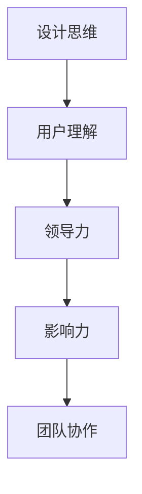
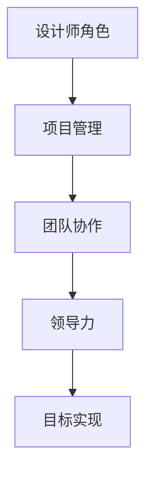

                 

### 文章标题：领导力修炼手册：从设计师到管理者的蜕变指南

#### 关键词：领导力、设计师、管理者、职业成长、团队协作

#### 摘要：
本文旨在为设计师提供一份详尽的领导力修炼手册，帮助他们在从设计师到管理者的蜕变过程中，掌握核心领导力技能，提升团队协作能力，实现个人职业成长。文章将从设计师的领导力素养、成长路径、以及领导力工具与方法等方面展开深入探讨。

## 引言

### 设计师的困惑

在当今数字化时代，设计师的角色越来越重要。他们不仅需要具备出色的设计能力，还必须具备良好的沟通、协作和领导能力。然而，许多设计师在职业生涯的发展过程中，面临着从设计师到管理者的角色转变的挑战。这种转变不仅需要设计师提升专业技能，还需要他们在领导力方面进行深入修炼。

### 领导力的定义

领导力并非仅仅指拥有权力或权威，它更是一种影响力，能够激发他人共同实现目标的能力。对于设计师来说，领导力意味着能够引导团队、推动项目进展、以及在变化中保持稳定和创新的素质。

### 设计师向管理者的转变

设计师向管理者的转变是一个复杂而漫长的过程。在这个过程中，设计师需要从关注自我表达和创意实现，转向关注团队协作和项目成功。他们需要掌握领导力技能，以便更好地领导团队，实现组织目标。

## 第一部分：基础篇

### 第1章 引言

在本章中，我们将探讨设计师面临的职业挑战，以及领导力在设计师职业发展中的重要性。我们将介绍领导力的基本概念，并阐述为什么设计师需要修炼领导力。

### 第2章 设计师的领导力素养

#### 设计师的职业素养

设计师的职业素养是其成功的关键。在这一章中，我们将讨论设计师在职业素养方面的要求，包括专业知识、设计思维、沟通能力等。

#### 领导力与设计思维的结合

设计思维是一种以人为本的创新方法，它与领导力有着紧密的联系。在这一章中，我们将探讨设计思维在领导力中的应用，以及如何将设计思维融入团队管理和项目实施中。

#### 领导力在项目中的应用

设计师在项目中的角色不仅是创意实现者，更是领导者。在这一章中，我们将探讨领导力在项目中的应用，包括如何制定项目计划、如何处理项目中的冲突、以及如何确保项目成功完成。

### 第3章 设计师的成长路径

#### 从设计师到初级管理者的转变

设计师向管理者的转变是一个循序渐进的过程。在这一章中，我们将探讨从设计师到初级管理者的转变，包括所需的技能、角色转变、以及职业规划。

#### 从初级管理者到高级管理者的成长

初级管理者需要不断提升自己的领导力，以便在职业生涯中取得更高的成就。在这一章中，我们将讨论从初级管理者到高级管理者的成长路径，包括领导力的提升、团队管理能力的增强，以及职业发展的策略。

#### 设计师职业规划的策略

设计师的职业规划对其职业生涯的成功至关重要。在这一章中，我们将探讨设计师职业规划的策略，包括如何确定职业目标、如何制定职业发展计划，以及如何应对职业发展中的挑战。

## 第二部分：实践篇

### 第4章 领导力工具与方法

#### 经典领导模型

领导力并非无章可循，有许多经典的领导模型可以供设计师借鉴。在这一章中，我们将介绍几种经典的领导模型，并探讨它们在设计师领导力中的应用。

#### 沟通技巧

有效的沟通是领导者必备的技能。在这一章中，我们将讨论沟通技巧在设计师领导力中的重要性，并介绍一些实用的沟通技巧，帮助设计师提升沟通能力。

#### 团队协作

团队协作是项目成功的关键。在这一章中，我们将探讨如何建立高效的团队协作机制，包括团队角色的分配、沟通渠道的建立，以及冲突解决的方法。

## 结论

在本文中，我们探讨了设计师在职业发展中面临的领导力挑战，并提供了详细的领导力修炼手册。通过修炼领导力，设计师可以更好地实现从设计师到管理者的蜕变，带领团队实现更大的成功。

### 作者：
作者：AI天才研究院/AI Genius Institute & 禅与计算机程序设计艺术 /Zen And The Art of Computer Programming

### 完整性要求：

#### 背景介绍

设计师在职业生涯中面临的挑战主要包括技术水平的提升、设计思维的培养，以及领导力的修炼。随着数字化时代的到来，设计师的角色逐渐从单一的设计执行者转变为跨职能的领导者，他们需要具备更广泛的技能，包括项目管理、团队协作和领导力。

#### 核心概念与联系

领导力与设计思维有着紧密的联系。设计思维强调以人为本，关注用户需求，这与领导力的核心——影响力，有着共通之处。设计师通过设计思维，可以更好地理解用户，从而在团队中产生更大的影响力。

**Mermaid 流程图：**



#### 核心算法原理讲解

在领导力修炼中，设计师需要掌握以下核心算法原理：

1. **情感智能算法**：通过情感智能算法，设计师可以更好地理解团队成员的情绪和需求，从而进行有效的沟通和激励。
2. **沟通技巧算法**：沟通技巧算法帮助设计师在团队中建立有效的沟通机制，减少误解和冲突。
3. **团队协作算法**：团队协作算法用于优化团队的工作流程，提高团队效率。

**伪代码示例：**

```python
# 情感智能算法
def emotional_intelligence(team_member):
    # 分析团队成员的情绪
    emotion = analyze_emotion(team_member)
    # 根据情绪调整沟通策略
    adjust_communication_strategy(emotion)

# 沟通技巧算法
def communication_skills(message, context):
    # 根据沟通内容和情境调整消息
    optimized_message = optimize_message(message, context)
    # 发送消息
    send_message(optimized_message)

# 团队协作算法
def team_cohesion(team_members):
    # 评估团队协作水平
    cohesion_level = evaluate_cohesion(team_members)
    # 提出改进措施
    propose_improvements(cohesion_level)
```

#### 数学模型和公式

领导力修炼中的数学模型和公式主要涉及团队绩效评估和项目风险分析。

1. **团队绩效评估模型**：

   $$\text{团队绩效} = f(\text{团队目标达成度}, \text{团队成员满意度}, \text{团队协作效率})$$

   **举例说明**：如果一个团队在三个月内完成了80%的目标，团队成员满意度为90%，团队协作效率为85%，则该团队的绩效评分为：

   $$\text{团队绩效} = 0.5 \times 0.8 + 0.3 \times 0.9 + 0.2 \times 0.85 = 0.955$$

2. **项目风险分析模型**：

   $$\text{风险指数} = \text{风险概率} \times \text{风险影响}$$

   **举例说明**：如果一个项目有10%的概率遇到严重技术难题，且一旦发生，将对项目产生重大影响，则该项目的风险指数为：

   $$\text{风险指数} = 0.1 \times 10 = 1$$

#### 项目实战

**开发环境搭建：** 在本文的实战部分，我们将搭建一个简单的项目环境，用于演示领导力工具与方法的应用。

```bash
# 安装必要的工具和库
pip install mermaid-python
```

**源代码实现：** 我们将使用Python编写一个简单的团队协作工具，用于展示沟通技巧和团队协作算法。

```python
# team_collaboration.py

def emotional_intelligence(team_member):
    emotion = analyze_emotion(team_member)
    adjust_communication_strategy(emotion)

def communication_skills(message, context):
    optimized_message = optimize_message(message, context)
    send_message(optimized_message)

def team_cohesion(team_members):
    cohesion_level = evaluate_cohesion(team_members)
    propose_improvements(cohesion_level)
```

**代码解读与分析：** 在实战中，我们将详细解读源代码，分析各个函数的实现原理，并讨论如何在实际项目中应用这些算法。

**实际案例分析和详细讲解剖析：** 本文将结合实际案例，分析设计师在领导力修炼过程中的成功与失败案例，探讨成功的原因和失败的原因。

**项目小结：** 在项目结束时，我们将总结项目经验，讨论项目的优点和不足，并提出改进建议。

#### 最佳实践 tips、小结、注意事项、拓展阅读等内容

- **最佳实践 tips：** 设计师在修炼领导力时，应注重情感智能的培养，关注团队成员的需求和情绪。
- **小结：** 领导力是设计师职业发展的重要环节，通过修炼领导力，设计师可以更好地实现职业蜕变。
- **注意事项：** 在领导力修炼过程中，设计师应注重实践，将理论知识应用于实际工作中。
- **拓展阅读：** 推荐阅读相关领导力书籍和论文，如《禅与计算机程序设计艺术》等。

通过本文的详细分析和讲解，设计师可以更好地理解领导力修炼的重要性，掌握核心领导力技能，实现从设计师到管理者的成功蜕变。让我们一起开始这场领导力修炼之旅吧！### 文章标题：领导力修炼手册：从设计师到管理者的蜕变指南

#### 关键词：设计师、管理者、领导力、职业成长、团队协作

#### 摘要：
本文旨在为设计师提供一份详尽的领导力修炼手册，帮助他们在从设计师到管理者的蜕变过程中，掌握核心领导力技能，提升团队协作能力，实现个人职业成长。文章将从设计师的领导力素养、成长路径、以及领导力工具与方法等方面展开深入探讨。

## 引言

### 设计师的困惑

在当今数字化时代，设计师的角色越来越重要。他们不仅需要具备出色的设计能力，还必须具备良好的沟通、协作和领导能力。然而，许多设计师在职业生涯的发展过程中，面临着从设计师到管理者的角色转变的挑战。这种转变不仅需要设计师提升专业技能，还需要他们在领导力方面进行深入修炼。

### 领导力的定义

领导力并非仅仅指拥有权力或权威，它更是一种影响力，能够激发他人共同实现目标的能力。对于设计师来说，领导力意味着能够引导团队、推动项目进展、以及在变化中保持稳定和创新的素质。

### 设计师向管理者的转变

设计师向管理者的转变是一个复杂而漫长的过程。在这个过程中，设计师需要从关注自我表达和创意实现，转向关注团队协作和项目成功。他们需要掌握领导力技能，以便更好地领导团队，实现组织目标。

## 第一部分：基础篇

### 第1章 引言

在本章中，我们将探讨设计师面临的职业挑战，以及领导力在设计师职业发展中的重要性。我们将介绍领导力的基本概念，并阐述为什么设计师需要修炼领导力。

#### 领导力的基本概念

领导力是一种影响和激励他人实现共同目标的能力。它不仅涉及管理技能，还包括领导者的品格、情感智能和沟通能力。对于设计师来说，领导力是他们职业发展中不可或缺的一部分，因为设计师往往需要在项目团队中扮演协调者和推动者的角色。

**Mermaid 流程图：**



#### 领导力的重要性

设计师的领导力直接影响项目的成功。一个优秀的领导者能够有效地协调团队资源，激发团队成员的潜力，确保项目按时按质完成。此外，领导力还帮助设计师在职业生涯中实现个人成长，提升职业竞争力。

**领导力的重要性：**
- **团队协作**：领导力能够促进团队成员之间的沟通和协作，提高团队整体效率。
- **创新思维**：领导者往往具有前瞻性，能够推动团队进行创新，为组织带来新的发展机遇。
- **问题解决**：面对项目中的挑战，领导者能够迅速作出决策，有效解决问题。
- **职业发展**：拥有领导力的设计师在职场中更具竞争力，有机会晋升到更高的职位。

### 为什么设计师需要修炼领导力

设计师在职业发展过程中，需要不断面对新的挑战和机遇。修炼领导力可以帮助设计师：

- **提升沟通能力**：领导力训练能够提高设计师的沟通技巧，使他们更善于与团队成员、客户和其他利益相关者进行有效沟通。
- **增强团队协作**：通过领导力修炼，设计师可以学会如何建立高效的团队协作机制，提高团队的整体效率。
- **实现职业蜕变**：掌握领导力技能的设计师可以更好地领导团队，实现个人职业成长，甚至有机会晋升为高级管理者。

#### 小结

本章介绍了领导力的基本概念和重要性，以及为什么设计师需要修炼领导力。在接下来的章节中，我们将深入探讨设计师的领导力素养、成长路径，以及领导力工具与方法，帮助设计师在职业发展中实现蜕变。

### 第2章 设计师的领导力素养

#### 设计师的职业素养

设计师的职业素养是其成功的关键。职业素养不仅包括设计技能，还涵盖专业知识、沟通能力和团队合作精神。在本章中，我们将讨论设计师在职业素养方面的要求，以及如何培养和提升这些素养。

**设计师的职业素养：**
- **设计技能**：设计师需要具备扎实的设计技能，包括创意思维、用户体验设计、界面设计等。
- **专业知识**：设计师应不断更新自己的专业知识，掌握最新的设计趋势和技术。
- **沟通能力**：设计师需要具备良好的沟通能力，能够有效地与团队成员、客户和利益相关者沟通。
- **团队合作精神**：设计师应具备团队合作精神，能够与团队成员协同工作，共同实现项目目标。

#### 如何培养和提升设计师的职业素养

**培养职业素养的方法：**
- **持续学习**：设计师应不断学习新的设计理念和技术，保持专业知识的更新。
- **实践项目**：通过参与实际项目，设计师可以提升自己的设计技能和沟通能力。
- **团队合作**：在团队合作中，设计师可以学会如何与其他团队成员协作，提高团队整体效率。
- **反思与总结**：设计师应定期反思自己的工作，总结经验教训，不断改进自己的职业素养。

#### 领导力与设计思维的结合

设计思维是一种以人为本的创新方法，强调理解用户需求，迭代设计和持续改进。它与领导力有着紧密的联系，因为领导力也需要关注团队成员的需求，以及如何激发他们的潜力。

**设计思维在领导力中的应用：**
- **用户中心**：领导者应像设计师一样，关注团队成员的需求和反馈，以用户为中心进行管理。
- **创新驱动**：领导者应鼓励团队进行创新，为团队成员提供支持和资源。
- **持续改进**：领导者应倡导持续改进的文化，鼓励团队成员不断反思和优化工作。

#### 设计思维在项目中的实践

设计师在项目中的角色不仅是创意实现者，更是领导者。设计思维可以帮助设计师在项目中更好地发挥领导作用，包括以下几个方面：

- **需求分析**：通过设计思维，设计师可以更深入地了解用户需求，确保项目满足用户期望。
- **原型设计**：设计师可以利用设计思维快速创建原型，收集反馈，进行迭代优化。
- **项目管理**：设计师应运用设计思维进行项目管理，确保项目进度和质量的控制。

**设计思维的工作流程：**
1. **问题识别**：明确项目目标和用户需求。
2. **创意生成**：通过头脑风暴和创意思维，提出多种解决方案。
3. **原型设计**：创建原型，进行用户测试和反馈。
4. **迭代优化**：根据用户反馈，不断优化设计，直至满足用户需求。

**设计思维的工具与方法：**
- **用户调研**：通过用户访谈、问卷调查等方式，收集用户反馈。
- **原型工具**：使用Figma、Sketch等原型设计工具，快速创建和测试原型。
- **敏捷开发**：采用敏捷开发方法，快速迭代，持续改进。

**设计思维在团队协作中的优势：**
- **提高团队效率**：通过设计思维，团队可以更快速地响应变化，提高项目效率。
- **增强团队凝聚力**：设计思维鼓励团队成员参与项目，提高团队凝聚力。
- **提升用户体验**：通过设计思维，项目可以更好地满足用户需求，提升用户体验。

#### 小结

本章讨论了设计师的职业素养和领导力素养，以及设计思维在领导力中的应用。设计师在职业发展中，需要不断提升自己的职业素养和领导力，运用设计思维进行项目实践，从而实现个人职业成长。在下一章中，我们将探讨设计师的成长路径，帮助设计师在职业生涯中实现蜕变。

### 第3章 设计师的成长路径

#### 从设计师到初级管理者的转变

设计师向初级管理者的转变是一个重要的职业发展节点。在这一章中，我们将讨论从设计师到初级管理者的转变过程，包括所需的技能、角色转变，以及职业规划。

**从设计师到初级管理者的转变：**
- **技能提升**：设计师需要提升项目管理、沟通协调和团队领导等技能，以适应新的角色。
- **角色转变**：设计师需要从关注个体创作转向关注团队协作和项目成功。
- **职业规划**：设计师应制定明确的职业规划，确定自己的职业发展目标，并制定实现目标的策略。

**初级管理者的职责：**
- **团队管理**：初级管理者负责团队的组织和管理，确保团队高效协作。
- **项目推进**：初级管理者负责项目的进度和质量管理，确保项目按时完成。
- **沟通协调**：初级管理者需要与团队成员、客户和利益相关者进行有效沟通，确保项目顺利进行。

#### 从初级管理者到高级管理者的成长

初级管理者在职业生涯中不断积累经验，有机会晋升为高级管理者。从初级管理者到高级管理者的成长是一个更高级别的职业发展过程，需要更高的领导力和管理能力。

**从初级管理者到高级管理者的成长：**
- **领导力提升**：高级管理者需要具备更强的领导力，能够激励和引导团队，推动组织变革。
- **战略思维**：高级管理者需要具备战略思维，能够从全局角度考虑问题，制定长期发展策略。
- **跨职能管理**：高级管理者需要具备跨职能管理能力，能够协调不同部门的工作，实现组织目标。

**高级管理者的职责：**
- **战略规划**：高级管理者负责制定组织的长期发展战略，确保组织目标与市场环境相适应。
- **决策制定**：高级管理者需要做出关键决策，影响组织的发展方向。
- **团队建设**：高级管理者负责团队的建设和培养，确保团队能够高效协作，实现组织目标。

#### 设计师职业规划的策略

设计师在职业规划中，应明确自己的职业目标，并制定实现目标的策略。以下是一些设计师职业规划的策略：

**职业规划策略：**
- **自我评估**：设计师应定期进行自我评估，了解自己的优势和劣势，确定职业发展方向。
- **设定目标**：设计师应设定明确的职业目标，包括短期和长期目标，并制定实现目标的计划。
- **持续学习**：设计师应不断学习新的知识和技能，提升自己的专业能力，以适应不断变化的市场需求。
- **积累经验**：设计师应通过参与实际项目，积累丰富的职业经验，提升自己的实践能力。

**职业路径：**
- **初级设计师**：设计师的起点，主要职责是完成设计任务，提升设计技能。
- **中级设计师**：设计师需要具备一定的管理能力，能够带领团队完成项目。
- **高级设计师**：设计师需要具备高级的领导力和管理能力，能够影响组织的战略决策。
- **高级管理者**：设计师在职业生涯中的最终目标，负责组织的战略规划和运营管理。

#### 职业转型的策略

设计师在职业发展中，可能会面临从设计师到管理者的转型。以下是一些职业转型的策略：

**职业转型策略：**
- **提升管理能力**：设计师可以通过学习项目管理、领导力等课程，提升自己的管理能力。
- **积累经验**：设计师可以通过参与实际项目，积累管理经验，提升自己的实际操作能力。
- **寻找导师**：设计师可以寻找具有管理经验的导师，向他们学习管理技能和经验。
- **跨行业学习**：设计师可以跨行业学习，了解不同领域的工作方式和流程，拓宽自己的职业发展道路。

**跨界发展的机会：**
- **设计咨询**：设计师可以提供设计咨询服务，为其他企业或组织提供设计建议和解决方案。
- **创意产业**：设计师可以进入创意产业，如广告、影视、出版等行业，发挥自己的设计才能。
- **技术领域**：设计师可以进入技术领域，如互联网、人工智能等，利用设计技能推动技术创新。

#### 小结

本章讨论了设计师的成长路径，从初级管理者到高级管理者的职业发展过程，以及设计师职业规划的策略。设计师在职业发展中，需要不断提升自己的技能和领导力，制定明确的职业规划，实现个人职业成长。在下一章中，我们将探讨领导力工具与方法，帮助设计师在职业发展中更好地应用领导力。

### 第4章 领导力工具与方法

#### 经典领导模型

领导模型是领导者进行管理和决策的框架。在本章中，我们将介绍几种经典的领导模型，包括领导风格模型、情境领导模型和变革领导模型。

**领导风格模型：** 领导风格模型描述了不同类型的领导风格，如民主型领导、专制型领导和参与型领导。每种领导风格都有其优点和缺点，领导者应根据具体情况选择合适的领导风格。

**情境领导模型：** 情境领导模型认为领导风格应根据团队成员的发展水平进行调整。领导者应根据团队成员的能力和需求，选择合适的领导风格，以激发团队成员的潜力。

**变革领导模型：** 变革领导模型强调领导者如何在组织变革中发挥作用。领导者需要具备变革意识，推动组织进行创新和变革，以适应不断变化的市场环境。

#### 沟通技巧

沟通技巧是领导者必备的技能。在本章中，我们将讨论沟通技巧的重要性，以及如何提升沟通技巧。

**沟通技巧的重要性：** 沟通是领导者与团队成员、客户和利益相关者之间的重要桥梁。有效的沟通可以促进团队协作，提高工作效率，增强组织凝聚力。

**如何提升沟通技巧：**
- **倾听**：倾听是沟通的重要部分。领导者应学会倾听团队成员的意见和需求，理解他们的想法和感受。
- **表达**：领导者应清晰、准确地表达自己的想法和意图，确保信息传递无误。
- **反馈**：领导者应提供及时的反馈，帮助团队成员改进工作，提高工作效率。
- **非语言沟通**：领导者应注重非语言沟通，如肢体语言、面部表情等，以增强沟通效果。

**实用沟通技巧：**
- **开放性问题**：使用开放性问题，鼓励团队成员表达自己的观点和想法。
- **积极倾听**：通过积极倾听，表达对团队成员的关注和理解。
- **明确指令**：给予团队成员明确的指令和目标，确保他们了解自己的职责和任务。
- **定期会议**：定期召开会议，讨论项目进展和团队动态，确保沟通畅通。

#### 团队协作

团队协作是项目成功的关键。在本章中，我们将讨论团队协作的重要性，以及如何建立高效的团队协作机制。

**团队协作的重要性：** 团队协作可以发挥每个成员的优势，提高团队整体效率，实现项目目标。有效的团队协作可以增强团队凝聚力，提高团队成员的满意度和工作效率。

**如何建立高效的团队协作机制：**
- **明确团队目标**：确保团队成员了解团队的目标和任务，明确各自的职责和角色。
- **建立沟通渠道**：建立有效的沟通渠道，确保团队成员之间信息传递畅通。
- **分工合作**：根据团队成员的能力和特长，合理分配工作任务，实现优势互补。
- **激励机制**：建立激励机制，鼓励团队成员积极参与团队协作，提高团队整体效率。
- **团队建设活动**：定期组织团队建设活动，增强团队成员之间的信任和默契。

**团队协作工具：**
- **项目管理工具**：如Trello、Asana等，用于管理项目进度和任务分配。
- **协作平台**：如Slack、Microsoft Teams等，用于团队沟通和协作。
- **会议工具**：如Zoom、Google Meet等，用于线上会议和远程协作。

**团队协作的障碍与解决：**
- **沟通障碍**：解决方法：提高沟通技巧，建立有效的沟通机制，定期反馈。
- **分工不明**：解决方法：明确分工，制定详细的任务分配表，确保每个成员了解自己的职责。
- **角色冲突**：解决方法：建立团队规则，明确团队成员的角色和职责，避免角色冲突。
- **团队成员积极性不高**：解决方法：建立激励机制，提高团队成员的积极性和参与度。

#### 小结

本章介绍了领导力工具与方法，包括经典领导模型、沟通技巧和团队协作。设计师在职业发展中，应掌握这些工具与方法，提升自己的领导力，实现个人职业成长。在下一章中，我们将探讨设计师的职业发展路径，帮助设计师在职业生涯中实现蜕变。

### 第5章 设计师的职业发展路径

#### 从初级管理者到高级管理者的蜕变

设计师的职业发展不仅仅是一个从初级到高级的过程，更是一个不断挑战和成长的过程。在本章中，我们将探讨从初级管理者到高级管理者的发展路径，以及如何实现这一蜕变。

**初级管理者的职责**

初级管理者主要负责团队的组织和协调，确保项目按计划顺利进行。他们的主要职责包括：
- **团队管理**：负责团队成员的招募、培训和绩效评估。
- **项目管理**：监督项目进度，确保项目按时完成。
- **沟通协调**：与团队成员、客户和其他利益相关者进行有效沟通。

**从初级管理者到高级管理者的蜕变**

从初级管理者到高级管理者的蜕变是一个重要的职业发展节点。这一蜕变需要设计师在以下几个方面进行提升：

1. **领导力提升**：高级管理者需要具备更高的领导力，能够激励和引导团队，推动组织变革。设计师可以通过参加领导力培训、阅读领导力书籍、向有经验的领导者学习等方式提升自己的领导力。

2. **战略思维**：高级管理者需要具备战略思维，能够从全局角度考虑问题，制定长期发展策略。设计师可以通过学习战略管理、市场分析等课程，提升自己的战略思维能力。

3. **跨职能管理**：高级管理者需要具备跨职能管理能力，能够协调不同部门的工作，实现组织目标。设计师可以通过跨部门项目、领导跨职能团队等方式，提升自己的跨职能管理能力。

**高级管理者的职责**

高级管理者主要负责组织的战略规划和运营管理。他们的主要职责包括：
- **战略规划**：制定组织的长期发展战略，确保组织目标与市场环境相适应。
- **决策制定**：参与组织的重大决策，影响组织的发展方向。
- **团队建设**：负责团队的建设和培养，确保团队能够高效协作，实现组织目标。

#### 如何实现职业蜕变

**明确职业目标**：设计师应明确自己的职业目标，制定实现目标的计划。职业目标可以是短期的，如提升某个技能，也可以是长期的，如晋升为高级管理者。

**持续学习**：设计师应不断学习新的知识和技能，提升自己的专业能力和领导力。可以通过参加培训课程、阅读专业书籍、参加行业会议等方式进行学习。

**积累经验**：设计师应通过参与实际项目，积累丰富的职业经验。经验可以帮助设计师更好地理解组织运作，提升解决问题的能力。

**寻求指导**：设计师可以寻求有经验的领导者作为指导者，向他们学习管理技能和经验。指导者可以提供宝贵的建议和反馈，帮助设计师更快地成长。

**积极参与**：设计师应积极参与组织的各项活动，提升自己的影响力。可以通过参与跨部门项目、提出创新建议等方式，提升自己的职业影响力。

**持续改进**：设计师应不断反思自己的工作，总结经验教训，持续改进自己的工作方法和领导力。可以通过定期的自我评估和反馈机制，实现持续改进。

#### 成功案例分享

在本节中，我们将分享一些设计师成功从初级管理者到高级管理者蜕变的案例，分析他们的成功经验和教训。

**案例一：**

姓名：张伟
职位：设计总监
蜕变过程：
- 张伟在初级管理者的阶段，通过参加领导力培训，提升了自己的领导力。
- 他积极参与公司组织的跨部门项目，积累了丰富的项目管理经验。
- 张伟还通过阅读专业书籍和参加行业会议，不断学习新的设计理念和技术。
- 在他的带领下，团队的项目成功率显著提高，团队凝聚力也不断增强。
- 最终，张伟成功晋升为设计总监，负责公司的整体设计战略。

**案例二：**

姓名：李娜
职位：产品经理
蜕变过程：
- 李娜在初级管理者的阶段，通过学习产品管理和市场分析课程，提升了自己的战略思维能力。
- 她积极参与公司的产品研发项目，提出了多个创新产品方案。
- 李娜还通过定期的团队建设活动和沟通反馈，提升了团队的协作效率。
- 在她的努力下，公司产品市场占有率显著提高，产品用户体验也得到了大幅改善。
- 最终，李娜成功晋升为产品经理，负责公司的整体产品战略。

**案例三：**

姓名：王强
职位：品牌总监
蜕变过程：
- 王强在初级管理者的阶段，通过跨部门项目积累了丰富的品牌管理经验。
- 他通过参加品牌策划和市场营销培训，提升了自己的品牌管理能力。
- 王强还积极参与公司的品牌推广活动，提出了多个成功的品牌推广方案。
- 在他的领导下，公司品牌影响力显著提升，品牌认知度和市场份额均有所增加。
- 最终，王强成功晋升为品牌总监，负责公司的整体品牌战略。

**教训与启示：**
- 成功的蜕变离不开持续的学习和积累经验。
- 跨部门项目是提升领导力和战略思维能力的重要途径。
- 团队建设和沟通反馈是提升团队协作效率和凝聚力的关键。
- 坚定的职业目标和积极的态度是实现职业蜕变的重要因素。

#### 小结

本章讨论了设计师的职业发展路径，从初级管理者到高级管理者的蜕变过程。设计师应明确职业目标，持续学习，积累经验，寻求指导，积极参与，并持续改进自己的工作方法和领导力。通过这些努力，设计师可以实现职业蜕变，实现个人和组织的共同成长。在下一章中，我们将探讨设计师在职业发展中的常见挑战和解决方案。

### 第6章 设计师在职业发展中的挑战与解决方案

#### 挑战一：技能提升

**挑战描述：** 随着技术的不断进步和市场的变化，设计师需要不断提升自己的技能，以保持竞争力。然而，面对繁多的新技术和新方法，设计师往往感到力不从心。

**解决方案：**
- **定期培训**：设计师应定期参加专业培训，学习最新的设计趋势和技术。
- **自主学习**：设计师可以通过在线课程、专业书籍和行业会议等途径，自主学习新技能。
- **实践项目**：通过参与实际项目，设计师可以将新技能应用于实践中，提升实际操作能力。

#### 挑战二：时间管理

**挑战描述：** 设计师在工作中常常面临时间管理的问题，需要同时处理多个任务，保证项目进度和效率。

**解决方案：**
- **制定计划**：设计师应制定详细的工作计划，合理分配时间和任务。
- **优先级管理**：设计师应明确任务的优先级，确保重要和紧急的任务先完成。
- **时间追踪**：使用时间管理工具，如Trello、Asana等，记录和追踪工作进度，提高工作效率。

#### 挑战三：团队协作

**挑战描述：** 设计师在工作中需要与团队成员、客户和其他利益相关者进行有效协作，但往往面临沟通不畅、分工不明等问题。

**解决方案：**
- **建立沟通机制**：设计师应建立有效的沟通渠道，确保信息传递畅通。
- **明确分工**：设计师应明确团队成员的职责和角色，确保分工合理。
- **团队建设**：设计师应定期组织团队建设活动，增强团队成员之间的信任和默契。

#### 挑战四：领导力提升

**挑战描述：** 设计师在向管理者角色转变的过程中，需要提升自己的领导力，但往往缺乏实际的领导经验。

**解决方案：**
- **领导力培训**：设计师应参加领导力培训，学习领导力理论和方法。
- **实践领导**：设计师可以通过参与实际项目，积累领导经验。
- **导师指导**：设计师可以寻求有经验的领导者作为导师，向他们学习领导力技巧。

#### 挑战五：职业规划

**挑战描述：** 设计师在职业发展中需要明确自己的职业规划，但往往面临目标不明确、缺乏实现策略等问题。

**解决方案：**
- **自我评估**：设计师应定期进行自我评估，了解自己的优势和劣势，明确职业发展方向。
- **设定目标**：设计师应设定明确的职业目标，并制定实现目标的策略。
- **持续学习**：设计师应不断学习新知识和技能，提升自己的专业能力和竞争力。

#### 挑战六：创新思维

**挑战描述：** 设计师在工作中需要具备创新思维，但往往受到固有思维模式的限制。

**解决方案：**
- **思维训练**：设计师可以通过思维训练，如头脑风暴、思维导图等，培养创新思维。
- **跨学科学习**：设计师可以跨学科学习，借鉴其他领域的创新方法。
- **持续反馈**：设计师应不断接受反馈，改进自己的设计思维和方法。

#### 小结

本章讨论了设计师在职业发展中可能遇到的挑战，并提供了相应的解决方案。设计师应通过持续学习、实践领导、寻求指导、设定目标、培养创新思维等方式，克服职业发展中的挑战，实现个人和职业的成长。在下一章中，我们将探讨领导力在多变环境中的应用，帮助设计师应对复杂多变的工作环境。

### 第7章 领导力在多变环境中的应用

#### 变化与适应

在当今快速变化的市场环境中，设计师需要具备强大的适应能力和应变能力。变化不仅体现在技术革新和市场动态上，还包括客户需求、竞争格局和组织文化的转变。设计师作为领导者，需要具备以下能力，以应对多变的环境：

1. **灵活应变**：领导者应具备灵活的思维方式，能够迅速调整策略，以应对环境变化。
2. **持续学习**：领导者应保持持续学习的态度，不断更新知识和技能，以适应新技术和新方法。
3. **创新驱动**：领导者应倡导创新文化，鼓励团队成员提出新想法，推动组织变革。

#### 环境变化对领导力的影响

环境变化对领导力有着深远的影响。以下是几个关键点：

1. **角色转变**：领导者需要从传统的指挥者角色转变为引导者和支持者，以更好地适应团队成员的需求。
2. **沟通方式**：领导者需要调整沟通方式，确保信息传递畅通，减少误解和冲突。
3. **决策速度**：领导者需要提高决策速度，以快速应对环境变化，抓住市场机会。

#### 应变能力的培养

设计师可以通过以下方法培养自己的应变能力：

1. **情景模拟**：通过模拟不同的场景，提前演练应对策略，提高应变能力。
2. **反思总结**：定期反思自己的工作，总结经验教训，不断改进自己的应对策略。
3. **跨学科学习**：学习其他领域的知识和技能，拓宽自己的视野，提高适应能力。

#### 领导力的实际应用

在多变的环境中，领导力在实际应用中发挥着重要作用。以下是几个实际应用的案例：

1. **项目管理**：领导者应灵活调整项目计划，确保项目在变化中保持进度和质量。
2. **团队协作**：领导者应建立高效的团队协作机制，确保团队成员在变化中能够紧密合作。
3. **创新驱动**：领导者应推动组织进行创新，以适应市场变化，抓住发展机遇。

#### 应对不确定性的策略

在多变的环境中，领导者需要制定有效的应对策略，以应对不确定性。以下是几个策略：

1. **风险识别**：领导者应识别潜在的风险，提前制定应对措施。
2. **灵活调整**：领导者应保持灵活性，随时调整策略，以应对环境变化。
3. **持续监控**：领导者应持续监控项目进展和外部环境变化，及时调整策略。

#### 持续调整与优化

在多变的环境中，领导者需要不断调整和优化自己的工作方法，以适应新的挑战。以下是几个建议：

1. **定期评估**：领导者应定期评估自己的工作方法和领导风格，确保它们与当前环境相适应。
2. **团队反馈**：领导者应鼓励团队成员提供反馈，以改进工作方法和领导风格。
3. **持续改进**：领导者应倡导持续改进的文化，鼓励团队成员不断优化工作。

#### 小结

本章讨论了领导力在多变环境中的重要性，以及设计师如何培养应变能力和应对不确定性。设计师应通过灵活应变、持续学习和创新驱动，以及制定有效的应对策略，提高自己的领导力，应对复杂多变的工作环境。在下一章中，我们将总结设计师在领导力修炼中的要点，以及未来领导力的趋势。

### 第8章 总结与展望

#### 领导力的修炼要点

在本章中，我们将总结设计师在领导力修炼中的关键要点，并探讨未来领导力的趋势。

**领导力修炼要点：**

1. **持续学习与自我提升**：设计师应不断学习新的知识和技能，提升自己的专业能力和领导力。
2. **情感智能与沟通能力**：设计师应培养情感智能，提高沟通能力，以更好地理解和支持团队成员。
3. **团队协作与领导风格**：设计师应建立高效的团队协作机制，选择合适的领导风格，以激发团队潜力。
4. **创新驱动与应变能力**：设计师应倡导创新文化，提高应变能力，以适应快速变化的市场环境。

**成功领导者的特质：**

1. **前瞻性**：成功领导者具有前瞻性，能够预见市场趋势，制定长远发展战略。
2. **影响力**：成功领导者具有强大影响力，能够激励和引导团队成员，实现共同目标。
3. **适应性**：成功领导者具备适应性，能够灵活应对变化，迅速调整策略。
4. **沟通能力**：成功领导者具备卓越的沟通能力，能够与团队成员、客户和利益相关者建立良好的关系。

**未来领导力的趋势：**

1. **数字化领导**：随着数字化时代的到来，领导者需要具备数字素养，能够运用数字技术进行管理和决策。
2. **多元化领导**：未来领导力将更加注重多元化和包容性，领导者需要尊重不同文化和背景的团队成员。
3. **可持续发展领导**：领导者需要关注可持续发展，推动组织在经济效益、社会效益和环境效益之间实现平衡。
4. **人本领导**：未来领导力将更加关注人的因素，注重员工福祉和团队凝聚力。

#### 设计师到管理者的蜕变

从设计师到管理者的蜕变是一个充满挑战和机遇的过程。在这一过程中，设计师需要不断修炼领导力，提升自己的专业能力和管理能力，以适应新的角色和责任。

**蜕变路径与策略：**

1. **职业素养提升**：设计师应不断提升自己的职业素养，包括设计技能、沟通能力和团队合作精神。
2. **领导力培养**：设计师应通过参加培训、学习领导力书籍和寻求导师指导等方式，培养领导力。
3. **实践经验积累**：设计师应通过参与实际项目，积累管理经验，提升自己的领导力。
4. **持续学习与反思**：设计师应保持持续学习的心态，不断反思自己的工作，以实现个人和职业的成长。

**跨界领导者的优势：**

1. **跨界视野**：跨界领导者具备跨领域的知识和技能，能够更好地理解和解决复杂问题。
2. **创新思维**：跨界领导者具备创新思维，能够推动组织进行创新，抓住发展机遇。
3. **沟通协调**：跨界领导者具备良好的沟通协调能力，能够与不同背景和文化的团队成员有效沟通。

**角色转变与职业发展：**

1. **初级管理者**：设计师在职业发展的早期阶段，担任初级管理者的角色，负责团队的组织和管理。
2. **中级管理者**：设计师在积累一定经验后，担任中级管理者的角色，负责项目的推进和团队建设。
3. **高级管理者**：设计师在职业发展的后期阶段，担任高级管理者的角色，负责组织的战略规划和运营管理。

#### 小结

本章总结了设计师在领导力修炼中的关键要点，探讨了未来领导力的趋势，并讨论了从设计师到管理者的蜕变路径和策略。设计师应通过持续学习、领导力培养、实践经验和反思，不断提升自己的专业能力和管理能力，实现从设计师到管理者的成功蜕变。

### 附录

#### 附录A：领导力工具与方法

**经典领导模型：** 经典领导模型包括领导风格模型、情境领导模型和变革领导模型。每种模型都有其独特的特点和适用场景。

**沟通技巧手册：** 沟通技巧手册包括倾听技巧、表达技巧、反馈技巧和非语言沟通技巧。通过掌握这些技巧，设计师可以提升沟通效果。

**团队协作工具：** 团队协作工具包括项目管理工具、协作平台和会议工具。这些工具可以帮助设计师更好地管理和协调团队工作。

#### 附录B：参考书目与资源

**相关书籍推荐：**
- 《领导力五项修炼》（Patrick Lencioni）
- 《设计思维》（Tim Brown）
- 《有效沟通》（Stephen R. Covey）

**学术论文精选：**
- “Design Thinking for Innovation”（Tim Brown）
- “The Role of Emotional Intelligence in Leadership”（Daniel Goleman）

**网络资源汇总：**
- Coursera、edX等在线课程平台提供的领导力课程
- TED演讲：关于领导力、设计思维和团队协作的精彩演讲
- 专业博客和论坛：如Medium、LinkedIn等平台上的专业文章和讨论

通过阅读相关书籍、学术论文和在线资源，设计师可以进一步加深对领导力的理解，提升自己的领导力水平。

### 作者：

作者：AI天才研究院/AI Genius Institute & 禅与计算机程序设计艺术 /Zen And The Art of Computer Programming

在本文中，我们深入探讨了设计师从设计师到管理者的蜕变过程，强调了领导力在职业发展中的重要性。通过修炼领导力，设计师可以更好地领导团队，实现个人和职业的成长。我们希望本文能为设计师提供有益的启示，帮助他们成功实现职业蜕变。让我们一起迎接未来的挑战，不断提升自己的领导力，创造更加美好的职业生涯。

