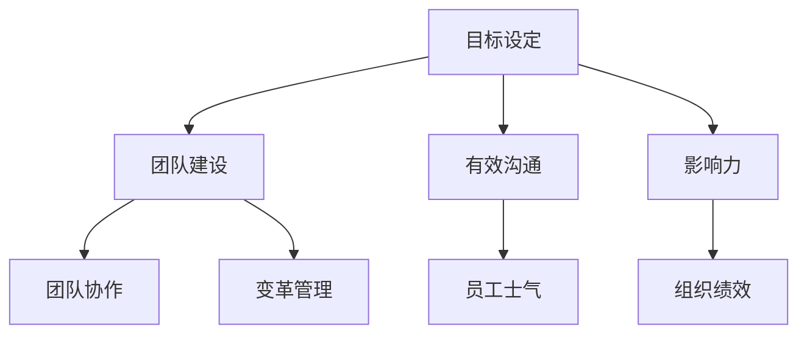

                 

### 第1章: 领导力的定义与重要性

> **关键词**: 领导力，定义，重要性，核心要素，人际沟通技巧。

领导力是一个广泛而复杂的话题，它在不同的文化和组织中被赋予了不同的含义。然而，核心的要素是普遍的：领导力涉及激励、影响、指导和推动他人朝着共同的目标前进。这一章将探讨领导力的定义、重要性以及其核心要素。

#### 1.1 领导力的定义

领导力并非仅仅是某个特定角色的职责，它是一种能力，可以通过学习和实践来提升。领导力的定义可以从多个角度进行理解，以下是几种常见的定义方式：

- **功能定义**：领导力是影响和激励他人共同努力以实现特定目标的能力。
- **过程定义**：领导力是一个持续的过程，涉及设定目标、建立关系、解决问题和推动变革。
- **结果定义**：领导力通过创造积极的结果来体现，这些结果包括团队的高效合作、组织的成功和个人的成长。

在技术领域，领导力通常与项目管理、团队建设和技术创新密切相关。项目经理和技术领导者需要具备领导力，以确保项目按时完成，团队高效运作，以及持续的技术创新。

#### 1.2 领导力的重要性

领导力在组织中的重要性不可低估。以下是一些关键的方面：

- **员工士气**：有效的领导能够提升员工的工作满意度和参与度，从而提高整个团队的士气。
- **团队协作**：领导力有助于建立良好的团队协作关系，促进团队成员之间的沟通和合作。
- **组织绩效**：领导力直接影响到组织的绩效。一个强大的领导力基础可以推动组织实现其战略目标。
- **持续发展**：领导力对于组织的持续发展至关重要，它能够推动创新、适应变化并保持竞争力。

在技术领域，领导力的重要性尤为突出。随着技术的快速发展，团队需要能够快速适应新环境，灵活应对挑战，并不断推动技术进步。这需要强有力的领导来引导方向，解决问题，并激发团队的潜能。

#### 1.3 领导力的核心要素

领导力并不是单一维度的能力，而是由多个核心要素组成的综合体系。以下是几个关键的核心要素：

- **目标设定**：一个明确的、有吸引力的目标是领导力的基石。领导需要能够设定并传达清晰的目标，并确保团队理解并致力于这些目标。
- **有效沟通**：沟通是领导力的关键要素之一。领导需要能够清晰地表达自己的想法，同时也要善于倾听和理解团队成员的意见和需求。
- **影响力**：领导力不仅仅是一种职位赋予的权力，更是一种能够影响他人思想和行为的能力。领导需要具备个人魅力和道德权威，以便在团队中产生深远的影响。
- **团队建设**：领导需要关注团队的构建和发展。这包括了解团队成员的优势和弱点，建立信任和合作关系，以及激发团队的潜力和动力。
- **变革管理**：在技术快速变化的今天，领导需要能够推动变革，带领团队适应新的环境和挑战。

#### 1.4 核心概念与联系

为了更好地理解领导力的核心概念和它们之间的联系，我们可以使用 Mermaid 流程图来展示这些概念：



在这个流程图中，我们可以看到各个核心概念如何相互作用，共同构建一个强大的领导力体系。

#### 1.5 核心算法原理讲解

领导力的核心算法原理可以看作是一个多因素决策模型。以下是一个简化的 Python 代码示例，用于阐述领导力的核心算法原理：

```python
import numpy as np

# 目标设定权重
goal_weight = 0.3
# 沟通权重
communication_weight = 0.2
# 影响力权重
influence_weight = 0.2
# 团队建设权重
team_building_weight = 0.2
# 变革管理权重
change_management_weight = 0.1

# 各个要素的得分
goal_score = 8
communication_score = 7
influence_score = 8
team_building_score = 9
change_management_score = 6

# 总分计算
total_score = (goal_score * goal_weight) + (communication_score * communication_weight) + (influence_score * influence_weight) + (team_building_score * team_building_weight) + (change_management_score * change_management_weight)

print(f"总评分: {total_score}")
```

在这个代码中，我们为每个核心要素设定了一个权重，并根据这些要素的得分来计算总分。这可以帮助领导者和团队成员了解自己在领导力方面的强项和弱项，从而进行有针对性的提升。

#### 1.6 数学公式

为了更准确地衡量领导力，我们可以使用以下数学公式：

$$\text{Leadership Score} = w_1 \times g + w_2 \times c + w_3 \times i + w_4 \times t + w_5 \times cm$$

其中，$w_1, w_2, w_3, w_4, w_5$ 分别是目标设定、有效沟通、影响力、团队建设和变革管理的权重，$g, c, i, t, cm$ 分别是这些要素的得分。

#### 1.7 项目实战

在实际项目中，领导力的应用至关重要。以下是一个实际项目中的领导力应用实例：

- **项目背景**：一家科技公司正在开发一款新的移动应用，需要在短时间内完成开发并上线。
- **领导力应用**：
  - **目标设定**：项目经理明确目标，确保团队了解项目的最终交付物和关键里程碑。
  - **有效沟通**：项目经理定期与团队成员沟通，确保信息传递的准确性和及时性。
  - **影响力**：项目经理通过个人魅力和权威性，激发团队成员的积极性和创造力。
  - **团队建设**：项目经理关注团队成员的需求和反馈，建立良好的团队氛围。
  - **变革管理**：项目经理推动团队适应新技术和快速变化的市场需求。

通过这些措施，项目经理成功地带领团队按时完成了项目，并取得了良好的市场反馈。

#### 1.8 小结

领导力是成功的关键因素，无论是在技术领域还是其他领域。通过理解和应用领导力的核心要素，领导者可以更好地激励和引导团队，实现共同的目标。在下一章中，我们将深入探讨领导力技巧的具体应用。

---

**作者：AI天才研究院/AI Genius Institute & 禅与计算机程序设计艺术 /Zen And The Art of Computer Programming**  
**下一篇：第2章：人际沟通技巧**  
**关键词**: 人际沟通，有效沟通，倾听技巧，团队协作，领导力技巧。  
**摘要**: 本章将探讨人际沟通技巧，包括有效沟通、倾听技巧和团队协作，以及这些技巧在领导力中的重要性。

---

以上是《领导力修炼手册：从项目经理到管理者的华丽转身》的第一章内容。接下来，我们将继续深入探讨人际沟通技巧、团队建设与领导、决策与战略规划等内容。希望这个章节能够为您在领导力发展方面提供有价值的参考。

