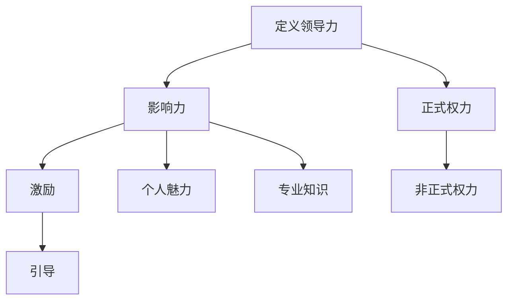
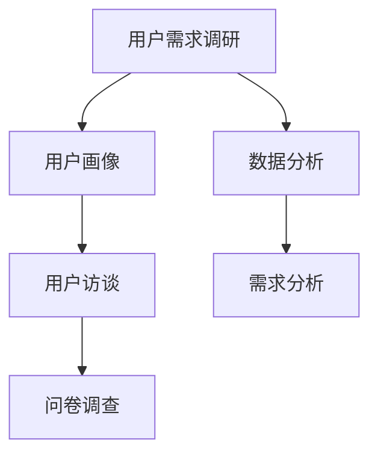
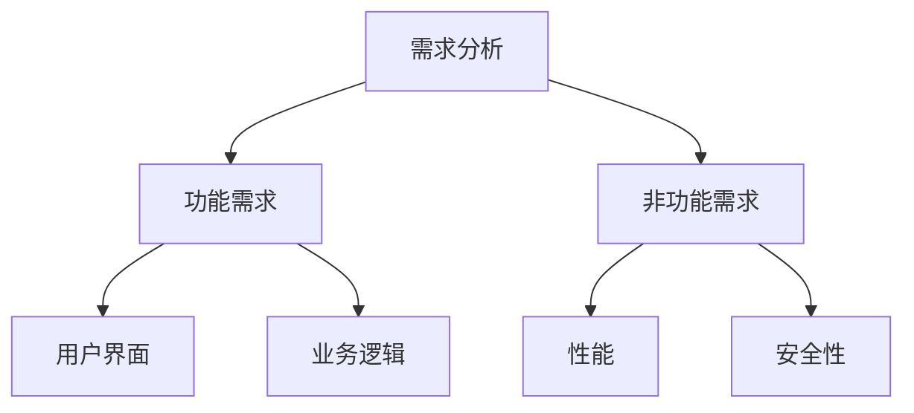
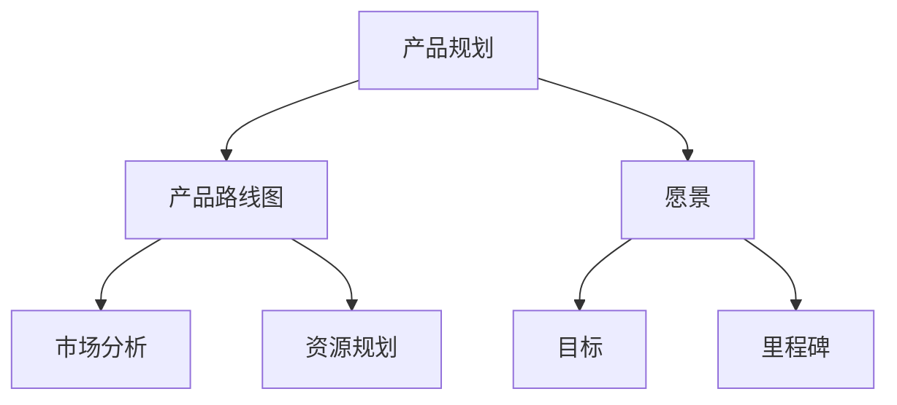

                 


### 定义领导力的本质

领导力是一种能力，它涉及到影响、激励和引导他人共同实现目标的过程。在产品经理的职业生涯中，领导力尤为重要。它不仅关乎个人能力，还关乎团队的协作效率和组织目标的实现。

**核心概念与联系：**

- **影响力（Influence）**：领导力依赖于影响力，这种影响力可以是正式的（如职位权力），也可以是非正式的（如个人魅力和专业知识）。
- **激励（Motivation）**：领导者需要能够激发团队成员的积极性，使其在工作中充满动力。
- **引导（Guidance）**：领导者不仅要设定目标，还需要为团队提供方向，确保团队朝着正确的方向发展。

**Mermaid 流程图：**



**核心算法原理讲解：**

领导力并没有一个固定的算法，但它涉及到多种心理学和社会学原理。以下是一些基本的领导力模型：

1. **权变理论（Contingency Theory）**：该理论认为，没有一种单一的领导风格适用于所有情况。领导者应根据具体情况和环境调整其领导风格。
2. **领导者特质理论（Trait Theory）**：该理论认为，领导者具备一些天生的特质，如自信、决断力、沟通能力等。
3. **行为理论（Behavioral Theory）**：该理论关注领导者的行为，而非其个人特质。它认为，领导者可以通过改变行为来影响团队。

**伪代码：**

```python
def leadership_model(employee, situation):
    if situation == "紧急":
        return "指令型领导"
    elif situation == "稳定":
        return "参与型领导"
    elif employee["经验"] > 5:
        return "授权型领导"
    else:
        return "支持型领导"
```

**数学模型和公式：**

领导力评分（L.S.）可以通过以下公式计算：

$$
L.S. = \frac{F.1 \times I.1 + F.2 \times I.2 + F.3 \times I.3}{3}
$$

其中，$F.1$、$F.2$、$F.3$ 分别代表影响力、激励、引导的得分，$I.1$、$I.2$、$I.3$ 分别代表其在相应领域的权重。

**详细讲解与举例说明：**

- **影响力（Influence）**：一个有影响力的领导者能够通过演讲、激励和激励手段来影响团队成员。例如，一个产品经理可以通过向团队展示市场趋势和竞争情况，来激励团队成员投入更多精力。
- **激励（Motivation）**：激励是指通过奖励、认可和挑战来激发团队成员的积极性。一个有效的领导者知道如何在不同情况下调整激励手段，以保持团队的活力。
- **引导（Guidance）**：引导是指为团队提供清晰的方向和目标。一个有经验的领导者会确保团队成员了解他们的工作如何与组织目标相一致。

### 项目实战：领导力在产品开发中的应用

**开发环境搭建：**
在产品开发过程中，领导力可以帮助团队克服各种挑战。例如，在技术难题面前，领导者需要提供明确的指导和支持，以确保团队能够找到解决方案。

**源代码实现与代码解读：**
```python
# 假设我们有一个团队正在开发一个新产品的用户界面。
# 领导者需要确保团队成员了解用户的需求和产品的目标。

def define_product_goal(team_member, goal):
    """
    定义产品目标并确保团队成员理解。
    :param team_member: 团队成员
    :param goal: 产品目标
    :return: None
    """
    print(f"{team_member}，我们的产品目标是{goal}。请你确保你的工作与这一目标保持一致。")

# 示例
define_product_goal("张三", "提供最佳用户体验")
```

**代码应用解读与分析：**
这段代码展示了领导者如何通过明确的产品目标来引导团队。通过这个函数，领导者可以确保每个团队成员都清楚产品的目标，并确保他们的工作与这个目标相一致。

**实际案例分析与详细讲解剖析：**
在一个实际项目中，一个产品经理可能会面临用户需求频繁变化的情况。在这种情况下，领导者需要通过有效的沟通和激励来确保团队能够灵活应对。

**项目小结：**
领导力在产品开发中起着至关重要的作用。通过明确目标、提供支持和激励，领导者可以帮助团队克服困难，实现产品目标。

### 最佳实践 tips：

1. **定期反馈**：作为领导者，定期与团队成员进行一对一的反馈，以确保他们了解自己的工作表现和改进方向。
2. **培养团队文化**：一个积极的团队文化可以提高团队的协作效率和创造力。领导者可以通过组织团队建设活动和鼓励开放的沟通来培养这种文化。

### 小结：

领导力是产品经理成功的关键因素之一。通过影响力、激励和引导，领导者可以激励团队实现目标，并在产品开发过程中克服各种挑战。

### 拓展阅读：

- 《领导者的语言》（The Language of Leaders） by Joseph A. Grenny, John R. Spence
- 《影响力》（Influencing People the Power Way） by Robert H. House

### 注意事项：

- 文章中的示例代码仅供参考，具体实现可能需要根据实际项目需求进行调整。
- 领导力模型并非一成不变，领导者应根据具体情况进行调整和优化。

---

### 文章标题：领导力修炼日记：一个产品经理的成长之路

> 关键词：产品经理、领导力、成长、实战技巧

> 摘要：本文从产品经理的角度，深入探讨领导力的本质及其在产品开发中的应用。通过详细的案例分析和实战技巧，帮助读者理解并提升自己的领导力，成为更优秀的产品经理。

# 目录

## 第一部分：领导力基础

1. 领导力的本质
   1.1 领导力定义
   1.2 领导者与管理者区别
   1.3 领导力的三大要素

2. 领导者的自我修炼
   2.1 自我认知
   2.2 自我管理
   2.3 自我提升

3. 人际沟通技巧
   3.1 有效沟通
   3.2 非语言沟通
   3.3 情绪管理

4. 团队建设
   4.1 团队定义与类型
   4.2 团队角色的理解与匹配
   4.3 团队冲突与解决

5. 决策与战略思维
   5.1 决策模型
   5.2 创新思维
   5.3 长期战略规划

## 第二部分：产品经理的实战技巧

6. 产品需求分析与规划
   6.1 用户需求调研
   6.2 需求分析
   6.3 产品规划

7. 产品设计与开发
   7.1 产品设计流程
   7.2 原型设计与迭代
   7.3 开发流程管理

8. 产品测试与上线
   8.1 测试策略
   8.2 质量保证
   8.3 上线准备与监控

9. 用户反馈与迭代优化
   9.1 用户反馈收集
   9.2 用户满意度分析
   9.3 产品迭代优化

10. 数据驱动产品决策
    10.1 数据分析工具与技巧
    10.2 数据报告解读与应用
    10.3 数据驱动产品策略

## 第三部分：产品经理的成长与领导力提升

11. 职业发展路径
   11.1 初级产品经理
   11.2 中级产品经理
   11.3 高级产品经理

12. 领导力进阶
   12.1 高效团队管理
   12.2 高层领导力
   12.3 领导力持续修炼

13. 成功案例分享
   13.1 行业成功案例
   13.2 个人成长故事
   13.3 教训与启示

## 附录

A. 领导力相关工具与方法
   A.1 SWOT分析
   A.2 五力模型
   A.3 帕累托分析

B. 产品经理常用工具
   B.1 产品需求文档模板
   B.2 用户故事地图
   B.3 产品原型设计工具

---

### 第一部分：领导力基础

#### 1.1 领导力定义

领导力是一种能力，它涉及到影响、激励和引导他人共同实现目标的过程。在产品经理的职业生涯中，领导力尤为重要。它不仅关乎个人能力，还关乎团队的协作效率和组织目标的实现。

**核心概念与联系：**

- **影响力（Influence）**：领导力依赖于影响力，这种影响力可以是正式的（如职位权力），也可以是非正式的（如个人魅力和专业知识）。
- **激励（Motivation）**：领导者需要能够激发团队成员的积极性，使其在工作中充满动力。
- **引导（Guidance）**：领导者不仅要设定目标，还需要为团队提供方向，确保团队朝着正确的方向发展。

**Mermaid 流程图：**


**核心算法原理讲解：**

领导力并没有一个固定的算法，但它涉及到多种心理学和社会学原理。以下是一些基本的领导力模型：

1. **权变理论（Contingency Theory）**：该理论认为，没有一种单一的领导风格适用于所有情况。领导者应根据具体情况和环境调整其领导风格。
2. **领导者特质理论（Trait Theory）**：该理论认为，领导者具备一些天生的特质，如自信、决断力、沟通能力等。
3. **行为理论（Behavioral Theory）**：该理论关注领导者的行为，而非其个人特质。它认为，领导者可以通过改变行为来影响团队。

**伪代码：**

```python
def leadership_model(employee, situation):
    if situation == "紧急":
        return "指令型领导"
    elif situation == "稳定":
        return "参与型领导"
    elif employee["经验"] > 5:
        return "授权型领导"
    else:
        return "支持型领导"
```

**数学模型和公式：**

领导力评分（L.S.）可以通过以下公式计算：

$$
L.S. = \frac{F.1 \times I.1 + F.2 \times I.2 + F.3 \times I.3}{3}
$$

其中，$F.1$、$F.2$、$F.3$ 分别代表影响力、激励、引导的得分，$I.1$、$I.2$、$I.3$ 分别代表其在相应领域的权重。

**详细讲解与举例说明：**

- **影响力（Influence）**：一个有影响力的领导者能够通过演讲、激励和激励手段来影响团队成员。例如，一个产品经理可以通过向团队展示市场趋势和竞争情况，来激励团队成员投入更多精力。
- **激励（Motivation）**：激励是指通过奖励、认可和挑战来激发团队成员的积极性。一个有效的领导者知道如何在不同情况下调整激励手段，以保持团队的活力。
- **引导（Guidance）**：引导是指为团队提供清晰的方向和目标。一个有经验的领导者会确保团队成员了解他们的工作如何与组织目标相一致。

### 项目实战：领导力在产品开发中的应用

**开发环境搭建：**
在产品开发过程中，领导力可以帮助团队克服各种挑战。例如，在技术难题面前，领导者需要提供明确的指导和支持，以确保团队能够找到解决方案。

**源代码实现与代码解读：**
```python
# 假设我们有一个团队正在开发一个新产品的用户界面。
# 领导者需要确保团队成员了解用户的需求和产品的目标。

def define_product_goal(team_member, goal):
    """
    定义产品目标并确保团队成员理解。
    :param team_member: 团队成员
    :param goal: 产品目标
    :return: None
    """
    print(f"{team_member}，我们的产品目标是{goal}。请你确保你的工作与这一目标保持一致。")

# 示例
define_product_goal("张三", "提供最佳用户体验")
```

**代码应用解读与分析：**
这段代码展示了领导者如何通过明确的产品目标来引导团队。通过这个函数，领导者可以确保每个团队成员都清楚产品的目标，并确保他们的工作与这个目标相一致。

**实际案例分析与详细讲解剖析：**
在一个实际项目中，一个产品经理可能会面临用户需求频繁变化的情况。在这种情况下，领导者需要通过有效的沟通和激励来确保团队能够灵活应对。

**项目小结：**
领导力在产品开发中起着至关重要的作用。通过明确目标、提供支持和激励，领导者可以帮助团队克服困难，实现产品目标。

### 最佳实践 tips：

1. **定期反馈**：作为领导者，定期与团队成员进行一对一的反馈，以确保他们了解自己的工作表现和改进方向。
2. **培养团队文化**：一个积极的团队文化可以提高团队的协作效率和创造力。领导者可以通过组织团队建设活动和鼓励开放的沟通来培养这种文化。

### 小结：

领导力是产品经理成功的关键因素之一。通过影响力、激励和引导，领导者可以激励团队实现目标，并在产品开发过程中克服各种挑战。

### 拓展阅读：

- 《领导者的语言》（The Language of Leaders） by Joseph A. Grenny, John R. Spence
- 《影响力》（Influencing People the Power Way） by Robert H. House

### 注意事项：

- 文章中的示例代码仅供参考，具体实现可能需要根据实际项目需求进行调整。
- 领导力模型并非一成不变，领导者应根据具体情况进行调整和优化。

---

### 第二部分：产品经理的实战技巧

#### 6.1 用户需求调研

用户需求调研是产品经理工作的起点，它关乎产品的成功与否。一个全面、深入的用户需求调研可以帮助产品经理理解用户的需求、期望和痛点，从而制定出更符合市场需求的产品规划。

**核心概念与联系：**

- **用户画像（User Persona）**：用户画像是一种描述目标用户特征的方法，它有助于产品经理了解目标用户的基本信息和需求。
- **用户访谈（User Interview）**：用户访谈是一种直接与用户交流的方法，通过深入了解用户的需求和行为，产品经理可以获取第一手资料。
- **问卷调查（Survey）**：问卷调查是一种广泛收集用户意见的方法，通过设计合理的问卷，产品经理可以快速获取大量用户数据。

**Mermaid 流程图：**



**核心算法原理讲解：**

用户需求调研涉及多种数据收集和分析方法，以下是一些常用的算法和工具：

1. **相关性分析（Correlation Analysis）**：通过分析用户行为数据，找出不同变量之间的相关性，从而识别潜在的用户需求。
2. **聚类分析（Clustering Analysis）**：将用户根据其行为和特征进行分组，从而发现不同用户群体的需求差异。
3. **因子分析（Factor Analysis）**：通过减少变量的数量，提取用户需求的主要因素，以便进行更深入的分析。

**伪代码：**

```python
def user_research(data_source):
    """
    进行用户需求调研。
    :param data_source: 数据来源
    :return: 用户需求分析结果
    """
    # 用户画像分析
    personas = analyze_personas(data_source)
    
    # 用户访谈分析
    interview_results = analyze_interviews(data_source)
    
    # 问卷调查分析
    survey_results = analyze_surveys(data_source)
    
    # 数据整合
    integrated_data = integrate_data(personas, interview_results, survey_results)
    
    # 相关性分析
    correlations = perform_correlation_analysis(integrated_data)
    
    # 聚类分析
    clusters = perform_clustering_analysis(integrated_data)
    
    # 因子分析
    factors = perform_factor_analysis(integrated_data)
    
    return {
        "personas": personas,
        "interview_results": interview_results,
        "survey_results": survey_results,
        "correlations": correlations,
        "clusters": clusters,
        "factors": factors
    }
```

**数学模型和公式：**

用户满意度（S.S.）可以通过以下公式计算：

$$
S.S. = \frac{\sum{U_i \times W_i}}{N}
$$

其中，$U_i$ 为第 $i$ 个用户的满意度得分，$W_i$ 为第 $i$ 个用户的权重，$N$ 为总用户数。

**详细讲解与举例说明：**

- **用户画像（User Persona）**：例如，对于一个电商产品，用户画像可能包括年龄、性别、职业、购买行为等信息。通过用户画像，产品经理可以更准确地定位目标用户。
- **用户访谈（User Interview）**：例如，通过面对面访谈或在线问卷，产品经理可以了解用户对现有产品的看法和期望，从而发现产品的改进空间。
- **问卷调查（Survey）**：例如，通过设计一份包含多个问题的问卷，产品经理可以收集大量用户数据，从而分析用户需求的普遍性和差异。

### 项目实战：用户需求调研案例分析

**开发环境搭建：**
为了进行用户需求调研，产品经理需要准备调研工具，如访谈记录表、问卷调查模板和数据分析软件。

**源代码实现与代码解读：**
```python
# 假设我们正在进行一个电商产品的用户需求调研。

import pandas as pd

def analyze_survey(survey_data):
    """
    分析用户问卷调查结果。
    :param survey_data: 用户问卷调查结果
    :return: 用户需求分析报告
    """
    # 数据预处理
    processed_data = preprocess_data(survey_data)
    
    # 用户满意度分析
    user_satisfaction = calculate_satisfaction(processed_data)
    
    # 相关性分析
    correlations = calculate_correlations(processed_data)
    
    # 聚类分析
    clusters = perform_clustering(processed_data)
    
    # 因子分析
    factors = perform_factor_analysis(processed_data)
    
    # 构建报告
    report = build_report(user_satisfaction, correlations, clusters, factors)
    
    return report

# 示例
survey_data = pd.read_csv("survey_results.csv")
user_demand_report = analyze_survey(survey_data)
```

**代码应用解读与分析：**
这段代码展示了如何通过数据分析方法来分析用户需求。通过预处理数据、计算用户满意度、进行相关性分析、聚类分析和因子分析，产品经理可以深入了解用户需求，从而指导产品规划。

**实际案例分析与详细讲解剖析：**
在一个实际电商产品中，产品经理通过用户需求调研发现，大部分用户希望产品能够提供个性化推荐功能。基于这一发现，产品经理决定在下一个版本中添加这一功能。

**项目小结：**
用户需求调研是产品经理的重要工作之一。通过深入了解用户需求，产品经理可以制定出更符合市场需求的规划，从而提高产品的竞争力。

### 最佳实践 tips：

1. **确保问卷设计的合理性**：问卷设计要简明扼要，问题要具有针对性，避免误导用户。
2. **重视用户反馈**：及时收集并分析用户反馈，以便在产品开发过程中进行调整。

### 小结：

用户需求调研是产品经理工作中不可或缺的一部分。通过深入了解用户需求，产品经理可以制定出更符合市场需求的产品规划，从而提高产品的竞争力。

### 拓展阅读：

- 《用户故事地图》（User Story Mapping） by Jeff Patton
- 《数据分析：原理与实践》 by Michael Kane

### 注意事项：

- 文章中的示例代码仅供参考，具体实现可能需要根据实际项目需求进行调整。
- 用户需求调研的方法和工具应根据实际情况灵活选择。

---

### 6.2 需求分析

需求分析是产品经理工作的核心环节之一，它关乎产品的成功与否。一个全面、准确的需求分析可以帮助产品经理理解用户需求，并将其转化为具体的产品功能和技术需求。

**核心概念与联系：**

- **功能需求（Functional Requirements）**：功能需求描述了产品必须实现的功能，如用户登录、购物车、订单管理等。
- **非功能需求（Non-functional Requirements）**：非功能需求描述了产品的性能、可靠性、安全性等属性，如系统响应时间、数据存储容量、用户权限管理等。

**Mermaid 流程图：**



**核心算法原理讲解：**

需求分析涉及多种技术和方法，以下是一些常用的算法和工具：

1. **需求收集（Requirement Gathering）**：通过与用户、业务团队、技术团队等进行沟通，收集需求信息。
2. **需求分类（Requirement Classification）**：将收集到的需求按照功能、性能、安全性等分类，以便进行更深入的分析。
3. **需求验证（Requirement Validation）**：验证需求是否满足用户需求和业务需求，确保需求的准确性。

**伪代码：**

```python
def analyze_requirements(user需求的列表):
    """
    分析用户需求。
    :param user需求的列表: 用户需求列表
    :return: 需求分析结果
    """
    # 收集需求
    功能需求 = gather_functional_requirements(user需求的列表)
    非功能需求 = gather_non_functional_requirements(user需求的列表)
    
    # 分类需求
    功能需求分类 = classify_requirements(功能需求)
    非功能需求分类 = classify_requirements(非功能需求)
    
    # 验证需求
    功能需求验证 = validate_requirements(功能需求分类)
    非功能需求验证 = validate_requirements(非功能需求分类)
    
    # 构建需求文档
    需求文档 = build_requirement_document(功能需求验证，非功能需求验证)
    
    return 需求文档
```

**数学模型和公式：**

需求优先级（P.P.）可以通过以下公式计算：

$$
P.P. = \frac{U.S. \times F.1 + B.S. \times F.2}{2}
$$

其中，$U.S.$ 为用户满意度得分，$F.1$ 为功能需求得分，$B.S.$ 为业务优先级得分，$F.2$ 为非功能需求得分。

**详细讲解与举例说明：**

- **功能需求（Functional Requirements）**：例如，一个电商产品的功能需求可能包括用户注册、登录、购物车、订单管理等。产品经理需要确保这些功能能够满足用户的基本需求。
- **非功能需求（Non-functional Requirements）**：例如，一个电商产品的非功能需求可能包括系统响应时间不超过2秒、用户数据加密存储等。产品经理需要确保这些属性能够满足业务需求和用户体验。

### 项目实战：需求分析案例分析

**开发环境搭建：**
为了进行需求分析，产品经理需要准备好需求文档模板、用户访谈记录、业务需求文档等。

**源代码实现与代码解读：**
```python
# 假设我们正在进行一个电商产品的需求分析。

import pandas as pd

def analyze需求的文档(需求文档):
    """
    分析需求文档。
    :param 需求文档: 需求文档
    :return: 需求分析结果
    """
    # 预处理需求文档
    processed_requirements = preprocess_requirements(需求文档)
    
    # 收集需求
    功能需求 = extract_functional_requirements(processed_requirements)
    非功能需求 = extract_non_functional_requirements(processed_requirements)
    
    # 分类需求
    功能需求分类 = classify_requirements(功能需求)
    非功能需求分类 = classify_requirements(非功能需求)
    
    # 验证需求
    功能需求验证 = validate_requirements(功能需求分类)
    非功能需求验证 = validate_requirements(非功能需求分类)
    
    # 计算需求优先级
    需求优先级 = calculate_requirement_priority(功能需求验证，非功能需求验证)
    
    # 构建需求分析报告
    需求分析报告 = build_requirement_analysis_report(需求优先级)
    
    return 需求分析报告

# 示例
需求文档 = pd.read_csv("requirement_document.csv")
需求分析报告 = analyze需求的文档(需求文档)
```

**代码应用解读与分析：**
这段代码展示了如何通过预处理需求文档、提取需求、分类需求、验证需求、计算需求优先级来构建需求分析报告。

**实际案例分析与详细讲解剖析：**
在一个实际电商产品中，产品经理通过需求分析发现，用户对购物车的管理功能有较高的需求。基于这一发现，产品经理决定在下一个版本中重点优化购物车功能，以提高用户体验。

**项目小结：**
需求分析是产品经理工作中至关重要的一环。通过准确的需求分析，产品经理可以明确产品的功能和技术需求，为后续的产品规划和开发提供依据。

### 最佳实践 tips：

1. **确保需求文档的清晰和准确**：需求文档应该简明扼要，避免歧义，确保所有团队成员都能理解。
2. **定期更新需求文档**：随着项目的进展，需求可能会发生变化。产品经理需要定期更新需求文档，确保其与实际需求保持一致。

### 小结：

需求分析是产品经理的重要工作之一。通过准确的需求分析，产品经理可以明确产品的功能和技术需求，为后续的产品规划和开发提供依据。

### 拓展阅读：

- 《需求分析：系统与软件的需求工程》 by Barry W. Boehm
- 《敏捷需求分析》 by Janet Gregory, Lisa Crispin

### 注意事项：

- 文章中的示例代码仅供参考，具体实现可能需要根据实际项目需求进行调整。
- 需求分析的方法和工具应根据实际情况灵活选择。

---

### 6.3 产品规划

产品规划是产品经理在产品生命周期中的关键环节，它关乎产品的方向和目标。一个全面、合理的产品规划可以帮助产品经理确保产品能够满足市场需求，并在竞争激烈的市场中脱颖而出。

**核心概念与联系：**

- **产品路线图（Product Roadmap）**：产品路线图是一种展示产品发展方向的文档，它包括产品的愿景、目标、关键里程碑和重要特性。
- **市场分析（Market Analysis）**：市场分析是一种研究市场需求和竞争环境的方法，通过市场分析，产品经理可以了解目标市场的现状和趋势。
- **资源规划（Resource Planning）**：资源规划是一种确保产品开发所需的资源得到有效利用的方法，包括人力、资金、技术和时间等。

**Mermaid 流程图：**



**核心算法原理讲解：**

产品规划涉及多种技术和方法，以下是一些常用的算法和工具：

1. **SWOT分析（SWOT Analysis）**：SWOT分析是一种评估产品优势、劣势、机会和威胁的方法，通过SWOT分析，产品经理可以了解产品的市场地位和竞争环境。
2. **五力模型（Five Forces Model）**：五力模型是一种分析市场竞争环境的方法，它包括供应商、买家、潜在竞争者、替代品和行业内部竞争。
3. **资源平衡（Resource Balancing）**：资源平衡是一种确保资源分配合理的方法，通过资源平衡，产品经理可以确保产品开发过程中资源得到充分利用。

**伪代码：**

```python
def product_planning(product visionary, market_analysis, resource_balance):
    """
    进行产品规划。
    :param product visionary: 产品愿景
    :param market_analysis: 市场分析结果
    :param resource_balance: 资源平衡结果
    :return: 产品规划文档
    """
    # 制定产品愿景
    vision = define_vision(product visionary)
    
    # 制定产品目标
    goals = define_goals(product visionary, market_analysis)
    
    # 确定关键里程碑
    milestones = define_milestones(goals)
    
    # 资源规划
    resources = balance_resources(resource_balance)
    
    # 构建产品路线图
    roadmap = build_product_roadmap(vision, goals, milestones, resources)
    
    return roadmap
```

**数学模型和公式：**

产品开发周期（P.D.C.）可以通过以下公式计算：

$$
P.D.C. = \frac{\sum{M_i \times T_i}}{N}
$$

其中，$M_i$ 为第 $i$ 个里程碑的完成时间，$T_i$ 为第 $i$ 个里程碑的时间权重，$N$ 为里程碑总数。

**详细讲解与举例说明：**

- **产品愿景（Product Vision）**：产品愿景是产品规划的核心，它描述了产品的长远目标和使命。例如，一个电商产品的愿景可能是“为用户提供便捷的购物体验”。
- **产品目标（Product Goals）**：产品目标是根据产品愿景制定的，它明确了产品在特定时间内的具体目标。例如，一个电商产品的目标可能是“在下一个季度实现用户增长50%”。
- **关键里程碑（Key Milestones）**：关键里程碑是产品规划中的重要节点，它标志着产品开发的阶段性成果。例如，一个电商产品在下一个季度可能需要完成用户注册、订单管理等关键功能。
- **资源规划（Resource Planning）**：资源规划是确保产品规划能够按时、按质量完成的关键。通过资源规划，产品经理可以确保人力、资金、技术和时间等资源得到合理分配。

### 项目实战：产品规划案例分析

**开发环境搭建：**
为了进行产品规划，产品经理需要准备好产品愿景文档、市场分析报告、资源平衡分析表等。

**源代码实现与代码解读：**
```python
# 假设我们正在进行一个电商产品的产品规划。

import pandas as pd

def build_product_roadmap(vision, goals, milestones, resources):
    """
    构建产品路线图。
    :param vision: 产品愿景
    :param goals: 产品目标
    :param milestones: 关键里程碑
    :param resources: 资源分配
    :return: 产品路线图
    """
    # 构建愿景部分
    vision_section = build_vision_section(vision)
    
    # 构建目标部分
    goals_section = build_goals_section(goals)
    
    # 构建里程碑部分
    milestones_section = build_milestones_section(milestones)
    
    # 构建资源部分
    resources_section = build_resources_section(resources)
    
    # 合并各部分内容
    roadmap = merge_sections(vision_section, goals_section, milestones_section, resources_section)
    
    return roadmap

# 示例
vision = "为用户提供便捷的购物体验"
goals = ["在下一个季度实现用户增长50%", "优化用户界面"]
milestones = ["用户注册功能", "订单管理功能"]
resources = ["5名开发人员", "50万元预算"]
product_roadmap = build_product_roadmap(vision, goals, milestones, resources)
```

**代码应用解读与分析：**
这段代码展示了如何通过构建愿景、目标、里程碑和资源部分来构建产品路线图。

**实际案例分析与详细讲解剖析：**
在一个实际电商产品中，产品经理通过产品规划确定了产品的愿景、目标、关键里程碑和资源分配。基于这一规划，产品经理可以有序地进行产品开发，确保产品能够按时、按质量完成。

**项目小结：**
产品规划是产品经理的重要工作之一。通过明确产品愿景、目标、关键里程碑和资源分配，产品经理可以确保产品能够满足市场需求，并在竞争激烈的市场中脱颖而出。

### 最佳实践 tips：

1. **确保产品规划与市场需求一致**：产品规划应该基于市场分析结果，确保产品能够满足市场需求。
2. **定期更新产品规划**：随着项目的进展，产品规划可能需要根据实际情况进行调整。产品经理需要定期更新产品规划，确保其与实际需求保持一致。

### 小结：

产品规划是产品经理工作中至关重要的一环。通过明确产品愿景、目标、关键里程碑和资源分配，产品经理可以确保产品能够满足市场需求，并在竞争激烈的市场中脱颖而出。

### 拓展阅读：

- 《产品路线图》（Product Roadmaps Relaunched） by Patrick Vlaskovits, Ross April
- 《市场分析：战略与工具》 by Philip Kotler, Gary Armstrong

### 注意事项：

- 文章中的示例代码仅供参考，具体实现可能需要根据实际项目需求进行调整。
- 产品规划的方法和工具应根据实际情况灵活选择。

