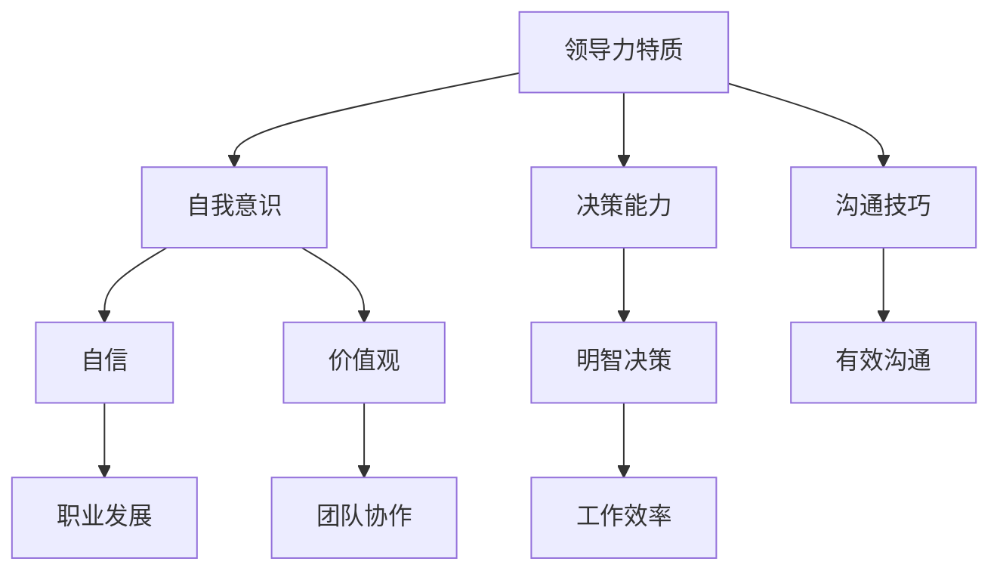
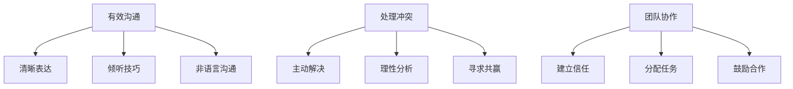
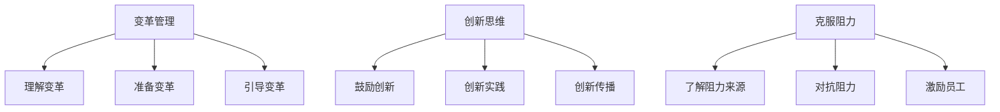
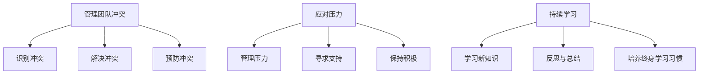

                 

**Step 1: Introduction to the Book**

# 《领导力修炼日记：一个市场总监的华丽蜕变》

## 关键词：领导力发展、市场营销、个人成长、战略思维

## 摘要：

本书旨在探讨一个市场总监在职业生涯中的华丽蜕变，从初入职场的迷茫到成为行业翘楚的心路历程。通过深入剖析领导力的本质、核心技能以及实践应用，作者为我们展示了一个领导者在不断学习和自我提升的过程中，如何带领团队突破困境、实现组织目标的故事。

---

**Step 2: Understanding Leadership and Personal Growth**

### 引言

领导力并非天生具备，而是通过不断的学习和实践得以锤炼。本部分将探讨领导力的核心要素，以及如何通过个人成长来实现领导力的提升。

#### Chapter 1: The Essence of Leadership

1. **定义领导力**
   - 领导力是指引导和影响他人实现共同目标的能力。
   - 领导力不仅仅是职位赋予的权力，更是一种责任和使命感。

2. **领导力特质**
   - 自我意识：了解自己的优势、弱点和价值观。
   - 决策能力：在面对复杂问题时，能够迅速做出明智的决策。
   - 沟通技巧：善于倾听、表达和协调。

3. **领导力的影响**
   - 对个人：提升自信、实现职业发展。
   - 对组织：促进团队协作、提高工作效率。

#### Mermaid 流程图

**Step 3: Core Leadership Skills**

### 引言

领导力并非空中楼阁，而是建立在一系列核心技能之上。本部分将详细探讨沟通技能、决策能力和团队管理等方面。

#### Chapter 2: Communication Skills

1. **有效沟通**
   - 清晰表达：确保信息传递准确无误。
   - 倾听技巧：理解他人的观点和需求。
   - 非语言沟通：运用肢体语言和面部表情增强沟通效果。

2. **处理冲突**
   - 主动解决：面对冲突时不回避。
   - 理性分析：从多个角度分析问题。
   - 寻求共赢：寻找双方都能接受的解决方案。

3. **团队协作**
   - 建立信任：团队成员之间建立信任关系。
   - 分配任务：根据团队成员的能力和兴趣分配任务。
   - 鼓励合作：激发团队活力，共同实现目标。

#### Mermaid 流程图

**Step 4: Leadership in Action**

### 引言

领导力不仅在于理论，更在于实践。本部分将探讨领导力在实际工作中的应用，包括变革管理、战略思维和影响力等方面。

#### Chapter 3: Leading Change and Innovation

1. **变革管理**
   - 理解变革：认识到变革的必要性和紧迫性。
   - 准备变革：制定详细的变革计划。
   - 引导变革：通过沟通和激励推动变革的实施。

2. **创新思维**
   - 鼓励创新：为团队成员提供创新空间。
   - 创新实践：通过实际项目验证创新想法。
   - 创新传播：将创新成果分享给更多人。

3. **克服阻力**
   - 了解阻力来源：分析员工对变革的担忧和疑虑。
   - 对抗阻力：通过沟通和协商解决问题。
   - 激励员工：激发员工的积极性和创造力。

#### Mermaid 流程图

**Step 5: Leadership Challenges and Growth**

### 引言

领导力成长过程中不可避免地会遇到各种挑战。本部分将探讨如何应对这些挑战，实现个人和组织的共同成长。

#### Chapter 4: Navigating Leadership Challenges

1. **管理团队冲突**
   - 识别冲突：了解冲突的原因和表现形式。
   - 解决冲突：采取合适的策略和方法解决冲突。
   - 预防冲突：建立有效的沟通机制和团队文化。

2. **应对压力**
   - 管理压力：通过合理的时间管理和情绪调节应对压力。
   - 寻求支持：向家人、朋友或同事寻求帮助。
   - 保持积极：用积极的心态面对挑战。

3. **持续学习**
   - 学习新知识：不断更新自己的知识和技能。
   - 反思与总结：从经验中学习，不断提升自己。
   - 培养终身学习习惯：保持好奇心和学习热情。

#### Mermaid 流�流程图

**Conclusion**

领导力是一项复杂而重要的能力，它不仅关乎个人的职业发展，更关乎整个组织的成功。通过本书的探讨，我们希望读者能够更好地理解领导力的本质，掌握核心技能，并在实践中不断提升自己的领导力水平。

---

**Authors**

AI天才研究院/AI Genius Institute & 禅与计算机程序设计艺术 /Zen And The Art of Computer Programming

