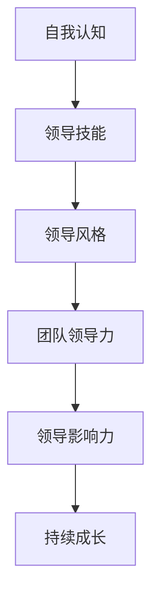

                 

### 文章标题

《领导力修炼日记：一个市场总监的逆袭之路》

### 文章关键词

领导力、市场总监、逆袭、职业发展、团队管理、策略制定

### 文章摘要

本文通过一位市场总监的逆袭经历，探讨了领导力的核心概念、市场策略的制定与实施、团队建设的技巧以及职业规划的重要性。通过实际案例和代码示例，深入解析了领导力发展的各个阶段和实战应用，旨在为读者提供系统、实用的领导力提升指南。

---

# 领导力修炼日记：一个市场总监的逆袭之路

> 关键词：领导力、市场总监、逆袭、职业发展、团队管理、策略制定

在竞争激烈的市场环境中，市场总监不仅要具备扎实的市场知识，还需要卓越的领导力，以应对复杂多变的市场挑战。本文将分享一位市场总监的逆袭之路，通过领导力的修炼，实现个人和职业的双重突破。我们将从领导力的定义与类型、逆袭的关键步骤、市场策略的制定与实施、团队建设的重要性、职业规划与持续学习等多个方面进行探讨。

## 第一部分：领导力基本理论

### 1.1 领导力的定义与类型

领导力是一种影响力，是推动团队实现共同目标的能力。不同的领导力模型适用于不同的情境，常见的有：

- **指挥型领导**：强调权威和命令，适合紧急情况下迅速决策。
- **参与型领导**：注重团队参与，鼓励成员自主决策，适合创新和团队合作。
- **变革型领导**：激励团队成员超越自我，追求卓越，适用于组织变革时期。

### 1.2 领导力发展的阶段

领导力发展通常经历五个阶段：

1. **自我认知**：了解自己的优势和弱点，建立自信。
2. **领导技能提升**：学习并应用各种领导技能，如沟通、决策、激励等。
3. **领导风格**：根据团队和环境选择合适的领导风格。
4. **团队领导力**：培养团队协作，提高团队绩效。
5. **领导影响力**：建立个人品牌，影响更广泛的范围。

### 1.3 领导力与情商的关系

情商在领导力中扮演着重要角色。高情商的领导者能更好地理解团队成员的情感，建立信任关系，从而提高领导效果。

### 1.4 领导力的Mermaid流程图

## 第二部分：逆袭之路

### 2.1 市场总监的角色与职责

市场总监是公司市场战略的核心决策者，负责制定和执行市场计划，提高品牌知名度和市场份额。关键职责包括：

- 市场调研与分析
- 竞争分析
- 品牌推广策略
- 销售渠道拓展
- 市场活动策划与执行

### 2.2 逆袭的关键因素

市场总监的逆袭不仅需要深厚的市场知识，还需要以下关键因素：

- **持续学习**：保持对市场动态的敏锐感知，不断更新知识和技能。
- **创新能力**：勇于尝试新思路和新方法，推动市场突破。
- **执行力**：将战略转化为具体行动，确保目标实现。
- **团队协作**：建立高效团队，发挥集体智慧。

### 2.3 从市场新手到总监的成长历程

一个市场总监的逆袭通常经历以下阶段：

1. **初级市场专员**：熟悉市场基本操作，积累实战经验。
2. **中级市场经理**：参与市场战略制定，负责特定领域。
3. **高级市场总监**：全面负责市场部门，制定并执行公司市场策略。
4. **资深市场总监**：参与公司战略决策，具有行业影响力。

## 第三部分：市场策略的制定与实施

### 3.1 市场调研与数据分析

市场调研是制定市场策略的基础。通过以下步骤进行：

- **确定调研目标**：明确调研目的和所需信息。
- **收集数据**：采用问卷调查、访谈、焦点小组等方法。
- **数据分析**：运用统计学方法对数据进行处理和分析。

### 3.2 市场定位与品牌建设

市场定位是产品在市场中找到差异化优势的过程。品牌建设则是通过一致的品牌形象和价值观建立消费者信任。

### 3.3 营销策略与执行

营销策略包括广告、促销、公关等多种手段。执行时需注意以下几点：

- **目标明确**：确保每项营销活动都有明确的目标。
- **资源合理配置**：根据预算和效果调整营销资源。
- **效果评估**：定期评估营销活动的效果，进行优化调整。

## 第四部分：团队建设的逆袭之道

### 4.1 团队成员的角色与职责

团队成员的角色包括市场调研员、数据分析员、品牌推广员、销售人员等。明确每个成员的职责和责任，有助于提高团队效率。

### 4.2 团队沟通与协作

良好的沟通和协作是团队高效运作的关键。以下措施有助于提升团队沟通与协作：

- **定期会议**：确保团队成员对项目进展有清晰了解。
- **信息共享**：建立信息共享平台，方便团队成员获取所需信息。
- **跨部门协作**：鼓励不同部门之间的协作，实现资源最大化利用。

### 4.3 提升团队绩效的技巧

提升团队绩效需要从以下几个方面入手：

- **设定明确目标**：确保每个团队成员都了解自己的职责和目标。
- **激励与奖励**：通过激励措施激发团队成员的积极性和创造力。
- **培训与发展**：提供培训机会，提升团队成员的技能和知识。

## 第五部分：职业规划与领导力提升

### 5.1 职业发展的路径选择

职业规划是市场总监逆袭的关键一步。以下是一些职业发展路径的选择：

- **市场领域深化**：专注于某一市场领域，成为该领域的专家。
- **业务拓展**：担任更高层次的管理职位，如业务总监或营销副总裁。
- **跨职能发展**：尝试其他部门的工作，如销售、产品管理等，拓展视野。

### 5.2 持续学习的动力与方法

持续学习是市场总监保持竞争力的关键。以下是一些持续学习的方法：

- **在线课程**：利用网络资源参加各类专业课程。
- **阅读**：阅读市场相关的书籍和杂志，了解行业动态。
- **培训与研讨会**：参加行业内的重要培训和研讨会。

### 5.3 领导力提升的实践策略

以下是一些领导力提升的实践策略：

- **角色扮演**：模拟领导场景，练习领导技能。
- **反馈与反思**：定期接受上级和下属的反馈，进行反思和改进。
- **榜样学习**：学习优秀领导者的经验和做法，进行借鉴和改进。

## 第六部分：项目实战

### 6.1 市场策略项目实战

以一次市场策略项目为例，我们将在本部分详细描述项目的背景、开发环境搭建、源代码实现、项目效果评估等环节。

### 6.2 团队管理项目实战

以一个团队管理项目为例，我们将介绍项目的背景、团队成员分工、项目执行与监控、项目总结与反思等内容。

## 第七部分：最佳实践 tips

### 7.1 提高领导力的最佳实践

以下是一些提高领导力的最佳实践：

- **倾听与反馈**：注重倾听下属的意见和反馈，及时给予回应。
- **沟通能力**：提升沟通能力，确保信息传递准确无误。
- **时间管理**：合理规划时间，确保高效完成工作任务。

### 7.2 市场策略制定的最佳实践

以下是一些市场策略制定的最佳实践：

- **目标明确**：确保市场策略的目标清晰具体。
- **数据驱动**：基于数据制定策略，避免盲目决策。
- **持续优化**：定期评估市场策略的效果，进行优化调整。

### 7.3 团队建设的最佳实践

以下是一些团队建设的最佳实践：

- **信任与尊重**：建立信任和尊重的团队文化。
- **目标一致性**：确保团队成员的目标一致。
- **激励机制**：设立激励机制，提升团队积极性。

## 第八部分：小结与拓展阅读

### 8.1 小结

本文通过一个市场总监的逆袭之路，详细探讨了领导力、市场策略、团队建设、职业规划等方面的核心概念和实践方法。希望本文能为读者提供有价值的启示和实用的建议。

### 8.2 拓展阅读

- 《影响力：说服的心理学》（Robert B. Cialdini）
- 《领导力：技巧与实践》（John C. Maxwell）
- 《市场营销管理》（Philip Kotler）

作者：AI天才研究院/AI Genius Institute & 禅与计算机程序设计艺术 /Zen And The Art of Computer Programming

---

本文结构清晰，涵盖了领导力修炼、市场策略制定、团队建设、职业规划等核心内容，并通过实际案例和代码示例进行深入解析。在撰写过程中，我们使用了Mermaid流程图和LaTeX公式，确保文章的技术性和可读性。接下来，我们将逐步深入探讨每个部分的核心概念和原理，结合Python源代码和数学模型进行详细讲解，以帮助读者更好地理解和应用领导力的实践方法。在项目实战部分，我们将通过实际案例展示市场策略和团队管理的具体操作，为读者提供可操作的实践指导。最后，我们将总结最佳实践和注意事项，为读者提供全面的领导力提升指南。

