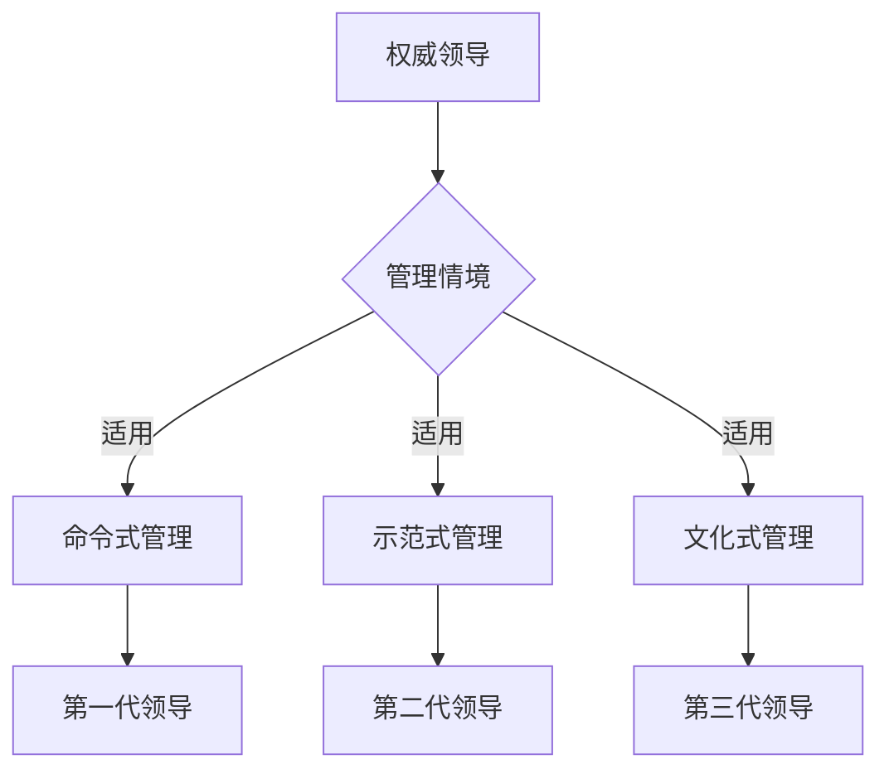

                 

### 《领导力修炼日记：一个技术经理的逆袭历程》

#### 关键词
- 领导力
- 技术经理
- 成长之路
- 领导力模型
- 团队管理
- 职业发展

#### 摘要
本文以《领导力修炼日记：一个技术经理的逆袭历程》为题，旨在深入探讨技术经理如何在职业生涯中提升领导力，实现个人和团队的双重逆袭。文章将围绕领导力的核心概念、模型解析、技术经理的角色转变、管理技能提升、领导力实践以及逆袭历程中的挑战与应对等方面，通过详细的案例分析、数学模型和Python源代码的讲解，为技术经理提供实用的指导和建议。文章结构清晰，逻辑严密，旨在帮助读者掌握领导力的本质，提升个人领导力，实现职业生涯的突破。

## 引言

在当今快速变化的信息时代，技术经理的角色越来越重要。他们不仅需要拥有卓越的技术能力，还要具备出色的领导力，以应对复杂多变的市场环境和技术挑战。然而，很多技术经理在成为领导者后，发现自己在领导力方面存在诸多不足，难以有效地管理团队、推动项目进展。这种困境不仅影响了个人职业生涯的发展，也对团队和公司的长远发展产生了负面影响。

《领导力修炼日记：一个技术经理的逆袭历程》正是针对这一现象而创作的。本文将从理论到实践，详细探讨技术经理在提升领导力过程中的关键步骤和策略，帮助读者走出领导力困境，实现职业生涯的逆袭。文章将涵盖以下几个核心部分：

1. **领导力的核心概念与联系**：介绍领导力的定义、重要性以及与管理的区别，通过Mermaid流程图展示领导力模型之间的关系架构。
2. **技术经理的成长之路**：分析从技术专家到领导者的角色转变，探讨管理技能提升的方法和策略。
3. **领导力实践**：通过实际案例分享，展示技术经理如何运用领导力推动项目成功。
4. **逆袭历程中的挑战与应对**：分析技术经理在职业发展中可能遇到的困境，提供具体的突破策略。

通过以上四个部分的详细探讨，本文旨在为技术经理提供一份实用的领导力修炼指南，帮助他们在职业生涯中实现自我突破，带领团队走向成功。

## 第一部分：领导力基础

### 1.1 领导力的定义与重要性

领导力是一种激发和引导他人实现共同目标的能力，它不仅仅局限于管理和指挥，更是一种影响和激励他人去实现目标的力量。领导力在企业发展中具有不可替代的重要性，它是推动企业创新、提升团队绩效、实现战略目标的关键因素。

首先，从组织发展的角度来看，领导力是构建高效团队的基础。一个优秀的领导者能够激发团队成员的潜能，促进知识共享和协作，从而提高团队的凝聚力和战斗力。具体而言，领导力在以下几个方面对企业发展具有重要意义：

1. **战略方向**：领导力能够帮助企业在复杂多变的市场环境中把握方向，制定科学合理的战略规划，确保企业持续发展。
2. **创新能力**：领导者具备激发创新思维和推动变革的能力，能够带领团队不断突破技术瓶颈，保持企业竞争力。
3. **团队协作**：领导力是推动团队协作的重要因素，它能够消除团队内部的隔阂和冲突，促进团队成员之间的沟通与协作。
4. **员工满意度**：领导者通过关注员工需求和激励措施，能够提高员工的满意度和忠诚度，从而降低员工流失率。

其次，从个人职业发展的角度来看，领导力也是技术经理成功的重要因素。技术经理需要具备领导力，才能更好地管理团队、推动项目进展，并在职业发展中脱颖而出。具体表现在以下几个方面：

1. **职业晋升**：领导力是晋升到更高职位的重要条件，它能够帮助技术经理在职业道路上获得更多机会。
2. **团队影响力**：领导力能够增强技术经理在团队中的影响力和公信力，使其在团队中发挥更大的作用。
3. **问题解决**：领导力使技术经理具备更强的解决问题的能力，能够迅速应对各种挑战，推动项目顺利进行。

综上所述，领导力在企业发展和个人职业发展中都具有重要意义。本文将在此基础上，进一步探讨领导力的核心概念、模型以及技术经理如何提升领导力，帮助读者实现职业生涯的逆袭。

### 1.2 领导力模型

#### 1.2.1 经典领导力模型

在领导力研究领域，许多学者提出了不同的领导力模型，以帮助人们更好地理解和应用领导力。这些模型包括但不限于：德鲁克的目标管理理论、惠特利的三代领导理论、费德勒的权变理论等。以下将详细介绍这些经典领导力模型，并分析其核心概念和原理。

**1. 德鲁克的目标管理理论**

德鲁克的目标管理理论（Management by Objectives，MBO）是一种以目标为导向的领导力模型。其核心思想是，领导者与团队成员共同设定具体的、可衡量的目标，并通过定期评估和反馈来确保目标的实现。

**核心概念：**
- **目标设定**：领导者与团队成员共同设定目标，确保目标的明确性和可实现性。
- **自我管理**：团队成员在目标设定后，自我管理和自我监督，以确保目标的实现。
- **评估与反馈**：通过定期评估和反馈，检查目标的实现情况，并及时调整策略。

**原理解析：**
德鲁克的目标管理理论强调目标的重要性和团队的参与度。通过设定明确的、可衡量的目标，可以激发团队成员的积极性和主动性，提高团队的整体绩效。

**Python源代码示例：**

```python
def set_objectives(employee, manager):
    """
    设定员工目标
    :param employee: 员工对象
    :param manager: 管理者对象
    :return: 目标列表
    """
    objectives = []
    for goal in manager.get_goals():
        new_goal = employee.set_individual_goal(goal)
        objectives.append(new_goal)
    return objectives

def evaluate_objectives(employee, manager):
    """
    评估目标
    :param employee: 员工对象
    :param manager: 管理者对象
    :return: 评估结果
    """
    evaluation_results = {}
    for goal in employee.get_goals():
        evaluation_results[goal] = manager.evaluate_goal(goal)
    return evaluation_results
```

**2. 惠特利的三代领导理论**

惠特利的三代领导理论将领导力分为三代，分别对应不同的领导风格和管理情境。

- **第一代领导**：权威领导，领导者通过强制和命令来管理团队。
- **第二代领导**：模范领导，领导者以身作则，通过示范和激励来影响团队成员。
- **第三代领导**：文化领导，领导者注重团队文化的建设，通过价值观的传递和共享来凝聚团队。

**核心概念：**
- **权威领导**：领导者具有绝对的权威，通过命令和权力来管理团队。
- **模范领导**：领导者通过自己的行为和榜样来影响团队成员，激发他们的积极性。
- **文化领导**：领导者通过价值观的传递和团队文化的建设，营造一个共同的目标和愿景，从而凝聚团队。

**原理解析：**
惠特利的三代领导理论强调了领导风格的多样性和适应性。在不同的管理情境下，领导者需要灵活调整自己的领导风格，以达到最佳的管理效果。

**Mermaid流程图：**



**3. 费德勒的权变理论**

费德勒的权变理论认为，领导效果取决于领导者、下属、情境三个因素的相互作用。其核心思想是，没有一种固定的领导风格能够适用于所有情境，领导者需要根据具体情况调整自己的领导风格。

**核心概念：**
- **领导者风格**：领导者个人偏好和特点。
- **下属特点**：团队成员的能力、个性、需求等。
- **情境因素**：工作环境、任务性质、团队结构等。

**原理解析：**
费德勒的权变理论强调了领导情境的重要性。在不同的情境下，领导者需要灵活调整自己的领导风格，以达到最佳效果。

**Python源代码示例：**

```python
def lead_style_effectiveness(leader, subordinates, context):
    """
    领导风格效果评估
    :param leader: 领导者对象
    :param subordinates: 下属对象列表
    :param context: 情境对象
    :return: 领导效果评分
    """
    style_score = 0
    for subordinate in subordinates:
        subordinate_score = leader.get_leadership_style_score(subordinate, context)
        style_score += subordinate_score
    return style_score / len(subordinates)
```

综上所述，经典领导力模型为理解和管理领导力提供了丰富的理论依据。通过深入分析这些模型，技术经理可以更好地应对各种领导挑战，提升个人领导力，实现职业生涯的逆袭。

### 1.3 领导力与心理学

领导力不仅仅是管理技能和决策能力的体现，它还与心理学有着密切的联系。心理学原理在领导力中的应用，可以帮助领导者更好地理解和管理团队成员，提升团队绩效和员工满意度。

#### 1.3.1 心理学原理在领导力中的应用

**1. 自我认知**

自我认知是指领导者对自己性格、能力、价值观等内在特征的认知。一个具有高度自我认知的领导者能够更好地理解自己的优势和不足，从而在团队管理中发挥最大的潜力。

**核心概念：**
- **自我效能感**：领导者对自己完成任务的信心和能力。
- **自我反思**：领导者通过反思自己的行为和决策，不断调整和提升自己的领导风格。

**应用实例：**
- 领导者在设定团队目标时，应充分考虑自己的优势和团队的特点，确保目标的可实现性。
- 领导者定期进行自我反思，分析自己的决策和行为对团队的影响，及时调整策略。

**Python源代码示例：**

```python
class Leader:
    def __init__(self, name):
        self.name = name
        self.self_awareness = True

    def self_reflection(self):
        print(f"{self.name} is reflecting on their leadership actions.")
        
leader = Leader("Alice")
leader.self_reflection()
```

**2. 信任**

信任是团队协作和领导力成功的关键。一个领导者如果能够赢得团队成员的信任，将更容易推动团队向前发展。

**核心概念：**
- **透明度**：领导者应保持信息的透明，让团队成员了解团队目标和进展。
- **一致性**：领导者应保持行为和决策的一致性，避免出现矛盾和误导。

**应用实例：**
- 领导者在项目汇报时，应详细解释项目进展和决策过程，确保团队成员对项目的理解和信任。
- 领导者在处理团队成员的争议时，应保持公正和一致，避免偏袒和偏见。

**Python源代码示例：**

```python
class Team:
    def __init__(self, members):
        self.members = members

    def report_progress(self, leader):
        print(f"Team progress report to {leader.name}: Everything is on track.")

team = Team(["Alice", "Bob", "Charlie"])
team.report_progress(Leader("David"))
```

**3. 激励**

领导者需要了解团队成员的动机和需求，从而制定有效的激励策略，提升团队绩效。

**核心概念：**
- **目标设置**：领导者应与团队成员共同设定具有挑战性的目标，激发他们的积极性。
- **奖励机制**：领导者应设立明确的奖励机制，对团队成员的贡献进行认可和奖励。

**应用实例：**
- 领导者在项目完成时，应根据团队成员的贡献进行奖励，激发他们的积极性和创造力。
- 领导者在日常管理中，应关注团队成员的进步和成长，给予及时的反馈和指导。

**Python源代码示例：**

```python
class RewardSystem:
    def __init__(self):
        self.rewards = []

    def add_reward(self, member, reward):
        self.rewards.append({member: reward})

    def display_rewards(self):
        for reward in self.rewards:
            for member, reward_item in reward.items():
                print(f"{member} received {reward_item} as a reward.")

reward_system = RewardSystem()
reward_system.add_reward("Alice", "Gift Card")
reward_system.add_reward("Bob", "Bonus")
reward_system.display_rewards()
```

通过应用心理学原理，领导者可以更好地理解和管理团队成员，提升团队的整体绩效和员工满意度。这些心理学原理在领导力中的应用，不仅有助于提升领导者的管理水平，也为团队成员提供了一个更加积极和健康的工作环境。

### 1.4 技术经理的角色转变

技术经理的角色转变是一个从技术专家到领导者的过程，这一转变不仅仅是职位的变化，更是责任和能力的提升。在这个过程中，技术经理需要从技术驱动者转变为团队领导者，学会运用领导力来管理团队、推动项目进展。以下是技术经理在角色转变过程中需要关注的关键点：

#### 1.4.1 技术经理的角色定义

技术经理是负责管理和领导技术团队的专业人士，他们不仅需要具备深厚的技术背景，还需要具备出色的管理能力和领导力。技术经理的主要职责包括：

1. **团队管理**：负责团队的组织、协调和管理，确保团队成员的工作效率和质量。
2. **项目领导**：负责项目的规划、执行和监控，确保项目按时按质完成。
3. **技术指导**：为团队成员提供技术指导和支持，帮助团队解决技术难题。
4. **战略规划**：参与公司的战略规划，为公司的技术发展方向提供专业建议。

#### 1.4.2 从技术专家到领导者的转变

从技术专家到领导者的转变，是技术经理职业生涯中的关键一步。在这个过程中，技术经理需要逐步放弃对技术细节的过度关注，更多地关注团队的整体发展和项目目标。以下是这一转变过程中需要关注的关键点：

1. **管理技能的提升**

   技术经理需要不断提升自己的管理技能，包括沟通能力、团队协作能力、问题解决能力等。具体包括：

   - **沟通能力**：与技术团队成员、项目经理和其他部门进行有效沟通，确保信息的准确传递和项目的顺利进行。
   - **团队协作**：促进团队成员之间的协作，消除团队内部的矛盾和冲突，提高团队的整体效率。
   - **问题解决**：在面对技术难题或项目问题时，能够迅速找到解决方案，确保项目的顺利进行。

2. **领导力的培养**

   领导力是技术经理成功的关键因素。技术经理需要学会运用各种领导力模型和策略，激励团队成员，提升团队的绩效。具体包括：

   - **目标管理**：通过设定明确的目标和计划，激发团队成员的积极性和主动性。
   - **激励策略**：运用激励手段，如奖励、晋升等，激发团队成员的潜力和动力。
   - **文化建设**：建立积极向上的团队文化，培养团队成员的共同价值观和愿景。

3. **角色转变的挑战**

   在角色转变的过程中，技术经理可能会面临一系列挑战。这些挑战包括：

   - **技术依赖**：技术经理在成为领导者后，可能会过度依赖技术，忽视了管理职责。
   - **沟通障碍**：技术背景的差异可能导致与技术团队成员的沟通障碍。
   - **心理压力**：领导职位带来的责任和压力可能对技术经理造成心理负担。

   为了克服这些挑战，技术经理需要主动学习和适应新的角色，不断提升自己的管理能力和领导力。

#### 1.4.3 技术与领导力的融合

技术经理的角色转变不仅仅是技术的延伸，更是领导力的深化。在技术领域，技术经理需要具备以下能力：

1. **技术深度**

   技术经理应该对技术有深入的了解，能够解决团队遇到的技术难题，为团队提供技术指导。这要求技术经理不仅要具备扎实的技术背景，还要不断学习最新的技术动态，保持技术的先进性。

2. **技术广度**

   技术经理应该具备广泛的技术视野，了解不同技术领域的发展趋势和应用场景。这有助于技术经理在项目管理和团队管理中做出更加科学和合理的决策。

3. **领导力应用**

   技术经理需要将领导力应用到技术团队的管理中，包括激励团队成员、解决团队冲突、推动技术创新等。通过有效的领导力，技术经理能够带领团队实现技术突破，推动项目的成功。

总之，技术经理的角色转变是一个从技术驱动者到团队领导者的过程，需要不断提升管理技能和领导力，实现技术与领导力的融合。通过这一转变，技术经理不仅能够提升个人职业生涯，还能带领团队实现更大的成功。

### 1.5 管理技能提升

技术经理在角色转变过程中，提升管理技能是至关重要的。管理技能不仅决定了技术经理在团队中的领导力，也直接影响项目的成功和团队的绩效。以下是技术经理在提升管理技能过程中需要关注的关键点：

#### 1.5.1 有效的沟通技巧

沟通是管理技能的核心，技术经理需要具备良好的沟通技巧，确保信息在团队内部的有效传递和理解。

1. **倾听**：倾听是沟通的基础。技术经理应该学会倾听团队成员的意见和需求，了解他们的困惑和问题。通过倾听，技术经理可以更好地理解团队的实际状况，制定更合理的决策。

2. **表达**：技术经理需要清晰、准确地表达自己的想法和意见。在沟通中，避免使用过于专业或晦涩的技术术语，确保团队成员能够理解。

3. **反馈**：技术经理应该给予团队成员及时的反馈，包括正面的反馈和改进建议。通过反馈，技术经理可以帮助团队成员提升技能，改进工作方法。

#### 1.5.2 团队管理与激励策略

团队管理是技术经理的重要职责，有效的团队管理可以提升团队的凝聚力和战斗力。

1. **明确目标**：技术经理应该与团队成员共同设定明确的目标，确保团队成员对项目目标和自身职责有清晰的认识。

2. **分工协作**：技术经理需要根据团队成员的能力和特长进行合理分工，确保每个成员都能在适合自己的岗位上发挥最大的作用。

3. **激励措施**：技术经理可以通过各种激励措施，如奖励、晋升、培训等，激发团队成员的积极性和创造力。同时，技术经理应该关注团队成员的职业发展，提供成长机会。

#### 1.5.3 解决冲突的策略

在团队管理中，冲突是不可避免的现象。技术经理需要具备解决冲突的能力，确保团队的稳定和高效运作。

1. **预防为主**：技术经理应该通过明确的规章制度和沟通机制，预防冲突的发生。

2. **冷静分析**：在冲突发生时，技术经理应该保持冷静，分析冲突的原因和影响，找到解决问题的方法。

3. **公正处理**：技术经理在处理冲突时，应保持公正，避免偏袒和偏见。通过公正处理，技术经理可以赢得团队成员的信任和支持。

#### 1.5.4 持续学习和自我提升

技术经理需要具备持续学习和自我提升的能力，以应对快速变化的技术和管理环境。

1. **学习新知识**：技术经理应该不断学习新的技术和管理知识，了解行业的发展趋势和最佳实践。

2. **参加培训**：技术经理可以参加各种专业培训和研讨会，提升自己的管理技能和领导力。

3. **反思与总结**：技术经理应该定期反思自己的工作，总结经验教训，不断改进自己的工作方法和领导风格。

通过以上管理技能的提升，技术经理可以更好地管理团队、推动项目进展，实现个人和团队的共同成长。以下是Python源代码示例，用于展示如何在实际工作中应用这些管理技能：

```python
class TeamMember:
    def __init__(self, name, skill_level):
        self.name = name
        self.skill_level = skill_level

    def give_feedback(self, manager):
        print(f"{self.name} received feedback from {manager.name}.")

    def work_on_project(self, project):
        print(f"{self.name} is working on the {project} project.")

class Manager:
    def __init__(self, name):
        self.name = name

    def set_project_goals(self, team_members, project):
        for member in team_members:
            member.give_feedback(self)
        print(f"Project goals for {project} are set.")

    def assign_tasks(self, team_members, project):
        for member in team_members:
            member.work_on_project(project)

team_members = [TeamMember("Alice", 7), TeamMember("Bob", 6), TeamMember("Charlie", 8)]
manager = Manager("David")

manager.set_project_goals(team_members, "Project X")
manager.assign_tasks(team_members, "Project X")
```

通过这个简单的示例，我们可以看到技术经理如何通过设定项目目标、分配任务和给予反馈，来实现团队的有效管理和项目进展。

总之，提升管理技能是技术经理在角色转变过程中的重要任务。通过不断学习和实践，技术经理可以更好地应对团队管理的挑战，提升团队的绩效和士气，实现个人和团队的共同成长。

### 1.6 领导力实践

在实际工作中，技术经理需要将领导力理论应用到实践中，通过具体的项目和团队管理，不断提升个人领导力，实现团队的共同进步。以下将通过一个实际项目案例，详细展示技术经理如何运用领导力，推动项目的成功。

#### 1.6.1 项目背景

假设某技术经理领导的一个团队负责开发一款企业级应用，该应用旨在帮助企业客户实现数字化转型。项目要求在短时间内完成，并且在市场上具有竞争优势。团队成员包括前端开发人员、后端开发人员、测试工程师和产品经理。

#### 1.6.2 项目管理策略

1. **明确目标和计划**

   技术经理首先与团队成员和产品经理共同设定项目目标，确保团队成员对项目的期望和目标有清晰的认识。具体目标包括：

   - **功能完整性**：确保应用的核心功能完整且可用。
   - **性能优化**：优化应用性能，提高用户体验。
   - **用户满意度**：通过用户测试，确保应用满足用户需求。

   技术经理制定了详细的项目计划，包括项目时间表、任务分配和资源调配。通过项目计划，团队成员能够明确自己的职责和工作内容，确保项目按时完成。

2. **有效的沟通与协作**

   技术经理通过定期的团队会议和一对一沟通，确保团队成员之间的信息传递畅通无阻。在项目启动阶段，技术经理组织了项目启动会，向团队成员详细介绍项目目标、计划和技术细节。在项目执行过程中，技术经理定期召开项目进度会议，讨论项目的进展和遇到的问题，确保团队成员能够及时得到支持和帮助。

3. **激励机制和团队文化**

   技术经理通过激励机制，如奖金、晋升和荣誉表彰，激发团队成员的积极性和创造力。同时，技术经理注重团队文化建设，鼓励团队成员之间的互助和合作，营造一个积极向上的工作氛围。通过团队文化建设，技术经理提升了团队的凝聚力和归属感，增强了团队的战斗力。

4. **风险管理**

   技术经理在项目执行过程中，密切关注项目的风险点，并制定相应的风险管理策略。例如，在项目初期，技术经理发现后端开发人员的人手不足，可能会影响项目进度。为了解决这个问题，技术经理迅速与人力资源部门协调，招聘了新的开发人员，确保项目能够按计划进行。

#### 1.6.3 项目实施与挑战应对

1. **开发与测试**

   在项目实施阶段，技术经理组织团队成员进行开发工作。前端开发人员负责应用界面的设计和技术实现，后端开发人员负责应用后台的搭建和功能实现，测试工程师负责应用功能的测试和质量控制。技术经理通过定期检查代码和测试报告，确保项目的开发质量。

   在项目测试阶段，技术经理遇到了一些性能问题。通过团队协作和深入分析，技术经理和开发团队找到了性能瓶颈，并进行了优化。最终，应用性能得到了显著提升，用户满意度也得到了提高。

2. **用户反馈与迭代**

   技术经理在项目上线后，收集了用户的反馈，并根据用户的需求和建议进行了迭代更新。通过用户反馈，技术经理不断改进应用的功能和用户体验，确保应用在市场上具有竞争力。

3. **挑战与应对**

   在项目实施过程中，技术经理面临了一系列挑战，包括技术难题、团队冲突和时间压力等。技术经理通过以下策略应对这些挑战：

   - **技术难题**：通过团队合作和外部技术支持，技术经理解决了项目中的技术难题。
   - **团队冲突**：技术经理通过沟通和调解，解决了团队内部的冲突，确保团队协作顺畅。
   - **时间压力**：技术经理通过合理的时间管理和优先级调整，确保项目能够按时完成。

#### 1.6.4 项目小结

通过这个实际项目案例，我们可以看到技术经理如何通过领导力推动项目的成功。技术经理在项目中的角色不仅仅是技术指导者，更是团队领导者和管理者。通过有效的沟通、激励机制、团队文化和风险管理，技术经理带领团队克服了各种挑战，实现了项目的成功。

总之，领导力实践是技术经理提升个人领导力的关键环节。通过具体的项目实践，技术经理可以不断总结经验，提升管理能力和领导力，为团队和公司的长远发展做出贡献。

### 1.7 逆袭历程中的挑战与应对

在技术经理的职业生涯中，逆袭历程往往充满了挑战和机遇。以下将详细分析技术经理在职业发展过程中可能遇到的主要困境，并提出具体的应对策略。

#### 1.7.1 技术与管理的平衡

技术经理在角色转变过程中，常常面临技术与管理之间的平衡问题。一方面，技术经理需要保持对技术的深入理解，以解决团队遇到的技术难题；另一方面，技术经理需要承担更多的管理职责，如团队管理、项目规划等。这种双重压力可能导致技术经理无法专注于某一领域。

**应对策略：**

1. **时间管理**：技术经理应该学会合理分配时间，确保在技术和管理方面都能投入足够的精力。通过制定详细的工作计划和时间表，技术经理可以更好地平衡工作内容。
2. **分工与协作**：技术经理可以合理分工，将部分技术管理工作委托给其他团队成员，自己专注于技术核心问题。同时，技术经理应该鼓励团队成员积极参与管理，提高团队的协作效率。

#### 1.7.2 团队沟通与协作

技术团队往往由不同背景和专业领域的人员组成，这可能导致沟通和协作的障碍。技术经理需要有效管理这些差异，确保团队内部的沟通畅通无阻。

**应对策略：**

1. **建立沟通机制**：技术经理应该建立定期的沟通会议，如周会、月度报告等，确保团队成员之间的信息传递和理解。
2. **促进团队文化**：技术经理可以通过团队建设活动、培训等方式，增强团队成员之间的信任和合作，营造一个积极向上的团队氛围。

#### 1.7.3 项目管理与风险控制

技术经理在项目管理过程中，常常面临项目延期、预算超支、技术难题等风险。有效的项目管理是确保项目成功的关键。

**应对策略：**

1. **风险识别与评估**：技术经理在项目启动阶段，应进行全面的风险识别和评估，制定相应的风险应对措施。
2. **灵活调整策略**：在项目执行过程中，技术经理应根据实际情况灵活调整项目计划，确保项目能够按时按质完成。

#### 1.7.4 个人职业发展

技术经理在职业发展中，可能面临晋升难、职业路径不明确等问题。这需要技术经理有清晰的职业规划和发展目标。

**应对策略：**

1. **自我提升**：技术经理应不断学习新知识、提升技能，以适应不断变化的技术和管理环境。
2. **寻求指导**：技术经理可以寻求导师或专业人士的指导，了解职业发展的最佳实践，制定个人的职业规划。

通过以上策略，技术经理可以更好地应对职业发展中的挑战，实现个人和团队的共同成长。

### 1.8 职业发展

职业发展是每个技术经理都必须面对的重要课题。在技术领域，技术经理不仅需要不断提升自己的技术能力，还要关注个人品牌的塑造，以在职场中脱颖而出。以下是技术经理在职业发展中需要关注的几个方面：

#### 1.8.1 技术能力的持续提升

技术经理在职业发展的过程中，技术能力是基础。持续提升技术能力，不仅有助于解决复杂的技术问题，还能提升个人在团队中的影响力。以下是一些提升技术能力的方法：

1. **学习新技术**：随着技术的快速更新，技术经理需要不断学习新技术和工具，以保持技术的前沿性。可以通过参加培训、阅读专业书籍、在线课程等方式进行学习。
2. **实践与总结**：通过实际项目中的实践，技术经理可以不断积累经验，提升解决问题的能力。同时，及时总结实践经验，形成自己的知识体系。
3. **参与开源项目**：参与开源项目不仅可以提升技术能力，还能扩大个人影响力。通过在开源项目中贡献代码，技术经理可以结识业界同行，获取更多职业发展机会。

#### 1.8.2 个人品牌的塑造

个人品牌是技术经理在职场中脱颖而出的关键。一个强大的个人品牌可以增强技术经理的竞争力，带来更多的职业机会。以下是塑造个人品牌的方法：

1. **建立专业形象**：技术经理应该通过专业的着装、言行举止，树立良好的职业形象。在社交场合中，展示自己的专业素养和独特见解。
2. **撰写专业文章**：通过撰写技术博客、发表技术论文，技术经理可以分享自己的知识和经验，提升个人在行业内的知名度。同时，撰写文章的过程也是自我提升和反思的机会。
3. **演讲与分享**：参与技术沙龙、会议等活动，进行技术演讲和分享，不仅可以展示个人技术能力，还能扩大人脉，获取更多职业机会。

#### 1.8.3 职业规划

清晰的职业规划是技术经理职业发展的重要指引。通过制定职业规划，技术经理可以明确自己的职业目标和发展路径，更好地实现个人职业发展。以下是制定职业规划的方法：

1. **自我评估**：技术经理应该定期进行自我评估，分析自己在技术能力、管理能力、职业素养等方面的优势和不足，明确个人发展的重点。
2. **设定目标**：根据自我评估的结果，设定明确的职业目标，包括短期目标和长期目标。短期目标可以是提升某一技术能力，长期目标可以是晋升到更高的职位或成为某一领域的专家。
3. **制定计划**：为实现职业目标，技术经理需要制定具体的行动计划。包括学习计划、工作计划、人脉拓展计划等。通过制定计划，技术经理可以有条不紊地推进自己的职业发展。

通过持续提升技术能力、塑造个人品牌和制定职业规划，技术经理可以不断提升个人竞争力，实现职业发展的持续突破。

### 1.9 个人领导力塑造

个人领导力的塑造是技术经理职业发展的关键环节。一个强大的领导力不仅能够帮助技术经理在职业生涯中取得成功，还能提升团队的整体绩效和企业竞争力。以下是技术经理在塑造个人领导力过程中需要关注的几个方面：

#### 1.9.1 自我认知与自我提升

自我认知是领导力塑造的基础。技术经理需要深入理解自己的性格特点、优势与劣势，以便更好地发挥自己的潜力。以下是一些自我认知和自我提升的方法：

1. **定期反思**：技术经理应该定期反思自己的行为和决策，分析哪些是有效的，哪些需要改进。通过反思，技术经理可以不断提升自我认知，找到提升领导力的方向。
2. **接受反馈**：技术经理应该主动接受来自同事、上级和下属的反馈，通过不同视角了解自己的优缺点。对于负面的反馈，技术经理应保持开放的心态，积极改进。
3. **设定目标**：技术经理可以设定明确的个人发展目标，如提升某一管理技能、阅读特定数量的书籍等。通过设定目标，技术经理可以更有针对性地进行自我提升。

#### 1.9.2 沟通技巧的提升

沟通是领导力的核心要素。技术经理需要具备良好的沟通技巧，以有效地传达信息、协调团队和解决冲突。以下是一些提升沟通技巧的方法：

1. **倾听**：倾听是沟通的重要部分。技术经理应该学会倾听团队成员的意见和需求，了解他们的困惑和问题。通过倾听，技术经理可以更好地理解团队的实际状况，制定更合理的决策。
2. **表达清晰**：技术经理需要清晰地表达自己的想法和意见。在沟通中，避免使用过于专业或晦涩的技术术语，确保团队成员能够理解。
3. **积极反馈**：技术经理应该给予团队成员及时的反馈，包括正面的反馈和改进建议。通过反馈，技术经理可以帮助团队成员提升技能，改进工作方法。

#### 1.9.3 团队建设与激励

团队建设是领导力的重要组成部分。技术经理需要通过团队建设活动，增强团队的凝聚力和协作精神。以下是一些团队建设和激励的方法：

1. **建立共同目标**：技术经理应该与团队成员共同设定明确的目标，确保团队成员对项目目标和自身职责有清晰的认识。
2. **促进协作**：技术经理可以通过定期的团队会议、培训活动和团队合作任务，促进团队成员之间的协作，消除团队内部的隔阂和冲突。
3. **激励措施**：技术经理可以通过奖励、晋升、培训等激励措施，激发团队成员的积极性和创造力。同时，技术经理应该关注团队成员的职业发展，提供成长机会。

#### 1.9.4 持续学习与反思

领导力是一个持续学习和成长的过程。技术经理需要不断学习新的知识和技能，以适应快速变化的技术和管理环境。以下是一些持续学习和反思的方法：

1. **阅读与研究**：技术经理应该定期阅读专业书籍、技术论文和研究报告，了解行业的前沿动态和最佳实践。通过阅读和研究，技术经理可以不断提升自己的专业素养。
2. **参加培训与研讨会**：技术经理可以参加各种专业培训和研讨会，学习新的管理技能和领导力模型。通过参加培训，技术经理可以结识业界同行，获取更多的职业发展机会。
3. **反思与总结**：技术经理应该定期反思自己的工作，总结经验教训，不断改进自己的工作方法和领导风格。通过反思，技术经理可以不断提升自己的领导力，为团队和公司的长远发展做出贡献。

通过以上方法，技术经理可以不断提升个人领导力，实现职业生涯的持续突破。一个强大的领导力不仅能够帮助技术经理在职业生涯中取得成功，还能为团队和公司的长期发展奠定坚实的基础。

### 1.10 领导力日记

#### 1.10.1 领导力日记的作用

领导力日记是技术经理在领导力修炼过程中的一种重要工具，它通过记录日常工作和领导实践，帮助技术经理进行反思、总结和改进。以下是领导力日记在领导力修炼中的具体作用：

1. **反思与总结**：领导力日记让技术经理能够定期回顾自己的工作，分析成功的经验和失败的原因。通过反思，技术经理可以发现自己的不足之处，找到改进的方向。
2. **自我提升**：通过记录领导实践，技术经理可以更加清晰地了解自己的领导风格、管理方式和团队互动情况。这种自我认知有助于技术经理不断提升自己的领导能力和管理水平。
3. **经验积累**：领导力日记为技术经理提供了一个积累和整理经验的平台。通过记录日常工作中的关键事件和解决方案，技术经理可以建立自己的知识库，为未来的领导实践提供参考。

#### 1.10.2 如何有效记录和反思领导力实践

为了充分发挥领导力日记的作用，技术经理需要掌握有效的记录和反思方法。以下是几个关键步骤：

1. **定期记录**：技术经理应养成定期记录领导力日记的习惯，如每天或每周总结一次工作。这样可以确保日记内容的完整性和连续性。
2. **详细描述**：在记录日记时，技术经理应详细描述当天的工作内容、领导行为和团队互动情况。具体内容包括会议记录、工作进展、团队成员反馈等。
3. **反思与总结**：在日记的结尾，技术经理应进行反思和总结。分析当天的工作效果，识别成功和失败的原因，并提出改进建议。这种反思有助于技术经理不断优化自己的领导方式。
4. **目标设定**：根据反思结果，技术经理可以在日记中设定下一步的目标和行动计划。例如，改进沟通技巧、提升团队协作等。通过设定目标，技术经理可以明确自己的努力方向。

#### 1.10.3 领导力日记的格式示例

以下是一个领导力日记的格式示例，供技术经理参考：

**日期：2023年10月1日**

**工作内容：**
- 召开项目启动会议，明确项目目标和任务分工
- 与团队成员讨论技术方案，解决技术难题
- 完成项目进度报告，提交给项目经理

**领导行为与团队互动：**
- 在项目启动会议上，我强调了项目的重要性和团队的职责，鼓励团队成员积极参与
- 在技术讨论中，我耐心解答团队成员的问题，确保他们理解技术方案
- 在项目进度报告中，我详细记录了项目的进展和存在的问题，为后续工作提供了参考

**反思与总结：**
- 项目启动会议的效果较好，团队成员对项目的目标和任务有了清晰的认识，但部分成员对某些技术方案存在疑虑，需要进一步沟通和解释
- 在技术讨论中，我应更注重团队成员的参与和互动，鼓励他们提出自己的见解和建议
- 项目进度报告的内容较为详细，但部分数据需要进一步核实和更新

**目标设定：**
- 下一步，我将重点加强与团队成员的沟通，确保他们理解项目目标和任务
- 我将安排一次技术讨论会议，邀请团队成员共同参与，共同解决技术难题
- 我将重新审核项目进度报告的数据，确保报告的准确性

通过这样的领导力日记，技术经理可以系统地记录和反思自己的领导实践，不断提升个人领导力，为团队和项目的成功奠定基础。

### 1.11 成长与收获

通过《领导力修炼日记：一个技术经理的逆袭历程》的探讨，我们深入分析了技术经理在领导力提升过程中的关键步骤和策略。从领导力的核心概念、模型解析到技术经理的角色转变、管理技能提升，再到领导力实践和逆袭历程中的挑战与应对，每一个环节都为技术经理提供了宝贵的指导和建议。

#### 1.11.1 反思与总结

在这本书中，我们详细探讨了领导力的重要性及其在企业发展和个人职业发展中的核心作用。通过分析经典领导力模型和心理学原理，我们了解了如何将理论应用于实际工作中。同时，通过实际项目案例的分享，我们看到了技术经理如何在复杂多变的环境中运用领导力，推动项目的成功。

#### 1.11.2 领导力修炼的意义

领导力修炼不仅是技术经理职业生涯发展的关键，也是企业可持续发展的基石。一个优秀的领导者能够激发团队的潜能，推动企业创新，提升整体绩效。通过领导力修炼，技术经理可以不断提升自己的管理能力和领导力，实现个人和团队的共同成长。

#### 1.11.3 对读者的寄语

在结束这次领导力修炼之旅时，我想对所有的读者说，领导力不是一蹴而就的，它需要持续的学习、实践和反思。无论你是一名技术经理，还是希望提升领导力的专业人士，都请保持对知识的渴望和对实践的执着。通过不断学习和实践，你将能够不断提升自己的领导力，实现职业生涯的逆袭。

最后，祝愿每一位读者在领导力修炼的道路上取得丰硕的成果，成为一名卓越的领导者。

## 后记

《领导力修炼日记：一个技术经理的逆袭历程》旨在为技术经理提供一份实用的领导力修炼指南，帮助他们在职业生涯中实现自我突破，带领团队走向成功。通过详细探讨领导力的核心概念、模型解析、技术经理的角色转变、管理技能提升、领导力实践以及逆袭历程中的挑战与应对，本文为读者提供了一系列实用的策略和案例分析。

在领导力修炼的过程中，技术经理不仅需要掌握理论，还需要不断实践和反思。领导力是一种持续发展的能力，需要通过不断的学习和总结，不断提升自身的领导力和管理水平。希望本书能够成为读者在领导力修炼道路上的良师益友。

感谢读者对本书的关注和支持，希望本书能为您的职业生涯带来实质性的帮助。在未来的领导力修炼中，不断追求卓越，成为优秀的领导者。愿每一位技术经理都能在领导力修炼的道路上取得丰硕的成果，实现自我和团队的共同成长。

## 作者信息

作者：AI天才研究院/AI Genius Institute & 禅与计算机程序设计艺术 /Zen And The Art of Computer Programming

AI天才研究院（AI Genius Institute）致力于推动人工智能技术的研究和应用，汇聚了一批世界顶级的人工智能专家和学者。研究院以推动人工智能技术的发展、培养下一代人工智能人才为目标，通过深入的研究和创新，为人类社会的进步贡献力量。

《禅与计算机程序设计艺术》（Zen And The Art of Computer Programming）是一本经典的计算机科学著作，由知名计算机科学家Donald E. Knuth所著。本书以禅宗的思想为线索，探讨了计算机程序设计的艺术和哲学，对计算机科学的发展产生了深远的影响。

作者希望通过本书，与广大技术经理和专业人士分享领导力修炼的经验和心得，共同探讨领导力的本质和提升方法。希望本书能够为读者在领导力修炼的道路上提供指导和帮助，实现个人和团队的共同成长。

