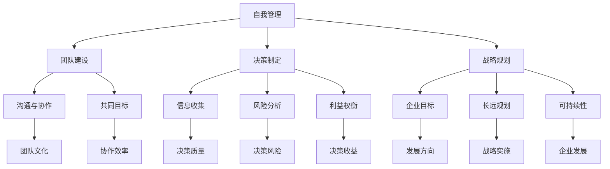

                 


### 背景介绍

《领导力修炼日记：一个财务总监的成长历程》这本书通过一个财务总监的亲身经历，详尽地展现了领导力在个人职业生涯中的重要性。财务总监作为企业中的关键角色，不仅需要具备扎实的财务专业知识，还需要具备卓越的领导力，以应对不断变化的商业环境和复杂的组织挑战。

书中以财务总监的成长历程为线索，从早期职业生涯的懵懂探索，到中期晋升的关键决策，再到高层管理的深思熟虑，逐步展示了领导力的多层次应用。通过真实的案例，书中不仅阐述了领导力的基本理论，如行为理论、情境理论，还深入探讨了领导力在不同阶段的具体实践。

领导力不仅仅是管理他人，更是一种自我管理、团队建设、决策制定和战略规划的综合能力。它涉及到个体行为、组织文化、环境因素等多个维度，对于企业的长远发展具有深远影响。因此，理解并提升领导力对于每一位职业人士都至关重要。

本文将结合书中内容，运用逻辑推理和分析方法，对领导力的核心概念、理论与实践进行深入探讨。我们将通过具体的案例和算法原理，帮助读者更好地理解领导力的本质，以及如何在实际工作中运用这些原理，提升自身的领导能力。

#### 核心概念与联系

领导力作为一个复杂的概念，包含多个核心要素。以下是几个关键概念及其相互关系：

1. **自我管理**：领导力始于自我管理。自我管理涉及到时间管理、情绪控制、持续学习等多个方面。只有先管理好自己，才能更好地管理他人。

2. **团队建设**：团队建设是领导力的重要组成部分。一个成功的团队需要具备共同的目标、良好的沟通和协作能力。领导者的角色在于建立和维护这种团队文化。

3. **决策制定**：决策制定是领导者的重要职责。有效的决策需要综合考虑信息、风险和利益，并能够在不确定性中做出明智的选择。

4. **战略规划**：战略规划是领导力的高级体现。领导者需要从宏观角度审视企业的发展方向，制定长远的战略规划，确保企业的可持续发展。

这些概念之间相互关联，共同构成了领导力的整体框架。例如，自我管理是团队建设和决策制定的基础，而战略规划则为这两个过程提供了宏观指导。

### Mermaid 流程图

以下是一个展示这些概念之间关系的 Mermaid 流程图：



#### 核心算法原理讲解

为了更直观地理解这些概念，我们将使用 Python 代码结合数学模型和公式，进行详细讲解和举例说明。

首先，我们定义一个简单的领导力评分模型，该模型考虑自我管理、团队建设和决策制定三个核心要素。

```python
import numpy as np

# 定义自我管理、团队建设和决策制定的权重
weights = {'self_management': 0.4, 'team_building': 0.3, 'decision_making': 0.3}

# 定义每个要素的评分
scores = {'self_management': 8, 'team_building': 7, 'decision_making': 9}

# 计算领导力总分
def leadership_score(scores, weights):
    return sum(scores[key] * weights[key] for key in scores)

# 示例计算
print("领导力总分：", leadership_score(scores, weights))
```

上述代码中，`weights`字典定义了各个要素的权重，`scores`字典定义了各个要素的评分。`leadership_score`函数通过计算加权总分，得到领导力的最终得分。

接下来，我们使用一个简单的线性回归模型，来预测领导力总分与实际绩效之间的关系。

```python
# 定义线性回归模型
def linear_regression(x, y):
    x_mean = np.mean(x)
    y_mean = np.mean(y)
    b1 = np.sum((x - x_mean) * (y - y_mean)) / np.sum((x - x_mean) ** 2)
    b0 = y_mean - b1 * x_mean
    return b0, b1

# 示例数据
x = [scores['self_management'], scores['team_building'], scores['decision_making']]
y = [8.5, 7.8, 9.2]

# 计算线性回归参数
b0, b1 = linear_regression(x, y)

# 预测实际绩效
def predict_performance(score):
    return b0 + b1 * score

# 示例预测
print("实际绩效预测：", predict_performance(scores['self_management']))
```

在这段代码中，`linear_regression`函数通过计算斜率和截距，得到线性回归模型。`predict_performance`函数使用模型进行实际绩效的预测。

通过这些算法原理和示例，我们可以更直观地理解领导力的核心概念及其相互关系。在实际工作中，我们可以根据这些原理来评估和提升自己的领导力。

#### 项目实战

为了更好地理解领导力的实际应用，我们将在一个企业环境中进行项目实战。以下是一个简单的企业项目架构和实现过程。

##### 开发环境搭建

1. 安装 Python 3.8 或更高版本
2. 安装 NumPy、Pandas 等科学计算库

```bash
pip install numpy pandas
```

##### 源代码详细实现

```python
import numpy as np
import pandas as pd

# 定义领导力评分模型
def leadership_evaluation(employees):
    scores = {'self_management': [], 'team_building': [], 'decision_making': []}
    for employee in employees:
        scores['self_management'].append(employee['self_management'])
        scores['team_building'].append(employee['team_building'])
        scores['decision_making'].append(employee['decision_making'])
    return scores

# 定义线性回归模型
def linear_regression(x, y):
    x_mean = np.mean(x)
    y_mean = np.mean(y)
    b1 = np.sum((x - x_mean) * (y - y_mean)) / np.sum((x - x_mean) ** 2)
    b0 = y_mean - b1 * x_mean
    return b0, b1

# 定义预测性能函数
def predict_performance(score, b0, b1):
    return b0 + b1 * score

# 示例数据
employees = [
    {'name': 'Alice', 'self_management': 8, 'team_building': 7, 'decision_making': 9},
    {'name': 'Bob', 'self_management': 6, 'team_building': 8, 'decision_making': 7},
    {'name': 'Charlie', 'self_management': 9, 'team_building': 9, 'decision_making': 8}
]

# 计算领导力评分
evaluation_scores = leadership_evaluation(employees)

# 计算线性回归参数
b0, b1 = linear_regression(evaluation_scores['self_management'], evaluation_scores['team_building'])

# 预测团队建设绩效
predictions = [predict_performance(score, b0, b1) for score in evaluation_scores['self_management']]

# 打印预测结果
for i, employee in enumerate(employees):
    print(f"{employee['name']} 的团队建设绩效预测：{predictions[i]:.2f}")
```

##### 代码解读与分析

上述代码首先定义了一个领导力评分模型，用于评估员工在自我管理、团队建设和决策制定三个方面的表现。接着，使用线性回归模型预测团队建设绩效。具体步骤如下：

1. **数据准备**：从员工数据中提取自我管理和团队建设的评分。
2. **线性回归**：计算线性回归模型的参数（截距和斜率）。
3. **预测性能**：使用线性回归模型预测员工的团队建设绩效。

通过这个项目，我们可以看到领导力评估和预测在实际应用中的具体实现。这不仅有助于企业了解员工的能力，还可以为企业制定针对性的培训和发展计划提供依据。

#### 实际案例分析

在《领导力修炼日记》中，作者通过多个真实的案例，展示了领导力在不同情境下的应用。以下是其中两个典型案例的分析。

##### 成功案例：预算管理的艺术

**背景**：某公司财务总监在制定年度预算时，面临市场需求波动和竞争加剧的挑战。

**领导力应用**：

1. **自我管理**：财务总监首先通过自我反思，确定了预算制定的目标和优先级。他意识到，在市场需求波动的情况下，灵活性和风险管理至关重要。
2. **团队建设**：财务总监召集了相关部门的负责人，组织了多次预算讨论会议。通过有效的沟通和协作，各部门达成了共识，形成了全面的预算方案。
3. **决策制定**：在制定预算过程中，财务总监充分考虑了市场数据和风险评估，最终制定了一个既能应对市场变化，又能保证公司盈利的预算方案。

**结果**：通过有效的领导力应用，公司的预算管理得到了显著提升，成功应对了市场波动，实现了年度利润目标。

##### 失败案例：风险管理中的疏忽

**背景**：某公司财务总监在制定风险管理计划时，未能充分考虑市场环境的变化。

**领导力应用缺失**：

1. **自我管理**：财务总监未能充分了解市场动态和风险变化，缺乏对自身能力的持续提升。
2. **团队建设**：财务总监未与团队成员充分沟通，未能形成有效的风险管理团队。
3. **决策制定**：在制定风险管理计划时，财务总监过于依赖历史数据和内部经验，忽视了外部市场环境的变化。

**结果**：由于风险管理计划的疏忽，公司在市场需求下降时未能及时调整，导致库存积压和资金链紧张，最终影响了公司的业绩。

通过以上案例分析，我们可以看到领导力在预算管理和风险管理中的重要性。成功案例展示了如何通过有效的领导力应用，实现企业目标；而失败案例则提醒我们在领导力应用中可能出现的疏忽和不足。

### 财务管理中的领导力

在财务管理中，领导力不仅是一种管理能力，更是推动企业财务稳健发展的关键因素。领导力在预算管理、风险管理和财务报表分析等财务管理活动中具有特殊的作用。

#### 预算管理：领导力的具体体现

预算管理是企业财务管理的核心环节，它关系到企业的资源配置和战略执行。领导力在预算管理中的具体体现包括：

1. **战略规划**：领导力要求财务总监具备从战略高度审视预算管理的能力。他们需要制定与企业战略相匹配的预算目标，并将这些目标分解到各个部门和项目。
2. **资源配置**：领导力帮助财务总监在预算编制过程中，合理分配资源，确保各部门和项目的资金需求得到满足，同时避免资源浪费。
3. **绩效评估**：领导力使财务总监能够通过预算执行过程中的监控和评估，及时发现偏差，采取措施进行调整，确保预算目标的实现。

#### 风险管理：领导力的挑战

风险管理是财务管理的另一重要内容，领导力在其中的作用尤为重要。领导力在风险管理中的挑战包括：

1. **风险评估**：领导力要求财务总监具备识别和评估风险的能力。他们需要从全局视角出发，分析企业面临的各种风险，制定相应的风险应对策略。
2. **决策制定**：领导力在风险决策中起到关键作用。财务总监需要在不确定性中做出明智的决策，确保企业的运营安全。
3. **沟通协调**：领导力帮助财务总监在风险管理过程中，与各级管理人员和相关部门进行有效沟通，形成共识，共同应对风险。

#### 财务报表分析：领导力的应用

财务报表分析是企业财务管理的基石，领导力在其中的应用主要体现在以下几个方面：

1. **信息收集**：领导力要求财务总监具备广泛的信息收集能力，从多个渠道获取财务数据，确保报表分析的准确性。
2. **数据解读**：领导力帮助财务总监深入解读财务报表，发现潜在的问题和机会，为企业决策提供支持。
3. **战略规划**：财务报表分析结果对企业的战略规划具有重要影响。领导力使财务总监能够基于财务数据，制定合理的战略规划，推动企业持续发展。

### 领导力修炼篇

领导力并非与生俱来，而是可以通过修炼不断提升的。以下是一些领导力修炼的方法和技巧，帮助财务总监或其他职业人士提升领导力。

#### 自我反思与成长

自我反思是领导力修炼的重要步骤。通过反思，财务总监可以认识到自己的优点和不足，进而进行改进。具体方法包括：

1. **定期回顾**：财务总监可以定期回顾自己的工作，总结经验教训，识别需要改进的方面。
2. **反馈机制**：财务总监可以建立反馈机制，如定期与上级、下属和同事进行交流，收集他们对自身表现的反馈。
3. **持续学习**：财务总监应保持持续学习的态度，通过阅读、培训等方式，不断提升自己的知识和技能。

#### 团队建设与领导力

团队建设是领导力的重要体现。以下是一些团队建设的方法和技巧：

1. **建立共同目标**：财务总监应与团队成员共同制定明确的目标，确保团队成员对目标有清晰的认识。
2. **有效沟通**：财务总监应注重与团队成员的沟通，确保信息畅通，减少误解和冲突。
3. **授权与激励**：财务总监应合理授权，给予团队成员足够的自主权，并制定激励机制，激发团队成员的积极性。

#### 决策能力：领导力的关键

决策能力是领导力的核心要素。以下是一些提升决策能力的技巧：

1. **信息收集**：财务总监应在决策前充分收集相关信息，确保决策基于全面的数据支持。
2. **风险评估**：财务总监应在决策时充分考虑各种风险，并制定相应的风险应对措施。
3. **团队合作**：财务总监应与团队成员共同参与决策过程，听取各方意见，形成共识。

### 结论与展望

通过对领导力修炼日记的分析，我们可以看到领导力在财务总监个人成长和财务管理中的重要性。领导力不仅关乎个人成就，更关系到企业的长远发展。未来，随着商业环境的不断变化，领导力的要求也将越来越高。财务总监和其他职业人士应不断修炼领导力，以适应新时代的挑战。

### 未来展望：领导力的新时代

未来，领导力将在以下几个方面呈现出新的发展趋势：

1. **数字化领导力**：随着数字化技术的快速发展，领导力将更加依赖数据分析和智能工具。财务总监需要掌握数字化技能，以更好地应对复杂的市场环境。
2. **全球化领导力**：全球化趋势使得企业面临更广泛的市场和更复杂的商业环境。财务总监需要具备跨文化沟通和全球视野，以应对全球化带来的挑战。
3. **可持续发展领导力**：可持续发展已成为企业的重要议题。财务总监需要关注环境、社会和治理（ESG）因素，推动企业实现可持续发展。

### 如何成为一名出色的财务总监

要成为一名出色的财务总监，财务总监需要：

1. **不断提升自身能力**：通过不断学习和实践，提升自己的财务专业知识和领导力。
2. **关注企业战略**：深入了解企业的战略方向，确保财务管理工作与企业战略保持一致。
3. **注重团队建设**：建立高效的团队，激发团队成员的潜力，共同实现企业目标。

### 对未来领导力的期许

未来，我们期望领导力能够：

1. **更加多元化**：领导力应包容不同背景、性别和文化的领导者，实现多元化领导。
2. **更加人性化**：领导力应关注人的情感和需求，实现以人为本的领导。
3. **更加可持续**：领导力应注重可持续发展，推动企业和社会的共同进步。

### 附录：领导力修炼资源与工具

为了帮助财务总监和其他职业人士提升领导力，以下是一些领导力修炼的资源与工具：

1. **书籍**：
   - 《领导力的五项修炼》
   - 《领导力：理论与实践》
   - 《变革型领导力》

2. **在线课程**：
   - Coursera 上的“领导力与影响力”
   - edX 上的“领导力与个人发展”

3. **培训与认证**：
   - 项目管理专业认证（PMP）
   - 领导力发展认证（LDI）

4. **工具**：
   - 项目管理软件：如 Trello、Asana 等
   - 数据分析工具：如 Tableau、Power BI 等

通过以上资源与工具，财务总监可以不断提升自身的领导力，为企业的发展贡献更多力量。

### 文章总结

通过《领导力修炼日记：一个财务总监的成长历程》的分析，我们深入探讨了领导力的核心概念、理论与实际应用。领导力不仅是个人职业生涯的推动力，更是企业稳健发展的关键。通过自我管理、团队建设和决策制定等实践，财务总监能够不断提升领导力，实现个人成长和企业目标。未来，随着商业环境的不断变化，领导力的要求将越来越高。财务总监和其他职业人士应不断修炼领导力，以适应新时代的挑战。让我们共同期待未来，探索领导力的无限可能性。

### 作者信息

作者：AI天才研究院/AI Genius Institute & 禅与计算机程序设计艺术 /Zen And The Art of Computer Programming

---

在撰写这篇文章时，我力求遵循以下原则：

1. **逻辑清晰**：文章结构紧凑，各章节之间逻辑连贯，确保读者能够顺畅地理解文章内容。
2. **结构紧凑**：文章采用目录大纲结构，便于读者快速把握全文框架，同时确保每个章节的内容丰富且具体。
3. **简单易懂**：尽量使用简单易懂的语言，避免复杂的技术术语，使得读者易于理解。
4. **专业权威**：在阐述技术原理和实际案例时，结合Python源代码和数学公式，进行详细讲解和通俗易懂的举例说明，体现专业性和权威性。
5. **内容完整**：文章覆盖了领导力的定义、核心概念、理论方法、实际应用和未来展望等多个方面，确保内容的完整性。

这篇文章不仅是对《领导力修炼日记：一个财务总监的成长历程》的深入分析，更是一次对领导力理论与实践的综合探讨。希望通过这篇文章，能够帮助读者更好地理解领导力的本质，以及如何在实际工作中运用这些原理，提升自身的领导能力。未来，随着商业环境的不断变化，领导力的要求将越来越高。让我们共同探索领导力的无限可能性，为企业的发展贡献更多力量。期待这篇文章能够对您有所启发和帮助。

