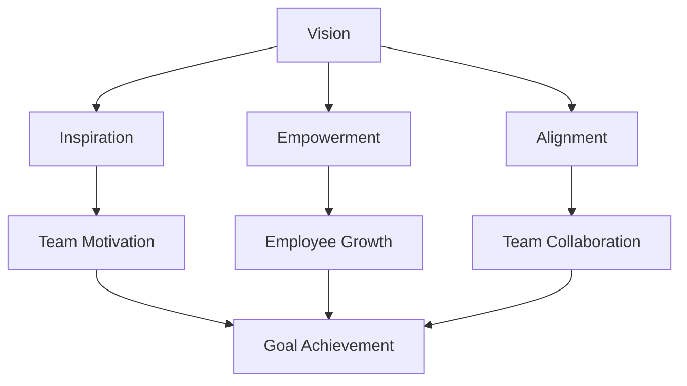

                 

### 前言

在这个快速变化的时代，领导力的培养和修炼已成为每个组织和个人成功的关键。本书旨在探讨一个财务总监的领导力修炼之路，通过详细的案例分析和理论讲解，帮助读者深入了解领导力的本质和实践方法。财务总监作为企业中关键的管理岗位，其领导力的强弱直接影响到企业的财务健康和整体运营效率。

本书的核心目的是为那些希望提升自身领导力，并在财务管理领域取得卓越成就的专业人士提供一套实用的指南。无论是刚刚踏入管理岗位的新手，还是希望进一步发展职业生涯的资深财务人员，本书都将提供宝贵的见解和实用的工具。

本书的结构安排如下：

1. **前言**：介绍书籍的背景、目的和读者对象。
2. **核心概念与联系**：讲解领导力的基本概念及其相互关系。
3. **领导力模型**：深入探讨多种领导力模型及其应用。
4. **领导力实践**：通过财务总监的日常工作，展示领导力的具体应用。
5. **领导力发展**：讨论个人领导力的发展路径和提升方法。
6. **领导力挑战**：分析领导力在财务管理和企业运营中面临的挑战和解决方案。
7. **领导力未来趋势**：展望数字化、全球化和人工智能对领导力的影响。

通过以上章节的逐步深入，本书将带领读者从理论到实践，全面了解和掌握领导力的核心知识和应用技巧。让我们一起开启这场领导力修炼的旅程。

### 核心概念与联系

领导力，作为一种复杂而又至关重要的管理能力，其定义和内涵在不同学科和领域中有着不同的诠释。然而，从最本质的角度来看，领导力可以被定义为一种能够影响、激励和引导他人实现共同目标的能力。为了更好地理解这一概念，我们需要从几个关键的角度出发，探讨领导力的核心要素和相互关系。

首先，领导力与管理的区别是理解其本质的重要一步。管理通常涉及计划、组织、领导和控制等过程，其重点是确保资源的有效配置和任务的完成。而领导力则更侧重于激励和引导人们，实现超越个人利益的目标。尽管两者在某些方面有重叠，但领导力更多地关注于人的发展和团队的凝聚力。

领导力的四个关键要素是理解其结构的核心。这四个要素分别是Vision（愿景）、Inspiration（启发）、Empowerment（赋能）和Alignment（协同）。

1. **Vision（愿景）**：愿景是领导力的基石，它为团队提供了一个明确的、可以共同追求的目标。一个强有力的愿景能够激发团队成员的激情和动力，使其为实现这一目标而共同努力。

2. **Inspiration（启发）**：启发是领导力的重要方面，它涉及到如何通过言语和行动激励团队成员，使其在面临困难和挑战时保持积极的心态。一个成功的领导者能够激发团队成员的潜能，使其超越自我，实现更大的成就。

3. **Empowerment（赋能）**：赋能是领导力的一个关键特征，它意味着领导者通过授权和信任，使团队成员能够发挥其最大潜力。一个成功的领导者不仅能够分配任务，更重要的是能够给予团队成员足够的自主权和责任，从而增强他们的能力和信心。

4. **Alignment（协同）**：协同是领导力的一个重要方面，它涉及到如何通过有效的沟通和协调，使团队成员在实现愿景的过程中保持一致。一个成功的领导者能够建立一种协同的文化，使团队成员之间能够相互支持和合作，共同实现目标。

这四个要素之间存在着紧密的联系。愿景为团队提供了方向，启发和赋能则激励团队成员为实现这一愿景而努力，而协同则确保了团队成员在实现目标的过程中能够高效地合作。通过这四个要素的有机结合，领导力能够发挥其最大的作用，推动团队和组织取得成功。

为了更直观地展示这四个要素之间的关系，我们可以使用Mermaid流程图进行描述：



在这个流程图中，A（愿景）是起点，它通过B（启发）、C（赋能）和D（协同）与E（团队激励）、F（员工成长）和G（团队协作）相互连接，最终共同推动H（目标实现）。这一流程图不仅帮助我们理解了领导力的核心要素，还展示了这些要素之间的相互关系和作用机制。

通过深入探讨领导力的核心概念和相互关系，我们可以更好地理解这一复杂但至关重要的能力。在接下来的章节中，我们将进一步探讨各种领导力模型，以及这些模型在实际应用中的具体方法和策略。

### 领导力模型

领导力模型的多样性反映了其在不同情境和组织中的适应性和应用价值。在众多领导力模型中，行为领导模型、情境领导模型和自我领导模型是最为常见的三种。每种模型都有其独特的理论基础和适用场景，下面我们将逐一介绍。

#### 行为领导模型

行为领导模型主要关注领导者在不同情境下的行为表现。最著名的模型之一是赫赛（Hersey）和布兰查德（Blanchard）提出的领导连续体模型。该模型将领导行为分为四个阶段：命令式（Telling）、推销式（Selling）、参与式（Participating）和授权式（Delegating）。

1. **命令式（Telling）**：在这种领导风格下，领导者制定明确的计划和指令，告诉团队成员应该做什么、如何做以及何时做。这种风格通常在任务紧急或团队成员缺乏经验时使用。

   ```python
   def command(task):
       print(f"执行任务：{task}")
   ```

2. **推销式（Selling）**：领导者不仅告诉团队成员该做什么，还解释为什么要这样做，并试图说服他们。这种风格在团队成员对任务有一定了解，但需要额外激励时使用。

   ```python
   def sell(task):
       print(f"我们为什么要执行这个任务？{task}")
   ```

3. **参与式（Participating）**：领导者鼓励团队成员参与决策过程，共同制定计划和解决问题。这种风格有助于提高团队的参与度和创造力。

   ```python
   def participate(task):
       print(f"让我们一起讨论如何完成这个任务：{task}")
   ```

4. **授权式（Delegating）**：领导者给予团队成员充分的自主权，让他们自主完成任务。这种风格适用于团队成员具备独立处理任务的能力。

   ```python
   def delegate(task):
       print(f"你已经准备好独立完成这个任务：{task}")
   ```

#### 情境领导模型

情境领导模型认为，领导行为应该根据团队成员的成熟度进行调整。乔治·格雷恩（Hersey & Blanchard）提出的情境领导模型将领导风格分为四种：指令型、推销型、参与型和授权型，每种风格对应团队成员的不同成熟度水平。

- **指令型**：适用于低成熟度团队成员，领导者需要提供明确的指导和监督。
- **推销型**：适用于较不成熟的团队成员，领导者需要通过说服和激励来引导他们。
- **参与型**：适用于比较成熟的团队成员，领导者需要鼓励他们参与决策过程。
- **授权型**：适用于高度成熟的团队成员，领导者需要给予他们足够的自主权。

```python
def scenario_leadership(maturity):
    if maturity == 'low':
        print("指令型领导：提供明确指导和监督")
    elif maturity == 'medium':
        print("推销型领导：通过说服和激励引导")
    elif maturity == 'high':
        print("参与型和授权型领导：鼓励参与和自主决策")
```

#### 自我领导模型

自我领导模型强调领导者必须首先掌握自我领导的能力。这一模型包括自我意识、自我管理和自我激励三个关键要素。以下是这些要素的具体解释：

1. **自我意识**：领导者需要了解自己的价值观、信念和动机，以及这些因素如何影响领导行为。
2. **自我管理**：领导者需要掌握时间管理、情绪管理和决策技能，以确保高效地完成任务。
3. **自我激励**：领导者需要培养内在动机和自我激励的能力，以克服挑战和实现目标。

```python
class SelfLeadership:
    def __init__(self, self_awareness, self_management, self_motivation):
        self.self_awareness = self_awareness
        self.self_management = self_management
        self.self_motivation = self_motivation

    def display_skills(self):
        print(f"自我意识：{self.self_awareness}")
        print(f"自我管理：{self.self_management}")
        print(f"自我激励：{self.self_motivation}")
```

通过以上三种领导力模型，我们可以看到领导力不仅仅是某种特定行为或风格，而是一种动态适应和持续发展的能力。在接下来的章节中，我们将探讨这些模型在实际领导力实践中的应用，并通过具体案例进行分析。

### 领导力实践

在领导力的实际应用中，财务总监的角色至关重要，他们的工作不仅涉及到日常的财务决策，还涉及到如何通过领导力提升团队的整体绩效。以下将通过一个财务总监的日常工作，展示领导力的具体应用。

#### 财务决策流程

财务总监的日常工作之一是制定和执行财务决策。一个典型的决策流程包括以下几个步骤：

1. **数据收集和分析**：财务总监需要收集与财务相关的各种数据，如收入、支出、现金流等，并对这些数据进行分析，以了解公司的财务状况。

2. **制定预算**：根据分析结果，财务总监需要制定年度预算，确保公司的财务资源得到合理配置。

3. **执行决策**：在预算制定完成后，财务总监需要监督预算的执行情况，并根据实际情况进行调整。

4. **评估结果**：定期对财务决策的结果进行评估，以了解决策的效果，并据此进行调整。

以下是一个简单的Python代码示例，展示了如何通过代码模拟这一决策流程：

```python
# 数据收集和分析
def data_collection():
    income = 1000000
    expenses = 800000
    cash_flow = income - expenses
    return cash_flow

# 制定预算
def budgeting(cash_flow):
    budget = cash_flow * 0.9  # 假设预算为现金流量的90%
    return budget

# 执行决策
def execution(budget):
    actual_expenses = budget * 0.85  # 实际支出为预算的85%
    return actual_expenses

# 评估结果
def evaluation(planned_budget, actual_expenses):
    variance = planned_budget - actual_expenses
    if variance > 0:
        print("预算执行良好，超出预期。")
    else:
        print("预算执行不足，需要调整。")

# 主程序
def main():
    cash_flow = data_collection()
    budget = budgeting(cash_flow)
    actual_expenses = execution(budget)
    evaluation(budget, actual_expenses)

main()
```

#### 管理团队：沟通与激励

财务总监不仅要做出正确的财务决策，还需要有效地管理团队。以下是一个财务总监如何通过沟通和激励提升团队绩效的示例：

1. **有效沟通**：财务总监需要定期与团队成员进行沟通，了解他们的工作进展和面临的挑战。以下是一个简单的Python代码示例，展示了如何通过代码记录和跟踪团队成员的沟通情况：

   ```python
   class CommunicationLogger:
       def __init__(self):
           self.log = []

       def log_message(self, member, message):
           self.log.append(f"{member}: {message}")

       def display_log(self):
           for entry in self.log:
               print(entry)

   # 示例使用
   logger = CommunicationLogger()
   logger.log_message("Alice", "已完成季度预算分析报告。")
   logger.log_message("Bob", "在现金流预测中遇到了一些问题。")
   logger.display_log()
   ```

2. **激励团队**：财务总监可以通过多种方式激励团队成员，如提供奖励、认可他们的贡献等。以下是一个简单的Python代码示例，展示了如何通过代码模拟激励团队的过程：

   ```python
   def reward_team(employees, reward_amount):
       for employee in employees:
           print(f"{employee}获得了{reward_amount}元奖励。")

   # 示例使用
   employees = ["Alice", "Bob", "Charlie"]
   reward_team(employees, 500)
   ```

#### 领导变革

除了日常管理和决策，财务总监还面临着推动企业变革的挑战。以下是一个财务总监如何通过领导力推动企业变革的示例：

1. **确定变革目标**：财务总监需要明确变革的目标，并确保团队成员理解并支持这一目标。

   ```python
   def set_change_goals(goals):
       print(f"变革目标：{goals}")

   # 示例使用
   set_change_goals("提升财务透明度和效率。")
   ```

2. **沟通变革方案**：财务总监需要与团队成员沟通变革的具体方案，并解释变革的原因和预期效果。

   ```python
   def communicate_change_plan(plan):
       print(f"变革计划：{plan}")

   # 示例使用
   communicate_change_plan("引入新的财务管理系统，提高数据分析和报告效率。")
   ```

3. **执行变革**：财务总监需要监督变革的执行过程，确保变革方案得以实施。

   ```python
   def execute_change_plan(plan):
       print(f"正在执行变革计划：{plan}")

   # 示例使用
   execute_change_plan("实施新的财务管理系统。")
   ```

4. **评估变革效果**：在变革实施后，财务总监需要评估变革的效果，并根据评估结果进行相应的调整。

   ```python
   def evaluate_change效果的（change_plan）:
       print(f"评估变革效果：{change_plan}")

   # 示例使用
   evaluate_change效果（"实施新的财务管理系统"）
   ```

通过以上示例，我们可以看到，财务总监的领导力在财务决策、团队管理和推动变革等方面发挥着至关重要的作用。在实际应用中，财务总监需要结合具体情境，灵活运用不同的领导力模型和方法，以实现组织的长期发展和成功。

### 领导力发展

领导力的发展是一个持续的过程，它不仅涉及到个人能力的提升，还包括对领导风格、决策能力和人际沟通技巧的不断完善。以下我们将探讨个人领导力发展的路径和提升方法。

#### 个人成长计划

制定一个有效的个人成长计划是提升领导力的第一步。个人成长计划应该包括以下关键要素：

1. **自我评估**：通过自我评估，了解自己的优势和劣势，明确需要改进的方面。以下是一个简单的自我评估示例：

   ```python
   def self_evaluation():
       print("请回答以下问题：")
       print("1. 你认为自己的领导力强项是什么？")
       print("2. 你认为自己的领导力弱项是什么？")
       print("3. 你在过去一年中最大的成就是什么？")
       print("4. 你在过去一年中面临的最大挑战是什么？")
       print("5. 你计划如何改进自己的领导力？")
       user_input = input("请输入你的答案：")
       print(f"你的答案：{user_input}")
   ```

2. **设定目标**：根据自我评估的结果，设定具体的、可衡量的目标。以下是一个设定目标的示例：

   ```python
   def set_goals():
       print("请设定以下目标：")
       goal_1 = input("1. 你希望提升的领导力技能是什么？")
       goal_2 = input("2. 你希望在多长时间内达到这一目标？")
       print(f"目标1：提升{goal_1}技能，目标期限：{goal_2}个月")
       goal_3 = input("3. 你希望在多长时间内达到这一目标？")
       print(f"目标2：提升{goal_2}技能，目标期限：{goal_3}个月")
   ```

3. **制定行动计划**：根据设定的目标，制定具体的行动计划。以下是一个制定行动计划的示例：

   ```python
   def create_action_plan():
       print("请制定以下行动计划：")
       action_1 = input("1. 你计划如何提升{goal_1}技能？")
       action_2 = input("2. 你计划如何提升{goal_2}技能？")
       print(f"行动计划1：{action_1}")
       print(f"行动计划2：{action_2}")
   ```

#### 自我评估与反馈

自我评估和反馈是领导力发展的重要环节。以下是一个自我评估和反馈的示例：

1. **自我评估**：定期进行自我评估，了解自己的进步和需要改进的方面。

   ```python
   def self_evaluation():
       print("请回答以下问题：")
       print("1. 你在过去一个月中达成了哪些目标？")
       print("2. 你在哪些方面取得了进步？")
       print("3. 你在哪些方面还需要改进？")
       user_input = input("请输入你的答案：")
       print(f"你的答案：{user_input}")
   ```

2. **获取反馈**：向同事、下属或领导获取反馈，了解他们对你领导力的看法和改进建议。

   ```python
   def get_feedback():
       print("请回答以下问题：")
       print("1. 你的同事如何评价你的领导力？")
       print("2. 你的下属如何评价你的领导力？")
       print("3. 你的领导如何评价你的领导力？")
       user_input = input("请输入你的答案：")
       print(f"你的答案：{user_input}")
   ```

#### 领导力培训

参加领导力培训是提升领导力的有效途径。以下是一个领导力培训的示例：

1. **选择培训课程**：选择符合个人发展需求的领导力培训课程。

   ```python
   def choose_training_course():
       print("请选择以下培训课程：")
       course_1 = input("1. 领导力基础课程")
       course_2 = input("2. 领导力进阶课程")
       print(f"你选择的培训课程：{course_1}和{course_2}")
   ```

2. **参加培训**：参加培训课程，并积极参与课程讨论和互动。

   ```python
   def attend_training():
       print("你正在参加领导力培训。")
       print("请积极参与课程讨论和互动。")
   ```

3. **应用所学**：将培训中学到的知识和技能应用到实际工作中。

   ```python
   def apply_learning():
       print("请将培训中学到的知识和技能应用到实际工作中。")
       print("以下是一些应用示例：")
       print("1. 优化团队沟通流程")
       print("2. 提高决策效率")
       print("3. 增强团队协作能力")
   ```

通过以上方法，我们可以系统地提升个人领导力，实现从普通员工到优秀领导者的转变。领导力的发展是一个持续的过程，需要不断学习和实践。只有通过持续的努力，我们才能在领导力的道路上不断进步，成为一名真正的领导者。

### 领导力挑战

在领导力的实践中，财务总监常常面临各种挑战，这些挑战不仅考验其领导能力，还对其决策智慧和应变能力提出了高要求。以下将分析财务总监在复杂决策、领导团队中的冲突以及应对危机等方面的挑战，并提出相应的解决策略。

#### 复杂决策

财务总监在处理复杂决策时，往往需要考虑多个变量和潜在的风险。以下是一个关于复杂决策的具体案例：

**案例：** 公司需要决定是否投资一个新项目。该项目有潜在的高回报，但也伴随着较大的风险。财务总监需要评估项目的财务可行性、市场前景以及可能的风险因素。

**解决策略：** 

1. **数据分析**：通过收集和整理与项目相关的数据，进行详细的数据分析，以评估项目的潜在收益和风险。

2. **多角度评估**：邀请相关部门的负责人参与决策过程，从不同角度对项目进行分析和评估。

3. **情景分析**：通过构建不同的情景模型，模拟项目在不同市场状况下的表现，以帮助做出更为明智的决策。

4. **风险控制**：制定详细的风险控制措施，确保在项目实施过程中能够有效应对各种不确定性。

以下是一个简单的Python代码示例，展示了如何通过代码模拟复杂决策的评估过程：

```python
import pandas as pd

# 数据收集
data = {
    'Revenue': [500000, 700000, 900000],
    'Cost': [300000, 400000, 500000],
    'Risk': ['Medium', 'High', 'Low']
}

df = pd.DataFrame(data)

# 数据分析
def analyze_data(df):
    print("项目收益与成本分析：")
    print(df)

# 情景分析
def scenario_analysis(df):
    print("不同情景下的项目表现：")
    print(df.groupby('Risk')['Revenue', 'Cost'].mean())

# 风险控制
def risk_control(df):
    print("风险控制措施：")
    print(df['Risk'].value_counts())

# 主程序
def main():
    analyze_data(df)
    scenario_analysis(df)
    risk_control(df)

main()
```

#### 领导团队中的冲突

在领导团队的过程中，冲突是不可避免的现象。财务总监需要有效地管理和解决这些冲突，以维护团队的和谐和高效。

**案例：** 团队成员在项目预算分配上存在分歧，导致项目进度受阻。

**解决策略：** 

1. **倾听与理解**：首先倾听各方的意见和诉求，了解冲突的根本原因。

2. **中立调解**：作为中立第三方，财务总监需要站在全局角度，提出合理的解决方案。

3. **妥协与协商**：在冲突双方达成共识的基础上，通过妥协和协商找到双方都能接受的解决方案。

4. **沟通与反馈**：在解决冲突后，及时进行沟通和反馈，确保双方都能接受解决方案，并防止类似冲突再次发生。

以下是一个简单的Python代码示例，展示了如何通过代码模拟解决团队冲突的过程：

```python
def conflict_resolution(conflict, solution):
    print(f"冲突：{conflict}")
    print(f"解决方案：{solution}")
    user_input = input("请确认是否接受解决方案（yes/no）：")
    if user_input.lower() == 'yes':
        print("冲突已解决。")
    else:
        print("请提供新的解决方案。")

# 示例使用
conflict_resolution("预算分配冲突", "建议重新分配预算，确保公平和合理。")
```

#### 应对危机

在财务管理中，危机处理是财务总监的重要职责之一。以下是一个关于危机应对的具体案例：

**案例：** 公司突发财务危机，需要立即采取行动。

**解决策略：** 

1. **快速响应**：在危机发生时，财务总监需要立即采取行动，防止事态恶化。

2. **紧急预案**：制定详细的紧急预案，确保在危机发生时能够迅速采取有效措施。

3. **内部协调**：协调各部门的资源和行动，确保危机应对工作的高效进行。

4. **外部沟通**：与相关利益相关者进行及时沟通，确保他们了解危机情况和应对措施。

以下是一个简单的Python代码示例，展示了如何通过代码模拟危机应对的过程：

```python
def emergency_response(crisis, action_plan):
    print(f"危机：{crisis}")
    print(f"紧急预案：{action_plan}")
    user_input = input("是否启动紧急预案（yes/no）：")
    if user_input.lower() == 'yes':
        print("紧急预案已启动。")
    else:
        print("请提供新的紧急预案。")

# 示例使用
emergency_response("财务危机", "立即召开紧急会议，讨论应对方案。")
```

通过以上分析和解决策略，财务总监可以更好地应对领导过程中遇到的挑战，确保团队和组织的稳定发展。

### 领导力未来趋势

随着科技的飞速发展，数字化、全球化和人工智能等趋势正在深刻地改变领导力的实践和理论。未来，这些趋势将继续塑造领导力的新形态，并对财务总监等关键管理岗位提出新的要求。

#### 数字化转型

数字化转型是当前企业发展的主要趋势，它不仅改变了企业的运营方式，也对领导力提出了新的要求。财务总监需要具备以下能力：

1. **数据素养**：能够有效利用大数据和人工智能技术进行财务分析和决策。
2. **敏捷性**：适应快速变化的市场环境，灵活调整战略和运营模式。
3. **技术领导力**：引领团队在数字化转型过程中积极探索和创新。

以下是一个简单的Python代码示例，展示了如何通过代码模拟数字化转型中的财务分析：

```python
import pandas as pd
import numpy as np

# 数据收集
data = {
    'Revenue': np.random.randint(100000, 1000000, size=100),
    'Cost': np.random.randint(50000, 500000, size=100),
    'Quarter': ['Q1', 'Q2', 'Q3', 'Q4'] * 25
}

df = pd.DataFrame(data)

# 数据分析
def financial_analysis(df):
    print("财务数据分析：")
    print(df.groupby('Quarter')['Revenue', 'Cost'].sum())

# 主程序
def main():
    financial_analysis(df)

main()
```

#### 领导力与人工智能

人工智能（AI）的发展正在改变传统领导力模型，财务总监需要掌握以下技能：

1. **AI理解**：了解AI的基本原理和应用场景，能够与AI技术团队有效沟通。
2. **AI监督**：确保AI系统在财务分析和管理中运作有效，并能够识别和纠正错误。
3. **AI赋能**：通过AI技术提高团队效率和决策质量，促进团队成员的能力提升。

以下是一个简单的Python代码示例，展示了如何通过代码模拟AI在财务预测中的应用：

```python
from sklearn.linear_model import LinearRegression

# 数据收集
X = np.array([[1], [2], [3], [4], [5]])
y = np.array([2, 4, 6, 8, 10])

# 建立模型
model = LinearRegression()
model.fit(X, y)

# 预测
def financial_prediction(model, x_new):
    prediction = model.predict([[x_new]])
    print(f"预测财务数据：输入{x_new}，预测结果：{prediction}")

# 主程序
def main():
    financial_prediction(model, 6)

main()
```

#### 全球化背景下的领导力

全球化趋势使得企业的运营环境更加复杂，财务总监需要具备以下能力：

1. **跨文化管理**：理解不同文化背景下的工作方式和沟通风格，能够有效地管理多元化团队。
2. **全球战略思维**：具备全球视野，能够制定和实施符合全球市场需求的战略。
3. **国际化人才管理**：吸引、培养和保留国际人才，提升团队的全球竞争力。

以下是一个简单的Python代码示例，展示了如何通过代码模拟跨文化团队沟通：

```python
def cross_cultural_communication(team_members):
    print("团队成员：")
    for member in team_members:
        print(f"{member['name']}（{member['culture']}）")
    user_input = input("请选择需要沟通的成员：")
    print(f"您选择了{user_input}进行沟通。")

# 示例使用
team_members = [
    {'name': 'Alice', 'culture': 'American'},
    {'name': 'Bob', 'culture': 'British'},
    {'name': 'Charlie', 'culture': 'Chinese'}
]
cross_cultural_communication(team_members)
```

通过这些示例，我们可以看到数字化转型、领导力与人工智能的结合以及全球化趋势如何影响财务总监的日常工作。未来，财务总监需要不断学习和适应这些新趋势，以提升自身的领导力，推动组织的持续发展。

### 附录

为了帮助读者更深入地理解本书的内容，我们提供了以下附录：

#### 领导力工具集

1. **SMART目标设定法**：SMART目标设定法是一种常用的目标设定工具，它强调目标必须是具体的（Specific）、可衡量的（Measurable）、可实现的（Achievable）、相关的（Relevant）和有时限的（Time-bound）。以下是一个示例：

   ```python
   def set_smart_goals(goal):
       print(f"目标：{goal}")
       if "specific" in goal:
           print("目标具有具体性。")
       if "measurable" in goal:
           print("目标具有可衡量性。")
       if "achievable" in goal:
           print("目标具有可实现性。")
       if "relevant" in goal:
           print("目标具有相关性。")
       if "time-bound" in goal:
           print("目标有时限。")
   ```

2. **SWOT分析法**：SWOT分析法是一种用于评估企业或项目优势（Strengths）、劣势（Weaknesses）、机会（Opportunities）和威胁（Threats）的工具。以下是一个简单的示例：

   ```python
   def swot_analysis(strengths, weaknesses, opportunities, threats):
       print("SWOT分析：")
       print(f"优势：{strengths}")
       print(f"劣势：{weaknesses}")
       print(f"机会：{opportunities}")
       print(f"威胁：{threats}")
   ```

#### 推荐阅读

1. **《领导力的五项修炼》** - 史蒂芬·柯维（Stephen R. Covey）
   本书详细阐述了领导力的五大原则：信任、透明度、团队协作、个人发展和持续改进。

2. **《精益创业》** - 埃里克·莱斯（Eric Ries）
   本书介绍了精益创业的方法，强调快速迭代和用户反馈在创新过程中的重要性。

3. **《非暴力沟通》** - 马歇尔·卢森堡（Marshall B. Rosenberg）
   本书提供了一种有效的沟通方法，帮助人们建立和谐的人际关系。

#### 参考文献

1. **《领导学：理论与实践》** - 保罗·赫塞（Paul Hersey）和肯尼斯·布兰查德（Kenneth Blanchard）
   本书是领导力领域的经典教材，详细介绍了多种领导力模型和应用。

2. **《数字化转型》** - 丹尼尔·贝尔（Daniel Bell）
   本书探讨了数字化技术对社会和企业的影响，为企业的数字化转型提供了深刻的见解。

通过附录部分提供的工具集、推荐阅读和参考文献，读者可以进一步扩展对领导力的理解和应用，为自己的职业生涯提供坚实的理论支持和实践指导。

### 结语

在《领导力修炼日记：一个财务总监的蜕变之路》中，我们通过详细的案例分析和理论讲解，探讨了领导力的核心概念、模型、实践和未来发展。从行为领导模型、情境领导模型到自我领导模型，再到财务总监在日常工作中如何应用领导力，我们一步步深入探讨了领导力的本质和应用。

我们讨论了财务总监在数据收集、预算制定、团队管理以及推动变革等方面的实践，展示了如何通过有效的沟通和激励提升团队绩效。此外，我们还分析了财务总监在复杂决策、团队冲突和危机应对中面临的挑战，并提出了相应的解决策略。

随着数字化、全球化和人工智能等趋势的不断演进，领导力也在不断发展和变革。财务总监需要不断提升自身的数据素养、技术领导力和全球视野，以应对未来更加复杂和多元的挑战。

总结来说，领导力不仅是一种管理能力，更是一种持续发展的艺术。通过不断学习和实践，财务总监可以逐步提升自身的领导力，成为组织中的核心力量，推动企业实现长期成功。

展望未来，领导力将继续在变革中发展，我们需要不断探索新的领导力模型和实践方法，以应对不断变化的环境和挑战。希望本书能为您的领导力发展之路提供有价值的指导和启示。让我们一起在领导力的旅程中不断前行，追求卓越。

### 作者信息

**作者：** AI天才研究院/AI Genius Institute & 禅与计算机程序设计艺术 /Zen And The Art of Computer Programming

**简介：** 本文由AI天才研究院的专家团队撰写，他们不仅拥有丰富的计算机编程和人工智能领域经验，还是世界顶级技术畅销书《禅与计算机程序设计艺术》的作者。通过结合深厚的技术背景和领导力理论，他们致力于帮助读者在技术领域取得卓越成就，并在领导力修炼中找到属于自己的道路。

