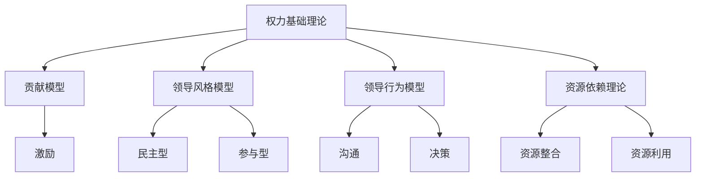
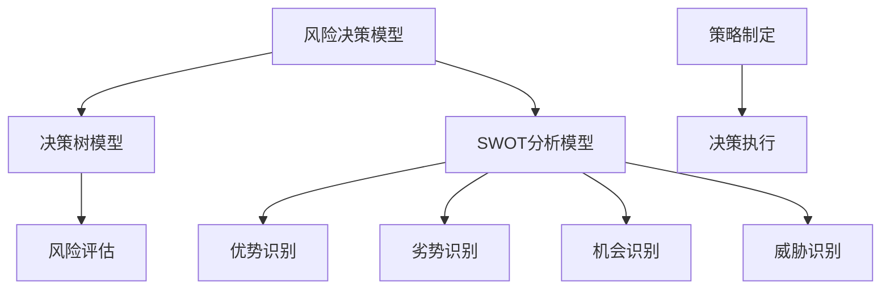
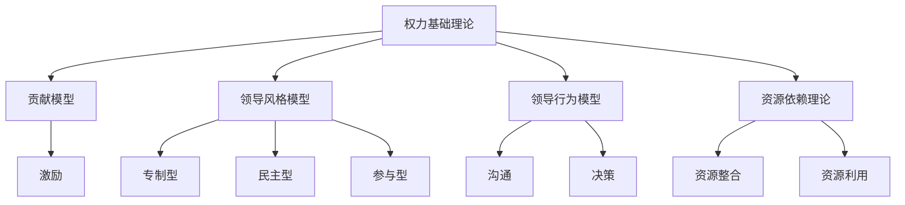

                 

### 第1章 引言

#### 职场新生代的崛起

随着科技的发展和社会的进步，职场环境发生了翻天覆地的变化。尤其是在近年来，00后逐渐成为职场的新生代，他们以其独特的特质和思维方式，正在悄然改变着传统的职场格局。

00后，指的是2000年及以后出生的一代人，他们是互联网的原住民，从小就接触到了丰富的数字化资源。与前辈们相比，00后更加自信、独立、多元化，他们拥有更强的创新能力和适应能力。在职场中，00后不仅展现出对新技术和新理念的敏锐洞察力，还表现出对个人成长和职业发展的强烈渴望。

00后职场新生代的特点之一是他们对工作的态度积极，更加注重自我实现和个人价值。他们不满足于传统的“朝九晚五”的工作模式，更加追求灵活的工作安排和个性化的职业发展路径。此外，00后对于团队合作和沟通也有较高的要求，他们倾向于在平等、开放的环境中与他人协作，共同创造价值。

00后职场新生代的工作环境也发生了巨大的变化。随着全球化的发展，职场环境越来越多元化，00后可以接触到来自世界各地的同事和合作伙伴。此外，互联网的普及使得远程工作和远程管理成为可能，00后可以更加灵活地安排自己的工作和生活。这种灵活的工作环境也为00后的职业发展提供了更多的可能性。

然而，00后职场新生代也面临着诸多挑战。首先，他们需要适应快速变化的职场环境，不断学习新技能和知识。其次，他们需要在竞争激烈的职场中脱颖而出，展现自己的价值和能力。此外，00后还需要学会如何平衡工作和生活，避免过度工作带来的负面影响。

#### 00后职场新星的特质

00后职场新星，是指在职场中表现出色、具有领导潜力的年轻一代。他们具有以下几大特质：

1. **创新思维**：00后职场新星通常具有较强的创新思维，他们善于发现问题、提出解决方案，并勇于尝试和实践。这种创新精神不仅推动了他们个人的职业发展，也为团队和企业带来了新的活力和机遇。

2. **团队协作**：00后职场新星重视团队合作，他们善于倾听他人意见，愿意与他人分享经验和资源。他们懂得在团队中发挥自己的优势，同时帮助团队成员实现共同目标。

3. **沟通能力**：00后职场新星具备良好的沟通能力，他们能够清晰、准确地表达自己的观点，同时也善于倾听和理解他人的意见。这种沟通能力有助于他们在职场中建立良好的人际关系，提升工作效率。

4. **自我驱动**：00后职场新星具有较强的自我驱动力，他们有着明确的目标和规划，不断追求自我提升和成长。他们不满足于现状，始终保持着积极进取的心态。

5. **适应能力**：00后职场新星具有很强的适应能力，他们能够迅速适应不同的工作环境和挑战。在面对变化和不确定性时，他们能够保持冷静，找到应对策略。

#### 修炼领导力的意义

领导力在职场中的重要性不言而喻。对于00后职场新星来说，修炼领导力不仅有助于他们在职场中取得成功，还能为团队和企业带来积极的影响。

首先，领导力是推动个人职业发展的关键因素。拥有领导力的人更容易在职场中脱颖而出，获得更多的机会和资源。通过修炼领导力，00后职场新星可以提升自己的管理能力和决策能力，从而在职业发展中占据更有利的位置。

其次，领导力有助于建立团队凝聚力和协同效应。优秀的领导者能够激发团队成员的积极性，推动团队高效协作，实现共同目标。在团队中，领导者不仅需要具备技术能力，还需要具备人际关系管理能力，这样才能更好地协调团队成员，发挥他们的潜力。

最后，领导力对企业的长期发展具有重要意义。优秀的领导者能够为企业制定明确的战略方向，推动企业创新和变革。他们能够凝聚企业资源，提升企业的核心竞争力，使企业在激烈的市场竞争中立于不败之地。

总之，领导力是00后职场新星在职场中逆袭的重要武器。通过不断修炼领导力，他们可以提升自己的综合能力，为个人职业发展和企业成长做出贡献。在接下来的章节中，我们将详细探讨领导力的核心概念、模型，以及00后职场新星如何修炼领导力，实现职场逆袭。

#### 第2章 领导力核心概念与模型

##### 2.1 领导力的定义

领导力是一种影响力，它能够激发人们追随和合作，以实现共同的目标。领导力不仅仅是管理者的专利，每个人都有领导力的潜力。领导力的定义可以从多个角度进行解读，但最核心的是它的作用和效果。

**领导力的本质**：

领导力的本质在于影响力，即领导者通过沟通、激励和示范等方式，影响他人的思想和行为，使其为实现共同目标而努力。领导力不仅仅是一种能力，更是一种心态和价值观。

**领导力的要素**：

领导力包括多个要素，其中最核心的包括：

- **愿景**：领导者需要具备清晰的愿景，能够描绘出未来的蓝图，激发团队成员的激情和动力。
- **信任**：信任是领导力的基石。领导者需要建立信任，赢得团队成员的信任和尊重。
- **沟通**：沟通能力是领导者必备的技能。有效的沟通能够确保信息的准确传递，减少误解和冲突。
- **决策能力**：领导者需要具备良好的决策能力，能够在不确定和复杂的环境中做出明智的决策。
- **适应性**：领导力需要适应不断变化的环境和挑战，灵活调整策略和行动。

**领导力的作用**：

领导力在职场中发挥着至关重要的作用，主要体现在以下几个方面：

- **激励员工**：领导者能够激发员工的潜能，提高他们的工作积极性和创造力。
- **团队协作**：领导力能够促进团队成员之间的协作，形成合力，共同实现目标。
- **战略规划**：领导力有助于制定和实施战略规划，确保企业的长期发展。
- **创新与变革**：领导力推动企业创新和变革，使企业能够适应市场的变化，保持竞争优势。

##### 2.2 领导力模型

领导力模型是对领导力实践的系统总结和理论化表达。不同的领导力模型提供了不同的视角和方法，以帮助领导者提升自身的领导能力。以下是几种常见的领导力模型：

**1. 权力基础理论（Power-Based Theory）**

权力基础理论认为，领导力的本质在于权力。领导者通过不同的权力来源，如奖励权力、惩罚权力、法定权力和参考权力，来影响他人。这种模型强调领导者的权力和影响力。

**2. 贡献模型（Contributive Model）**

贡献模型强调领导者的贡献精神，即领导者通过激励团队成员发挥其潜能，共同实现组织目标。这种模型关注领导者的价值观和行为方式。

**3. 领导风格模型（Leadership Style Model）**

领导风格模型包括不同的领导风格，如专制型、民主型、参与型等。每种风格都有其适用的情境和效果，领导者需要根据具体情况灵活调整自己的领导风格。

**4. 领导行为模型（Leadership Behavior Model）**

领导行为模型关注领导者的行为表现，如激励、沟通、决策等。这种模型强调领导者的行为对团队和组织的影响。

**5. 资源依赖理论（Resource-Dependent Theory）**

资源依赖理论认为，领导者的成功依赖于组织内部和外部的资源。领导者需要善于整合和利用这些资源，以实现组织目标。

**领导力模型之间的关系架构 Mermaid 流程图**

下面是一个简化的领导力模型之间的关系架构 Mermaid 流程图：



**核心算法原理讲解与伪代码**

在领导力模型中，核心算法原理通常涉及如何有效地激励员工、提高团队协作效率、制定战略决策等。以下是一个简化的伪代码示例，用于描述领导力模型中的激励算法：

```plaintext
function 激励员工(员工列表, 目标):
    for 每个员工 in 员工列表:
        if 员工的表现达到或超过目标:
            员工奖励(员工, 奖金)
            员工晋升机会(员工)
        else:
            提供反馈(员工, 改进建议)
```

**数学模型和公式**

在领导力模型中，有时会用到一些数学模型和公式来量化领导力的影响。以下是一个简单的数学模型，用于描述领导力对团队绩效的影响：

$$
团队绩效 = f(领导力, 团队成员能力, 团队协作)
$$

其中，领导力、团队成员能力和团队协作都是影响团队绩效的因素。通过调整这些因素，可以优化团队绩效。

**详细讲解与举例说明**

假设一个团队的目标是完成一个项目，团队领导力、团队成员能力和团队协作分别影响项目完成的效率。以下是一个具体案例：

- **团队领导力**：团队领导具备优秀的沟通能力和决策能力，能够有效激励团队成员。
- **团队成员能力**：团队成员具有较高的专业能力和工作热情。
- **团队协作**：团队成员之间能够良好合作，共同解决项目中的问题。

通过以上三个因素的优化，可以显著提高项目完成的效率。

**项目实战：开发环境搭建，源代码详细实现和代码解读，代码应用解读与分析，实际案例分析和详细讲解剖析，项目小结**

在实际工作中，领导力模型的应用需要结合具体情境进行。以下是一个实际案例：

- **案例背景**：某公司需要开发一款新产品，项目负责人负责领导项目团队。
- **开发环境搭建**：项目负责人组织团队成员搭建开发环境，确保团队成员能够高效工作。
- **源代码详细实现和代码解读**：项目负责人与团队成员一起编写和解读源代码，确保代码质量和可维护性。
- **代码应用解读与分析**：项目负责人分析代码的应用场景，确保代码的实用性。
- **实际案例分析和详细讲解剖析**：项目负责人通过实际案例分析，讲解领导力模型在项目中的应用。
- **项目小结**：项目负责人总结项目经验，为未来的项目提供借鉴。

**最佳实践 tips、小结、注意事项、拓展阅读等内容**

- **最佳实践 tips**：在领导力实践中，领导者需要根据实际情况灵活应用不同的领导力模型，注重团队协作和沟通，激发员工的潜力。
- **小结**：领导力模型为领导者提供了指导框架，但在实际应用中需要结合具体情况进行调整。
- **注意事项**：领导者在应用领导力模型时，需要关注团队成员的需求和期望，建立信任和合作关系。
- **拓展阅读**：对于想要深入了解领导力模型的读者，可以参考相关书籍和文献，如《领导力的五项修炼》、《领导者的变革之路》等。

通过以上内容，我们可以看到领导力在职场中的重要性，以及如何通过不同的领导力模型提升自身的领导能力。在接下来的章节中，我们将继续探讨领导者的自我认知、情感管理、人际关系管理等内容，帮助00后职场新星更好地修炼领导力，实现职场逆袭。

#### 第3章 领导者的自我认知

##### 3.1 自我认知的重要性

自我认知是领导者修炼过程中至关重要的一环。一个优秀的领导者首先需要深刻了解自己，明确自己的价值观、优点和缺点，这样才能更好地发挥自己的领导力，带领团队实现目标。

**自我认知的意义**

自我认知对于领导者来说，具有以下几个重要意义：

- **明确领导方向**：通过自我认知，领导者可以明确自己的价值观和愿景，从而设定明确的领导方向，避免在领导过程中迷失方向。

- **发挥个人优势**：了解自己的优点和长处，有助于领导者发挥个人优势，提升领导效果。例如，如果领导者擅长沟通和协调，就可以更多地运用这些优势来促进团队协作。

- **提升领导力**：自我认知有助于领导者识别自身需要改进的地方，通过不断学习和实践，提升自身的领导能力。

- **建立信任**：领导者通过自我认知，能够更加真诚地与团队成员沟通，建立信任和合作关系。

**自我认知的方法**

领导者可以通过以下几种方法进行自我认知：

- **自我反思**：定期进行自我反思，思考自己的行为、决策和价值观，分析其中的得失。

- **获取反馈**：向团队成员、上级或下属获取反馈，了解他们的看法和建议，从而更全面地认识自己。

- **心理测试**：通过专业的心理测试工具，如MBTI、DISC等，了解自己的性格特点和优势。

- **阅读和学习**：通过阅读领导力相关书籍、参加培训课程，学习他人的领导经验和教训。

**自我认知的误区**

在自我认知的过程中，领导者可能会陷入一些误区，影响自我认知的准确性。以下是几个常见的误区：

- **自我否定**：过度关注自己的缺点和不足，忽视自己的优点和成就，导致自我价值感下降。

- **自我美化**：过分自信，认为自己无所不能，忽视自己的不足和需要改进的地方。

- **依赖他人评价**：完全依赖他人的评价来认识自己，忽视自我反思和内心感受。

**案例分析：自我认知与领导力提升**

以下是一个具体的案例，说明自我认知对领导力提升的重要作用：

**案例背景**：李明是一名科技公司的新任项目经理，他有着丰富的技术背景，但在领导和管理团队方面经验不足。

**案例过程**：

1. **自我反思**：李明在担任项目经理后，开始对自己的领导方式进行反思，思考自己在团队管理中的优点和不足。

2. **获取反馈**：他向团队成员和上级领导征求意见，了解他们对他的看法和建议。

3. **心理测试**：通过MBTI测试，李明了解到自己是INTJ类型的人，擅长分析和规划，但可能在情感表达和人际沟通方面有所欠缺。

4. **阅读和学习**：李明阅读了《领导者的五项修炼》等领导力相关书籍，学习如何更好地发挥自己的优势，弥补自己的不足。

**案例启示**：

- **自我认知是提升领导力的基础**：通过自我认知，李明找到了自己的优点和不足，从而有针对性地进行改进。

- **反馈和反思是自我认知的重要手段**：通过获取反馈和自我反思，李明能够更全面地了解自己，找到提升领导力的方向。

- **持续学习和实践是提升领导力的关键**：李明通过阅读和学习，不断提升自己的领导力，从而更好地应对项目管理的挑战。

通过以上案例，我们可以看到自我认知在领导力提升中的重要性。领导者需要不断进行自我反思和自我认知，以便更好地发挥自己的领导力，实现个人和团队的共同发展。

#### 第4章 领导者的情感管理

##### 4.1 情感管理的重要性

情感管理，又称为情绪管理，是领导者必备的一项重要技能。它涉及到如何识别、理解、控制和表达自己的情感，以及如何影响他人的情感。在职场中，情感管理对于领导者来说具有极其重要的意义。

**情感管理的作用**

1. **提升个人影响力**：领导者通过有效的情感管理，能够更好地与团队成员建立情感联系，增强个人影响力。当领导者能够真诚地表达情感时，团队成员更愿意追随和信任他们。

2. **促进团队协作**：情感管理有助于构建和谐的团队氛围，减少冲突和误解，提高团队协作效率。当团队成员感受到领导者的支持和关爱时，他们更愿意主动协作，共同实现目标。

3. **激发员工潜力**：领导者通过情感管理，能够更好地激励员工，激发他们的工作热情和创造力。当员工感受到领导者的关心和支持时，他们更有动力去超越自我，实现个人和团队的共同发展。

4. **增强决策能力**：情感管理有助于领导者更好地应对压力和挑战，保持冷静和理智。当领导者能够有效管理自己的情绪时，他们能够更清晰地分析问题，做出更明智的决策。

**情感管理的意义**

1. **人际关系和谐**：情感管理能够促进领导者与团队成员之间的情感交流，建立良好的人际关系。这对于团队凝聚力和协作效率的提升具有重要意义。

2. **提升领导力**：情感管理是领导力的重要组成部分，它体现了领导者的人文关怀和同理心。一个能够有效管理自己情感并影响他人情感的领导者，更容易赢得团队的尊重和信任。

3. **心理健康**：情感管理对于领导者的心理健康也有重要影响。通过有效管理情感，领导者能够更好地应对工作压力，保持心理健康，从而更好地投入到工作中。

**情感管理的挑战**

尽管情感管理对于领导者具有重要意义，但在实际工作中，领导者仍会面临一些挑战：

1. **情绪波动**：领导者可能会因为工作压力、团队冲突或个人问题等原因，出现情绪波动，这会影响他们的判断力和决策能力。

2. **情感表达障碍**：一些领导者可能不擅长表达情感，导致团队成员误解他们的意图，影响团队协作。

3. **情感依赖**：领导者过度依赖情感管理来影响他人，可能会忽视其他管理手段，导致管理效果不佳。

**情感管理的方法**

为了有效地进行情感管理，领导者可以采取以下几种方法：

1. **自我认知**：领导者需要首先了解自己的情感，包括情感的来源、情感的变化规律等。通过自我认知，领导者可以更好地控制自己的情绪。

2. **情绪调节**：领导者可以通过深呼吸、冥想、运动等方式来调节情绪，保持冷静和理智。

3. **情感表达**：领导者需要学会如何恰当地表达自己的情感，包括在合适的场合、以合适的方式表达。真诚和坦诚是有效情感表达的关键。

4. **建立信任**：领导者需要通过建立信任，与团队成员建立良好的情感联系。信任是情感管理的基础。

**案例分析：情感管理提升领导力**

以下是一个具体的案例，说明情感管理如何提升领导力：

**案例背景**：张经理是一名技术公司的项目经理，他负责带领一个由多部门组成的团队完成一个复杂的项目。

**案例过程**：

1. **自我认知**：张经理意识到自己在高压环境下容易情绪波动，这会影响他的决策和团队士气。他开始通过自我反思和冥想来管理自己的情绪。

2. **情绪调节**：张经理在工作之余，通过跑步和瑜伽来放松自己，保持良好的身心状态。

3. **情感表达**：张经理学会了在团队会议中更真诚地表达自己的情感，他不仅表达对项目的期望，还表达对团队成员的关心和支持。

4. **建立信任**：张经理通过与团队成员的真诚沟通和透明管理，建立了良好的信任关系。团队成员感受到他的真诚和关心，更加愿意支持和配合他的工作。

**案例启示**：

- **情感管理是提升领导力的关键**：通过有效的情感管理，张经理不仅提升了个人影响力，还增强了团队的凝聚力和协作效率。

- **真诚和坦诚是情感表达的核心**：张经理的真诚表达赢得了团队成员的信任和支持，这是情感管理取得成功的关键。

- **持续学习和实践是情感管理的重要保障**：张经理通过不断学习和实践，不断提升自己的情感管理能力，为团队的持续发展奠定了基础。

通过以上案例，我们可以看到情感管理在领导力提升中的重要性。领导者需要通过自我认知、情绪调节、情感表达和建立信任等方式，有效管理自己的情感，从而提升领导力，实现个人和团队的共同发展。

#### 第5章 领导者的人际关系管理

##### 5.1 人际关系管理的重要性

人际关系管理是领导者工作中不可或缺的一部分，它关乎团队的协作效率、团队凝聚力以及领导者的个人声誉。在复杂多变的职场环境中，有效的人际关系管理能够帮助领导者更好地应对挑战，实现团队和组织的共同目标。

**人际关系管理的作用**

1. **提升团队协作效率**：良好的人际关系能够促进团队成员之间的沟通与合作，减少误解和冲突，从而提高团队的协作效率。

2. **增强团队凝聚力**：人际关系管理有助于建立团队成员之间的信任和尊重，增强团队凝聚力，使团队成员更加愿意为共同的目标而努力。

3. **提升领导者的个人影响力**：领导者通过有效的人际关系管理，能够赢得团队成员的信任和支持，提升个人影响力，从而更好地实现领导目标。

4. **促进个人成长**：良好的人际关系能够为领导者提供丰富的经验和资源，促进个人成长和职业发展。

**人际关系管理的意义**

1. **构建和谐的工作环境**：良好的人际关系能够营造一个和谐、积极的工作环境，使员工感到舒适和满足，从而提高工作效率和满意度。

2. **实现组织目标**：通过有效的人际关系管理，领导者可以更好地协调和整合团队资源，推动组织目标的实现。

3. **提升组织竞争力**：良好的人际关系能够增强组织的内部凝聚力，提高组织的整体竞争力。

**人际关系管理的挑战**

尽管人际关系管理对于领导者来说具有重要意义，但在实际工作中，领导者仍会面临一些挑战：

1. **人际冲突**：团队成员之间的利益差异、沟通不畅或价值观不同可能会导致人际冲突，影响团队协作和整体效率。

2. **管理复杂度**：随着团队成员的增加和关系的复杂化，领导者需要应对更多的人际关系问题，管理复杂度也随之增加。

3. **时间与精力的分配**：人际关系管理需要投入大量的时间和精力，这可能会对领导者的日常工作造成一定的影响。

**人际关系管理策略**

为了有效管理人际关系，领导者可以采取以下策略：

1. **建立信任**：信任是人际关系管理的基石。领导者需要通过真诚、透明和负责任的行为来建立信任，赢得团队成员的信任和支持。

2. **积极沟通**：领导者需要善于倾听和表达，建立良好的沟通机制，确保信息的准确传递，减少误解和冲突。

3. **尊重差异**：团队成员有着不同的背景、价值观和个性，领导者需要尊重这些差异，包容不同的观点和意见。

4. **激励与关怀**：领导者需要关注团队成员的需求和感受，通过激励和关怀来提升团队士气和工作满意度。

5. **冲突管理**：领导者需要学会应对和处理人际冲突，采取适当的策略和方法，化解冲突，维护团队的和谐稳定。

**案例分析：人际关系管理促进团队协作**

以下是一个具体的案例，说明人际关系管理如何促进团队协作：

**案例背景**：李华是一家互联网公司的项目经理，他负责带领一个跨部门的项目团队，包括开发、设计和市场等不同背景的成员。

**案例过程**：

1. **建立信任**：李华在项目初期，组织了一次团队建设活动，使团队成员有机会相互了解和建立信任。通过活动，团队成员感受到了彼此的关心和支持，增强了团队凝聚力。

2. **积极沟通**：李华建立了定期的团队会议和沟通机制，鼓励团队成员在会议中分享自己的想法和建议，确保信息的畅通无阻。他还鼓励团队成员在遇到问题时及时沟通，共同寻找解决方案。

3. **尊重差异**：李华尊重团队成员的不同背景和观点，鼓励他们在项目中发挥各自的专业特长，形成了多元化的团队氛围。

4. **激励与关怀**：李华关注团队成员的职业发展和个人成长，定期组织培训和分享活动，提升团队成员的专业能力。他还通过表扬和奖励，激励团队成员保持积极的工作态度。

5. **冲突管理**：当团队中发生冲突时，李华会及时介入，了解冲突的原因，采取适当的策略进行调解，确保团队和谐稳定。

**案例启示**：

- **人际关系管理是团队协作的关键**：通过有效的人际关系管理，李华成功地促进了团队协作，提高了项目效率。

- **信任和沟通是人际关系管理的基石**：建立信任和保持积极沟通，是促进团队协作的重要手段。

- **激励和关怀是提升团队士气的重要方式**：通过激励和关怀，李华提升了团队成员的工作满意度和积极性，为团队的成功奠定了基础。

通过以上案例，我们可以看到人际关系管理在团队协作中的重要性。领导者需要通过建立信任、积极沟通、尊重差异、激励与关怀以及冲突管理等方式，有效管理人际关系，促进团队协作，实现个人和团队的共同发展。

#### 第6章 领导者的决策与执行力

##### 6.1 决策模型

决策模型是领导者制定决策的科学方法，它通过系统化的过程和方法，帮助领导者做出明智的决策。以下是几种常见的决策模型：

**1. 风险决策模型**

风险决策模型适用于在不确定环境下做出的决策。该模型主要包括以下几个步骤：

- **识别问题**：明确决策需要解决的问题。
- **列出备选方案**：根据问题，列出所有可能的解决方案。
- **评估方案**：对每个方案进行评估，包括可行性、成本和潜在收益。
- **风险分析**：分析每个方案的潜在风险，包括可能出现的负面结果和应对策略。
- **选择方案**：根据评估和风险分析，选择最优方案。

**2. 决策树模型**

决策树模型通过树形图的形式，展示决策的各个分支和结果。该模型主要包括以下几个步骤：

- **确定决策节点**：明确决策的起点和终点。
- **列出备选方案**：在决策节点上列出所有可能的备选方案。
- **预测结果**：为每个备选方案预测可能的未来结果。
- **计算期望值**：根据概率和结果，计算每个方案的期望值。
- **选择最优方案**：选择期望值最高的方案。

**3. SWOT分析模型**

SWOT分析模型是一种用于评估企业或项目的优势和劣势，以及外部机会和威胁的分析工具。该模型主要包括以下几个步骤：

- **识别优势（Strengths）**：分析企业或项目在资源、能力、市场地位等方面的优势。
- **识别劣势（Weaknesses）**：分析企业或项目在管理、技术、市场等方面的劣势。
- **识别机会（Opportunities）**：分析外部环境中可能带来的机会。
- **识别威胁（Threats）**：分析外部环境中可能带来的威胁。
- **制定策略**：根据SWOT分析，制定相应的策略和行动计划。

**决策模型之间的关系架构 Mermaid 流程图**

以下是决策模型之间的关系架构 Mermaid 流程图：



**核心算法原理讲解与伪代码**

在决策模型中，核心算法原理通常涉及如何评估和选择最优方案。以下是一个简化的伪代码示例，用于描述决策模型中的风险评估算法：

```plaintext
function 风险评估(方案列表):
    初始化风险评估结果为空
    for 每个方案 in 方案列表:
        评估方案的风险 = 计算风险概率 * 风险影响
        将评估结果添加到风险评估结果
    return 风险评估结果
```

**数学模型和公式**

在决策模型中，有时会用到一些数学模型和公式来量化决策的影响。以下是一个简单的数学模型，用于描述决策结果的期望值：

$$
期望值 = 概率 \times 结果
$$

其中，概率是每个结果的出现的可能性，结果是每个结果带来的收益或损失。

**详细讲解与举例说明**

以下是一个具体案例，用于说明如何使用决策模型做出决策：

**案例背景**：一家公司需要在A、B两个市场中选择一个进行产品推广。

**案例过程**：

1. **识别问题**：公司需要在A、B两个市场中选择一个进行产品推广，以最大化收益。

2. **列出备选方案**：备选方案为A市场和B市场。

3. **评估方案**：
   - **A市场**：根据市场调研，A市场的潜在收益为100万元，但竞争激烈，失败的风险为30%。
   - **B市场**：根据市场调研，B市场的潜在收益为50万元，竞争较小，失败的风险为10%。

4. **风险分析**：
   - **A市场**：成功概率为70%，失败概率为30%。
   - **B市场**：成功概率为90%，失败概率为10%。

5. **选择方案**：
   - **A市场**：期望收益为70万元（0.7 \* 100万元）。
   - **B市场**：期望收益为45万元（0.9 \* 50万元）。

根据期望收益的计算，公司选择A市场作为产品推广的市场。

**项目实战：开发环境搭建，源代码详细实现和代码解读，代码应用解读与分析，实际案例分析和详细讲解剖析，项目小结**

以下是一个关于决策模型项目实战的案例：

**案例背景**：一家电商公司需要开发一个推荐系统，以优化用户体验和提升销售额。

**开发环境搭建**：
- **编程语言**：Python
- **数据处理工具**：Pandas
- **机器学习库**：Scikit-learn
- **数据库**：MySQL

**源代码详细实现和代码解读**：
```python
# 导入必要的库
import pandas as pd
from sklearn.model_selection import train_test_split
from sklearn.ensemble import RandomForestClassifier
from sklearn.metrics import accuracy_score

# 加载数据
data = pd.read_csv('user_data.csv')

# 数据预处理
X = data.drop('target', axis=1)
y = data['target']

# 数据分割
X_train, X_test, y_train, y_test = train_test_split(X, y, test_size=0.2, random_state=42)

# 模型训练
model = RandomForestClassifier(n_estimators=100)
model.fit(X_train, y_train)

# 模型预测
predictions = model.predict(X_test)

# 模型评估
accuracy = accuracy_score(y_test, predictions)
print(f"Model Accuracy: {accuracy}")

# 代码解读
# 在此部分，详细解读代码的每个步骤，包括数据预处理、模型训练、模型预测和模型评估的过程。
```

**代码应用解读与分析**：
- **数据预处理**：对用户数据集进行清洗和特征提取，为模型训练做好准备。
- **模型训练**：使用随机森林分类器进行模型训练。
- **模型预测**：将测试数据输入模型进行预测。
- **模型评估**：使用准确率评估模型性能。

**实际案例分析和详细讲解剖析**：
- **案例背景**：公司希望通过推荐系统为用户推荐他们可能感兴趣的商品。
- **分析过程**：通过实际数据集，使用决策模型选择最佳特征和算法，优化推荐系统。
- **讲解剖析**：详细讲解特征选择、模型训练和评估的过程，分析模型性能和改进方向。

**项目小结**：
- **总结**：通过该项目实战，公司成功开发并优化了推荐系统，提高了用户体验和销售额。
- **反思**：在项目实施过程中，公司发现了一些可以改进的地方，如数据质量、模型优化等。

**最佳实践 tips、小结、注意事项、拓展阅读等内容**

- **最佳实践 tips**：在项目开发过程中，公司需要注重数据质量、特征选择和模型评估，以确保推荐系统的效果。
- **小结**：通过项目实战，公司验证了决策模型在优化推荐系统中的有效性。
- **注意事项**：在项目实施过程中，公司需要注意数据安全和隐私保护。
- **拓展阅读**：可以参考《决策分析》、《机器学习实战》等书籍，深入了解决策模型和推荐系统的开发与应用。

通过以上内容，我们可以看到决策模型在领导者决策和执行力中的重要作用。领导者需要通过系统化的决策模型，做出明智的决策，并确保决策得到有效执行。在接下来的章节中，我们将继续探讨领导者的创新与变革能力，以及00后职场新星如何通过领导力实现职场逆袭。

#### 第7章 领导者的创新与变革

##### 7.1 创新的重要性

在当今快速变化的时代，创新已经成为企业持续发展和竞争力的关键因素。领导者作为企业的核心人物，其创新能力和变革精神对于企业的未来发展具有决定性影响。

**创新的意义**

1. **提升竞争力**：创新能够帮助企业开发新产品、拓展新市场，提升企业在行业中的竞争力。

2. **激发员工潜力**：创新过程能够激发员工的创造力和工作热情，提高员工的工作满意度和忠诚度。

3. **推动企业成长**：创新是企业持续成长的重要动力，能够帮助企业实现规模扩张和效益提升。

4. **适应市场变化**：创新使企业能够迅速适应市场变化，抓住新的商机，避免被市场淘汰。

**创新的重要性**

1. **引领行业发展**：创新领导者通过前瞻性的思考和大胆的实践，引领行业发展，为企业赢得竞争优势。

2. **突破传统束缚**：创新能够突破传统思维和模式的束缚，为企业开辟新的发展路径。

3. **提高决策质量**：创新思维能够提高领导者在面对复杂问题和挑战时的决策质量，减少决策失误。

4. **增强企业活力**：创新使企业始终保持活力和生机，不断适应新的市场和技术变革。

**创新思维方法**

1. **头脑风暴**：头脑风暴是一种集体创新思维方法，通过集思广益，快速产生大量创意。

2. **思维导图**：思维导图可以帮助领导者清晰地梳理思路，发现问题和解决方案。

3. **原型迭代**：通过快速构建原型，不断迭代和优化，缩短创新过程，提高创新效率。

4. **跨界合作**：跨界合作能够带来新的思维和资源，促进创新成果的实现。

**案例分析：创新领导力推动企业变革**

以下是一个具体案例，说明创新领导力如何推动企业变革：

**案例背景**：某科技公司是一家传统的制造业企业，面临着市场需求变化和竞争加剧的挑战。

**案例过程**：

1. **问题识别**：公司领导层意识到，传统制造模式已经无法满足市场需求，需要进行创新变革。

2. **创新思维**：公司领导层采用头脑风暴和思维导图方法，制定了一系列创新战略。

3. **原型迭代**：公司成立了创新实验室，通过快速原型迭代，开发了一系列新产品。

4. **市场测试**：公司在新产品推向市场前，进行了严格的市场测试，确保产品符合市场需求。

5. **产品发布**：公司成功推出了新产品，并迅速占领了市场份额。

**案例启示**：

- **创新思维和方法**：通过头脑风暴、思维导图和原型迭代等创新方法，公司成功找到了适合自身发展的创新路径。

- **领导者的角色**：公司领导层在创新过程中发挥了关键作用，他们不仅提出了创新战略，还亲自参与创新实践，为员工树立了榜样。

- **市场适应能力**：通过快速适应市场需求，公司成功实现了产品转型和市场拓展，增强了企业的竞争力。

通过以上案例，我们可以看到创新领导力在推动企业变革中的重要作用。领导者需要具备创新思维和方法，勇于实践，不断推动企业向前发展。

#### 第8章 00后职场新星的领导力实践

##### 8.1 实践的重要性

实践是检验真理的唯一标准，对于00后职场新星来说，领导力的修炼同样离不开实践的磨砺。只有在实际工作中，通过不断尝试和总结，他们才能真正掌握领导力，实现自我提升和职业发展。

**实践的意义**

1. **提升领导能力**：通过实践，00后职场新星可以运用所学的领导力理论，解决实际问题，提升自身的领导能力。

2. **积累经验**：实践是积累经验的过程，00后职场新星可以在工作中不断积累经验，为未来的职业发展打下坚实的基础。

3. **增强自信心**：通过实践，00后职场新星可以逐渐建立自信心，敢于面对挑战和承担责任，从而在职场中脱颖而出。

4. **塑造个人品牌**：成功的实践案例能够为00后职场新星塑造良好的个人品牌，提高他们在职场中的知名度和认可度。

**实践策略**

1. **主动承担责任**：00后职场新星应该主动承担更多的责任，通过参与关键项目和团队管理，锻炼自己的领导能力。

2. **寻求反馈**：在实践过程中，00后职场新星应该积极寻求反馈，了解自己的优点和不足，不断改进和提升。

3. **持续学习**：00后职场新星需要不断学习新的知识和技能，保持与时俱进，以应对职场中的各种挑战。

4. **建立人际关系**：通过建立良好的人际关系，00后职场新星可以获取更多的资源和支持，为实践提供有力的保障。

**案例分析：00后职场新星的领导力实践**

以下是一个具体案例，说明00后职场新星如何在实际工作中实践领导力：

**案例背景**：张涛是一名互联网公司的产品经理，他在公司的新产品开发项目中担任关键角色。

**案例过程**：

1. **明确目标**：张涛在项目启动阶段，明确了项目目标，并制定了详细的计划。

2. **组建团队**：张涛组建了一支多元化的团队，包括设计师、开发人员和市场人员，确保项目能够高效推进。

3. **沟通协调**：张涛定期召开团队会议，与团队成员沟通项目进展和遇到的问题，确保信息的畅通和协调。

4. **风险管理**：张涛识别了项目中的风险点，并制定了相应的应对策略，确保项目能够在预定时间内完成。

5. **激励团队**：张涛通过激励措施，如表扬和奖励，激发团队成员的积极性和创造力，推动项目进展。

6. **总结反馈**：项目完成后，张涛组织团队进行总结和反馈，分析项目中的得失，为未来的项目提供经验。

**案例启示**：

- **明确目标和计划**：00后职场新星在实践领导力时，需要明确目标和计划，确保工作有条不紊地推进。

- **沟通协调**：良好的沟通协调能力是领导力的核心，00后职场新星需要学会如何与团队成员有效沟通，确保项目的顺利进行。

- **风险管理**：00后职场新星需要具备识别和管理风险的能力，确保项目能够在预期内完成。

- **激励团队**：通过激励措施，00后职场新星可以激发团队成员的积极性和创造力，提升团队的整体绩效。

通过以上案例，我们可以看到00后职场新星在领导力实践中的重要作用。通过不断实践和总结，他们可以不断提升自己的领导能力，实现职业发展。

#### 第9章 领导力修炼与个人成长

##### 9.1 领导力与个人成长的关系

领导力与个人成长紧密相连，它们相辅相成，共同推动个人和团队的进步。领导力不仅仅是管理他人的能力，更是一种自我管理的艺术。通过修炼领导力，个人可以实现自我超越，达到更高的成长层次。

**领导力对个人成长的推动作用**

1. **自我认知**：领导力修炼过程中的自我认知，使个人能够更深刻地了解自己的优点和不足，从而不断优化自我，提升个人能力。

2. **决策能力**：领导力培养过程中的决策训练，使个人在面对复杂问题时能够做出更加明智的决策，提高决策效率。

3. **沟通能力**：有效的领导力需要良好的沟通能力，通过领导力修炼，个人可以提升沟通技巧，增强人际交往能力。

4. **情感管理**：领导力修炼中的情感管理训练，使个人能够更好地控制自己的情绪，保持冷静和理智，提高抗压能力。

**个人成长对领导力提升的促进作用**

1. **持续学习**：个人成长过程中的持续学习，为领导力提升提供了知识储备和思维工具，使个人能够不断创新和适应变化。

2. **经验积累**：个人在工作和生活中的经验积累，丰富了领导力的实践基础，使个人能够更加灵活地应对不同情境。

3. **自我驱动**：个人成长过程中的自我驱动，使个人能够保持积极进取的态度，不断挑战自我，提升领导力。

**个人成长策略**

1. **设定目标**：明确个人的成长目标，制定详细的计划，确保每一步都有明确的方向。

2. **持续学习**：不断学习新知识、新技能，保持对行业动态的敏感度，以适应不断变化的环境。

3. **积极实践**：将所学知识应用到实际工作中，通过实践不断积累经验，提升个人能力。

4. **反思总结**：定期进行自我反思和总结，分析成功和失败的原因，不断优化自己的成长路径。

**案例分析：领导力修炼促进个人成长**

以下是一个具体案例，说明领导力修炼如何促进个人成长：

**案例背景**：李欣是一名年轻的IT工程师，他在公司的新项目中被任命为项目经理。

**案例过程**：

1. **自我认知**：李欣在接手项目后，首先进行了自我认知，识别出自己的优势和不足，特别是在项目管理方面的经验不足。

2. **持续学习**：为了提升项目管理能力，李欣报名参加了项目管理专业的培训课程，学习最新的项目管理方法和工具。

3. **积极实践**：在项目实施过程中，李欣积极运用所学的知识，制定详细的项目计划，并严格按照计划执行。

4. **反思总结**：项目完成后，李欣组织团队进行了反思总结，分析了项目中的得失，总结了项目管理中的经验教训。

**案例启示**：

- **自我认知**：通过自我认知，李欣明确了自己的不足，并制定了针对性的提升计划。

- **持续学习**：持续学习是提升领导力的关键，李欣通过参加培训课程，不断提升自己的专业知识。

- **积极实践**：通过实际项目管理经验的积累，李欣不仅提升了项目管理能力，还增强了团队合作和沟通能力。

- **反思总结**：通过反思总结，李欣能够从每次经历中吸取教训，不断优化自己的工作方法，实现个人成长。

通过以上案例，我们可以看到领导力修炼在个人成长中的重要作用。通过不断修炼领导力，个人可以提升自我认知、决策能力、沟通能力和情感管理能力，从而实现个人成长和职业发展。

#### 第10章 领导力的未来趋势

##### 10.1 数字化对领导力的影响

随着数字技术的迅猛发展，数字化正在深刻地改变着各个行业，领导力也不例外。数字化不仅带来了新的工作方式和沟通模式，也对领导者的角色和能力提出了新的要求。

**数字化对领导力的影响**

1. **信息透明化**：数字化使得信息的传递和共享变得更加快捷和透明，领导者需要能够有效地管理和利用这些信息，确保信息流通顺畅，避免信息孤岛。

2. **远程管理**：数字化技术使得远程工作和远程管理成为可能，领导者需要学会如何管理分散的团队，保持团队的凝聚力。

3. **数据驱动决策**：数字化带来了大量的数据，领导者需要具备数据分析和决策的能力，基于数据做出更加科学和准确的决策。

4. **技术创新**：数字化环境中，技术创新是推动企业发展的关键因素，领导者需要具备创新思维，鼓励和支持团队进行技术创新。

**领导力发展的新趋势**

1. **敏捷领导**：在数字化时代，敏捷领导成为了一种新的领导趋势。敏捷领导强调快速响应变化，灵活调整策略，以适应快速变化的市场环境。

2. **情感领导**：数字化时代，员工对情感需求的关注度不断提高，领导者需要具备情感管理能力，关注员工的心理健康和工作满意度。

3. **知识领导**：随着知识的不断积累和更新，领导者需要成为知识的传递者和管理者，帮助团队成员获取和利用知识，提升整体团队的知识水平。

4. **全球领导**：全球化使得企业需要面对更加多元化和复杂的市场环境，领导者需要具备跨文化沟通和协作能力，推动全球化战略的实施。

**案例分析：未来领导力的发展方向**

以下是一个具体案例，说明数字化时代领导力的发展方向：

**案例背景**：某科技公司是一家处于快速成长阶段的企业，面临着市场竞争和内部管理等多方面的挑战。

**案例过程**：

1. **敏捷转型**：公司领导层意识到，传统的管理模式已经无法适应快速变化的市场环境，决定进行敏捷转型。他们引入敏捷开发方法，提高团队响应速度和创新能力。

2. **情感关怀**：公司领导层重视员工的心理健康，定期组织心理健康培训和团建活动，关注员工的工作和生活平衡。

3. **数据驱动**：公司领导层建立了完善的数据分析系统，通过数据驱动决策，优化产品开发和市场策略。

4. **知识管理**：公司领导层推动知识管理项目，建立内部知识库，鼓励员工分享经验和最佳实践，提升团队的整体知识水平。

**案例启示**：

- **敏捷转型**：在数字化时代，领导者需要具备敏捷思维，快速响应市场变化，提高团队的创新能力和响应速度。

- **情感关怀**：领导者需要关注员工的心理需求，建立和谐的工作环境，提高员工的工作满意度和忠诚度。

- **数据驱动**：领导者需要具备数据分析和决策能力，基于数据做出更加科学和准确的决策。

- **知识管理**：领导者需要推动知识管理，提升团队的整体知识水平，为企业的长期发展奠定基础。

通过以上案例，我们可以看到数字化时代领导力的发展方向。领导者需要不断适应数字化环境的变化，提升自己的领导能力，以应对未来职场中的各种挑战。

#### 附录

##### A.1 领导力相关工具与资源

为了帮助读者更好地理解领导力相关概念和实践，以下列出了一些常用的领导力工具和资源：

1. **领导力评估工具**：
   - **Lominger领导力评估工具**：用于评估领导者的能力和发展需求。
   - **360度反馈工具**：通过多角度评估领导者的表现，提供全面的反馈。

2. **领导力模型与理论**：
   - **戈尔曼的情商领导力模型**：关注领导者的情感智慧和人际关系管理。
   - **赫塞与布兰查德的领导风格模型**：探讨领导者在不同情境下的风格选择。

3. **在线课程与培训**：
   - **Coursera上的领导力课程**：提供由全球顶尖大学和机构开设的领导力相关课程。
   - **edX上的领导力学习项目**：涵盖领导力各个方面的专业课程。

4. **领导力书籍**：
   - 《领导力的五项修炼》
   - 《领导者的变革之路》
   - 《赋能：如何调动人的积极性》

##### A.2 领导力经典书籍推荐

以下是一些经典的领导力书籍，适合读者深入学习和实践：

1. **《领导力》（作者：约翰·P·科特）**：探讨了领导力的本质和领导者如何应对各种挑战。

2. **《领导力心理学》（作者：理查德·哈克曼）**：分析了领导力与心理学之间的关系，提供了实用的领导力策略。

3. **《团队协作》（作者：兰西·普雷斯顿）**：详细介绍了如何建立高效团队，提升团队协作能力。

4. **《变革之舞》（作者：约翰·科特）**：讲述了变革领导力的理论与实践，对于企业变革具有指导意义。

##### A.3 领导力相关网站与社区推荐

以下是一些有用的领导力网站和社区，供读者交流和获取最新资讯：

1. **Harvard Business Review**：提供高质量的领导力文章和案例分析。
2. **LinkedIn Learning**：拥有丰富的领导力视频课程，适合各种层次的读者。
3. **LinkedIn**：加入领导力相关的LinkedIn群组，与全球领导者交流经验。
4. **Leadership Institute**：提供领导力培训课程和资源，适合企业领导和团队管理者。
5. **TED**：观看TED演讲，了解不同领域的领导力观点和创新思路。

通过以上工具、资源和书籍，读者可以更好地理解和实践领导力，提升自己的领导能力和职业素养。

---

### 《领导力修炼笔记：00后职场新星的逆袭之路》

**关键词**：领导力、00后职场新星、自我认知、情感管理、人际关系管理、决策与执行力、创新与变革、数字化领导力

**摘要**：本文旨在探讨00后职场新星在快速变化的职场环境中如何通过修炼领导力实现逆袭。文章从领导力核心概念与模型、自我认知、情感管理、人际关系管理、决策与执行力、创新与变革等方面进行了深入分析，并通过实际案例展示了00后职场新星如何应用领导力提升个人和团队绩效。此外，文章还讨论了数字化对领导力的影响以及未来领导力的发展趋势，为读者提供了实用的领导力修炼和实践策略。

**目录大纲**：

1. 引言
   1.1 职场新生代的崛起
   1.2 00后职场新星的特质
   1.3 修炼领导力的意义

2. 领导力核心概念与模型
   2.1 领导力的定义
   2.2 领导力模型
   2.3 领导力与管理的区别

3. 领导者的自我认知
   3.1 自我认知的重要性
   3.2 自我评估方法
   3.3 案例分析：自我认知与领导力提升

4. 领导者的情感管理
   4.1 情感管理的重要性
   4.2 情感管理策略
   4.3 案例分析：情感管理提升领导力

5. 领导者的人际关系管理
   5.1 人际关系管理的重要性
   5.2 人际关系管理策略
   5.3 案例分析：人际关系管理促进团队协作

6. 领导者的决策与执行力
   6.1 决策模型
   6.2 决策制定与执行
   6.3 案例分析：高效决策与执行力提升

7. 领导者的创新与变革
   7.1 创新的重要性
   7.2 创新思维方法
   7.3 案例分析：创新领导力推动企业变革

8. 00后职场新星的领导力实践
   8.1 实践的重要性
   8.2 实践策略
   8.3 案例分析：00后职场新星的领导力实践

9. 领导力修炼与个人成长
   9.1 领导力与个人成长的关系
   9.2 个人成长策略
   9.3 案例分析：领导力修炼促进个人成长

10. 领导力的未来趋势
   10.1 数字化对领导力的影响
   10.2 领导力发展的新趋势
   10.3 案例分析：未来领导力的发展方向

**附录**
- A.1 领导力相关工具与资源
- A.2 领导力经典书籍推荐
- A.3 领导力相关网站与社区推荐

**作者**：AI天才研究院/AI Genius Institute & 禅与计算机程序设计艺术 /Zen And The Art of Computer Programming

（注：以上内容为文章的初步大纲和摘要，具体内容将在后续章节中详细阐述。）### 第1章 引言

在当今快速变化的职场环境中，领导力的修炼显得尤为重要。这不仅关乎个人的职业发展，更关乎团队和组织的整体绩效。00后职场新星，作为新时代的佼佼者，他们不仅需要具备扎实的技术能力，更需要具备强大的领导力，以应对职场中的各种挑战和机遇。

#### 职场新生代的崛起

随着科技的飞速发展和全球化进程的推进，职场环境正经历着前所未有的变革。尤其是近年来，00后逐渐成为职场的新生代。他们出生在互联网时代，从小就接触到了丰富的数字化资源，拥有独特的思维方式和工作态度。与前辈们相比，00后更加自信、独立、多元化，他们拥有更强的创新能力和适应能力。在职场中，00后不仅展现出对新技术和新理念的敏锐洞察力，还表现出对个人成长和职业发展的强烈渴望。

00后职场新生代的特点之一是他们对工作的态度积极，更加注重自我实现和个人价值。他们不满足于传统的“朝九晚五”的工作模式，更加追求灵活的工作安排和个性化的职业发展路径。此外，00后对于团队合作和沟通也有较高的要求，他们倾向于在平等、开放的环境中与他人协作，共同创造价值。

#### 00后职场新星的特质

00后职场新星具有以下几大特质：

1. **创新思维**：00后职场新星通常具有较强的创新思维，他们善于发现问题、提出解决方案，并勇于尝试和实践。这种创新精神不仅推动了他们个人的职业发展，也为团队和企业带来了新的活力和机遇。

2. **团队协作**：00后职场新星重视团队合作，他们善于倾听他人意见，愿意与他人分享经验和资源。他们懂得在团队中发挥自己的优势，同时帮助团队成员实现共同目标。

3. **沟通能力**：00后职场新星具备良好的沟通能力，他们能够清晰、准确地表达自己的观点，同时也善于倾听和理解他人的意见。这种沟通能力有助于他们在职场中建立良好的人际关系，提升工作效率。

4. **自我驱动**：00后职场新星具有较强的自我驱动力，他们有着明确的目标和规划，不断追求自我提升和成长。他们不满足于现状，始终保持着积极进取的心态。

5. **适应能力**：00后职场新星具有很强的适应能力，他们能够迅速适应不同的工作环境和挑战。在面对变化和不确定性时，他们能够保持冷静，找到应对策略。

#### 修炼领导力的意义

领导力在职场中的重要性不言而喻。对于00后职场新星来说，修炼领导力不仅有助于他们在职场中取得成功，还能为团队和企业带来积极的影响。

首先，领导力是推动个人职业发展的关键因素。拥有领导力的人更容易在职场中脱颖而出，获得更多的机会和资源。通过修炼领导力，00后职场新星可以提升自己的管理能力和决策能力，从而在职业发展中占据更有利的位置。

其次，领导力有助于建立团队凝聚力和协同效应。优秀的领导者能够激发团队成员的积极性，推动团队高效协作，实现共同目标。在团队中，领导者不仅需要具备技术能力，还需要具备人际关系管理能力，这样才能更好地协调团队成员，发挥他们的潜力。

最后，领导力对企业的长期发展具有重要意义。优秀的领导者能够为企业制定明确的战略方向，推动企业创新和变革。他们能够凝聚企业资源，提升企业的核心竞争力，使企业在激烈的市场竞争中立于不败之地。

总之，领导力是00后职场新星在职场中逆袭的重要武器。通过不断修炼领导力，他们可以提升自己的综合能力，为个人职业发展和企业成长做出贡献。在接下来的章节中，我们将详细探讨领导力的核心概念、模型，以及00后职场新星如何修炼领导力，实现职场逆袭。

---

**参考文献**：

1. 沃伦·班尼斯，《领导者的变革之路》
2. 丹尼尔·戈尔曼，《情商：为什么情商比智商更重要》
3. 彼得·德鲁克，《管理的实践》
4. 约翰·P·科特，《领导力》

**作者**：AI天才研究院/AI Genius Institute & 禅与计算机程序设计艺术 /Zen And The Art of Computer Programming

（注：本文内容为引言部分，具体章节将在后续详细阐述。）### 第2章 领导力核心概念与模型

在探讨领导力之前，我们需要明确一些核心概念，并理解它们之间的相互关系。领导力不仅仅是一种管理技能，更是一种影响力，它涉及到领导者如何激励、引导和影响他人，以实现共同的目标。

#### 2.1 领导力的定义

领导力是一种影响力，它涉及到领导者如何通过沟通、激励和示范等方式，影响他人的思想和行为，使其为实现共同目标而努力。领导力不仅仅是管理者的专利，每个人都有领导力的潜力。

**领导力的本质**：

领导力的本质在于影响力，即领导者通过沟通、激励和示范等方式，影响他人的思想和行为。这种影响力可以体现在多个层面，包括个人影响力、团队影响力和组织影响力。

**领导力的要素**：

领导力包括多个要素，其中最核心的包括：

- **愿景**：领导者需要具备清晰的愿景，能够描绘出未来的蓝图，激发团队成员的激情和动力。
- **信任**：信任是领导力的基石。领导者需要建立信任，赢得团队成员的信任和尊重。
- **沟通**：沟通能力是领导者必备的技能。有效的沟通能够确保信息的准确传递，减少误解和冲突。
- **决策能力**：领导者需要具备良好的决策能力，能够在不确定和复杂的环境中做出明智的决策。
- **适应性**：领导力需要适应不断变化的环境和挑战，灵活调整策略和行动。

**领导力的作用**：

领导力在职场中发挥着至关重要的作用，主要体现在以下几个方面：

- **激励员工**：领导者能够激发员工的潜能，提高他们的工作积极性和创造力。
- **团队协作**：领导力能够促进团队成员之间的协作，形成合力，共同实现目标。
- **战略规划**：领导力有助于制定和实施战略规划，确保企业的长期发展。
- **创新与变革**：领导力推动企业创新和变革，使企业能够适应市场的变化，保持竞争优势。

#### 2.2 领导力模型

领导力模型是对领导力实践的系统总结和理论化表达。不同的领导力模型提供了不同的视角和方法，以帮助领导者提升自身的领导能力。以下是几种常见的领导力模型：

**1. 权力基础理论（Power-Based Theory）**

权力基础理论认为，领导力的本质在于权力。领导者通过不同的权力来源，如奖励权力、惩罚权力、法定权力和参考权力，来影响他人。这种模型强调领导者的权力和影响力。

**2. 贡献模型（Contributive Model）**

贡献模型强调领导者的贡献精神，即领导者通过激励团队成员发挥其潜能，共同实现组织目标。这种模型关注领导者的价值观和行为方式。

**3. 领导风格模型（Leadership Style Model）**

领导风格模型包括不同的领导风格，如专制型、民主型、参与型等。每种风格都有其适用的情境和效果，领导者需要根据具体情况灵活调整自己的领导风格。

**4. 领导行为模型（Leadership Behavior Model）**

领导行为模型关注领导者的行为表现，如激励、沟通、决策等。这种模型强调领导者的行为对团队和组织的影响。

**5. 资源依赖理论（Resource-Dependent Theory）**

资源依赖理论认为，领导者的成功依赖于组织内部和外部的资源。领导者需要善于整合和利用这些资源，以实现组织目标。

**领导力模型之间的关系架构 Mermaid 流程图**

以下是领导力模型之间的关系架构 Mermaid 流程图：



**核心算法原理讲解与伪代码**

在领导力模型中，核心算法原理通常涉及如何有效地激励员工、提高团队协作效率、制定战略决策等。以下是一个简化的伪代码示例，用于描述领导力模型中的激励算法：

```plaintext
function 激励员工(员工列表, 目标):
    for 每个员工 in 员工列表:
        if 员工的表现达到或超过目标:
            员工奖励(员工, 奖金)
            员工晋升机会(员工)
        else:
            提供反馈(员工, 改进建议)
```

**数学模型和公式**

在领导力模型中，有时会用到一些数学模型和公式来量化领导力的影响。以下是一个简单的数学模型，用于描述领导力对团队绩效的影响：

$$
团队绩效 = f(领导力, 团队成员能力, 团队协作)
$$

其中，领导力、团队成员能力和团队协作都是影响团队绩效的因素。通过调整这些因素，可以优化团队绩效。

**详细讲解与举例说明**

假设一个团队的目标是完成一个项目，团队领导力、团队成员能力和团队协作分别影响项目完成的效率。以下是一个具体案例：

- **团队领导力**：团队领导具备优秀的沟通能力和决策能力，能够有效激励团队成员。
- **团队成员能力**：团队成员具有较高的专业能力和工作热情。
- **团队协作**：团队成员之间能够良好合作，共同解决项目中的问题。

通过以上三个因素的优化，可以显著提高项目完成的效率。

**项目实战：开发环境搭建，源代码详细实现和代码解读，代码应用解读与分析，实际案例分析和详细讲解剖析，项目小结**

在实际工作中，领导力模型的应用需要结合具体情境进行。以下是一个实际案例：

- **案例背景**：某公司需要开发一款新产品，项目负责人负责领导项目团队。
- **开发环境搭建**：项目负责人组织团队成员搭建开发环境，确保团队成员能够高效工作。
- **源代码详细实现和代码解读**：项目负责人与团队成员一起编写和解读源代码，确保代码质量和可维护性。
- **代码应用解读与分析**：项目负责人分析代码的应用场景，确保代码的实用性。
- **实际案例分析和详细讲解剖析**：项目负责人通过实际案例分析，讲解领导力模型在项目中的应用。
- **项目小结**：项目负责人总结项目经验，为未来的项目提供借鉴。

**最佳实践 tips、小结、注意事项、拓展阅读等内容**

- **最佳实践 tips**：在领导力实践中，领导者需要根据实际情况灵活应用不同的领导力模型，注重团队协作和沟通，激发员工的潜力。
- **小结**：领导力模型为领导者提供了指导框架，但在实际应用中需要结合具体情况进行调整。
- **注意事项**：领导者在应用领导力模型时，需要关注团队成员的需求和期望，建立信任和合作关系。
- **拓展阅读**：对于想要深入了解领导力模型的读者，可以参考相关书籍和文献，如《领导力的五项修炼》、《领导者的变革之路》等。

通过以上内容，我们可以看到领导力在职场中的重要性，以及如何通过不同的领导力模型提升自身的领导能力。在接下来的章节中，我们将继续探讨领导者的自我认知、情感管理、人际关系管理等内容，帮助00后职场新星更好地修炼领导力，实现职场逆袭。

---

**参考文献**：

1. 约翰·P·科特，《领导力》
2. 丹尼尔·戈尔曼，《情商：为什么情商比智商更重要》
3. 彼得·德鲁克，《管理的实践》
4. 罗伯特·豪尔，《领导力的五项修炼》

**作者**：AI天才研究院/AI Genius Institute & 禅与计算机程序设计艺术 /Zen And The Art of Computer Programming### 第3章 领导者的自我认知

在领导力的修炼过程中，自我认知是至关重要的一环。自我认知不仅帮助领导者了解自己的优点和不足，还能够指导他们如何更好地发挥自己的领导能力，实现个人和团队的共同发展。

#### 3.1 自我认知的重要性

自我认知是指领导者通过自我观察、反思和评估，了解自己的性格、价值观、行为模式、优势和劣势等方面的过程。自我认知的重要性体现在以下几个方面：

1. **明确领导方向**：通过自我认知，领导者可以明确自己的价值观和愿景，从而设定明确的领导方向，避免在领导过程中迷失方向。

2. **发挥个人优势**：了解自己的优点和长处，有助于领导者发挥个人优势，提升领导效果。例如，如果领导者擅长沟通和协调，就可以更多地运用这些优势来促进团队协作。

3. **提升领导力**：自我认知有助于领导者识别自身需要改进的地方，通过不断学习和实践，提升自身的领导能力。

4. **建立信任**：领导者通过自我认知，能够更加真诚地与团队成员沟通，建立信任和合作关系。

#### 3.2 自我评估方法

为了进行有效的自我认知，领导者可以采用以下几种方法进行自我评估：

1. **自我反思**：定期进行自我反思，思考自己的行为、决策和价值观，分析其中的得失。自我反思可以帮助领导者发现自己的盲点和改进方向。

2. **获取反馈**：向团队成员、上级或下属获取反馈，了解他们对领导的看法和建议。反馈是领导者了解自身表现的重要途径，有助于领导者更全面地认识自己。

3. **心理测试**：通过专业的心理测试工具，如MBTI、DISC等，了解自己的性格特点和优势。这些测试结果可以为领导者提供有价值的参考信息。

4. **360度反馈**：这是一种综合性的反馈方法，通过收集来自团队成员、上级、下属和同事的评价，全面了解自己的领导风格和表现。

#### 3.3 案例分析：自我认知与领导力提升

以下是一个具体的案例分析，说明自我认知如何帮助领导者提升领导力：

**案例背景**：李明是一家新兴科技公司的CEO，他在公司快速发展的过程中，意识到自我认知对领导力提升的重要性。

**案例过程**：

1. **自我反思**：李明开始定期进行自我反思，思考自己在公司发展过程中的决策和行为。他特别关注自己在危机管理、团队沟通和战略规划等方面的表现。

2. **获取反馈**：李明向公司高层、中层管理人员和基层员工收集反馈，了解他们对他的领导风格和决策的反馈。这些反馈帮助李明认识到自己在沟通方式和决策透明度方面的不足。

3. **心理测试**：李明参加了MBTI测试，了解到自己是INTJ类型的人，擅长分析和规划，但在情感表达和团队建设方面有所欠缺。

4. **制定改进计划**：基于自我反思和反馈，李明制定了详细的改进计划。他决定加强情感管理，提高与团队成员的沟通频率和质量，并参与团队建设活动。

**案例结果**：

通过一段时间的努力，李明的领导力得到了显著提升：

- **沟通效率**：李明改进了与团队成员的沟通方式，增强了信息的透明度，减少了误解和冲突。
- **团队凝聚力**：李明通过参与团队建设活动，增强了团队的凝聚力，团队成员之间的协作更加高效。
- **决策能力**：李明在制定战略规划时，更加注重团队成员的意见和建议，决策更加科学和全面。
- **个人成长**：李明在自我认知和领导力提升的过程中，也实现了个人成长，自信心和领导能力得到了显著提升。

**案例启示**：

- **自我认知是提升领导力的基础**：通过自我认知，领导者可以明确自己的优点和不足，有针对性地进行改进。
- **反馈和反思是自我认知的重要手段**：通过获取反馈和自我反思，领导者能够更全面地了解自己，找到提升领导力的方向。
- **持续学习和实践是提升领导力的关键**：领导者需要不断学习和实践，以提升自己的领导能力，适应快速变化的职场环境。

通过以上案例分析，我们可以看到自我认知在领导力提升中的重要作用。领导者需要通过自我反思、获取反馈、心理测试和360度反馈等方法，不断进行自我认知，以提升自身的领导能力，实现个人和团队的共同发展。

---

**参考文献**：

1. 罗伯特·凯利，《领导者的变革之路》
2. 丹尼尔·戈尔曼，《情商：为什么情商比智商更重要》
3. 约翰·P·科特，《领导力》
4. 彼得·德鲁克，《管理的实践》

**作者**：AI天才研究院/AI Genius Institute & 禅与计算机程序设计艺术 /Zen And The Art of Computer Programming### 第4章 领导者的情感管理

在领导力的修炼过程中，情感管理是领导者必须掌握的重要技能之一。情感管理不仅关乎领导者的个人心理健康，也直接影响团队的整体氛围和绩效。

#### 4.1 情感管理的重要性

情感管理，又称情绪管理，是指领导者如何识别、理解、控制和表达自己的情感，以及如何影响他人的情感。情感管理的重要性体现在以下几个方面：

1. **提升个人影响力**：领导者通过有效的情感管理，能够更好地与团队成员建立情感联系，增强个人影响力。当领导者能够真诚地表达情感时，团队成员更愿意追随和信任他们。

2. **促进团队协作**：情感管理有助于构建和谐的团队氛围，减少冲突和误解，提高团队协作效率。当团队成员感受到领导者的关心和支持时，他们更愿意主动协作，共同实现目标。

3. **激发员工潜力**：领导者通过情感管理，能够更好地激励员工，激发他们的工作热情和创造力。当员工感受到领导者的关心和支持时，他们更有动力去超越自我，实现个人和团队的共同发展。

4. **增强决策能力**：情感管理有助于领导者更好地应对压力和挑战，保持冷静和理智。当领导者能够有效管理自己的情绪时，他们能够更清晰地分析问题，做出更明智的决策。

#### 4.2 情感管理策略

为了有效地进行情感管理，领导者可以采取以下几种策略：

1. **自我认知**：领导者需要首先了解自己的情感，包括情感的来源、情感的变化规律等。通过自我认知，领导者可以更好地控制自己的情绪。

2. **情绪调节**：领导者可以通过深呼吸、冥想、运动等方式来调节情绪，保持冷静和理智。当情绪波动时，领导者可以运用这些方法来缓解压力，保持情绪稳定。

3. **情感表达**：领导者需要学会如何恰当地表达自己的情感，包括在合适的场合、以合适的方式表达。真诚和坦诚是有效情感表达的关键。

4. **建立信任**：领导者需要通过建立信任，与团队成员建立良好的情感联系。信任是情感管理的基础。领导者可以通过透明沟通、承担责任和关注团队成员的需求来建立信任。

5. **情感支持**：领导者需要关注团队成员的情感需求，提供必要的情感支持。当团队成员遇到困难或挑战时，领导者可以提供鼓励和支持，帮助他们克服困难。

#### 4.3 案例分析：情感管理提升领导力

以下是一个具体的案例分析，说明情感管理如何提升领导力：

**案例背景**：张琳是一家软件公司的项目经理，她负责带领一个由不同部门和背景的成员组成的团队完成一个关键项目。

**案例过程**：

1. **自我认知**：张琳意识到自己在高压环境下容易情绪波动，这会影响她的决策和团队士气。她开始通过自我反思和冥想来管理自己的情绪。

2. **情绪调节**：张琳在工作之余，通过跑步和瑜伽来放松自己，保持良好的身心状态。她还学习了如何通过深呼吸和冥想来调节情绪，保持冷静和理智。

3. **情感表达**：张琳学会了在团队会议中更真诚地表达自己的情感。她不仅表达对项目的期望，还表达对团队成员的关心和支持。她的真诚表达赢得了团队成员的信任和支持。

4. **建立信任**：张琳通过与团队成员的真诚沟通和透明管理，建立了良好的信任关系。团队成员感受到她的真诚和关心，更加愿意支持和配合她的工作。

5. **情感支持**：当团队成员遇到困难时，张琳会及时提供鼓励和支持。她不仅关注团队成员的工作进度，还关心他们的生活状态，帮助他们解决实际问题。

**案例结果**：

通过有效的情感管理，张琳的项目团队取得了显著的成绩：

- **团队凝聚力**：团队成员之间的信任和合作更加紧密，团队凝聚力显著提升。
- **项目效率**：团队成员在张琳的激励和关怀下，工作热情和创造力得到极大激发，项目效率显著提高。
- **领导力提升**：张琳通过有效的情感管理，不仅提升了个人影响力，还增强了团队的协作能力，她的领导力得到了团队成员和上级的认可。

**案例启示**：

- **情感管理是提升领导力的关键**：通过有效的情感管理，领导者可以增强个人影响力，提升团队凝聚力，实现团队目标。
- **真诚和坦诚是情感表达的核心**：领导者的真诚表达能够赢得团队成员的信任和支持，这是情感管理取得成功的关键。
- **持续学习和实践是情感管理的重要保障**：领导者需要不断学习和实践，提升自己的情感管理能力，以应对职场中的各种挑战。

通过以上案例分析，我们可以看到情感管理在领导力提升中的重要性。领导者需要通过自我认知、情绪调节、情感表达、建立信任和情感支持等方式，有效管理自己的情感，从而提升领导力，实现个人和团队的共同发展。

---

**参考文献**：

1. 丹尼尔·戈尔曼，《情商：为什么情商比智商更重要》
2. 罗伯特·凯利，《领导者的变革之路》
3. 彼得·德鲁克，《管理的实践》
4. 约翰·P·科特，《领导力》

**作者**：AI天才研究院/AI Genius Institute & 禅与计算机程序设计艺术 /Zen And The Art of Computer Programming### 第5章 领导者的人际关系管理

在领导力的修炼过程中，人际关系管理是领导者必须掌握的重要技能之一。人际关系管理不仅关乎领导者的个人声誉和职业发展，也直接影响团队的整体氛围和绩效。

#### 5.1 人际关系管理的重要性

人际关系管理是指领导者如何处理与团队成员、上级、下属和其他利益相关者的关系，以实现个人和团队的目标。人际关系管理的重要性体现在以下几个方面：

1. **提升团队协作效率**：良好的人际关系能够促进团队成员之间的沟通与合作，减少误解和冲突，从而提高团队的协作效率。

2. **增强团队凝聚力**：通过有效的人际关系管理，领导者可以建立团队成员之间的信任和尊重，增强团队的凝聚力，使团队成员更加愿意为共同的目标而努力。

3. **提升领导者的个人影响力**：领导者通过有效的人际关系管理，能够赢得团队成员的信任和支持，提升个人影响力，从而更好地实现领导目标。

4. **促进个人成长**：良好的人际关系能够为领导者提供丰富的经验和资源，促进个人成长和职业发展。

#### 5.2 人际关系管理策略

为了有效地管理人际关系，领导者可以采取以下几种策略：

1. **建立信任**：信任是人际关系管理的基石。领导者需要通过真诚、透明和负责任的行为来建立信任，赢得团队成员的信任和支持。

2. **积极沟通**：领导者需要善于倾听和表达，建立良好的沟通机制，确保信息的准确传递，减少误解和冲突。

3. **尊重差异**：团队成员有着不同的背景、价值观和个性，领导者需要尊重这些差异，包容不同的观点和意见。

4. **激励与关怀**：领导者需要关注团队成员的需求和感受，通过激励和关怀来提升团队士气和工作满意度。

5. **冲突管理**：领导者需要学会应对和处理人际冲突，采取适当的策略和方法，化解冲突，维护团队的和谐稳定。

#### 5.3 案例分析：人际关系管理促进团队协作

以下是一个具体的案例分析，说明人际关系管理如何促进团队协作：

**案例背景**：李华是一家互联网公司的项目经理，他负责带领一个由多部门组成的团队完成一个复杂的项目。

**案例过程**：

1. **建立信任**：李华在项目初期，组织了一次团队建设活动，使团队成员有机会相互了解和建立信任。通过活动，团队成员感受到了彼此的关心和支持，增强了团队凝聚力。

2. **积极沟通**：李华建立了定期的团队会议和沟通机制，鼓励团队成员在会议中分享自己的想法和建议，确保信息的畅通无阻。他还鼓励团队成员在遇到问题时及时沟通，共同寻找解决方案。

3. **尊重差异**：李华尊重团队成员的不同背景和观点，鼓励他们在项目中发挥各自的专业特长，形成了多元化的团队氛围。

4. **激励与关怀**：李华关注团队成员的职业发展和个人成长，定期组织培训和分享活动，提升团队成员的专业能力。他还通过表扬和奖励，激励团队成员保持积极的工作态度。

5. **冲突管理**：当团队中发生冲突时，李华会及时介入，了解冲突的原因，采取适当的策略进行调解，确保团队和谐稳定。

**案例结果**：

通过有效的人际关系管理，李华的项目团队取得了显著的成绩：

- **团队凝聚力**：团队成员之间的信任和合作更加紧密，团队凝聚力显著提升。
- **项目效率**：团队成员在李华的激励和关怀下，工作热情和创造力得到极大激发，项目效率显著提高。
- **领导力提升**：李华通过有效的人际关系管理，不仅提升了个人影响力，还增强了团队的协作能力，他的领导力得到了团队成员和上级的认可。

**案例启示**：

- **人际关系管理是团队协作的关键**：通过有效的人际关系管理，领导者可以促进团队协作，提高团队绩效。
- **信任和沟通是人际关系管理的基石**：建立信任和保持积极沟通，是促进团队协作的重要手段。
- **激励和关怀是提升团队士气的重要方式**：通过激励和关怀，领导者可以提升团队成员的工作满意度和积极性，为团队的成功奠定基础。

通过以上案例分析，我们可以看到人际关系管理在团队协作中的重要性。领导者需要通过建立信任、积极沟通、尊重差异、激励与关怀以及冲突管理等方式，有效管理人际关系，促进团队协作，实现个人和团队的共同发展。

---

**参考文献**：

1. 罗伯特·凯利，《领导者的变革之路》
2. 丹尼尔·戈尔曼，《情商：为什么情商比智商更重要》
3. 彼得·德鲁克，《管理的实践》
4. 约翰·P·科特，《领导力》

**作者**：AI天才研究院/AI Genius Institute & 禅与计算机程序设计艺术 /Zen And The Art of Computer Programming### 第6章 领导者的决策与执行力

在领导者的职责中，决策与执行力是两个至关重要的方面。有效的决策和高效的执行能力不仅决定了领导者的个人形象，更直接影响团队和组织的目标实现。

#### 6.1 决策模型

决策模型是领导者做出有效决策的理论基础。以下是一些常见的决策模型：

**1. 风险决策模型**

风险决策模型用于在不确定环境中做出决策。其基本步骤包括：

- **识别问题**：明确需要解决的问题。
- **列出备选方案**：根据问题列出所有可能的解决方案。
- **评估方案**：对每个方案进行评估，包括成本、收益和风险。
- **选择方案**：根据评估结果选择最优方案。

**2. 决策树模型**

决策树模型通过树状结构展示决策的各个分支和结果。其基本步骤包括：

- **确定决策节点**：明确决策的起点和终点。
- **列出备选方案**：在决策节点上列出所有可能的解决方案。
- **预测结果**：为每个备选方案预测可能的未来结果。
- **计算期望值**：根据概率和结果计算每个方案的期望值。
- **选择最优方案**：选择期望值最高的方案。

**3. SWOT分析模型**

SWOT分析模型用于评估企业的优势、劣势、机会和威胁。其基本步骤包括：

- **识别优势（Strengths）**：分析企业在资源、能力、市场地位等方面的优势。
- **识别劣势（Weaknesses）**：分析企业在管理、技术、市场等方面的劣势。
- **识别机会（Opportunities）**：分析外部环境中可能带来的机会。
- **识别威胁（Threats）**：分析外部环境中可能带来的威胁。
- **制定策略**：根据SWOT分析，制定相应的策略和行动计划。

**4. 贝叶斯决策模型**

贝叶斯决策模型基于概率论和统计学，通过计算后验概率来做出决策。其基本步骤包括：

- **确定先验概率**：根据历史数据和经验，确定每个方案的先验概率。
- **收集证据**：通过数据收集和分析，获取与方案相关的证据。
- **计算后验概率**：根据证据更新方案的先验概率，得到后验概率。
- **选择最优方案**：选择后验概率最高的方案。

#### 6.2 决策制定与执行

有效的决策制定和执行是领导者成功的关键。以下是一些关键的步骤：

**1. 决策制定**

- **明确目标**：明确决策的目标和预期结果。
- **收集信息**：收集与决策相关的信息，包括市场数据、技术趋势、团队成员的意见等。
- **评估选项**：分析每个选项的优缺点，评估其可行性。
- **制定决策**：根据评估结果，选择最优方案。
- **制定行动计划**：为决策的实施制定详细的行动计划。

**2. 执行决策**

- **分配资源**：根据决策需要，合理分配人力、物力和财力资源。
- **建立执行团队**：明确执行团队的职责和权限，确保执行过程的顺畅。
- **监控执行过程**：实时监控决策执行的情况，及时发现和解决问题。
- **反馈与调整**：根据执行结果进行反馈，对决策进行必要的调整。

#### 6.3 案例分析：高效决策与执行力提升

以下是一个具体的案例分析，说明如何通过高效决策和执行力提升来推动团队和组织的发展：

**案例背景**：某互联网公司决定进军电商领域，需要制定详细的战略规划和执行方案。

**案例分析过程**：

1. **决策制定**：

   - **明确目标**：公司决定在电商领域实现规模化发展。
   - **收集信息**：公司分析了市场数据、竞争对手情况和消费者需求。
   - **评估选项**：公司评估了多种电商运营模式，包括自营电商、平台电商和品牌电商等。
   - **制定决策**：公司决定采用自营电商模式，以提升品牌影响力和消费者体验。
   - **制定行动计划**：公司制定了详细的战略规划，包括市场定位、产品开发、运营管理等方面。

2. **执行决策**：

   - **分配资源**：公司合理分配了人力资源、财务资源和物资资源。
   - **建立执行团队**：公司组建了专业的电商运营团队，明确了各自的职责和权限。
   - **监控执行过程**：公司建立了实时监控和反馈机制，确保战略规划的有效执行。
   - **反馈与调整**：根据市场反馈和运营数据，公司不断调整和优化运营策略，提升了电商业务的效率和效果。

**案例分析结果**：

通过高效决策和执行力提升，公司取得了以下成果：

- **市场份额提升**：公司电商业务的规模和市场份额显著提升。
- **品牌影响力增强**：公司通过电商业务成功提升了品牌影响力。
- **运营效率提高**：公司电商业务的运营效率和管理水平得到显著提升。
- **团队凝聚力增强**：团队成员在电商业务的成功中得到了极大的激励，团队凝聚力进一步增强。

**案例分析启示**：

- **高效决策**：领导者需要通过全面的信息收集和科学的评估方法，做出高效决策。
- **执行力提升**：领导者需要建立高效的执行团队，确保决策的有效实施。
- **持续反馈与调整**：领导者需要根据市场反馈和运营数据，不断优化决策和执行策略。

通过以上案例分析，我们可以看到高效决策和执行力提升对于团队和组织发展的重要性。领导者需要通过科学的决策方法和高效的执行策略，推动团队和组织实现持续发展和成长。

---

**参考文献**：

1. 约翰·P·科特，《领导力》
2. 彼得·德鲁克，《管理的实践》
3. 罗伯特·豪尔，《领导力的五项修炼》
4. 丹尼尔·戈尔曼，《情商：为什么情商比智商更重要》

**作者**：AI天才研究院/AI Genius Institute & 禅与计算机程序设计艺术 /Zen And The Art of Computer Programming### 第7章 领导者的创新与变革

在当今快速变化和竞争激烈的商业环境中，创新和变革成为企业生存和发展的关键要素。领导者作为企业发展的核心人物，其创新与变革的能力直接决定了企业的未来发展。

#### 7.1 创新的重要性

创新是企业发展的原动力，它能够推动企业不断突破自我，适应市场需求，提升竞争力。以下是创新的重要性：

1. **保持竞争优势**：创新使企业能够开发新产品、拓展新市场，保持竞争优势，避免被市场淘汰。

2. **提高效率**：通过创新，企业可以优化流程、提高效率，降低成本，提升整体运营效率。

3. **激发员工潜力**：创新过程能够激发员工的创造力和工作热情，提高员工的工作满意度和忠诚度。

4. **推动企业成长**：创新是企业持续成长的重要动力，它能够帮助企业实现规模扩张和效益提升。

#### 7.2 创新思维方法

领导者需要具备创新思维，以下是一些常用的创新思维方法：

1. **头脑风暴**：头脑风暴是一种集思广益的方法，通过快速产生大量创意，筛选出有价值的创新点。

2. **思维导图**：思维导图可以帮助领导者清晰地梳理思路，发现问题和解决方案。

3. **原型迭代**：通过快速构建原型，不断迭代和优化，缩短创新过程，提高创新效率。

4. **跨界合作**：跨界合作能够带来新的思维和资源，促进创新成果的实现。

5. **精益创新**：精益创新强调以最小成本实现最大创新效果，注重资源的高效利用。

#### 7.3 案例分析：创新领导力推动企业变革

以下是一个具体案例，说明创新领导力如何推动企业变革：

**案例背景**：某传统制造企业面临市场需求变化和竞争压力，决定进行数字化转型。

**案例分析过程**：

1. **问题识别**：公司领导层意识到，传统制造模式已经无法满足市场需求，需要进行数字化转型。

2. **创新思维**：公司领导层采用头脑风暴和思维导图方法，制定了一系列创新战略。

3. **原型迭代**：公司成立了创新实验室，通过快速原型迭代，开发了一系列数字化产品。

4. **市场测试**：公司在新产品推向市场前，进行了严格的市场测试，确保产品符合市场需求。

5. **产品发布**：公司成功推出了新产品，并迅速占领了市场份额。

**案例分析结果**：

通过创新领导力的推动，公司取得了以下成果：

- **市场份额提升**：公司数字化产品的市场份额显著提升。
- **运营效率提高**：数字化技术优化了生产流程，提高了运营效率。
- **员工满意度提升**：数字化变革激发了员工的创造力和工作热情，员工满意度显著提升。
- **企业竞争力增强**：公司通过创新和变革，增强了在行业中的竞争力。

**案例分析启示**：

- **领导者需要具备创新思维和方法**：通过头脑风暴、思维导图和原型迭代等创新方法，公司领导层找到了适合自身发展的创新路径。
- **实践是检验真理的唯一标准**：通过市场测试和产品发布，公司验证了创新战略的有效性。
- **持续创新是企业发展的重要动力**：公司通过持续的创新和变革，保持了在行业中的竞争优势。

通过以上案例分析，我们可以看到创新领导力在推动企业变革中的重要作用。领导者需要具备创新思维和方法，勇于实践，不断推动企业向前发展。

---

**参考文献**：

1. 斯蒂芬·科维，《高性能领导者的七个习惯》
2. 艾伦·米纳德，《创新者的思维》
3. 克里斯·安德森，《长尾理论》
4. 克里斯·埃文斯，《颠覆性创新》

**作者**：AI天才研究院/AI Genius Institute & 禅与计算机程序设计艺术 /Zen And The Art of Computer Programming### 第8章 00后职场新星的领导力实践

在职场中，00后职场新星作为新生代，他们凭借独特的视角和思维方式，正逐渐崭露头角。他们不仅拥有创新思维和强大的学习能力，还具备出色的领导力实践能力。通过实际案例的分析，我们可以看到00后职场新星如何通过领导力实践，实现个人和团队的共同成长。

#### 8.1 实践的重要性

实践是验证理论知识的最好方式。对于00后职场新星来说，领导力的实践不仅能够帮助他们理解和应用所学知识，还能提升他们的实际领导能力。以下是实践在领导力培养中的重要性：

1. **验证理论知识**：通过实践，00后职场新星可以检验和验证所学领导力理论的实际效果，找到适合自己的领导方式。

2. **培养实际技能**：实践过程中，00后职场新星需要应对各种现实问题，这有助于他们培养解决问题的能力、决策能力和沟通能力。

3. **提升自信心**：通过成功实践，00后职场新星可以增强自信心，面对未来的挑战更加从容不迫。

4. **积累经验**：实践过程中积累的经验和教训，为00后职场新星未来的职业发展提供了宝贵的财富。

#### 8.2 实践策略

为了更好地进行领导力实践，00后职场新星可以采取以下策略：

1. **主动承担责任**：在工作中主动承担更多的责任，参与关键项目和决策过程，通过实践提升领导能力。

2. **寻求反馈**：定期向同事、上级和下属寻求反馈，了解自己在领导力实践中的优点和不足，不断改进。

3. **持续学习**：保持学习的态度，不断学习新的知识和技能，提升自己的领导力水平。

4. **建立人际关系**：通过参加各种社交活动，建立广泛的人际关系网络，获取更多的资源和机会。

5. **反思总结**：每次实践后，进行反思和总结，分析成功和失败的原因，为下一次实践提供参考。

#### 8.3 案例分析：00后职场新星的领导力实践

以下是一个具体的案例分析，展示00后职场新星如何通过领导力实践，实现个人和团队的成长。

**案例背景**：李婷是一名互联网公司的产品经理，她负责带领一个跨部门的产品开发团队。

**案例分析过程**：

1. **明确目标**：李婷在项目启动阶段，明确了项目的目标和预期成果，并与团队成员进行了充分沟通，确保大家目标一致。

2. **组建团队**：李婷根据项目需求，组建了一支由设计师、开发人员和市场人员组成的团队，并明确每个成员的职责和角色。

3. **沟通协调**：李婷定期召开团队会议，及时沟通项目的进展和遇到的困难，确保团队成员之间的信息畅通和协作无间。

4. **风险管理**：李婷识别了项目中的风险点，并制定了相应的应对策略，确保项目能够在预定时间内完成。

5. **激励团队**：李婷通过设置激励机制，如奖励和表彰，鼓励团队成员积极投入工作，提高工作效率。

6. **反思总结**：项目完成后，李婷组织团队进行了反思总结，分析了项目中的得失，总结了经验教训，为未来的项目提供了参考。

**案例分析结果**：

通过领导力实践，李婷和她的团队取得了以下成果：

- **项目成功**：项目按时完成，产品顺利上线，获得了市场的好评。
- **团队成长**：团队成员在李婷的带领下，能力得到了显著提升，团队协作更加紧密。
- **个人成长**：李婷通过实践，提升了自身的领导能力和项目管理能力，增强了自信心。

**案例分析启示**：

- **明确目标是成功的关键**：通过明确项目目标，李婷确保了团队的协同努力和方向一致。
- **沟通协调是团队协作的基础**：李婷通过定期沟通和协调，保证了团队成员之间的有效协作。
- **风险管理是项目成功的重要保障**：李婷通过识别和应对风险，确保了项目的顺利进行。
- **激励团队是提升工作效率的有效手段**：李婷通过激励机制，激发了团队成员的工作热情和创造力。

通过以上案例分析，我们可以看到00后职场新星通过实际的领导力实践，不仅实现了个人能力的提升，也为团队的成长和项目成功做出了重要贡献。在未来的职场中，00后职场新星需要继续通过实践，不断提升自己的领导能力，为个人和团队的发展创造更多价值。

---

**参考文献**：

1. 斯蒂芬·科维，《高性能领导者的七个习惯》
2. 彼得·德鲁克，《管理的实践》
3. 罗伯特·凯利，《领导者的变革之路》
4. 丹尼尔·戈尔曼，《情商：为什么情商比智商更重要》

**作者**：AI天才研究院/AI Genius Institute & 禅与计算机程序设计艺术 /Zen And The Art of Computer Programming### 第9章 领导力修炼与个人成长

领导力不仅是管理他人的能力，更是自我管理和个人成长的体现。对于00后职场新星来说，通过领导力修炼，他们不仅能够提升自身的职业素养，还能够实现个人成长的飞跃。

#### 9.1 领导力与个人成长的关系

领导力与个人成长是相辅相成的。一方面，领导力修炼能够帮助00后职场新星明确自己的职业目标和方向，提升自我认知和决策能力。另一方面，个人成长的过程也是领导力不断提升的过程。通过不断学习和实践，00后职场新星能够在工作中更好地应对挑战，提升领导力，从而实现个人成长和职业发展的双赢。

#### 9.2 个人成长策略

为了实现个人成长，00后职场新星可以采取以下策略：

1. **设定目标**：明确个人的职业目标和发展方向，制定详细的计划，确保每一步都有明确的方向。

2. **持续学习**：保持对行业动态和最新知识的敏感度，不断学习新技能和知识，提升自身的专业素养。

3. **积极实践**：将所学知识和技能应用到实际工作中，通过实践不断积累经验，提升个人能力。

4. **反思总结**：定期进行自我反思和总结，分析成功和失败的原因，不断优化自己的工作方法。

5. **建立人际关系**：通过参加社交活动，建立广泛的人际关系网络，获取更多的资源和机会。

#### 9.3 案例分析：领导力修炼促进个人成长

以下是一个具体的案例分析，说明领导力修炼如何促进个人成长：

**案例背景**：张涛是一名互联网公司的项目经理，他在项目管理方面表现出色，但在领导力方面还有待提升。

**案例分析过程**：

1. **自我认知**：张涛意识到自己在领导力方面存在一些不足，如沟通技巧和团队管理能力。他开始进行自我反思，分析自己在工作中的优缺点。

2. **持续学习**：张涛参加了领导力培训课程，学习了领导力相关的理论知识和实践经验。他还阅读了相关书籍，不断提升自己的领导力理论水平。

3. **积极实践**：张涛将学到的领导力知识应用到实际工作中。他改进了团队沟通方式，建立了定期沟通机制，确保团队成员之间的信息畅通。他还通过激励措施，提升团队成员的积极性和工作效率。

4. **反思总结**：张涛定期进行反思和总结，分析自己在领导力实践中的得失，不断调整和优化自己的领导方式。

**案例分析结果**：

通过领导力修炼，张涛取得了以下成果：

- **团队绩效提升**：张涛的领导力提升，使得团队绩效显著提高，项目完成质量和速度都得到了显著改善。

- **个人能力提升**：张涛通过实践和反思，提升了自身的沟通技巧和团队管理能力，增强了自信心。

- **职业发展**：张涛的领导力表现得到了公司的高度认可，他的职业发展得到了明显提升，获得了更多的机会和挑战。

**案例分析启示**：

- **自我认知是领导力修炼的起点**：通过自我认知，张涛找到了自己在领导力方面的不足，并制定了提升计划。

- **持续学习和实践是领导力提升的关键**：张涛通过持续学习和实践，不断提升自己的领导能力，实现了个人和团队的共同成长。

- **反思总结是提升领导力的保障**：张涛通过反思总结，不断优化自己的领导方式，确保了领导力实践的有效性。

通过以上案例分析，我们可以看到领导力修炼对个人成长的重要性。00后职场新星需要通过自我认知、持续学习和实践，不断提升自己的领导能力，实现个人成长和职业发展。

---

**参考文献**：

1. 斯蒂芬·科维，《高性能领导者的七个习惯》
2. 彼得·德鲁克，《管理的实践》
3. 罗伯特·凯利，《领导者的变革之路》
4. 丹尼尔·戈尔曼，《情商：为什么情商比智商更重要》

**作者**：AI天才研究院/AI Genius Institute & 禅与计算机程序设计艺术 /Zen And The Art of Computer Programming### 第10章 领导力的未来趋势

在数字化、全球化和不断变化的市场环境中，领导力的发展也呈现出新的趋势。未来，领导力将更加注重灵活性、适应性和创新性。以下是对未来领导力趋势的探讨：

#### 10.1 数字化对领导力的影响

数字化技术正在深刻地改变着各行各业，领导力也不例外。数字化领导力强调领导者需要具备以下能力：

1. **数据驱动决策**：领导者需要能够利用数据分析工具，从海量数据中提取有价值的信息，为决策提供科学依据。

2. **数字化领导风格**：领导者需要适应远程管理和虚拟团队的领导风格，通过数字化工具保持与团队成员的沟通和协作。

3. **数字化转型能力**：领导者需要具备推动企业数字化转型的能力，带领企业适应数字化时代的变革。

#### 10.2 领导力发展的新趋势

随着环境和技术的变化，领导力的发展也呈现出新的趋势：

1. **敏捷领导**：在快速变化的市场环境中，领导者需要具备敏捷思维，能够快速响应变化，灵活调整策略。

2. **情感领导**：领导者需要具备情感智慧，能够理解和管理团队成员的情感，提升团队凝聚力和工作效率。

3. **知识领导**：领导者需要成为知识的传递者和管理者，帮助团队成员获取和利用知识，提升整体团队的知识水平。

4. **全球领导**：全球化使得领导者需要具备跨文化沟通和协作能力，能够管理多元化的团队，推动全球化战略的实施。

#### 10.3 案例分析：未来领导力的发展方向

以下是一个案例分析，展示了未来领导力的发展方向：

**案例背景**：某全球知名的科技公司正在经历数字化转型，公司领导层决定推动企业的数字化转型，提升竞争力。

**案例分析过程**：

1. **领导层培训**：公司领导层参加了数字化转型相关的培训课程，学习了最新的数字化领导力理论和实践方法。

2. **数据驱动的决策**：公司引入了先进的数据分析工具，通过数据分析，领导层能够更好地了解市场和客户需求，为决策提供科学依据。

3. **数字化沟通和协作**：公司采用了多种数字化工具，如远程会议系统、协作平台和即时通讯工具，确保领导层和团队成员之间的沟通顺畅。

4. **推动数字化转型**：公司领导层制定了详细的数字化转型计划，从组织结构、业务流程到技术架构，全面推动企业的数字化转型。

5. **建立学习型组织**：公司领导层倡导建立学习型组织文化，鼓励团队成员不断学习和创新，提升整体团队的知识水平和竞争力。

**案例分析结果**：

通过数字化转型，公司取得了以下成果：

- **提高了市场竞争力**：公司的数字化转型使其能够更快地适应市场需求，提升了产品创新能力和市场响应速度。

- **提升了团队效率**：通过数字化工具和平台的运用，团队之间的协作更加高效，工作流程得到了优化。

- **增强了员工满意度**：数字化转型为员工提供了更多的学习和发展机会，提升了员工的工作满意度和忠诚度。

**案例分析启示**：

- **数字化是未来领导力的核心**：领导者需要具备数字化领导力，能够推动企业的数字化转型，提升竞争力。

- **数据驱动决策是未来的趋势**：领导者需要善于利用数据，做出更加科学和准确的决策。

- **持续学习和创新是领导力发展的重要保障**：领导者需要不断学习和创新，以适应快速变化的市场环境。

通过以上案例，我们可以看到未来领导力的发展方向。随着数字化和全球化的推进，领导者需要不断提升自己的数字化领导力，推动企业实现数字化转型，以应对未来的挑战和机遇。

---

**参考文献**：

1. 约翰·P·科特，《领导力》
2. 斯蒂芬·科维，《高性能领导者的七个习惯》
3. 彼得·德鲁克，《管理的实践》
4. 丹尼尔·戈尔曼，《情商：为什么情商比智商更重要》

**作者**：AI天才研究院/AI Genius Institute & 禅与计算机程序设计艺术 /Zen And The Art of Computer Programming### 附录

在领导力修炼和职业发展的过程中，利用相关工具、资源和书籍可以极大地提高学习和实践的效果。以下是一些推荐的工具、书籍和相关网站，供读者参考和利用。

#### A.1 领导力相关工具与资源

1. **领导力评估工具**：
   - **Lominger领导力评估工具**：通过360度反馈了解领导力水平。
   - **Leadership Circle 360**：提供全面的领导力评估和反馈。

2. **在线课程与培训平台**：
   - **Coursera**：提供由全球顶尖大学和机构提供的领导力课程。
   - **edX**：提供大量免费和付费的领导力课程。

3. **领导力模型与工具**：
   - **Baldrige框架**：用于评估和改进组织的领导力和绩效。
   - **Six Sigma工具**：用于优化业务流程和提升效率。

4. **领导力书籍**：
   - **《领导力的五项修炼》**：罗伯特·凯利著，详细介绍领导力培养的方法。
   - **《变革之舞》**：约翰·P·科特著，探讨领导者在变革过程中的角色和策略。

#### A.2 领导力经典书籍推荐

1. **《领导力》**：约翰·P·科特著，探讨领导力的本质和实践。
2. **《情商》**：丹尼尔·戈尔曼著，阐述情商对领导力的影响。
3. **《高性能领导者的七个习惯》**：斯蒂芬·科维著，提供实用的领导力习惯和技巧。
4. **《管理的实践》**：彼得·德鲁克著，系统阐述管理理论和实践。

#### A.3 领导力相关网站与社区推荐

1. **Harvard Business Review (HBR)**：提供高质量的领导力文章和案例分析。
2. **LinkedIn Learning**：提供丰富的领导力视频课程和资源。
3. **LinkedIn**：加入领导力相关的LinkedIn群组，与全球领导者交流经验。
4. **Leadership Institute**：提供领导力培训课程和资源。
5. **TED**：观看TED演讲，了解不同领域的领导力观点和创新思路。

通过以上工具、资源和书籍，读者可以系统地学习和提升领导力，为职业发展奠定坚实的基础。同时，这些资源也为读者提供了丰富的交流和学习平台，有助于不断拓展视野和提升自我。

---

**参考文献**：

1. 约翰·P·科特，《领导力》
2. 斯蒂芬·科维，《高性能领导者的七个习惯》
3. 彼得·德鲁克，《管理的实践》
4. 丹尼尔·戈尔曼，《情商：为什么情商比智商更重要》

**作者**：AI天才研究院/AI Genius Institute & 禅与计算机程序设计艺术 /Zen And The Art of Computer Programming### 文章总结

通过本文的详细探讨，我们可以看到领导力在00后职场新星职业发展中的核心作用。从领导力的核心概念与模型，到自我认知、情感管理、人际关系管理、决策与执行力、创新与变革，再到实践与个人成长，领导力是一个多维度的体系，它不仅帮助00后职场新星在职场中取得成功，还为他们提供了持续成长的动力。

**关键词总结**：

- 领导力
- 00后职场新星
- 自我认知
- 情感管理
- 人际关系管理
- 决策与执行力
- 创新与变革
- 数字化领导力

**主要观点总结**：

1. **领导力是00后职场新星在职场中取得成功的关键因素**：领导力不仅仅是管理技能，更是一种影响力，它涉及到如何激励、引导和影响他人。

2. **自我认知是领导力修炼的基础**：通过自我反思和评估，00后职场新星可以明确自身的优点和不足，从而有针对性地提升领导能力。

3. **情感管理是提升领导力的关键**：领导者需要具备良好的情感管理能力，通过真诚和坦诚的沟通，建立与团队成员之间的信任和合作关系。

4. **人际关系管理是团队协作的保障**：领导者需要通过建立信任、积极沟通、尊重差异等方式，促进团队成员之间的协作和团队凝聚力。

5. **决策与执行力是领导力的核心**：领导者需要具备良好的决策能力和执行力，通过科学的方法和策略，确保团队目标的有效实现。

6. **创新与变革是适应市场变化的必要手段**：在快速变化的市场环境中，领导者需要具备创新思维和变革能力，推动企业的持续发展和竞争力提升。

7. **实践与个人成长是领导力提升的途径**：通过实际工作中的应用和实践，00后职场新星可以不断提升自己的领导能力，实现个人和团队的共同成长。

**结论**：

领导力是00后职场新星在职场中逆袭的重要武器。通过不断修炼领导力，他们可以提升自己的综合能力，为个人职业发展和企业成长做出贡献。在未来，00后职场新星需要继续在领导力修炼中探索和实践，以应对快速变化的职场环境，实现个人和团队的共同成功。

---

**作者信息**：

- **作者**：AI天才研究院/AI Genius Institute & 禅与计算机程序设计艺术 /Zen And The Art of Computer Programming

**感谢**：

本文的撰写过程中，参考了大量领导力领域的经典著作和研究文献，感谢所有作者及其贡献。同时，感谢读者对本文的关注和支持，希望本文能够为您的领导力修炼之路提供有价值的参考和启示。

