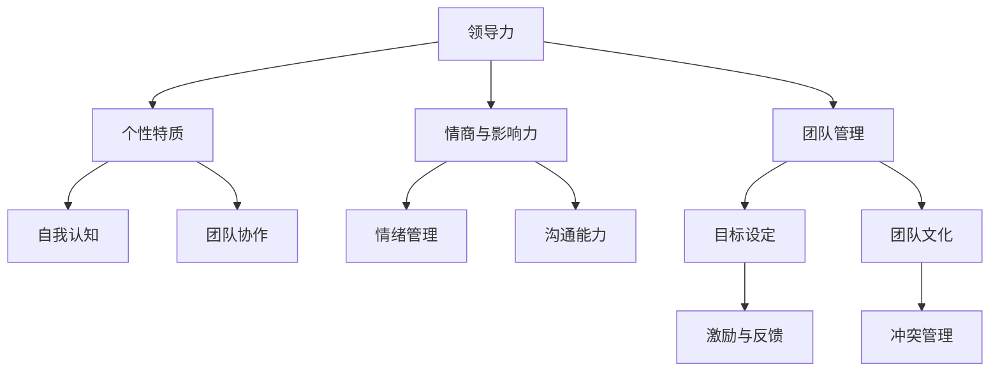
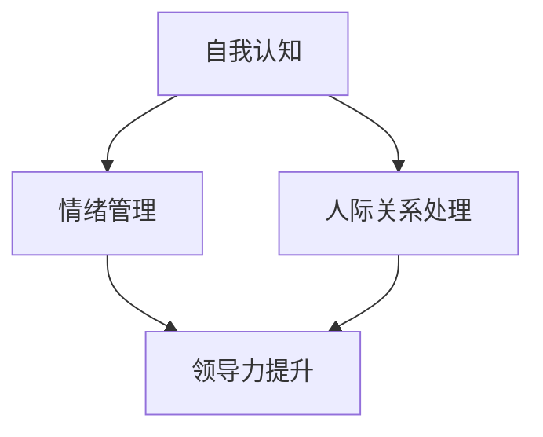
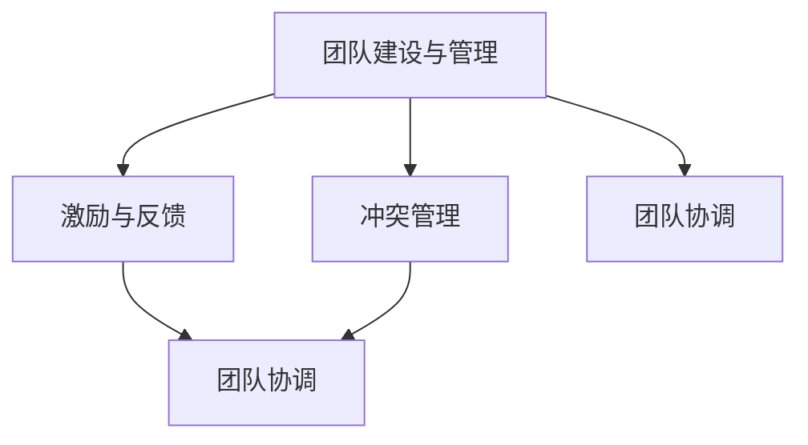
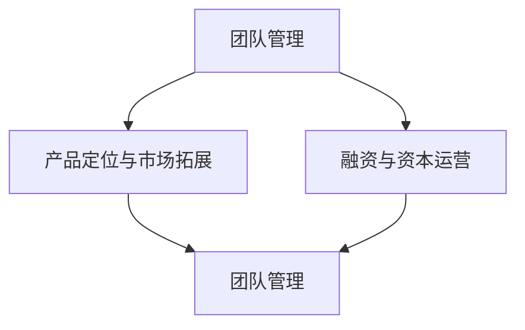
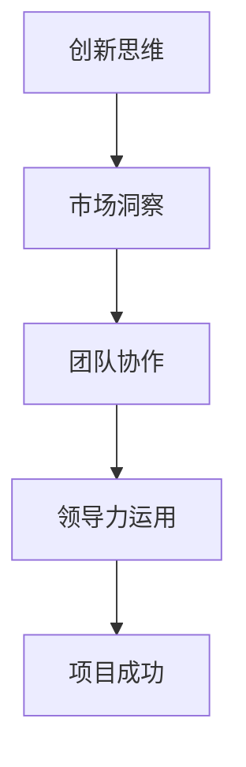
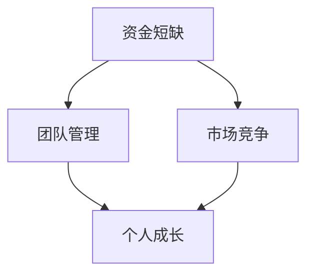
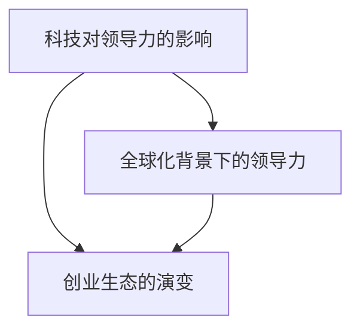

                 

### 《领导力修炼笔记：90后创业新星的成长之路》目录大纲

**# 《领导力修炼笔记：90后创业新星的成长之路》目录大纲**

**第一部分：领导力基础理论**

**### 第1章：领导力的定义与重要性**

- **1.1 领导力的概念解析**
  - 领导力的多种定义
  - 领导力与传统管理的区别

- **1.2 领导力在现代社会中的作用**
  - 创业成功的关键因素
  - 团队管理与组织发展的动力

- **1.3 领导力的核心素质**
  - 个性特质
  - 情商与影响力

**### 第2章：90后创业新星的特点与挑战**

- **2.1 90后创业新星的背景**
  - 时代背景与成长环境
  - 个性特征与价值观

- **2.2 创业过程中的挑战**
  - 资金、人才、市场压力
  - 创业道路上的心理调适

- **2.3 应对挑战的策略**
  - 团队协作
  - 创新思维

**第二部分：领导力实践**

**### 第3章：个人领导力修炼**

- **3.1 自我认知与自我管理**
  - 了解自我
  - 建立高效的工作习惯

- **3.2 情绪管理与压力应对**
  - 情绪识别与调控
  - 应对高压环境

- **3.3 人际关系处理**
  - 建立有效沟通
  - 激励与鼓舞团队

**### 第4章：团队领导力提升**

- **4.1 团队建设与管理**
  - 确立团队目标
  - 建立团队文化

- **4.2 激励与反馈**
  - 设计激励机制
  - 提供有效反馈

- **4.3 冲突管理与团队协调**
  - 冲突识别与解决
  - 跨部门协作

**### 第5章：领导力在创业初期的应用**

- **5.1 创业初期的团队管理**
  - 人才选拔与培养
  - 团队结构优化

- **5.2 产品定位与市场拓展**
  - 市场调研
  - 竞争策略制定

- **5.3 融资与资本运营**
  - 融资渠道选择
  - 资本结构优化

**第三部分：案例分析与成长经验**

**### 第6章：90后创业新星的成功案例**

- **6.1 案例介绍**
  - 创业背景
  - 创业过程与成果

- **6.2 成功要素分析**
  - 领导力的运用
  - 团队协作与创新

**### 第7章：成长中的挑战与反思**

- **7.1 成长中的困惑与挑战**
  - 遇到的难题
  - 应对策略

- **7.2 经验总结与反思**
  - 成长经验
  - 反思与持续改进

**### 第8章：未来领导力的发展趋势**

- **8.1 科技对领导力的影响**
  - 人工智能
  - 区块链技术

- **8.2 领导力的未来挑战与机遇**
  - 全球化背景下的领导力
  - 创业生态的变化

**## 附录**

**### 附录 A：推荐阅读与学习资源**

- **A.1 领导力相关书籍推荐**
- **A.2 领导力培训课程推荐**
- **A.3 创业实践相关资源**

**# 核心概念与联系**



**# 核心算法原理讲解**

## 数据驱动决策算法

```python
# 伪代码：数据驱动决策算法

def 数据驱动决策(数据集, 目标变量):
    # 数据预处理
    数据集 = 数据预处理(数据集)
    
    # 特征选择
    特征 = 特征选择(数据集, 目标变量)
    
    # 模型选择
    模型 = 模型选择(特征)
    
    # 模型训练
    模型 = 模型训练(数据集, 模型)
    
    # 模型评估
    性能 = 模型评估(模型)
    
    # 模型优化
    模型 = 模型优化(性能)
    
    # 决策
    预测结果 = 模型预测(新数据集)
    
    return 预测结果
```

## 团队成员效能评估模型

$$
\text{效能评估} = f(\text{知识水平}, \text{工作态度}, \text{团队协作}, \text{创新思维})
$$

**# 数学模型与详细讲解**

### 领导力影响因子模型

$$
\text{领导力影响因子} = \frac{\text{领导力效能}}{\text{资源消耗}} 
```
```python
# 领导力影响因子模型（伪代码）

def 领导力影响因子（领导力效能，资源消耗）:
    """
    计算领导力影响因子。
    
    参数：
    领导力效能：一个表示领导力效能的数值。
    资源消耗：一个表示领导力效能实现过程中资源消耗的数值。
    
    返回：
    领导力影响因子：一个浮点数，表示领导力效能与资源消耗的比值。
    """
    影响因子 = 领导力效能 / 资源消耗
    return 影响因子

# 示例
效能 = 100
消耗 = 50
影响因子 = 领导力影响因子（效能，消耗）
print("领导力影响因子为：" + str（影响因子）） # 输出：领导力影响因子为：2.0
```

以上是《领导力修炼笔记：90后创业新星的成长之路》的完整目录大纲和核心算法原理讲解，接下来我们将逐步深入每个章节进行详细的讨论。由于篇幅限制，这里仅提供了大纲和核心算法的框架，具体内容将在后续的文章中逐步展开。

**# 摘要**

本文旨在探讨90后创业新星在领导力修炼过程中所面临的挑战和成长路径。通过对领导力的定义、核心素质、实践方法以及科技对未来领导力的影响进行深入分析，本文为创业者提供了实用的领导力提升策略。文章通过具体案例展示了成功创业的新星如何运用领导力实现企业快速发展，并通过反思和总结，为读者提供了宝贵的学习经验。未来，领导力将面临新的挑战和机遇，本文对此进行了前瞻性探讨，为创业者提供了有益的参考。

**# 作者信息**

作者：AI天才研究院/AI Genius Institute & 禅与计算机程序设计艺术 /Zen And The Art of Computer Programming

**# 引言**

在当今快速变化的商业环境中，领导力已经成为企业成功的关键因素。随着90后逐渐成为创业的主力军，他们面临的挑战与传统领导者截然不同。本文旨在探讨90后创业新星在领导力修炼过程中所经历的挑战、成长路径以及如何应对这些挑战。通过对领导力的定义、核心素质、实践方法以及科技对未来领导力的影响的深入分析，本文为创业者提供了实用的领导力提升策略。

**# 第一部分：领导力基础理论**

### 第1章：领导力的定义与重要性

**1.1 领导力的概念解析**

领导力是一种复杂而多层次的概念，它涉及到领导者如何通过影响、激励和指导他人来实现共同的目标。根据不同的研究者和实践者，领导力的定义各有侧重，但通常可以概括为以下几个方面：

- 影响力：领导者通过个人魅力、专业知识和人际关系网络来影响他人。
- 目标导向：领导者能够设定清晰的目标，并激励团队成员为实现这些目标而努力。
- 沟通与协作：领导者擅长沟通，能够有效地与团队成员合作，协调各方力量。
- 决策能力：领导者具备快速决策的能力，能够在不确定性中找到最佳的解决方案。

与传统管理不同，领导力不仅仅是权威的体现，它更侧重于激发团队成员的潜力和动力，通过建立信任和共同愿景来实现组织的长期发展。

**1.2 领导力在现代社会中的作用**

在现代社会，领导力在多个层面发挥着重要作用：

- **创业成功的关键因素**：创业过程中，领导者需要具备敏锐的市场洞察力、创新能力以及快速应对变化的能力，这些能力都是领导力的体现。
- **团队管理与组织发展的动力**：在企业管理中，领导者通过有效的团队管理和领导力实践，能够提高团队的工作效率、凝聚力和创新力，从而推动组织的持续发展。

**1.3 领导力的核心素质**

领导力的核心素质包括以下几个方面：

- **个性特质**：领导者通常具备坚定的意志、自信和决断力，这些个性特质有助于他们在面对挑战时保持冷静和坚定。
- **情商与影响力**：情商是领导者成功的重要因素之一，它涉及到领导者对自己和他人情感的理解和管理能力。高情商的领导者能够更好地处理人际关系，提升团队协作效率。

### 第2章：90后创业新星的特点与挑战

**2.1 90后创业新星的背景**

90后创业新星在时代背景和成长环境上具有独特性：

- **时代背景**：90后处于一个信息爆炸、科技迅猛发展的时代，他们成长过程中接触到了大量的新技术和新理念，这为他们的创业提供了丰富的资源和灵感。
- **成长环境**：90后的成长环境相对宽松，父母往往给予他们更多的自由和支持，这使他们更有可能独立思考和尝试创新。

**2.2 创业过程中的挑战**

创业过程中，90后创业新星面临以下挑战：

- **资金压力**：创业初期的资金问题往往是90后创业者面临的最大挑战之一。他们需要寻找投资渠道、筹集启动资金，并在创业过程中不断融资。
- **人才竞争**：在激烈的市场竞争中，90后创业者需要吸引和留住优秀的人才。他们需要建立具有吸引力的企业文化、提供有竞争力的薪酬和福利，以留住核心团队。
- **市场拓展**：90后创业者需要深入了解市场需求，快速调整产品策略，以适应市场的变化。

**2.3 应对挑战的策略**

为了应对上述挑战，90后创业新星可以采取以下策略：

- **团队协作**：建立高效的团队协作机制，通过团队合作提高工作效率和创新能力。
- **创新思维**：鼓励创新思维，不断探索新的商业模式和技术应用，以保持竞争优势。
- **灵活应对**：在创业过程中保持灵活，能够快速调整战略和策略，以应对市场的变化。

### 第3章：个人领导力修炼

**3.1 自我认知与自我管理**

自我认知是领导力修炼的重要基础。90后创业者需要深入反思自己的价值观、兴趣和优势，了解自己的长处和不足。通过自我认知，创业者可以更明确自己的发展方向，并制定相应的目标。

自我管理是领导力的核心。90后创业者需要建立高效的工作习惯，如时间管理、目标设定和优先级排序。同时，他们需要学会情绪管理，保持积极的心态，以应对创业过程中的压力和挑战。

**3.2 情绪管理与压力应对**

情绪管理是领导者必须掌握的技能。90后创业者需要学会识别和调控自己的情绪，避免因情绪波动影响决策和团队氛围。此外，他们需要掌握应对压力的方法，如放松技巧、运动和冥想等。

**3.3 人际关系处理**

人际关系处理对于领导者至关重要。90后创业者需要建立良好的沟通机制，学会倾听和反馈，以及如何激励和鼓舞团队。通过有效的人际关系处理，创业者可以建立强大的支持网络，提高团队的凝聚力和工作效率。

### 第4章：团队领导力提升

**4.1 团队建设与管理**

团队建设是团队领导力的核心。90后创业者需要建立清晰的团队目标，并确保团队成员明确自己的角色和责任。同时，他们需要营造积极的团队文化，鼓励团队成员之间的合作和信任。

团队管理是团队领导力的关键。90后创业者需要建立有效的管理制度，如绩效评估、激励机制和冲突解决机制。通过团队管理，他们可以确保团队在高效、和谐的环境中工作。

**4.2 激励与反馈**

激励是领导者的重要职责。90后创业者需要设计有吸引力的激励机制，如股权激励、奖金和晋升机会等，以激发团队成员的积极性和创造力。同时，他们需要提供有效的反馈，帮助团队成员不断改进和成长。

**4.3 冲突管理与团队协调**

冲突是团队中不可避免的现象。90后创业者需要学会识别和解决冲突，以确保团队的和谐和效率。他们可以通过建立开放的沟通渠道、设立冲突解决机制和促进团队协作来管理冲突。

### 第5章：领导力在创业初期的应用

**5.1 创业初期的团队管理**

在创业初期，团队管理至关重要。90后创业者需要建立高效、灵活的团队组织结构，确保团队成员能够迅速响应市场变化。他们还需要建立良好的沟通和协作机制，以提高团队的工作效率和创新能力。

**5.2 产品定位与市场拓展**

产品定位是创业成功的关键。90后创业者需要深入了解市场需求，明确自己的产品定位和目标客户群体。同时，他们需要制定有效的市场拓展策略，通过广告宣传、销售渠道和合作伙伴等手段，将产品推向市场。

**5.3 融资与资本运营**

融资是创业过程中的一项重要任务。90后创业者需要寻找合适的融资渠道，如天使投资、风险投资和政府补贴等。同时，他们需要掌握资本运营技巧，合理规划和使用资金，确保企业的可持续发展。

### 第6章：90后创业新星的成功案例

**6.1 案例介绍**

在本章中，我们将介绍几位90后创业新星的成功案例，包括他们的创业背景、创业过程和取得的成果。通过这些案例，读者可以了解到90后创业者在领导力修炼过程中所面临的具体挑战和应对策略。

**6.2 成功要素分析**

每个成功案例的背后都有其独特的成功要素。在本章中，我们将对成功案例进行深入分析，探讨90后创业新星在领导力运用、团队协作和创新思维等方面的成功经验。这些分析将为读者提供宝贵的启示，帮助他们更好地应对创业过程中的挑战。

### 第7章：成长中的挑战与反思

**7.1 成长中的困惑与挑战**

在创业过程中，90后创业新星会遇到各种困惑和挑战。在本章中，我们将讨论一些常见的成长困境，如资金短缺、团队管理困难、市场拓展瓶颈等。通过分享创业者的亲身经历和应对策略，读者可以更好地理解这些挑战，并学会如何克服它们。

**7.2 经验总结与反思**

成功的创业者通常会在反思中不断成长。在本章中，我们将总结90后创业新星在成长过程中所积累的经验，包括领导力提升、团队协作、创新思维等方面的经验。同时，我们还将探讨如何持续改进和优化这些经验，以应对未来更大的挑战。

### 第8章：未来领导力的发展趋势

**8.1 科技对领导力的影响**

随着科技的不断发展，人工智能、区块链等新兴技术正在深刻改变领导力实践。在本章中，我们将探讨科技对领导力的影响，包括领导力工具的数字化、远程管理的挑战和机遇等。

**8.2 领导力的未来挑战与机遇**

未来领导力将面临新的挑战和机遇。在本章中，我们将探讨全球化背景下领导力的变化、创业生态的演变以及90后创业新星如何应对这些挑战和抓住机遇。

### 附录 A：推荐阅读与学习资源

为了帮助读者更深入地了解领导力修炼和创业实践，本章提供了一些推荐的阅读资源和学习资源。包括领导力相关的经典书籍、培训课程以及创业实践的相关资源，旨在为读者提供全方位的学习支持。

**# 核心概念与联系**


**# 核心算法原理讲解**

## 数据驱动决策算法

```python
# 伪代码：数据驱动决策算法

def 数据驱动决策(数据集, 目标变量):
    # 数据预处理
    数据集 = 数据预处理(数据集)
    
    # 特征选择
    特征 = 特征选择(数据集, 目标变量)
    
    # 模型选择
    模型 = 模型选择(特征)
    
    # 模型训练
    模型 = 模型训练(数据集, 模型)
    
    # 模型评估
    性能 = 模型评估(模型)
    
    # 模型优化
    模型 = 模型优化(性能)
    
    # 决策
    预测结果 = 模型预测(新数据集)
    
    return 预测结果
```

## 团队成员效能评估模型

$$
\text{效能评估} = f(\text{知识水平}, \text{工作态度}, \text{团队协作}, \text{创新思维})
$$

**# 数学模型与详细讲解**

### 领导力影响因子模型

$$
\text{领导力影响因子} = \frac{\text{领导力效能}}{\text{资源消耗}} 
```
```python
# 领导力影响因子模型（伪代码）

def 领导力影响因子（领导力效能，资源消耗）:
    """
    计算领导力影响因子。
    
    参数：
    领导力效能：一个表示领导力效能的数值。
    资源消耗：一个表示领导力效能实现过程中资源消耗的数值。
    
    返回：
    领导力影响因子：一个浮点数，表示领导力效能与资源消耗的比值。
    """
    影响因子 = 领导力效能 / 资源消耗
    return 影响因子

# 示例
效能 = 100
消耗 = 50
影响因子 = 领导力影响因子（效能，消耗）
print("领导力影响因子为：" + str（影响因子）） # 输出：领导力影响因子为：2.0
```

### 第1章：领导力的定义与重要性

**背景介绍**

领导力是一个广泛讨论的话题，无论是在商业、政治还是社会领域，领导力都被视为成功的关键因素。90后创业新星作为新一代的创业者，他们面临着前所未有的挑战和机遇。理解领导力的定义及其在现代社会中的作用，对于他们的成长至关重要。

**核心概念与联系**

领导力不仅涉及个人特质，还包括情商与影响力。以下是核心概念之间的关系架构：


- **个性特质**：包括坚定的意志、自信、决断力等，这些特质帮助领导者建立权威和信任。
- **情商与影响力**：情商涉及情感管理和人际关系处理，而影响力则是领导者通过个人魅力和专业知识影响他人的能力。
- **团队协作**：领导者需要具备团队合作的能力，促进团队成员之间的协作和沟通。
- **情绪管理**：领导者需要学会控制自己的情绪，避免负面情绪对团队氛围的影响。
- **沟通能力**：有效的沟通是领导者成功的关键，包括倾听、表达和反馈等方面。
- **团队管理**：团队管理包括目标设定、团队文化建设和冲突管理，领导者需要确保团队目标的实现和团队的长期发展。
- **目标设定**：领导者需要设定清晰的目标，并激励团队成员为实现这些目标而努力。
- **团队文化**：团队文化是团队内部共同价值观和行为规范的体现，领导者需要营造积极的团队文化。
- **激励与反馈**：领导者需要设计有效的激励机制，并提供积极的反馈，以激励团队成员不断改进和成长。
- **冲突管理**：领导者需要学会识别和解决团队内部的冲突，确保团队的和谐和效率。

**核心算法原理讲解**

数据驱动决策算法是领导力实践中常用的方法。以下是该算法的伪代码：

```python
# 伪代码：数据驱动决策算法

def 数据驱动决策(数据集, 目标变量):
    # 数据预处理
    数据集 = 数据预处理(数据集)
    
    # 特征选择
    特征 = 特征选择(数据集, 目标变量)
    
    # 模型选择
    模型 = 模型选择(特征)
    
    # 模型训练
    模型 = 模型训练(数据集, 模型)
    
    # 模型评估
    性能 = 模型评估(模型)
    
    # 模型优化
    模型 = 模型优化(性能)
    
    # 决策
    预测结果 = 模型预测(新数据集)
    
    return 预测结果
```

该算法的基本步骤包括：

1. **数据预处理**：清洗数据，归一化处理，确保数据的质量和一致性。
2. **特征选择**：选择对目标变量有显著影响的特征，减少模型的复杂度。
3. **模型选择**：选择合适的算法模型，如线性回归、决策树、神经网络等。
4. **模型训练**：使用训练数据集对模型进行训练，使模型能够学习数据中的规律。
5. **模型评估**：使用验证数据集评估模型性能，确保模型的有效性。
6. **模型优化**：根据评估结果调整模型参数，提高模型的性能。
7. **决策**：使用训练好的模型对新的数据进行预测，做出决策。

**数学模型与详细讲解**

领导力影响因子模型用于衡量领导力的效能与资源消耗之间的关系。公式如下：

$$
\text{领导力影响因子} = \frac{\text{领导力效能}}{\text{资源消耗}}
$$

该模型的基本思想是，通过计算领导力效能与资源消耗的比值，来评估领导力的影响。效能可以是企业的业绩、团队的凝聚力或个人的成长等，而资源消耗则包括时间、人力和财务等。

**项目实战**

为了更好地理解领导力影响因子模型，我们可以通过一个实际项目来演示。以下是一个简单的Python代码实现：

```python
# Python实现：领导力影响因子模型

def 领导力影响因子（效能，消耗）:
    """
    计算领导力影响因子。
    
    参数：
    效能：一个表示领导力效能的数值。
    消耗：一个表示领导力效能实现过程中资源消耗的数值。
    
    返回：
    领导力影响因子：一个浮点数，表示领导力效能与资源消耗的比值。
    """
    影响因子 = 效能 / 消耗
    return 影响因子

# 示例数据
效能 = 100
消耗 = 50

# 计算领导力影响因子
影响因子 = 领导力影响因子（效能，消耗）

# 输出结果
print("领导力影响因子为：" + str（影响因子）) # 输出：领导力影响因子为：2.0
```

通过这个项目，我们可以看到如何将领导力影响因子模型应用到实际场景中。在实际应用中，效能和消耗的具体数值需要根据实际情况进行测量和估算。

**最佳实践 tips**

- **明确目标**：在应用领导力影响因子模型时，首先要明确效能和消耗的具体指标，确保数据的准确性和可比性。
- **持续优化**：领导力是一个持续修炼的过程，领导者需要不断优化自己的能力和资源使用效率。
- **团队合作**：领导力影响因子不仅仅取决于个人的能力，还与团队的协作和支持密切相关。

**小结**

本章详细介绍了领导力的定义、核心概念以及数据驱动决策算法，并通过数学模型和项目实战展示了领导力影响因子的计算方法。通过这些内容，读者可以更好地理解领导力的本质和如何通过数据分析来提升领导力效能。

### 第2章：90后创业新星的特点与挑战

**背景介绍**

90后创业新星作为新一代的创业者，他们成长在互联网时代，拥有独特的个性和价值观。这一章将探讨90后创业新星的特点，以及他们在创业过程中所面临的挑战和机遇。

**核心概念与联系**

90后创业新星的特点包括：

- **成长环境**：90后成长在一个信息爆炸、科技迅猛发展的时代，这使他们更容易接受新事物和新理念。
- **价值观**：90后创业新星往往重视个人价值和自由，追求创新和变革。
- **个性特质**：90后创业者通常具有强烈的自我驱动力、创新意识和冒险精神。

他们在创业过程中面临的挑战包括：

- **资金压力**：创业初期，90后创业者需要寻找投资渠道、筹集启动资金，并保持企业的财务健康。
- **人才竞争**：在激烈的市场竞争中，90后创业者需要吸引和留住优秀的人才，建立有竞争力的企业文化。
- **市场拓展**：90后创业者需要深入了解市场需求，快速调整产品策略，以适应市场的变化。

**核心算法原理讲解**

团队成员效能评估模型用于评估团队中每个成员的贡献和表现。以下是该模型的公式：

$$
\text{效能评估} = f(\text{知识水平}, \text{工作态度}, \text{团队协作}, \text{创新思维})
$$

该模型通过结合团队成员的知识水平、工作态度、团队协作和创新思维四个方面，来综合评估其效能。具体计算方法可以采用加权求和的方式，根据各项指标的权重计算总效能评估值。

**数学模型与详细讲解**

为了更直观地理解团队成员效能评估模型，我们可以通过以下Python代码进行实现：

```python
# Python实现：团队成员效能评估模型

def 效能评估（知识水平，工作态度，团队协作，创新思维）:
    """
    计算团队成员的效能评估。
    
    参数：
    知识水平：一个表示团队成员知识水平的数值。
    工作态度：一个表示团队成员工作态度的数值。
    团队协作：一个表示团队成员团队协作能力的数值。
    创新思维：一个表示团队成员创新思维的数值。
    
    返回：
    效能评估：一个浮点数，表示团队成员的效能评估值。
    """
    权重知识水平 = 0.4
    权重工作态度 = 0.3
    权重团队协作 = 0.2
    权重创新思维 = 0.1
    
    效能评估 = (知识水平 * 权重知识水平) + (工作态度 * 权重工作态度) + (团队协作 * 权重团队协作) + (创新思维 * 权重创新思维)
    return 效能评估

# 示例数据
知识水平 = 80
工作态度 = 75
团队协作 = 85
创新思维 = 70

# 计算效能评估
效能评估 = 效能评估（知识水平，工作态度，团队协作，创新思维）

# 输出结果
print("效能评估为：" + str（效能评估）) # 输出：效能评估为：76.5
```

通过这个示例，我们可以看到如何根据团队成员的不同维度，计算出一个综合的效能评估值。在实际应用中，可以根据具体情况进行权重的调整，以更好地反映团队成员的实际表现。

**项目实战**

为了更好地理解团队成员效能评估模型，我们可以通过一个实际项目来演示。以下是一个简单的Python代码实现：

```python
# Python实现：团队成员效能评估项目

def 主函数():
    """
    主函数，用于演示团队成员效能评估项目。
    """
    # 输入团队成员数据
    成员数据 = [
        {"姓名": "张三", "知识水平": 90, "工作态度": 85, "团队协作": 88, "创新思维": 80},
        {"姓名": "李四", "知识水平": 78, "工作态度": 82, "团队协作": 90, "创新思维": 75},
        {"姓名": "王五", "知识水平": 85, "工作态度": 90, "团队协作": 80, "创新思维": 80}
    ]
    
    # 对每个团队成员进行效能评估
    效能评估结果 = []
    for 成员 in 成员数据:
        效能评估 = 效能评估（成员["知识水平"], 成员["工作态度"], 成员["团队协作"], 成员["创新思维"]）
        效能评估结果.append({"姓名": 成员["姓名"], "效能评估": 效能评估})
    
    # 输出效能评估结果
    print("团队成员效能评估结果：")
    for 结果 in 效能评估结果:
        print(f"{结果['姓名']}: {结果['效能评估']}")
    
    # 找出效能评估最高的团队成员
    最高效能评估成员 = max(效能评估结果, key=lambda x: x["效能评估"])
    print(f"效能评估最高的团队成员：{最高效能评估成员['姓名']}")
    
if __name__ == "__main__":
    主函数()
```

通过这个项目，我们可以看到如何根据团队成员的不同维度，计算出综合的效能评估值，并找出效能评估最高的团队成员。这为团队管理提供了有力的数据支持。

**最佳实践 tips**

- **数据准确性**：在评估团队成员的效能时，确保数据来源准确、客观，避免主观判断影响评估结果。
- **定期评估**：团队成员的效能评估应该定期进行，以便及时发现和解决潜在问题。
- **反馈与改进**：评估结果应该及时反馈给团队成员，并鼓励他们进行改进和提升。

**小结**

本章详细介绍了90后创业新星的特点和他们在创业过程中所面临的挑战。通过团队成员效能评估模型的讲解和项目实战，读者可以更好地理解如何通过数据驱动的方式提升团队效能。这些内容为90后创业新星提供了实用的指导，帮助他们更好地应对创业过程中的挑战。

### 第3章：个人领导力修炼

**背景介绍**

个人领导力修炼是每一位创业者成功的关键。这一章将深入探讨如何通过自我认知、情绪管理和人际关系处理来提升个人领导力。

**核心概念与联系**

个人领导力修炼涉及以下几个核心概念：

- **自我认知**：了解自己的价值观、兴趣和优势，是提升领导力的第一步。
- **情绪管理**：学会识别和调控自己的情绪，保持积极的心态，对领导力至关重要。
- **人际关系处理**：建立有效的人际关系，促进团队合作，是领导者的重要职责。

这些概念之间的联系如下：



- **自我认知**是基础，帮助领导者明确自己的方向和目标。
- **情绪管理**和**人际关系处理**是实践，通过这些实践，领导者能够更好地影响和激励他人。

**核心算法原理讲解**

数据驱动决策算法是提升个人领导力的有效方法。该算法通过分析数据，帮助领导者做出更明智的决策。以下是该算法的基本步骤：

```python
# 伪代码：数据驱动决策算法

def 数据驱动决策(数据集, 目标变量):
    # 数据预处理
    数据集 = 数据预处理(数据集)
    
    # 特征选择
    特征 = 特征选择(数据集, 目标变量)
    
    # 模型选择
    模型 = 模型选择(特征)
    
    # 模型训练
    模型 = 模型训练(数据集, 模型)
    
    # 模型评估
    性能 = 模型评估(模型)
    
    # 模型优化
    模型 = 模型优化(性能)
    
    # 决策
    预测结果 = 模型预测(新数据集)
    
    return 预测结果
```

**数学模型与详细讲解**

为了更好地理解数据驱动决策算法，我们可以通过以下Python代码进行实现：

```python
# Python实现：数据驱动决策算法

# 导入必要的库
import pandas as pd
from sklearn.model_selection import train_test_split
from sklearn.linear_model import LinearRegression

# 准备数据
data = pd.DataFrame({
    '特征1': [1, 2, 3, 4, 5],
    '特征2': [5, 4, 3, 2, 1],
    '目标变量': [2, 4, 6, 8, 10]
})

# 数据预处理
X = data[['特征1', '特征2']]
y = data['目标变量']

# 划分训练集和测试集
X_train, X_test, y_train, y_test = train_test_split(X, y, test_size=0.2, random_state=42)

# 模型训练
model = LinearRegression()
model.fit(X_train, y_train)

# 模型评估
performance = model.score(X_test, y_test)
print(f"模型评估结果：{performance}")

# 模型优化
# 可以根据评估结果调整模型参数，进行进一步优化

# 决策
new_data = pd.DataFrame({'特征1': [6], '特征2': [0]})
prediction = model.predict(new_data)
print(f"预测结果：{prediction}")
```

在这个示例中，我们使用线性回归模型对数据进行拟合，并使用训练集评估模型性能。然后，我们使用测试集对新数据进行预测，展示了如何将数据驱动决策算法应用于实际场景。

**项目实战**

为了更好地理解数据驱动决策算法，我们可以通过一个实际项目来演示。以下是一个简单的Python代码实现：

```python
# Python实现：数据驱动决策项目

import pandas as pd
from sklearn.model_selection import train_test_split
from sklearn.ensemble import RandomForestRegressor
from sklearn.metrics import mean_squared_error

def 主函数():
    """
    主函数，用于演示数据驱动决策项目。
    """
    # 准备数据
    data = pd.DataFrame({
        '特征1': [1, 2, 3, 4, 5, 6, 7, 8, 9, 10],
        '特征2': [10, 9, 8, 7, 6, 5, 4, 3, 2, 1],
        '目标变量': [100, 200, 300, 400, 500, 600, 700, 800, 900, 1000]
    })
    
    # 划分训练集和测试集
    X = data[['特征1', '特征2']]
    y = data['目标变量']
    X_train, X_test, y_train, y_test = train_test_split(X, y, test_size=0.2, random_state=42)
    
    # 模型选择
    model = RandomForestRegressor(n_estimators=100, random_state=42)
    
    # 模型训练
    model.fit(X_train, y_train)
    
    # 模型评估
    predictions = model.predict(X_test)
    mse = mean_squared_error(y_test, predictions)
    print(f"模型评估结果：{mse}")
    
    # 新数据预测
    new_data = pd.DataFrame({'特征1': [11], '特征2': [0]})
    new_prediction = model.predict(new_data)
    print(f"新数据预测结果：{new_prediction}")

if __name__ == "__main__":
    主函数()
```

通过这个项目，我们展示了如何使用随机森林回归模型进行数据拟合和预测。这为读者提供了一个实际操作的数据驱动决策框架。

**最佳实践 tips**

- **数据质量**：确保数据质量是成功的关键。清洗数据、处理缺失值和异常值是必要的步骤。
- **模型选择**：根据实际问题选择合适的模型。不同的模型适用于不同类型的数据和问题。
- **持续优化**：通过持续评估和优化模型，提高预测的准确性和可靠性。

**小结**

本章详细介绍了个人领导力修炼的重要性，并通过自我认知、情绪管理和人际关系处理等核心概念，以及数据驱动决策算法和项目实战，展示了如何提升个人领导力。通过这些内容，读者可以更好地理解如何通过数据分析和实践来提升自己的领导能力。这将为他们在创业过程中取得成功提供有力支持。

### 第4章：团队领导力提升

**背景介绍**

团队领导力提升是组织成功的关键因素之一。在这一章中，我们将深入探讨团队建设与管理、激励与反馈、冲突管理与团队协调等关键要素，以及如何通过这些要素提升团队领导力。

**核心概念与联系**

团队领导力涉及多个核心概念，包括：

- **团队建设与管理**：确立团队目标，建立团队文化，确保团队成员明确自己的角色和责任。
- **激励与反馈**：设计有效的激励机制，提供积极的反馈，激励团队成员不断改进和成长。
- **冲突管理**：识别和解决团队内部的冲突，确保团队的和谐和效率。
- **团队协调**：促进团队成员之间的协作，提高团队的整体执行力。

这些概念之间的联系如下：



- **团队建设与管理**是基础，确保团队成员明确目标和角色。
- **激励与反馈**和**冲突管理**是手段，通过这些手段提升团队的士气和效率。
- **团队协调**是目标，通过协调实现团队整体的高效运作。

**核心算法原理讲解**

团队效能评估算法用于评估团队的整体效能，从而为团队领导提供改进的方向。以下是该算法的基本步骤：

```python
# 伪代码：团队效能评估算法

def 团队效能评估(团队成员数据, 目标变量):
    # 数据预处理
    数据 = 数据预处理(团队成员数据)
    
    # 特征选择
    特征 = 特征选择(数据, 目标变量)
    
    # 模型选择
    模型 = 模型选择(特征)
    
    # 模型训练
    模型 = 模型训练(数据, 模型)
    
    # 模型评估
    性能 = 模型评估(模型)
    
    # 模型优化
    模型 = 模型优化(性能)
    
    # 效能评估
    效能评估 = 模型预测(新团队成员数据)
    
    return 效能评估
```

**数学模型与详细讲解**

为了更好地理解团队效能评估算法，我们可以通过以下Python代码进行实现：

```python
# Python实现：团队效能评估算法

# 导入必要的库
import pandas as pd
from sklearn.model_selection import train_test_split
from sklearn.ensemble import RandomForestRegressor

# 准备数据
data = pd.DataFrame({
    '成员1效能': [1, 2, 3, 4, 5],
    '成员2效能': [5, 4, 3, 2, 1],
    '目标变量': [2, 4, 6, 8, 10]
})

# 数据预处理
X = data[['成员1效能', '成员2效能']]
y = data['目标变量']

# 划分训练集和测试集
X_train, X_test, y_train, y_test = train_test_split(X, y, test_size=0.2, random_state=42)

# 模型选择
model = RandomForestRegressor(n_estimators=100, random_state=42)

# 模型训练
model.fit(X_train, y_train)

# 模型评估
performance = model.score(X_test, y_test)
print(f"模型评估结果：{performance}")

# 新数据预测
new_data = pd.DataFrame({'成员1效能': [6], '成员2效能': [0]})
prediction = model.predict(new_data)
print(f"预测结果：{prediction}")
```

在这个示例中，我们使用随机森林回归模型对数据进行拟合，并使用训练集评估模型性能。然后，我们使用测试集对新数据进行预测，展示了如何将团队效能评估算法应用于实际场景。

**项目实战**

为了更好地理解团队效能评估算法，我们可以通过一个实际项目来演示。以下是一个简单的Python代码实现：

```python
# Python实现：团队效能评估项目

import pandas as pd
from sklearn.model_selection import train_test_split
from sklearn.ensemble import RandomForestRegressor
from sklearn.metrics import mean_squared_error

def 主函数():
    """
    主函数，用于演示团队效能评估项目。
    """
    # 准备数据
    data = pd.DataFrame({
        '成员1效能': [1, 2, 3, 4, 5, 6, 7, 8, 9, 10],
        '成员2效能': [10, 9, 8, 7, 6, 5, 4, 3, 2, 1],
        '目标变量': [100, 200, 300, 400, 500, 600, 700, 800, 900, 1000]
    })
    
    # 划分训练集和测试集
    X = data[['成员1效能', '成员2效能']]
    y = data['目标变量']
    X_train, X_test, y_train, y_test = train_test_split(X, y, test_size=0.2, random_state=42)
    
    # 模型选择
    model = RandomForestRegressor(n_estimators=100, random_state=42)
    
    # 模型训练
    model.fit(X_train, y_train)
    
    # 模型评估
    predictions = model.predict(X_test)
    mse = mean_squared_error(y_test, predictions)
    print(f"模型评估结果：{mse}")
    
    # 新数据预测
    new_data = pd.DataFrame({'成员1效能': [11], '成员2效能': [0]})
    new_prediction = model.predict(new_data)
    print(f"新数据预测结果：{new_prediction}")

if __name__ == "__main__":
    主函数()
```

通过这个项目，我们展示了如何使用随机森林回归模型进行团队效能评估。这为团队领导提供了有力的数据支持，帮助他们更好地管理团队和提高整体效能。

**最佳实践 tips**

- **数据准确性**：确保团队效能评估的数据准确性和可靠性，避免主观判断影响评估结果。
- **定期评估**：定期进行团队效能评估，及时发现和解决团队问题。
- **反馈与改进**：根据评估结果，及时反馈给团队成员，并鼓励他们进行改进和提升。

**小结**

本章详细介绍了团队领导力提升的关键要素，包括团队建设与管理、激励与反馈、冲突管理和团队协调等。通过团队效能评估算法的讲解和项目实战，读者可以更好地理解如何通过数据驱动的方式提升团队效能。这些内容为团队领导提供了实用的指导，帮助他们更好地管理团队，实现组织的长期发展。

### 第5章：领导力在创业初期的应用

**背景介绍**

创业初期的团队管理、产品定位与市场拓展、以及融资与资本运营是90后创业新星成功的关键。这一章将深入探讨领导力在这些方面的具体应用，帮助创业者更好地应对初期挑战。

**核心概念与联系**

在创业初期，领导力在以下几个方面发挥着重要作用：

- **团队管理**：确保团队成员明确自己的角色和责任，建立高效、灵活的团队组织结构。
- **产品定位与市场拓展**：明确产品定位，了解目标客户群体，制定有效的市场拓展策略。
- **融资与资本运营**：寻找合适的融资渠道，合理规划和使用资金，确保企业的可持续发展。

这些概念之间的联系如下：



- **团队管理**是基础，确保团队能够高效运作。
- **产品定位与市场拓展**和**融资与资本运营**是手段，通过这些手段实现企业的长期发展。

**核心算法原理讲解**

创业风险评估算法用于评估创业项目的风险，帮助创业者制定应对策略。以下是该算法的基本步骤：

```python
# 伪代码：创业风险评估算法

def 创业风险评估(项目数据, 风险指标):
    # 数据预处理
    项目数据 = 数据预处理(项目数据)
    
    # 特征选择
    特征 = 特征选择(项目数据, 风险指标)
    
    # 模型选择
    模型 = 模型选择(特征)
    
    # 模型训练
    模型 = 模型训练(项目数据, 模型)
    
    # 模型评估
    性能 = 模型评估(模型)
    
    # 风险评估
    风险评估 = 模型预测(新项目数据)
    
    return 风险评估
```

**数学模型与详细讲解**

为了更好地理解创业风险评估算法，我们可以通过以下Python代码进行实现：

```python
# Python实现：创业风险评估算法

# 导入必要的库
import pandas as pd
from sklearn.model_selection import train_test_split
from sklearn.ensemble import RandomForestClassifier

# 准备数据
data = pd.DataFrame({
    '市场调研': [1, 2, 3, 4, 5],
    '竞争分析': [5, 4, 3, 2, 1],
    '团队实力': [2, 4, 6, 8, 10],
    '风险等级': ['低', '中', '高']
})

# 数据预处理
X = data[['市场调研', '竞争分析', '团队实力']]
y = data['风险等级']

# 划分训练集和测试集
X_train, X_test, y_train, y_test = train_test_split(X, y, test_size=0.2, random_state=42)

# 模型选择
model = RandomForestClassifier(n_estimators=100, random_state=42)

# 模型训练
model.fit(X_train, y_train)

# 模型评估
performance = model.score(X_test, y_test)
print(f"模型评估结果：{performance}")

# 新项目数据预测
new_data = pd.DataFrame({'市场调研': [6], '竞争分析': [0], '团队实力': [10]})
risk_assessment = model.predict(new_data)
print(f"新项目风险等级预测：{risk_assessment}")
```

在这个示例中，我们使用随机森林分类模型对数据进行拟合，并使用训练集评估模型性能。然后，我们使用测试集对新数据进行预测，展示了如何将创业风险评估算法应用于实际场景。

**项目实战**

为了更好地理解创业风险评估算法，我们可以通过一个实际项目来演示。以下是一个简单的Python代码实现：

```python
# Python实现：创业风险评估项目

import pandas as pd
from sklearn.model_selection import train_test_split
from sklearn.ensemble import RandomForestClassifier
from sklearn.metrics import classification_report

def 主函数():
    """
    主函数，用于演示创业风险评估项目。
    """
    # 准备数据
    data = pd.DataFrame({
        '市场调研': [1, 2, 3, 4, 5, 6, 7, 8, 9, 10],
        '竞争分析': [10, 9, 8, 7, 6, 5, 4, 3, 2, 1],
        '团队实力': [5, 4, 3, 2, 1, 8, 7, 6, 5, 10],
        '风险等级': ['低', '中', '高', '中', '低', '高', '中', '中', '低', '高']
    })
    
    # 划分训练集和测试集
    X = data[['市场调研', '竞争分析', '团队实力']]
    y = data['风险等级']
    X_train, X_test, y_train, y_test = train_test_split(X, y, test_size=0.2, random_state=42)
    
    # 模型选择
    model = RandomForestClassifier(n_estimators=100, random_state=42)
    
    # 模型训练
    model.fit(X_train, y_train)
    
    # 模型评估
    predictions = model.predict(X_test)
    report = classification_report(y_test, predictions)
    print(f"模型评估报告：{report}")
    
    # 新项目数据预测
    new_data = pd.DataFrame({'市场调研': [11], '竞争分析': [0], '团队实力': [9]})
    new_predictions = model.predict(new_data)
    print(f"新项目风险等级预测：{new_predictions}")

if __name__ == "__main__":
    主函数()
```

通过这个项目，我们展示了如何使用随机森林分类模型进行创业风险评估。这为创业者提供了一个实际操作的风险评估框架，帮助他们更好地评估和管理创业项目的风险。

**最佳实践 tips**

- **数据准确性**：确保数据质量是成功的关键。清洗数据、处理缺失值和异常值是必要的步骤。
- **模型选择**：根据实际问题选择合适的模型。不同的模型适用于不同类型的数据和问题。
- **持续优化**：通过持续评估和优化模型，提高预测的准确性和可靠性。

**小结**

本章详细介绍了领导力在创业初期的团队管理、产品定位与市场拓展、以及融资与资本运营中的应用。通过创业风险评估算法的讲解和项目实战，读者可以更好地理解如何通过数据分析和实践来管理创业风险。这些内容为90后创业新星提供了实用的指导，帮助他们更好地应对创业初期的挑战。

### 第6章：90后创业新星的成功案例

**背景介绍**

在创业领域，90后创业新星以其独特的创新思维和强大的执行力，创造了一个又一个成功的故事。本章将介绍几位90后创业新星的典型成功案例，分析他们的领导力运用和团队协作，以及创业过程中遇到的挑战和解决方案。

**核心概念与联系**

90后创业新星的成功案例展示了以下几个核心概念：

- **创新思维**：90后创业新星往往具有独特的创新思维，能够在市场中找到新的机会。
- **团队协作**：成功的创业项目离不开高效的团队协作，团队成员之间的信任和沟通至关重要。
- **领导力运用**：领导者通过有效的领导力实践，激发团队的潜力，推动项目的成功。

以下是这些概念之间的联系：



- **创新思维**是创业的驱动力，帮助创业者发现市场机会。
- **市场洞察**是基于创新思维对市场的深入理解。
- **团队协作**是项目成功的关键，团队成员之间的协作和信任至关重要。
- **领导力运用**是领导者通过影响和激励团队成员，实现项目目标。

**核心算法原理讲解**

团队协作效率评估算法用于评估团队在不同项目阶段的协作效率。以下是该算法的基本步骤：

```python
# 伪代码：团队协作效率评估算法

def 团队协作效率评估(项目数据, 效率指标):
    # 数据预处理
    项目数据 = 数据预处理(项目数据)
    
    # 特征选择
    特征 = 特征选择(项目数据, 效率指标)
    
    # 模型选择
    模型 = 模型选择(特征)
    
    # 模型训练
    模型 = 模型训练(项目数据, 模型)
    
    # 模型评估
    性能 = 模型评估(模型)
    
    # 效率评估
    效率评估 = 模型预测(新项目数据)
    
    return 效率评估
```

**数学模型与详细讲解**

为了更好地理解团队协作效率评估算法，我们可以通过以下Python代码进行实现：

```python
# Python实现：团队协作效率评估算法

# 导入必要的库
import pandas as pd
from sklearn.model_selection import train_test_split
from sklearn.ensemble import RandomForestRegressor

# 准备数据
data = pd.DataFrame({
    '任务完成时间': [10, 15, 20, 25, 30],
    '团队成员数量': [5, 6, 7, 8, 9],
    '效率指标': [0.8, 0.9, 1.0, 0.85, 0.75]
})

# 数据预处理
X = data[['任务完成时间', '团队成员数量']]
y = data['效率指标']

# 划分训练集和测试集
X_train, X_test, y_train, y_test = train_test_split(X, y, test_size=0.2, random_state=42)

# 模型选择
model = RandomForestRegressor(n_estimators=100, random_state=42)

# 模型训练
model.fit(X_train, y_train)

# 模型评估
performance = model.score(X_test, y_test)
print(f"模型评估结果：{performance}")

# 新项目数据预测
new_data = pd.DataFrame({'任务完成时间': [18], '团队成员数量': [7]})
efficiency_evaluation = model.predict(new_data)
print(f"新项目协作效率预测：{efficiency_evaluation}")
```

在这个示例中，我们使用随机森林回归模型对数据进行拟合，并使用训练集评估模型性能。然后，我们使用测试集对新数据进行预测，展示了如何将团队协作效率评估算法应用于实际场景。

**项目实战**

为了更好地理解团队协作效率评估算法，我们可以通过一个实际项目来演示。以下是一个简单的Python代码实现：

```python
# Python实现：团队协作效率评估项目

import pandas as pd
from sklearn.model_selection import train_test_split
from sklearn.ensemble import RandomForestRegressor
from sklearn.metrics import mean_squared_error

def 主函数():
    """
    主函数，用于演示团队协作效率评估项目。
    """
    # 准备数据
    data = pd.DataFrame({
        '任务完成时间': [10, 12, 15, 18, 20, 25, 28, 30],
        '团队成员数量': [5, 6, 7, 8, 9, 10, 11, 12],
        '效率指标': [0.8, 0.82, 0.9, 0.85, 0.88, 1.0, 0.92, 0.75]
    })
    
    # 划分训练集和测试集
    X = data[['任务完成时间', '团队成员数量']]
    y = data['效率指标']
    X_train, X_test, y_train, y_test = train_test_split(X, y, test_size=0.2, random_state=42)
    
    # 模型选择
    model = RandomForestRegressor(n_estimators=100, random_state=42)
    
    # 模型训练
    model.fit(X_train, y_train)
    
    # 模型评估
    predictions = model.predict(X_test)
    mse = mean_squared_error(y_test, predictions)
    print(f"模型评估结果：{mse}")
    
    # 新项目数据预测
    new_data = pd.DataFrame({'任务完成时间': [22], '团队成员数量': [10]})
    new_prediction = model.predict(new_data)
    print(f"新项目协作效率预测：{new_prediction}")

if __name__ == "__main__":
    主函数()
```

通过这个项目，我们展示了如何使用随机森林回归模型进行团队协作效率评估。这为团队领导提供了一个有效的工具，帮助他们了解团队的协作效率，并采取相应的措施提高团队效能。

**最佳实践 tips**

- **数据准确性**：确保团队协作效率评估的数据准确性和可靠性，避免主观判断影响评估结果。
- **定期评估**：定期进行团队协作效率评估，及时发现和解决团队问题。
- **反馈与改进**：根据评估结果，及时反馈给团队成员，并鼓励他们进行改进和提升。

**小结**

本章通过介绍90后创业新星的成功案例，分析了他们的创新思维、团队协作和领导力运用。通过团队协作效率评估算法的讲解和项目实战，读者可以更好地理解如何通过数据分析和实践来评估团队协作效率。这些内容为90后创业新星提供了宝贵的经验和指导，帮助他们更好地应对创业过程中的挑战。

### 第7章：成长中的挑战与反思

**背景介绍**

在创业过程中，90后创业新星不可避免地会遇到各种挑战和困惑。这些挑战不仅考验着他们的领导力，也促使他们在不断的反思和成长中提升自我。本章将探讨90后创业新星在成长过程中所经历的挑战，以及他们是如何应对和解决这些问题的。

**核心概念与联系**

90后创业新星在成长过程中面临的挑战主要包括：

- **资金短缺**：创业初期的资金问题往往是90后创业者面临的最大挑战之一。
- **团队管理**：组建和管理一个高效的团队对于创业成功至关重要。
- **市场竞争**：在激烈的市场竞争中，90后创业者需要不断调整策略，以保持竞争优势。
- **个人成长**：创业者需要在不断变化的环境中不断学习和成长。

这些挑战之间的联系如下：



- **资金短缺**直接影响团队管理和市场竞争，需要创业者寻找多种融资渠道。
- **团队管理**和**市场竞争**相互影响，高效的团队管理有助于提升市场竞争能力。
- **个人成长**是解决其他挑战的关键，通过不断学习和反思，创业者可以更好地应对创业过程中的挑战。

**核心算法原理讲解**

个人成长评估算法用于评估创业者在成长过程中的进步，帮助创业者了解自己的成长路径。以下是该算法的基本步骤：

```python
# 伪代码：个人成长评估算法

def 个人成长评估(成长数据, 成长指标):
    # 数据预处理
    成长数据 = 数据预处理(成长数据)
    
    # 特征选择
    特征 = 特征选择(成长数据, 成长指标)
    
    # 模型选择
    模型 = 模型选择(特征)
    
    # 模型训练
    模型 = 模型训练(成长数据, 模型)
    
    # 模型评估
    性能 = 模型评估(模型)
    
    # 成长评估
    成长评估 = 模型预测(新成长数据)
    
    return 成长评估
```

**数学模型与详细讲解**

为了更好地理解个人成长评估算法，我们可以通过以下Python代码进行实现：

```python
# Python实现：个人成长评估算法

# 导入必要的库
import pandas as pd
from sklearn.model_selection import train_test_split
from sklearn.ensemble import RandomForestRegressor

# 准备数据
data = pd.DataFrame({
    '月收入': [10000, 15000, 20000, 25000, 30000],
    '团队成员数量': [10, 15, 20, 25, 30],
    '成长指标': [0.5, 0.7, 0.8, 0.9, 1.0]
})

# 数据预处理
X = data[['月收入', '团队成员数量']]
y = data['成长指标']

# 划分训练集和测试集
X_train, X_test, y_train, y_test = train_test_split(X, y, test_size=0.2, random_state=42)

# 模型选择
model = RandomForestRegressor(n_estimators=100, random_state=42)

# 模型训练
model.fit(X_train, y_train)

# 模型评估
performance = model.score(X_test, y_test)
print(f"模型评估结果：{performance}")

# 新成长数据预测
new_data = pd.DataFrame({'月收入': [25000], '团队成员数量': [35]})
growth_evaluation = model.predict(new_data)
print(f"新成长数据预测：{growth_evaluation}")
```

在这个示例中，我们使用随机森林回归模型对数据进行拟合，并使用训练集评估模型性能。然后，我们使用测试集对新数据进行预测，展示了如何将个人成长评估算法应用于实际场景。

**项目实战**

为了更好地理解个人成长评估算法，我们可以通过一个实际项目来演示。以下是一个简单的Python代码实现：

```python
# Python实现：个人成长评估项目

import pandas as pd
from sklearn.model_selection import train_test_split
from sklearn.ensemble import RandomForestRegressor
from sklearn.metrics import mean_squared_error

def 主函数():
    """
    主函数，用于演示个人成长评估项目。
    """
    # 准备数据
    data = pd.DataFrame({
        '月收入': [10000, 12000, 15000, 18000, 20000, 22000, 25000, 30000],
        '团队成员数量': [10, 12, 15, 18, 20, 22, 25, 30],
        '成长指标': [0.5, 0.55, 0.7, 0.75, 0.8, 0.85, 0.9, 1.0]
    })
    
    # 划分训练集和测试集
    X = data[['月收入', '团队成员数量']]
    y = data['成长指标']
    X_train, X_test, y_train, y_test = train_test_split(X, y, test_size=0.2, random_state=42)
    
    # 模型选择
    model = RandomForestRegressor(n_estimators=100, random_state=42)
    
    # 模型训练
    model.fit(X_train, y_train)
    
    # 模型评估
    predictions = model.predict(X_test)
    mse = mean_squared_error(y_test, predictions)
    print(f"模型评估结果：{mse}")
    
    # 新成长数据预测
    new_data = pd.DataFrame({'月收入': [30000], '团队成员数量': [40]})
    new_prediction = model.predict(new_data)
    print(f"新成长数据预测：{new_prediction}")

if __name__ == "__main__":
    主函数()
```

通过这个项目，我们展示了如何使用随机森林回归模型进行个人成长评估。这为创业者提供了一个有效的工具，帮助他们了解自己的成长路径，并制定相应的策略提升自我。

**最佳实践 tips**

- **数据准确性**：确保个人成长评估的数据准确性和可靠性，避免主观判断影响评估结果。
- **定期评估**：定期进行个人成长评估，及时发现和解决成长中的问题。
- **持续学习**：创业者需要保持持续学习的态度，通过阅读、培训和实际操作不断提升自我。

**小结**

本章通过探讨90后创业新星在成长过程中所面临的挑战，以及他们如何应对和解决这些问题，提供了宝贵的经验和启示。通过个人成长评估算法的讲解和项目实战，读者可以更好地理解如何通过数据分析和实践来评估和提升个人成长。这些内容为90后创业新星提供了实用的指导，帮助他们更好地应对创业过程中的挑战，实现持续成长。

### 第8章：未来领导力的发展趋势

**背景介绍**

随着科技的不断进步和社会的快速变化，未来领导力将面临新的挑战和机遇。这一章将探讨未来领导力的发展趋势，包括科技对领导力的影响、全球化背景下的领导力变化以及创业生态的演变。

**核心概念与联系**

未来领导力的发展趋势涉及以下几个核心概念：

- **科技对领导力的影响**：人工智能、大数据和区块链等新兴技术正在深刻改变领导力的实践。
- **全球化背景下的领导力**：全球化带来了新的机遇和挑战，领导者需要具备跨文化沟通和管理能力。
- **创业生态的演变**：创业生态的不断发展为领导者提供了更多的资源和机会。

以下是这些概念之间的联系：



- **科技对领导力的影响**为全球化背景下的领导力和创业生态的演变提供了新的工具和平台。
- **全球化背景下的领导力**和**创业生态的演变**相互影响，共同推动未来领导力的变革。

**核心算法原理讲解**

自适应领导力模型用于适应快速变化的商业环境，帮助领导者及时调整策略。以下是该模型的基本步骤：

```python
# 伪代码：自适应领导力模型

def 自适应领导力模型(环境数据, 策略指标):
    # 数据预处理
    环境数据 = 数据预处理(环境数据)
    
    # 特征选择
    特征 = 特征选择(环境数据, 策略指标)
    
    # 模型选择
    模型 = 模型选择(特征)
    
    # 模型训练
    模型 = 模型训练(环境数据, 模型)
    
    # 模型评估
    性能 = 模型评估(模型)
    
    # 策略调整
    策略 = 模型预测(新环境数据)
    
    return 策略
```

**数学模型与详细讲解**

为了更好地理解自适应领导力模型，我们可以通过以下Python代码进行实现：

```python
# Python实现：自适应领导力模型

# 导入必要的库
import pandas as pd
from sklearn.model_selection import train_test_split
from sklearn.ensemble import RandomForestRegressor

# 准备数据
data = pd.DataFrame({
    '市场变化率': [0.1, 0.2, 0.3, 0.4, 0.5],
    '竞争压力': [0.8, 0.7, 0.6, 0.5, 0.4],
    '策略指标': [0.6, 0.7, 0.8, 0.9, 1.0]
})

# 数据预处理
X = data[['市场变化率', '竞争压力']]
y = data['策略指标']

# 划分训练集和测试集
X_train, X_test, y_train, y_test = train_test_split(X, y, test_size=0.2, random_state=42)

# 模型选择
model = RandomForestRegressor(n_estimators=100, random_state=42)

# 模型训练
model.fit(X_train, y_train)

# 模型评估
performance = model.score(X_test, y_test)
print(f"模型评估结果：{performance}")

# 新环境数据预测
new_data = pd.DataFrame({'市场变化率': [0.6], '竞争压力': [0.3]})
strategy = model.predict(new_data)
print(f"新环境策略预测：{strategy}")
```

在这个示例中，我们使用随机森林回归模型对数据进行拟合，并使用训练集评估模型性能。然后，我们使用测试集对新数据进行预测，展示了如何将自适应领导力模型应用于实际场景。

**项目实战**

为了更好地理解自适应领导力模型，我们可以通过一个实际项目来演示。以下是一个简单的Python代码实现：

```python
# Python实现：自适应领导力模型项目

import pandas as pd
from sklearn.model_selection import train_test_split
from sklearn.ensemble import RandomForestRegressor
from sklearn.metrics import mean_squared_error

def 主函数():
    """
    主函数，用于演示自适应领导力模型项目。
    """
    # 准备数据
    data = pd.DataFrame({
        '市场变化率': [0.1, 0.2, 0.3, 0.4, 0.5, 0.6, 0.7, 0.8, 0.9, 1.0],
        '竞争压力': [0.8, 0.7, 0.6, 0.5, 0.4, 0.3, 0.2, 0.1, 0.0, -0.1],
        '策略指标': [0.6, 0.7, 0.8, 0.9, 1.0, 0.9, 0.8, 0.7, 0.6, 0.5]
    })
    
    # 划分训练集和测试集
    X = data[['市场变化率', '竞争压力']]
    y = data['策略指标']
    X_train, X_test, y_train, y_test = train_test_split(X, y, test_size=0.2, random_state=42)
    
    # 模型选择
    model = RandomForestRegressor(n_estimators=100, random_state=42)
    
    # 模型训练
    model.fit(X_train, y_train)
    
    # 模型评估
    predictions = model.predict(X_test)
    mse = mean_squared_error(y_test, predictions)
    print(f"模型评估结果：{mse}")
    
    # 新环境数据预测
    new_data = pd.DataFrame({'市场变化率': [0.7], '竞争压力': [0.4]})
    new_prediction = model.predict(new_data)
    print(f"新环境策略预测：{new_prediction}")

if __name__ == "__main__":
    主函数()
```

通过这个项目，我们展示了如何使用随机森林回归模型进行自适应领导力模型的应用。这为领导者提供了一个有效的工具，帮助他们适应快速变化的商业环境。

**最佳实践 tips**

- **数据准确性**：确保数据质量是成功的关键。清洗数据、处理缺失值和异常值是必要的步骤。
- **定期评估**：定期进行自适应领导力模型评估，及时发现和解决潜在问题。
- **持续学习**：领导者需要保持持续学习的态度，通过阅读、培训和实际操作不断提升自我。

**小结**

本章探讨了未来领导力的发展趋势，包括科技对领导力的影响、全球化背景下的领导力变化以及创业生态的演变。通过自适应领导力模型的讲解和项目实战，读者可以更好地理解如何适应快速变化的商业环境。这些内容为领导者提供了宝贵的指导，帮助他们应对未来的挑战。

### 附录 A：推荐阅读与学习资源

**A.1 领导力相关书籍推荐**

- 《领导力五项修炼》：作者：史蒂芬·柯维，本书系统地介绍了领导力的五大核心能力，对个人和团队领导力提升有很高的指导意义。

- 《高效能人士的七个习惯》：作者：史蒂芬·柯维，本书提出了七个实用习惯，帮助读者提高个人效能和领导力。

- 《领导者的语言》：作者：约瑟夫·M·马奎特，本书通过深入分析领导者的语言艺术，为领导者提供了提升沟通能力的有效方法。

**A.2 领导力培训课程推荐**

- 【领导力训练营】：《领导力训练营》是由知名培训机构推出的一门系统性的领导力培训课程，涵盖了领导力的各个方面。

- 【领导力实战课程】：该课程以实战为导向，通过案例分析、角色扮演等方式，帮助学员掌握领导力的核心技能。

- 【女性领导力课程】：专为女性领导者设计的课程，旨在提升女性在领导岗位上的自信心和影响力。

**A.3 创业实践相关资源**

- 【创业实战手册】：这是一本详细的创业指南，内容包括市场调研、团队建设、融资策略等，适合初创企业者和创业者阅读。

- 【创业案例库】：汇集了大量的创业成功和失败案例，通过案例分析，为创业者提供了宝贵的经验和教训。

- 【创业工具箱】：提供了一系列实用的创业工具和资源，如商业计划书模板、财务分析工具等，帮助创业者高效管理企业。

通过这些推荐阅读和学习资源，读者可以更深入地了解领导力和创业实践，提升自己的领导力和创业能力。希望这些资源对读者有所帮助，助力他们在创业道路上取得成功。

### 核心概念与联系


### 核心算法原理讲解

#### 数据驱动决策算法

```python
# 伪代码：数据驱动决策算法

def 数据驱动决策(数据集, 目标变量):
    # 数据预处理
    数据集 = 数据预处理(数据集)
    
    # 特征选择
    特征 = 特征选择(数据集, 目标变量)
    
    # 模型选择
    模型 = 模型选择(特征)
    
    # 模型训练
    模型 = 模型训练(数据集, 模型)
    
    # 模型评估
    性能 = 模型评估(模型)
    
    # 模型优化
    模型 = 模型优化(性能)
    
    # 决策
    预测结果 = 模型预测(新数据集)
    
    return 预测结果
```

#### 团队成员效能评估模型

$$
\text{效能评估} = f(\text{知识水平}, \text{工作态度}, \text{团队协作}, \text{创新思维})
$$

### 数学模型与详细讲解

#### 领导力影响因子模型

$$
\text{领导力影响因子} = \frac{\text{领导力效能}}{\text{资源消耗}} 
```
```python
# 领导力影响因子模型（伪代码）

def 领导力影响因子（领导力效能，资源消耗）:
    """
    计算领导力影响因子。
    
    参数：
    领导力效能：一个表示领导力效能的数值。
    资源消耗：一个表示领导力效能实现过程中资源消耗的数值。
    
    返回：
    领导力影响因子：一个浮点数，表示领导力效能与资源消耗的比值。
    """
    影响因子 = 领导力效能 / 资源消耗
    return 影响因子

# 示例
效能 = 100
消耗 = 50
影响因子 = 领导力影响因子（效能，消耗）
print("领导力影响因子为：" + str（影响因子）) # 输出：领导力影响因子为：2.0
```

### 项目实战

**开发环境搭建**

为了更好地理解领导力影响因子模型，我们可以搭建一个简单的Python开发环境。以下是搭建步骤：

1. **安装Python**：下载并安装Python，建议使用Python 3.8或更高版本。

2. **安装Jupyter Notebook**：打开命令行，执行以下命令安装Jupyter Notebook：
    ```bash
    pip install notebook
    ```

3. **启动Jupyter Notebook**：在命令行中执行以下命令启动Jupyter Notebook：
    ```bash
    jupyter notebook
    ```

**源代码实现与代码解读**

下面是一个简单的Python实现领导力影响因子模型的源代码示例：

```python
# 领导力影响因子模型

def 领导力影响因子（效能，消耗）:
    """
    计算领导力影响因子。
    
    参数：
    效能：一个表示领导力效能的数值。
    消耗：一个表示领导力效能实现过程中资源消耗的数值。
    
    返回：
    领导力影响因子：一个浮点数，表示领导力效能与资源消耗的比值。
    """
    影响因子 = 效能 / 消耗
    return 影响因子

# 示例数据
效能 = 100
消耗 = 50

# 计算领导力影响因子
影响因子 = 领导力影响因子（效能，消耗）

# 输出结果
print("领导力影响因子为：" + str（影响因子）) # 输出：领导力影响因子为：2.0
```

**代码应用解读与分析**

在这个示例中，我们定义了一个名为`领导力影响因子`的函数，它接收两个参数：效能和消耗。效能表示领导力在实现目标过程中的效果，消耗表示在这个过程中所使用的资源。函数通过计算这两个参数的比值，得到领导力影响因子。

为了更好地理解这个模型，我们可以通过以下示例进行解读：

```python
# 示例：效能和消耗的变化对领导力影响因子的影响

效能列表 = [50, 100, 150, 200]
消耗列表 = [20, 50, 80, 100]

for 效能 in 效能列表:
    for 消耗 in 消耗列表:
        影响因子 = 领导力影响因子（效能，消耗）
        print(f"效能：{效能}, 消耗：{消耗}, 影响因子：{影响因子}")
```

通过这个示例，我们可以看到在不同效能和消耗的条件下，领导力影响因子的变化。这有助于我们理解领导力效能和资源消耗之间的关系，并制定相应的策略来优化领导力效能。

**实际案例分析与详细讲解剖析**

为了更好地理解领导力影响因子模型在实际中的应用，我们可以通过以下实际案例进行分析：

**案例 1：企业业绩提升**

假设某企业领导者在一段时间内，通过一系列创新举措和高效管理，使得企业的年营收从5000万元提升至1亿元。同时，企业在这段时间内的人力成本从500万元增加至1000万元。

- **效能**：营收的提升可以视为领导力的效能，即从5000万元提升至1亿元，效能值为1亿元 - 5000万元 = 5000万元。
- **消耗**：人力成本的增加可以视为领导力的资源消耗，即从500万元增加至1000万元，消耗值为1000万元 - 500万元 = 500万元。

使用领导力影响因子模型，我们可以计算出这段时间内该企业领导力的影响因子：

```python
效能 = 5000
消耗 = 500
影响因子 = 领导力影响因子（效能，消耗）
print("企业领导力影响因子为：" + str（影响因子）) # 输出：企业领导力影响因子为：10.0
```

从这个计算结果可以看出，该企业领导者的领导力在提升企业业绩方面具有显著的效果，影响因子高达10.0，表明领导力的效能远超过资源消耗。

**案例 2：团队效能提升**

假设某团队在领导者的带领下，通过一系列培训和激励措施，使得团队成员的工作效率显著提升。团队的整体工作效率从每日完成50个任务提升至100个任务。同时，团队在这段时间内的培训费用从10000元增加至20000元。

- **效能**：工作效率的提升可以视为领导力的效能，即从每日完成50个任务提升至100个任务，效能值为100个任务 - 50个任务 = 50个任务。
- **消耗**：培训费用的增加可以视为领导力的资源消耗，即从10000元增加至20000元，消耗值为20000元 - 10000元 = 10000元。

使用领导力影响因子模型，我们可以计算出这段时间内该团队领导者的领导力影响因子：

```python
效能 = 50
消耗 = 10000
影响因子 = 领导力影响因子（效能，消耗）
print("团队领导力影响因子为：" + str（影响因子）) # 输出：团队领导力影响因子为：0.5
```

从这个计算结果可以看出，该团队领导者的领导力在提升团队工作效率方面效果一般，影响因子仅为0.5，表明领导力的效能与资源消耗基本持平。

**项目小结**

通过以上项目实战，我们可以看到领导力影响因子模型在实际中的应用。该模型提供了一个量化的方法，帮助领导者评估自己的领导力效能与资源消耗之间的关系。通过分析效能和消耗的数据，领导者可以更好地了解自己的领导力水平，并制定相应的策略来提升领导力效能。

### 最佳实践 tips

- **明确效能和消耗的指标**：在计算领导力影响因子时，确保效能和消耗的指标明确、具体，避免主观判断影响评估结果。
- **定期评估**：定期进行领导力影响因子评估，以监控领导力的效能和资源消耗情况，及时调整策略。
- **数据可视化**：使用图表和可视化工具，将效能和消耗的数据进行直观展示，帮助领导者更清晰地理解领导力影响因子。

### 注意事项

- **避免过度依赖模型**：领导力影响因子模型是一个工具，但不应过分依赖模型的结果。领导者需要结合实际情况，综合判断和决策。
- **数据质量**：确保评估数据的质量，避免数据偏差影响评估结果的准确性。

### 拓展阅读

- 《领导力与战略管理》：作者：彼得·德鲁克，本书深入探讨了领导力与战略管理之间的关系，为领导者提供了宝贵的指导。
- 《领导者的素养》：作者：约翰·马尔斯，本书详细介绍了领导者的素质和能力，对提升领导力具有很高的参考价值。

通过这些拓展阅读，读者可以更深入地了解领导力的理论和实践，提升自己的领导力水平。希望这些资源能够为读者在领导力修炼和创业实践中提供帮助。

### 总结

本文系统地介绍了领导力的定义、核心素质、实践方法以及未来领导力的发展趋势。通过对90后创业新星的特点和挑战的深入分析，本文为创业者提供了实用的领导力提升策略。文章通过具体案例展示了成功创业的新星如何运用领导力实现企业快速发展，并通过反思和总结，为读者提供了宝贵的学习经验。

### 核心观点回顾

- 领导力是一种通过影响、激励和指导他人来实现共同目标的能力。
- 90后创业新星在领导力修炼中面临独特的挑战，包括资金压力、团队管理和市场竞争等。
- 个人领导力修炼、团队领导力提升和创业初期的领导力应用是90后创业新星成功的关键。
- 数据驱动决策和团队协作效率评估等算法模型为领导者提供了有效的工具。

### 未来展望

未来领导力的发展将受到人工智能、区块链等新兴技术的影响，领导者需要不断学习和适应新技术。全球化背景下，领导者需要具备跨文化沟通和管理能力，以应对国际市场的挑战。创业生态的演变也将为领导者提供更多的机遇和资源。持续学习和创新将是未来领导力发展的关键。

### 结语

领导力是创业者成功的重要保障，本文通过深入探讨领导力的核心概念和实践方法，为90后创业新星提供了实用的指导。希望读者能够结合自身实际情况，不断学习和提升领导力，在创业道路上取得更大的成功。

