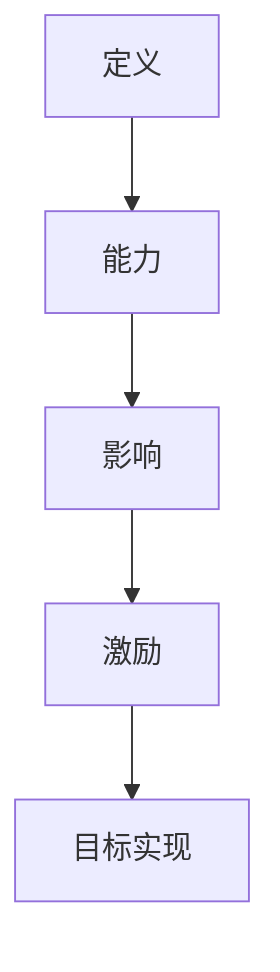
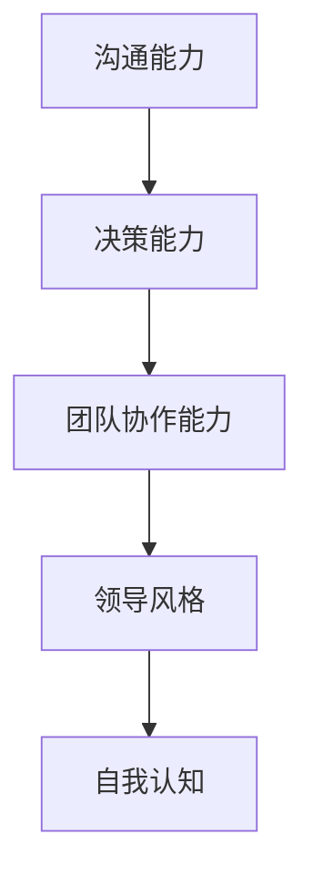
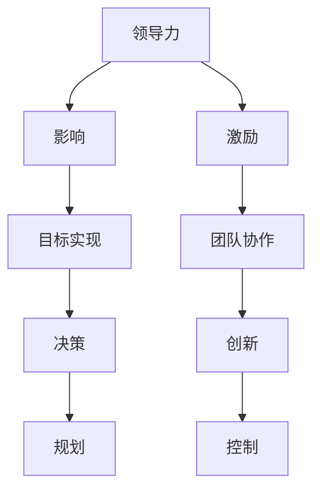
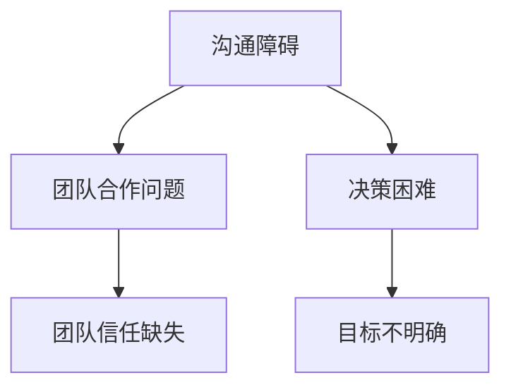

                 

## 《领导力修炼笔记：90后小工的逆袭之路》

### 关键词：
- 领导力
- 90后
- 逆袭
- 职场成长
- 领导力模型

> 领导力不仅是一种管理技能，更是一种人生哲学。本文将通过深入剖析90后小工的逆袭之路，展示领导力在职场中的重要性及其应用。

### 摘要：
本文旨在探讨90后小工在职场中通过领导力修炼实现逆袭的过程。通过分析领导力的核心概念与原理，探讨90后小工面临的独特挑战，以及如何通过实战案例实现领导力的提升，本文将帮助读者理解领导力在个人职业发展中的关键作用。

---

### 第一部分：领导力的基础

#### 第1章：领导力的基本概念

**1.1 领导力的定义**

领导力，简单来说，是一种影响和激励他人去实现共同目标的能力。它不仅仅是管理者的专利，每个人都拥有领导力。在技术领域，领导力体现在能够带领团队解决问题、推动创新和实现目标。

**核心概念与联系：**

为了更好地理解领导力，我们可以用Mermaid流程图展示其核心概念与联系：

**1.2 领导力的要素**

领导力包含多个要素，如沟通能力、决策能力、团队协作能力等。以下是一个简单的Mermaid流程图，展示了这些要素之间的关系：

**1.3 领导力与管理的区别**

领导力与管理是两个不同的概念。领导力关注的是激励和影响他人，而管理则是通过规划和控制实现组织目标。以下是一个Mermaid流程图，展示了领导力与管理的区别：

#### 第2章：领导力的发展阶段

**2.1 初级领导力：新手阶段**

初级领导力主要关注基础管理技能和团队协作。在这一阶段，领导者的目标是建立团队信任和基础沟通。

**2.2 中级领导力：成长阶段**

中级领导力侧重于战略规划和决策能力。领导者需要能够在复杂环境中做出明智的决策，并制定有效的行动计划。

**2.3 高级领导力：成熟阶段**

高级领导力强调领导者的远见和影响力。他们能够通过愿景和价值观引领团队，实现组织的长期目标。

### 第二部分：90后小工的领导力修炼

#### 第3章：90后小工的独特挑战

**3.1 90后的成长环境**

90后成长于信息爆炸的时代，他们拥有更加开放和多元化的思维。然而，这也使得他们在职场中面临更大的挑战，如职业选择的不确定性和快速变化的工作环境。

**3.2 90后在职场中的心理特质**

90后更加注重自我实现和追求个性化。他们在职场中追求自由、平等和尊重，这为领导力培养提供了新的契机。

**3.3 90后面临的领导力挑战**

90后在领导力培养上面临的主要挑战包括沟通障碍、团队合作问题和决策困难。以下是一个Mermaid流程图，展示了这些挑战：

#### 第4章：领导力修炼实战

**4.1 自我认知与自我提升**

自我认知是领导力修炼的基础。通过自我反思和持续学习，90后小工可以不断提升自己的能力和素质。

**4.2 团队领导与沟通技巧**

团队领导力是90后小工需要重点修炼的领域。有效的沟通技巧能够帮助领导者建立团队信任，提高团队效率。

**4.3 目标管理与执行能力**

目标管理是领导力的核心。90后小工需要学会如何设定明确的目标，并制定有效的执行计划。

### 第5章：逆袭之路的案例解析

**5.1 案例一：从基层员工到部门经理的逆袭**

本案例将分析一位90后小工如何在短时间内通过领导力修炼实现职业晋升。

**5.2 案例二：从初创公司到行业领导者的逆袭**

本案例将探讨一家初创公司如何通过领导力引领行业变革。

**5.3 案例三：跨行业转型与领导力成长**

本案例将分析一位90后小工如何通过跨行业转型实现领导力提升。

### 第三部分：领导力在职场中的实际应用

#### 第6章：领导力在项目管理与团队协作中的应用

**6.1 项目管理的基本原理**

项目管理是领导力的重要应用领域。本文将介绍项目管理的基本原理，如项目计划、进度控制和风险管理。

**6.2 团队协作中的领导力**

团队协作是项目成功的关键。本文将探讨领导力在团队协作中的具体应用，如冲突解决、团队激励和沟通技巧。

**6.3 项目成功的领导力要素**

项目成功离不开有效的领导力。本文将分析项目成功的领导力要素，如团队凝聚力、创新能力和应变能力。

#### 第7章：领导力在创新与变革中的角色

**7.1 创新的领导力要素**

创新是企业发展的重要驱动力。本文将探讨领导力在创新中的关键要素，如开放思维、团队协作和风险承担。

**7.2 变革中的领导力挑战**

变革是组织发展不可避免的过程。本文将分析领导力在变革中的挑战，如文化适应、员工激励和决策难度。

**7.3 变革领导力的实践方法**

有效的变革领导力能够推动组织成功转型。本文将介绍变革领导力的实践方法，如变革管理、组织发展和领导力培养。

### 结语与展望

**领导力的未来发展趋势**

随着数字化时代的到来，领导力也在不断演变。本文将探讨领导力的未来发展趋势，如数字化领导力、人工智能领导力和全球领导力。

**结语**

领导力是90后小工在职场中实现逆袭的关键。通过不断修炼领导力，90后小工可以引领团队，实现个人和组织的共同成长。

---

**作者：AI天才研究院/AI Genius Institute & 禅与计算机程序设计艺术 /Zen And The Art of Computer Programming**

---

### 最佳实践 Tips

1. **自我认知**：定期进行自我反思，了解自己的优势和不足，有助于持续提升领导力。

2. **团队建设**：建立一个信任和合作的团队，是领导力的核心。关注团队成员的发展和需求，提高团队凝聚力。

3. **持续学习**：领导力是一个持续的过程。不断学习新的知识和技能，有助于保持竞争力。

4. **创新思维**：鼓励创新和尝试，帮助团队适应快速变化的环境。

5. **目标明确**：设定清晰的目标，制定可行的执行计划，有助于提高工作效率。

### 小结

本文通过对领导力的深入剖析，展示了90后小工在职场中通过领导力修炼实现逆袭的可能性和方法。领导力不仅是一种管理技能，更是一种生活态度。希望本文能对读者有所启发，助力他们在职场中取得成功。

### 注意事项

1. 领导力培养需要时间和持续的努力，不要期望一蹴而就。

2. 不同情境下，领导力的应用方法会有所不同，需根据实际情况灵活调整。

3. 领导力不仅仅是管理技能，更是一种对团队和人性的深刻理解。

### 拓展阅读

1. 《领导力的五项修炼》 - 史蒂芬·柯维
2. 《团队领导的艺术》 - 约翰·麦克斯韦
3. 《数字化领导力》 - 丹娜·左哈尔

---

通过以上内容，本文全面系统地介绍了领导力的基本概念、发展阶段，以及90后小工在职场中通过领导力修炼实现逆袭的方法和案例。希望读者能够在阅读本文后，对领导力有更深入的理解，并在实际工作中能够灵活应用，实现个人和团队的共同成长。

