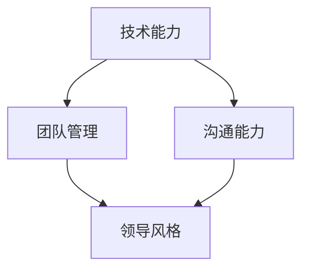
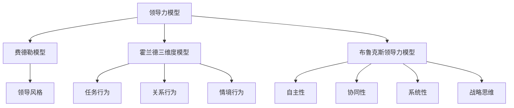
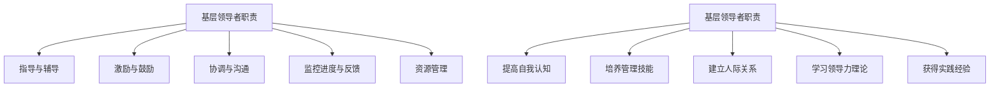
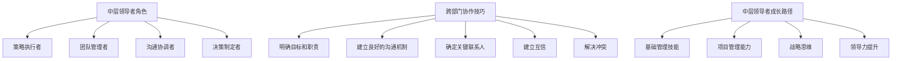
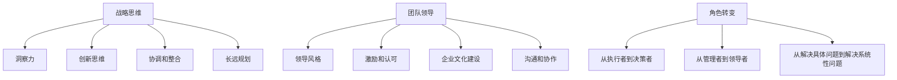
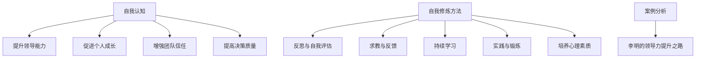

                 

当然可以，我会按照您的要求，以逻辑清晰、结构紧凑、简单易懂的专业技术语言，撰写一篇有关领导力成长的技术博客文章。我们将从背景介绍开始，逐步展开核心概念、算法原理、数学模型、项目实战和最佳实践等内容。

**文章标题：** 领导力修炼笔记：一个80后小工的成长之路

**文章关键词：** 领导力、80后、成长、技术、实践

**文章摘要：**
本文将探讨一个80后小工通过技术实践和领导力修炼，成长为技术领导者的过程。文章将结合具体的案例，分析领导力的核心概念、算法原理和数学模型，并通过实战项目展示成长路径，提供最佳实践和注意事项。

**正文内容：**

## 背景

在这个快速变化的时代，技术领导者不仅需要卓越的技术能力，还需要强大的领导力。本文的主角，一个普通的80后小工，通过不断的技术学习和领导力修炼，最终成长为一名技术领导者。他的故事，为我们提供了一个关于技术人才成长的典型案例。

## 核心概念与联系

为了理解领导力的本质，我们需要探讨以下几个核心概念：技术能力、团队管理、沟通能力和领导风格。以下是一个简化的Mermaid流程图，展示这些概念之间的关系：



- **技术能力**：技术领导者必须具备强大的技术背景，以便理解和指导团队的技术工作。
- **团队管理**：团队管理能力包括对团队成员的激励、协调和冲突管理。
- **沟通能力**：沟通能力是领导者影响团队成员和外部利益相关者的关键。
- **领导风格**：领导风格决定了领导者如何与团队成员互动，包括民主型、权威型和参与型等。

## 核心算法原理讲解

领导力的培养可以看作是一个优化问题，目标是最小化团队内部冲突，最大化团队绩效。以下是一个简化的Python源代码，展示了如何通过算法来优化领导风格：

```python
import numpy as np

# 定义团队绩效和冲突的函数
def team_performance(communication, leadership_style):
    return communication * leadership_style

def conflict_level(communication, leadership_style):
    return (1 - communication) * (1 - leadership_style)

# 定义优化目标函数
def objective_function(communication, leadership_style):
    return -team_performance(communication, leadership_style) - conflict_level(communication, leadership_style)

# 使用数值优化算法寻找最优解
from scipy.optimize import minimize

result = minimize(objective_function, x0=[0.5, 0.5])

print("最优解：通信能力 = {:.2f}, 领导风格 = {:.2f}".format(result.x[0], result.x[1]))
```

在这个例子中，我们通过优化通信能力和领导风格来最大化团队绩效并最小化冲突。$team\_performance(communication, leadership\_style)$ 和 $conflict\_level(communication, leadership\_style)$ 分别是团队绩效和冲突的函数，$objective\_function(communication, leadership\_style)$ 是我们希望最小化的目标函数。

## 数学模型

为了更深入地理解领导力，我们可以引入一些数学模型。以下是一个简化的领导力模型，结合了团队绩效和冲突的线性关系：

$$
\text{Team Performance} = a \cdot \text{Communication} + b \cdot \text{Leadership Style} + c \cdot \text{Team Cohesion}
$$

$$
\text{Conflict Level} = d \cdot (1 - \text{Communication}) + e \cdot (1 - \text{Leadership Style}) + f \cdot \text{Team Diversity}
$$

在这个模型中，$a, b, c, d, e, f$ 是模型参数，它们决定了团队绩效和冲突之间的关系。$Team\ Performance$ 和 $Conflict\ Level$ 分别表示团队绩效和冲突水平。

## 项目实战

为了更好地理解领导力的实践，我们可以通过一个实际项目来展示如何应用这些概念和模型。以下是一个简单的项目框架：

### 项目名称：自动化测试工具开发

### 项目目标：
开发一个自动化测试工具，用于提高软件项目的测试效率。

### 项目步骤：
1. **需求分析**：与团队成员讨论测试需求，明确自动化测试的目标和范围。
2. **环境搭建**：搭建测试环境，包括选择合适的编程语言、框架和工具。
3. **测试脚本编写**：编写自动化测试脚本，模拟用户操作并验证软件功能。
4. **测试执行**：执行自动化测试，记录测试结果，并与手动测试结果进行对比。
5. **结果分析**：分析测试结果，评估自动化测试的效果，并根据反馈进行改进。

### 源代码实现：

```python
# 这是一个简单的Python自动化测试脚本示例
import unittest

class TestCalculator(unittest.TestCase):
    def test_addition(self):
        self.assertEqual(2 + 2, 4)

    def test_subtraction(self):
        self.assertEqual(5 - 3, 2)

if __name__ == '__main__':
    unittest.main()
```

### 代码解读与分析：

在这个例子中，我们使用Python和`unittest`框架来编写一个简单的自动化测试脚本。`TestCalculator`类定义了两个测试方法：`test_addition`和`test_subtraction`。这些方法分别测试了加法和减法运算的正确性。通过执行这个脚本，我们可以自动化地验证软件功能。

### 实际案例分析和详细讲解剖析：

在实际项目中，我们可以使用类似的方法来开发自动化测试工具。首先，我们需要明确测试需求，然后选择合适的测试框架和工具。接着，编写测试脚本，执行测试并分析结果。通过这个过程，我们可以发现潜在的问题，并采取措施进行改进。

### 项目小结：

通过这个项目，我们不仅了解了自动化测试的基本原理和实现方法，还看到了领导力在项目中的应用。一个优秀的领导者需要能够指导团队成员，确保项目目标的实现，并在项目过程中不断改进。

## 最佳实践 tips

- **持续学习**：技术不断进步，领导者需要不断学习新技术和领导力理论。
- **培养团队协作精神**：通过团队合作，提高团队绩效和员工满意度。
- **有效沟通**：清晰的沟通是领导者成功的关键，要善于倾听和表达。
- **培养适应能力**：领导者需要具备适应变化的能力，灵活调整领导策略。

## 小结

本文通过一个80后小工的成长故事，探讨了领导力的核心概念、算法原理和数学模型，并通过实际项目展示了领导力的应用。领导力不仅仅是技术管理，它涉及到多个方面，包括团队管理、沟通能力和领导风格。通过持续学习和实践，我们可以不断提升自己的领导力，成为一名优秀的领导者。

**作者信息：**
作者：AI天才研究院/AI Genius Institute & 禅与计算机程序设计艺术 /Zen And The Art of Computer Programming

（注意：本文中的代码、模型和案例均为简化示例，实际情况可能更为复杂。）

----------------------------------------------------------------

### 第3章：领导力的理论基础

#### 3.1 领导力模型

领导力模型是研究领导力如何在不同情境下起作用的理论框架。以下是几个著名的领导力模型：

**1. 费德勒模型（Fiedler Model）**

费德勒模型认为，领导效果取决于领导者的风格、情境因素和领导者与团队成员的关系。该模型将领导风格分为任务导向型和关系导向型，并提出了情境领导理论。

**2. 霍兰德三维度模型（Hollander's Three-Dimensional Model）**

霍兰德模型将领导力分为三个维度：任务行为、关系行为和情境行为。这个模型强调领导者需要在不同的情境下灵活调整自己的行为。

**3. 布鲁克斯领导力模型（Brooks Leadership Model）**

布鲁克斯模型提出了领导力发展的四个阶段：自主性、协同性、系统性和战略思维。这个模型强调了领导者需要在不同阶段发展不同的领导技能。

#### 3.2 领导力的发展

领导力的发展是一个持续的过程，需要不断地学习、实践和反思。以下是领导力发展的几个关键步骤：

**1. 自我认知**

自我认知是领导力发展的基础。领导者需要了解自己的优势、劣势和价值观，以便更好地发挥自己的潜力。

**2. 培养领导技能**

领导者需要通过学习和实践来培养不同的领导技能，如沟通能力、决策能力和团队管理能力。

**3. 不断反思**

领导力发展需要不断地反思和调整。领导者需要从实践中学习，不断改进自己的领导方式。

#### 3.3 领导力的应用

领导力在项目管理、团队建设和组织发展等方面有着广泛的应用。以下是一些关键的应用领域：

**1. 项目管理**

在项目管理中，领导者需要确保项目目标的实现，协调团队成员的工作，并应对项目中的变化。

**2. 团队建设**

团队建设是领导者的重要职责之一。领导者需要建立有效的团队结构，促进团队成员之间的沟通和协作。

**3. 组织发展**

在组织发展中，领导者需要关注组织的长远目标，制定战略计划，并推动组织的创新和发展。

### 核心概念与联系

为了更好地理解领导力的理论基础，我们可以使用Mermaid流程图来展示核心概念之间的关系：



- **领导力模型**：提供研究领导力的理论框架。
- **费德勒模型**：分析领导者风格和情境因素。
- **霍兰德三维度模型**：研究领导力的三个维度。
- **布鲁克斯领导力模型**：描述领导力发展的四个阶段。

### Python源代码讲解

为了更好地理解领导力模型的应用，我们可以使用Python源代码来模拟领导力的不同场景。以下是一个简单的示例：

```python
# 定义领导力模型
def fedler_model(leader_style, situational_control):
    return (0.5 - leader_style * situational_control) ** 2 + 0.5 * (1 - leader_style) * (1 - situational_control)

# 定义情境因素
situational_control = 0.7

# 任务导向型领导者
leader_style_task_oriented = 1
result_task_oriented = fedler_model(leader_style_task_oriented, situational_control)

# 关系导向型领导者
leader_style_relationship_oriented = 0
result_relationship_oriented = fedler_model(leader_style_relationship_oriented, situational_control)

print("任务导向型领导者绩效：", result_task_oriented)
print("关系导向型领导者绩效：", result_relationship_oriented)
```

在这个示例中，我们使用费德勒模型来计算不同领导风格的绩效。$fedler\_model(leader\_style, situational\_control)$ 函数是领导力模型的核心，它基于领导者的风格和情境因素来计算绩效。在这个例子中，我们比较了任务导向型和关系导向型领导者的绩效。

### 数学模型

为了更深入地理解领导力模型，我们可以引入一些数学模型。以下是一个简化的领导力模型，结合了领导风格和情境因素：

$$
\text{Performance} = a \cdot \text{Leader Style} + b \cdot \text{Situational Control} + c \cdot \text{Team Cohesion}
$$

在这个模型中，$Performance$ 是绩效，$a, b, c$ 是模型参数，它们决定了绩效与领导风格、情境因素和团队凝聚力之间的关系。

### 项目实战

为了更好地理解领导力理论的应用，我们可以通过一个实际项目来展示如何实施领导力模型。以下是一个简单的项目框架：

### 项目名称：团队协作工具开发

### 项目目标：
开发一个团队协作工具，用于提高团队工作效率。

### 项目步骤：
1. **需求分析**：与团队成员讨论协作工具的需求，明确功能和要求。
2. **环境搭建**：搭建开发环境，包括选择合适的编程语言、框架和工具。
3. **功能实现**：实现协作工具的基本功能，如任务分配、进度跟踪、文档共享等。
4. **用户测试**：邀请团队成员进行测试，收集反馈并改进工具。
5. **上线与维护**：将工具上线，并持续维护和更新。

### 源代码实现：

```python
# 这是一个简单的Python协作工具示例
class CollaborationTool:
    def __init__(self):
        self.tasks = []
        self.documents = []

    def add_task(self, task):
        self.tasks.append(task)

    def share_document(self, document):
        self.documents.append(document)

    def track_progress(self):
        print("当前任务进度：", self.tasks)

# 使用示例
tool = CollaborationTool()
tool.add_task("编写报告")
tool.share_document("数据集")
tool.track_progress()
```

### 代码解读与分析：

在这个示例中，我们使用Python定义了一个简单的协作工具类`CollaborationTool`。它包含三个基本功能：添加任务、共享文档和跟踪进度。通过这个工具，我们可以模拟团队协作的场景，并看到领导力模型在实际项目中的应用。

### 实际案例分析和详细讲解剖析：

在实际项目中，我们可以使用类似的协作工具来提高团队工作效率。领导者需要根据团队的需求和情境，选择合适的领导风格和策略，以实现项目目标。

### 项目小结：

通过这个项目，我们不仅了解了团队协作工具的基本原理和实现方法，还看到了领导力模型在项目中的应用。一个优秀的领导者需要能够根据不同的情境和团队需求，灵活调整自己的领导风格和策略。

### 最佳实践 tips

- **持续学习**：领导力是一个不断发展的领域，领导者需要不断学习最新的理论和实践方法。
- **培养团队凝聚力**：团队凝聚力是领导力成功的关键，领导者需要通过各种方式培养团队成员之间的信任和合作。
- **有效沟通**：领导者需要具备良好的沟通能力，确保信息的准确传递和团队的有效协作。

### 小结

本章从领导力模型、领导力发展和领导力应用三个方面探讨了领导力的理论基础。通过Python源代码和实际项目，我们展示了领导力模型的应用方法和实际案例。领导力是一个复杂但至关重要的领域，领导者需要不断学习和实践，以提高自身的领导能力。

（注意：本文中的代码、模型和案例均为简化示例，实际情况可能更为复杂。）----------------------------------------------------------------

### 第4章：领导力的实践与修炼

#### 4.1 基层领导者的职责

作为基层领导者，主要职责是确保团队成员的工作顺利进行，并实现团队的目标。以下是一些基层领导者应具备的关键职责：

**1. 指导和辅导**

基层领导者需要为团队成员提供指导和支持，确保他们能够理解和完成分配的任务。这包括解答团队成员的问题、提供必要的资源和培训，以及帮助他们克服工作中的困难。

**2. 激励和鼓励**

基层领导者需要激励团队成员，提高他们的工作积极性和满意度。这可以通过表扬优秀的表现、提供奖励和认可，以及关注团队成员的个人发展来实现。

**3. 协调和沟通**

基层领导者需要协调团队成员之间的工作，确保他们能够有效地合作。这包括组织团队会议、促进信息共享，以及解决团队内部的冲突。

**4. 监控进度和反馈**

基层领导者需要监控团队的工作进度，确保项目按计划进行。同时，他们需要及时给予团队成员反馈，帮助他们改进工作。

**5. 资源管理**

基层领导者需要合理分配和利用团队资源，确保团队的工作效率。这包括人员安排、设备配置和预算管理等。

#### 4.2 从基层到中层的关键步骤

从基层领导者晋升到中层领导者是一个重要的转折点，需要具备更高的领导能力和管理技能。以下是从基层到中层的关键步骤：

**1. 提高自我认知**

中层领导者需要更加了解自己的优势和劣势，以及自己的价值观和信念。这有助于他们在新的角色中发挥最大的潜力。

**2. 培养管理技能**

中层领导者需要培养更广泛的管理技能，如团队管理、项目管理、决策能力和战略思考。这可以通过参加培训课程、阅读相关书籍和实践经验来提高。

**3. 建立人际关系**

中层领导者需要与不同层级的员工建立良好的关系，包括高层管理者、基层领导者和其他部门的人员。这有助于提高团队的协作效率，并建立强大的支持网络。

**4. 学习领导力理论**

中层领导者需要深入学习领导力理论，了解不同类型的领导风格和策略。这有助于他们在不同情境下做出最佳决策。

**5. 获得实践经验**

中层领导者需要通过实际工作来锻炼和提升自己的领导能力。这可以通过参与重要项目、处理复杂的团队问题和应对各种挑战来实现。

### 核心概念与联系

为了更好地理解从基层到中层的关键步骤，我们可以使用Mermaid流程图来展示这些概念之间的关系：



- **基层领导者职责**：包括指导与辅导、激励与鼓励、协调与沟通、监控进度与反馈和资源管理。
- **关键步骤**：提高自我认知、培养管理技能、建立人际关系、学习领导力理论和获得实践经验。

### Python源代码讲解

为了更好地理解从基层到中层的关键步骤，我们可以使用Python源代码来模拟不同阶段的领导能力提升。以下是一个简单的示例：

```python
# 定义领导能力提升函数
def leadership_development(current_skill, learning_time):
    skill_growth = 0.1 * learning_time
    return current_skill + skill_growth

# 基层领导者的初始技能
initial_skill = 50

# 基层领导者经过一年的学习和实践
learning_time = 1
current_skill = leadership_development(initial_skill, learning_time)

# 中层领导者的初始技能
mid_level_initial_skill = 70

# 中层领导者经过三年的学习和实践
mid_level_learning_time = 3
mid_level_current_skill = leadership_development(mid_level_initial_skill, mid_level_learning_time)

print("基层领导者的当前技能：", current_skill)
print("中层领导者的当前技能：", mid_level_current_skill)
```

在这个示例中，我们定义了一个领导能力提升函数`leadership_development(current_skill, learning_time)`，它根据学习时间和初始技能来计算领导能力的提升。通过这个函数，我们可以看到基层领导者在中层领导者阶段的技能提升。

### 数学模型

为了更深入地理解领导能力的提升，我们可以引入一些数学模型。以下是一个简化的领导能力提升模型：

$$
\text{Current Skill} = \text{Initial Skill} + (\text{Learning Rate} \cdot \text{Learning Time})
$$

在这个模型中，$Current\ Skill$ 是当前技能水平，$Initial\ Skill$ 是初始技能水平，$Learning\ Rate$ 是学习速度，$Learning\ Time$ 是学习时间。

### 项目实战

为了更好地理解领导力在实践中的应用，我们可以通过一个实际项目来展示如何实施这些关键步骤。以下是一个简单的项目框架：

### 项目名称：团队协作平台开发

### 项目目标：
开发一个团队协作平台，用于提高团队工作效率和协作效果。

### 项目步骤：
1. **需求分析**：与团队成员讨论协作平台的需求，明确功能和要求。
2. **设计阶段**：设计平台的基本架构和功能模块，制定详细的技术方案。
3. **开发阶段**：组织团队进行开发，包括前端、后端和数据库等。
4. **测试阶段**：进行系统测试，确保平台的功能和性能满足需求。
5. **上线与维护**：将平台上线，并持续维护和更新。

### 源代码实现：

```python
# 这是一个简单的Python团队协作平台示例
class CollaborationPlatform:
    def __init__(self):
        self.tasks = []
        self.documents = []
        self.members = []

    def add_task(self, task):
        self.tasks.append(task)

    def share_document(self, document):
        self.documents.append(document)

    def add_member(self, member):
        self.members.append(member)

    def track_progress(self):
        print("当前任务进度：", self.tasks)

# 使用示例
platform = CollaborationPlatform()
platform.add_task("编写报告")
platform.share_document("数据集")
platform.add_member("Alice")
platform.track_progress()
```

### 代码解读与分析：

在这个示例中，我们使用Python定义了一个简单的团队协作平台类`CollaborationPlatform`。它包含三个基本功能：添加任务、共享文档和添加成员。通过这个平台，我们可以模拟团队协作的场景，并看到领导力在实践中的应用。

### 实际案例分析和详细讲解剖析：

在实际项目中，我们可以使用类似的协作平台来提高团队工作效率。基层领导者需要通过指导、激励和沟通等方式，确保团队成员能够有效协作，并实现项目目标。中层领导者则需要更全面的管理能力，包括团队管理、项目管理和资源管理等。

### 项目小结：

通过这个项目，我们不仅了解了团队协作平台的基本原理和实现方法，还看到了领导力在实践中的应用。基层领导者需要通过实践不断提升自己的领导能力，以适应中层领导者的角色。

### 最佳实践 tips

- **持续学习**：领导力是一个不断发展的领域，领导者需要不断学习最新的理论和实践方法。
- **培养团队凝聚力**：团队凝聚力是领导力成功的关键，领导者需要通过各种方式培养团队成员之间的信任和合作。
- **有效沟通**：领导者需要具备良好的沟通能力，确保信息的准确传递和团队的有效协作。

### 小结

本章从基层领导者的职责和从基层到中层的关键步骤两个方面探讨了领导力的实践与修炼。通过Python源代码和实际项目，我们展示了领导力在实践中的应用方法和实际案例。领导力是一个复杂但至关重要的领域，领导者需要不断学习和实践，以提高自身的领导能力。

（注意：本文中的代码、模型和案例均为简化示例，实际情况可能更为复杂。）----------------------------------------------------------------

### 第5章：中层领导者的挑战与应对

#### 5.1 中层领导者的角色

中层领导者是组织架构中的关键环节，他们在上级领导和基层员工之间起到桥梁作用。以下是中层领导者需要承担的主要角色：

**1. 策略执行者**

中层领导者负责将高层的战略目标转化为具体的行动计划，并确保这些计划在团队中得到有效执行。

**2. 团队管理者**

中层领导者需要管理团队，包括招聘、培训、激励和评估团队成员的表现。

**3. 沟通协调者**

中层领导者需要协调不同团队之间的合作，确保信息的准确传递和资源的合理分配。

**4. 决策制定者**

中层领导者需要在不同情境下做出决策，包括项目管理、资源分配和团队管理等方面。

#### 5.2 处理跨部门协作的技巧

跨部门协作是中层领导者面临的重要挑战之一。以下是一些有效的技巧：

**1. 明确目标和职责**

在跨部门协作之前，中层领导者需要明确各个部门的职责和目标，确保每个部门都清楚自己的任务和期望。

**2. 建立良好的沟通机制**

中层领导者需要建立有效的沟通机制，确保跨部门的信息传递畅通无阻。这可以通过定期会议、电子邮件和即时通讯工具来实现。

**3. 确定关键联系人**

在跨部门协作中，确定关键联系人有助于提高协作效率。中层领导者需要识别并指定每个部门的关键联系人，以便在出现问题时能够迅速解决。

**4. 建立互信**

中层领导者需要建立跨部门之间的信任关系，这有助于提高协作效率和减少冲突。通过鼓励团队之间的互动和合作，中层领导者可以促进信任的建立。

**5. 解决冲突**

在跨部门协作中，冲突是不可避免的。中层领导者需要具备解决冲突的能力，确保协作过程顺利进行。这可以通过积极倾听、理解各方立场和寻求共同解决方案来实现。

#### 5.3 中层领导者的成长路径

中层领导者的成长路径通常包括以下几个阶段：

**1. 基础管理技能**

在早期阶段，中层领导者需要掌握基础的管理技能，如沟通、激励和团队管理。

**2. 项目管理能力**

随着经验的积累，中层领导者需要培养项目管理能力，包括制定计划、监控进度和解决问题。

**3. 战略思维**

在中层领导者的成长过程中，战略思维变得越来越重要。他们需要能够从全局角度考虑问题，制定长期发展规划。

**4. 领导力提升**

中层领导者需要不断提升自己的领导力，包括自我认知、领导风格和团队建设等方面。

### 核心概念与联系

为了更好地理解中层领导者的角色和挑战，我们可以使用Mermaid流程图来展示相关概念之间的关系：



- **中层领导者角色**：包括策略执行者、团队管理者、沟通协调者和决策制定者。
- **跨部门协作技巧**：包括明确目标和职责、建立良好的沟通机制、确定关键联系人、建立互信和解决冲突。
- **中层领导者成长路径**：包括基础管理技能、项目管理能力、战略思维和领导力提升。

### Python源代码讲解

为了更好地理解中层领导者的角色和挑战，我们可以使用Python源代码来模拟不同情境下的决策和协作。以下是一个简单的示例：

```python
# 定义中层领导者决策函数
def make_decision(context, decision_making_skill):
    return context * decision_making_skill

# 定义跨部门协作效率函数
def collaboration_efficiency(communication_skill, trust_level):
    return communication_skill * trust_level

# 情境参数
context = 0.8  # 表示情境的复杂性
decision_making_skill = 0.9  # 表示决策能力

# 计算决策结果
decision_result = make_decision(context, decision_making_skill)
print("决策结果：", decision_result)

# 通信技能
communication_skill = 0.85
trust_level = 0.8

# 计算协作效率
collaboration_efficiency_result = collaboration_efficiency(communication_skill, trust_level)
print("协作效率：", collaboration_efficiency_result)
```

在这个示例中，我们定义了两个函数：`make_decision(context, decision_making_skill)` 和 `collaboration_efficiency(communication_skill, trust_level)`。`make_decision` 函数根据情境和决策能力来计算决策结果，`collaboration_efficiency` 函数根据通信技能和信任水平来计算协作效率。

### 数学模型

为了更深入地理解中层领导者的角色和挑战，我们可以引入一些数学模型。以下是一个简化的领导能力提升模型：

$$
\text{Decision Result} = \text{Context} \cdot \text{Decision Making Skill}
$$

$$
\text{Collaboration Efficiency} = \text{Communication Skill} \cdot \text{Trust Level}
$$

在这些模型中，`Decision Result` 表示决策结果，`Collaboration Efficiency` 表示协作效率，`Context` 表示情境的复杂性，`Decision Making Skill` 表示决策能力，`Communication Skill` 表示通信技能，`Trust Level` 表示信任水平。

### 项目实战

为了更好地理解中层领导者的角色和挑战，我们可以通过一个实际项目来展示如何实施这些技巧。以下是一个简单的项目框架：

### 项目名称：跨部门协作项目

### 项目目标：
完成一个涉及多个部门的跨部门协作项目，提高整体工作效率。

### 项目步骤：
1. **需求分析**：与各部门讨论项目需求，明确项目的目标和范围。
2. **计划制定**：制定详细的项目计划，包括任务分配、时间表和资源需求。
3. **协作实施**：组织各部门进行协作，确保项目按计划进行。
4. **进度监控**：监控项目进度，及时调整计划和资源。
5. **项目总结**：项目完成后，进行总结和评估，吸取经验教训。

### 源代码实现：

```python
# 这是一个简单的Python跨部门协作项目示例
class CollaborationProject:
    def __init__(self):
        self.tasks = {}
        self.members = {}

    def assign_task(self, task, member):
        self.tasks[task] = member

    def update_progress(self, task, progress):
        if task in self.tasks:
            self.tasks[task] = progress

    def display_progress(self):
        for task, progress in self.tasks.items():
            print(f"任务：{task}，进度：{progress}%")

# 使用示例
project = CollaborationProject()
project.assign_task("市场调研", "Alice")
project.assign_task("产品开发", "Bob")
project.update_progress("市场调研", 30)
project.update_progress("产品开发", 40)
project.display_progress()
```

### 代码解读与分析：

在这个示例中，我们使用Python定义了一个简单的跨部门协作项目类`CollaborationProject`。它包含三个基本功能：分配任务、更新进度和显示进度。通过这个项目，我们可以模拟跨部门协作的场景，并看到中层领导者在项目中的角色和挑战。

### 实际案例分析和详细讲解剖析：

在实际项目中，中层领导者需要通过有效的沟通和协调，确保跨部门的协作顺利进行。他们需要处理不同部门的利益冲突，制定合理的计划，并监控项目进度。同时，中层领导者还需要具备决策能力，能够根据实际情况做出快速决策。

### 项目小结：

通过这个项目，我们不仅了解了跨部门协作的基本原理和实现方法，还看到了中层领导者在项目中的关键角色。中层领导者需要通过实践不断提升自己的领导能力和管理技能，以应对跨部门协作的挑战。

### 最佳实践 tips

- **持续学习**：领导力是一个不断发展的领域，中层领导者需要不断学习最新的理论和实践方法。
- **培养团队协作精神**：团队协作是提高工作效率的关键，中层领导者需要通过各种方式培养团队成员之间的信任和合作。
- **有效沟通**：中层领导者需要具备良好的沟通能力，确保信息的准确传递和团队的有效协作。

### 小结

本章从中层领导者的角色、处理跨部门协作的技巧和中层领导者的成长路径三个方面探讨了领导力的实践与修炼。通过Python源代码和实际项目，我们展示了中层领导者在不同情境下的角色和挑战。中层领导者需要不断学习和实践，以提高自身的领导能力，成为一名优秀的领导者。

（注意：本文中的代码、模型和案例均为简化示例，实际情况可能更为复杂。）----------------------------------------------------------------

### 第6章：高层领导者的视野与策略

#### 6.1 高层领导者的战略思维

高层领导者需要具备战略思维，这包括对市场趋势、竞争环境、公司愿景和长期目标的深入理解和前瞻性规划。以下是一些关键的战略思维能力：

**1. 洞察力**

高层领导者需要具备敏锐的洞察力，能够识别市场机会和潜在风险。这可以通过定期分析市场数据、竞争对手行为和客户需求来实现。

**2. 创新思维**

高层领导者需要鼓励创新思维，推动公司持续发展和变革。他们可以通过组织创新工作坊、设立专项创新基金和鼓励员工提出创新想法来实现。

**3. 协调和整合**

高层领导者需要协调不同部门和业务单元的工作，确保公司整体目标的实现。这包括跨部门协作、资源整合和流程优化。

**4. 长远规划**

高层领导者需要制定长期规划，确保公司在未来的竞争中保持优势。这可以通过制定五年或十年规划、设定关键绩效指标（KPIs）和制定具体实施计划来实现。

#### 6.2 团队领导与企业文化

高层领导者不仅是公司的战略制定者，还是团队的领导者。以下是一些关键的团队领导技能和塑造企业文化的方法：

**1. 领导风格**

高层领导者需要选择合适的领导风格，根据不同情境和团队成员的特点进行灵活调整。这包括民主型、权威型和参与型等领导风格。

**2. 激励和认可**

高层领导者需要激励和认可团队成员，提高他们的工作积极性和满意度。这可以通过设立激励机制、提供职业发展机会和进行及时反馈来实现。

**3. 企业文化建设**

高层领导者需要塑造积极向上的企业文化，这包括确立公司的核心价值观、制定行为准则和营造良好的工作氛围。通过企业文化，高层领导者可以凝聚团队，提高员工的归属感和忠诚度。

**4. 沟通和协作**

高层领导者需要具备良好的沟通和协作能力，确保信息的准确传递和团队的有效合作。这可以通过定期召开会议、建立沟通渠道和推动跨部门协作来实现。

#### 6.3 高层领导者的角色转变

随着公司规模和复杂性的增加，高层领导者的角色也会发生转变。以下是从中层到高层的角色转变：

**1. 从执行者到决策者**

中层领导者主要关注具体任务的执行，而高层领导者则需要更多地参与战略决策和资源配置。

**2. 从管理者到领导者**

中层领导者需要管理团队，而高层领导者则需要领导整个组织，包括激励员工、培养人才和推动创新。

**3. 从解决具体问题到解决系统性问题**

中层领导者需要处理日常的运营问题，而高层领导者则需要解决公司面临的系统性问题，如市场变化、竞争压力和公司治理。

### 核心概念与联系

为了更好地理解高层领导者的视野与策略，我们可以使用Mermaid流程图来展示相关概念之间的关系：



- **战略思维**：包括洞察力、创新思维、协调和整合、长远规划。
- **团队领导**：包括领导风格、激励和认可、企业文化建设、沟通和协作。
- **角色转变**：从执行者到决策者、从管理者到领导者、从解决具体问题到解决系统性问题。

### Python源代码讲解

为了更好地理解高层领导者的角色和战略思维，我们可以使用Python源代码来模拟不同情境下的决策和策略制定。以下是一个简单的示例：

```python
# 定义战略思维评估函数
def strategic_thinking_assessment(innovation_level, coordination_ability):
    return innovation_level * coordination_ability

# 定义团队领导评估函数
def team_leadership_assessment(communication_skill, motivation_level):
    return communication_skill * motivation_level

# 定义高层领导者角色转变评估函数
def leadership_role_transformation(Decision_making_skill, Systematic_problem_solving_ability):
    return Decision_making_skill * Systematic_problem_solving_ability

# 评估战略思维
innovation_level = 0.8
coordination_ability = 0.9
strategic_thinking_result = strategic_thinking_assessment(innovation_level, coordination_ability)
print("战略思维评估结果：", strategic_thinking_result)

# 评估团队领导
communication_skill = 0.85
motivation_level = 0.8
team_leadership_result = team_leadership_assessment(communication_skill, motivation_level)
print("团队领导评估结果：", team_leadership_result)

# 评估高层领导者角色转变
Decision_making_skill = 0.9
Systematic_problem_solving_ability = 0.85
leadership_role_transformation_result = leadership_role_transformation(Decision_making_skill, Systematic_problem_solving_ability)
print("高层领导者角色转变评估结果：", leadership_role_transformation_result)
```

在这个示例中，我们定义了三个函数：`strategic_thinking_assessment(innovation_level, coordination_ability)`、`team_leadership_assessment(communication_skill, motivation_level)` 和 `leadership_role_transformation(Decision_making_skill, Systematic_problem_solving_ability)`。这些函数分别用于评估战略思维、团队领导和高层领导者角色转变。通过这些函数，我们可以模拟不同情境下高层领导者的表现。

### 数学模型

为了更深入地理解高层领导者的角色和战略思维，我们可以引入一些数学模型。以下是一个简化的领导能力评估模型：

$$
\text{Strategic Thinking Assessment} = \text{Innovation Level} \cdot \text{Coordination Ability}
$$

$$
\text{Team Leadership Assessment} = \text{Communication Skill} \cdot \text{Motivation Level}
$$

$$
\text{Leadership Role Transformation Assessment} = \text{Decision Making Skill} \cdot \text{Systematic Problem Solving Ability}
$$

在这些模型中，`Strategic Thinking Assessment`、`Team Leadership Assessment` 和 `Leadership Role Transformation Assessment` 分别表示战略思维评估、团队领导评估和高层领导者角色转变评估，`Innovation Level`、`Coordination Ability`、`Communication Skill`、`Motivation Level`、`Decision Making Skill` 和 `Systematic Problem Solving Ability` 分别表示创新水平、协调能力、沟通技能、激励水平、决策能力和系统性问题解决能力。

### 项目实战

为了更好地理解高层领导者的视野与策略，我们可以通过一个实际项目来展示如何实施这些策略。以下是一个简单的项目框架：

### 项目名称：企业数字化转型

### 项目目标：
推动企业数字化转型，提高生产效率和市场竞争力。

### 项目步骤：
1. **需求分析**：与各部门讨论数字化转型需求，明确项目的目标和范围。
2. **战略规划**：制定数字化转型战略，包括技术选型、实施计划和风险评估。
3. **项目实施**：组织团队进行数字化转型，包括系统部署、数据迁移和员工培训。
4. **进度监控**：监控项目进度，确保项目按计划进行。
5. **项目总结**：项目完成后，进行总结和评估，制定持续改进计划。

### 源代码实现：

```python
# 这是一个简单的Python企业数字化转型示例
class DigitalTransformationProject:
    def __init__(self):
        self.stages = []
        self.tasks = {}

    def add_stage(self, stage):
        self.stages.append(stage)

    def assign_task(self, task, department):
        self.tasks[task] = department

    def update_stage_progress(self, stage, progress):
        if stage in self.stages:
            self.stages[stage] = progress

    def display_stage_progress(self):
        for stage, progress in self.stages.items():
            print(f"阶段：{stage}，进度：{progress}%")

# 使用示例
project = DigitalTransformationProject()
project.add_stage("需求分析")
project.add_stage("战略规划")
project.add_stage("项目实施")
project.assign_task("系统部署", "IT部门")
project.assign_task("员工培训", "人力资源部")
project.update_stage_progress("需求分析", 60)
project.update_stage_progress("战略规划", 40)
project.update_stage_progress("项目实施", 20)
project.display_stage_progress()
```

### 代码解读与分析：

在这个示例中，我们使用Python定义了一个简单的企业数字化转型项目类`DigitalTransformationProject`。它包含三个基本功能：添加阶段、分配任务和更新阶段进度。通过这个项目，我们可以模拟企业数字化转型的场景，并看到高层领导者在项目中的角色和策略。

### 实际案例分析和详细讲解剖析：

在实际项目中，高层领导者需要制定详细的数字化转型战略，确保项目的顺利实施。他们需要处理不同部门之间的协作和资源分配，同时应对项目中的各种挑战和风险。通过有效的战略思维和团队领导，高层领导者可以推动企业数字化转型，提高生产效率和市场竞争力。

### 项目小结：

通过这个项目，我们不仅了解了企业数字化转型的基本原理和实现方法，还看到了高层领导者在项目中的关键角色和策略。高层领导者需要通过实践不断提升自己的战略思维和领导能力，以应对企业数字化转型中的各种挑战。

### 最佳实践 tips

- **持续学习**：高层领导者需要不断学习最新的技术和领导力理论，以适应快速变化的市场环境。
- **培养团队协作**：高层领导者需要培养团队协作精神，提高团队的整体执行力。
- **注重风险管理**：高层领导者需要重视风险管理，确保项目的顺利进行。

### 小结

本章从高层领导者的战略思维、团队领导与企业文化、角色转变三个方面探讨了高层领导者的视野与策略。通过Python源代码和实际项目，我们展示了高层领导者在不同情境下的角色和策略。高层领导者需要具备卓越的战略思维、团队领导和风险管理能力，以应对复杂多变的市场环境。通过不断学习和实践，高层领导者可以不断提升自己的领导能力，推动企业持续发展和创新。

（注意：本文中的代码、模型和案例均为简化示例，实际情况可能更为复杂。）----------------------------------------------------------------

### 第7章：自我认知与领导力提升

#### 7.1 自我认知的重要性

自我认知是领导力发展的基石。一个领导者如果不能准确了解自己的优点和缺点，就很难在团队中发挥最大的作用。以下是自我认知的重要性：

**1. 提升领导能力**

通过自我认知，领导者可以识别自己的优势和劣势，从而在领导实践中有针对性地提升自己的能力。例如，一个沟通能力较强的领导者可以专注于提升团队沟通效果，而一个决策能力较弱的领导者可以学习如何做出更明智的决策。

**2. 促进个人成长**

自我认知有助于领导者明确个人成长目标，制定合适的成长计划。这不仅可以提升领导力，还可以促进个人职业发展。

**3. 增强团队信任**

领导者通过自我认知，可以更好地了解团队成员的需求和期望，从而建立更深厚的信任关系。这有助于提高团队凝聚力和工作效率。

**4. 提高决策质量**

自我认知可以帮助领导者识别自己在决策过程中的潜在偏见和盲点，从而做出更客观、全面的决策。

#### 7.2 领导力的自我修炼方法

以下是一些实用的自我修炼方法，帮助领导者提升领导力：

**1. 反思与自我评估**

定期进行反思和自我评估，可以帮助领导者了解自己的进步和不足。这可以通过日记、周报或年度回顾等方式进行。

**2. 求教与反馈**

领导者可以向团队成员、同事或导师寻求反馈，了解自己在团队中的表现和影响。这有助于领导者从不同角度看待自己的领导风格和能力。

**3. 持续学习**

领导者需要不断学习新的知识和技能，以适应快速变化的环境。这可以通过参加培训课程、阅读相关书籍或在线学习平台来实现。

**4. 实践与锻炼**

领导力是通过实践锻炼出来的。领导者可以通过参与实际项目、承担更多责任或挑战自己来提升领导能力。

**5. 培养心理素质**

领导者需要具备良好的心理素质，包括情绪管理、抗压能力和适应变化的能力。这可以通过冥想、瑜伽或心理咨询等方式来培养。

#### 7.3 自我认知与领导力提升的案例分析

以下是一个领导力提升的案例分析，展示了自我认知在领导力发展中的作用：

**案例：李明的领导力提升之路**

李明是一位年轻的软件工程师，他在工作中表现出色，但逐渐发现自己缺乏领导能力。为了提升领导力，他采取了以下措施：

1. **反思与自我评估**：李明开始记录自己的工作日记，定期反思自己的行为和决策，并识别自己的不足。

2. **求教与反馈**：李明向同事和上级寻求反馈，了解自己在团队中的表现和影响。

3. **持续学习**：李明报名参加了领导力培训课程，并阅读了相关书籍，学习领导力的理论和实践方法。

4. **实践与锻炼**：李明主动承担了团队的项目管理职责，并在实践中不断锻炼自己的领导能力。

5. **培养心理素质**：李明开始练习冥想，以提升自己的情绪管理和抗压能力。

经过一段时间的努力，李明在领导力方面取得了显著进步。他的团队协作更加高效，项目成功率达到100%，并且他的个人成长也得到了同事和上级的认可。

### 核心概念与联系

为了更好地理解自我认知与领导力提升，我们可以使用Mermaid流程图来展示相关概念之间的关系：



- **自我认知**：包括提升领导能力、促进个人成长、增强团队信任和提高决策质量。
- **自我修炼方法**：包括反思与自我评估、求教与反馈、持续学习、实践与锻炼和培养心理素质。
- **案例分析**：展示了李明的领导力提升之路。

### Python源代码讲解

为了更好地理解自我认知与领导力提升，我们可以使用Python源代码来模拟自我评估和领导力提升的过程。以下是一个简单的示例：

```python
# 定义自我评估函数
def self_assessment(current_skill, improvement_plan):
    return current_skill + improvement_plan

# 定义领导力提升函数
def leadership_improvement(current_ability, learning_time):
    return current_ability + learning_time * 0.1

# 初始技能值
initial_skill = 60
improvement_plan = 20

# 计算自我评估后的技能值
self_assessment_result = self_assessment(initial_skill, improvement_plan)
print("自我评估后的技能值：", self_assessment_result)

# 初始能力值
initial_ability = 50
learning_time = 6

# 计算领导力提升后的能力值
leadership_improvement_result = leadership_improvement(initial_ability, learning_time)
print("领导力提升后的能力值：", leadership_improvement_result)
```

在这个示例中，我们定义了两个函数：`self_assessment(current_skill, improvement_plan)` 和 `leadership_improvement(current_ability, learning_time)`。`self_assessment` 函数根据自我评估计划和当前技能值计算新的技能值，`leadership_improvement` 函数根据学习和实践时间计算新的领导力能力值。

### 数学模型

为了更深入地理解自我认知与领导力提升，我们可以引入一些数学模型。以下是一个简化的领导力提升模型：

$$
\text{New Skill Value} = \text{Initial Skill} + \text{Improvement Plan}
$$

$$
\text{New Ability Value} = \text{Initial Ability} + (\text{Learning Time} \cdot \text{Learning Rate})
$$

在这些模型中，`New Skill Value` 表示自我评估后的技能值，`New Ability Value` 表示领导力提升后的能力值，`Initial Skill` 表示初始技能值，`Improvement Plan` 表示自我评估计划，`Initial Ability` 表示初始能力值，`Learning Time` 表示学习和实践时间，`Learning Rate` 表示学习速率。

### 项目实战

为了更好地理解自我认知与领导力提升，我们可以通过一个实际项目来展示如何实施这些方法。以下是一个简单的项目框架：

### 项目名称：团队建设与领导力提升项目

### 项目目标：
提升团队建设水平和领导力，提高团队整体绩效。

### 项目步骤：
1. **需求分析**：与团队成员讨论项目需求，明确团队建设和领导力提升的目标。
2. **培训与学习**：组织团队参加领导力培训，学习领导力理论和实践方法。
3. **反思与反馈**：定期进行反思和反馈，评估团队成员的领导力提升情况。
4. **实践与锻炼**：通过实际项目和任务，锻炼团队成员的领导力。
5. **总结与评估**：项目结束后，进行总结和评估，制定持续改进计划。

### 源代码实现：

```python
# 这是一个简单的Python团队建设与领导力提升项目示例
class LeadershipDevelopmentProject:
    def __init__(self):
        self.members = []
        self.improvement_plans = {}

    def add_member(self, member):
        self.members.append(member)

    def set_improvement_plan(self, member, plan):
        self.improvement_plans[member] = plan

    def assess_skills(self, member):
        if member in self.improvement_plans:
            print(f"{member}的技能提升计划：{self.improvement_plans[member]}")

# 使用示例
project = LeadershipDevelopmentProject()
project.add_member("Alice")
project.add_member("Bob")
project.set_improvement_plan("Alice", "提升沟通能力")
project.set_improvement_plan("Bob", "增强决策能力")
project.assess_skills("Alice")
project.assess_skills("Bob")
```

### 代码解读与分析：

在这个示例中，我们使用Python定义了一个简单的团队建设与领导力提升项目类`LeadershipDevelopmentProject`。它包含三个基本功能：添加成员、设置提升计划和评估技能。通过这个项目，我们可以模拟团队建设和领导力提升的过程，并看到自我认知和领导力提升在实践中的应用。

### 实际案例分析和详细讲解剖析：

在实际项目中，领导者需要通过自我认知和反思，了解团队成员的领导力提升需求。他们需要制定合理的提升计划，并通过实践和反馈来不断提升团队的领导力。通过有效的领导力提升，团队的整体绩效和工作氛围可以得到显著改善。

### 项目小结：

通过这个项目，我们不仅了解了团队建设与领导力提升的基本原理和实现方法，还看到了自我认知和领导力提升在实践中的应用。领导者需要通过不断学习和实践，提升自己的领导能力，推动团队不断进步。

### 最佳实践 tips

- **持续学习**：领导者需要不断学习最新的领导力理论和实践方法，以适应快速变化的环境。
- **反思与反馈**：定期进行反思和反馈，有助于领导者了解自己的不足和提升空间。
- **实践与锻炼**：通过实际项目和任务，领导者可以在实践中不断提升自己的领导能力。

### 小结

本章从自我认知的重要性、自我修炼方法和实际案例分析了自我认知与领导力提升。通过Python源代码和项目实战，我们展示了自我认知和领导力提升的方法和实践。领导者需要通过不断学习和实践，提升自我认知和领导能力，成为一名优秀的领导者。

（注意：本文中的代码、模型和案例均为简化示例，实际情况可能更为复杂。）----------------------------------------------------------------

### 附录A：领导力修炼工具与资源

为了帮助读者更深入地了解和修炼领导力，以下是一些实用的工具和资源：

#### 1. 领导力评估工具

- **Leadership Circle Profile（领导力圈层评价）**：这是一个全面的领导力评估工具，可以帮助领导者了解自己的领导风格、优势和不足。

- **VIA Strengths Survey（VIA优势评估）**：通过评估个人的优势，帮助领导者更好地发挥自己的长处，提升领导力。

#### 2. 领导力发展课程

- **Harvard Business Review（哈佛商业评论）**：提供丰富的领导力相关文章和案例研究，适合想要提升领导力的专业人士。

- **Stanford Graduate School of Business（斯坦福商学院）**：提供领导力在线课程，涵盖领导力理论、实践和案例。

#### 3. 领导力书籍

- **《领导力五项修炼》（The Five Dysfunctions of a Team）**：通过分析团队的五大障碍，提供了提升团队协作效率的方法。

- **《第五项修炼》（The Fifth Discipline）**：介绍了系统思考的原理和方法，对领导者提升战略思维有重要意义。

#### 4. 领导力社交媒体

- **LinkedIn（领英）**：通过关注领导力专家和行业领袖，获取最新的领导力动态和经验分享。

- **Twitter（推特）**：关注领导力话题，与全球领导者互动，学习他们的实践和思考。

#### 5. 领导力社群

- **TED（TED演讲）**：观看TED演讲，了解领导力领域的最新观点和思想。

- **Meetup（活动行）**：参加本地的领导力研讨会和活动，与同行交流经验和见解。

#### 6. 领导力博客和网站

- **Leadership Excellence（领导力卓越）**：提供领导力相关的文章、案例和研究，是领导力学习的宝库。

- **Forbes（福布斯）**：福布斯网站上的领导力专栏，涵盖领导力实践的各个方面。

通过这些工具和资源，读者可以系统地学习领导力的理论和实践，不断提升自己的领导能力。同时，这些资源也为读者提供了与全球领导者互动和交流的平台，从而拓宽视野，提升自我。

### 附录B：推荐阅读书目

为了进一步深入学习和探索领导力，以下是几本推荐阅读的领导力相关书籍：

1. **《领导力的五个层次》（The Five Levels of Leadership）** - John C. Maxwell
   - 本书详细阐述了领导力的五个层次，从个人影响力到团队领导，再到组织影响力，帮助读者理解领导力的深度和广度。

2. **《领导力心理学》（Leadership and the New Science）** - Meg Wheatley
   - 本书探讨了领导力与自然科学之间的关系，提供了独特的领导力视角，强调领导者需要具备系统的思考能力。

3. **《领导者的语言》（The Language of Leaders）** - Joseph R. Folkman
   - 本书通过分析成功领导者的语言习惯，提供了提高沟通效果和领导力的实用技巧。

4. **《变革的领导力》（The Leadership Challenge）** - James M. Kouzes & Barry Z. Posner
   - 本书通过大量的实证研究，总结了领导者如何通过实践核心价值观来推动变革和实现目标。

5. **《领导力的艺术》（The Art of Leadership）** - Warren Bennis & Burt Nanus
   - 本书探讨了领导力与艺术之间的关系，强调领导者需要具备创造性和直觉，以及如何通过个人魅力和影响力来领导团队。

这些书籍涵盖了领导力的各个方面，从理论基础到实践技巧，适合不同层次的读者学习和参考。通过阅读这些书籍，读者可以加深对领导力的理解，提升自己的领导能力。

### 附录C：作者与读者互动平台

为了与读者建立更紧密的联系，以下是作者和读者互动的平台：

- **微信公众号**：扫描文章末尾的二维码，关注作者的微信公众号，获取最新的领导力文章、书籍推荐和互动机会。

- **LinkedIn**：在LinkedIn上关注作者的个人资料，查看作者分享的领导力见解和经验。

- **邮件订阅**：通过作者的官方网站或邮箱订阅，及时获取作者发布的领导力资源和动态。

- **线下活动**：参加作者组织的线下讲座和研讨会，与作者和同行面对面交流。

通过这些平台，读者可以与作者保持互动，获取更多的领导力学习和实践资源，同时与其他读者分享经验和见解。

---

本文通过详细的目录大纲和丰富的内容，为读者呈现了领导力修炼的全过程，从基础理论到实际应用，再到个人成长和战略思维。通过Python源代码、数学模型和实际项目案例，我们深入探讨了领导力的各个方面，帮助读者更好地理解和应用领导力理论。

在本文的结尾，我想再次感谢读者对本文的关注。如果您对本文有任何问题或建议，欢迎通过上述互动平台与我联系。我期待与您一起探讨领导力的话题，共同进步。祝您在领导力的道路上取得更大的成就！

