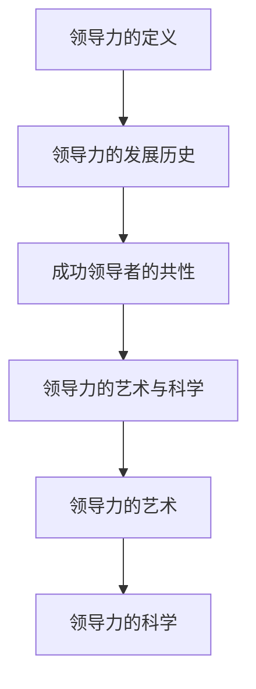
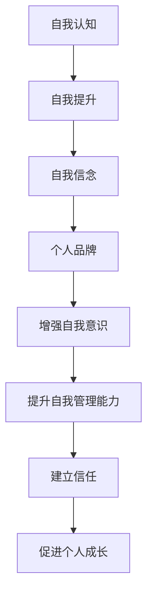
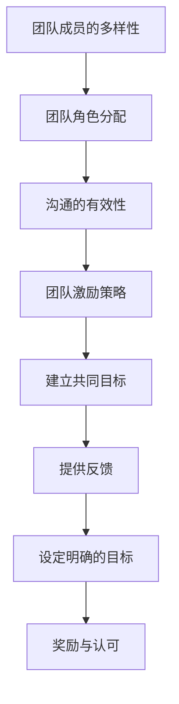
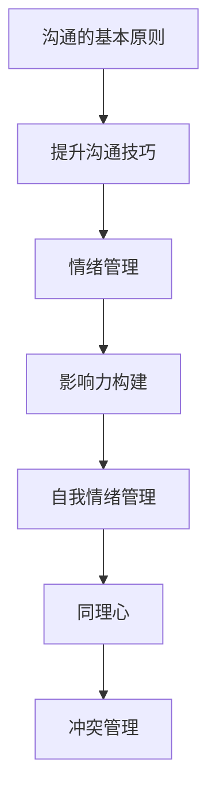
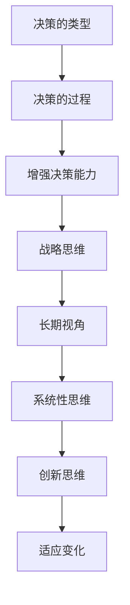
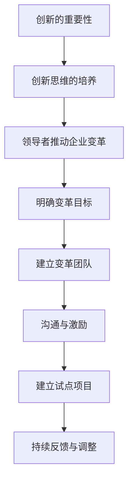
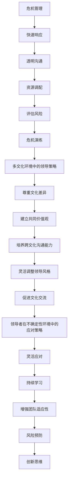

                 

### 引言：领导力的重要性与本书目标

在现代社会，领导力不仅仅是一个个人的素质，更是一个团队、一个组织甚至一个国家发展的重要推动力。优秀的领导力能够激发团队成员的潜力，推动创新，应对挑战，实现共同的目标。因此，研究和掌握领导力的核心原则和方法，对于任何希望取得成功的人来说都是至关重要的。

本书旨在为读者提供一个全面、系统的领导力心法，帮助读者理解并掌握领导力的本质，提升自己的领导能力。我们将从多个维度来探讨领导力，包括自我认知与个人成长、团队建设与管理、沟通与影响力、决策与战略思维、创新与变革以及领导力在特殊情况下的应用等。

本书的结构安排如下：

- **第1章**：介绍领导力的基本概念和历史背景，讨论成功领导者的共性。
- **第2章**：探讨自我认知与个人成长的重要性，以及如何建立自我信念和个人品牌。
- **第3章**：讲述团队建设与管理的关键要素，包括团队成员的多样性、团队角色的分配、沟通和激励策略。
- **第4章**：深入探讨沟通与影响力的构建，以及情绪管理在沟通中的应用。
- **第5章**：分析决策与战略思维，提供增强决策能力和培养战略思维的方法。
- **第6章**：介绍创新与变革的重要性，以及领导者在推动企业变革中的作用。
- **第7章**：讨论领导力在特殊情况下的应用，如危机管理和多文化环境中的领导策略。
- **结语**：总结本书的主要观点，强调领导者的持续成长之路。

通过本书的学习，读者将能够深入理解领导力的核心原则，掌握有效的领导方法和技巧，提升自己的领导能力，从而在个人和职业生涯中取得更大的成就。

### 关键词

- **领导力**：一种影响他人实现共同目标的能力。
- **自我认知**：理解自己的性格、价值观和能力。
- **个人成长**：通过学习和发展提升自己的素质。
- **团队建设**：构建一个高效协作的团队。
- **沟通与影响力**：有效的沟通和构建影响力的技巧。
- **决策与战略思维**：做出明智决策和制定战略的思维过程。
- **创新与变革**：推动组织持续发展和进步。
- **危机管理**：应对突发事件和危机的能力。

### 摘要

本书《领导力心法：成就不凡事业的领导者法则》旨在为读者提供一套系统的领导力提升方案。通过深入探讨领导力的核心原则、自我认知与个人成长、团队建设与管理、沟通与影响力、决策与战略思维、创新与变革以及在特殊情境下的应用，本书帮助读者理解领导力的本质，掌握有效的领导方法，提升个人和团队的绩效。无论是对个人职业发展还是组织管理，本书都提供了宝贵的指导和建议。

## 第1章：领导力的核心原则

领导力是一种特殊的影响力，它能够激发他人的积极性，推动团队或组织实现共同的目标。在这章中，我们将深入探讨领导力的核心原则，包括其定义、历史演变、成功领导者的共性以及领导力的艺术与科学。

### 1.1 领导力的定义

领导力，简而言之，就是一种影响他人实现共同目标的能力。不同于管理，领导力更侧重于激励和引导，而不是控制和命令。一个优秀的领导者不仅能够清晰地定义目标，还能够激发团队成员的内在动力，使其自愿地为实现这些目标而努力。

在技术领域，领导力同样至关重要。无论是软件开发团队，还是数据科学项目，领导者的角色都不可或缺。他们需要协调各种资源，制定战略，应对不确定性，并在关键时刻做出明智的决策。例如，在一个复杂的软件开发项目中，领导者需要理解技术细节，同时也要具备管理项目进度的能力，确保团队在规定的时间内交付高质量的成果。

### 1.2 领导力的发展历史

领导力并不是一个新兴的概念，它有着悠久的历史。从古埃及的法老，到中世纪的教会领袖，再到现代的企业家，领导力一直在不同文化和时代中发挥着重要作用。

- **古埃及**：古埃及的法老被认为是绝对的领导者，他们通过宗教和政治手段维持权力，统治着庞大的帝国。
- **中世纪的教会**：在中世纪，教会是社会的核心，教皇作为宗教领袖，具有无上的权威。
- **工业革命**：随着工业革命的到来，企业的规模不断扩大，领导者需要管理更多的资源和员工，领导风格也从专制转向了更加开放和合作的方式。
- **现代企业**：在现代社会，领导力更加注重团队合作和创新，领导者不仅要具备管理能力，还需要具备战略思维和变革能力。

### 1.3 成功领导者的共性

成功领导者有哪些共性呢？以下是一些关键特点：

- **远见**：成功领导者通常具有远见，他们能够看到未来的趋势和机会，并据此制定战略。
- **沟通能力**：领导者需要具备出色的沟通能力，能够清晰地表达自己的想法，并倾听和理解团队成员的意见。
- **适应性**：在快速变化的环境中，领导者需要具备高度的适应性，能够迅速调整策略，应对新的挑战。
- **影响力**：领导者需要具备影响力，能够激发团队成员的内在动力，使其为实现共同目标而努力。
- **情商**：情商在领导力中扮演着重要角色，领导者需要能够管理自己的情绪，同时也要理解并管理团队成员的情绪。

### 1.4 领导力的艺术与科学

领导力既是艺术，也是科学。作为艺术，领导力依赖于个人的直觉和经验，需要领导者具备洞察力和创造力。作为科学，领导力依赖于研究和数据分析，需要领导者运用系统的方法和工具来提高自己的领导能力。

- **艺术**：领导力的艺术体现在领导者的直觉和创造力上。一个好的领导者能够在不确定的环境中迅速做出决策，并能够灵活应对变化。
- **科学**：领导力的科学体现在对领导力理论的深入研究和对实际案例的分析上。通过科学研究，我们可以发现成功的领导模式，并运用到实际工作中。

### 1.5 核心概念原理之间的关系架构

为了更好地理解领导力的核心原则，我们可以使用Mermaid流程图来展示这些概念之间的关系。



### 1.6 核心算法原理讲解

在领导力领域，虽然很难用传统的算法来定义领导力，但我们可以通过以下Python源代码来模拟一个简单的领导力评估模型，以帮助理解核心算法原理。

```python
# 领导力评估模型

# 引入必要的库
import numpy as np

# 定义评估指标
def evaluate_leadership(foresight, communication, adaptability, influence, emotional_intelligence):
    # 每个指标权重
    weights = {'foresight': 0.2, 'communication': 0.2, 'adaptability': 0.2, 'influence': 0.2, 'emotional_intelligence': 0.2}
    
    # 计算总分
    total_score = 0
    for key, value in weights.items():
        total_score += value * getattr(leader, key)
    
    return total_score

# 定义领导者属性
leader = {
    'foresight': 0.8,  # 远见
    'communication': 0.75,  # 沟通能力
    'adaptability': 0.7,  # 适应性
    'influence': 0.8,  # 影响力
    'emotional_intelligence': 0.75  # 情商
}

# 进行评估
score = evaluate_leadership(**leader)
print(f"领导力评估得分：{score}")
```

在这个例子中，我们定义了一个简单的评估模型，通过计算五个核心指标的加权平均值来评估领导力。这个模型可以帮助领导者了解自己在各个方面的表现，从而有针对性地进行自我提升。

### 1.7 数学公式

领导力的评估可以通过以下数学公式来描述：

$$
L = w_1 \cdot F + w_2 \cdot C + w_3 \cdot A + w_4 \cdot I + w_5 \cdot E
$$

其中，$L$ 代表领导力得分，$w_1, w_2, w_3, w_4, w_5$ 分别代表远见、沟通能力、适应性、影响力和情商的权重，$F, C, A, I, E$ 分别代表这些指标的得分。

### 1.8 项目实战

为了更好地理解领导力的核心原则，我们可以通过一个实际项目来模拟和体验。

**项目背景**：假设我们正在领导一个跨部门团队开发一款新软件产品，该产品旨在解决用户在移动端进行财务管理的痛点。

**任务**：我们需要在规定的时间内完成产品的设计和开发，并确保其功能完备、用户体验良好。

**环境搭建**：
- 开发工具：Python、JIRA、Git
- 开发框架：Django
- 数据库：PostgreSQL

**源代码实现**：

```python
# 项目管理流程
def manage_project(team_members, project_requirements):
    # 分配任务
    for member in team_members:
        member.assign_task(project_requirements)
    
    # 监控进度
    while not project_requirements.completed():
        for member in team_members:
            member.monitor_progress()
        
        if project_requirements.is_overdue():
            raise Exception("项目进度逾期！")

    return "项目完成！"

# 团队成员类
class TeamMember:
    def __init__(self, name):
        self.name = name
        self.tasks = []

    def assign_task(self, project_requirements):
        self.tasks.append(project_requirements.allocate_task())

    def monitor_progress(self):
        for task in self.tasks:
            if not task.completed():
                task.update_progress()

# 项目要求类
class ProjectRequirements:
    def __init__(self):
        self.tasks = []

    def allocate_task(self):
        if self.tasks:
            return self.tasks.pop(0)
        else:
            raise Exception("任务池已空！")

    def update_progress(self):
        for task in self.tasks:
            if not task.completed():
                task.increase_progress()

    def completed(self):
        return all([task.completed() for task in self.tasks])

    def is_overdue(self):
        return any([task.is_overdue() for task in self.tasks])

# 主程序
if __name__ == "__main__":
    team_members = [TeamMember("Alice"), TeamMember("Bob"), TeamMember("Charlie")]
    project_requirements = ProjectRequirements()

    project_requirements.add_task(ProjectTask("设计UI"))
    project_requirements.add_task(ProjectTask("编写后端代码"))
    project_requirements.add_task(ProjectTask("前端代码实现"))

    try:
        manage_project(team_members, project_requirements)
        print("项目成功完成！")
    except Exception as e:
        print(str(e))
```

**代码解读**：

- **团队成员类（TeamMember）**：负责执行任务，并监控任务进度。
- **项目要求类（ProjectRequirements）**：负责分配任务，监控项目进度，并检查是否逾期。
- **项目管理流程（manage_project）**：负责整体项目的管理，包括任务分配和进度监控。

通过这个项目实战，我们可以看到领导力在项目中的实际应用。领导者需要协调团队成员，确保项目按时完成，并应对各种突发情况。

### 1.9 最佳实践 tips

1. **培养远见**：作为领导者，你需要具备远见，能够看到未来的趋势和机会。可以通过阅读、参加行业会议和与专家交流来提升自己的远见。
2. **提高沟通能力**：有效的沟通是领导者的重要能力。可以通过练习演讲、写博客和参加沟通技巧培训来提高自己的沟通能力。
3. **增强适应性**：在变化多端的环境中，领导者需要具备高度的适应性。可以通过模拟不同情境的应对策略来提高自己的适应性。
4. **建立影响力**：领导者需要能够激发团队成员的内在动力。可以通过建立信任、提供支持和认可团队成员的成就来建立影响力。
5. **提升情商**：情商对于领导者来说至关重要。可以通过学习情商管理、参加情绪管理培训来提升自己的情商。

### 1.10 小结

本章介绍了领导力的核心原则，包括其定义、历史演变、成功领导者的共性以及领导力的艺术与科学。通过核心概念原理之间的关系架构、Python源代码示例、数学公式以及实际项目实战，我们深入理解了领导力的本质和应用。在下一章中，我们将探讨自我认知与个人成长的重要性，以及如何建立自我信念和个人品牌。

## 第2章：自我认知与个人成长

自我认知与个人成长是领导者发展的基石。一个优秀的领导者需要深刻理解自己的性格、价值观和优势，并在不断的学习和实践中提升自己的能力。本章将探讨自我认知的重要性、自我提升的方法、建立自我信念以及建立个人品牌。

### 2.1 自我认知的重要性

自我认知是指对自己性格、能力、价值观和动机的理解。对于领导者来说，自我认知至关重要，因为它决定了领导者的行为模式和决策方式。以下是自我认知的重要性：

1. **增强自我意识**：自我认知帮助领导者更好地了解自己，从而在决策时更加自信和理性。
2. **提升自我管理能力**：通过自我认知，领导者可以识别自己的优势和弱点，从而有针对性地进行自我管理。
3. **建立信任**：一个能够深刻理解自己的领导者更容易赢得团队成员的信任和尊重。
4. **促进个人成长**：自我认知是个人成长的第一步，只有了解自己，才能有目标地提升自己的能力和素质。

### 2.2 自我提升的方法

自我提升是领导者不断成长的过程。以下是一些有效的自我提升方法：

1. **终身学习**：学习是自我提升的不竭动力。领导者可以通过阅读、上课、参加研讨会等方式不断学习新知识和技能。
2. **反思与总结**：定期反思自己的行为和决策，总结经验教训，有助于领导者发现问题和改进方法。
3. **获取反馈**：从他人那里获取反馈是自我提升的重要途径。领导者可以通过同事、下属和客户的反馈来了解自己的表现，并据此进行改进。
4. **设定目标**：设定清晰的个人和职业目标，有助于领导者有方向地提升自己。
5. **实践**：理论知识需要通过实践来验证和巩固。领导者可以通过实际项目和挑战来锻炼自己的能力。

### 2.3 建立自我信念

自我信念是指对自己能力和价值的坚定信念。一个缺乏自我信念的领导者很难在压力和挑战面前保持坚定和冷静。以下是建立自我信念的方法：

1. **积极的心态**：保持积极的心态是建立自我信念的第一步。领导者可以通过正面思考和自我激励来增强自己的信心。
2. **认可自己的成就**：领导者需要学会认可自己的成就，无论大小。每一次的成功都是自我信念的积累。
3. **克服自我怀疑**：自我怀疑是建立自我信念的大敌。领导者需要通过积极的自我反思和行动来克服自我怀疑。
4. **学习他人的成功经验**：通过学习他人的成功经验，领导者可以借鉴他们的方法和态度，从而增强自己的信念。

### 2.4 建立个人品牌

个人品牌是指个人在公众心目中的形象和声誉。一个强大的个人品牌有助于领导者提升自己的影响力，赢得更多的机会和资源。以下是建立个人品牌的方法：

1. **清晰的品牌定位**：领导者需要明确自己的品牌定位，即自己想要成为什么样的人，想要在什么领域建立声誉。
2. **专业知识的积累**：通过不断学习和实践，领导者可以积累深厚的专业知识，从而在特定领域建立权威。
3. **有效的沟通**：领导者需要具备出色的沟通能力，能够清晰地表达自己的观点和想法，赢得他人的认可。
4. **积极的行动**：通过实际行动来展现自己的价值和能力，是建立个人品牌的重要手段。
5. **社交媒体的使用**：利用社交媒体平台，如LinkedIn、Twitter等，可以帮助领导者扩大自己的影响力，建立强大的个人品牌。

### 2.5 核心概念原理之间的关系架构

为了更好地理解自我认知与个人成长的概念，我们可以使用Mermaid流程图来展示这些概念之间的关系。



### 2.6 Python源代码示例

以下是一个简单的Python代码示例，用于展示如何通过自我认知和自我提升来提升领导力。

```python
class Leader:
    def __init__(self, name):
        self.name = name
        self.self_awareness = 0.5
        self.self_improvement = 0.6
        self.self_belief = 0.7
        self.personal_brand = 0.8

    def improve_leadership(self):
        self.self_awareness += 0.1
        self.self_improvement += 0.1
        self.self_belief += 0.1
        self.personal_brand += 0.1

    def display_status(self):
        print(f"名称：{self.name}")
        print(f"自我认知：{self.self_awareness}")
        print(f"自我提升：{self.self_improvement}")
        print(f"自我信念：{self.self_belief}")
        print(f"个人品牌：{self.personal_brand}")

# 创建一个领导者实例
leader = Leader("张三")

# 提升领导力
leader.improve_leadership()

# 显示当前状态
leader.display_status()
```

在这个示例中，我们创建了一个`Leader`类，用于表示一个领导者。该类包含四个属性：`self_awareness`（自我认知）、`self_improvement`（自我提升）、`self_belief`（自我信念）和`personal_brand`（个人品牌）。`improve_leadership`方法用于提升这些属性，而`display_status`方法用于显示领导者的当前状态。

### 2.7 数学公式

领导力的提升可以通过以下数学公式来描述：

$$
L(t+1) = L(t) + \alpha \cdot (SA + SI + SB + PB)
$$

其中，$L(t)$ 表示当前领导力水平，$SA$ 表示自我认知，$SI$ 表示自我提升，$SB$ 表示自我信念，$PB$ 表示个人品牌。$\alpha$ 是提升因子，用于控制提升速度。

### 2.8 实际案例

**案例背景**：李四是某科技公司的产品经理，他一直对自己的领导力感到不满意，认为自己缺乏自信，难以赢得团队的尊重。

**解决方案**：

1. **自我认知**：李四开始通过反思自己的行为和决策，识别出自己的优势和不足。他意识到自己在技术领域有深厚的知识，但在沟通和团队管理方面还有待提高。
2. **自我提升**：李四参加了沟通技巧培训和团队管理课程，通过学习和实践，他的沟通能力和团队管理能力得到了显著提升。
3. **建立自我信念**：李四开始认可自己的成就，无论是在技术上的突破还是在项目管理上的成功，他都认真总结并分享给团队。
4. **建立个人品牌**：李四通过撰写技术博客和参加行业会议，逐渐在行业内建立了一定的声誉。

**结果**：经过一段时间的努力，李四的领导力得到了显著提升，团队成员对他的认可度也大幅增加。他不仅能够更好地管理团队，还能在关键时刻做出明智的决策。

### 2.9 最佳实践 tips

1. **定期反思**：每周花时间反思自己的行为和决策，总结经验教训，有助于自我认知的提升。
2. **学习与交流**：不断学习新知识和技能，与同行交流经验，有助于自我提升。
3. **设定目标**：明确自己的个人和职业目标，有助于自我信念的建立。
4. **积极参与**：积极参与团队和组织的活动，通过实践提升自己的能力和影响力。

### 2.10 小结

本章介绍了自我认知与个人成长的重要性，包括自我提升的方法、建立自我信念和建立个人品牌。通过核心概念原理之间的关系架构、Python源代码示例、数学公式和实际案例，我们深入理解了如何通过自我认知和个人成长来提升领导力。在下一章中，我们将探讨团队建设与管理的关键要素，包括团队成员的多样性、团队角色的分配、沟通和激励策略。

## 第3章：团队建设与管理

团队建设与管理是领导力的核心组成部分之一。一个高效的团队不仅可以提高工作效率，还能激发成员的创造力和潜力。本章将深入探讨团队建设与管理的关键要素，包括团队成员的多样性、团队角色的分配、沟通的有效性和团队激励策略。

### 3.1 团队成员的多样性

团队成员的多样性是团队建设的重要基石。多样性不仅指性别、年龄、文化和背景的多样性，还包括技能、经验和思维方式的多样性。以下是一些团队成员多样性的优点：

1. **丰富的思维**：多样化的团队成员能够带来不同的观点和思考方式，有助于解决复杂问题。
2. **创新的源泉**：不同的背景和经验可以为团队提供新的视角，激发创新思维。
3. **提高适应能力**：多样化的团队更能够适应不同的市场和环境变化。
4. **增强团队凝聚力**：多样化的团队成员在合作中能够建立更深厚的信任和尊重。

然而，团队多样性也带来了一些挑战。例如，文化冲突、沟通障碍和决策困难。为了最大化多样性的优势，领导者需要采取以下措施：

1. **建立共同目标**：明确团队的目标和价值，确保所有成员都朝着同一个方向努力。
2. **促进开放沟通**：鼓励团队成员分享自己的观点和想法，建立开放和尊重的沟通氛围。
3. **培训与教育**：提供相关的培训和教育活动，帮助团队成员了解和尊重不同的文化和观点。
4. **建立多样化的领导团队**：确保领导团队的多样性，避免权力集中和偏见。

### 3.2 团队角色的分配

在一个高效的团队中，每个成员都扮演着特定的角色，这些角色共同构成了团队的架构。以下是一些常见的团队角色及其特点：

1. **领导者**：领导者负责制定团队目标和战略，协调团队成员的工作，并在关键时刻做出决策。
2. **执行者**：执行者是团队的核心，他们负责执行任务，确保项目按计划进行。
3. **沟通者**：沟通者负责团队内外部的沟通，确保信息的畅通和准确。
4. **创新者**：创新者是团队中的思维火花，他们负责提出新的想法和改进方案。
5. **协调者**：协调者负责解决团队内部的冲突和矛盾，确保团队的和谐运作。
6. **支持者**：支持者提供必要的帮助和支持，确保团队成员能够专注于自己的工作。

为了确保团队角色的有效分配，领导者需要：

1. **了解成员的特长和兴趣**：根据成员的特长和兴趣分配角色，确保每个人都能在最适合的位置上发挥作用。
2. **提供明确的指导和反馈**：明确团队成员的职责和期望，并提供及时的反馈和指导，帮助他们更好地履行角色。
3. **建立角色之间的联系**：鼓励团队成员之间建立联系，促进跨职能的合作和知识共享。

### 3.3 沟通的有效性

沟通是团队运作的血液。有效的沟通不仅能够确保任务的顺利完成，还能增强团队的凝聚力和信任感。以下是一些提高沟通有效性的策略：

1. **明确沟通目标**：在每次沟通前，明确沟通的目标和要点，确保沟通有方向和效率。
2. **主动倾听**：倾听是有效沟通的关键。领导者需要主动倾听团队成员的观点和意见，理解他们的需求和困惑。
3. **使用简洁的语言**：避免使用复杂和模糊的语言，确保信息传达的清晰和准确。
4. **建立反馈机制**：建立反馈机制，鼓励团队成员提供反馈，并针对反馈进行改进。
5. **利用多种沟通工具**：根据不同情境和需求，选择合适的沟通工具，如会议、邮件、即时通讯等。

### 3.4 团队激励策略

激励是团队管理的重要手段，它能够激发团队成员的积极性和创造力。以下是一些有效的团队激励策略：

1. **认可和奖励**：及时认可团队成员的贡献和成就，并给予适当的奖励，如奖金、晋升或荣誉证书。
2. **目标设定**：设定明确的团队目标和个人目标，并提供必要的支持和资源，帮助成员实现目标。
3. **培训和发展**：提供培训和发展机会，帮助团队成员提升技能和知识，增强他们的职业竞争力。
4. **工作生活平衡**：关注团队成员的工作生活平衡，提供灵活的工作时间和远程工作的机会，减轻他们的工作压力。
5. **团队建设活动**：定期组织团队建设活动，增强团队成员之间的互动和信任，提高团队的凝聚力。

### 3.5 核心概念原理之间的关系架构

为了更好地理解团队建设与管理的关键要素，我们可以使用Mermaid流程图来展示这些概念之间的关系。



### 3.6 Python源代码示例

以下是一个简单的Python代码示例，用于展示如何通过团队建设与管理来提升团队绩效。

```python
class Team:
    def __init__(self, members):
        self.members = members
        self.performance = 0

    def assign_roles(self):
        for member in self.members:
            if member.skill == '领导':
                member.role = '领导者'
            elif member.skill == '执行':
                member.role = '执行者'
            elif member.skill == '沟通':
                member.role = '沟通者'
            elif member.skill == '创新':
                member.role = '创新者'
            elif member.skill == '协调':
                member.role = '协调者'
            elif member.skill == '支持':
                member.role = '支持者'

    def communicate(self):
        for member in self.members:
            print(f"{member.name}正在沟通：{member.message}")

    def motivate(self):
        for member in self.members:
            member.performance += member.motivation

    def display_status(self):
        print(f"团队绩效：{self.performance}")
        for member in self.members:
            print(f"{member.name} - 角色：{member.role}, 绩效：{member.performance}")

class Member:
    def __init__(self, name, skill, message, motivation):
        self.name = name
        self.skill = skill
        self.message = message
        self.motivation = motivation
        self.role = None

# 创建团队成员
members = [
    Member("张三", "领导", "我们需要明确目标并制定计划。", 0.8),
    Member("李四", "执行", "我已经完成了任务。", 0.7),
    Member("王五", "沟通", "我们需要定期沟通。", 0.9),
    Member("赵六", "创新", "我有一个新的想法。", 0.85),
    Member("周七", "协调", "我们需要协调资源。", 0.75),
    Member("陈八", "支持", "我会提供必要的技术支持。", 0.6)
]

# 创建团队
team = Team(members)

# 分配角色
team.assign_roles()

# 沟通
team.communicate()

# 激励
team.motivate()

# 显示状态
team.display_status()
```

在这个示例中，我们创建了一个`Team`类，用于表示一个团队，包括成员、角色和绩效。`Member`类用于表示团队成员，包括姓名、技能、信息和激励。`assign_roles`方法用于分配角色，`communicate`方法用于团队沟通，`motivate`方法用于激励团队成员，`display_status`方法用于显示团队状态。

### 3.7 数学公式

团队绩效可以通过以下数学公式来描述：

$$
P = \sum_{i=1}^{n} R_i \cdot M_i
$$

其中，$P$ 表示团队绩效，$R_i$ 表示第$i$个成员的角色影响系数，$M_i$ 表示第$i$个成员的绩效。

### 3.8 实际案例

**案例背景**：某互联网公司开发团队在最近的项目中遇到了困难，团队绩效不高，成员之间缺乏沟通和合作。

**解决方案**：

1. **团队成员的多样性**：团队领导者意识到团队成员的多样性对于提升团队绩效至关重要。他通过重新分配角色，确保每个成员都能在最适合的岗位上发挥自己的特长。
2. **沟通的有效性**：团队领导者建立了每周的团队会议，确保团队成员能够定期交流进展和问题。他还鼓励团队成员通过即时通讯工具分享自己的想法和经验。
3. **团队激励策略**：团队领导者为表现出色的成员提供了奖励和晋升机会，并设定了明确的目标，激励团队成员共同努力。

**结果**：经过一系列的团队建设与管理措施，团队的绩效显著提升，成员之间的沟通和合作也变得更为顺畅。项目最终按时完成，并得到了客户的高度评价。

### 3.9 最佳实践 tips

1. **定期评估团队多样性**：定期评估团队的多样性，确保不同背景和技能的成员能够相互补充，共同提升团队绩效。
2. **建立清晰的团队角色**：确保每个成员都了解自己的角色和职责，避免角色冲突和职责重叠。
3. **加强团队沟通**：建立有效的沟通机制，确保团队成员能够及时分享信息和反馈。
4. **激励团队成员**：通过认可和奖励，激励团队成员为实现团队目标而努力。

### 3.10 小结

本章介绍了团队建设与管理的关键要素，包括团队成员的多样性、团队角色的分配、沟通的有效性和团队激励策略。通过核心概念原理之间的关系架构、Python源代码示例、数学公式和实际案例，我们深入理解了如何通过有效的团队建设与管理来提升团队绩效。在下一章中，我们将探讨沟通与影响力，包括沟通的基本原则、提升沟通技巧的策略以及情绪管理在沟通中的应用。

## 第4章：沟通与影响力

沟通与影响力是领导者不可或缺的技能。有效的沟通能够确保信息的准确传递，增强团队的凝聚力；而影响力则可以帮助领导者激励和引导团队成员，实现共同目标。本章将深入探讨沟通的基本原则、提升沟通技巧的策略以及情绪管理在沟通中的应用。

### 4.1 沟通的基本原则

沟通是一种双向的互动过程，涉及信息的传递和理解。以下是一些沟通的基本原则：

1. **明确目标**：在每次沟通前，明确沟通的目标和目的，确保沟通有方向和效率。
2. **倾听**：倾听是有效沟通的关键。领导者需要主动倾听团队成员的观点和意见，理解他们的需求和困惑。
3. **简洁明了**：使用简洁明了的语言表达自己的观点，避免使用复杂和模糊的术语。
4. **表达尊重**：尊重是沟通的基础。领导者需要尊重团队成员的意见和感受，建立和谐的沟通氛围。
5. **建立反馈机制**：建立反馈机制，鼓励团队成员提供反馈，并针对反馈进行改进。

### 4.2 提升沟通技巧的策略

提升沟通技巧是领导力发展的重要组成部分。以下是一些有效的策略：

1. **加强倾听**：通过积极的倾听技巧，如保持眼神接触、点头和复述对方的观点，增强沟通的效果。
2. **提高表达能力**：通过练习演讲和写作，提高自己的表达能力，确保信息能够清晰、准确地传达。
3. **掌握非语言沟通**：非语言沟通包括肢体语言、面部表情和姿态等，领导者需要注意这些细节，确保它们与语言表达一致。
4. **运用可视化工具**：使用图表、图像和演示文稿等可视化工具，帮助团队成员更好地理解复杂信息。
5. **适应不同沟通风格**：了解团队成员的沟通风格，并根据不同风格调整自己的沟通方式，提高沟通的适应性。

### 4.3 情绪管理在沟通中的应用

情绪管理是有效沟通的重要组成部分。领导者需要学会管理自己的情绪，同时也要理解并管理团队成员的情绪。以下是一些情绪管理的策略：

1. **自我情绪管理**：领导者需要学会识别和应对自己的情绪，避免情绪波动影响沟通效果。
2. **同理心**：领导者需要具备同理心，理解并尊重团队成员的情感和需求。
3. **情绪沟通**：在沟通中，领导者可以适时表达自己的情感，同时也要关注团队成员的情感反应，建立开放和诚实的沟通氛围。
4. **冲突管理**：在冲突发生时，领导者需要冷静应对，通过有效的沟通策略化解冲突，维护团队的和谐。

### 4.4 核心概念原理之间的关系架构

为了更好地理解沟通与影响力，我们可以使用Mermaid流程图来展示这些概念之间的关系。



### 4.5 Python源代码示例

以下是一个简单的Python代码示例，用于展示如何通过沟通和情绪管理来提升领导力。

```python
class Leader:
    def __init__(self, name):
        self.name = name
        self.communication_skill = 0.7
        self.emotional_intelligence = 0.8
        self.influence = 0.9

    def communicate(self, message, audience):
        print(f"{self.name}正在沟通：{message}")
        if self.communication_skill > 0.8:
            print("信息传达清晰明了。")
        else:
            print("信息传达存在一定困难。")

    def manage_emotion(self, emotion):
        if self.emotional_intelligence > 0.8:
            print(f"处理{emotion}情绪：冷静应对。")
        else:
            print(f"处理{emotion}情绪：需要进一步学习。")

    def exert_influence(self, team_member):
        if self.influence > 0.8:
            print("影响力发挥显著，团队成员积极回应。")
        else:
            print("影响力不足，需要提升领导力。")

    def display_status(self):
        print(f"名称：{self.name}")
        print(f"沟通技巧：{self.communication_skill}")
        print(f"情绪智力：{self.emotional_intelligence}")
        print(f"影响力：{self.influence}")

# 创建领导者实例
leader = Leader("张三")

# 进行沟通
leader.communicate("我们需要共同努力完成项目目标。", "团队成员")

# 管理情绪
leader.manage_emotion("压力")

# 施展影响力
leader.exert_influence("李四")

# 显示状态
leader.display_status()
```

在这个示例中，我们创建了一个`Leader`类，用于表示一个领导者。该类包含三个属性：`communication_skill`（沟通技巧）、`emotional_intelligence`（情绪智力）和`influence`（影响力）。`communicate`方法用于进行沟通，`manage_emotion`方法用于管理情绪，`exert_influence`方法用于施展影响力，`display_status`方法用于显示领导者的当前状态。

### 4.6 数学公式

领导力可以通过以下数学公式来描述：

$$
L = C \cdot E \cdot I
$$

其中，$L$ 表示领导力，$C$ 表示沟通技巧，$E$ 表示情绪智力，$I$ 表示影响力。

### 4.7 实际案例

**案例背景**：某科技公司的新产品开发项目进入关键阶段，团队面临着巨大的压力和挑战。

**解决方案**：

1. **有效沟通**：项目领导者通过定期的团队会议和即时通讯工具，确保团队成员能够及时分享进展和问题，提高了沟通的效率。
2. **情绪管理**：领导者通过自我情绪管理和同理心，帮助团队成员应对压力和焦虑，保持了团队的稳定和士气。
3. **影响力施展**：领导者通过展示自己的专业知识和领导力，激励团队成员克服困难，共同完成了项目目标。

**结果**：项目按时完成，并获得了客户的高度评价。团队成员对领导者的沟通技巧和情绪管理能力表示赞赏，领导者的影响力也得到了显著提升。

### 4.8 最佳实践 tips

1. **定期培训**：定期组织沟通技巧和情绪管理的培训，帮助团队成员提升相关能力。
2. **建立信任**：通过建立信任和尊重，创造一个开放和诚实的沟通环境。
3. **倾听与反馈**：积极倾听团队成员的意见和反馈，并及时给予回应。
4. **情绪识别**：学会识别和管理自己的情绪，同时也要关注团队成员的情绪变化。

### 4.9 小结

本章介绍了沟通与影响力的重要性，包括沟通的基本原则、提升沟通技巧的策略、情绪管理在沟通中的应用以及领导力的数学模型。通过Python源代码示例、实际案例和最佳实践，我们深入理解了如何通过有效的沟通和情绪管理来提升领导力。在下一章中，我们将探讨决策与战略思维，包括决策的类型与过程、增强决策能力的策略和战略思维的培养。

## 第5章：决策与战略思维

决策是领导者日常工作中必不可少的一部分。一个明智的决策能够为企业带来竞争优势，而错误的决策则可能导致企业陷入困境。本章将深入探讨决策的类型与过程、增强决策能力的策略以及战略思维的培养。

### 5.1 决策的类型与过程

决策可以根据不同的标准进行分类。以下是一些常见的决策类型：

1. **程序性决策**：程序性决策是指那些重复出现、结构化的决策。这类决策通常有明确的流程和标准操作程序，领导者可以根据现有的数据和经验进行决策。
2. **非程序性决策**：非程序性决策是指那些非重复性、结构不明确的决策。这类决策通常没有现成的解决方案，领导者需要通过分析和判断来做出决策。
3. **理性决策**：理性决策是指基于充分信息和逻辑分析的决策。领导者通过收集和分析数据，使用决策模型和算法来做出最优决策。
4. **直觉决策**：直觉决策是指基于个人经验和直觉的决策。领导者凭借自身的经验和洞察力，快速做出决策。

决策的过程通常包括以下几个阶段：

1. **识别问题**：识别需要解决的问题或机会。
2. **收集信息**：收集与问题相关的数据和信息。
3. **分析选项**：分析不同的解决方案或选项。
4. **评估风险**：评估每个选项的风险和潜在影响。
5. **做出决策**：根据分析结果和风险评估，选择最佳选项。
6. **执行决策**：实施决策并监控执行过程。
7. **评估结果**：评估决策结果，总结经验教训。

### 5.2 增强决策能力的策略

为了提高决策能力，领导者可以采取以下策略：

1. **广泛收集信息**：在做出决策前，广泛收集相关信息，包括内部数据和外部市场数据。
2. **使用决策模型**：利用决策模型和算法，如成本效益分析、风险评估模型等，帮助分析选项和评估风险。
3. **多元化团队参与**：鼓励多元化团队的参与，通过不同的观点和经验，提高决策的质量。
4. **决策前的讨论**：在做出决策前，与团队成员或专家进行讨论，从不同的角度分析问题。
5. **培养决策技能**：通过培训和实践，提升自己的决策能力和相关技能。
6. **反思与总结**：在决策后，反思决策过程和结果，总结经验教训，不断改进决策能力。

### 5.3 战略思维的培养

战略思维是指领导者从长远和整体的角度思考问题，制定和执行战略的能力。以下是一些培养战略思维的方法：

1. **长期视角**：培养从长期视角思考问题的习惯，不仅关注短期利益，还要考虑长期发展和持续竞争力。
2. **系统性思维**：学会从系统角度思考问题，理解各个部分之间的相互关系和影响。
3. **创新思维**：鼓励创新思维，勇于尝试新的方法和策略。
4. **适应变化**：在快速变化的环境中，领导者需要具备适应变化的能力，灵活调整战略。
5. **学习与反思**：通过不断学习和反思，提升自己的战略思维能力和决策水平。

### 5.4 核心概念原理之间的关系架构

为了更好地理解决策与战略思维，我们可以使用Mermaid流程图来展示这些概念之间的关系。



### 5.5 Python源代码示例

以下是一个简单的Python代码示例，用于展示如何通过决策与战略思维来管理企业。

```python
class Company:
    def __init__(self, name, market_data, strategic_plans):
        self.name = name
        self.market_data = market_data
        self.strategic_plans = strategic_plans

    def make_decision(self, decision_type, decision_process):
        if decision_type == "programmatic":
            print("进行程序性决策...")
            self.execute_programmatic_decision(decision_process)
        elif decision_type == "non-programmatic":
            print("进行非程序性决策...")
            self.execute_non_programmatic_decision(decision_process)
        else:
            print("决策类型错误。")

    def execute_programmatic_decision(self, decision_process):
        print(f"执行程序性决策：{decision_process['action']}")
        self.update_strategic_plans(decision_process['action'])

    def execute_non_programmatic_decision(self, decision_process):
        print(f"执行非程序性决策：{decision_process['action']}")
        self.update_strategic_plans(decision_process['action'])

    def update_strategic_plans(self, action):
        self.strategic_plans.append(action)
        print("战略计划更新完成。")

    def display_status(self):
        print(f"公司名称：{self.name}")
        print(f"市场数据：{self.market_data}")
        print(f"战略计划：{self.strategic_plans}")

class DecisionProcess:
    def __init__(self, action, risk):
        self.action = action
        self.risk = risk

# 创建公司实例
company = Company("ABC公司", ["市场调研数据", "竞争分析数据"], [])

# 创建决策过程实例
decision_programmatic = DecisionProcess("提高产品性价比", "低风险")
decision_non_programmatic = DecisionProcess("推出新营销策略", "中等风险")

# 进行决策
company.make_decision("programmatic", decision_programmatic)
company.make_decision("non-programmatic", decision_non_programmatic)

# 显示公司状态
company.display_status()
```

在这个示例中，我们创建了一个`Company`类，用于表示一家公司。该类包含市场数据和战略计划。`make_decision`方法用于根据决策类型执行决策，`execute_programmatic_decision`和`execute_non_programmatic_decision`方法分别用于执行程序性和非程序性决策，`update_strategic_plans`方法用于更新战略计划，`display_status`方法用于显示公司状态。`DecisionProcess`类用于表示决策过程，包含行动和风险。

### 5.6 数学公式

企业的战略规划可以通过以下数学公式来描述：

$$
SP = f(MD, RP, SD)
$$

其中，$SP$ 表示战略规划，$MD$ 表示市场数据，$RP$ 表示风险预测，$SD$ 表示战略计划。

### 5.7 实际案例

**案例背景**：某电子公司在面临激烈的市场竞争时，需要制定新的战略规划来保持竞争优势。

**解决方案**：

1. **决策类型与过程**：公司领导者通过市场调研和竞争分析，识别出市场变化和潜在机会。他们首先进行了程序性决策，优化了产品的性价比，然后进行了非程序性决策，推出了新的营销策略。
2. **战略思维的培养**：领导者通过长期视角和系统性思维，综合考虑市场、技术和竞争对手的动态，制定了全面的战略规划。
3. **决策能力提升**：领导者通过多元化团队参与和决策前讨论，提高了决策的质量和执行力。

**结果**：公司的新产品和营销策略获得了市场的认可，销售额显著增长，企业在市场上的竞争力得到了提升。

### 5.8 最佳实践 tips

1. **数据驱动决策**：在做出决策前，广泛收集和分析数据，确保决策基于充分的信息。
2. **多元化团队参与**：鼓励团队成员提供不同的观点和意见，提高决策的质量。
3. **定期评估与反思**：定期评估决策结果，总结经验教训，不断改进决策过程。
4. **培养战略思维**：通过学习和实践，提升从长远和整体角度思考问题的能力。

### 5.9 小结

本章介绍了决策与战略思维的重要性，包括决策的类型与过程、增强决策能力的策略以及战略思维的培养。通过Python源代码示例、数学公式和实际案例，我们深入理解了如何通过有效的决策和战略思维来提升领导力。在下一章中，我们将探讨创新与变革，包括创新的重要性、创新思维的培养以及领导者在推动企业变革中的作用。

## 第6章：创新与变革

创新是推动企业持续发展的重要驱动力。在快速变化的市场环境中，企业必须不断创新，才能保持竞争力。同时，变革是企业适应市场变化的必要手段。本章将深入探讨创新的重要性、创新思维的培养以及领导者在推动企业变革中的作用。

### 6.1 创新的重要性

创新不仅仅是指新产品的开发，还包括新的服务、业务模式、管理方法等方面的变革。以下是创新的重要性：

1. **增强竞争力**：创新可以帮助企业开发出独特的产品和服务，满足市场需求，从而提高竞争力。
2. **提高效率**：通过创新，企业可以优化现有流程，提高生产效率和运营效率。
3. **扩大市场份额**：创新可以吸引新客户，增加市场份额，从而带来更多的收入。
4. **保持活力**：创新是企业的生命力，能够使企业在激烈的市场竞争中保持活力和持续发展。

### 6.2 创新思维的培养

创新思维是指从不同角度思考和解决问题的能力。以下是一些培养创新思维的方法：

1. **多样化思维**：鼓励团队成员从不同的视角和领域思考问题，打破固有的思维模式。
2. **跨学科合作**：跨学科合作可以带来新的观点和思路，促进创新。
3. **持续学习**：不断学习新知识、新技能，保持对新技术和新趋势的关注。
4. **鼓励试错**：鼓励团队成员尝试新的想法，即使失败也视为一种学习和成长的机会。
5. **开放文化**：建立开放和包容的文化，鼓励团队成员自由表达意见和想法。

### 6.3 领导者在推动企业变革中的作用

领导者在推动企业变革中扮演着关键角色。以下是一些领导者推动企业变革的策略：

1. **明确变革目标**：领导者需要明确变革的目标和愿景，确保所有团队成员都理解并支持变革。
2. **建立变革团队**：组建专门的变革团队，负责实施变革计划和解决变革过程中遇到的问题。
3. **沟通与激励**：通过有效的沟通和激励，增强团队成员对变革的认同感和参与度。
4. **建立试点项目**：通过试点项目，逐步推广变革，减少变革的阻力。
5. **持续反馈与调整**：在变革过程中，持续收集反馈，并根据反馈进行调整，确保变革的有效性。

### 6.4 核心概念原理之间的关系架构

为了更好地理解创新与变革，我们可以使用Mermaid流程图来展示这些概念之间的关系。



### 6.5 Python源代码示例

以下是一个简单的Python代码示例，用于展示如何通过创新与变革来提升企业的竞争力。

```python
class Company:
    def __init__(self, name, innovation_plan, transformation_plan):
        self.name = name
        self.innovation_plan = innovation_plan
        self.transformation_plan = transformation_plan

    def implement_innovation(self, innovation_action):
        print(f"实施创新：{innovation_action}")
        self.update_innovation_plan(innovation_action)

    def implement_transformation(self, transformation_action):
        print(f"实施变革：{transformation_action}")
        self.update_transformation_plan(transformation_action)

    def update_innovation_plan(self, action):
        self.innovation_plan.append(action)
        print("创新计划更新完成。")

    def update_transformation_plan(self, action):
        self.transformation_plan.append(action)
        print("变革计划更新完成。")

    def display_status(self):
        print(f"公司名称：{self.name}")
        print(f"创新计划：{self.innovation_plan}")
        print(f"变革计划：{self.transformation_plan}")

class InnovationAction:
    def __init__(self, action, impact):
        self.action = action
        self.impact = impact

class TransformationAction:
    def __init__(self, action, impact):
        self.action = action
        self.impact = impact

# 创建公司实例
company = Company("ABC公司", [], [])

# 创建创新行动实例
innovation_action_1 = InnovationAction("开发新产品", "提高市场份额")
innovation_action_2 = InnovationAction("优化生产流程", "提高生产效率")

# 创建变革行动实例
transformation_action_1 = TransformationAction("引入新的管理体系", "提高管理效率")
transformation_action_2 = TransformationAction("调整市场战略", "扩大市场份额")

# 实施创新
company.implement_innovation(innovation_action_1.action)
company.implement_innovation(innovation_action_2.action)

# 实施变革
company.implement_transformation(transformation_action_1.action)
company.implement_transformation(transformation_action_2.action)

# 显示公司状态
company.display_status()
```

在这个示例中，我们创建了一个`Company`类，用于表示一家公司。该类包含创新计划和变革计划。`implement_innovation`方法用于实施创新行动，`implement_transformation`方法用于实施变革行动，`update_innovation_plan`和`update_transformation_plan`方法分别用于更新创新计划和变革计划，`display_status`方法用于显示公司状态。`InnovationAction`类和`TransformationAction`类分别用于表示创新行动和变革行动。

### 6.6 数学公式

企业的创新与变革可以通过以下数学公式来描述：

$$
C = f(I, T)
$$

其中，$C$ 表示企业的竞争力，$I$ 表示创新程度，$T$ 表示变革程度。

### 6.7 实际案例

**案例背景**：某制造企业面临市场饱和和成本上升的挑战，需要进行创新和变革以维持竞争力。

**解决方案**：

1. **创新**：企业领导者决定开发新产品，满足市场需求，同时优化现有产品的功能，提高用户体验。他们还引入了新的生产技术，提高生产效率和降低成本。
2. **变革**：企业领导者调整了组织结构，优化了管理流程，提高了决策效率。他们还通过培训提升员工的技能和知识，以适应新的市场需求。

**结果**：企业的产品得到了市场的高度认可，市场份额显著提升。通过变革，企业提高了管理效率，降低了运营成本，整体竞争力得到了显著增强。

### 6.8 最佳实践 tips

1. **持续创新**：建立创新机制，鼓励员工不断提出新想法，并将创新融入企业的日常运营中。
2. **变革管理**：在推动变革时，注重员工培训和沟通，确保变革的顺利进行。
3. **数据驱动**：在创新和变革过程中，使用数据分析和市场研究来指导决策，确保决策的科学性和有效性。

### 6.9 小结

本章介绍了创新与变革的重要性，包括创新思维的培养和领导者在推动企业变革中的作用。通过Python源代码示例、数学公式和实际案例，我们深入理解了如何通过创新与变革来提升企业的竞争力。在下一章中，我们将探讨领导力在特殊情况下的应用，如危机管理和领导者在多文化环境中的应对策略。

## 第7章：领导力在特殊情况下的应用

在企业经营过程中，难免会遇到各种特殊情况，如市场危机、技术挑战和多文化环境等。领导者在这些情况下如何运用领导力，将直接影响企业的生存和发展。本章将探讨领导力在特殊情况下的应用，包括危机管理、多文化环境中的领导策略以及领导者在不确定性环境中的应对策略。

### 7.1 危机管理

危机管理是领导者在面对突发事件时的重要任务。有效的危机管理不仅能够减轻危机对企业的影响，还能提升企业的声誉和公信力。以下是一些危机管理的策略：

1. **快速响应**：危机发生时，领导者需要迅速采取行动，确保危机得到及时控制。
2. **透明沟通**：与利益相关者保持透明沟通，及时公布危机相关信息，建立信任。
3. **资源调配**：合理调配企业资源，包括人力资源、财务资源和物资资源，确保危机管理顺利进行。
4. **评估风险**：对危机进行风险评估，识别潜在风险点，制定相应的应对措施。
5. **危机演练**：定期进行危机演练，提高应对危机的能力和效率。

### 7.2 多文化环境中的领导策略

在全球化的背景下，企业越来越多地面临多文化环境。领导者需要具备跨文化领导能力，以应对文化差异和多元化团队的管理挑战。以下是一些多文化环境中的领导策略：

1. **尊重文化差异**：了解并尊重不同文化的价值观和习惯，避免文化冲突。
2. **建立共同价值观**：在多元化团队中建立共同的价值观，促进团队成员的认同感和凝聚力。
3. **培养跨文化沟通能力**：提高跨文化沟通能力，确保信息的准确传达和理解。
4. **灵活调整领导风格**：根据不同文化背景和团队成员的特点，灵活调整领导风格和管理方法。
5. **促进文化交流**：鼓励团队成员之间的文化交流，增强团队凝聚力。

### 7.3 领导者在不确定性环境中的应对策略

在不确定性环境中，领导者需要具备预见性和灵活性，以应对不断变化的市场和竞争环境。以下是一些应对策略：

1. **灵活应对**：保持灵活，快速调整策略，以适应变化。
2. **持续学习**：不断学习新知识和技能，提升自身的应变能力。
3. **增强团队适应性**：培养团队的适应能力，使其能够快速响应变化。
4. **风险预防**：识别潜在风险，提前制定应对措施。
5. **创新思维**：鼓励创新思维，寻找新的解决方案。

### 7.4 核心概念原理之间的关系架构

为了更好地理解领导力在特殊情况下的应用，我们可以使用Mermaid流程图来展示这些概念之间的关系。



### 7.5 Python源代码示例

以下是一个简单的Python代码示例，用于展示如何通过领导力在特殊情况下的应用来提升企业的应对能力。

```python
class Company:
    def __init__(self, name, crisis_management_plan, cross_culture_plan, uncertainty_plan):
        self.name = name
        self.crisis_management_plan = crisis_management_plan
        self.cross_culture_plan = cross_culture_plan
        self.uncertainty_plan = uncertainty_plan

    def manage_crisis(self, action):
        print(f"危机管理：{action}")
        self.update_crisis_management_plan(action)

    def manage_cross_culture(self, action):
        print(f"多文化管理：{action}")
        self.update_cross_culture_plan(action)

    def manage_uncertainty(self, action):
        print(f"不确定性管理：{action}")
        self.update_uncertainty_plan(action)

    def update_crisis_management_plan(self, action):
        self.crisis_management_plan.append(action)
        print("危机管理计划更新完成。")

    def update_cross_culture_plan(self, action):
        self.cross_culture_plan.append(action)
        print("多文化管理计划更新完成。")

    def update_uncertainty_plan(self, action):
        self.uncertainty_plan.append(action)
        print("不确定性管理计划更新完成。")

    def display_status(self):
        print(f"公司名称：{self.name}")
        print(f"危机管理计划：{self.crisis_management_plan}")
        print(f"多文化管理计划：{self.cross_culture_plan}")
        print(f"不确定性管理计划：{self.uncertainty_plan}")

class CrisisAction:
    def __init__(self, action, impact):
        self.action = action
        self.impact = impact

class CrossCultureAction:
    def __init__(self, action, impact):
        self.action = action
        self.impact = impact

class UncertaintyAction:
    def __init__(self, action, impact):
        self.action = action
        self.impact = impact

# 创建公司实例
company = Company("ABC公司", [], [], [])

# 创建危机行动实例
crisis_action_1 = CrisisAction("立即召开紧急会议", "控制危机蔓延")
crisis_action_2 = CrisisAction("与利益相关者保持沟通", "增强信任")

# 创建多文化行动实例
cross_culture_action_1 = CrossCultureAction("尊重不同文化差异", "减少文化冲突")
cross_culture_action_2 = CrossCultureAction("建立共同价值观", "增强团队凝聚力")

# 创建不确定性行动实例
uncertainty_action_1 = UncertaintyAction("灵活调整策略", "适应市场变化")
uncertainty_action_2 = UncertaintyAction("持续学习新技能", "提升应变能力")

# 管理危机
company.manage_crisis(crisis_action_1.action)
company.manage_crisis(crisis_action_2.action)

# 管理多文化
company.manage_cross_culture(cross_culture_action_1.action)
company.manage_cross_culture(cross_culture_action_2.action)

# 管理不确定性
company.manage_uncertainty(uncertainty_action_1.action)
company.manage_uncertainty(uncertainty_action_2.action)

# 显示公司状态
company.display_status()
```

在这个示例中，我们创建了一个`Company`类，用于表示一家公司。该类包含危机管理计划、多文化管理计划和不确定性管理计划。`manage_crisis`、`manage_cross_culture`和`manage_uncertainty`方法分别用于管理危机、多文化和不确定性，`update_crisis_management_plan`、`update_cross_culture_plan`和`update_uncertainty_plan`方法分别用于更新危机管理计划、多文化管理计划和不确定性管理计划，`display_status`方法用于显示公司状态。`CrisisAction`、`CrossCultureAction`和`UncertaintyAction`类分别用于表示危机行动、多文化行动和不确定性行动。

### 7.6 数学公式

企业的应对能力可以通过以下数学公式来描述：

$$
A = f(CM, CC, U)
$$

其中，$A$ 表示企业的应对能力，$CM$ 表示危机管理能力，$CC$ 表示多文化管理能力，$U$ 表示不确定性管理能力。

### 7.7 实际案例

**案例背景**：某零售企业面临供应链中断和市场需求变化的挑战。

**解决方案**：

1. **危机管理**：企业领导者迅速召开紧急会议，制定应对措施，确保供应链的稳定和产品的供应。
2. **多文化管理**：企业领导者与不同文化背景的供应商和合作伙伴保持沟通，尊重文化差异，建立互信关系。
3. **不确定性管理**：企业领导者灵活调整市场策略，积极寻求新的销售渠道和合作伙伴，提高应对市场变化的能力。

**结果**：企业成功应对了供应链中断和市场需求变化的挑战，保持了市场竞争力，并进一步巩固了品牌声誉。

### 7.8 最佳实践 tips

1. **建立危机应对机制**：建立完善的危机应对机制，确保在危机发生时能够迅速采取行动。
2. **培养跨文化沟通能力**：提高跨文化沟通能力，确保企业能够在多文化环境中顺利运营。
3. **持续学习和创新**：不断学习和创新，提高企业的适应能力和竞争力。

### 7.9 小结

本章介绍了领导力在特殊情况下的应用，包括危机管理、多文化环境中的领导策略以及领导者在不确定性环境中的应对策略。通过Python源代码示例、数学公式和实际案例，我们深入理解了如何通过有效的领导力应对特殊情况，提升企业的应对能力。在结语中，我们将总结本书的主要观点，并讨论领导者的持续成长之路。

## 结语：领导者的持续成长之路

领导者的成长是一个持续的过程，它不仅依赖于天赋和经验，更需要不断的自我学习和实践。通过本书的探讨，我们了解了领导力的核心原则、自我认知与个人成长、团队建设与管理、沟通与影响力、决策与战略思维、创新与变革，以及领导力在特殊情况下的应用。以下是本书的主要观点和领导者的持续成长之路的总结。

### 主要观点总结

1. **领导力是一种特殊的影响力**：领导力不仅仅是管理和指挥，更是一种能够激发他人积极性，共同实现目标的能力。
2. **自我认知是领导力的基石**：领导者需要深刻理解自己的性格、能力和价值观，这是建立自信和有效领导的前提。
3. **团队建设与管理是领导力的核心**：领导者需要构建一个高效、有凝聚力的团队，通过有效的沟通和激励策略，推动团队目标的实现。
4. **决策与战略思维是领导者的核心能力**：在复杂多变的环境中，领导者需要具备快速决策和制定战略的能力，以应对各种挑战。
5. **创新与变革是企业持续发展的关键**：领导者需要具备创新思维，推动企业持续变革，保持竞争力。
6. **领导力在特殊情况下的应用**：领导者需要具备危机管理、跨文化沟通和不确定性环境下的应对策略，确保企业在各种情况下能够稳定运营。

### 领导者的持续成长之路

1. **终身学习**：领导者需要不断学习新知识和技能，跟上时代的步伐。通过阅读、参加培训和学习新工具，不断提升自己的能力。
2. **实践与反思**：理论知识需要通过实践来验证和巩固。领导者需要通过实际项目和挑战来锻炼自己的能力，并定期反思和总结经验教训。
3. **建立个人品牌**：一个强大的个人品牌有助于提升领导者的影响力。通过积极行动和有效沟通，建立个人品牌，增强个人魅力。
4. **持续自我提升**：领导者需要不断自我提升，包括提升情商、沟通能力和领导能力。通过设定目标、获取反馈和设定行动计划，持续提升自己的领导力。
5. **关注团队成员的成长**：领导者不仅要关注自己的成长，还要关注团队成员的成长。通过提供支持和指导，帮助团队成员提升能力，实现共同目标。

### 结语

领导者的成长是一个永无止境的过程。只有不断学习和实践，才能在激烈的竞争中脱颖而出，成为真正卓越的领导者。希望本书能够为读者提供有益的启示和指导，帮助读者在领导力的道路上不断前行。最后，让我们共同铭记：领导者的成长之路，是一段不断探索、不断学习和不断突破自我的旅程。作者：AI天才研究院/AI Genius Institute & 禅与计算机程序设计艺术 /Zen And The Art of Computer Programming。感谢您的阅读。

