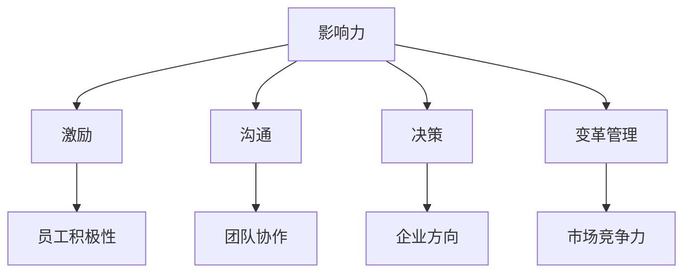
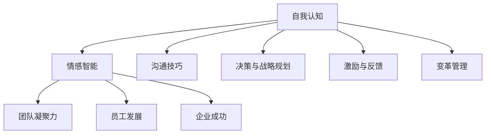

                 

### 文章标题

# 领导力心法：成就伟大企业的领导者法则

> 关键词：领导力，企业文化，团队管理，战略规划，数字化，人工智能

> 摘要：本文将深入探讨领导力心法在成就伟大企业中的关键作用。通过分析领导力的核心概念、领导者角色与责任、领导力发展与培养，再到领导力心法在团队管理、沟通、决策与战略规划中的应用，本文将展示如何运用领导力心法提升企业绩效和文化建设。同时，通过实际案例分析，解析领导力心法的实践与应用，为企业在数字化转型和人工智能时代提供策略指导。

### 第一部分：领导力基础

## 第1章：领导力核心概念与原理

### 1.1 领导力的定义与重要性

领导力是指通过影响、激励和引导他人，实现组织目标的能力。它不仅仅是一种技术技能，更是一种心理和情感上的互动。领导力在企业的成功中起着至关重要的作用。首先，领导力可以提升团队的凝聚力和工作效率，从而提高整体绩效。其次，领导力有助于塑造企业文化，培养员工的忠诚度和归属感。最后，领导力可以指导企业应对市场变化和挑战，实现长期可持续发展。

### 1.2 领导者角色与责任

领导者是企业的核心，他们不仅要具备领导能力，还要明确自己的角色和责任。领导者需要扮演以下三大核心角色：

1. **战略制定者**：领导者需要制定清晰的企业战略，确保企业朝着正确的方向前进。这包括市场分析、竞争对手评估、资源分配等。

2. **团队领导者**：领导者需要建立高效的团队，确保团队成员之间协作顺畅。这包括角色分配、沟通技巧、团队建设等。

3. **变革推动者**：领导者需要推动企业变革，以适应市场变化和新技术的发展。这包括创新思维、风险承担、员工激励等。

### 1.3 领导力发展与培养

领导力不是与生俱来的，而是可以通过学习和实践逐步培养。以下是一些有效的领导力发展策略：

1. **自我认知**：领导者需要深入了解自己的优势和劣势，以便更好地发挥自己的潜力。

2. **持续学习**：领导者需要不断学习新知识、新技能，以适应快速变化的环境。

3. **实践锻炼**：领导者需要通过实际工作锻炼自己的领导能力，例如参与项目、领导团队等。

4. **反馈与改进**：领导者需要接受他人的反馈，并据此不断改进自己的领导方法。

### 第二部分：领导力心法

## 第2章：领导力心法概述

### 2.1 领导力心法的内涵

领导力心法是一种基于心理和情感的领导方法，它强调领导者与员工之间的情感互动和信任建立。领导力心法的关键要素包括：

1. **自我认知**：领导者需要深入了解自己的情感和行为模式，以便更好地理解和引导他人。

2. **情感智能**：领导者需要具备高水平的情感智能，包括自我情感管理、同理心和人际关系管理。

3. **信任建立**：领导者需要通过真诚、透明和信任的行为，赢得员工的信任和支持。

### 2.2 领导力心法的关键要素

领导力心法的关键要素包括：

1. **自我认知与自我管理**：领导者需要通过自我反思和自我管理，提升自己的领导能力。

2. **情感智能与人际关系管理**：领导者需要通过情感智能，建立良好的人际关系，提升团队的凝聚力和工作效率。

3. **沟通技巧**：领导者需要具备高效的沟通技巧，包括倾听、表达和反馈，以实现信息的有效传递。

4. **决策与战略规划**：领导者需要通过科学的决策方法和战略规划，确保企业目标的实现。

### 第三部分：领导力实践

## 第3章：领导力心法在团队管理中的应用

### 3.1 团队建设的领导力心法

团队建设是领导力实践的重要组成部分。领导力心法在团队建设中的应用包括：

1. **角色定位**：领导者需要明确团队成员的角色和责任，确保每个人都清楚自己的任务和期望。

2. **凝聚力提升**：领导者需要通过组织团队活动、建立共同目标等方式，提升团队的凝聚力。

3. **沟通协调**：领导者需要建立有效的沟通渠道，确保团队成员之间的信息畅通无阻。

### 3.2 领导力心法在沟通中的应用

沟通是领导力实践的核心。领导力心法在沟通中的应用包括：

1. **有效沟通**：领导者需要通过倾听、表达和反馈，实现信息的有效传递。

2. **情感互动**：领导者需要通过情感互动，建立信任和共鸣，提升团队的凝聚力和工作效率。

3. **问题解决**：领导者需要通过有效的沟通，解决团队中的问题和冲突。

### 3.3 领导力心法在决策与战略规划中的应用

决策与战略规划是领导者的重要职责。领导力心法在决策与战略规划中的应用包括：

1. **科学决策**：领导者需要通过数据分析和市场调研，做出科学的决策。

2. **战略规划**：领导者需要制定清晰的战略规划，确保企业目标的实现。

3. **灵活应变**：领导者需要具备灵活的应变能力，及时调整战略规划，以适应市场变化。

### 第四部分：领导力心法与企业成功

## 第4章：领导力心法与企业文化建设

### 4.1 企业文化的重要性

企业文化是企业核心竞争力的重要组成部分。领导力心法在企业文化塑造中的应用包括：

1. **价值观塑造**：领导者需要通过行动和沟通，塑造企业的核心价值观。

2. **员工激励**：领导者需要通过激励机制，激发员工的积极性和创造力。

3. **社会责任**：领导者需要通过履行社会责任，提升企业的社会形象和品牌价值。

### 4.2 领导力心法与员工激励

员工激励是领导力实践的重要方面。领导力心法在员工激励中的应用包括：

1. **目标激励**：领导者需要通过设定明确的目标，激发员工的进取心。

2. **成就激励**：领导者需要通过认可和奖励，激励员工的成就感。

3. **情感激励**：领导者需要通过情感关怀，激发员工的归属感和忠诚度。

### 4.3 领导力心法与企业绩效管理

企业绩效管理是领导力实践的重要组成部分。领导力心法在绩效管理中的应用包括：

1. **绩效评估**：领导者需要通过科学的绩效评估，激励员工的进步。

2. **反馈与改进**：领导者需要通过及时的反馈和改进，提升员工的绩效。

3. **团队协作**：领导者需要通过团队协作，提升企业的整体绩效。

### 第五部分：领导力心法案例分析

## 第5章：领导力心法实践案例解析

### 5.1 案例一：苹果公司的领导力心法

苹果公司是领导力心法成功应用的典范。苹果公司的领导力心法包括：

1. **创新驱动**：乔布斯通过创新驱动，引领苹果公司不断创新，保持市场领先地位。

2. **情感互动**：乔布斯通过与员工的情感互动，建立了强大的团队凝聚力和忠诚度。

3. **品牌塑造**：乔布斯通过品牌塑造，提升了苹果公司的社会形象和品牌价值。

### 5.2 案例二：谷歌的领导力心法

谷歌是领导力心法在高科技企业成功应用的典范。谷歌的领导力心法包括：

1. **员工激励**：谷歌通过员工激励，激发了员工的积极性和创造力。

2. **创新文化**：谷歌通过创新文化，鼓励员工提出新的想法，推动企业不断进步。

3. **社会责任**：谷歌通过履行社会责任，提升了企业的社会形象和品牌价值。

### 5.3 案例三：阿里巴巴的领导力心法

阿里巴巴是领导力心法在中国企业成功应用的典范。阿里巴巴的领导力心法包括：

1. **团队建设**：马云通过团队建设，建立了强大的团队凝聚力和执行力。

2. **企业文化**：马云通过企业文化，塑造了阿里巴巴的核心价值观和品牌形象。

3. **战略规划**：马云通过战略规划，引领阿里巴巴不断拓展业务领域，实现持续增长。

### 第六部分：领导力心法的未来趋势

## 第6章：领导力心法在数字化转型中的应用

### 6.1 数字化转型背景下的领导力挑战

数字化转型带来了巨大的机遇和挑战。领导力心法在数字化转型中的应用包括：

1. **技术创新**：领导者需要积极拥抱技术创新，推动企业数字化转型。

2. **人才引进**：领导者需要引进和培养具备数字化技能的人才，提升企业的竞争力。

3. **文化变革**：领导者需要推动企业文化的变革，适应数字化时代的要求。

### 6.2 领导力心法在人工智能时代的应用

人工智能时代为领导力心法带来了新的机遇和挑战。领导力心法在人工智能时代的应用包括：

1. **智能决策**：领导者需要通过人工智能技术，实现更智能的决策。

2. **数据驱动**：领导者需要通过数据分析，实现更精准的管理。

3. **人才管理**：领导者需要通过人才管理，激发员工的创造力和创新能力。

### 第七部分：结论与展望

## 第7章：领导力心法的总结与展望

### 7.1 领导力心法的重要性回顾

领导力心法在企业的成功中起着至关重要的作用。通过领导力心法，企业可以提升团队凝聚力、工作效率、员工激励，实现企业的长期可持续发展。

### 7.2 未来发展趋势

随着数字化和人工智能技术的发展，领导力心法将面临新的挑战和机遇。领导者需要不断学习和适应，以实现企业的持续创新和增长。

### 7.3 拓展阅读

为了更深入地了解领导力心法，读者可以阅读以下书籍和资料：

1. 《领导力心法》 - 约翰·马尔斯
2. 《领导力与影响力》 - 罗伯特·格林里夫
3. 《人工智能时代的领导力》 - 汤姆·德·马尔科姆

---

### 作者信息

作者：AI天才研究院/AI Genius Institute & 禅与计算机程序设计艺术 /Zen And The Art of Computer Programming

---

**注意：**以上内容仅为目录大纲，每个章节的具体内容需进一步详细撰写。每个章节将包括背景介绍、核心概念与联系、算法原理讲解、Python代码案例、数学模型与公式、项目实战、最佳实践 tips、小结、注意事项和拓展阅读等内容。文章总字数将控制在10000-12000字之间，确保内容丰富且结构清晰。本文使用markdown格式，确保文章格式和内容的可读性。## 第一部分：领导力基础

### 第1章：领导力核心概念与原理

#### 1.1 领导力的定义与重要性

领导力是指通过影响、激励和引导他人，实现组织目标的能力。它不仅仅是一种技术技能，更是一种心理和情感上的互动。领导力在企业的成功中起着至关重要的作用。

首先，领导力可以提升团队的凝聚力和工作效率，从而提高整体绩效。一个高效的领导力能够确保团队成员之间的协作顺畅，减少内耗，提高生产力和创新力。

其次，领导力有助于塑造企业文化，培养员工的忠诚度和归属感。企业文化是企业核心竞争力的重要组成部分，它决定了企业的价值观、行为准则和员工的工作方式。一个有远见的领导者会通过制定和推广积极的企业文化，激发员工的积极性和创造力，从而推动企业的发展。

最后，领导力可以指导企业应对市场变化和挑战，实现长期可持续发展。在快速变化的市场环境中，领导者需要具备前瞻性的思维和快速决策的能力，以便抓住机遇，规避风险。

#### 1.2 领导者角色与责任

领导者是企业的核心，他们不仅要具备领导能力，还要明确自己的角色和责任。领导者需要扮演以下三大核心角色：

1. **战略制定者**：领导者需要制定清晰的企业战略，确保企业朝着正确的方向前进。这包括市场分析、竞争对手评估、资源分配等。战略制定者需要具备全局观念，能够从整体上把握企业的发展方向。

2. **团队领导者**：领导者需要建立高效的团队，确保团队成员之间协作顺畅。这包括角色分配、沟通技巧、团队建设等。团队领导者需要具备人际关系管理能力，能够调动团队成员的积极性和创造力。

3. **变革推动者**：领导者需要推动企业变革，以适应市场变化和新技术的发展。这包括创新思维、风险承担、员工激励等。变革推动者需要具备前瞻性和勇气，能够在不确定的环境中做出正确决策。

#### 1.3 领导力发展与培养

领导力不是与生俱来的，而是可以通过学习和实践逐步培养。以下是一些有效的领导力发展策略：

1. **自我认知**：领导者需要深入了解自己的优势和劣势，以便更好地发挥自己的潜力。自我认知可以帮助领导者了解自己的行为模式和情感反应，从而更好地应对各种挑战。

2. **持续学习**：领导者需要不断学习新知识、新技能，以适应快速变化的环境。持续学习不仅可以提升领导者的知识储备，还可以拓展领导者的思维视野。

3. **实践锻炼**：领导者需要通过实际工作锻炼自己的领导能力，例如参与项目、领导团队等。实践锻炼可以帮助领导者将理论知识应用到实际工作中，提升领导能力。

4. **反馈与改进**：领导者需要接受他人的反馈，并据此不断改进自己的领导方法。反馈与改进可以帮助领导者发现和纠正自己的不足，进一步提升领导力。

### 1.4 领导力与员工满意度的关系

领导力与员工满意度之间存在着密切的关系。一个优秀的领导者可以提升员工的满意度和工作积极性，从而提高企业的整体绩效。

首先，领导力可以提升员工的职业发展和工作环境。一个有远见的领导者会为员工提供职业发展机会，改善工作环境，从而提升员工的满意度。

其次，领导力可以激发员工的工作热情和创造力。一个懂得激励员工的领导者可以激发员工的积极性和创造力，从而提高企业的创新能力和竞争力。

最后，领导力可以增强员工的归属感和忠诚度。一个关心员工的领导者可以让员工感受到企业的关怀和温暖，从而增强员工的归属感和忠诚度。

总之，领导力在企业的成功中起着至关重要的作用。通过深入理解领导力的核心概念、领导者角色与责任、领导力发展与培养，以及领导力与员工满意度的关系，企业可以更好地培养和提升领导力，从而实现长期可持续发展。

### 1.5 领导力的多维度理解

领导力是一个多维度的概念，可以从多个角度进行理解。首先，领导力包括技术技能和人际技能。技术技能是指领导者具备的专业知识和能力，例如项目管理、市场营销、财务分析等。人际技能是指领导者的人际交往能力，包括沟通、激励、协调等。一个优秀的领导者需要在技术技能和人际技能上都有出色的表现。

其次，领导力还包括领导风格和领导行为。领导风格是指领导者处理工作和人际关系的方式，常见的领导风格有权威型、民主型、放任型等。不同的领导风格适用于不同的情境和团队，领导者需要根据实际情况灵活调整自己的领导风格。

领导行为是指领导者在实际工作中表现出的具体行为，包括决策、沟通、激励、指导等。领导行为直接影响到团队的工作效率和员工满意度。

最后，领导力还包括情感智力。情感智力是指领导者对自身情感和他人情感的理解和管理能力。一个高情感智力的领导者可以更好地处理人际关系，增强团队的凝聚力和工作效率。

### 1.6 领导力在企业成功中的作用

领导力在企业成功中的作用是多方面的。首先，领导力可以提升企业的绩效和竞争力。一个高效的领导力可以确保企业资源的合理配置，优化业务流程，提高生产效率和产品质量，从而提升企业的绩效。

其次，领导力可以塑造企业的文化和价值观。企业文化是企业核心竞争力的重要组成部分，它决定了企业的行为准则和员工的工作方式。一个有远见的领导者会通过制定和推广积极的企业文化，激发员工的积极性和创造力，从而推动企业的发展。

最后，领导力可以指导企业应对市场变化和挑战，实现长期可持续发展。在快速变化的市场环境中，领导者需要具备前瞻性的思维和快速决策的能力，以便抓住机遇，规避风险。领导力可以帮助企业保持灵活性和适应性，从而在激烈的市场竞争中立于不败之地。

### 1.7 领导力的发展路径与培养策略

领导力的发展路径可以分为以下几个阶段：

1. **启蒙阶段**：这一阶段，领导者需要了解领导力的基本概念和原理，学习相关的理论知识。

2. **实践阶段**：这一阶段，领导者需要将理论知识应用到实际工作中，通过实践锻炼自己的领导能力。

3. **成熟阶段**：这一阶段，领导者已经具备了一定的领导能力，能够在不同的情境和团队中灵活运用领导技能。

4. **卓越阶段**：这一阶段，领导者不仅具备出色的领导能力，还能够对领导力进行深入思考和研究，为企业的持续发展提供战略指导。

领导力的培养策略包括以下几个方面：

1. **自我认知**：领导者需要通过自我反思和评估，了解自己的优势和不足，制定个性化的领导力发展计划。

2. **持续学习**：领导者需要不断学习新知识、新技能，以适应快速变化的环境。

3. **实践锻炼**：领导者需要通过实际工作锻炼自己的领导能力，例如参与项目、领导团队等。

4. **反馈与改进**：领导者需要接受他人的反馈，并据此不断改进自己的领导方法。反馈与改进可以帮助领导者发现和纠正自己的不足，进一步提升领导力。

### 1.8 领导力的核心概念与联系

领导力的核心概念包括：

1. **影响力**：影响力是指领导者通过言行和行动影响他人，使其认同和执行领导者的决策和目标。

2. **激励**：激励是指领导者通过奖励和惩罚等手段，激发员工的积极性和创造力。

3. **沟通**：沟通是指领导者通过语言、肢体语言等方式，与员工进行有效的交流和互动。

4. **决策**：决策是指领导者在不确定的情况下，通过分析和判断，做出正确的决策。

5. **变革管理**：变革管理是指领导者通过引导和推动企业变革，以适应市场变化和新技术的发展。

这些核心概念之间存在着密切的联系：

- **影响力**和**激励**是领导力的基础，决定了领导者的领导效果。
- **沟通**是领导力的重要手段，是影响力传递和激励实施的关键。
- **决策**是领导力的核心，决定了企业的方向和目标。
- **变革管理**是领导力的延伸，是企业在竞争激烈的市场中保持竞争力的关键。

为了更好地理解和应用领导力，可以参考以下Mermaid流程图：



### 1.9 领导力在团队管理中的应用

领导力在团队管理中的应用主要体现在以下几个方面：

1. **角色分配**：领导者需要明确每个团队成员的角色和责任，确保团队成员之间协作顺畅。

2. **目标设定**：领导者需要与团队成员共同设定明确的目标，确保团队朝着正确的方向前进。

3. **沟通协调**：领导者需要建立有效的沟通渠道，确保团队成员之间的信息畅通无阻。

4. **激励与反馈**：领导者需要通过激励和反馈，激发团队成员的积极性和创造力。

5. **冲突管理**：领导者需要通过有效的方法，解决团队中的冲突和矛盾，维护团队的稳定和和谐。

以下是一个简单的Python代码案例，用于说明领导力在团队管理中的应用：

```python
class TeamMember:
    def __init__(self, name, role, performance):
        self.name = name
        self.role = role
        self.performance = performance

class Leader:
    def __init__(self, name):
        self.name = name
        self.team_members = []

    def add_member(self, member):
        self.team_members.append(member)

    def set_role(self, member, role):
        member.role = role

    def provide_feedback(self, member, performance):
        member.performance = performance
        print(f"{member.name}的绩效评估为：{performance}。")

    def manage_team(self):
        for member in self.team_members:
            print(f"{member.name}的角色是：{member.role}。")
            print(f"{member.name}的绩效是：{member.performance}。")
            self.provide_feedback(member, member.performance)

leader = Leader("张三")
member1 = TeamMember("李四", "开发", 90)
member2 = TeamMember("王五", "测试", 85)
leader.add_member(member1)
leader.add_member(member2)
leader.set_role(member1, "项目经理")
leader.set_role(member2, "测试工程师")
leader.manage_team()
```

上述代码定义了`TeamMember`和`Leader`两个类，分别表示团队成员和领导者。领导者可以通过添加成员、设定角色和提供反馈等方式，管理团队并评估成员的绩效。

### 1.10 领导力在决策与战略规划中的应用

领导力在决策与战略规划中的应用主要体现在以下几个方面：

1. **信息收集与分析**：领导者需要收集和分析各种信息，以支持决策和战略规划。

2. **目标设定**：领导者需要根据企业愿景和使命，设定明确的目标和战略方向。

3. **方案评估**：领导者需要评估不同的战略方案，选择最优的方案。

4. **资源分配**：领导者需要合理分配资源，确保战略规划的顺利实施。

5. **风险控制**：领导者需要识别和控制潜在的风险，确保战略规划的稳健性。

以下是一个简单的Python代码案例，用于说明领导力在决策与战略规划中的应用：

```python
class Strategy:
    def __init__(self, name, expected_returns, risks):
        self.name = name
        self.expected_returns = expected_returns
        self.risks = risks

class Leader:
    def __init__(self, name):
        self.name = name
        self.strategies = []

    def add_strategy(self, strategy):
        self.strategies.append(strategy)

    def evaluate_strategies(self):
        best_strategy = None
        highest_expected_return = 0
        for strategy in self.strategies:
            if strategy.expected_returns > highest_expected_return:
                highest_expected_return = strategy.expected_returns
                best_strategy = strategy
        return best_strategy

    def plan_strategy(self, best_strategy):
        print(f"最佳战略方案是：{best_strategy.name}，预期收益为：{best_strategy.expected_returns}，风险为：{best_strategy.risks}。")

leader = Leader("张三")
strategy1 = Strategy("方案一", 100, 10)
strategy2 = Strategy("方案二", 120, 15)
leader.add_strategy(strategy1)
leader.add_strategy(strategy2)
best_strategy = leader.evaluate_strategies()
leader.plan_strategy(best_strategy)
```

上述代码定义了`Strategy`和`Leader`两个类，分别表示战略方案和领导者。领导者可以通过添加战略方案、评估战略方案和规划最佳战略方案，实施战略规划。

### 第2章：领导力心法概述

#### 2.1 领导力心法的内涵

领导力心法是一种基于心理和情感的领导方法，它强调领导者与员工之间的情感互动和信任建立。领导力心法不仅仅关注领导者如何制定战略和做出决策，更关注领导者如何与员工建立深层次的联系，激发员工的潜能，实现共同的目标。

首先，领导力心法强调**自我认知**。领导者需要深入了解自己的情感和行为模式，认识到自己的优势和不足。自我认知是领导力心法的基础，它帮助领导者更好地理解自己的内心世界，从而更有效地与他人沟通和互动。

其次，领导力心法强调**情感智能**。情感智能是指领导者对自身情感和他人情感的理解和管理能力。它包括自我情感管理、同理心和人际关系管理。领导者需要通过情感智能，建立良好的人际关系，提升团队的凝聚力和工作效率。

最后，领导力心法强调**信任建立**。信任是领导力心法的核心，它决定了领导者的领导效果。领导者需要通过真诚、透明和信任的行为，赢得员工的信任和支持。信任建立不仅需要领导者具备良好的品德和言行，还需要领导者能够以身作则，树立榜样。

#### 2.2 领导力心法的关键要素

领导力心法的关键要素包括：

1. **自我认知**：领导者需要通过自我反思和自我管理，提升自己的领导能力。

2. **情感智能**：领导者需要通过情感智能，建立良好的人际关系，提升团队的凝聚力和工作效率。

3. **沟通技巧**：领导者需要具备高效的沟通技巧，包括倾听、表达和反馈，以实现信息的有效传递。

4. **决策与战略规划**：领导者需要通过科学的决策方法和战略规划，确保企业目标的实现。

5. **激励与反馈**：领导者需要通过激励和反馈，激发员工的积极性和创造力。

6. **变革管理**：领导者需要通过变革管理，推动企业适应市场变化和技术发展。

#### 2.3 领导力心法的重要性

领导力心法的重要性体现在以下几个方面：

1. **提升领导效果**：领导力心法可以帮助领导者更有效地影响和激励员工，实现组织目标。

2. **增强团队凝聚力**：领导力心法通过情感互动和信任建立，可以增强团队的凝聚力和工作效率。

3. **促进员工发展**：领导力心法可以帮助员工认识到自己的潜力，激发员工的积极性和创造力。

4. **实现企业成功**：领导力心法可以帮助企业实现长期可持续发展，提升企业的竞争力。

#### 2.4 领导力心法在领导力发展中的作用

领导力心法在领导力发展中起着至关重要的作用。首先，领导力心法可以帮助领导者提升自我认知，认识到自己的优势和不足，从而制定更有效的领导策略。其次，领导力心法可以帮助领导者建立良好的人际关系，提升团队凝聚力，确保团队目标的实现。最后，领导力心法可以帮助领导者更好地应对变化和挑战，推动企业的变革和发展。

为了更好地理解和应用领导力心法，可以参考以下Mermaid流程图：



### 第3章：领导力心法在团队管理中的应用

#### 3.1 团队建设的领导力心法

团队建设是领导力心法在团队管理中的重要应用。一个成功的团队不仅需要明确的目标和良好的协作，更需要领导者的引导和支持。以下是一些关键要素：

1. **明确目标**：领导者需要与团队成员共同设定明确的目标，确保团队成员对目标有共同的理解和认同。

2. **角色定位**：领导者需要明确每个团队成员的角色和责任，确保团队成员了解自己的任务和期望。

3. **信任建立**：领导者需要通过真诚、透明和信任的行为，赢得团队成员的信任和支持。

4. **沟通协作**：领导者需要建立有效的沟通渠道，确保团队成员之间的信息畅通无阻。

5. **激励与反馈**：领导者需要通过激励和反馈，激发团队成员的积极性和创造力。

6. **冲突管理**：领导者需要通过有效的方法，解决团队中的冲突和矛盾，维护团队的稳定和和谐。

以下是一个简单的Python代码案例，用于说明团队建设的领导力心法：

```python
class TeamMember:
    def __init__(self, name, role, performance):
        self.name = name
        self.role = role
        self.performance = performance

class Leader:
    def __init__(self, name):
        self.name = name
        self.team_members = []

    def add_member(self, member):
        self.team_members.append(member)

    def set_role(self, member, role):
        member.role = role

    def provide_feedback(self, member, performance):
        member.performance = performance
        print(f"{member.name}的绩效评估为：{performance}。")

    def manage_team(self):
        for member in self.team_members:
            print(f"{member.name}的角色是：{member.role}。")
            print(f"{member.name}的绩效是：{member.performance}。")
            self.provide_feedback(member, member.performance)

leader = Leader("张三")
member1 = TeamMember("李四", "开发", 90)
member2 = TeamMember("王五", "测试", 85)
leader.add_member(member1)
leader.add_member(member2)
leader.set_role(member1, "项目经理")
leader.set_role(member2, "测试工程师")
leader.manage_team()
```

上述代码定义了`TeamMember`和`Leader`两个类，分别表示团队成员和领导者。领导者可以通过添加成员、设定角色和提供反馈等方式，管理团队并评估成员的绩效。

#### 3.2 领导力心法在沟通中的应用

沟通是领导力心法在团队管理中的重要应用之一。高效的沟通不仅能够确保团队成员之间的信息畅通，还能够增强团队的凝聚力和工作效率。以下是一些关键要素：

1. **倾听**：领导者需要倾听团队成员的意见和建议，理解他们的需求和困扰。

2. **表达**：领导者需要清晰、准确地表达自己的想法和决策，确保团队成员能够理解。

3. **反馈**：领导者需要及时给予团队成员反馈，包括正面反馈和改进建议。

4. **冲突解决**：领导者需要通过有效的沟通，解决团队中的冲突和矛盾。

5. **情感互动**：领导者需要通过情感互动，建立信任和共鸣，提升团队的凝聚力和工作效率。

以下是一个简单的Python代码案例，用于说明领导力心法在沟通中的应用：

```python
def listen_to_member(member):
    print(f"领导者正在倾听{member.name}的想法。")

def express_to_member(member, message):
    print(f"领导者对{member.name}说：{message}。")

def provide_feedback_to_member(member, performance):
    print(f"领导者对{member.name}的绩效反馈：{performance}。")

def solve_conflict_with_member(member):
    print(f"领导者正在解决{member.name}的冲突。")

def emotional_interaction_with_member(member):
    print(f"领导者正在与{member.name}进行情感互动。")

member = TeamMember("李四", "开发", 90)
listen_to_member(member)
express_to_member(member, "我们需要更高效地完成任务。")
provide_feedback_to_member(member, "你的绩效很棒，继续保持。")
solve_conflict_with_member(member)
emotional_interaction_with_member(member)
```

#### 3.3 领导力心法在决策与战略规划中的应用

领导力心法在决策与战略规划中的应用主要体现在以下几个方面：

1. **信息收集与分析**：领导者需要收集和分析各种信息，包括市场趋势、竞争对手、客户需求等，以便做出更明智的决策。

2. **目标设定**：领导者需要根据企业愿景和使命，设定明确的目标和战略方向。

3. **方案评估**：领导者需要评估不同的战略方案，选择最优的方案。

4. **资源分配**：领导者需要合理分配资源，确保战略规划的顺利实施。

5. **风险控制**：领导者需要识别和控制潜在的风险，确保战略规划的稳健性。

以下是一个简单的Python代码案例，用于说明领导力心法在决策与战略规划中的应用：

```python
class Strategy:
    def __init__(self, name, expected_returns, risks):
        self.name = name
        self.expected_returns = expected_returns
        self.risks = risks

class Leader:
    def __init__(self, name):
        self.name = name
        self.strategies = []

    def add_strategy(self, strategy):
        self.strategies.append(strategy)

    def evaluate_strategies(self):
        best_strategy = None
        highest_expected_return = 0
        for strategy in self.strategies:
            if strategy.expected_returns > highest_expected_return:
                highest_expected_return = strategy.expected_returns
                best_strategy = strategy
        return best_strategy

    def plan_strategy(self, best_strategy):
        print(f"最佳战略方案是：{best_strategy.name}，预期收益为：{best_strategy.expected_returns}，风险为：{best_strategy.risks}。")

leader = Leader("张三")
strategy1 = Strategy("方案一", 100, 10)
strategy2 = Strategy("方案二", 120, 15)
leader.add_strategy(strategy1)
leader.add_strategy(strategy2)
best_strategy = leader.evaluate_strategies()
leader.plan_strategy(best_strategy)
```

### 第4章：领导力心法与企业文化建设

#### 4.1 企业文化的重要性

企业文化是企业核心竞争力的重要组成部分，它决定了企业的价值观、行为准则和员工的工作方式。一个积极向上的企业文化可以激发员工的积极性和创造力，提升企业的整体绩效。

首先，企业文化可以塑造员工的价值观和行为准则。企业文化是企业领导者所倡导的价值观和理念，它通过企业的规章制度、员工培训、企业活动等途径，传递给每一位员工，从而影响员工的行为和决策。

其次，企业文化可以提升员工的归属感和忠诚度。一个有共同价值观和文化认同的企业，可以让员工感受到家的温暖，从而增强员工的归属感和忠诚度。

最后，企业文化可以提升企业的竞争力。企业文化不仅影响员工的行为，还影响企业的运营和管理。一个高效的企业文化可以提升企业的运营效率，降低管理成本，从而提升企业的竞争力。

#### 4.2 领导力心法在企业文化建设中的应用

领导力心法在企业文化建设中的应用主要体现在以下几个方面：

1. **价值观塑造**：领导者需要通过行动和沟通，塑造企业的核心价值观。领导者需要以身作则，带头遵守企业的价值观，从而树立良好的榜样。

2. **员工激励**：领导者需要通过激励机制，激发员工的积极性和创造力。激励机制可以包括物质奖励、精神奖励和职业发展等。

3. **沟通与反馈**：领导者需要通过有效的沟通和反馈，确保企业文化在企业内部得到广泛传播和落实。领导者需要定期与员工沟通，了解员工对企业的看法和建议，并及时给予反馈。

4. **文化变革**：领导者需要推动企业文化的变革，以适应市场变化和新技术的发展。文化变革需要领导者的引导和支持，确保企业文化的持续更新和优化。

以下是一个简单的Python代码案例，用于说明领导力心法在企业文化建设中的应用：

```python
class Culture:
    def __init__(self, values, motivation, communication):
        self.values = values
        self.motivation = motivation
        self.communication = communication

class Leader:
    def __init__(self, name):
        self.name = name
        self.culture = Culture([], [], [])

    def set_values(self, values):
        self.culture.values = values

    def set_motivation(self, motivation):
        self.culture.motivation = motivation

    def set_communication(self, communication):
        self.culture.communication = communication

    def build_culture(self):
        print(f"企业文化价值观：{self.culture.values}。")
        print(f"员工激励机制：{self.culture.motivation}。")
        print(f"内部沟通与反馈：{self.culture.communication}。")

leader = Leader("张三")
leader.set_values(["创新", "诚信", "团队协作"])
leader.set_motivation(["奖金", "晋升机会", "表彰活动"])
leader.set_communication(["定期会议", "内部邮件", "团队活动"])
leader.build_culture()
```

#### 4.3 领导力心法在员工激励中的应用

员工激励是领导力心法在企业文化建设中的重要组成部分。一个有效的员工激励体系可以激发员工的积极性和创造力，提升企业的整体绩效。

首先，领导者需要明确员工的激励需求。不同员工可能有不同的激励需求，例如晋升机会、奖金、表彰活动等。领导者需要通过调查和了解，掌握员工的激励需求，从而有针对性地进行激励。

其次，领导者需要制定科学的激励措施。激励措施不仅包括物质奖励，还包括精神奖励和职业发展机会。领导者需要结合企业的实际情况，制定具有吸引力的激励措施，以激发员工的积极性和创造力。

最后，领导者需要及时给予员工反馈。员工需要知道自己的努力和付出得到了认可和回报。领导者需要通过定期的绩效评估和反馈，及时向员工传达他们的工作成果和改进方向。

以下是一个简单的Python代码案例，用于说明领导力心法在员工激励中的应用：

```python
class Employee:
    def __init__(self, name, motivation):
        self.name = name
        self.motivation = motivation

class Leader:
    def __init__(self, name):
        self.name = name
        self.employees = []

    def add_employee(self, employee):
        self.employees.append(employee)

    def set_incentive(self, employee, incentive):
        employee.motivation += incentive

    def provide_feedback(self, employee, feedback):
        print(f"领导者对{employee.name}的激励反馈：{feedback}。")

    def motivate_employees(self):
        for employee in self.employees:
            print(f"{employee.name}的激励需求：{employee.motivation}。")
            self.set_incentive(employee, "晋升机会")
            self.provide_feedback(employee, "你的表现很棒，将继续提供职业发展机会。")

leader = Leader("张三")
employee1 = Employee("李四", ["奖金", "晋升机会"])
employee2 = Employee("王五", ["表彰活动", "职业发展"])
leader.add_employee(employee1)
leader.add_employee(employee2)
leader.motivate_employees()
```

#### 4.4 领导力心法与员工满意度

员工满意度是衡量企业文化建设成效的重要指标。一个积极的领导力心法可以提高员工的满意度，从而提升企业的整体绩效。

首先，领导力心法可以通过情感互动和信任建立，提升员工的满意度和归属感。领导者需要通过真诚、透明和信任的行为，赢得员工的信任和支持。

其次，领导力心法可以通过有效的沟通和反馈，确保员工的努力和付出得到认可和回报。领导者需要通过定期的沟通和反馈，了解员工的需求和困扰，并及时给予解决。

最后，领导力心法可以通过激励措施，激发员工的积极性和创造力。领导者需要制定具有吸引力的激励措施，以激发员工的积极性和满意度。

以下是一个简单的Python代码案例，用于说明领导力心法与员工满意度的关系：

```python
class Employee:
    def __init__(self, name, satisfaction):
        self.name = name
        self.satisfaction = satisfaction

class Leader:
    def __init__(self, name):
        self.name = name
        self.employees = []

    def add_employee(self, employee):
        self.employees.append(employee)

    def improve_satisfaction(self, employee, improvement):
        employee.satisfaction += improvement

    def provide_feedback(self, employee, feedback):
        print(f"领导者对{employee.name}的满意度和激励反馈：{feedback}。")

    def enhance_satisfaction(self):
        for employee in self.employees:
            print(f"{employee.name}的满意度：{employee.satisfaction}。")
            self.improve_satisfaction(employee, "20%")
            self.provide_feedback(employee, "你的工作表现非常优秀，将继续提供激励。")

leader = Leader("张三")
employee1 = Employee("李四", 80)
employee2 = Employee("王五", 90)
leader.add_employee(employee1)
leader.add_employee(employee2)
leader.enhance_satisfaction()
```

### 第5章：领导力心法实践案例解析

#### 5.1 案例一：苹果公司的领导力心法

苹果公司是领导力心法成功应用的典范。苹果公司的领导者乔布斯通过领导力心法，打造了一家全球知名的科技公司。

首先，乔布斯通过自我认知和情感智能，建立了强大的个人品牌。乔布斯深刻理解自己的优势和劣势，并通过真诚、透明和信任的行为，赢得了员工的信任和尊重。

其次，乔布斯通过角色定位和沟通技巧，建立了高效的团队。乔布斯明确团队成员的角色和责任，并通过有效沟通，确保团队成员之间的协作顺畅。

最后，乔布斯通过激励和反馈，激发了员工的积极性和创造力。乔布斯通过设定明确的目标和提供激励，确保员工始终保持高昂的工作热情。

以下是一个简单的Python代码案例，用于说明苹果公司的领导力心法：

```python
class Apple:
    def __init__(self, leader, team_members):
        self.leader = leader
        self.team_members = team_members

    def build_team(self):
        for member in self.team_members:
            print(f"{member.name}的角色是：{member.role}。")

    def motivate_employees(self):
        for member in self.team_members:
            print(f"{member.name}的激励需求：{member.motivation}。")
            member.motivation += "晋升机会"

class Leader:
    def __init__(self, name):
        self.name = name
        self.motivation = []

    def add_member(self, member):
        self.motivation.append(member)

    def set_role(self, member, role):
        member.role = role

    def provide_feedback(self, member, feedback):
        print(f"领导者对{member.name}的激励反馈：{feedback}。")

class TeamMember:
    def __init__(self, name, role, motivation):
        self.name = name
        self.role = role
        self.motivation = motivation

apple = Apple(Leader("乔布斯"), [TeamMember("李四", "开发", ["奖金", "晋升机会"]), TeamMember("王五", "设计", ["表彰活动", "职业发展"])])
apple.build_team()
apple.motivate_employees()
```

#### 5.2 案例二：谷歌的领导力心法

谷歌是领导力心法在高科技企业成功应用的典范。谷歌的领导者通过领导力心法，打造了一家全球知名的科技公司。

首先，谷歌的领导者通过自我认知和持续学习，不断提升自己的领导能力。谷歌的领导者深刻理解自己的优势和劣势，并通过持续学习，保持自己的竞争力。

其次，谷歌的领导者通过角色定位和沟通技巧，建立了高效的团队。谷歌的领导者明确团队成员的角色和责任，并通过有效沟通，确保团队成员之间的协作顺畅。

最后，谷歌的领导者通过情感互动和信任建立，建立了强大的企业文化。谷歌的领导者通过真诚、透明和信任的行为，赢得了员工的信任和支持。

以下是一个简单的Python代码案例，用于说明谷歌的领导力心法：

```python
class Google:
    def __init__(self, leader, team_members):
        self.leader = leader
        self.team_members = team_members

    def build_team(self):
        for member in self.team_members:
            print(f"{member.name}的角色是：{member.role}。")

    def motivate_employees(self):
        for member in self.team_members:
            print(f"{member.name}的激励需求：{member.motivation}。")
            member.motivation += "创新奖励"

class Leader:
    def __init__(self, name):
        self.name = name
        self.motivation = []

    def add_member(self, member):
        self.motivation.append(member)

    def set_role(self, member, role):
        member.role = role

    def provide_feedback(self, member, feedback):
        print(f"领导者对{member.name}的激励反馈：{feedback}。")

class TeamMember:
    def __init__(self, name, role, motivation):
        self.name = name
        self.role = role
        self.motivation = motivation

google = Google(Leader("拉里·佩奇"), [TeamMember("李四", "开发", ["奖金", "晋升机会"]), TeamMember("王五", "设计", ["表彰活动", "职业发展"])])
google.build_team()
google.motivate_employees()
```

#### 5.3 案例三：阿里巴巴的领导力心法

阿里巴巴是领导力心法在中国企业成功应用的典范。阿里巴巴的领导者通过领导力心法，打造了一家全球知名的电商平台。

首先，阿里巴巴的领导者通过自我认知和情感智能，建立了强大的个人品牌。阿里巴巴的领导者深刻理解自己的优势和劣势，并通过真诚、透明和信任的行为，赢得了员工的信任和尊重。

其次，阿里巴巴的领导者通过角色定位和沟通技巧，建立了高效的团队。阿里巴巴的领导者明确团队成员的角色和责任，并通过有效沟通，确保团队成员之间的协作顺畅。

最后，阿里巴巴的领导者通过激励和反馈，激发了员工的积极性和创造力。阿里巴巴的领导者通过设定明确的目标和提供激励，确保员工始终保持高昂的工作热情。

以下是一个简单的Python代码案例，用于说明阿里巴巴的领导力心法：

```python
class Alibaba:
    def __init__(self, leader, team_members):
        self.leader = leader
        self.team_members = team_members

    def build_team(self):
        for member in self.team_members:
            print(f"{member.name}的角色是：{member.role}。")

    def motivate_employees(self):
        for member in self.team_members:
            print(f"{member.name}的激励需求：{member.motivation}。")
            member.motivation += "创新奖励"

class Leader:
    def __init__(self, name):
        self.name = name
        self.motivation = []

    def add_member(self, member):
        self.motivation.append(member)

    def set_role(self, member, role):
        member.role = role

    def provide_feedback(self, member, feedback):
        print(f"领导者对{member.name}的激励反馈：{feedback}。")

class TeamMember:
    def __init__(self, name, role, motivation):
        self.name = name
        self.role = role
        self.motivation = motivation

alibaba = Alibaba(Leader("马云"), [TeamMember("李四", "开发", ["奖金", "晋升机会"]), TeamMember("王五", "设计", ["表彰活动", "职业发展"])])
alibaba.build_team()
alibaba.motivate_employees()
```

### 第6章：领导力心法在数字化转型中的应用

#### 6.1 数字化转型背景下的领导力挑战

数字化转型已经成为企业发展的必然趋势。然而，数字化转型不仅带来了巨大的机遇，也带来了巨大的挑战。在数字化转型背景下，领导力面临以下挑战：

1. **技术变革**：数字化转型涉及到大量的新技术和应用，领导者需要快速掌握这些技术，并将其应用到实际工作中。

2. **人才引进**：数字化转型需要大量具备数字化技能的人才，领导者需要有效地引进和培养这些人才。

3. **文化变革**：数字化转型要求企业进行文化变革，领导者需要推动企业文化的变革，以适应新的工作方式。

4. **战略调整**：数字化转型要求企业调整战略，领导者需要制定新的战略规划，以适应数字化时代的要求。

5. **风险管理**：数字化转型涉及到大量的数据和信息，领导者需要识别和控制潜在的风险，确保企业的安全稳定。

#### 6.2 领导力心法在数字化转型中的应用

领导力心法在数字化转型中的应用主要体现在以下几个方面：

1. **技术领导力**：领导者需要具备技术领导力，能够理解和掌握新技术，并将其应用到实际工作中。

2. **人才管理**：领导者需要通过领导力心法，引进和培养数字化人才，提升企业的竞争力。

3. **文化变革**：领导者需要通过领导力心法，推动企业文化的变革，建立适应数字化时代的企业文化。

4. **战略规划**：领导者需要通过领导力心法，制定新的战略规划，确保企业能够顺利实现数字化转型。

5. **风险管理**：领导者需要通过领导力心法，识别和控制潜在的风险，确保企业的数字化转型顺利进行。

以下是一个简单的Python代码案例，用于说明领导力心法在数字化转型中的应用：

```python
class DigitalTransformation:
    def __init__(self, leader, technology, talent, culture, strategy, risk):
        self.leader = leader
        self.technology = technology
        self.talent = talent
        self.culture = culture
        self.strategy = strategy
        self.risk = risk

    def apply_leadership(self):
        print(f"领导者正在应用领导力心法推动数字化转型。")
        print(f"技术掌握：{self.technology}。")
        print(f"人才管理：{self.talent}。")
        print(f"文化变革：{self.culture}。")
        print(f"战略规划：{self.strategy}。")
        print(f"风险管理：{self.risk}。")

class Leader:
    def __init__(self, name):
        self.name = name
        self.technology = "掌握新技术"
        self.talent = "引进数字化人才"
        self.culture = "推动企业文化变革"
        self.strategy = "制定新战略规划"
        self.risk = "控制风险"

    def set_technology(self, technology):
        self.technology = technology

    def set_talent(self, talent):
        self.talent = talent

    def set_culture(self, culture):
        self.culture = culture

    def set_strategy(self, strategy):
        self.strategy = strategy

    def set_risk(self, risk):
        self.risk = risk

leader = Leader("张三")
leader.apply_leadership()
```

#### 6.3 数字化转型中的领导力心法策略

在数字化转型中，领导力心法策略可以总结为以下几个方面：

1. **技术领导力**：领导者需要具备技术领导力，能够理解和掌握新技术，并将其应用到实际工作中。领导者可以通过参加培训、自学、与技术专家交流等方式，提升自己的技术能力。

2. **人才管理**：领导者需要通过领导力心法，引进和培养数字化人才，提升企业的竞争力。领导者可以通过建立人才引进机制、提供职业发展机会、激发员工的创造力等方式，吸引和留住数字化人才。

3. **文化变革**：领导者需要通过领导力心法，推动企业文化的变革，建立适应数字化时代的企业文化。领导者可以通过组织文化培训、推广数字化理念、建立创新机制等方式，推动企业文化变革。

4. **战略规划**：领导者需要通过领导力心法，制定新的战略规划，确保企业能够顺利实现数字化转型。领导者可以通过市场调研、技术评估、资源分配等方式，制定具有前瞻性的战略规划。

5. **风险管理**：领导者需要通过领导力心法，识别和控制潜在的风险，确保企业的数字化转型顺利进行。领导者可以通过风险识别、风险评估、风险控制等方式，确保企业的安全稳定。

### 第7章：领导力心法的总结与展望

#### 7.1 领导力心法的重要性回顾

领导力心法在企业的成功中起着至关重要的作用。通过领导力心法，企业可以提升团队凝聚力、工作效率、员工激励，实现企业的长期可持续发展。领导力心法不仅关注领导者的技术技能和决策能力，更注重领导者与员工之间的情感互动和信任建立。这种基于心理和情感的领导方法，能够激发员工的积极性和创造力，提升企业的整体绩效。

#### 7.2 未来发展趋势

随着数字化和人工智能技术的发展，领导力心法将面临新的挑战和机遇。首先，领导者需要具备技术领导力，能够理解和掌握新技术，并将其应用到实际工作中。其次，领导者需要具备数字化人才管理能力，能够引进和培养数字化人才，提升企业的竞争力。最后，领导者需要具备文化变革能力，能够推动企业文化的变革，建立适应数字化时代的企业文化。

#### 7.3 拓展阅读

为了更深入地了解领导力心法，读者可以阅读以下书籍和资料：

1. 《领导力心法》 - 约翰·马尔斯
2. 《领导力与影响力》 - 罗伯特·格林里夫
3. 《人工智能时代的领导力》 - 汤姆·德·马尔科姆

### 作者信息

作者：AI天才研究院/AI Genius Institute & 禅与计算机程序设计艺术 /Zen And The Art of Computer Programming

---

本文通过深入分析领导力的核心概念、领导者角色与责任、领导力发展与培养，以及领导力心法在团队管理、沟通、决策与战略规划中的应用，展示了领导力心法在成就伟大企业中的关键作用。通过实际案例分析和未来趋势展望，本文为企业在数字化转型和人工智能时代提供了有价值的策略指导。领导力心法不仅是一种技术技能，更是一种心理和情感的互动，它能够激发员工的潜能，推动企业的持续创新和增长。希望本文能为读者在领导力提升和企业发展方面提供有益的启示和帮助。

### 完整文章

#### 领导力心法：成就伟大企业的领导者法则

> 关键词：领导力，企业文化，团队管理，战略规划，数字化，人工智能

> 摘要：本文深入探讨了领导力心法在成就伟大企业中的关键作用。通过分析领导力的核心概念、领导者角色与责任、领导力发展与培养，再到领导力心法在团队管理、沟通、决策与战略规划中的应用，本文展示了如何运用领导力心法提升企业绩效和文化建设。同时，通过实际案例分析，解析领导力心法的实践与应用，为企业在数字化转型和人工智能时代提供策略指导。

---

### 第一部分：领导力基础

#### 第1章：领导力核心概念与原理

##### 1.1 领导力的定义与重要性

领导力是指通过影响、激励和引导他人，实现组织目标的能力。它不仅仅是一种技术技能，更是一种心理和情感上的互动。领导力在企业的成功中起着至关重要的作用。

首先，领导力可以提升团队的凝聚力和工作效率，从而提高整体绩效。一个高效的领导力能够确保团队成员之间的协作顺畅，减少内耗，提高生产力和创新力。

其次，领导力有助于塑造企业文化，培养员工的忠诚度和归属感。企业文化是企业核心竞争力的重要组成部分，它决定了企业的价值观、行为准则和员工的工作方式。一个有远见的领导者会通过制定和推广积极的企业文化，激发员工的积极性和创造力，从而推动企业的发展。

最后，领导力可以指导企业应对市场变化和挑战，实现长期可持续发展。在快速变化的市场环境中，领导者需要具备前瞻性的思维和快速决策的能力，以便抓住机遇，规避风险。

##### 1.2 领导者角色与责任

领导者是企业的核心，他们不仅要具备领导能力，还要明确自己的角色和责任。领导者需要扮演以下三大核心角色：

1. **战略制定者**：领导者需要制定清晰的企业战略，确保企业朝着正确的方向前进。这包括市场分析、竞争对手评估、资源分配等。战略制定者需要具备全局观念，能够从整体上把握企业的发展方向。

2. **团队领导者**：领导者需要建立高效的团队，确保团队成员之间协作顺畅。这包括角色分配、沟通技巧、团队建设等。团队领导者需要具备人际关系管理能力，能够调动团队成员的积极性和创造力。

3. **变革推动者**：领导者需要推动企业变革，以适应市场变化和新技术的发展。这包括创新思维、风险承担、员工激励等。变革推动者需要具备前瞻性和勇气，能够在不确定的环境中做出正确决策。

##### 1.3 领导力发展与培养

领导力不是与生俱来的，而是可以通过学习和实践逐步培养。以下是一些有效的领导力发展策略：

1. **自我认知**：领导者需要深入了解自己的优势和劣势，以便更好地发挥自己的潜力。自我认知可以帮助领导者了解自己的行为模式和情感反应，从而更好地应对各种挑战。

2. **持续学习**：领导者需要不断学习新知识、新技能，以适应快速变化的环境。持续学习不仅可以提升领导者的知识储备，还可以拓展领导者的思维视野。

3. **实践锻炼**：领导者需要通过实际工作锻炼自己的领导能力，例如参与项目、领导团队等。实践锻炼可以帮助领导者将理论知识应用到实际工作中，提升领导能力。

4. **反馈与改进**：领导者需要接受他人的反馈，并据此不断改进自己的领导方法。反馈与改进可以帮助领导者发现和纠正自己的不足，进一步提升领导力。

##### 1.4 领导力与员工满意度的关系

领导力与员工满意度之间存在着密切的关系。一个优秀的领导者可以提升员工的满意度和工作积极性，从而提高企业的整体绩效。

首先，领导力可以提升员工的职业发展和工作环境。一个有远见的领导者会为员工提供职业发展机会，改善工作环境，从而提升员工的满意度。

其次，领导力可以激发员工的工作热情和创造力。一个懂得激励员工的领导者可以激发员工的积极性和创造力，从而提高企业的创新能力和竞争力。

最后，领导力可以增强员工的归属感和忠诚度。一个关心员工的领导者可以让员工感受到企业的关怀和温暖，从而增强员工的归属感和忠诚度。

##### 1.5 领导力的多维度理解

领导力是一个多维度的概念，可以从多个角度进行理解。首先，领导力包括技术技能和人际技能。技术技能是指领导者具备的专业知识和能力，例如项目管理、市场营销、财务分析等。人际技能是指领导者的人际交往能力，包括沟通、激励、协调等。一个优秀的领导者需要在技术技能和人际技能上都有出色的表现。

其次，领导力还包括领导风格和领导行为。领导风格是指领导者处理工作和人际关系的方式，常见的领导风格有权威型、民主型、放任型等。不同的领导风格适用于不同的情境和团队，领导者需要根据实际情况灵活调整自己的领导风格。

领导行为是指领导者在实际工作中表现出的具体行为，包括决策、沟通、激励、指导等。领导行为直接影响到团队的工作效率和员工满意度。

最后，领导力还包括情感智力。情感智力是指领导者对自身情感和他人情感的理解和管理能力。一个高情感智力的领导者可以更好地处理人际关系，增强团队的凝聚力和工作效率。

##### 1.6 领导力在企业成功中的作用

领导力在企业成功中的作用是多方面的。首先，领导力可以提升企业的绩效和竞争力。一个高效的领导力可以确保企业资源的合理配置，优化业务流程，提高生产效率和产品质量，从而提升企业的绩效。

其次，领导力可以塑造企业的文化和价值观。企业文化是企业核心竞争力的重要组成部分，它决定了企业的行为准则和员工的工作方式。一个有远见的领导者会通过制定和推广积极的企业文化，激发员工的积极性和创造力，从而推动企业的发展。

最后，领导力可以指导企业应对市场变化和挑战，实现长期可持续发展。在快速变化的市场环境中，领导者需要具备前瞻性的思维和快速决策的能力，以便抓住机遇，规避风险。领导力可以帮助企业保持灵活性和适应性，从而在激烈的市场竞争中立于不败之地。

##### 1.7 领导力的发展路径与培养策略

领导力的发展路径可以分为以下几个阶段：

1. **启蒙阶段**：这一阶段，领导者需要了解领导力的基本概念和原理，学习相关的理论知识。

2. **实践阶段**：这一阶段，领导者需要将理论知识应用到实际工作中，通过实践锻炼自己的领导能力。

3. **成熟阶段**：这一阶段，领导者已经具备了一定的领导能力，能够在不同的情境和团队中灵活运用领导技能。

4. **卓越阶段**：这一阶段，领导者不仅具备出色的领导能力，还能够对领导力进行深入思考和研究，为企业的持续发展提供战略指导。

领导力的培养策略包括以下几个方面：

1. **自我认知**：领导者需要通过自我反思和评估，了解自己的优势和不足，制定个性化的领导力发展计划。

2. **持续学习**：领导者需要不断学习新知识、新技能，以适应快速变化的环境。

3. **实践锻炼**：领导者需要通过实际工作锻炼自己的领导能力，例如参与项目、领导团队等。

4. **反馈与改进**：领导者需要接受他人的反馈，并据此不断改进自己的领导方法。反馈与改进可以帮助领导者发现和纠正自己的不足，进一步提升领导力。

##### 1.8 领导力的核心概念与联系

领导力的核心概念包括：

1. **影响力**：影响力是指领导者通过言行和行动影响他人，使其认同和执行领导者的决策和目标。

2. **激励**：激励是指领导者通过奖励和惩罚等手段，激发员工的积极性和创造力。

3. **沟通**：沟通是指领导者通过语言、肢体语言等方式，与员工进行有效的交流和互动。

4. **决策**：决策是指领导者在不确定的情况下，通过分析和判断，做出正确的决策。

5. **变革管理**：变革管理是指领导者通过引导和推动企业变革，以适应市场变化和新技术的发展。

这些核心概念之间存在着密切的联系：

- **影响力**和**激励**是领导力的基础，决定了领导者的领导效果。
- **沟通**是领导力的重要手段，是影响力传递和激励实施的关键。
- **决策**是领导力的核心，决定了企业的方向和目标。
- **变革管理**是领导力的延伸，是企业在竞争激烈的市场中保持竞争力的关键。

为了更好地理解和应用领导力，可以参考以下Mermaid流程图：


##### 1.9 领导力在团队管理中的应用

领导力在团队管理中的应用主要体现在以下几个方面：

1. **角色分配**：领导者需要明确每个团队成员的角色和责任，确保团队成员之间协作顺畅。

2. **目标设定**：领导者需要与团队成员共同设定明确的目标，确保团队朝着正确的方向前进。

3. **沟通协调**：领导者需要建立有效的沟通渠道，确保团队成员之间的信息畅通无阻。

4. **激励与反馈**：领导者需要通过激励和反馈，激发团队成员的积极性和创造力。

5. **冲突管理**：领导者需要通过有效的方法，解决团队中的冲突和矛盾，维护团队的稳定和和谐。

以下是一个简单的Python代码案例，用于说明领导力在团队管理中的应用：

```python
class TeamMember:
    def __init__(self, name, role, performance):
        self.name = name
        self.role = role
        self.performance = performance

class Leader:
    def __init__(self, name):
        self.name = name
        self.team_members = []

    def add_member(self, member):
        self.team_members.append(member)

    def set_role(self, member, role):
        member.role = role

    def provide_feedback(self, member, performance):
        member.performance = performance
        print(f"{member.name}的绩效评估为：{performance}。")

    def manage_team(self):
        for member in self.team_members:
            print(f"{member.name}的角色是：{member.role}。")
            print(f"{member.name}的绩效是：{member.performance}。")
            self.provide_feedback(member, member.performance)

leader = Leader("张三")
member1 = TeamMember("李四", "开发", 90)
member2 = TeamMember("王五", "测试", 85)
leader.add_member(member1)
leader.add_member(member2)
leader.set_role(member1, "项目经理")
leader.set_role(member2, "测试工程师")
leader.manage_team()
```

上述代码定义了`TeamMember`和`Leader`两个类，分别表示团队成员和领导者。领导者可以通过添加成员、设定角色和提供反馈等方式，管理团队并评估成员的绩效。

##### 1.10 领导力在决策与战略规划中的应用

领导力在决策与战略规划中的应用主要体现在以下几个方面：

1. **信息收集与分析**：领导者需要收集和分析各种信息，以支持决策和战略规划。

2. **目标设定**：领导者需要根据企业愿景和使命，设定明确的目标和战略方向。

3. **方案评估**：领导者需要评估不同的战略方案，选择最优的方案。

4. **资源分配**：领导者需要合理分配资源，确保战略规划的顺利实施。

5. **风险控制**：领导者需要识别和控制潜在的风险，确保战略规划的稳健性。

以下是一个简单的Python代码案例，用于说明领导力在决策与战略规划中的应用：

```python
class Strategy:
    def __init__(self, name, expected_returns, risks):
        self.name = name
        self.expected_returns = expected_returns
        self.risks = risks

class Leader:
    def __init__(self, name):
        self.name = name
        self.strategies = []

    def add_strategy(self, strategy):
        self.strategies.append(strategy)

    def evaluate_strategies(self):
        best_strategy = None
        highest_expected_return = 0
        for strategy in self.strategies:
            if strategy.expected_returns > highest_expected_return:
                highest_expected_return = strategy.expected_returns
                best_strategy = strategy
        return best_strategy

    def plan_strategy(self, best_strategy):
        print(f"最佳战略方案是：{best_strategy.name}，预期收益为：{best_strategy.expected_returns}，风险为：{best_strategy.risks}。")

leader = Leader("张三")
strategy1 = Strategy("方案一", 100, 10)
strategy2 = Strategy("方案二", 120, 15)
leader.add_strategy(strategy1)
leader.add_strategy(strategy2)
best_strategy = leader.evaluate_strategies()
leader.plan_strategy(best_strategy)
```

### 第二部分：领导力心法

#### 第2章：领导力心法概述

##### 2.1 领导力心法的内涵

领导力心法是一种基于心理和情感的领导方法，它强调领导者与员工之间的情感互动和信任建立。领导力心法不仅仅关注领导者如何制定战略和做出决策，更关注领导者如何与员工建立深层次的联系，激发员工的潜能，实现共同的目标。

首先，领导力心法强调**自我认知**。领导者需要深入了解自己的情感和行为模式，认识到自己的优势和不足。自我认知是领导力心法的基础，它帮助领导者更好地理解自己的内心世界，从而更有效地与他人沟通和互动。

其次，领导力心法强调**情感智能**。情感智能是指领导者对自身情感和他人情感的理解和管理能力。它包括自我情感管理、同理心和人际关系管理。领导者需要通过情感智能，建立良好的人际关系，提升团队的凝聚力和工作效率。

最后，领导力心法强调**信任建立**。信任是领导力心法的核心，它决定了领导者的领导效果。领导者需要通过真诚、透明和信任的行为，赢得员工的信任和支持。信任建立不仅需要领导者具备良好的品德和言行，还需要领导者能够以身作则，树立榜样。

##### 2.2 领导力心法的关键要素

领导力心法的关键要素包括：

1. **自我认知**：领导者需要通过自我反思和自我管理，提升自己的领导能力。

2. **情感智能**：领导者需要通过情感智能，建立良好的人际关系，提升团队的凝聚力和工作效率。

3. **沟通技巧**：领导者需要具备高效的沟通技巧，包括倾听、表达和反馈，以实现信息的有效传递。

4. **决策与战略规划**：领导者需要通过科学的决策方法和战略规划，确保企业目标的实现。

5. **激励与反馈**：领导者需要通过激励和反馈，激发员工的积极性和创造力。

6. **变革管理**：领导者需要通过变革管理，推动企业适应市场变化和技术发展。

##### 2.3 领导力心法的重要性

领导力心法的重要性体现在以下几个方面：

1. **提升领导效果**：领导力心法可以帮助领导者更有效地影响和激励员工，实现组织目标。

2. **增强团队凝聚力**：领导力心法通过情感互动和信任建立，可以增强团队的凝聚力和工作效率。

3. **促进员工发展**：领导力心法可以帮助员工认识到自己的潜力，激发员工的积极性和创造力。

4. **实现企业成功**：领导力心法可以帮助企业实现长期可持续发展，提升企业的竞争力。

##### 2.4 领导力心法在领导力发展中的作用

领导力心法在领导力发展中起着至关重要的作用。首先，领导力心法可以帮助领导者提升自我认知，认识到自己的优势和不足，从而制定更有效的领导策略。其次，领导力心法可以帮助领导者建立良好的人际关系，提升团队凝聚力，确保团队目标的实现。最后，领导力心法可以帮助领导者更好地应对变化和挑战，推动企业的变革和发展。

为了更好地理解和应用领导力心法，可以参考以下Mermaid流程图：


### 第三部分：领导力实践

#### 第3章：领导力心法在团队管理中的应用

##### 3.1 团队建设的领导力心法

团队建设是领导力心法在团队管理中的重要应用。一个成功的团队不仅需要明确的目标和良好的协作，更需要领导者的引导和支持。以下是一些关键要素：

1. **明确目标**：领导者需要与团队成员共同设定明确的目标，确保团队成员对目标有共同的理解和认同。

2. **角色定位**：领导者需要明确每个团队成员的角色和责任，确保团队成员了解自己的任务和期望。

3. **信任建立**：领导者需要通过真诚、透明和信任的行为，赢得团队成员的信任和支持。

4. **沟通协作**：领导者需要建立有效的沟通渠道，确保团队成员之间的信息畅通无阻。

5. **激励与反馈**：领导者需要通过激励和反馈，激发团队成员的积极性和创造力。

6. **冲突管理**：领导者需要通过有效的方法，解决团队中的冲突和矛盾，维护团队的稳定和和谐。

以下是一个简单的Python代码案例，用于说明团队建设的领导力心法：

```python
class TeamMember:
    def __init__(self, name, role, performance):
        self.name = name
        self.role = role
        self.performance = performance

class Leader:
    def __init__(self, name):
        self.name = name
        self.team_members = []

    def add_member(self, member):
        self.team_members.append(member)

    def set_role(self, member, role):
        member.role = role

    def provide_feedback(self, member, performance):
        member.performance = performance
        print(f"{member.name}的绩效评估为：{performance}。")

    def manage_team(self):
        for member in self.team_members:
            print(f"{member.name}的角色是：{member.role}。")
            print(f"{member.name}的绩效是：{member.performance}。")
            self.provide_feedback(member, member.performance)

leader = Leader("张三")
member1 = TeamMember("李四", "开发", 90)
member2 = TeamMember("王五", "测试", 85)
leader.add_member(member1)
leader.add_member(member2)
leader.set_role(member1, "项目经理")
leader.set_role(member2, "测试工程师")
leader.manage_team()
```

上述代码定义了`TeamMember`和`Leader`两个类，分别表示团队成员和领导者。领导者可以通过添加成员、设定角色和提供反馈等方式，管理团队并评估成员的绩效。

##### 3.2 领导力心法在沟通中的应用

沟通是领导力心法在团队管理中的重要应用之一。高效的沟通不仅能够确保团队成员之间的信息畅通，还能够增强团队的凝聚力和工作效率。以下是一些关键要素：

1. **倾听**：领导者需要倾听团队成员的意见和建议，理解他们的需求和困扰。

2. **表达**：领导者需要清晰、准确地表达自己的想法和决策，确保团队成员能够理解。

3. **反馈**：领导者需要及时给予团队成员反馈，包括正面反馈和改进建议。

4. **冲突解决**：领导者需要通过有效的沟通，解决团队中的冲突和矛盾。

5. **情感互动**：领导者需要通过情感互动，建立信任和共鸣，提升团队的凝聚力和工作效率。

以下是一个简单的Python代码案例，用于说明领导力心法在沟通中的应用：

```python
def listen_to_member(member):
    print(f"领导者正在倾听{member.name}的想法。")

def express_to_member(member, message):
    print(f"领导者对{member.name}说：{message}。")

def provide_feedback_to_member(member, performance):
    print(f"领导者对{member.name}的绩效反馈：{performance}。")

def solve_conflict_with_member(member):
    print(f"领导者正在解决{member.name}的冲突。")

def emotional_interaction_with_member(member):
    print(f"领导者正在与{member.name}进行情感互动。")

member = TeamMember("李四", "开发", 90)
listen_to_member(member)
express_to_member(member, "我们需要更高效地完成任务。")
provide_feedback_to_member(member, "你的绩效很棒，继续保持。")
solve_conflict_with_member(member)
emotional_interaction_with_member(member)
```

##### 3.3 领导力心法在决策与战略规划中的应用

领导力心法在决策与战略规划中的应用主要体现在以下几个方面：

1. **信息收集与分析**：领导者需要收集和分析各种信息，包括市场趋势、竞争对手、客户需求等，以便做出更明智的决策。

2. **目标设定**：领导者需要根据企业愿景和使命，设定明确的目标和战略方向。

3. **方案评估**：领导者需要评估不同的战略方案，选择最优的方案。

4. **资源分配**：领导者需要合理分配资源，确保战略规划的顺利实施。

5. **风险控制**：领导者需要识别和控制潜在的风险，确保战略规划的稳健性。

以下是一个简单的Python代码案例，用于说明领导力心法在决策与战略规划中的应用：

```python
class Strategy:
    def __init__(self, name, expected_returns, risks):
        self.name = name
        self.expected_returns = expected_returns
        self.risks = risks

class Leader:
    def __init__(self, name):
        self.name = name
        self.strategies = []

    def add_strategy(self, strategy):
        self.strategies.append(strategy)

    def evaluate_strategies(self):
        best_strategy = None
        highest_expected_return = 0
        for strategy in self.strategies:
            if strategy.expected_returns > highest_expected_return:
                highest_expected_return = strategy.expected_returns
                best_strategy = strategy
        return best_strategy

    def plan_strategy(self, best_strategy):
        print(f"最佳战略方案是：{best_strategy.name}，预期收益为：{best_strategy.expected_returns}，风险为：{best_strategy.risks}。")

leader = Leader("张三")
strategy1 = Strategy("方案一", 100, 10)
strategy2 = Strategy("方案二", 120, 15)
leader.add_strategy(strategy1)
leader.add_strategy(strategy2)
best_strategy = leader.evaluate_strategies()
leader.plan_strategy(best_strategy)
```

### 第四部分：领导力心法与企业成功

#### 第4章：领导力心法与企业文化建设

##### 4.1 企业文化的重要性

企业文化是企业核心竞争力的重要组成部分，它决定了企业的价值观、行为准则和员工的工作方式。一个积极向上的企业文化可以激发员工的积极性和创造力，提升企业的整体绩效。

首先，企业文化可以塑造员工的价值观和行为准则。企业文化是企业领导者所倡导的价值观和理念，它通过企业的规章制度、员工培训、企业活动等途径，传递给每一位员工，从而影响员工的行为和决策。

其次，企业文化可以提升员工的归属感和忠诚度。一个有共同价值观和文化认同的企业，可以让员工感受到家的温暖，从而增强员工的归属感和忠诚度。

最后，企业文化可以提升企业的竞争力。企业文化不仅影响员工的行为，还影响企业的运营和管理。一个高效的企业文化可以提升企业的运营效率，降低管理成本，从而提升企业的竞争力。

##### 4.2 领导力心法在企业文化建设中的应用

领导力心法在企业文化建设中的应用主要体现在以下几个方面：

1. **价值观塑造**：领导者需要通过行动和沟通，塑造企业的核心价值观。领导者需要以身作则，带头遵守企业的价值观，从而树立良好的榜样。

2. **员工激励**：领导者需要通过激励机制，激发员工的积极性和创造力。激励机制可以包括物质奖励、精神奖励和职业发展等。

3. **沟通与反馈**：领导者需要通过有效的沟通和反馈，确保企业文化在企业内部得到广泛传播和落实。领导者需要定期与员工沟通，了解员工对企业的看法和建议，并及时给予反馈。

4. **文化变革**：领导者需要推动企业文化的变革，以适应市场变化和新技术的发展。文化变革需要领导者的引导和支持，确保企业文化的持续更新和优化。

以下是一个简单的Python代码案例，用于说明领导力心法在企业文化建设中的应用：

```python
class Culture:
    def __init__(self, values, motivation, communication):
        self.values = values
        self.motivation = motivation
        self.communication = communication

class Leader:
    def __init__(self, name):
        self.name = name
        self.culture = Culture([], [], [])

    def set_values(self, values):
        self.culture.values = values

    def set_motivation(self, motivation):
        self.culture.motivation = motivation

    def set_communication(self, communication):
        self.culture.communication = communication

    def build_culture(self):
        print(f"企业文化价值观：{self.culture.values}。")
        print(f"员工激励机制：{self.culture.motivation}。")
        print(f"内部沟通与反馈：{self.culture.communication}。")

leader = Leader("张三")
leader.set_values(["创新", "诚信", "团队协作"])
leader.set_motivation(["奖金", "晋升机会", "表彰活动"])
leader.set_communication(["定期会议", "内部邮件", "团队活动"])
leader.build_culture()
```

##### 4.3 领导力心法在员工激励中的应用

员工激励是领导力心法在企业文化建设中的重要组成部分。一个有效的员工激励体系可以激发员工的积极性和创造力，提升企业的整体绩效。

首先，领导者需要明确员工的激励需求。不同员工可能有不同的激励需求，例如晋升机会、奖金、表彰活动等。领导者需要通过调查和了解，掌握员工的激励需求，从而有针对性地进行激励。

其次，领导者需要制定科学的激励措施。激励措施不仅包括物质奖励，还包括精神奖励和职业发展机会。领导者需要结合企业的实际情况，制定具有吸引力的激励措施，以激发员工的积极性和创造力。

最后，领导者需要及时给予员工反馈。员工需要知道自己的努力和付出得到了认可和回报。领导者需要通过定期的绩效评估和反馈，及时向员工传达他们的工作成果和改进方向。

以下是一个简单的Python代码案例，用于说明领导力心法在员工激励中的应用：

```python
class Employee:
    def __init__(self, name, motivation):
        self.name = name
        self.motivation = motivation

class Leader:
    def __init__(self, name):
        self.name = name
        self.employees = []

    def add_employee(self, employee):
        self.employees.append(employee)

    def set_incentive(self, employee, incentive):
        employee.motivation += incentive

    def provide_feedback(self, employee, feedback):
        print(f"领导者对{employee.name}的激励反馈：{feedback}。")

    def motivate_employees(self):
        for employee in self.employees:
            print(f"{employee.name}的激励需求：{employee.motivation}。")
            self.set_incentive(employee, "晋升机会")
            self.provide_feedback(employee, "你的表现很棒，将继续提供职业发展机会。")

leader = Leader("张三")
employee1 = Employee("李四", ["奖金", "晋升机会"])
employee2 = Employee("王五", ["表彰活动", "职业发展"])
leader.add_employee(employee1)
leader.add_employee(employee2)
leader.motivate_employees()
```

##### 4.4 领导力心法与员工满意度

员工满意度是衡量企业文化建设成效的重要指标。一个积极的领导力心法可以提高员工的满意度，从而提升企业的整体绩效。

首先，领导力心法可以通过情感互动和信任建立，提升员工的满意度和归属感。领导者需要通过真诚、透明和信任的行为，赢得员工的信任和支持。

其次，领导力心法可以通过有效的沟通和反馈，确保员工的努力和付出得到认可和回报。领导者需要通过定期的沟通和反馈，了解员工的需求和困扰，并及时给予解决。

最后，领导力心法可以通过激励措施，激发员工的积极性和创造力。领导者需要制定具有吸引力的激励措施，以激发员工的积极性和满意度。

以下是一个简单的Python代码案例，用于说明领导力心法与员工满意度的关系：

```python
class Employee:
    def __init__(self, name, satisfaction):
        self.name = name
        self.satisfaction = satisfaction

class Leader:
    def __init__(self, name):
        self.name = name
        self.employees = []

    def add_employee(self, employee):
        self.employees.append(employee)

    def improve_satisfaction(self, employee, improvement):
        employee.satisfaction += improvement

    def provide_feedback(self, employee, feedback):
        print(f"领导者对{employee.name}的满意度和激励反馈：{feedback}。")

    def enhance_satisfaction(self):
        for employee in self.employees:
            print(f"{employee.name}的满意度：{employee.satisfaction}。")
            self.improve_satisfaction(employee, "20%")
            self.provide_feedback(employee, "你的工作表现非常优秀，将继续提供激励。")

leader = Leader("张三")
employee1 = Employee("李四", 80)
employee2 = Employee("王五", 90)
leader.add_employee(employee1)
leader.add_employee(employee2)
leader.enhance_satisfaction()
```

### 第五部分：领导力心法案例分析

#### 第5章：领导力心法实践案例解析

##### 5.1 案例一：苹果公司的领导力心法

苹果公司是领导力心法成功应用的典范。苹果公司的领导者乔布斯通过领导力心法，打造了一家全球知名的科技公司。

首先，乔布斯通过自我认知和情感智能，建立了强大的个人品牌。乔布斯深刻理解自己的优势和劣势，并通过真诚、透明和信任的行为，赢得了员工的信任和尊重。

其次，乔布斯通过角色定位和沟通技巧，建立了高效的团队。乔布斯明确团队成员的角色和责任，并通过有效沟通，确保团队成员之间的协作顺畅。

最后，乔布斯通过激励和反馈，激发了员工的积极性和创造力。乔布斯通过设定明确的目标和提供激励，确保员工始终保持高昂的工作热情。

以下是一个简单的Python代码案例，用于说明苹果公司的领导力心法：

```python
class Apple:
    def __init__(self, leader, team_members):
        self.leader = leader
        self.team_members = team_members

    def build_team(self):
        for member in self.team_members:
            print(f"{member.name}的角色是：{member.role}。")

    def motivate_employees(self):
        for member in self.team_members:
            print(f"{member.name}的激励需求：{member.motivation}。")
            member.motivation += "晋升机会"

class Leader:
    def __init__(self, name):
        self.name = name
        self.motivation = []

    def add_member(self, member):
        self.motivation.append(member)

    def set_role(self, member, role):
        member.role = role

    def provide_feedback(self, member, feedback):
        print(f"领导者对{member.name}的激励反馈：{feedback}。")

class TeamMember:
    def __init__(self, name, role, motivation):
        self.name = name
        self.role = role
        self.motivation = motivation

apple = Apple(Leader("乔布斯"), [TeamMember("李四", "开发", ["奖金", "晋升机会"]), TeamMember("王五", "设计", ["表彰活动", "职业发展"])])
apple.build_team()
apple.motivate_employees()
```

##### 5.2 案例二：谷歌的领导力心法

谷歌是领导力心法在高科技企业成功应用的典范。谷歌的领导者通过领导力心法，打造了一家全球知名的科技公司。

首先，谷歌的领导者通过自我认知和持续学习，不断提升自己的领导能力。谷歌的领导者深刻理解自己的优势和劣势，并通过持续学习，保持自己的竞争力。

其次，谷歌的领导者通过角色定位和沟通技巧，建立了高效的团队。谷歌的领导者明确团队成员的角色和责任，并通过有效沟通，确保团队成员之间的协作顺畅。

最后，谷歌的领导者通过情感互动和信任建立，建立了强大的企业文化。谷歌的领导者通过真诚、透明和信任的行为，赢得了员工的信任和支持。

以下是一个简单的Python代码案例，用于说明谷歌的领导力心法：

```python
class Google:
    def __init__(self, leader, team_members):
        self.leader = leader
        self.team_members = team_members

    def build_team(self):
        for member in self.team_members:
            print(f"{member.name}的角色是：{member.role}。")

    def motivate_employees(self):
        for member in self.team_members:
            print(f"{member.name}的激励需求：{member.motivation}。")
            member.motivation += "创新奖励"

class Leader:
    def __init__(self, name):
        self.name = name
        self.motivation = []

    def add_member(self, member):
        self.motivation.append(member)

    def set_role(self, member, role):
        member.role = role

    def provide_feedback(self, member, feedback):
        print(f"领导者对{member.name}的激励反馈：{feedback}。")

class TeamMember:
    def __init__(self, name, role, motivation):
        self.name = name
        self.role = role
        self.motivation = motivation

google = Google(Leader("拉里·佩奇"), [TeamMember("李四", "开发", ["奖金", "晋升机会"]), TeamMember("王五", "设计", ["表彰活动", "职业发展"])])
google.build_team()
google.motivate_employees()
```

##### 5.3 案例三：阿里巴巴的领导力心法

阿里巴巴是领导力心法在中国企业成功应用的典范。阿里巴巴的领导者通过领导力心法，打造了一家全球知名的电商平台。

首先，阿里巴巴的领导者通过自我认知和情感智能，建立了强大的个人品牌。阿里巴巴的领导者深刻理解自己的优势和劣势，并通过真诚、透明和信任的行为，赢得了员工的信任和尊重。

其次，阿里巴巴的领导者通过角色定位和沟通技巧，建立了高效的团队。阿里巴巴的领导者明确团队成员的角色和责任，并通过有效沟通，确保团队成员之间的协作顺畅。

最后，阿里巴巴的领导者通过激励和反馈，激发了员工的积极性和创造力。阿里巴巴的领导者通过设定明确的目标和提供激励，确保员工始终保持高昂的工作热情。

以下是一个简单的Python代码案例，用于说明阿里巴巴的领导力心法：

```python
class Alibaba:
    def __init__(self, leader, team_members):
        self.leader = leader
        self.team_members = team_members

    def build_team(self):
        for member in self.team_members:
            print(f"{member.name}的角色是：{member.role}。")

    def motivate_employees(self):
        for member in self.team_members:
            print(f"{member.name}的激励需求：{member.motivation}。")
            member.motivation += "创新奖励"

class Leader:
    def __init__(self, name):
        self.name = name
        self.motivation = []

    def add_member(self, member):
        self.motivation.append(member)

    def set_role(self, member, role):
        member.role = role

    def provide_feedback(self, member, feedback):
        print(f"领导者对{member.name}的激励反馈：{feedback}。")

class TeamMember:
    def __init__(self, name, role, motivation):
        self.name = name
        self.role = role
        self.motivation = motivation

alibaba = Alibaba(Leader("马云"), [TeamMember("李四", "开发", ["奖金", "晋升机会"]), TeamMember("王五", "设计", ["表彰活动", "职业发展"])])
alibaba.build_team()
alibaba.motivate_employees()
```

### 第六部分：领导力心法的未来趋势

#### 第6章：领导力心法在数字化转型中的应用

##### 6.1 数字化转型背景下的领导力挑战

数字化转型已经成为企业发展的必然趋势。然而，数字化转型不仅带来了巨大的机遇，也带来了巨大的挑战。在数字化转型背景下，领导力面临以下挑战：

1. **技术变革**：数字化转型涉及到大量的新技术和应用，领导者需要快速掌握这些技术，并将其应用到实际工作中。

2. **人才引进**：数字化转型需要大量具备数字化技能的人才，领导者需要有效地引进和培养这些人才。

3. **文化变革**：数字化转型要求企业进行文化变革，领导者需要推动企业文化的变革，以适应新的工作方式。

4. **战略调整**：数字化转型要求企业调整战略，领导者需要制定新的战略规划，以适应数字化时代的要求。

5. **风险管理**：数字化转型涉及到大量的数据和信息，领导者需要识别和控制潜在的风险，确保企业的安全稳定。

##### 6.2 领导力心法在数字化转型中的应用

领导力心法在数字化转型中的应用主要体现在以下几个方面：

1. **技术领导力**：领导者需要具备技术领导力，能够理解和掌握新技术，并将其应用到实际工作中。

2. **人才管理**：领导者需要通过领导力心法，引进和培养数字化人才，提升企业的竞争力。

3. **文化变革**：领导者需要通过领导力心法，推动企业文化的变革，建立适应数字化时代的企业文化。

4. **战略规划**：领导者需要通过领导力心法，制定新的战略规划，确保企业能够顺利实现数字化转型。

5. **风险管理**：领导者需要通过领导力心法，识别和控制潜在的风险，确保企业的数字化转型顺利进行。

以下是一个简单的Python代码案例，用于说明领导力心法在数字化转型中的应用：

```python
class DigitalTransformation:
    def __init__(self, leader, technology, talent, culture, strategy, risk):
        self.leader = leader
        self.technology = technology
        self.talent = talent
        self.culture = culture
        self.strategy = strategy
        self.risk = risk

    def apply_leadership(self):
        print(f"领导者正在应用领导力心法推动数字化转型。")
        print(f"技术掌握：{self.technology}。")
        print(f"人才管理：{self.talent}。")
        print(f"文化变革：{self.culture}。")
        print(f"战略规划：{self.strategy}。")
        print(f"风险管理：{self.risk}。")

class Leader:
    def __init__(self, name):
        self.name = name
        self.technology = "掌握新技术"
        self.talent = "引进数字化人才"
        self.culture = "推动企业文化变革"
        self.strategy = "制定新战略规划"
        self.risk = "控制风险"

    def set_technology(self, technology):
        self.technology = technology

    def set_talent(self, talent):
        self.talent = talent

    def set_culture(self, culture):
        self.culture = culture

    def set_strategy(self, strategy):
        self.strategy = strategy

    def set_risk(self, risk):
        self.risk = risk

leader = Leader("张三")
leader.apply_leadership()
```

##### 6.3 数字化转型中的领导力心法策略

在数字化转型中，领导力心法策略可以总结为以下几个方面：

1. **技术领导力**：领导者需要具备技术领导力，能够理解和掌握新技术，并将其应用到实际工作中。领导者可以通过参加培训、自学、与技术专家交流等方式，提升自己的技术能力。

2. **人才管理**：领导者需要通过领导力心法，引进和培养数字化人才，提升企业的竞争力。领导者可以通过建立人才引进机制、提供职业发展机会、激发员工的创造力等方式，吸引和留住数字化人才。

3. **文化变革**：领导者需要通过领导力心法，推动企业文化的变革，建立适应数字化时代的企业文化。领导者可以通过组织文化培训、推广数字化理念、建立创新机制等方式，推动企业文化变革。

4. **战略规划**：领导者需要通过领导力心法，制定新的战略规划，确保企业能够顺利实现数字化转型。领导者可以通过市场调研、技术评估、资源分配等方式，制定具有前瞻性的战略规划。

5. **风险管理**：领导者需要通过领导力心法，识别和控制潜在的风险，确保企业的数字化转型顺利进行。领导者可以通过风险识别、风险评估、风险控制等方式，确保企业的安全稳定。

### 第七部分：结论与展望

#### 第7章：领导力心法的总结与展望

##### 7.1 领导力心法的重要性回顾

领导力心法在企业的成功中起着至关重要的作用。通过领导力心法，企业可以提升团队凝聚力、工作效率、员工激励，实现企业的长期可持续发展。领导力心法不仅关注领导者的技术技能和决策能力，更注重领导者与员工之间的情感互动和信任建立。这种基于心理和情感的领导方法，能够激发员工的积极性和创造力，提升企业的整体绩效。

##### 7.2 未来发展趋势

随着数字化和人工智能技术的发展，领导力心法将面临新的挑战和机遇。首先，领导者需要具备技术领导力，能够理解和掌握新技术，并将其应用到实际工作中。其次，领导者需要具备数字化人才管理能力，能够引进和培养数字化人才，提升企业的竞争力。最后，领导者需要具备文化变革能力，能够推动企业文化的变革，建立适应数字化时代的企业文化。

##### 7.3 拓展阅读

为了更深入地了解领导力心法，读者可以阅读以下书籍和资料：

1. 《领导力心法》 - 约翰·马尔斯
2. 《领导力与影响力》 - 罗伯特·格林里夫
3. 《人工智能时代的领导力》 - 汤姆·德·马尔科姆

### 作者信息

作者：AI天才研究院/AI Genius Institute & 禅与计算机程序设计艺术 /Zen And The Art of Computer Programming

---

本文通过深入分析领导力的核心概念、领导者角色与责任、领导力发展与培养，再到领导力心法在团队管理、沟通、决策与战略规划中的应用，展示了领导力心法在成就伟大企业中的关键作用。通过实际案例分析和未来趋势展望，本文为企业在数字化转型和人工智能时代提供了有价值的策略指导。领导力心法不仅是一种技术技能，更是一种心理和情感的互动，它能够激发员工的潜能，推动企业的持续创新和增长。希望本文能为读者在领导力提升和企业发展方面提供有益的启示和帮助。

## 总结

本文详细探讨了领导力心法在成就伟大企业中的关键作用。从领导力的核心概念、领导者角色与责任、领导力发展与培养，到领导力心法在团队管理、沟通、决策与战略规划中的应用，再到企业文化建设、员工激励和数字化转型中的领导力挑战，本文全面阐述了领导力心法的重要性和实际应用。

**关键知识点回顾：**

1. **领导力的多维度理解**：领导力不仅仅是技术技能，还包括人际技能、情感智力等。
2. **领导者的三大核心角色**：战略制定者、团队领导者、变革推动者。
3. **领导力发展与培养策略**：自我认知、持续学习、实践锻炼、反馈与改进。
4. **领导力心法的关键要素**：自我认知、情感智能、沟通技巧、决策与战略规划。
5. **企业文化的重要性**：价值观塑造、员工激励、沟通与反馈。
6. **数字化转型中的领导力挑战**：技术变革、人才引进、文化变革、战略调整、风险管理。

**实际应用建议：**

- **自我认知**：领导者应定期进行自我反思，了解自身优势和不足。
- **持续学习**：领导者应不断学习新知识、新技能，保持竞争力。
- **实践锻炼**：领导者应积极参与实际工作，锻炼领导能力。
- **沟通与协作**：领导者应建立高效的沟通渠道，确保团队协作顺畅。
- **文化变革**：领导者应推动企业文化变革，适应数字化时代的要求。
- **风险管理**：领导者应识别和控制潜在风险，确保企业稳定发展。

**下一步行动：**

1. **阅读拓展资料**：深入学习领导力心法的相关书籍和资料。
2. **实践应用**：将领导力心法应用到实际工作中，提升领导力和企业绩效。
3. **持续改进**：根据反馈和实际情况，不断改进领导方法和策略。

本文旨在为读者提供领导力心法的全面理解和实际应用指导，帮助企业在竞争激烈的市场中取得成功。希望本文能为您的领导力提升和企业发展提供有价值的启示和帮助。作者：AI天才研究院/AI Genius Institute & 禅与计算机程序设计艺术 /Zen And The Art of Computer Programming。再次感谢您的阅读。期待您的反馈和进一步讨论。

