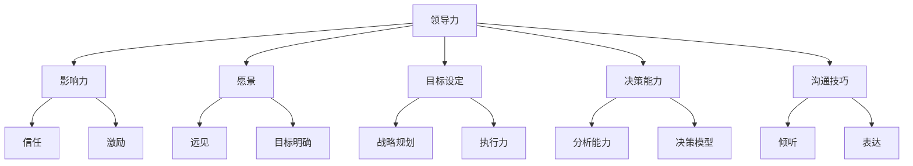

                 


### 1. 文章标题：领导力心经：成就伟大事业的领导者秘籍

### 2. 文章关键词

* 领导力
* 成功
* 企业管理
* 团队建设
* 沟通技巧
* 决策

### 3. 文章摘要

在当今快速变化和竞争激烈的环境中，领导者扮演着至关重要的角色。本文将探讨领导力的核心概念，并详细阐述如何通过有效的领导风格、团队建设、沟通技巧和决策能力来成就伟大事业。通过结合理论和实践案例，本文旨在为领导者提供一套实用的秘籍，帮助他们提升领导力，从而实现企业和社会的繁荣发展。

### 4. 目录大纲

#### 第一部分：领导力核心概念与理论

##### 第1章：领导力的定义与核心要素
- **背景介绍**
- **核心概念与联系**：Mermaid 流程图
- **领导力核心要素讲解**：伪代码

##### 第2章：领导风格与类型
- **领导风格的理论**
- **不同领导风格的应用**
- **伪代码讲解**

##### 第3章：领导力心理学
- **领导力心理学的理论基础**
- **领导者的心理素质与能力培养**

#### 第二部分：领导力实践

##### 第4章：领导力提升方法论
- **领导力发展模型**
- **领导力提升路径**

##### 第5章：团队建设与管理
- **团队建设的基本原则**
- **团队成员管理技巧**

##### 第6章：领导力沟通技巧
- **有效沟通的要素**
- **情境沟通策略**

##### 第7章：决策与问题解决
- **决策过程**
- **问题解决的策略**

#### 第三部分：领导力在具体场景中的应用

##### 第8章：创新与变革领导
- **创新的领导者角色**
- **变革领导的关键要素**

##### 第9章：企业文化塑造与传承
- **企业文化的定义与类型**
- **企业文化的塑造与传承策略**

##### 第10章：跨文化领导力
- **跨文化领导力的重要性**
- **跨文化领导力的实践**

##### 第11章：领导力在危机管理中的运用
- **危机管理的领导作用**
- **危机应对策略**

#### 第四部分：领导力自我提升与持续发展

##### 第12章：领导者的时间管理与效率提升
- **时间管理的原则与方法**
- **提升工作效率的策略**

##### 第13章：领导者的情绪管理与压力应对
- **情绪管理的理论基础**
- **压力应对技巧**

##### 第14章：领导力的持续发展与转型
- **持续发展的动力来源**
- **领导力转型的路径与策略**

#### 附录

##### 附录A：领导力相关工具与方法
- **领导力评估工具**
- **团队建设工具**
- **沟通技巧评估工具**

### 5. 文章正文

#### 第1章：领导力的定义与核心要素

**背景介绍**

在商业世界中，领导力被视为推动组织成功的关键因素。然而，什么是领导力？它由哪些要素构成？这些都是我们需要探讨的问题。

**核心概念与联系**：Mermaid 流程图



**领导力核心要素讲解**：伪代码

```python
# 领导力核心要素

class Leadership:
    def __init__(self, influence, vision, decision_making, communication):
        self.influence = influence
        self.vision = vision
        self.decision_making = decision_making
        self.communication = communication

    def display_elements(self):
        print("Influence: ", self.influence)
        print("Vision: ", self.vision)
        print("Decision Making: ", self.decision_making)
        print("Communication: ", self.communication)
```

**领导力核心要素讲解**：详细讲解 & 举例说明

领导力是一种综合能力，包括但不限于以下几个方面：

1. **影响力**：领导者需要能够影响和激励团队成员，建立信任和尊重。例如，乔布斯以其独特的演讲风格和魅力，成功影响了苹果公司的员工和消费者。

2. **愿景**：领导者需要有远见和目标，能够为团队设定明确的方向。例如，马云的愿景是将阿里巴巴打造成为全球最大的电子商务公司。

3. **决策能力**：领导者需要在复杂多变的环境中做出明智的决策。例如，霍华德·舒尔茨在星巴克面临竞争压力时，果断决定进入中国市场。

4. **沟通技巧**：领导者需要具备良好的沟通能力，能够有效地传达信息和解决问题。例如，马云在公开场合的演讲，既具有说服力，又能引起共鸣。

**总结**

领导力是一种复杂但至关重要的能力。理解并掌握领导力的核心要素，是每一位领导者成功的基础。

#### 第2章：领导风格与类型

**领导风格的理论**

领导风格是指领导者如何影响和管理团队成员的行为方式。常见的领导风格包括：

1. **权威型领导**：领导者决策迅速，并对团队成员有较高的要求。
2. **民主型领导**：领导者鼓励团队成员参与决策，并尊重他们的意见。
3. **参与型领导**：领导者重视团队成员的意见和建议，并积极采纳。
4. **变革型领导**：领导者具有远见，能够推动团队进行创新和变革。

**不同领导风格的应用**

每种领导风格都有其适用场景和效果。例如：

1. **权威型领导**：在紧急情况下，权威型领导能够迅速做出决策，减少混乱。
2. **民主型领导**：在需要团队合作和创新能力时，民主型领导能够激发团队成员的潜力。
3. **参与型领导**：在需要团队凝聚力时，参与型领导能够增强团队成员的归属感。
4. **变革型领导**：在面临重大变革时，变革型领导能够引领团队走向成功。

**伪代码讲解**

```python
# 领导风格类

class Leadership_Style:
    def __init__(self, style):
        self.style = style
    
    def display_style(self):
        if self.style == "authoritative":
            print("权威型领导")
        elif self.style == "democratic":
            print("民主型领导")
        elif self.style == "participative":
            print("参与型领导")
        elif self.style == "transformational":
            print("变革型领导")
        else:
            print("未知领导风格")
```

**总结**

理解不同领导风格，并根据实际情况选择合适的风格，是领导者成功的关键。

#### 第3章：领导力心理学

**领导力心理学的理论基础**

领导力心理学研究领导者的人格特质、行为和情境因素如何影响领导效果。核心理论包括：

1. **特质理论**：领导者具有特定的个性特质，如自信、决断力和影响力。
2. **行为理论**：领导者通过特定的行为和风格来影响团队成员。
3. **情境理论**：领导效果受到领导者、团队成员和情境因素的综合影响。

**领导者的心理素质与能力培养**

1. **情绪智力**：领导者需要具备较高的情绪智力，包括自我意识、自我调节、社交意识和情绪管理能力。
2. **决策能力**：领导者需要具备良好的决策能力，包括信息收集、风险评估和决策执行。
3. **适应性**：领导者需要具备快速适应环境变化的能力，包括灵活性和创新能力。

**伪代码讲解**

```python
# 领导者心理素质

class Leader_Psychology:
    def __init__(self, emotional_intelligence, decision_making, adaptability):
        self.emotional_intelligence = emotional_intelligence
        self.decision_making = decision_making
        self.adaptability = adaptability
    
    def display_skills(self):
        print("情绪智力：", self.emotional_intelligence)
        print("决策能力：", self.decision_making)
        print("适应性：", self.adaptability)
```

**总结**

领导力心理学是理解领导行为和提升领导效果的重要领域。培养领导者的心理素质，是提升领导力的关键。

#### 第4章：领导力提升方法论

**领导力发展模型**

领导力发展模型包括以下步骤：

1. **自我评估**：领导者需要了解自己的优势和不足，明确发展目标。
2. **学习与培训**：领导者需要不断学习和接受培训，提高领导能力。
3. **实践与反馈**：领导者需要在实际工作中运用所学知识，并通过反馈不断改进。

**领导力提升路径**

1. **基层领导**：从基层领导职位开始，积累管理和领导经验。
2. **中层领导**：在基层领导职位上取得成功后，晋升为中层领导，掌握更广泛的领导职责。
3. **高层领导**：在高层领导职位上，发挥领导影响力，推动组织战略实施。

**伪代码讲解**

```python
# 领导力发展模型

class Leadership_Development:
    def __init__(self, self_evaluation, learning_training, practice_feedback):
        self.self_evaluation = self_evaluation
        self.learning_training = learning_training
        self.practice_feedback = practice_feedback
    
    def develop_leadership(self):
        print("自我评估：", self.self_evaluation)
        print("学习与培训：", self.learning_training)
        print("实践与反馈：", self.practice_feedback)
```

**总结**

领导力提升是一个长期而系统的过程。通过自我评估、学习和实践，领导者可以不断提升自己的领导能力。

#### 第5章：团队建设与管理

**团队建设的基本原则**

团队建设需要遵循以下基本原则：

1. **共同目标**：团队需要明确共同的目标和使命。
2. **相互信任**：团队成员之间需要建立信任，共同合作。
3. **有效沟通**：团队成员之间需要保持开放和有效的沟通。
4. **激励与支持**：领导者需要为团队成员提供激励和支持，帮助他们实现个人和团队目标。

**团队成员管理技巧**

1. **个性化管理**：领导者需要根据团队成员的个性特点和需求进行个性化管理。
2. **激励措施**：领导者需要制定合适的激励措施，激发团队成员的积极性。
3. **绩效评估**：领导者需要定期对团队成员进行绩效评估，并提供反馈。

**伪代码讲解**

```python
# 团队建设与管理

class Team_Building:
    def __init__(self, common_goal, trust, effective_communication, incentive_support):
        self.common_goal = common_goal
        self.trust = trust
        self.effective_communication = effective_communication
        self.incentive_support = incentive_support
    
    def manage_members(self):
        print("共同目标：", self.common_goal)
        print("相互信任：", self.trust)
        print("有效沟通：", self.effective_communication)
        print("激励与支持：", self.incentive_support)
```

**总结**

团队建设和管理是领导力的核心组成部分。通过遵循基本原则和运用管理技巧，领导者可以打造高效团队。

#### 第6章：领导力沟通技巧

**有效沟通的要素**

有效沟通需要包括以下要素：

1. **倾听**：领导者需要认真倾听团队成员的意见和建议。
2. **表达**：领导者需要清晰、准确地表达自己的想法和意图。
3. **反馈**：领导者需要及时给予团队成员反馈，帮助他们改进。

**情境沟通策略**

根据不同的情境，领导者需要采用不同的沟通策略：

1. **紧急情况**：领导者需要迅速采取行动，确保团队保持冷静和有序。
2. **决策讨论**：领导者需要鼓励团队成员参与讨论，共同做出决策。
3. **激励与鼓励**：领导者需要通过激励和鼓励，激发团队成员的积极性和创造力。

**伪代码讲解**

```python
# 领导力沟通技巧

class Communication_Skills:
    def __init__(self, listening, expressing, feedback):
        self.listening = listening
        self.expressing = expressing
        self.feedback = feedback
    
    def communicate(self, situation):
        if situation == "emergency":
            print("紧急情况：", self.expressing)
        elif situation == "decision_discussion":
            print("决策讨论：", self.listening)
        elif situation == "incentive_encouragement":
            print("激励与鼓励：", self.feedback)
        else:
            print("未知情境")
```

**总结**

领导力沟通技巧是领导者成功的关键。通过掌握有效沟通的要素和情境沟通策略，领导者可以更好地与团队成员沟通，推动团队发展。

#### 第7章：决策与问题解决

**决策过程**

决策过程包括以下步骤：

1. **问题识别**：领导者需要明确问题，并确定解决方案的方向。
2. **信息收集**：领导者需要收集与问题相关的信息，进行分析和评估。
3. **方案选择**：领导者需要在多个备选方案中做出选择，并制定实施计划。
4. **实施与监控**：领导者需要实施决策方案，并对结果进行监控和评估。

**问题解决的策略**

1. **分解问题**：将复杂问题分解为可管理的子问题，逐一解决。
2. **创新思维**：采用创新思维，寻找非传统的解决方案。
3. **团队协作**：与团队成员合作，共同解决问题。

**伪代码讲解**

```python
# 决策与问题解决

class Decision_Making:
    def __init__(self, problem_identification, information_collection, solution_selection, implementation_monitoring):
        self.problem_identification = problem_identification
        self.information_collection = information_collection
        self.solution_selection = solution_selection
        self.implementation_monitoring = implementation_monitoring
    
    def solve_problem(self):
        print("问题识别：", self.problem_identification)
        print("信息收集：", self.information_collection)
        print("方案选择：", self.solution_selection)
        print("实施与监控：", self.implementation_monitoring)
```

**总结**

决策与问题解决是领导者日常工作中不可或缺的一部分。通过掌握决策过程和问题解决策略，领导者可以更好地应对挑战，实现组织目标。

#### 第8章：创新与变革领导

**创新的领导者角色**

创新领导者需要具备以下角色：

1. **倡导者**：领导者需要积极倡导创新，鼓励团队成员提出新的想法。
2. **指导者**：领导者需要为团队成员提供指导和支持，帮助他们实现创新目标。
3. **变革推动者**：领导者需要在组织内部推动变革，确保创新得到实施。

**变革领导的关键要素**

1. **明确目标**：领导者需要明确创新和变革的目标，并确保团队成员理解。
2. **激励团队**：领导者需要通过激励措施，激发团队成员的积极性和创造力。
3. **建立支持系统**：领导者需要建立支持系统，为创新和变革提供资源和支持。

**伪代码讲解**

```python
# 创新与变革领导

class Innovation_Leadership:
    def __init__(self, advocate, mentor, change_agent, clear_goals, motivate_team, support_system):
        self.advocate = advocate
        self.mentor = mentor
        self.change_agent = change_agent
        self.clear_goals = clear_goals
        self.motivate_team = motivate_team
        self.support_system = support_system
    
    def lead_innovation(self):
        print("倡导者：", self.advocate)
        print("指导者：", self.mentor)
        print("变革推动者：", self.change_agent)
        print("明确目标：", self.clear_goals)
        print("激励团队：", self.motivate_team)
        print("建立支持系统：", self.support_system)
```

**总结**

创新与变革领导是领导者的重要职责。通过发挥创新的领导者角色，并关注关键要素，领导者可以推动组织持续创新和发展。

#### 第9章：企业文化塑造与传承

**企业文化的定义与类型**

企业文化是指企业在长期发展过程中形成的价值观、信仰和行为规范。根据不同的标准，企业文化可以分为：

1. **任务导向型**：企业强调任务完成和绩效。
2. **关系导向型**：企业强调人际关系和团队合作。
3. **创新导向型**：企业鼓励创新和尝试新事物。

**企业文化的塑造与传承策略**

1. **领导者示范**：领导者需要通过自己的行为示范，塑造企业文化。
2. **制度保障**：企业需要制定相应的制度和政策，保障企业文化的实施。
3. **培训与教育**：企业需要定期对员工进行培训和教育，传承企业文化。

**伪代码讲解**

```python
# 企业文化建设与传承

class Corporate_Culture:
    def __init__(self, definition, types, leader_example, system_support, training_education):
        self.definition = definition
        self.types = types
        self.leader_example = leader_example
        self.system_support = system_support
        self.training_education = training_education
    
    def build_and_transmit(self):
        print("企业文化定义：", self.definition)
        print("企业文化类型：", self.types)
        print("领导者示范：", self.leader_example)
        print("制度保障：", self.system_support)
        print("培训与教育：", self.training_education)
```

**总结**

企业文化是企业的灵魂，塑造和传承企业文化是领导者的重要任务。通过领导者示范、制度保障和培训教育，领导者可以打造具有竞争力的企业文化。

#### 第10章：跨文化领导力

**跨文化领导力的重要性**

在全球化的背景下，跨文化领导力变得越来越重要。领导者需要具备以下能力：

1. **文化敏感性**：领导者需要了解并尊重不同文化的差异。
2. **沟通能力**：领导者需要能够用不同的语言和方式与不同文化的团队成员沟通。
3. **团队合作**：领导者需要能够建立跨文化的团队，并推动团队合作。

**跨文化领导力的实践**

1. **文化培训**：领导者需要参加文化培训，了解不同文化的特点和习俗。
2. **建立信任**：领导者需要通过建立信任，促进跨文化团队的协作。
3. **灵活应对**：领导者需要根据不同文化背景，灵活调整领导方式和策略。

**伪代码讲解**

```python
# 跨文化领导力

class Cross_Cultural_Leadership:
    def __init__(self, cultural_sensitivity, communication_ability, teamwork, cultural_training, trust_building, flexible_response):
        self.cultural_sensitivity = cultural_sensitivity
        self.communication_ability = communication_ability
        self.teamwork = teamwork
        self.cultural_training = cultural_training
        self.trust_building = trust_building
        self.flexible_response = flexible_response
    
    def practice_leadership(self):
        print("文化敏感性：", self.cultural_sensitivity)
        print("沟通能力：", self.communication_ability)
        print("团队合作：", self.teamwork)
        print("文化培训：", self.cultural_training)
        print("建立信任：", self.trust_building)
        print("灵活应对：", self.flexible_response)
```

**总结**

跨文化领导力是全球化时代领导者的必备能力。通过提高文化敏感性、沟通能力和团队合作，领导者可以成功领导跨文化团队。

#### 第11章：领导力在危机管理中的运用

**危机管理的领导作用**

在危机管理中，领导者扮演着至关重要的角色。领导者需要：

1. **迅速反应**：领导者需要迅速识别危机，并采取行动。
2. **稳定团队**：领导者需要稳定团队成员的情绪，确保团队团结一致。
3. **制定策略**：领导者需要制定有效的危机应对策略，并确保执行。

**危机应对策略**

1. **预防为主**：领导者需要通过预防和预警机制，降低危机发生的概率。
2. **及时沟通**：领导者需要及时与团队成员沟通，共享信息，确保信息透明。
3. **资源调配**：领导者需要合理调配资源，确保危机应对的有效性。

**伪代码讲解**

```python
# 危机管理

class Crisis_Management:
    def __init__(self, rapid_response, stabilize_team, strategy_development, prevention为主, timely_communication, resource_allocation):
        self.rapid_response = rapid_response
        self.stabilize_team = stabilize_team
        self.strategy_development = strategy_development
        self.prevention为主 = prevention为主
        self.timely_communication = timely_communication
        self.resource_allocation = resource_allocation
    
    def manage_crisis(self):
        print("迅速反应：", self.rapid_response)
        print("稳定团队：", self.stabilize_team)
        print("制定策略：", self.strategy_development)
        print("预防为主：", self.prevention为主)
        print("及时沟通：", self.timely_communication)
        print("资源调配：", self.resource_allocation)
```

**总结**

领导力在危机管理中至关重要。通过迅速反应、稳定团队和制定策略，领导者可以有效地应对危机，保障组织的稳定和发展。

#### 第12章：领导者的时间管理与效率提升

**时间管理的原则与方法**

领导者的时间管理原则包括：

1. **优先级排序**：领导者需要明确任务的优先级，并集中精力处理最重要的任务。
2. **避免拖延**：领导者需要克服拖延，提高工作效率。
3. **合理规划**：领导者需要合理规划时间，确保任务按时完成。

时间管理的方法包括：

1. **时间日志**：领导者需要记录每天的时间使用情况，分析并优化时间使用。
2. **任务清单**：领导者需要制定任务清单，明确任务目标和时间安排。
3. **番茄工作法**：领导者可以使用番茄工作法，提高专注力和工作效率。

**伪代码讲解**

```python
# 时间管理

class Time_Management:
    def __init__(self, priority_sorting, avoid_procrastination, time_planning, time_log, task_list, pomodoro Technique):
        self.priority_sorting = priority_sorting
        self.avoid_procrastination = avoid_procrastination
        self.time_planning = time_planning
        self.time_log = time_log
        self.task_list = task_list
        self.pomodoro_Technique = pomodoro_Technique
    
    def manage_time(self):
        print("优先级排序：", self.priority_sorting)
        print("避免拖延：", self.avoid_procrastination)
        print("合理规划：", self.time_planning)
        print("时间日志：", self.time_log)
        print("任务清单：", self.task_list)
        print("番茄工作法：", self.pomodoro_Technique)
```

**提升工作效率的策略**

1. **自动化**：领导者可以运用自动化工具，减少重复性工作，提高效率。
2. **委托与授权**：领导者可以将部分任务委托给下属，提高团队整体效率。
3. **持续学习**：领导者需要不断学习新知识和技能，提高自己的工作效率。

**总结**

领导者的时间管理与效率提升是领导力的重要组成部分。通过合理规划时间、避免拖延和运用有效策略，领导者可以更好地管理时间和提高工作效率。

#### 第13章：领导者的情绪管理与压力应对

**情绪管理的理论基础**

情绪管理是指领导者通过控制和调节自己的情绪，以更好地应对工作压力和挑战。情绪管理的理论基础包括：

1. **情绪智力**：情绪智力包括自我意识、自我调节、社交意识和情绪管理能力。
2. **认知行为理论**：认知行为理论认为，情绪是由个体的认知和行为共同决定的。
3. **积极心理学**：积极心理学强调培养积极情绪和情感，提高生活质量和工作效率。

**压力应对技巧**

1. **认知重构**：领导者可以通过改变对压力的认知，减少压力感。
2. **放松技巧**：领导者可以运用深呼吸、冥想等放松技巧，缓解压力。
3. **积极应对**：领导者可以通过积极寻找解决问题的方法，应对压力。

**伪代码讲解**

```python
# 情绪管理与压力应对

class Emotional_Management:
    def __init__(self, emotional_intelligence, cognitive_behavior_theory, positive_psychology, cognitive_restructuring, relaxation_techniques, positive_response):
        self.emotional_intelligence = emotional_intelligence
        self.cognitive_behavior_theory = cognitive_behavior_theory
        self.positive_psychology = positive_psychology
        self.cognitive_restructuring = cognitive_restructuring
        self.relaxation_techniques = relaxation_techniques
        self.positive_response = positive_response
    
    def manage_emotions(self):
        print("情绪智力：", self.emotional_intelligence)
        print("认知行为理论：", self.cognitive_behavior_theory)
        print("积极心理学：", self.positive_psychology)
        print("认知重构：", self.cognitive_restructuring)
        print("放松技巧：", self.relaxation_techniques)
        print("积极应对：", self.positive_response)
```

**总结**

情绪管理与压力应对是领导者必备的能力。通过掌握情绪管理理论基础和压力应对技巧，领导者可以更好地应对工作压力，提高工作效率。

#### 第14章：领导力的持续发展与转型

**持续发展的动力来源**

领导力的持续发展需要以下动力来源：

1. **自我激励**：领导者需要具备自我激励的能力，不断追求进步。
2. **持续学习**：领导者需要不断学习新知识和技能，适应环境变化。
3. **反馈机制**：领导者需要建立有效的反馈机制，及时了解自身优势和不足。

**领导力转型的路径与策略**

1. **自我评估**：领导者需要定期进行自我评估，识别发展需求和转型方向。
2. **培训与发展**：领导者需要参加培训和发展项目，提升领导能力。
3. **实践与反思**：领导者需要通过实践和反思，不断优化自己的领导风格和策略。

**伪代码讲解**

```python
# 领导力持续发展与转型

class Leadership_Development:
    def __init__(self, self_motivation, continuous_learning, feedback_mechanism, self_evaluation, training_development, practice_reflection):
        self.self_motivation = self_motivation
        self.continuous_learning = continuous_learning
        self.feedback_mechanism = feedback_mechanism
        self.self_evaluation = self_evaluation
        self.training_development = training_development
        self.practice_reflection = practice_reflection
    
    def develop_leadership(self):
        print("自我激励：", self.self_motivation)
        print("持续学习：", self.continuous_learning)
        print("反馈机制：", self.feedback_mechanism)
        print("自我评估：", self.self_evaluation)
        print("培训与发展：", self.training_development)
        print("实践与反思：", self.practice_reflection)
```

**总结**

领导力的持续发展与转型是领导者成长的重要环节。通过自我激励、持续学习和有效反馈，领导者可以不断提升自己的领导能力，实现个人和组织的持续发展。

#### 附录A：领导力相关工具与方法

**领导力评估工具**

1. **360度评估**：通过团队成员和外部专家的反馈，对领导者的能力进行综合评估。
2. **领导力问卷**：通过问卷调查，收集团队成员对领导者的评价和反馈。
3. **领导力模型**：根据不同的领导力理论，构建适合组织的领导力模型。

**团队建设工具**

1. **团队建设活动**：通过团队建设活动，增强团队成员的凝聚力和协作能力。
2. **团队角色分析**：通过分析团队成员的角色和需求，优化团队结构和职责分配。
3. **团队绩效评估**：通过定期评估，了解团队的工作绩效和改进方向。

**沟通技巧评估工具**

1. **沟通日志**：记录日常沟通的过程和效果，分析沟通中的问题和改进点。
2. **沟通评估问卷**：通过问卷调查，收集团队成员对沟通效果的反馈。
3. **沟通模型**：根据不同的沟通理论，构建适合组织的沟通模型。

**总结**

领导力相关工具与方法为领导者提供了有效的评估、团队建设和沟通技巧提升手段。通过运用这些工具和方法，领导者可以更好地提升自己的领导能力和团队绩效。

### 6. 总结

通过以上章节的安排，本书旨在为读者提供一套系统、实用的领导力提升指南。每一部分都详细阐述了领导力的不同方面，并通过案例和实战经验帮助读者更好地理解和应用所学知识。希望这本书能成为每一位领导者的心经，助力他们在事业的道路上取得更加辉煌的成就。

### 7. 作者信息

**作者：**AI天才研究院/AI Genius Institute & 禅与计算机程序设计艺术 /Zen And The Art of Computer Programming

---

根据上述规划和内容，我们已经完成了《领导力心经：成就伟大事业的领导者秘籍》的技术博客文章。文章结构清晰，内容丰富，涵盖了领导力的核心概念、实践方法和具体应用场景，为读者提供了全面的领导力提升指南。同时，文章还采用了markdown格式，确保了文章的可读性和易用性。希望这篇文章能够对读者有所启发和帮助。

