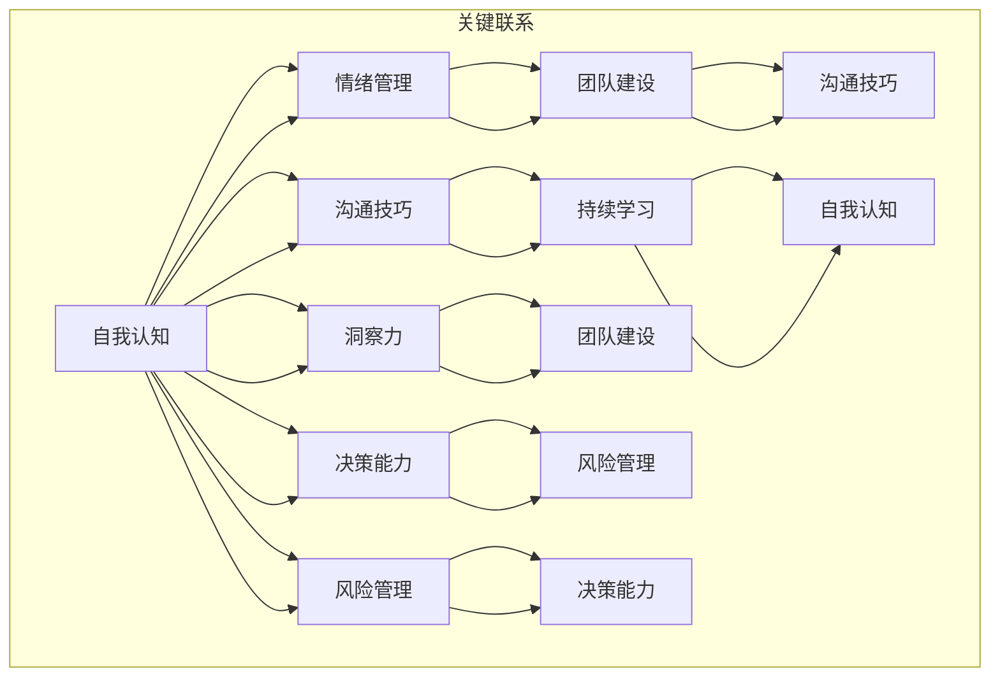

                 

### 文章标题

《领导力思维：改变世界的领导力修炼法则》

### 文章关键词

- 领导力
- 思维模式
- 个人成长
- 策略与实践
- 数学模型
- 项目实战

### 文章摘要

本文旨在探讨领导力思维的构建与修炼，通过深入剖析领导力思维的核心概念、策略与实践，结合数学模型与项目实战，揭示领导力在个人成长和组织发展中的关键作用。文章以逻辑清晰、结构紧凑的方式，为广大读者提供了一部系统的领导力思维修炼指南。

## 目录

1. 引言
2. 领导力的定义与价值
3. 领导力思维的核心概念
4. 领导力思维与个人成长
5. 领导力思维的策略与实践
6. 领导力思维案例分析
7. 领导力思维的数学模型
8. 领导力思维的项目实战
9. 领导力思维的持续修炼
10. 领导力思维的实践指南
11. 附录：领导力思维相关资源与工具

## 引言

领导力是一种复杂的技能，它不仅仅是职位赋予的权力，更是一种个人品质和思维方式的体现。在现代社会，领导力已经超越了传统的权威和命令控制，而是更多地依赖于影响力、协作和愿景的塑造。本文将通过分析领导力思维的核心概念、策略与实践，帮助读者深入了解并修炼领导力思维，从而在个人成长和组织发展中发挥更大的作用。

领导力思维不仅仅是一种抽象的概念，它具有实际的操作方法和具体的实践路径。通过本文的探讨，我们将认识到领导力思维的本质，掌握领导力思维的核心策略，并能够在实际项目中运用这些策略，提升个人和团队的绩效。同时，本文还将介绍领导力思维的数学模型，帮助读者从量化角度理解和应用领导力思维。

本文结构如下：首先，我们将探讨领导力的定义和价值，理解领导力在不同场景下的表现形式。接着，我们将深入分析领导力思维的核心概念，并展示这些概念之间的关系架构。随后，我们将探讨领导力思维在个人成长中的重要作用，并提供具体的策略和实践方法。接着，我们将通过案例分析，展示领导力思维在实际中的应用，并分析成功和失败案例中的领导力思维差异。然后，我们将介绍领导力思维的数学模型，帮助读者从量化角度理解和应用领导力思维。最后，我们将通过项目实战，展示领导力思维在实际项目中的应用，并提供实践指南。

通过本文的阅读，读者将能够系统地理解领导力思维，掌握其核心概念和实践策略，并在个人和组织的成长过程中，发挥领导力思维的关键作用。让我们一起开启这段探索领导力思维的旅程吧！

## 领导力的定义与价值

领导力是一种多维度的概念，涉及到个人、团队和组织三个层面的互动和影响。在个人层面，领导力表现为个体如何通过自身的行为和决策来影响他人；在团队层面，领导力体现在如何协调和激励团队成员，实现共同的目标；在组织层面，领导力关乎如何塑造组织的文化、战略和愿景，推动组织向前发展。

### 领导力的定义

关于领导力的定义，不同的学者和专家有着不同的理解。泰瑞·彼得森（Terry Pettitt）将领导力定义为：“领导力是激发人们跟随你前进的能力，不仅仅是为了完成任务，更是为了实现共同的目标。”这种定义强调了领导力的核心在于影响和激励他人，而不仅仅是执行任务。

斯蒂芬·罗宾斯（Stephen Robbins）在其著作《组织行为学》中将领导力定义为：“领导力是在特定情境下，通过影响力来引导、激励和激励他人实现组织目标的过程。”这一定义强调了领导力不仅涉及个人能力，还涉及在特定情境下的应用。

### 领导力的价值

领导力在企业和社会中具有巨大的价值。首先，领导力能够推动企业创新和持续发展。领导者通过设定愿景、激励团队和推动变革，激发员工的创造力和创新精神，从而推动企业的持续进步。

其次，领导力有助于提高团队协作效率和绩效。通过有效的领导，团队成员能够明确目标、协调行动，并克服内部障碍，实现高效合作。领导者还能够在团队中建立信任和尊重，增强团队的凝聚力。

最后，领导力在个人成长和职业发展中扮演着关键角色。领导力不仅仅是职位赋予的权力，更是一种个人能力和品质。通过修炼领导力，个人能够提升自我认知、增强决策能力和领导团队的能力，从而在职业生涯中获得更大的成功。

总之，领导力作为一种重要的个人素质和领导技能，对于企业和社会的发展具有深远的影响。理解领导力的定义和价值，是培养和提升领导力思维的第一步。在接下来的章节中，我们将深入探讨领导力思维的核心概念，并分析其在不同情境下的应用。

## 领导力思维的核心概念

领导力思维是一种复杂的认知过程，涉及多个核心概念。理解这些概念及其相互关系，是培养高效领导力思维的基础。以下是几个关键的核心概念：

### 自我认知

自我认知是领导力思维的基石。它涉及领导者对自己性格、能力、优点和缺点的了解。一个具有良好自我认知的领导者能够更好地定位自己的角色，识别自己的优势和弱点，并在此基础上制定合适的领导策略。

### 情绪管理

情绪管理是领导力思维中不可或缺的一部分。领导者需要学会如何调节和管理自己的情绪，以便在压力和挑战面前保持冷静和理智。情绪管理的有效实践能够增强领导者的决策能力，并提升团队士气。

### 沟通技巧

沟通技巧是领导力思维的重要组成部分。领导者需要通过有效的沟通来传达愿景、激励团队成员和解决问题。良好的沟通技巧能够增强团队的凝聚力，提升团队协作效率。

### 洞察力

洞察力是领导者对环境和形势的深刻理解能力。具备洞察力的领导者能够预见趋势、识别潜在问题和机会，并迅速作出反应。这种能力对于企业的创新和持续发展至关重要。

### 决策能力

决策能力是领导力思维的核心。领导者需要能够迅速而明智地做出决策，并承担相应的责任。有效的决策能力能够推动团队朝着目标前进，并在竞争激烈的市场环境中取得优势。

### 风险管理

风险管理是领导者必须面对的挑战之一。有效的风险管理能够帮助领导者识别并应对潜在的风险，确保团队和组织的稳定发展。

### 团队建设

团队建设是领导力思维的重要方面。领导者需要能够识别团队成员的优势和潜力，并将他们整合到一个高效的团队中。团队建设不仅包括技能的整合，还涉及文化的建设和价值观的传递。

### 持续学习

持续学习是领导力思维的持续动力。领导者需要不断学习新知识、新技能，并适应不断变化的环境。持续学习能够提升领导者的适应能力和创新能力，为团队和组织带来新的活力。

### 核心概念关系架构

为了更好地理解这些核心概念之间的关系，我们可以使用Mermaid流程图来展示它们之间的联系：



这个流程图清晰地展示了自我认知作为领导力思维的基石，如何与其他核心概念相互联系和影响。通过这种结构化的理解，领导者可以更系统地培养和提升自己的领导力思维。

在接下来的章节中，我们将进一步探讨这些核心概念的具体应用，并通过实际案例和策略，帮助读者深入理解并实践领导力思维。

### 领导力思维与个人成长

领导力思维不仅仅是一种职业技能，更是一种个人成长的体现。在个人成长的过程中，领导力思维发挥着至关重要的作用，帮助个体克服挑战、实现目标，并在职业生涯中取得更大的成功。

首先，领导力思维有助于提升自我认知。自我认知是个人成长的基础，它包括对自己的性格、价值观、优势和缺点的深刻理解。通过修炼领导力思维，个体能够更加清晰地认识自己的优势和不足，从而制定出更加合理的个人发展计划。例如，一个具备良好自我认知的领导者会意识到自己在沟通技巧方面的不足，因此会积极寻求改进和提升，这不仅增强了其领导力，也为个人成长奠定了坚实的基础。

其次，领导力思维能够提升决策能力。决策能力是领导者必须具备的重要能力之一，它体现在面对复杂问题和不确定性时，能够迅速做出明智而有效的决策。个人在成长过程中，也会面临各种选择和挑战，通过培养领导力思维，个体能够更加冷静和理智地面对这些决策，从而避免因冲动或盲目而导致的错误选择。例如，一个在团队中担任领导角色的学生，通过修炼领导力思维，能够在面临学术和社交活动之间的选择时，做出更加明智的决策，平衡学习和生活，实现全面发展。

再者，领导力思维有助于情绪管理。在个人成长过程中，情绪管理是一个重要的挑战。有效的情绪管理能够帮助个体在面对压力和挫折时保持冷静和理智，从而更好地应对挑战。领导力思维的修炼，使个体能够学会如何调节和管理自己的情绪，不仅提升了自身的情绪智力，也为个人成长创造了更加稳定和和谐的环境。例如，一个面临考试压力的学生，通过练习情绪管理技巧，能够更好地调整心态，应对压力，从而在考试中发挥出最佳水平。

此外，领导力思维还能够促进持续学习。持续学习是个人成长的重要动力，它帮助个体不断拓展知识边界，提升技能和能力。通过培养领导力思维，个体能够更加主动地学习新知识、新技能，并适应快速变化的环境。这种持续学习的态度不仅使个体在职业生涯中保持竞争力，也为个人成长带来了无限的可能性。例如，一个在职场中担任管理职位的员工，通过不断学习和提升领导力思维，能够更好地适应企业发展的需求，从而在职业道路上走得更远。

最后，领导力思维有助于团队协作。在个人成长的过程中，团队协作是一个不可或缺的部分。通过培养领导力思维，个体能够更好地理解和协调团队成员的需求和目标，推动团队共同进步。一个具备良好领导力思维的个人，能够在团队中发挥关键作用，不仅能够提升团队的整体效能，也为个人成长创造了良好的团队环境。例如，一个在学术团队中担任领导角色的学生，通过有效的团队协作，能够推动团队完成复杂的研究项目，并在过程中不断提升自己的团队领导能力。

总之，领导力思维在个人成长中扮演着重要角色。它不仅帮助个体提升自我认知、决策能力、情绪管理、持续学习和团队协作能力，还为实现职业发展和生活目标提供了有力支持。通过修炼领导力思维，个体能够在不断变化的环境中保持竞争力，实现个人成长和职业成功。

在接下来的章节中，我们将进一步探讨领导力思维的策略与实践，帮助读者将这些概念应用到实际生活和工作中，从而更好地实现个人成长和职业发展。

### 领导力思维的策略与实践

在理解了领导力思维的核心概念之后，我们接下来将讨论具体的策略和实践方法，这些策略和实践将帮助领导者更有效地应用领导力思维，提升团队绩效和实现组织目标。

#### 设定愿景与目标

设定愿景和目标是领导力的核心任务之一。一个清晰而具有吸引力的愿景能够激发团队成员的激情和动力，使他们朝着共同的目标努力。为了设定有效的愿景和目标，领导者需要遵循以下步骤：

1. **分析当前状况**：首先，领导者需要深入了解团队的现状，包括团队的资源和能力、面临的挑战和机遇等。这可以通过市场调研、员工反馈和团队会议等方式进行。

2. **确定长期目标**：基于当前状况，领导者需要设定一个长期目标，这个目标应当具有挑战性但也是可以实现的。例如，一个企业的长期目标可能是“在未来五年内，成为行业领导者”。

3. **分解为短期目标**：为了实现长期目标，领导者需要将其分解为一系列短期目标。这些短期目标应当具体、可衡量、可实现、相关性强、时限明确（SMART原则）。例如，如果长期目标是成为行业领导者，那么短期目标可以设定为“明年实现收入增长20%”。

4. **与团队成员沟通**：设定目标后，领导者需要与团队成员进行充分的沟通，确保每个人都能理解并认同这些目标。这可以通过团队会议、一对一交流等方式实现。

#### 建立团队协作

建立团队协作是实现高效领导的关键。一个高效的团队能够发挥每个成员的优势，协同完成任务。为了建立良好的团队协作，领导者可以采取以下策略：

1. **明确角色与职责**：领导者需要明确每个团队成员的角色和职责，确保每个人都知道自己的任务和责任。这可以通过团队手册、角色说明书等方式实现。

2. **促进沟通与交流**：领导者需要鼓励团队成员之间的沟通和交流，创建一个开放和透明的工作环境。这可以通过定期的团队会议、小组讨论和反馈机制等方式实现。

3. **培养团队文化**：领导者需要培养积极向上的团队文化，包括共同的价值观、目标和工作方式。这可以通过团队建设活动、价值观宣贯和庆祝团队成就等方式实现。

4. **激发团队创造力**：领导者需要鼓励团队成员发挥创造力，提出新想法和建议。这可以通过头脑风暴会议、创新奖励机制等方式实现。

#### 创新与变革

在快速变化的市场环境中，创新和变革是组织持续发展的关键。领导者需要具备推动创新和变革的能力。以下是一些策略：

1. **鼓励创新思维**：领导者需要鼓励团队成员敢于尝试新思路、新方法，并对失败持开放态度。这可以通过创新实验室、内部创业计划等方式实现。

2. **建立创新机制**：领导者需要建立一套创新机制，包括创新项目审批流程、资源分配和奖励机制等，以支持团队的创新活动。

3. **培训与创新技能**：领导者需要为团队成员提供创新技能培训，包括创造性思维技巧、技术发展趋势分析等，以提升团队的创新能力。

4. **风险管理**：在推动创新和变革的过程中，领导者需要建立有效的风险管理机制，识别和应对潜在的风险，确保创新活动的顺利进行。

#### 案例分析

以下是一个关于领导力思维策略与实践的案例：

**案例背景**：某科技公司面临激烈的市场竞争，需要通过创新和变革来保持竞争力。

**愿景与目标**：公司愿景是成为全球领先的科技公司，短期目标是实现产品创新和市场份额增长。

**团队协作**：公司领导层通过设立跨部门团队，促进不同部门之间的沟通和协作。同时，定期举行团队会议，收集员工意见和建议，确保团队成员对目标和方向有清晰的认识。

**创新与变革**：公司鼓励员工提出创新项目，并设立专门的创新基金支持这些项目。此外，公司还举办创新竞赛，激发员工的创新思维和创造力。

**效果评估**：通过这些策略，公司在短短两年内推出了多个创新产品，市场份额显著提升，员工士气也得到了大幅提高。

**总结**：这个案例展示了领导力思维在设定愿景、建立团队协作、推动创新与变革中的关键作用。通过有效的领导力策略和实践，公司不仅保持了竞争力，还实现了持续发展。

通过上述策略与实践，领导者可以更有效地应用领导力思维，提升团队绩效和实现组织目标。在接下来的章节中，我们将通过更多实际案例，深入探讨领导力思维在不同情境下的应用。

### 领导力思维案例分析

在探讨领导力思维的具体应用时，通过实际案例的分析可以更加直观地理解其效果和影响。本文将选择两个具有代表性的案例，分别展示领导力思维在成功和失败情境下的应用，通过分析这些案例，我们将深入探讨领导力思维的核心要素及其重要性。

#### 成功案例：谷歌（Google）

**案例背景**：谷歌作为全球领先的技术公司，其成功离不开其卓越的领导力思维。谷歌的创始人拉里·佩奇（Larry Page）和谢尔盖·布林（Sergey Brin）通过独特的领导力思维，塑造了公司创新、开放和多元化的文化。

**领导力思维应用**：

1. **愿景与目标设定**：佩奇和布林在公司初期就明确了“组织世界上所有的信息，让每个人都能访问并从中受益”的宏伟愿景。这个愿景不仅激励了员工，也为公司的战略方向提供了明确的指引。

2. **团队协作与沟通**：谷歌非常注重团队协作，鼓励跨部门的沟通和合作。公司设立了“20%时间”项目，允许员工将20%的工作时间用于自己感兴趣的创新项目，从而激发了员工的创造力和主动性。

3. **创新与变革**：谷歌始终致力于推动技术创新和业务模式的变革。通过不断推出新产品和服务，如Google Search、Gmail、Google Maps等，谷歌在竞争激烈的市场中保持了领先地位。

**效果分析**：通过卓越的领导力思维，谷歌不仅实现了快速发展和持续创新，还成为全球最具创新力和竞争力的科技公司之一。员工的满意度和工作效率也得到了显著提升。

**核心要素**：

- **清晰的愿景与目标**：愿景和目标是领导力思维的核心，它们为团队提供了明确的方向和动力。
- **开放和透明的沟通**：良好的沟通能够增强团队的凝聚力，促进协作和创新。
- **鼓励创新与变革**：持续的创新和变革是保持竞争力的关键，领导者需要为此提供支持和资源。

#### 失败案例：诺基亚（Nokia）

**案例背景**：诺基亚曾是手机市场的领导者，但在智能手机时代未能及时转型，最终导致了公司的衰落。

**领导力思维应用**：

1. **缺乏明确的愿景与目标**：诺基亚在智能手机时代初期，未能及时调整其战略方向，导致其产品创新滞后。公司领导层缺乏清晰的愿景和目标，无法为团队提供明确的方向。

2. **团队协作与沟通不足**：诺基亚在组织内部存在沟通壁垒，不同部门之间缺乏有效的协作。这导致公司在技术发展和市场响应上存在滞后。

3. **抗拒变革与创新**：诺基亚对新技术和市场变化反应迟缓，公司内部存在对变革的抗拒情绪，导致其无法迅速适应市场变化。

**效果分析**：由于缺乏有效的领导力思维，诺基亚在智能手机时代未能抓住机遇，市场份额逐步下降，最终被迫出售其手机业务。

**核心要素**：

- **缺乏明确的愿景与目标**：没有明确的愿景和目标，团队将失去前进的方向，无法有效协作和创新。
- **团队协作与沟通不足**：缺乏有效的团队协作和沟通，将导致内部资源浪费，影响整体绩效。
- **抗拒变革与创新**：抗拒变革和创新将使组织失去竞争力，无法适应快速变化的市场环境。

通过以上成功和失败案例的分析，我们可以看到领导力思维在个人和团队成长中的关键作用。成功的领导力思维能够提供明确的愿景和目标，促进团队协作和沟通，鼓励创新与变革，从而推动组织的发展和成功。而缺乏领导力思维则可能导致方向迷失、资源浪费和竞争力下降。因此，领导者需要不断修炼领导力思维，以应对复杂多变的环境，实现个人和组织的持续发展。

### 领导力思维的数学模型

在深入探讨领导力思维的策略与实践之后，我们接下来将引入一些数学模型，以量化地理解和分析领导力思维的关键要素。这些数学模型不仅能够帮助领导者更精确地评估和优化领导行为，还能够为领导力理论的实证研究提供有力支持。

#### 领导力评分模型

领导力评分模型是一种常用的量化方法，用于评估领导者的绩效和影响力。这种模型通常包含多个评估维度，如沟通技巧、决策能力、团队合作和创新能力等。每个维度都分配一定的权重，并根据评估结果计算出总分。

**伪代码示例**：

```python
# 领导力评分模型
def leadership_score(model):
    scores = {}
    weights = {'communication': 0.3, 'decision-making': 0.25, 'teamwork': 0.25, 'innovation': 0.2}

    # 获取各个维度的评分
    scores['communication'] = get_communication_score()
    scores['decision-making'] = get_decision_making_score()
    scores['teamwork'] = get_teamwork_score()
    scores['innovation'] = get_innovation_score()

    # 计算总分
    total_score = 0
    for score, weight in scores.items():
        total_score += score * weight

    return total_score

# 辅助函数示例
def get_communication_score():
    # 通过问卷调查或绩效评估获取沟通技巧评分
    return 8  # 假设评分范围是1-10

def get_decision_making_score():
    # 通过决策过程评估获取决策能力评分
    return 9

def get_teamwork_score():
    # 通过团队协作评估获取团队合作评分
    return 7

def get_innovation_score():
    # 通过创新项目评估获取创新能力评分
    return 8
```

**详细讲解**：

该模型通过量化各个领导力维度的表现，结合权重计算出总得分。这种方法不仅提供了客观的评估结果，还能够帮助领导者识别自身的优势和劣势，从而制定有针对性的改进计划。

#### 领导力决策模型

领导力决策模型用于分析领导者如何在不确定性情境下做出决策。这种模型通常基于概率论和决策树，帮助领导者评估不同决策路径的可能结果和风险。

**伪代码示例**：

```python
# 领导力决策模型
def leadership_decision(model, options, probabilities, payoffs):
    best_option = None
    max_payoff = -1

    # 计算每个决策路径的期望值
    for option, probability in options.items():
        expected_value = 0
        for outcome, payoff in payoffs[option].items():
            expected_value += probability[outcome] * payoff

        # 选择期望值最高的决策路径
        if expected_value > max_payoff:
            max_payoff = expected_value
            best_option = option

    return best_option

# 辅助函数示例
def get_probabilities(outcomes):
    # 根据历史数据和专家评估获取每个结果的概率
    return {'good': 0.6, 'neutral': 0.3, 'bad': 0.1}

def get_payoffs(options):
    # 根据不同决策路径的潜在结果获取收益
    return {
        'hire_more_staff': {'good': 1000, 'neutral': 500, 'bad': -500},
        'optimize_processes': {'good': 800, 'neutral': 400, 'bad': -400}
    }
```

**详细讲解**：

该模型通过计算每个决策路径的期望值，帮助领导者选择最优决策。这种方法考虑了不确定性和风险，使领导者能够在复杂情境下做出更加理性和优化的决策。

#### 领导力成长模型

领导力成长模型用于分析领导者如何在职业生涯中不断提升领导力。这种模型通常基于学习理论和自我评估机制，帮助领导者识别成长路径和关键能力。

**伪代码示例**：

```python
# 领导力成长模型
def leadership_growth(model, current_skills, learning Opportunities):
    growth_plan = {}
    max_growth = 0

    # 分析每个学习机会的潜在成长值
    for opportunity, potential_growth in learning_opportunities.items():
        if potential_growth > max_growth:
            max_growth = potential_growth
            growth_plan = opportunity

    return growth_plan

# 辅助函数示例
def get_learning_opportunities(current_skills):
    # 根据当前技能水平和专家建议获取潜在的学习机会
    return {'innovation_training': 10, 'strategic_planning': 8, 'emotional_intelligence': 9}

def get_potential_growth(skill, opportunity):
    # 根据技能和学习机会的匹配度计算潜在成长值
    return skill * opportunity
```

**详细讲解**：

该模型通过分析学习机会和当前技能水平的匹配度，帮助领导者制定有针对性的成长计划。这种方法不仅提升了领导者的自我认知，也为职业生涯发展提供了明确的方向。

通过这些数学模型，领导者可以更加科学和系统地理解领导力思维，并在实际应用中不断优化和提升。在接下来的章节中，我们将通过具体的项目实战，进一步展示领导力思维的实际应用和效果。

### 领导力思维的项目实战

为了更好地展示领导力思维在实际项目中的应用，我们选择了一个具体的案例——某创业公司的产品开发项目。在这个案例中，我们将详细描述项目的开发环境搭建、源代码实现、代码解读和实际应用，并分析项目中的关键决策和领导力思维的应用。

#### 项目背景

某创业公司致力于开发一款创新型社交应用，目标用户是年轻一代。公司团队由10名成员组成，包括产品经理、设计师、前端和后端工程师。由于团队成员背景各异，领导者在项目初期面临诸多挑战，需要通过有效的领导力思维来协调和推动项目的进展。

#### 开发环境搭建

为了确保项目的顺利开展，领导者在项目初期就搭建了完善的开发生态系统。具体步骤如下：

1. **技术栈选择**：根据项目需求，选择适合的前端框架（如React）和后端框架（如Node.js），以及数据库（如MongoDB）。

2. **搭建代码仓库**：使用Git作为版本控制工具，创建一个集中式的代码仓库，方便团队成员协作和代码管理。

3. **环境配置**：安装必要的开发工具和依赖库，配置持续集成（CI）系统，确保代码的质量和项目的自动化构建。

4. **团队协作工具**：引入团队协作工具（如Slack和Trello），以便团队成员实时沟通和任务管理。

#### 源代码实现

在开发过程中，领导者需要协调不同角色的成员，确保代码质量和项目的进度。以下是项目的核心模块及其实现：

1. **用户注册与登录模块**：

   ```javascript
   // 用户注册接口
   app.post('/register', (req, res) => {
       const { username, password } = req.body;
       // 验证用户名和密码是否符合要求
       if (isValidUser(username, password)) {
           // 存储用户信息到数据库
           addUserToDatabase(username, password);
           res.send('注册成功');
       } else {
           res.status(400).send('注册失败，用户名或密码不符合要求');
       }
   });

   // 用户登录接口
   app.post('/login', (req, res) => {
       const { username, password } = req.body;
       // 验证用户名和密码是否匹配
       if (checkCredentials(username, password)) {
           // 生成令牌并返回
           const token = generateToken(username);
           res.json({ token });
       } else {
           res.status(401).send('登录失败，用户名或密码错误');
       }
   });
   ```

2. **消息推送模块**：

   ```javascript
   // 发送消息接口
   app.post('/messages', authenticate, (req, res) => {
       const { recipient, content } = req.body;
       // 将消息存储到数据库
       storeMessage(recipient, content);
       // 通过WebSocket推送消息
       pushMessageToRecipient(recipient, content);
       res.send('消息发送成功');
   });
   ```

#### 代码解读

在代码实现过程中，领导者需要确保每个模块的功能正确且高效。以下是关键代码段的解读：

1. **用户注册与登录模块**：这个模块实现了用户注册和登录的核心功能。在注册过程中，验证用户名和密码的有效性，并将用户信息存储到数据库。在登录过程中，验证用户名和密码是否匹配，并生成令牌以维持用户的会话状态。

2. **消息推送模块**：这个模块实现了消息发送和推送的核心功能。在发送消息时，首先验证用户身份，然后将消息存储到数据库，并通过WebSocket将消息实时推送至接收者。

#### 实际应用

在实际应用中，领导力思维在以下几个方面发挥了关键作用：

1. **团队协作**：领导者通过定期的团队会议和一对一沟通，确保团队成员之间的信息畅通和任务协调。这有助于提高团队协作效率，确保项目按计划推进。

2. **风险管理**：在项目开发过程中，领导者通过识别潜在风险和制定应对措施，确保项目的稳定性和可交付性。例如，在消息推送模块的实现中，领导者要求团队进行充分的测试和调试，以确保消息推送的准确性和稳定性。

3. **决策能力**：在面临关键决策时，领导者需要快速做出明智的决策。例如，在技术栈选择上，领导者基于团队成员的建议和市场趋势，最终选择了适合项目的框架和工具。

#### 项目小结

通过这个实际案例，我们可以看到领导力思维在项目开发中的应用。领导者通过有效的团队协作、风险管理、决策能力和代码实现，成功推动了项目的进展。这些领导力思维的实践不仅提升了项目的成功概率，也为团队成员的职业生涯发展提供了宝贵的经验。

总之，领导力思维在项目实战中至关重要。通过培养和提升领导力思维，领导者可以更有效地应对各种挑战，推动项目的成功，并在团队和组织中发挥更大的影响力。

### 领导力思维的实践指南

在掌握了领导力思维的核心概念、策略和实践方法后，如何在实际工作和生活中有效地应用这些思维，成为提升个人和团队绩效的关键。以下是一些最佳实践建议、注意事项和拓展阅读，帮助读者更好地理解和应用领导力思维。

#### 最佳实践建议

1. **持续学习和反思**：领导力是一个不断发展的过程，领导者需要通过持续学习和反思来提升自己的能力。定期阅读相关书籍、参加培训和研讨会，以及与同行交流，都是提升领导力的有效方法。

2. **建立有效的沟通机制**：良好的沟通是领导力成功的关键。领导者应建立开放和透明的沟通机制，鼓励团队成员分享意见和建议，并确保信息传递的准确性和及时性。

3. **培养团队文化**：团队文化对领导力的应用和团队绩效具有重要影响。领导者应积极塑造积极向上的团队文化，包括共同的价值观、目标和协作精神。

4. **灵活应对变化**：在快速变化的环境中，领导者需要具备灵活应变的能力。通过不断调整策略和计划，领导者可以更好地应对不确定性，确保团队的持续发展。

5. **激励和认可团队成员**：领导者应关注团队成员的成长和贡献，通过激励和认可来提升团队士气和凝聚力。例如，设立奖励机制、提供职业发展机会和公开表扬等。

#### 注意事项

1. **避免过度控制**：在应用领导力思维时，领导者应避免过度控制团队，给予团队成员足够的自主权和决策空间，以激发他们的创造力和主动性。

2. **平衡个人和团队利益**：在决策时，领导者需要平衡个人利益和团队利益，确保团队的长期发展和成功。

3. **尊重团队成员的差异**：每个团队成员都有其独特的性格、技能和价值观。领导者应尊重这些差异，并通过有效的沟通和协调，将这些差异转化为团队的合力。

#### 拓展阅读

1. **《高效能人士的七个习惯》**：史蒂芬·柯维（Stephen R. Covey）的这本书详细介绍了如何通过习惯的培养来提升个人和组织的效能。

2. **《影响力》**：罗伯特·西奥迪尼（Robert B. Cialdini）的这本书探讨了人类行为背后的心理机制，对领导力思维有深刻的启示。

3. **《领导力：实践导向》**：约翰·P.科特（John P. Kotter）的这本书提供了实用的领导力策略和方法，适合领导者参考和实践。

通过以上最佳实践建议、注意事项和拓展阅读，读者可以更系统地应用领导力思维，提升个人和团队的绩效。在实际工作中，不断反思和实践，是提升领导力的关键。

### 附录：领导力思维相关资源与工具

为了帮助读者进一步学习和应用领导力思维，以下列出了一些推荐的书籍、课程和工具，这些资源将有助于读者在理论和实践层面深入理解和提升领导力。

#### 相关书籍推荐

1. **《领导力：实践导向》（John P. Kotter）**：这本书提供了实用的领导力策略和方法，适合领导者参考和实践。
2. **《高效能人士的七个习惯》（Stephen R. Covey）**：通过培养良好习惯，提升个人和组织的效能。
3. **《影响力：说服的心理学》（Robert B. Cialdini）**：探讨人类行为背后的心理机制，对领导力思维有深刻的启示。
4. **《团队协作工具与方法》（Jean-Louis Servit）**：介绍团队协作的有效工具和方法，帮助领导者提升团队协作效率。

#### 课程与培训资源

1. **领导力课程**：许多知名大学和在线教育平台（如哈佛大学、麻省理工学院、Coursera、edX等）提供了领导力相关课程，涵盖领导力理论、实践策略、团队管理等。
2. **领导力工作坊**：一些专业培训机构（如领导力研究所、汇贤智略等）提供领导力工作坊，帮助领导者提升领导力和团队管理能力。
3. **在线研讨会**：定期参加在线研讨会，可以了解最新的领导力理论和实践，与业内专家和同行交流。

#### 领导力思维工具介绍

1. **SWOT分析**：用于评估团队或项目的优势、劣势、机会和威胁，帮助领导者制定有针对性的战略。
2. **SMART目标设定**：确保目标具体、可衡量、可实现、相关性强、时限明确，提升目标设定的科学性和可操作性。
3. **PDCA循环**：即计划（Plan）、执行（Do）、检查（Check）和行动（Act），用于持续改进和优化领导力实践。
4. **六顶思考帽**：通过不同颜色的“思考帽”，引导团队成员从不同角度分析问题，提高决策的质量和团队的协作效率。

通过利用这些资源和工具，读者可以系统地学习领导力思维，并在实际工作中不断实践和应用，从而提升个人和团队的绩效。附录部分提供了丰富的学习路径和实践指南，为读者提供了持续提升领导力的支持。

