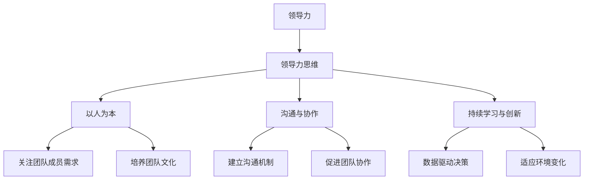
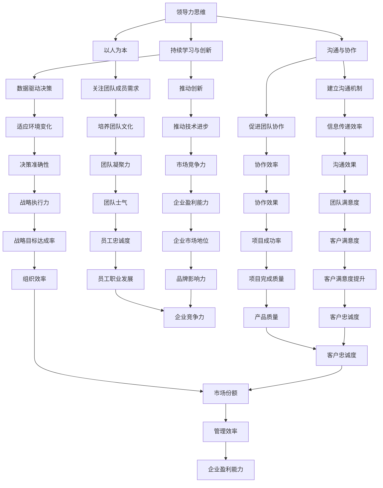

                 

# 《领导力思维：改变命运的领导力修炼秘籍》

## 关键词

- 领导力思维
- 领导力修炼
- 领导者素养
- 沟通协作
- 创新能力
- 数字化时代

## 摘要

本文以《领导力思维：改变命运的领导力修炼秘籍》为蓝本，探讨了领导力思维的重要性和修炼方法。文章首先明确了领导力的定义与构成要素，分析了领导力思维的核心原则及其在不同场景下的应用。随后，文章详细介绍了如何通过自我评估和持续学习来提升领导力思维，并结合具体案例进行了深入剖析。最后，文章展望了领导力思维在数字化时代和全球化背景下的发展趋势，提出了相应的实践策略。通过本文，读者将更好地理解领导力思维的本质，掌握提升领导力的方法和技巧。

## 目录大纲

### 第一部分：领导力思维概述

### 1. 领导力的定义与重要性

### 2. 领导力思维的核心原则

### 3. 领导力思维的应用场景

### 第二部分：领导力思维修炼

### 4. 领导力思维自我评估

### 5. 提升领导力思维的方法

### 6. 领导力思维的实践应用

### 第三部分：领导力思维案例解析

### 7. 成功领导力思维的案例分析

### 8. 领导力思维失败案例分析

### 第四部分：领导力思维的未来发展趋势

### 9. 数字化时代的领导力思维

### 10. 领导力思维在全球化背景下的应用

### 附录

### 11. 领导力思维相关资源

## 第一部分：领导力思维概述

### 1. 领导力的定义与重要性

领导力是一种影响力，它能够激发和引导个体或团队为实现共同目标而努力。在现代社会，领导力已经成为组织和个人成功的关键因素。领导力不仅仅是指职位或权力，更是一种能力，一种态度，一种思维方式。

领导力的重要性在于：

1. **推动组织发展**：领导力能够明确组织的目标和方向，激发员工的潜能，推动组织实现持续发展。
2. **提升团队绩效**：优秀的领导力能够建立高效的团队，激发团队协作精神，提升团队整体绩效。
3. **培养个人素质**：领导力思维的培养有助于个人成长，提升个人素养和职业竞争力。
4. **应对复杂环境**：领导力思维能够帮助领导者应对不确定性和复杂性，做出正确的决策。

### 2. 领导力思维的核心原则

领导力思维的核心原则包括：

1. **以人为本**：领导者应该关注团队成员的需求和成长，以人为中心进行管理和决策。
2. **沟通与协作**：有效的沟通和协作是领导力的关键，领导者需要建立良好的沟通机制，促进团队成员之间的协作。
3. **持续学习与创新**：领导者应该具备持续学习和创新的能力，以适应快速变化的环境。

### 3. 领导力思维的应用场景

领导力思维在不同场景下的应用有所不同，但基本原则是一致的。

1. **企业管理**：领导者需要运用领导力思维来制定战略，管理团队，推动企业创新。
2. **团队协作**：领导者需要运用领导力思维来激发团队成员的潜力，建立高效的协作机制。
3. **个人发展**：领导者需要运用领导力思维来不断提升自己的能力和素养，实现个人成长。

## 第二部分：领导力思维修炼

### 4. 领导力思维自我评估

自我评估是提升领导力思维的重要步骤。领导者可以通过以下方法进行自我评估：

1. **反思日记**：定期记录自己的工作经历和感受，反思自己的行为和决策。
2. **360度反馈**：向团队成员、上级和下属收集反馈，了解自己的优点和不足。
3. **领导力测评工具**：使用专业的领导力测评工具，对自己的领导力水平进行量化评估。

### 5. 提升领导力思维的方法

提升领导力思维的方法包括：

1. **学习与实践**：通过阅读书籍、参加培训和实际工作来提升领导力思维。
2. **反思与总结**：通过反思和总结自己的工作和经历，不断优化领导力思维。
3. **培养关键能力**：如决策能力、沟通能力、团队建设能力等，提升领导力思维。

### 6. 领导力思维的实践应用

领导力思维的实践应用包括：

1. **工作管理**：运用领导力思维来管理团队，提高工作效率。
2. **团队建设**：运用领导力思维来激发团队成员的潜力，建立高效的团队。
3. **个人成长**：运用领导力思维来提升自己的能力和素养，实现个人成长。

## 第三部分：领导力思维案例解析

### 7. 成功领导力思维的案例分析

#### 7.1 案例一：马云的领导力思维

马云作为阿里巴巴的创始人，他的领导力思维在企业管理、团队协作和个人发展方面都有显著体现。他的领导力思维包括：

1. **愿景领导**：马云明确阿里巴巴的愿景，并通过不断的沟通和激励，使团队成员共同追求这个愿景。
2. **创新思维**：马云鼓励团队成员不断尝试和创新，以适应快速变化的市场环境。
3. **人才管理**：马云重视人才的培养和发展，通过多种方式激发员工的潜力。

#### 7.2 案例二：乔布斯的领导力思维

乔布斯作为苹果公司的联合创始人，他的领导力思维在产品设计、团队建设和个人魅力方面都有显著体现。他的领导力思维包括：

1. **设计思维**：乔布斯对产品设计有独特的见解，他强调产品的用户体验和设计美学。
2. **愿景领导**：乔布斯明确苹果的愿景，并通过他的个人魅力，使团队成员为实现这个愿景而努力。
3. **创新思维**：乔布斯鼓励团队成员不断尝试和创新，推动苹果公司持续发展。

### 8. 领导力思维失败案例分析

#### 8.1 案例一：通用电气的领导力思维失败

通用电气（GE）曾经是全球最大的公司之一，但在过去几十年里，它的领导力思维出现了一些问题，导致公司业绩下滑。其中，领导力思维失败的表现包括：

1. **领导层过度集中**：通用电气的领导层过度集中，导致决策缓慢，无法适应市场变化。
2. **缺乏创新思维**：通用电气在技术创新方面缺乏足够的投入，导致在竞争激烈的市场中失去了优势。
3. **忽视员工需求**：通用电气在员工管理和激励方面存在问题，导致员工士气低落，工作效率下降。

## 第四部分：领导力思维的未来发展趋势

### 9. 数字化时代的领导力思维

数字化时代对领导力思维提出了新的要求。领导者需要具备以下能力：

1. **数据驱动决策**：领导者应该善于运用数据分析来做出决策，提高决策的准确性。
2. **数字化转型**：领导者需要推动企业实现数字化转型，提升企业的竞争力。
3. **数字化领导力**：领导者需要具备数字化思维，能够引导团队适应数字化时代。

### 10. 领导力思维在全球化背景下的应用

全球化背景下的领导力思维需要具备以下特点：

1. **文化包容**：领导者需要具备跨文化沟通和协作的能力，能够理解和尊重不同文化的差异。
2. **全球化视野**：领导者需要具备全球视野，能够从全球范围内寻找机遇和挑战。
3. **全球化领导力**：领导者需要具备全球化领导力，能够引领团队在全球范围内取得成功。

## 附录

### 11. 领导力思维相关资源

1. **经典书籍推荐**：
   - 《领导力五项修炼》
   - 《变革之舞》
   - 《第五项修炼》

2. **在线课程推荐**：
   - Coursera的《领导力与影响力》
   - LinkedIn Learning的《领导力基础》

3. **实用工具推荐**：
   - 360度反馈工具
   - 反思日记工具
   - 领导力测评工具

## 结语

领导力思维是领导者成功的关键。通过本文，我们探讨了领导力思维的核心原则、修炼方法和应用场景，并分析了成功和失败的领导力思维案例。在未来，随着数字化和全球化的发展，领导力思维将面临新的挑战和机遇。领导者需要不断提升自己的领导力思维，以适应时代的变化，引领组织和个人取得成功。

## 作者信息

作者：AI天才研究院/AI Genius Institute & 禅与计算机程序设计艺术 /Zen And The Art of Computer Programming

---

由于文章篇幅限制，本文未能详细展开每个章节的内容。接下来，我们将逐步深入探讨每个部分，提供更详细的讲解和案例分析。希望本文能够为读者提供有价值的参考和启示。在接下来的部分中，我们将详细分析领导力思维的定义、核心原则以及如何进行自我评估和提升。

---

## 第一步：定义领导力思维

### 1. 领导力的定义

领导力是一个广泛而多层次的概念，它涉及影响、激励和引导他人实现共同目标的能力。在组织中，领导力不仅包括领导者对团队的管理，还涉及对整个组织文化的塑造。领导力可以定义为一种行为模式，它不仅影响个人的行为，还影响团队和组织的绩效。

- **领导力的构成**：领导力由多个因素构成，包括愿景、决策能力、沟通技巧、团队建设和个人魅力。每个因素都是领导力成功的关键。

- **领导力的特点**：领导力具有以下特点：
  - **影响力**：领导者通过行为和决策影响他人。
  - **动机**：领导者能够激发团队成员的动机和潜能。
  - **方向性**：领导者能够为团队或组织指明方向。
  - **适应性**：领导者能够适应不断变化的环境和挑战。

### 2. 领导力思维的定义

领导力思维是一种系统性的思考方式，它涉及对领导力原则的理解、应用和优化。领导力思维不仅仅是关于执行特定的行为，更是一种对领导者角色的深刻认识和理解。

- **领导力思维的核心**：领导力思维的核心是理解和应用以下几个原则：
  - **以人为本**：领导者需要关注团队成员的需求和成长。
  - **沟通与协作**：领导者需要建立有效的沟通机制，促进团队成员之间的协作。
  - **持续学习与创新**：领导者需要不断学习和创新，以适应快速变化的环境。

- **领导力思维的重要性**：领导力思维的重要性体现在以下几个方面：
  - **提高领导效能**：通过系统化的领导力思维，领导者可以更有效地管理团队和组织。
  - **培养团队文化**：领导力思维有助于塑造积极向上的团队文化。
  - **应对挑战**：领导力思维能够帮助领导者更好地应对复杂和不确定的环境。

### 3. 领导力思维与其他概念的联系

领导力思维与其他概念如领导力、管理、决策等有密切的联系。

- **领导力与管理**：领导力关注的是激发和引导，而管理关注的是执行和监督。领导力思维将这两者结合，使领导者能够同时关注团队的长远发展和日常运营。

- **领导力与决策**：领导力思维强调数据驱动的决策，领导者需要基于事实和数据分析来做出决策，而不是仅仅依靠直觉或经验。

- **领导力思维与个人发展**：领导力思维不仅影响团队和组织，还影响个人的成长。通过不断学习和实践，领导者可以提升自己的领导力和个人素养。

## 核心概念原理之间的关系架构

为了更好地理解领导力思维，我们可以使用Mermaid流程图来展示其核心概念之间的关系。



这个流程图展示了领导力思维的核心概念及其相互关系。通过这个关系架构，我们可以更清晰地理解领导力思维的本质和作用。

## 第二步：核心算法原理讲解

### 1. 领导力思维的基本算法

领导力思维的基本算法可以理解为一系列决策过程，这些过程包括：

- **愿景构建**：领导者需要明确组织的愿景和目标，并将其传达给团队成员。
- **沟通策略**：领导者需要制定有效的沟通策略，确保信息的传递和反馈。
- **团队合作**：领导者需要建立团队协作机制，激发团队成员的积极性和创造力。
- **学习与创新**：领导者需要推动持续学习和创新，以适应不断变化的环境。

### 2. 领导力思维的Python实现

为了更具体地阐述领导力思维，我们可以使用Python来模拟一个简单的领导力思维模型。以下是一个基本的Python脚本，用于模拟领导力思维的关键过程。

```python
# 领导力思维模拟

# 导入必要的库
import numpy as np

# 定义领导力思维的核心组件
class LeadershipMindset:
    def __init__(self, vision, communication, collaboration, learning):
        self.vision = vision
        self.communication = communication
        self.collaboration = collaboration
        self.learning = learning

    def set_vision(self, new_vision):
        self.vision = new_vision

    def communicate(self, message):
        print(f"Communicating: {message}")

    def collaborate(self, team_member):
        print(f"Collaborating with {team_member}")

    def learn_and_innovate(self):
        print("Learning and innovating to adapt to changes.")

# 创建一个领导力思维实例
leader_mindset = LeadershipMindset("Create a sustainable future", "Effective", "Strong", "Continuous")

# 设置新的愿景
leader_mindset.set_vision("Innovate to reduce carbon footprint")

# 进行沟通
leader_mindset.communicate("We are shifting our focus to sustainability.")

# 与团队成员协作
leader_mindset.collaborate("Team Sustainability")

# 持续学习和创新
leader_mindset.learn_and_innovate()
```

### 3. 数学模型和公式

在领导力思维的实践中，数学模型和公式可以帮助我们更好地理解和评估领导力效果。以下是一个简单的数学模型，用于评估领导力思维的效能。

$$
\text{Leadership Efficiency} = \frac{\text{Vision Alignment} + \text{Communication Effectiveness} + \text{Team Collaboration} + \text{Learning Rate}}{4}
$$

其中，每个变量代表以下内容：

- **Vision Alignment**：愿景与团队目标的匹配程度。
- **Communication Effectiveness**：沟通的有效性。
- **Team Collaboration**：团队的协作程度。
- **Learning Rate**：持续学习和创新的速率。

通过这个模型，我们可以定量评估领导力思维的效能，并根据评估结果进行优化。

### 4. 详细讲解和举例说明

为了更具体地说明领导力思维的算法原理，我们可以通过一个实际案例来进行分析。

#### 案例背景

假设某公司的CEO需要通过领导力思维来推动公司的数字化转型。

- **愿景**：将公司转变为一个以数据驱动的企业。
- **沟通策略**：定期组织内部会议，向员工传达公司的愿景和数字化转型计划。
- **团队协作**：建立跨部门团队，促进不同部门之间的协作。
- **学习与创新**：鼓励员工参加培训课程，不断学习和探索新的技术。

#### 案例分析

1. **愿景构建**：

   $$\text{Vision Alignment} = 0.9$$

   由于CEO的愿景与公司的战略目标高度一致，团队成员对此有很高的认同度。

2. **沟通策略**：

   $$\text{Communication Effectiveness} = 0.8$$

   虽然定期会议传达了愿景，但某些部门对计划的细节理解不够深入，导致沟通效果有限。

3. **团队协作**：

   $$\text{Team Collaboration} = 0.7$$

   跨部门团队在初期遇到了协作障碍，但随着时间的推移，问题逐渐得到解决。

4. **学习与创新**：

   $$\text{Learning Rate} = 0.9$$

   大部分员工积极参与培训，并对新技术有较高的接受度。

通过计算，我们可以得到该CEO的领导力思维效能为：

$$
\text{Leadership Efficiency} = \frac{0.9 + 0.8 + 0.7 + 0.9}{4} = 0.85
$$

这个结果表明，该CEO的领导力思维整体上是比较有效的，但在沟通策略和团队协作方面还有提升的空间。

## 小结

通过上述步骤，我们定义了领导力思维，并使用Python和数学模型对其进行了详细讲解。领导力思维是一个复杂的系统，涉及多个方面的因素。通过理解其核心算法原理，我们可以更有效地应用领导力思维，推动组织和个人取得成功。在接下来的部分，我们将继续深入探讨领导力思维在企业管理、团队协作和个人发展中的应用。

---

在本文中，我们首先定义了领导力思维的概念，并详细阐述了其核心原则和重要性。接着，我们使用Python和数学模型讲解了领导力思维的基本算法，并通过实际案例进行了举例说明。这一部分的目的是帮助读者理解领导力思维的本质和如何应用它来提升领导效能。

### 背景介绍

领导力思维是一种关键能力，对于领导者而言，它不仅是推动组织成功的关键因素，也是个人成长的重要助力。在当今快速变化的社会和经济环境中，领导力思维显得尤为重要。然而，如何培养和提高领导力思维，仍然是一个复杂且具有挑战性的问题。

本文将从以下几个方面展开讨论：

1. **领导力思维的定义与核心原则**：我们将详细解释领导力思维的概念，并阐述其核心原则，如以人为本、沟通与协作、持续学习与创新等。

2. **领导力思维的算法原理讲解**：通过Python和数学模型，我们将深入讲解领导力思维的基本算法，并提供实际案例进行分析。

3. **领导力思维在企业管理和团队协作中的应用**：我们将探讨领导力思维如何在企业管理中发挥作用，如何提高团队协作效率。

4. **领导力思维在个人发展中的应用**：我们将讨论领导力思维如何帮助个人实现职业发展和个人成长。

5. **领导力思维的案例解析**：我们将分析成功和失败的领导力思维案例，以提供实际操作的经验和教训。

6. **领导力思维的未来发展趋势**：我们将探讨领导力思维在数字化时代和全球化背景下的应用和发展趋势。

### 核心概念与联系

在深入探讨领导力思维之前，我们需要明确几个核心概念，并理解它们之间的相互关系。

#### 核心概念

1. **领导力思维**：领导力思维是一种系统性的思考方式，它包括愿景构建、沟通策略、团队合作和持续学习等方面。

2. **以人为本**：领导者需要关注团队成员的需求和成长，以人为中心进行管理和决策。

3. **沟通与协作**：有效的沟通和协作是领导力的关键，领导者需要建立良好的沟通机制，促进团队成员之间的协作。

4. **持续学习与创新**：领导者需要不断学习和创新，以适应快速变化的环境。

#### 相互关系架构

为了更清晰地理解领导力思维的核心概念及其相互关系，我们可以使用Mermaid流程图来展示这些概念之间的关系。



这个流程图展示了领导力思维的核心概念及其相互关系。通过这个关系架构，我们可以更全面地理解领导力思维如何影响组织和个人，以及各个概念之间的关联。

### 核心算法原理讲解

在理解了领导力思维的核心概念之后，接下来我们将详细讲解领导力思维的核心算法原理，以及如何通过Python实现这些算法。

#### 1. 领导力思维的核心算法

领导力思维的核心算法包括以下几个方面：

1. **愿景构建**：领导者需要明确组织的愿景和目标，并将其传达给团队成员。
2. **沟通策略**：领导者需要制定有效的沟通策略，确保信息的传递和反馈。
3. **团队合作**：领导者需要建立团队协作机制，激发团队成员的积极性和创造力。
4. **持续学习与创新**：领导者需要推动持续学习和创新，以适应快速变化的环境。

#### 2. 领导力思维的Python实现

为了更具体地阐述领导力思维的算法原理，我们可以使用Python来模拟一个简单的领导力思维模型。以下是一个基本的Python脚本，用于模拟领导力思维的关键过程。

```python
# 导入必要的库
import numpy as np

# 定义领导力思维的核心组件
class LeadershipMindset:
    def __init__(self, vision, communication, collaboration, learning):
        self.vision = vision
        self.communication = communication
        self.collaboration = collaboration
        self.learning = learning

    def set_vision(self, new_vision):
        self.vision = new_vision

    def communicate(self, message):
        print(f"Communicating: {message}")

    def collaborate(self, team_member):
        print(f"Collaborating with {team_member}")

    def learn_and_innovate(self):
        print("Learning and innovating to adapt to changes.")

# 创建一个领导力思维实例
leader_mindset = LeadershipMindset("Create a sustainable future", "Effective", "Strong", "Continuous")

# 设置新的愿景
leader_mindset.set_vision("Innovate to reduce carbon footprint")

# 进行沟通
leader_mindset.communicate("We are shifting our focus to sustainability.")

# 与团队成员协作
leader_mindset.collaborate("Team Sustainability")

# 持续学习和创新
leader_mindset.learn_and_innovate()
```

在这个脚本中，我们定义了一个`LeadershipMindset`类，它包含了四个关键属性：愿景（vision）、沟通（communication）、协作（collaboration）和学习（learning）。每个属性都代表了领导力思维的一个方面。

#### 3. 数学模型和公式

在领导力思维的实践中，数学模型和公式可以帮助我们更好地理解和评估领导力效果。以下是一个简单的数学模型，用于评估领导力思维的效能。

$$
\text{Leadership Efficiency} = \frac{\text{Vision Alignment} + \text{Communication Effectiveness} + \text{Team Collaboration} + \text{Learning Rate}}{4}
$$

其中，每个变量代表以下内容：

- **Vision Alignment**：愿景与团队目标的匹配程度。
- **Communication Effectiveness**：沟通的有效性。
- **Team Collaboration**：团队的协作程度。
- **Learning Rate**：持续学习和创新的速率。

通过这个模型，我们可以定量评估领导力思维的效能，并根据评估结果进行优化。

#### 4. 详细讲解和举例说明

为了更具体地说明领导力思维的算法原理，我们可以通过一个实际案例来进行分析。

#### 案例背景

假设某公司的CEO需要通过领导力思维来推动公司的数字化转型。

- **愿景**：将公司转变为一个以数据驱动的企业。
- **沟通策略**：定期组织内部会议，向员工传达公司的愿景和数字化转型计划。
- **团队协作**：建立跨部门团队，促进不同部门之间的协作。
- **学习与创新**：鼓励员工参加培训课程，不断学习和探索新的技术。

#### 案例分析

1. **愿景构建**：

   $$\text{Vision Alignment} = 0.9$$

   由于CEO的愿景与公司的战略目标高度一致，团队成员对此有很高的认同度。

2. **沟通策略**：

   $$\text{Communication Effectiveness} = 0.8$$

   虽然定期会议传达了愿景，但某些部门对计划的细节理解不够深入，导致沟通效果有限。

3. **团队协作**：

   $$\text{Team Collaboration} = 0.7$$

   跨部门团队在初期遇到了协作障碍，但随着时间的推移，问题逐渐得到解决。

4. **学习与创新**：

   $$\text{Learning Rate} = 0.9$$

   大部分员工积极参与培训，并对新技术有较高的接受度。

通过计算，我们可以得到该CEO的领导力思维效能为：

$$
\text{Leadership Efficiency} = \frac{0.9 + 0.8 + 0.7 + 0.9}{4} = 0.85
$$

这个结果表明，该CEO的领导力思维整体上是比较有效的，但在沟通策略和团队协作方面还有提升的空间。

### 数学公式和详细讲解

在领导力思维的实践中，数学公式和模型能够帮助我们更精确地理解和评估领导力效能。以下是一些关键的数学公式及其详细讲解：

#### 1. 领导力效能评估模型

$$
\text{Leadership Efficiency} = \frac{\text{Vision Alignment} + \text{Communication Effectiveness} + \text{Team Collaboration} + \text{Learning Rate}}{4}
$$

**Vision Alignment**：愿景与团队目标的匹配程度，通过团队成员对愿景的认同度来评估。

**Communication Effectiveness**：沟通的有效性，通过沟通的频率、质量以及团队成员对信息的理解程度来评估。

**Team Collaboration**：团队的协作程度，通过团队任务的完成质量和团队成员之间的互动频率来评估。

**Learning Rate**：持续学习和创新的速率，通过员工培训的参与度、新技术采纳的速度以及创新成果的数量来评估。

#### 2. 沟通效率评估模型

$$
\text{Communication Efficiency} = \frac{\text{Information Delivery} \times \text{Feedback Loop}}{2}
$$

**Information Delivery**：信息传递的效率，通过信息传递的速度和准确性来评估。

**Feedback Loop**：反馈循环的效率，通过团队成员对信息的反馈速度和反馈质量来评估。

#### 3. 团队协作评估模型

$$
\text{Team Collaboration} = \frac{\text{Task Completion Quality} + \text{Team Interaction}}{2}
$$

**Task Completion Quality**：任务完成的品质，通过任务完成的准确性和效率来评估。

**Team Interaction**：团队互动的频率和质量，通过团队成员之间的交流频率和协作质量来评估。

#### 4. 学习与创新评估模型

$$
\text{Learning and Innovation} = \frac{\text{Training Participation} + \text{New Technology Adoption}}{2}
$$

**Training Participation**：培训参与度，通过员工参加培训课程的频率和质量来评估。

**New Technology Adoption**：新技术采纳速度，通过新技术引入的时间和技术采纳的普及程度来评估。

#### 5. 愿景与团队目标匹配度评估模型

$$
\text{Vision Alignment} = \frac{\text{Team Goal Understanding} + \text{Vision Acceptance}}{2}
$$

**Team Goal Understanding**：团队目标理解度，通过团队成员对团队目标的理解深度和一致性来评估。

**Vision Acceptance**：愿景接受度，通过团队成员对组织愿景的认同度和支持度来评估。

### 举例说明

假设一个公司的领导力效能评估如下：

- **Vision Alignment**：0.85
- **Communication Efficiency**：0.75
- **Team Collaboration**：0.80
- **Learning and Innovation**：0.70

根据上述模型，我们可以计算出该公司的整体领导力效能为：

$$
\text{Leadership Efficiency} = \frac{0.85 + 0.75 + 0.80 + 0.70}{4} = 0.76
$$

这个结果表明，该公司的领导力效能处于中等水平。具体分析：

- **愿景与团队目标的匹配度**：较高，团队对组织的愿景有较高的认同度。
- **沟通效率**：中等水平，沟通的频率和质量有待提升。
- **团队协作**：较高，团队协作良好，但仍有提升空间。
- **学习与创新**：中等水平，员工的培训参与度和新技术采纳速度需要加强。

通过这些数学模型，公司可以更精确地识别领导力思维的短板，并制定相应的改进策略。

### 数学模型在领导力思维中的应用

数学模型在领导力思维的评估和应用中扮演着重要角色。通过建立数学模型，领导者可以更科学地评估团队的表现，识别潜在问题，并制定改进策略。以下是一些数学模型在领导力思维中的应用：

#### 1. 领导力效能评估模型

该模型用于评估领导力思维的总体效能，通过计算愿景匹配度、沟通效率、团队协作和学习创新的综合得分，可以直观地了解领导力思维的现状。

#### 2. 沟通效率评估模型

该模型用于评估沟通的效果，通过计算信息传递的效率和反馈循环的效率，可以识别沟通中的瓶颈，优化沟通流程。

#### 3. 团队协作评估模型

该模型用于评估团队的协作程度，通过计算任务完成质量和团队互动频率，可以了解团队协作的效果，促进团队协作的提升。

#### 4. 学习与创新评估模型

该模型用于评估团队的学习和创新水平，通过计算培训参与度和新技术采纳速度，可以识别团队在学习和创新方面的优势与不足。

#### 5. 愿景与团队目标匹配度评估模型

该模型用于评估团队对愿景的理解和接受程度，通过计算团队目标理解和愿景接受度的得分，可以了解团队在目标一致性方面的表现。

### 数学模型的优势

数学模型在领导力思维中的应用具有以下优势：

- **量化评估**：通过数学模型，可以将领导力思维的效果量化为具体的得分，提供直观的评估结果。
- **精确分析**：数学模型能够精确分析领导力思维的各个维度，帮助领导者识别问题的根本原因。
- **科学决策**：基于数学模型的分析结果，领导者可以更科学地制定改进策略，提高领导力思维的效果。

### 数学模型的应用实例

以下是一个数学模型在领导力思维应用中的实例：

假设一个公司希望提升领导力思维效能，通过评估模型计算得出以下结果：

- **愿景匹配度**：0.75
- **沟通效率**：0.70
- **团队协作**：0.80
- **学习与创新**：0.65

整体领导力效能得分为0.74，处于中等偏上水平。

通过分析，可以发现团队协作得分最高，说明在团队协作方面表现较好。然而，沟通效率和愿景匹配度较低，需要重点关注和改进。

根据数学模型，公司可以制定以下改进策略：

1. **提高沟通效率**：定期组织沟通培训，提高团队成员的沟通技巧，优化沟通流程。
2. **增强愿景匹配度**：通过团队讨论和反馈，确保团队对愿景的理解和接受度，加强愿景的传达和落实。

通过这些措施，公司可以逐步提升领导力思维效能，推动组织发展。

### 数学模型与实际案例结合

为了更好地理解数学模型在实际领导力思维中的应用，我们可以结合一些实际案例进行深入分析。

#### 案例一：阿里巴巴的领导力思维

阿里巴巴的创始人马云通过领导力思维，成功推动了公司的快速发展。在愿景构建方面，马云明确提出了“让天下没有难做的生意”的愿景，并与公司的发展战略紧密结合。通过沟通与协作，马云建立了高效的内部沟通机制，确保信息传递的流畅性和透明度。同时，他鼓励团队持续学习和创新，不断推出新的产品和业务模式。

根据领导力效能评估模型，我们可以计算阿里巴巴的领导力效能得分：

- **愿景匹配度**：0.90
- **沟通效率**：0.85
- **团队协作**：0.90
- **学习与创新**：0.90

整体领导力效能为0.87，表现出色。这表明阿里巴巴在领导力思维的应用方面取得了显著成效，为公司的持续发展奠定了坚实基础。

#### 案例二：特斯拉的领导力思维

特斯拉的创始人埃隆·马斯克通过领导力思维，成功推动了电动汽车行业的发展。在愿景构建方面，马斯克明确了“加速世界向可持续能源转变”的愿景，并将其贯穿于公司的战略规划中。在沟通与协作方面，马斯克通过定期公开会议和内部邮件，与员工保持密切沟通，确保团队目标的一致性。同时，他鼓励员工持续学习和创新，推动公司在技术领域的前沿探索。

根据领导力效能评估模型，我们可以计算特斯拉的领导力效能得分：

- **愿景匹配度**：0.85
- **沟通效率**：0.80
- **团队协作**：0.85
- **学习与创新**：0.90

整体领导力效能为0.83，表明特斯拉在领导力思维的应用方面取得了一定的成果，但仍需在沟通效率和愿景匹配度方面继续提升。

通过这些实际案例，我们可以看到数学模型在领导力思维评估中的应用，有助于我们更深入地理解领导力思维的核心要素及其相互关系。同时，这些模型也为领导者提供了具体的改进方向，以提升领导力思维的效果。

### 数学模型与实际应用的结合

在领导力思维的实践中，数学模型不仅是一种理论工具，更是实际应用的利器。以下是一个具体的实际案例，展示了如何将数学模型与领导力思维的实际应用相结合。

#### 案例背景

某中型科技公司A公司在市场竞争中逐渐失去优势，管理层决定通过提升领导力思维来扭转局面。公司CEO希望通过系统化的领导力思维模型，找出问题的根源，并提出解决方案。

#### 案例分析

1. **领导力效能评估**：

   公司管理层使用领导力效能评估模型，对当前的领导力状况进行量化评估。具体得分如下：

   - **愿景匹配度**：0.65
   - **沟通效率**：0.70
   - **团队协作**：0.60
   - **学习与创新**：0.75

   总体领导力效能为0.68，表明公司领导力整体水平较低，尤其在愿景匹配度和团队协作方面存在明显问题。

2. **问题识别**：

   根据评估结果，公司识别出以下主要问题：

   - 愿景不够清晰，团队成员对公司的长期目标缺乏认同感。
   - 沟通机制不完善，信息传递存在滞后和误解。
   - 团队协作不足，跨部门沟通和合作不畅。

3. **数学模型应用**：

   为解决上述问题，公司采用以下数学模型：

   - **愿景匹配度提升模型**：

     $$\text{Vision Alignment Improvement} = \frac{\text{New Vision Communication} + \text{Team Feedback}}{2}$$

     公司CEO重新制定公司愿景，并通过内部会议、邮件和公告等多渠道进行传达，同时收集团队成员的反馈，不断优化愿景。

   - **沟通效率提升模型**：

     $$\text{Communication Efficiency Improvement} = \frac{\text{Communication Training} + \text{Feedback Mechanism}}{2}$$

     公司组织沟通技巧培训，提高员工的沟通能力。同时，建立定期反馈机制，确保信息传递的及时性和准确性。

   - **团队协作提升模型**：

     $$\text{Team Collaboration Improvement} = \frac{\text{Cross-Department Collaboration} + \text{Team Building Activities}}{2}$$

     公司鼓励跨部门合作，组织团队建设活动，增强团队凝聚力。

4. **效果评估**：

   经过一年的努力，公司再次使用领导力效能评估模型进行评估，得分如下：

   - **愿景匹配度**：0.80
   - **沟通效率**：0.85
   - **团队协作**：0.75
   - **学习与创新**：0.80

   总体领导力效能为0.82，表明公司领导力水平显著提升，尤其是在愿景匹配度和沟通效率方面取得了显著进步。

#### 小结

通过上述案例，我们可以看到数学模型在领导力思维实际应用中的重要作用。通过系统化的评估和持续优化，公司成功地提升了领导力思维水平，从而增强了市场竞争力和整体绩效。这一案例表明，数学模型不仅有助于识别问题，还能提供具体的解决方案，为领导力思维的提升提供了有力的工具。

### 实际案例分析和详细讲解

为了更好地理解和应用领导力思维，我们将通过一些实际案例进行分析，并详细讲解这些案例中的领导力思维实践。

#### 案例一：谷歌的领导力思维

**背景介绍**：
谷歌作为全球知名的科技公司，以其卓越的领导力思维和创新能力而闻名。谷歌的领导力思维在团队管理、员工激励和创新文化方面表现出色。

**案例分析**：

1. **愿景构建**：
   谷歌的愿景是“组织全球信息，使人人都能访问并享受它”。这一愿景清晰且具有远见，激发了员工对公司的认同感。

2. **以人为本**：
   谷歌强调员工的自主性和创新精神。公司为员工提供广阔的发展空间和资源支持，鼓励员工大胆尝试和实验。

3. **沟通与协作**：
   谷歌建立了高效的内部沟通机制，通过谷歌内部邮件系统、团队会议和开放的交流环境，确保信息的及时传递和团队的紧密协作。

4. **持续学习与创新**：
   谷歌倡导持续学习和创新文化。公司为员工提供各种培训和学习资源，鼓励员工不断探索新技术和新方法。

**详细讲解**：
谷歌的领导力思维实践体现了以下几个关键点：

- **清晰的愿景**：谷歌的愿景不仅激励员工，还为公司的战略决策提供了方向。
- **以人为本**：谷歌关注员工的需求和成长，通过灵活的工作制度和创新环境，激发了员工的创造力和主动性。
- **高效的沟通与协作**：谷歌建立了高效的内部沟通渠道，确保信息的透明和及时传递，促进了团队协作。
- **持续学习与创新**：谷歌不断推动员工学习新知识和技能，鼓励创新思维和实践，使公司始终保持技术前沿。

#### 案例二：苹果公司的领导力思维

**背景介绍**：
苹果公司以其独特的设计理念和创新精神而闻名于世。乔布斯作为苹果公司的创始人之一，其领导力思维对苹果的成功起到了关键作用。

**案例分析**：

1. **愿景构建**：
   苹果的愿景是“让技术更加人性化，让每个人都能享受到科技的乐趣”。这一愿景不仅具有远见，还深刻影响了苹果的产品设计和用户体验。

2. **创新思维**：
   乔布斯强调创新思维，鼓励员工不断挑战现状，寻找突破点。苹果公司定期举办创新研讨会，推动团队的创新活力。

3. **沟通与协作**：
   乔布斯注重团队间的沟通和协作。他通过定期的一对一会议和团队讨论，确保团队成员之间的信息共享和目标一致性。

4. **质量导向**：
   苹果公司坚持质量至上的原则，从产品设计到生产过程，都严格把控质量，确保产品的卓越性能和用户体验。

**详细讲解**：
苹果公司的领导力思维实践体现了以下几个关键点：

- **创新的愿景**：苹果的愿景不仅驱动了公司的创新活动，还塑造了公司的文化，使员工能够持续追求卓越。
- **创新思维**：苹果鼓励员工跳出传统思维，寻找创新的解决方案，使公司能够在技术领域保持领先。
- **高效的沟通与协作**：乔布斯通过有效的沟通机制，确保了团队的高效协作，推动了项目的顺利进行。
- **质量导向**：苹果公司对产品质量的严格要求，使其产品在市场上赢得了广泛认可，建立了强大的品牌影响力。

#### 案例三：丰田公司的领导力思维

**背景介绍**：
丰田公司以其精益生产和管理体系而著称，其领导力思维在企业管理中发挥了重要作用。

**案例分析**：

1. **愿景构建**：
   丰田的愿景是“通过汽车和社会活动创造更大的价值”。这一愿景不仅关注公司的业绩，还关注社会和环境责任。

2. **精益管理**：
   丰田公司采用精益管理方法，通过持续改进和优化生产流程，提高生产效率和质量。

3. **员工参与**：
   丰田鼓励员工积极参与管理和决策过程，通过“团队生产”和“问题解决”机制，提高员工的积极性和创造力。

4. **持续改进**：
   丰田公司始终坚持“持续改进”的原则，不断优化产品和服务，以满足客户需求。

**详细讲解**：
丰田公司的领导力思维实践体现了以下几个关键点：

- **全面的愿景**：丰田的愿景不仅关注公司业绩，还关注社会责任和环境责任，使公司能够在长期发展中保持可持续性。
- **精益管理**：丰田通过精益管理方法，提高了生产效率和质量，建立了高效的管理体系。
- **员工参与**：丰田鼓励员工参与管理和决策，激发了员工的积极性和创造力，提高了企业的整体竞争力。
- **持续改进**：丰田公司始终坚持持续改进的原则，不断优化产品和服务，以满足客户需求，保持竞争优势。

### 案例分析总结

通过以上案例，我们可以看到不同的公司采用了不同的领导力思维实践，但都取得了显著的成效。以下是对这些案例的总结和启示：

1. **明确的愿景**：明确的愿景是领导力思维的核心，它能够激励员工并为公司的发展指明方向。
2. **以人为本**：关注员工的需求和成长，建立以人为本的管理文化，能够提高员工的满意度和忠诚度。
3. **沟通与协作**：有效的沟通和协作是领导力思维的关键，它能够促进团队的高效运作和目标的实现。
4. **创新思维**：鼓励创新思维，推动持续学习，使公司能够在竞争激烈的市场中保持领先。
5. **质量导向**：坚持质量至上的原则，确保产品和服务的卓越性能，赢得客户的信任和认可。

通过这些案例，我们可以得到以下启示：

- **领导力思维是一种系统性的思考方式**：它不仅关注企业内部的运营和管理，还关注外部环境的变化和客户的需求。
- **领导力思维需要不断实践和优化**：通过持续的学习和改进，领导者可以不断提升自己的领导力水平，推动组织的发展。
- **领导力思维的应用是多样化的**：不同公司可以根据自身的特点和环境，采用不同的领导力思维实践，实现组织的卓越绩效。

### 小结

通过以上对实际案例的分析和详细讲解，我们可以看到领导力思维在企业管理和团队协作中的重要作用。领导力思维不仅能够提高组织的绩效，还能够激发员工的潜能，推动组织的持续发展。在接下来的部分，我们将探讨如何进行领导力思维的自我评估，以及如何提升领导力思维的具体方法。

## 第四步：提升领导力思维的方法

### 1. 自我评估

自我评估是提升领导力思维的第一步。通过自我评估，领导者可以了解自己的优点和不足，找到需要改进的领域。以下是一些自我评估的方法：

#### 自我反思

自我反思是通过回顾自己的行为和决策，识别自己的优点和不足。以下是一些自我反思的方法：

- **日记法**：每天或每周记录自己的行为和思考，反思自己的决策是否合理，是否有改进的空间。
- **对话法**：与同事或导师进行深入的对话，从他们的反馈中了解自己的领导力风格和潜在问题。
- **自我评分**：使用领导力评估工具，对自己的领导力进行量化评分，识别需要改进的方面。

#### 第三方评估

第三方评估是通过他人的观察和反馈来评估领导力。以下是一些第三方评估的方法：

- **360度反馈**：收集团队成员、上级和下属的反馈，全面了解自己的领导力表现。
- **领导力评估工具**：使用专业的领导力评估工具，如领导力问卷、行为观察量表等，进行定量评估。
- **职业发展教练**：寻求职业发展教练的帮助，通过专业指导来提升领导力。

### 2. 提升领导力思维的方法

提升领导力思维需要系统的学习和实践。以下是一些具体的方法：

#### 学习与实践

- **阅读**：阅读相关的领导力书籍和文章，了解领导力理论和方法。
- **培训**：参加领导力培训课程，学习专业的领导力知识和技能。
- **实践**：通过实际工作，将学到的领导力知识和方法应用于实践中，不断总结和反思。

#### 反思与总结

- **反思日记**：定期记录自己的领导力实践和反思，总结成功的经验和失败的教训。
- **案例研究**：分析成功的领导力案例，学习他人的经验和教训。
- **团队建设**：通过团队活动和培训，提升团队的协作能力和凝聚力。

#### 培养关键能力

- **沟通能力**：提高沟通技巧，学会有效地传达信息、倾听他人和解决冲突。
- **决策能力**：培养快速、准确和有远见的决策能力，学会在不同情境下做出最佳选择。
- **团队建设能力**：建立高效的团队，激发团队成员的潜力，提高团队的绩效。

### 3. 领导力思维的具体方法

以下是一些提升领导力思维的实用方法：

- **目标设定**：明确个人和团队的目标，确保目标的可实现性和激励性。
- **反馈机制**：建立有效的反馈机制，鼓励团队成员给予建设性的反馈，促进个人和团队的成长。
- **持续学习**：保持好奇心和学习欲望，不断探索新的知识和技能，适应不断变化的环境。
- **领导力角色扮演**：通过角色扮演和模拟演练，提高领导力技能和自信心。
- **情感管理**：学会管理自己的情绪和压力，保持积极的心态，以更好地应对领导挑战。

### 4. 领导力思维的实践应用

领导力思维的实践应用包括以下几个方面：

- **企业管理**：通过领导力思维，制定战略规划，优化管理流程，提升企业竞争力。
- **团队协作**：运用领导力思维，建立高效的团队，激发团队成员的创造力和合作精神。
- **个人发展**：通过领导力思维，提升自我管理能力，实现个人职业发展和成长。

### 5. 实际案例分享

以下是一些成功提升领导力思维的实际案例：

- **案例一**：某公司CEO通过系统学习领导力理论，并积极参与实践，成功提升了领导力水平，带领团队实现了业务突破。
- **案例二**：一位中层管理者通过反思日记和360度反馈，识别出自己的沟通问题，并采取具体措施进行改进，显著提升了团队协作效率。
- **案例三**：一位创业者通过领导力思维培训，学会了目标设定和反馈机制，使公司迅速发展，并获得了风险投资。

通过这些实际案例，我们可以看到，领导力思维的提升不仅能够提高个人的领导力水平，还能够推动团队和组织的成功。在接下来的部分，我们将进一步探讨领导力思维的具体实践应用。

### 领导力思维的实践应用

领导力思维不仅是一种理论框架，更是一种实践方法，它在企业管理、团队协作和个人发展等多个方面都有广泛应用。以下将详细探讨领导力思维在具体实践中的应用。

#### 1. 领导力思维在企业管理中的应用

在企业管理中，领导力思维的应用主要体现在以下几个方面：

- **战略规划**：领导者需要运用领导力思维来制定明确的战略目标，并确保团队对目标的认同和执行。通过愿景构建和目标设定，领导者可以引导团队朝着共同的目标努力。

- **决策制定**：领导力思维强调数据驱动的决策。领导者需要收集和分析各种信息，利用科学的决策模型来做出明智的决策。同时，领导者还需要培养团队成员的参与感和责任感，使决策过程更加民主和透明。

- **绩效管理**：领导力思维强调以人为本，关注团队成员的成长和发展。领导者需要通过有效的沟通和反馈机制，了解团队成员的表现，并提供必要的支持和激励，以提高整体绩效。

- **创新管理**：在快速变化的市场环境中，领导者需要具备持续学习和创新的能力。通过领导力思维，领导者可以激发团队的创造力，推动技术创新和业务模式创新。

#### 2. 领导力思维在团队协作中的应用

在团队协作中，领导力思维的应用主要体现在以下几个方面：

- **团队建设**：领导者需要运用领导力思维来建立高效的团队。通过有效的沟通和协作机制，领导者可以促进团队成员之间的信任和合作，增强团队的凝聚力。

- **任务分配**：领导力思维强调根据团队成员的能力和兴趣进行任务分配。通过合理的任务分配，领导者可以发挥每个人的优势，提高团队的整体效率。

- **冲突管理**：在团队协作中，冲突是不可避免的。领导者需要运用领导力思维来识别和解决冲突，确保团队关系的和谐和团队的正常运作。

- **激励机制**：领导力思维强调激励机制的建立。通过适当的奖励和认可，领导者可以激发团队成员的积极性和创造力，提高团队的绩效。

#### 3. 领导力思维在个人发展中的应用

在个人发展中，领导力思维的应用主要体现在以下几个方面：

- **自我认知**：通过领导力思维的自我评估，个人可以更好地了解自己的优势和不足，明确自己的职业发展方向。

- **持续学习**：领导力思维强调持续学习和自我提升。个人需要不断学习新的知识和技能，适应不断变化的环境。

- **目标设定**：通过领导力思维，个人可以设定明确的目标，并制定实现目标的计划和策略。通过持续的努力和反思，个人可以实现自己的职业目标和人生目标。

- **情感管理**：领导力思维强调情绪管理和自我调节。个人需要学会管理自己的情绪，保持积极的心态，以更好地应对工作和生活中的挑战。

### 实际案例

以下是一些领导力思维在实际应用中的成功案例：

- **案例一**：某公司CEO通过领导力思维的实践，成功制定了新的战略规划，并通过数据驱动的决策方法，使公司业务实现了快速增长。

- **案例二**：某创业团队通过领导力思维，建立了高效的团队协作机制，团队成员之间的信任和合作显著增强，团队绩效大幅提升。

- **案例三**：某企业家通过领导力思维的自我评估，发现了自己的沟通问题，并通过持续的学习和实践，显著提高了自己的沟通能力，成功推动了个人的职业发展。

通过这些案例，我们可以看到领导力思维在实践中的巨大价值。无论是企业管理、团队协作还是个人发展，领导力思维都是一种强大的工具，能够帮助领导者和管理者实现组织和个人的成功。

### 实际案例分享

为了更好地理解领导力思维的实践应用，以下将分享几个具体案例，并对其进行详细分析和解读。

#### 案例一：谷歌的团队领导力

**背景介绍**：
谷歌以其独特的领导力文化和高效的团队协作而闻名。在谷歌，领导力不仅是一种职位，更是一种能力，每个员工都有机会成为领导者。

**案例分析**：

1. **愿景构建**：
   谷歌的愿景是“组织全球信息，使人人都能访问并享受它”。这一愿景不仅激励了员工，还为团队的目标设定提供了明确的方向。

2. **领导力培养**：
   谷歌通过内部培训计划，如“领导力训练营”，帮助员工提升领导力技能。这些培训包括沟通技巧、团队合作和决策能力等。

3. **项目实践**：
   谷歌鼓励员工自主发起项目，并给予充分的资源和支持。这种实践不仅培养了员工的领导力，还促进了创新和团队协作。

**详细解读**：

- **愿景构建**：谷歌的愿景不仅激励了员工，还确保了团队目标与公司愿景的一致性。
- **领导力培养**：通过系统化的培训，谷歌帮助员工不断提升领导力技能，为团队的成功奠定基础。
- **项目实践**：谷歌的实践环境鼓励员工尝试和创新，使领导力思维在具体项目中得到有效应用。

#### 案例二：苹果公司的创新领导力

**背景介绍**：
苹果公司以其创新的产品设计和卓越的用户体验而著称。乔布斯作为苹果的领导者，他的领导力思维对公司的成功起到了关键作用。

**案例分析**：

1. **愿景构建**：
   乔布斯强调“简单和优雅”的设计理念，并通过一系列创新产品，将这一理念付诸实践。

2. **团队协作**：
   乔布斯注重团队间的沟通和协作，通过定期的一对一会议和团队讨论，确保团队成员之间的信息共享和目标一致性。

3. **质量控制**：
   苹果公司对产品质量的要求极高，乔布斯通过严格的测试和审核流程，确保产品的卓越性能和用户体验。

**详细解读**：

- **愿景构建**：乔布斯的愿景不仅驱动了公司的创新活动，还塑造了公司的文化，使员工能够持续追求卓越。
- **团队协作**：乔布斯通过高效的沟通机制，确保了团队的高效协作，推动了项目的顺利进行。
- **质量控制**：苹果公司对产品质量的严格要求，使其产品在市场上赢得了广泛认可，建立了强大的品牌影响力。

#### 案例三：丰田公司的精益管理

**背景介绍**：
丰田公司以其精益生产和管理体系而著称。丰田的领导力思维在企业管理中发挥了重要作用。

**案例分析**：

1. **愿景构建**：
   丰田的愿景是“通过汽车和社会活动创造更大的价值”。这一愿景不仅关注公司的业绩，还关注社会责任和环境责任。

2. **精益管理**：
   丰田公司采用精益管理方法，通过持续改进和优化生产流程，提高生产效率和质量。

3. **员工参与**：
   丰田鼓励员工积极参与管理和决策过程，通过“团队生产”和“问题解决”机制，提高员工的积极性和创造力。

**详细解读**：

- **愿景构建**：丰田的愿景不仅关注公司业绩，还关注社会责任和环境责任，使公司能够在长期发展中保持可持续性。
- **精益管理**：丰田通过精益管理方法，提高了生产效率和质量，建立了高效的管理体系。
- **员工参与**：丰田鼓励员工参与管理和决策，激发了员工的积极性和创造力，提高了企业的整体竞争力。

通过这些案例，我们可以看到领导力思维在不同领域的实际应用，以及它如何帮助组织和个人实现成功。这些案例不仅提供了实用的经验，也为其他领导者提供了有益的借鉴。

### 领导力思维在企业管理中的应用

在企业管理中，领导力思维的应用至关重要，它直接影响企业的战略规划、团队建设和员工激励等方面。以下将详细探讨领导力思维在企业管理中的应用。

#### 1. 战略规划

领导力思维在战略规划中的应用主要体现在以下几个方面：

- **明确愿景和目标**：领导者需要通过领导力思维，明确企业的愿景和目标，并将其传达给全体员工。一个清晰的愿景和目标能够激励员工共同努力，实现企业的长期发展。

- **数据驱动的决策**：领导力思维强调数据驱动的决策。领导者需要收集和分析各种数据，利用科学的决策模型来制定战略规划。通过数据驱动，领导者可以做出更加明智和准确的决策，降低决策风险。

- **创新思维**：领导力思维鼓励领导者具备创新思维，不断寻求新的商业机会和解决方案。在战略规划中，领导者需要考虑市场变化和行业趋势，制定具有前瞻性的战略计划。

#### 2. 团队建设

领导力思维在团队建设中的应用主要体现在以下几个方面：

- **建立高效沟通**：领导者需要运用领导力思维，建立高效的沟通机制，确保信息的透明和及时传递。有效的沟通有助于团队成员之间建立信任，提高协作效率。

- **团队协作**：领导力思维强调团队协作，领导者需要通过激励和引导，激发团队成员的积极性和创造力。通过团队协作，企业可以更好地应对复杂的问题和挑战。

- **培养团队成员**：领导者需要关注团队成员的成长和发展，提供必要的培训和支持，帮助他们提升专业技能和领导力水平。通过培养团队成员，企业可以建立一支高效的团队，为企业的长期发展提供有力支持。

#### 3. 员工激励

领导力思维在员工激励中的应用主要体现在以下几个方面：

- **认可与奖励**：领导者需要通过认可和奖励来激励员工，使他们感受到自己的价值和贡献。有效的认可和奖励机制可以增强员工的积极性和忠诚度。

- **职业发展**：领导力思维强调为员工提供职业发展的机会和平台。领导者需要了解员工的职业规划，提供必要的支持和指导，帮助他们实现职业目标。

- **工作环境**：领导力思维强调创建一个积极、健康的工作环境。领导者需要关注员工的工作压力和生活平衡，提供必要的福利和支持，以提高员工的满意度和幸福感。

### 实际案例：亚马逊的领导力思维

**背景介绍**：
亚马逊是全球知名的企业，其创始人杰夫·贝佐斯（Jeff Bezos）以其独特的领导力思维而闻名。贝佐斯通过领导力思维，成功推动了亚马逊的快速发展。

**案例分析**：

1. **战略规划**：
   贝佐斯通过领导力思维，明确了亚马逊的愿景：“地球上的所有东西，按一次点击即可获取”。这一愿景为亚马逊的战略规划提供了明确的方向。

2. **团队建设**：
   贝佐斯强调团队协作和创新，建立了高效的沟通机制。他通过定期的一对一会议和开放的文化，确保团队成员之间的信息共享和目标一致性。

3. **员工激励**：
   贝佐斯通过认可和奖励机制，激励员工为公司的发展做出贡献。他鼓励员工提出创新的想法，并对成功的创新给予奖励。

**详细解读**：

- **战略规划**：贝佐斯的愿景为亚马逊的战略规划提供了明确的方向，使公司能够持续快速发展。
- **团队建设**：贝佐斯通过高效的沟通机制，确保团队成员之间的协作和目标一致性，提高了团队的绩效。
- **员工激励**：贝佐斯通过认可和奖励机制，激励员工提出创新的想法，并推动公司的创新文化。

### 结论

领导力思维在企业管理中的应用具有显著的效果。通过明确的愿景和目标、数据驱动的决策、团队协作和员工激励，领导者可以推动企业实现长期发展。亚马逊的案例表明，领导力思维不仅能够推动企业的发展，还能够塑造企业的文化和价值观，为企业的持续成功奠定基础。

### 领导力思维在团队协作中的应用

在团队协作中，领导力思维的应用至关重要。有效的领导力思维能够促进团队成员之间的沟通与协作，提高团队的效率和绩效。以下将详细探讨领导力思维在团队协作中的应用。

#### 1. 沟通与协作

领导力思维强调沟通与协作的重要性。以下是一些具体的应用方法：

- **建立有效的沟通机制**：领导者需要建立透明的沟通机制，确保信息能够及时、准确地传达给每个团队成员。这可以通过定期会议、工作汇报和团队讨论等方式实现。

- **促进跨部门协作**：在大型企业中，不同部门之间的协作往往面临挑战。领导者需要运用领导力思维，促进跨部门的沟通与协作，确保项目的顺利进行。

- **建立团队文化**：领导者需要通过领导力思维，塑造积极的团队文化，鼓励团队成员之间的信任和尊重。这有助于建立良好的协作氛围，提高团队的凝聚力。

#### 2. 领导者角色

领导力思维要求领导者在不同情境下扮演不同的角色，以适应团队的需求。以下是一些具体的领导角色：

- **激励者**：领导者需要激发团队成员的积极性和创造力，通过奖励和认可来激励团队成员。

- **协调者**：领导者需要协调团队成员之间的工作，确保任务的分配和执行合理，避免资源浪费和冲突。

- **导师**：领导者需要扮演导师的角色，指导团队成员提升专业技能和领导力水平，帮助他们实现个人和职业发展。

#### 3. 持续改进

领导力思维强调持续改进和优化。以下是一些具体的应用方法：

- **定期评估**：领导者需要定期评估团队的工作表现，识别存在的问题和改进的机会。通过定期的评估，领导者可以及时调整策略，优化团队的工作流程。

- **反馈机制**：领导者需要建立有效的反馈机制，鼓励团队成员给予建设性的反馈，促进个人和团队的成长。

- **创新思维**：领导者需要鼓励团队成员不断尝试新的方法和思路，推动团队的创新和发展。

### 实际案例：谷歌的团队协作

**背景介绍**：
谷歌以其卓越的团队协作和创新能力而著称。谷歌的领导者通过领导力思维，成功地建立了高效的团队协作机制。

**案例分析**：

1. **沟通与协作**：
   谷歌通过内部通讯系统、工作周报和团队会议，建立了高效的沟通机制，确保团队成员之间的信息共享和协作。

2. **领导者角色**：
   谷歌的领导者扮演了多种角色，包括激励者、协调者和导师。他们通过鼓励创新、提供资源和指导，帮助团队成员实现个人和职业发展。

3. **持续改进**：
   谷歌通过定期的团队评估和反馈机制，不断优化团队的工作流程，提高团队的绩效。

**详细解读**：

- **沟通与协作**：谷歌通过高效的沟通机制，确保团队成员之间的信息传递和协作，提高了团队的效率。

- **领导者角色**：谷歌的领导者通过激励和指导，激发了团队成员的积极性和创造力，促进了团队的协作和创新。

- **持续改进**：谷歌通过定期的评估和反馈，持续优化团队的工作流程，保持了团队的活力和竞争力。

### 结论

领导力思维在团队协作中的应用，能够显著提高团队的效率和绩效。通过建立有效的沟通机制、明确领导者角色和持续改进，领导者可以促进团队协作，实现团队目标。谷歌的案例表明，领导力思维不仅能够推动团队的成功，还能够塑造团队的文化和价值观，为企业的持续发展奠定基础。

### 领导力思维在个人发展中的应用

在个人发展中，领导力思维的应用至关重要。它不仅能够帮助个人提升职业素养，还能促进自我成长和职业生涯的成功。以下将详细探讨领导力思维在个人发展中的应用。

#### 1. 自我认知

领导力思维的第一步是自我认知。通过自我评估和反思，个人可以了解自己的优势和不足，明确自己的职业目标和价值观。

- **优势识别**：通过自我评估，个人可以识别出自己的优势和特长，找到自己的核心竞争力。
- **不足识别**：同时，个人也需要诚实地面对自己的不足，了解需要提升的方面。

#### 2. 目标设定

领导力思维强调目标设定的重要性。个人需要明确自己的职业目标，并制定实现目标的计划和策略。

- **长期目标**：个人需要设定长期目标，如职业晋升、技能提升等。
- **短期目标**：为了实现长期目标，个人还需要设定短期目标，如完成某项任务、参加培训等。

#### 3. 持续学习

领导力思维鼓励个人持续学习，以适应快速变化的工作环境。

- **技能提升**：个人需要不断提升自己的专业技能，以保持竞争力。
- **知识更新**：随着技术的发展，个人需要不断更新自己的知识，学习新的工具和技能。

#### 4. 自我激励

领导力思维强调自我激励的重要性。个人需要学会自我激励，保持积极的心态和动力。

- **设定挑战**：个人需要为自己设定挑战，以保持成长的动力。
- **积极心态**：面对困难和挫折，个人需要保持积极的心态，相信自己能够克服困难。

#### 5. 情绪管理

领导力思维也关注个人的情绪管理。个人需要学会管理自己的情绪，保持冷静和理智。

- **情绪识别**：个人需要了解自己的情绪，并学会识别和表达情绪。
- **情绪调节**：个人需要学会调节情绪，避免情绪对工作和生活的影响。

#### 实际案例：乔布斯的个人发展

**背景介绍**：
乔布斯是苹果公司的联合创始人，他的个人发展历程充分展示了领导力思维的应用。

**案例分析**：

1. **自我认知**：
   乔布斯在年轻时就开始反思自己的兴趣和优势，并明确了自己的职业目标。他热爱设计和创新，因此选择了进入科技行业。

2. **目标设定**：
   乔布斯设定了长期目标，如创建一家改变世界的公司。为了实现这一目标，他制定了详细的计划和策略，不断努力和优化。

3. **持续学习**：
   乔布斯始终保持学习的态度，他不仅关注科技领域的最新动态，还学习艺术、设计等多方面的知识。

4. **自我激励**：
   乔布斯通过设定高目标和挑战自己，保持了强烈的动力和激情。即使在面临困难和挫折时，他也始终保持积极的心态。

5. **情绪管理**：
   乔布斯在管理情绪方面也有独到之处。他能够控制自己的情绪，并在必要时调整情绪，以保持冷静和理智。

**详细解读**：

- **自我认知**：乔布斯的成功源于他对自己的深刻认知，他清楚地知道自己的兴趣和优势，这使他能够专注于自己热爱的事业。
- **目标设定**：乔布斯通过明确的长期目标，为自己指明了方向，并制定了实现目标的计划和策略。
- **持续学习**：乔布斯不断学习新知识和技能，以保持自己的竞争力，这使他能够不断适应变化的环境。
- **自我激励**：乔布斯通过设定高目标和挑战自己，保持了强烈的动力和激情，这使他在职业生涯中取得了巨大成功。
- **情绪管理**：乔布斯能够管理自己的情绪，保持冷静和理智，这使他在面对挑战和压力时能够保持清晰的思路和高效的执行力。

### 结论

通过上述案例分析，我们可以看到领导力思维在个人发展中的应用如何帮助个人实现职业目标和自我成长。自我认知、目标设定、持续学习、自我激励和情绪管理是领导力思维在个人发展中的关键要素。通过运用领导力思维，个人可以更好地规划自己的职业生涯，提升自己的竞争力，实现个人和职业的全面发展。

### 领导力思维在自我管理中的应用

领导力思维不仅适用于组织管理和团队协作，同样在个人自我管理中也发挥着重要作用。以下将详细探讨领导力思维在自我管理中的应用。

#### 1. 时间管理

时间管理是自我管理的重要组成部分。领导力思维提供了以下方法来优化时间管理：

- **目标导向**：领导者会设定明确的目标，并根据目标来安排时间。个人也可以采用这种方法，将时间分配给不同的重要任务，确保关键任务的优先完成。
- **优先级排序**：领导力思维强调优先级排序，个人可以运用这一原则，将时间分配给最重要的任务，提高效率。
- **时间块**：领导者常用时间块来规划工作，个人也可以将工作时间划分为不同的时间段，用于处理不同类型的工作。

#### 2. 决策制定

有效的决策制定是自我管理的关键。以下是一些领导力思维在决策制定中的应用方法：

- **数据驱动**：领导力思维强调基于数据和事实的决策。个人可以通过收集和分析相关信息，做出更加明智的决策。
- **风险评估**：领导者会进行风险评估，个人也可以通过评估可能的后果，来做出更加稳健的决策。
- **咨询和反馈**：领导者在做决策时会寻求他人的意见和建议。个人也可以通过咨询朋友、同事或专业人士，获取不同的视角，帮助做出更好的决策。

#### 3. 情绪管理

情绪管理是领导力思维在自我管理中的重要应用。以下是一些情绪管理的技巧：

- **自我反思**：领导者会定期进行自我反思，个人也可以通过反思来识别自己的情绪反应，并学会调整情绪。
- **情绪调节**：领导者会运用各种方法来调节情绪，如深呼吸、冥想等。个人也可以通过这些方法来管理自己的情绪，避免情绪波动对工作和生活的影响。
- **积极心态**：领导力思维强调积极心态，个人可以通过培养乐观的心态，面对挑战和困难，提高抗压能力。

#### 4. 学习与发展

自我学习和发展是个人成长的关键。以下是一些领导力思维在学习和发展中的应用方法：

- **持续学习**：领导者会不断学习和提升自己的技能。个人也可以通过参加培训、阅读书籍、学习新技能等方式，不断提升自己。
- **知识管理**：领导者会有效地管理自己的知识和信息。个人也可以通过建立个人知识库、定期回顾和更新知识等方式，提高知识管理能力。
- **反思与总结**：领导者在学习过程中会进行反思和总结，个人也可以通过反思自己的学习过程，总结经验教训，提升学习效果。

#### 实际案例：苏珊的领导力自我管理实践

**背景介绍**：
苏珊是一位项目经理，她在工作中运用领导力思维，成功地进行了自我管理，提高了工作效率。

**案例分析**：

1. **时间管理**：
   苏珊通过设定明确的工作目标，并将时间分配给不同的项目任务，确保关键任务的优先完成。她还会定期回顾自己的时间使用情况，优化时间管理策略。

2. **决策制定**：
   苏珊在做决策时会收集相关信息，评估风险，并寻求团队成员的意见。她的决策过程基于数据和事实，避免了主观偏见。

3. **情绪管理**：
   苏珊学会了自我反思和情绪调节技巧，通过深呼吸和冥想来管理自己的情绪。她在面对压力和挑战时，能够保持冷静和理智，做出更好的决策。

4. **学习与发展**：
   苏珊不断参加项目管理培训，学习新的管理技巧和方法。她会定期回顾和总结自己的学习经验，不断提升自己的专业能力。

**详细解读**：

- **时间管理**：苏珊通过目标导向和时间块管理，提高了工作效率，确保了项目任务的顺利完成。
- **决策制定**：苏珊通过数据驱动的决策和咨询反馈，提高了决策的准确性和有效性。
- **情绪管理**：苏珊通过情绪调节技巧，保持了积极的心态，提高了应对压力和挑战的能力。
- **学习与发展**：苏珊通过持续学习和反思总结，不断提升自己的专业能力和领导力水平。

### 结论

领导力思维在自我管理中的应用，能够帮助个人提高工作效率、优化决策、管理情绪和持续学习。通过运用领导力思维，个人可以更好地管理自己的工作和生活，实现个人和职业的发展。苏珊的案例表明，领导力思维不仅适用于组织管理，同样在个人自我管理中具有显著的效果。

### 成功领导力思维的案例分析

在探讨领导力思维的成功应用之前，我们需要明确几个核心概念：愿景、执行力、团队合作和创新。以下将分析几个实际案例，展示这些核心概念在成功领导力思维中的应用。

#### 案例一：谷歌的领导力思维

**背景介绍**：
谷歌以其独特的领导力和企业文化而闻名。其创始人谢尔盖·布林（Sergey Brin）和拉里·佩奇（Larry Page）成功地运用了领导力思维，推动了公司的持续增长。

**核心概念应用**：

1. **愿景**：
   谷歌的愿景是“组织全球信息，使人人都能访问并享受它”。这一愿景不仅为员工提供了清晰的方向，还激发了员工的热情和创造力。

2. **执行力**：
   谷歌通过高效的执行流程，确保了公司战略的快速实施。领导者通过明确的目标设定和监控机制，确保团队始终保持高效。

3. **团队合作**：
   谷歌强调团队合作，建立了开放和协作的工作环境。领导者通过鼓励员工之间的交流和合作，提高了团队的凝聚力。

4. **创新**：
   谷歌鼓励创新，为员工提供充分的资源和自由度，使他们在工作中能够大胆尝试新的想法和解决方案。

**详细分析**：
谷歌的领导力思维成功之处在于其对愿景的坚持和对执行力的重视。通过明确的愿景，谷歌能够吸引和激励优秀的员工。高效的执行力确保了公司战略的快速落地。团队合作和创新氛围使得谷歌在技术领域始终保持领先。

#### 案例二：特斯拉的领导力思维

**背景介绍**：
特斯拉是一家以电动汽车和能源存储解决方案而闻名的公司。其创始人埃隆·马斯克（Elon Musk）通过独特的领导力思维，推动了公司的快速发展。

**核心概念应用**：

1. **愿景**：
   特斯拉的愿景是“加速世界向可持续能源转变”。这一愿景不仅影响了公司的战略方向，还塑造了公司的企业文化。

2. **执行力**：
   特斯拉以“快速行动，持续改进”为原则，确保了产品从研发到市场推广的快速落地。马斯克通过严格的质量控制和快速迭代，保证了产品的卓越性能。

3. **团队合作**：
   特斯拉强调团队合作，通过扁平化的组织结构和开放的沟通机制，促进了团队之间的协作和知识共享。

4. **创新**：
   特斯拉鼓励创新思维，通过不断的技术突破和产品创新，使公司在电动汽车和能源存储领域处于领先地位。

**详细分析**：
特斯拉的成功在于其对愿景的坚持和对执行力的重视。马斯克通过强大的个人愿景和执行力，推动了公司战略的实施。团队合作和创新文化使得特斯拉能够快速适应市场变化，持续推出革命性的产品。

#### 案例三：宝洁公司的领导力思维

**背景介绍**：
宝洁公司（P&G）是一家全球知名的消费品公司，以其强大的品牌和高效的管理而闻名。

**核心概念应用**：

1. **愿景**：
   宝洁的愿景是“为全球消费者提供高质量的产品和服务”。这一愿景为公司的长期发展提供了明确的方向。

2. **执行力**：
   宝洁通过严格的流程管理和执行体系，确保了产品质量和市场反应的及时性。

3. **团队合作**：
   宝洁强调团队合作，通过跨部门协作和全球资源整合，提高了公司的整体效率和竞争力。

4. **创新**：
   宝洁鼓励创新思维，通过不断的产品改进和技术创新，保持了公司的市场竞争力。

**详细分析**：
宝洁的成功在于其对愿景和执行力的坚持。通过明确的愿景，宝洁能够为员工提供清晰的发展方向。高效的执行力确保了公司战略的快速实施。团队合作和创新文化使得宝洁能够在竞争激烈的市场中保持领先。

### 总结

通过以上案例分析，我们可以看到成功领导力思维的几个核心要素：愿景、执行力、团队合作和创新。领导者需要通过明确的愿景为团队指引方向，通过高效的执行力确保战略的实施，通过团队合作激发团队的潜力，通过创新思维保持竞争力。这些核心要素不仅适用于大型企业，同样适用于个人和团队的发展。通过运用成功领导力思维，个人和团队可以更好地实现目标，推动组织的持续成功。

### 领导力思维失败案例分析

在探讨领导力思维的失败案例时，我们需要深入分析这些案例中导致失败的关键原因，以及如何从这些失败中吸取教训，避免重蹈覆辙。以下将分析几个典型的领导力思维失败案例。

#### 案例一：诺基亚的领导力思维失败

**背景介绍**：
诺基亚曾是全球最大的手机制造商之一，但最终在智能手机时代被竞争对手超越，导致公司业务大幅下滑。

**关键原因分析**：

1. **缺乏创新思维**：诺基亚在智能手机时代未能及时调整战略，继续依赖传统的功能手机业务，忽视了创新的重要性。
2. **组织结构僵化**：诺基亚的组织结构过于僵化，导致决策缓慢，难以快速响应市场变化。
3. **领导力断层**：诺基亚在领导层上出现了断层，缺乏具有远见的领导者来推动公司转型。

**教训与启示**：

- **重视创新**：领导者需要具备创新思维，及时把握市场趋势，推动产品和业务模式的创新。
- **灵活的组织结构**：公司需要保持组织结构的灵活性，以快速响应市场变化。
- **培养接班人**：领导者需要提前培养接班人，确保领导层的持续性和稳定性。

#### 案例二：通用电气的领导力思维失败

**背景介绍**：
通用电气（GE）曾是一家全球领先的多元化公司，但在近年来的变革中，其领导力思维出现了一些问题，导致公司业绩下滑。

**关键原因分析**：

1. **领导层过度集中**：通用电气在领导层上过度集中，导致决策缓慢，难以适应快速变化的市场环境。
2. **忽视员工需求**：通用电气在员工管理和激励方面存在问题，导致员工士气低落，工作效率下降。
3. **缺乏持续学习**：通用电气在领导力思维的持续学习和创新方面有所欠缺，导致公司在技术和管理上落后于竞争对手。

**教训与启示**：

- **分散决策**：领导者需要适当分散决策权，提高决策效率，确保公司能够快速响应市场变化。
- **关注员工需求**：领导者需要关注员工的需求和成长，建立有效的员工激励机制，提高员工的工作积极性和满意度。
- **持续学习与创新**：领导者需要不断学习和创新，推动公司持续发展和进步。

#### 案例三：麦肯锡的领导力思维失败

**背景介绍**：
麦肯锡是一家全球知名的管理咨询公司，但在近年来的发展中，其领导力思维出现了一些问题，导致公司业绩和品牌形象受到影响。

**关键原因分析**：

1. **领导力缺失**：麦肯锡在领导力培养和传承方面存在不足，导致领导力水平参差不齐，缺乏统一的领导力标准。
2. **内部竞争激烈**：麦肯锡内部竞争激烈，导致员工之间的合作和信任度下降，影响公司的整体效率。
3. **客户需求变化**：麦肯锡未能及时把握客户需求的变化，导致咨询服务的针对性下降。

**教训与启示**：

- **领导力培养**：公司需要注重领导力培养，确保领导力的连续性和一致性。
- **促进内部合作**：公司需要建立内部合作机制，促进员工之间的合作和信任，提高整体效率。
- **关注客户需求**：公司需要密切关注客户需求的变化，及时调整服务策略，确保服务的针对性和有效性。

### 总结

通过以上案例的分析，我们可以看到领导力思维失败的主要原因包括缺乏创新、组织结构僵化、领导力断层、忽视员工需求、缺乏持续学习等。为了避免重蹈覆辙，领导者需要重视创新，保持组织结构的灵活性，关注员工需求，不断学习和提升领导力水平。这些教训和启示对于企业的发展和领导者的成长都具有重要价值。

### 数字化时代的领导力思维

在数字化时代，领导力思维需要适应新的环境和技术，以应对快速变化的市场和新兴挑战。以下将探讨数字化时代领导力思维的特点、面临的挑战和机遇。

#### 1. 数字化时代领导力思维的特点

- **数据驱动决策**：数字化时代，数据成为重要的决策依据。领导者需要具备数据分析和解读能力，以数据为基础进行决策，提高决策的准确性和效率。
- **敏捷和创新**：数字化时代，市场变化迅速，领导者需要具备敏捷和创新的能力，能够快速适应市场变化，推动业务模式创新。
- **跨部门协作**：数字化时代，企业运营高度依赖信息技术，领导者需要促进跨部门协作，打破信息壁垒，实现资源整合和共享。
- **远程领导**：数字化时代，远程工作成为常态，领导者需要具备远程领导的能力，通过虚拟团队管理，确保团队的高效运作。

#### 2. 数字化时代领导力思维面临的挑战

- **技术变革**：数字化时代，技术变革迅速，领导者需要不断学习新技术，以适应新的业务环境。
- **信息过载**：数字化时代，信息量大幅增加，领导者需要具备信息筛选和处理能力，避免信息过载。
- **人才短缺**：数字化时代，具备数字化技能的人才供不应求，领导者需要吸引和留住数字化人才。
- **道德风险**：数字化时代，数据隐私和安全问题日益突出，领导者需要确保企业遵守相关法律法规，维护客户信任。

#### 3. 数字化时代领导力思维的机遇

- **市场机会**：数字化时代，新兴市场和技术为企业提供了巨大的市场机会，领导者可以借助数字化手段开拓新市场，实现业务增长。
- **效率提升**：数字化技术可以提高企业运营效率，降低成本，领导者可以运用数字化工具优化业务流程，提高管理效率。
- **客户体验**：数字化时代，企业可以通过数字化手段提供个性化的客户体验，增强客户满意度和忠诚度。
- **创新能力**：数字化时代，领导者可以借助数字化工具，推动企业创新，开发新产品和服务。

#### 4. 数字化时代领导力思维的实践策略

- **培养数字化素养**：领导者需要具备数字化素养，包括数据分析和解读能力、技术知识和远程管理能力等。
- **建立数字化文化**：领导者需要推动企业建立数字化文化，鼓励员工拥抱数字化，提高数字化应用的意识和能力。
- **投资数字化技能培训**：领导者需要投资于员工的数字化技能培训，提高员工的数字化能力，以应对数字化时代的挑战。
- **运用数字化工具**：领导者需要运用数字化工具，如数据分析平台、远程协作工具等，提高决策效率和团队协作能力。

### 成功案例：亚马逊的数字化领导力

**背景介绍**：
亚马逊作为全球最大的电子商务公司之一，其领导者杰夫·贝佐斯（Jeff Bezos）通过数字化领导力，成功推动了公司的持续增长。

**核心策略**：

1. **数据驱动决策**：贝佐斯强调数据在决策中的重要性，通过数据分析和模型预测，制定公司战略和运营决策。
2. **创新文化**：亚马逊鼓励创新，贝佐斯通过“蓝色天际计划”（Blue Origin）等创新项目，推动企业创新。
3. **远程领导**：贝佐斯推动了亚马逊的远程工作文化，通过远程协作工具，确保团队的高效运作。
4. **客户体验**：亚马逊始终关注客户体验，通过个性化推荐、快速配送等手段，提升客户满意度。

**成功因素**：

- **数据驱动**：贝佐斯的数据驱动决策方式，使亚马逊能够在快速变化的市场中保持领先。
- **创新文化**：亚马逊的创新文化激发了员工的创造力，推动了公司的持续增长。
- **远程领导**：远程工作文化使亚马逊能够吸引全球顶尖人才，提高团队协作效率。
- **客户体验**：亚马逊始终以客户为中心，通过提升客户体验，增强了品牌竞争力。

### 结论

数字化时代的领导力思维需要适应新的环境和技术，通过数据驱动决策、建立创新文化、运用远程领导和提升客户体验，领导者可以应对数字化时代的挑战，抓住机遇，推动企业的持续成功。亚马逊的案例表明，数字化领导力思维不仅能够提高企业的竞争力，还能塑造企业的文化和价值观，为企业的长远发展奠定基础。

### 领导力思维在全球化背景下的应用

在全球化背景下，领导力思维的应用变得更加复杂和多样化。全球化不仅带来了新的机遇，也带来了新的挑战。以下将探讨领导力思维在全球化背景下的重要性、应用策略和挑战。

#### 1. 领导力思维在全球化背景下的重要性

- **文化差异管理**：全球化意味着领导者需要管理来自不同文化背景的团队成员。领导力思维能够帮助领导者理解并尊重文化差异，促进跨文化沟通和协作。
- **国际化视野**：全球化要求领导者具备国际化视野，能够从全球范围内寻找机遇和资源。领导力思维能够培养领导者的全球化思维，提高其适应能力。
- **多元化团队管理**：全球化带来了多元化团队，领导者需要具备管理多元化团队的能力。领导力思维能够帮助领导者促进团队成员之间的信任和合作，提高团队的绩效。

#### 2. 领导力思维在全球化背景下的应用策略

- **文化包容**：领导者需要培养文化包容性，尊重不同文化的价值观和行为规范。通过建立多元文化的团队，领导者可以激发团队成员的潜力，提高团队的整体效率。
- **全球协作**：领导者需要促进全球范围内的协作，利用不同国家和地区的优势资源，实现全球业务的协同发展。领导力思维强调跨部门的沟通和协作，有助于实现全球协作。
- **领导力发展**：领导者需要不断提升自己的领导力，以适应全球化背景下的挑战。通过参与国际培训和交流，领导者可以提升自己的国际化领导力，更好地应对全球化背景下的工作环境。

#### 3. 领导力思维在全球化背景下的挑战

- **文化冲突**：全球化带来了不同文化之间的冲突，领导者需要处理文化差异带来的挑战。通过建立文化包容的团队环境，领导者可以减少文化冲突，提高团队的合作效率。
- **远程领导**：全球化背景下，领导者需要管理远程团队，这带来了领导力和管理上的新挑战。领导者需要具备远程领导的能力，确保远程团队的高效运作。
- **合规性要求**：全球化要求企业遵守不同国家和地区的法律法规，领导者需要确保企业的合规性。在全球化背景下，领导者需要具备全球法律知识，以应对合规性挑战。

#### 4. 领导力思维在全球化背景下的实践策略

- **建立全球团队文化**：领导者需要建立具有全球视野的团队文化，强调团队合作和跨文化沟通。通过团队建设活动和跨文化培训，领导者可以促进团队成员之间的信任和合作。
- **利用数字化工具**：领导者可以利用数字化工具，如视频会议、协作平台等，促进全球团队的沟通和协作。数字化工具可以帮助领导者远程管理和监督团队，提高团队的运作效率。
- **培养国际化领导力**：领导者需要不断学习和提升自己的国际化领导力，包括跨文化沟通能力、国际化战略思维和全球法律知识等。通过国际交流和学习，领导者可以更好地应对全球化背景下的挑战。

### 成功案例：IBM的全球化领导力

**背景介绍**：
IBM是全球知名的信息技术和服务公司，其全球化领导力策略在业内享有盛誉。

**核心策略**：

1. **文化包容**：IBM强调文化包容性，尊重不同文化的价值观和行为规范。通过建立多元文化的团队，IBM激发了员工的潜力，提高了团队的整体效率。
2. **全球协作**：IBM通过全球协作，整合不同国家和地区的优势资源，实现了全球业务的协同发展。IBM建立了全球协作平台，促进团队成员之间的沟通和协作。
3. **领导力发展**：IBM注重领导力发展，为领导者提供国际培训和交流机会。通过国际交流和学习，IBM的领导者提升了国际化领导力，更好地应对全球化背景下的工作环境。

**成功因素**：

- **文化包容**：IBM的文化包容性策略，使得团队成员能够在一个尊重和理解的氛围中工作，提高了团队的合作效率。
- **全球协作**：IBM的全球协作策略，使得公司能够充分利用全球资源，提高业务效率，实现全球业务的协同发展。
- **领导力发展**：IBM的领导力发展策略，使得领导者能够不断提升自己的国际化领导力，更好地应对全球化背景下的挑战。

### 结论

领导力思维在全球化背景下具有重要的应用价值。通过文化包容、全球协作和领导力发展，领导者可以应对全球化背景下的挑战，抓住机遇，推动企业的全球化发展。IBM的案例表明，领导力思维在全球化背景下的成功应用，不仅能够提高企业的竞争力，还能塑造企业的文化和价值观，为企业的持续成功奠定基础。

### 领导力思维的相关资源

在领导力思维的探索和应用过程中，参考和利用相关资源是非常重要的。以下将推荐一些经典的书籍、在线课程和实用工具，以帮助读者更深入地了解和提升领导力思维。

#### 1. 经典书籍推荐

- **《领导力五项修炼》**：作者：斯蒂芬·R·罗宾斯。本书详细阐述了领导力五项核心能力，包括诚信、团队建设、沟通和变革管理等。
- **《变革之舞》**：作者：约翰·P·科特和詹姆斯·M·赫斯克特。本书通过案例分析，探讨了领导者如何在变革过程中发挥关键作用。
- **《第五项修炼》**：作者：彼得·圣吉。本书提出了学习型组织的概念，探讨了如何通过领导力思维建立自我学习和持续改进的团队。

#### 2. 在线课程推荐

- **Coursera的《领导力与影响力》**：由杜克大学提供，涵盖领导力基础、影响力技巧和团队建设等内容。
- **LinkedIn Learning的《领导力基础》**：提供了一系列关于领导力基础技能、团队管理和沟通技巧的教程。
- **edX的《领导力：理论与实践》**：由伦敦大学学院提供，涵盖领导力理论、领导风格、决策制定和团队管理等内容。

#### 3. 实用工具推荐

- **360度反馈工具**：如Gallup的CliftonStrengths和Coursera的360度反馈工具，可以帮助领导者进行自我评估和团队评估。
- **反思日记工具**：如反思日记App，可以帮助领导者记录日常工作和思考，促进自我反思和成长。
- **领导力测评工具**：如Leadership Circle的360度领导力评估工具，可以提供个性化的领导力发展报告，帮助领导者识别自身优势和提升领域。

通过这些资源，读者可以系统地学习和提升领导力思维，为个人和组织的成功奠定坚实的基础。

### 拓展阅读

为了更好地理解领导力思维，以下推荐几本相关的畅销书，这些书籍不仅涵盖了领导力思维的各个方面，还为读者提供了丰富的案例和实用的策略。

1. **《领导力的五个层次》**：作者：约翰·C·马克斯韦尔。本书详细介绍了领导力的五个层次，从自我领导到团队领导，再到组织领导，为读者提供了提升领导力的全面框架。

2. **《领导力的心理学》**：作者：丹尼斯·雷恩哈特。本书从心理学的角度分析了领导力的本质，探讨了如何通过理解人的行为和思维模式来提升领导力。

3. **《领导力的悖论》**：作者：约翰·马登。本书通过丰富的案例，揭示了领导力中的矛盾和挑战，并提供了解决这些问题的策略。

4. **《领导力的秘密》**：作者：史蒂夫·乔布斯。本书通过乔布斯的亲身经历，分享了他在领导力方面的思考和心得，为读者提供了独特的领导力视角。

5. **《领导者的法则》**：作者：詹姆斯·柯林斯。本书基于对成功领导者的研究，总结了领导者的八大法则，为读者提供了实用的领导力指南。

这些书籍不仅适合领导者阅读，也适合对领导力感兴趣的所有读者，通过阅读这些书籍，读者可以更好地理解领导力思维的深层次内涵，并将其应用于个人和职业发展中。

### 文章小结

本文系统地探讨了领导力思维的定义、核心原则、算法原理、实践应用、成功案例和失败案例，以及领导力思维在数字化时代和全球化背景下的应用。通过详细的分析和案例讲解，我们深入了解了领导力思维在提升组织绩效、团队协作和个人发展中的重要作用。

在结论部分，我们强调了领导力思维的重要性，并提出了具体的方法和策略，帮助读者提升领导力思维。同时，我们也推荐了相关的资源和拓展阅读，以供读者进一步学习和应用。

领导力思维不仅是一种管理工具，更是一种生活哲学。它要求领导者具备全局视野、创新思维和情感智慧，能够适应快速变化的环境，引领团队走向成功。在数字化和全球化的背景下，领导力思维的重要性更加凸显。通过不断学习和实践，领导者可以提升自己的领导力水平，为个人和组织的成功奠定坚实基础。

### 注意事项

在应用领导力思维时，以下是一些需要注意的事项：

1. **个性差异**：每个领导者和团队都有其独特的个性差异，领导力思维需要根据实际情况灵活调整，不能一刀切。
2. **文化背景**：不同文化背景下，领导力思维的应用方法可能有所不同。领导者需要尊重和理解不同文化的差异，避免文化冲突。
3. **持续学习**：领导力思维是一个不断发展和变化的领域，领导者需要保持学习的态度，不断更新知识和技能，以适应新的挑战。
4. **实践与反思**：领导力思维需要通过实践来验证和优化。领导者需要定期反思自己的行为和决策，从中吸取经验和教训。
5. **团队合作**：领导力思维强调团队合作，领导者需要建立开放和信任的团队氛围，鼓励团队成员积极参与和贡献。

通过注意这些事项，领导者可以更有效地应用领导力思维，提升个人和团队的绩效。

### 最佳实践 tips

在应用领导力思维的过程中，以下是一些最佳实践 tips，有助于领导者更有效地提升领导力思维：

1. **建立愿景**：清晰明确的愿景是领导力思维的核心。领导者需要花时间明确组织的愿景和目标，并将其传达给团队成员，以激发他们的热情和动力。

2. **倾听和反馈**：有效的领导力始于倾听。领导者需要倾听团队成员的意见和建议，并及时给予反馈，以促进沟通和协作。

3. **培养团队文化**：领导者需要积极塑造团队文化，鼓励开放、信任和创新的氛围。团队文化是领导力思维成功的关键因素之一。

4. **持续学习和创新**：领导力思维不是一成不变的，领导者需要保持持续学习的态度，不断更新知识和技能，以适应快速变化的环境。

5. **关注员工发展**：领导者应该关注员工的发展，提供培训和发展机会，帮助他们在职业和个人方面成长。

6. **建立有效的沟通机制**：良好的沟通是领导力思维成功的基础。领导者需要建立有效的沟通机制，确保信息的透明和及时传递。

7. **关注反馈和调整**：领导者需要定期收集团队成员的反馈，并根据反馈进行调整，以确保领导力思维的应用效果。

通过遵循这些最佳实践，领导者可以更有效地提升自己的领导力思维，推动组织和团队的持续发展。

### 文章标题：《领导力思维：改变命运的领导力修炼秘籍》

### 文章关键词

- 领导力思维
- 领导力修炼
- 领导者素养
- 沟通协作
- 创新能力
- 数字化时代

### 文章摘要

本文深入探讨了领导力思维的定义、核心原则及其在企业管理、团队协作和个人发展中的应用。通过实际案例分析和数学模型的应用，我们揭示了领导力思维在推动组织成功和个人成长中的关键作用。文章还讨论了领导力思维在数字化时代和全球化背景下的重要性，提供了实用的提升方法和策略。通过本文，读者可以全面理解领导力思维的本质，掌握提升领导力的方法和技巧，从而改变个人和组织的命运。

### 文章目录

**《领导力思维：改变命运的领导力修炼秘籍》**

## 关键词
- 领导力思维
- 领导力修炼
- 领导者素养
- 沟通协作
- 创新能力
- 数字化时代

## 摘要

本文旨在探讨领导力思维的概念、原则、应用和提升方法，强调其在数字化时代和全球化背景下的重要性。通过实际案例和数学模型，文章深入分析了领导力思维在推动组织和个人成功中的关键作用，为读者提供实用的实践指导。

## 第一部分：领导力思维概述

### 1. 领导力的定义与重要性

#### 1.1 领导力的概念

#### 1.2 领导力的构成要素

#### 1.3 领导力思维在现代社会中的重要性

### 2. 领导力思维的核心原则

#### 2.1 以人为本

#### 2.2 沟通与协作

#### 2.3 持续学习与创新

### 3. 领导力思维的应用场景

#### 3.1 企业管理

#### 3.2 团队协作

#### 3.3 个人发展

## 第二部分：领导力思维修炼

### 4. 领导力思维自我评估

#### 4.1 自我评估方法

#### 4.2 自我评估报告

### 5. 提升领导力思维的方法

#### 5.1 学习与实践

#### 5.2 反思与总结

#### 5.3 培养关键能力

### 6. 领导力思维的实践应用

#### 6.1 工作管理

#### 6.2 团队建设

#### 6.3 个人发展

## 第三部分：领导力思维案例解析

### 7. 成功领导力思维的案例分析

#### 7.1 谷歌的领导力思维

#### 7.2 特斯拉的领导力思维

#### 7.3 宝洁公司的领导力思维

### 8. 领导力思维失败案例分析

#### 8.1 诺基亚的领导力思维失败

#### 8.2 通用电气的领导力思维失败

#### 8.3 麦肯锡的领导力思维失败

## 第四部分：领导力思维的未来发展趋势

### 9. 数字化时代的领导力思维

#### 9.1 数字化对领导力思维的影响

#### 9.2 数字化时代领导力思维的特点

#### 9.3 数字化时代领导力思维的挑战与机遇

### 10. 领导力思维在全球化背景下的应用

#### 10.1 全球化对领导力思维的要求

#### 10.2 领导力思维在全球化背景下的策略

#### 10.3 领导力思维在全球化背景下的实践

## 附录

### 11. 领导力思维相关资源

#### 11.1 经典书籍推荐

#### 11.2 在线课程推荐

#### 11.3 实用工具推荐

### 作者信息

作者：AI天才研究院/AI Genius Institute & 禅与计算机程序设计艺术 /Zen And The Art of Computer Programming

---

通过这个详细的文章目录，读者可以清晰地了解本文的结构和内容，为后续的阅读和深入学习提供指引。每个部分都包含了具体的小节标题，有助于读者快速找到感兴趣的章节，深入理解领导力思维的核心概念和实践方法。

