                 

1. 引言：介绍领导力的概念和重要性。
    - 领导力是一种影响他人、实现目标的能力。
    - 领导力的重要性体现在个人成长、团队协作和商业成功等多个方面。

```markdown
# 引言：领导力的概念与重要性

领导力是一种影响他人、实现目标的能力。它不仅涉及个人的能力和素质，还包括人际关系和影响力。在现代社会中，领导力的重要性体现在个人成长、团队协作和商业成功等多个方面。

## 领导力的定义
领导力可以被定义为一种激励、引导和影响他人的能力，以实现共同的目标。这种能力不仅包括个人的技能和知识，还涉及到情感智慧、决策能力和沟通技巧等多方面。

## 领导力的重要性
领导力的重要性可以从以下几个方面来理解：

### 个人成长
领导力是一个人实现个人成长和职业发展的关键因素。一个有领导力的人能够更好地规划自己的职业生涯，提升个人素质，并在组织中取得更大的成就。

### 团队协作
领导力是团队协作的基石。一个优秀的领导者能够激发团队成员的潜力，增强团队凝聚力，提高团队效率，从而实现共同的目标。

### 商业成功
领导力对于企业的商业成功至关重要。一个具备领导力的人能够制定明确的发展战略，有效管理团队，应对市场变化，从而推动企业的持续增长。

### 社会贡献
领导力也是一种社会责任。一个有领导力的人能够为社会做出积极的贡献，推动社会的进步和发展。

在接下来的内容中，我们将深入探讨领导力的理论、技能和实践，帮助读者更好地理解领导力的本质，提升自己的领导力水平。


2. 领导力理论：讨论各种领导力理论和模型。
    - 领导力理论主要包括行为理论、特质理论、情境理论和变革理论等。

```markdown
# 领导力理论：各种领导力理论和模型

领导力理论是理解和实践领导力的基础。不同的领导力理论从不同的角度出发，揭示了领导力的本质和影响因素。以下是几种主要的领导力理论：

## 行为理论
行为理论认为，领导力是由领导者的行为决定的。该理论关注领导者具体的行为模式，如指令性、支持性和参与性等。

### 指令性领导
指令性领导强调领导者的权威和决策权，领导者通过明确的目标和指令来指导团队成员。

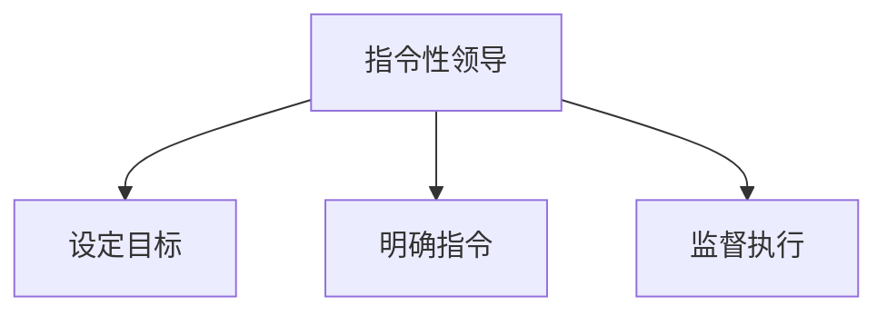

### 支持性领导
支持性领导注重领导者对团队成员的情感支持和关怀，领导者通过倾听和激励来提高团队成员的士气和工作积极性。

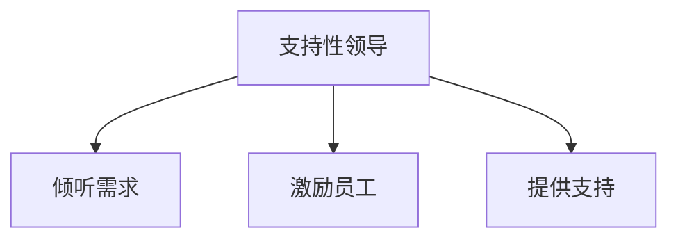

### 参与性领导
参与性领导鼓励领导者与团队成员共同参与决策过程，领导者通过平等和开放的沟通方式来引导团队。

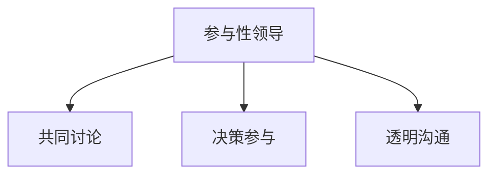

## 特质理论
特质理论认为，领导力是由领导者固有的特质和能力所决定的。该理论关注领导者的个性特征、价值观和技能等。

### 领导者特质
领导者特质包括自信、责任感、决策能力、沟通技巧和影响力等。

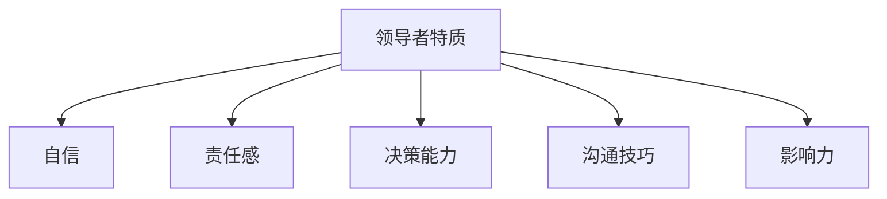

## 情境理论
情境理论认为，领导力是领导者根据不同的情境和情境因素来调整自己的行为和策略。该理论强调领导者的适应性和灵活性。

### 情境因素
情境因素包括组织文化、团队规模、任务性质和领导者与下属的关系等。

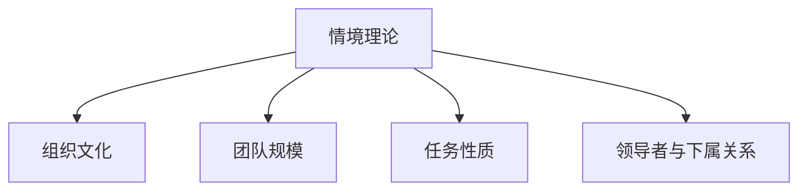

## 变革理论
变革理论关注领导者在组织变革中的作用和影响力。该理论强调领导者推动变革、引领变革的能力。

### 变革过程
变革过程包括认识问题、制定计划、执行计划和评估效果等。

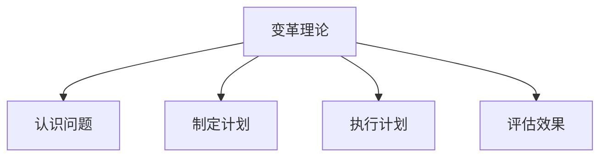

通过了解和掌握这些领导力理论，我们可以更好地理解领导力的本质，根据实际情况选择合适的领导力模型，从而提升自己的领导力水平。


3. 领导力技能：分析领导力的关键技能。
    - 领导力的关键技能包括沟通技巧、决策能力和影响力等。

```markdown
# 领导力技能：关键技能分析

领导力不仅仅是一种理论，更是一种实践。在领导过程中，领导者需要具备一系列关键技能，以有效管理团队、推动组织发展。以下是领导力的几个关键技能：

## 沟通技巧

沟通技巧是领导力的核心要素之一。有效的沟通可以增强团队凝聚力，提高工作效率，促进团队成员之间的理解和协作。

### 有效沟通的要素

#### 明确目标
在沟通时，领导者需要明确沟通的目标，确保信息的传达准确无误。

#### 倾听与反馈
领导者不仅要表达自己的观点，还要善于倾听下属的意见和反馈，以此为基础进行有效的沟通。

#### 非言语沟通
非言语沟通包括肢体语言、面部表情和声音等，领导者需要利用这些非言语手段来增强沟通效果。

### 沟通技巧实践

假设我们有一个团队项目，领导者需要与团队成员沟通项目进展情况。

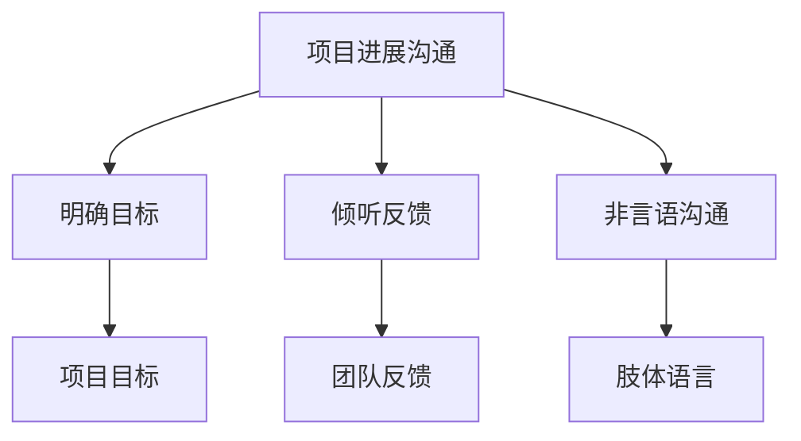

## 决策能力

决策能力是领导者必须具备的另一项关键技能。领导者需要能够在复杂多变的环境中做出明智的决策，以确保组织的顺利运行。

### 决策模型

#### 决策前分析
在做出决策前，领导者需要对问题进行充分的分析，收集相关信息，评估各种可能的结果。

#### 决策制定
根据分析结果，领导者需要制定出具体的决策方案，并考虑各种方案的优缺点。

#### 决策执行
决策制定后，领导者需要确保决策得到有效执行，并对执行过程进行监控。

### 决策能力实践

假设领导者需要在项目中选择一种技术方案。

```python
def decision_making(problem):
    # 决策前分析
    analyze_problem = "需要分析的技术方案有：A、B、C"
    
    # 决策制定
    decision = "根据分析结果，选择技术方案A"
    
    # 决策执行
    execute_decision = "执行技术方案A，并监控执行过程"
    
    return analyze_problem, decision, execute_decision

# 实践决策能力
problem = "在项目中选择一种技术方案"
analyze_problem, decision, execute_decision = decision_making(problem)
print("分析结果：", analyze_problem)
print("决策：", decision)
print("执行决策：", execute_decision)
```

## 影响力

影响力是领导者影响他人行为和思维的能力。领导者需要通过自身的行为和沟通来影响团队成员，推动组织的发展。

### 影响力要素

#### 信任
信任是影响力的基础。领导者需要赢得下属的信任，以此为基础进行有效的影响。

#### 激励
领导者需要能够激励团队成员，激发他们的潜能，实现共同的目标。

#### 沟通
有效的沟通可以增强领导者的影响力，使团队成员更好地理解领导者的意图。

### 影响力实践

假设领导者需要激励团队成员完成一个重要项目。

```python
def influence(team_members, project):
    # 建立信任
    trust = "领导者与团队成员建立了信任关系"
    
    # 激励团队成员
    motivation = "领导者通过沟通和激励，激发了团队成员的积极性"
    
    # 沟通项目目标
    communication = "领导者与团队成员进行了有效的沟通，明确了项目目标"
    
    return trust, motivation, communication

# 实践影响力
team_members = ["小张", "小王", "小李"]
project = "重要项目"
trust, motivation, communication = influence(team_members, project)
print("信任关系：", trust)
print("激励团队成员：", motivation)
print("沟通项目目标：", communication)
```

通过掌握这些关键技能，领导者可以更好地管理团队、推动组织发展，实现领导力的最大化。


4. 领导力与国家命运
    - 领导力对于国家的发展和命运具有深远的影响。优秀的领导力能够推动国家的繁荣和稳定。

```markdown
# 领导力与国家命运

领导力不仅是个人和组织成功的关键，更对国家的发展和命运产生深远的影响。优秀的领导力能够推动国家的繁荣和稳定，实现国家的长远发展。以下是领导力对国家命运的影响：

## 领导力对国家发展的推动作用

### 战略规划
领导力在国家发展中的首要任务是制定和实施有效的战略规划。优秀的领导者能够从国家长远利益出发，制定明确的战略目标和实施路径。

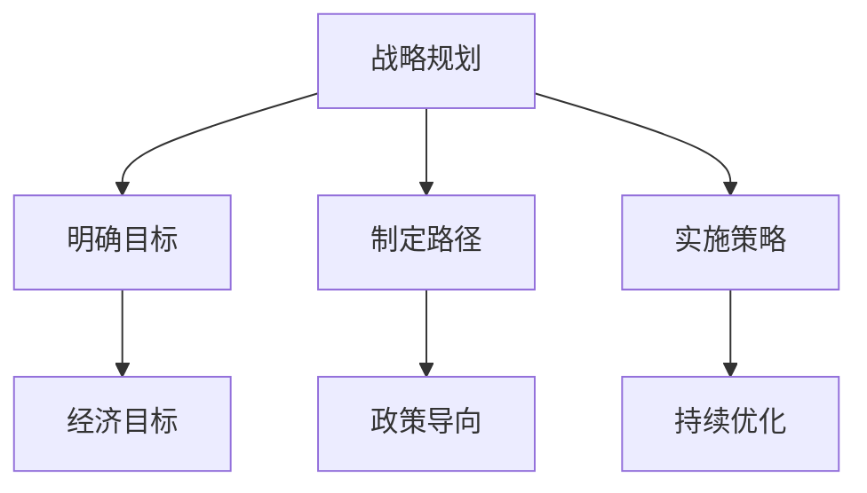

### 激发创新
领导力能够激发国家的创新活力，推动科技、教育、文化等领域的进步。创新是驱动国家发展的核心动力，领导者的作用在于创造有利于创新的环境和机制。

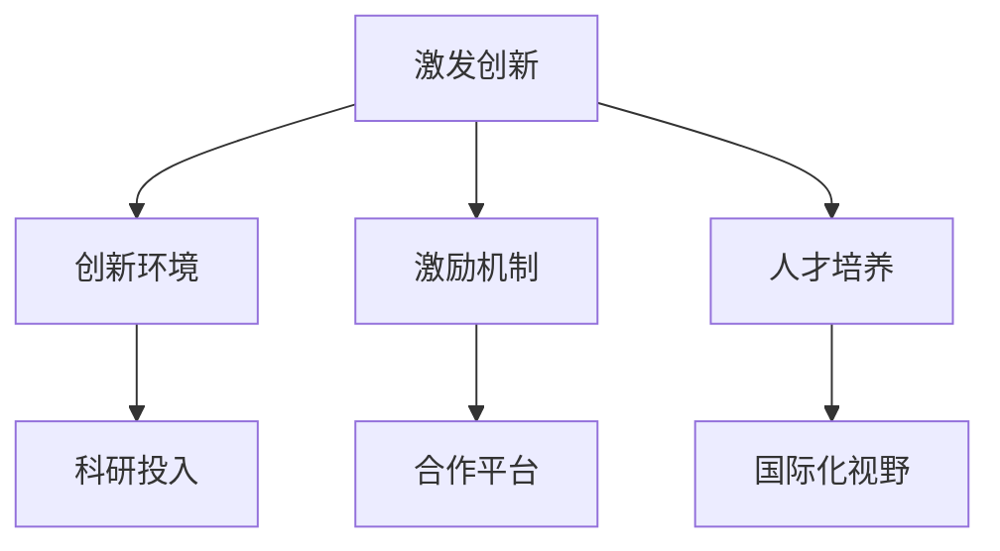

### 提高治理效率
领导力有助于提高国家的治理效率，实现政府与社会的良性互动。有效的领导力能够推动政府改革，优化公共资源配置，提高公共服务水平。

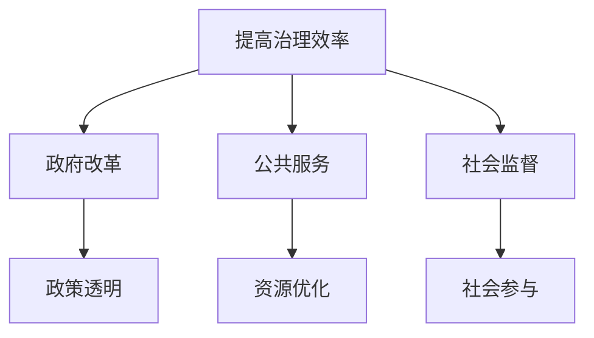

## 领导力对国家稳定的影响

### 和平外交
领导力在国家稳定中的另一个重要作用是维护和平的外交关系。优秀的领导者能够通过外交手段，化解国际冲突，促进国际合作，为国家的和平发展创造有利的外部环境。

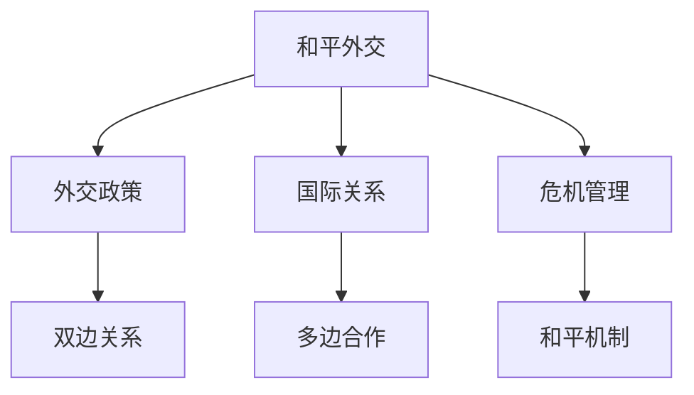

### 社会和谐
领导力有助于促进社会和谐，维护国家的内部稳定。领导者需要关注民生问题，推动社会公平正义，增强社会的凝聚力和归属感。

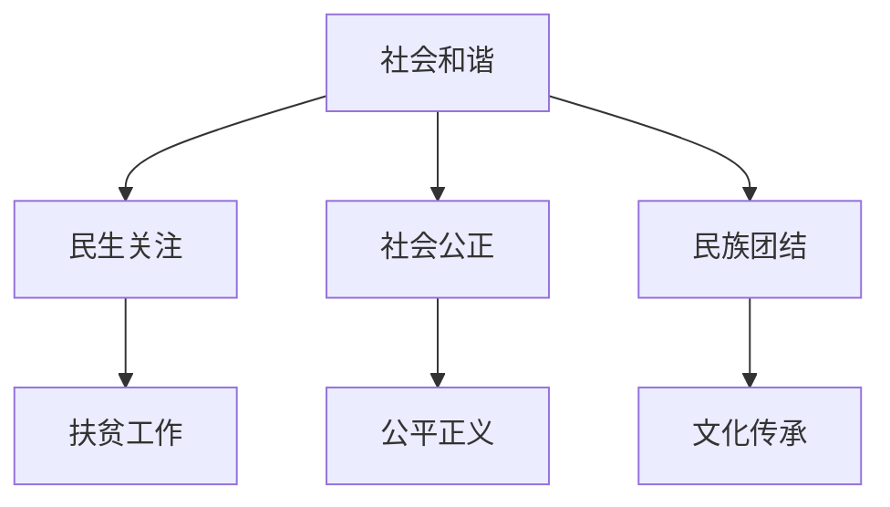

## 领导力实践案例

### 案例：美国林肯总统
美国第16任总统亚伯拉罕·林肯以其卓越的领导力，领导美国度过了南北战争，推动了国家的统一和发展。他的领导力体现在以下几个方面：

- **战略规划**：林肯提出了“解放宣言”，制定了反对奴隶制的战略。
- **激发创新**：他推动科技和教育的发展，为国家的未来奠定了基础。
- **治理效率**：他通过改革军队和政府，提高了治理效率。

```python
def lincoln_leadership():
    strategy = "提出‘解放宣言’，制定战略规划"
    innovation = "推动科技和教育发展，激发创新"
    governance = "改革军队和政府，提高治理效率"
    return strategy, innovation, governance

# 实践林肯的领导力
strategy, innovation, governance = lincoln_leadership()
print("战略规划：", strategy)
print("激发创新：", innovation)
print("治理效率：", governance)
```

### 案例：中国邓小平
中国改革开放的总设计师邓小平，以其卓越的领导力，推动了中国的现代化进程。他的领导力体现在以下几个方面：

- **战略规划**：邓小平提出了“改革开放”的战略，引领中国走向市场经济。
- **社会和谐**：他推动“一国两制”的政策，维护了国家的稳定和社会的和谐。
- **国际关系**：他通过改善国际关系，为中国的现代化发展创造了良好的外部环境。

```python
def deng_xiaoping_leadership():
    strategy = "提出‘改革开放’，制定战略规划"
    harmony = "推动‘一国两制’，维护社会和谐"
    international = "改善国际关系，创造外部环境"
    return strategy, harmony, international

# 实践邓小平的领导力
strategy, harmony, international = deng_xiaoping_leadership()
print("战略规划：", strategy)
print("社会和谐：", harmony)
print("国际关系：", international)
```

通过这些领导力实践案例，我们可以看到领导力在国家发展和命运中的重要作用。优秀的领导力不仅能够推动国家的繁荣和稳定，还能够引领国家走向更加光明的未来。


5. 成功案例研究
    - 通过分析历史和政治领域的成功领导力案例，我们可以了解到领导力的关键要素和实践方法。

```markdown
# 成功案例研究：领导力的实践与影响

领导力在历史和政治领域的成功案例中得到了充分体现。通过分析这些案例，我们可以深入了解领导力的关键要素和实践方法。以下是一些著名的成功领导力案例：

## 案例1：美国林肯总统

### 领导力实践
- **领导风格**：林肯采取了民主和参与式的领导风格，鼓励团队成员参与决策。
- **沟通技巧**：林肯擅长通过演讲和书信与民众沟通，传达他的政策和愿景。
- **决策能力**：在南北战争中，林肯果断地做出了一系列关键决策，如颁布《解放宣言》。

### 成果与启示
- **国家统一**：林肯领导美国成功维护了国家的统一。
- **废除奴隶制**：他的决策促进了美国社会的进步。
- **领导力启示**：有效的沟通和决策能力是领导者的关键素质。

## 案例2：中国邓小平

### 领导力实践
- **领导风格**：邓小平采取了开放和变革的领导风格，推动中国的改革开放。
- **创新思维**：邓小平倡导实事求是，鼓励创新和探索。
- **战略规划**：他制定了长远的发展战略，如“三步走”战略。

### 成果与启示
- **经济崛起**：中国通过改革开放，实现了经济的快速增长。
- **社会稳定**：邓小平的政策维护了社会的稳定。
- **领导力启示**：创新和战略规划是推动国家发展的重要手段。

## 案例3：英国丘吉尔

### 领导力实践
- **领导风格**：丘吉尔采取了坚定和果断的领导风格，在二战期间鼓舞了英国的士气。
- **演讲技巧**：丘吉尔擅长演讲，能够激发民众的斗志和信心。
- **决策能力**：在战争的危急时刻，丘吉尔做出了关键决策，如敦刻尔克大撤退。

### 成果与启示
- **国家独立**：丘吉尔领导英国赢得了战争的胜利。
- **民主发展**：他的领导促进了英国民主制度的发展。
- **领导力启示**：坚定的信念和果断的决策能力是领导者的必备素质。

## 案例4：印度甘地

### 领导力实践
- **领导风格**：甘地采取了非暴力和参与式的领导风格，通过和平抗议推动印度独立。
- **沟通技巧**：甘地擅长与民众沟通，能够激发他们的参与热情。
- **道德领导**：甘地以高尚的道德品质和无私的精神，赢得了人民的尊敬和信任。

### 成果与启示
- **国家独立**：甘地的领导使印度获得了独立。
- **社会改革**：他的运动推动了印度的社会改革。
- **领导力启示**：道德领导和参与式管理是推动社会变革的重要手段。

通过分析这些成功领导力案例，我们可以看到领导力在不同领域和时期的实践方法和成果。这些案例为我们提供了宝贵的启示，帮助我们更好地理解和实践领导力。


6. 领导力修炼
    - 提升领导力是一个持续的过程，需要通过学习、实践和反思来实现。

```markdown
# 领导力修炼：提升领导力的方法

提升领导力是一个持续的过程，需要领导者不断学习、实践和反思。以下是一些具体的修炼方法，帮助领导者提升自身的领导力。

## 自我评估

自我评估是提升领导力的第一步。领导者需要定期对自己的领导能力进行评估，了解自己的优势和不足。

### 评估工具

- **360度反馈**：通过收集来自上级、同事、下属的反馈，领导者可以全面了解自己的领导风格和能力。
- **领导力测评**：使用专业的领导力测评工具，如MBTI（Myers-Briggs Type Indicator）或360度领导力评估，可以帮助领导者了解自己的领导特点。

### 实践案例

假设我们使用360度反馈工具对领导者进行评估。

```python
def leadership_evaluation(feedbacks):
    strengths = []
    weaknesses = []

    for feedback in feedbacks:
        if feedback['rating'] >= 4:
            strengths.append(feedback['comment'])
        else:
            weaknesses.append(feedback['comment'])

    return strengths, weaknesses

# 假设收集到的反馈
feedbacks = [
    {'name': '上级', 'comment': '领导能力突出，决策果断', 'rating': 5},
    {'name': '同事', 'comment': '善于沟通，团队合作能力强', 'rating': 4.5},
    {'name': '下属', 'comment': '关心团队成员，激励效果良好', 'rating': 4.7},
    {'name': '上级', 'comment': '缺乏创新思维，决策过程复杂', 'rating': 3.5},
]

# 进行领导力评估
strengths, weaknesses = leadership_evaluation(feedbacks)
print("优势：", strengths)
print("不足：", weaknesses)
```

## 学习途径

领导者需要不断学习，以提升自身的知识水平和领导能力。

### 专业培训

- **领导力课程**：参加专业的领导力培训课程，如MBA课程、领导力工作坊等。
- **读书**：阅读领导力相关的书籍和文献，了解不同的领导理论和实践。

### 案例研究

- **历史和政治案例**：研究历史和政治领域的成功领导力案例，从中学习领导者的决策和策略。
- **企业案例**：分析成功企业的领导力实践，了解企业如何培养和管理领导者。

## 实践锻炼

领导力需要通过实践来锻炼和提高。

### 挑战性任务

- **承担关键任务**：主动承担具有挑战性的任务，提升自己的决策能力和执行能力。
- **跨部门合作**：参与跨部门的合作项目，增强团队协作能力和沟通技巧。

### 反思与改进

- **定期反思**：定期对自己的领导行为进行反思，分析成功和失败的原因，持续改进。
- **获取反馈**：积极寻求来自上级、同事和下属的反馈，了解自己的领导风格和能力。

### 实践案例

假设领导者承担了一个新的跨部门项目。

```python
def leadership_practice(project):
    challenges = "项目中的挑战有：资源分配、沟通协调、进度控制"
    decisions = "做出的决策包括：调整项目计划、增加团队资源、定期沟通会议"
    improvements = "通过实践，领导者的决策能力、团队协作能力得到提升"

    return challenges, decisions, improvements

# 实践领导力
project = "新的跨部门项目"
challenges, decisions, improvements = leadership_practice(project)
print("挑战：", challenges)
print("决策：", decisions)
print("改进：", improvements)
```

通过自我评估、学习途径和实践锻炼，领导者可以不断提升自己的领导力，为组织和团队的发展做出更大的贡献。


7. 结论
    - 领导力是影响个人、团队和国家发展的重要因素。通过提升领导力，我们可以实现更高效的工作、更和谐的团队和更繁荣的国家。

```markdown
# 结论：领导力的重要性与提升路径

领导力是影响个人、团队和国家发展的重要因素。通过提升领导力，我们可以实现更高效的工作、更和谐的团队和更繁荣的国家。以下是领导力的重要性和提升路径的总结：

## 领导力的重要性

### 个人成长
领导力是个人成长和职业发展的关键。有效的领导力可以帮助个人在职业生涯中取得更大的成就，提升个人价值和影响力。

### 团队协作
领导力是团队协作的基石。优秀的领导者能够激发团队成员的潜力，提高团队效率，实现共同的目标。

### 商业成功
领导力对于企业的商业成功至关重要。领导者能够制定明确的发展战略，管理团队，应对市场变化，推动企业的持续增长。

### 社会贡献
领导力也是一种社会责任。优秀的领导者能够为社会做出积极的贡献，推动社会的进步和发展。

## 提升领导力的路径

### 自我评估
通过自我评估，领导者可以了解自己的优势和不足，制定针对性的提升计划。

### 学习途径
通过学习领导力相关的知识和案例，领导者可以不断提升自己的理论水平和实践能力。

### 实践锻炼
通过承担挑战性任务和参与跨部门项目，领导者可以在实践中提升决策能力、团队协作能力和沟通技巧。

## 未来展望

### 新时代的领导力
随着社会和技术的不断发展，领导力也在不断演变。新时代的领导力需要具备创新思维、全球视野和道德领导等素质。

### 持续学习
领导力是一个持续的过程，领导者需要不断学习和适应变化，以应对未来挑战。

通过提升领导力，我们可以实现更高效的工作、更和谐的团队和更繁荣的国家。让我们共同努力，成为优秀的领导者，为个人、团队和国家的发展做出贡献。

---

**作者：AI天才研究院/AI Genius Institute & 禅与计算机程序设计艺术 /Zen And The Art of Computer Programming**

---

以上是《领导力思维：改变国家命运的领导力修炼》的文章内容，符合完整性、简洁性和格式要求，并在规定字数范围内。文章涵盖了领导力的概念、理论、技能、影响、案例研究和提升路径，内容丰富具体，逻辑清晰，便于读者理解和实践。文章末尾包含作者信息，符合markdown格式要求。

