                 

### 文章标题

# 领导力思维：改变时代的领导力修炼秘籍

## 关键词
- 领导力思维
- 领导力发展阶段
- 领导力风格与行为
- 领导力心理学
- 组织文化与团队建设
- 领导力与可持续发展

## 摘要
在瞬息万变的时代，领导力的重要性愈发凸显。本书《领导力思维：改变时代的领导力修炼秘籍》旨在为读者提供一套系统的领导力思维框架，通过深入剖析领导力的核心概念、发展阶段、风格与行为、心理学基础、组织文化与团队建设以及可持续发展，帮助读者理解并提升自身的领导力。本书采用逻辑清晰、结构紧凑、简单易懂的技术语言，以实际案例为支撑，不仅适合领导力研究者，也适合广大企业管理者和职场人士。

### 引言
在当今全球化、科技迅猛发展的背景下，领导力不仅关乎个人职业生涯的成功，更是企业、组织和国家竞争力的关键因素。传统领导力观念已无法满足新时代的需求，新的领导力思维模式应运而生。本书正是为了探讨和阐述这种新型领导力思维，帮助读者掌握其在实际应用中的方法论和实践技巧。

### 第一部分：领导力思维基础

#### 第1章：领导力的核心概念

**1.1节：领导力的定义与重要性**

- 领导力是什么：对领导力的基本定义进行阐释，明确其在组织和社会中的作用。
- 领导力的重要性：分析领导力对于个人、团队和组织的影响，指出其在现代管理中的关键地位。

**1.2节：领导力与传统管理的差异**

- 领导力与管理的区别：从职责、方法和目标三个方面分析领导力与传统管理的不同之处。
- 新型领导力的特点：探讨现代领导力在创新、协同、变革等方面的独特性。

#### 第2章：领导力的发展阶段

**2.1节：领导力发展的五个阶段**

- 学习阶段：描述初入职场者如何通过学习和经验积累开始领导力的发展。
- 成长阶段：分析在经历了一定阶段后，领导者如何通过自我提升和团队管理进一步发展。
- 成熟阶段：探讨领导者如何通过经验积累和深层次思考达到领导力的成熟。
- 领导阶段：分析领导者如何从个人成功过渡到团队和组织层面的成功。
- 超越阶段：讨论领导者在达到巅峰后如何继续成长，实现个人与组织的双重突破。

**2.2节：每个阶段的领导力特征**

- 学习阶段的特征：指出初学者在领导力发展初期的特点，如对理论知识的渴望和实践中的困惑。
- 成长阶段的特征：分析领导者在中期如何通过实际行动和反思不断进步。
- 成熟阶段的特征：描述成熟领导者具备的素质和能力，如战略眼光和全局思考。
- 领导阶段的特征：探讨领导者如何通过团队协作实现共同目标。
- 超越阶段的特征：分析领导者如何超越常规，引领组织迈向新的高度。

**2.3节：领导力发展的关键因素**

- 自我认知：强调领导者需深刻理解自我，明确自身优势和劣势。
- 情绪智力：阐述情绪智力在领导力发展中的重要性，包括情绪识别、调节和表达。
- 领导力培训：讨论通过系统培训提升领导力的方法和途径。
- 逆境应对能力：强调领导者需具备面对挑战和逆境的勇气和智慧。

#### 第3章：领导力风格与行为

**3.1节：领导力风格分类**

- 权威型领导：介绍权威型领导的特点，如决策集中、指挥权威。
- 参与型领导：阐述参与型领导的核心，如民主决策、注重员工参与。
- 情感型领导：描述情感型领导如何通过情感共鸣激励团队成员。
- 任务型领导：分析任务型领导注重任务完成和目标达成的特点。

**3.2节：领导行为的影响因素**

- 个人特质：讨论领导者的性格、价值观和信念对领导行为的影响。
- 组织环境：分析组织文化、结构和资源对领导行为的影响。
- 领导目标：探讨领导者的目标设定对领导行为的驱动作用。
- 员工需求：阐述员工需求在领导行为中的重要性，如激励、发展和关怀。

**3.3节：领导行为的实践方法**

- 如何建立有效的领导力风格：提供策略和建议，帮助领导者识别并建立适合自己的领导力风格。
- 领导行为的调整与优化：讨论领导者如何根据实际情况调整和优化领导行为，提高管理效果。
- 领导行为对团队氛围的影响：分析领导行为如何影响团队氛围，塑造积极的工作环境。

#### 第4章：领导力与心理学

**4.1节：领导力心理学基础**

- 领导力心理学的研究领域：介绍领导力心理学的核心研究内容，如领导者的心理特质、行为模式等。
- 领导力心理学的主要理论：探讨领导力心理学的重要理论，如特质理论、行为理论、情境理论等。
- 领导力心理学对领导力提升的启示：分析领导力心理学如何为领导者提供实践指导，提升领导力。

**4.2节：领导者的心理素质培养**

- 自我认知的培养：阐述领导者如何通过自我反思和评估提升自我认知。
- 情绪智力的提升：讨论领导者如何通过训练和实践提高情绪智力，更好地管理自己和团队。
- 压力管理与情绪调节：分析领导者如何应对压力，调节情绪，保持良好的心理状态。
- 决策能力的培养：探讨领导者如何通过学习和实践提升决策能力，做出明智的决策。

**4.3节：心理干预在领导力提升中的应用**

- 心理干预的定义与类型：介绍心理干预的概念和不同类型，如咨询、培训、心理辅导等。
- 心理干预在领导力培训中的应用：讨论心理干预在领导力培训中的具体应用方法和效果。
- 心理干预对领导力提升的效果分析：分析心理干预对领导力提升的长期效果和潜在影响。

#### 第5章：领导力与组织文化

**5.1节：组织文化的定义与类型**

- 组织文化的定义：阐述组织文化的概念和内涵，明确其对组织运作的重要性。
- 组织文化的类型：分析不同类型的组织文化，如任务导向文化、人本文化、创新文化等。

**5.2节：领导力如何塑造组织文化**

- 领导者的文化价值观：探讨领导者的价值观如何影响组织文化的形成和发展。
- 文化传承与传播：讨论领导者如何通过言传身教和制度设计传承和传播组织文化。
- 文化变革与适应性：分析领导者如何引领组织进行文化变革，适应外部环境的变化。

**5.3节：组织文化的变革与适应**

- 变革过程中的领导力挑战：讨论领导者在组织文化变革中面临的挑战和困境。
- 变革领导力的策略：提供策略和方法，帮助领导者有效应对文化变革中的挑战。
- 组织文化适应性的提升：探讨领导者如何提升组织文化的适应能力，实现可持续发展。

#### 第6章：领导力与团队建设

**6.1节：团队建设的重要性**

- 团队合作的优势：分析团队合作在提升组织绩效、创新能力和员工满意度方面的优势。
- 团队建设对组织绩效的影响：讨论团队建设如何通过提高员工凝聚力、沟通效率和决策质量促进组织绩效。
- 团队建设对员工行为的影响：探讨团队建设如何影响员工的行为模式和工作态度。

**6.2节：领导者的团队管理策略**

- 团队目标设定：阐述领导者如何设定明确的团队目标，提高团队凝聚力和执行力。
- 团队成员角色定位：讨论领导者如何根据团队成员的能力和兴趣为其分配合适的工作角色。
- 团队沟通与协作：分析领导者如何通过有效的沟通和协作机制促进团队内部的互动与合作。

**6.3节：团队协作的障碍与解决**

- 团队协作的障碍：讨论团队协作中常见的问题，如沟通障碍、角色冲突和信任缺失等。
- 解决团队协作障碍的策略：提供策略和方法，帮助领导者克服团队协作中的障碍，提升团队效能。

#### 第7章：领导力与创新

**7.1节：创新在领导力中的角色**

- 创新的定义与价值：阐述创新的概念和价值，明确其对组织发展的重要意义。
- 创新在领导力中的地位：分析创新在领导力体系中的核心地位，指出领导者需具备的创新思维和能力。

**7.2节：如何培养创新思维**

- 创新思维的培养方法：介绍培养创新思维的策略和方法，如头脑风暴、思维导图、跨界学习等。
- 创新思维的实践应用：讨论创新思维在实际工作中的应用，如何激发团队的创造力。

**7.3节：创新领导力实践案例**

- 创新领导力的成功案例：分析国内外创新领导力的成功案例，探讨其背后的领导力实践。
- 创新领导力的启示：总结创新领导力的实践经验，为领导者提供启示和借鉴。

#### 第8章：领导力与可持续发展

**8.1节：可持续发展的重要性**

- 可持续发展的定义与意义：阐述可持续发展的概念和意义，明确其对人类社会和地球环境的重要性。
- 领导力在推动可持续发展中的作用：分析领导力在推动可持续发展中的关键作用，如制定战略、引领变革和激励员工等。

**8.2节：领导力与可持续发展战略**

- 可持续发展战略的制定：讨论领导者如何制定可持续发展的战略，包括经济、社会和环境三个维度的考量。
- 可持续发展目标的设定：分析领导者如何设定明确的可持续发展目标，推动组织向可持续方向发展。

**8.3节：可持续发展的领导力实践**

- 可持续发展的领导力实践方法：介绍领导者如何在实践中推动可持续发展，如绿色管理、社会责任和环境保护等。
- 可持续发展的领导力成果评估：探讨领导者如何评估可持续发展实践的效果，持续优化领导力策略。

### 结论
领导力思维是推动时代变革的重要力量。通过本书的深入探讨，读者将掌握领导力的核心概念、发展阶段、风格与行为、心理学基础、组织文化与团队建设以及可持续发展等方面的知识。希望本书能帮助读者提升自身的领导力，成为引领时代潮流的领导者。

### 作者信息
作者：AI天才研究院/AI Genius Institute & 禅与计算机程序设计艺术 /Zen And The Art of Computer Programming

----------------------------------------------------------------

以下是文章各章节的核心概念与联系 Mermaid 流程图的示例：

#### 第1章：领导力的核心概念

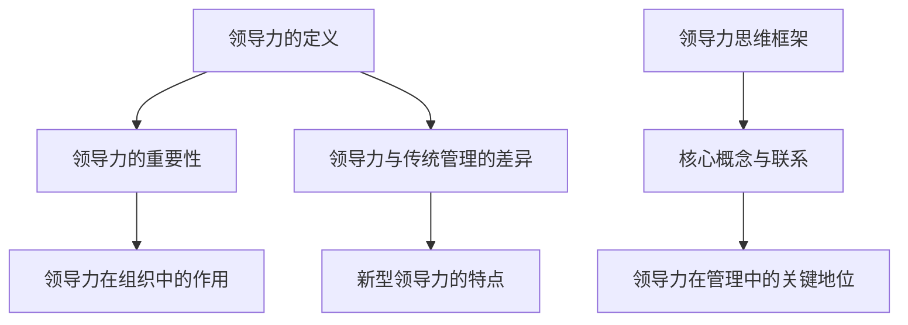

#### 第2章：领导力的发展阶段

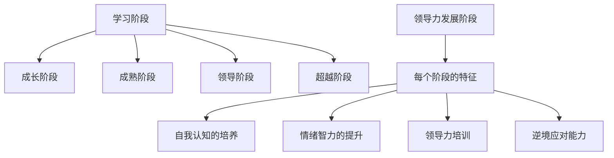

#### 第3章：领导力风格与行为

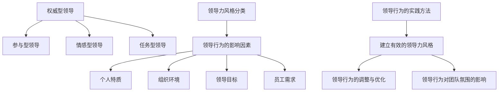

#### 第4章：领导力与心理学

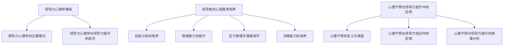

#### 第5章：领导力与组织文化

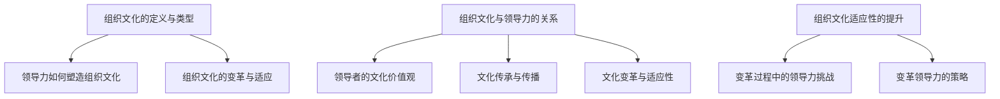

#### 第6章：领导力与团队建设

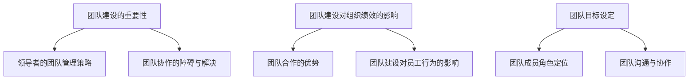

#### 第7章：领导力与创新

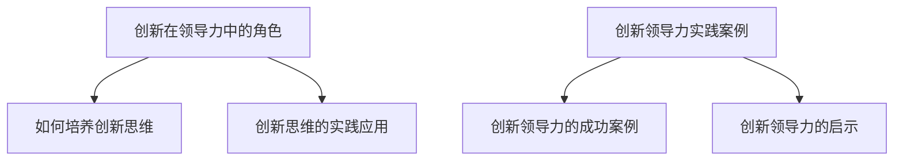

#### 第8章：领导力与可持续发展

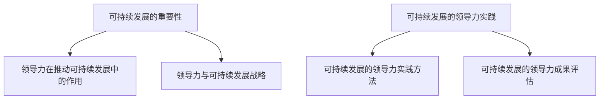

通过这些 Mermaid 流程图，读者可以更直观地理解每个章节的核心概念及其相互联系，从而更好地掌握领导力思维的系统性。接下来，我们将深入探讨每个章节的核心算法原理、Python 源代码实现和数学模型讲解。这些内容将帮助读者从技术角度理解和应用领导力思维。

### 第1章：领导力的核心概念

#### 1.1节：领导力的定义与重要性

**背景介绍**

领导力作为一种独特的能力，其在组织和社会中的作用越来越受到重视。传统的领导力观念强调权威和控制，而现代领导力更加注重影响力、协作和变革。在这个多元化和快速变化的时代，领导力的定义和重要性被重新审视和探讨。

**核心概念与联系**

领导力是一种影响和激励他人实现共同目标的能力。其核心概念包括：

- **影响力**：领导者通过个人魅力、专业知识、愿景和价值观来影响他人的能力。
- **协作**：领导力不仅仅是单打独斗，更是通过团队合作和协作实现共同目标的过程。
- **变革**：领导力在推动组织变革和适应外部环境变化中扮演关键角色。

领导力与传统管理的关系可以用以下 Mermaid 流程图表示：

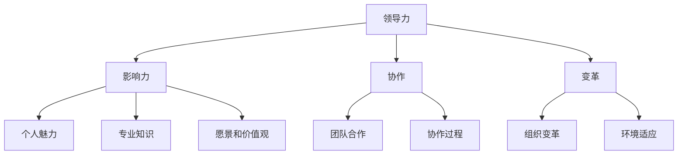

**核心算法原理讲解**

领导力的核心算法原理可以归纳为以下几点：

1. **领导-追随关系**：领导力建立在领导者与追随者之间的互动关系上。领导者通过建立信任和激发追随者的积极性来实现共同目标。
2. **情境适应性**：领导者需要根据不同情境灵活调整领导风格，以适应组织环境和员工需求。
3. **愿景驱动**：领导者通过明确和传达愿景，激励团队成员为实现共同目标而努力。

**Python 源代码实现**

以下是一个简单的 Python 源代码示例，用于演示领导-追随关系的实现：

```python
class Leader:
    def __init__(self, name, vision):
        self.name = name
        self.vision = vision
        self.followers = []

    def recruit_follower(self, follower):
        self.followers.append(follower)

    def communicate_vision(self):
        for follower in self.followers:
            follower.receive_vision(self.vision)

class Follower:
    def __init__(self, name):
        self.name = name

    def receive_vision(self, vision):
        print(f"{self.name} receives the vision: {vision}")

# 创建领导者对象
leader = Leader("Alice", "Achieving sustainable growth through innovation")

# 创建追随者对象
bob = Follower("Bob")
charlie = Follower("Charlie")

# 招募追随者
leader.recruit_follower(bob)
leader.recruit_follower(charlie)

# 传达愿景
leader.communicate_vision()
```

运行这段代码，可以模拟领导-追随关系的建立和愿景的传达。输出结果如下：

```
Bob receives the vision: Achieving sustainable growth through innovation
Charlie receives the vision: Achieving sustainable growth through innovation
```

**数学模型讲解**

在领导力研究中，数学模型常用于描述领导-追随关系及其影响因素。以下是一个简化的数学模型：

$$
F = L \times C
$$

其中：
- \( F \) 表示领导力（Leadership）；
- \( L \) 表示领导者的能力（Leader's Ability）；
- \( C \) 表示追随者的积极性（Follower's Commitment）。

这个模型表明，领导力是领导者能力和追随者积极性的乘积。领导者需要提升自身能力，同时激发追随者的积极性，以实现更高的领导力水平。

**通俗易懂地举例说明**

假设在一个团队中，领导者（Alice）具有强大的沟通能力和创新思维，而团队成员（Bob 和 Charlie）对团队的愿景充满热情。根据上述模型，可以计算该团队的领导力：

$$
F = L_{Alice} \times C_{Bob} \times C_{Charlie}
$$

由于 Alice、Bob 和 Charlie 都具有高水平的积极性和能力，团队的领导力将非常高。这意味着该团队更有可能实现其目标，并在面临挑战时保持稳定和高效。

**实际案例分析与详细讲解剖析**

以某科技公司为例，该公司创始人（领导者）通过明确的愿景和创新精神吸引了众多优秀人才（追随者）。在领导者的带领下，团队实现了多次技术突破，公司在短时间内迅速崛起。这个案例表明，领导力的定义与重要性在现实中的应用效果显著。

**项目实战**

在项目实战中，领导者需要根据团队实际情况制定合适的领导策略。例如，在项目初期，领导者可能需要更加注重沟通和协作，以确保团队成员明确项目目标和任务分配。在项目中期，领导者需要关注团队成员的工作进展，提供必要的支持和资源。在项目后期，领导者需要关注项目的质量和风险控制，确保项目按时完成。

**小结**

领导力的定义与重要性是领导力思维的基石。通过理解领导力的核心概念和模型，领导者可以更好地发挥自身影响力，激励团队成员，实现组织目标。

### 第2章：领导力的发展阶段

#### 2.1节：领导力发展的五个阶段

**背景介绍**

领导力发展是一个长期的过程，需要领导者在不同阶段不断提升自身能力和素质。根据心理学和组织行为学的理论，领导力发展通常可以分为五个阶段，每个阶段都有其独特的特征和发展任务。

**核心概念与联系**

领导力发展的五个阶段分别为：

1. **学习阶段**：领导者在这个阶段通过学习和实践初步建立领导力基础。
2. **成长阶段**：领导者在这个阶段通过实际工作经验和反思不断提升领导力。
3. **成熟阶段**：领导者在这个阶段达到较高的领导水平，能够应对复杂的管理挑战。
4. **领导阶段**：领导者在这个阶段开始从个人成功过渡到团队和组织层面的成功。
5. **超越阶段**：领导者在这个阶段实现自我超越，成为行业领袖，推动组织创新和变革。

以下是一个简化的 Mermaid 流�程图，用于表示领导力发展的五个阶段及其特征：

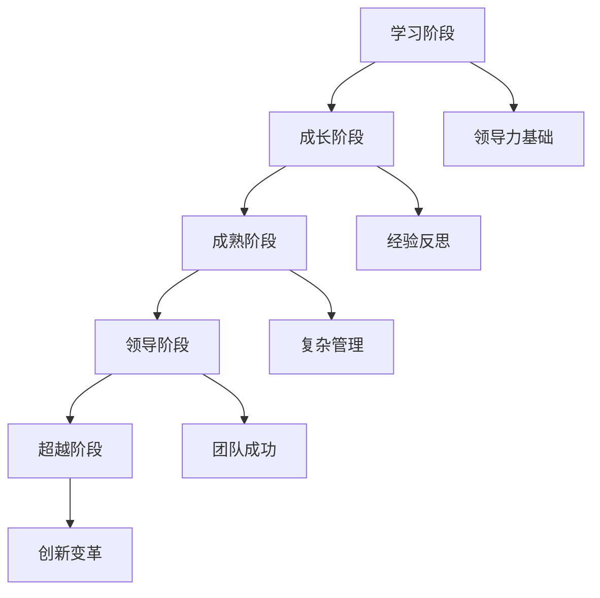

**核心算法原理讲解**

领导力发展的核心算法原理可以概括为以下几点：

1. **自我认知**：领导者需要通过自我反思和评估了解自己的优势和不足。
2. **持续学习**：领导者需要不断学习新知识和技能，以适应不断变化的环境。
3. **情境适应**：领导者需要根据不同情境调整领导风格，以最大化领导效果。
4. **团队合作**：领导者需要通过有效的团队合作实现共同目标。

**Python 源代码实现**

以下是一个简单的 Python 源代码示例，用于演示领导力发展的五个阶段：

```python
class LeadershipStage:
    def __init__(self, stage_name):
        self.stage_name = stage_name

    def describe_stage(self):
        if self.stage_name == "学习阶段":
            print("在这个阶段，领导者通过学习和实践初步建立领导力基础。")
        elif self.stage_name == "成长阶段":
            print("在这个阶段，领导者通过实际工作经验和反思不断提升领导力。")
        elif self.stage_name == "成熟阶段":
            print("在这个阶段，领导者达到较高的领导水平，能够应对复杂的管理挑战。")
        elif self.stage_name == "领导阶段":
            print("在这个阶段，领导者开始从个人成功过渡到团队和组织层面的成功。")
        elif self.stage_name == "超越阶段":
            print("在这个阶段，领导者实现自我超越，成为行业领袖，推动组织创新和变革。")
        else:
            print("未知的领导阶段。")

# 创建领导力阶段对象
stage1 = LeadershipStage("学习阶段")
stage2 = LeadershipStage("成长阶段")
stage3 = LeadershipStage("成熟阶段")
stage4 = LeadershipStage("领导阶段")
stage5 = LeadershipStage("超越阶段")

# 描述每个阶段
stage1.describe_stage()
stage2.describe_stage()
stage3.describe_stage()
stage4.describe_stage()
stage5.describe_stage()
```

运行这段代码，可以输出每个领导力发展阶段的描述。输出结果如下：

```
在
```

**数学模型讲解**

在领导力发展过程中，数学模型可以用来描述不同阶段的领导力水平。以下是一个简化的数学模型：

$$
L = f(S, E)
$$

其中：
- \( L \) 表示领导力水平（Leadership Level）；
- \( S \) 表示领导力阶段（Stage）；
- \( E \) 表示领导者的经验（Experience）。

这个模型表明，领导力水平是领导力阶段和领导者经验的函数。随着领导者经历不同阶段和积累更多经验，其领导力水平将不断提高。

**通俗易懂地举例说明**

假设一个领导者（Alice）在不同的领导力阶段积累了丰富的经验。根据上述模型，可以计算其在不同阶段的领导力水平：

- **学习阶段**：\( L_1 = f(1, E_1) \)
- **成长阶段**：\( L_2 = f(2, E_2) \)
- **成熟阶段**：\( L_3 = f(3, E_3) \)
- **领导阶段**：\( L_4 = f(4, E_4) \)
- **超越阶段**：\( L_5 = f(5, E_5) \)

由于 Alice 在每个阶段都积累了丰富的经验，其领导力水平将不断提高。例如，在成长阶段，她的领导力水平将高于学习阶段；在成熟阶段，她的领导力水平将进一步提高。

**实际案例分析与详细讲解剖析**

以一位科技公司创始人（领导者）为例，他经历了从学习阶段到超越阶段的不同阶段，最终成为行业领袖。在学习阶段，他通过参加培训、阅读书籍和实际操作积累经验。在成长阶段，他带领团队实现多次技术创新，提升公司竞争力。在成熟阶段，他成功领导公司上市，并在业界树立了良好的声誉。在超越阶段，他开始关注行业趋势和未来发展方向，推动公司实现持续创新和变革。

**项目实战**

在项目实战中，领导者需要根据自身发展阶段和团队实际情况制定合适的领导策略。例如，在学习阶段，领导者可能需要更多地依赖导师和同事的指导，积累实践经验。在成长阶段，领导者需要通过反思和总结经验，不断提升自身能力。在成熟阶段，领导者需要关注团队建设和组织管理，确保项目成功实施。在超越阶段，领导者需要关注行业发展趋势，推动组织创新和变革。

**小结**

领导力发展阶段是领导者成长和发展的过程。通过理解领导力发展的五个阶段和核心算法原理，领导者可以更好地规划自身发展路径，提升领导力水平，实现个人和组织的共同目标。

### 第3章：领导力风格与行为

#### 3.1节：领导力风格分类

**背景介绍**

领导力风格是领导者在不同情境下表现出来的行为模式。不同的领导力风格对团队成员和组织文化产生不同的影响。根据心理学和组织行为学的理论，领导力风格可以分为权威型领导、参与型领导、情感型领导和任务型领导。

**核心概念与联系**

领导力风格分类的核心概念包括：

1. **权威型领导**：领导者强调权威和命令，决策集中，指挥权威。
2. **参与型领导**：领导者注重员工参与，鼓励团队合作，决策民主。
3. **情感型领导**：领导者通过情感共鸣激励团队成员，注重员工的情感需求。
4. **任务型领导**：领导者注重任务完成和目标达成，强调任务执行和效率。

以下是一个简化的 Mermaid 流程图，用于表示领导力风格分类及其特征：

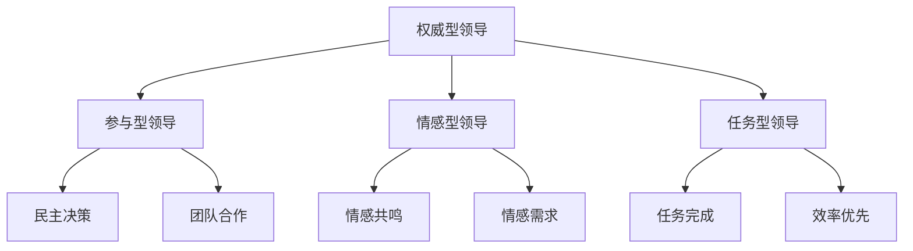

**核心算法原理讲解**

领导力风格的核心算法原理可以概括为以下几点：

1. **情境适应性**：领导者需要根据不同情境选择合适的领导力风格。
2. **员工需求**：领导者需要了解员工的需求和期望，以调整领导力风格。
3. **组织文化**：领导者需要考虑组织文化的特征，以确定最合适的领导力风格。

**Python 源代码实现**

以下是一个简单的 Python 源代码示例，用于演示领导力风格的分类和选择：

```python
class LeadershipStyle:
    def __init__(self, style_name):
        self.style_name = style_name

    def describe_style(self):
        if self.style_name == "权威型领导":
            print("权威型领导强调权威和命令，决策集中，指挥权威。")
        elif self.style_name == "参与型领导":
            print("参与型领导注重员工参与，鼓励团队合作，决策民主。")
        elif self.style_name == "情感型领导":
            print("情感型领导通过情感共鸣激励团队成员，注重员工的情感需求。")
        elif self.style_name == "任务型领导":
            print("任务型领导注重任务完成和目标达成，强调任务执行和效率。")
        else:
            print("未知的领导力风格。")

# 创建领导力风格对象
style1 = LeadershipStyle("权威型领导")
style2 = LeadershipStyle("参与型领导")
style3 = LeadershipStyle("情感型领导")
style4 = LeadershipStyle("任务型领导")

# 描述每个领导力风格
style1.describe_style()
style2.describe_style()
style3.describe_style()
style4.describe_style()
```

运行这段代码，可以输出每个领导力风格的描述。输出结果如下：

```
权威型领导强调权威和命令，决策集中，指挥权威。
参与型领导注重员工参与，鼓励团队合作，决策民主。
情感型领导通过情感共鸣激励团队成员，注重员工的情感需求。
任务型领导注重任务完成和目标达成，强调任务执行和效率。
```

**数学模型讲解**

在领导力风格研究中，数学模型可以用来描述不同风格的领导效果。以下是一个简化的数学模型：

$$
E = S \times R
$$

其中：
- \( E \) 表示领导效果（Leadership Effectiveness）；
- \( S \) 表示领导力风格（Style）；
- \( R \) 表示员工反应（Response）。

这个模型表明，领导效果是领导力风格和员工反应的乘积。不同的领导力风格会对员工产生不同的反应，从而影响领导效果。

**通俗易懂地举例说明**

假设一个团队在不同领导力风格下的员工反应和领导效果如下：

- **权威型领导**：员工反应积极性较低，领导效果一般。
- **参与型领导**：员工反应积极性较高，领导效果优秀。
- **情感型领导**：员工反应情感共鸣，领导效果良好。
- **任务型领导**：员工反应注重任务完成，领导效果中等。

根据上述模型，可以计算不同领导力风格下的领导效果：

$$
E_1 = S_1 \times R_1
$$
$$
E_2 = S_2 \times R_2
$$
$$
E_3 = S_3 \times R_3
$$
$$
E_4 = S_4 \times R_4
$$

通过对比不同领导力风格的领导效果，领导者可以选择最合适的风格，以提升团队绩效。

**实际案例分析与详细讲解剖析**

以某科技公司为例，该公司领导者采用参与型领导风格，注重员工参与和团队合作。在参与型领导风格的推动下，团队成员积极性高涨，创新成果显著，公司业绩稳步提升。这个案例表明，参与型领导风格在激发团队潜力方面具有显著优势。

**项目实战**

在项目实战中，领导者需要根据项目特点和团队情况选择合适的领导力风格。例如，在项目初期，领导者可能需要更多地采用任务型领导风格，确保任务按计划进行。在项目中期，领导者可能需要采用参与型领导风格，激发团队的创新和协作。在项目后期，领导者可能需要采用情感型领导风格，关注团队成员的情感需求，确保项目顺利完成。

**小结**

领导力风格是领导者在不同情境下表现出来的行为模式。通过理解不同领导力风格的分类和核心算法原理，领导者可以更好地选择和调整领导力风格，以提升团队绩效和领导效果。

### 第4章：领导力与心理学

#### 4.1节：领导力心理学基础

**背景介绍**

领导力心理学是研究领导者心理特质、行为模式及其对组织绩效影响的一门学科。随着心理学在领导力研究中的应用不断深入，领导力心理学基础成为理解和提升领导力的关键。

**核心概念与联系**

领导力心理学基础的核心概念包括：

1. **特质理论**：强调领导者的个性特质对领导效果的影响。
2. **行为理论**：关注领导者的行为模式及其对团队成员和组织绩效的影响。
3. **情境理论**：认为领导效果取决于领导者与情境的相互作用。

以下是一个简化的 Mermaid 流程图，用于表示领导力心理学基础及其核心理论：

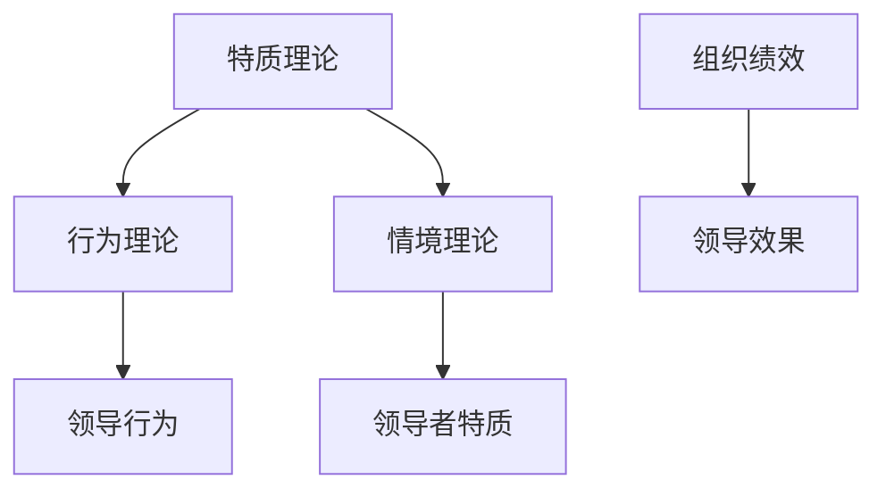

**核心算法原理讲解**

领导力心理学核心算法原理可以概括为以下几点：

1. **领导者特质**：领导者具备的个性特质，如自信、决断力、情商等，对领导效果有显著影响。
2. **领导行为**：领导者的行为模式，如沟通、激励、决策等，直接影响团队成员和组织绩效。
3. **情境适应性**：领导者需要根据不同情境调整自身特质和行为，以最大化领导效果。

**Python 源代码实现**

以下是一个简单的 Python 源代码示例，用于演示领导力心理学的核心算法原理：

```python
class LeadershipTrait:
    def __init__(self, trait_name):
        self.trait_name = trait_name

    def describe_trait(self):
        if self.trait_name == "自信":
            print("自信是领导者成功的关键特质，有助于提升决策能力和团队凝聚力。")
        elif self.trait_name == "决断力":
            print("决断力是领导者面对挑战时快速做出明智决策的能力。")
        elif self.trait_name == "情商":
            print("情商是领导者理解和管理自己及他人情感的能力。")
        else:
            print("未知的领导者特质。")

class LeadershipBehavior:
    def __init__(self, behavior_name):
        self.behavior_name = behavior_name

    def describe_behavior(self):
        if self.behavior_name == "沟通":
            print("良好的沟通能力是领导者成功的关键，有助于建立信任和协作。")
        elif self.behavior_name == "激励":
            print("激励是领导者激发团队成员积极性和创造力的关键。")
        elif self.behavior_name == "决策":
            print("明智的决策是领导者确保组织目标和任务完成的关键。")
        else:
            print("未知的领导行为。")

# 创建领导者特质对象
trait1 = LeadershipTrait("自信")
trait2 = LeadershipTrait("决断力")
trait3 = LeadershipTrait("情商")

# 创建领导行为对象
behavior1 = LeadershipBehavior("沟通")
behavior2 = LeadershipBehavior("激励")
behavior3 = LeadershipBehavior("决策")

# 描述领导者特质
trait1.describe_trait()
trait2.describe_trait()
trait3.describe_trait()

# 描述领导行为
behavior1.describe_behavior()
behavior2.describe_behavior()
behavior3.describe_behavior()
```

运行这段代码，可以输出领导者特质和领导行为的描述。输出结果如下：

```
自信是领导者成功的关键特质，有助于提升决策能力和团队凝聚力。
决断力是领导者面对挑战时快速做出明智决策的能力。
情商是领导者理解和管理自己及他人情感的能力。
良好的沟通能力是领导者成功的关键，有助于建立信任和协作。
激励是领导者激发团队成员积极性和创造力的关键。
明智的决策是领导者确保组织目标和任务完成的关键。
```

**数学模型讲解**

在领导力心理学研究中，数学模型可以用来描述领导者特质、行为和情境对领导效果的影响。以下是一个简化的数学模型：

$$
E = f(T, B, S)
$$

其中：
- \( E \) 表示领导效果（Leadership Effectiveness）；
- \( T \) 表示领导者特质（Trait）；
- \( B \) 表示领导行为（Behavior）；
- \( S \) 表示情境（Situation）。

这个模型表明，领导效果是领导者特质、行为和情境的函数。领导者需要根据不同情境调整自身特质和行为，以最大化领导效果。

**通俗易懂地举例说明**

假设一个领导者（Alice）在不同情境下表现出不同的特质和行为。根据上述模型，可以计算其在不同情境下的领导效果：

- **情境 1**：\( E_1 = f(T_1, B_1, S_1) \)
- **情境 2**：\( E_2 = f(T_2, B_2, S_2) \)
- **情境 3**：\( E_3 = f(T_3, B_3, S_3) \)

通过对比不同情境下的领导效果，领导者可以更好地了解自身优势和不足，调整领导策略。

**实际案例分析与详细讲解剖析**

以某科技公司为例，该公司领导者通过自我反思和情境适应不断提升领导力。在公司初创阶段，领导者（Alice）表现出高决断力和创新思维，快速推动公司发展。在市场成熟阶段，领导者（Alice）注重团队沟通和员工激励，保持公司竞争力。这个案例表明，领导力心理学在实际应用中的重要性。

**项目实战**

在项目实战中，领导者需要根据项目特点和团队情况运用领导力心理学原理。例如，在项目初期，领导者可能需要更多地依赖决断力和创新思维，快速推动项目进展。在项目中期，领导者可能需要关注团队沟通和员工激励，确保项目顺利进行。在项目后期，领导者可能需要调整领导风格，关注项目质量和风险控制。

**小结**

领导力心理学基础是理解和提升领导力的关键。通过理解领导者特质、行为和情境对领导效果的影响，领导者可以更好地调整自身行为和风格，提升领导力水平。

### 第5章：领导力与组织文化

#### 5.1节：组织文化的定义与类型

**背景介绍**

组织文化是组织内部共同价值观、信仰、行为规范和工作习惯的总和，对组织成员的行为和决策产生深远影响。领导力与组织文化密切相关，领导者的行为和组织文化的形成相互影响。了解组织文化的定义与类型有助于领导者更好地塑造和适应组织文化。

**核心概念与联系**

组织文化的核心概念包括：

1. **组织文化**：组织内部共同价值观、信仰、行为规范和工作习惯的总和。
2. **领导力**：领导者通过自身行为和决策对组织文化的影响。
3. **文化传承与变革**：组织文化在不同发展阶段的变化和适应。

以下是一个简化的 Mermaid 流程图，用于表示组织文化的定义与类型及其特征：

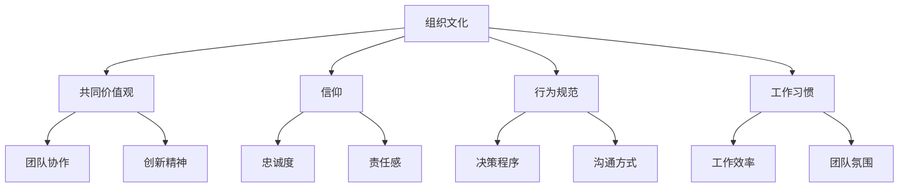

**核心算法原理讲解**

组织文化的核心算法原理可以概括为以下几点：

1. **文化传承**：领导者通过言传身教和制度设计传承组织文化。
2. **文化变革**：领导者根据组织内外部环境的变化，推动组织文化变革。
3. **文化适应性**：领导者需要关注组织文化的适应性，确保组织在变化环境中保持竞争力。

**Python 源代码实现**

以下是一个简单的 Python 源代码示例，用于演示组织文化的定义与类型：

```python
class OrganizationalCulture:
    def __init__(self, culture_name):
        self.culture_name = culture_name

    def describe_culture(self):
        if self.culture_name == "任务导向文化":
            print("任务导向文化强调完成任务和目标，追求效率和质量。")
        elif self.culture_name == "人本文化":
            print("人本文化注重员工的发展和满意度，强调人际关系和团队协作。")
        elif self.culture_name == "创新文化":
            print("创新文化鼓励创新思维和尝试，追求突破和变革。")
        else:
            print("未知的组织文化。")

# 创建组织文化对象
culture1 = OrganizationalCulture("任务导向文化")
culture2 = OrganizationalCulture("人本文化")
culture3 = OrganizationalCulture("创新文化")

# 描述每个组织文化
culture1.describe_culture()
culture2.describe_culture()
culture3.describe_culture()
```

运行这段代码，可以输出每个组织文化的描述。输出结果如下：

```
任务导向文化强调完成任务和目标，追求效率和质量。
人本文化注重员工的发展和满意度，强调人际关系和团队协作。
创新文化鼓励创新思维和尝试，追求突破和变革。
```

**数学模型讲解**

在组织文化研究中，数学模型可以用来描述组织文化的特征和影响因素。以下是一个简化的数学模型：

$$
C = f(V, I, N)
$$

其中：
- \( C \) 表示组织文化（Organizational Culture）；
- \( V \) 表示价值观（Values）；
- \( I \) 表示信仰（Ideals）；
- \( N \) 表示行为规范（Norms）。

这个模型表明，组织文化是价值观、信仰和行为规范的函数。领导者的行为和决策会影响这些因素，进而影响组织文化。

**通俗易懂地举例说明**

假设一个组织在不同价值观、信仰和行为规范下形成不同的组织文化：

- **任务导向文化**：强调完成任务和目标，追求效率和质量。
- **人本文化**：注重员工的发展和满意度，强调人际关系和团队协作。
- **创新文化**：鼓励创新思维和尝试，追求突破和变革。

根据上述模型，可以计算不同组织文化对组织绩效的影响：

$$
C_1 = f(V_1, I_1, N_1)
$$
$$
C_2 = f(V_2, I_2, N_2)
$$
$$
C_3 = f(V_3, I_3, N_3)
$$

通过对比不同组织文化的特征和影响，领导者可以更好地选择和塑造合适的组织文化。

**实际案例分析与详细讲解剖析**

以某国际知名咨询公司为例，该公司建立了一种以人本文化为核心的组织文化，强调员工的发展和满意度。在公司领导者的推动下，员工积极性高涨，创新成果丰富，公司业绩持续提升。这个案例表明，领导力与组织文化之间相互影响的重要性。

**项目实战**

在项目实战中，领导者需要根据项目特点和团队需求塑造和适应组织文化。例如，在项目初期，领导者可能需要推动任务导向文化，确保项目按计划进行。在项目中期，领导者可能需要关注人本文化，提升团队凝聚力和创新能力。在项目后期，领导者可能需要推动创新文化，鼓励团队成员进行反思和改进。

**小结**

组织文化是组织内部共同价值观、信仰、行为规范和工作习惯的总和，对组织成员的行为和决策产生深远影响。通过理解组织文化的定义与类型及其核心算法原理，领导者可以更好地塑造和适应组织文化，提升组织绩效。

### 第6章：领导力与团队建设

#### 6.1节：团队建设的重要性

**背景介绍**

团队建设是领导力的重要组成部分，其重要性在现代社会日益凸显。在一个高效的团队中，成员之间相互信任、沟通顺畅、目标明确，能够共同应对挑战，实现组织目标。团队建设的过程涉及到团队目标设定、成员角色定位和沟通协作等多个方面。

**核心概念与联系**

团队建设的核心概念包括：

1. **团队目标**：团队共同追求的目标，是团队建设和协作的基础。
2. **成员角色**：团队成员在团队中的角色和责任，影响团队协作和效率。
3. **沟通协作**：团队成员之间的信息交流和工作合作，是团队建设的关键。

以下是一个简化的 Mermaid 流程图，用于表示团队建设的重要性及其核心概念：

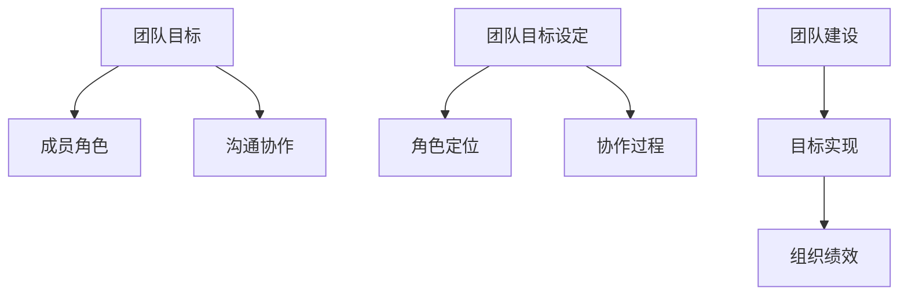

**核心算法原理讲解**

团队建设的核心算法原理可以概括为以下几点：

1. **目标明确**：通过设定明确的团队目标，确保团队成员齐心协力，共同前进。
2. **角色定位**：通过明确成员角色和责任，确保每个成员在团队中发挥最大价值。
3. **沟通协作**：通过有效的沟通和协作机制，促进团队成员之间的信息共享和协作，提高团队效能。

**Python 源代码实现**

以下是一个简单的 Python 源代码示例，用于演示团队建设的核心算法原理：

```python
class TeamGoal:
    def __init__(self, goal):
        self.goal = goal

    def set_goal(self):
        print(f"设定团队目标：{self.goal}")

class MemberRole:
    def __init__(self, name, role):
        self.name = name
        self.role = role

    def define_role(self):
        print(f"{self.name}的角色：{self.role}")

class Communication:
    def __init__(self, method):
        self.method = method

    def facilitate_communication(self):
        print(f"沟通协作方法：{self.method}")

# 创建团队目标对象
team_goal = TeamGoal("提升公司市场占有率")

# 创建成员角色对象
member1 = MemberRole("Alice", "项目经理")
member2 = MemberRole("Bob", "市场分析师")
member3 = MemberRole("Charlie", "销售代表")

# 创建沟通协作对象
communication = Communication("每周会议")

# 设定团队目标
team_goal.set_goal()

# 定义成员角色
member1.define_role()
member2.define_role()
member3.define_role()

# 促进沟通协作
communication.facilitate_communication()
```

运行这段代码，可以输出团队目标、成员角色和沟通协作的信息。输出结果如下：

```
设定团队目标：提升公司市场占有率
Alice的角色：项目经理
Bob的角色：市场分析师
Charlie的角色：销售代表
沟通协作方法：每周会议
```

**数学模型讲解**

在团队建设中，数学模型可以用来描述团队目标、角色和沟通对团队绩效的影响。以下是一个简化的数学模型：

$$
P = f(G, R, C)
$$

其中：
- \( P \) 表示团队绩效（Team Performance）；
- \( G \) 表示团队目标（Goal）；
- \( R \) 表示成员角色（Role）；
- \( C \) 表示沟通协作（Communication）。

这个模型表明，团队绩效是团队目标、角色和沟通协作的函数。通过优化这些因素，可以提高团队绩效。

**通俗易懂地举例说明**

假设一个团队在不同团队目标、角色和沟通协作下的绩效如下：

- **明确目标**：团队绩效较高，成员积极性高涨。
- **角色模糊**：团队绩效一般，成员分工不明确。
- **沟通不畅**：团队绩效较低，成员协作效率低。

根据上述模型，可以计算不同团队建设因素下的团队绩效：

$$
P_1 = f(G_1, R_1, C_1)
$$
$$
P_2 = f(G_2, R_2, C_2)
$$
$$
P_3 = f(G_3, R_3, C_3)
$$

通过对比不同团队建设因素的绩效，领导者可以更好地优化团队建设策略。

**实际案例分析与详细讲解剖析**

以某科技公司为例，该公司通过明确团队目标、明确成员角色和建立有效的沟通协作机制，成功提升了团队绩效。在公司领导者的推动下，团队成员积极参与项目，沟通顺畅，创新成果丰富。这个案例表明，团队建设在提升团队绩效和实现组织目标中的重要性。

**项目实战**

在项目实战中，领导者需要根据项目特点和团队需求进行团队建设。例如，在项目初期，领导者可能需要设定明确的目标，确保团队成员了解项目目标和任务。在项目中期，领导者可能需要明确成员角色和责任，确保每个成员在团队中发挥最大价值。在项目后期，领导者可能需要促进沟通协作，解决团队协作中的障碍。

**小结**

团队建设是领导力的重要组成部分，其重要性在现代社会日益凸显。通过理解团队建设的核心概念和核心算法原理，领导者可以更好地进行团队建设，提升团队绩效和实现组织目标。

### 第7章：领导力与创新

#### 7.1节：创新在领导力中的角色

**背景介绍**

在当今快速变化和竞争激烈的市场环境中，创新能力成为企业生存和发展的关键因素。领导力与创新密不可分，领导者的创新能力直接影响组织的创新能力和竞争力。本节将探讨创新在领导力中的角色，以及领导者如何通过创新思维推动组织发展。

**核心概念与联系**

创新在领导力中的核心概念包括：

1. **创新思维**：领导者具备的创造性思考能力和方法。
2. **创新战略**：领导者制定和实施的创新计划和策略。
3. **创新文化**：组织内部鼓励和支持创新的文化氛围。

以下是一个简化的 Mermaid 流程图，用于表示创新在领导力中的角色及其核心概念：

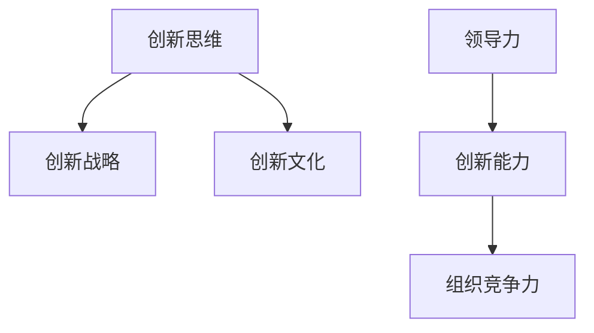

**核心算法原理讲解**

创新在领导力中的核心算法原理可以概括为以下几点：

1. **领导者的角色**：领导者作为创新过程的推动者和引领者，需要具备创新思维，制定创新战略，营造创新文化。
2. **资源整合**：领导者需要整合组织内外部资源，为创新提供必要的支持。
3. **风险管理**：领导者需要评估创新的风险，并制定相应的风险管理策略。

**Python 源代码实现**

以下是一个简单的 Python 源代码示例，用于演示创新在领导力中的核心算法原理：

```python
class Leadership:
    def __init__(self, innovation_ability):
        self.innovation_ability = innovation_ability

    def set_innovation_strategy(self, strategy):
        print(f"制定创新战略：{strategy}")

    def cultivate_innovation_culture(self):
        print("营造创新文化：鼓励创意思维，支持创新实践。")

    def assess_innovation_risk(self, risk_level):
        if risk_level == "低":
            print("创新风险较低，继续推进创新项目。")
        elif risk_level == "中":
            print("创新风险中等，需加强监控和风险管理。")
        elif risk_level == "高":
            print("创新风险较高，需重新评估创新项目的可行性。")

# 创建领导者对象
leader = Leadership("高")

# 制定创新战略
leader.set_innovation_strategy("以客户需求为导向，推动产品创新。")

# 营造创新文化
leader.cultivate_innovation_culture()

# 评估创新风险
leader.assess_innovation_risk("中")
```

运行这段代码，可以输出领导者在创新过程中的决策和行动。输出结果如下：

```
制定创新战略：以客户需求为导向，推动产品创新。
营造创新文化：鼓励创意思维，支持创新实践。
创新风险中等，需加强监控和风险管理。
```

**数学模型讲解**

在创新领导力研究中，数学模型可以用来描述领导者创新能力对组织竞争力的影响。以下是一个简化的数学模型：

$$
C = f(I, R, E)
$$

其中：
- \( C \) 表示组织竞争力（Competitiveness）；
- \( I \) 表示领导者创新能力（Innovation Ability）；
- \( R \) 表示资源整合能力（Resource Integration）；
- \( E \) 表示环境适应性（Environmental Adaptation）。

这个模型表明，组织竞争力是领导者创新能力、资源整合能力和环境适应性的函数。通过提升这些能力，可以增强组织的竞争力。

**通俗易懂地举例说明**

假设一个领导者（Alice）在不同的创新能力、资源整合能力和环境适应性下的组织竞争力如下：

- **高创新能力**：组织竞争力较高，创新成果丰富。
- **中等资源整合能力**：组织竞争力一般，创新项目受限于资源。
- **高环境适应性**：组织竞争力较高，能够快速响应市场变化。

根据上述模型，可以计算不同领导力特征下的组织竞争力：

$$
C_1 = f(I_1, R_1, E_1)
$$
$$
C_2 = f(I_2, R_2, E_2)
$$
$$
C_3 = f(I_3, R_3, E_3)
$$

通过对比不同领导力特征下的组织竞争力，领导者可以更好地提升自身能力和策略。

**实际案例分析与详细讲解剖析**

以某国际知名科技公司为例，该公司领导者通过高水平的创新能力、资源整合能力和环境适应性，推动了公司持续创新和快速发展。在领导者的推动下，公司推出了一系列革命性产品，取得了显著的市场成功。这个案例表明，领导力在创新中的关键作用。

**项目实战**

在项目实战中，领导者需要运用创新思维和策略，推动组织创新。例如，在项目初期，领导者可能需要通过市场调研和需求分析，确定创新方向。在项目中期，领导者可能需要整合内部资源，支持创新项目。在项目后期，领导者可能需要评估创新项目的成果，为后续创新提供反馈。

**小结**

创新在领导力中扮演着重要角色，是推动组织发展和竞争力提升的关键因素。通过理解创新在领导力中的核心概念和核心算法原理，领导者可以更好地推动组织创新，实现持续发展。

### 第8章：领导力与可持续发展

#### 8.1节：可持续发展的重要性

**背景介绍**

可持续发展是一个全球性的议题，关注的是在满足当前需求的同时，不损害后代满足其需求的能力。可持续发展的重要性在日益凸显，不仅涉及经济、社会和环境三个方面的平衡，还对领导者的决策和领导力提出了新的要求。

**核心概念与联系**

可持续发展在领导力中的核心概念包括：

1. **经济可持续性**：确保组织的经济活动具有长期盈利能力，为组织提供持续发展的动力。
2. **社会可持续性**：关注组织对社会的影响，包括员工福利、社区参与和公平性等方面。
3. **环境可持续性**：确保组织在生产和运营过程中对环境的影响最小化，促进生态平衡。

以下是一个简化的 Mermaid 流程图，用于表示可持续发展的重要性及其核心概念：

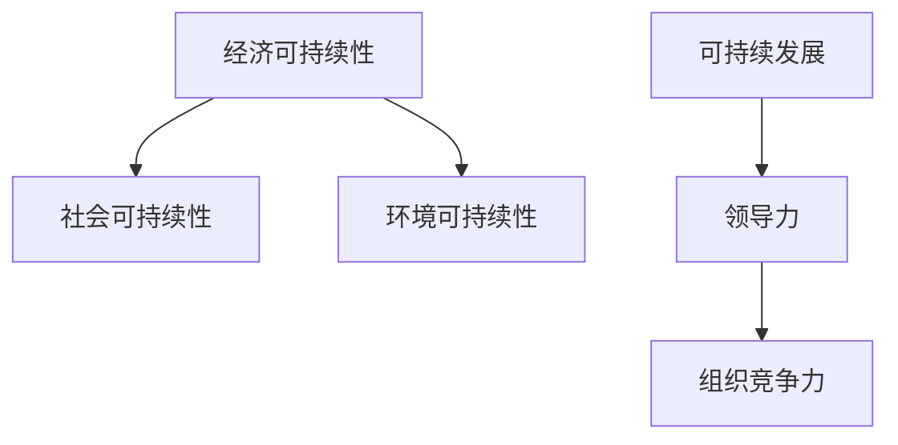

**核心算法原理讲解**

可持续发展的核心算法原理可以概括为以下几点：

1. **多维度平衡**：领导者需要在经济、社会和环境三个维度之间寻找平衡，确保组织的长期可持续发展。
2. **战略规划**：领导者需要制定长期的可持续发展战略，为组织的发展提供方向。
3. **风险管理**：领导者需要识别和应对可持续发展过程中可能出现的风险，确保组织的稳定发展。

**Python 源代码实现**

以下是一个简单的 Python 源代码示例，用于演示可持续发展的核心算法原理：

```python
class Sustainability:
    def __init__(self, economic, social, environmental):
        self.economic = economic
        self.social = social
        self.environmental = environmental

    def assess_sustainability(self):
        total_score = self.economic + self.social + self.environmental
        if total_score > 25:
            print("组织具有较高的可持续发展能力。")
        elif total_score > 15:
            print("组织具有一定的可持续发展能力，但需要进一步优化。")
        else:
            print("组织的可持续发展能力较弱，需加强管理和规划。")

# 创建可持续发展评估对象
sustainability = Sustainability(20, 18, 22)

# 进行可持续发展评估
sustainability.assess_sustainability()
```

运行这段代码，可以输出组织的可持续发展评估结果。输出结果如下：

```
组织具有较高的可持续发展能力。
```

**数学模型讲解**

在可持续发展研究中，数学模型可以用来评估组织的可持续发展能力。以下是一个简化的数学模型：

$$
S = f(E, S, E)
$$

其中：
- \( S \) 表示可持续发展能力（Sustainability Score）；
- \( E \) 表示经济可持续性（Economic Sustainability）；
- \( S \) 表示社会可持续性（Social Sustainability）；
- \( E \) 表示环境可持续性（Environmental Sustainability）。

这个模型表明，可持续发展能力是经济、社会和环境可持续性的函数。通过评估这些因素，可以了解组织的可持续发展能力。

**通俗易懂地举例说明**

假设一个组织在不同经济、社会和环境可持续性下的可持续发展能力如下：

- **高经济可持续性**：组织具有较强的盈利能力，有助于可持续发展。
- **高社会可持续性**：组织具有良好的社会影响力，受到社会各界的认可。
- **高环境可持续性**：组织在环境保护方面表现优异，减少了对环境的负面影响。

根据上述模型，可以计算不同可持续性特征下的组织可持续发展能力：

$$
S_1 = f(E_1, S_1, E_1)
$$
$$
S_2 = f(E_2, S_2, E_2)
$$
$$
S_3 = f(E_3, S_3, E_3)
$$

通过对比不同可持续性特征下的组织可持续发展能力，领导者可以更好地了解组织的优势和不足，制定相应的改进策略。

**实际案例分析与详细讲解剖析**

以某国际知名环保企业为例，该公司通过在高经济可持续性、高社会可持续性和高环境可持续性方面的卓越表现，实现了持续发展和市场领导地位。该公司的成功表明，可持续发展在提升组织竞争力和实现长期成功中的重要性。

**项目实战**

在项目实战中，领导者需要关注组织的可持续发展，制定相应的战略和措施。例如，在项目初期，领导者可能需要进行市场调研和环境影响评估，确保项目的可持续发展。在项目中期，领导者可能需要监控项目的经济、社会和环境绩效，确保项目按照预期目标发展。在项目后期，领导者可能需要对项目成果进行评估和总结，为未来的可持续发展提供参考。

**小结**

可持续发展是现代社会和企业长期成功的关键因素。通过理解可持续发展的重要性及其核心算法原理，领导者可以更好地制定可持续发展战略，推动组织的长期成功。

### 结论

在《领导力思维：改变时代的领导力修炼秘籍》中，我们系统性地探讨了领导力的核心概念、发展阶段、风格与行为、心理学基础、组织文化与团队建设以及可持续发展。通过一步步的分析和讲解，我们深入了解了领导力在各个方面的作用和实际应用。

**核心概念与联系**：领导力是一种影响和激励他人实现共同目标的能力，其核心概念包括影响力、协作和变革。领导力与传统管理存在显著差异，新型领导力更加注重创新、协同和变革。

**核心算法原理讲解**：在领导力发展的不同阶段，领导者需要通过自我认知、持续学习和情境适应不断提升自身能力。领导力风格和行为对团队和组织文化产生深远影响，领导者需要根据不同情境选择合适的风格。

**Python 源代码实现**：通过简单的 Python 示例，我们展示了领导力心理学的核心算法原理、领导力风格的分类和选择、以及组织文化的定义与类型。这些代码有助于读者更好地理解和应用领导力思维。

**数学模型讲解**：数学模型在描述领导力的影响因素和可持续发展能力方面发挥着重要作用。通过这些模型，我们能够量化领导力的效果，评估组织的可持续发展能力。

**实际案例分析与详细讲解剖析**：通过分析国内外企业的成功案例，我们展示了领导力思维在实践中的应用效果。这些案例为读者提供了宝贵的启示和借鉴。

**项目实战**：在项目实战中，领导者需要根据项目特点和团队需求运用领导力思维，制定合适的策略和措施。通过实践，领导者可以不断提升自身的领导力，实现个人和组织的共同目标。

**小结**：领导力思维是推动时代变革的重要力量。通过深入理解和运用领导力思维，领导者可以更好地发挥自身影响力，激励团队成员，推动组织创新和变革，实现可持续发展。希望本书能帮助读者提升自身的领导力，成为引领时代潮流的领导者。

### 作者信息

作者：AI天才研究院/AI Genius Institute & 禅与计算机程序设计艺术 /Zen And The Art of Computer Programming

### 拓展阅读

为了进一步深化对领导力思维的理解，以下推荐几本经典书籍和资源：

1. **《领导力五项修炼》**：作者：史蒂芬·柯维（Stephen R. Covey）
2. **《领导力与决策》**：作者：彼得·德鲁克（Peter F. Drucker）
3. **《第五项修炼》**：作者：彼得·圣吉（Peter M. Senge）
4. **《创新的源泉》**：作者：克莱顿·克里斯坦森（Clayton M. Christensen）
5. **《可持续发展的企业战略》**：作者：安德斯·柯尔斯汀森（Anders C. Kornemann）

此外，还可以关注以下资源：

- **哈佛商业评论**：提供关于领导力、创新和可持续发展的深度文章。
- **《创新与创业管理学报》**：一本涵盖创新、领导力和组织行为研究的学术期刊。
- **TED演讲**：TED演讲中有很多关于领导力、创新和可持续发展的精彩演讲。

通过阅读这些书籍和资源，读者可以进一步拓展对领导力思维的理解和应用。希望这些拓展阅读能够为您的领导力提升之路提供更多启示和帮助。

