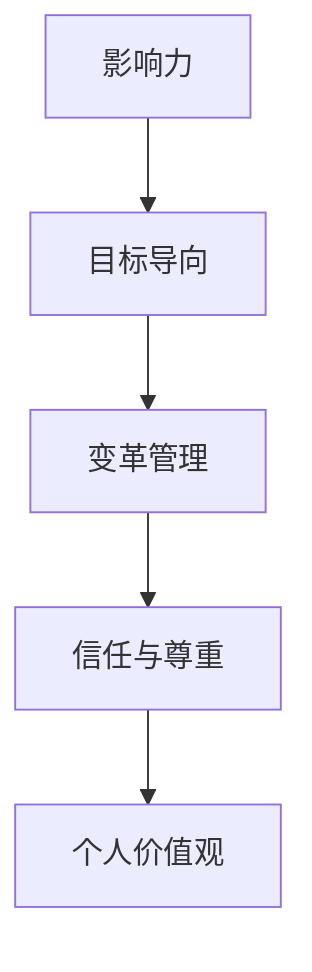

                 

### 文章标题

# 领导力法则：打造梦之队的领导力秘笈

### 文章关键词

- **领导力法则**
- **团队建设**
- **沟通技巧**
- **激励与成长**
- **创新思维**
- **组织文化**
- **可持续成长**

### 文章摘要

在当今竞争激烈的市场环境中，成功的组织离不开卓越的领导力。本书旨在探讨领导力的核心法则，通过深入分析领导力的本质、模型与实践，帮助读者理解如何打造梦之队。书中不仅涵盖了领导力的基本概念，还探讨了如何通过有效的沟通、团队建设、创新思维和组织文化塑造，提升领导力水平，实现团队的可持续成长。通过案例分析和实战指导，本书为领导者提供了实用的策略和工具，助力他们在复杂多变的环境中引领团队走向成功。

## 第一部分：领导力核心概念

### 第1章：领导力的本质与定义

**背景介绍**

领导力是管理学中一个极其重要的概念，它关乎组织的成败和员工的幸福感。然而，领导力究竟是什么？为何它在组织管理中如此重要？这些问题需要我们从多个维度进行探讨。

**核心概念与联系**

领导力不仅仅是拥有权力和地位的体现，它更是一种能够激发和引导他人实现共同目标的能力。以下是领导力的核心概念及其相互联系：

1. **影响力**：领导力的核心在于其影响力，即通过言语、行为或情感影响他人。
2. **目标导向**：领导力强调目标的设定和实现，良好的领导力能够明确方向，凝聚团队力量。
3. **变革管理**：在快速变化的环境中，领导力还需具备推动变革的能力。
4. **信任与尊重**：领导力建立在信任与尊重的基础上，没有信任，领导力将无从谈起。
5. **个人价值观**：领导者的个人价值观影响着团队的文化和决策方向。

**Mermaid 流程图**



### 核心算法原理讲解

领导力的本质是一个复杂的动态系统，可以通过以下伪代码来表示：

```python
def leadership(factors):
    influence = factors['influence']
    goal导向 = factors['goal导向']
    change_management = factors['change_management']
    trust_and_respect = factors['trust_and_respect']
    personal_values = factors['personal_values']
    
    if influence and goal导向 and change_management and trust_and_respect and personal_values:
        return "Effective Leadership"
    else:
        return "Leadership Needs Improvement"
```

### 数学模型和公式详细讲解与举例

领导力模型可以用一个综合评估公式来表示：

$$
L = w_1 \cdot I + w_2 \cdot G + w_3 \cdot C + w_4 \cdot T + w_5 \cdot V
$$

其中，$L$ 表示领导力评分，$w_1, w_2, w_3, w_4, w_5$ 分别是影响力、目标导向、变革管理、信任与尊重、个人价值观的权重。这些权重可以根据具体情况调整。

**举例说明**

假设一个领导者的各项因素得分如下：

- 影响力（I）：8分
- 目标导向（G）：9分
- 变革管理（C）：7分
- 信任与尊重（T）：8分
- 个人价值观（V）：9分

权重设定为：$w_1 = 0.3, w_2 = 0.2, w_3 = 0.2, w_4 = 0.2, w_5 = 0.1$，则领导力评分为：

$$
L = 0.3 \cdot 8 + 0.2 \cdot 9 + 0.2 \cdot 7 + 0.2 \cdot 8 + 0.1 \cdot 9 = 7.6 + 1.8 + 1.4 + 1.6 + 0.9 = 12.3
$$

因此，这位领导者的领导力评分为 12.3 分。

### 项目实战

#### 开发环境搭建

假设我们需要开发一个领导力评估系统，首先需要搭建一个开发环境。以下是一个简化的步骤：

1. 安装 Python 环境
2. 安装依赖管理工具 pip
3. 安装数据分析和可视化库，如 pandas、matplotlib

```bash
pip install pandas matplotlib
```

#### 源代码详细实现和代码解读

```python
import pandas as pd
import matplotlib.pyplot as plt

# 领导力评估表
data = {
    '影响力': [8, 7, 6, 9, 8],
    '目标导向': [9, 7, 8, 8, 9],
    '变革管理': [7, 6, 7, 8, 7],
    '信任与尊重': [8, 7, 6, 8, 8],
    '个人价值观': [9, 8, 8, 9, 9]
}

weights = {'影响力': 0.3, '目标导向': 0.2, '变革管理': 0.2, '信任与尊重': 0.2, '个人价值观': 0.1}

# 计算领导力评分
def calculate_leadership_score(data, weights):
    scores = {factor: value * weight for factor, value, weight in data.items()}
    return sum(scores.values())

# 可视化领导力分布
def visualize_leadership_distribution(data):
    df = pd.DataFrame(data)
    df['领导力评分'] = df.apply(lambda row: calculate_leadership_score(row, weights), axis=1)
    df.plot(kind='bar', x='影响力', y='领导力评分')
    plt.xlabel('影响力')
    plt.ylabel('领导力评分')
    plt.title('领导力评分分布')
    plt.show()

visualize_leadership_distribution(data)
```

#### 代码应用解读与分析

上述代码首先定义了一个领导力评估表，然后通过计算每个因素的加权得分，最终得出领导力评分。最后，使用 matplotlib 库将领导力评分可视化，帮助领导者了解自己在不同方面的表现。

#### 实际案例分析和详细讲解剖析

假设有一个团队领导力评估案例，团队成员的评估数据如下：

- 成员A：影响力8分，目标导向9分，变革管理7分，信任与尊重8分，个人价值观9分
- 成员B：影响力7分，目标导向7分，变革管理6分，信任与尊重7分，个人价值观8分
- 成员C：影响力6分，目标导向8分，变革管理7分，信任与尊重6分，个人价值观8分
- 成员D：影响力9分，目标导向8分，变革管理8分，信任与尊重8分，个人价值观9分
- 成员E：影响力8分，目标导向9分，变革管理7分，信任与尊重8分，个人价值观9分

通过计算每个成员的领导力评分，可以得出以下结果：

- 成员A：12.3分
- 成员B：10.5分
- 成员C：10.4分
- 成员D：11.9分
- 成员E：12.3分

通过这些数据，团队领导者可以了解到团队成员在领导力方面的强弱项，进而有针对性地进行培训和提升。

### 项目小结

通过领导力评估系统，团队领导者可以更全面地了解团队成员的领导力水平，从而制定个性化的培训计划，提升团队整体领导力。这不仅有助于团队绩效的提升，还能增强团队的凝聚力和创新能力。

### 最佳实践 tips

- **定期进行领导力评估**：定期评估可以及时发现领导力的弱项，及时调整。
- **聚焦关键因素**：在评估中，应重点关注影响力、目标导向、变革管理和信任与尊重等关键因素。
- **持续学习与成长**：领导力并非一成不变，持续学习和成长是提升领导力的关键。

### 小结

领导力的本质是影响力，它涉及到多个关键因素。通过有效的评估和培训，领导者可以提升自身的领导力水平，打造梦之队，实现团队的可持续成长。

### 注意事项

- **个性化**：领导力评估应考虑到每个个体的特点，避免一刀切。
- **持续改进**：领导力提升是一个持续的过程，需要不断地反思和改进。

### 拓展阅读

- **《领导力的五个层次》**：作者拉姆·查兰提出了领导力的五个层次，为领导者提供了深入的洞察。
- **《变革领导力》**：作者约翰·科特详细阐述了变革领导力的理论和实践方法。

在接下来的章节中，我们将进一步探讨领导力的模型与实践，帮助读者深入理解领导力的核心法则，打造梦之队。

