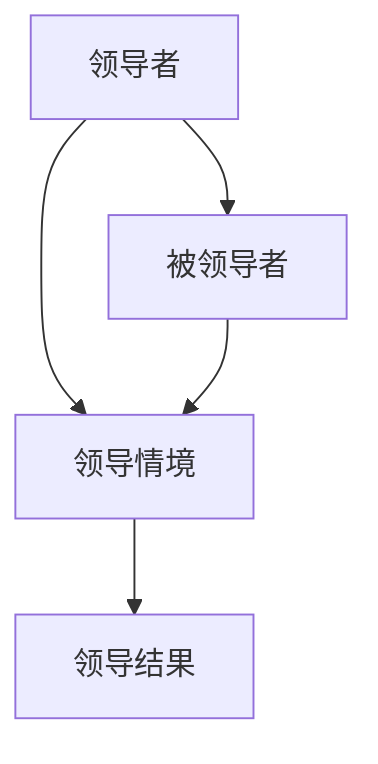

                 

# 《领导力法则：打造王者之师的领导力秘诀》

## 关键词
- 领导力法则
- 王者之师
- 领导力实践
- 领导力挑战
- 领导力成长

## 摘要
本文旨在探讨领导力的法则和实践，通过详细分析领导力的本质、核心概念、法则及其应用，旨在为领导者提供一套系统、实用的领导力秘诀，帮助他们在组织中打造出王者之师。文章将从领导力的原理出发，逐步深入探讨领导力的实践、挑战和解决方案，以及领导力与个人成长的紧密联系。最后，通过实际案例的分析，总结出领导力法则的最佳实践，为读者提供有益的启示。

## 引言

领导力是一个复杂的主题，它关乎个人魅力、团队协作、战略思维和领导艺术。在现代社会，领导力的重要性日益凸显。无论是企业、政府机构还是非营利组织，领导者都需要具备卓越的领导力，以引领团队走向成功。

本文将围绕《领导力法则：打造王者之师的领导力秘诀》这一主题，系统地阐述领导力的法则和实践。首先，我们将从领导力的本质出发，探讨领导力的核心概念和理论框架。接着，我们将深入分析领导力的法则，并探讨这些法则在现实中的应用。随后，我们将讨论领导力面临的挑战，并提出相应的解决方案。最后，我们将探讨领导力与个人成长的联系，并通过实际案例，总结出领导力法则的最佳实践。

通过本文的阅读，读者将能够了解领导力的本质和核心概念，掌握领导力的法则和实践，应对领导力面临的挑战，并在个人成长过程中不断提升自己的领导力水平。

### 领导力的本质

领导力是一个多维度的概念，它不仅涉及到个人魅力和影响力，还涉及到团队协作和战略思维。要理解领导力的本质，我们首先需要明确几个核心概念：领导者、被领导者、领导情境和领导结果。

**领导者与被领导者**

领导者是指那些能够激励、指导和影响他人实现共同目标的人。被领导者则是指那些接受领导者指导、参与团队协作的人。在领导过程中，领导者和被领导者之间的关系是动态的、相互影响的。

领导者和被领导者的关系不仅取决于个人的能力和素质，还受到领导情境的影响。领导情境是指领导者所处的具体环境，包括组织文化、团队结构、任务性质和外部环境等。

**领导情境**

领导情境是领导力发挥作用的关键因素。不同的领导情境会对领导者的行为和决策产生重大影响。例如，在一个高度竞争的市场环境中，领导者可能需要采取更具冒险性的策略；而在一个稳定的市场环境中，领导者可能更倾向于采取保守的策略。

**领导结果**

领导结果是指领导活动所带来的结果。这包括团队绩效、员工满意度和组织目标实现等方面。一个有效的领导者不仅要能够影响团队成员的行为和态度，还要能够推动团队实现预期目标。

### 核心概念与联系

为了更好地理解领导力的本质，我们可以借助 Mermaid 流程图来展示领导力的核心概念及其相互关系。以下是一个简化的 Mermaid 流程图：



在这个流程图中，领导者、被领导者、领导情境和领导结果构成了领导力的核心要素。领导者通过领导情境影响被领导者，从而实现预期的领导结果。

### 核心算法原理讲解

为了深入理解领导力的算法原理，我们可以通过 Python 源代码来阐述领导力模型的基本运作机制。以下是一个简单的领导力模型，它包含了对领导力核心概念的计算和评估：

```python
# 领导力模型示例

class LeadershipModel:
    def __init__(self, charisma, teamwork, strategic Thinking, context, result):
        self.charisma = charisma  # 领导魅力
        self.teamwork = teamwork  # 团队协作
        self战略 Thinking = strategic Thinking  # 战略思维
        self.context = context  # 领导情境
        self.result = result  # 领导结果

    def calculate_leadership_score(self):
        # 计算领导力得分
        score = (self.charisma + self.teamwork + self战略 Thinking) / 3
        return score

    def evaluate_context_impact(self):
        # 评估领导情境对领导结果的影响
        if self.context == "high_competition":
            result_impact = 1.2 * self.result
        elif self.context == "stable_environment":
            result_impact = 0.8 * self.result
        else:
            result_impact = self.result
        return result_impact

# 示例：创建一个领导力模型实例并计算得分
leader = LeadershipModel(charisma=8, teamwork=7, strategic_Thinking=9, context="high_competition", result=10)
print(f"领导力得分: {leader.calculate_leadership_score()}")
print(f"领导结果影响: {leader.evaluate_context_impact()}")
```

在这个模型中，我们定义了领导力的四个核心要素：领导魅力、团队协作、战略思维和领导情境。通过这些要素的计算和评估，我们可以得到一个反映领导力水平的得分，并进一步分析领导情境对领导结果的影响。

### 数学模型和公式

在领导力分析中，数学模型和公式可以用来量化领导力的各个方面。以下是一个简化的数学模型，用于计算领导力得分：

$$
\text{领导力得分} = \frac{\text{领导魅力} + \text{团队协作} + \text{战略思维}}{3}
$$

此外，领导情境对领导结果的影响可以通过以下公式来评估：

$$
\text{领导结果影响} = \text{领导力得分} \times (\text{情境影响因子})
$$

其中，情境影响因子根据不同的领导情境进行调整。例如，在高度竞争的环境中，情境影响因子可能设为 1.2，而在稳定的环境中，情境影响因子可能设为 0.8。

### 举例说明

为了更直观地理解领导力模型，我们可以通过一个具体的例子来说明：

假设有一位领导者，他的领导魅力得分为 8，团队协作得分为 7，战略思维得分为 9。他处于一个高度竞争的市场环境中。根据上述模型，我们可以计算他的领导力得分和领导结果影响：

1. **领导力得分**：

$$
\text{领导力得分} = \frac{8 + 7 + 9}{3} = 8
$$

2. **领导结果影响**：

$$
\text{领导结果影响} = 8 \times 1.2 = 9.6
$$

这意味着这位领导者在高度竞争的环境中，其领导力得分和领导结果影响都相对较高。

### 项目实战

为了更好地理解领导力模型在实际项目中的应用，我们可以通过一个实际案例来分析。以下是一个简单的项目案例，涉及领导力模型的应用：

**项目背景**：某企业正在开发一款新软件产品，需要在短时间内完成从需求分析到产品发布的全过程。领导团队由一位具有丰富经验的产品经理领导。

**领导力模型应用**：

1. **评估领导力得分**：根据领导力模型，产品经理的领导魅力得分为 9，团队协作得分为 8，战略思维得分为 10。因此，他的领导力得分为：

$$
\text{领导力得分} = \frac{9 + 8 + 10}{3} = 9
$$

2. **领导情境分析**：由于项目时间紧迫，市场竞争激烈，领导情境被评估为“高度竞争”。

3. **计算领导结果影响**：根据领导情境影响因子，领导结果影响为：

$$
\text{领导结果影响} = 9 \times 1.2 = 10.8
$$

这意味着产品经理在高度竞争的环境中，他的领导力得分和领导结果影响都相对较高，有助于项目团队在短时间内完成产品开发并成功发布。

**项目小结**：

通过实际案例，我们可以看到领导力模型在项目中的重要性。领导力得分和领导结果影响的分析有助于领导者了解自身在特定情境下的领导能力，并制定相应的策略来提升项目成功率。

### 最佳实践 Tips

- **持续学习**：领导者应不断学习新的领导理论和实践方法，以适应不断变化的环境。
- **关注团队动态**：领导者需要关注团队成员的需求和反馈，及时调整领导风格和策略。
- **沟通与协作**：建立有效的沟通机制，促进团队成员之间的协作和合作。
- **激励与赋能**：通过激励和赋能，提升团队成员的积极性和创造力。

### 小结

本文通过详细分析领导力的本质、核心概念和法则，并结合 Python 源代码、数学模型和实际案例，阐述了领导力模型在实际项目中的应用。通过本文的阅读，读者可以更好地理解领导力的核心要素，掌握领导力的法则和实践，为在组织中打造王者之师提供有力支持。

### 注意事项

- **适应不同情境**：领导者在实际应用中需要根据不同的领导情境调整领导策略。
- **持续优化**：领导力是一个持续优化的过程，领导者需要不断反思和改进自己的领导方法。

### 拓展阅读

- 《领导力五项修炼》（作者：斯蒂芬·罗宾斯）
- 《卓有成效的管理者》（作者：彼得·德鲁克）
- 《领导力的艺术》（作者：约翰·科特）

### 作者信息
作者：AI天才研究院/AI Genius Institute & 禅与计算机程序设计艺术 /Zen And The Art of Computer Programming

