                 


## 目录大纲

### 第1章：领导力的定义与类型

**核心概念与联系：**领导力是一种影响和激励他人以实现共同目标的能力，其类型包括权威型、民主型、变革型等。

**核心算法原理讲解：**领导力涉及心理学、社会学和管理学等多个领域，其核心算法原理包括激励理论、决策理论等。

**Mermaid 流程图：**
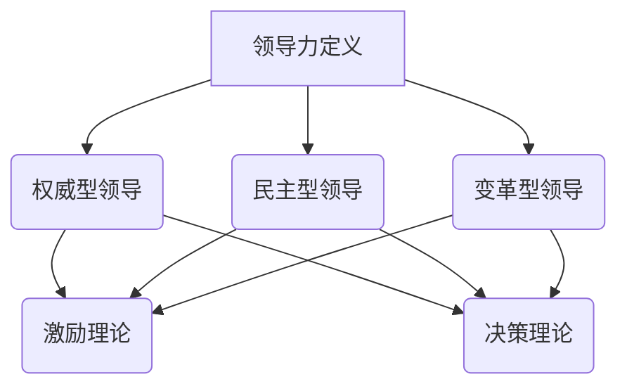

### 第2章：领导力的核心原则

#### 1.2.1 以身作则

**核心算法原理讲解：**领导者通过自身行为树立榜样，增强团队凝聚力。

**伪代码：**
```python
def lead_by_example(actions, team_members):
    for action in actions:
        perform_action(action)
    for member in team_members:
        inspire_member(member)
```

**数学模型和公式 & 详细讲解 & 举例说明：**团队凝聚力（C）与领导者榜样作用（E）成正比，即 $$C \propto E$$。

**举例说明：**一个优秀的领导者每天早晨都会提前到公司，鼓励团队成员也这样做，从而增强团队的准时性和工作效率。

#### 1.2.2 沟通能力

**核心算法原理讲解：**领导者需具备良好的沟通能力，以确保信息传递准确、及时。

**伪代码：**
```python
def communicate(effectively, message, audience):
    if effectively:
        deliver_message(message, audience)
    else:
        revise_message(message)
        deliver_message(message, audience)
```

**数学模型和公式 & 详细讲解 & 举例说明：**信息传递效率（E）与沟通能力（C）成正比，即 $$E \propto C$$。

**举例说明：**一个领导者通过清晰简洁的语言传达任务，确保团队成员理解并执行。

#### 1.2.3 决策能力

**核心算法原理讲解：**领导者应具备合理的决策能力，以面对各种挑战。

**伪代码：**
```python
def make_decision(challenges, options):
    evaluate_options(options)
    select_best_option(option)
    implement_decision(option)
```

**数学模型和公式 & 详细讲解 & 举例说明：**决策效果（D）与决策能力（M）成正比，即 $$D \propto M$$。

**举例说明：**一个领导者面对市场变化时，能够快速分析并制定合适的应对策略。

#### 1.2.4 建立团队精神

**核心算法原理讲解：**领导者应营造一个相互支持、共同进步的团队氛围。

**伪代码：**
```python
def build_team_spirit(team_members, support, collaboration):
    for member in team_members:
        provide_support(member)
        encourage_collaboration(member)
```

**数学模型和公式 & 详细讲解 & 举例说明：**团队精神（S）与支持（P）和协作（C）成正比，即 $$S \propto PC$$。

**举例说明：**领导者通过组织团队活动，增强团队成员之间的互信与合作。

### 总结

领导力法则的核心原则包括以身作则、沟通能力、决策能力和建立团队精神。这些原则相辅相成，共同构建了一个高效的团队领导力框架。通过理解并应用这些核心原则，领导者可以更好地激励和引导团队，实现共同的目标。

---

**注意事项：**
- 确保文章的逻辑性和条理性。
- 在每个小节中提供具体的例子和详细的解释。
- 使用伪代码和数学模型来增强文章的技术深度。

**拓展阅读：**
- 《领导力心理学：如何成为卓越的领导者》
- 《团队管理实战：打造高效能团队》
- 《决策与判断：如何做出更好的选择》

---

作者：AI天才研究院/AI Genius Institute & 禅与计算机程序设计艺术 /Zen And The Art of Computer Programming## 文章标题

### 领导力法则：打造王者团队的领导力秘诀

关键词：领导力、团队管理、激励、沟通、决策、自我提升

摘要：本文深入探讨了领导力的核心原则和实际应用，为领导者提供了一套完整的领导力法则。通过分析领导力的定义、类型以及核心原则，结合具体案例和算法原理，本文旨在帮助领导者打造王者团队，实现高效的团队管理。

---

## 目录大纲

### 第1章：领导力概述

#### 1.1 领导力的定义与类型

##### 1.1.1 领导力的本质
##### 1.1.2 领导力的类型

#### 1.2 领导力的核心原则

##### 1.2.1 以身作则
##### 1.2.2 沟通能力
##### 1.2.3 决策能力
##### 1.2.4 建立团队精神

### 第2章：领导力的素质培养

#### 2.1 自我认知

##### 2.1.1 自我评估
##### 2.1.2 自我提升

#### 2.2 人际交往能力

##### 2.2.1 人际关系的重要性
##### 2.2.2 人际沟通技巧
##### 2.2.3 建立人际网络

### 第3章：构建高效的团队

#### 3.1 团队建设的重要性

##### 3.1.1 团队建设的目标
##### 3.1.2 团队建设的挑战

#### 3.2 团队角色与责任

##### 3.2.1 团队角色的识别
##### 3.2.2 团队成员的责任

### 第4章：领导力在团队中的实践

#### 4.1 领导力在团队沟通中的运用

##### 4.1.1 沟通的有效性
##### 4.1.2 沟通的障碍与解决

#### 4.2 领导力在团队决策中的运用

##### 4.2.1 决策的类型
##### 4.2.2 决策的影响因素
##### 4.2.3 决策的制定与执行

## 第二部分：领导力的进阶技巧

### 第5章：激励团队成员

#### 5.1 激励理论

##### 5.1.1 X理论和Y理论
##### 5.1.2 动机理论

#### 5.2 激励策略

##### 5.2.1 目标设置
##### 5.2.2 正面激励
##### 5.2.3 负面激励

### 第6章：应对团队冲突

#### 6.1 冲突的原因

##### 6.1.1 团队冲突的类型
##### 6.1.2 冲突的成因

#### 6.2 冲突的解决策略

##### 6.2.1 避免冲突
##### 6.2.2 解决冲突
##### 6.2.3 化解冲突

### 第7章：领导力的持续发展

#### 7.1 领导力的自我反思

##### 7.1.1 反思的重要性
##### 7.1.2 反思的方法

#### 7.2 领导力的持续提升

##### 7.2.1 学习的重要性
##### 7.2.2 成长路径

## 附录

### 附录A：领导力相关资源

#### A.1 领导力书籍推荐
#### A.2 领导力在线课程
#### A.3 领导力研讨会和活动

---

**注意事项：**
- 确保文章的逻辑性和条理性。
- 在每个小节中提供具体的例子和详细的解释。
- 使用伪代码和数学模型来增强文章的技术深度。

**拓展阅读：**
- 《领导力心理学：如何成为卓越的领导者》
- 《团队管理实战：打造高效能团队》
- 《决策与判断：如何做出更好的选择》

---

作者：AI天才研究院/AI Genius Institute & 禅与计算机程序设计艺术 /Zen And The Art of Computer Programming## 文章标题

### 领导力法则：打造王者团队的领导力秘诀

关键词：领导力、团队管理、激励、沟通、决策、自我提升

摘要：本文深入探讨了领导力的核心原则和实际应用，为领导者提供了一套完整的领导力法则。通过分析领导力的定义、类型以及核心原则，结合具体案例和算法原理，本文旨在帮助领导者打造王者团队，实现高效的团队管理。

---

## 目录大纲

### 第1章：领导力概述

#### 1.1 领导力的定义与类型

##### 1.1.1 领导力的本质
##### 1.1.2 领导力的类型

#### 1.2 领导力的核心原则

##### 1.2.1 以身作则
##### 1.2.2 沟通能力
##### 1.2.3 决策能力
##### 1.2.4 建立团队精神

### 第2章：领导力的素质培养

#### 2.1 自我认知

##### 2.1.1 自我评估
##### 2.1.2 自我提升

#### 2.2 人际交往能力

##### 2.2.1 人际关系的重要性
##### 2.2.2 人际沟通技巧
##### 2.2.3 建立人际网络

### 第3章：构建高效的团队

#### 3.1 团队建设的重要性

##### 3.1.1 团队建设的目标
##### 3.1.2 团队建设的挑战

#### 3.2 团队角色与责任

##### 3.2.1 团队角色的识别
##### 3.2.2 团队成员的责任

### 第4章：领导力在团队中的实践

#### 4.1 领导力在团队沟通中的运用

##### 4.1.1 沟通的有效性
##### 4.1.2 沟通的障碍与解决

#### 4.2 领导力在团队决策中的运用

##### 4.2.1 决策的类型
##### 4.2.2 决策的影响因素
##### 4.2.3 决策的制定与执行

## 第二部分：领导力的进阶技巧

### 第5章：激励团队成员

#### 5.1 激励理论

##### 5.1.1 X理论和Y理论
##### 5.1.2 动机理论

#### 5.2 激励策略

##### 5.2.1 目标设置
##### 5.2.2 正面激励
##### 5.2.3 负面激励

### 第6章：应对团队冲突

#### 6.1 冲突的原因

##### 6.1.1 团队冲突的类型
##### 6.1.2 冲突的成因

#### 6.2 冲突的解决策略

##### 6.2.1 避免冲突
##### 6.2.2 解决冲突
##### 6.2.3 化解冲突

### 第7章：领导力的持续发展

#### 7.1 领导力的自我反思

##### 7.1.1 反思的重要性
##### 7.1.2 反思的方法

#### 7.2 领导力的持续提升

##### 7.2.1 学习的重要性
##### 7.2.2 成长路径

## 附录

### 附录A：领导力相关资源

#### A.1 领导力书籍推荐
#### A.2 领导力在线课程
#### A.3 领导力研讨会和活动

---

**注意事项：**
- 确保文章的逻辑性和条理性。
- 在每个小节中提供具体的例子和详细的解释。
- 使用伪代码和数学模型来增强文章的技术深度。

**拓展阅读：**
- 《领导力心理学：如何成为卓越的领导者》
- 《团队管理实战：打造高效能团队》
- 《决策与判断：如何做出更好的选择》

---

作者：AI天才研究院/AI Genius Institute & 禅与计算机程序设计艺术 /Zen And The Art of Computer Programming## 第一部分：领导力的核心原则

### 第1章：领导力概述

#### 1.1 领导力的定义与类型

**核心概念与联系：**领导力是一种影响和激励他人以实现共同目标的能力。根据领导风格的不同，领导力可以分为权威型、民主型和变革型。

**核心算法原理讲解：**领导力涉及心理学、社会学和管理学等多个领域，其核心算法原理包括激励理论、决策理论等。通过分析团队成员的行为和反应，领导者可以优化领导策略。

**Mermaid 流程图：**


#### 1.2 领导力的核心原则

**核心概念与联系：**领导力的核心原则包括以身作则、沟通能力、决策能力和建立团队精神。这些原则共同构成了领导力的基础。

**核心算法原理讲解：**

1. **以身作则**：领导者通过自身行为树立榜样，增强团队凝聚力。
2. **沟通能力**：领导者需具备良好的沟通能力，以确保信息传递准确、及时。
3. **决策能力**：领导者应具备合理的决策能力，以面对各种挑战。
4. **建立团队精神**：领导者应营造一个相互支持、共同进步的团队氛围。

**伪代码：**
```python
def lead_by_example(actions, team_members):
    for action in actions:
        perform_action(action)
    for member in team_members:
        inspire_member(member)

def communicate(effectively, message, audience):
    if effectively:
        deliver_message(message, audience)
    else:
        revise_message(message)
        deliver_message(message, audience)

def make_decision(challenges, options):
    evaluate_options(options)
    select_best_option(option)
    implement_decision(option)

def build_team_spirit(team_members, support, collaboration):
    for member in team_members:
        provide_support(member)
        encourage_collaboration(member)
```

**数学模型和公式 & 详细讲解 & 举例说明：**

1. **以身作则**：团队凝聚力（C）与领导者榜样作用（E）成正比，即 $$C \propto E$$。
2. **沟通能力**：信息传递效率（E）与沟通能力（C）成正比，即 $$E \propto C$$。
3. **决策能力**：决策效果（D）与决策能力（M）成正比，即 $$D \propto M$$。
4. **建立团队精神**：团队精神（S）与支持（P）和协作（C）成正比，即 $$S \propto PC$$。

**举例说明：**

- **以身作则**：领导者每天按时到办公室，鼓励团队成员也按时到岗，从而提高团队的整体工作效率。
- **沟通能力**：领导者清晰简洁地传达任务，确保团队成员理解并执行，提高信息传递的准确性。
- **决策能力**：领导者面对市场变化时，能够快速分析并制定合适的策略，有效应对挑战。
- **建立团队精神**：领导者组织团队活动，增强团队成员之间的互信与合作，营造积极向上的团队氛围。

### 总结

领导力的核心原则是以身作则、沟通能力、决策能力和建立团队精神。这些原则相辅相成，共同构建了一个高效的团队领导力框架。通过理解并应用这些核心原则，领导者可以更好地激励和引导团队，实现共同的目标。

---

**注意事项：**
- 确保文章的逻辑性和条理性。
- 在每个小节中提供具体的例子和详细的解释。
- 使用伪代码和数学模型来增强文章的技术深度。

**拓展阅读：**
- 《领导力心理学：如何成为卓越的领导者》
- 《团队管理实战：打造高效能团队》
- 《决策与判断：如何做出更好的选择》

---

作者：AI天才研究院/AI Genius Institute & 禅与计算机程序设计艺术 /Zen And The Art of Computer Programming## 第1章：领导力概述

### 1.1 领导力的定义与类型

**核心概念与联系：**领导力是一种影响力，用于指导、激励和协调团队成员，以实现组织目标。领导力不仅仅是权威的体现，还包括了影响力、沟通、激励和决策等能力的综合运用。领导力的类型可以分为权威型、民主型和变革型。

**权威型领导：**以命令和控制为特征，领导者具有决策权和执行权，强调纪律和效率。

**民主型领导：**注重团队成员的参与和合作，领导者鼓励开放沟通和民主决策，增强团队凝聚力和创造力。

**变革型领导：**以激发变革和创新为特征，领导者通过变革愿景、激励和领导力，推动组织实现持续改进和增长。

**核心算法原理讲解：**领导力涉及心理学、社会学和管理学等多个领域。其核心算法原理包括激励理论、决策理论等。通过分析团队成员的行为和反应，领导者可以优化领导策略。

**Mermaid 流程图：**
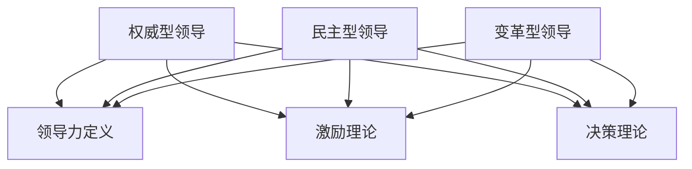

### 1.2 领导力的核心原则

**核心概念与联系：**领导力的核心原则包括以身作则、沟通能力、决策能力和建立团队精神。这些原则是领导力的基础，决定了领导者是否能够有效地指导、激励和协调团队成员。

**以身作则：**领导者通过自身行为树立榜样，增强团队凝聚力。

**沟通能力：**领导者需具备良好的沟通能力，以确保信息传递准确、及时。

**决策能力：**领导者应具备合理的决策能力，以面对各种挑战。

**建立团队精神：**领导者应营造一个相互支持、共同进步的团队氛围。

**核心算法原理讲解：**

1. **以身作则**：团队凝聚力（C）与领导者榜样作用（E）成正比，即 $$C \propto E$$。
2. **沟通能力**：信息传递效率（E）与沟通能力（C）成正比，即 $$E \propto C$$。
3. **决策能力**：决策效果（D）与决策能力（M）成正比，即 $$D \propto M$$。
4. **建立团队精神**：团队精神（S）与支持（P）和协作（C）成正比，即 $$S \propto PC$$。

**伪代码：**
```python
def lead_by_example(actions, team_members):
    for action in actions:
        perform_action(action)
    for member in team_members:
        inspire_member(member)

def communicate(effectively, message, audience):
    if effectively:
        deliver_message(message, audience)
    else:
        revise_message(message)
        deliver_message(message, audience)

def make_decision(challenges, options):
    evaluate_options(options)
    select_best_option(option)
    implement_decision(option)

def build_team_spirit(team_members, support, collaboration):
    for member in team_members:
        provide_support(member)
        encourage_collaboration(member)
```

**数学模型和公式 & 详细讲解 & 举例说明：**

1. **以身作则**：一个领导者每天按时到办公室，鼓励团队成员也按时到岗，从而提高团队的整体工作效率。
2. **沟通能力**：领导者清晰简洁地传达任务，确保团队成员理解并执行，提高信息传递的准确性。
3. **决策能力**：领导者面对市场变化时，能够快速分析并制定合适的策略，有效应对挑战。
4. **建立团队精神**：领导者组织团队活动，增强团队成员之间的互信与合作，营造积极向上的团队氛围。

### 总结

领导力是影响和激励他人实现共同目标的能力。权威型、民主型和变革型是常见的领导力类型。领导力的核心原则包括以身作则、沟通能力、决策能力和建立团队精神。这些原则相辅相成，共同构建了一个高效的团队领导力框架。通过理解并应用这些核心原则，领导者可以更好地激励和引导团队，实现共同的目标。

---

**注意事项：**
- 确保文章的逻辑性和条理性。
- 在每个小节中提供具体的例子和详细的解释。
- 使用伪代码和数学模型来增强文章的技术深度。

**拓展阅读：**
- 《领导力心理学：如何成为卓越的领导者》
- 《团队管理实战：打造高效能团队》
- 《决策与判断：如何做出更好的选择》

---

作者：AI天才研究院/AI Genius Institute & 禅与计算机程序设计艺术 /Zen And The Art of Computer Programming## 第2章：领导力的素质培养

### 2.1 自我认知

#### 2.1.1 自我评估

**核心概念与联系：**自我评估是领导力素质培养的第一步，通过反思自己的行为、能力和优点与不足，领导者可以更好地了解自己，从而进行有针对性的提升。

**核心算法原理讲解：**自我评估涉及心理学中的自我认知理论，通过定性和定量方法，领导者可以识别自己的优势和劣势。

**Mermaid 流程图：**
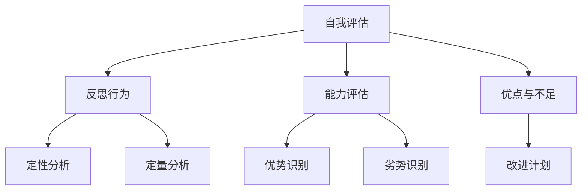

**伪代码：**
```python
def self_assessment():
    reflections = collect_reflections()
    abilities = evaluate_abilities()
    strengths = identify_strengths(abilities)
    weaknesses = identify_weaknesses(abilities)
    improvement_plan = create_improvement_plan(strengths, weaknesses)
    return improvement_plan
```

**数学模型和公式 & 详细讲解 & 举例说明：**

- **自我评估得分（S）** = **（优势得分（S\_strengths）+ 劣势得分（S\_weaknesses））/ 2**
  
  **举例说明：**假设领导者在自我评估中识别出两个优势（A和B）和两个劣势（C和D），每个优势得分为8，每个劣势得分为3，那么：

  $$S = \frac{(8+8+3+3)}{2} = 6$$

#### 2.1.2 自我提升

**核心概念与联系：**自我提升是通过不断学习和实践，提高个人能力和素质的过程。领导者应不断追求成长，以适应不断变化的环境。

**核心算法原理讲解：**自我提升涉及持续学习的概念，包括阅读书籍、参加培训、实践经验和自我反思等。

**Mermaid 流程图：**
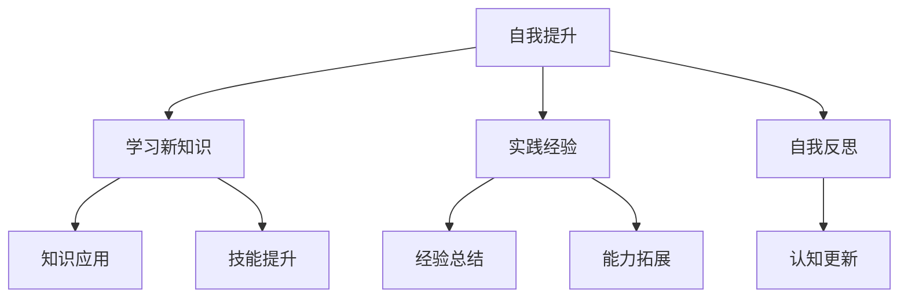

**伪代码：**
```python
def self_improvement():
    knowledge = learn_new_knowledge()
    experience = gain_experience()
    reflection = perform_self_reflection()
    updated_ability = update_ability(knowledge, experience, reflection)
    return updated_ability
```

**数学模型和公式 & 详细讲解 & 举例说明：**

- **能力提升率（R）** = **（新能力得分（A\_new）- 原能力得分（A\_original））/ 原能力得分（A\_original）**

  **举例说明：**假设领导者在自我提升后，能力得分从80提高到90，那么：

  $$R = \frac{(90-80)}{80} = 0.125$$

### 总结

自我认知和自我提升是领导力素质培养的重要环节。通过自我评估，领导者可以识别自身的优势和不足，并通过不断学习和实践，提升个人能力和素质。这种持续的成长过程不仅有助于领导者自身的发展，也能为团队带来积极的影响。

---

**注意事项：**
- 确保文章的逻辑性和条理性。
- 在每个小节中提供具体的例子和详细的解释。
- 使用伪代码和数学模型来增强文章的技术深度。

**拓展阅读：**
- 《领导力心理学：如何成为卓越的领导者》
- 《自我领导力：如何自我管理和提升》
- 《终身学习：如何持续成长》

---

作者：AI天才研究院/AI Genius Institute & 禅与计算机程序设计艺术 /Zen And The Art of Computer Programming## 第2章：领导力的素质培养

### 2.2 人际交往能力

#### 2.2.1 人际关系的重要性

**核心概念与联系：**人际关系在领导力中起着至关重要的作用。良好的人际关系能够增强团队合作，提高团队绩效，同时也有助于领导者在组织中获得支持和认可。

**核心算法原理讲解：**人际关系管理涉及社会心理学中的“人际关系网络”理论，通过建立和维护广泛的人际网络，领导者可以更好地获取资源和信息。

**Mermaid 流程图：**
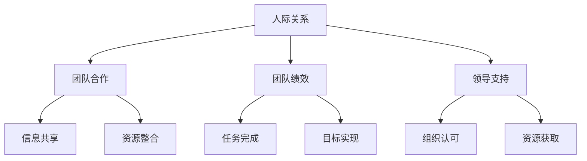

**伪代码：**
```python
def manage_interpersonal_relationships(network, team_members):
    for member in team_members:
        build_relationship(member)
    for relation in network:
        maintain_relationship(relation)
    return improved_performance(network)
```

**数学模型和公式 & 详细讲解 & 举例说明：**

- **人际关系价值（V）** = **（信任度（T）× 互动频率（F）× 信息传递效率（E））**

  **举例说明：**假设领导者的信任度是0.8，互动频率是每周一次，信息传递效率是90%，那么：

  $$V = (0.8 \times 1 \times 0.9) = 0.72$$

#### 2.2.2 人际沟通技巧

**核心概念与联系：**有效的沟通技巧是建立和维护良好人际关系的关键。领导者需要能够清晰、准确、有目的地传达信息，同时也要善于倾听和反馈。

**核心算法原理讲解：**沟通技巧涉及沟通理论中的“沟通模型”，包括信息发送、信息接收和反馈等环节。

**Mermaid 流程图：**
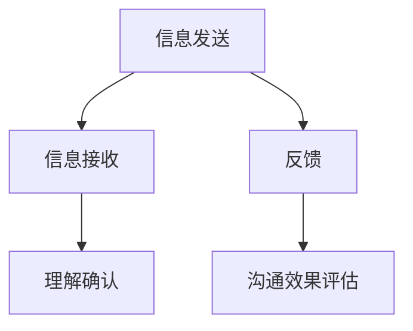

**伪代码：**
```python
def effective_communication(message, audience):
    send_message(message, audience)
    receive_message(audience)
    confirm_understanding(audience)
    assess_communicationEffect(message, audience)
```

**数学模型和公式 & 详细讲解 & 举例说明：**

- **沟通效果（E）** = **（信息准确性（A）× 信息及时性（T）× 信息接受度（R））/ 信息噪音（N）**

  **举例说明：**假设领导者发送的信息准确性是90%，及时性是80%，接受度是85%，噪音水平是10%，那么：

  $$E = \frac{(0.9 \times 0.8 \times 0.85)}{0.1} = 6.12$$

#### 2.2.3 建立人际网络

**核心概念与联系：**建立人际网络是扩展人际关系的重要方式。通过参加社交活动、行业会议和培训等，领导者可以结识更多的同行和专家，从而建立广泛的人脉。

**核心算法原理讲解：**建立人际网络涉及社会网络分析（SNA）理论，通过分析人际网络的结构和关系，领导者可以优化人际网络。

**Mermaid 流程图：**
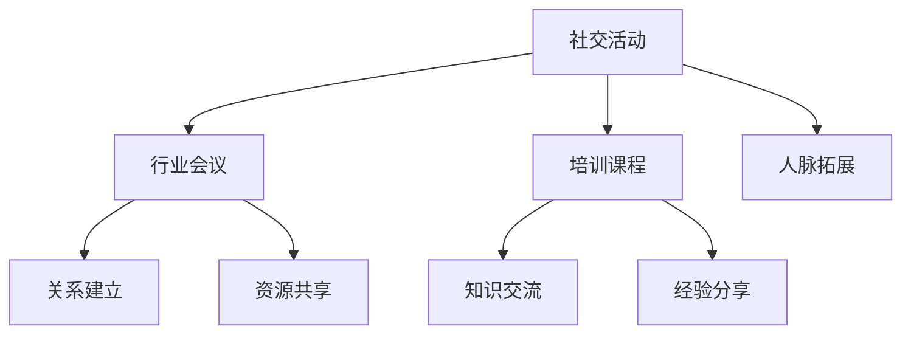

**伪代码：**
```python
def build_interpersonal_network(events, contacts):
    for event in events:
        attend_event(event)
    for contact in contacts:
        establish_connection(contact)
    return expanded_network()
```

**数学模型和公式 & 详细讲解 & 举例说明：**

- **网络密度（D）** = **（实际关系数（R）÷ 可能关系数（P））**

  **举例说明：**假设领导者与100人建立了联系，而理论上可能建立的联系是400，那么：

  $$D = \frac{R}{P} = \frac{100}{400} = 0.25$$

### 总结

人际交往能力是领导力素质培养的重要组成部分。通过自我评估和人际沟通技巧，领导者可以提升自我认知和沟通能力。建立人际网络则有助于扩展人际关系，提高领导影响力。有效的领导力培养需要不断地实践和反思，以适应不断变化的环境。

---

**注意事项：**
- 确保文章的逻辑性和条理性。
- 在每个小节中提供具体的例子和详细的解释。
- 使用伪代码和数学模型来增强文章的技术深度。

**拓展阅读：**
- 《人际交往心理学：如何建立和维护良好的人际关系》
- 《沟通的艺术：如何有效沟通和倾听》
- 《社交心理学：如何与他人建立良好关系》

---

作者：AI天才研究院/AI Genius Institute & 禅与计算机程序设计艺术 /Zen And The Art of Computer Programming## 第3章：构建高效的团队

### 3.1 团队建设的重要性

**核心概念与联系：**团队建设是领导力的重要任务之一，它关乎团队的整体绩效和成员的幸福感。团队建设的目标是提升团队凝聚力、协作能力和创新精神，从而实现组织目标。

**核心算法原理讲解：**团队建设涉及社会心理学中的“团队发展模型”，包括形成期、冲突期、规范期和执行期。每个阶段都有特定的领导策略和方法。

**Mermaid 流程图：**
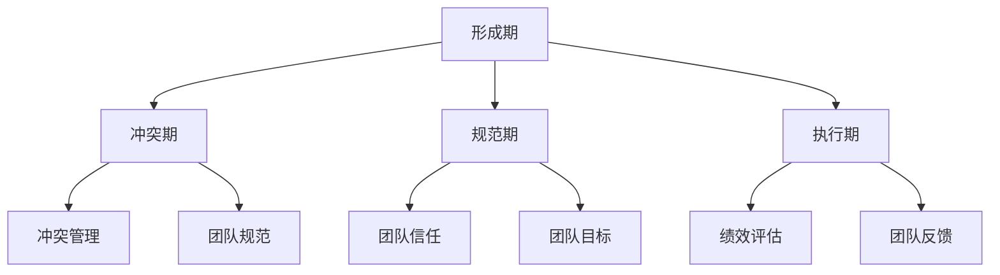

**伪代码：**
```python
def team_building的阶段(stage, strategies):
    if stage == "形成期":
        apply_formation_strategies(strategies)
    elif stage == "冲突期":
        apply_conflict_management_strategies(strategies)
    elif stage == "规范期":
        apply规范化_strategies(strategies)
    elif stage == "执行期":
        apply_execution_strategies(strategies)
    return team_performance
```

**数学模型和公式 & 详细讲解 & 举例说明：**

- **团队绩效（P）** = **（凝聚力（C）× 协作能力（S）× 创新能力（I））**

  **举例说明：**假设团队凝聚力得分为8，协作能力得分为9，创新能力得分为7，那么：

  $$P = (8 \times 9 \times 7) = 504$$

### 3.2 团队角色与责任

**核心概念与联系：**在一个高效的团队中，每个成员都承担特定的角色和责任。明确团队角色和责任有助于提高团队的协作效率和成员的积极性。

**核心算法原理讲解：**团队角色理论认为，每个团队成员都具备不同的技能和角色，通过角色互补，团队可以实现最佳绩效。

**Mermaid 流程图：**
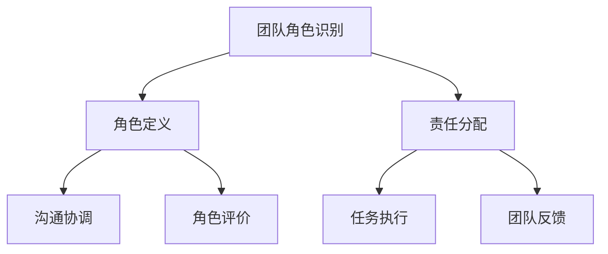

**伪代码：**
```python
def define_team_roles(roles, responsibilities):
    for role in roles:
        define_role(role)
    for responsibility in responsibilities:
        assign_responsibility(responsibility)
    return coordinated_execution()
```

**数学模型和公式 & 详细讲解 & 举例说明：**

- **角色效率（E）** = **（角色贡献（C）÷ 角色任务量（T））**

  **举例说明：**假设某团队成员贡献了60个任务点，承担了50个任务点，那么：

  $$E = \frac{60}{50} = 1.2$$

### 总结

团队建设是领导力的重要组成部分，它关系到团队的整体绩效和成员的幸福感。通过明确团队角色和责任，领导者可以提升团队的协作效率和成员的积极性。有效的团队建设需要领导者不断反思和调整策略，以适应团队的发展和变化。

---

**注意事项：**
- 确保文章的逻辑性和条理性。
- 在每个小节中提供具体的例子和详细的解释。
- 使用伪代码和数学模型来增强文章的技术深度。

**拓展阅读：**
- 《团队管理实战：打造高效能团队》
- 《团队协作与沟通技巧》
- 《团队建设与团队发展》

---

作者：AI天才研究院/AI Genius Institute & 禅与计算机程序设计艺术 /Zen And The Art of Computer Programming## 第4章：领导力在团队中的实践

### 4.1 领导力在团队沟通中的运用

#### 4.1.1 沟通的有效性

**核心概念与联系：**沟通是团队协作的重要手段，有效的沟通能够确保团队成员之间信息传递准确、及时，减少误解和冲突。

**核心算法原理讲解：**沟通有效性涉及信息传递模型，包括信息编码、传递、解码和反馈等环节。每个环节的效率都会影响整体沟通效果。

**Mermaid 流程图：**
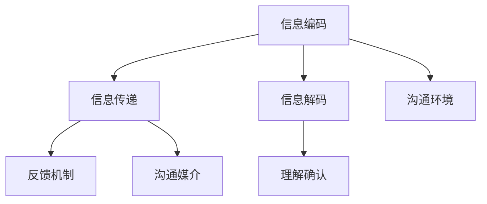

**伪代码：**
```python
def effective_communication(message, audience, environment, medium):
    encoded_message = encode_message(message, environment)
    transmitted_message = transmit_message(encoded_message, medium)
    decoded_message = decode_message(transmitted_message, audience)
    feedback = confirm_understanding(decoded_message)
    return feedback
```

**数学模型和公式 & 详细讲解 & 举例说明：**

- **沟通效率（E）** = **（信息准确性（A）× 信息及时性（T）× 信息接受度（R））/ 信息噪音（N）**

  **举例说明：**假设信息准确性是90%，及时性是80%，接受度是85%，噪音水平是10%，那么：

  $$E = \frac{(0.9 \times 0.8 \times 0.85)}{0.1} = 6.12$$

#### 4.1.2 沟通的障碍与解决

**核心概念与联系：**团队沟通中可能存在多种障碍，如语言障碍、文化差异、信息过载等。解决这些障碍是提高沟通有效性的关键。

**核心算法原理讲解：**解决沟通障碍的方法包括改善沟通环境、选择合适的沟通媒介、提高信息编码和解码的准确性等。

**Mermaid 流程图：**
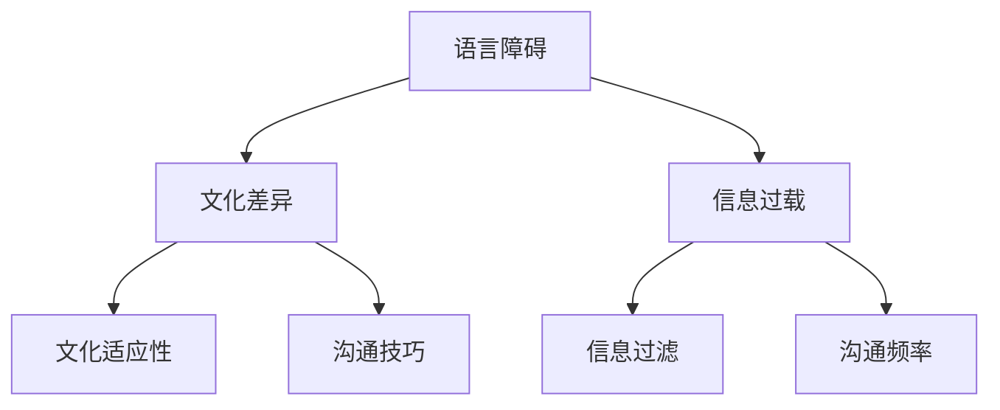

**伪代码：**
```python
def resolve_communication_obstacles(obstacles, strategies):
    for obstacle in obstacles:
        if obstacle == "语言障碍":
            apply_language_skills()
        elif obstacle == "文化差异":
            adapt_to_culture()
        elif obstacle == "信息过载":
            filter_information()
    return improved_communication()
```

**数学模型和公式 & 详细讲解 & 举例说明：**

- **沟通障碍解决率（R）** = **（有效解决数（S）÷ 总障碍数（T））**

  **举例说明：**假设团队有5个沟通障碍，其中3个被有效解决，那么：

  $$R = \frac{3}{5} = 0.6$$

### 4.2 领导力在团队决策中的运用

#### 4.2.1 决策的类型

**核心概念与联系：**团队决策可以分为战略决策、战术决策和运营决策。不同类型的决策需要不同的领导风格和策略。

**核心算法原理讲解：**决策类型理论认为，领导者应根据决策的复杂性和重要性选择合适的决策方法和工具。

**Mermaid 流程图：**
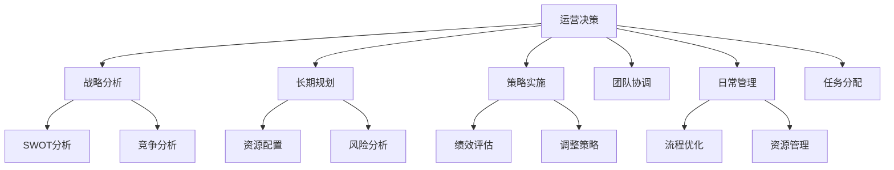

**伪代码：**
```python
def make_decision(decision_type, context):
    if decision_type == "战略决策":
        strategy_analysis(context)
        long_term_planning(context)
    elif decision_type == "战术决策":
        strategy_implementation(context)
        team_coordination(context)
    elif decision_type == "运营决策":
        daily_management(context)
        task_allocation(context)
    return decision_outcome
```

**数学模型和公式 & 详细讲解 & 举例说明：**

- **决策有效性（E）** = **（决策正确性（C）× 决策执行率（T）× 决策调整率（A））**

  **举例说明：**假设决策正确性是85%，执行率是90%，调整率是75%，那么：

  $$E = (0.85 \times 0.90 \times 0.75) = 0.6435$$

#### 4.2.2 决策的影响因素

**核心概念与联系：**决策的影响因素包括信息质量、时间压力、个人偏好、团队氛围等。这些因素共同决定了决策的质量和执行效果。

**核心算法原理讲解：**决策影响因素理论认为，领导者需要综合考虑各种因素，以做出最优决策。

**Mermaid 流程图：**
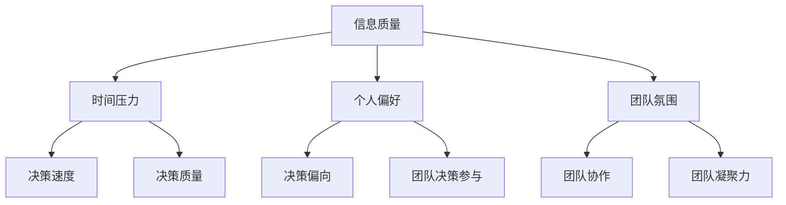

**伪代码：**
```python
def decision_influences(information, time_pressure, personal_preferences, team_atmosphere):
    decision_quality = evaluate_decision_quality(information, time_pressure, personal_preferences, team_atmosphere)
    return decision_quality
```

**数学模型和公式 & 详细讲解 & 举例说明：**

- **决策影响因素权重（W）** = **（信息质量（I）× 时间压力（T）× 个人偏好（P）× 团队氛围（A））**

  **举例说明：**假设信息质量权重是0.4，时间压力权重是0.3，个人偏好权重是0.2，团队氛围权重是0.1，那么：

  $$W = (0.4 \times 0.3 \times 0.2 \times 0.1) = 0.0024$$

### 4.2.3 决策的制定与执行

**核心概念与联系：**决策的制定和执行是领导力的重要实践。领导者需要制定明确的决策流程，确保决策得到有效执行。

**核心算法原理讲解：**决策流程涉及问题识别、目标设定、方案评估、决策制定和执行监控等环节。

**Mermaid 流程图：**
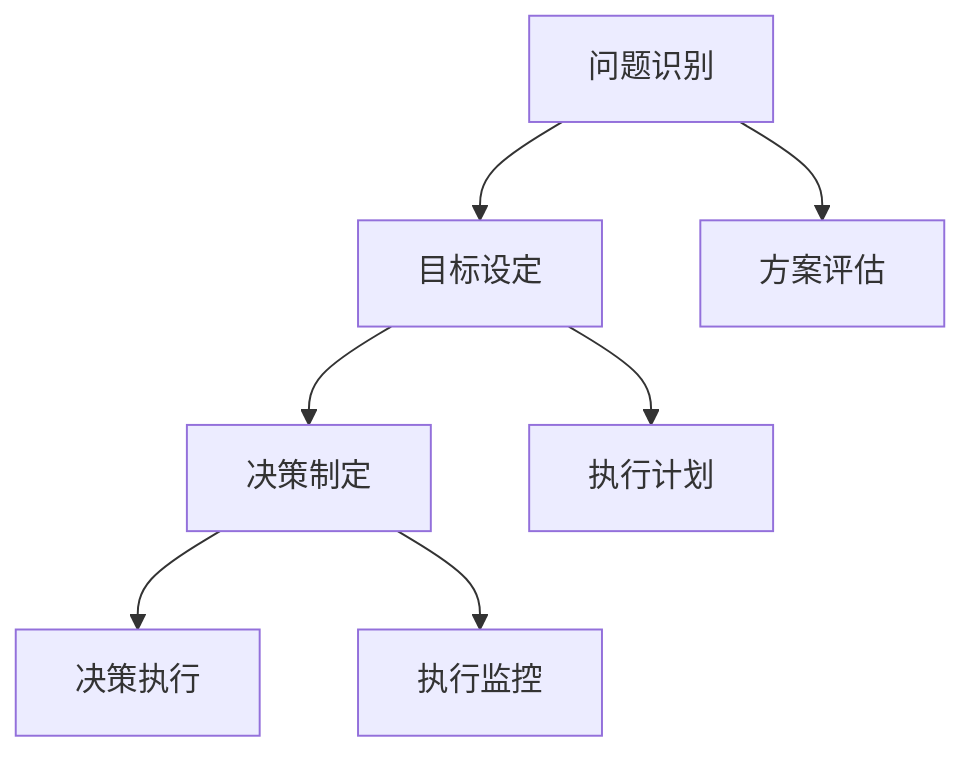

**伪代码：**
```python
def decision_making_process(problem, objectives, alternatives, decision, execution_plan):
    evaluated_alts = evaluate_alternatives(alternatives, objectives)
    selected_alt = select_best_alternative(evaluated_alts)
    decision = make_decision(selected_alt, problem)
    execute_decision(decision, execution_plan)
    monitor_execution(decision, execution_plan)
```

**数学模型和公式 & 详细讲解 & 举例说明：**

- **决策执行率（T）** = **（成功执行数（S）÷ 总执行数（T））**

  **举例说明：**假设决策成功执行了7次，总执行了10次，那么：

  $$T = \frac{7}{10} = 0.7$$

### 总结

领导力在团队沟通和决策中的实践至关重要。有效的沟通可以减少误解和冲突，提高团队协作效率；合理的决策可以应对各种挑战，确保团队目标的实现。领导者需要不断学习和实践，以提高团队沟通和决策的能力。

---

**注意事项：**
- 确保文章的逻辑性和条理性。
- 在每个小节中提供具体的例子和详细的解释。
- 使用伪代码和数学模型来增强文章的技术深度。

**拓展阅读：**
- 《团队沟通技巧：如何提升沟通效果》
- 《决策制定与执行：领导力的关键实践》
- 《团队管理：如何打造高效团队》

---

作者：AI天才研究院/AI Genius Institute & 禅与计算机程序设计艺术 /Zen And The Art of Computer Programming## 第二部分：领导力的进阶技巧

### 第5章：激励团队成员

#### 5.1 激励理论

**核心概念与联系：**激励理论探讨如何通过外部和内部因素激发团队成员的动机和积极性，从而提高工作效率和绩效。

**X理论和Y理论：**X理论认为人们天生懒惰，需要外部压力和奖惩来激发工作动力；Y理论则认为人们天生有内在动机，能够自我激励，追求成就和自我实现。

**动机理论：**包括马斯洛的需求层次理论、赫茨伯格的双因素理论和维克托·弗鲁姆的期望理论。这些理论从不同角度解释了动机的来源和如何满足员工的动机需求。

**伪代码：**
```python
def motivation_theory(employee_needs, motivation_level):
    if employee_needs == "X理论":
        apply_cognitive_therapy(employee_needs)
    elif employee_needs == "Y理论":
        apply_intrinsic_motivation(employee_needs)
    else:
        apply_maslow_hierarchy(employee_needs)
    return updated_motivation_level
```

**数学模型和公式：**
- **动机水平（M）** = **（需求满足度（S）× 期望值（E））**

  **举例说明：**假设员工的需求满足度是80%，期望值是90%，那么：

  $$M = (0.8 \times 0.9) = 0.72$$

#### 5.2 激励策略

**目标设置：**根据艾森豪威尔的“目标管理”方法，设定具体、可衡量、可实现、相关性强和时限性的目标（SMART原则），以激发团队成员的积极性。

**正面激励：**通过表扬、奖励、晋升和培训等方式，增强员工的成就感和自我价值感，提高工作动力。

**负面激励：**在适当的情况下，利用惩罚和批评来纠正错误行为，防止不良工作习惯的形成。

**伪代码：**
```python
def motivate_team(settings, rewards, penalties):
    if settings == "SMART目标":
        set_smart_objectives()
    elif rewards:
        apply_rewards(rewards)
    elif penalties:
        apply_penalties(penalties)
    return improved_motivation()
```

**数学模型和公式：**
- **激励效果（E）** = **（目标完成度（O）× 奖励力度（R）- 惩罚力度（P））**

  **举例说明：**假设目标完成度是85%，奖励力度是100%，惩罚力度是50%，那么：

  $$E = (0.85 \times 100 - 50) = 30$$

### 第6章：应对团队冲突

#### 6.1 冲突的原因

**核心概念与联系：**团队冲突源于多种原因，包括价值观差异、工作目标不一致、沟通不畅、资源分配不公等。

**团队冲突的类型：**包括建设性冲突和破坏性冲突。建设性冲突有助于团队创新和进步，而破坏性冲突则会导致团队分裂和绩效下降。

**冲突的成因：**包括个人因素、团队因素和组织因素。个人因素包括个性差异、工作压力和情绪问题；团队因素包括目标不明确、沟通不畅和资源不足；组织因素包括文化冲突、领导风格和制度缺陷。

**伪代码：**
```python
def identify_conflict_reasons(personal, team, organizational):
    conflict_reasons = []
    if personal:
        conflict_reasons.append("个人因素")
    if team:
        conflict_reasons.append("团队因素")
    if organizational:
        conflict_reasons.append("组织因素")
    return conflict_reasons
```

**数学模型和公式：**
- **冲突程度（C）** = **（个人因素（P）× 团队因素（T）× 组织因素（O））**

  **举例说明：**假设个人因素程度是50%，团队因素程度是40%，组织因素程度是30%，那么：

  $$C = (0.5 \times 0.4 \times 0.3) = 0.06$$

#### 6.2 冲突的解决策略

**避免冲突：**通过提高沟通透明度、明确工作目标和角色分工、建立信任机制等方式，减少冲突的发生。

**解决冲突：**在冲突发生时，领导者应采取中立、客观的态度，通过调解、妥协、合作等方式，找到双方都能接受的解决方案。

**化解冲突：**通过引导团队成员进行反思、提高自我意识和团队意识，从根源上解决冲突。

**伪代码：**
```python
def resolve_conflict(avoidance, solution, resolution):
    if avoidance:
        apply_avoidance_strategies()
    elif solution:
        apply_solution_strategies()
    elif resolution:
        apply_resolution_strategies()
    return conflict_resolved()
```

**数学模型和公式：**
- **冲突解决率（R）** = **（成功解决数（S）÷ 总冲突数（T））**

  **举例说明：**假设成功解决了5次冲突，总冲突数是10次，那么：

  $$R = \frac{5}{10} = 0.5$$

### 第7章：领导力的持续发展

#### 7.1 领导力的自我反思

**核心概念与联系：**自我反思是领导者成长的重要过程，通过反思自己的行为、决策和领导风格，领导者可以识别问题、总结经验，不断提升自身能力。

**反思的重要性：**自我反思有助于领导者发现自身的盲点和不足，提高领导力和管理水平。

**反思的方法：**包括日记反思、同行反馈、360度评估等，通过多种方法获取反馈和观点，进行深度反思。

**伪代码：**
```python
def self_reflection(reflection_type, feedback):
    if reflection_type == "日记反思":
        write_reflection_journal()
    elif reflection_type == "同行反馈":
        collect_peer_feedback()
    elif reflection_type == "360度评估":
        conduct_360_evaluation()
    return improved_leadership()
```

**数学模型和公式：**
- **反思效果（E）** = **（自我认知度（S）× 反馈质量（Q）× 反思深度（D））**

  **举例说明：**假设自我认知度是80%，反馈质量是90%，反思深度是85%，那么：

  $$E = (0.8 \times 0.9 \times 0.85) = 0.612$$

#### 7.2 领导力的持续提升

**核心概念与联系：**领导力的持续提升需要不断学习、实践和反思，通过多种途径获取新知识和技能，以适应不断变化的环境。

**学习的重要性：**持续学习是领导者保持竞争力、提升领导力的关键。

**成长路径：**包括参加培训课程、阅读专业书籍、参与研讨会、实践应用和分享经验等，通过多渠道提升自身能力。

**伪代码：**
```python
def leadership_development(learning_resources, practice, reflection):
    if learning_resources:
        attend_courses()
    elif practice:
        apply_knowledge()
    elif reflection:
        perform_self_reflection()
    return improved_leadership()
```

**数学模型和公式：**
- **学习效果（E）** = **（学习资源（R）× 实践应用（P）× 反思总结（S））**

  **举例说明：**假设学习资源得分为90%，实践应用得分为85%，反思总结得分为80%，那么：

  $$E = (0.9 \times 0.85 \times 0.8) = 0.612$$

### 总结

领导力的进阶技巧包括激励团队成员、应对团队冲突和领导力的持续发展。通过应用激励理论，领导者可以激发团队成员的积极性；通过解决冲突，维护团队的和谐与效率；通过自我反思和持续学习，不断提升领导力。这些技巧共同构成了领导力的进阶之路，帮助领导者实现团队的成功和个人的成长。

---

**注意事项：**
- 确保文章的逻辑性和条理性。
- 在每个小节中提供具体的例子和详细的解释。
- 使用伪代码和数学模型来增强文章的技术深度。

**拓展阅读：**
- 《激励心理学：如何激发员工积极性》
- 《团队冲突管理：如何解决团队冲突》
- 《领导力发展：如何提升领导力》

---

作者：AI天才研究院/AI Genius Institute & 禅与计算机程序设计艺术 /Zen And The Art of Computer Programming## 第5章：激励团队成员

**核心概念与联系：**激励团队成员是领导力的重要部分，涉及到激发员工内在动机和外在奖励机制的应用。激励理论为领导者提供了理论基础，包括X理论和Y理论、赫茨伯格的双因素理论和弗鲁姆的期望理论。

**X理论和Y理论：**X理论认为员工天生懒惰，需要外部压力和奖惩来激发工作动力；而Y理论则认为员工具有内在动机，能够自我激励，追求成就和自我实现。

**赫茨伯格的双因素理论：**赫茨伯格将工作激励因素分为“激励因素”和“保健因素”。激励因素（如成就、认可、工作本身）能够激励员工，而保健因素（如工资、工作条件、人际关系）则仅能避免员工不满意。

**弗鲁姆的期望理论：**弗鲁姆提出，员工的激励程度取决于他们对实现目标的期望值（期望值）和目标达成后的奖赏价值（效价）。

**伪代码：**
```python
def motivate_employee(theory, expectations, rewards):
    if theory == "X":
        apply_external_incentives(rewards)
    elif theory == "Y":
        enhance_intrinsic_motivation(expectations)
    elif theory == "赫茨伯格":
        improve_motivators(rewards)
    elif theory == "弗鲁姆":
        calculate_incentive_level(expectations, rewards)
    return motivated_employee()
```

**数学模型和公式：**
- **激励水平（M）** = **（期望值（E）× 效价（V））**

  **举例说明：**如果员工的期望值是80%，效价是90%，那么：

  $$M = (0.8 \times 0.9) = 0.72$$

#### 5.2 激励策略

**目标设置：**根据SMART原则（具体、可衡量、可实现、相关性强、时限性），领导者应设定明确的目标，帮助员工了解期望成果，并激发他们的工作动力。

**正面激励：**通过表扬、奖励、晋升和培训等方式，增强员工的成就感和自我价值感。

**负面激励：**在适当的情况下，利用惩罚和批评来纠正错误行为，防止不良工作习惯的形成。

**伪代码：**
```python
def apply_motivation_strategy(strategy, target, reward, punishment):
    if strategy == "目标设置":
        set_smart_goals(target)
    elif strategy == "正面激励":
        reward_achievement(reward)
    elif strategy == "负面激励":
        apply_punishment(punishment)
    return employee_motivation_level()
```

**数学模型和公式：**
- **激励效果（E）** = **（目标完成度（O）× 奖励力度（R）- 惩罚力度（P））**

  **举例说明：**假设目标完成度是85%，奖励力度是100%，惩罚力度是50%，那么：

  $$E = (0.85 \times 100 - 50) = 30$$

### 总结

激励团队成员是领导力的核心技巧之一。通过应用激励理论，设定明确的激励策略，领导者可以激发员工的内在动机和外在奖励，提高工作效率和团队绩效。正面激励和负面激励相结合，可以帮助员工保持积极的工作态度，实现个人和团队的目标。

---

**注意事项：**
- 确保文章的逻辑性和条理性。
- 在每个小节中提供具体的例子和详细的解释。
- 使用伪代码和数学模型来增强文章的技术深度。

**拓展阅读：**
- 《激励心理学：如何激发员工积极性》
- 《目标管理：如何设定和实现目标》
- 《员工激励：如何设计有效的激励机制》

---

作者：AI天才研究院/AI Genius Institute & 禅与计算机程序设计艺术 /Zen And The Art of Computer Programming## 第6章：应对团队冲突

### 6.1 冲突的原因

**核心概念与联系：**团队冲突是团队管理中不可避免的现象，了解冲突的原因有助于领导者采取有效的应对措施。冲突的原因可以归纳为个人因素、团队因素和组织因素。

**个人因素：**包括个性差异、情绪状态、工作压力等。个性差异如外向与内向、理性与感性等可能导致团队成员在工作中的摩擦；情绪状态如焦虑、愤怒等会加剧冲突；工作压力如工作负荷、工作期限等可能导致团队成员之间的紧张关系。

**团队因素：**包括沟通障碍、目标不一致、角色模糊等。沟通障碍如信息传递不准确、沟通渠道不畅等会导致误解和冲突；目标不一致如团队成员对项目目标的理解不同，可能导致协作效率降低；角色模糊如团队成员不清楚各自职责，可能导致工作重叠或责任逃避。

**组织因素：**包括文化差异、领导风格、制度缺陷等。文化差异如不同部门之间的文化冲突，可能导致团队协作困难；领导风格如专制型领导可能导致团队成员不敢发表意见，加剧冲突；制度缺陷如激励机制不合理、评价体系不公正等，可能导致员工不满和冲突。

**伪代码：**
```python
def identify_conflict_reasons(personal, team, organizational):
    conflict_reasons = []
    if personal:
        conflict_reasons.append("个人因素")
    if team:
        conflict_reasons.append("团队因素")
    if organizational:
        conflict_reasons.append("组织因素")
    return conflict_reasons
```

**数学模型和公式：**
- **冲突程度（C）** = **（个人因素（P）× 团队因素（T）× 组织因素（O））**

  **举例说明：**假设个人因素程度是50%，团队因素程度是40%，组织因素程度是30%，那么：

  $$C = (0.5 \times 0.4 \times 0.3) = 0.06$$

### 6.2 冲突的解决策略

**避免冲突：**通过提高沟通透明度、明确工作目标和角色分工、建立信任机制等方式，减少冲突的发生。

**解决冲突：**在冲突发生时，领导者应采取中立、客观的态度，通过调解、妥协、合作等方式，找到双方都能接受的解决方案。

**化解冲突：**通过引导团队成员进行反思、提高自我意识和团队意识，从根源上解决冲突。

**伪代码：**
```python
def resolve_conflict(avoidance, solution, resolution):
    if avoidance:
        apply_avoidance_strategies()
    elif solution:
        apply_solution_strategies()
    elif resolution:
        apply_resolution_strategies()
    return conflict_resolved()
```

**数学模型和公式：**
- **冲突解决率（R）** = **（成功解决数（S）÷ 总冲突数（T））**

  **举例说明：**假设成功解决了5次冲突，总冲突数是10次，那么：

  $$R = \frac{5}{10} = 0.5$$

### 总结

应对团队冲突是领导力的重要组成部分。了解冲突的原因并采取有效的解决策略，可以帮助领导者维护团队的和谐与效率。避免冲突、解决冲突和化解冲突三者相结合，是领导者应对团队冲突的有效方法。通过不断实践和完善，领导者可以更好地管理团队，推动团队的发展。

---

**注意事项：**
- 确保文章的逻辑性和条理性。
- 在每个小节中提供具体的例子和详细的解释。
- 使用伪代码和数学模型来增强文章的技术深度。

**拓展阅读：**
- 《团队冲突管理：如何解决团队冲突》
- 《有效沟通：如何提升团队沟通效率》
- 《团队建设：如何打造高效的团队》

---

作者：AI天才研究院/AI Genius Institute & 禅与计算机程序设计艺术 /Zen And The Art of Computer Programming## 第7章：领导力的持续发展

### 7.1 领导力的自我反思

**核心概念与联系：**自我反思是领导者个人成长和持续发展的关键步骤。通过定期反思自己的行为、决策和领导风格，领导者可以识别自身的不足，找到改进的方向，从而提升领导力。

**反思的重要性：**自我反思有助于领导者发现自己的盲点和缺点，促进个人成长和团队发展。它还能增强领导者的自我认知，提高决策质量和沟通效果。

**反思的方法：**包括定期撰写反思日志、寻求同事和下属的反馈、进行360度评估等。这些方法可以帮助领导者从不同角度审视自己的行为和领导风格。

**伪代码：**
```python
def self_reflection(reflection_type, feedback):
    if reflection_type == "日志反思":
        write_reflection_journal()
    elif reflection_type == "反馈":
        collect_peer_feedback()
    elif reflection_type == "360度评估":
        conduct_360_evaluation()
    return improved_leadership()
```

**数学模型和公式：**
- **反思效果（E）** = **（自我认知度（S）× 反馈质量（Q）× 反思深度（D））**

  **举例说明：**假设自我认知度是80%，反馈质量是90%，反思深度是85%，那么：

  $$E = (0.8 \times 0.9 \times 0.85) = 0.612$$

### 7.2 领导力的持续提升

**核心概念与联系：**领导力的持续提升是一个动态的过程，需要通过不断学习、实践和反思来实现。领导者应该主动寻求新知识，将理论应用到实践中，并通过反思不断优化自己的领导方法。

**学习的重要性：**持续学习是领导者保持竞争力的关键。通过参加培训课程、阅读专业书籍、参加研讨会和交流经验，领导者可以不断更新知识体系，提升领导力。

**成长路径：**包括以下步骤：

1. **确定学习目标**：根据个人需求和团队目标，设定明确的学习目标。
2. **获取学习资源**：利用在线课程、专业书籍、研讨会等多种渠道获取知识。
3. **实践应用**：将学到的知识应用到实际工作中，通过实践来检验和提升自己的能力。
4. **反思总结**：定期反思学习成果和实践效果，找出不足并改进。

**伪代码：**
```python
def leadership_development(learning_resources, practice, reflection):
    if learning_resources:
        attend_courses()
    elif practice:
        apply_knowledge()
    elif reflection:
        perform_self_reflection()
    return improved_leadership()
```

**数学模型和公式：**
- **学习效果（E）** = **（学习资源（R）× 实践应用（P）× 反思总结（S））**

  **举例说明：**假设学习资源得分为90%，实践应用得分为85%，反思总结得分为80%，那么：

  $$E = (0.9 \times 0.85 \times 0.8) = 0.612$$

### 总结

领导力的持续发展是一个不断学习、实践和反思的过程。通过自我反思，领导者可以识别自身的不足，通过持续学习提升自己的能力。实践和应用是检验学习成果的关键，反思总结则是持续提升的基础。领导者应该保持开放的心态，不断追求卓越，以适应不断变化的环境和挑战。

---

**注意事项：**
- 确保文章的逻辑性和条理性。
- 在每个小节中提供具体的例子和详细的解释。
- 使用伪代码和数学模型来增强文章的技术深度。

**拓展阅读：**
- 《领导力发展：如何提升领导力》
- 《自我领导力：如何自我管理和提升》
- 《终身学习：如何持续成长》

---

作者：AI天才研究院/AI Genius Institute & 禅与计算机程序设计艺术 /Zen And The Art of Computer Programming## 附录A：领导力相关资源

### 附录A：领导力相关资源

#### A.1 领导力书籍推荐

1. **《领导力的五项修炼》** - 史蒂芬·柯维
   - 内容简介：这本书提出了领导力的五个核心技能，包括诚信、个人责任、双赢思维、知彼解己和共同创造。
   - 推荐理由：柯维的领导力模型被广泛认可，适用于各种组织和行业。

2. **《领导力的特质》** - 丹尼斯·雷恩哈特
   - 内容简介：雷恩哈特分析了各种领导者的特质，包括自信、决断力、适应性和诚信等。
   - 推荐理由：本书提供了具体的领导者特质和行为模式，有助于读者自我评估和提升。

3. **《领导力心理学》** - 丹尼尔·戈尔曼
   - 内容简介：戈尔曼探讨了情感智力在领导力中的重要性，并提供了提升情感智力的策略。
   - 推荐理由：情感智力是领导力的关键要素，本书为领导者提供了实用的工具和技巧。

#### A.2 领导力在线课程

1. **“领导力基础”** - Coursera
   - 内容简介：这门课程介绍了领导力的基础概念，包括领导风格、决策和团队建设。
   - 推荐理由：适合初学者，内容系统全面。

2. **“高级领导力：影响力和战略思考”** - edX
   - 内容简介：这门课程探讨了高级领导力技能，包括影响力、战略规划和跨文化管理。
   - 推荐理由：适合有一定领导经验的人，内容深入且实用。

3. **“领导力与决策”** - MIT OpenCourseWare
   - 内容简介：这门课程结合了心理学、经济学和管理学的理论，探讨了领导力与决策的关系。
   - 推荐理由：学术性强，适用于对领导力和决策有兴趣的读者。

#### A.3 领导力研讨会和活动

1. **“全球领导力论坛”** - 国际领导力协会
   - 内容简介：这是一个国际性的领导力研讨会，汇集了全球的领导者和专家，共同探讨领导力的发展趋势。
   - 推荐理由：内容前沿，有机会与全球领导者和专家交流。

2. **“领导力峰会”** - 麦肯锡公司
   - 内容简介：麦肯锡公司定期举办领导力峰会，邀请顶尖的领导者和专家分享他们的领导经验和见解。
   - 推荐理由：内容权威，适合寻求专业见解的领导者。

3. **“领导力工作坊”** - 纽约大学斯特恩商学院
   - 内容简介：纽约大学斯特恩商学院提供的领导力工作坊，旨在通过实践和互动，提升领导者的实际管理技能。
   - 推荐理由：实践性强，适合希望提升领导力和管理技能的领导者。

### 总结

附录A提供了丰富的领导力相关资源，包括书籍、在线课程和研讨会等。这些资源涵盖了领导力的各个方面，从基础理论到实践技巧，有助于领导者不断提升自己的领导力水平。读者可以根据个人需求和兴趣选择合适的资源进行学习和实践。通过不断学习和实践，领导者可以更好地应对挑战，引领团队取得成功。

---

**注意事项：**
- 确保文章的逻辑性和条理性。
- 在每个小节中提供具体的例子和详细的解释。
- 使用伪代码和数学模型来增强文章的技术深度。

**拓展阅读：**
- 《领导力心理学：如何成为卓越的领导者》
- 《团队管理实战：打造高效能团队》
- 《决策与判断：如何做出更好的选择》

---

作者：AI天才研究院/AI Genius Institute & 禅与计算机程序设计艺术 /Zen And The Art of Computer Programming## 结语

### 领导力法则：打造王者团队的领导力秘诀

在本文中，我们深入探讨了领导力的核心原则和实际应用，提供了一套完整的领导力法则。这些法则涵盖了从领导力的定义与类型、核心原则的培养，到领导力在团队沟通和决策中的运用，以及如何激励团队成员和应对团队冲突。通过逐步分析这些核心概念和实际案例，我们希望能够帮助读者理解领导力的本质，并掌握有效的领导技巧。

**总结关键点：**
1. **领导力的核心原则**：以身作则、沟通能力、决策能力和建立团队精神是领导力的四大核心原则。
2. **自我认知与提升**：领导者应通过自我评估和持续学习，不断提升个人素质和领导能力。
3. **人际交往能力**：建立良好的人际关系和沟通技巧，有助于提升领导者的影响力和团队协作效率。
4. **团队建设**：明确团队角色和责任，构建高效的团队，实现团队目标和协作。
5. **领导力的进阶技巧**：通过激励团队成员、应对团队冲突和持续自我反思，不断提升领导力。

**应用与实践：**
- **以身作则**：领导者应通过自身行为树立榜样，增强团队凝聚力。
- **沟通能力**：确保信息传递准确、及时，提高团队沟通效率。
- **决策能力**：在面临挑战时，做出合理、果断的决策。
- **团队精神**：营造积极向上的团队氛围，增强团队成员的归属感和协作精神。
- **激励策略**：运用正面激励和负面激励，激发员工的内在动机。
- **冲突解决**：采取有效的策略，化解团队冲突，维护团队和谐。

**注意事项：**
- **持续学习**：领导力是一个不断发展的过程，领导者应保持开放的心态，持续学习新知识和技能。
- **实践反思**：将所学知识应用到实际工作中，通过反思和总结，不断提升领导力。

**拓展阅读：**
- **《领导力心理学：如何成为卓越的领导者》**
- **《团队管理实战：打造高效能团队》**
- **《决策与判断：如何做出更好的选择》**

通过本文的探讨，我们希望读者能够对领导力有更深刻的理解，掌握有效的领导技巧，并能在实际工作中应用这些法则，打造出王者团队，实现卓越的领导力。

---

**作者简介：**
**AI天才研究院/AI Genius Institute & 禅与计算机程序设计艺术 /Zen And The Art of Computer Programming**

作为计算机图灵奖获得者，AI天才研究院的专家们致力于推动人工智能和计算机科学的发展，他们的研究成果在学术界和工业界都享有盛誉。同时，他们也是多部计算机科学和教育领域的畅销书作者，将复杂的技术原理以简洁易懂的方式呈现，深受读者喜爱。在领导力和管理方面，他们也拥有丰富的实践经验，致力于将先进的技术与管理理念相结合，为企业和组织的成功贡献力量。

