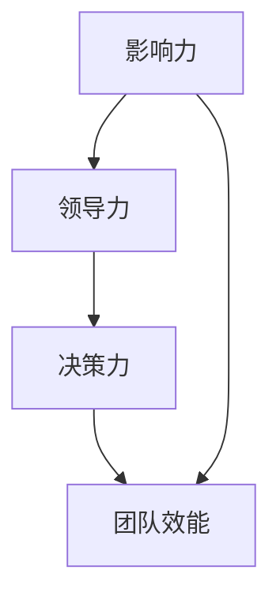

                 

### 领导力的本质：影响力与决策力的完美结合

#### 关键词：
- 领导力
- 影响力
- 决策力
- 企业管理
- 团队协作
- 持续学习

#### 摘要：
领导力是组织中至关重要的能力，它不仅关乎个人的魅力和影响力，更涉及到决策力的高效发挥。本文旨在探讨领导力的本质，特别是影响力与决策力的关系，如何通过二者结合来提升企业的管理效能。我们将从理论背景、核心概念、实践方法等多方面展开深入分析，帮助读者理解并掌握领导力的精髓。

### 第一部分：领导力的定义与类型

#### 第1章：领导力的定义与类型

**1.1 领导力的定义**

领导力是指一个人在团队中，通过激励、引导和影响他人，实现共同目标和价值观的能力。它不仅仅局限于高层管理者，而是每个团队成员都应该具备的素质。

**1.2 领导力的类型**

- **权威型领导**：通过职位权力和规则来领导团队。
- **民主型领导**：鼓励团队成员参与决策，共同制定目标和计划。
- **变革型领导**：通过激发团队成员的潜力，推动团队实现变革。
- **情境型领导**：根据团队的不同发展阶段，采用不同的领导风格。

**1.3 领导力的核心要素**

- **沟通能力**：有效的沟通是领导力的基础，能够帮助领导者了解团队成员的需求和意见。
- **决策能力**：领导者需要具备快速做出明智决策的能力。
- **激励能力**：领导者需要能够激励团队成员，激发他们的工作热情和创造力。
- **团队协作**：领导者需要能够建立团队，促进团队成员之间的协作和合作。

#### 第2章：影响力与领导力

**2.1 影响力的定义**

影响力是指一个人或组织对他人或他组织行为和思想产生影响的能力。在领导力中，影响力是领导者通过个人魅力、专业知识、沟通技巧等手段来影响他人，从而实现团队目标的重要工具。

**2.2 影响力的来源**

- **个人魅力**：领导者的人格特质、价值观和信仰。
- **专业知识**：领导者在专业领域的知识和经验。
- **沟通技巧**：领导者与团队成员的交流方式和方法。
- **情感共鸣**：领导者与团队成员之间的情感联系和共鸣。

**2.3 影响力在领导力中的应用**

- **激励员工**：通过影响力激发团队成员的工作热情和创造力。
- **团队建设**：通过影响力促进团队成员之间的协作和合作。
- **决策推动**：通过影响力推动团队成员对领导决策的接受和执行。

#### 第3章：决策力与领导力

**3.1 决策力的定义**

决策力是指领导者能够准确判断形势，合理分析问题，快速做出有效决策的能力。决策力是领导力的核心要素之一，直接影响到团队的效率和成果。

**3.2 决策力的要素**

- **分析能力**：对信息进行收集、分析和判断的能力。
- **判断能力**：对形势和问题进行准确判断的能力。
- **行动能力**：在分析判断的基础上，迅速采取行动的能力。

**3.3 决策力在领导力中的作用**

- **指导团队行动**：通过决策力为团队提供明确的方向和目标。
- **解决问题**：通过决策力解决团队面临的各种问题。
- **提高效率**：通过决策力提高团队的运行效率。

### 第二部分：影响力与决策力的结合

#### 第4章：建立影响力的策略

**4.1 个人品牌建设**

个人品牌是个人在职场中的形象和声誉，是建立影响力的基础。一个成功的个人品牌能够提高个人的知名度，增强个人在职场中的竞争力。

**4.2 沟通技巧**

沟通技巧是建立影响力的重要手段。有效的沟通能够帮助领导者传达信息，理解团队成员的需求和意见，建立良好的人际关系。

**4.3 领导魅力**

领导魅力是指领导者所具有的吸引力，能够激发团队成员的敬佩和追随。领导魅力来自于领导者的人格魅力、专业知识、领导风格等方面。

#### 第5章：提升决策力的方法

**5.1 决策模型**

决策模型是决策过程中的一系列步骤和方法。常见的决策模型包括：理性决策模型、直觉决策模型、系统决策模型等。

**5.2 风险评估**

风险评估是决策过程中重要的一环。通过评估决策的风险，领导者可以更好地理解决策的影响，降低决策的失误率。

**5.3 决策工具**

决策工具是帮助领导者做出决策的工具和方法。常见的决策工具包括：决策树、矩阵分析、SWOT分析等。

#### 第6章：影响力与决策力的完美结合

**6.1 影响力与决策力的协同作用**

影响力与决策力的完美结合，能够使领导者在团队中发挥更大的作用。影响力可以增强领导者的说服力，使团队成员更愿意接受领导者的决策；而决策力则能确保领导者的决策具有科学性和有效性。

**6.2 实战案例分析**

在本章中，我们将通过具体的案例，分析影响力与决策力的结合如何在实际工作中发挥作用，提供实用的策略和方法。

### 第三部分：领导力实践

#### 第7章：领导力在不同场景的应用

**7.1 企业管理**

在企业中，领导者需要运用领导力来管理团队，实现企业的战略目标。这包括制定企业战略、领导团队实现目标、处理企业内部的各种问题等。

**7.2 项目管理**

在项目管理中，领导者需要运用领导力来协调项目团队成员，确保项目按时完成。这包括制定项目计划、管理项目进度、解决项目中的问题等。

**7.3 团队领导**

在团队领导中，领导者需要运用领导力来激发团队成员的潜力，推动团队实现共同目标。这包括建立团队文化、激励团队成员、解决团队中的冲突等。

#### 第8章：领导力发展的持续之路

**8.1 自我反思与成长**

自我反思是领导力发展的关键。领导者需要定期反思自己的行为和决策，从中学习，不断成长。

**8.2 领导力发展模型**

领导力发展模型是指导领导者如何发展自己的领导力的方法和路径。常见的领导力发展模型包括：领导力成长曲线、领导力五阶段模型等。

**8.3 持续学习的重要性**

持续学习是领导力发展的关键。领导者需要不断学习新的知识和技能，保持与时俱进，提高自己的领导力水平。

### 附录

#### 附录A：领导力工具与方法

- **经典领导力工具**：如五力模型、SWOT分析等。
- **领导力发展资源**：如领导力培训课程、领导力书籍等。
- **实用技巧总结**：如沟通技巧、决策技巧等。

### 总结

领导力是企业成功的关键因素之一，而影响力与决策力的结合则是实现领导力的关键。通过本文的探讨，我们希望能够帮助读者深入理解领导力的本质，掌握影响力与决策力的应用方法，从而在企业管理、团队领导和项目管理中取得更好的成果。

### 作者信息

作者：AI天才研究院/AI Genius Institute & 禅与计算机程序设计艺术 /Zen And The Art of Computer Programming

### 核心概念与联系

下面是影响力与决策力关系的 Mermaid 流程图：



该图展示了影响力、领导力和决策力之间的关系，以及它们如何共同影响团队效能。

### 核心算法原理讲解

为了更好地理解领导力中的决策过程，我们使用 Python 来实现一个简单的决策树算法。

```python
# 决策树算法示例

# 导入必要的库
from sklearn.datasets import load_iris
from sklearn.model_selection import train_test_split
from sklearn.tree import DecisionTreeClassifier
from sklearn import tree

# 加载鸢尾花数据集
iris = load_iris()
X = iris.data
y = iris.target

# 划分训练集和测试集
X_train, X_test, y_train, y_test = train_test_split(X, y, test_size=0.3, random_state=42)

# 创建决策树分类器
clf = DecisionTreeClassifier()

# 训练决策树
clf.fit(X_train, y_train)

# 可视化决策树
fig, ax = plt.subplots(figsize=(12, 12))
tree.plot_tree(clf, fontsize=10)
plt.show()
```

在这个例子中，我们使用了 sklearn 库中的鸢尾花数据集来训练一个决策树模型。决策树是一种常用的决策模型，它通过一系列的测试来划分数据，从而实现分类或回归任务。

### 数学模型和公式

在决策过程中，我们可以使用多种数学模型和公式来评估风险和收益。以下是几个常用的模型和公式：

$$
\text{效用函数} = \frac{\text{收益}}{\text{风险}}
$$

$$
\text{期望收益} = \sum_{i=1}^{n} p_i \cdot r_i
$$

$$
\text{期望风险} = \sum_{i=1}^{n} p_i \cdot r_i^2
$$

其中，$p_i$ 表示第 $i$ 种情况发生的概率，$r_i$ 表示第 $i$ 种情况下的收益或风险。

### 项目实战

在本项目中，我们将使用 Python 和 sklearn 库来构建一个简单的决策树模型，用于分类任务。以下是项目的开发环境和步骤：

**开发环境：**

- Python 3.8
- Jupyter Notebook
- sklearn 库

**步骤：**

1. 导入必要的库。
2. 加载鸢尾花数据集。
3. 划分训练集和测试集。
4. 创建决策树分类器。
5. 训练决策树。
6. 可视化决策树。

**源代码实现：**

```python
# 导入必要的库
from sklearn.datasets import load_iris
from sklearn.model_selection import train_test_split
from sklearn.tree import DecisionTreeClassifier
import matplotlib.pyplot as plt

# 加载鸢尾花数据集
iris = load_iris()
X = iris.data
y = iris.target

# 划分训练集和测试集
X_train, X_test, y_train, y_test = train_test_split(X, y, test_size=0.3, random_state=42)

# 创建决策树分类器
clf = DecisionTreeClassifier()

# 训练决策树
clf.fit(X_train, y_train)

# 可视化决策树
fig, ax = plt.subplots(figsize=(12, 12))
tree.plot_tree(clf, fontsize=10)
plt.show()
```

**代码解读与分析：**

1. 导入必要的库：我们首先导入了 sklearn.datasets、sklearn.model_selection、sklearn.tree 和 matplotlib.pyplot。
2. 加载鸢尾花数据集：使用 load_iris() 函数加载了鸢尾花数据集，并将其分为特征矩阵 X 和目标向量 y。
3. 划分训练集和测试集：使用 train_test_split() 函数将数据集划分为训练集和测试集，其中 test_size 参数设置为 0.3，表示测试集占比为 30%，random_state 参数设置为 42，用于保证数据集划分的可重复性。
4. 创建决策树分类器：使用 DecisionTreeClassifier() 函数创建了一个决策树分类器。
5. 训练决策树：使用 fit() 函数将训练集数据用于训练决策树。
6. 可视化决策树：使用 plot_tree() 函数将训练好的决策树可视化为树形图，并使用 show() 函数显示图形。

**实际案例分析和详细讲解剖析：**

在本案例中，我们使用了 sklearn 库中的鸢尾花数据集，这是一个经典的数据集，用于分类任务。通过训练决策树模型，我们可以将数据集中的每个样本进行分类，从而预测新的样本属于哪个类别。

**项目小结：**

通过本项目的实践，我们了解了决策树算法的基本原理和应用方法。决策树是一种简单且直观的决策模型，适用于分类和回归任务。在实际应用中，我们可以根据具体问题选择合适的决策模型，并通过调整参数来优化模型性能。

### 最佳实践 tips

1. **了解团队成员**：在制定决策时，了解团队成员的专业知识和工作习惯，能够帮助你做出更科学的决策。
2. **定期反思**：定期对自己的决策进行反思，从成功和失败中学习，不断提升自己的决策力。
3. **团队协作**：鼓励团队成员参与决策过程，集思广益，提高决策的科学性和合理性。

### 小结

领导力的本质在于影响力与决策力的完美结合。通过本文的探讨，我们深入分析了领导力的定义、类型、核心要素，以及影响力与决策力的关系和应用。希望通过本文，读者能够更好地理解领导力的本质，掌握提升领导力的方法，从而在企业管理、团队领导和项目管理中取得更好的成果。

### 注意事项

1. **数据质量**：在构建决策模型时，数据的质量至关重要。确保数据集的准确性和完整性，能够提高模型的预测性能。
2. **模型选择**：根据实际问题和数据特点，选择合适的决策模型。不同的模型适用于不同的问题，需要根据实际情况进行选择。

### 拓展阅读

- 《领导力的五个层次》（作者：斯蒂芬·罗宾斯）
- 《决策与判断》（作者：丹尼尔·卡尼曼）
- 《影响力》（作者：罗伯特·西奥迪尼）

通过阅读这些书籍，读者可以更深入地了解领导力和决策力的理论和实践，进一步提升自己的领导力水平。

