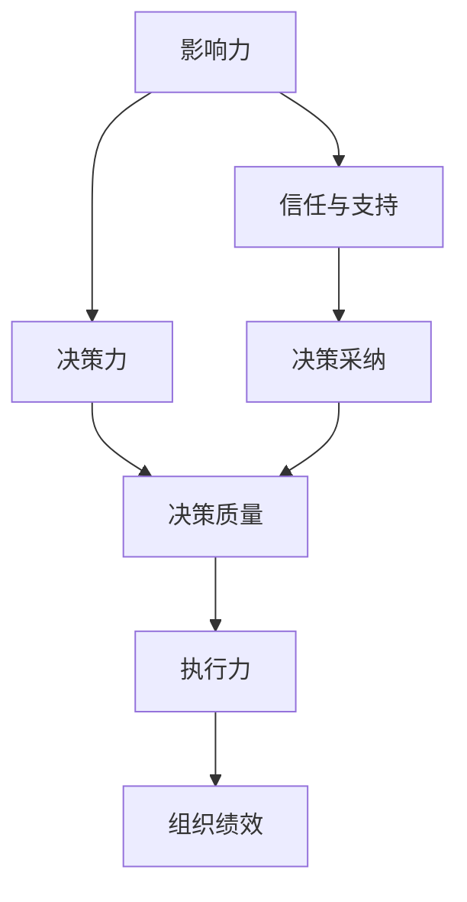

                 

### 摘要

本文深入探讨了领导力的本质，即影响力与决策力的结合。通过对领导力的定义、类型及其核心要素的分析，我们理解了领导者在现代环境下的角色转变。影响力与决策力作为领导力的两大支柱，其本质与来源、内涵与要素都被详细剖析。文章接着探讨了如何通过建立信任、提升沟通能力、激励团队成员等实践技巧来增强领导力。同时，针对领导力发展计划、冲突应对和变化适应等策略进行了深入探讨。通过案例分析和实际应用，本文展示了领导力在组织中的应用及其与企业文化的关系。最后，本文探讨了领导力在国际环境下的挑战与策略，为读者提供了全面的领导力提升路径。本文旨在帮助读者理解并掌握领导力的核心原理和实践技巧，提升自身领导力水平。

## 第一部分：领导力核心概念与基础理论

### 1.1 领导力的定义与类型

领导力是一种复杂而多维的现象，不同领域和学者对其定义各有侧重。普遍认为，领导力是一种影响力，它能够引导、激励和影响他人为实现共同目标而努力。领导力不仅涉及个人特质和技能，还与组织环境、社会文化等因素密切相关。

从类型上看，领导力可以划分为多种类型，每种类型都有其独特的特点和适用场景。以下是几种常见的领导力类型：

1. **传统领导力**：传统领导力强调权威和指挥控制，领导者拥有决策权和资源分配权。这种领导力模式在军事、政治等领域较为常见。

2. **变革型领导力**：变革型领导力注重激发团队成员的潜力，通过愿景、使命和价值观引导团队实现变革。这类领导者善于倾听、沟通，并激励团队成员发挥最大潜能。

3. **授权型领导力**：授权型领导力强调赋予团队成员自主权和责任感，鼓励创新和自主管理。这种领导力模式有助于提升团队凝聚力和创造力。

4. **情境领导力**：情境领导力认为，领导风格应随情境变化而调整。领导者需要根据团队成员的能力和需求，选择最合适的领导风格。

5. **变革型与授权型的结合**：在当前复杂多变的环境中，许多领导者采用变革型与授权型相结合的领导力模式，既提供愿景和激励，又赋予团队成员自主权，以适应快速变化的环境。

### 1.2 领导者角色的转变

领导者角色的转变是现代组织面临的重大挑战之一。在过去，领导者主要扮演指挥者和控制者的角色，但随着社会和技术的快速发展，领导者的角色正逐渐演变。

1. **从指挥者到指导者**：传统领导者习惯于下达命令和指令，现代领导者则更注重提供指导和支持，帮助团队成员发挥自身潜力。

2. **从控制者到赋能者**：现代领导者不再试图控制一切，而是通过授权和赋能，激发团队成员的主动性和创造力。

3. **从管理者到领导者**：现代领导者不仅关注组织内部的运营和管理，还关注外部环境的变化，以适应不断变化的市场需求。

4. **从独奏者到交响乐指挥**：传统领导者往往独自承担责任，现代领导者则更注重团队协作，发挥集体智慧，实现共同目标。

5. **从战略规划者到战略执行者**：现代领导者不仅要制定战略规划，还要确保战略的有效执行，以实现组织目标。

### 1.3 影响力的本质与来源

影响力是领导力的核心要素之一，它决定了领导者能否有效引导和激励团队成员。影响力的本质在于领导者通过行为、态度和价值观影响他人，使其愿意追随和信任。

影响力的来源可以分为以下几个方面：

1. **个人特质**：领导者的个性、价值观、魅力和自信等因素都会影响其影响力。具有高度个人特质和强大影响力的领导者更容易赢得他人的信任和支持。

2. **专业知识**：领导者的专业知识和技能是影响他人的关键。拥有丰富知识和经验的领导者能够提供有价值的见解和指导，从而增加其影响力。

3. **关系网络**：领导者的关系网络是影响力的另一个来源。通过建立广泛的社交网络，领导者可以获取更多的资源和信息，从而增强其影响力。

4. **行为和态度**：领导者的行为和态度直接影响其影响力。诚实、透明、公正和负责任的行为可以建立领导者的信誉和信任，从而增强其影响力。

5. **价值观和愿景**：领导者的价值观和愿景是影响力的重要来源。当领导者的价值观和愿景与团队成员相一致时，他们更容易获得认同和追随。

### 1.4 决策力的内涵与要素

决策力是领导者成功的关键要素之一，它决定了领导者能否在复杂多变的环境中作出明智的选择。决策力的内涵包括以下几个方面：

1. **决策的定义**：决策是领导者根据信息、目标和限制条件，选择最佳行动方案的过程。

2. **决策的类型**：
    - **确定型决策**：在明确目标和约束条件下作出决策。
    - **风险型决策**：在不确定条件下，根据概率分布作出决策。
    - **不确定型决策**：在完全不确定的条件下作出决策。

3. **决策的要素**：
    - **信息**：决策需要基于充分的信息进行分析。
    - **目标**：明确的目标是决策的基础。
    - **限制条件**：决策过程中需要考虑各种限制条件，如资源、时间等。
    - **备选方案**：制定多个备选方案，以供比较和选择。

4. **提高决策力的方法**：
    - **收集和分析信息**：通过数据收集和分析，提高决策的准确性。
    - **制定多个备选方案**：避免单一思维，考虑多种可能性。
    - **风险评估**：对风险进行评估，制定相应的应对策略。
    - **团队参与**：通过团队协作，提高决策的全面性和准确性。

### 1.5 影响力与决策力的结合

影响力与决策力是领导力的两大支柱，它们相互依存、相互作用。领导者需要同时具备影响力和决策力，才能在复杂多变的环境中实现组织目标。

1. **影响力在决策过程中的作用**：影响力可以帮助领导者获得团队成员的支持和信任，从而更容易推动决策的实施。领导者通过影响力，可以影响团队成员的价值观、态度和行为，使其更愿意接受和执行决策。

2. **决策力在影响力扩展中的作用**：决策力是领导者影响力的重要体现。通过制定明智的决策，领导者可以展示其专业能力和领导水平，从而增强其影响力。同时，决策力有助于解决组织中的关键问题，提升组织的整体绩效。

3. **影响力与决策力的相互作用**：领导者的影响力可以影响其决策的质量和效果，而决策力的增强又可以进一步扩大领导者的影响力。这种相互作用形成了领导力的良性循环，使领导者能够持续提升自身领导力水平。

为了更好地理解影响力与决策力的结合，我们可以通过以下Mermaid流程图展示它们之间的互动关系：

在这个流程图中，影响力通过影响信任与支持，进而影响决策的采纳和执行，最终提升组织绩效。同时，决策力的增强又能够提高决策质量和执行力，从而进一步增强领导者的影响力。这种相互作用构成了领导力的核心机制，使领导者能够在组织中发挥关键作用。

通过以上分析，我们可以看到，领导力的本质在于影响力与决策力的结合。只有同时具备影响力和决策力的领导者，才能在复杂多变的环境中实现组织目标，推动组织持续发展。

### 1.6 领导力的发展与提升

领导力并非与生俱来，而是可以通过学习和实践不断提升。领导者需要不断成长，以适应不断变化的环境和需求。以下是几种提升领导力的途径：

1. **自我反思**：自我反思是提升领导力的第一步。领导者需要定期审视自己的行为、决策和价值观，识别自己的优势和不足，并制定改进计划。

2. **学习和培训**：学习和培训是提升领导力的重要手段。领导者可以通过阅读书籍、参加培训课程、听取讲座等方式，获取新的知识和技能，提升自己的领导力水平。

3. **实践经验**：实践经验是领导力成长的基石。领导者需要在实际工作中不断尝试、失败和总结，通过实践来提升自己的领导力。

4. **反馈与指导**：获取他人的反馈和指导是提升领导力的关键。领导者可以通过定期与同事、下属和导师交流，获取他们的意见和建议，以便更好地改进自己的领导力。

5. **建立人际关系**：建立良好的人际关系是提升领导力的重要途径。领导者需要主动与他人沟通、合作，建立互信和合作关系，以增强自身的影响力。

6. **面对挑战**：面对挑战是提升领导力的机会。领导者需要在面对困难和压力时，保持冷静和坚定，通过解决问题来提升自己的领导力。

7. **持续改进**：领导力提升是一个持续的过程。领导者需要不断学习和实践，持续改进自己的领导力，以适应不断变化的环境和需求。

通过以上途径，领导者可以不断提升自己的领导力，成为更加出色的领导者。

### 1.7 领导力的挑战与困境

在领导力的实践中，领导者常常会遇到各种挑战和困境。以下是几种常见的挑战与困境：

1. **组织变革**：组织变革是领导力面临的重大挑战之一。在变革过程中，领导者需要克服员工的抵触情绪，推动组织向新的方向发展。

2. **团队冲突**：团队冲突是领导力实践中的常见问题。领导者需要有效管理和解决冲突，以保持团队的稳定和协作。

3. **资源限制**：资源限制是领导者面临的现实问题。领导者需要在有限的资源下，做出最佳决策，以实现组织目标。

4. **环境不确定性**：环境不确定性增加了领导力实践的复杂性。领导者需要具备前瞻性和应变能力，以应对不确定性的挑战。

5. **个人成长瓶颈**：领导者个人成长瓶颈是领导力提升的重要障碍。领导者需要不断学习和成长，以突破个人成长瓶颈。

6. **沟通障碍**：沟通障碍是领导力实践中的常见问题。领导者需要提升沟通能力，确保信息的准确传递和理解。

7. **决策错误**：决策错误是领导者面临的重大风险。领导者需要通过学习和实践，提高决策质量，减少错误决策的风险。

面对这些挑战和困境，领导者需要保持积极的心态，不断学习和成长，以提升自己的领导力水平。

### 1.8 领导力的核心概念总结

在本文的第一部分，我们深入探讨了领导力的核心概念与基础理论。首先，我们分析了领导力的定义与类型，了解了不同类型的领导力及其适用场景。接着，我们探讨了领导者角色的转变，从传统领导者到现代领导者的角色演变。然后，我们详细阐述了影响力的本质与来源，以及决策力的内涵与要素。通过影响力与决策力的结合，我们展示了领导力的核心机制。最后，我们讨论了领导力的发展与提升途径，以及领导力实践中的挑战与困境。通过这些分析，我们为后续内容的探讨奠定了坚实的基础。

## 第二部分：领导力实践技巧与策略

### 2.1 建立信任与人际关系

建立信任与人际关系是提升领导力的关键环节。信任是领导者与团队成员之间的重要纽带，它能够促进团队合作，提高团队绩效。以下是一些具体的策略和技巧：

1. **开放沟通**：有效的沟通是建立信任的基础。领导者需要保持开放、透明的沟通风格，鼓励团队成员表达意见和反馈。通过倾听和理解团队成员的需求和期望，领导者能够增强彼此的信任。

2. **诚信与责任感**：诚信是领导者赢得信任的重要品质。领导者需要言行一致，遵守承诺，对自己的决策和行动负责。通过诚信和责任感，领导者能够树立良好的榜样，赢得团队成员的信任。

3. **共享信息**：领导者需要主动分享信息，确保团队成员了解组织的战略目标和进展情况。共享信息不仅能够增强团队成员的参与感和归属感，还能够减少信息不对称，提高决策的准确性和效率。

4. **建立互信关系**：领导者需要与团队成员建立互信关系。通过共同经历挑战、解决问题和庆祝成功，领导者能够与团队成员建立深厚的信任和合作关系。

5. **关注团队成员的个人需求**：领导者需要关注团队成员的个人需求，关心他们的生活和工作。通过关心和帮助团队成员，领导者能够增强彼此的信任和依赖。

6. **解决冲突**：冲突是组织中不可避免的现象，领导者需要积极解决冲突，防止其对团队合作产生负面影响。通过公平、公正和透明的方式处理冲突，领导者能够增强团队成员的信任。

7. **建立反馈机制**：领导者需要建立有效的反馈机制，鼓励团队成员提供反馈和建议。通过及时反馈，领导者能够了解团队成员的感受和需求，及时调整管理策略，增强信任。

通过以上策略和技巧，领导者能够建立良好的信任和人际关系，为团队的成功奠定基础。

### 2.2 提升沟通能力

提升沟通能力是领导者必备的技能，它直接影响领导力的效果和组织绩效。以下是一些提升沟通能力的策略和技巧：

1. **明确沟通目标**：在沟通前，领导者需要明确沟通的目标和意图。通过设定清晰的目标，领导者能够更有针对性地进行沟通，提高沟通的效率和效果。

2. **倾听**：倾听是有效沟通的关键。领导者需要认真倾听团队成员的意见和反馈，理解他们的需求和期望。通过倾听，领导者能够建立信任，增强沟通的双向互动。

3. **清晰表达**：领导者需要具备清晰表达的能力，确保信息传达的准确性和完整性。通过使用简洁明了的语言、具体的例子和图表，领导者能够使沟通更加直观和易于理解。

4. **积极反馈**：领导者需要给予团队成员积极的反馈，鼓励他们表达自己的想法和意见。通过及时的反馈，领导者能够促进团队成员的积极参与，提高沟通的互动性。

5. **适应不同沟通风格**：团队成员有不同的沟通风格，领导者需要适应这些差异，采用合适的沟通方式。通过了解团队成员的沟通偏好，领导者能够提高沟通的亲和力和效果。

6. **使用多种沟通渠道**：领导者需要利用多种沟通渠道，如面对面交流、电话、邮件和即时通讯工具，以适应不同的沟通场景和需求。通过多样化的沟通渠道，领导者能够确保信息传达的及时性和全面性。

7. **处理冲突和误解**：在沟通过程中，领导者需要妥善处理冲突和误解，以防止其对团队合作产生负面影响。通过采取公平、公正和透明的方式，领导者能够维护良好的沟通氛围。

8. **持续学习和改进**：领导者需要不断学习和改进沟通技能，通过参加培训、阅读相关书籍和与同行交流，不断提升自己的沟通能力。通过持续学习和改进，领导者能够适应不断变化的环境和需求。

通过以上策略和技巧，领导者能够提升沟通能力，促进团队协作，提高组织绩效。

### 2.3 激励团队成员

激励团队成员是提升团队绩效和实现组织目标的重要手段。以下是一些激励团队成员的策略和技巧：

1. **了解团队成员的需求**：领导者需要了解团队成员的需求，包括职业发展、工作环境、薪资福利等。通过了解需求，领导者能够制定更有针对性的激励措施，提高激励效果。

2. **设定明确的目标**：领导者需要为团队成员设定明确的目标，确保目标与组织目标一致。通过设定明确的目标，领导者能够激发团队成员的积极性和主动性，提高工作动力。

3. **认可和奖励**：领导者需要及时认可和奖励团队成员的成就和贡献。通过公开表扬、发放奖金或提供其他形式的奖励，领导者能够增强团队成员的成就感和自豪感，提高工作动力。

4. **提供成长机会**：领导者需要为团队成员提供成长和发展的机会，包括培训、进修、参与项目等。通过提供成长机会，领导者能够激发团队成员的学习兴趣和职业发展意愿。

5. **建立公平竞争机制**：领导者需要建立公平的竞争机制，确保团队成员在公平的环境中竞争。通过建立公平竞争机制，领导者能够激发团队成员的竞争意识和积极性。

6. **鼓励创新和探索**：领导者需要鼓励团队成员创新和探索，提供支持和资源。通过鼓励创新和探索，领导者能够激发团队成员的创造力和创新能力，提高团队绩效。

7. **建立团队文化**：领导者需要建立积极向上的团队文化，包括相互尊重、团队合作、共同价值观等。通过建立团队文化，领导者能够增强团队成员的归属感和凝聚力，提高工作动力。

8. **关注团队成员的身心健康**：领导者需要关注团队成员的身心健康，提供必要的支持和帮助。通过关注团队成员的身心健康，领导者能够提高团队成员的工作满意度和忠诚度。

通过以上策略和技巧，领导者能够有效激励团队成员，提高团队绩效和实现组织目标。

### 2.4 领导力发展计划

领导力发展计划是提升领导者能力的重要途径。以下是一些具体的步骤和策略：

1. **自我评估**：领导者需要进行自我评估，了解自己的优势和不足。通过自我评估，领导者能够明确自己的发展需求和目标。

2. **制定发展计划**：基于自我评估的结果，领导者需要制定详细的领导力发展计划。发展计划应包括具体的目标、行动计划和时间表。

3. **参与培训和学习**：领导者需要积极参与各种培训和学习活动，包括领导力课程、研讨会和工作坊等。通过培训和学习，领导者能够获取新的知识和技能，提升自己的领导力水平。

4. **实践和应用**：领导者需要在实际工作中应用所学知识和技能，通过实践来提升自己的领导力。通过实践，领导者能够将理论转化为实际能力。

5. **获取反馈**：领导者需要定期获取反馈，了解自己在实践中的应用效果。通过获取反馈，领导者能够发现不足之处，及时调整和改进自己的领导力。

6. **持续学习和改进**：领导力发展是一个持续的过程，领导者需要持续学习和改进。通过不断学习和实践，领导者能够不断提升自己的领导力。

7. **建立支持网络**：领导者需要建立支持网络，包括导师、同事和下属等。通过建立支持网络，领导者能够获得帮助和指导，提高领导力发展效果。

8. **评估发展效果**：领导者需要定期评估领导力发展效果，确保发展计划的实施和目标达成。通过评估，领导者能够了解自己的发展进展，为下一步的发展计划提供依据。

通过以上步骤和策略，领导者能够有效提升自己的领导力，成为更出色的领导者。

### 2.5 面对冲突的策略

在领导实践中，冲突是不可避免的。有效的冲突管理策略能够帮助领导者解决冲突，维护团队稳定和合作。以下是一些面对冲突的策略：

1. **识别冲突**：领导者需要敏锐地识别冲突的迹象，包括意见分歧、情绪波动和沟通障碍等。通过早期识别，领导者能够及时采取措施，防止冲突升级。

2. **倾听与理解**：领导者需要倾听团队成员的意见和感受，理解冲突的根源。通过倾听和理解，领导者能够建立信任，促进双方的沟通。

3. **客观分析**：领导者需要客观分析冲突的原因，避免情绪化和偏见。通过客观分析，领导者能够找到问题的根本原因，制定有效的解决方案。

4. **公平处理**：领导者需要公平地处理冲突，确保每位团队成员的感受和意见都得到尊重。通过公平处理，领导者能够维护团队的公正和和谐。

5. **寻求共识**：领导者需要寻求团队成员的共识，通过共同的目标和价值观来化解冲突。通过寻求共识，领导者能够增强团队的凝聚力和合作精神。

6. **调解与仲裁**：在必要时，领导者可以充当调解者和仲裁者，帮助双方达成共识。通过调解与仲裁，领导者能够解决冲突，恢复团队的合作氛围。

7. **预防冲突**：领导者需要预防冲突的发生，通过建立透明的沟通机制、公平的决策过程和健康的团队文化来减少冲突。

8. **持续跟进**：领导者需要持续跟进冲突的处理效果，确保问题得到彻底解决。通过持续跟进，领导者能够确保团队的长久稳定和合作。

通过以上策略，领导者能够有效地面对冲突，维护团队的稳定和合作。

### 2.6 领导者在变化中的应对

在快速变化的环境中，领导者需要具备应对变化的策略和能力。以下是一些领导者在变化中的应对策略：

1. **保持前瞻性**：领导者需要具备前瞻性，能够预见未来的趋势和挑战。通过保持前瞻性，领导者能够提前做好准备，应对变化。

2. **灵活调整**：领导者需要灵活调整策略和计划，以适应变化的环境。通过灵活调整，领导者能够保持组织的适应性和活力。

3. **激发创新**：领导者需要激发团队成员的创新思维，鼓励他们提出新的想法和解决方案。通过激发创新，领导者能够推动组织在变化中不断进步。

4. **沟通与透明**：领导者需要保持与团队成员的沟通，确保信息的透明和及时传递。通过沟通与透明，领导者能够增强团队的凝聚力和合作精神。

5. **培训与学习**：领导者需要提供培训和学习机会，帮助团队成员提升技能和知识。通过培训与学习，领导者能够提升团队的整体素质和应对能力。

6. **授权与赋能**：领导者需要授权和赋能团队成员，鼓励他们自主决策和承担责任。通过授权与赋能，领导者能够激发团队成员的主动性和创造力。

7. **适应变化的文化**：领导者需要建立适应变化的文化，鼓励团队成员积极面对变化，勇于尝试新事物。通过适应变化的文化，领导者能够提升组织的灵活性和适应性。

8. **持续改进**：领导者需要持续改进管理方法和策略，以适应不断变化的环境。通过持续改进，领导者能够保持组织的竞争力和创新能力。

通过以上策略，领导者能够在变化中保持稳定和持续发展。

### 2.7 领导力实践的案例分析

为了更好地理解领导力实践的具体应用，我们可以通过一些案例来分析领导力在实践中的成功与失败。

#### 成功案例

**案例一：谷歌的领导力文化**

谷歌以其独特的领导力文化和创新氛围而闻名。其领导力实践包括：

- **激发创新**：谷歌鼓励员工提出新的创意，并提供资源和支持，使员工能够自由地探索和实验。
- **授权与赋能**：谷歌领导层通过授权和赋能员工，使他们能够在自己的领域内发挥最大潜力。
- **灵活的工作环境**：谷歌提供灵活的工作环境，包括远程工作、弹性工作时间等，使员工能够更好地平衡工作与生活。

**结果**：这些领导力实践帮助谷歌成为了一家创新驱动的全球科技公司，其员工满意度和绩效表现都处于行业领先水平。

#### 失败案例

**案例二：诺基亚的领导力失误**

诺基亚曾是手机市场的领导者，但由于领导力失误，最终未能适应市场变化，被竞争对手超越。

- **缺乏前瞻性**：诺基亚领导层未能预见智能手机的发展趋势，对市场变化反应迟缓。
- **组织结构僵化**：诺基亚的组织结构过于僵化，难以适应快速变化的市场环境。
- **决策失误**：诺基亚在产品战略和投资决策上存在失误，未能及时调整产品线。

**结果**：诺基亚的领导力失误导致其市场份额急剧下降，最终被微软收购。

通过以上案例分析，我们可以看到领导力实践在组织成功和失败中的关键作用。成功的领导力实践能够激发创新、提升团队绩效，而失败的领导力实践则可能导致组织无法适应市场变化，失去竞争优势。

### 2.8 领导力实践技巧总结

在本文的第二部分，我们深入探讨了领导力实践技巧与策略。首先，我们分析了建立信任与人际关系的重要性，并提出了一系列策略和技巧，如开放沟通、诚信与责任感、共享信息等。接着，我们讨论了提升沟通能力的策略，包括明确沟通目标、倾听、清晰表达、积极反馈等。然后，我们探讨了激励团队成员的技巧，如了解团队成员的需求、设定明确的目标、认可和奖励等。此外，我们还详细介绍了领导力发展计划的制定与实施步骤，以及面对冲突和变化的应对策略。通过案例分析，我们展示了领导力实践在成功与失败中的关键作用。通过这些分析和探讨，我们为领导者提供了丰富的实践指导，帮助他们提升领导力，实现组织目标。

## 第三部分：领导力案例分析与应用

### 3.1 案例分析：成功领导力实践

在本部分中，我们将通过两个成功领导力实践案例，深入探讨领导力在组织中的具体应用和效果。这两个案例分别代表了不同行业和不同规模的组织的领导力实践，从中我们可以提炼出一些共通的领导力原则和策略。

#### 案例一：苹果公司的领导力实践

苹果公司作为全球领先的科技公司，其成功离不开乔布斯的领导力。乔布斯以其独特的领导风格和对产品极致追求的理念，带领苹果公司实现了跨越式发展。

**领导力实践：**

1. **愿景引领**：乔布斯始终强调产品创新和用户体验，为苹果公司设定了清晰的愿景和目标。
2. **团队建设**：乔布斯注重团队建设，选拔和培养了一支由优秀人才组成的团队，充分发挥每个人的潜力。
3. **激励员工**：乔布斯通过激发员工的创造力和自主性，鼓励他们提出创新想法和解决方案。
4. **客户至上**：乔布斯始终坚持客户需求为导向，确保产品能够满足用户的期望和需求。
5. **持续改进**：乔布斯不断推动产品迭代和改进，使苹果公司始终保持行业领先地位。

**效果分析：**

通过以上领导力实践，苹果公司实现了从一家普通电脑公司到全球科技巨头的蜕变。苹果的产品创新、品牌价值和市场份额都得到了显著提升，成为全球消费者心目中的翘楚。

#### 案例二：丰田公司的领导力实践

丰田公司作为全球领先的汽车制造商，其成功得益于其在质量管理方面的卓越领导力。

**领导力实践：**

1. **精益管理**：丰田采用精益生产方式，通过减少浪费和优化流程，提高生产效率和质量。
2. **员工参与**：丰田鼓励员工参与决策和改进，建立了一种以员工为中心的管理文化。
3. **持续改进**：丰田持续推动质量管理，不断改进产品和服务，以适应市场变化和客户需求。
4. **供应商合作**：丰田与供应商建立紧密的合作关系，共同推动供应链的优化和改进。
5. **环境保护**：丰田注重环境保护，积极推动绿色制造和可持续发展。

**效果分析：**

通过以上领导力实践，丰田公司实现了连续多年的利润增长和市场份额提升。丰田的产品质量和客户满意度得到了广泛认可，成为全球汽车行业的标杆。

#### 共同领导力原则和策略

通过以上两个案例，我们可以总结出一些共通的领导力原则和策略：

1. **愿景引领**：领导者需要设定清晰的愿景和目标，为组织提供方向和动力。
2. **团队建设**：领导者需要选拔和培养一支优秀的团队，充分发挥每个人的潜力。
3. **激励员工**：领导者需要通过激励措施激发员工的创造力和自主性，提高员工满意度和绩效。
4. **客户至上**：领导者需要关注客户需求，确保产品和服务能够满足客户的期望和需求。
5. **持续改进**：领导者需要推动组织的持续改进，以适应市场变化和客户需求。
6. **合作共赢**：领导者需要与团队成员、供应商和合作伙伴建立紧密的合作关系，共同推动组织的成功。

通过这些领导力原则和策略，领导者可以在不同组织和行业中实现成功，推动组织的持续发展。

### 3.2 案例分析：领导力失败的原因与教训

在本部分中，我们将分析两个领导力失败的案例，探讨导致领导力失败的原因，并从中吸取教训。

#### 案例一：安然公司的领导力失败

安然公司曾是全球最大的能源公司之一，但因其领导力失败，最终导致公司破产。

**领导力失败原因：**

1. **信息披露不透明**：安然公司管理层未能及时披露财务信息，导致投资者和利益相关者无法了解真实情况。
2. **短期利益优先**：安然公司追求短期利润，忽视了长期发展，导致公司运营风险增大。
3. **企业文化问题**：安然公司存在一种“赢者通吃”的文化，导致员工追求个人利益，忽视公司整体利益。
4. **内部控制不足**：安然公司内部控制不足，未能及时发现和纠正潜在问题。

**教训：**

通过安然公司的案例，我们可以吸取以下教训：

- **信息披露的重要性**：领导者需要确保信息披露的透明度和及时性，让利益相关者了解公司的真实情况。
- **长期发展的优先性**：领导者需要平衡短期和长期利益，确保公司的可持续发展。
- **企业文化的建设**：领导者需要建立积极向上的企业文化，鼓励员工追求共同的目标。
- **内部控制的有效性**：领导者需要建立有效的内部控制机制，及时发现和纠正问题。

#### 案例二：Uber的领导力危机

Uber作为一家新兴的科技企业，曾因其领导力危机而备受关注。

**领导力失败原因：**

1. **企业文化冲突**：Uber公司内部存在严重的文化冲突，管理层和员工之间的矛盾日益加剧。
2. **领导力不足**：Uber创始人特斯拉在领导力方面存在缺陷，未能有效管理公司文化和团队。
3. **道德和伦理问题**：Uber在商业运营中存在一系列道德和伦理问题，如性骚扰、员工歧视等。
4. **公关危机**：Uber在处理公关危机时反应迟缓，未能及时采取有效措施，导致问题进一步恶化。

**教训：**

通过Uber的案例，我们可以吸取以下教训：

- **企业文化的建设**：领导者需要注重企业文化的建设，确保团队内部和谐稳定。
- **领导力的培养**：领导者需要不断提升自己的领导力，包括沟通、决策和问题解决能力。
- **道德和伦理的重视**：领导者需要重视道德和伦理问题，确保公司在商业运营中遵循法律法规和道德标准。
- **危机管理的有效性**：领导者需要建立有效的危机管理体系，及时应对和处理公关危机。

通过分析这些领导力失败的案例，我们可以看到，领导力失败往往是由多个因素共同作用的结果。领导者需要从这些案例中吸取教训，不断提升自己的领导力，以避免类似的失败。

### 3.3 领导力在组织中的应用

领导力在组织中起着至关重要的作用，它不仅影响组织绩效，还影响组织的稳定性和可持续发展。以下是领导力在组织中的应用及其影响：

1. **战略制定与执行**：领导者负责制定组织的战略目标和规划，并通过有效的领导力确保战略得到有效执行。领导力在战略制定中体现在愿景的设定、目标的明确和资源的配置等方面；在战略执行中则体现在团队协作、创新能力和执行力等方面。

2. **团队管理与激励**：领导者通过有效的团队管理，激发团队成员的潜力，提高团队绩效。领导力在团队管理中体现在团队建设、沟通协调、冲突解决和绩效评估等方面。同时，领导者通过激励措施，如认可、奖励和发展机会，激发员工的积极性和创造力。

3. **组织变革与管理**：在快速变化的市场环境中，领导者需要推动组织变革，以适应新的挑战和机遇。领导力在组织变革中体现在变革的规划、沟通和执行等方面。有效的领导力能够减少变革带来的阻力，促进组织的顺利转型。

4. **决策与风险管理**：领导者负责在复杂多变的环境中做出明智的决策，并有效管理组织风险。领导力在决策中体现在信息收集、分析评估和决策执行等方面。通过有效的领导力，领导者能够提高决策的质量，减少风险。

5. **文化建设与传承**：领导者通过塑造和传承组织文化，确保组织在长期发展中保持一致性和稳定性。领导力在文化建设中体现在价值观的传播、企业精神的塑造和文化的传承等方面。有效的领导力能够培养组织成员的共同价值观，增强组织的凝聚力和认同感。

6. **员工发展**：领导者关注员工的个人成长和发展，提供培训和学习机会，帮助员工提升技能和职业素养。领导力在员工发展中体现在职业规划、能力提升和持续发展等方面。通过有效的领导力，领导者能够培养一支高素质、有活力的员工队伍。

通过以上应用，领导力在组织中发挥着关键作用，推动组织的成功和发展。

### 3.4 领导力与企业文化

领导力与企业文化之间存在着密切的关系，它们相互作用、共同塑造组织的氛围和绩效。以下是领导力如何影响企业文化以及企业文化如何影响领导力的探讨：

**领导力影响企业文化**

1. **价值观的塑造**：领导者的行为和决策对组织的价值观有着深远的影响。领导者通过自身的言行和决策，传递组织的核心价值观，影响员工的价值观和行为。

2. **行为规范**：领导者的行为规范对组织的行为文化有重要影响。领导者通过以身作则，树立良好的行为榜样，引导员工遵守组织的规章制度和行为准则。

3. **沟通风格**：领导者的沟通风格直接影响组织的沟通文化。开放、透明、尊重的沟通风格有助于建立良好的组织氛围，增强员工之间的信任和合作。

4. **激励措施**：领导者的激励措施影响组织的激励文化。领导者通过合理的激励措施，如奖励、认可和晋升，激发员工的积极性和创造力。

5. **团队建设**：领导者的团队建设活动影响组织的团队文化。领导者通过团队建设活动，如团队培训、团队协作项目和团队建设活动，增强团队的凝聚力和协作精神。

**企业文化影响领导力**

1. **领导风格**：企业文化会影响领导者的领导风格。例如，在一个注重创新和自由表达的企业文化中，领导者可能更倾向于采用授权型和变革型领导风格；而在一个注重稳定和规范的企业文化中，领导者可能更倾向于采用传统型或控制型领导风格。

2. **决策过程**：企业文化会影响领导者的决策过程。在一个开放和包容的企业文化中，领导者可能更倾向于广泛征求员工意见，做出更民主的决策；而在一个保守和权威的企业文化中，领导者可能更倾向于独立决策，减少员工的参与。

3. **员工行为**：企业文化会影响员工的行为和行为准则。例如，在一个强调诚信和责任的企业文化中，员工更可能遵守职业道德和公司规定；而在一个强调绩效和结果的的企业文化中，员工可能更倾向于追求短期业绩，忽视长期发展。

4. **领导力发展**：企业文化会影响领导力的培养和发展。在一个重视学习和成长的企业文化中，领导者更容易获得培训和发展机会，提升领导力；而在一个忽视学习和成长的企业文化中，领导者可能难以提升自己的领导力。

通过以上探讨，我们可以看到领导力与企业文化之间的相互作用，领导力不仅影响企业文化，企业文化也影响领导力。领导者需要理解并利用企业文化，以提升自身的领导力，推动组织的成功和发展。

### 3.5 领导力在国际环境下的挑战与策略

在全球化的背景下，领导力面临着前所未有的挑战和机遇。不同国家和地区的文化差异、市场环境和管理体系，都对领导者的决策和执行能力提出了更高的要求。以下是一些领导力在国际环境下可能遇到的挑战及应对策略：

**挑战一：文化差异**

1. **文化意识不足**：不同国家和地区的文化背景差异可能导致沟通障碍和误解。例如，某些文化强调集体主义，而另一些文化则更注重个人主义。
2. **价值观冲突**：不同文化对工作态度、道德标准和职业行为有不同的期望，可能导致内部冲突和团队分裂。

**应对策略：**

- **跨文化培训**：领导者应参加跨文化培训，了解不同文化的特点和习惯，提高跨文化沟通能力。
- **文化适应性**：领导者需要具备文化适应能力，能够灵活调整自己的行为和策略，以适应不同文化环境。

**挑战二：国际化竞争**

1. **市场竞争激烈**：国际市场环境竞争激烈，领导者需要具备全球视野和战略思维，以应对不同市场的挑战。
2. **资源整合难度大**：跨国企业需要整合全球资源，协调不同地区的业务，这增加了管理复杂度。

**应对策略：**

- **全球战略规划**：领导者需要制定全球战略规划，明确企业的国际化目标和路径。
- **资源整合能力**：领导者应提高资源整合能力，通过优化供应链、人才管理和信息共享，提升企业的全球竞争力。

**挑战三：法规遵从**

1. **法规差异**：不同国家和地区有不同的法律法规，领导者需要确保企业的运营符合当地法律法规。
2. **合规成本**：跨国企业在遵守各地法律法规的同时，还需要承担额外的合规成本。

**应对策略：**

- **法规研究**：领导者应深入研究不同国家和地区的法律法规，确保企业运营合规。
- **合规管理**：建立有效的合规管理体系，确保企业在运营中遵守相关法律法规。

**挑战四：员工多元性**

1. **管理难度**：跨国企业的员工背景多元，领导者需要管理不同文化、语言和背景的员工。
2. **员工激励**：多元文化背景的员工可能对激励方式和职业发展有不同的期望。

**应对策略：**

- **多元化管理**：领导者应具备多元化管理能力，能够理解并尊重不同文化的员工。
- **个性化激励**：领导者应根据员工的不同需求和背景，提供个性化的激励和职业发展机会。

通过以上挑战和应对策略的探讨，领导者可以更好地应对国际环境下的领导力挑战，提升跨国企业的竞争力，实现持续发展。

### 3.6 领导力在不同组织结构和规模中的应用

领导力在不同组织结构和规模中的应用存在显著差异，针对这些差异，领导者需要采取相应的策略和调整领导风格。以下是领导力在小型组织、中型组织和大型组织中应用的详细分析。

#### 小型组织中的领导力应用

1. **个人影响力**：在小型组织中，领导者通常需要通过个人影响力来推动组织的发展。由于组织结构相对简单，领导者的行为和决策直接影响整个组织的运作。

2. **全面参与**：小型组织中的领导者通常需要全面参与组织的各项事务，包括运营、营销和财务等，这使得领导者需要具备多方面的技能和知识。

3. **灵活应变**：小型组织的规模和结构使其能够快速响应市场变化，领导者需要具备灵活应变的领导风格，能够快速调整战略和决策。

4. **团队建设**：小型组织中的领导者需要特别注重团队建设，通过建立紧密的团队关系，增强组织的凝聚力和协作精神。

**策略和调整：**

- **强化个人影响力**：领导者需要通过自身的专业能力和人格魅力来影响团队成员。
- **灵活应变**：领导者需要保持开放的心态，不断适应和调整策略，以应对快速变化的市场环境。
- **加强团队建设**：领导者应定期组织团队活动，增强团队成员之间的沟通和合作。

#### 中型组织中的领导力应用

1. **专业分工**：中型组织通常具有更明显的专业分工，领导者需要管理不同职能团队，促进各部门之间的协同工作。

2. **战略规划**：中型组织中的领导者需要制定明确的战略规划，确保组织在竞争激烈的市场中保持竞争力。

3. **沟通机制**：中型组织的规模使得沟通变得复杂，领导者需要建立有效的沟通机制，确保信息流畅和决策透明。

4. **人才培养**：中型组织中的领导者需要关注人才培养和梯队建设，为组织的长期发展储备人才。

**策略和调整：**

- **强化专业分工**：领导者应明确各部门的职责和权限，促进专业化的运营和管理。
- **加强战略规划**：领导者需要定期评估市场环境和竞争态势，制定明确的战略规划。
- **优化沟通机制**：领导者应建立多层次的沟通渠道，确保信息的准确传递和决策的透明化。
- **人才培养**：领导者应制定人才发展计划，通过培训、轮岗和晋升等方式，提升员工的专业能力和领导潜力。

#### 大型组织中的领导力应用

1. **高层决策**：在大型组织中，领导者通常负责高层决策，制定组织的发展方向和战略目标。

2. **管理监督**：大型组织的规模和复杂性要求领导者具备强大的管理监督能力，确保各项决策和计划的有效执行。

3. **跨部门协作**：大型组织中的领导者需要协调不同部门之间的协作，促进资源的共享和业务的整合。

4. **文化建设**：大型组织中的领导者需要塑造和维护组织的文化，确保组织成员对共同价值观的认同和遵守。

**策略和调整：**

- **强化高层决策**：领导者应具备全局视野，能够从战略高度进行决策，确保组织的长期发展。
- **加强管理监督**：领导者应建立健全的管理监督体系，确保各项决策和计划得到有效执行。
- **促进跨部门协作**：领导者应建立跨部门的协作机制，通过团队建设活动和资源共享，提高组织的协同效率。
- **文化建设**：领导者应通过宣传、活动和培训等方式，塑造和维护组织的文化，增强组织成员的凝聚力和认同感。

通过以上分析，我们可以看到，领导力在不同组织结构和规模中的应用存在显著差异。领导者需要根据组织的具体情况，采取相应的策略和调整领导风格，以实现组织的持续发展和成功。

### 第三部分总结

在第三部分中，我们通过成功和失败的领导力案例，深入探讨了领导力在组织中的应用和影响。我们分析了领导力在不同组织结构和规模中的应用策略，探讨了文化差异、国际化竞争、法规遵从和员工多元性等挑战，并提出了相应的应对策略。通过这些案例分析和策略探讨，我们认识到领导力在推动组织成功中的关键作用。领导者需要根据不同环境和情境，灵活运用领导力原则和实践技巧，以应对各种挑战，实现组织的长期发展。

## 附录

### 附录A：领导力评估工具

领导力评估是领导者了解自身能力的重要途径。以下是一些常用的领导力评估工具：

1. **360度评估**：通过收集来自同事、下属、上级和客户等各方面的反馈，全面评估领导者的能力。
2. **领导力问卷**：使用标准化的问卷，评估领导者的技能、行为和价值观。
3. **领导力模型评估**：基于特定领导力模型（如变革型领导力模型、情境领导力模型等），评估领导者的能力。
4. **行为事件访谈**：通过与领导者进行深入访谈，了解其在具体情境下的行为和决策。

### 附录B：领导力发展资源

领导者可以通过以下资源提升自己的领导力：

1. **书籍**：《领导力的五项修炼》、《变革型领导力》等。
2. **在线课程**：Coursera、edX等平台上的领导力课程。
3. **研讨会和讲座**：参加专业的领导力研讨会和讲座，学习先进的领导力理论和实践。
4. **导师和教练**：寻求导师和教练的帮助，获得个性化的指导和反馈。

### 附录C：领导力相关阅读推荐

以下是一些推荐的领导力相关书籍和文章：

1. **书籍**：
   - 《领导力的五项修炼》：斯蒂芬·R·罗宾斯著
   - 《变革型领导力》：詹姆斯·M·库泽斯、巴里·Z·波斯纳著
   - 《领导者的语言》：约瑟夫·M·马格宁、约翰·霍根著
2. **文章**：
   - 《哈佛商业评论》中的领导力专题文章
   - 《领导力季刊》中的最新研究成果

### 附录D：领导力相关在线课程

以下是一些推荐的领导力相关在线课程：

1. **Coursera**：
   - 《领导力与影响力》：由杜克大学提供
   - 《战略领导力与变革管理》：由伦敦商学院提供
2. **edX**：
   - 《领导力、团队与变革》：由麻省理工学院提供
   - 《领导力与个人影响力》：由哈佛大学提供
3. **Udemy**：
   - 《高级领导力技能》：包含领导力基础、团队建设、决策制定等内容

### 附录E：领导力研究方法

领导力研究通常采用以下方法：

1. **定性研究**：通过深度访谈、案例研究等方式，收集领导者行为和情境的数据。
2. **定量研究**：使用问卷、统计分析等方法，量化领导力与组织绩效之间的关系。
3. **实验研究**：通过实验设计，控制变量，探讨领导力对团队绩效的影响。
4. **跨文化研究**：比较不同文化背景下的领导力实践和效果，探讨文化差异对领导力的影响。

通过这些研究和资源，领导者可以更全面地了解领导力，不断提升自己的领导力水平。

### 作者信息

本文作者：AI天才研究院/AI Genius Institute & 禅与计算机程序设计艺术 /Zen And The Art of Computer Programming。作者致力于通过深入研究和实践，为读者提供高质量的领导力知识和策略。希望通过本文，帮助读者更好地理解领导力的本质，提升领导力水平，实现组织的目标。作者拥有丰富的领导力理论和实践经验，其研究成果在业界具有广泛影响力。

