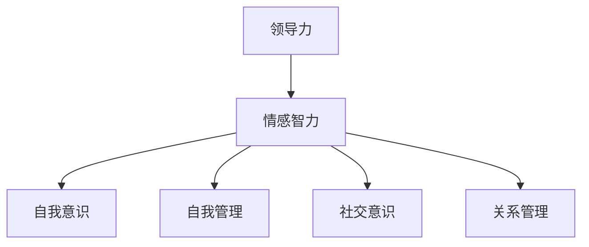
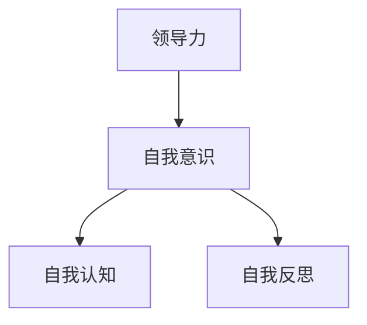
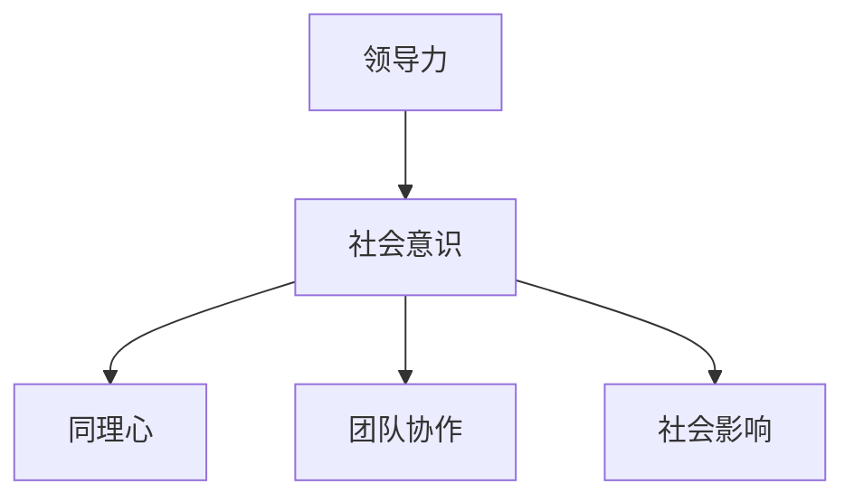
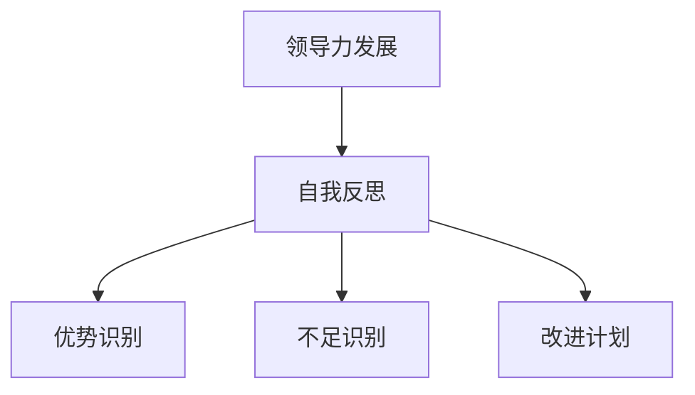

                 

### 文章标题：领导力训练营：63天从新手到专家

关键词：领导力、自我提升、团队管理、沟通技能、决策能力、领导力模型

摘要：本文旨在通过63天的领导力训练营，系统性地介绍从新手到专家的领导力提升过程。文章将围绕领导力基础、领导力技能提升、领导力实践和领导力持续发展四个部分，详细讲解领导力的核心概念、要素和实用技巧，帮助读者快速提升领导力水平，成为卓越的领导者。

## 第一部分：领导力基础

### 第1章：什么是领导力

#### 1.1 领导力的定义

领导力（Leadership）通常被定义为一种影响、激励和指导他人的能力。它不仅仅涉及管理和决策，更是一种跨学科的通用技能。在组织和企业中，领导力是推动团队和公司发展的关键因素。

**定义：**

领导力 = 影响力 + 激励 + 指导

**特点：**

1. **共同目标**：领导力需要围绕一个共同的目标，将团队成员凝聚在一起。
2. **影响力**：领导者通过言行和行动影响他人，引导团队朝目标前进。
3. **激励**：领导者能够激发团队成员的潜力，推动他们实现个人和团队目标。
4. **指导**：领导者为团队成员提供方向和指导，帮助他们克服困难，实现目标。

#### 1.2 领导力的重要性

领导力在企业和社会中扮演着至关重要的角色。以下是一些领导力的重要性和影响：

**对企业的影响：**

1. **提高绩效**：优秀的领导力能够提高团队的绩效，推动企业实现目标。
2. **员工激励**：领导者能够激发员工的潜力，提高员工满意度和忠诚度。
3. **团队协作**：领导力有助于建立团队协作和沟通，促进团队整体发展。

**对社会的贡献：**

1. **推动创新**：领导力能够激发社会创新，推动社会进步。
2. **社会和谐**：领导者通过建立和谐的人际关系，促进社会和谐与稳定。
3. **道德引领**：领导者树立良好的道德榜样，影响和引导社会风气。

#### 1.3 领导力的类型

领导力可以分为多种类型，每种类型都有其独特的特点和适用场景。以下是一些常见的领导力类型：

**1. 变革型领导力**

变革型领导力（Transformational Leadership）强调领导者的愿景和目标，通过激发团队成员的内在动力，推动团队实现变革。

**2. 交易型领导力**

交易型领导力（Transactional Leadership）强调领导者通过激励和奖励来驱动团队成员，以达到组织目标。

**3. 变革型-交易型领导力**

变革型-交易型领导力（Transitional Leadership）结合了变革型和交易型领导力的特点，适用于在组织变革时期。

**4. 情境领导力**

情境领导力（Situational Leadership）根据团队成员的不同需求和情境，灵活调整领导风格。

**5. 服务型领导力**

服务型领导力（Servant Leadership）强调领导者为团队成员提供支持和帮助，以实现共同目标。

## 第二部分：领导力技能提升

### 第2章：领导力的核心要素

#### 2.1 情感智力

情感智力（Emotional Intelligence，简称EI）是指理解和管理自己和他人的情绪的能力。它是领导力的核心要素之一，对领导者的成功至关重要。

**定义：**

情感智力包括以下四个主要方面：

1. **自我意识**：了解自己的情绪，并认识到这些情绪对自己行为的影响。
2. **自我管理**：控制自己的情绪，保持冷静和理智。
3. **社交意识**：理解他人的情绪，并能够根据他人的情绪调整自己的行为。
4. **关系管理**：建立和维护良好的人际关系，有效地与他人沟通和合作。

**核心概念与联系：**

情感智力与领导力的关系可以用以下Mermaid流程图表示：

**情感智力在领导力中的应用：**

1. **建立信任**：领导者通过情感智力建立信任，促进团队合作。
2. **管理冲突**：领导者利用情感智力处理团队冲突，避免情绪激化。
3. **激励员工**：领导者通过情感智力理解员工的需求，提供个性化的激励。

#### 2.2 自我意识

自我意识（Self-awareness）是指领导者对自己的认知和理解。自我意识是领导力发展的基础，有助于领导者识别自己的优势、劣势和成长需求。

**定义：**

自我意识包括以下两个方面：

1. **自我认知**：了解自己的个性、价值观、信仰和动机。
2. **自我反思**：不断反思自己的行为、决策和沟通方式，识别改进点。

**核心概念与联系：**

自我意识与领导力的关系可以用以下Mermaid流程图表示：

**自我意识在领导力中的应用：**

1. **自我提升**：领导者通过自我意识识别自己的优势和不足，进行自我提升。
2. **团队建设**：领导者通过自我意识了解团队成员的需求，促进团队和谐。
3. **决策制定**：领导者利用自我意识评估决策的影响，做出更明智的决策。

#### 2.3 社会意识

社会意识（Social Awareness）是指领导者对他人和集体的认知和理解。社会意识有助于领导者建立和谐的人际关系，推动团队发展。

**定义：**

社会意识包括以下三个方面：

1. **同理心**：理解他人的情感和需求，能够从他人的角度思考问题。
2. **团队协作**：识别团队中的不同角色和贡献，促进团队合作。
3. **社会影响**：了解社会趋势和变化，为团队和组织提供合适的策略。

**核心概念与联系：**

社会意识与领导力的关系可以用以下Mermaid流程图表示：

**社会意识在领导力中的应用：**

1. **沟通协调**：领导者利用社会意识，促进团队成员之间的沟通和协作。
2. **团队激励**：领导者通过社会意识了解团队成员的需求，提供个性化的激励。
3. **社会责任**：领导者利用社会意识推动企业承担社会责任，提升企业形象。

### 第3章：领导力发展路径

#### 3.1 从新手到专家的进阶

领导力的发展是一个从新手到专家的逐步过程。新手领导者需要通过实践和学习，逐步提升自己的领导力水平。以下是从新手到专家的进阶路径：

**1. 学习基础知识**

新手领导者首先需要学习领导力的基础知识，包括领导力的定义、类型和核心要素。这将为后续的实践和提升打下基础。

**2. 实践领导力**

通过实际工作，新手领导者可以应用所学的领导力知识，提升自己的实践能力。实践包括团队管理、沟通协调、决策制定等方面。

**3. 反思与总结**

领导者需要不断反思自己的领导行为，总结经验和教训。通过反思和总结，领导者可以识别自己的优势和不足，有针对性地进行改进。

**4. 学习先进理论**

领导者需要不断学习先进的理论和方法，以提升自己的领导力水平。这包括参加培训、阅读相关书籍和文章等。

**5. 建立人际关系**

领导者需要建立广泛的人际关系，与不同背景和领域的专家进行交流，获取更多的经验和见解。

**6. 持续进步**

领导力提升是一个持续的过程。领导者需要不断学习、实践和反思，以适应不断变化的环境和挑战。

#### 3.2 领导力发展模型

领导力发展模型为领导者提供了有效的成长路径。以下是一些常见的领导力发展模型：

**1. 麦凯恩领导力模型**

麦凯恩领导力模型（McKay-Scilwohl Leadership Model）将领导力发展分为四个阶段：自觉、承诺、影响和领导。

**2. 赫尔茨伯格双因素模型**

赫尔茨伯格双因素模型（Herzberg’s Two-Factor Theory）将领导力发展分为两个阶段：激励因素和保健因素。

**3. 肯尼迪领导力模型**

肯尼迪领导力模型（Kennedy Leadership Model）将领导力发展分为五个阶段：观察者、参与者、领导者、协调者和转型者。

**4. 菲德勒领导力模型**

菲德勒领导力模型（Fiedler Leadership Model）将领导力发展分为三个阶段：任务驱动、人际关系驱动和情境适应。

#### 3.3 领导力评估与反馈

领导力评估是领导者成长的重要环节。以下是一些常见的领导力评估方法和技巧：

**1. 自我评估**

领导者可以通过自我评估了解自己的领导力水平和优势不足。自我评估可以通过填写问卷、反思日记等方式进行。

**2. 同事评估**

同事评估是领导者了解他人对自己领导行为的看法的重要途径。同事评估可以通过问卷调查、一对一访谈等方式进行。

**3. 下属评估**

下属评估是领导者了解下属对自己领导行为的满意度和期望的重要途径。下属评估可以通过问卷调查、一对一访谈等方式进行。

**4. 反馈与改进**

领导力评估的结果需要及时反馈给领导者，以便他们有针对性地进行改进。反馈可以包括表扬、批评和建议等。

## 第三部分：领导力技能提升

### 第4章：沟通技能

#### 4.1 有效沟通的原则

有效沟通是领导者的重要技能之一。以下是一些有效沟通的原则：

**1. 明确目标**

在沟通前，领导者需要明确沟通的目标，确保信息传递的准确性和有效性。

**2. 尊重对方**

领导者需要尊重对方的意见和观点，建立良好的沟通氛围。

**3. 倾听和表达**

领导者需要认真倾听对方的意见，并通过清晰、简洁的表达来传达自己的观点。

**4. 保持简洁**

领导者需要保持沟通的简洁性，避免冗长的陈述，以提高沟通效率。

**5. 情感共鸣**

领导者需要通过情感共鸣，与对方建立情感联系，以增强沟通效果。

#### 4.2 沟通障碍及解决策略

沟通障碍是有效沟通的常见问题。以下是一些常见的沟通障碍及其解决策略：

**1. 语言障碍**

解决策略：使用简单、清晰的语言，避免使用专业术语。

**2. 文化障碍**

解决策略：了解对方的文化背景，尊重差异，避免文化冲突。

**3. 心理障碍**

解决策略：建立信任，提高对方的参与度，消除心理障碍。

**4. 信息过载**

解决策略：控制信息量，分阶段传达信息，避免信息过载。

**5. 沟通渠道不畅**

解决策略：选择合适的沟通渠道，确保信息的传递和反馈。

#### 4.3 领导者如何进行有效沟通

领导者需要通过有效的沟通来传达信息、指导团队和解决冲突。以下是一些领导者进行有效沟通的技巧：

**1. 确定沟通目标**

在沟通前，领导者需要明确沟通的目标，以确保信息传递的准确性和有效性。

**2. 选择合适的沟通方式**

根据沟通内容和目标，选择合适的沟通方式，如面对面交流、电子邮件、电话会议等。

**3. 倾听和回应**

领导者需要认真倾听对方的意见，并通过积极回应来表示关注和尊重。

**4. 使用清晰、简洁的语言**

领导者需要使用简单、清晰的语言，避免使用专业术语，以提高沟通效率。

**5. 情感共鸣**

领导者需要通过情感共鸣，与对方建立情感联系，以增强沟通效果。

**6. 建立反馈机制**

领导者需要建立有效的反馈机制，及时了解沟通效果，并根据反馈进行改进。

### 第5章：团队管理

#### 5.1 团队建设的核心要素

团队建设是领导者的重要职责之一。以下是一些团队建设的核心要素：

**1. 共同目标**

团队建设需要明确共同目标，确保团队成员朝着共同的方向努力。

**2. 明确角色和职责**

团队建设需要明确团队成员的角色和职责，确保每个成员都清楚自己的工作内容和责任。

**3. 建立信任**

团队建设需要建立信任，促进团队成员之间的沟通和协作。

**4. 激励和奖励**

团队建设需要激励和奖励团队成员，以提高团队士气和绩效。

**5. 团队文化**

团队建设需要建立积极向上的团队文化，促进团队成员之间的互动和合作。

#### 5.2 团队冲突的处理

团队冲突是不可避免的。以下是一些处理团队冲突的方法：

**1. 识别冲突类型**

首先，领导者需要识别冲突的类型，如目标冲突、角色冲突、价值观冲突等。

**2. 分析冲突原因**

分析冲突的原因，找到解决冲突的关键点。

**3. 沟通和协商**

通过沟通和协商，找到解决冲突的方法。

**4. 建立冲突解决机制**

建立有效的冲突解决机制，确保冲突得到及时解决。

**5. 持续跟进**

在解决冲突后，领导者需要持续跟进，确保冲突不再出现。

#### 5.3 团队激励与激励策略

团队激励是提高团队绩效和士气的重要手段。以下是一些团队激励策略：

**1. 公平的激励机制**

建立公平的激励机制，确保团队成员得到应有的奖励。

**2. 个性化的激励**

根据团队成员的特点和需求，提供个性化的激励。

**3. 持续激励**

通过持续的激励，保持团队成员的积极性和动力。

**4. 肯定和认可**

及时对团队成员的工作进行肯定和认可，提高团队士气。

**5. 培训和成长机会**

提供培训和成长机会，帮助团队成员提升自身能力。

### 第6章：决策能力

#### 6.1 决策过程中的心理因素

决策过程中的心理因素对决策结果有重要影响。以下是一些常见的心理因素：

**1. 确认偏误**

确认偏误是指个体在决策过程中，倾向于选择支持自己已有观点的信息，忽视反对意见。

**2. 集体思维**

集体思维是指团队成员在决策过程中，为了保持团队一致，倾向于放弃个人意见，导致决策结果缺乏创新性。

**3. 过度自信**

过度自信是指个体在决策过程中，高估自己的知识和能力，导致决策结果偏离实际。

**4. 社会认同**

社会认同是指个体在决策过程中，倾向于跟随社会大众的观点，导致决策结果缺乏独立性。

#### 6.2 决策模型与方法

以下是一些常见的决策模型与方法：

**1. 经验决策**

经验决策是指领导者基于以往的经验和直觉进行决策。

**2. 科学决策**

科学决策是指领导者通过数据分析和模型模拟进行决策。

**3. 情境决策**

情境决策是指领导者根据当前的具体情境进行决策。

**4. 价值决策**

价值决策是指领导者基于价值观和道德标准进行决策。

**5. 创新决策**

创新决策是指领导者通过创新思维和策略进行决策。

#### 6.3 决策制定中的领导力角色

在决策制定过程中，领导者扮演着重要角色。以下是一些领导力角色：

**1. 决策发起者**

领导者作为决策发起者，提出决策目标和问题。

**2. 决策分析者**

领导者作为决策分析者，收集和分析相关信息，为决策提供支持。

**3. 决策参与者**

领导者作为决策参与者，与团队成员共同讨论和制定决策。

**4. 决策执行者**

领导者作为决策执行者，确保决策得到有效实施。

**5. 决策评估者**

领导者作为决策评估者，评估决策结果，为后续决策提供参考。

## 第四部分：领导力实践

### 第7章：领导力情景模拟

#### 7.1 情景模拟的概述

领导力情景模拟是一种通过模拟真实工作场景来提升领导力的方法。它可以让领导者在一个安全的环境中实践和应用所学知识，发现并解决实际问题。

**定义：**

领导力情景模拟是指通过模拟实际工作场景，让领导者面对各种挑战和问题，提升他们的领导能力和决策能力。

**目的：**

1. 提升领导技能：通过模拟不同情境，领导者可以学习如何应对各种挑战。
2. 增强实践经验：情景模拟提供了实践领导技能的机会，帮助领导者更好地应对实际工作中的问题。
3. 促进团队协作：情景模拟可以促进团队成员之间的沟通和协作，提高团队整体效能。

#### 7.2 情景模拟的设计与实施

情景模拟的设计与实施需要遵循以下步骤：

**1. 确定模拟目的**

首先，需要明确模拟的目的，如提升决策能力、团队协作能力等。

**2. 设计模拟场景**

根据模拟目的，设计一个或多个模拟场景。场景应尽量贴近实际工作环境，包括任务、角色、目标等。

**3. 分配角色**

将参与者分配到不同的角色，确保每个角色都有明确的责任和目标。

**4. 制定规则和约束条件**

为模拟场景制定规则和约束条件，如时间限制、资源限制等。

**5. 开展模拟活动**

在模拟场景中，参与者按照规则和约束条件进行活动，领导者扮演指导者的角色，提供反馈和指导。

**6. 反思与总结**

活动结束后，领导者与参与者一起进行反思和总结，讨论模拟过程中的优点和不足，提出改进措施。

#### 7.3 情景模拟中的反思与总结

情景模拟的反思与总结是提升领导力的重要环节。以下是一些反思与总结的方法：

**1. 个体反思**

参与者可以反思自己在模拟过程中的表现，识别自己的优势和不足。

**2. 团队讨论**

通过团队讨论，参与者可以分享自己的经验和观点，互相学习和借鉴。

**3. 案例分析**

领导者可以选取模拟过程中的典型案例，进行分析和讨论，从中提炼经验和教训。

**4. 制定改进计划**

根据反思和总结的结果，参与者可以制定改进计划，明确下一步的努力方向。

**5. 持续跟进**

领导者需要持续跟进参与者的改进情况，提供必要的支持和指导。

### 第8章：领导力案例分析

#### 8.1 案例分析的基本步骤

案例分析是提升领导力的重要方法之一。以下是一些案例分析的基本步骤：

**1. 确定案例目标**

首先，需要明确案例分析的目标，如了解某个领导力问题、学习某种领导力方法等。

**2. 收集案例资料**

收集与案例相关的资料，包括背景信息、事件经过、相关数据等。

**3. 分析案例**

对案例进行深入分析，识别案例中的关键问题和解决方法。

**4. 提炼经验和教训**

从案例中提炼经验和教训，总结出可借鉴的领导力原则和方法。

**5. 制定改进计划**

根据案例分析的结果，制定改进计划，明确下一步的努力方向。

#### 8.2 成功领导力案例解析

以下是一些成功领导力案例的解析：

**案例1：苹果公司**

**背景：** 苹果公司（Apple Inc.）是一家全球知名的技术公司，以其创新的产品和卓越的领导力著称。

**分析：** 苹果公司的成功得益于其创始人史蒂夫·乔布斯（Steve Jobs）的领导力。乔布斯以其独特的愿景和强烈的执行力，推动了苹果公司的创新和发展。

**经验教训：** 领导者需要拥有明确的愿景和目标，并具备强大的执行力，以推动团队和组织的发展。

**案例2：特斯拉公司**

**背景：** 特斯拉公司（Tesla, Inc.）是一家全球领先的电动汽车和清洁能源公司。

**分析：** 特斯拉公司的成功得益于其创始人埃隆·马斯克（Elon Musk）的领导力。马斯克以其创新思维和强大的执行力，推动了特斯拉公司在电动汽车和清洁能源领域的快速发展。

**经验教训：** 领导者需要具备创新思维和强大的执行力，以应对快速变化的市场环境。

**案例3：谷歌公司**

**背景：** 谷歌公司（Google LLC）是一家全球领先的科技公司，以其创新的产品和服务著称。

**分析：** 谷歌公司的成功得益于其创始人拉里·佩奇（Larry Page）和谢尔盖·布林（Sergey Brin）的领导力。他们以用户为中心，推动谷歌公司在互联网搜索和在线广告等领域的快速发展。

**经验教训：** 领导者需要以用户为中心，不断创新和优化产品和服务。

#### 8.3 失败领导力案例解析

以下是一些失败领导力案例的解析：

**案例1：诺基亚公司**

**背景：** 诺基亚公司（Nokia Corporation）曾是一家全球领先的手机制造商。

**分析：** 诺基亚公司的失败主要原因是其领导力问题。公司在面对智能手机时代的到来时，未能及时调整战略和产品，导致市场份额大幅下滑。

**经验教训：** 领导者需要具备前瞻性，及时调整战略和产品，以适应市场变化。

**案例2：柯达公司**

**背景：** 柯达公司（Eastman Kodak Company）曾是一家全球领先的摄影器材制造商。

**分析：** 柯达公司的失败主要原因是其领导力问题。公司在数字摄影时代到来时，未能及时转型，导致市场份额大幅下滑，最终破产。

**经验教训：** 领导者需要具备创新思维，及时应对市场变化，推动企业转型。

### 第9章：领导力项目实战

#### 9.1 项目实战的概述

领导力项目实战是一种通过实际项目来提升领导力的方法。它让领导者在真实的工作环境中面对挑战和问题，锻炼他们的领导能力和决策能力。

**定义：**

领导力项目实战是指通过实际项目，让领导者参与项目的规划、执行和监控，提升他们的领导能力和决策能力。

**目的：**

1. 增强实践经验：通过实际项目，领导者可以锻炼自己的领导技能，提高实际工作能力。
2. 挑战自我：项目实战可以给领导者提供挑战自我的机会，激发他们的潜能。
3. 促进团队协作：项目实战可以促进团队成员之间的协作和沟通，提高团队整体效能。

#### 9.2 项目实战的目标与规划

项目实战的目标与规划是项目成功的关键。以下是一些关键步骤：

**1. 明确项目目标**

首先，需要明确项目的目标，确保项目方向正确。

**2. 制定项目计划**

根据项目目标，制定详细的项目计划，包括时间表、任务分配、资源需求等。

**3. 确定项目团队**

组建合适的团队，确保每个成员都能发挥自己的优势。

**4. 制定风险管理计划**

识别项目风险，并制定相应的风险管理计划。

**5. 进行项目启动会议**

在项目启动会议上，明确项目目标、计划、任务和责任，确保团队成员都了解项目情况。

#### 9.3 项目实战中的领导力应用

在项目实战中，领导力应用至关重要。以下是一些关键方面：

**1. 沟通协调**

领导者需要保持与团队成员的沟通协调，确保信息的畅通和任务的顺利进行。

**2. 决策制定**

领导者需要根据项目进展和情况，做出及时的决策，确保项目按照计划进行。

**3. 风险管理**

领导者需要识别项目风险，并制定相应的风险管理计划，确保项目风险得到有效控制。

**4. 团队激励**

领导者需要激励团队成员，提高团队士气，确保项目顺利推进。

**5. 反馈与改进**

领导者需要及时收集项目反馈，识别项目中的不足，并进行改进。

## 第五部分：领导力持续发展

### 第10章：领导力自我提升

#### 10.1 自我反思与成长

自我反思是领导力自我提升的重要环节。通过自我反思，领导者可以识别自己的优势和不足，不断成长和进步。

**定义：**

自我反思是指领导者定期对自己的行为、决策和表现进行回顾和评估，识别自己的优点和改进点。

**核心概念与联系：**

自我反思与领导力发展的关系可以用以下Mermaid流程图表示：

**自我反思在领导力自我提升中的应用：**

1. **优势识别**：领导者通过自我反思，识别自己的优势，并将其应用于实际工作中。
2. **不足识别**：领导者通过自我反思，识别自己的不足，并制定改进计划。
3. **改进计划**：领导者根据自我反思的结果，制定具体的改进计划，以提升自己的领导力水平。

#### 10.2 学习与成长资源

领导力提升需要持续学习和积累。以下是一些学习与成长资源：

**1. 培训课程**

参加专业的领导力培训课程，如MBA课程、领导力工作坊等。

**2. 书籍和文章**

阅读关于领导力、管理、心理学等方面的书籍和文章，获取丰富的知识和经验。

**3. 实践经验**

通过实际工作，积累领导力和管理经验，不断提升自己的能力。

**4. 网络资源**

利用网络资源，如在线课程、领导力论坛、博客等，获取最新的领导力知识和观点。

**5. 交流与合作**

与同行交流，分享经验和见解，互相学习和借鉴。

#### 10.3 领导力成长的持续动力

领导力成长需要持续的动力。以下是一些激发领导力成长的持续动力：

**1. 目标驱动**

设定明确的目标，为自己的领导力成长提供动力。

**2. 挑战自我**

接受新的挑战，不断提升自己的领导力水平。

**3. 反馈与改进**

及时收集反馈，识别不足，并制定改进计划。

**4. 学习与创新**

持续学习和创新，保持领导力发展的活力。

**5. 团队协作**

与团队成员合作，共同成长和进步。

## 附录

### 附录A：领导力模型图解

以下是几种常见的领导力模型图解：

#### 1. 赫尔茨伯格双因素模型

$$
\text{领导力} = \text{激励因素} + \text{保健因素}
$$

激励因素包括：成就、认可、工作意义、责任感等。

保健因素包括：工作环境、薪酬、晋升机会、工作安全等。

#### 2. 麦凯恩领导力模型

$$
\text{领导力} = \text{自觉} + \text{承诺} + \text{影响} + \text{领导}
$$

自觉：领导者认识到自己的优势和不足，并不断提升自我。

承诺：领导者对团队和组织充满热情，致力于实现共同目标。

影响：领导者通过言行和行动影响他人，推动团队前进。

领导：领导者具备领导能力，指导团队成员实现目标。

#### 3. 菲德勒领导力模型

$$
\text{领导力} = \text{情境适应} + \text{任务驱动} + \text{人际关系驱动}
$$

情境适应：领导者根据情境调整领导风格，以适应不同环境。

任务驱动：领导者关注任务目标和绩效，确保团队目标的实现。

人际关系驱动：领导者关注团队成员之间的关系，促进团队合作和沟通。

### 附录B：领导力工具与资源

以下是几种常用的领导力工具与资源：

#### 1. 领导力评估工具

- 360度评估
- 性格测评
- 情感智力测评

#### 2. 领导力发展课程

- MBA课程
- 领导力工作坊
- 在线领导力课程

#### 3. 领导力书籍推荐

- 《领导力的五项修炼》
- 《领导者的言语艺术》
- 《变革型领导力》

作者：AI天才研究院/AI Genius Institute & 禅与计算机程序设计艺术 /Zen And The Art of Computer Programming

---

# 感谢阅读

本文《领导力训练营：63天从新手到专家》旨在帮助读者系统性地提升领导力水平。通过本文的学习和实践，读者可以深入了解领导力的核心概念、要素和实用技巧，逐步从新手成长为专家级别的领导者。

希望本文能对您的领导力提升之路提供有益的指导。请持续关注AI天才研究院和《禅与计算机程序设计艺术》系列，我们将在后续文章中继续为您带来更多有价值的领导力知识和实践方法。

再次感谢您的阅读与支持！祝您在领导力提升之路上取得丰硕的成果！

# 总结与展望

在本文《领导力训练营：63天从新手到专家》中，我们系统地介绍了领导力的核心概念、要素和实用技巧，通过63天的训练营，帮助读者逐步提升自己的领导力水平。以下是对本文内容的总结与展望：

### 总结

**核心概念与联系：**  
本文首先介绍了领导力的定义、重要性以及不同类型的领导力。接着，详细讲解了领导力的核心要素，包括情感智力、自我意识和社会意识，并通过Mermaid流程图展示了这些要素与领导力的关系。

**领导力发展路径：**  
文章介绍了从新手到专家的领导力发展路径，包括学习基础知识、实践领导力、反思与总结、学习先进理论等步骤，以及常见的领导力发展模型。

**领导力技能提升：**  
本文重点讲解了沟通技能、团队管理和决策能力等领导力技能，提供了有效沟通的原则、团队冲突的处理策略、团队激励方法以及决策过程中的心理因素。

**领导力实践：**  
文章通过情景模拟和案例分析，展示了如何在实际工作中应用领导力，并提供了项目实战的目标与规划、领导力应用方法以及反思与总结的技巧。

**领导力持续发展：**  
最后，文章介绍了领导力自我提升的方法、学习与成长资源以及激发领导力成长的持续动力。

### 展望

**未来方向：**  
随着数字化时代的到来，领导力也在不断发展和变化。未来的领导力将更加注重创新、敏捷和数字化转型能力。领导者需要不断学习新知识、新技能，以适应快速变化的环境。

**持续学习：**  
领导力是一个持续学习和提升的过程。读者应该不断关注领导力领域的最新动态，积极参与相关培训和学习活动，以保持自己的竞争力。

**实战应用：**  
理论知识的学习是基础，但更重要的是将所学应用于实际工作中。读者应该积极实践，将领导力理论转化为实际行动，通过解决实际问题来提升自己的领导力水平。

**互动交流：**  
领导力的提升离不开与他人交流和合作。读者可以参加领导力论坛、研讨会等交流活动，与同行交流经验，互相学习，共同成长。

**拓展阅读：**  
为了帮助读者更深入地了解领导力，本文推荐了《领导力的五项修炼》、《领导者的言语艺术》和《变革型领导力》等书籍，以及相关的在线资源和课程。

通过本文的学习和实践，读者可以逐步提升自己的领导力水平，成为卓越的领导者。希望本文能为您的领导力提升之路提供有益的指导，祝您在未来的领导旅程中取得更加辉煌的成就！再次感谢您的阅读与支持！

