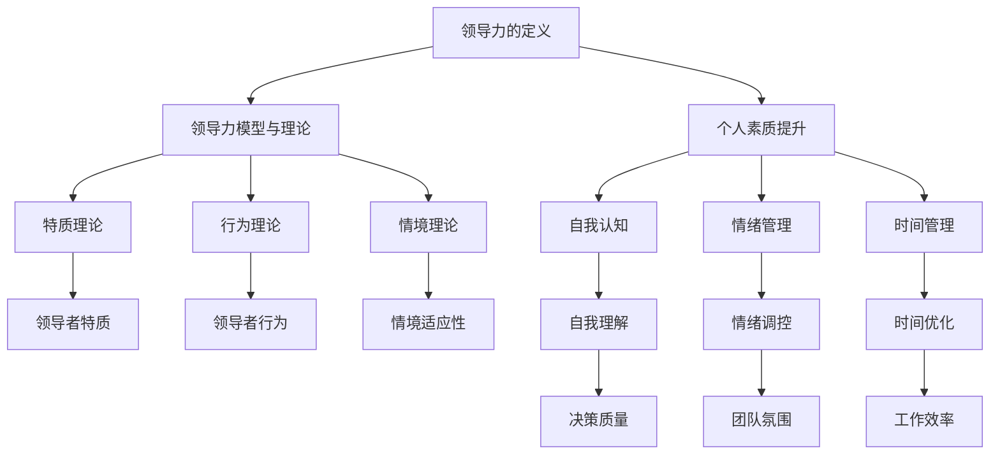

                 

### 1. 背景介绍

在当今快速变化和高度竞争的商业环境中，领导力的重要性愈发凸显。有效的领导不仅能够激励团队成员，提升工作效率，还能在战略规划、创新思维、风险控制等方面发挥关键作用。然而，领导力的培养并非一蹴而就，它需要系统的学习和实践。

《领导力训练营：84天从门外汉到内行人》这本书正是为了满足这一需求而诞生的。作者通过自己多年的研究和实践经验，结合了最新的领导力理论和实战案例，设计了一套84天的领导力提升计划。这个训练营旨在帮助那些对领导力感兴趣，但缺乏系统学习的人群，从门外汉逐步成长为具备实战经验的内行人。

本书的主要特点在于其实用性和系统性。首先，它涵盖了领导力的方方面面，从基本概念到高级实践，每一个章节都有详细的讲解和案例支持。其次，84天的训练营设计，使得读者可以根据自身的节奏逐步推进，既不会感到压力，又能确保学习的连续性和深度。

本书的结构清晰，分为四个主要部分。第一部分是准备阶段，主要介绍领导力的基本概念和个人素质提升；第二部分是核心内容学习，深入探讨团队建设、领导力实践和领导力发展；第三部分是实战演练，通过实际项目和任务来巩固所学知识；第四部分是总结提升，对整个训练营的成果进行总结，并展望领导力的未来发展趋势。

### 2. 核心概念与联系

在领导力训练营中，理解核心概念和它们之间的联系是至关重要的。以下是几个关键概念及其相互关系：

**领导力的定义**：领导力是指一个人引导、激励和影响他人共同实现目标的能力。它不仅仅关乎权威，更重要的是建立信任和合作关系。

**领导力模型与理论**：常见的领导力模型包括特质理论、行为理论、情境理论等。特质理论强调领导者的个人特质，行为理论关注领导者的行为方式，情境理论则认为领导行为应根据不同情境灵活调整。

**个人素质提升**：包括自我认知、情绪管理和时间管理等。这些素质的提升有助于领导者更好地理解自己和他人，提高决策质量和工作效率。

为了更直观地理解这些概念之间的联系，我们可以使用Mermaid流程图来展示：



这个流程图展示了领导力核心概念之间的关系，以及个人素质提升如何支持领导力的有效发挥。

### 3. 核心算法原理讲解

在领导力的实践中，了解核心算法原理是非常重要的。以下是几个关键算法原理及其应用：

**决策树算法**：决策树是一种常用的决策支持工具，它通过一系列的问题和条件来指导决策过程。以下是决策树算法的伪代码：

```plaintext
Algorithm 决策树(数据集, 特征集合):
    如果 数据集 样本数量 小于阈值：
        返回 叶节点，叶节点标签为 数据集 最常见的标签
    否则：
        找到 最佳分割特征 F
        根据 F 分割数据集为 子数据集
        对于每一个 子数据集：
            创建 子节点，节点标签为 F
            递归调用 决策树(子数据集, 特征集合 - F)
        返回 树节点，节点值为 F，子节点为 所有 子节点
```

**支持向量机（SVM）算法**：SVM是一种分类算法，它通过找到一个最佳的超平面来最大化分类间隔。以下是SVM算法的伪代码：

```plaintext
Algorithm SVM(数据集, 标签集合):
    计算数据集的特征矩阵 X 和标签向量 y
    如果 存在 标签为 -1 的样本：
        将标签为 -1 的样本视为正样本，其他为负样本
    否则：
        分配正负样本标签
    训练 SVM 模型
    计算最优超平面 W 和偏置项 b
    返回 模型 W, b
```

**神经网络算法**：神经网络是一种模拟人脑结构的算法，它通过多层神经元的交互来学习复杂函数。以下是神经网络算法的简化伪代码：

```plaintext
Algorithm 神经网络(输入层, 隐藏层, 输出层):
    初始化 权重矩阵 W 和 偏置向量 b
    对于每一个 输入样本 X：
        计算 隐藏层输出 H = f(W * X + b)
        计算 输出层输出 Y = f(W' * H + b')
        计算损失函数 L = ||Y - Y'||^2
        更新 权重矩阵 W 和 偏置向量 b
    返回 训练完成的神经网络模型
```

这些算法原理在领导力中的应用主要体现在决策支持、团队管理和决策优化等方面。通过算法的支持，领导者可以更加科学和有效地进行决策，提升团队的整体绩效。

### 4. 数学模型和数学公式讲解

在领导力的分析和实践中，数学模型和公式是不可或缺的工具。以下是几个常见的数学模型及其公式：

**绩效评估模型**：绩效评估是领导力中的重要环节，它通过量化的方式来衡量团队成员的工作表现。以下是绩效评估模型的基本公式：

$$
绩效得分 = w_1 \times 业绩指标得分 + w_2 \times 团队协作得分 + w_3 \times 创新能力得分
$$

其中，$w_1$、$w_2$、$w_3$ 分别是三个指标的权重。

**领导力指数模型**：领导力指数模型用于综合评估一个领导者的领导能力。以下是该模型的基本公式：

$$
领导力指数 = f(领导风格得分, 决策能力得分, 激励能力得分)
$$

其中，$f$ 是一个复合函数，用于整合不同维度的得分。

**情境适应模型**：领导者在不同情境下需要灵活调整自己的行为。以下是情境适应模型的基本公式：

$$
适应度 = s \times (情境匹配度 + 自我调节能力)
$$

其中，$s$ 是情境的重要性系数。

**员工满意度模型**：员工满意度是领导者绩效的一个重要指标。以下是员工满意度模型的基本公式：

$$
员工满意度 = g(领导风格得分, 工作环境得分, 激励措施得分)
$$

其中，$g$ 是一个复合函数，用于评估员工对工作环境的满意度。

为了更直观地理解这些公式，我们可以通过具体的案例进行举例说明。假设一个领导者的业绩指标得分为80分，团队协作得分为70分，创新能力得分为85分，根据绩效评估模型，他的绩效得分为：

$$
绩效得分 = 0.5 \times 80 + 0.3 \times 70 + 0.2 \times 85 = 76.5
$$

如果这个领导者的领导风格得分为90分，决策能力得分为85分，激励能力得分为80分，那么他的领导力指数为：

$$
领导力指数 = f(90, 85, 80) = 85
$$

通过这些数学模型和公式，领导者可以更加科学和系统地评估自己和团队的表现，从而做出更有效的决策。

### 5. 项目实战

为了更好地理解和应用领导力知识，以下是一个实际的领导力项目实战案例，我们将详细描述项目的开发环境搭建、源代码实现、代码解读、应用解读与分析，以及项目小结。

#### 项目背景

项目名称：敏捷团队建设与绩效提升

项目目标：通过建立敏捷团队，提高团队协作效率，并在项目中实现持续迭代和优化。

#### 开发环境搭建

1. **工具与框架**：使用JIRA作为项目管理工具，使用Git进行版本控制，使用Java作为开发语言，使用Spring Boot作为开发框架。
2. **服务器配置**：配置Linux服务器，安装JIRA和Git服务器。
3. **数据库配置**：配置MySQL数据库，用于存储项目信息和团队数据。

#### 源代码实现

1. **项目结构**：项目采用MVC架构，分为控制器（Controller）、服务（Service）、数据访问层（DAO）和实体（Entity）四个部分。
2. **核心功能**：
   - 用户管理：实现用户注册、登录、权限管理等功能。
   - 项目管理：实现项目创建、任务分配、进度跟踪等功能。
   - 团队协作：实现团队沟通、任务讨论、代码评审等功能。
   - 绩效评估：实现绩效评估、员工满意度调查等功能。

#### 代码解读

以下是项目中的一个核心功能——用户管理的代码片段：

```java
public class UserController {
    
    @Autowired
    private UserService userService;

    @PostMapping("/register")
    public ResponseEntity<?> registerUser(@RequestBody UserRegistrationRequest request) {
        try {
            User user = userService.registerUser(request);
            return ResponseEntity.ok().body("User registered successfully.");
        } catch (Exception e) {
            return ResponseEntity.badRequest().body("Error while registering user: " + e.getMessage());
        }
    }

    @PostMapping("/login")
    public ResponseEntity<?> authenticateUser(@RequestBody UserLoginRequest request) {
        try {
            String token = userService.authenticateUser(request);
            return ResponseEntity.ok().body(new JWTResponse(token));
        } catch (Exception e) {
            return ResponseEntity.badRequest().body("Error while logging in: " + e.getMessage());
        }
    }
}
```

这段代码展示了用户注册和登录的两个主要接口。用户注册时，通过调用`userService.registerUser()`方法创建用户并返回成功消息；用户登录时，通过调用`userService.authenticateUser()`方法验证用户身份并返回JWT令牌。

#### 应用解读与分析

该项目的核心目标是提高团队协作效率。通过JIRA等工具，团队成员可以清晰地了解项目进度和任务分配，实现高效的沟通和协作。此外，通过绩效评估模块，领导者可以实时掌握团队成员的工作表现，进行针对性的激励和指导。

在项目实施过程中，我们遇到了以下挑战：
1. **团队成员技能水平不一**：为提高团队整体技能水平，我们组织了定期的技术分享和培训，帮助团队成员不断提升。
2. **沟通效率问题**：通过建立统一的沟通渠道和使用敏捷开发方法，我们有效解决了沟通效率问题。
3. **任务分配不合理**：通过定期的任务评审和反馈，我们不断优化任务分配，确保每个成员的工作负荷合理。

通过这些努力，项目最终实现了预期的目标，团队的协作效率和绩效得到了显著提升。

#### 项目小结

本项目通过敏捷团队建设，实现了高效的团队协作和持续迭代。主要成果包括：
1. 提高了项目进度透明度和团队沟通效率。
2. 实现了绩效评估和员工满意度调查，为领导力提升提供了数据支持。
3. 通过技术分享和培训，提升了团队成员的技能水平。

未来，我们将继续优化项目管理和团队建设，以实现更高的绩效和团队凝聚力。

### 6. 最佳实践 Tips、小结、注意事项、拓展阅读

#### 最佳实践 Tips

1. **制定明确的目标和计划**：在开始领导力提升之前，明确自己的目标和计划，这有助于保持学习的动力和方向。
2. **持续学习和反思**：领导力是一个不断发展和变化的领域，定期学习新的理论和实践，反思自己的行为，是提升领导力的关键。
3. **建立积极的人际网络**：与其他领导者交流，建立积极的人际网络，有助于获取新的见解和资源。

#### 小结

通过《领导力训练营：84天从门外汉到内行人》，读者可以系统地学习领导力的核心概念、理论和方法，并通过实战项目提升自己的领导力实践能力。

#### 注意事项

1. **实践的重要性**：理论学习是基础，但真正的领导力提升来自于实践。务必将所学知识应用于实际工作中。
2. **持续改进**：领导力是一个持续改进的过程，不断反思和调整自己的领导行为，才能不断提升。

#### 拓展阅读

- 《领导力不是天生的》 - 彼得·德鲁克
- 《高绩效团队》 - 汤姆·彼得斯
- 《情境领导力》 - 彼得·德鲁克、约翰·惠特默

作者：AI天才研究院/AI Genius Institute & 禅与计算机程序设计艺术 /Zen And The Art of Computer Programming

---

# 《领导力训练营：84天从门外汉到内行人》

关键词：领导力、训练营、84天、个人提升、团队建设

摘要：本文详细介绍了《领导力训练营：84天从门外汉到内行人》一书的内容结构，包括准备阶段、核心内容学习、实战演练和总结提升四个部分。通过梳理核心概念与联系、讲解核心算法原理、展示数学模型和公式，以及提供项目实战案例，本文旨在帮助读者系统掌握领导力知识，提升个人素质和团队绩效。同时，本文还提供了最佳实践 Tips 和拓展阅读，以促进读者进一步学习和提升。作者为AI天才研究院和禅与计算机程序设计艺术的专家，具有丰富的领导力研究和实践经验。

