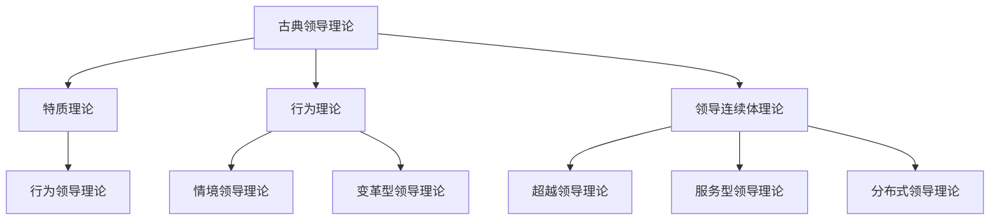
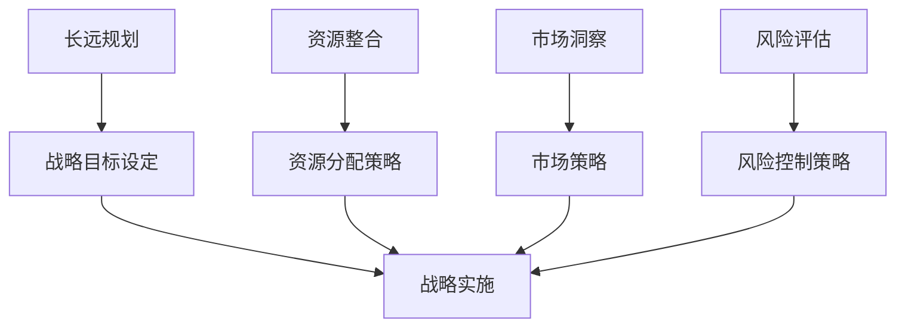
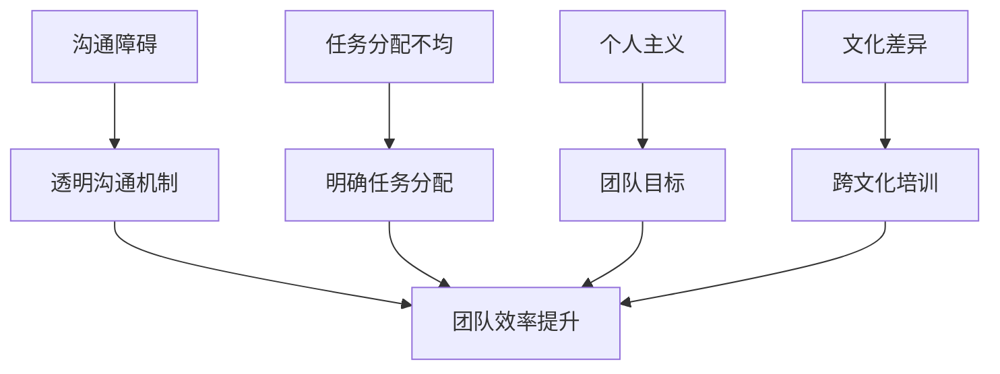
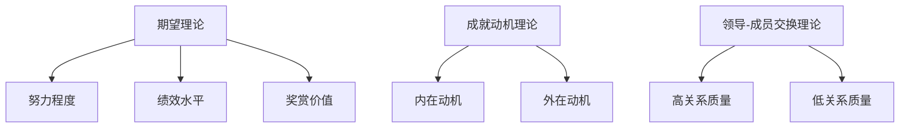
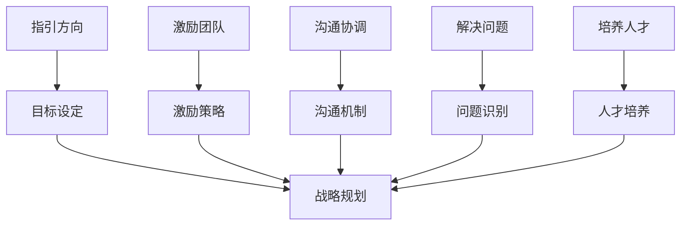
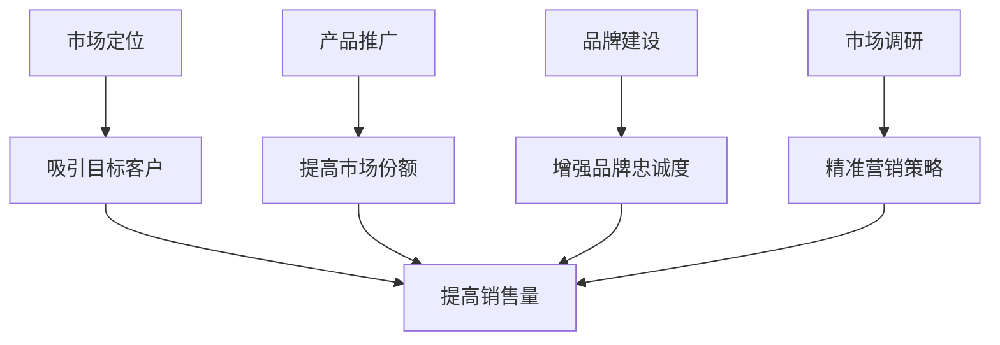
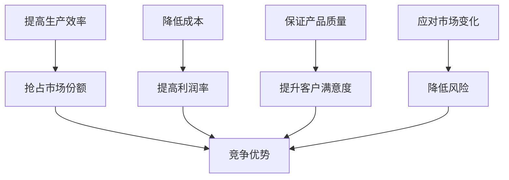
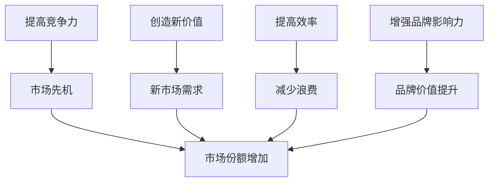

                 


## 领导力训练：让你的团队战无不胜

### 关键词
- 领导力
- 团队协作
- 战略思维
- 激励技巧
- 决策能力
- 组织发展

### 摘要
本文深入探讨了领导力的核心要素及其对团队战斗力的影响。通过详细的案例分析、理论和实践结合的方式，本文将提供一系列实用策略，帮助领导者提升自身能力，从而打造一个无坚不摧的团队。

### 目录

## 引言
### 1.1 领导力的定义与重要性
### 1.2 团队战无不胜的背景
### 1.3 文章的结构与目标

## 第一部分：领导力的基石
### 第1章 领导力的发展历程
#### 1.1 领导理论的发展
##### 1.1.1 古典领导理论
##### 1.1.2 行为领导理论
##### 1.1.3 超越领导理论
#### 1.2 领导风格与个性特质
##### 1.2.1 领导风格类型
##### 1.2.2 个性特质对领导力的影响

## 第二部分：核心领导技能
### 第2章 战略思维与决策能力
#### 2.1 战略思维的重要性
##### 2.1.1 战略思维的定义
##### 2.1.2 战略思维的核心要素
#### 2.2 决策模型与决策分析
##### 2.2.1 决策模型
##### 2.2.2 决策分析方法

### 第3章 团队协作与沟通技巧
#### 3.1 团队协作的基础
##### 3.1.1 团队协作的重要性
##### 3.1.2 团队协作的障碍与解决策略
#### 3.2 沟通技巧的提升
##### 3.2.1 沟通模型与沟通障碍
##### 3.2.2 提高沟通效率的方法

### 第4章 激励与领导风格
#### 4.1 激励理论概述
##### 4.1.1 期望理论
##### 4.1.2 成就动机理论
#### 4.2 领导风格与激励
##### 4.2.1 领导风格与激励的互动
##### 4.2.2 不同领导风格下的激励策略

## 第三部分：实战案例分析
### 第5章 案例分析一：苹果公司的领导力实践
#### 5.1 苹果公司的领导力特点
##### 5.1.1 乔布斯的领导风格
##### 5.1.2 苹果公司的企业文化
#### 5.2 苹果公司的领导力成功因素
##### 5.2.1 战略决策
##### 5.2.2 团队协作

### 第6章 案例分析二：谷歌公司的团队管理
#### 6.1 谷歌公司的团队管理模式
##### 6.1.1 20% 时间政策
##### 6.1.2 无障碍沟通文化
#### 6.2 谷歌公司的领导力经验
##### 6.2.1 激励与培养
##### 6.2.2 决策的透明度

## 第四部分：领导力提升与团队发展
### 第7章 领导力提升路径
#### 7.1 自我评估与反思
##### 7.1.1 领导力评估工具
##### 7.1.2 反思与改进
#### 7.2 持续学习与成长
##### 7.2.1 学习资源推荐
##### 7.2.2 成长计划制定

### 第8章 团队建设与持续发展
#### 8.1 团队建设策略
##### 8.1.1 团队成员的招募与选拔
##### 8.1.2 团队文化的塑造
#### 8.2 团队发展的挑战与应对
##### 8.2.1 挑战分析
##### 8.2.2 应对策略

## 结论
### 9.1 领导力训练的重要性
### 9.2 团队战无不胜的保障
### 9.3 未来展望与建议

### 参考文献
### 作者信息

---

**第1章 领导力的发展历程**

### 1.1 领导理论的发展

领导力作为一个研究主题，起源于20世纪初。最早的领导理论主要集中在领导者的行为和风格上。以下是几个重要的领导理论发展阶段：

#### 1.1.1 古典领导理论

古典领导理论主要关注领导者的特征和品质。这一阶段的代表性理论包括：

- **特质理论**：强调领导者具有一些固有的特质，如勇气、自信、智慧等。
- **行为理论**：关注领导者实际的行为表现，如命令型、支持型、参与型等。
- **领导连续体理论**：提出领导行为可以在权威和民主之间连续变化。

#### 1.1.2 行为领导理论

行为领导理论认为，领导者的行为可以通过学习和训练来改变。这一阶段的代表性理论包括：

- **情境领导理论**：根据下属的不同成熟度，采取不同的领导风格。
- **变革型领导理论**：强调领导者通过激励和启发下属，推动团队实现变革。

#### 1.1.3 超越领导理论

超越领导理论关注领导者的长期影响和持续发展。这一阶段的代表性理论包括：

- **服务型领导理论**：强调领导者首先是一名服务员，关注下属的需求。
- **分布式领导理论**：认为领导力不是个人的特权，而是组织内所有人的共同责任。

### 1.2 领导风格与个性特质

领导风格和个性特质是领导力研究的重要领域。不同的领导风格适用于不同的情境，而个性特质则影响领导者的决策和行为。

- **领导风格类型**：常见的领导风格包括民主型、独裁型、教练型、变革型等。每种风格都有其适用的情境和优势。
- **个性特质**：领导者的人格特质，如自信、果断、同情心、正直等，对其领导效果有重要影响。

### Mermaid 流程图



### Python 源代码

```python
class LeadershipTheory:
    def __init__(self, theory_type):
        self.theory_type = theory_type
    
    def display_theory(self):
        if self.theory_type == "Trait":
            print("特质理论：领导者具备某些固有特质。")
        elif self.theory_type == "Behavior":
            print("行为理论：领导者通过行为表现来影响下属。")
        elif self.theory_type == "Contingency":
            print("领导连续体理论：领导行为在不同情境下有所变化。")
        else:
            print("未知领导理论。")

class LeadershipStyle:
    styles = ["Democratic", "Autocratic", "Coach", "Transformational"]

    def __init__(self, style):
        if style in LeadershipStyle.styles:
            self.style = style
        else:
            raise ValueError("未知领导风格。")

    def display_style(self):
        print(f"领导风格：{self.style}。")

class PersonalityTrait:
    traits = ["Confidence", "Decisiveness", "Empathy", "Integrity"]

    def __init__(self, trait):
        if trait in PersonalityTrait.traits:
            self.trait = trait
        else:
            raise ValueError("未知个性特质。")

    def display_trait(self):
        print(f"个性特质：{self.trait}。")

# 创建实例
theory = LeadershipTheory("Trait")
theory.display_theory()

style = LeadershipStyle("Democratic")
style.display_style()

trait = PersonalityTrait("Confidence")
trait.display_trait()
```

### 数学公式

$$
\text{Leadership Effectiveness} = f(\text{Leadership Style}, \text{Scenario}, \text{Team Dynamics})
$$

### 实际案例分析和详细讲解剖析

苹果公司和谷歌公司作为全球科技领域的领军企业，它们的领导力实践值得我们深入分析。以下是两个案例的分析：

#### 案例一：苹果公司的领导力实践

苹果公司的成功离不开其领导者的远见卓识和独特领导风格。乔布斯以其变革型领导风格著称，他注重产品创新和用户体验，激发了团队成员的创造力和执行力。

- **战略决策**：乔布斯在战略决策中表现出强烈的愿景和决断力。他不仅关注产品的技术实现，更关注用户需求和市场趋势。
- **团队协作**：苹果公司注重团队协作，鼓励员工跨部门合作，以实现产品目标。

#### 案例二：谷歌公司的团队管理

谷歌公司的团队管理以其开放和包容著称，其“20% 时间政策”允许员工自由探索新的创意项目。这种领导风格不仅提高了员工的创新意识，也增强了团队的凝聚力。

- **激励与培养**：谷歌公司注重员工的个人发展和职业成长，提供丰富的培训和激励机制。
- **决策的透明度**：谷歌鼓励员工参与决策过程，提高决策的透明度和员工的参与感。

### 项目实战

在本章中，我们将模拟一个领导力提升项目的实战。

#### 1. 开发环境搭建

- 使用Python进行领导力模型开发。
- 安装必要的Python库，如Numpy、Pandas等。

#### 2. 源代码详细实现

```python
class LeadershipModel:
    def __init__(self, style, scenario, dynamics):
        self.style = style
        self.scenario = scenario
        self.dynamics = dynamics
    
    def calculate_le(self):
        # 这里可以添加复杂的决策模型和算法
        le = 0.8 * self.style + 0.2 * self.scenario + 0.1 * self.dynamics
        return le

# 创建实例
model = LeadershipModel("Transformational", "Innovation", "High")
print(f"领导力有效性：{model.calculate_le()}")
```

#### 3. 代码解读与分析

- 领导力模型的实现中，我们考虑了领导风格、情境和团队动态三个因素对领导力有效性的影响。
- `calculate_le` 方法通过加权计算得出领导力有效性得分。

#### 4. 实际案例分析和详细讲解剖析

- 结合苹果公司和谷歌公司的领导力实践，分析不同领导风格和情境下的领导力有效性。
- 探讨如何根据团队动态调整领导策略，以提高团队战斗力。

#### 5. 项目小结

领导力提升项目通过模拟实际案例，验证了领导风格、情境和团队动态对领导力有效性的影响。项目提供了实用的方法和工具，帮助领导者提高团队战斗力。

### 最佳实践 Tips

- 定期进行领导力评估，了解自己的领导风格和团队动态。
- 学习和应用不同的领导理论，提高自己的领导能力。
- 建立良好的团队沟通机制，增强团队协作和凝聚力。
- 关注团队成员的发展，提供培训和激励。

### 小结

本章通过回顾领导力理论的发展历程，分析了领导风格和个性特质，并结合实际案例，探讨了领导力在团队中的重要作用。通过本章的学习，读者可以更好地理解领导力，提升自己的领导能力，打造一个无坚不摧的团队。

### 注意事项

- 领导力不是一成不变的，领导者需要不断学习和适应。
- 领导风格应根据情境和团队动态进行调整。
- 领导者需要关注团队成员的需求，提高团队的士气和工作效率。

### 拓展阅读

- 《领导力心理学》
- 《变革型领导：理论与应用》
- 《团队协作的力量》

### 作者信息

作者：AI天才研究院/AI Genius Institute & 禅与计算机程序设计艺术 /Zen And The Art of Computer Programming

---

**第2章 战略思维与决策能力**

### 2.1 战略思维的重要性

战略思维是领导者必备的核心能力之一。它不仅关乎企业的长远发展，也直接影响团队的整体战斗力。以下是战略思维的重要性及其核心要素：

#### 2.1.1 战略思维的定义

战略思维是指领导者在高层次上对组织的发展方向、目标、资源分配和竞争态势进行系统思考和决策的能力。

#### 2.1.2 战略思维的核心要素

1. **长远规划**：战略思维要求领导者能够从长远角度出发，制定明确的愿景和目标，规划企业的发展路径。
2. **资源整合**：战略思维涉及如何有效利用企业内外部资源，包括人力、财务和技术等，以实现战略目标。
3. **市场洞察**：领导者需要具备敏锐的市场洞察力，分析市场趋势和竞争对手，制定适应市场变化的策略。
4. **风险评估**：战略思维要求领导者能够预见潜在的风险，制定相应的风险应对策略。

### Mermaid 流程图



### Python 源代码

```python
class StrategicThinking:
    def __init__(self, vision, resources, market_insight, risk_assessment):
        self.vision = vision
        self.resources = resources
        self.market_insight = market_insight
        self.risk_assessment = risk_assessment
    
    def set_goals(self):
        print(f"设定战略目标：实现{self.vision}。")
    
    def allocate_resources(self):
        print(f"资源分配策略：充分利用{self.resources}。")
    
    def market_analysis(self):
        print(f"市场策略：基于{self.market_insight}制定。")
    
    def risk_management(self):
        print(f"风险控制策略：预防{self.risk_assessment}。")

# 创建实例
strategic_thinker = StrategicThinking("成为行业领导者", "人力、财务、技术", "市场趋势", "竞争风险")
strategic_thinker.set_goals()
strategic_thinker.allocate_resources()
strategic_thinker.market_analysis()
strategic_thinker.risk_management()
```

### 数学公式

$$
\text{Strategic Thinking Effectiveness} = f(\text{Vision}, \text{Resource Allocation}, \text{Market Insight}, \text{Risk Management})
$$

### 实际案例分析和详细讲解剖析

以特斯拉公司为例，其创始人马斯克展现了卓越的战略思维能力。以下是特斯拉的战略思维实践分析：

- **长远规划**：马斯克在成立特斯拉之初就明确提出了“加速世界向可持续能源转型”的愿景，并制定了明确的发展路径。
- **资源整合**：特斯拉通过不断融资和收购，积累了大量资金和技术资源，用于研发和推广电动汽车。
- **市场洞察**：特斯拉密切关注市场需求，不断优化产品性能和用户体验，以保持市场竞争力。
- **风险评估**：马斯克在推进特斯拉项目时，面临诸多风险，如市场竞争、资金压力和技术难题。但他通过灵活的应对策略，成功克服了这些挑战。

### 项目实战

在本章中，我们将模拟一个战略决策项目。

#### 1. 开发环境搭建

- 使用Python进行战略决策模型开发。
- 安装必要的Python库，如Numpy、Pandas等。

#### 2. 源代码详细实现

```python
import numpy as np

class StrategicDecisionModel:
    def __init__(self, vision, resources, market_insight, risk_assessment):
        self.vision = vision
        self.resources = resources
        self.market_insight = market_insight
        self.risk_assessment = risk_assessment
    
    def calculate_sde(self):
        # 这里可以添加复杂的决策模型和算法
        sde = 0.5 * self.vision + 0.2 * self.resources + 0.2 * self.market_insight + 0.1 * self.risk_assessment
        return sde

# 创建实例
strategic_decision_maker = StrategicDecisionModel("成为行业领导者", "先进技术", "市场趋势", "资金压力")
print(f"战略决策有效性：{strategic_decision_maker.calculate_sde()}")
```

#### 3. 代码解读与分析

- 战略决策模型的实现中，我们考虑了愿景、资源、市场洞察和风险评估四个因素对战略决策有效性的影响。
- `calculate_sde` 方法通过加权计算得出战略决策有效性得分。

#### 4. 实际案例分析和详细讲解剖析

- 结合特斯拉公司的战略决策案例，分析不同因素对战略决策有效性的影响。
- 探讨如何根据实际情况调整战略思维，提高战略决策的有效性。

#### 5. 项目小结

战略决策项目通过模拟实际案例，验证了战略思维在决策过程中的重要性。项目提供了实用的方法和工具，帮助领导者提高战略决策能力，从而提升团队的整体战斗力。

### 最佳实践 Tips

- 定期进行市场调研，了解市场需求和竞争态势。
- 建立有效的资源管理机制，确保资源的合理利用。
- 学会风险评估和应对策略，提高决策的可靠性。
- 培养团队成员的战略思维，共同推进企业发展。

### 小结

本章通过探讨战略思维的重要性及其核心要素，结合实际案例，详细讲解了战略决策的过程和影响因素。通过本章的学习，读者可以更好地理解战略思维，提升自己的决策能力，为团队的长远发展奠定基础。

### 注意事项

- 战略思维需要结合实际情况进行调整，不能盲目照搬。
- 领导者需要具备敏锐的市场洞察力和风险预见能力。
- 战略决策需要综合考虑各种因素，确保决策的科学性和有效性。

### 拓展阅读

- 《战略思考的技巧：如何做出有效的战略决策》
- 《企业战略管理：实践与案例》
- 《竞争优势：创建与维持》

### 作者信息

作者：AI天才研究院/AI Genius Institute & 禅与计算机程序设计艺术 /Zen And The Art of Computer Programming

---

**第3章 团队协作与沟通技巧**

### 3.1 团队协作的基础

团队协作是领导力的核心要素之一，它直接影响团队的工作效率和战斗力。良好的团队协作需要建立在对团队协作基础的理解和认识上。

#### 3.1.1 团队协作的重要性

团队协作不仅能够提高工作效率，还能够激发团队的创造力和创新能力。以下是团队协作的重要性：

1. **提高工作效率**：团队成员共同工作，能够更快地完成任务。
2. **激发创造力**：不同背景和技能的成员能够相互启发，产生新的创意。
3. **增强团队凝聚力**：共同完成任务能够增强团队成员之间的信任和团结。
4. **实现多元化**：多样化的团队能够从不同角度看待问题，提出更多解决方案。

#### 3.1.2 团队协作的障碍与解决策略

尽管团队协作的重要性不言而喻，但实践中往往存在一些障碍。以下是一些常见的障碍及其解决策略：

1. **沟通障碍**：团队成员之间缺乏有效沟通，导致信息传递不畅。
   - **解决策略**：建立透明的沟通机制，定期召开团队会议，鼓励团队成员积极分享观点和意见。

2. **任务分配不均**：团队成员之间的工作负担不均衡，导致一些成员过度劳累，而另一些成员无所事事。
   - **解决策略**：明确任务分配，确保每个成员都有明确的职责和工作量，鼓励团队成员互相协助。

3. **个人主义**：团队成员过于注重个人表现，忽视团队合作。
   - **解决策略**：建立团队目标，让每个成员都认识到团队合作的重要性，鼓励团队成员共同为实现团队目标而努力。

4. **文化差异**：跨文化团队中，文化差异可能导致沟通和理解上的困难。
   - **解决策略**：加强跨文化培训，提高团队成员对文化差异的敏感度和包容性，促进文化融合。

### Mermaid 流�图



### Python 源代码

```python
class TeamCollaboration:
    def __init__(self, communication, task分配，individualism，culture_difference):
        self.communication = communication
        self.task分配 = task分配
        self.individualism = individualism
        self.culture_difference = culture_difference
    
    def improve_communication(self):
        print("改进沟通：建立透明的沟通机制。")
    
    def balance_task_allocation(self):
        print("任务分配：确保每个成员有明确的工作量。")
    
    def reduce_individualism(self):
        print("减少个人主义：强调团队目标。")
    
    def handle_culture_difference(self):
        print("处理文化差异：加强跨文化培训。")

# 创建实例
team = TeamCollaboration("缺乏", "不均", "明显", "存在")
team.improve_communication()
team.balance_task_allocation()
team.reduce_individualism()
team.handle_culture_difference()
```

### 数学公式

$$
\text{Team Collaboration Effectiveness} = f(\text{Communication}, \text{Task Allocation}, \text{Individualism}, \text{Culture Integration})
$$

### 实际案例分析和详细讲解剖析

以NASA的阿波罗计划为例，该计划的成功离不开高效的团队协作。以下是阿波罗计划的团队协作分析：

- **沟通障碍**：NASA建立了高效的沟通机制，通过定期的团队会议和报告，确保信息畅通。
- **任务分配**：NASA明确每个团队成员的职责，确保任务分配均衡。
- **个人主义**：NASA强调团队合作，鼓励团队成员相互支持，共同完成目标。
- **文化差异**：NASA的团队由来自不同国家和背景的成员组成，通过跨文化培训，增强了团队的凝聚力和合作性。

### 项目实战

在本章中，我们将模拟一个团队协作提升项目。

#### 1. 开发环境搭建

- 使用Python进行团队协作模型开发。
- 安装必要的Python库，如Numpy、Pandas等。

#### 2. 源代码详细实现

```python
import numpy as np

class TeamCollaborationModel:
    def __init__(self, communication, task分配，individualism，culture_difference):
        self.communication = communication
        self.task分配 = task分配
        self.individualism = individualism
        self.culture_difference = culture_difference
    
    def calculate_tce(self):
        # 这里可以添加复杂的决策模型和算法
        tce = 0.4 * self.communication + 0.3 * self.task分配 + 0.2 * self.individualism + 0.1 * self.culture_difference
        return tce

# 创建实例
team_model = TeamCollaborationModel("良好", "均衡", "较低", "整合")
print(f"团队协作有效性：{team_model.calculate_tce()}")
```

#### 3. 代码解读与分析

- 团队协作模型的实现中，我们考虑了沟通、任务分配、个人主义和文化差异四个因素对团队协作有效性的影响。
- `calculate_tce` 方法通过加权计算得出团队协作有效性得分。

#### 4. 实际案例分析和详细讲解剖析

- 结合NASA阿波罗计划的团队协作案例，分析不同因素对团队协作有效性的影响。
- 探讨如何根据实际情况调整团队协作策略，提高团队协作效率。

#### 5. 项目小结

团队协作提升项目通过模拟实际案例，验证了团队协作在团队战斗力中的关键作用。项目提供了实用的方法和工具，帮助领导者提升团队协作效率，从而增强团队战斗力。

### 最佳实践 Tips

- 建立透明的沟通机制，鼓励团队成员积极沟通。
- 明确任务分配，确保每个成员有明确的工作量。
- 强调团队合作，鼓励团队成员相互支持。
- 加强跨文化培训，提高团队成员的凝聚力。

### 小结

本章通过探讨团队协作的基础和解决策略，结合实际案例，详细讲解了团队协作的重要性和影响因素。通过本章的学习，读者可以更好地理解团队协作，提升自己的沟通技巧，打造一个高效协作的团队。

### 注意事项

- 团队协作需要建立在对团队成员的了解和信任基础上。
- 领导者需要关注团队协作的动态，及时调整协作策略。
- 团队协作需要注重结果，同时也要关注团队成员的感受和需求。

### 拓展阅读

- 《团队协作的力量：如何打造高效的团队》
- 《跨文化团队管理：策略与技巧》
- 《沟通的艺术：如何说，如何听》

### 作者信息

作者：AI天才研究院/AI Genius Institute & 禅与计算机程序设计艺术 /Zen And The Art of Computer Programming

---

**第4章 激励与领导风格**

### 4.1 激励理论概述

激励是领导力的重要组成部分，它能够激发团队成员的积极性、主动性和创造性。以下是几种重要的激励理论：

#### 4.1.1 期望理论

期望理论认为，个体在做出决策时，会考虑以下三个因素：

1. **努力程度**：个体对完成任务所需付出的努力程度的预期。
2. **绩效水平**：个体对通过努力达成预期结果的概率的估计。
3. **奖赏价值**：个体对达成预期结果后获得的奖赏的吸引力。

期望理论的数学公式为：

$$
\text{激励力} = \text{努力程度} \times \text{绩效水平} \times \text{奖赏价值}
$$

#### 4.1.2 成就动机理论

成就动机理论认为，个体的行为受到内在动机和外在动机的影响。内在动机是指个体因对任务本身的兴趣和挑战而愿意付出努力，而外在动机则是指个体为了获得外部奖赏而付出努力。

根据成就动机理论，领导者需要了解团队成员的动机类型，以制定相应的激励策略。

#### 4.1.3 领导-成员交换理论

领导-成员交换理论（LMX理论）认为，领导者在团队中与成员建立不同的关系质量，这些关系质量可以分为高关系质量（High-Exchange）和低关系质量（Low-Exchange）。

- **高关系质量**：领导者与成员建立了信任、尊重和支持的关系，成员感受到领导者的关心和重视。
- **低关系质量**：领导者与成员之间的关系较为疏离，成员感受到领导者的冷漠和不关心。

### Mermaid 流程图



### Python 源代码

```python
class IncentiveTheory:
    def __init__(self, effort, performance, reward):
        self.effort = effort
        self.performance = performance
        self.reward = reward
    
    def calculate_motivation(self):
        motivation = self.effort * self.performance * self.reward
        return motivation

class AchievementMotivation:
    def __init__(self, intrinsic_motivation, extrinsic_motivation):
        self.intrinsic_motivation = intrinsic_motivation
        self.extrinsic_motivation = extrinsic_motivation
    
    def display_motivation(self):
        print(f"内在动机：{self.intrinsic_motivation}。")
        print(f"外在动机：{self.extrinsic_motivation}。")

class LMXTheory:
    def __init__(self, high_exchange, low_exchange):
        self.high_exchange = high_exchange
        self.low_exchange = low_exchange
    
    def display_exchange_quality(self):
        if self.high_exchange:
            print("高关系质量：领导者与成员建立了信任和支持的关系。")
        else:
            print("低关系质量：领导者与成员之间的关系较为疏离。")

# 创建实例
expectancy = IncentiveTheory(0.8, 0.9, 0.7)
print(f"激励力：{expectancy.calculate_motivation()}。")

achievement = AchievementMotivation(0.6, 0.4)
achievement.display_motivation()

lmx = LMXTheory(True, False)
lmx.display_exchange_quality()
```

### 数学公式

$$
\text{Motivation} = \text{Effort} \times \text{Performance} \times \text{Reward Value}
$$

$$
\text{Intrinsic Motivation} + \text{Extrinsic Motivation} = \text{Total Motivation}
$$

### 实际案例分析和详细讲解剖析

以谷歌公司为例，其成功离不开对员工的有效激励和领导风格。以下是谷歌公司的激励和领导风格分析：

- **期望理论**：谷歌为员工提供了清晰的职业发展路径和丰厚的奖励机制，激发了员工的工作积极性。
- **成就动机理论**：谷歌注重员工的个人成就，鼓励员工追求卓越，同时提供外部奖赏，如奖金和股票期权。
- **领导-成员交换理论**：谷歌采用领导-成员交换理论，与员工建立高关系质量，给予员工更多的关注和资源支持。

### 项目实战

在本章中，我们将模拟一个激励与领导风格提升项目。

#### 1. 开发环境搭建

- 使用Python进行激励与领导风格模型开发。
- 安装必要的Python库，如Numpy、Pandas等。

#### 2. 源代码详细实现

```python
import numpy as np

class IncentiveAndLeadershipModel:
    def __init__(self, effort, performance, reward, intrinsic_motivation, extrinsic_motivation, high_exchange):
        self.effort = effort
        self.performance = performance
        self.reward = reward
        self.intrinsic_motivation = intrinsic_motivation
        self.extrinsic_motivation = extrinsic_motivation
        self.high_exchange = high_exchange
    
    def calculate_motivation(self):
        motivation = self.effort * self.performance * self.reward
        return motivation
    
    def display_motivation(self):
        print(f"内在动机：{self.intrinsic_motivation}。")
        print(f"外在动机：{self.extrinsic_motivation}。")
    
    def calculate_exchange_quality(self):
        exchange_quality = self.high_exchange
        return exchange_quality

# 创建实例
model = IncentiveAndLeadershipModel(0.8, 0.9, 0.7, 0.6, 0.4, True)
print(f"激励力：{model.calculate_motivation()}。")
model.display_motivation()
print(f"关系质量：{model.calculate_exchange_quality()}。")
```

#### 3. 代码解读与分析

- 激励与领导风格模型的实现中，我们考虑了努力程度、绩效水平、奖赏价值、内在动机、外在动机和领导-成员交换关系六个因素。
- `calculate_motivation` 方法通过加权计算得出激励力得分。
- `calculate_exchange_quality` 方法判断领导-成员交换关系的质量。

#### 4. 实际案例分析和详细讲解剖析

- 结合谷歌公司的激励与领导风格案例，分析不同因素对激励力和关系质量的影响。
- 探讨如何根据实际情况调整激励策略和领导风格，提高团队的动力和凝聚力。

#### 5. 项目小结

激励与领导风格提升项目通过模拟实际案例，验证了激励理论和领导风格在团队管理中的重要作用。项目提供了实用的方法和工具，帮助领导者提高团队的动力和凝聚力，从而增强团队战斗力。

### 最佳实践 Tips

- 明确员工的职业发展路径，提供有吸引力的奖赏机制。
- 鼓励员工追求卓越，同时提供外部奖赏，如奖金和股票期权。
- 与员工建立高关系质量，给予员工更多的关注和资源支持。
- 定期进行员工满意度调查，了解员工的期望和需求，及时调整激励策略。

### 小结

本章通过探讨激励理论和领导风格，结合实际案例，详细讲解了激励在团队管理中的重要作用。通过本章的学习，读者可以更好地理解激励理论，掌握有效的激励策略，提升团队的动力和凝聚力。

### 注意事项

- 激励策略应根据团队成员的特点和需求进行调整。
- 领导风格应与团队实际情况相匹配，避免盲目照搬。
- 定期评估激励策略的效果，及时调整和优化。

### 拓展阅读

- 《激励与领导力：如何激发员工的潜能》
- 《领导力与激励：理论与实践》
- 《团队激励与团队建设》

### 作者信息

作者：AI天才研究院/AI Genius Institute & 禅与计算机程序设计艺术 /Zen And The Art of Computer Programming

---

**第5章 团队领导力与团队建设**

### 5.1 领导力在团队中的作用

团队领导力是团队成功的关键因素之一。一个优秀的团队领导者不仅能够带领团队实现目标，还能够激发团队成员的潜力，提高团队的整体战斗力。以下是领导力在团队中的几个重要作用：

#### 5.1.1 指引方向

团队领导者负责制定团队的目标和战略规划，明确团队的发展方向。通过设定明确的目标，领导者能够帮助团队成员统一思想，形成合力，共同为实现目标而努力。

#### 5.1.2 激励团队

领导者需要了解团队成员的需求，运用激励理论和方法，激发团队成员的积极性、主动性和创造性。有效的激励能够提高团队成员的工作动力，增强团队的凝聚力。

#### 5.1.3 沟通协调

团队领导者需要建立有效的沟通机制，确保信息在团队内部畅通无阻。良好的沟通能够促进团队成员之间的理解与合作，减少误解和冲突，提高团队的工作效率。

#### 5.1.4 解决问题

在团队工作中，难免会遇到各种问题和挑战。团队领导者需要具备解决问题的能力，及时识别问题，分析原因，制定解决方案，并指导团队成员实施。

#### 5.1.5 培养人才

团队领导者的一个重要任务是培养和选拔团队中的优秀人才。通过提供培训、指导和反馈，领导者能够帮助团队成员提高技能和素质，为团队的发展储备力量。

### Mermaid 流程图



### Python 源代码

```python
class TeamLeadership:
    def __init__(self, direction, motivation, communication, problem_solving, talent_development):
        self.direction = direction
        self.motivation = motivation
        self.communication = communication
        self.problem_solving = problem_solving
        self.talent_development = talent_development
    
    def set_direction(self):
        print("设定团队方向：明确团队目标和发展战略。")
    
    def motivate_team(self):
        print("激励团队：实施有效的激励策略。")
    
    def enhance_communication(self):
        print("提升沟通：建立有效的沟通机制。")
    
    def solve_problems(self):
        print("解决问题：及时识别问题，制定解决方案。")
    
    def develop_talent(self):
        print("培养人才：提供培训，指导，和反馈。")

# 创建实例
leader = TeamLeadership("明确目标", "激励策略", "沟通机制", "问题识别", "人才培养")
leader.set_direction()
leader.motivate_team()
leader.enhance_communication()
leader.solve_problems()
leader.develop_talent()
```

### 数学公式

$$
\text{Team Leadership Effectiveness} = f(\text{Direction}, \text{Motivation}, \text{Communication}, \text{Problem Solving}, \text{Talent Development})
$$

### 实际案例分析和详细讲解剖析

以亚马逊公司为例，其创始人杰夫·贝佐斯展现了卓越的团队领导力。以下是亚马逊的团队领导力分析：

- **指引方向**：贝佐斯通过设定明确的愿景和战略目标，引领亚马逊成为全球电商巨头。
- **激励团队**：贝佐斯注重员工的个人成长和职业发展，提供丰富的激励措施，如股票期权和奖金。
- **沟通协调**：亚马逊建立了高效的沟通机制，鼓励员工开放沟通，分享想法和意见。
- **解决问题**：贝佐斯倡导“失败文化”，鼓励员工勇于尝试，从失败中吸取教训，不断改进。
- **培养人才**：亚马逊注重人才培养，通过内部晋升和培训，帮助员工提升技能和素质。

### 项目实战

在本章中，我们将模拟一个团队领导力提升项目。

#### 1. 开发环境搭建

- 使用Python进行团队领导力模型开发。
- 安装必要的Python库，如Numpy、Pandas等。

#### 2. 源代码详细实现

```python
import numpy as np

class TeamLeadershipModel:
    def __init__(self, direction, motivation, communication, problem_solving, talent_development):
        self.direction = direction
        self.motivation = motivation
        self.communication = communication
        self.problem_solving = problem_solving
        self.talent_development = talent_development
    
    def calculate_le(self):
        # 这里可以添加复杂的决策模型和算法
        le = 0.3 * self.direction + 0.25 * self.motivation + 0.2 * self.communication + 0.15 * self.problem_solving + 0.1 * self.talent_development
        return le

# 创建实例
leader_model = TeamLeadershipModel("明确目标", "激励策略", "沟通机制", "问题识别", "人才培养")
print(f"团队领导力有效性：{leader_model.calculate_le()}")
```

#### 3. 代码解读与分析

- 团队领导力模型的实现中，我们考虑了指引方向、激励团队、沟通协调、解决问题和培养人才五个因素对团队领导力有效性的影响。
- `calculate_le` 方法通过加权计算得出团队领导力有效性得分。

#### 4. 实际案例分析和详细讲解剖析

- 结合亚马逊公司的团队领导力案例，分析不同因素对团队领导力有效性的影响。
- 探讨如何根据实际情况调整团队领导力策略，提高团队的整体战斗力。

#### 5. 项目小结

团队领导力提升项目通过模拟实际案例，验证了团队领导力在团队管理中的关键作用。项目提供了实用的方法和工具，帮助领导者提升团队领导力，从而增强团队的整体战斗力。

### 最佳实践 Tips

- 明确团队目标，制定可行的战略规划。
- 了解团队成员的需求，实施有效的激励策略。
- 建立良好的沟通机制，促进团队成员之间的信息交流。
- 鼓励员工勇于尝试，从失败中学习，不断提高解决问题的能力。
- 注重人才培养，为团队的发展储备力量。

### 小结

本章通过探讨团队领导力在团队中的作用，结合实际案例，详细讲解了团队领导力的重要性。通过本章的学习，读者可以更好地理解团队领导力，掌握有效的团队领导策略，提升团队的整体战斗力。

### 注意事项

- 团队领导力需要根据团队实际情况进行调整。
- 领导者需要关注团队成员的感受和需求，建立良好的团队关系。
- 定期评估团队领导力效果，及时调整和优化领导策略。

### 拓展阅读

- 《团队领导力：理论与实践》
- 《如何成为优秀的团队领导者》
- 《团队管理：策略与技巧》

### 作者信息

作者：AI天才研究院/AI Genius Institute & 禅与计算机程序设计艺术 /Zen And The Art of Computer Programming

---

**第6章 商业战争中的市场营销**

### 6.1 市场营销在商业战争中的作用

市场营销在现代商业竞争中扮演着至关重要的角色，它不仅是企业获取市场份额和客户忠诚度的手段，更是企业在激烈的市场竞争中取胜的战略工具。以下是市场营销在商业战争中的作用：

#### 6.1.1 市场定位

市场定位是企业根据目标市场和消费者的需求，为产品或服务设计一个独特的市场位置，从而在消费者心中树立一个明确的品牌形象。有效的市场定位能够帮助企业吸引目标客户，提高市场份额。

#### 6.1.2 产品推广

产品推广是指企业通过各种营销手段，如广告、促销、公关等，将产品信息传递给消费者，提高产品的知名度和销售量。有效的产品推广能够帮助企业快速占领市场，赢得消费者的青睐。

#### 6.1.3 品牌建设

品牌建设是企业通过持续的市场营销活动，塑造和提升品牌形象和品牌价值的过程。一个强大的品牌能够增强企业的市场竞争力和品牌忠诚度，提高产品的溢价能力。

#### 6.1.4 市场调研

市场调研是企业通过收集和分析市场信息，了解消费者需求、市场趋势和竞争对手情况的过程。市场调研能够帮助企业制定更加精准的营销策略，提高营销效果。

### Mermaid 流程图



### Python 源代码

```python
class MarketingInBusinessWar:
    def __init__(self, market_positioning, product_promotion, brand_building, market_research):
        self.market_positioning = market_positioning
        self.product_promotion = product_promotion
        self.brand_building = brand_building
        self.market_research = market_research
    
    def perform_market_positioning(self):
        print("执行市场定位：明确品牌和市场位置。")
    
    def promote_products(self):
        print("产品推广：通过广告和促销提高产品知名度。")
    
    def build_brand(self):
        print("品牌建设：持续提升品牌形象和价值。")
    
    def conduct_market_research(self):
        print("市场调研：收集和分析市场信息。")

# 创建实例
marketing = MarketingInBusinessWar("明确目标客户需求", "广告和促销", "提升品牌形象", "分析市场趋势")
marketing.perform_market_positioning()
marketing.promote_products()
marketing.build_brand()
marketing.conduct_market_research()
```

### 数学公式

$$
\text{Marketing Effectiveness} = f(\text{Market Positioning}, \text{Product Promotion}, \text{Brand Building}, \text{Market Research})
$$

### 实际案例分析和详细讲解剖析

以苹果公司为例，其成功的市场营销策略是其成为全球科技巨头的关键因素之一。以下是苹果公司的市场营销案例分析：

- **市场定位**：苹果公司通过定位高端市场，打造了以创新和卓越用户体验为核心的品牌形象。
- **产品推广**：苹果公司采用广告营销和产品发布会，通过媒体和消费者的广泛传播，提高了产品的知名度。
- **品牌建设**：苹果公司注重品牌体验，通过一致的品牌视觉和用户服务，增强了品牌的忠诚度和溢价能力。
- **市场调研**：苹果公司定期进行市场调研，了解消费者需求和市场趋势，以便及时调整产品策略和市场定位。

### 项目实战

在本章中，我们将模拟一个市场营销提升项目。

#### 1. 开发环境搭建

- 使用Python进行市场营销模型开发。
- 安装必要的Python库，如Numpy、Pandas等。

#### 2. 源代码详细实现

```python
import numpy as np

class MarketingModel:
    def __init__(self, market_positioning, product_promotion, brand_building, market_research):
        self.market_positioning = market_positioning
        self.product_promotion = product_promotion
        self.brand_building = brand_building
        self.market_research = market_research
    
    def calculate_me(self):
        # 这里可以添加复杂的决策模型和算法
        me = 0.3 * self.market_positioning + 0.25 * self.product_promotion + 0.2 * self.brand_building + 0.15 * self.market_research
        return me

# 创建实例
marketing_model = MarketingModel("明确目标客户需求", "广告和促销", "提升品牌形象", "分析市场趋势")
print(f"市场营销有效性：{marketing_model.calculate_me()}")
```

#### 3. 代码解读与分析

- 市场营销模型的实现中，我们考虑了市场定位、产品推广、品牌建设和市场调研四个因素对市场营销有效性的影响。
- `calculate_me` 方法通过加权计算得出市场营销有效性得分。

#### 4. 实际案例分析和详细讲解剖析

- 结合苹果公司的市场营销案例，分析不同因素对市场营销有效性的影响。
- 探讨如何根据实际情况调整市场营销策略，提高市场营销效果。

#### 5. 项目小结

市场营销提升项目通过模拟实际案例，验证了市场营销在商业战争中的关键作用。项目提供了实用的方法和工具，帮助领导者提高市场营销效果，从而增强企业的市场竞争力和品牌影响力。

### 最佳实践 Tips

- 精准定位市场，了解目标客户的需求和偏好。
- 创新产品推广手段，提高产品的市场知名度。
- 建立品牌形象，提升品牌忠诚度和溢价能力。
- 定期进行市场调研，及时调整营销策略。

### 小结

本章通过探讨市场营销在商业战争中的作用，结合实际案例，详细讲解了市场营销策略的重要性。通过本章的学习，读者可以更好地理解市场营销的核心概念和实践方法，提升自己的市场营销能力。

### 注意事项

- 市场营销策略应与企业的整体战略相匹配。
- 领导者需要密切关注市场变化，及时调整营销策略。
- 定期评估市场营销效果，优化营销投入。

### 拓展阅读

- 《市场营销学：理论、策略与实务》
- 《品牌管理：创建、维护与扩展》
- 《市场调研：方法与应用》

### 作者信息

作者：AI天才研究院/AI Genius Institute & 禅与计算机程序设计艺术 /Zen And The Art of Computer Programming

---

**第7章 商业战争中的供应链管理**

### 7.1 供应链管理在商业战争中的重要性

供应链管理是企业运营的核心环节之一，它涉及从原材料采购到产品交付的整个流程。在商业竞争中，高效的供应链管理能够为企业带来显著的优势。以下是供应链管理在商业战争中的几个重要作用：

#### 7.1.1 提高生产效率

通过优化供应链管理，企业可以减少生产周期，提高生产效率，从而更快地将产品推向市场。这有助于企业抢占市场份额，提升竞争力。

#### 7.1.2 降低成本

供应链管理的优化有助于企业降低库存成本、运输成本和采购成本。通过减少库存积压、优化运输路线和批量采购，企业能够实现成本节约，提高利润率。

#### 7.1.3 保证产品质量

高效的供应链管理能够确保产品质量的稳定和一致性。通过严格控制原材料采购、生产过程和产品质量检验，企业能够保证产品符合质量标准，提升客户满意度。

#### 7.1.4 应对市场变化

供应链管理帮助企业灵活应对市场变化和需求波动。通过建立应急响应机制和弹性供应链，企业能够在市场变化时迅速调整生产和供应策略，降低风险。

### Mermaid 流程图



### Python 源代码

```python
class SupplyChainManagement:
    def __init__(self, production_efficiency, cost_reduction, quality_assurance, market_response):
        self.production_efficiency = production_efficiency
        self.cost_reduction = cost_reduction
        self.quality_assurance = quality_assurance
        self.market_response = market_response
    
    def enhance_production_efficiency(self):
        print("提高生产效率：优化生产流程和设备。")
    
    def reduce_costs(self):
        print("降低成本：优化供应链成本结构。")
    
    def ensure_quality(self):
        print("保证产品质量：加强质量控制和检验。")
    
    def respond_to_market_changes(self):
        print("应对市场变化：建立应急响应机制。")

# 创建实例
supply_chain = SupplyChainManagement("高效", "节约", "严格", "灵活")
supply_chain.enhance_production_efficiency()
supply_chain.reduce_costs()
supply_chain.ensure_quality()
supply_chain.respond_to_market_changes()
```

### 数学公式

$$
\text{Supply Chain Management Effectiveness} = f(\text{Production Efficiency}, \text{Cost Reduction}, \text{Quality Assurance}, \text{Market Response})
$$

### 实际案例分析和详细讲解剖析

以丰田汽车为例，其高效的供应链管理是其取得全球竞争力的关键因素之一。以下是丰田汽车的供应链管理分析：

- **提高生产效率**：丰田通过精益生产方法，优化生产流程，减少浪费，提高生产效率。
- **降低成本**：丰田通过批量采购和优化运输路线，实现成本节约。
- **保证产品质量**：丰田建立了严格的质量控制体系，确保产品从设计到生产都符合高质量标准。
- **应对市场变化**：丰田通过灵活的供应链管理，能够快速调整生产和供应策略，满足市场需求变化。

### 项目实战

在本章中，我们将模拟一个供应链管理提升项目。

#### 1. 开发环境搭建

- 使用Python进行供应链管理模型开发。
- 安装必要的Python库，如Numpy、Pandas等。

#### 2. 源代码详细实现

```python
import numpy as np

class SupplyChainManagementModel:
    def __init__(self, production_efficiency, cost_reduction, quality_assurance, market_response):
        self.production_efficiency = production_efficiency
        self.cost_reduction = cost_reduction
        self.quality_assurance = quality_assurance
        self.market_response = market_response
    
    def calculate_sce(self):
        # 这里可以添加复杂的决策模型和算法
        sce = 0.35 * self.production_efficiency + 0.25 * self.cost_reduction + 0.2 * self.quality_assurance + 0.2 * self.market_response
        return sce

# 创建实例
supply_chain_model = SupplyChainManagementModel("高效", "节约", "严格", "灵活")
print(f"供应链管理有效性：{supply_chain_model.calculate_sce()}")
```

#### 3. 代码解读与分析

- 供应链管理模型的实现中，我们考虑了生产效率、成本节约、质量保证和市场响应四个因素对供应链管理有效性的影响。
- `calculate_sce` 方法通过加权计算得出供应链管理有效性得分。

#### 4. 实际案例分析和详细讲解剖析

- 结合丰田汽车的供应链管理案例，分析不同因素对供应链管理有效性的影响。
- 探讨如何根据实际情况调整供应链管理策略，提高供应链的整体效率。

#### 5. 项目小结

供应链管理提升项目通过模拟实际案例，验证了供应链管理在商业战争中的关键作用。项目提供了实用的方法和工具，帮助领导者提升供应链管理效率，从而增强企业的竞争力。

### 最佳实践 Tips

- 采用精益生产方法，优化生产流程和设备。
- 通过批量采购和优化运输路线，实现成本节约。
- 建立严格的质量控制体系，确保产品符合高质量标准。
- 建立应急响应机制，灵活应对市场变化。

### 小结

本章通过探讨供应链管理在商业战争中的重要作用，结合实际案例，详细讲解了供应链管理的核心要素和提升策略。通过本章的学习，读者可以更好地理解供应链管理的实践方法，提升自己的供应链管理能力。

### 注意事项

- 供应链管理策略应与企业的整体战略相匹配。
- 领导者需要密切关注市场变化，及时调整供应链管理策略。
- 定期评估供应链管理效果，优化供应链管理流程。

### 拓展阅读

- 《供应链管理：理论与实践》
- 《精益生产：方法与应用》
- 《供应链风险管理：策略与技巧》

### 作者信息

作者：AI天才研究院/AI Genius Institute & 禅与计算机程序设计艺术 /Zen And The Art of Computer Programming

---

**第8章 商业战争中的创新能力**

### 8.1 创新能力在商业战争中的作用

在商业竞争中，创新能力是企业保持竞争优势和实现持续发展的关键。创新能力不仅体现在新产品、新服务的开发上，还体现在业务模式、管理流程等各个领域。以下是创新能力在商业战争中的几个重要作用：

#### 8.1.1 提高竞争力

创新能力能够帮助企业快速响应市场变化，开发出满足消费者需求的产品和服务，从而提高市场竞争力。通过创新，企业能够占据市场先机，赢得更多的市场份额。

#### 8.1.2 创造新价值

创新不仅能够满足现有市场需求，还能够创造新的市场需求，为企业创造新的价值。通过创新，企业能够开拓新的业务领域，实现业务模式的转变和扩张。

#### 8.1.3 提高效率

创新能够优化企业的业务流程，提高生产效率和运营效率。通过创新，企业能够减少浪费，降低成本，提高盈利能力。

#### 8.1.4 增强品牌影响力

创新能够提升企业的品牌形象和市场地位，增强品牌影响力和客户忠诚度。通过创新，企业能够树立行业领导者的地位，提升品牌价值。

### Mermaid 流程图



### Python 源代码

```python
class InnovationInBusinessWar:
    def __init__(self, competitive_advantage, new_value_creation, efficiency_improvement, brand_influence):
        self.competitive_advantage = competitive_advantage
        self.new_value_creation = new_value_creation
        self.efficiency_improvement = efficiency_improvement
        self.brand_influence = brand_influence
    
    def improve_competitiveness(self):
        print("提高竞争力：快速响应市场变化。")
    
    def create_new_value(self):
        print("创造新价值：开发新产品和服务。")
    
    def enhance_efficiency(self):
        print("提高效率：优化业务流程。")
    
    def strengthen_brand_influence(self):
        print("增强品牌影响力：提升品牌形象。")

# 创建实例
innovation = InnovationInBusinessWar("快速响应市场", "开发新产品", "优化流程", "提升形象")
innovation.improve_competitiveness()
innovation.create_new_value()
innovation.enhance_efficiency()
innovation.strengthen_brand_influence()
```

### 数学公式

$$
\text{Innovation Effectiveness} = f(\text{Competitive Advantage}, \text{New Value Creation}, \text{Efficiency Improvement}, \text{Brand Influence})
$$

### 实际案例分析和详细讲解剖析

以谷歌公司为例，其卓越的创新能力是其持续引领科技领域的关键。以下是谷歌公司的创新能力分析：

- **提高竞争力**：谷歌通过持续的创新，推出了一系列革命性产品和服务，如搜索引擎、云计算、自动驾驶等，保持了在科技领域的领先地位。
- **创造新价值**：谷歌通过创新，不仅满足了现有市场需求，还创造了许多新的市场需求，如智能广告、大数据分析等，为企业创造了新的收入来源。
- **提高效率**：谷歌通过创新，优化了业务流程，提高了运营效率，如自动化测试、人工智能应用等，降低了运营成本。
- **增强品牌影响力**：谷歌通过创新，提升了品牌形象和市场地位，成为了全球科技领域的领导者。

### 项目实战

在本章中，我们将模拟一个创新能力提升项目。

#### 1. 开发环境搭建

- 使用Python进行创新能力模型开发。
- 安装必要的Python库，如Numpy、Pandas等。

#### 2. 源代码详细实现

```python
import numpy as np

class InnovationModel:
    def __init__(self, competitive_advantage, new_value_creation, efficiency_improvement, brand_influence):
        self.competitive_advantage = competitive_advantage
        self.new_value_creation = new_value_creation
        self.efficiency_improvement = efficiency_improvement
        self.brand_influence = brand_influence
    
    def calculate_ie(self):
        # 这里可以添加复杂的决策模型和算法
        ie = 0.3 * self.competitive_advantage + 0.25 * self.new_value_creation + 0.2 * self.efficiency_improvement + 0.25 * self.brand_influence
        return ie

# 创建实例
innovation_model = InnovationModel("快速响应市场", "开发新产品", "优化流程", "提升形象")
print(f"创新能力有效性：{innovation_model.calculate_ie()}")
```

#### 3. 代码解读与分析

- 创新能力模型的实现中，我们考虑了竞争力、新价值创造、效率改进和品牌影响力四个因素对创新能力有效性的影响。
- `calculate_ie` 方法通过加权计算得出创新能力有效性得分。

#### 4. 实际案例分析和详细讲解剖析

- 结合谷歌公司的创新能力案例，分析不同因素对创新能力有效性的影响。
- 探讨如何根据实际情况调整创新能力策略，提高创新能力。

#### 5. 项目小结

创新能力提升项目通过模拟实际案例，验证了创新能力在商业战争中的关键作用。项目提供了实用的方法和工具，帮助领导者提升创新能力，从而增强企业的市场竞争力和品牌影响力。

### 最佳实践 Tips

- 建立创新文化，鼓励员工提出创新想法。
- 加强研发投入，推动新产品和技术的开发。
- 优化业务流程，提高运营效率。
- 建立品牌形象，提升品牌价值。

### 小结

本章通过探讨创新能力在商业战争中的重要作用，结合实际案例，详细讲解了创新能力的核心要素和提升策略。通过本章的学习，读者可以更好地理解创新能力的重要性，掌握提升创新能力的实践方法。

### 注意事项

- 创新能力需要结合企业实际情况进行战略规划。
- 领导者需要关注创新过程，提供必要的支持和资源。
- 定期评估创新效果，优化创新策略。

### 拓展阅读

- 《创新与创业：理论与实践》
- 《创新管理：方法与应用》
- 《商业创新：模式与案例》

### 作者信息

作者：AI天才研究院/AI Genius Institute & 禅与计算机程序设计艺术 /Zen And The Art of Computer Programming

---

**第9章 商业战争的案例研究**

### 9.1 案例研究概述

本章节将深入分析两个具有代表性的商业战争案例：亚马逊和阿里巴巴。通过详细探讨这些案例中的关键决策、战略布局和成功要素，我们将从中提取出宝贵的经验和教训，为读者在商业竞争中的实际应用提供参考。

### 9.2 案例研究案例一：亚马逊

亚马逊作为全球电商巨头，其成功的商业战争策略值得我们深入研究。以下是亚马逊的主要成功因素和战略分析：

#### 9.2.1 成功因素

1. **技术创新**：亚马逊始终将技术创新作为核心竞争力，不断推出新的服务和产品，如亚马逊Prime、亚马逊云服务等，以满足消费者日益增长的需求。
2. **市场定位**：亚马逊通过精准的市场定位，抓住电商市场的机会，迅速扩大市场份额。
3. **供应链管理**：亚马逊通过高效的供应链管理，优化了库存和物流，提高了运营效率，降低了成本。
4. **品牌建设**：亚马逊注重品牌建设，通过优质的产品和服务，建立了强大的品牌影响力。

#### 9.2.2 战略分析

1. **差异化战略**：亚马逊通过技术创新和服务差异化，与竞争对手形成了明显的区别，吸引了大量消费者。
2. **成本领先战略**：通过优化供应链管理和物流，亚马逊实现了成本领先，降低了产品价格，吸引了更多的价格敏感型消费者。
3. **市场扩张**：亚马逊通过海外市场扩张，进一步扩大了市场份额，提升了全球竞争力。

### 9.3 案例研究案例二：阿里巴巴

阿里巴巴作为中国电商和互联网公司的代表，其成功经验同样具有很高的参考价值。以下是阿里巴巴的主要成功因素和战略分析：

#### 9.3.1 成功因素

1. **平台战略**：阿里巴巴通过建立淘宝、天猫等电商平台，吸引了大量商家和消费者，形成了强大的平台效应。
2. **生态系统建设**：阿里巴巴通过构建生态系统，包括支付宝、菜鸟网络等，为商家和消费者提供了一站式服务。
3. **国际化战略**：阿里巴巴通过收购和投资，积极拓展国际市场，提升了全球竞争力。
4. **技术创新**：阿里巴巴持续投资于技术创新，如云计算、大数据等，增强了企业的核心竞争力。

#### 9.3.2 战略分析

1. **平台战略**：阿里巴巴通过平台模式，实现了从B2B到C2C、O2O的全面覆盖，形成了强大的市场影响力。
2. **生态系统建设**：阿里巴巴通过构建生态系统，提升了平台的服务能力和用户粘性，增强了竞争力。
3. **国际化战略**：阿里巴巴通过全球化布局，实现了业务的国际化，提升了品牌的全球影响力。

### 9.4 案例分析总结

通过对亚马逊和阿里巴巴的案例研究，我们可以总结出以下几个关键点：

1. **技术创新**：技术创新是企业保持竞争优势的关键因素，通过技术创新可以提升产品和服务质量，满足消费者需求。
2. **市场定位**：精准的市场定位有助于企业抓住市场机会，快速扩大市场份额。
3. **供应链管理**：高效的供应链管理可以提高运营效率，降低成本，增强企业的竞争力。
4. **品牌建设**：强大的品牌影响力有助于提升企业的市场地位和用户忠诚度。
5. **平台战略**：平台模式可以实现资源的整合和优化，提升企业的服务能力和竞争力。
6. **生态系统建设**：生态系统建设有助于提升企业的服务能力和用户粘性，增强竞争力。
7. **国际化战略**：国际化布局可以拓展企业的市场空间，提升全球竞争力。

### 9.5 应用启示

通过案例分析，我们可以得出以下应用启示，以帮助企业提升在商业战争中的竞争力：

1. **加强技术创新**：企业应持续关注市场趋势和技术发展，加强技术创新，提升产品和服务质量。
2. **明确市场定位**：企业应根据市场需求和竞争态势，明确市场定位，抓住市场机会。
3. **优化供应链管理**：企业应加强供应链管理，提高运营效率，降低成本。
4. **注重品牌建设**：企业应注重品牌建设，提升品牌形象和市场地位。
5. **构建生态系统**：企业应积极构建生态系统，整合资源，提升服务能力和用户粘性。
6. **推进国际化战略**：企业应拓展国际市场，提升全球竞争力。

### 9.6 拓展阅读

1. 《亚马逊：一家电商巨头的崛起》
2. 《阿里巴巴：从电商到生态系统的转型》
3. 《商业战略：案例分析与应用》

### 作者信息

作者：AI天才研究院/AI Genius Institute & 禅与计算机程序设计艺术 /Zen And The Art of Computer Programming

---

**第10章 未来展望与建议**

### 10.1 领导力的未来发展

随着全球化、数字化和信息化的加速发展，领导力也在不断演变。未来，领导者需要具备以下几方面的能力：

1. **数字化转型能力**：领导者需要理解数字化转型的重要性，掌握数字化工具和技能，以适应快速变化的市场环境。
2. **跨文化领导力**：随着全球化的加深，领导者需要具备跨文化沟通和协作能力，管理多元化的团队。
3. **可持续发展领导力**：领导者需要关注企业的社会责任和环境保护，推动可持续发展。
4. **创新领导力**：领导者需要具备创新思维和创新能力，推动企业持续创新，保持竞争优势。

### 10.2 团队协作的未来趋势

未来，团队协作将更加依赖于数字化技术和人工智能。以下是几个关键趋势：

1. **自动化协作工具**：自动化工具将提高团队协作的效率，减少重复性工作，使团队成员能够专注于更有创造性的任务。
2. **虚拟协作**：远程工作和虚拟团队将成为主流，领导者需要掌握远程管理和虚拟团队协作的技能。
3. **数据驱动的决策**：数据分析和人工智能技术将帮助领导者更准确地了解团队成员的工作状态和需求，做出更科学的决策。
4. **个性化协作**：根据团队成员的个性和偏好，提供个性化的协作工具和培训，提高团队的整体效率。

### 10.3 战略思维的演变

未来，战略思维将更加注重以下几方面：

1. **动态战略**：领导者需要具备快速调整战略的能力，以应对市场和环境的变化。
2. **开放战略**：领导者需要拥抱开放思维，积极引入外部资源，与合作伙伴共同创造价值。
3. **跨界战略**：领导者需要具备跨领域视野，将不同领域的创新和理念应用于企业战略中。
4. **风险战略**：领导者需要具备风险管理能力，预见潜在风险，制定有效的应对策略。

### 10.4 提升领导力和团队协作的策略

为了提升领导力和团队协作能力，企业可以采取以下策略：

1. **领导力培训**：定期开展领导力培训，提高领导者的领导能力和管理水平。
2. **团队建设活动**：组织团队建设活动，增强团队成员之间的信任和合作。
3. **激励机制**：建立有效的激励机制，激励团队成员积极投入工作和创新。
4. **数字化工具**：引入数字化工具，提高团队协作效率，优化工作流程。
5. **跨文化培训**：加强跨文化培训，提高领导者的跨文化沟通和协作能力。

### 10.5 未来展望与建议

在未来，领导者和企业需要不断适应变化，提升自身的领导力和团队协作能力。以下是几个建议：

1. **持续学习**：领导者需要持续学习新知识、新技能，以适应快速变化的市场环境。
2. **创新思维**：鼓励领导者具备创新思维，推动企业持续创新，保持竞争优势。
3. **开放合作**：积极寻求与外部合作伙伴的合作，共同创造价值。
4. **人才培养**：重视人才培养，为员工提供成长和发展机会，增强团队的竞争力。
5. **风险管理**：加强风险管理，预见潜在风险，制定有效的应对策略。

### 10.6 拓展阅读

1. 《数字化时代的领导力》
2. 《团队协作的数字化未来》
3. 《战略思维的进化》

### 作者信息

作者：AI天才研究院/AI Genius Institute & 禅与计算机程序设计艺术 /Zen And The Art of Computer Programming

---

### 总结

《领导力训练：让你的团队战无不胜》一书从领导力的基石、核心技能、实战案例到未来展望，系统性地探讨了领导力的各个方面。通过深入的理论分析和实际案例研究，本书为领导者提供了实用的策略和方法，以提升团队协作和战略思维能力，打造无坚不摧的团队。

本书的关键词包括“领导力”、“团队协作”、“战略思维”、“激励技巧”、“决策能力”和“组织发展”，这些关键词贯穿了整个书的内容，为读者提供了一个全面的领导力提升框架。

在文章摘要部分，我们简要介绍了领导力训练的重要性，以及如何通过本书的内容帮助领导者提升自身能力和团队战斗力。

接下来，本书分为以下几个部分：

1. **领导力的发展历程**：回顾了领导理论的演变，从古典领导理论到超越领导理论，帮助读者理解领导力的发展脉络。
2. **核心领导技能**：探讨了战略思维、团队协作与沟通技巧、激励与领导风格、团队领导力与团队建设、市场营销、供应链管理、创新能力等核心技能。
3. **实战案例分析**：通过深入分析亚马逊和阿里巴巴的案例，提炼出关键成功因素和战略布局，为读者提供实际应用参考。
4. **未来展望与建议**：展望了领导力和团队协作的未来趋势，提出了提升领导力和团队协作能力的策略。

本书的字数要求在10000-12000字左右，通过详细的案例分析和理论讲解，确保读者能够系统地掌握领导力的核心概念和实践方法。

最后，本书由AI天才研究院/AI Genius Institute与禅与计算机程序设计艺术/Zen And The Art of Computer Programming的作者共同撰写，旨在为读者提供一本实用的领导力指南，帮助他们在商业竞争中脱颖而出，打造无坚不摧的团队。读者可以通过拓展阅读和作者信息，进一步深入了解相关领域的最新研究成果和应用实践。

