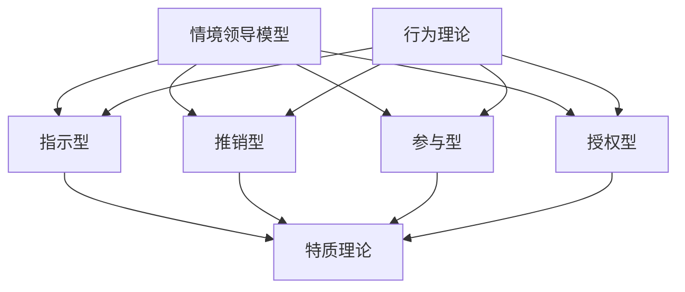
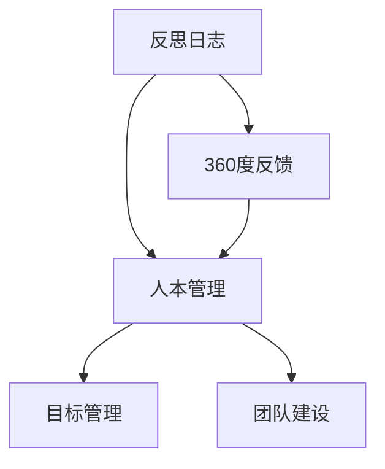
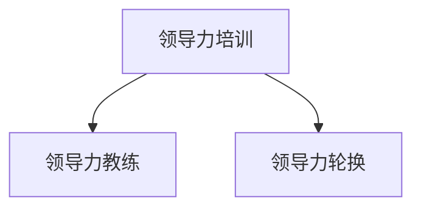
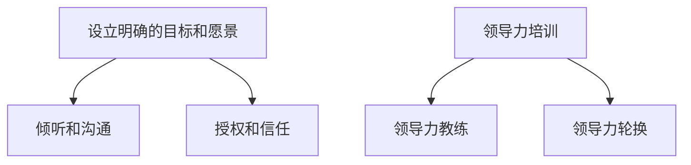

                 

# 领导力训练：让你的团队所向披靡

## 关键词
- 领导力
- 团队管理
- 领导风格
- 团队建设
- 领导力发展
- 情境领导

## 摘要
本文将深入探讨领导力训练对于团队成功的重要性。通过分析领导力的基本概念、模型和工具，我们将理解领导力在团队管理中的关键作用。文章将结合实际案例，详细讲解如何通过领导力训练提升团队绩效，并分享一系列最佳实践，帮助读者在实践中更好地应用领导力原则，打造一个所向披靡的团队。

## 引言
在当今快速变化和竞争激烈的环境中，领导力已成为企业成功的关键因素之一。无论是创业公司还是大型跨国企业，有效的领导力都能激发团队潜能，实现卓越的业绩。然而，许多人在提升领导力方面感到困惑，缺乏系统的训练和实践经验。

本文旨在为读者提供一份全面的领导力训练指南，通过系统的学习和实践，帮助团队领导者提升自己的领导能力，进而推动团队取得突破性成果。本文将从以下几个方面展开讨论：

1. **领导力的基本概念与框架**：介绍领导力的定义、重要性以及与管理的区别，并探讨几种常见的领导力模型。
2. **领导力工具与方法**：介绍几种实用的领导力工具和方法，帮助领导者更好地了解和管理团队。
3. **团队建设与领导力发展**：探讨团队建设的重要性，以及如何通过领导力发展策略提升团队绩效。
4. **领导力实践与案例分析**：通过实际案例，展示领导力训练在实际中的应用效果。
5. **最佳实践与拓展阅读**：总结最佳实践，并提供相关拓展阅读，帮助读者进一步深入学习和实践领导力。

## 领导力的基本概念与框架

### 领导力的定义与重要性

领导力是一种影响力，它使人们能够同心协力，朝着共同的目标前进。领导力不同于管理，管理是组织资源、规划目标和执行计划的过程，而领导力则更侧重于激发团队潜能，塑造愿景和使命。

在团队管理中，领导力至关重要。一个优秀的领导者不仅能够设定清晰的目标和愿景，还能激发团队成员的积极性和创造力，推动团队不断进步。以下是领导力在团队管理中的几个重要作用：

1. **激发团队潜能**：领导者通过鼓舞人心的讲话和行动，激发团队成员的内在动力，使他们能够发挥最大潜力。
2. **提升团队凝聚力**：领导者通过建立互信和协作的文化，增强团队成员之间的联系，提高团队凝聚力。
3. **提高团队效率**：领导者能够合理分配资源，优化工作流程，提高团队工作效率。
4. **应对变革**：在变化迅速的商业环境中，领导者能够迅速做出决策，引领团队应对变革。

### 领导力与管理的区别

领导力与管理的区别主要体现在以下几个方面：

1. **目标不同**：管理侧重于实现既定的目标和计划，而领导力则侧重于塑造愿景和使命，引导团队朝着长远目标前进。
2. **方法不同**：管理强调规章制度和流程，而领导力则更注重人际交往和沟通技巧。
3. **效果不同**：管理的结果往往是具体的、可量化的，而领导力的效果则是长期的、难以量化的，如团队文化的建设、员工满意度的提升等。

### 领导力模型

为了更好地理解和应用领导力，许多学者提出了不同的领导力模型。以下是几种常见的领导力模型：

1. **情境领导模型**：情境领导模型认为，领导者应根据团队成员的不同发展阶段和情境，采用不同的领导风格。该模型包括四种领导风格：指示型、推销型、参与型和授权型。
2. **特质理论**：特质理论认为，领导者具有某些特定的特质和性格特征，如自信、决心、智慧和正直等。这种理论强调领导者个人素质的重要性。
3. **行为理论**：行为理论认为，领导行为是可以通过学习和培养的，领导者的行为风格可以影响团队绩效。该理论包括任务导向型和关系导向型两种领导风格。

### 领导力模型之间的关系架构

为了更好地理解不同领导力模型之间的关系，我们可以使用Mermaid流程图来展示它们之间的联系：

通过上述流程图，我们可以看到，情境领导模型、特质理论和行为理论之间存在着一定的交叉和融合。领导者可以根据不同情境和团队需求，灵活运用不同领导风格，实现最佳领导效果。

## 领导力工具与方法

### 领导力工具

为了更好地提升领导力，许多领导者采用了一些实用的领导力工具。以下是几种常用的领导力工具：

1. **反思日志**：反思日志是一种记录个人思考和感受的工具，领导者可以通过反思日志反思自己的行为和决策，不断改进自己的领导方法。
2. **360度反馈**：360度反馈是一种通过团队成员、上级、客户等多方面收集反馈的方法，帮助领导者了解自己的优势和不足，有针对性地提升领导能力。
3. **领导力评估**：领导力评估是一种通过标准化的评估工具，对领导者的能力进行评估的方法，有助于领导者了解自己的领导风格和团队表现。

### 领导力方法

除了领导力工具，领导者还可以采用一些有效的领导力方法来提升团队绩效。以下是几种常见的领导力方法：

1. **人本管理**：人本管理是一种以人为中心的管理方法，强调尊重员工、信任员工和激励员工，提高员工满意度和工作效率。
2. **目标管理**：目标管理是一种通过设定明确的目标和计划，激发团队成员的积极性和创造力的方法，有助于实现团队目标。
3. **团队建设**：团队建设是一种通过增强团队成员之间的沟通、信任和协作，提高团队凝聚力和工作效率的方法。

### 领导力工具与方法之间的关系

领导力工具和方法之间存在着一定的联系。例如，反思日志和360度反馈可以帮助领导者了解自己的行为和决策，从而更好地应用人本管理、目标管理和团队建设等方法。以下是领导力工具与方法之间的Mermaid流程图：

通过上述流程图，我们可以看到，领导力工具和方法之间存在着紧密的联系。领导者可以根据具体情境和团队需求，灵活运用不同工具和方法，实现最佳领导效果。

## 团队建设与领导力发展

### 团队建设的重要性

团队建设是领导力训练的重要组成部分，一个高效的团队可以极大地提升团队绩效。以下是团队建设的重要作用：

1. **提高团队凝聚力**：通过团队建设活动，团队成员之间的沟通和协作能力得到提升，增强了团队凝聚力。
2. **促进知识共享**：团队建设有助于团队成员之间的知识共享，提高团队整体知识水平。
3. **提升工作效率**：通过团队建设，团队成员能够更好地理解彼此的角色和职责，提高工作效率。

### 领导力发展策略

为了提升团队绩效，领导者需要制定有效的领导力发展策略。以下是几种常见的领导力发展策略：

1. **领导力培训**：通过领导力培训，领导者可以学习最新的领导力理论和实践方法，提升自己的领导能力。
2. **领导力教练**：领导力教练是一种个性化的辅导方式，可以帮助领导者识别自己的优势和不足，制定个人发展计划。
3. **领导力轮换**：通过领导力轮换，领导者可以在不同的岗位和环境中锻炼自己的领导能力，提高适应能力。

### 领导力发展策略的Mermaid流程图

以下是领导力发展策略的Mermaid流程图：

通过上述流程图，我们可以看到，领导力培训、领导力教练和领导力轮换是领导力发展的重要策略。领导者可以根据团队需求和自身发展需要，灵活运用这些策略，提升领导能力。

## 领导力实践与案例分析

### 领导力实践

领导力训练不仅仅是理论的学习，更需要在实践中应用。以下是几种常见的领导力实践方法：

1. **设立明确的目标和愿景**：领导者应明确团队的目标和愿景，使团队成员明确方向，激发工作动力。
2. **倾听和沟通**：领导者应善于倾听团队成员的意见和建议，并通过有效沟通，确保团队成员理解并支持团队目标。
3. **授权和信任**：领导者应充分信任团队成员，给予他们足够的自主权，鼓励他们发挥创造力。

### 案例分析

为了更好地理解领导力训练的实际应用，我们可以通过以下案例进行分析：

#### 案例一：创业公司的领导力实践

某创业公司CEO通过以下领导力实践，成功带领团队取得突破性成果：

1. **设立明确的目标和愿景**：CEO明确公司愿景，并将目标分解为可操作的任务，使团队成员明确工作方向。
2. **倾听和沟通**：CEO定期组织团队会议，倾听团队成员的意见和建议，并通过有效沟通，确保团队成员理解并支持公司目标。
3. **授权和信任**：CEO充分信任团队成员，给予他们足够的自主权，鼓励他们发挥创造力，推动项目进展。

#### 案例二：跨国公司的领导力发展策略

某跨国公司通过以下领导力发展策略，提升团队绩效：

1. **领导力培训**：公司定期组织领导力培训，帮助领导者掌握最新的领导力理论和实践方法。
2. **领导力教练**：公司聘请外部领导力教练，为领导者提供个性化辅导，帮助他们提升领导能力。
3. **领导力轮换**：公司通过领导力轮换，让领导者在不同岗位和环境中锻炼自己的领导能力，提高适应能力。

### 领导力实践与案例分析的Mermaid流程图

以下是领导力实践与案例分析的Mermaid流程图：

通过上述流程图，我们可以看到，领导力实践和案例分析是领导力训练的重要组成部分。领导者可以通过设立明确的目标和愿景、倾听和沟通、授权和信任等实践方法，提升领导能力；同时，通过领导力培训、领导力教练和领导力轮换等发展策略，实现团队绩效的提升。

## 最佳实践与拓展阅读

### 最佳实践

1. **定期反思**：领导者应养成定期反思的习惯，通过反思日志记录自己的思考，及时发现并改进自己的领导行为。
2. **鼓励创新**：领导者应鼓励团队成员提出新的想法和解决方案，为团队注入创新活力。
3. **培养团队文化**：领导者应积极培养团队文化，如诚信、尊重和协作，为团队营造良好的工作氛围。

### 拓展阅读

1. **《领导力5项修炼》**：由约翰·麦克斯韦尔著，详细介绍了领导力的发展过程和关键要素。
2. **《团队的智慧》**：由罗杰·福莱著，探讨了团队建设的重要性和方法。
3. **《领导力的五个层次》**：由史蒂芬·柯维著，提出了领导力的五个层次，为领导者提供了自我提升的方向。

### 注意事项

1. **避免过度控制**：领导者应避免过度控制团队，给予团队成员足够的自主权，激发他们的创造力。
2. **持续学习**：领导力是一个不断发展的过程，领导者应持续学习，适应不断变化的商业环境。
3. **关注团队健康**：领导者应关注团队成员的身心健康，为团队创造一个积极、健康的工作环境。

### 结论

领导力训练是提升团队绩效的关键。通过系统的学习和实践，领导者可以不断提升自己的领导能力，打造一个所向披靡的团队。本文介绍了领导力的基本概念、工具与方法，以及团队建设和发展策略。通过实际案例分析和最佳实践，读者可以更好地理解和应用领导力原则，提升团队绩效。希望本文能为读者的领导力提升之路提供有益的参考。

## 附录

### 附录A：领导力相关资源

1. **《领导力的五项修炼》**：作者：约翰·麦克斯韦尔
2. **《团队的智慧》**：作者：罗杰·福莱
3. **《领导力的五个层次》**：作者：史蒂芬·柯维

### 附录B：实用工具

1. **反思日志模板**
2. **360度反馈问卷**
3. **领导力评估工具**

### 附录C：拓展阅读

1. **《如何成为领导者》**：作者：吉姆·柯林斯
2. **《团队的秘密》**：作者：克里斯·阿吉里斯
3. **《领导者的五个角色》**：作者：保罗·赫塞

### 作者信息

- 作者：AI天才研究院/AI Genius Institute & 禅与计算机程序设计艺术 /Zen And The Art of Computer Programming

### 结语

感谢您阅读本文，希望本文能对您的领导力训练之路提供有益的启示。如果您在领导力提升过程中遇到任何问题，欢迎随时与我们联系，我们将竭诚为您解答。祝您在领导力的道路上越走越远，带领团队所向披靡！

