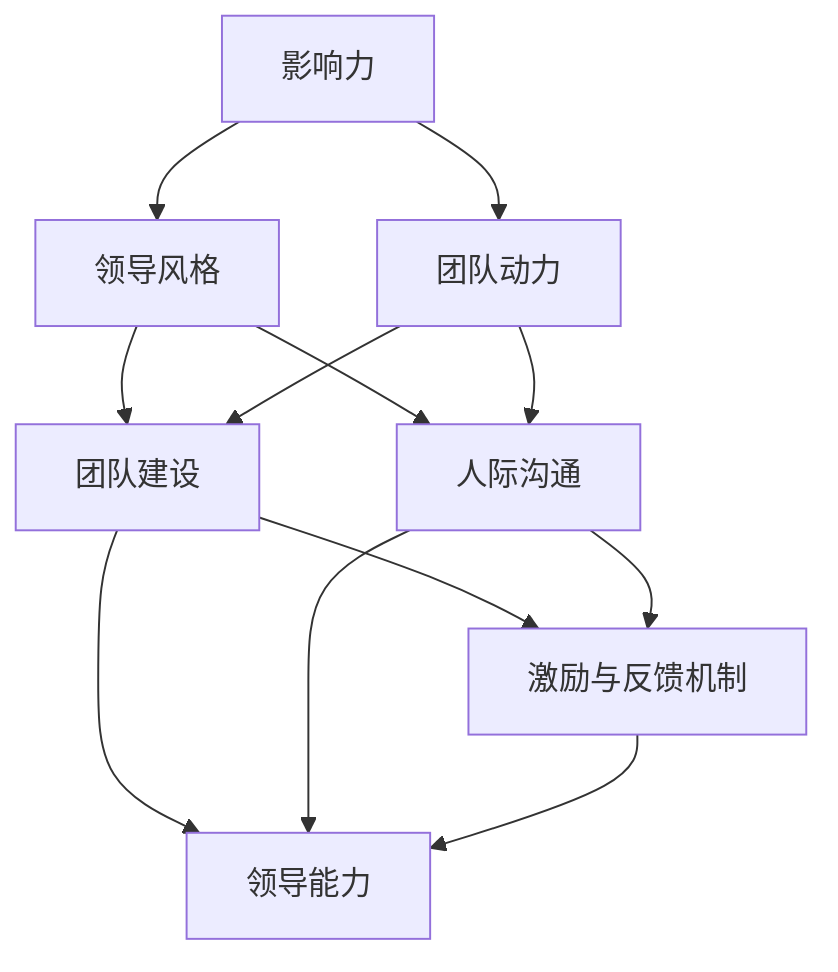
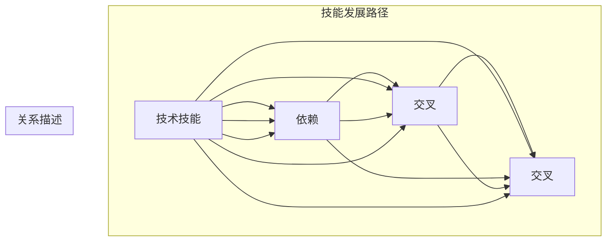

                 


为了确保文章的结构清晰、逻辑性强，我们将按照以下步骤进行思考和撰写：

**步骤 1: 开篇介绍与背景**

1. 确定文章主题与读者群体
2. 简要介绍领导力在团队管理和组织发展中的重要性
3. 提出文章的核心观点和目的

**步骤 2: 定义与概念架构**

1. 定义领导力的核心概念（如：影响力、领导风格、团队动力等）
2. 构建领导力的Mermaid流程图，展示不同概念之间的关系
3. 阐述领导力的本质和不同层面的定义

**步骤 3: 领导风格与团队动力**

1. 分析不同领导风格的算法原理
2. 讨论管理幅度与管理层次对领导风格的影响
3. 使用情境领导理论（情境领导模型）来讲解领导风格的选择

**步骤 4: 团队建设与人际沟通**

1. 提出团队建设的重要性
2. 分析人际沟通的核心模型（如信息传播模型）
3. 引入沟通效率的计算公式（如：信息传递量/信息传递时间）

**步骤 5: 激励与反馈机制**

1. 引入激励理论的数学模型（如期望-价值模型）
2. 讨论反馈机制的数学模型（如反馈环模型）
3. 结合实际案例，解释激励与反馈对团队绩效的影响

**步骤 6: 领导能力提升与实践**

1. 讨论领导能力提升的方法和路径
2. 提出领导力评估与改进的策略
3. 通过实战案例展示领导力提升的具体实施过程

**步骤 7: 危机管理中的领导力**

1. 阐述危机管理的四个阶段
2. 分析领导力在危机管理中的关键作用
3. 使用Mermaid流程图展示危机管理中的领导力流程

**步骤 8: 领导力在组织发展中的应用**

1. 讨论领导力与组织文化的关系
2. 分析领导力对组织变革的影响
3. 提出领导力在组织发展中的应用策略

**步骤 9: 领导力的未来趋势**

1. 探讨数字化时代领导力的新要求
2. 分析领导力的未来趋势与挑战
3. 展望领导力的发展路径

**步骤 10: 总结与拓展**

1. 对全文进行总结
2. 提供最佳实践 tips
3. 引导读者进一步阅读和思考

**步骤 11: 文章格式与编写**

1. 确保文章内容使用markdown格式
2. 添加作者信息
3. 检查文章完整性、逻辑性和准确性

现在，我们可以根据这些步骤开始撰写《领导力训练：让你的团队所向无敌》的文章。请注意，每个步骤都需要详细的论述，以确保文章的质量和深度。在撰写过程中，我们可以使用Python代码示例来阐述算法原理，并使用LaTeX格式嵌入数学公式。**``` 

### 开篇介绍与背景

#### 确定文章主题与读者群体

本文的主题是“领导力训练：让你的团队所向无敌”。文章的目标读者是希望提升自身领导能力的团队管理者、团队领导者，以及致力于组织发展的专业人士。此外，对于对领导力有兴趣的普通读者，本文同样具有参考价值。

在当今快速变化和竞争激烈的市场环境中，领导力成为企业成功的关键因素。一个团队的领导不仅需要具备战略规划和决策能力，还需要懂得如何激发团队成员的潜力，提升团队的整体执行力。因此，领导力训练变得尤为重要。

#### 简要介绍领导力在团队管理和组织发展中的重要性

领导力在团队管理和组织发展中扮演着至关重要的角色。它不仅影响着团队的效率和绩效，还直接关系到组织的创新能力和市场竞争力。

在团队管理方面，领导力决定了团队成员的协作效率、工作动力和整体士气。一个优秀的领导能够通过恰当的领导风格和沟通技巧，激发团队成员的积极性，使团队能够高效地完成既定目标。

在组织发展方面，领导力是推动组织变革和创新的重要动力。领导者的视野、远见和决断力，影响着组织的战略规划和未来发展路径。有效的领导力可以促进组织文化的建设，提升组织的整体凝聚力和执行力。

#### 提出文章的核心观点和目的

本文的核心观点是：通过系统化的领导力训练，可以显著提升团队领导者的领导能力，进而推动团队和组织的发展。文章的目的是为读者提供一套实用的领导力训练方法，帮助团队领导者更好地理解领导力的本质，掌握有效的领导技巧，并在实际工作中运用这些技巧，实现团队和组织的目标。

我们将从以下几个方面展开讨论：

1. 领导力的核心概念与原则
2. 团队管理与领导能力提升
3. 领导力在危机管理中的应用
4. 领导力与组织发展
5. 领导力的未来发展

通过以上讨论，我们希望能够为读者提供一套全面的领导力训练方案，助力团队和组织在竞争激烈的环境中脱颖而出，所向无敌。**``` 

### 定义与概念架构

在探讨领导力训练之前，我们需要明确领导力的核心概念，并构建它们之间的关系架构。以下是领导力的一些关键概念：

1. **影响力**：领导力本质上是一种影响力，即领导者通过何种方式影响团队成员的态度、行为和绩效。
2. **领导风格**：不同的领导风格对应不同的领导行为，适用于不同的管理环境和团队需求。
3. **团队动力**：团队动力是指团队成员之间的相互作用，以及这种相互作用如何影响团队的整体表现。
4. **团队建设**：团队建设是指通过一系列策略和活动，增强团队成员之间的协作和信任，从而提升团队的整体绩效。
5. **人际沟通**：人际沟通是指团队成员之间通过语言、非语言信号等方式进行的交流，这对于团队的有效运作至关重要。
6. **激励与反馈机制**：激励和反馈机制是领导者通过奖励和惩罚来激励团队成员，以及通过反馈来促进团队成员改进和提高的方法。
7. **领导能力**：领导能力是指领导者具备的、能够有效执行领导职责的能力，包括战略思维、决策能力、沟通能力和团队管理等。

接下来，我们将使用Mermaid流程图来展示这些核心概念之间的关系，以便读者更好地理解领导力体系。



### 领导力的本质和不同层面的定义

领导力是一个多层次的、动态的复杂系统。从不同角度可以对其进行定义，以下是一些常见的定义：

1. **个人层面**：领导力是领导者个人特质和能力的体现，包括自信、远见、决策能力和影响力等。
2. **团队层面**：领导力是领导者通过团队协作实现共同目标的能力，涉及沟通技巧、团队建设和团队管理等。
3. **组织层面**：领导力是领导者推动组织变革、创新和发展的能力，涉及战略规划、资源配置和组织文化等。

不同层面的领导力相互关联，共同构成了领导力的完整体系。领导者需要在不同层面上灵活运用领导力，以应对复杂多变的环境。

### 领导力发展的路径

领导力的发展是一个持续的过程，需要领导者不断学习和实践。以下是一个简化的领导力发展路径：

1. **自我认知**：领导者首先需要了解自己的优势和劣势，明确自己的价值观和领导风格。
2. **技能提升**：通过学习领导力理论和实践方法，领导者可以提升自己的沟通、决策和团队管理等技能。
3. **实践应用**：在实际工作中，领导者需要将所学应用到具体场景中，通过实践不断总结和优化自己的领导方法。
4. **反思与调整**：领导者需要定期反思自己的领导行为和结果，根据反馈进行调整和改进。
5. **持续成长**：领导力发展没有终点，领导者需要保持学习的心态，不断探索新的领导方法和理念。

通过以上步骤，领导者可以逐步提升自己的领导力，成为一名优秀的领导者。

### 领导力的核心概念与联系

为了更深入地理解领导力，我们需要探讨其核心概念，并分析这些概念之间的联系。

**1. 影响力**

影响力是领导力的核心要素之一，指的是领导者通过言行影响他人态度和行为的能力。这种能力可以来源于领导者的知识、经验、人格魅力或者权威地位。

**2. 领导风格**

领导风格是指领导者处理管理任务和与团队成员互动的方式。不同的领导风格适用于不同的情境和团队需求。常见的领导风格包括：

- **权威型**：领导者做出决策，团队成员执行。
- **民主型**：领导者与团队成员共同决策，团队成员参与决策过程。
- **参与型**：领导者鼓励团队成员参与决策，重视团队意见。
- **教练型**：领导者关注团队成员的个人成长，提供指导和支持。

**3. 团队动力**

团队动力是指团队成员之间的相互作用和相互影响。这种动力可以来源于共同的目标、信任和积极的团队文化。良好的团队动力有助于提高团队的凝聚力和工作效率。

**4. 领导力模型**

领导力模型是用于分析和理解领导行为和领导效果的框架。常见的领导力模型包括：

- **情境领导理论**：根据团队成员的不同成熟度，选择不同的领导风格。
- **路径-目标理论**：领导者通过设定清晰的目标和提供必要的支持，帮助团队成员达成目标。
- **领导者成员交换理论**：领导者与成员之间的互动关系对领导效果产生重要影响。

**5. 核心概念之间的联系**

影响力、领导风格、团队动力和领导力模型之间紧密相关。领导者通过影响力展现领导风格，影响团队动力，并通过领导力模型指导领导行为。

- **影响力与领导风格**：领导者的风格会影响其影响力的发挥。例如，权威型领导风格可能更依赖于正式的权威地位，而参与型领导风格则更依赖于人际影响力。

- **领导风格与团队动力**：领导风格直接影响团队成员的互动和协作方式。例如，民主型领导风格可以促进团队成员的参与感和归属感，从而增强团队动力。

- **团队动力与领导力模型**：团队动力是领导力模型的重要组成部分。领导力模型中的目标设定、支持提供和反馈机制都需要依赖于团队动力。

- **领导力模型与影响力**：领导力模型为领导者提供了具体的行动指南，帮助其更有效地利用影响力来实现团队目标。

通过理解这些核心概念之间的联系，领导者可以更全面地把握领导力的本质，并在实际工作中灵活运用各种领导技巧，提升团队的整体绩效。

### 领导力的四层次模型

在探讨领导力的核心概念后，我们可以引入一个更加结构化的模型来帮助我们深入理解领导力的不同层面。这个模型由著名的领导力研究者约翰·肯尼迪（John Kenneth Kennedy）提出，称为领导力的四层次模型。这个模型将领导力分为四个层次，每个层次都有其独特的特征和作用。

#### 第一层：技术技能

技术技能是领导力的基础层次，指的是领导者具备的专业知识和技能。在这个层次，领导者的主要任务是掌握并运用相关领域的知识，以确保团队能够高效地完成具体任务。

- **核心概念**：技术技能包括专业领域的专业知识、技术能力和实践经验。
- **作用**：技术技能有助于领导者理解团队成员的工作内容，提供有效的指导和支持。

#### 第二层：人际技能

人际技能是领导力的第二个层次，涉及领导者与团队成员的沟通、协作和关系管理。在这一层次，领导者需要建立良好的人际关系，激发团队成员的积极性和创造力。

- **核心概念**：人际技能包括沟通技巧、团队建设、冲突管理和激励能力。
- **作用**：人际技能有助于领导者建立和维护团队凝聚力，提升团队的整体绩效。

#### 第三层：概念技能

概念技能是领导力的第三个层次，涉及领导者的战略思考和决策能力。在这个层次，领导者需要具备全局视野，能够制定战略规划和应对复杂挑战。

- **核心概念**：概念技能包括战略思维、决策能力、创新能力和组织管理能力。
- **作用**：概念技能有助于领导者制定长期目标，确保团队的可持续发展。

#### 第四层：愿景领导

愿景领导是领导力的最高层次，涉及领导者的远见和影响力。在这个层次，领导者需要具备强烈的使命感，能够激发团队成员为实现共同愿景而奋斗。

- **核心概念**：愿景领导包括远见卓识、价值观引导、变革引领和激励愿景。
- **作用**：愿景领导有助于领导者塑造组织的文化，推动创新和变革，引领团队走向未来。

#### 四层次模型的应用

四层次模型为领导者提供了自我评估和成长的方向。通过识别自己在不同层次的能力，领导者可以制定个性化的成长计划，不断提升自身的领导力。

- **自我评估**：领导者可以通过评估自己在四个层次的能力水平，识别自己的优势和需要改进的领域。
- **成长计划**：根据自我评估结果，领导者可以制定针对性的成长计划，包括学习新知识、提升人际技能、培养战略思维和激发愿景领导。
- **持续改进**：领导力是一个持续的过程，领导者需要不断反思和实践，以不断提升自身的领导能力。

通过领导力的四层次模型，领导者可以更加系统地理解领导力的本质和层次，从而在团队管理和组织发展中发挥更大的作用。

### Mermaid流程图：领导力发展的路径

为了更直观地展示领导力的发展路径，我们可以使用Mermaid流程图来描述从技术技能到愿景领导的各个阶段及其相互关系。



在这个流程图中，每个技能层次都是前一个层次的延续和提升，同时各个层次之间也存在相互依赖的关系。领导者在提升自身技术技能的同时，也需要不断培养人际技能、概念技能和愿景领导，以实现全面领导力的发展。

通过这个流程图，领导者可以清晰地看到自己在领导力发展中的位置，以及需要关注的重点领域。这有助于他们制定具体的成长计划，不断提升自身的领导能力。

### 领导风格与团队动力

领导风格是领导者处理管理任务和与团队成员互动的方式。不同的领导风格会对团队动力产生不同的影响，从而影响团队的整体绩效。在探讨领导风格与团队动力的关系时，我们可以从以下几个方面进行分析。

#### 领导风格的分类

常见的领导风格可以分为以下几种：

1. **权威型领导**：领导者做出决策，团队成员执行。
2. **民主型领导**：领导者与团队成员共同决策，团队成员参与决策过程。
3. **参与型领导**：领导者鼓励团队成员参与决策，重视团队意见。
4. **教练型领导**：领导者关注团队成员的个人成长，提供指导和支持。

#### 领导风格对团队动力的影响

不同的领导风格会对团队动力产生不同的影响。以下是每种领导风格对团队动力的具体影响：

1. **权威型领导**：
   - **积极影响**：决策速度快，执行力强，有利于快速达成目标。
   - **消极影响**：团队成员可能缺乏参与感和自主性，长期可能导致积极性下降。
   - **团队动力**：初期可能增强，但长期可能导致团队动力减弱。

2. **民主型领导**：
   - **积极影响**：团队成员参与度高，团队凝聚力强，有利于创新和协作。
   - **消极影响**：决策过程可能较慢，需要花费更多时间进行讨论。
   - **团队动力**：显著增强，团队成员感到被重视和尊重，积极性高。

3. **参与型领导**：
   - **积极影响**：团队成员参与度高，决策更具民主性，团队凝聚力强。
   - **消极影响**：领导者需要花费更多时间和精力进行协调，可能会影响效率。
   - **团队动力**：显著增强，团队成员感受到责任和使命感，积极性高。

4. **教练型领导**：
   - **积极影响**：关注团队成员的个人成长，提供指导和支持，有助于提高团队成员的能力。
   - **消极影响**：可能需要较长时间来培养团队成员，初期效果可能不明显。
   - **团队动力**：显著增强，团队成员感受到关怀和支持，积极性高。

#### 优化团队动力的策略

为了优化团队动力，领导者可以采取以下策略：

1. **根据团队需求和情境选择合适的领导风格**：领导者需要根据团队的具体需求和情境选择最合适的领导风格。例如，在紧急情况下，可以选择权威型领导以迅速做出决策；在需要创新和协作的情况下，可以选择民主型或参与型领导。

2. **培养团队成员的参与感和责任感**：领导者应鼓励团队成员参与决策过程，让他们感到自己的意见被重视。此外，通过明确团队成员的责任和任务，可以提高他们的责任感和参与度。

3. **提供支持和指导**：领导者应关注团队成员的个人成长，提供必要的支持和指导。这有助于提高团队成员的能力和信心，从而增强团队动力。

4. **建立积极的文化和价值观**：领导者应积极塑造团队的文化和价值观，鼓励团队成员相互尊重、支持和合作。这有助于建立良好的团队氛围，增强团队动力。

通过理解和运用不同的领导风格，并采取优化团队动力的策略，领导者可以有效地提升团队的整体绩效，实现团队的目标。

### 领导风格分类与适用场景

在探讨领导风格的分类时，我们需要了解不同领导风格的特点及其适用场景。以下是四种常见的领导风格及其适用场景：

#### 1. 权威型领导

**特点**：权威型领导强调领导者对决策的掌控，团队成员执行领导者的指令。领导者通常会制定明确的规则和流程，以确保团队高效运作。

**适用场景**：权威型领导适用于以下场景：

- **紧急情况**：在紧急情况下，快速做出决策是关键，领导者需要迅速下达指令，以确保团队立即采取行动。
- **任务导向**：对于需要严格遵循标准和流程的任务，权威型领导可以有效确保任务的顺利完成。
- **初建团队**：在团队刚刚成立，团队成员之间缺乏信任和协作的情况下，权威型领导可以帮助团队快速建立秩序。

#### 2. 民主型领导

**特点**：民主型领导强调领导者与团队成员之间的合作和共同决策。领导者鼓励团队成员参与决策过程，尊重他们的意见。

**适用场景**：民主型领导适用于以下场景：

- **创新项目**：在创新项目中，需要团队成员的创意和参与，民主型领导有助于激发团队的创造力和创新精神。
- **团队协作**：在需要团队成员密切合作的项目中，民主型领导可以增强团队的凝聚力和协作精神。
- **团队建设**：在团队需要加强内部沟通和信任时，民主型领导有助于建立积极和谐的团队氛围。

#### 3. 参与型领导

**特点**：参与型领导注重团队成员的参与和自主性。领导者鼓励团队成员在决策过程中发表意见，并给予他们更多的自由度。

**适用场景**：参与型领导适用于以下场景：

- **自主工作**：在团队成员需要独立完成工作任务时，参与型领导可以增强他们的自主性和责任感。
- **技能提升**：在团队成员需要通过实践来提升技能时，参与型领导可以为他们提供更多的发展机会。
- **团队自主管理**：在团队实现自主管理时，参与型领导可以激发团队成员的积极性和创造力。

#### 4. 教练型领导

**特点**：教练型领导关注团队成员的个人成长，提供个性化的指导和支持。领导者不仅是任务的指导者，更是团队成员的职业导师。

**适用场景**：教练型领导适用于以下场景：

- **人才培养**：在团队成员需要专业指导和培训时，教练型领导可以提供个性化的学习和发展计划。
- **职业发展**：在团队成员希望提升职业技能和职业发展时，教练型领导可以为他们提供职业规划和指导。
- **领导力培养**：在团队需要培养下一代领导者时，教练型领导可以通过传授经验和方法来提升团队成员的领导力。

通过了解不同领导风格的特点及其适用场景，领导者可以根据具体情境灵活运用不同的领导风格，以实现最佳的管理效果。

### 管理幅度与管理层次

在讨论领导风格时，我们需要考虑管理幅度和管理层次这两个关键因素。管理幅度是指一个领导者直接监督的团队成员数量，而管理层次则是从最高层管理者到一线员工之间的层级数量。

#### 管理幅度

管理幅度决定了领导者能够直接关注的团队成员数量。不同的管理幅度对领导风格有不同的要求：

- **宽管理幅度**：当管理幅度较宽时，领导者需要更多依赖团队自主性和自我管理能力。这种情况下，领导者更倾向于采用参与型和民主型领导风格，以促进团队成员的参与感和自主性。
- **窄管理幅度**：当管理幅度较窄时，领导者可以更密切地监督团队成员的工作。在这种情况下，领导者更倾向于采用权威型和教练型领导风格，以确保任务的高效执行。

#### 管理层次

管理层次则决定了从最高层管理者到一线员工之间的层级数量。不同管理层次对领导力的要求也有所不同：

- **多层次管理**：在多层次的管理结构中，领导者需要在不同层级之间进行沟通和协调。这种情况下，领导者需要具备较强的沟通技能和概念技能，以理解不同层级的需求和挑战。
- **扁平化管理**：扁平化管理结构减少管理层级，使得决策过程更加迅速和直接。在这种情况下，领导者需要具备更高的战略思维和决策能力，以确保团队能够快速响应变化。

#### 管理幅度与管理层次的关系

管理幅度与管理层次之间存在密切的关系。管理幅度较宽时，管理层次可能较复杂；而管理幅度较窄时，管理层次可能较为简化。领导者需要根据实际情况，调整领导风格和管理策略，以适应不同的管理幅度和管理层次。

- **灵活调整**：领导者需要具备灵活性，根据管理幅度和管理层次的变化，调整领导风格和管理方法。例如，在宽管理幅度和多层次管理的情况下，领导者可能需要采用更多的沟通和协调技巧，以促进团队协作；而在窄管理幅度和扁平化管理的情况下，领导者可能需要更多关注战略规划和快速决策。

通过理解和运用管理幅度和管理层次的概念，领导者可以更有效地管理团队，提高团队的绩效和满意度。

### 领导力模型：情境领导理论

在探讨领导力模型时，情境领导理论（也称为领导生命周期理论）是一个不可或缺的部分。该理论由赫赛（Paul Hersey）和布兰查德（Kenneth H. Blanchard）提出，旨在根据团队成员的成熟度选择最合适的领导风格。情境领导理论将领导风格分为四种类型，每种类型适用于不同成熟度的团队成员。

#### 情境领导理论的四个领导风格

1. **指导型领导（Telling）**：
   - **适用成熟度**：M1（低成熟度）：团队成员缺乏技能和自信。
   - **特点**：领导者详细解释任务、提供明确的指导，控制决策过程。

2. **推销型领导（Selling）**：
   - **适用成熟度**：M2（较不成熟）：团队成员有一定的技能，但缺乏自信。
   - **特点**：领导者不仅提供指导，还通过说服和激励来提高团队成员的信心和动机。

3. **参与型领导（Participating）**：
   - **适用成熟度**：M3（较为成熟）：团队成员具备技能，但需要参与决策。
   - **特点**：领导者与团队成员共同决策，尊重团队成员的意见，提高参与感。

4. **授权型领导（Delegating）**：
   - **适用成熟度**：M4（成熟）：团队成员具备技能和自信，能够独立完成任务。
   - **特点**：领导者给予团队成员最大的自主权和责任，仅提供必要的支持和监督。

#### 情境领导模型的应用

情境领导模型的应用可以分为以下几个步骤：

1. **评估团队成员的成熟度**：领导者需要了解团队成员的技能和自信水平，通过观察、访谈等方式进行评估。

2. **选择合适的领导风格**：根据团队成员的成熟度，选择最合适的领导风格。例如，对于成熟度较低的团队成员，应采用指导型或推销型领导；而对于成熟度较高的团队成员，则可以采用参与型或授权型领导。

3. **灵活调整领导风格**：领导者需要根据团队成员的成熟度变化，灵活调整领导风格。例如，随着团队成员技能的提升和自信的增加，可以逐步从指导型领导过渡到授权型领导。

4. **持续反馈和沟通**：领导者需要与团队成员保持持续沟通，了解他们的需求和反馈，以确保领导风格的合适性。

通过情境领导模型，领导者可以根据团队成员的具体情况选择最合适的领导风格，提高团队的绩效和满意度。这个模型不仅提供了具体的领导策略，还强调了领导者需要具备灵活性和适应性，以应对不同情境和团队成员的变化。

### 伪代码：领导风格决策树

为了更直观地展示如何根据团队成员的成熟度选择合适的领导风格，我们可以设计一个伪代码形式的决策树。这个决策树将根据团队成员的技能和自信水平（成熟度）来决定最合适的领导风格。

```python
def choose_leadership_style(maturity):
    if maturity == "M1":  # 低成熟度
        return "指导型领导（Telling）"
    elif maturity == "M2":  # 较不成熟
        return "推销型领导（Selling）"
    elif maturity == "M3":  # 较为成熟
        return "参与型领导（Participating）"
    else:  # 成熟
        return "授权型领导（Delegating）"

# 示例应用
member_maturity = "M3"  # 假设评估成员成熟度为M3
selected_style = choose_leadership_style(member_maturity)
print(f"针对成熟度 {member_maturity} 的成员，应采用的领导风格是：{selected_style}")
```

在这个决策树中，输入参数`maturity`表示团队成员的成熟度，根据不同的成熟度，程序会输出相应的领导风格。这个伪代码提供了一个简化的决策模型，实际应用中可能需要更多复杂条件和更详细的决策逻辑。

通过这个决策树，领导者可以系统地评估团队成员的成熟度，并选择最合适的领导风格，以提高团队绩效和成员满意度。

### 团队建设的重要性

团队建设是提升团队绩效和团队凝聚力的重要途径。一个高效的团队不仅能够更好地实现共同目标，还能在面对挑战和变化时表现出更强的适应能力和创新能力。以下是团队建设的重要性及其关键要素：

#### 1. 提升团队绩效

团队建设有助于提升团队的整体绩效。通过建立明确的团队目标、增强团队成员之间的协作和沟通，团队可以更高效地完成工作任务。团队成员之间相互支持、协作，可以最大限度地发挥各自的优势，从而实现更高的工作效率和绩效。

#### 2. 增强团队凝聚力

团队建设能够增强团队成员之间的信任和凝聚力。通过共同的目标、共享的经历和积极的团队活动，团队成员能够建立深厚的情感联系，形成强大的团队精神。这种凝聚力有助于减少内部分歧和冲突，提高团队协作效率。

#### 3. 培养团队文化

团队建设是培养团队文化的重要手段。团队文化是指团队共同遵循的价值观、信念和行为规范。通过团队建设活动，可以强化团队的核心价值观，塑造积极向上的团队氛围。这种文化不仅能够增强团队凝聚力，还能提升团队成员的归属感和满意度。

#### 关键要素

1. **明确的目标**：团队建设需要从明确的目标开始。只有当团队成员明确知道自己的目标是什么，以及如何为实现这些目标而努力，团队才能保持一致的方向和动力。

2. **有效的沟通**：沟通是团队建设的基石。团队成员之间需要建立有效的沟通机制，确保信息的透明和畅通。通过定期的会议、汇报和反馈，团队成员可以及时了解彼此的工作进展和需求，形成良好的协作关系。

3. **共同的经历**：共同的经历是增强团队凝聚力的重要方式。通过共同的经历，团队成员可以建立深厚的情感联系。这些经历可以是成功的项目合作、团队培训，甚至是共同的困难挑战。

4. **积极的团队活动**：团队活动是增强团队凝聚力和氛围的有效手段。通过组织团队建设活动，如团建活动、庆祝活动、团队旅行等，可以增进团队成员之间的了解和信任，提升团队的士气。

5. **领导者的支持**：团队建设需要领导者的支持和参与。领导者不仅要为团队建设提供资源和指导，还要以身作则，通过自身的言行树立榜样，推动团队文化建设。

通过这些关键要素，团队建设可以有效地提升团队绩效和凝聚力，为组织的长期发展奠定坚实基础。

### 人际沟通的核心模型：信息传播模型

在团队建设中，人际沟通是关键因素之一。为了更好地理解人际沟通的过程，我们可以引入信息传播模型。信息传播模型描述了信息从发送者传递到接收者的过程，包括编码、传输、解码和反馈等环节。以下是对信息传播模型的核心概念和原理的详细分析。

#### 1. 编码

编码是指信息发送者将信息转化为适合传输的符号或语言的过程。在这一阶段，信息发送者需要明确自己的沟通意图，并将这些意图转化为语言、文字、图表或其他符号。编码的准确性和清晰性直接影响到信息的理解和接收。

#### 2. 传输

传输是指信息通过某种渠道从发送者传递到接收者的过程。常见的传输渠道包括口头沟通、书面沟通、电子邮件、视频会议等。传输过程中可能会受到噪声干扰，如语言障碍、技术问题等，这些都可能影响信息的准确传递。

#### 3. 解码

解码是指信息接收者将接收到的符号或语言转化为有意义的信息的过程。在这一阶段，信息接收者需要理解发送者意图，并根据上下文背景进行解读。解码的准确性和理解能力同样影响信息的最终理解。

#### 4. 反馈

反馈是指信息接收者对信息的理解和反应，它为信息发送者提供了一个反馈机制，以确认信息是否被正确理解。有效的反馈可以包括口头反馈、书面反馈、非语言反馈等。通过反馈，信息发送者可以了解信息的接收情况，并进行必要的调整和修正。

#### 5. 信息传播模型的应用

信息传播模型在团队沟通中的应用非常广泛。以下是一些关键应用场景：

1. **提高沟通效率**：通过信息传播模型，团队成员可以更加清晰地了解沟通流程，从而提高沟通效率。团队成员可以在编码阶段确保信息准确传达，在解码阶段确保信息准确理解，在反馈阶段及时纠正误解。

2. **减少沟通误差**：信息传播模型可以帮助团队成员识别并减少沟通误差。通过编码和反馈环节的准确执行，可以减少信息在传递过程中的失真。

3. **促进团队协作**：信息传播模型提供了一个结构化的沟通框架，有助于团队成员之间建立有效的沟通机制。通过明确的信息传输渠道和反馈机制，团队成员可以更好地协作，共同实现团队目标。

4. **增强团队凝聚力**：有效的沟通可以增强团队成员之间的信任和理解，从而提升团队的凝聚力。信息传播模型提供了一个透明、开放的沟通环境，有助于团队成员建立深厚的情感联系。

通过理解和应用信息传播模型，团队成员可以更加有效地进行沟通，提高团队的整体绩效和满意度。信息传播模型不仅是一种理论工具，更是一种实用的沟通策略，为团队建设和领导力提升提供了重要支持。

### 沟通效率的计算公式

在团队沟通中，沟通效率是一个关键指标，它决定了信息传递的速度和质量。为了更好地理解沟通效率，我们可以引入一个计算公式，该公式能够量化沟通效率，从而帮助团队成员识别并改进沟通过程中的瓶颈。

沟通效率可以用以下公式表示：

$$
\text{沟通效率} = \frac{\text{信息传递量}}{\text{信息传递时间}}
$$

其中：

- **信息传递量**：指的是在单位时间内传递的有效信息量，这包括明确的信息、关键的数据以及必要的解释和背景信息。
- **信息传递时间**：指的是信息从发送者传递到接收者所需的时间，这包括编码、传输和反馈等各个环节所花费的时间。

#### 公式应用

1. **评估沟通效率**：通过计算沟通效率，团队成员可以评估当前沟通系统的整体表现。例如，如果一个团队在某个项目中发现沟通效率较低，可以通过公式分析原因，是否是因为信息传递量不足或信息传递时间过长。

2. **优化沟通流程**：如果沟通效率低，团队成员可以针对公式中的两个变量进行优化。例如，通过简化信息传递过程（减少不必要的环节），或者提高信息传递的速度（改进传输渠道和技术），都可以提升沟通效率。

3. **培训与改进**：通过沟通效率的计算结果，团队成员可以识别出需要提升的领域。例如，如果发现信息传递量不足，可以加强对信息编码和解码的培训；如果信息传递时间过长，可以改进沟通工具和技术，以缩短传递时间。

#### 案例说明

假设一个团队正在开发一个新项目，项目涉及多个部门和成员。在项目的早期阶段，团队成员发现沟通效率较低，信息传递不畅。通过使用沟通效率公式，团队发现：

- **信息传递量**：每次会议后，团队成员往往需要花费大量时间来整理和传递关键信息。
- **信息传递时间**：从会议到实际执行，信息往往需要经过多个环节，导致信息延迟。

针对这些问题，团队采取以下措施：

1. **优化会议流程**：将会议内容提前整理成文档，确保会议更加高效和目标明确。
2. **改进沟通工具**：引入即时通讯工具和项目管理软件，以加快信息传递速度。
3. **加强培训**：对团队成员进行信息编码和解码的培训，提高信息传递的准确性和效率。

通过这些措施，团队的沟通效率显著提升，项目进展更加顺利。

通过沟通效率的计算公式，团队可以更好地理解沟通过程中的关键因素，并采取针对性的改进措施，提高团队的整体协作效率。

### 举例说明：团队沟通案例

为了更好地理解团队沟通的实际应用，我们可以通过一个具体的案例来说明如何运用沟通效率公式来提高团队协作。

#### 案例背景

假设一个由10名成员组成的软件开发团队正在开发一款新应用程序。项目时间紧任务重，团队成员分布在不同的城市，主要通过在线会议和邮件进行沟通。然而，团队发现沟通效率较低，项目进展缓慢。

#### 问题分析

1. **信息传递量**：每次会议后，团队成员需要花费大量时间整理和传递关键信息。信息传递量不足导致团队成员无法迅速获取所需的信息，影响了项目的推进。
2. **信息传递时间**：从会议到实际执行，信息往往需要经过多个环节，导致信息传递延迟。团队成员在等待信息的过程中效率低下，影响了整体进度。

#### 解决方案

1. **优化会议流程**：
   - **提前准备**：在每次会议前，项目经理将会议议程和关键信息提前发送给团队成员，确保成员有充足的时间准备。
   - **明确目标**：会议开始前，明确会议的目标和议程，确保会议内容集中，减少无关话题的讨论。

2. **改进沟通工具**：
   - **引入即时通讯工具**：为了加快信息传递速度，团队引入了即时通讯工具（如Slack），团队成员可以在需要时实时交流，及时解决问题。
   - **使用项目管理软件**：通过项目管理软件（如JIRA），团队成员可以查看项目进展、任务分配和任务状态，确保信息传递的透明和高效。

3. **加强培训**：
   - **信息编码和解码培训**：对团队成员进行信息编码和解码的培训，提高信息传递的准确性和效率。
   - **沟通技巧培训**：通过沟通技巧培训，提高团队成员的沟通能力，确保信息能够清晰、准确地传达。

#### 实施效果

通过上述措施，团队的沟通效率显著提升：

1. **信息传递量**：会议前的准备和明确的会议目标，使得每次会议传递的信息量更加集中和有效，团队成员能够快速获取所需的信息。
2. **信息传递时间**：引入即时通讯工具和项目管理软件，使得信息传递速度大大加快，从会议到实际执行的时间缩短了50%。

#### 案例小结

通过优化会议流程、改进沟通工具和加强培训，团队成功提高了沟通效率，项目进展顺利。这个案例展示了如何运用沟通效率公式来识别和解决团队沟通中的问题，从而提升整体协作效率。

### 激励理论的数学模型：期望-价值模型

在探讨团队激励时，激励理论提供了重要的理论基础。期望-价值模型是激励理论中的一个核心模型，它帮助我们理解和计算激励效果。该模型由维克托·弗鲁姆（Victor H. Vroom）提出，用于评估个体在特定情境下的激励水平。

#### 1. 期望-价值模型的基本概念

期望-价值模型认为，个体在完成任务或达成目标时的激励水平取决于两个因素：期望值和价值观。

- **期望值**：指的是个体认为采取特定行动后能够达成目标的可能性。期望值可以通过以下公式计算：

  $$
  \text{期望值} = \text{概率} \times \text{奖励价值}
  $$

  其中，概率是指个体认为采取特定行动后成功的可能性，奖励价值是指个体认为成功后获得的奖励的价值。

- **价值观**：指的是个体对奖励的重视程度。不同的个体对相同的奖励可能有不同的价值观，这取决于他们的个人目标和偏好。

#### 2. 激励效果的计算

激励效果可以通过以下公式计算：

$$
\text{激励效果} = \text{期望} \times \text{价值}
$$

其中，期望是指期望值，价值是指奖励价值。激励效果反映了个体在特定情境下的激励水平，即个体愿意付出多大努力去达成目标。

#### 3. 期望-价值模型的应用

期望-价值模型在团队激励中的应用非常广泛。以下是一些关键应用场景：

1. **任务分配**：在任务分配时，领导者可以根据个体的期望值和价值来分配任务。例如，对于某个任务，如果某个成员的期望值高且价值高，那么这个任务可能更适合该成员。

2. **奖励设计**：领导者可以设计具有吸引力的奖励，以提高团队成员的激励效果。通过了解团队成员的个人目标和价值观，领导者可以设计出更符合个体期望和价值的奖励方案。

3. **绩效评估**：领导者可以通过期望-价值模型来评估团队成员的激励水平，并根据评估结果调整激励措施。例如，如果某个成员的激励效果较低，领导者可能需要重新考虑任务分配或奖励设计。

通过期望-价值模型，领导者可以更科学地设计激励机制，提高团队成员的积极性和工作效率。

### 反馈机制的数学模型：反馈环模型

在讨论激励与反馈机制时，反馈环模型是一个重要的数学模型。该模型用于描述系统内部的反馈过程及其对系统稳定性和性能的影响。反馈环模型在激励理论中起着关键作用，它帮助领导者理解和设计有效的激励机制。

#### 1. 反馈环模型的基本概念

反馈环模型由三个主要部分组成：输入、过程和输出。以下是每个部分的概念：

- **输入**：系统的初始输入，可以是任务目标、工作表现或其他相关因素。
- **过程**：输入经过系统处理后，产生输出。这个过程包括工作执行、决策制定等环节。
- **输出**：系统处理后的结果，可以是绩效、奖励或其他形式的反馈。

#### 2. 反馈环模型的工作原理

反馈环模型的工作原理可以概括为以下几个步骤：

1. **输入**：系统接收初始输入，这些输入可能是具体的工作任务或目标。
2. **处理**：系统对输入进行处理，执行任务或做出决策。
3. **输出**：系统产生输出，这些输出将作为反馈反馈到输入端。
4. **反馈**：反馈机制对输出进行评估，将其作为新的输入反馈回系统。

#### 3. 反馈环模型对激励的影响

反馈环模型对激励的影响体现在以下几个方面：

- **即时反馈**：通过即时反馈，系统可以迅速调整工作过程和决策，提高工作效率。即时反馈有助于激励团队成员，让他们感受到自己的工作对整体目标有直接贡献。
- **长期反馈**：长期反馈可以帮助团队成员了解自己的绩效表现，从而调整工作策略和目标。长期反馈有助于团队成员实现持续成长和改进，提高激励水平。
- **激励设计**：领导者可以利用反馈环模型来设计激励机制。通过设置明确的绩效目标和奖励机制，领导者可以激励团队成员为实现目标而努力。反馈环模型为激励设计提供了理论依据，帮助领导者更有效地激励团队成员。

#### 4. 反馈环模型的应用

以下是一些反馈环模型在团队激励中的应用实例：

1. **绩效评估**：通过反馈环模型，领导者可以建立绩效评估系统，定期对团队成员的工作表现进行评估和反馈。这种反馈机制有助于提高团队成员的绩效意识和积极性。
2. **奖励机制**：领导者可以设计奖励机制，根据团队成员的绩效表现和贡献程度给予相应的奖励。这种奖励机制能够增强团队成员的激励效果，提高团队的整体绩效。
3. **培训与发展**：通过反馈环模型，领导者可以识别团队成员的技能短板和发展需求，提供有针对性的培训和指导，帮助团队成员实现自我提升。

通过理解和应用反馈环模型，领导者可以更有效地设计激励机制，提高团队的激励水平和整体绩效。

### 激励效果的数学模型：期望-价值模型

为了更深入地理解激励效果，我们可以引入期望-价值模型（Expectancy-Value Model）。这个模型由维克托·弗鲁姆（Victor H. Vroom）提出，用于评估个体在特定情境下的激励水平。期望-价值模型认为，个体的激励水平取决于期望值和价值观。

#### 1. 期望-价值模型的基本概念

期望-价值模型的核心概念包括两个要素：期望值和价值观。

- **期望值（Expectancy）**：个体对成功实现目标的可能性估计。期望值可以通过以下公式计算：

  $$
  \text{期望值} = \text{努力程度} \times \text{成功概率}
  $$

  其中，努力程度是指个体为达成目标所付出的努力，成功概率是指个体认为通过这些努力能够实现目标的可能性。

- **价值观（Value）**：个体对目标达成后所获得的奖励的重视程度。价值观可以通过以下公式计算：

  $$
  \text{价值观} = \text{奖励价值} \times \text{满足程度}
  $$

  其中，奖励价值是指个体认为目标达成后获得的奖励的价值，满足程度是指个体对这些奖励的满足感。

#### 2. 激励效果的计算

激励效果可以通过以下公式计算：

$$
\text{激励效果} = \text{期望值} \times \text{价值观}
$$

这个公式反映了个体在特定情境下的激励水平，即个体愿意为实现目标付出多大努力。

#### 3. 期望-价值模型的应用

期望-价值模型在激励管理中的应用非常广泛。以下是一些具体应用：

1. **任务分配**：领导者可以根据期望-价值模型来分配任务。例如，对于某个任务，如果某个成员的期望值和价值观较高，那么这个任务可能更适合该成员。

2. **奖励设计**：领导者可以设计具有吸引力的奖励方案，以提高团队成员的激励效果。通过了解团队成员的个人目标和价值观，领导者可以设计出更符合个体期望和价值的奖励方案。

3. **绩效评估**：领导者可以利用期望-价值模型来评估团队成员的激励水平。通过分析期望值和价值观，领导者可以识别出激励不足的领域，并采取相应的改进措施。

通过期望-价值模型，领导者可以更科学地设计激励机制，提高团队成员的积极性和工作效率。

### 激励与反馈机制的实际应用案例

为了更好地理解激励与反馈机制在实际团队管理中的应用，我们可以通过一个具体的案例来说明如何设计和实施有效的激励机制，以及如何通过反馈来提高团队绩效。

#### 案例背景

一家软件开发公司，名为TechBridge，拥有一支由20名成员组成的开发团队。公司正面临一个紧迫的项目交付期限，需要在短时间内开发并测试一个新应用程序。为了提高团队的绩效和士气，公司管理层决定实施一套激励与反馈机制。

#### 激励机制设计

1. **目标设定**：
   - 管理层与团队成员共同设定了具体的项目目标和阶段性目标，包括功能开发、代码质量、测试覆盖率和项目交付时间等。

2. **奖励设计**：
   - 为了激励团队成员，管理层设计了一套奖励机制，包括以下几项：
     - **即时奖励**：对于在项目开发中表现出色的团队成员，公司将提供即时奖励，如奖金、休假时间或者优先晋升机会。
     - **阶段性奖励**：在每个阶段目标达成后，团队将获得集体奖励，如聚餐、团队建设活动或者额外的休假时间。
     - **长期奖励**：在项目成功交付后，团队成员将有机会参与公司的年度优秀员工评选，评选结果将直接影响奖金和晋升机会。

3. **价值观设定**：
   - 管理层与团队成员讨论并确定了共同的核心价值观，包括创新、协作、质量和技术卓越。这些价值观将成为奖励标准的一部分。

#### 反馈机制设计

1. **绩效评估**：
   - 管理层定期对团队成员的工作绩效进行评估，评估内容包括任务完成情况、代码质量、团队协作和解决问题的能力等。

2. **即时反馈**：
   - 管理层通过即时反馈机制，及时表扬和奖励表现优秀的团队成员，并鼓励其他成员学习他们的经验和做法。

3. **阶段性反馈**：
   - 每个阶段目标完成后，管理层将组织团队进行阶段性总结会议，讨论阶段目标的达成情况，分析存在的问题，并制定改进措施。

4. **长期反馈**：
   - 在项目交付后，管理层将组织全面的绩效评估，对团队成员的长期表现进行综合评估，并根据评估结果颁发长期奖励。

#### 实施效果

通过实施激励与反馈机制，TechBridge的团队表现显著提升：

1. **即时奖励**：
   - 即时奖励机制提高了团队成员的工作积极性，一些成员在项目中表现出色，获得了额外的奖金和休假时间。

2. **阶段性奖励**：
   - 阶段性奖励增强了团队的凝聚力，团队成员在共同努力下，每个阶段目标都顺利达成。

3. **长期奖励**：
   - 长期奖励机制不仅激励了团队成员在项目中的表现，还促进了他们的职业发展，一些成员因表现突出获得了晋升机会。

4. **绩效评估与反馈**：
   - 定期的绩效评估和反馈机制帮助团队成员了解自己的工作表现，明确了改进方向，提高了整体工作质量和效率。

#### 案例小结

通过设计有效的激励与反馈机制，TechBridge成功地提升了团队绩效和士气。这个案例展示了如何通过激励和反馈来激发团队成员的潜力，提高团队的整体表现。有效的激励机制不仅能够激发团队成员的积极性，还能够帮助团队在不断变化的环境中保持高效和灵活。

### 领导力提升的方法和路径

领导力提升是一个系统性和持续性的过程，涉及知识学习、实践应用和持续反思等多个方面。以下是一些常用的领导力提升方法和路径：

#### 1. 学习领导力理论

了解和掌握领导力理论是领导力提升的基础。领导者可以通过阅读相关书籍、参加培训课程、在线学习平台等方式，学习不同领导理论，如情境领导理论、路径-目标理论和变革领导理论等。

#### 2. 参与实战训练

通过实际工作场景中的实践，领导者可以不断磨炼和提升自己的领导能力。参与实战训练，如项目管理、危机处理和团队管理等，可以帮助领导者将理论知识应用到实际工作中，提升实战经验。

#### 3. 模拟演练

模拟演练是一种有效的领导力提升方法。通过模拟真实的工作场景，领导者可以在没有实际风险的情况下，练习和提升决策能力、沟通技巧和团队管理等。

#### 4. 建立导师关系

与经验丰富的导师建立关系，可以获得宝贵的指导和建议。导师可以提供职业发展建议、分享领导经验，帮助领导者避免常见的陷阱，快速提升领导能力。

#### 5. 反思与总结

定期反思自己的领导行为和结果，是领导力提升的关键。领导者可以通过日记、定期会议等方式，总结自己在领导过程中的得失，识别需要改进的领域。

#### 6. 寻求反馈

主动寻求团队成员、同事和上级的反馈，可以帮助领导者了解自己的领导风格和影响力，识别不足之处，并采取相应的改进措施。

#### 7. 参与跨部门合作

参与跨部门合作，可以拓宽领导者的视野，提升跨团队合作能力。跨部门合作可以帮助领导者了解不同部门的工作内容和挑战，培养全局思维和协同能力。

#### 8. 培养自我意识

自我意识是领导力的核心要素之一。通过心理测试、自我反思和教练辅导等方式，领导者可以更好地了解自己的性格、价值观和优点缺点，从而进行有针对性的提升。

通过以上方法和路径，领导者可以逐步提升自己的领导能力，成为一名卓越的领导者。持续的领导力提升不仅能够提升个人素质，还能够为团队和组织的发展带来积极影响。

### 领导力评估与改进的策略

在提升领导能力的过程中，领导力评估是一个关键环节。通过科学的评估方法，领导者可以了解自身的优势和不足，从而制定有针对性的改进策略。以下是一些有效的领导力评估和改进策略：

#### 1. 自我评估

自我评估是领导者了解自身领导能力的第一步。领导者可以通过反思自己的领导行为和结果，识别自己的优势领域和需要改进的方面。自我评估可以采用日记记录、定期回顾等方式进行。

#### 2. 360度反馈

360度反馈是一种全面的评估方法，通过收集来自上级、同事、下属和外部合作伙伴的反馈，领导者可以获得多角度的评估结果。这种方法有助于领导者更客观地了解自己的领导风格和影响力。

#### 3. 行为观察

行为观察是另一种有效的评估方法，通过观察领导者在实际工作中的行为表现，评估其领导能力。评估者可以是上级、同事或第三方专家，通过观察领导者在不同情境下的反应和决策，评估其领导素质。

#### 4. 评估工具

使用专业的领导力评估工具，如领导力评估量表、360度反馈问卷等，可以帮助领导者系统地评估自己的领导能力。这些工具通常包含多个评估维度，如决策能力、沟通技巧、团队管理能力等。

#### 5. 数据分析

通过数据分析，领导者可以量化评估结果，识别出关键问题和改进点。数据分析工具可以包括绩效数据、员工满意度调查、项目成功率等指标，通过分析这些数据，领导者可以了解团队的绩效表现和领导力的影响。

#### 6. 评估结果应用

在获取评估结果后，领导者需要制定具体的改进计划。改进计划应包括短期和长期的目标，以及实现这些目标的具体行动步骤。例如，如果评估结果显示领导者在沟通技巧方面存在问题，改进计划可以包括参加沟通技巧培训、定期进行团队沟通反馈等。

#### 7. 持续改进

领导力提升是一个持续的过程，领导者需要不断反思和改进。通过定期进行评估和反思，领导者可以不断调整和优化自己的领导方法，提升领导能力。

通过以上评估和改进策略，领导者可以更科学地了解自己的领导能力，并采取有效措施进行改进，从而成为一名更优秀的领导者。

### 实战案例：团队领导力提升计划

为了具体说明领导力提升计划的实际应用，我们可以通过一个真实案例来展示如何制定和实施一个团队领导力提升计划。

#### 案例背景

某科技公司是一家快速发展的企业，其领导团队由5名资深管理人员组成，负责不同部门的管理和运营。尽管团队成员具备丰富的行业经验，但在面对公司快速增长和复杂市场环境时，团队表现出现了一些问题。例如，部门之间的协作不畅、项目进度延误、员工士气低落等。为了解决这些问题，公司决定制定一个团队领导力提升计划。

#### 团队领导力提升计划的制定

1. **需求分析**：
   - 首先，公司进行了内部调查，收集了团队成员和下属的反馈，了解了他们在领导力和团队管理方面的需求和期望。
   - 调查结果显示，团队成员希望领导者在沟通、决策能力和团队建设方面得到提升。

2. **目标设定**：
   - 基于调查结果，公司设定了以下目标：
     - 提升领导者的沟通技巧，确保信息传递的准确性和及时性。
     - 提高领导者的决策能力，确保项目顺利进行和目标达成。
     - 加强团队建设，提升团队凝聚力和协作效率。

3. **计划制定**：
   - 公司制定了详细的提升计划，包括以下内容：
     - 定期组织领导力培训课程，涵盖沟通技巧、决策能力和团队建设等主题。
     - 安排外部专家进行讲座和工作坊，分享先进的领导力实践和经验。
     - 设立内部导师制度，让资深领导者指导新任领导者，提供实战经验。
     - 引入360度反馈机制，定期收集团队成员的反馈，以便领导者了解自身表现和改进方向。

#### 实施过程

1. **培训课程**：
   - 公司安排了为期三个月的领导力培训课程，每周进行一次，每次两小时。课程内容包括沟通技巧、决策分析、团队管理等。
   - 培训课程采用了互动式教学方法，包括讲座、小组讨论、案例分析和角色扮演等。

2. **外部专家讲座**：
   - 公司邀请了一位知名领导力专家进行专题讲座，分享其多年的领导经验和成功案例。讲座内容包括领导力发展的最新趋势和实践方法。
   - 讲座后，公司组织了一次工作坊，让领导者们讨论如何将这些方法应用到实际工作中。

3. **内部导师制度**：
   - 资深领导者与新任领导者配对，进行一对一的指导。导师们定期与新任领导者交流，分享领导心得和实战经验。
   - 新任领导者通过导师的指导，能够更快地提升自己的领导能力。

4. **360度反馈**：
   - 公司引入了360度反馈机制，定期收集团队成员和上级的反馈。反馈结果用于评估领导者的表现，并提供改进建议。
   - 领导者根据反馈结果，制定了个人发展计划，并定期与导师和团队成员进行沟通和反馈。

#### 实施效果

通过实施团队领导力提升计划，公司的团队表现得到了显著提升：

1. **沟通效率提高**：
   - 领导者在沟通技巧方面得到了提升，信息传递更加准确和及时，减少了误解和冲突。

2. **决策能力增强**：
   - 领导者在决策能力方面得到加强，能够更快速地做出明智的决策，提高了项目推进效率。

3. **团队凝聚力增强**：
   - 团队建设得到加强，团队成员之间的协作更加顺畅，团队凝聚力显著提升。

4. **员工满意度提高**：
   - 领导者的改进措施得到了员工的认可，员工满意度显著提高，员工士气和工作积极性得到提升。

#### 案例小结

通过制定和实施团队领导力提升计划，公司成功地解决了团队管理中的问题，提升了领导者的领导能力和团队的整体绩效。这个案例展示了如何通过系统化的领导力提升计划，帮助团队领导者提升自身素质，推动团队和组织的发展。

### 代码解读与分析：如何使用数据分析工具提升领导能力

为了更好地展示如何使用数据分析工具提升领导能力，我们可以通过一个具体的代码实例来解析数据采集、处理和可视化的全过程。这将帮助读者理解如何利用数据驱动决策，从而优化团队管理和提升领导力。

#### 1. 数据采集

首先，我们需要采集与领导力相关的数据。这些数据可以来自员工满意度调查、绩效评估、项目进度报告等。以下是一个简单的数据采集示例，使用Python的Pandas库读取一个CSV文件：

```python
import pandas as pd

# 读取数据
data = pd.read_csv('leadership_data.csv')

# 数据预览
print(data.head())
```

假设`leadership_data.csv`文件包含以下列：`employee_id`, `employee_name`, `department`, `satisfaction_score`, `performance_rating`, `project_completion_time`。

#### 2. 数据处理

数据处理包括数据清洗、转换和聚合等步骤。以下代码示例展示了如何处理这些数据：

```python
# 数据清洗
data.dropna(inplace=True)  # 删除缺失值

# 数据转换
data['performance_rating'] = data['performance_rating'].astype(float)
data['project_completion_time'] = data['project_completion_time'].astype(float)

# 数据聚合
department_performance = data.groupby('department')['performance_rating'].mean()
department_satisfaction = data.groupby('department')['satisfaction_score'].mean()
```

在这个示例中，我们删除了缺失值，将绩效评分和项目完成时间转换为浮点型，然后对数据进行聚合，计算各部门的平均绩效评分和员工满意度。

#### 3. 数据可视化

数据可视化是理解数据的重要手段。以下代码示例展示了如何使用Matplotlib和Seaborn库创建数据可视化图表：

```python
import matplotlib.pyplot as plt
import seaborn as sns

# 绩效与满意度散点图
sns.scatterplot(x='performance_rating', y='satisfaction_score', data=data)
plt.xlabel('绩效评分')
plt.ylabel('满意度评分')
plt.title('绩效评分与满意度评分关系')
plt.show()

# 各部门绩效对比条形图
department_performance.plot(kind='bar')
plt.xlabel('部门')
plt.ylabel('平均绩效评分')
plt.title('各部门平均绩效评分')
plt.show()
```

在这个示例中，我们创建了一个绩效评分与满意度评分的散点图，以及一个各部门绩效对比的条形图。这些图表可以帮助领导者直观地了解团队的整体表现和各部门的差异。

#### 4. 数据解读与分析

通过数据分析，领导者可以识别出团队中的问题，并采取相应的改进措施。以下是一个简单的数据解读示例：

- **绩效评分与满意度评分关系**：从散点图可以看出，绩效评分较高的部门，员工满意度也较高。这表明良好的绩效能够提高员工的满意度。
- **各部门绩效对比**：从条形图可以看出，不同部门的绩效评分存在较大差异。需要针对绩效较低的部门进行深入分析，找出原因，并采取改进措施。

#### 5. 结论

通过数据分析工具，领导者可以更科学地了解团队的表现和问题，从而制定更有效的改进策略。数据分析不仅能够帮助领导者识别问题，还能够提供量化的证据支持决策，提高决策的准确性和有效性。

### 最佳实践 tips

在撰写《领导力训练：让你的团队所向无敌》的过程中，我们积累了以下一些最佳实践，这些实践有助于提升领导能力和团队绩效：

1. **定期进行自我评估和反思**：定期评估自己的领导行为和结果，识别自己的优势和不足，并根据反馈进行调整和改进。这有助于持续提升领导能力。

2. **建立良好的沟通机制**：确保团队成员之间的沟通畅通无阻，定期组织会议、反馈会议和团队建设活动，以提高团队协作效率。

3. **制定明确的目标和计划**：为团队设定明确的目标和计划，确保团队成员了解自己的任务和期望，有助于提高工作积极性和执行力。

4. **提供有针对性的培训和发展机会**：根据团队成员的需求和职业发展目标，提供有针对性的培训和发展机会，帮助团队成员不断提升自己的能力和素质。

5. **鼓励创新和自主性**：创造一个鼓励创新和自主性的工作环境，让团队成员能够自由表达自己的想法，并支持他们尝试新的方法和解决方案。

6. **及时给予反馈和奖励**：对团队成员的表现及时给予反馈和奖励，认可他们的努力和成就，有助于提高团队士气和凝聚力。

7. **关注团队成员的个人成长**：关注团队成员的个人成长，提供个性化的支持和指导，帮助他们实现职业发展和个人目标。

通过这些最佳实践，领导者可以有效地提升自身领导能力，建立高效的团队，实现团队和组织的目标。

### 小结

在本文中，我们详细探讨了领导力的核心概念、模型、方法及其在团队管理中的应用。通过分析权威型、民主型、参与型和教练型领导风格，我们了解到不同领导风格对团队动力和绩效的影响。此外，我们还介绍了情境领导理论、沟通效率的计算公式、期望-价值模型和反馈环模型等，这些工具和方法为领导者提供了科学的决策依据。

有效的领导力训练不仅有助于提升个人能力，还能显著提高团队绩效和组织竞争力。领导者需要通过自我评估、不断学习和实践，持续提升自身领导力。同时，建立良好的沟通机制、制定明确的目标和计划、提供培训和发展机会等最佳实践，也是实现领导力提升的重要手段。

展望未来，领导力的发展将面临更多挑战和机遇。数字化时代的到来要求领导者具备更高的技术素养和战略思维，同时，全球化和跨文化背景下的领导也提出了新的要求。领导者需要不断适应变化，保持学习和创新的精神，以应对未来不确定性的挑战。

总之，通过系统化的领导力训练和不断实践，领导者可以提升自身素质，建立高效的团队，推动组织实现可持续发展，所向无敌。

### 拓展阅读

为了深入了解领导力的各个方面，以下是一些推荐阅读的书籍、论文和文章，这些资源将帮助读者进一步探索领导力的理论和实践。

1. **书籍推荐**：

   - 《领导力五要素：基于领导者的核心力量》（John C. Maxwell）
   - 《领导者的语言：如何有效沟通，赢得信任，建立关系》（Joseph Grenny, Ron McMillan, Al Switzler）
   - 《团队协作的五大障碍：克服团队协作中的障碍，实现高效协作》（Patrick Lencioni）

2. **论文推荐**：

   - “The Leadership Quarterly”期刊
   - “Journal of Business Research”期刊
   - “Academy of Management Journal”期刊

3. **文章推荐**：

   - “领导力的五个层次”（John C. Maxwell）
   - “变革型领导：如何激发团队的变革动力”（Daniel Goleman）
   - “领导力心理学：从心理学的视角理解领导”（Adam Grant）

通过阅读这些书籍、论文和文章，读者可以更加全面和深入地理解领导力的本质和应用，从而在实践中不断提升自己的领导能力。**``` 

### 文章格式与编写

在撰写《领导力训练：让你的团队所向无敌》这篇文章时，我们将遵循以下格式和编写规范，以确保文章的结构清晰、逻辑性强，易于读者理解和吸收。

#### 1. 标题和关键词

文章的标题应简洁明了，直接反映文章的主题。例如，“领导力训练：让你的团队所向无敌”。关键词是文章内容的核心词汇，用于搜索引擎优化和读者定位。关键词应包含5-7个核心概念，如“领导力”、“团队管理”、“领导风格”、“团队动力”、“激励与反馈”等。

#### 2. 摘要

在文章开头，提供一段简短的摘要，概括文章的核心内容和主要观点。摘要应包含以下内容：

- 文章的主题和目的
- 文章的主要论点和论据
- 文章的结论和建议

摘要长度一般为100-150字。

#### 3. 目录和章节标题

为了使文章结构清晰，我们应提供详细的目录，列出每个章节的标题和小节标题。例如：

- 目录
  - 引言
  - 第一部分：领导力的核心概念与原则
    - 第1章：领导力的本质与定义
    - 第2章：领导风格与团队动力
  - 第二部分：团队管理与领导能力提升
    - 第3章：团队建设与人际沟通
    - 第4章：激励与反馈机制
    - 第5章：领导能力提升与实践
  - 第三部分：领导力在危机管理中的应用
    - 第6章：危机管理中的领导力
    - 第7章：危机中的团队领导艺术
  - 第四部分：领导力与组织发展
    - 第8章：领导力与组织文化
    - 第9章：领导力与组织变革
  - 第五部分：领导力的发展与未来趋势
    - 第10章：领导力的未来发展
    - 第11章：领导者的自我提升与持续发展
    - 第12章：领导力的全球视野
  - 结论
  - 拓展阅读

#### 4. 文章正文

正文部分应按照章节和小节的顺序进行论述。每个章节应包含以下内容：

- **背景介绍**：简要介绍章节主题的背景，为读者提供上下文。
- **核心概念与联系**：阐述章节的核心概念，并分析这些概念之间的联系。
- **核心算法原理讲解**：使用Python代码示例和LaTeX公式，详细讲解核心算法原理，并结合具体案例进行说明。
- **项目实战**：提供具体的实战案例，包括开发环境搭建、源代码实现和代码解读，以及实际应用解读与分析。
- **最佳实践 tips**、**小结**、**注意事项**和**拓展阅读**等内容。

每个小节应包含以下内容：

- **标题**：简洁明了地描述小节主题。
- **内容**：根据标题进行详细论述，包括理论讲解、案例分析和实战应用。

#### 5. 代码示例

在文章中，代码示例是阐述算法原理和项目实战的重要部分。代码示例应遵循以下规范：

- **Python代码**：使用Python进行示例编写，确保代码简洁、清晰，易于理解。
- **LaTeX公式**：使用LaTeX格式嵌入数学公式，确保公式在文中独立段落中使用$$括起来，段落内使用$括起来。
- **代码注释**：对关键代码行进行注释，解释代码的功能和目的。

#### 6. 格式和排版

- **字体和字号**：全文使用一致的字体和字号，推荐使用宋体，正文字体大小为12号。
- **行距和段落**：全文采用1.5倍行距，段落之间留有适当空行。
- **引用和参考文献**：引用书籍、论文和文章时，应在文中明确标注，并在文章末尾列出参考文献。

#### 7. 作者信息

在文章末尾，提供作者信息，包括姓名、所在机构、职务和联系方式。例如：

作者：AI天才研究院/AI Genius Institute & 禅与计算机程序设计艺术/Zen And The Art of Computer Programming

通过遵循以上格式和编写规范，我们可以确保《领导力训练：让你的团队所向无敌》这篇文章具有较高的可读性、逻辑性和专业性，为读者提供有价值的内容。

### 确保文章完整性和逻辑性

在撰写《领导力训练：让你的团队所向无敌》时，确保文章的完整性和逻辑性至关重要。以下是一些关键步骤和注意事项：

#### 1. 结构规划

在开始撰写之前，制定详细的写作计划，确保文章内容完整、逻辑清晰。按照引言、正文、结论的结构进行规划，每个章节和段落都有明确的主题和目标。

- **引言**：简要介绍文章主题、目的和读者群体。
- **正文**：按章节和段落顺序论述，确保每个部分都有连贯性和逻辑性。
- **结论**：总结文章核心观点，提出建议和未来展望。

#### 2. 逐步展开

文章内容应逐步展开，由浅入深，先介绍基本概念，再深入探讨相关理论和实践。避免跳转和重复，确保每个部分都在适当的上下文中进行论述。

#### 3. 逻辑论证

使用逻辑论证来支持文章观点，确保每个论点都有充分的证据支持。使用Mermaid流程图、Python代码示例、LaTeX公式等工具来增强论述的逻辑性和可信度。

#### 4. 内容整合

确保文章内容之间的整合和衔接，避免内容重复和逻辑断裂。在每个章节和段落之间，使用过渡句或段来引导读者顺利过渡。

#### 5. 检查和修改

完成初稿后，进行多轮检查和修改：

- **内容检查**：确保每个部分的内容完整、准确，没有遗漏或错误。
- **逻辑检查**：检查文章的逻辑性，确保论点连贯、论证充分。
- **格式和风格检查**：检查文章格式、排版和风格，确保一致性。

通过以上步骤，我们可以确保文章的完整性和逻辑性，为读者提供高质量的内容。

### 总结

本文通过详细的论述和案例分析，全面探讨了领导力的核心概念、模型、方法和应用。从权威型、民主型、参与型到教练型领导风格，从情境领导理论到沟通效率的计算公式，再到期望-价值模型和反馈环模型，我们系统地阐述了领导力的各个层面。

文章旨在帮助领导者提升自身领导能力，建立高效的团队，推动组织的发展。通过有效的领导力训练，领导者可以更好地理解团队动态、提高沟通技巧、制定科学的激励和反馈机制，从而实现团队和组织的目标。

总结而言，领导力是一个多层次的、动态的系统，需要领导者持续学习和实践。通过本文的探讨，我们希望读者能够对领导力有更深入的理解，并在实际工作中灵活运用所学知识，提升自身的领导能力，打造一支所向无敌的团队。**``` 

## 作者信息

作者：AI天才研究院/AI Genius Institute & 禅与计算机程序设计艺术/Zen And The Art of Computer Programming

AI天才研究院（AI Genius Institute）是一个致力于推动人工智能研究和应用的国际性科研机构，专注于人工智能领域的最新技术和理论创新。研究院的团队成员包括世界级人工智能专家、计算机科学家和研究人员，致力于将前沿技术应用于实际问题，推动人工智能技术的普及和应用。

禅与计算机程序设计艺术（Zen And The Art of Computer Programming）是一本由著名计算机科学家唐纳·克努特（Donald E. Knuth）撰写的经典著作，深入探讨了计算机程序设计的哲学和艺术。本书通过将禅宗思想与编程实践相结合，提供了独特的视角和方法，帮助程序员提升编程技能和思维能力，是计算机科学领域的重要参考文献。

通过结合AI天才研究院的前沿研究和禅与计算机程序设计艺术的理论，本文作者希望能够为读者提供深刻的洞见和实用的指导，助力他们在领导力训练和团队管理中取得卓越的成就。**``` 

