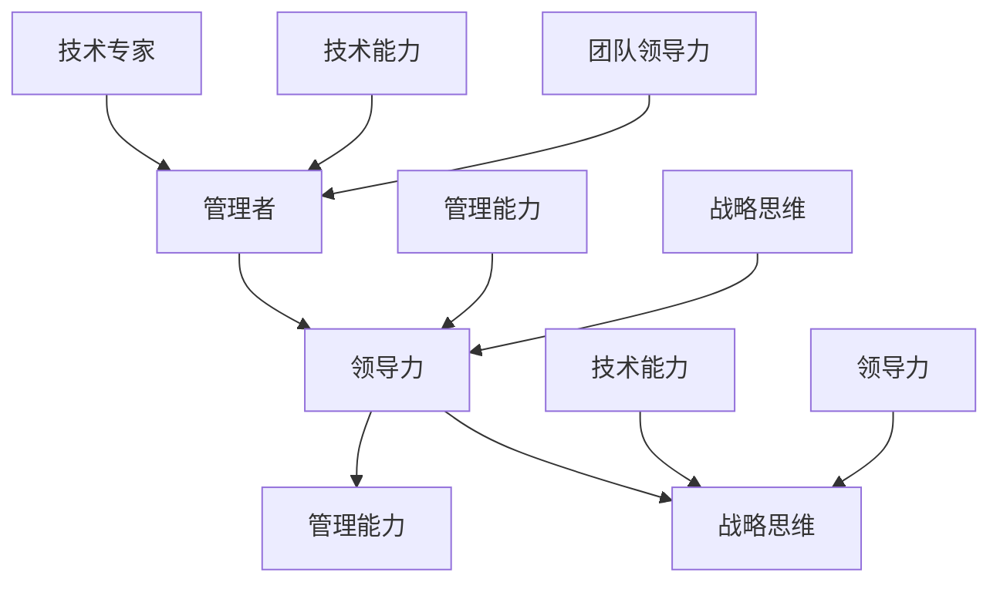

                 

### 引言

#### 领导力转型的背景

在当今快速发展的技术时代，信息技术领域的变革日新月异。随着云计算、大数据、人工智能等新兴技术的兴起，技术专家的角色也在不断演变。过去，技术专家主要负责深入研究和解决复杂的技术问题，他们的成功往往依赖于个人技术能力和专业知识。然而，随着企业对技术管理需求的增加，技术专家需要更多地参与到团队管理、项目管理以及战略决策中，这就促使他们从单纯的技术角色向管理角色转型。

这一转型背后的驱动力主要包括以下几个方面：

1. **技术复杂性增加**：随着技术领域的快速发展，项目的复杂度不断提升，技术专家不再能单独完成所有任务，需要与团队成员紧密合作，共同应对挑战。
2. **项目管理需求**：企业越来越重视项目管理和时间规划，技术专家需要掌握项目管理工具和方法，以确保项目按时、按质完成。
3. **组织战略角色**：技术专家在组织中的角色不再仅仅是解决问题，更是战略规划的一部分。他们的技术洞察力和创新能力对企业的发展至关重要。

#### 管理者的角色演变

管理者的角色在过去几十年中发生了显著变化。从传统的监督和执行者，逐渐转变为变革推动者、团队合作者和战略规划者。这种变化不仅体现在企业内部，也受到外部环境的影响。

1. **企业需求变化**：随着市场竞争的加剧，企业需要快速响应市场变化，管理者必须具备敏捷的思维和决策能力，能够迅速调整战略和策略。
2. **全球化背景**：全球化使得企业需要面对多样化的文化背景和市场环境，管理者需要具备跨文化的沟通能力和团队领导力。
3. **技术进步**：技术的进步，特别是数字化的深入，使得管理者需要掌握更多的技术知识，以更好地理解和利用技术为企业服务。

#### 企业对转型管理的需求

企业对管理者的需求发生了根本性的变化。过去，管理者更多关注的是运营效率和成本控制，而现在，企业更加重视创新能力和团队协作。技术专家转型为管理者，能够为企业带来以下几个方面的价值：

1. **技术洞察力**：技术专家拥有深厚的技术背景，能够为企业的技术创新提供有力的支持。
2. **团队领导力**：技术专家在转型过程中，学会了如何带领团队，提高团队效率和创造力。
3. **战略规划**：技术专家具备前瞻性的技术视角，能够帮助企业制定长远的战略规划。

#### 领导力转型的重要性

领导力转型对个人和组织都具有重要意义。对于个人来说，成功转型不仅能够提升职业发展的空间，还能够实现个人价值的最大化。对于组织来说，领导力转型能够提高团队和组织的整体效能，促进企业的持续发展。

1. **个人职业发展**：领导力转型为技术专家提供了新的职业路径，使得他们能够在更高的层次上发挥自己的才能。
2. **团队和组织的效能**：有效的领导力能够提升团队的协作效率和创新能力，从而推动组织的发展。
3. **企业竞争力**：具备领导力的技术专家能够帮助企业更好地应对市场变化，提高企业的竞争力。

通过上述分析，我们可以看到，领导力转型不仅是技术专家个人的职业需求，更是企业在新时代背景下的必然选择。在接下来的章节中，我们将深入探讨领导力转型的核心概念、关键步骤以及成功转型的策略和方法。

### 核心概念与联系

在探讨领导力转型之前，我们需要明确几个核心概念，并理解它们之间的相互联系。这些概念包括技术专家、管理者、领导力、管理能力和战略思维。通过这些核心概念，我们可以构建一个完整的领导力转型框架，从而更好地理解转型的过程和策略。

#### 技术专家与管理者角色差异

**技术专家**通常专注于技术研究和开发，他们的工作内容主要是解决具体的技术问题，进行代码编写、系统设计和优化。技术专家的成就在于技术深度和专业知识，他们需要不断学习新的技术趋势和工具，以保持自己的竞争力。

**管理者**则更多地关注团队和项目的整体进展，他们的工作内容包括团队管理、资源分配、项目规划和执行。管理者的成功不仅仅依赖于技术能力，更重要的是他们的领导力和管理技能，如沟通能力、决策能力和团队协作能力。

**角色转变的难点**：

- **技术专注与管理需求的平衡**：技术专家需要从单纯的技术问题解决者转变为关注整体项目进展的管理者，这需要重新调整工作重心。
- **管理知识和经验的积累**：技术专家需要学习管理知识和技能，如项目管理、人力资源管理和战略规划。
- **领导力的培养**：技术专家需要提升领导力，学会激励团队、建立信任和推动变革。

#### 领导力转型的关键概念

**领导力**是领导力转型的核心概念之一。领导力不仅仅是管理者的职责，它是一种能够影响和激励他人实现共同目标的能力。领导力包括多个方面，如愿景领导、变革领导、团队领导和情境领导。

**管理能力**是另一关键概念，它包括多个方面，如决策能力、沟通能力、团队管理能力和时间管理能力。管理能力是实现领导力的基础，技术专家需要通过学习和实践不断提升这些能力。

**战略思维**是指从长远的角度审视问题和制定计划的能力。战略思维包括市场分析、竞争分析、资源规划和风险评估。技术专家在转型过程中，需要培养战略思维，以更好地理解企业的发展方向和目标。

#### 核心概念之间的联系

**技术能力与领导力的结合**：

技术专家在转型过程中，需要将自身的专业技术能力与领导力相结合。技术能力可以增强领导力，使管理者在决策时能够提供技术上的支持和建议。同时，领导力可以提升技术专家在团队中的影响力和领导能力，使他们能够更好地推动技术项目的进展。

**管理能力与领导力的互动**：

管理能力是领导力的基础，而领导力则是管理能力的提升。管理能力包括决策能力、沟通能力和团队管理能力，这些能力是领导力的体现。通过提升管理能力，技术专家可以更好地发挥领导力，推动团队和组织的效能。

**团队领导力在组织中的作用**：

团队领导力是组织效能的关键。技术专家在转型为管理者后，需要学会如何带领团队，激励团队成员，建立高效的团队协作机制。团队领导力不仅影响团队的工作效率和创新能力，也直接关系到组织的整体绩效。

#### 核心概念Mermaid流程图

为了更好地展示技术专家到管理者的角色转变过程，我们可以使用Mermaid流程图来描述各个核心概念之间的联系。

通过这个流程图，我们可以清晰地看到技术专家在转型过程中，需要同时提升技术能力、领导力和管理能力，并培养战略思维，以实现成功转型。

### 从技术专家到管理者的转变

从技术专家到管理者的转变是许多专业人士职业生涯中的一个关键步骤。这一转变不仅要求技术专家在技术领域的深厚积累，还需要他们在管理能力和领导力方面进行全面提升。在这个过程中，技术背景与管理的连接显得尤为重要，它不仅决定了技术专家能否顺利转型，还影响了他们在新角色中的表现。

#### 技术背景与管理的连接

技术背景与管理之间的连接是领导力转型的基石。技术专家在转型过程中，需要将他们在技术领域的专业知识和经验运用到管理工作中。以下是一些关键点：

1. **技术能力在管理中的运用**：技术专家在项目管理中，需要利用其技术能力来理解项目的复杂性和需求，从而制定合理的项目计划和策略。例如，他们可以参与需求分析，评估技术实现的可行性，提出技术解决方案，并在项目中担任技术指导的角色。

2. **技术问题解决与管理决策的结合**：技术专家在解决技术问题的过程中，积累了丰富的经验和技巧。在转型为管理者后，这些经验和技巧可以用于指导团队解决问题，并在决策过程中提供技术视角。例如，在处理技术难题时，技术专家可以利用自己的专业知识来评估不同的解决方案，并选择最优方案。

3. **技术视野与战略规划**：技术专家在管理角色中，还需要具备战略规划能力。这要求他们不仅关注当前的技术问题，还要有前瞻性的技术视野，能够识别未来的技术趋势，并将其纳入企业的战略规划中。例如，技术专家可以分析市场趋势，预测技术发展方向，为企业的长期发展提供技术路线图。

#### 技术专家到管理者的角色转变

从技术专家到管理者的角色转变，涉及到多方面的适应和提升。以下是一些关键步骤：

1. **个人角色定位**：技术专家在转型初期需要明确自己的新角色定位。他们需要从单一的技术角色转变为关注整体项目进展的管理者。这意味着他们需要更多地关注团队协作、资源分配和项目进度，而不是仅仅关注技术实现。

2. **组织角色适应**：技术专家需要适应组织内部的新的角色和职责。这包括与不同部门的沟通和协作，建立良好的工作关系，并理解组织的整体目标和战略。

3. **团队角色构建**：作为管理者，技术专家需要建立和管理一个高效的团队。这包括选拔合适的团队成员，明确团队目标和职责，激励团队成员发挥最佳水平，并建立有效的团队协作机制。

#### 转变的挑战与机遇

在从技术专家到管理者的转变过程中，技术专家会面临一系列挑战和机遇：

**挑战**：

- **管理知识与经验的积累**：技术专家需要学习管理知识和技能，如项目管理、人力资源管理和战略规划，这需要时间和努力。
- **时间管理**：技术专家需要学会如何平衡技术工作和管理工作，确保两者都能高效完成。
- **领导力的提升**：技术专家需要培养领导力，学会激励和引导团队成员，建立信任和合作关系。

**机遇**：

- **职业发展的新空间**：转型为管理者为技术专家提供了新的职业发展路径，使他们能够在更高的层次上发挥才能。
- **组织贡献的增加**：技术专家在转型后，可以更有效地推动团队和组织的效能，为企业的创新和发展做出更大贡献。
- **领导力的提升**：通过转型，技术专家可以提升自己的领导力，成为组织中的关键人物，并在未来可能担任更高级别的管理职位。

总之，从技术专家到管理者的转变是一个复杂而充满挑战的过程，但也是一个充满机遇的过程。通过正确地处理技术背景与管理的连接，技术专家可以成功实现转型，并在新的管理角色中发挥更大的作用。

### 管理者的技能与素质

在从技术专家到管理者的转型过程中，提升管理技能和素质是至关重要的。管理者不仅需要具备卓越的技术能力，还需要掌握一系列关键的管理技能和素质，这些是确保团队高效运作和组织成功的关键。

#### 管理者的核心技能

1. **沟通能力**：沟通是管理者的核心技能之一。有效的沟通能够确保信息准确传达，避免误解和冲突。管理者需要能够清晰、简洁地表达自己的想法，同时倾听团队成员的意见和建议，建立双向沟通的机制。

2. **决策能力**：决策能力是管理者的另一个关键技能。管理者需要能够在压力下做出快速而明智的决策，同时考虑到所有相关的因素，如资源、时间、风险和团队利益。决策能力包括分析能力、判断力和前瞻性。

3. **团队管理能力**：团队管理能力包括领导团队、激励团队成员、协调团队合作和解决团队冲突。管理者需要了解团队成员的个性和工作风格，并能够根据这些差异进行有效的管理，以最大化团队的效率和创新能力。

4. **时间管理能力**：时间管理是确保项目按时完成的关键。管理者需要能够合理安排时间和任务，确保团队成员的效率和产出。这包括设定优先级、制定时间表和跟踪进度。

5. **问题解决能力**：在项目管理中，问题不可避免。管理者需要具备强大的问题解决能力，能够迅速识别问题、分析原因并提出解决方案。这需要逻辑思维、创造性思维和解决问题的策略。

#### 管理者所需的关键素质

1. **自我驱动力**：管理者需要拥有强烈的自我驱动力，能够在没有外部激励的情况下主动工作和学习。这种自我驱动力可以推动管理者不断提升自己的能力和专业知识，保持对工作的热情和专注。

2. **适应性**：在快速变化的环境中，管理者需要具备高度适应性，能够迅速适应新情况、新挑战和新要求。适应性包括灵活的思维、开放的心态和快速学习的能力。

3. **诚信与透明度**：诚信是管理者赢得团队信任的关键。管理者需要诚实守信，透明地处理事务，确保团队成员了解实际情况，增强团队的信任和凝聚力。

4. **同理心**：同理心是指能够理解并感受到他人情感的能力。管理者需要具备同理心，能够站在团队成员的角度思考问题，关心他们的需求和困难，建立积极的工作关系。

5. **领导力**：领导力是管理者的核心素质。领导力包括愿景领导、变革领导和团队领导。管理者需要能够激励和引导团队成员，共同实现目标，并在变革中保持团队的稳定和积极性。

#### 技能与素质的培养与提升

1. **持续学习**：管理者需要不断学习新的管理知识和技能，跟上时代的步伐。这可以通过参加培训课程、阅读相关书籍和文章、参与行业会议和研讨会来实现。

2. **实践与反思**：通过实际管理工作，管理者可以积累经验，并在实践中反思和总结。这包括定期评估自己的管理行为和结果，识别改进点，并制定相应的改进计划。

3. **寻求反馈**：管理者应该积极寻求来自团队成员和上级的反馈，了解自己在管理方面的优点和不足，并根据反馈进行改进。

4. **建立人脉**：建立广泛的人脉网络可以帮助管理者获取新的信息和资源，学习其他管理者的经验，并扩展自己的视野。

5. **角色模范**：寻找并学习优秀的管理者，了解他们的成功经验和领导风格，可以帮助管理者更好地理解管理职责和提升管理能力。

总之，管理者的技能与素质的培养和提升是一个持续的过程，需要不断的学习和实践。通过持续的努力和自我提升，技术专家可以成功地转型为一名出色的管理者，并在新的角色中取得更大的成就。

### 领导力的艺术

领导力是管理者的核心素质之一，它不仅仅是职位赋予的权威，更是一种能够影响和激励他人实现共同目标的能力。领导力的艺术涉及到多个方面，包括领导力理论、领导风格和影响力的培养与发展。

#### 领导力理论概述

领导力理论多种多样，不同的理论提供了不同的视角来解释领导现象。以下是几种主要的领导力理论：

1. **特质理论**：特质理论认为领导者具备某些固有的特质，如自信、诚实和决心。这些特质使得他们在领导岗位上表现出色。然而，随着对领导行为的研究深入，人们逐渐认识到特质并非决定性因素。

2. **行为理论**：行为理论关注领导者的行为模式，认为领导行为可以通过学习而改变。这种行为理论强调领导者如何处理任务和关系，以及他们的行为如何影响团队的表现。

3. **情境理论**：情境理论认为领导风格应该根据不同的情境来调整。这种理论认为没有一种“最佳”的领导风格，领导者需要根据具体情境灵活运用不同的领导策略。

4. **变革领导理论**：变革领导理论强调领导者推动组织变革的能力。这种理论认为领导者的主要任务是激发员工的创新意识和积极性，推动组织不断适应外部环境的变化。

5. **服务型领导理论**：服务型领导理论认为领导者应该以服务团队成员为中心，关注团队成员的需求和成长。这种领导风格强调领导者与团队成员之间的信任和合作，以提高团队的凝聚力和效能。

#### 领导风格与影响力

领导风格是指领导者处理团队和工作的方式。不同的领导风格对团队的影响各不相同。以下是几种常见的领导风格：

1. **指令型领导风格**：指令型领导者通过明确指示和命令来指导团队，这种风格适用于紧急情况和需要快速决策的场景。

2. **参与型领导风格**：参与型领导者鼓励团队成员参与决策过程，以提高团队的凝聚力和创新性。这种风格适用于需要广泛参与和共识的项目。

3. **授权型领导风格**：授权型领导者给予团队成员更多的自主权和责任，鼓励他们独立思考和解决问题。这种风格适用于高度专业化的团队和需要创新和灵活性的工作环境。

4. **变革型领导风格**：变革型领导者通过激发团队成员的潜能和积极性，推动团队实现变革。这种风格适用于需要重大变革和创新的组织环境。

领导者的风格对团队的影响至关重要。有效的领导风格可以激发团队成员的潜能，提高团队的工作效率和创新能力。然而，领导风格也需要根据具体情境进行调整，以适应不同的团队和任务需求。

#### 领导力的发展与实践

领导力并非与生俱来，而是可以通过学习和实践不断提升。以下是一些发展领导力的方法：

1. **自我反思**：领导者需要定期进行自我反思，评估自己的领导行为和效果。通过自我反思，领导者可以发现自身的不足并制定改进计划。

2. **学习与培训**：参加领导力培训和研讨会可以帮助领导者学习新的领导技巧和理论，了解最新的领导趋势。

3. **实践与反馈**：通过实际管理工作，领导者可以不断实践和应用所学知识，并从团队成员和上级的反馈中学习和成长。

4. **寻求导师指导**：寻求经验丰富的导师可以帮助领导者快速提升领导能力，获得宝贵的建议和指导。

5. **培养同理心**：同理心是领导者成功的关键素质。通过培养同理心，领导者可以更好地理解团队成员的需求和感受，建立更紧密的团队关系。

总之，领导力的艺术是一个复杂而持续的过程，需要领导者不断地学习、实践和反思。通过掌握不同的领导力理论和风格，并不断发展和提升自己的领导力，技术专家可以成功地实现从技术专家到管理者的转型，并在新的角色中发挥出色的领导力。

### 领导力转型案例分析

为了更好地理解技术专家如何成功实现领导力转型，我们可以通过几个真实的案例来进行分析。这些案例展示了技术专家在转型过程中面临的挑战、采取的策略以及最终的成果。

#### 案例一：某科技公司的技术总监

**背景**：
某科技公司是一家专注于人工智能领域的初创公司，技术总监王明（化名）拥有深厚的机器学习背景和丰富的项目经验。在公司快速发展阶段，王明意识到，单纯的编程和技术优化已经无法满足公司需求，他需要承担更多的管理职责，推动团队创新和项目成功。

**挑战**：
1. **管理知识与经验的积累**：王明在技术领域表现出色，但在管理方面缺乏系统的学习和实践经验。
2. **时间管理和优先级设定**：作为技术总监，王明需要平衡技术工作和管理工作，确保两者都能高效完成。
3. **领导力的培养**：王明需要提升领导力，激励和引导团队成员，建立有效的团队协作机制。

**策略**：
1. **系统学习管理知识**：王明参加了多个管理培训课程，学习了项目管理、人力资源管理、战略规划等知识，为转型打下理论基础。
2. **实践与反思**：王明在项目管理中积累了大量实践经验，并定期进行反思和总结，识别改进点。
3. **寻求导师指导**：王明寻求了一位经验丰富的管理导师，定期与其交流，获取宝贵的建议和指导。

**成果**：
经过几年的努力，王明成功地实现了从技术专家到管理者的转型。他不仅掌握了关键的管理技能和知识，还提升了自己的领导力，成为公司不可或缺的核心人物。在他的领导下，公司项目按时完成，团队凝聚力大幅提升，公司的市场份额和技术创新能力也得到了显著提高。

#### 案例二：某互联网公司的CTO

**背景**：
某互联网公司正处于快速扩展阶段，其首席技术官李华（化名）是一名资深的技术专家，拥有丰富的软件研发和项目管理经验。随着公司的壮大，李华意识到，他需要从技术主导者转变为战略规划者和领导者，以适应公司的发展需求。

**挑战**：
1. **技术视野与战略思维的转变**：李华需要从关注单一技术问题转变为关注公司整体战略和长期发展。
2. **跨部门沟通与合作**：作为CTO，李华需要与公司的各个部门（如市场、销售、运营等）进行有效沟通，协调资源。
3. **领导力的提升**：李华需要培养领导力，激励和管理一个多元化的团队。

**策略**：
1. **培养战略思维**：李华通过参加行业研讨会、阅读相关书籍和文章，提升自己的战略思维能力。
2. **跨部门合作**：李华积极与其他部门建立合作关系，参与跨部门项目，了解不同部门的运作和需求。
3. **领导力培训**：李华参加了多个领导力培训课程，学习了变革领导、团队领导等领导技能。

**成果**：
通过不断的学习和实践，李华成功地实现了领导力转型。他不仅为公司制定了清晰的战略规划，还提升了团队的合作效率和创新能力。在他的领导下，公司的技术实力和市场竞争力得到了显著提升，团队士气高涨，公司的整体业绩也实现了持续增长。

#### 案例三：某金融机构的技术总监

**背景**：
某金融机构的技术总监陈晨（化名）在软件设计和开发领域有着丰富的经验。随着金融科技的发展，金融机构对技术管理的需求不断增加，陈晨意识到他需要从技术专家转型为管理者，以更好地应对市场变化和提升企业竞争力。

**挑战**：
1. **风险管理**：技术总监在转型过程中需要关注技术风险，确保系统的稳定和安全。
2. **合规要求**：金融行业的合规要求严格，技术总监需要确保技术解决方案符合相关法规。
3. **团队管理**：陈晨需要管理一个技术团队，提升团队的专业能力和合作效率。

**策略**：
1. **风险管理培训**：陈晨参加了金融科技风险管理培训，学习了如何识别和管理技术风险。
2. **合规学习**：陈晨通过参加行业研讨会和阅读相关法规，提升自己的合规意识。
3. **团队建设**：陈晨制定了详细的团队建设计划，包括技能培训、团队活动和激励措施。

**成果**：
通过一系列的努力，陈晨成功地实现了领导力转型。他不仅提升了团队的专业能力和合作效率，还确保了系统的稳定性和合规性。在他的领导下，公司成功推出了一系列创新产品，市场反响热烈，企业的技术竞争力得到了显著提升。

### 案例启示与反思

从上述案例中，我们可以得到一些重要的启示和反思：

1. **系统学习与持续实践**：成功的领导力转型需要系统学习和持续实践。技术专家需要通过培训、读书和实际工作经验，不断提升自己的管理知识和技能。

2. **战略思维与跨部门合作**：技术专家在转型过程中，需要培养战略思维，关注企业整体发展和市场趋势。同时，跨部门合作是提升团队效率和创新能力的关键。

3. **领导力的提升**：领导力是管理者的核心素质。技术专家需要通过学习和实践，提升自己的领导力，学会激励和引导团队成员。

4. **风险管理**：在金融和技术密集型行业，技术总监需要具备强烈的风险管理意识，确保技术解决方案的稳定性和合规性。

通过这些案例，我们可以看到，领导力转型不仅是一个理论问题，更是一个实践问题。技术专家需要积极面对挑战，采取合适的策略，才能成功实现领导力转型，并在新的角色中发挥出色的领导力。

### 实践指南：领导力转型的步骤和策略

从技术专家到管理者的领导力转型是一个系统性、持续性的过程，需要明确的步骤和有效的策略。以下是一些具体的转型步骤和策略，以及实用的工具和资源，帮助技术专家顺利实现领导力转型。

#### 第一步：自我评估与目标设定

**自我评估**：

在转型之前，技术专家需要对自身进行全面的评估，识别自己的优势和不足。以下是一些评估要点：

- **技术能力**：评估自己在技术领域的专业知识和实践经验。
- **管理知识**：了解自己在管理理论和实践方面的了解程度。
- **领导力**：识别自己在领导力和影响力方面的优势和不足。
- **沟通与团队合作**：评估自己在沟通和团队合作方面的表现。

**目标设定**：

基于自我评估的结果，技术专家需要设定清晰的转型目标。这些目标可以是短期的，如参加特定的管理培训课程，也可以是长期的，如成为团队领导者或项目管理负责人。目标设定应具体、可衡量、可实现，并与个人职业规划相一致。

#### 第二步：系统学习与管理培训

**系统学习**：

技术专家需要通过多种途径系统学习管理知识和技能。以下是一些推荐的学习资源：

- **管理书籍**：如《领导者的语言》、《高效能人士的七个习惯》等。
- **在线课程**：如Coursera、edX等平台上提供的管理课程。
- **行业研讨会**：参加与领导力和管理相关的行业研讨会和讲座。

**管理培训**：

参加专门的管理培训课程，可以帮助技术专家快速提升管理技能。以下是一些实用的管理培训课程：

- **项目管理课程**：如PMP（项目管理专业人士）认证课程。
- **领导力培训**：如领导力发展课程、情境领导力培训等。
- **团队建设与沟通技能培训**：如团队协作培训、有效沟通技巧培训等。

#### 第三步：实践与反思

**实践**：

理论学习需要与实践相结合。技术专家可以通过以下方式积累实践经验：

- **项目管理**：参与实际项目，担任项目经理或关键角色，提升项目管理和团队协作能力。
- **跨部门合作**：主动参与跨部门项目，了解不同部门的运作和需求，提升跨部门沟通与合作能力。
- **志愿者工作**：参加志愿者组织，担任领导角色，锻炼领导力和团队合作能力。

**反思**：

定期进行反思是提升领导力的关键。技术专家可以采取以下反思方法：

- **日记反思**：每天或每周记录自己的领导行为和团队表现，分析成功和失败的原因。
- **定期评估**：定期与上级、同事和下属进行反馈交流，了解自己在领导力方面的表现和改进点。
- **导师指导**：寻求经验丰富的导师，定期进行一对一的指导和反馈，获取宝贵的建议和指导。

#### 第四步：培养战略思维与创新能力

**战略思维**：

战略思维是管理者的关键能力之一。技术专家可以通过以下方式培养战略思维：

- **市场分析**：定期进行市场分析，了解行业趋势和竞争态势。
- **竞争分析**：分析竞争对手的优势和劣势，为企业的战略规划提供支持。
- **资源规划**：合理配置资源，确保企业能够高效地实现战略目标。

**创新能力**：

创新能力是企业持续发展的动力。技术专家可以通过以下方式提升创新能力：

- **技术前瞻**：关注最新的技术趋势，预测未来可能的技术发展。
- **团队协作**：鼓励团队成员提出创新想法，通过团队合作实现创新。
- **试错文化**：鼓励团队成员尝试新方法，从失败中学习，不断优化创新过程。

#### 第五步：寻求反馈与持续学习

**寻求反馈**：

有效的反馈是提升领导力的关键。技术专家可以通过以下方式获取反馈：

- **360度评估**：进行360度评估，收集来自不同角度的反馈。
- **定期反馈会议**：与团队成员定期进行反馈会议，了解团队成员的意见和建议。
- **匿名反馈**：设置匿名反馈机制，鼓励团队成员自由表达意见和建议。

**持续学习**：

领导力是一个持续发展的过程。技术专家需要保持持续学习的态度，不断提升自己的能力和知识。以下是一些建议：

- **订阅行业资讯**：订阅与领导力、管理相关的行业资讯和杂志，保持对最新趋势的了解。
- **专业交流**：参加行业交流会议和研讨会，与同行交流经验和观点。
- **在线学习**：利用在线学习平台，不断学习新的管理知识和技能。

#### 第六步：制定实施计划与跟踪进展

**制定实施计划**：

为了确保领导力转型的顺利进行，技术专家需要制定详细的实施计划，包括：

- **学习计划**：列出需要学习的管理知识和技能，制定学习时间表。
- **实践计划**：安排参与的项目和活动，确保实践机会的落实。
- **评估计划**：设定定期评估的时间节点和评估方法，跟踪转型进展。

**跟踪进展**：

通过以下方式跟踪领导力转型的进展：

- **定期回顾**：定期回顾学习计划和实践计划，总结经验教训。
- **调整计划**：根据反馈和评估结果，及时调整学习计划和实施策略。
- **记录与分享**：记录领导力转型的过程和成果，与团队成员和上级分享经验。

通过以上步骤和策略，技术专家可以逐步实现从技术专家到管理者的转型，提升领导力，为团队和组织的发展做出更大的贡献。

### 领导力转型的挑战与应对

在从技术专家到管理者的转型过程中，技术专家会面临一系列挑战，这些挑战不仅影响他们的职业发展，也可能影响团队和组织的效能。以下是一些常见的挑战及其应对策略。

#### 挑战一：管理知识和技能的不足

**原因**：技术专家在转型前主要专注于技术研究和开发，对管理知识和技能的了解相对较少，缺乏系统的管理理论学习。

**应对策略**：

- **系统学习**：参加管理培训课程，系统学习项目管理、人力资源管理、财务管理等管理知识。
- **实践经验**：通过实际项目管理和团队协作，积累管理实践经验。
- **导师指导**：寻求经验丰富的管理导师，获取专业的指导和建议。

#### 挑战二：时间管理问题

**原因**：技术专家在转型初期可能会面临时间管理上的困难，难以平衡技术工作和管理工作。

**应对策略**：

- **制定计划**：制定详细的工作计划，明确每天、每周和每月的任务和时间安排。
- **优先级设定**：根据任务的紧急程度和重要性，合理设定任务优先级。
- **时间管理工具**：利用时间管理工具，如时间跟踪软件和待办事项列表，提高工作效率。

#### 挑战三：领导力的提升

**原因**：技术专家在转型过程中，可能缺乏领导力和影响力，难以有效激励和引导团队成员。

**应对策略**：

- **领导力培训**：参加领导力培训课程，学习不同的领导风格和技巧。
- **实践领导**：通过实际管理工作，提升领导力和影响力。
- **建立信任**：通过诚实、透明和公平的管理行为，建立与团队成员的信任关系。

#### 挑战四：沟通障碍

**原因**：技术专家在转型过程中，可能会因为技术背景导致与团队成员之间的沟通障碍。

**应对策略**：

- **倾听与理解**：积极倾听团队成员的意见和建议，理解他们的需求和期望。
- **清晰表达**：提高表达能力，确保沟通内容清晰、准确。
- **跨文化沟通**：如果团队包含不同文化背景的成员，学习跨文化沟通技巧，尊重和理解不同文化的差异。

#### 挑战五：团队冲突和协作问题

**原因**：在转型过程中，技术专家可能面临团队内部冲突和协作问题，如角色不明确、职责冲突等。

**应对策略**：

- **明确角色和职责**：确保团队成员的角色和职责明确，避免职责重叠和冲突。
- **建立团队目标**：明确团队目标，确保团队成员目标一致，增强团队合作意识。
- **冲突管理**：学习冲突管理和解决技巧，及时处理团队内部的冲突。

#### 挑战六：应对外部压力和不确定性

**原因**：作为管理者，技术专家需要应对外部环境的变化和不确定性，如市场需求变化、技术进步等。

**应对策略**：

- **战略思维**：培养战略思维能力，预测市场和技术趋势，制定灵活的战略计划。
- **持续学习**：关注行业动态，不断学习新知识，提升自身的竞争力。
- **风险管理**：建立风险管理体系，提前识别和应对潜在的风险。

通过以上应对策略，技术专家可以克服转型过程中的各种挑战，提升领导力，成为优秀的团队领导者，为团队和组织的发展做出积极贡献。

### 总结与展望

领导力转型是从技术专家到管理者职业生涯中的一项重要任务，它不仅关乎个人的职业发展，更关系到团队和组织的效能。通过本文的探讨，我们明确了领导力转型的背景和重要性，深入分析了核心概念、角色转变的难点和策略，并提供了详细的实践指南。

首先，技术专家在转型过程中需要认识到技术背景与管理需求的平衡，通过系统学习和管理培训提升管理知识和技能。其次，领导者需要培养战略思维和创新能力，以应对快速变化的外部环境。此外，有效的沟通能力和团队合作是成功转型的重要保障。最后，通过实践和反思，技术专家可以不断提升领导力，实现从技术专家到管理者的成功转型。

展望未来，随着技术的发展和市场竞争的加剧，领导力转型将变得更加重要。技术专家需要不断学习新的管理知识和技能，提升自身的领导力和影响力。同时，企业也需要为技术专家提供良好的成长环境和培训机会，以支持他们的转型和发展。

总之，领导力转型是一项复杂而充满挑战的过程，但也是一个充满机遇的旅程。通过持续的学习和实践，技术专家可以成功转型，成为团队和组织的卓越领导者，为企业的创新和发展贡献力量。

### 作者信息

作者：AI天才研究院/AI Genius Institute & 禅与计算机程序设计艺术 /Zen And The Art of Computer Programming

