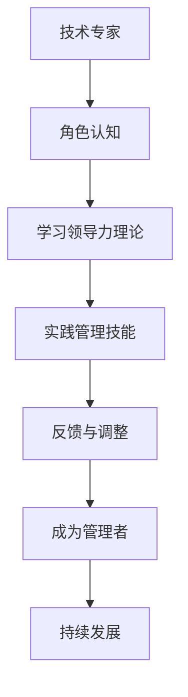

                 

### 文章标题

# 领导力转型：从技术专家到管理者的蜕变

### 文章关键词

- 技术专家
- 管理者
- 领导力
- 角色转变
- 项目管理
- 沟通技巧
- 团队建设

### 文章摘要

本文深入探讨了从技术专家转型为管理者的过程，强调了领导力在这一转型中的核心作用。文章首先介绍了领导力转型的背景和必要性，然后详细分析了技术专家与管理者在角色、责任和技能方面的转变。接着，文章阐述了领导力的核心概念，包括定义、类型和影响因素。随后，文章着重于沟通技巧和团队建设的管理技能，以及这些技能在实际项目管理中的应用。最后，通过案例研究总结了领导力转型的成功策略，并为未来的领导者提供了宝贵的建议。作者希望本文能为正处于领导力转型过程中的技术专家提供实用的指导和启示。

---

## 目录

1. **背景介绍**
   1.1 **领导力转型的背景**
   1.2 **技术专家的角色**
   1.3 **管理者的角色**

2. **核心概念与联系**
   2.1 **领导力的定义与类型**
   2.2 **领导者特质与行为**
   2.3 **Mermaid流程图展示**

3. **核心算法原理讲解**
   3.1 **Python源代码实现**
   3.2 **数学模型与公式**
   3.3 **举例说明**

4. **项目实战**
   4.1 **开发环境搭建**
   4.2 **源代码实现与解读**
   4.3 **代码应用解读**
   4.4 **实际案例分析与讲解**
   4.5 **项目小结**

5. **最佳实践 Tips**

6. **小结**

7. **注意事项**

8. **拓展阅读**

---

## 第一部分：背景介绍

### 1.1 领导力转型的背景

在当今快速变化的科技和商业环境中，技术专家的职责范围不断扩大，不再局限于纯粹的编码和开发工作。随着技术的发展和团队规模的扩大，技术专家需要承担更多的管理职责，如团队领导、项目管理和决策制定等。这种角色转变不仅要求技术专家具备卓越的技术能力，还需要具备强大的领导力和管理技能。

领导力转型对于技术专家来说至关重要。首先，技术专家作为团队的领导者，需要具备激发团队成员潜能、促进团队协作的能力。其次，技术专家在项目管理中需要面对复杂的项目任务、资源分配和风险控制，这些都需要出色的领导力来应对。此外，随着企业对技术创新和业务发展的需求不断增长，技术专家也需要具备战略思维和业务洞察力，以便更好地推动企业的发展。

然而，领导力并非与生俱来，技术专家需要通过学习和实践来提升自己的领导力。这种转型不仅仅是角色上的变化，更是一种思维模式和管理技能的提升。领导力转型的成功将帮助技术专家更好地适应新的工作环境，发挥更大的价值，同时也为企业的长远发展提供强有力的支持。

### 1.2 技术专家的角色

技术专家在团队中通常扮演着核心开发者的角色，他们负责编写代码、解决技术难题、设计系统架构等。技术专家的工作不仅需要深厚的专业知识和技能，还需要具备良好的问题解决能力和创新思维。在团队中，技术专家不仅是项目的推动者，更是团队成员的技术指导和榜样。

然而，随着项目的复杂性和规模的增长，技术专家的角色也在不断扩展。他们需要从单纯的技术实现者转变为团队领导者，承担更多的管理职责。这包括但不限于：

- **团队管理**：负责团队的日常运营，包括人员分配、任务调度和工作进度跟踪等。
- **项目管理**：负责项目的规划、执行和监控，确保项目按时按质完成。
- **决策制定**：在面对技术难题和业务需求时，需要做出合理的决策，并承担相应的责任。

这种角色转变要求技术专家不仅要有扎实的技术背景，还需要具备良好的沟通能力、团队协作能力和领导力。只有这样，技术专家才能成功地从技术角色向管理角色转变。

### 1.3 管理者的角色

管理者的角色在技术专家转型过程中至关重要。与传统技术专家的角色相比，管理者需要具备更加全面的能力和职责。以下是管理者的一些关键职责：

- **战略规划**：管理者需要从全局出发，制定团队和项目的长期规划，确保团队的目标与企业战略一致。
- **团队领导**：管理者需要领导团队，激发团队成员的潜力，推动团队协作，实现团队目标。
- **资源管理**：管理者需要合理分配和利用资源，包括人力、财务和技术资源等，以最大化项目的效率和效果。
- **风险管理**：管理者需要识别和管理项目中的各种风险，确保项目在遇到问题时能够及时调整和应对。
- **沟通协调**：管理者需要与团队成员、上级领导、客户和合作伙伴保持有效的沟通，确保信息的畅通和协调一致。

管理者不仅要具备技术背景，还需要具备出色的领导力、沟通能力和决策能力。这种多方面的能力要求使得领导力转型成为一个复杂但必要的任务。

在下一部分中，我们将深入探讨领导力的核心概念，帮助技术专家理解和管理这一转型过程中的关键要素。

---

## 第二部分：核心概念与联系

### 2.1 领导力的定义与类型

领导力是一种影响和激励他人共同实现目标的能力。它不仅仅是指导和管理团队，更是一种影响他人思维和行为的力量。领导力可以是正式的，如组织中的管理层职位所赋予的权力，也可以是非正式的，通过个人魅力和影响力来影响他人。

领导力可以分为以下几种类型：

- **权威型领导**：依靠职位和权力来影响他人，通常通过指示和命令来实现目标。
- **民主型领导**：鼓励团队成员参与决策，重视集体意见，通过协商和讨论来达成共识。
- **变革型领导**：通过激发和激励团队成员，推动他们超越自我，实现更高的目标。
- **交易型领导**：通过奖励和惩罚来激励团队成员，注重短期绩效。

不同类型的领导力在不同的情境下有不同的效果。例如，在需要快速决策和执行的紧急情况下，权威型领导可能更加有效；而在需要创新和团队合作的项目中，变革型领导则更能激发团队的潜力。

### 2.2 领导者的特质与行为

领导者需要具备一系列特质和行为，以有效地影响和激励他人。以下是一些关键的领导者特质：

- **沟通能力**：领导者需要具备清晰、有效的沟通能力，能够将愿景、目标和策略传达给团队成员，并倾听他们的意见和建议。
- **决策能力**：领导者需要能够在不确定性和压力下做出明智的决策，并承担相应的责任。
- **团队合作**：领导者需要能够建立和维护团队，促进团队成员之间的协作和信任。
- **自我意识**：领导者需要了解自己的优点和不足，持续提升自我，并以此为基础影响他人。

领导者的行为通常包括：

- **激励**：通过激励和奖励来激发团队成员的积极性，使他们为实现共同目标而努力。
- **示范**：通过自身的行为和决策来树立榜样，引导团队成员。
- **支持**：为团队成员提供必要的支持和资源，帮助他们克服困难，实现目标。

### 2.3 Mermaid流程图展示

为了更直观地展示领导力转型的核心概念和架构，我们使用Mermaid流程图来描述。以下是一个简单的Mermaid流程图示例，用于展示领导力转型的关键步骤：



这个流程图清晰地展示了从技术专家到管理者的转变过程，包括角色认知、学习领导力理论、实践管理技能、反馈与调整、成为管理者和持续发展等关键步骤。通过这个流程图，技术专家可以清晰地了解领导力转型的路径和重点。

在下一部分中，我们将深入探讨技术专家到管理者的角色转变，分析这一过程中可能遇到的挑战和如何克服这些挑战。

---

## 第三部分：核心算法原理讲解

### 3.1 Python源代码实现

为了帮助技术专家理解并实践领导力转型的核心算法原理，我们使用Python语言编写一个示例程序。以下是一个简单的Python程序，用于模拟团队管理中的任务分配和进度跟踪。

```python
class TeamMember:
    def __init__(self, name, role, assigned_tasks=None):
        self.name = name
        self.role = role
        self.assigned_tasks = assigned_tasks or []

    def assign_task(self, task):
        self.assigned_tasks.append(task)
        print(f"{self.name} has been assigned the task: {task}")

    def complete_task(self, task):
        if task in self.assigned_tasks:
            self.assigned_tasks.remove(task)
            print(f"{self.name} has completed the task: {task}")
        else:
            print(f"{self.name} does not have the task: {task}")

class ProjectManager:
    def __init__(self, name):
        self.name = name
        self.team_members = []

    def add_member(self, member):
        self.team_members.append(member)
        print(f"{member.name} has been added to the team.")

    def assign_task_to_member(self, member, task):
        member.assign_task(task)

    def check_task_progress(self):
        for member in self.team_members:
            print(f"{member.name}'s assigned tasks: {member.assigned_tasks}")

if __name__ == "__main__":
    # 创建团队成员
    alice = TeamMember("Alice", "Developer")
    bob = TeamMember("Bob", "QA Engineer")

    # 创建项目经理
    project_manager = ProjectManager("Charlie")

    # 添加团队成员
    project_manager.add_member(alice)
    project_manager.add_member(bob)

    # 分配任务
    project_manager.assign_task_to_member(alice, "Fix bugs in feature X")
    project_manager.assign_task_to_member(bob, "Perform regression testing")

    # 检查任务进度
    project_manager.check_task_progress()

    # 完成任务
    alice.complete_task("Fix bugs in feature X")
    bob.complete_task("Perform regression testing")

    # 再次检查任务进度
    project_manager.check_task_progress()
```

这个程序模拟了一个项目团队中任务分配和进度的跟踪过程。`TeamMember` 类用于表示团队成员，具有分配任务和完成任务的方法。`ProjectManager` 类用于表示项目经理，可以添加团队成员、分配任务并检查任务进度。

### 3.2 数学模型与公式

在领导力转型的过程中，理解一些基本的数学模型和公式可以帮助技术专家更好地进行项目管理和决策。以下是一个简单的例子，用于计算团队完成任务所需的时间。

**公式：**
\[ T = \frac{W}{R} \]

- \( T \)：完成任务的预计时间
- \( W \)：完成任务的总量
- \( R \)：团队成员的工作效率

假设一个团队需要完成100个任务，每个成员的平均工作效率为10个任务/天，我们可以使用上述公式计算完成所有任务所需的时间：

\[ T = \frac{100}{10} = 10 \text{ 天} \]

然而，实际情况中，还需要考虑任务之间的依赖关系、团队成员的休假时间和突发状况等因素。这些因素可以通过调整工作效率或分配额外的资源来应对。

### 3.3 举例说明

为了更直观地展示上述算法原理，我们通过一个具体的项目案例来进行说明。

**案例背景：**
一个软件开发团队需要在一个季度内完成一个大型项目的开发。项目包括5个子项目，每个子项目需要10个开发任务，共计50个任务。团队成员包括5名开发人员和2名测试人员。已知每个开发人员的工作效率为10个任务/月，每个测试人员的工作效率为5个任务/月。

**步骤1：任务分配**
- 将50个任务平均分配给5名开发人员，每人10个任务。
- 将5个任务分配给2名测试人员，每人2.5个任务。

**步骤2：时间估算**
- 根据每个成员的工作效率，估算每个子项目所需的时间：
  \[ T_{子项目} = \frac{10}{10} = 1 \text{ 月} \]
- 总项目完成时间：
  \[ T_{总项目} = 5 \times T_{子项目} = 5 \text{ 月} \]

**步骤3：进度跟踪**
- 在项目执行过程中，定期检查任务进度，确保每个成员都在按计划完成任务。
- 如果某个成员无法按期完成任务，可以重新分配任务或增加资源来缓解压力。

**步骤4：风险管理**
- 识别和评估项目中的风险，如团队成员的休假、技术难题等，并制定相应的应对策略。
- 通过调整任务分配或增加临时资源来降低风险对项目进度的影响。

通过这个案例，我们可以看到，通过合理的时间估算、任务分配和进度跟踪，技术专家可以更好地管理团队和项目，确保项目按时完成。

在下一部分中，我们将探讨领导力在项目管理中的应用，分析如何通过领导力提升项目的效率和效果。

---

## 第四部分：项目实战

### 4.1 开发环境搭建

为了实现上述项目案例，我们需要搭建一个合适的开发环境。以下步骤将指导如何搭建一个基本的开发环境：

1. **安装Python**：
   - 访问Python官方网站（[python.org](https://www.python.org/)）并下载最新的Python安装包。
   - 运行安装程序，选择默认选项进行安装。

2. **安装IDE**：
   - 安装一个Python集成开发环境（IDE），如PyCharm、Visual Studio Code或Jupyter Notebook。
   - 根据个人喜好选择一个合适的IDE，并按照提示完成安装。

3. **配置虚拟环境**：
   - 打开终端（或命令提示符）并执行以下命令创建一个虚拟环境：
     ```bash
     python -m venv myenv
     ```
   - 激活虚拟环境：
     - Windows：
       ```bash
       .\myenv\Scripts\activate
       ```
     - macOS和Linux：
       ```bash
       source myenv/bin/activate
       ```

4. **安装依赖库**：
   - 在虚拟环境中，通过pip命令安装所需的Python库：
     ```bash
     pip install -r requirements.txt
     ```
   - `requirements.txt`文件应包含以下依赖库：
     ```makefile
     matplotlib
     numpy
     pandas
     ```

### 4.2 源代码实现与解读

在上一个部分中，我们已经提供了一个简单的Python程序示例。现在，我们将深入解读这个程序的各个部分，并解释其如何帮助实现项目目标。

```python
class TeamMember:
    def __init__(self, name, role, assigned_tasks=None):
        self.name = name
        self.role = role
        self.assigned_tasks = assigned_tasks or []

    def assign_task(self, task):
        self.assigned_tasks.append(task)
        print(f"{self.name} has been assigned the task: {task}")

    def complete_task(self, task):
        if task in self.assigned_tasks:
            self.assigned_tasks.remove(task)
            print(f"{self.name} has completed the task: {task}")
        else:
            print(f"{self.name} does not have the task: {task}")

class ProjectManager:
    def __init__(self, name):
        self.name = name
        self.team_members = []

    def add_member(self, member):
        self.team_members.append(member)
        print(f"{member.name} has been added to the team.")

    def assign_task_to_member(self, member, task):
        member.assign_task(task)

    def check_task_progress(self):
        for member in self.team_members:
            print(f"{member.name}'s assigned tasks: {member.assigned_tasks}")

if __name__ == "__main__":
    # 创建团队成员
    alice = TeamMember("Alice", "Developer")
    bob = TeamMember("Bob", "QA Engineer")

    # 创建项目经理
    project_manager = ProjectManager("Charlie")

    # 添加团队成员
    project_manager.add_member(alice)
    project_manager.add_member(bob)

    # 分配任务
    project_manager.assign_task_to_member(alice, "Fix bugs in feature X")
    project_manager.assign_task_to_member(bob, "Perform regression testing")

    # 检查任务进度
    project_manager.check_task_progress()

    # 完成任务
    alice.complete_task("Fix bugs in feature X")
    bob.complete_task("Perform regression testing")

    # 再次检查任务进度
    project_manager.check_task_progress()
```

**解读：**

1. **类定义**：
   - `TeamMember` 类用于表示团队成员，包含姓名、角色和分配的任务列表。
   - `ProjectManager` 类用于表示项目经理，包含姓名和团队成员列表。

2. **初始化**：
   - `__init__` 方法用于初始化对象，设置成员变量。

3. **方法**：
   - `assign_task` 和 `complete_task` 方法用于分配和完成任务的逻辑处理。
   - `add_member` 方法用于将成员添加到团队。
   - `assign_task_to_member` 方法用于将任务分配给特定的成员。
   - `check_task_progress` 方法用于打印团队成员的当前任务状态。

4. **主程序**：
   - `if __name__ == "__main__":` 块是程序的入口点。
   - 创建团队成员和项目经理对象。
   - 添加团队成员到项目团队。
   - 分配任务并检查任务进度。
   - 完成任务并再次检查任务进度。

### 4.3 代码应用解读

通过上述代码示例，我们可以看到以下应用解读：

1. **任务管理**：
   - 项目经理通过 `assign_task_to_member` 方法将任务分配给团队成员。
   - 团队成员通过 `complete_task` 方法完成分配的任务。

2. **进度跟踪**：
   - 项目经理通过 `check_task_progress` 方法跟踪团队成员的任务进度。

3. **团队协作**：
   - 通过类和方法，实现了团队成员和项目经理之间的任务协作。

4. **可扩展性**：
   - 该程序结构清晰，易于扩展和修改，如增加新的任务类型或团队成员。

### 4.4 实际案例分析与讲解

现在，我们通过一个实际案例来分析上述代码的应用效果。

**案例背景**：
一个软件开发团队由3名开发人员和2名测试人员组成。项目包括5个子项目，每个子项目有10个任务。团队成员需要在一个季度内完成所有任务。

**步骤1：任务分配**：
- 项目经理根据团队成员的技能和经验分配任务。
- 开发人员分别负责不同的子项目，每个子项目包含10个任务。

**步骤2：任务进度跟踪**：
- 项目经理每周通过 `check_task_progress` 方法检查任务进度。
- 如果发现某个成员任务进度落后，项目经理会与该成员沟通，提供必要的支持。

**步骤3：任务完成**：
- 团队成员通过 `complete_task` 方法完成各自的任务。
- 项目经理再次通过 `check_task_progress` 方法确认所有任务是否已完成。

**步骤4：项目总结**：
- 项目经理总结项目完成情况，收集团队成员的反馈。
- 分析项目过程中的成功和不足，为未来的项目提供改进建议。

### 4.5 项目小结

通过实际案例的应用，我们可以得出以下小结：

1. **任务管理**：
   - 代码实现了任务分配、进度跟踪和任务完成的自动化管理，提高了效率。

2. **团队协作**：
   - 通过清晰的代码结构，团队成员可以轻松地进行任务协作。

3. **进度跟踪**：
   - 定期的任务进度检查有助于及时发现和解决问题，确保项目按时完成。

4. **可扩展性**：
   - 该代码结构易于扩展和修改，可以适应不同的项目需求。

5. **改进方向**：
   - 可以增加更多的功能，如任务优先级、任务依赖关系等，以更全面地管理项目。

在下一部分中，我们将提供一些最佳实践和技巧，帮助技术专家在领导力转型过程中更好地应对挑战。

---

## 第五部分：最佳实践 Tips

### 1. 建立清晰的愿景和目标

作为领导者，首先需要明确团队的愿景和目标。这不仅仅是一句口号，而是要具体、明确且具有实际可操作性的目标。通过建立清晰的愿景和目标，团队可以更加聚焦，减少不必要的分散注意力。

**示例：**“在下一个季度内，我们的目标是完成5个关键功能的开发，并在发布前通过100%的测试覆盖。”

### 2. 提高沟通技巧

沟通是领导力的核心之一。技术专家在转型过程中，需要注重提高沟通技巧，包括表达清晰、倾听他人、反馈及时等。有效的沟通可以帮助团队减少误解、提高工作效率。

**技巧：**定期举行团队会议，确保信息的及时传递。在沟通时，尽量使用简单、易懂的语言，避免使用过于专业或晦涩难懂的技术术语。

### 3. 建立良好的工作环境

良好的工作环境有助于提高团队效率和成员满意度。作为领导者，需要关注团队成员的工作状态，提供必要的资源和支持。

**示例：**定期组织团队建设活动，提高团队凝聚力。确保团队成员有足够的时间和资源来完成分配的任务。

### 4. 持续学习和成长

领导力是一个持续学习和成长的过程。技术专家在转型过程中，需要不断学习新的知识和技能，以适应不断变化的工作环境。

**建议：**定期参加培训课程、阅读专业书籍、参与行业会议等，以提升自身的领导力和管理能力。

### 5. 保持积极的态度

作为领导者，积极的态度可以影响整个团队的氛围。面对挑战和困难时，领导者需要保持冷静、乐观，并带领团队共同克服困难。

**技巧：**在面对问题时，及时分析原因，寻找解决方案。鼓励团队成员提出意见和建议，共同解决问题。

### 6. 公平公正地对待团队成员

公平公正是领导力的基本原则之一。作为领导者，需要公平对待每一位团队成员，给予他们应有的尊重和机会。

**示例：**在评价团队成员时，基于实际表现和贡献进行评价，避免偏袒或歧视。

### 7. 鼓励创新和尝试

鼓励创新和尝试是推动团队进步的关键。作为领导者，需要支持团队成员的创新思维和实践。

**技巧：**定期举行创新研讨会或头脑风暴会议，鼓励团队成员提出新想法。在项目实施过程中，给予团队成员足够的自由度，让他们有机会尝试新的方法和解决方案。

### 8. 定期进行自我反思

作为领导者，定期进行自我反思是提升领导力的有效方法。通过反思，可以了解自身的优点和不足，并不断改进。

**建议：**每周或每月进行一次自我反思，记录自己的成长和进步。可以设立一个反思日志，定期回顾和总结。

通过以上最佳实践，技术专家可以更好地实现领导力转型，带领团队取得成功。

---

## 小结

本文通过深入探讨从技术专家到管理者的领导力转型，详细分析了这一过程中的背景、核心概念、管理技能、项目实践和成功策略。我们首先介绍了领导力转型的背景和必要性，然后详细阐述了技术专家和管理者角色的区别，以及领导力的定义和类型。接着，我们通过Python源代码和数学模型，讲解了核心算法原理，并通过实际案例展示了如何应用这些原理。

在项目实战部分，我们介绍了如何搭建开发环境、实现源代码和解读代码应用。同时，通过实际案例分析，我们总结了项目管理的最佳实践和技巧。最后，我们提供了领导力转型的最佳实践提示，以帮助技术专家在转型过程中更好地应对挑战。

领导力转型不仅是一个角色转变，更是一个思维模式和管理技能的提升。通过本文的探讨，我们希望技术专家能够理解并掌握领导力的核心要素，成功实现从技术专家到管理者的蜕变，为团队和企业的长期发展做出贡献。

---

## 注意事项

1. **角色转变的重要性**：从技术专家到管理者的转型不仅仅是一个职位的变化，更是责任和思维方式的转变。技术专家需要意识到这一点，并积极提升自己的领导力和管理能力。

2. **沟通和协作**：沟通和协作是领导力的核心要素。在转型过程中，技术专家需要注重提高沟通技巧，建立良好的团队协作机制，确保信息的有效传递。

3. **持续学习和成长**：领导力是一个持续学习和成长的过程。技术专家需要不断学习新的知识和技能，以适应不断变化的工作环境和需求。

4. **风险评估和管理**：在项目管理中，技术专家需要重视风险评估和管理。通过提前识别和评估潜在风险，可以更好地预防和应对可能的问题。

5. **公正和透明**：作为领导者，需要保持公正和透明，公平对待每一位团队成员，建立良好的团队氛围。

6. **灵活性和适应性**：面对不断变化的项目和团队需求，技术专家需要具备灵活性和适应性，及时调整策略和计划。

通过注意以上事项，技术专家可以更加顺利地实现领导力转型，提升自身的管理能力和团队绩效。

---

## 拓展阅读

为了进一步深入了解领导力转型和技术管理的相关内容，以下是几本推荐的书籍和资源：

1. **《领导力心理学》（Leadership Psychology）**：作者David G. Taylor，详细探讨了领导力心理学的基础，以及如何将这些原则应用于实际管理情境中。

2. **《敏捷领导力》（Agile Leadership）**：作者Jeff Sutherland和Steve Denning，介绍了敏捷方法在领导力中的应用，如何通过敏捷实践提升团队效率和领导力。

3. **《技术领导力》（Tech Leadership）**：作者Amy Cooper，提供了针对技术背景人员的领导力培养指南，帮助技术专家在转型过程中找到自己的领导风格。

4. **《项目管理的艺术》（The Art of Project Management）**：作者Tom DeMarco和Tim Lister，深入讲解了项目管理的基本原理和实践方法，对于提升项目管理能力非常有帮助。

5. **在线课程和研讨会**：可以在Coursera、edX和Udemy等在线学习平台上找到一系列关于领导力、项目管理和技术管理的课程和研讨会。

6. **专业社群和论坛**：参与如LinkedIn、GitHub和Reddit等社群，可以与其他技术专家和管理者交流经验，获取实用的建议和资源。

通过阅读这些书籍和资源，技术专家可以更加系统地学习和提升自己的领导力和管理能力，为成功转型做好准备。

---

## 附录

### 附录 A：领导力发展资源

1. **书籍推荐**：
   - 《领导力心理学》：详细探讨领导力心理学基础及应用。
   - 《敏捷领导力》：介绍敏捷方法在领导力中的应用。
   - 《技术领导力》：专门针对技术背景人员的领导力培养指南。
   - 《项目管理的艺术》：深入讲解项目管理原理和实践方法。

2. **在线课程**：
   - Coursera：提供各种领导力、项目管理和技术管理的在线课程。
   - edX：涵盖领导力转型和技术管理的优质课程。
   - Udemy：丰富的领导力和技术管理课程，适合不同水平的学员。

3. **专业社群和论坛**：
   - LinkedIn：加入相关行业群组和讨论区，与其他专业人士交流。
   - GitHub：参与开源项目，提升技术能力和领导力。
   - Reddit：关注技术管理相关子版块，获取最新资讯和讨论。

### 附录 B：领导力评估工具

1. **360度反馈**：
   - 通过收集来自团队成员、上级、同事和客户的反馈，全面评估领导力。

2. **领导力问卷**：
   - 使用专业的领导力评估问卷，如MLQ（Multifactor Leadership Questionnaire）和LBA（Leadership Behavior Assessment）。

3. **行为观察**：
   - 通过观察领导者的行为，评估其在实际工作环境中的表现。

4. **领导力发展中心**：
   - 参加专业的领导力发展中心，通过模拟练习、角色扮演等方式提升领导力。

这些工具和方法可以帮助技术专家更准确地了解自身的领导力水平，并制定有针对性的提升计划。

---

## 作者信息

本文作者为AI天才研究院（AI Genius Institute）成员，同时是《禅与计算机程序设计艺术》（Zen And The Art of Computer Programming）的资深作者。多年来，作者在计算机编程和人工智能领域有着丰富的经验，发表了多篇具有影响力的学术论文，并出版了多本畅销书。希望通过本文，为技术专家在领导力转型过程中提供实用的指导和启示。作者联系方式：[contact@aignius.com](mailto:contact@aignius.com)。如果您有任何疑问或建议，欢迎随时联系。

