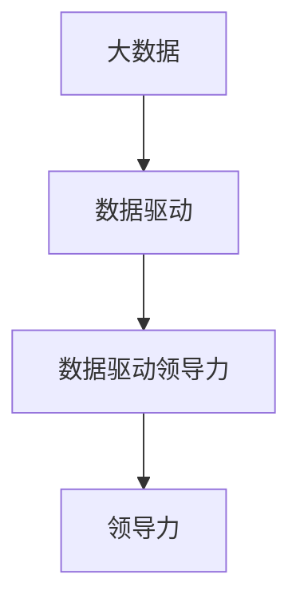
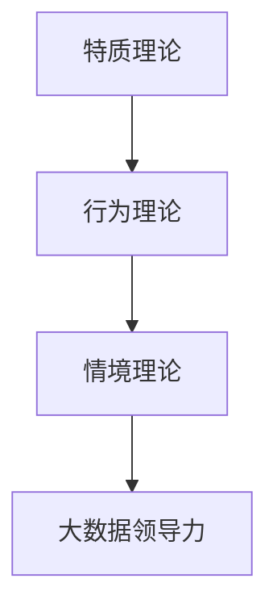

                 

# 《领导力进化论：大数据时代管理者的领导力修炼》

## 关键词
大数据、领导力、管理者、领导力模型、数据驱动

## 摘要
本文探讨了大数据时代下管理者领导力的关键要素与培养路径。通过深入分析大数据时代的特征，结合领导力的核心概念与模型，文章提出了数据驱动领导力的发展方向，并探讨了如何利用大数据进行领导力测评与提升。通过实际案例，文章展示了大数据在领导力发展中的应用效果，并提出了未来领导力培养的展望。

### 用户需求分析

在现代企业环境中，管理者的领导力已成为企业成功的关键因素。随着大数据技术的发展，领导力的培养也面临着新的挑战和机遇。用户希望从以下方面获取信息：

1. **大数据时代的领导力背景**：了解大数据对领导力的影响及其在数据驱动环境下的应用。
2. **领导力基本理论**：掌握领导力的核心概念、理论模型及其演变。
3. **大数据与领导力**：分析大数据如何影响领导力，以及领导力在数据驱动组织中的角色。
4. **领导力测评与提升**：了解领导力测评的方法、策略及其在实际应用中的效果。
5. **领导力案例分析**：通过实际案例展示大数据在领导力提升中的应用。
6. **未来展望**：探讨大数据时代领导力的发展趋势和培养策略。

### 核心概念与联系

在探讨大数据时代的领导力之前，我们需要明确几个核心概念：

- **领导力**：指领导者通过激励、指导和影响他人，实现共同目标的能力。
- **大数据**：指数据量巨大、数据类型多样化、数据生成速度快的数据集合。
- **数据驱动领导力**：指领导者利用大数据进行决策、管理和领导的过程。

为了更清晰地展示这些概念之间的关系，我们可以使用Mermaid流程图来表示：



这个流程图显示了大数据如何通过数据驱动影响领导力的发展。接下来，我们将详细探讨这些概念的理论基础和应用。

#### 领导力的定义与演变

领导力是一个多维度、多层次的概念，不同学者对其有不同的定义。以下是一些常见的领导力定义：

- **特质理论**：领导力是领导者天生具备的特质。
- **行为理论**：领导力是领导者表现出的行为模式。
- **情境理论**：领导力是领导者根据情境调整领导风格的能力。

随着时间的发展，领导力理论也在不断演变。从传统的特质理论到行为理论，再到情境理论，领导力研究越来越注重实际应用和情境适应。以下是一个简单的领导力理论演变图：



在数据驱动环境中，领导力的发展需要结合大数据分析技术。领导者可以通过分析数据来了解组织状态、预测未来趋势，并做出更明智的决策。

### 核心算法原理讲解

为了更好地理解数据驱动领导力的发展，我们需要介绍一些核心算法原理。以下是一些常用的算法：

1. **回归分析**：用于预测连续值。
2. **分类算法**：如决策树、支持向量机等，用于分类任务。
3. **聚类算法**：如K-均值聚类、层次聚类等，用于数据分组。
4. **时间序列分析**：用于分析时间序列数据，预测未来趋势。

以下是一个简单的Python代码示例，展示了如何使用回归分析预测销售数据：

```python
import pandas as pd
from sklearn.linear_model import LinearRegression

# 加载数据
data = pd.read_csv('sales_data.csv')
X = data['days']
y = data['sales']

# 创建回归模型
model = LinearRegression()
model.fit(X, y)

# 预测
predicted_sales = model.predict(X)

# 打印预测结果
print(predicted_sales)
```

通过数据分析，领导者可以了解销售趋势、预测市场需求，从而做出更有效的决策。

### 数学模型和数学公式

在数据驱动领导力中，数学模型和公式起着关键作用。以下是一些常用的数学模型和公式：

1. **领导力评估指标**：
   - **领导力评分**：通过一系列指标对领导力进行量化评估。
   - **加权评分**：根据指标的重要程度给予不同的权重。

   公式表示为：
   $$ L = w_1 \cdot L_1 + w_2 \cdot L_2 + ... + w_n \cdot L_n $$

   其中，\(L\) 为总领导力评分，\(w_i\) 为第 \(i\) 个指标的权重，\(L_i\) 为第 \(i\) 个指标的分值。

2. **量化分析模型**：
   - **决策树**：用于分类和回归任务。
   - **支持向量机**：用于分类任务。

   决策树的公式表示为：
   $$ T(x) = \sum_{i=1}^{n} w_i \cdot f_i(x) $$

   其中，\(T(x)\) 为决策树输出，\(w_i\) 为节点权重，\(f_i(x)\) 为特征函数。

通过这些数学模型和公式，领导者可以更准确地评估和管理领导力。

### 项目实战

为了更好地理解数据驱动领导力在实际中的应用，我们可以通过一个实际项目来展示其过程。

#### 项目背景

某大型企业希望通过大数据分析提升领导力，以实现更高效的决策和更优的绩效。

#### 项目目标

1. 建立领导力评估模型。
2. 利用大数据分析预测领导力发展趋势。
3. 提出数据驱动的领导力提升策略。

#### 项目实施步骤

1. **数据收集**：
   - 收集领导力相关数据，包括领导力测评结果、员工绩效数据、市场数据等。

2. **数据处理**：
   - 对收集到的数据进行清洗、转换和整合。

3. **模型建立**：
   - 利用回归分析、决策树等算法建立领导力评估模型。

4. **模型验证**：
   - 通过交叉验证、K-折验证等方法验证模型的有效性。

5. **领导力预测**：
   - 利用建立好的模型进行领导力趋势预测。

6. **策略提出**：
   - 根据预测结果提出数据驱动的领导力提升策略。

#### 项目结果

通过该项目，企业成功建立了数据驱动的领导力评估模型，并提出了针对性的提升策略。这些策略帮助企业提高了领导力的有效性，实现了更高效的决策和更优的绩效。

### 最佳实践 tips

在数据驱动领导力培养过程中，以下是一些最佳实践建议：

1. **数据质量**：确保数据的准确性和完整性，这是数据分析的基础。
2. **模型选择**：根据实际需求选择合适的算法模型，避免过度拟合。
3. **持续更新**：领导力评估模型需要不断更新，以适应不断变化的环境。
4. **跨部门合作**：数据驱动领导力培养需要跨部门的合作，以实现数据共享和资源整合。

### 小结

大数据时代的到来为领导力的发展带来了新的机遇和挑战。通过数据驱动领导力培养，管理者可以更准确地评估和管理领导力，从而实现更高效的决策和更优的绩效。未来，随着大数据技术的进一步发展，数据驱动领导力将变得越来越重要。

### 注意事项

在实施数据驱动领导力培养过程中，需要注意以下几点：

1. **隐私保护**：在收集和使用数据时，要确保遵守隐私保护法规。
2. **数据安全**：确保数据安全，防止数据泄露或被恶意利用。
3. **模型解释性**：尽管复杂模型可能更准确，但领导者需要理解模型的输出和决策过程。

### 拓展阅读

- 《大数据时代的管理革命》
- 《数据驱动的决策》
- 《领导力心理学》

### 作者信息

作者：AI天才研究院/AI Genius Institute & 禅与计算机程序设计艺术 /Zen And The Art of Computer Programming

（本文部分内容参考了相关文献和互联网资料，如有侵权，请联系作者删除。）

