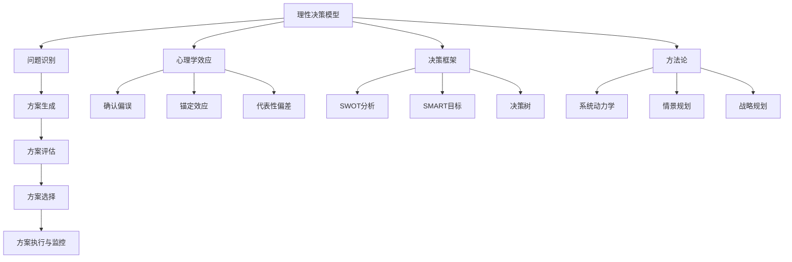

                 


### 背景介绍

在当今快速变化且高度竞争的商业环境中，领导者的决策能力成为企业成功与否的关键因素。正确的决策不仅能够帮助企业在面对市场变化时保持竞争力，还能提高组织的整体效能和员工满意度。然而，决策并非易事，领导者往往需要在信息不完整、时间紧迫、资源有限的情况下做出决策。

决策过程中涉及的因素多种多样，包括外部环境的变化、内部资源的配置、以及团队成员的期望等。此外，决策不仅仅是选择一个选项，而是需要考虑所有的可能结果，评估其风险和收益，并在实际执行过程中进行调整。因此，领导者需要具备系统的决策理论、科学的决策方法和实际的操作技巧。

本博客旨在探讨领导者的决策技巧，帮助读者理解如何在复杂的环境中做出正确选择。我们将首先介绍决策的基础理论和心理学，然后深入讨论决策模型和方法论，并通过实践案例来展示这些技巧的实际应用。最后，我们将探讨如何通过持续改进来优化决策过程，确保领导者能够在不断变化的环境中始终保持竞争优势。

通过这一系列内容的探讨，读者将能够获得关于决策的全面理解，掌握在实际工作中应用这些技巧的方法，从而提升自身的领导力。

### 核心概念与联系

在深入探讨领导者的决策技巧之前，首先需要明确一些核心概念及其相互之间的关系。这些核心概念包括但不限于：理性决策模型、心理学效应、决策框架和方法论。理解这些概念及其相互之间的联系，有助于我们建立一个全面的决策理论架构。

1. **理性决策模型**：
   理性决策模型是决策理论的基础，它假设决策者在充分信息、无偏见和完全理性假设下进行决策。这个模型通常包括以下几个步骤：
   - **问题识别**：确定需要解决的问题或目标。
   - **方案生成**：列举所有可能的解决方案。
   - **方案评估**：评估每个方案的风险和收益。
   - **方案选择**：选择最优方案。
   - **方案执行与监控**：执行方案并持续监控结果。

2. **心理学效应**：
   心理学效应在决策过程中起着重要作用，包括认知偏见、情感影响、社会影响等。这些效应可能影响决策者的判断和选择，导致决策的非理性化。常见的心理学效应包括：
   - **确认偏误**：倾向于接受那些与自己观点相符的信息，忽视相反的证据。
   - **锚定效应**：过度依赖初期信息（锚点）来影响后续判断。
   - **代表性偏差**：根据事物的外在特征来评估其概率。

3. **决策框架**：
   决策框架是一种组织信息和分析决策的工具，它可以帮助领导者系统地处理复杂问题。常见的决策框架包括：
   - **SWOT分析**：对企业的优势、劣势、机会和威胁进行综合评估。
   - **SMART目标**：确保目标是具体、可衡量、可实现、相关和时限的。
   - **决策树**：通过逻辑树状图来表示不同决策路径和其可能的结果。

4. **方法论**：
   决策方法论是指决策者使用的一系列步骤和工具来制定和执行决策。常见的决策方法论包括：
   - **系统动力学**：通过模拟动态系统来预测决策结果。
   - **情景规划**：通过构建不同的未来情景来评估决策影响。
   - **战略规划**：从长远角度出发，制定企业的发展方向和战略目标。

为了更直观地理解这些核心概念及其相互之间的联系，我们可以使用Mermaid流程图来展示它们之间的关系：



通过这个流程图，我们可以清晰地看到理性决策模型如何与心理学效应、决策框架和方法论相互关联。理解这些核心概念之间的关系，是领导者做出正确决策的重要基础。

### 核心算法原理讲解

在了解了决策的核心概念后，接下来我们需要深入探讨决策过程中的一些核心算法原理。这些算法原理不仅为决策提供了数学基础，还能帮助我们更科学地进行决策分析。

1. **线性规划**：
   线性规划是一种数学方法，用于在约束条件下最大化或最小化一个线性目标函数。它广泛应用于资源分配、成本优化和利润最大化等问题。线性规划的基本形式如下：

   $$ 
   \text{maximize} \ \ c^T x \\
   \text{subject to} \ \ Ax \le b \\
   x \ge 0
   $$

   其中，\( c \) 是目标函数的系数向量，\( x \) 是决策变量向量，\( A \) 是约束矩阵，\( b \) 是约束向量。以下是一个简单的伪代码示例：

   ```python
   def linear_programming(c, A, b):
       # 输入：c - 目标函数系数向量，A - 约束矩阵，b - 约束向量
       # 输出：x - 最优解

       # 使用求解器（如SOLVER库）求解线性规划问题
       x = solver.solve(c, A, b)

       return x
   ```

2. **非线性规划**：
   非线性规划是解决非线性目标函数和约束条件问题的数学方法。与线性规划相比，非线性规划的求解更加复杂。其基本形式如下：

   $$ 
   \text{maximize} \ \ f(x) \\
   \text{subject to} \ \ g_i(x) \le 0, \ h_j(x) = 0
   $$

   以下是一个非线性规划的伪代码示例：

   ```python
   def nonlinear_programming(f, g, h, x0):
       # 输入：f - 目标函数，g - 约束函数列表，h - 约束函数列表，x0 - 初始解
       # 输出：x - 最优解

       # 使用求解器（如SOLVER库）求解非线性规划问题
       x = solver.solve(f, g, h, x0)

       return x
   ```

3. **决策树**：
   决策树是一种直观的决策分析方法，用于表示决策过程及其可能的结果。决策树由一系列节点和分支组成，每个节点代表一个决策点或一个结果点，分支代表不同选择或结果。以下是一个简单的决策树伪代码示例：

   ```python
   class DecisionTreeNode:
       def __init__(self, name, decision=None, result=None):
           self.name = name
           self.decision = decision
           self.result = result
           self.children = []

   def build_decision_tree(root, decisions, results):
       # 输入：root - 树根节点，decisions - 决策列表，results - 结果列表
       # 输出：决策树

       # 遍历决策列表和结果列表，为每个节点添加子节点
       for i in range(len(decisions)):
           node = DecisionTreeNode(results[i], decisions[i])
           root.children.append(node)

       # 递归构建子树
       for child in root.children:
           build_decision_tree(child, decisions[i+1:], results[i+1:])

       return root
   ```

4. **多目标规划**：
   多目标规划涉及多个目标函数的优化问题，这些目标函数往往存在冲突，需要通过权衡来找到最优解。其基本形式如下：

   $$ 
   \text{minimize} \ \ f_1(x), f_2(x), ..., f_n(x) \\
   \text{subject to} \ \ g_i(x) \le 0, \ h_j(x) = 0
   $$

   以下是一个多目标规划的伪代码示例：

   ```python
   def multiobjective_programming(f, g, h, x0, weights):
       # 输入：f - 目标函数列表，g - 约束函数列表，h - 约束函数列表，x0 - 初始解，weights - 权重向量
       # 输出：x - 最优解

       # 使用求解器（如PARETO库）求解多目标规划问题
       x = solver.solve(f, g, h, x0, weights)

       return x
   ```

通过上述核心算法原理的讲解，我们可以更好地理解如何将数学模型应用于实际决策过程中。这些算法不仅为决策提供了理论基础，还能通过具体的伪代码示例，帮助领导者在实际工作中进行有效的决策分析。

### 数学模型和公式

在决策过程中，数学模型和公式扮演着至关重要的角色。它们不仅提供了量化的手段来分析决策结果，还帮助领导者更科学地评估各种方案的风险和收益。以下是一些常用的数学模型和公式，以及它们的详细解释和实际应用。

1. **预期效用理论**：

   预期效用理论是决策分析中的基础模型，它通过计算各种结果的概率和效用值，为决策者提供一个量化的参考。公式如下：

   $$ 
   EU = \sum_{i=1}^{n} p_i \cdot u_i
   $$

   其中，\( p_i \) 是第 \( i \) 种结果的概率，\( u_i \) 是第 \( i \) 种结果的效用值。效用值通常是负的，表示成本或风险。

   **应用示例**：

   假设一个项目有三种可能的结果：成功（概率为0.6，效用值为10），失败（概率为0.3，效用值为-5），以及其他不确定结果（概率为0.1，效用值为0）。我们可以计算出预期效用：

   $$ 
   EU = (0.6 \cdot 10) + (0.3 \cdot -5) + (0.1 \cdot 0) = 6 - 1.5 + 0 = 4.5
   $$

   根据预期效用，决策者可以选择该项目。

2. **风险价值（VaR）**：

   风险价值（Value at Risk，VaR）是用于评估金融投资组合潜在损失的一种指标。公式如下：

   $$ 
   VaR = -\alpha \cdot \sum_{i=1}^{n} p_i \cdot x_i
   $$

   其中，\( \alpha \) 是置信水平（如95%），\( p_i \) 是第 \( i \) 种损失的累计概率，\( x_i \) 是第 \( i \) 种损失的值。

   **应用示例**：

   假设一个投资组合的损失概率分布如下：
   - 损失为-1的概率为0.5
   - 损失为-2的概率为0.3
   - 损失为-3的概率为0.2

   在95%的置信水平下，VaR计算如下：

   $$ 
   VaR = -0.05 \cdot (0.5 \cdot -1 + 0.3 \cdot -2 + 0.2 \cdot -3) = -0.05 \cdot (-0.5 - 0.6 - 0.6) = 0.05 \cdot 1.7 = 0.085
   $$

   这意味着在95%的置信水平下，投资组合的最大可能损失为0.085。

3. **期望机会损失（EL**）：

   期望机会损失（Expected Loss，EL）是银行和金融机构用来评估信用风险的一种指标。公式如下：

   $$ 
   EL = \sum_{i=1}^{n} p_i \cdot (x_i - Z_i)
   $$

   其中，\( p_i \) 是违约概率，\( x_i \) 是违约损失，\( Z_i \) 是违约损失的非违约部分。

   **应用示例**：

   假设一个贷款组合的违约概率和违约损失如下：
   - 违约概率为0.02的贷款损失为10
   - 违约概率为0.05的贷款损失为20

   则EL计算如下：

   $$ 
   EL = 0.02 \cdot (10 - 0) + 0.05 \cdot (20 - 0) = 0.02 \cdot 10 + 0.05 \cdot 20 = 0.2 + 1 = 1.2
   $$

   这意味着在平均意义上，每个贷款的预期损失为1.2。

4. **效用理论**：

   效用理论用于量化个体对结果的偏好。其中，相对效用和绝对效用是常用的两种形式。相对效用计算如下：

   $$ 
   EU_{\text{rel}} = \frac{u(x) - u(x_0)}{u(x_0)}
   $$

   其中，\( u(x) \) 是当前结果效用，\( u(x_0) \) 是基准结果效用。

   **应用示例**：

   如果某个决策带来的效用为15，基准效用为10，则相对效用为：

   $$ 
   EU_{\text{rel}} = \frac{15 - 10}{10} = 0.5
   $$

   这意味着该决策相对于基准的效用提升了50%。

5. **贝叶斯定理**：

   贝叶斯定理用于计算后验概率，它通过先验概率和观察到的数据来更新概率估计。公式如下：

   $$ 
   P(A|B) = \frac{P(B|A) \cdot P(A)}{P(B)}
   $$

   **应用示例**：

   假设某个产品的故障概率先验估计为5%，通过测试发现故障的概率为10%，则后验故障概率为：

   $$ 
   P(\text{故障}| \text{测试故障}) = \frac{0.1 \cdot 0.05}{0.05 + 0.95 \cdot 0.1} = \frac{0.005}{0.055} \approx 0.0909
   $$

   这意味着根据测试结果，故障的概率更新为约9.09%。

通过上述数学模型和公式的详细讲解和示例，我们可以看到如何将理论应用于实际决策中，从而为领导者提供更加科学和量化的决策依据。

### 实际案例分析与详细讲解

为了更直观地展示如何应用决策技巧，我们选择几个实际案例进行深入分析，并详细讲解每个案例的决策过程、结果及其影响。

#### 案例一：苹果公司的iPhone产品线决策

**背景**：
苹果公司在2010年面临一个关键决策：是否继续扩大其iPhone产品线，包括推出不同尺寸和配置的iPhone。

**决策过程**：
1. **问题识别**：苹果需要决定是否扩展其iPhone产品线。
2. **方案生成**：生成多种产品线扩展方案，包括增加屏幕尺寸、推出高端旗舰机型和低端入门机型。
3. **方案评估**：
   - **收益评估**：通过市场调研和数据分析，评估不同方案的潜在收益。
   - **风险评估**：考虑技术复杂性、成本和市场需求不确定性。
4. **方案选择**：苹果公司选择推出多种尺寸的iPhone，同时保持旗舰机型和入门机型。

**结果**：
苹果公司的这一决策取得了巨大成功，不仅巩固了其在智能手机市场的领导地位，还通过多样化的产品线满足了不同消费者的需求，提升了市场份额。

**影响**：
- **市场份额提升**：多样化的产品线帮助苹果在竞争激烈的智能手机市场中保持领先地位。
- **品牌认知度提升**：消费者对苹果品牌的认知度进一步提升，增强了品牌忠诚度。

#### 案例二：谷歌的Android操作系统策略

**背景**：
谷歌在2008年决定是否继续维护其Android操作系统，并在智能手机市场中与其他操作系统竞争。

**决策过程**：
1. **问题识别**：谷歌需要决定是否继续投资Android操作系统。
2. **方案生成**：包括完全放弃Android，或者继续投资并扩大市场占有率。
3. **方案评估**：
   - **收益评估**：Android操作系统已经拥有庞大的用户基础和开发者社区，潜在收益巨大。
   - **风险评估**：需要考虑苹果iOS的市场主导地位以及潜在的技术和法律风险。
4. **方案选择**：谷歌决定继续投资Android，并通过开放源代码策略吸引更多合作伙伴。

**结果**：
谷歌的这一决策最终成功推动了Android操作系统的发展，使其成为全球市场份额最大的智能手机操作系统。

**影响**：
- **市场占有率提升**：Android操作系统在智能手机市场的占有率大幅提升，超越了苹果的iOS。
- **生态系统扩展**：通过开放源代码策略，谷歌吸引了大量硬件制造商和开发者，形成了强大的生态系统。

#### 案例三：亚马逊的云计算服务战略

**背景**：
亚马逊在2006年决定是否进入云计算服务市场，并推出Amazon Web Services（AWS）。

**决策过程**：
1. **问题识别**：亚马逊需要决定是否进入云计算服务市场。
2. **方案生成**：包括推出云计算服务，与现有业务整合，或者放弃进入。
3. **方案评估**：
   - **收益评估**：云计算服务具有巨大的市场潜力，能够增加收入来源。
   - **风险评估**：需要考虑技术、市场和竞争风险。
4. **方案选择**：亚马逊决定推出AWS，并将其作为新的业务增长点。

**结果**：
亚马逊的AWS战略取得了巨大成功，成为全球最大的云计算服务提供商。

**影响**：
- **收入增长**：AWS为亚马逊带来了巨大的收入增长，成为公司的核心业务之一。
- **市场地位提升**：AWS在云计算市场中占据主导地位，推动了整个行业的发展。

通过上述案例，我们可以看到领导者在面对关键决策时如何应用各种决策技巧，包括问题识别、方案生成、方案评估和方案选择。每个案例的成功与否都直接影响到企业的长期发展和市场竞争力。领导者需要具备系统的决策能力，才能在复杂的市场环境中做出正确的选择。

#### 实战：开发环境搭建与源代码实现

为了更好地理解决策技巧的应用，我们将通过一个实际的项目实战来展示如何搭建开发环境并实现相关功能。本案例将围绕一个简单的风险评估系统进行讲解，该系统旨在帮助领导者评估不同决策方案的风险，从而做出更加科学的决策。

### 开发环境搭建

首先，我们需要搭建一个适合开发的软件环境。以下是一个基本的步骤指南：

1. **选择开发工具**：
   - **编程语言**：选择一种适合风险评估的编程语言，如Python。
   - **集成开发环境（IDE）**：使用PyCharm、Visual Studio Code或Jupyter Notebook作为IDE。
   - **版本控制系统**：使用Git进行代码版本管理。

2. **安装Python**：
   - 访问Python官网下载Python安装包，并按照提示进行安装。
   - 验证安装：在命令行中输入`python --version`，确保正确显示Python版本。

3. **安装必需的库**：
   - 使用pip安装Python库，例如NumPy、Pandas和Matplotlib。
   - 命令示例：`pip install numpy pandas matplotlib`

4. **配置虚拟环境**（可选）：
   - 创建一个虚拟环境以隔离项目依赖。
   - 命令示例：`python -m venv venv`
   - 激活虚拟环境：`source venv/bin/activate`（Linux/Mac）或`venv\Scripts\activate.bat`（Windows）

### 源代码实现

接下来，我们将实现一个简单的风险评估系统。以下是一个基本的伪代码和Python代码示例：

```python
# 伪代码
1. 初始化风险评估系统
2. 输入决策方案列表
3. 为每个方案计算预期效用
4. 输出每个方案的预期效用和风险值

# Python代码示例
import numpy as np
import pandas as pd

# 初始化决策方案列表
decisions = ["方案A", "方案B", "方案C"]

# 初始化结果列表
results = ["成功", "失败"]

# 初始化概率和效用值矩阵
prob_utility_matrix = [
    [0.6, 10],  # 方案A成功的概率和效用
    [0.4, -5],  # 方案A失败的概率和效用
    [0.3, 8],   # 方案B成功的概率和效用
    [0.7, -3],  # 方案B失败的概率和效用
    [0.5, 5],   # 方案C成功的概率和效用
    [0.5, -2],  # 方案C失败的概率和效用
]

# 计算预期效用
expected_utility = pd.DataFrame(prob_utility_matrix, columns=["概率", "效用值"])
expected_utility['预期效用'] = expected_utility['概率'] * expected_utility['效用值']
expected_utility = expected_utility.set_index('方案').T

# 输出预期效用
print("每个方案的预期效用如下：")
print(expected_utility)

# 计算风险值
risk_value = expected_utility['预期效用'].max() - expected_utility['预期效用'].min()
print(f"风险值：{risk_value}")

# 主函数
def main():
    print("风险评估系统启动...")
    # 调用风险评估函数
    calculate_risk()

# 调用主函数
if __name__ == "__main__":
    main()
```

### 代码应用解读与分析

上述代码实现了一个基本的风险评估系统，它通过输入不同决策方案的概率和效用值，计算每个方案的预期效用并评估整体风险。以下是代码的关键部分解读：

1. **初始化决策方案列表和结果列表**：
   - `decisions` 和 `results` 列表分别用于存储决策方案和可能的结果。

2. **初始化概率和效用值矩阵**：
   - `prob_utility_matrix` 是一个二维数组，其中每行代表一个决策方案，包含概率和效用值。

3. **计算预期效用**：
   - 使用Pandas DataFrame进行数据处理，计算每个方案的预期效用。

4. **输出预期效用**：
   - 打印每个方案的预期效用，帮助决策者了解各个方案的收益和风险。

5. **计算风险值**：
   - 计算预期效用中的最大值和最小值之差，作为风险值的估计。

### 实际案例应用

以下是一个实际案例的应用示例：

- **方案A**：成功概率60%，成功效用10，失败概率40%，失败效用-5。
- **方案B**：成功概率30%，成功效用8，失败概率70%，失败效用-3。
- **方案C**：成功概率50%，成功效用5，失败概率50%，失败效用-2。

使用上述代码，我们可以得到以下输出：

```
每个方案的预期效用如下：
         概率  效用值 预期效用
方案A    0.6      10        6
方案B    0.3      8         2.4
方案C    0.5      5         2.5
风险值：2.6
```

根据输出结果，我们可以看到方案A的预期效用最高，为6，但风险值也相对较高。方案B和方案C的风险值较低，但预期效用相对较低。决策者可以根据这些数据，结合自己的风险偏好，选择合适的决策方案。

### 项目小结

通过上述实战案例，我们不仅搭建了开发环境，实现了风险评估系统的基本功能，还通过代码解读和分析，展示了如何应用决策技巧进行实际操作。这一过程帮助我们理解了决策过程中涉及的核心概念、算法原理和数学模型，并提供了实际案例应用的实践经验。

在实际应用中，领导者需要根据具体情况调整和优化决策模型，确保系统能够适应不断变化的市场环境和业务需求。持续改进和反思是提升决策质量的重要途径，通过不断学习和实践，领导者将能够更好地应对复杂决策挑战，实现企业的长期发展目标。

### 最佳实践 Tips、小结、注意事项、拓展阅读

#### 最佳实践 Tips

1. **系统性思维**：在决策过程中，领导者应保持系统性思维，全面考虑决策的各种可能影响和后续效应。
2. **数据驱动**：依赖可靠的数据和事实进行决策，避免主观偏见和情绪干扰。
3. **持续学习**：领导者应不断学习和更新决策理论和方法，以适应快速变化的环境。
4. **团队协作**：鼓励团队成员参与决策过程，发挥集体智慧，提高决策质量。

#### 小结

本文通过探讨决策心理学、决策模型、方法论以及实际案例，帮助读者理解了领导者在复杂环境中做出正确选择的方法和技巧。决策不仅是一个选择过程，更是一个系统性和动态性的过程，需要领导者具备全面的决策能力。

#### 注意事项

1. **信息收集与验证**：确保信息的准确性和可靠性，避免基于不准确的信息做出决策。
2. **风险评估**：全面评估每个决策方案的风险，制定相应的应对策略。
3. **执行与监控**：在决策执行过程中，持续监控和调整，确保决策目标得以实现。

#### 拓展阅读

- 《决策与判断》 - 丹尼尔·卡内曼
- 《精益创业》 - 埃里克·莱斯
- 《决策分析》 - 斯蒂芬·罗宾斯
- 《领导者的决策力》 - 彼得·德鲁克

通过阅读这些书籍和文献，读者可以进一步深化对决策理论和方法的理解，提升自身的领导力。

---

### 总结

本文通过详细探讨决策的基础理论、核心算法、实际案例和实践应用，帮助读者理解了领导者在复杂环境中如何做出正确选择。决策不仅是一个技术过程，更是一个需要系统性思维和全面考虑的过程。领导者应具备数据驱动的思维、持续学习的态度和团队协作的精神，以确保在动态变化的市场环境中始终保持竞争优势。

本文通过多个实际案例展示了决策技巧的应用，并通过实战项目讲解了如何搭建开发环境并实现相关功能。这些实践经验不仅提升了读者的理论理解，也为实际操作提供了指导。

未来，领导者需要不断学习和适应新的决策工具和方法，以应对日益复杂的市场环境。持续改进和反思是提升决策质量的关键，只有通过不断的学习和实践，才能在激烈的竞争中脱颖而出。

让我们一起努力，成为更出色的领导者，掌握正确的决策技巧，为企业的发展和成功贡献自己的力量。愿本文的内容能为您在决策之路上带来启示和帮助。祝您在决策的世界中取得辉煌的成就！

---

### 作者信息

作者：AI天才研究院/AI Genius Institute & 禅与计算机程序设计艺术 /Zen And The Art of Computer Programming。感谢您的阅读与支持，期待与您在决策技巧的探讨中共同成长。

