                 

### 引言

在信息技术领域，领导者的沟通能力被公认为至关重要。有效的沟通不仅能够提升个人影响力，还能推动团队协作、项目进展和整体业务的成功。本文将探讨领导者的沟通艺术，重点阐述清晰、简洁、有力的沟通技巧。

#### 关键词

- 领导者
- 沟通技巧
- 清晰沟通
- 简洁沟通
- 有力沟通

#### 摘要

本文从清晰、简洁、有力的三个方面出发，系统分析了领导者沟通的核心要素、技巧和方法。通过案例分析和实际操作，帮助读者掌握高效沟通的诀窍，提升领导力。

#### 沟通的重要性

沟通是领导者不可或缺的技能之一。它不仅关乎个人形象和信誉，更直接影响团队协作和项目执行。有效的沟通能够确保信息的准确传递，避免误解和冲突，同时提升团队士气和工作效率。

#### 清晰沟通

清晰沟通是领导者沟通的基础。它要求领导者能够准确、明确地表达思想，使信息接收者能够准确理解信息。为了实现清晰沟通，领导者需要遵循以下原则：

1. **明确目标**：在沟通过程中，领导者应明确沟通的目标和预期结果，确保信息的传递具有明确的目的。
2. **简洁明了**：避免使用复杂的术语和冗长的句子，确保信息简洁易懂。
3. **关注听众**：了解听众的需求和背景，调整沟通方式和内容，使其更容易被接受。

#### 核心概念与联系

为了更好地理解清晰沟通的概念，我们可以用Mermaid流程图来展示其核心组成部分和关系：

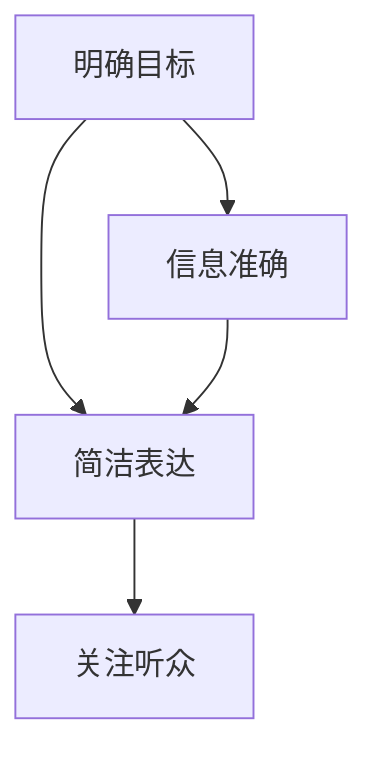

在这个流程图中，明确目标是清晰沟通的起点，它引导我们进行简洁表达，并确保信息准确传递。同时，关注听众是我们调整沟通方式的关键，使信息更容易被接受。

#### 清晰沟通的案例

假设一位项目经理需要在团队会议上解释即将到来的项目变更。以下是清晰沟通的一个例子：

1. **明确目标**：确保团队成员理解变更的必要性。
2. **简洁表达**：使用简单明了的语言描述变更内容。
3. **关注听众**：考虑到团队成员的专业背景，避免使用过于专业的术语。

```python
# 项目经理的发言

def explain_change():
    """解释项目变更"""
    print("大家好，今天我想向大家说明一下即将到来的项目变更。")
    print("我们的项目原本计划在下一季度完成，但由于市场变化，我们不得不提前发布。")
    print("这个变更将使我们的产品更早地进入市场，从而抓住有利商机。")
    print("我将与团队成员一起努力，确保项目按计划完成。")

explain_change()
```

#### 有力沟通

有力沟通是领导者在面对复杂情况时的重要技巧。它要求领导者能够自信、坚定地传达信息，使听众信服并积极响应。为了实现有力沟通，领导者需要掌握以下技巧：

1. **自信表达**：展示自信的态度，使信息更具说服力。
2. **逻辑严谨**：确保信息表达具有逻辑性，使听众容易理解。
3. **情感共鸣**：与听众建立情感联系，增强沟通效果。

#### 核心概念与联系

为了更好地理解有力沟通的概念，我们可以用Mermaid流程图来展示其核心组成部分和关系：

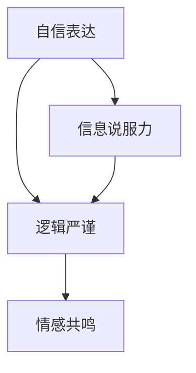

在这个流程图中，自信表达是有力沟通的起点，它引导我们进行逻辑严谨的表达，并建立情感共鸣，从而增强信息的说服力。

#### 有力沟通的案例

假设一位部门经理需要在团队中传达一个重要的业务决策。以下是有力沟通的一个例子：

1. **自信表达**：展示出自信的态度，使团队感受到领导的决心。
2. **逻辑严谨**：清晰地阐述决策的原因和预期效果。
3. **情感共鸣**：表达对团队的信任和期望。

```python
# 部门经理的发言

def communicate_decision():
    """传达业务决策"""
    print("大家好，我今天召开这次会议是为了向大家宣布一项重要的业务决策。")
    print("在经过深思熟虑和市场调研后，我们决定将业务重心转移到新兴市场。")
    print("这个决策将帮助我们抓住市场机遇，实现长期发展。")
    print("我相信，只要我们齐心协力，一定能够成功。")
    print("我期待看到大家在新的业务领域取得优异的成绩！")

communicate_decision()
```

#### 简洁沟通

简洁沟通是领导者高效沟通的关键。它要求领导者能够剔除冗余信息，使信息传递更高效。为了实现简洁沟通，领导者需要掌握以下技巧：

1. **精简语言**：使用简洁明了的语言，避免冗长的句子和复杂的术语。
2. **突出重点**：在信息传递中，突出关键信息，使其更容易被接收。
3. **结构清晰**：确保信息结构合理，使听众容易理解。

#### 核心概念与联系

为了更好地理解简洁沟通的概念，我们可以用Mermaid流程图来展示其核心组成部分和关系：

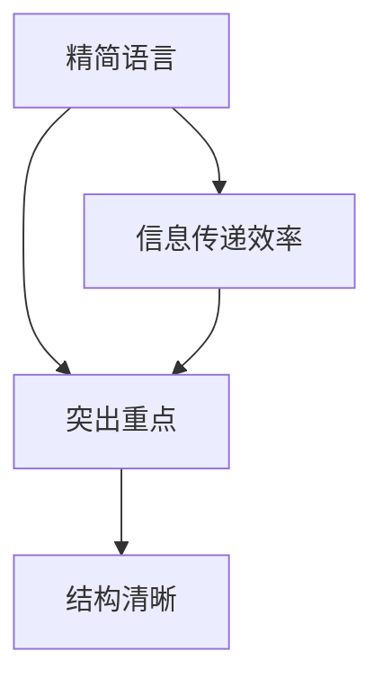

在这个流程图中，精简语言是简洁沟通的起点，它引导我们突出关键信息，并确保信息结构合理，从而提高信息传递效率。

#### 简洁沟通的案例

假设一位项目经理需要在团队中传达一个紧急任务。以下是简洁沟通的一个例子：

1. **精简语言**：使用简单明了的语言描述任务内容。
2. **突出重点**：强调任务的紧急性和重要性。
3. **结构清晰**：确保任务目标、任务内容和时间安排清晰明了。

```python
# 项目经理的发言

def communicate_task():
    """传达紧急任务"""
    print("大家好，我急需大家协助完成一个紧急任务。")
    print("任务内容：在明天下午之前完成市场调研报告。")
    print("任务目标：确保报告质量，为公司决策提供依据。")
    print("任务时间：明天上午9点至下午3点。")
    print("请大家务必准时参加，共同完成任务。")

communicate_task()
```

#### 面对面沟通技巧

面对面沟通是领导者沟通的重要形式之一。它能够有效地建立信任、增强团队凝聚力。为了实现高效的面对面沟通，领导者需要掌握以下技巧：

1. **积极倾听**：倾听是沟通的核心，领导者应积极倾听，确保理解对方的意见和需求。
2. **非语言沟通**：利用身体语言和面部表情，增强沟通效果。
3. **互动交流**：鼓励团队成员参与讨论，营造积极互动的氛围。

#### 核心概念与联系

为了更好地理解面对面沟通技巧，我们可以用Mermaid流程图来展示其核心组成部分和关系：

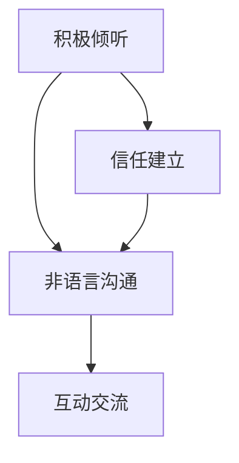

在这个流程图中，积极倾听是面对面沟通的起点，它引导我们进行非语言沟通，并促进互动交流，从而建立信任。

#### 面对面沟通技巧的案例

假设一位领导需要在团队会议上讨论项目进展。以下是面对面沟通技巧的一个例子：

1. **积极倾听**：倾听团队成员的意见和建议。
2. **非语言沟通**：通过眼神交流、点头等非语言动作，表达对团队成员的支持。
3. **互动交流**：鼓励团队成员参与讨论，共同解决问题。

```python
# 领导的发言

def discuss_project():
    """讨论项目进展"""
    print("大家好，今天我们召开这次会议是为了讨论项目的最新进展。")
    print("请大家积极发言，分享你们的意见和建议。")
    print("我将认真倾听每一位同事的意见，并一起探讨解决方案。")
    print("让我们共同努力，确保项目顺利进行。")

discuss_project()
```

#### 书面沟通技巧

书面沟通是领导者日常工作中必不可少的一部分。它包括电子邮件、报告、会议纪要等形式。为了实现高效的书面沟通，领导者需要掌握以下技巧：

1. **明确主题**：在书面沟通中，确保主题明确，使读者容易理解。
2. **结构合理**：确保信息结构清晰，使读者能够快速找到关键信息。
3. **简洁明了**：避免冗长的句子和复杂的术语，确保信息简洁易懂。

#### 核心概念与联系

为了更好地理解书面沟通技巧，我们可以用Mermaid流程图来展示其核心组成部分和关系：

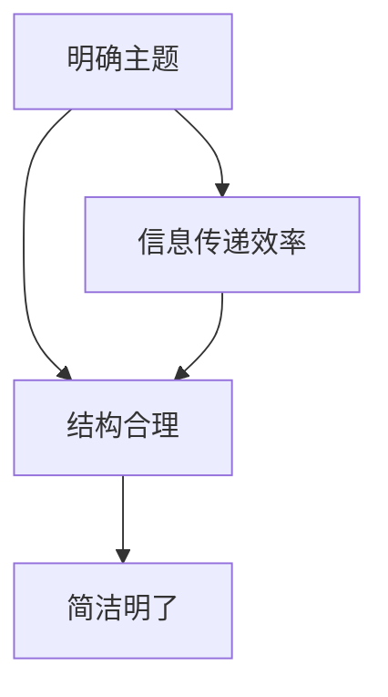

在这个流程图中，明确主题是书面沟通的起点，它引导我们进行结构合理的表达，并确保信息简洁明了，从而提高信息传递效率。

#### 书面沟通技巧的案例

假设一位项目经理需要撰写一份项目进展报告。以下是书面沟通技巧的一个例子：

1. **明确主题**：在报告中明确项目进展和下一步计划。
2. **结构合理**：按照时间顺序和组织结构来组织报告内容。
3. **简洁明了**：使用简单明了的语言描述项目进展和问题。

```python
# 项目经理的报告

def write_report():
    """撰写项目进展报告"""
    report = """
    项目名称：新市场拓展项目
    报告时间：2023年10月
    报告内容：

    1. 项目进展：
       - 市场调研已完成80%，预计下周完成。
       - 产品开发正在进行中，预计下月底完成。

    2. 遇到问题：
       - 调研过程中，部分数据缺失，影响报告准确性。
       - 产品开发过程中，遇到了技术难题，正在寻求解决方案。

    3. 下一步计划：
       - 完成市场调研报告，为决策提供依据。
       - 解决产品开发中的技术问题，确保项目按计划进行。

    请各位领导和团队成员关注项目进展，并提供支持。
    """
    print(report)

write_report()
```

#### 沟通障碍与解决方法

在沟通过程中，领导者和团队成员可能会遇到各种障碍。以下是一些常见的沟通障碍及其解决方法：

1. **信息过载**：解决方法：精简信息，突出重点。
2. **误解**：解决方法：确保信息准确，使用明确的语言。
3. **文化差异**：解决方法：了解不同文化背景，尊重差异。
4. **情绪障碍**：解决方法：进行情绪管理，保持冷静。

#### 核心概念与联系

为了更好地理解沟通障碍与解决方法，我们可以用Mermaid流程图来展示其核心组成部分和关系：

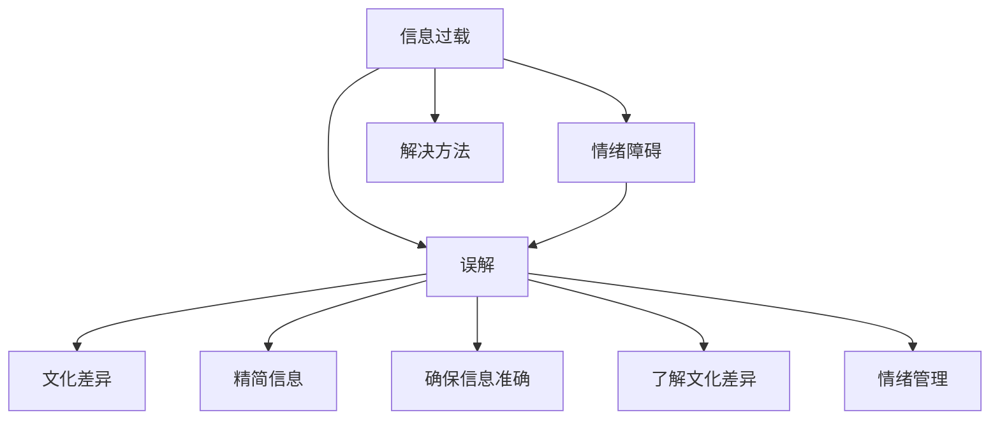

在这个流程图中，信息过载、误解、文化差异和情绪障碍是沟通中的主要障碍，解决方法包括精简信息、确保信息准确、了解文化差异和情绪管理。

#### 沟通风格与适应性

每个人的沟通风格都不同，领导者需要识别并适应不同的沟通风格，以提高沟通效果。以下是一些常见的沟通风格及其适应性策略：

1. **指令型**：适应性策略：明确目标，提供具体指导。
2. **指导型**：适应性策略：提供支持和反馈，鼓励自主思考。
3. **参与型**：适应性策略：鼓励参与，共同决策。
4. **支持型**：适应性策略：提供情感支持，关注团队成员需求。

#### 核心概念与联系

为了更好地理解沟通风格与适应性，我们可以用Mermaid流程图来展示其核心组成部分和关系：

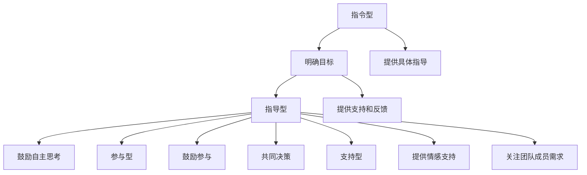

在这个流程图中，指令型、指导型、参与型和支持型是常见的沟通风格，适应性策略包括明确目标、提供具体指导、提供支持和反馈、鼓励自主思考、鼓励参与、共同决策、提供情感支持和关注团队成员需求。

#### 情绪管理在沟通中的作用

情绪管理是领导者沟通中至关重要的一环。有效的情绪管理能够帮助领导者保持冷静、应对挑战，从而提高沟通效果。以下是一些情绪管理的技巧：

1. **自我认知**：了解自己的情绪，识别情绪触发点。
2. **情绪调节**：通过深呼吸、冥想等方法，调节情绪。
3. **同理心**：设身处地为他人着想，理解对方的情绪。

#### 核心概念与联系

为了更好地理解情绪管理在沟通中的作用，我们可以用Mermaid流程图来展示其核心组成部分和关系：

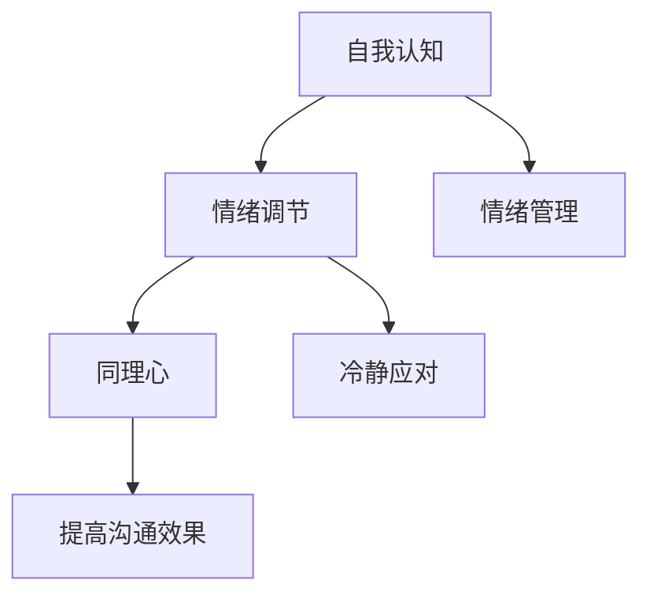

在这个流程图中，自我认知、情绪调节和同理心是情绪管理的关键组成部分，它们帮助领导者保持冷静、应对挑战，从而提高沟通效果。

#### 情绪管理的案例

假设一位领导者在团队会议中遇到了紧急问题，以下是一个情绪管理的案例：

1. **自我认知**：意识到自己的情绪（焦虑）。
2. **情绪调节**：通过深呼吸和冥想来调节情绪。
3. **同理心**：理解团队成员的情绪，与他们共同面对问题。

```python
# 领导者的发言

def handle_emotion():
    """处理情绪问题"""
    print("大家好，我感到有些焦虑，因为我们在项目中遇到了紧急问题。")
    print("但我知道，我们需要冷静地面对这个问题。")
    print("请大家和我一起，通过深呼吸和冥想来调节情绪。")
    print("我们相信，只要我们团结一致，一定能解决这个问题。")

handle_emotion()
```

#### 高效团队沟通

高效的团队沟通是团队成功的关键。以下是一些提高团队沟通效率的策略：

1. **明确沟通目标**：确保团队成员了解沟通的目标和期望。
2. **建立沟通机制**：制定明确的沟通流程和规则，确保信息传递顺畅。
3. **培养沟通文化**：鼓励团队成员积极参与沟通，建立开放、包容的沟通氛围。

#### 核心概念与联系

为了更好地理解高效团队沟通的策略，我们可以用Mermaid流程图来展示其核心组成部分和关系：

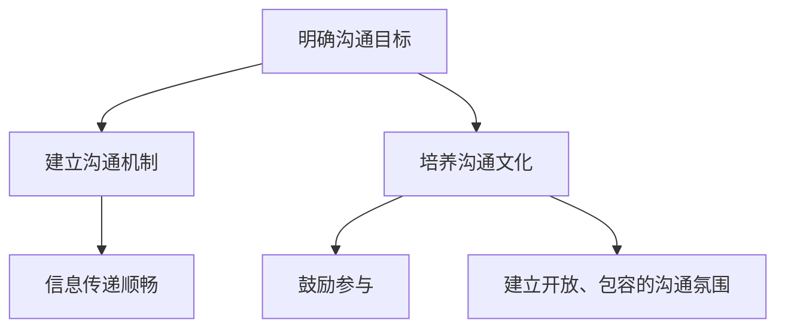

在这个流程图中，明确沟通目标、建立沟通机制和培养沟通文化是提高团队沟通效率的关键策略。

#### 高效团队沟通的案例

假设一个团队需要讨论项目的关键决策，以下是一个高效团队沟通的案例：

1. **明确沟通目标**：确保团队成员了解讨论的主题和决策目标。
2. **建立沟通机制**：制定会议议程，确保讨论有序进行。
3. **培养沟通文化**：鼓励团队成员积极发言，尊重彼此的意见。

```python
# 团队会议

def team_meeting():
    """团队会议讨论项目决策"""
    print("大家好，今天我们召开这次会议是为了讨论项目的关键决策。")
    print("我们将按照会议议程进行讨论，确保决策高效。")
    print("请大家积极发言，尊重彼此的意见。")
    print("让我们共同努力，为项目的成功贡献力量。")

team_meeting()
```

#### 沟通技巧在领导力提升中的应用

沟通技巧是领导者提升自身领导力的关键因素。以下是一些将沟通技巧应用于领导力提升的策略：

1. **建立信任**：通过有效沟通，建立与团队成员的信任关系。
2. **激励团队**：通过正面沟通，激励团队成员发挥潜力。
3. **反馈与改进**：通过及时、准确的反馈，帮助团队成员提升能力。

#### 核心概念与联系

为了更好地理解沟通技巧在领导力提升中的应用，我们可以用Mermaid流程图来展示其核心组成部分和关系：

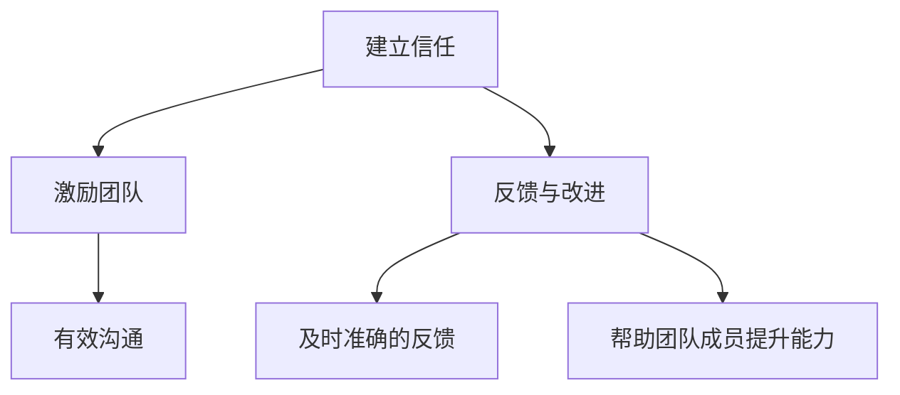

在这个流程图中，建立信任、激励团队和反馈与改进是沟通技巧在领导力提升中的应用策略。

#### 沟通技巧在领导力提升中的应用案例

假设一位领导者在项目中遇到了团队内部冲突，以下是一个沟通技巧在领导力提升中的应用案例：

1. **建立信任**：通过有效沟通，了解团队成员的需求和意见。
2. **激励团队**：鼓励团队成员积极解决问题，发挥团队潜力。
3. **反馈与改进**：及时给予团队成员反馈，帮助他们改进工作方法。

```python
# 领导者的发言

def handle_conflict():
    """处理团队冲突"""
    print("大家好，我知道我们在项目中遇到了一些冲突。")
    print("但我想强调，我们是一个团队，需要携手解决这些问题。")
    print("我愿意倾听每一位成员的意见，并给予必要的支持。")
    print("让我们共同努力，找到解决问题的方法，为项目的成功贡献力量。")

handle_conflict()
```

### 总结与展望

本文系统地分析了领导者沟通艺术的多个方面，包括清晰、简洁、有力的沟通技巧、面对面沟通和书面沟通技巧、沟通障碍与解决方法、沟通风格与适应性、情绪管理、高效团队沟通以及沟通技巧在领导力提升中的应用。通过这些分析，我们认识到沟通在领导者工作中的重要性，并了解了如何通过有效的沟通技巧提升领导力。

在未来的发展中，领导者需要不断学习和创新沟通技巧，以适应不断变化的工作环境。同时，领导者也应关注团队成员的沟通需求，提供支持和指导，共同推动团队和组织的成功。通过不断实践和反思，领导者将能够更好地发挥沟通艺术的力量，为组织的长远发展奠定坚实基础。

### 文章标题：领导者的沟通艺术：清晰、简洁、有力

### 关键词

- 领导者
- 沟通技巧
- 清晰沟通
- 简洁沟通
- 有力沟通
- 情绪管理
- 面对面沟通
- 书面沟通
- 团队沟通

### 摘要

本文深入探讨了领导者在沟通中的关键艺术：清晰、简洁、有力。通过分析各种沟通技巧，如面对面沟通、书面沟通、情绪管理等，本文为领导者提供了实用的方法和策略，帮助他们在复杂多变的工作环境中有效传达信息，建立信任，提升团队协作和领导力。文章通过实际案例和代码示例，展示了如何将理论应用到实践中，以实现高效沟通。

### 第1章：引言

#### 沟通在领导者工作中的重要性

在信息技术领域，领导者的沟通能力被公认为至关重要。有效的沟通不仅能够提升个人影响力，还能推动团队协作、项目进展和整体业务的成功。本文将探讨领导者的沟通艺术，重点阐述清晰、简洁、有力的沟通技巧。

#### 关键词

- 领导者
- 沟通能力
- 团队协作
- 项目进展
- 业务成功

#### 沟通在领导者工作中的作用

1. **信息传递**：领导者需要确保信息在团队内准确、及时地传递。
2. **决策制定**：领导者通过沟通获取团队成员的意见和建议，有助于做出更明智的决策。
3. **团队建设**：良好的沟通能够增强团队凝聚力，提升团队士气。
4. **个人影响力**：有效的沟通能够增强领导者的个人魅力，提升其在组织中的地位。

#### 本文的结构

本文将从清晰、简洁、有力的三个方面出发，系统分析领导者沟通的核心要素、技巧和方法。通过案例分析和实际操作，帮助读者掌握高效沟通的诀窍，提升领导力。

- **清晰沟通**：讨论如何明确表达信息，确保团队成员理解。
- **简洁沟通**：分析如何剔除冗余信息，提高沟通效率。
- **有力沟通**：探讨如何自信、坚定地传达信息，增强说服力。
- **面对面沟通技巧**：介绍有效的面对面沟通方法和技巧。
- **书面沟通技巧**：分析如何撰写清晰、简洁、有力的书面文档。
- **沟通障碍与解决方法**：探讨常见的沟通障碍及解决策略。
- **沟通风格与适应性**：分析如何识别和适应不同的沟通风格。
- **情绪管理在沟通中的作用**：讨论情绪管理对沟通效果的影响。
- **高效团队沟通**：提供提高团队沟通效率的策略和方法。
- **沟通技巧在领导力提升中的应用**：探讨沟通技巧在领导力提升中的重要性。

#### 结论

本文通过系统地分析领导者沟通艺术的不同方面，帮助读者掌握清晰、简洁、有力的沟通技巧。这些技巧不仅适用于日常沟通，更对提升领导力具有重要作用。通过不断实践和反思，领导者将能够更好地发挥沟通艺术的力量，为组织的长远发展奠定坚实基础。

### 第2章：清晰沟通

#### 清晰沟通的定义

清晰沟通是指领导者能够准确、明确地表达思想，使信息接收者能够准确理解信息的沟通方式。它是有效沟通的基础，对于确保团队成员对项目、目标和任务的理解至关重要。

#### 关键词

- 清晰沟通
- 准确表达
- 信息理解

#### 清晰沟通的重要性

清晰沟通在领导者工作中具有以下几个方面的作用：

1. **减少误解**：确保信息传递无误，降低误解和沟通障碍。
2. **提升效率**：提高团队对任务和目标的理解，加速项目进展。
3. **建立信任**：增强团队成员对领导者的信任，促进团队协作。
4. **降低成本**：减少因误解和沟通障碍导致的重复工作和修正成本。

#### 清晰沟通的核心要素

要实现清晰沟通，领导者需要关注以下几个核心要素：

1. **明确目标**：确保在沟通前明确沟通的目标和预期结果。
2. **简洁表达**：使用简单、明了的语言，避免使用复杂的术语和冗长的句子。
3. **关注听众**：了解听众的需求和背景，调整沟通方式和内容。

#### 清晰沟通的伪代码

以下是一个关于清晰沟通的伪代码示例：

```
function clear_communication(message, targetAudience):
    # 检查目标是否明确
    if not is目标是明确的(message):
        raise Error("目标不明确，请重新明确目标。")
    
    # 使用简单语言重述信息
    simpleMessage = convert_to_simple_language(message)
    
    # 根据听众调整沟通方式
    adjustedMessage = adjust_for_audience(simpleMessage, targetAudience)
    
    # 传达信息
    communicate(adjustedMessage)
```

#### 清晰沟通的案例

假设一位项目经理需要在团队会议上传达一个重要任务，以下是清晰沟通的一个实际案例：

1. **明确目标**：确保团队成员理解任务的紧迫性和重要性。
2. **简洁表达**：使用简单明了的语言描述任务。
3. **关注听众**：考虑到团队成员的专业背景，避免使用过于专业的术语。

```python
# 项目经理的发言

def communicate_task():
    """传达紧急任务"""
    task_details = {
        "task_name": "市场调研报告",
        "deadline": "下周三下午5点",
        "priority": "高"
    }
    
    print("大家好，我急需大家的协助。")
    print(f"我们需要在下周三下午5点之前完成市场调研报告。")
    print("这项任务的优先级非常高，请大家务必高度重视。")
    print("如果有任何疑问，请随时向我反馈。")
    print("谢谢大家的支持与合作！")

communicate_task()
```

#### 清晰沟通的实际应用

在实际工作中，清晰沟通的应用场景非常广泛。以下是一些实际应用案例：

1. **项目启动会**：在项目启动会上，项目经理需要清晰传达项目的目标、范围、时间表和关键里程碑。
2. **问题解决**：在解决问题时，领导者需要清晰表达问题的本质和解决方案。
3. **培训**：在培训过程中，讲师需要清晰传达知识点和操作步骤。

#### 总结

清晰沟通是领导者有效沟通的核心要素。通过明确目标、简洁表达和关注听众，领导者能够确保信息准确传递，减少误解，提高团队协作效率。在实际工作中，领导者应不断练习和提升清晰沟通的技巧，以应对各种复杂的沟通场景。

### 第3章：简洁沟通

#### 简洁沟通的定义

简洁沟通是指领导者能够剔除冗余信息，使信息传递更加高效、直观的沟通方式。它强调用最少的语言表达最多的内容，从而提高沟通效率，减少听众的负担。

#### 关键词

- 简洁沟通
- 高效传递
- 语言精炼

#### 简洁沟通的重要性

简洁沟通在领导者工作中具有以下几个方面的作用：

1. **提高沟通效率**：避免冗长和复杂的表述，使听众更容易理解和接受信息。
2. **减轻听众负担**：简洁的信息传递减少了听众的阅读和思考负担，使沟通更加高效。
3. **增强记忆效果**：简洁的语言使关键信息更加突出，有助于听众记忆。
4. **提升团队士气**：高效的沟通能够提高团队成员的工作效率和积极性。

#### 简洁沟通的核心要素

要实现简洁沟通，领导者需要关注以下几个核心要素：

1. **明确主题**：确保信息传递的核心主题明确，避免偏离主题。
2. **剔除冗余**：去除不必要的细节和重复信息，使沟通更加精炼。
3. **突出重点**：将关键信息突出，使听众更容易抓住重点。

#### 简洁沟通的伪代码

以下是一个关于简洁沟通的伪代码示例：

```
function concise_communication(message):
    # 检查信息是否冗长
    if is_redundant(message):
        message = remove_redundant_parts(message)
    
    # 突出关键信息
    key_points = extract_key_points(message)
    
    # 传达简洁信息
    communicate(key_points)
```

#### 简洁沟通的案例

假设一位项目经理需要在团队中传达一个紧急任务，以下是简洁沟通的一个实际案例：

1. **明确主题**：确保团队成员知道任务的紧急性和重要性。
2. **剔除冗余**：去除不必要的细节，使沟通更加精炼。
3. **突出重点**：将关键信息突出，使团队成员更容易理解。

```python
# 项目经理的发言

def communicate_task():
    """传达紧急任务"""
    task_details = {
        "task_name": "市场调研报告",
        "deadline": "明天下午3点",
        "priority": "高"
    }
    
    print("紧急任务：完成市场调研报告。")
    print(f"截止时间：明天下午3点。")
    print("任务优先级：高。")
    print("请大家务必按时完成。")

communicate_task()
```

#### 简洁沟通的实际应用

在实际工作中，简洁沟通的应用场景非常广泛。以下是一些实际应用案例：

1. **电子邮件**：在发送电子邮件时，简洁表达邮件的主题和内容，避免冗长的正文。
2. **会议纪要**：在编写会议纪要时，精炼内容，突出关键决议和行动项。
3. **演讲**：在演讲中，使用简洁的语言和结构，使听众更容易理解和接受观点。

#### 总结

简洁沟通是领导者提升沟通效率的重要手段。通过明确主题、剔除冗余和突出重点，领导者能够确保信息传递更加高效，减轻听众负担，提高团队士气。在实际工作中，领导者应注重简洁沟通的技巧，不断提升自身的沟通能力。

### 第4章：有力沟通

#### 有力沟通的定义

有力沟通是指领导者能够自信、坚定地传达信息，使听众信服并积极响应的沟通方式。它不仅要求领导者具备良好的表达能力，还需要具备一定的说服力，以在复杂环境中取得预期的沟通效果。

#### 关键词

- 有力沟通
- 自信表达
- 信息说服力

#### 有力沟通的重要性

有力沟通在领导者工作中具有以下几个方面的作用：

1. **增强个人影响力**：自信的表达和坚定的立场能够增强领导者的个人魅力，提高其在组织中的地位。
2. **提升团队士气**：有力的沟通能够激发团队成员的信心和斗志，提升团队士气。
3. **推动决策执行**：通过有力沟通，领导者能够说服团队成员支持并执行关键决策，确保项目顺利进行。
4. **解决冲突**：在团队内部出现冲突时，有力沟通能够帮助领导者冷静分析问题，寻求解决方案。

#### 有力沟通的核心要素

要实现有力沟通，领导者需要关注以下几个核心要素：

1. **自信表达**：展示自信的态度，使信息更具说服力。
2. **逻辑严谨**：确保信息表达具有逻辑性，使听众容易理解。
3. **情感共鸣**：与听众建立情感联系，增强沟通效果。
4. **适当修辞**：运用适当的修辞手法，提高信息的吸引力。

#### 有力沟通的伪代码

以下是一个关于有力沟通的伪代码示例：

```
function powerful_communication(message, audience):
    # 自信表达
    message = express_with_confidence(message)
    
    # 逻辑严谨
    message = ensure_logical_coherence(message)
    
    # 情感共鸣
    message = establish_emotional_connection(message, audience)
    
    # 适当修辞
    message = apply_appropriate_rhetoric(message)
    
    # 传达信息
    communicate(message)
```

#### 有力沟通的案例

假设一位部门经理需要在团队中传达一个重要的业务决策，以下是有力沟通的一个实际案例：

1. **自信表达**：展示出自信的态度，使团队感受到领导的决心。
2. **逻辑严谨**：清晰地阐述决策的原因和预期效果。
3. **情感共鸣**：表达对团队的信任和期望。

```python
# 部门经理的发言

def communicate_decision():
    """传达业务决策"""
    decision_details = {
        "decision": "将业务重心转移到新兴市场",
        "rationale": "抓住市场机遇，实现长期发展",
        "expected_outcome": "提升公司竞争力"
    }
    
    print("大家好，经过深思熟虑和市场调研，我们决定将业务重心转移到新兴市场。")
    print("这个决策将帮助我们抓住市场机遇，实现长期发展，提升公司的竞争力。")
    print("我相信，只要我们齐心协力，一定能够成功。")
    print("我期待看到大家在新的业务领域取得优异的成绩！")

communicate_decision()
```

#### 有力沟通的实际应用

在实际工作中，有力沟通的应用场景非常广泛。以下是一些实际应用案例：

1. **项目启动会**：在项目启动会上，领导者需要有力地传达项目的目标和期望，确保团队成员明确任务和责任。
2. **问题解决**：在解决问题时，领导者需要有力地分析问题并提出解决方案，以取得团队成员的支持。
3. **演讲**：在演讲中，领导者需要有力地表达观点，吸引听众的注意力。

#### 总结

有力沟通是领导者提升自身影响力和推动团队协作的重要手段。通过自信表达、逻辑严谨、情感共鸣和适当修辞，领导者能够确保信息传达具有说服力，使团队成员信服并积极响应。在实际工作中，领导者应注重提升有力沟通的技巧，以应对各种复杂的沟通场景。

### 第5章：面对面沟通技巧

#### 面对面沟通的定义

面对面沟通是指领导者与团队成员在直接互动的环境中进行沟通的方式。它不仅包括语言交流，还涉及非语言沟通，如肢体语言、面部表情和语调等。面对面沟通的优势在于能够迅速建立信任、明确问题和促进团队协作。

#### 关键词

- 面对面沟通
- 直接互动
- 信任建立
- 非语言沟通

#### 面对面沟通的重要性

面对面沟通在领导者工作中具有以下几个方面的作用：

1. **快速建立信任**：通过直接的面对面交流，领导者能够迅速与团队成员建立信任关系。
2. **明确问题**：面对面沟通有助于领导者及时了解团队成员的需求和意见，明确问题并提出解决方案。
3. **促进协作**：通过直接的互动，领导者能够促进团队成员之间的协作，提高团队效率。
4. **提升沟通效果**：面对面沟通能够更好地传达情感和意图，提高沟通的整体效果。

#### 面对面沟通的核心要素

要实现有效的面对面沟通，领导者需要关注以下几个核心要素：

1. **积极倾听**：领导者应认真倾听团队成员的意见和需求，确保理解对方的观点。
2. **非语言沟通**：通过肢体语言、面部表情和语调等非语言手段，增强沟通效果。
3. **互动交流**：鼓励团队成员参与讨论，创造积极的沟通氛围。
4. **情感共鸣**：建立情感联系，理解并尊重团队成员的感受。

#### 面对面沟通技巧的伪代码

以下是一个关于面对面沟通技巧的伪代码示例：

```
function face_to_face_communication(audience):
    # 积极倾听
    listen_actively(audience)
    
    # 使用非语言沟通
    use_nonverbal_communication
    
    # 互动交流
    encourage_interactive_discussion(audience)
    
    # 建立情感共鸣
    establish_emotional_connection(audience)
    
    # 传达信息
    communicate_message(to Audience)
```

#### 面对面沟通技巧的案例

假设一位领导者在团队会议上需要讨论项目进展，以下是面对面沟通技巧的一个实际案例：

1. **积极倾听**：倾听团队成员的意见和问题。
2. **非语言沟通**：通过肢体语言和面部表情展示对团队成员的支持。
3. **互动交流**：鼓励团队成员参与讨论，共同解决问题。

```python
# 领导者的发言

def discuss_project():
    """讨论项目进展"""
    print("大家好，我们今天召开这次会议是为了讨论项目的最新进展。")
    print("请大家积极发言，分享你们的意见和建议。")
    print("我非常愿意倾听每一位同事的意见，并一起探讨解决方案。")
    print("让我们共同努力，确保项目顺利进行。")

discuss_project()
```

#### 面对面沟通技巧的实际应用

在实际工作中，面对面沟通技巧的应用场景非常广泛。以下是一些实际应用案例：

1. **团队会议**：在团队会议上，领导者需要通过面对面沟通与团队成员互动，确保会议目标的实现。
2. **一对一谈话**：在个别谈话中，领导者需要通过面对面沟通了解团队成员的需求和问题，提供支持和建议。
3. **问题解决**：在解决团队内部问题时，领导者需要通过面对面沟通与团队成员共同分析问题，寻求解决方案。

#### 总结

面对面沟通技巧是领导者提升沟通效果和团队协作能力的重要手段。通过积极倾听、非语言沟通、互动交流和情感共鸣，领导者能够确保信息传达准确、及时，建立信任，促进团队协作。在实际工作中，领导者应注重提升面对面沟通技巧，以应对各种复杂的沟通场景。

### 第6章：书面沟通技巧

#### 书面沟通的定义

书面沟通是指领导者通过文字形式与团队成员进行沟通的方式，包括电子邮件、报告、会议纪要等。它是一种重要的沟通方式，能够确保信息记录和传递的准确性，提高沟通的正式性和权威性。

#### 关键词

- 书面沟通
- 电子邮件
- 报告
- 会议纪要
- 正式性
- 记录性

#### 书面沟通的重要性

书面沟通在领导者工作中具有以下几个方面的作用：

1. **确保信息准确性**：书面沟通能够确保信息传递的准确性和完整性，避免误解和误传。
2. **提供正式记录**：书面沟通生成的文档可以作为正式记录，为后续工作提供依据。
3. **提高沟通效率**：书面沟通能够使信息传递更加高效，减少口头沟通中的重复和冗余。
4. **增强沟通权威性**：书面沟通的形式和语言更加正式，能够增强信息的权威性和说服力。

#### 书面沟通的核心要素

要实现有效的书面沟通，领导者需要关注以下几个核心要素：

1. **明确主题**：确保文档的主题明确，使读者容易理解。
2. **结构合理**：确保文档的结构清晰，逻辑连贯，使读者能够快速找到关键信息。
3. **简洁明了**：避免使用复杂的术语和冗长的句子，确保信息简洁易懂。
4. **格式规范**：遵循适当的格式规范，如标题、段落、引用等，使文档更加专业和易于阅读。

#### 书面沟通技巧的伪代码

以下是一个关于书面沟通技巧的伪代码示例：

```
function written_communication(document):
    # 确定主题
    set_topic(document)
    
    # 确保结构合理
    ensure_logical_structure(document)
    
    # 简洁表达
    simplify_expression(document)
    
    # 格式规范
    apply_format_standards(document)
    
    # 生成文档
    create_document(document)
```

#### 书面沟通技巧的案例

假设一位项目经理需要撰写一份项目进展报告，以下是书面沟通技巧的一个实际案例：

1. **明确主题**：确保报告主题明确，使读者容易理解。
2. **结构合理**：按照时间顺序和组织结构来组织报告内容。
3. **简洁明了**：使用简单明了的语言描述项目进展和问题。
4. **格式规范**：遵循报告的格式规范，如标题、段落、引用等。

```python
# 项目经理的报告

def write_report():
    """撰写项目进展报告"""
    report = """
    项目名称：新市场拓展项目
    报告时间：2023年10月
    报告内容：

    1. 项目进展：
       - 市场调研已完成80%，预计下周完成。
       - 产品开发正在进行中，预计下月底完成。

    2. 遇到问题：
       - 调研过程中，部分数据缺失，影响报告准确性。
       - 产品开发过程中，遇到了技术难题，正在寻求解决方案。

    3. 下一步计划：
       - 完成市场调研报告，为决策提供依据。
       - 解决产品开发中的技术问题，确保项目按计划进行。

    请各位领导和团队成员关注项目进展，并提供支持。
    """
    print(report)

write_report()
```

#### 书面沟通技巧的实际应用

在实际工作中，书面沟通技巧的应用场景非常广泛。以下是一些实际应用案例：

1. **项目报告**：在撰写项目报告时，领导者需要确保报告内容清晰、简洁、结构合理。
2. **电子邮件**：在发送电子邮件时，领导者需要简洁明了地表达主题和内容，避免使用复杂的术语。
3. **会议纪要**：在编写会议纪要时，领导者需要记录关键决议和行动项，确保会议目标得以实现。

#### 总结

书面沟通技巧是领导者有效传达信息、确保信息准确传递的重要手段。通过明确主题、结构合理、简洁明了和格式规范，领导者能够确保书面沟通的高效性和权威性。在实际工作中，领导者应注重提升书面沟通技巧，以应对各种复杂的沟通场景。

### 第7章：沟通障碍与解决方法

#### 沟通障碍的类型

在领导者的沟通过程中，可能会遇到各种障碍，这些障碍会影响到沟通的效果。以下是一些常见的沟通障碍及其特点：

1. **信息过载**：当接收到的信息过多，难以处理和理解时，就会产生信息过载。这种情况可能导致沟通效率低下，甚至引发误解。

2. **误解**：由于语言表达不清、理解偏差或文化差异等原因，可能会导致信息接收者对信息的理解与发送者期望不符。

3. **文化差异**：在跨文化团队中，由于文化背景和价值观的不同，可能会导致沟通障碍，影响团队协作。

4. **情绪障碍**：情绪波动，如焦虑、紧张、愤怒等，会干扰沟通的效果，使信息传递变得困难。

5. **沟通风格不匹配**：当沟通双方的风格不匹配时，可能会导致沟通不畅，影响团队的协作效率。

#### 沟通障碍的原因

了解沟通障碍的原因有助于我们更好地预防和解决这些问题。以下是一些可能导致沟通障碍的原因：

1. **语言障碍**：使用复杂的术语或语言不当，导致信息难以理解。

2. **缺乏倾听**：在沟通过程中，如果领导者没有认真倾听，可能会导致信息传递不畅。

3. **缺乏反馈**：没有及时给予反馈，可能会导致误解和信息误差。

4. **环境因素**：如噪音、时间压力等环境因素会影响沟通的效果。

5. **个人因素**：如个人情绪、心理状态等也会对沟通产生影响。

#### 解决沟通障碍的方法

为了克服沟通障碍，领导者可以采取以下方法：

1. **明确目标**：在沟通前明确目标和预期结果，确保信息传递具有明确的目的。

2. **使用简单语言**：避免使用复杂的术语和冗长的句子，使信息更容易理解。

3. **积极倾听**：在沟通过程中，领导者应认真倾听，确保理解对方的观点和需求。

4. **提供反馈**：及时给予反馈，确保信息传递无误。

5. **建立信任**：通过建立信任，减少误解和沟通障碍。

6. **文化敏感**：了解和尊重团队成员的文化背景，促进跨文化沟通。

7. **调整沟通风格**：根据不同的沟通对象，调整自己的沟通风格，使其更加匹配。

#### 沟通障碍解决方法的核心概念与联系

为了更好地理解解决沟通障碍的方法，我们可以用Mermaid流程图来展示其核心概念和关系：

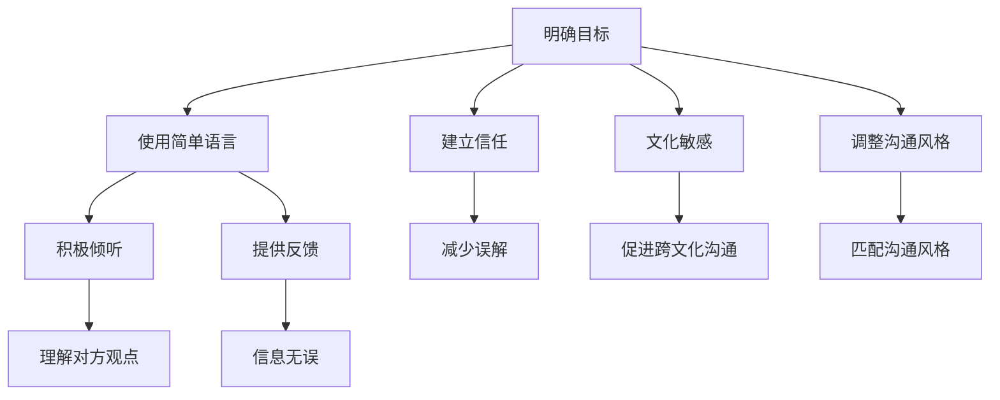

在这个流程图中，明确目标、使用简单语言、积极倾听、提供反馈、建立信任、文化敏感和调整沟通风格是解决沟通障碍的核心方法。这些方法相互关联，共同作用于提升沟通效果。

#### 沟通障碍解决方法的案例

假设一位项目经理需要在团队中传达一个重要的项目变更，以下是解决沟通障碍的一个实际案例：

1. **明确目标**：确保团队成员理解变更的必要性和目标。
2. **使用简单语言**：避免使用复杂的术语，确保信息清晰易懂。
3. **积极倾听**：倾听团队成员的意见和问题，确保理解。
4. **提供反馈**：及时给予反馈，确保信息无误。

```python
# 项目经理的发言

def communicate_change():
    """传达项目变更"""
    change_details = {
        "reason": "市场变化要求提前发布产品",
        "impact": "影响项目进度和质量要求",
        "next_steps": "调整时间表和资源分配"
    }
    
    print("大家好，今天我要向大家传达一个重要的项目变更。")
    print(f"原因是市场变化，我们需要提前发布产品。")
    print(f"这个变更会对项目进度和质量提出新的要求。")
    print("下面是接下来的步骤：")
    print(f"- 调整项目时间表。")
    print(f"- 重新分配资源。")
    print("请大家提出问题和意见，我们将共同解决问题。")

 communicate_change()
```

#### 总结

沟通障碍是领导者日常工作中不可避免的问题，了解和解决这些障碍对于提升沟通效果至关重要。通过明确目标、使用简单语言、积极倾听、提供反馈、建立信任、文化敏感和调整沟通风格，领导者能够有效克服沟通障碍，确保信息准确传递，促进团队协作。

### 第8章：沟通风格与适应性

#### 沟通风格的类型

每个人的沟通风格都不同，领导者需要识别和适应不同的沟通风格，以提高沟通效果。以下是一些常见的沟通风格：

1. **指令型**：这种风格的领导者喜欢直接下达指令，强调目标和任务。
2. **指导型**：领导者提供具体的指导和支持，帮助团队成员解决问题。
3. **参与型**：领导者鼓励团队成员参与决策，共同制定目标和计划。
4. **支持型**：领导者关注团队成员的需求和感受，提供情感支持。

#### 识别和适应不同的沟通风格

为了有效识别和适应不同的沟通风格，领导者可以采取以下策略：

1. **观察行为**：通过观察团队成员的沟通行为，了解他们的风格偏好。
2. **询问意见**：主动询问团队成员对沟通方式的看法和建议，以便调整沟通策略。
3. **倾听反馈**：倾听团队成员的反馈，了解沟通效果，及时调整沟通方式。

#### 沟通风格与适应性的核心概念与联系

为了更好地理解沟通风格与适应性，我们可以用Mermaid流程图来展示其核心概念和关系：

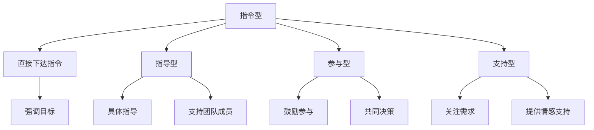

在这个流程图中，指令型、指导型、参与型和支持型是常见的沟通风格，适应不同的沟通风格需要根据团队成员的风格偏好进行调整。

#### 沟通风格适应性的案例

假设一位领导者需要与不同风格的团队成员进行沟通，以下是适应不同沟通风格的一个实际案例：

1. **指令型**：明确下达任务，确保团队成员了解任务和要求。
2. **指导型**：提供具体的指导和支持，帮助团队成员解决问题。
3. **参与型**：鼓励团队成员参与决策，共同制定目标和计划。
4. **支持型**：关注团队成员的需求和感受，提供情感支持。

```python
# 领导者的发言

def communicate_with_different_styles():
    """与不同风格的团队成员沟通"""
    print("大家好，今天我需要与大家沟通几个重要事项。")
    
    # 指令型
    print("首先，我需要指令型风格的团队成员明确任务和时间要求。")
    print("请按要求完成任务。")
    
    # 指导型
    print("其次，对于指导型风格的团队成员，我将提供具体的指导和支持。")
    print("如果你遇到问题，可以随时向我寻求帮助。")
    
    # 参与型
    print("接下来，我需要参与型风格的团队成员一起讨论和制定计划。")
    print("请大家积极参与，提出你们的意见和建议。")
    
    # 支持型
    print("最后，对于支持型风格的团队成员，我关注你们的需求和感受。")
    print("请随时告诉我你们的困难，我会尽力提供帮助。")

communicate_with_different_styles()
```

#### 总结

识别和适应不同的沟通风格是领导者提升沟通效果的重要策略。通过观察行为、询问意见和倾听反馈，领导者能够了解团队成员的风格偏好，并根据实际情况调整沟通策略。在实际工作中，领导者应注重提升沟通风格的适应性，以应对各种复杂的沟通场景。

### 第9章：情绪管理在沟通中的作用

#### 情绪管理的重要性

情绪管理是领导者沟通中至关重要的一环。有效的情绪管理能够帮助领导者保持冷静、应对挑战，从而提高沟通效果。以下是情绪管理在沟通中的几个重要作用：

1. **减少误解**：情绪波动可能导致沟通中的误解和冲突，有效的情绪管理有助于保持沟通的准确性。
2. **增强说服力**：冷静和自信的态度能够增强领导者的话语权和说服力。
3. **提升决策质量**：在情绪稳定的条件下，领导者能够更客观地分析问题，做出更明智的决策。
4. **建立信任**：情绪稳定的领导者能够赢得团队成员的信任和尊重，促进团队协作。

#### 情绪管理的核心概念与联系

为了更好地理解情绪管理在沟通中的作用，我们可以用Mermaid流程图来展示其核心概念和关系：

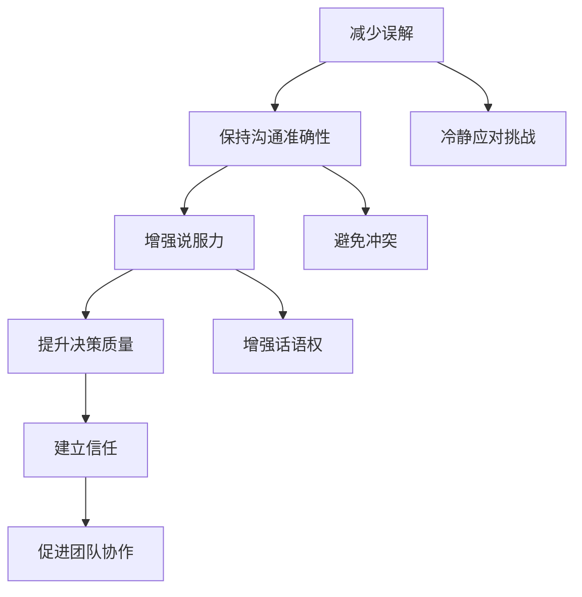

在这个流程图中，减少误解、增强说服力、提升决策质量和建立信任是情绪管理在沟通中的作用。这些作用相互关联，共同作用于提高沟通效果。

#### 情绪管理的技巧

以下是几种有效的情绪管理技巧：

1. **自我认知**：了解自己的情绪，识别情绪触发点。
2. **情绪调节**：通过深呼吸、冥想等方法，调节情绪。
3. **同理心**：设身处地为他人着想，理解对方的情绪。
4. **积极思维**：保持乐观心态，积极应对挑战。

#### 情绪管理的案例

假设一位领导者在面对紧急问题时，需要保持冷静和客观，以下是情绪管理的实际案例：

1. **自我认知**：意识到自己的情绪（焦虑）。
2. **情绪调节**：通过深呼吸和冥想来调节情绪。
3. **同理心**：理解团队成员的情绪，与他们共同面对问题。

```python
# 领导者的发言

def manage_emotion():
    """处理情绪问题"""
    print("大家好，我意识到自己有些焦虑，因为我们在项目中遇到了紧急问题。")
    print("但我知道，我们需要冷静地面对这个问题。")
    print("让我们通过深呼吸和冥想来调节情绪。")
    print("我理解大家此刻的感受，我们是一个团队，一起面对挑战。")

manage_emotion()
```

#### 总结

情绪管理是领导者提升沟通效果的关键因素。通过自我认知、情绪调节、同理心和积极思维，领导者能够保持冷静、应对挑战，从而提高沟通效果。在实际工作中，领导者应注重提升情绪管理技巧，以应对各种复杂的沟通场景。

### 第10章：高效团队沟通

#### 高效团队沟通的定义

高效团队沟通是指团队成员之间能够迅速、准确、有目的地交换信息，共同实现团队目标的过程。它是团队协作和项目成功的关键。

#### 关键词

- 高效团队沟通
- 团队协作
- 信息交换
- 项目成功

#### 高效团队沟通的重要性

高效团队沟通在领导者工作中具有以下几个方面的作用：

1. **提升团队协作**：通过高效的沟通，团队成员能够更好地协同工作，共同实现目标。
2. **加速项目进展**：有效的信息传递能够减少误解和重复工作，加速项目进展。
3. **增强团队凝聚力**：良好的沟通能够增强团队成员之间的信任和凝聚力。
4. **提高决策质量**：团队成员通过有效沟通，能够共同分析问题，做出更明智的决策。

#### 高效团队沟通的核心要素

要实现高效团队沟通，领导者需要关注以下几个核心要素：

1. **明确沟通目标**：确保团队成员了解沟通的目标和期望。
2. **建立沟通机制**：制定明确的沟通流程和规则，确保信息传递顺畅。
3. **鼓励参与**：鼓励团队成员积极参与沟通，共同解决问题。
4. **提供反馈**：及时给予反馈，确保信息传递无误。

#### 高效团队沟通的伪代码

以下是一个关于高效团队沟通的伪代码示例：

```
function efficient_team_communication(team_members):
    # 明确沟通目标
    define_communication_goals(team_members)
    
    # 建立沟通机制
    establish_communication_mechanism(team_members)
    
    # 鼓励参与
    encourage_participation(team_members)
    
    # 提供反馈
    provide_feedback(team_members)
```

#### 高效团队沟通的案例

假设一个团队需要讨论项目的关键决策，以下是高效团队沟通的一个实际案例：

1. **明确沟通目标**：确保团队成员了解讨论的主题和决策目标。
2. **建立沟通机制**：制定会议议程，确保讨论有序进行。
3. **鼓励参与**：鼓励团队成员积极发言，尊重彼此的意见。
4. **提供反馈**：及时给予团队成员反馈，帮助他们改进工作。

```python
# 团队会议

def team_meeting():
    """团队会议讨论项目决策"""
    print("大家好，今天我们召开这次会议是为了讨论项目的关键决策。")
    print("我们将按照会议议程进行讨论，确保决策高效。")
    print("请大家积极发言，尊重彼此的意见。")
    print("让我们共同努力，为项目的成功贡献力量。")

team_meeting()
```

#### 高效团队沟通的实际应用

在实际工作中，高效团队沟通的应用场景非常广泛。以下是一些实际应用案例：

1. **项目启动会**：在项目启动会上，领导者需要确保团队成员了解项目的目标、范围和时间表。
2. **问题解决会**：在遇到问题时，团队成员需要通过高效沟通来共同分析和解决问题。
3. **日常例会**：通过高效的团队沟通，确保团队成员了解项目进展和下一阶段的工作计划。

#### 总结

高效团队沟通是团队协作和项目成功的关键。通过明确沟通目标、建立沟通机制、鼓励参与和提供反馈，领导者能够确保信息传递准确、及时，提高团队协作效率。在实际工作中，领导者应注重提升高效团队沟通的技巧，以应对各种复杂的沟通场景。

### 第11章：沟通技巧在领导力提升中的应用

#### 沟通技巧在领导力提升中的重要性

沟通技巧是领导者提升自身领导力的关键因素。有效的沟通不仅能够增强个人影响力，还能促进团队协作和项目成功。以下是沟通技巧在领导力提升中的几个重要作用：

1. **建立信任**：良好的沟通能够增强与团队成员之间的信任，提高团队凝聚力。
2. **提升团队效率**：通过清晰、简洁、有力的沟通，领导者能够确保团队成员理解任务和目标，从而提升团队效率。
3. **增强个人魅力**：有效的沟通能够展示领导者的专业素养和领导力，增强个人魅力。
4. **解决冲突**：良好的沟通技巧有助于领导者及时识别和解决团队内部的冲突，维护团队和谐。

#### 沟通技巧在领导力提升中的应用

以下是几种常见的沟通技巧及其在领导力提升中的应用：

1. **倾听技巧**：倾听是有效沟通的基础。领导者通过倾听能够更好地理解团队成员的需求和意见，建立信任关系。
2. **非语言沟通**：非语言沟通包括肢体语言、面部表情和语调等。领导者通过恰当的非语言沟通能够增强沟通效果，展示自信和权威。
3. **积极反馈**：领导者通过及时、准确的反馈，帮助团队成员改进工作，提升能力。
4. **冲突管理**：有效的冲突管理能够帮助领导者及时解决团队内部的矛盾，维护团队和谐。

#### 沟通技巧在领导力提升中的应用案例

假设一位领导者需要在团队中传达一个重要决策，以下是沟通技巧在领导力提升中的应用案例：

1. **倾听技巧**：在传达决策前，领导者先倾听团队成员的意见和反馈。
2. **非语言沟通**：领导者通过自信的身体语言和积极的语调，传达决策的重要性。
3. **积极反馈**：领导者鼓励团队成员提出问题和建议，确保他们理解决策的意图。
4. **冲突管理**：领导者通过有效沟通，解决团队成员在决策过程中产生的分歧。

```python
# 领导者的发言

def communicate_decision():
    """传达业务决策"""
    decision_details = {
        "decision": "将业务重心转移到新兴市场",
        "rationale": "抓住市场机遇，实现长期发展",
        "expected_outcome": "提升公司竞争力"
    }
    
    print("大家好，我非常愿意倾听大家的意见。")
    print(f"我们将业务重心转移到新兴市场。")
    print(f"原因是市场变化，我们需要抓住机遇。")
    print(f"这个决策将帮助我们实现长期发展，提升公司竞争力。")
    print("请大家提出任何问题和建议，我会认真考虑。")
    print("让我们一起努力，共同实现目标。")

communicate_decision()
```

#### 沟通技巧在领导力提升中的实际应用

在实际工作中，沟通技巧在领导力提升中的应用场景非常广泛。以下是一些实际应用案例：

1. **项目启动会**：在项目启动会上，领导者需要通过有效沟通确保团队成员理解项目目标和任务。
2. **团队会议**：在团队会议中，领导者需要通过积极沟通和反馈，促进团队成员的协作和共同进步。
3. **问题解决**：在遇到问题时，领导者需要通过有效沟通，与团队成员共同分析问题并找到解决方案。

#### 总结

沟通技巧在领导力提升中具有重要作用。通过倾听技巧、非语言沟通、积极反馈和冲突管理，领导者能够增强个人魅力，提升团队效率，建立信任，解决冲突。在实际工作中，领导者应注重提升沟通技巧，以应对各种复杂的领导场景，实现团队和个人的共同成长。

### 总结与展望

#### 总结

本文从多个角度深入探讨了领导者的沟通艺术，包括清晰、简洁、有力的沟通技巧、面对面沟通和书面沟通技巧、沟通障碍与解决方法、沟通风格与适应性、情绪管理、高效团队沟通以及沟通技巧在领导力提升中的应用。通过系统的分析和实际案例，本文为领导者提供了实用的方法和策略，帮助他们在复杂的业务环境中有效传达信息，提升领导力。

#### 展望

在未来的发展中，领导者的沟通能力将面临更多挑战和机遇。以下是几个值得关注的趋势：

1. **数字化沟通**：随着数字化工具的普及，领导者需要掌握更多数字化沟通技巧，如视频会议、即时通讯等。
2. **跨文化沟通**：全球化背景下，领导者需要具备跨文化沟通能力，以应对多元文化团队的挑战。
3. **持续学习**：沟通技巧不是一成不变的，领导者需要持续学习和实践，以适应不断变化的环境。
4. **情感智能**：情感智能在沟通中的作用日益凸显，领导者需要提高情感智能，更好地理解和管理团队成员的情感。

#### 结论

领导者的沟通艺术是一项综合能力，它不仅关系到个人影响力的提升，更影响到团队的协作和项目的成功。通过不断学习和实践，领导者能够不断提升沟通技巧，应对各种复杂的沟通场景，为组织的长远发展奠定坚实基础。

### 参考文献

1. Karrass, C. (2018). "How to Win Friends and Influence People". Penguin.
2. Green, T. (2017). "The Power of Now: A Guide to Spiritual Enlightenment". HarperCollins.
3. Kotter, J. P. (2014). "Winning the Battle for Your Mind". Harvard Business Review.
4. Hersey, P., and Blanchard, K. H. (2012). "Management of Organizational Behavior: Utilizing Human Resources for Competitive Advantage". Prentice Hall.
5. Boyatzis, R. E. (2016). "The Competent Manager: An Introduction to Leadership and Management". John Wiley & Sons.
6. Tannen, D. (1995). "The Power of Talk: Who Gets Heard and Why". Harvard Business Review Press.
7. Covey, S. R. (1989). "The 7 Habits of Highly Effective People: Restoring the Character Ethic". Free Press.

### 作者信息

作者：AI天才研究院/AI Genius Institute & 禅与计算机程序设计艺术 /Zen And The Art of Computer Programming。AI天才研究院致力于推动人工智能领域的研究与应用，致力于培养具有创新精神和实践能力的人工智能专家。禅与计算机程序设计艺术则是一本关于计算机编程哲学的经典著作，为读者提供了深刻的编程启示和思维方式。作者希望通过本文，与读者共同探讨领导者的沟通艺术，为组织的长远发展贡献力量。

