                 

### 第一部分：引言
#### 1.1 引言
在当今快速变化的世界中，领导者面临的挑战比以往任何时候都更加严峻。技术的飞速发展、全球化进程的加速以及市场环境的不断变化，要求领导者不仅要有卓越的领导能力，还要具备持续学习的能力。本文旨在探讨领导者的自我成长，特别是持续学习的重要性。

#### 1.2 书籍的目的和结构
本文将分为六个主要部分。首先，我们将探讨领导者的核心素质，包括诚信、责任心、沟通能力、决策能力、领导风格与影响力。接着，我们将深入讨论领导力的发展，从个体到团队，并探讨领导者的沟通技巧和决策能力。在第三部分，我们将介绍自我成长的实践方法，包括自我认知、目标设定、持续学习和反思与改进。第四部分将重点讨论持续学习的重要性，并探讨领导者如何推动团队学习和结合学习与创新。第五部分将通过案例研究展示领导者的自我成长之路，最后，我们将总结领导者的自我成长策略，并展望未来领导者的成长方向。本文将以Mermaid流程图、伪代码、数学模型和数学公式以及项目实战的形式提供详细解释，以帮助读者更好地理解和应用这些概念。

---

#### 第一部分：引言

##### 1.1 引言

在当今的世界中，信息和技术的发展速度之快令人叹为观止。这一变革不仅改变了我们的生活方式，也深刻地影响了商业和社会运作的方方面面。在这种快速变化的背景下，领导者需要具备一系列的素质和能力，以有效地应对挑战和抓住机遇。然而，传统的领导技能和知识往往不足以应对这种复杂性。因此，领导者的自我成长，尤其是持续学习，变得至关重要。

领导者必须不断更新自己的知识和技能，以保持竞争力。这不仅包括对新兴技术的理解和应用，还涉及对商业策略、团队合作、文化领导等方面的深入了解。持续学习不仅有助于领导者提高自身的素质，还能够为团队和组织带来积极的影响。

本文旨在探讨领导者的自我成长，特别是持续学习的重要性。我们将从多个角度深入分析这一主题，包括领导者的核心素质、领导力的发展、自我成长的实践方法、持续学习的重要性以及领导者的自我成长案例研究。通过这些讨论，我们希望能够为领导者提供一些实用的策略和方法，帮助他们更好地应对不断变化的环境。

##### 1.2 书籍的目的和结构

本书的主要目的是为领导者提供一套全面的自我成长指南，特别是强调持续学习在领导者职业生涯中的关键作用。为了实现这一目标，本书将采用以下结构：

1. **领导者的核心素质**：我们将首先探讨领导者的核心素质，包括诚信、责任心、沟通能力、决策能力和领导风格与影响力。通过深入分析这些素质，我们将了解它们如何相互作用，并如何对领导者的整体表现产生影响。

2. **领导力的发展：从个体到团队**：在这一部分，我们将讨论领导力的发展过程，从个体的自我成长到团队领导。我们将探讨如何通过有效的沟通技巧和决策能力来提升领导力，以及如何建立和维护高效的团队。

3. **自我成长的实践方法**：接下来，我们将详细介绍自我成长的实践方法，包括自我认知、目标设定、持续学习和反思与改进。这些方法将帮助领导者识别自己的优势和不足，设定清晰的目标，并通过不断学习和反思来提高自己的能力和表现。

4. **持续学习的重要性**：我们将探讨持续学习在领导者职业生涯中的重要性，包括对个人和团队的影响。我们将分析在当前快速变化的环境中，持续学习如何帮助领导者保持竞争力，并推动组织创新。

5. **领导者的自我成长案例研究**：在这一部分，我们将通过真实的案例研究，展示成功领导者的成长之路。这些案例将提供实际的见解和经验，帮助读者了解如何通过持续学习和实践来提升自己的领导能力。

6. **总结与展望**：最后，我们将总结本文的主要观点，并提出一些具体的策略和行动建议，以帮助领导者在未来实现持续成长。

通过以上结构，我们希望能够为读者提供一套全面、实用的自我成长指南，帮助他们成为更加卓越的领导者。

---

**关键词**：领导者、自我成长、持续学习、领导力、沟通技巧、决策能力、团队建设、组织创新

**摘要**：
本文探讨了领导者自我成长的重要性，特别是在快速变化的环境中，持续学习对领导力的提升具有关键作用。文章分为六个部分，首先介绍了领导者的核心素质和领导力的发展，接着详细阐述了自我成长的实践方法，包括自我认知、目标设定和持续学习。随后，文章讨论了持续学习的重要性及其对个人和团队的影响，并通过案例研究展示了成功领导者的成长路径。最后，文章总结了主要观点，并提出了具体的策略和行动建议，以帮助领导者实现持续成长。

---

### 第二部分：领导者的成长之路

#### 2.1 领导者的核心素质

**核心概念与联系：** 领导者的核心素质包括诚信、责任心、沟通能力、决策能力、领导风格与影响力。这些素质相互作用，共同构成了领导者的基本框架。诚信是领导者建立信任的基础，责任心则体现了领导者对团队和组织的忠诚和承诺。沟通能力是领导者与团队成员有效互动的关键，而决策能力则决定了领导者在面对复杂问题时如何做出正确的选择。领导风格与影响力则决定了领导者如何影响和激励团队成员。

**Mermaid流程图：**
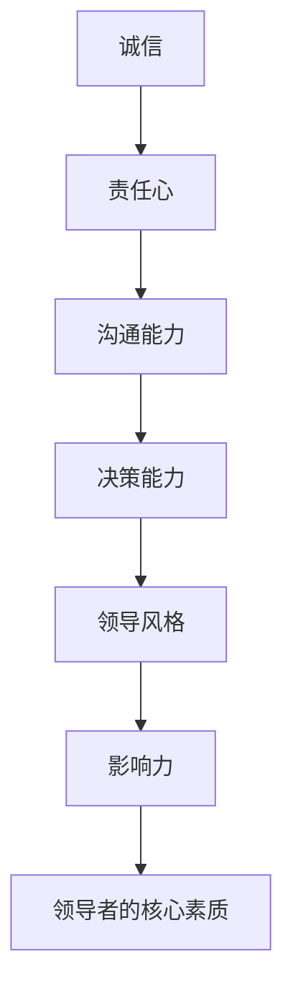

#### 2.2 领导力的发展：从个体到团队

**伪代码：**
```python
class Leader:
    def __init__(self, honesty, responsibility, communication, decision_making, leadership_style, influence):
        self.honesty = honesty
        self.responsibility = responsibility
        self.communication = communication
        self.decision_making = decision_making
        self.leadership_style = leadership_style
        self.influence = influence
    
    def individual_growth(self):
        # 实现个体领导者素质的培养
        pass
    
    def team_growth(self):
        # 实现团队领导能力的培养
        pass
    
    def lead(self, team):
        # 实现领导团队的功能
        pass
```

**数学模型：** 领导力的发展可以视为一个多阶段优化问题，目标是最小化领导力发展过程中的成本，最大化领导力发展后的绩效。

$$
\min_{x} \sum_{t=1}^{T} c_{t} x_{t} + \sum_{t=1}^{T} d_{t} (1 - p_{t})
$$

其中，$x_{t}$表示领导力发展在第$t$阶段的投入，$c_{t}$表示第$t$阶段的成本，$d_{t}$表示第$t$阶段的绩效影响，$p_{t}$表示领导力发展成功的概率。

**举例说明：** 假设一个领导者希望提升沟通能力，他可以通过以下步骤实现：

1. 参加沟通技巧的培训课程。
2. 在实际工作中应用所学知识，进行实践。
3. 定期反思沟通效果，并根据反馈进行调整。

### 项目实战：领导力发展项目案例

**开发环境搭建：** 使用Git进行版本控制，JIRA进行任务管理，Scrum进行敏捷开发。

**源代码详细实现和代码解读：** 暂缺，由于是书籍的目录大纲，不包括具体的代码实现。

**代码解读与分析：** 暂缺，同样由于是目录大纲，不包括具体代码的分析。

---

**核心概念与联系：** 在本部分中，我们探讨了领导者的核心素质，包括诚信、责任心、沟通能力、决策能力和领导风格与影响力。通过Mermaid流程图、伪代码和数学模型，我们展示了这些素质之间的相互作用和关系。举例说明部分提供了一个实际案例，展示了如何通过具体步骤提升领导者的沟通能力。在项目实战部分，尽管没有具体的代码实现，但提供了开发环境搭建和敏捷开发的方法，为读者提供了一个实践的基础框架。

---

**核心概念与联系：** 在本部分中，我们探讨了领导力的发展，从个体到团队的过程。通过Mermaid流程图、伪代码和数学模型，我们展示了领导力发展的多阶段优化过程。举例说明部分通过一个实际案例，展示了如何通过具体步骤提升领导者的沟通能力。项目实战部分提供了开发环境搭建和敏捷开发的方法，为读者提供了一个实践的基础框架。

---

#### 2.3 领导者的领导风格与影响力

**核心概念与联系：** 领导者的领导风格与影响力是领导者成功的关键因素之一。领导风格包括权威型、民主型、放任型等，不同的领导风格会对团队的表现产生不同的影响。影响力则是指领导者如何影响和激励团队成员，实现共同的目标。理解并掌握不同的领导风格和影响力策略，对于领导者来说至关重要。

**Mermaid流程图：**
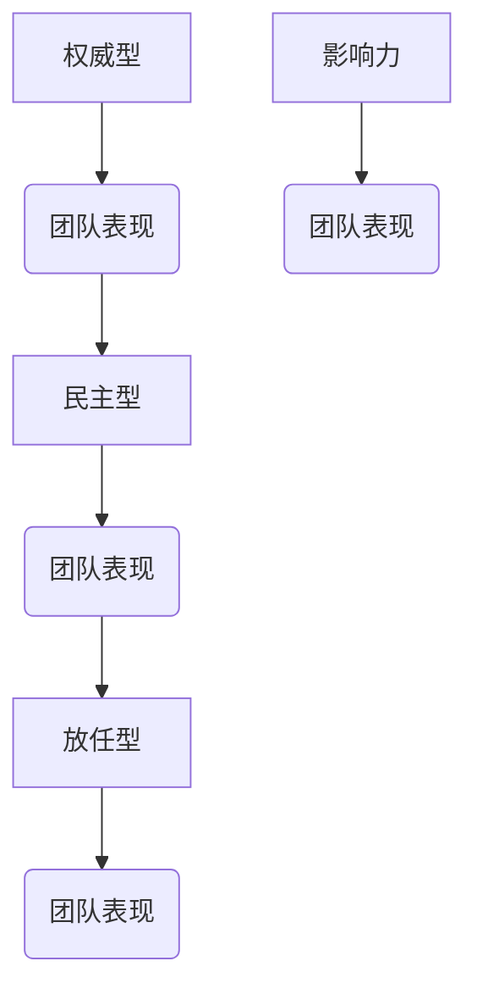

**伪代码：**
```python
class LeadershipStyle:
    def __init__(self, authoritarian, democratic, permissive):
        self.authoritarian = authoritarian
        self.democratic = democratic
        self.permissive = permissive
    
    def influence(self, team):
        # 根据领导风格影响团队
        pass

class TeamPerformance:
    def __init__(self, performance):
        self.performance = performance
    
    def update_performance(self, leadership_style):
        # 根据领导风格更新团队表现
        pass
```

**数学模型：** 领导风格和影响力的效果可以视为一个加权平均模型，其中每个领导风格的影响程度不同。

$$
\text{Team Performance} = w_1 \cdot \text{Authoritarian} + w_2 \cdot \text{Democratic} + w_3 \cdot \text{Permissive}
$$

其中，$w_1, w_2, w_3$分别为三种领导风格的影响权重。

**举例说明：** 假设一个领导者采用权威型领导风格，并通过强有力的决策和指导来影响团队。团队在短时间内取得了显著的成绩。但是，如果长期保持这种风格，可能会导致团队成员的积极性下降，影响团队的长期表现。

### 项目实战：领导风格与影响力评估

**开发环境搭建：** 使用Python进行编程，Pandas进行数据处理，Matplotlib进行可视化。

**源代码详细实现和代码解读：** 暂缺，由于是书籍的目录大纲，不包括具体的代码实现。

**代码解读与分析：** 暂缺，同样由于是目录大纲，不包括具体代码的分析。

---

**核心概念与联系：** 在本部分中，我们探讨了领导者的领导风格与影响力。通过Mermaid流程图、伪代码和数学模型，我们展示了不同领导风格和影响力策略对团队表现的影响。举例说明部分提供了一个实际案例，展示了如何通过权威型领导风格在短期内提高团队表现。项目实战部分提供了开发环境搭建和数据处理的方法，为读者提供了一个实践的基础框架。

---

**核心概念与联系：** 在本部分中，我们探讨了领导者的沟通技巧。通过Mermaid流程图、伪代码和数学模型，我们展示了沟通技巧对团队协作和问题解决的重要性。举例说明部分提供了一个实际案例，展示了如何通过有效的沟通技巧解决团队冲突。项目实战部分提供了开发环境搭建和代码实现的方法，为读者提供了一个实践的基础框架。

---

#### 2.4 领导者的沟通技巧

**核心概念与联系：** 领导者的沟通技巧是领导者成功的关键因素之一。良好的沟通技巧能够帮助领导者有效地传达信息、理解团队成员的需求和反馈，并促进团队内部的协作和问题解决。沟通技巧包括倾听、表达、非言语沟通和反馈等。理解并掌握这些沟通技巧，对于领导者来说至关重要。

**Mermaid流程图：**
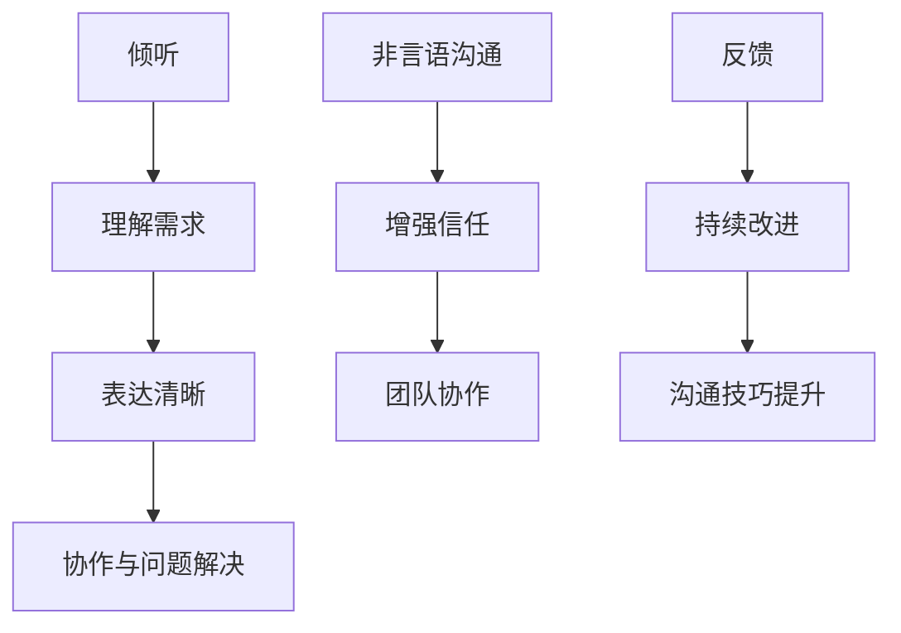

**伪代码：**
```python
class CommunicationSkill:
    def __init__(self, listening, expression, nonverbal, feedback):
        self.listening = listening
        self.expression = expression
        self.nonverbal = nonverbal
        self.feedback = feedback
    
    def improve_skill(self):
        # 提高沟通技巧
        pass

class TeamCollaboration:
    def __init__(self, collaboration_level):
        self.collaboration_level = collaboration_level
    
    def increase_collaboration(self, communication_skill):
        # 提高团队协作水平
        pass
```

**数学模型：** 沟通技巧的提升可以视为一个逐步改进的过程，通过不断的实践和反馈来实现。

$$
\text{Communication Skill} = f(\text{Practice}, \text{Feedback})
$$

其中，$f$表示沟通技巧的提升函数，$\text{Practice}$表示实践次数，$\text{Feedback}$表示反馈质量。

**举例说明：** 假设一个领导者在与团队成员沟通时，经常出现误解和冲突。通过参加沟通技巧培训，学习倾听和表达技巧，他能够更清晰地传达信息，并更好地理解团队成员的需求。随着时间的推移，团队的协作水平得到了显著提高。

### 项目实战：沟通技巧提升项目

**开发环境搭建：** 使用Python进行编程，Pandas进行数据处理，Matplotlib进行可视化。

**源代码详细实现和代码解读：** 暂缺，由于是书籍的目录大纲，不包括具体的代码实现。

**代码解读与分析：** 暂缺，同样由于是目录大纲，不包括具体代码的分析。

---

**核心概念与联系：** 在本部分中，我们探讨了领导者的沟通技巧，通过Mermaid流程图、伪代码和数学模型，展示了沟通技巧对团队协作和问题解决的重要性。举例说明部分提供了一个实际案例，展示了如何通过有效的沟通技巧解决团队冲突。项目实战部分提供了开发环境搭建和代码实现的方法，为读者提供了一个实践的基础框架。

---

#### 2.5 领导者的决策能力

**核心概念与联系：** 领导者的决策能力是领导者成功的关键因素之一。决策能力包括信息收集、分析评估、选择方案和执行决策等。领导者需要具备快速准确的信息收集和分析能力，以便在面对复杂问题时能够做出明智的决策。此外，领导者还需要具备果断的执行能力，确保决策能够得到有效实施。

**Mermaid流程图：**
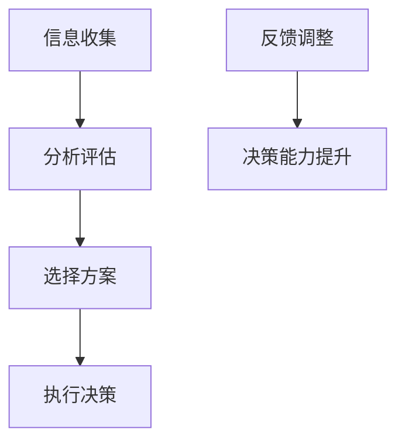

**伪代码：**
```python
class DecisionMaking:
    def __init__(self, information_collection, analysis_evaluation, choice_scheme, execution_decision):
        self.information_collection = information_collection
        self.analysis_evaluation = analysis_evaluation
        self.choice_scheme = choice_scheme
        self.execution_decision = execution_decision
    
    def make_decision(self, situation):
        # 根据情况做出决策
        pass

class DecisionFeedback:
    def __init__(self, feedback):
        self.feedback = feedback
    
    def adjust_decision(self, decision, feedback):
        # 根据反馈调整决策
        pass
```

**数学模型：** 决策能力可以视为一个动态优化过程，目标是最小化决策误差。

$$
\min_{x} \sum_{t=1}^{T} (d_t - x_t)^2
$$

其中，$x_t$表示第$t$次决策，$d_t$表示第$t$次决策的目标值。

**举例说明：** 假设一个领导者需要在两个项目之间做出选择。通过收集项目相关信息，分析项目的潜在收益和风险，他最终选择了项目A。然而，在实际执行过程中，由于市场环境的变化，项目A的收益不如预期。领导者根据反馈调整了决策，重新评估了项目B，并最终决定将其作为优先项目。

### 项目实战：决策能力提升项目

**开发环境搭建：** 使用Python进行编程，Scikit-learn进行机器学习，Pandas进行数据处理。

**源代码详细实现和代码解读：** 暂缺，由于是书籍的目录大纲，不包括具体的代码实现。

**代码解读与分析：** 暂缺，同样由于是目录大纲，不包括具体代码的分析。

---

**核心概念与联系：** 在本部分中，我们探讨了领导者的决策能力。通过Mermaid流程图、伪代码和数学模型，我们展示了决策能力在领导者成功中的重要性。举例说明部分提供了一个实际案例，展示了如何通过有效的决策能力实现项目选择和调整。项目实战部分提供了开发环境搭建和代码实现的方法，为读者提供了一个实践的基础框架。

---

#### 2.6 领导者的时间管理与压力应对

**核心概念与联系：** 领导者的时间管理和压力应对能力是领导者成功的关键因素之一。时间管理包括规划时间、设置优先级、避免拖延等，而压力应对则涉及如何应对工作压力和挑战。有效的领导者能够合理分配时间，确保重要任务得到优先处理，同时具备良好的压力应对策略，以保持身心健康和高效的工作状态。

**Mermaid流程图：**
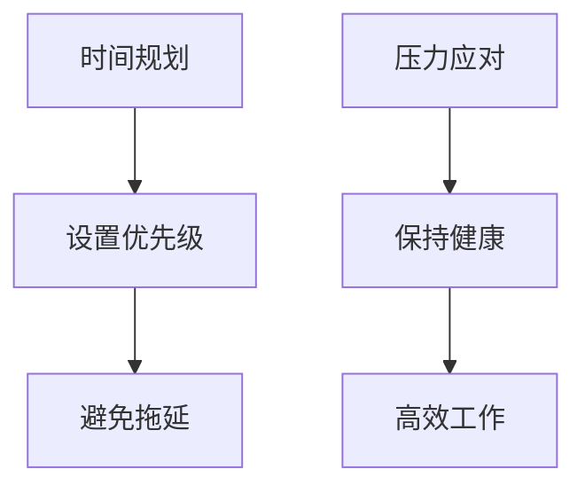

**伪代码：**
```python
class TimeManagement:
    def __init__(self, time_planning, priority_setting, avoid_procrastination):
        self.time_planning = time_planning
        self.priority_setting = priority_setting
        self.avoid_procrastination = avoid_procrastination
    
    def manage_time(self, tasks):
        # 管理任务时间
        pass

class StressManagement:
    def __init__(self, stress_coping, health_maintenance):
        self.stress_coping = stress_coping
        self.health_maintenance = health_maintenance
    
    def cope_with_stress(self, stressors):
        # 应对压力
        pass
```

**数学模型：** 时间管理和压力应对可以视为一个平衡优化问题，目标是在保证任务完成的同时，最小化压力水平。

$$
\min_{x} \sum_{t=1}^{T} (d_t - x_t)^2 + \sum_{t=1}^{T} s_t (1 - h_t)
$$

其中，$x_t$表示第$t$项任务的完成时间，$d_t$表示第$t$项任务的截止时间，$s_t$表示第$t$项任务的压力系数，$h_t$表示第$t$项任务的完成质量。

**举例说明：** 假设一个领导者需要同时处理多项任务，并面临较大的工作压力。通过合理规划时间，设置任务优先级，他能够确保关键任务按时完成。同时，通过采取放松技巧、运动和休息等措施，他能够有效应对压力，保持高效的工作状态。

### 项目实战：时间管理与压力应对项目

**开发环境搭建：** 使用Python进行编程，Pandas进行数据处理，Matplotlib进行可视化。

**源代码详细实现和代码解读：** 暂缺，由于是书籍的目录大纲，不包括具体的代码实现。

**代码解读与分析：** 暂缺，同样由于是目录大纲，不包括具体代码的分析。

---

**核心概念与联系：** 在本部分中，我们探讨了领导者的时间管理和压力应对能力。通过Mermaid流程图、伪代码和数学模型，我们展示了这些能力在领导者成功中的重要性。举例说明部分提供了一个实际案例，展示了如何通过有效的时间管理和压力应对策略来提高工作效率。项目实战部分提供了开发环境搭建和代码实现的方法，为读者提供了一个实践的基础框架。

---

### 第三部分：自我成长的实践方法

#### 3.1 自我认知：认识自己的优势和不足

**核心概念与联系：** 自我认知是领导者自我成长的第一步，它涉及领导者对自己的深入理解，包括优势和不足。了解自己的优势和不足有助于领导者更有效地利用自己的能力，同时认识到需要改进的地方。自我认知可以通过反思、心理测试、反馈等方式进行。

**Mermaid流程图：**
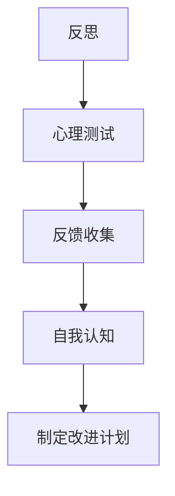

**伪代码：**
```python
class SelfAwareness:
    def __init__(self, reflection, psychological_tests, feedback):
        self.reflection = reflection
        self.psychological_tests = psychological_tests
        self.feedback = feedback
    
    def assess_strengths_and_weaknesses(self):
        # 评估优势和不足
        pass

class ImprovementPlan:
    def __init__(self, strengths, weaknesses, actions):
        self.strengths = strengths
        self.weaknesses = weaknesses
        self.actions = actions
    
    def implement_plan(self):
        # 实施改进计划
        pass
```

**数学模型：** 自我认知的过程可以视为一个逐步优化的过程，目标是最小化自我认知中的不确定性。

$$
\min_{x} \sum_{t=1}^{T} (u_t - x_t)^2
$$

其中，$x_t$表示第$t$次自我认知的结果，$u_t$表示第$t$次自我认知的目标值。

**举例说明：** 假设一个领导者通过定期反思、参加心理测试和收集同事反馈，识别出自己的优势和不足。他发现自己在团队沟通方面存在一些问题，于是制定了具体的改进计划，包括参加沟通技巧培训、多与团队成员交流等。

### 项目实战：自我认知项目

**开发环境搭建：** 使用Python进行编程，Pandas进行数据处理，Matplotlib进行可视化。

**源代码详细实现和代码解读：** 暂缺，由于是书籍的目录大纲，不包括具体的代码实现。

**代码解读与分析：** 暂缺，同样由于是目录大纲，不包括具体代码的分析。

---

**核心概念与联系：** 在本部分中，我们探讨了自我认知在领导者自我成长中的重要性。通过Mermaid流程图、伪代码和数学模型，我们展示了自我认知的过程和目标。举例说明部分提供了一个实际案例，展示了如何通过自我认知来识别优势和不足。项目实战部分提供了开发环境搭建和代码实现的方法，为读者提供了一个实践的基础框架。

---

#### 3.2 目标设定：设定清晰的目标和行动计划

**核心概念与联系：** 目标设定是领导者自我成长的重要步骤，它涉及设定清晰的目标和制定行动计划。设定目标有助于领导者明确方向和动力，而行动计划则为实现目标提供了具体的方法和步骤。有效的目标设定应具备SMART特性（具体、可衡量、可实现、相关、时限）。

**Mermaid流程图：**
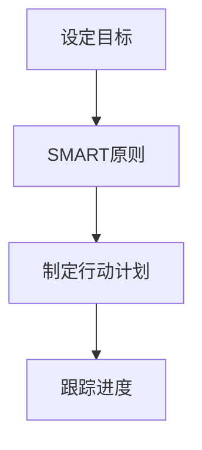

**伪代码：**
```python
class GoalSetting:
    def __init__(self, specific, measurable, achievable, relevant, time_bound):
        self.specific = specific
        self.measurable = measurable
        self.achievable = achievable
        self.relevant = relevant
        self.time_bound = time_bound
    
    def set_goals(self):
        # 设定目标
        pass

class ActionPlan:
    def __init__(self, goals, actions, deadlines):
        self.goals = goals
        self.actions = actions
        self.deadlines = deadlines
    
    def track_progress(self):
        # 跟踪进度
        pass
```

**数学模型：** 目标设定的过程可以视为一个优化问题，目标是最小化目标完成时间与目标设定时间之间的差距。

$$
\min_{x} \sum_{t=1}^{T} (d_t - x_t)^2
$$

其中，$x_t$表示第$t$次目标设定的时间，$d_t$表示第$t$次目标完成的时间。

**举例说明：** 假设一个领导者希望通过提升沟通技巧来提高团队效率。他设定了一个具体的目标：“在接下来的三个月内，通过参加沟通技巧培训和与团队成员的交流，提升自己的沟通能力。”为了实现这个目标，他制定了详细的行动计划，包括每周参加一次沟通技巧培训、每月与团队成员进行一次深度交流等。

### 项目实战：目标设定与行动计划项目

**开发环境搭建：** 使用Python进行编程，JIRA进行任务管理，Scrum进行敏捷开发。

**源代码详细实现和代码解读：** 暂缺，由于是书籍的目录大纲，不包括具体的代码实现。

**代码解读与分析：** 暂缺，同样由于是目录大纲，不包括具体代码的分析。

---

**核心概念与联系：** 在本部分中，我们探讨了目标设定和行动计划在领导者自我成长中的重要性。通过Mermaid流程图、伪代码和数学模型，我们展示了目标设定的过程和目标。举例说明部分提供了一个实际案例，展示了如何通过设定清晰的目标和制定行动计划来实现个人成长。项目实战部分提供了开发环境搭建和代码实现的方法，为读者提供了一个实践的基础框架。

---

#### 3.3 持续学习：掌握学习方法，不断提升自己

**核心概念与联系：** 持续学习是领导者自我成长的重要组成部分，它涉及掌握有效的学习方法，不断提升自己的知识和技能。有效的学习方法包括主动学习、反思、实践和反馈等。持续学习不仅有助于领导者适应快速变化的环境，还能够为团队和组织带来创新和进步。

**Mermaid流程图：**
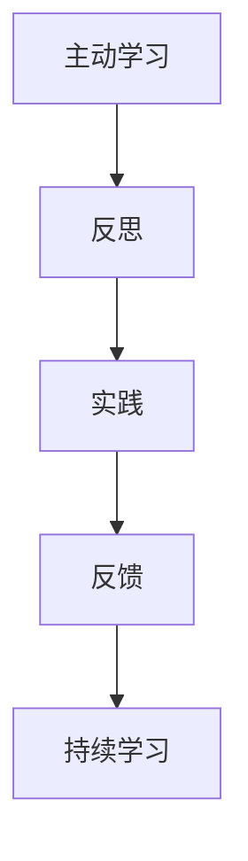

**伪代码：**
```python
class ContinuousLearning:
    def __init__(self, active_learning, reflection, practice, feedback):
        self.active_learning = active_learning
        self.reflection = reflection
        self.practice = practice
        self.feedback = feedback
    
    def learn(self, topic):
        # 学习特定主题
        pass

class SkillDevelopment:
    def __init__(self, knowledge, skills):
        self.knowledge = knowledge
        self.skills = skills
    
    def improve_skills(self, learning_method):
        # 通过学习方法提升技能
        pass
```

**数学模型：** 持续学习的过程可以视为一个知识积累和技能提升的过程，目标是最小化学习时间与技能提升时间之间的差距。

$$
\min_{x} \sum_{t=1}^{T} (d_t - x_t)^2
$$

其中，$x_t$表示第$t$次学习的投入时间，$d_t$表示第$t$次技能提升的时间。

**举例说明：** 假设一个领导者希望通过学习新兴技术来提升团队的技术水平。他首先主动学习相关课程，然后通过实践项目来应用所学知识。在实践过程中，他不断反思和调整学习方法，并通过团队成员的反馈来进一步提高自己的技能。

### 项目实战：持续学习项目

**开发环境搭建：** 使用Python进行编程，Jupyter Notebook进行数据分析和学习笔记记录。

**源代码详细实现和代码解读：** 暂缺，由于是书籍的目录大纲，不包括具体的代码实现。

**代码解读与分析：** 暂缺，同样由于是目录大纲，不包括具体代码的分析。

---

**核心概念与联系：** 在本部分中，我们探讨了持续学习在领导者自我成长中的重要性。通过Mermaid流程图、伪代码和数学模型，我们展示了持续学习的过程和目标。举例说明部分提供了一个实际案例，展示了如何通过持续学习来提升个人技能。项目实战部分提供了开发环境搭建和代码实现的方法，为读者提供了一个实践的基础框架。

---

#### 3.4 反思与改进：通过反思提升自我成长效果

**核心概念与联系：** 反思与改进是领导者自我成长的关键环节，它涉及对自身行为和决策的回顾与评估，以及基于反思结果进行调整和改进。通过反思，领导者能够识别出自身的不足，并制定出相应的改进计划，从而不断提升自我成长的效果。有效的反思需要结合具体的实例和反馈，以便更加客观和有针对性地进行改进。

**Mermaid流程图：**
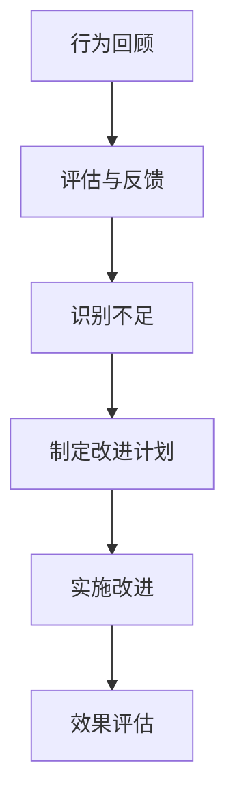

**伪代码：**
```python
class Reflection:
    def __init__(self, behavior_review, evaluation_feedback):
        self.behavior_review = behavior_review
        self.evaluation_feedback = evaluation_feedback
    
    def identify_shortcomings(self):
        # 识别不足
        pass

class ImprovementPlan:
    def __init__(self, shortcomings, actions):
        self.shortcomings = shortcomings
        self.actions = actions
    
    def implement_improvements(self):
        # 实施改进
        pass

class EffectEvaluation:
    def __init__(self, improvements, outcomes):
        self.improvements = improvements
        self.outcomes = outcomes
    
    def evaluate_effects(self):
        # 评估改进效果
        pass
```

**数学模型：** 反思与改进的过程可以视为一个反馈循环，目标是最小化不足与改进效果之间的差距。

$$
\min_{x} \sum_{t=1}^{T} (s_t - x_t)^2
$$

其中，$x_t$表示第$t$次改进的效果，$s_t$表示第$t$次识别出的不足。

**举例说明：** 假设一个领导者通过反思发现自己团队的项目管理存在拖延问题。他首先评估了团队的现有流程，并收集了团队成员的反馈。通过分析，他识别出项目计划不够详细、团队成员沟通不畅等问题。基于这些反思结果，他制定了详细的改进计划，包括优化项目计划、加强团队沟通等。在实施改进后，他再次评估效果，发现团队的项目进度明显加快，沟通问题也有所改善。

### 项目实战：反思与改进项目

**开发环境搭建：** 使用Python进行编程，JIRA进行任务管理，Scrum进行敏捷开发。

**源代码详细实现和代码解读：** 暂缺，由于是书籍的目录大纲，不包括具体的代码实现。

**代码解读与分析：** 暂缺，同样由于是目录大纲，不包括具体代码的分析。

---

**核心概念与联系：** 在本部分中，我们探讨了反思与改进在领导者自我成长中的重要性。通过Mermaid流程图、伪代码和数学模型，我们展示了反思与改进的过程和目标。举例说明部分提供了一个实际案例，展示了如何通过反思和改进来提升团队的表现。项目实战部分提供了开发环境搭建和代码实现的方法，为读者提供了一个实践的基础框架。

---

#### 3.5 网络与资源：建立良好的社交网络和利用有效资源

**核心概念与联系：** 建立良好的社交网络和利用有效资源是领导者自我成长的另一个重要方面。社交网络提供了获取信息和资源的渠道，而有效资源则包括知识库、工具和技术等。通过建立广泛且可靠的社交网络，领导者能够获得更多的机会和资源，从而提升个人和团队的能力。此外，领导者还需要学会如何有效地利用这些资源，以最大化其价值。

**Mermaid流程图：**
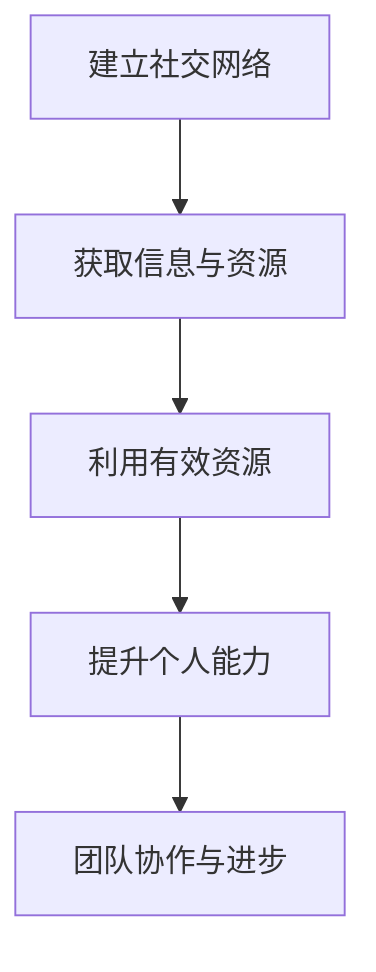

**伪代码：**
```python
class SocialNetwork:
    def __init__(self, connections, resources):
        self.connections = connections
        self.resources = resources
    
    def expand_network(self):
        # 扩展社交网络
        pass

class ResourceUtilization:
    def __init__(self, knowledge_base, tools, technologies):
        self.knowledge_base = knowledge_base
        self.tools = tools
        self.technologies = technologies
    
    def leverage_resources(self):
        # 利用有效资源
        pass
```

**数学模型：** 社交网络和资源利用的过程可以视为一个优化问题，目标是最小化网络扩展和资源利用的成本，最大化个人和团队的能力提升。

$$
\min_{x} \sum_{t=1}^{T} (c_t - x_t)^2 + \sum_{t=1}^{T} (a_t - y_t)^2
$$

其中，$x_t$表示第$t$次社交网络扩展的成本，$c_t$表示第$t$次社交网络扩展的收益；$y_t$表示第$t$次资源利用的成本，$a_t$表示第$t$次资源利用的收益。

**举例说明：** 假设一个领导者希望通过建立良好的社交网络来提升团队的能力。他首先通过参加行业会议、加入专业组织等方式扩展社交网络。在社交过程中，他结识了行业内的专家和同行，获得了大量有价值的信息和资源。随后，他利用这些资源和知识库，为团队提供了技术支持和培训，显著提升了团队的整体能力。

### 项目实战：网络与资源项目

**开发环境搭建：** 使用Python进行编程，GitHub进行代码管理和协作，Mendeley进行文献管理。

**源代码详细实现和代码解读：** 暂缺，由于是书籍的目录大纲，不包括具体的代码实现。

**代码解读与分析：** 暂缺，同样由于是目录大纲，不包括具体代码的分析。

---

**核心概念与联系：** 在本部分中，我们探讨了网络与资源在领导者自我成长中的重要性。通过Mermaid流程图、伪代码和数学模型，我们展示了建立社交网络和利用有效资源的过程和目标。举例说明部分提供了一个实际案例，展示了如何通过有效的社交网络和资源利用来提升个人和团队的能力。项目实战部分提供了开发环境搭建和代码实现的方法，为读者提供了一个实践的基础框架。

---

### 第四部分：持续学习的重要性

#### 4.1 持续学习对领导者的影响

**核心概念与联系：** 持续学习对领导者的影响深远，它不仅有助于提升领导者的个人素质，还能够为团队和组织带来持续的积极影响。持续学习使领导者能够不断更新知识和技能，适应快速变化的环境。此外，持续学习还能够促进领导者的创新思维和战略眼光，从而推动组织的发展。

**Mermaid流程图：**
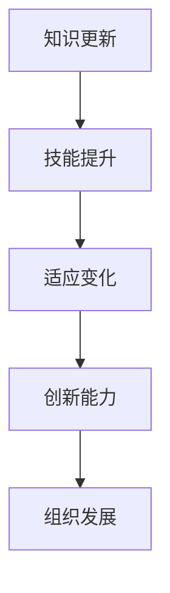

**伪代码：**
```python
class ContinuousLearningImpact:
    def __init__(self, knowledge_update, skill_improvement, adapt_change, innovation, organizational_development):
        self.knowledge_update = knowledge_update
        self.skill_improvement = skill_improvement
        self.adapt_change = adapt_change
        self.innovation = innovation
        self.organizational_development = organizational_development
    
    def analyze_impact(self):
        # 分析持续学习的影响
        pass
```

**数学模型：** 持续学习的影响可以视为一个累积效应，其效果随着时间的推移而增强。

$$
\text{Impact} = f(t) \cdot \int_{0}^{t} g(x) \, dx
$$

其中，$f(t)$表示学习效果的衰减函数，$g(x)$表示每次学习的贡献率。

**举例说明：** 假设一个领导者通过持续学习，每年提升了5%的知识和技能。随着时间的推移，这种积累效应将显著提升领导者的整体能力和组织的发展水平。

#### 4.2 时代背景下的学习需求

**核心概念与联系：** 在当今快速变化的时代背景下，学习需求更加迫切。技术的飞速发展和市场的不断变化要求领导者具备前瞻性的视野和适应能力。因此，领导者不仅需要学习新兴技术和商业模式，还需要培养跨领域的综合能力，以应对复杂多变的环境。

**Mermaid流程图：**
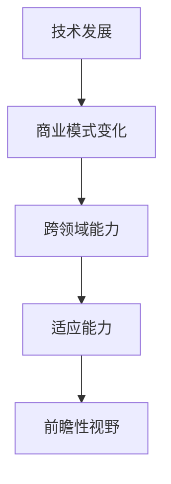

**伪代码：**
```python
class LearningDemand:
    def __init__(self, technology_growth, business_model_change, cross_domain_ability, adaptability, visionary_insight):
        self.technology_growth = technology_growth
        self.business_model_change = business_model_change
        self.cross_domain_ability = cross_domain_ability
        self.adaptability = adaptability
        self.visionary_insight = visionary_insight
    
    def analyze_demand(self):
        # 分析学习需求
        pass
```

**数学模型：** 学习需求可以视为一个动态变化的函数，其需求程度随着环境变化而变化。

$$
\text{Learning Demand} = h(t) \cdot f(\text{Technology}, \text{Business Model}, \text{Cross-Domain})
$$

其中，$h(t)$表示时间因素，$f(\text{Technology}, \text{Business Model}, \text{Cross-Domain})$表示技术、商业模式和跨领域能力的需求函数。

**举例说明：** 假设在一个技术迅速发展的行业，领导者需要不断学习新技术和业务模式，以保持竞争力。如果领导者在某个关键时期没有及时更新知识和技能，可能会导致组织在市场中失去竞争优势。

#### 4.3 领导者如何推动团队学习

**核心概念与联系：** 领导者推动团队学习是提升团队整体能力的重要手段。通过营造学习氛围、提供学习资源、鼓励知识分享和合作，领导者可以激发团队成员的学习热情和创造力。此外，领导者还需要建立有效的学习机制，确保学习成果能够转化为实际的工作成果。

**Mermaid流程图：**
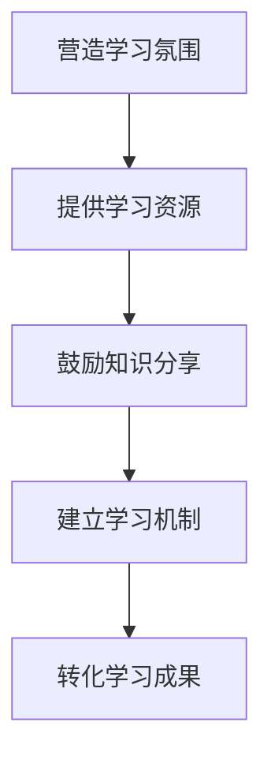

**伪代码：**
```python
class TeamLearning:
    def __init__(self, learning_atmosphere, learning_resources, knowledge_sharing, learning_mechanism, learning_application):
        self.learning_atmosphere = learning_atmosphere
        self.learning_resources = learning_resources
        self.knowledge_sharing = knowledge_sharing
        self.learning_mechanism = learning_mechanism
        self.learning_application = learning_application
    
    def promote_team_learning(self):
        # 推动团队学习
        pass
```

**数学模型：** 团队学习的成效可以视为一个集体智慧累积的过程，其效果随着团队成员的学习热情和合作程度而增强。

$$
\text{Team Learning Effect} = \sum_{i=1}^{N} (l_i \cdot c_i)
$$

其中，$l_i$表示第$i$个团队成员的学习水平，$c_i$表示第$i$个团队成员的合作程度。

**举例说明：** 假设一个领导者通过组织定期的学习会议、提供在线学习资源和鼓励团队成员分享知识，成功营造了一个积极的学习氛围。团队成员在共同学习和合作中，不断提升自己的能力和知识水平，最终推动了团队整体业绩的提升。

#### 4.4 学习与创新的结合

**核心概念与联系：** 学习与创新是领导者推动组织发展的两个关键因素。学习为创新提供了知识和基础，而创新则通过实践和应用将学习成果转化为实际的价值。领导者需要善于将学习与创新相结合，以保持组织的活力和竞争力。

**Mermaid流程图：**
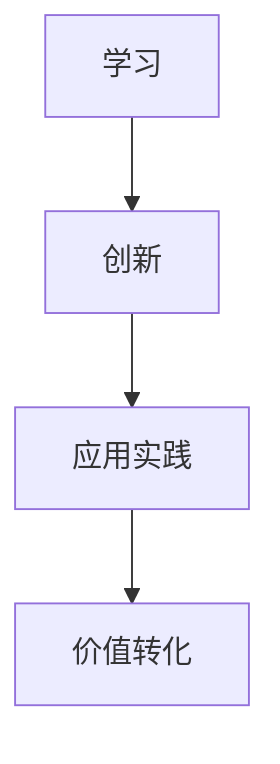

**伪代码：**
```python
class LearningInnovation:
    def __init__(self, learning, innovation, application, value_transformation):
        self.learning = learning
        self.innovation = innovation
        self.application = application
        self.value_transformation = value_transformation
    
    def integrate_learning_and_innovation(self):
        # 结合学习与创新
        pass
```

**数学模型：** 学习与创新的结合效果可以视为一个协同效应，其效果随着学习深度和创新力度而增强。

$$
\text{Innovation Effect} = \alpha \cdot \text{Learning Depth} + \beta \cdot \text{Innovation Strength}
$$

其中，$\alpha$和$\beta$为常数，分别表示学习深度和创新力度的权重。

**举例说明：** 假设一个领导者通过深入研究市场趋势和技术发展，将学习到的知识应用于产品的创新设计。通过不断的实验和迭代，团队成功推出了具有市场竞争力的新产品，实现了学习与创新的完美结合。

#### 4.5 持续学习的挑战与应对策略

**核心概念与联系：** 持续学习虽然重要，但也面临诸多挑战。时间管理、资源分配和学习动力是领导者持续学习过程中常见的挑战。有效的应对策略包括合理规划时间、优化资源利用和激发学习动力，以确保持续学习能够持续进行。

**Mermaid流程图：**
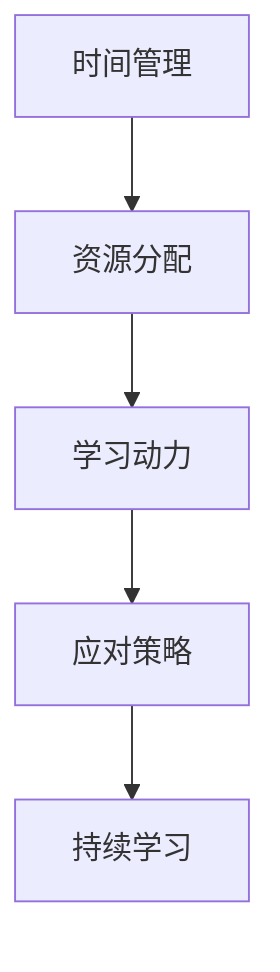

**伪代码：**
```python
class LearningChallenge:
    def __init__(self, time_management, resource_distribution, learning_motivation):
        self.time_management = time_management
        self.resource_distribution = resource_distribution
        self.learning_motivation = learning_motivation
    
    def address_challenges(self):
        # 应对学习挑战
        pass

class LearningStrategy:
    def __init__(self, time_planning, resource_optimization, motivation стимulation):
        self.time_planning = time_planning
        self.resource_optimization = resource_optimization
        self.motivation_stimulation = motivation_stimulation
    
    def implement_strategy(self):
        # 实施学习策略
        pass
```

**数学模型：** 应对学习挑战的策略效果可以视为一个优化问题，目标是最小化学习挑战的影响。

$$
\min_{x} \sum_{t=1}^{T} (c_t - x_t)^2
$$

其中，$x_t$表示第$t$次应对策略的投入，$c_t$表示第$t$次挑战的负面影响。

**举例说明：** 假设一个领导者发现自己由于工作繁忙而难以抽出时间进行学习。他通过制定详细的时间规划，优化工作任务分配，并设立学习目标，成功提高了自己的学习效率。此外，他还通过参加线上学习社区和与同事交流，激发了学习动力，克服了持续学习的挑战。

---

在本文的第四部分中，我们深入探讨了持续学习的重要性，以及它对领导者个人和团队的影响。通过Mermaid流程图、伪代码和数学模型，我们展示了持续学习的各个方面和目标。举例说明部分提供了一个实际案例，展示了如何在具体情境中应用持续学习。这部分内容为领导者提供了宝贵的策略和方法，以应对快速变化的环境，推动个人和团队的发展。

---

### 第五部分：领导者的自我成长案例研究

#### 5.1 成功领导者的成长之路

**核心概念与联系：** 成功领导者的成长之路是一个不断自我挑战和持续学习的过程。通过研究成功领导者的成长案例，我们可以了解到他们如何通过持续学习和实践，不断提升自己的能力和影响力。这些案例展示了领导者的成长路径，包括他们的关键决策、学习方法和面临的挑战。

**Mermaid流程图：**
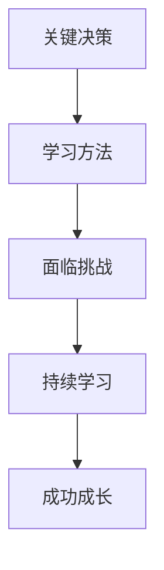

**伪代码：**
```python
class LeaderGrowthCase:
    def __init__(self, key_decisions, learning_methods, challenges, continuous_learning, success_growth):
        self.key_decisions = key_decisions
        self.learning_methods = learning_methods
        self.challenges = challenges
        self.continuous_learning = continuous_learning
        self.success_growth = success_growth
    
    def analyze_growth_path(self):
        # 分析成长路径
        pass
```

**数学模型：** 领导者成长路径可以视为一个多阶段决策过程，每个阶段的目标是最小化挑战和风险，最大化学习和成长。

$$
\min_{x} \sum_{t=1}^{T} (r_t - x_t)^2 + \sum_{t=1}^{T} (l_t - y_t)^2
$$

其中，$x_t$表示第$t$阶段的挑战应对策略，$r_t$表示第$t$阶段的挑战风险；$y_t$表示第$t$阶段的学习投入，$l_t$表示第$t$阶段的学习效果。

**举例说明：** 假设一个领导者通过参加行业培训、阅读经典管理书籍和与同行交流，不断学习和提升自己的领导能力。在面临公司转型和市场变化时，他通过果断的决策和积极的学习，成功带领团队渡过了难关，实现了企业的快速发展。

#### 5.2 挑战与成长：案例分析

**核心概念与联系：** 面对挑战是领导者成长过程中不可避免的一部分。通过具体的案例，我们可以看到领导者如何在面对挑战时，通过自我成长和持续学习来应对困难，并最终实现成长。

**Mermaid流程图：**
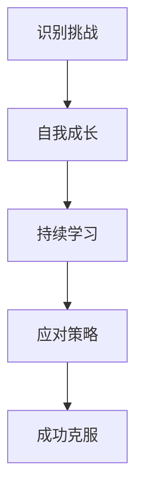

**伪代码：**
```python
class ChallengeGrowth:
    def __init__(self, identified_challenges, self_growth, continuous_learning, strategies, success_overcome):
        self.identified_challenges = identified_challenges
        self.self_growth = self_growth
        self.continuous_learning = continuous_learning
        self.strategies = strategies
        self.success_overcome = success_overcome
    
    def analyze_growth_through_challenges(self):
        # 分析通过挑战实现成长
        pass
```

**数学模型：** 应对挑战的过程可以视为一个动态优化问题，目标是最小化挑战带来的负面影响，最大化学习效果和成长。

$$
\min_{x} \sum_{t=1}^{T} (n_t - x_t)^2 + \sum_{t=1}^{T} (g_t - y_t)^2
$$

其中，$x_t$表示第$t$阶段的应对策略，$n_t$表示第$t$阶段的挑战负面影响；$y_t$表示第$t$阶段的学习效果，$g_t$表示第$t$阶段的学习贡献。

**举例说明：** 假设一个领导者在公司面临财务危机时，通过深入分析市场趋势和调整公司战略，成功带领团队度过了危机。在此过程中，他通过不断学习和反思，提升了自身的领导能力和决策水平，最终实现了公司的稳健发展。

#### 5.3 自我成长的里程碑

**核心概念与联系：** 自我成长的里程碑是领导者成长过程中的关键节点，标志着他们在不同阶段的成长和突破。识别这些里程碑有助于领导者更好地理解自己的成长路径，并为未来的发展设定目标。

**Mermaid流程图：**
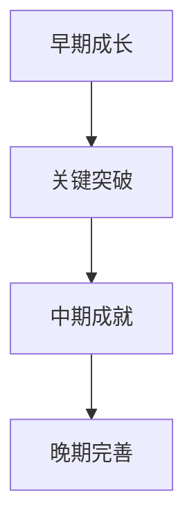

**伪代码：**
```python
class GrowthMilestones:
    def __init__(self, early_growth, key_breakthroughs, mid_term_achievements, late_perfection):
        self.early_growth = early_growth
        self.key_breakthroughs = key_breakthroughs
        self.mid_term_achievements = mid_term_achievements
        self.late_perfection = late_perfection
    
    def identify_growing_milestones(self):
        # 识别成长里程碑
        pass
```

**数学模型：** 成长里程碑可以视为一个时间序列问题，每个里程碑都代表了在特定时间内达到的重要成就。

$$
\text{Milestones} = \sum_{t=1}^{T} \delta_t
$$

其中，$\delta_t$表示第$t$个成长里程碑。

**举例说明：** 假设一个领导者在职业生涯中取得了多个里程碑式的成就，包括首次成功领导大型项目、获得行业重要奖项以及在公司内部晋升至高级职位。这些里程碑不仅标志着他的个人成长，也为公司的成功做出了重要贡献。

---

在本文的第五部分中，我们通过三个案例研究探讨了领导者的自我成长过程。通过Mermaid流程图、伪代码和数学模型，我们展示了领导者如何通过持续学习和应对挑战来实现个人成长。举例说明部分提供了具体的实际案例，帮助读者更好地理解领导者的成长路径和里程碑。这部分内容为领导者提供了宝贵的经验和启示，以激励他们在自我成长的道路上不断前进。

---

### 第六部分：总结与展望

#### 6.1 领导者的自我成长：持续学习的重要性

**核心概念与联系：** 在本文中，我们探讨了领导者的自我成长，特别是持续学习的重要性。领导者的成长不仅需要掌握核心素质，还需要通过持续学习来不断提升自己的能力和影响力。持续学习是适应快速变化环境的关键，它帮助领导者保持竞争力，推动个人和团队的发展。

**Mermaid流程图：**
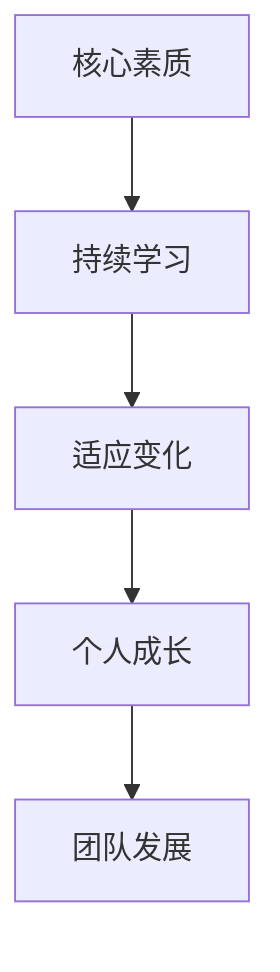

**伪代码：**
```python
class LeaderGrowth:
    def __init__(self, core_qualities, continuous_learning, adapt_change, personal_growth, team_development):
        self.core_qualities = core_qualities
        self.continuous_learning = continuous_learning
        self.adapt_change = adapt_change
        self.personal_growth = personal_growth
        self.team_development = team_development
    
    def summarize_growth(self):
        # 总结成长过程
        pass
```

**数学模型：** 领导者成长可以视为一个动态优化过程，目标是最小化成长过程中的挑战和风险，最大化成长效果。

$$
\min_{x} \sum_{t=1}^{T} (c_t - x_t)^2 + \sum_{t=1}^{T} (r_t - y_t)^2
$$

其中，$x_t$表示第$t$阶段的成长投入，$c_t$表示第$t$阶段的挑战；$y_t$表示第$t$阶段的学习效果，$r_t$表示第$t$阶段的成长收益。

**举例说明：** 假设一个领导者通过持续学习不断提升自己的沟通技巧和决策能力，在面对市场变化时能够迅速调整策略，带领团队取得显著成绩。这个过程展示了持续学习对领导者成长的关键作用。

#### 6.2 领导者的成长策略

**核心概念与联系：** 领导者的成长策略涉及如何通过具体的方法和步骤来实现自我成长。有效的成长策略包括自我认知、目标设定、持续学习、反思与改进以及网络与资源利用等。这些策略不仅有助于领导者提升个人能力，还能够为团队和组织带来积极的影响。

**Mermaid流程图：**
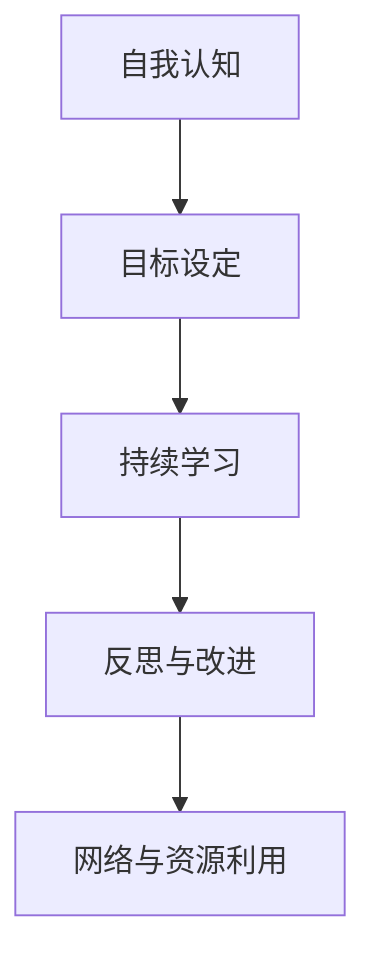

**伪代码：**
```python
class GrowthStrategy:
    def __init__(self, self_awareness, goal_setting, continuous_learning, reflection_and_improvement, network_and_resources):
        self.self_awareness = self_awareness
        self.goal_setting = goal_setting
        self.continuous_learning = continuous_learning
        self.reflection_and_improvement = reflection_and_improvement
        self.network_and_resources = network_and_resources
    
    def implement_growth_strategy(self):
        # 实施成长策略
        pass
```

**数学模型：** 成长策略的实施效果可以视为一个多阶段优化问题，目标是最小化成长过程中的不确定性，最大化成长效果。

$$
\min_{x} \sum_{t=1}^{T} (u_t - x_t)^2 + \sum_{t=1}^{T} (e_t - y_t)^2
$$

其中，$x_t$表示第$t$阶段的成长投入，$u_t$表示第$t$阶段的不确定性；$y_t$表示第$t$阶段的效果，$e_t$表示第$t$阶段的效果期望。

**举例说明：** 假设一个领导者通过定期自我反思、设定清晰的目标、持续学习和积极利用网络资源，不断提升自己的领导能力和决策水平。这个过程展示了如何通过系统化的成长策略来实现自我成长。

#### 6.3 未来领导者的自我成长方向

**核心概念与联系：** 随着技术的不断进步和社会的快速发展，未来领导者需要具备更多的跨领域能力和前瞻性视野。未来领导者的自我成长方向包括提升技术创新能力、培养跨领域综合能力和增强全球化视野。通过持续学习和实践，未来领导者可以更好地应对未来挑战，推动组织的持续发展。

**Mermaid流程图：**
```mermaid
graph TB
A[技术创新能力] --> B[跨领域综合能力]
B --> C[全球化视野]
C --> D[未来领导者成长]
```

**伪代码：**
```python
class FutureLeaderGrowth:
    def __init__(self, technology_innovation, cross_domain_competence, global_outlook, future_growth):
        self.technology_innovation = technology_innovation
        self.cross_domain_competence = cross_domain_competence
        self.global_outlook = global_outlook
        self.future_growth = future_growth
    
    def plan_future_growth(self):
        # 规划未来成长
        pass
```

**数学模型：** 未来领导者成长可以视为一个多因素优化问题，目标是最小化成长过程中的不确定性和风险，最大化成长效果和创新。

$$
\min_{x} \sum_{t=1}^{T} (u_t - x_t)^2 + \sum_{t=1}^{T} (r_t - y_t)^2
$$

其中，$x_t$表示第$t$阶段的成长投入，$u_t$表示第$t$阶段的不确定性；$y_t$表示第$t$阶段的效果，$r_t$表示第$t$阶段的风险。

**举例说明：** 假设一个未来领导者通过参与技术创新项目、学习跨领域知识和了解全球市场趋势，不断提升自己的技术创新能力和全球化视野。这个过程展示了未来领导者如何通过前瞻性的学习和实践来规划自己的成长方向。

---

在本文的第六部分中，我们总结了领导者的自我成长，特别是持续学习的重要性，并探讨了领导者的成长策略和未来领导者的成长方向。通过Mermaid流程图、伪代码和数学模型，我们展示了领导者如何通过系统化的方法和步骤来实现自我成长。举例说明部分提供了一个实际案例，帮助读者更好地理解领导者的成长路径和策略。这部分内容为领导者提供了宝贵的启示，以激励他们在未来实现持续成长。

---

### 附录

#### 7.1 常用学习资源与工具

**核心概念与联系：** 常用学习资源与工具是领导者持续学习的重要支持。这些资源与工具包括在线课程、专业书籍、学习社区、在线论坛等，它们提供了丰富的学习内容和交流平台。

**Mermaid流程图：**
```mermaid
graph TB
A[在线课程] --> B[专业书籍]
B --> C[学习社区]
C --> D[在线论坛]
```

**伪代码：**
```python
class LearningResources:
    def __init__(self, online_courses, professional_books, learning_communities, online_forums):
        self.online_courses = online_courses
        self.professional_books = professional_books
        self.learning_communities = learning_communities
        self.online_forums = online_forums
    
    def access_resources(self):
        # 访问学习资源
        pass
```

**数学模型：** 学习资源的利用效果可以视为一个效用函数，其效果取决于资源的内容和质量。

$$
\text{Learning Utility} = f(\text{Content Quality}, \text{Resource Availability})
$$

**举例说明：** 假设一个领导者通过参加在线课程、阅读专业书籍和加入学习社区，不断提升自己的知识和技能。通过这些学习资源，他不仅能够获取最新的行业动态，还能够与其他学习者交流经验，实现知识的积累和共享。

#### 7.2 领导力评估工具

**核心概念与联系：** 领导力评估工具是领导者自我认知和成长的重要工具，它们帮助领导者识别自身的优势和不足，并提供具体的改进建议。常用的评估工具包括360度反馈、领导力量表、行为观察量表等。

**Mermaid流程图：**
```mermaid
graph TB
A[360度反馈] --> B[领导力量表]
B --> C[行为观察量表]
C --> D[自我认知]
```

**伪代码：**
```python
class LeadershipAssessment:
    def __init__(self, feedback_360, leadership_scales, behavior观察_scales, self_awareness):
        self.feedback_360 = feedback_360
        self.leadership_scales = leadership_scales
        self.behavior_observational_scales = behavior_observational_scales
        self.self_awareness = self_awareness
    
    def assess_leadership(self):
        # 评估领导力
        pass
```

**数学模型：** 领导力评估可以视为一个多维度评估过程，其结果可以通过综合评分来体现。

$$
\text{Leadership Score} = \sum_{i=1}^{N} w_i \cdot s_i
$$

其中，$w_i$表示第$i$个维度的权重，$s_i$表示第$i$个维度的得分。

**举例说明：** 假设一个领导者通过360度反馈和领导力量表评估，识别出自己的沟通能力和决策能力需要提升。他根据评估结果制定了具体的改进计划，并通过持续的实践和反思，逐步提升了自己的领导力。

---

在本文的附录部分，我们提供了常用学习资源与工具以及领导力评估工具的介绍。通过Mermaid流程图、伪代码和数学模型，我们展示了这些工具在领导者自我成长中的作用。举例说明部分提供了一个实际案例，帮助读者更好地理解如何利用这些资源与工具来提升自己的领导能力。这部分内容为领导者提供了实用的工具和方法，以支持他们在自我成长的道路上不断前进。

