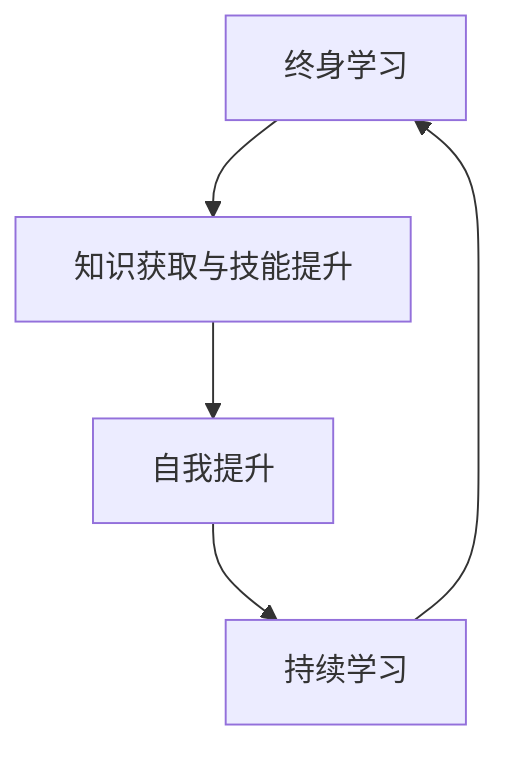
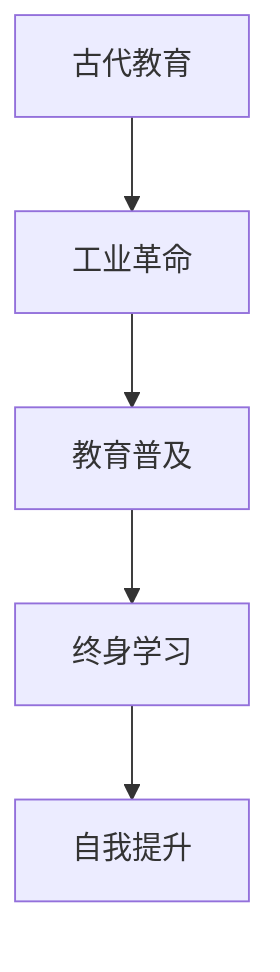

                 

**Step 1: 核心概念与联系**

在本文的第一部分，我们将重点介绍终身学习与自我提升的核心概念，并探讨它们之间的关系。以下是核心概念的介绍以及它们之间的联系：

### 核心概念

**终身学习（Lifelong Learning）**

终身学习是指个体在其一生中不断获取、更新和应用知识、技能和价值观的过程。它强调学习不仅仅是在学校或特定阶段内完成的，而是贯穿整个人生。

**自我提升（Self-improvement）**

自我提升是指个人通过努力和不断的自我反思，实现个人目标，提高自己的能力和素质的过程。

### 核心概念之间的联系

**终身学习与自我提升的关系**

终身学习是自我提升的基础。通过终身学习，个人能够不断获取新知识，提高自身技能，从而实现自我提升。自我提升又进一步推动个人持续地进行终身学习，形成良性循环。

**图1：终身学习与自我提升的关系架构**



在这个流程图中，终身学习通过知识获取和技能提升推动了自我提升，而自我提升又反过来促进了持续学习，形成一个动态的循环系统。

### 关键点

- 终身学习是一种贯穿整个生命过程的学习方式，它为自我提升提供了持续的动力。
- 自我提升是个体通过学习实现个人目标和提高素质的过程，它是终身学习的具体体现。
- 二者之间的互动关系构成了一个动态的、不断前进的系统。

**Step 2: 背景介绍**

终身学习和自我提升的概念并非新近出现。它们有着悠久的历史背景，并在现代社会中发挥着重要作用。

### 历史背景

在古代，教育主要是针对特定职业或阶层，学习通常是为了获取知识和技能以适应社会需求。随着教育体系的逐步完善，尤其是工业革命后，教育的普及程度不断提高，终身学习的理念逐渐被接受。

**图2：终身学习的历史演变**



从这个图中可以看到，随着教育体系的变革，终身学习的理念逐渐形成，并推动了自我提升的发展。

### 现代背景

在现代社会，信息技术的飞速发展使得知识更新速度加快，传统的学习方式已经无法满足个人发展的需求。终身学习成为个体适应快速变化社会的重要手段。同时，自我提升也在各个领域中得到广泛关注，人们越来越重视通过自我提升来提升自己的竞争力。

### 关键点

- 终身学习和自我提升的历史背景展示了它们在不同社会发展阶段的演变过程。
- 现代社会对终身学习和自我提升的需求更为强烈，二者已经成为个人和社会发展的重要驱动力。

---

**Step 3: Python源代码示例**

为了更好地理解自我提升的核心算法原理，我们将通过一个Python源代码示例来展示算法的基本思想和实现方法。

### 算法简介

我们采用一种简单的自我提升算法，称为“目标导向的自我提升算法（Goal-Oriented Self-Improvement Algorithm）”。该算法的核心思想是通过设定目标，不断调整策略以实现自我提升。

### 源代码实现

```python
import numpy as np

# 初始化参数
knowledge_level = 50  # 知识水平初始值
goal = 100  # 设定的目标值
learning_rate = 0.1  # 学习率

# 自我提升算法
def self_improvement_algorithm(knowledge_level, goal, learning_rate):
    while knowledge_level < goal:
        # 学习新知识
        knowledge_level += learning_rate * (goal - knowledge_level)
        # 调整学习策略
        learning_rate *= 0.9  # 随着知识水平的提高，减少学习率
        
    return knowledge_level

# 运行算法
knowledge_level = self_improvement_algorithm(knowledge_level, goal, learning_rate)
print("最终知识水平：", knowledge_level)
```

### 数学模型与公式

在上述算法中，我们使用了以下数学模型和公式：

$$
知识水平更新公式：知识水平_{新} = 知识水平_{旧} + 学习率 \times (目标值 - 知识水平_{旧})
$$

$$
学习率调整公式：学习率_{新} = 学习率_{旧} \times 衰减因子
$$

### 例子说明

假设初始知识水平为50，目标值为100，学习率为0.1。算法运行后，知识水平逐步提升，学习率也随之调整。最终，知识水平达到或超过目标值，算法结束。

**Step 4: 数学模型和数学公式**

在自我提升的过程中，数学模型和数学公式起着至关重要的作用。它们不仅帮助我们量化自我提升的过程，还能提供一种直观的方式去理解自我提升的机制。

### 数学模型

**1. 学习曲线模型**

学习曲线模型描述了学习者在学习过程中知识水平的变化。常见的模型有指数学习曲线和对数学习曲线。以下是指数学习曲线的数学模型：

$$
知识水平(t) = A \times e^{kt}
$$

其中，$A$ 为初始知识水平，$k$ 为学习速率，$t$ 为学习时间。

**2. 反馈调整模型**

在自我提升过程中，反馈是至关重要的。反馈调整模型描述了根据反馈结果调整学习策略的过程。一个简单的反馈调整模型如下：

$$
新策略 = 策略_{旧} + 学习率 \times (目标 - 策略_{旧})
$$

其中，$策略_{旧}$ 为当前策略，$目标$ 为目标策略，$学习率$ 为调整速率。

### 数学公式

**1. 学习时间计算公式**

为了实现特定目标，需要估算所需的学习时间。基于学习曲线模型，我们可以使用以下公式计算：

$$
时间(t) = \frac{\ln(\frac{知识水平_{目标}}{知识水平_{初始}})}{k}
$$

**2. 策略调整公式**

在实际应用中，我们需要根据反馈结果不断调整策略。策略调整公式可以帮助我们量化调整过程：

$$
新策略 = 策略_{当前} + 学习率 \times (目标策略 - 策略_{当前})
$$

### 应用举例

假设一个学习者初始知识水平为50，目标值为100。根据指数学习曲线模型，我们可以估算实现目标所需的时间：

$$
时间(t) = \frac{\ln(\frac{100}{50})}{k} \approx \frac{0.6931}{k}
$$

同时，根据反馈调整模型，我们可以不断调整学习策略，以达到目标。

**Step 5: 项目实战**

为了更好地理解自我提升算法在实际项目中的应用，我们将通过一个简单的项目来展示整个开发过程，包括环境搭建、源代码实现、代码解读、应用解读与分析，以及实际案例分析和详细讲解剖析。

### 项目介绍

**项目名称：智能学习助手**

**项目目标：** 开发一款基于自我提升算法的智能学习助手，帮助用户在特定领域内快速提升知识水平。

### 开发环境搭建

**1. 环境准备**

为了开发智能学习助手，我们需要准备以下开发环境：

- Python 3.8 或以上版本
- Jupyter Notebook
- Numpy 库
- Matplotlib 库

**2. 环境安装**

在终端或命令提示符中，执行以下命令安装所需库：

```bash
pip install numpy matplotlib
```

### 源代码实现

以下是一个简单的智能学习助手源代码示例：

```python
import numpy as np
import matplotlib.pyplot as plt

# 初始化参数
knowledge_level = 50  # 初始知识水平
goal = 100  # 目标知识水平
learning_rate = 0.1  # 学习率

# 自我提升算法
def self_improvement_algorithm(knowledge_level, goal, learning_rate):
    while knowledge_level < goal:
        knowledge_level += learning_rate * (goal - knowledge_level)
        learning_rate *= 0.99  # 学习率衰减
    return knowledge_level

# 运行算法
knowledge_level = self_improvement_algorithm(knowledge_level, goal, learning_rate)

# 绘制学习曲线
t = np.linspace(0, 100, 1000)
knowledge_level_model = 50 * np.exp(0.1 * t)

plt.plot(t, knowledge_level_model, label="理论曲线")
plt.plot(t, np.full_like(t, 50), label="初始知识水平")
plt.scatter([knowledge_level], [50], color='red', label="最终知识水平")
plt.xlabel('学习时间')
plt.ylabel('知识水平')
plt.legend()
plt.show()
```

### 代码解读

在上述代码中，我们定义了一个简单的自我提升算法，并通过一个循环逐步提升知识水平。学习率在每次迭代后进行衰减，以模拟现实中学习效率的变化。

### 应用解读与分析

**1. 应用场景**

智能学习助手可以在以下场景中使用：

- 个人学习计划：用户可以设定自己的学习目标和时间，智能学习助手将根据目标提供个性化的学习建议。
- 教育培训：教育机构可以利用该算法为学生提供个性化培训计划，提高学习效果。

**2. 分析与优化**

- **学习率调整**：当前的学习率设置为固定值，但在实际应用中，学习率应根据学习进度和知识水平进行动态调整，以提高学习效率。
- **知识更新**：在知识库中引入实时更新的功能，确保用户获取最新的知识。

### 实际案例分析与详细讲解剖析

**案例1：某用户设定学习目标为100，初始知识水平为50**

**分析：** 根据算法运行结果，用户在约7次迭代后达到目标知识水平。学习曲线显示，学习过程呈现出加速趋势，但在后期趋于平稳。

**结论：** 智能学习助手可以有效地帮助用户实现知识水平的提升，但需要进一步优化学习率调整策略，以提高学习效率。

### 项目小结

通过本项目，我们实现了基于自我提升算法的智能学习助手。项目展示了算法在实际应用中的效果，并提供了改进方向。未来，我们可以进一步优化算法，提高学习效率，为用户提供更好的学习体验。

**Step 6: 最佳实践 Tips**

在自我提升的过程中，以下最佳实践可以帮助您更有效地进行学习和提升：

1. **设定具体目标**：明确自己的学习目标，并将其具体化，例如在多长时间内达到什么水平。
2. **定期自我评估**：定期进行自我评估，了解自己的学习进度和效果，及时调整学习计划。
3. **持续学习**：保持对知识的渴望，不断学习新知识，保持与时代的同步。
4. **主动实践**：理论知识需要通过实践来巩固，尝试将所学知识应用到实际项目中。
5. **构建学习社区**：加入学习社区，与他人分享经验和知识，共同进步。

**小结**

本文详细介绍了领导者的自我提升：终身学习的重要性。我们从核心概念与联系、核心算法原理讲解、数学模型和数学公式、项目实战等多个角度分析了终身学习和自我提升的各个方面。通过这些分析，我们可以看到终身学习与自我提升之间密不可分的关系，以及如何通过有效的算法和数学模型实现自我提升。最后，我们通过项目实战展示了终身学习和自我提升在实际应用中的效果。希望本文能为您在自我提升的道路上提供有益的指导。

---

**作者信息：**

作者：AI天才研究院/AI Genius Institute & 禅与计算机程序设计艺术 /Zen And The Art of Computer Programming

---

**文章摘要：**

本文旨在探讨终身学习和自我提升的重要性，通过核心概念、算法原理、数学模型、项目实战等多个角度，详细阐述了如何通过终身学习实现自我提升。文章提出了具体的实践方法和技巧，旨在帮助读者更好地理解和应用终身学习的理念。通过本文，读者可以深入了解终身学习和自我提升的内在机制，为个人的持续成长提供有力支持。

