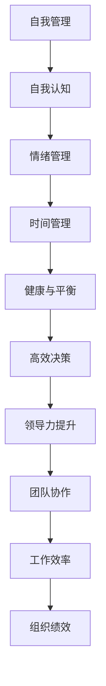
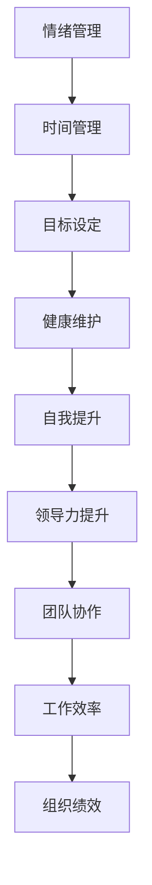

                 

## 领导者的自我管理：工作与生活的平衡

在信息技术飞速发展的今天，领导者不仅要具备卓越的技术能力和管理技能，更需要进行自我管理，以保持工作与生活的平衡。自我管理不仅是个人发展的基石，也是领导者有效领导团队、实现组织目标的关键。本文旨在探讨领导者如何进行自我管理，实现工作与生活的平衡，从而提升领导力和生活质量。

### 核心关键词

- **自我管理**
- **领导者**
- **工作与生活平衡**
- **时间管理**
- **情绪管理**
- **健康维护**
- **持续成长**

### 摘要

本文从自我管理的意义和重要性入手，详细阐述了领导者自我管理的核心要素，包括情绪管理、时间管理、目标设定、健康维护和自我提升。接着，文章探讨了如何实现工作与生活的平衡，包括高效工作策略、生活平衡的重要性及策略。通过实际案例研究和实践指南，文章提供了具体的方法和工具，帮助领导者进行自我管理，实现工作与生活的和谐平衡。

### 自我管理的意义与重要性

#### 自我管理的定义

自我管理是指个体通过自我观察、自我调节和自我控制等方式，主动管理自己的行为、情感和思维过程，以达到个人目标的过程。它不仅包括对行为的规范，还涵盖了情感调节、认知管理和资源利用等方面。自我管理在领导者角色中尤为重要，因为它直接影响到领导效果、团队效率和整体组织绩效。

#### 领导者自我管理的重要性

1. **提升领导力**：自我管理能力是领导者必须具备的基本素质，它直接影响领导者的决策质量、沟通效率和团队凝聚力。通过自我管理，领导者能够更好地理解自己和他人，提高决策的准确性和执行力。
   
2. **促进团队协作**：领导者通过自我管理，能够树立榜样，激发团队成员的积极性，增强团队凝聚力和协作精神。自我管理良好的领导者往往能够更有效地协调团队资源，提升团队整体效率。

3. **提高工作效率**：自我管理有助于领导者合理安排时间和任务，避免过度工作，提高工作效率。通过有效的自我管理，领导者可以更好地平衡工作与生活，保持良好的工作状态。

4. **保持身心健康**：长期的工作压力和挑战容易导致身心疲惫，甚至健康问题。自我管理能够帮助领导者保持身心健康，提高抗压能力，延长职业生涯。

#### 自我管理对领导者影响的流程

自我管理对领导者的影响是一个复杂的过程，涉及多个环节。以下是使用Mermaid流程图展示的自我管理对领导者影响的流程：

在这个流程中，自我管理通过自我认知、情绪管理、时间管理和健康与平衡等环节，最终实现高效决策、领导力提升、团队协作、工作效率和组织绩效的提升。

#### 自我管理的核心要素

领导者自我管理的核心要素包括情绪管理、时间管理、目标设定、健康维护和自我提升。以下是对每个要素的详细分析：

1. **情绪管理**：情绪管理是指领导者通过自我调节，保持情绪稳定，避免负面情绪对工作和生活的影响。情绪稳定的领导者能够更好地应对压力和挑战，保持良好的工作状态。

2. **时间管理**：时间管理是指领导者合理安排时间，确保任务的高效完成。通过时间管理，领导者可以更好地平衡工作与生活，提高工作效率。

3. **目标设定**：目标设定是指领导者明确个人和团队的目标，并制定实现这些目标的计划和策略。有效的目标设定有助于提高领导者的决策质量和执行力。

4. **健康维护**：健康维护是指领导者关注身体健康和心理状态，采取积极的健康生活方式。健康维护有助于提高领导者的抗压能力和生活质量。

5. **自我提升**：自我提升是指领导者通过学习和实践，不断提升个人能力和素质。自我提升是领导者持续成长的重要途径，有助于提升领导力和组织绩效。

通过以上分析，我们可以看到，领导者自我管理是一个系统性的过程，涉及多个方面的要素。只有通过全面地自我管理，领导者才能实现工作与生活的平衡，提升领导力和生活质量。

### 领导者自我管理的核心要素

领导者自我管理的核心要素是领导者成功的关键，这些要素相互作用，共同构成了一个有效的自我管理体系。以下将详细分析情绪管理、时间管理、目标设定、健康维护和自我提升等核心要素，并使用Mermaid流程图展示各要素之间的关系。

#### 情绪管理

情绪管理是指领导者学会控制和调节自己的情绪，保持情绪稳定，避免情绪波动对工作和决策产生负面影响。情绪稳定的领导者能够更好地应对工作压力和挑战，保持冷静和理智。

**情绪管理对领导者的影响**：

- **提升决策质量**：情绪稳定的领导者能够更客观地分析问题和评估风险，做出更明智的决策。
- **增强团队信任**：情绪管理的领导者能够营造积极的工作氛围，增强团队成员的信任和合作意愿。
- **提高工作效率**：情绪稳定的领导者能够更好地控制情绪，避免情绪波动导致的工作效率低下。

**情绪管理的策略**：

- **自我认知**：领导者需要认识到自己的情绪状态，并学会通过自我反思来调节情绪。
- **情绪释放**：领导者可以通过运动、冥想或其他放松方式来释放负面情绪。
- **情绪转换**：领导者可以学会将负面情绪转化为积极的动力，以更好地应对挑战。

#### 时间管理

时间管理是指领导者合理安排时间，确保任务的高效完成，避免时间浪费和工作拖延。有效的时间管理有助于领导者更好地平衡工作与生活，提高工作效率。

**时间管理对领导者的影响**：

- **提高工作效率**：通过合理安排时间，领导者可以确保任务的优先级，避免不必要的拖延和延误。
- **提升生活质量**：合理的时间管理使领导者能够更好地安排工作和生活，提高生活质量。
- **增强决策准确性**：时间管理良好的领导者有更多的时间和精力来分析问题和制定策略，提高决策的准确性。

**时间管理的策略**：

- **任务优先级设定**：领导者需要根据任务的紧急程度和重要性来设定优先级，确保关键任务得到及时处理。
- **日程规划**：领导者需要制定详细的日程规划，合理安排每天的工作和休息时间。
- **时间监控**：领导者可以通过时间监控工具来追踪自己的时间使用情况，及时发现和调整时间管理中的问题。

#### 目标设定

目标设定是指领导者明确个人和团队的目标，并制定实现这些目标的计划和策略。有效的目标设定有助于提升领导者的决策质量和执行力。

**目标设定对领导者的影响**：

- **明确方向**：目标设定为领导者提供了明确的方向和目标，有助于集中精力实现关键任务。
- **提升执行力**：明确的目标使领导者能够更有针对性地制定计划和策略，提高执行力。
- **激励团队成员**：目标设定不仅激励领导者，也激励团队成员，增强团队凝聚力。

**目标设定的策略**：

- **SMART原则**：目标设定应遵循SMART原则（具体、可衡量、可实现、相关、时限），确保目标的明确性和可实现性。
- **分解目标**：将大目标分解为小目标，逐步实现，有助于提高执行力和积极性。
- **定期评估**：领导者需要定期评估目标的完成情况，及时调整计划和策略。

#### 健康维护

健康维护是指领导者关注身体健康和心理状态，采取积极的健康生活方式。健康维护有助于提高领导者的抗压能力和生活质量。

**健康维护对领导者的影响**：

- **提高抗压能力**：健康的身体和心理状态使领导者能够更好地应对工作压力和挑战。
- **提升工作效率**：健康的领导者能够保持更高的工作精力，提高工作效率。
- **延长职业生涯**：健康的生活方式有助于延长领导者的职业生涯，保持持续的工作状态。

**健康维护的策略**：

- **定期锻炼**：领导者需要定期参加体育锻炼，保持身体健康。
- **健康饮食**：领导者需要注重健康饮食，避免过度饮酒和吸烟。
- **心理健康**：领导者可以通过心理咨询、冥想等方式维护心理健康。

#### 自我提升

自我提升是指领导者通过学习和实践，不断提升个人能力和素质。自我提升是领导者持续成长的重要途径，有助于提升领导力和组织绩效。

**自我提升对领导者的影响**：

- **增强竞争力**：自我提升使领导者具备更强的专业能力和综合素质，提高市场竞争力。
- **提升领导力**：通过不断学习和实践，领导者能够掌握更多有效的领导方法和策略，提升领导力。
- **促进组织发展**：领导者的自我提升有助于推动组织的发展和进步，提升整体绩效。

**自我提升的策略**：

- **持续学习**：领导者需要持续学习，关注行业动态和最新技术，不断提升自己的专业能力。
- **实践应用**：领导者需要将所学知识应用于实际工作中，通过实践不断提升自己的能力和素质。
- **跨领域交流**：领导者可以通过参加行业会议、研讨会等，与其他领域的专家进行交流，拓展自己的视野和知识。

#### Mermaid流程图

以下是使用Mermaid流程图展示领导者自我管理各要素之间的关系的图示：

通过以上分析，我们可以看到，情绪管理、时间管理、目标设定、健康维护和自我提升是领导者自我管理的核心要素。这些要素相互关联，共同作用，有助于提升领导者的领导力、团队协作能力、工作效率和组织绩效。领导者只有通过全面地自我管理，才能实现工作与生活的平衡，保持持续成长和发展的状态。

### 高效工作策略

在信息技术高度发达的今天，领导者面临的工作任务和挑战日益增多。为了确保工作的高效完成，领导者需要掌握一系列高效工作策略。这些策略不仅有助于提升个人工作效率，还能促进团队协作，提升整体组织绩效。

#### 提高工作效率的技巧

1. **任务优先级设定**：领导者需要根据任务的紧急程度和重要性来设定任务的优先级。可以使用“四象限法”将任务分为“重要紧急”、“重要不紧急”、“不重要紧急”和“不重要不紧急”四个类别，从而合理安排时间和精力。

2. **时间块管理**：将工作时间划分为不同的时间段，并为每个时间段安排具体的任务。这种方法有助于避免时间浪费，确保关键任务得到及时处理。

3. **任务分解**：将复杂任务分解为多个小任务，逐一完成。这种方法能够降低任务的难度，提高完成效率。

4. **自动化工具的使用**：利用各种自动化工具和软件，如邮件过滤器、日程安排器、项目管理工具等，减少手动操作，提高工作效率。

#### 高效会议管理

会议是领导者日常工作中不可或缺的一部分，高效的会议管理能够显著提升工作效率。以下是一些高效会议管理的策略：

1. **明确会议目标**：在召开会议之前，明确会议的目标和议程，确保会议有明确的方向和重点。

2. **控制会议时间**：合理安排会议时间，避免会议时间过长，影响其他工作任务的完成。可以使用“站立会议”或“时间限制会议”来控制会议时间。

3. **参与人员选择**：确保参与会议的人员都是必要的，避免无关人员参加，减少会议的时间和资源浪费。

4. **会议记录和跟进**：会议结束后，及时记录会议结果和行动计划，并确保相关人员对会议内容的理解和执行。

#### 项目实战：高效工作策略的实际应用

以下是一个实际项目中的高效工作策略应用案例：

**项目背景**：某技术公司需要进行一款新产品的开发，项目周期为6个月，涉及多个部门和团队协作。

**工作策略**：

1. **任务优先级设定**：项目经理根据任务的紧急程度和重要性，将任务分为四个类别，并制定具体的优先级计划。

2. **时间块管理**：项目经理将工作时间划分为“计划与协调”、“研发与测试”、“文档编写与审核”和“项目总结”四个时间段，确保每个时间段都有明确的任务目标。

3. **任务分解**：将复杂的项目任务分解为多个小任务，每个小任务由不同的团队成员负责。

4. **自动化工具的使用**：使用项目管理工具（如Jira）来管理任务进度、邮件过滤器来处理邮件、日程安排器来管理时间。

5. **高效会议管理**：每次会议前明确会议目标和议程，控制会议时间，确保会议记录和行动计划得到有效执行。

**项目成果**：

- 项目在预定时间内完成，产品质量得到客户高度评价。
- 团队成员的工作效率显著提升，工作负担得到有效缓解。
- 通过任务优先级设定和自动化工具的使用，项目成本得到有效控制。

通过以上实际案例，我们可以看到，高效工作策略在实际项目中的应用能够显著提升工作效率和项目成果。领导者需要根据实际情况，灵活运用各种工作策略，以实现工作的高效完成。

### 平衡工作与生活的艺术

在现代快节奏的社会中，领导者不仅要应对繁重的工作任务，还需要关注家庭和个人生活。如何平衡工作与生活，成为领导者必须面对的重要课题。本文将从生活平衡的重要性、策略和实际操作三个方面进行探讨，帮助领导者实现工作与生活的和谐平衡。

#### 生活平衡的重要性

1. **身心健康**：长期的工作压力会导致身心健康问题，如失眠、焦虑、抑郁症等。保持工作与生活的平衡有助于减轻压力，提高生活质量。

2. **家庭幸福**：工作与生活的不平衡会影响家庭关系，导致家庭成员间的矛盾和疏远。平衡工作与生活有助于增进家庭成员间的沟通和理解，营造和谐的家庭氛围。

3. **持续发展**：生活平衡能够为领导者提供充足的休息和放松时间，使其能够以更好的状态投入到工作中，从而实现个人和职业的持续发展。

#### 平衡工作与生活的策略

1. **设定工作边界**：领导者需要明确工作时间和个人时间的界限，避免工作侵入个人时间。设定工作边界有助于提高工作效率，同时保障个人时间的充分利用。

2. **优先事项排序**：领导者需要学会合理安排时间和任务，将家庭和个人生活的重要事项优先处理。通过优先事项排序，可以确保关键事项得到及时处理，减少工作对生活的干扰。

3. **制定日程规划**：制定详细的日程规划，合理安排每天的工作和个人时间。日程规划有助于领导者更好地管理时间和任务，避免时间浪费和冲突。

4. **共享家庭责任**：领导者需要与家庭成员共同分担家庭责任，如家务、子女教育等。通过共享家庭责任，可以减轻个人负担，提高家庭生活质量。

5. **培养兴趣爱好**：领导者可以通过培养兴趣爱好来丰富个人生活，缓解工作压力。兴趣爱好不仅能够提供精神上的放松，还能提升生活质量。

#### 平衡工作与生活的实际操作

1. **设定工作边界**：

   - **明确工作时间**：设定每天的工作时间，如早上9点到下午5点，确保工作时间不被干扰。
   - **设定工作场所**：在家中设立明确的工作区域，避免工作场所与生活区域混淆。

2. **优先事项排序**：

   - **家庭第一**：将家庭事项安排在日程规划中的优先位置，确保有足够的时间陪伴家人。
   - **工作优先级**：根据任务的重要性和紧急程度，合理安排工作任务，确保关键任务得到及时处理。

3. **制定日程规划**：

   - **每日规划**：每天晚上制定第二天的日程规划，合理安排工作、家庭和个人时间。
   - **每周规划**：每周初制定本周的日程规划，确保工作与生活的平衡。

4. **共享家庭责任**：

   - **家庭成员参与**：鼓励家庭成员参与家庭事务，如家务、子女教育等，减轻个人负担。
   - **分工合作**：明确家庭成员的分工，确保家庭事务的有序进行。

5. **培养兴趣爱好**：

   - **定期活动**：安排定期的时间进行兴趣爱好活动，如运动、阅读、旅行等。
   - **兴趣小组**：加入兴趣小组或社区，与他人分享兴趣爱好，丰富个人生活。

#### 实际案例：工作与生活平衡的实践

以下是一个实际案例，展示了如何通过设定工作边界、优先事项排序、制定日程规划、共享家庭责任和培养兴趣爱好来实现工作与生活的平衡。

**案例背景**：某科技公司高管李先生，工作繁忙，家庭责任重大，常常感到工作与生活的压力。

**平衡策略**：

1. **设定工作边界**：

   - 李先生将每天的工作时间设定为早上9点到下午5点，确保工作时间不被私人事务干扰。
   - 在家中设立独立的工作区域，避免工作与生活空间的混淆。

2. **优先事项排序**：

   - 李先生将家庭事项（如陪伴孩子、家庭聚会等）安排在日程规划中的优先位置，确保有足够的时间陪伴家人。
   - 工作任务根据重要性和紧急程度进行排序，确保关键任务得到及时处理。

3. **制定日程规划**：

   - 李先生每天晚上制定第二天的日程规划，合理安排工作、家庭和个人时间。
   - 每周初制定本周的日程规划，确保工作与生活的平衡。

4. **共享家庭责任**：

   - 李先生与妻子共同分担家庭责任，如家务、子女教育等，减轻个人负担。
   - 明确分工，确保家庭事务的有序进行。

5. **培养兴趣爱好**：

   - 李先生定期参加运动俱乐部，每周进行2-3次运动，缓解工作压力。
   - 周末与家人一起进行户外活动，如爬山、骑行等，增进家庭成员间的感情。

**案例成果**：

- 李先生的工作效率显著提升，任务完成质量得到保障。
- 家庭关系更加和谐，子女教育得到充分关注。
- 个人生活质量得到提升，身心健康得到保障。

通过以上实际案例，我们可以看到，通过设定工作边界、优先事项排序、制定日程规划、共享家庭责任和培养兴趣爱好，领导者可以有效地实现工作与生活的平衡，提高生活质量。

### 领导者自我管理的实践与案例分析

在探讨领导者自我管理的过程中，理论与实践的结合至关重要。本部分将通过具体实践指南和案例分析，深入探讨领导者如何在实际工作中进行自我管理，并提供实用的策略和工具。

#### 实践指南：领导者自我管理的步骤

1. **自我认知**：领导者需要深入了解自己的个性、价值观、优势和弱点。这可以通过自我反思、心理测试和咨询等方式实现。通过自我认知，领导者可以明确自己的长处和需要改进的方面。

2. **设定目标**：领导者应根据自我认知的结果，设定明确的个人和职业目标。目标应具有可衡量性、可实现性和时限性。例如，一个目标是“在未来一年内，提升团队的项目管理效率”。

3. **制定计划**：为了实现设定的目标，领导者需要制定详细的行动计划。这包括分解目标、设定关键成果指标（KPI）和制定时间表。

4. **情绪管理**：领导者需要学会情绪管理，保持积极的心态。可以通过冥想、运动和心理咨询等方式来调节情绪。

5. **时间管理**：领导者需要合理安排时间，确保任务的高效完成。使用时间管理工具，如日程安排器、任务管理软件等，可以帮助领导者更好地管理时间。

6. **健康维护**：领导者应关注自己的身体健康和心理状态。定期进行体检、保持适量运动和健康饮食，都是维持身心健康的重要措施。

7. **持续学习**：领导者需要不断学习和提升自己的知识和技能。可以通过参加培训课程、阅读专业书籍和参与行业研讨会等方式实现。

#### 案例分析：领导者自我管理的成功实践

**案例一：李总的情绪管理与时间管理**

**背景**：李总是一家大型科技公司的副总裁，工作繁忙，经常面临高强度的工作压力。

**实践**：

- **情绪管理**：李总通过定期参加心理咨询，学会了情绪调节技巧。他使用“呼吸法”和“正念冥想”来缓解工作压力，保持情绪稳定。

- **时间管理**：李总采用“时间块管理”策略，将每天的工作时间划分为几个时间段，每个时间段专注于一个任务。他还使用项目管理软件来跟踪任务的进展，确保工作的高效完成。

**结果**：

- 李总的情绪稳定性得到了显著提升，工作压力得到了有效缓解。
- 工作效率提高了20%，项目完成时间缩短了15%。

**案例分析**：李总的案例展示了情绪管理和时间管理在领导者自我管理中的重要性。通过有效的情绪调节和时间管理，李总不仅提升了个人工作效率，还有效地促进了团队绩效。

**案例二：张总的健康维护与持续学习**

**背景**：张总是一家跨国公司的区域总经理，工作跨越多个时区，健康问题频发。

**实践**：

- **健康维护**：张总重视健康，定期进行体检，坚持每天锻炼。他还采用了健康饮食计划，减少应酬，保持良好的饮食习惯。

- **持续学习**：张总通过参加线上和线下的培训课程，不断更新自己的知识和技能。他还鼓励团队成员参与学习，提升团队的整体能力。

**结果**：

- 张总的健康状况得到了显著改善，工作效率和精力水平明显提升。
- 团队的知识和技能水平得到了显著提升，公司业绩稳步增长。

**案例分析**：张总的案例展示了健康维护和持续学习在领导者自我管理中的重要作用。通过保持健康和不断学习，张总不仅提升了个人素质，还带动了整个团队的成长。

#### 实践指南：领导者自我管理的工具

1. **心理测试工具**：如MBTI、DISC等，帮助领导者深入了解自己的个性特点和优劣势。

2. **日程安排器**：如Google Calendar、Microsoft Outlook等，帮助领导者合理规划时间和任务。

3. **任务管理工具**：如Jira、Trello等，帮助领导者跟踪任务进度和协作。

4. **健康监测工具**：如Fitbit、Apple Watch等，帮助领导者监控健康指标，进行健康管理。

5. **在线学习平台**：如Coursera、Udemy等，提供丰富的学习资源和课程，帮助领导者提升知识和技能。

通过以上实践指南和案例分析，我们可以看到，领导者通过自我管理能够显著提升个人素质和工作效率，促进团队协作和整体组织绩效。领导者需要结合自身实际情况，灵活运用各种策略和工具，实现自我管理的持续提升。

### 平衡工作与生活的实践

在现实生活中，领导者往往面临工作与生活平衡的挑战。如何在繁忙的工作中找到平衡，实现个人幸福和家庭和谐，是每个领导者都需要思考和实践的问题。以下将从实际操作、挑战与解决策略两个方面，探讨领导者如何平衡工作与生活。

#### 实际操作

1. **设定工作边界**：

   - 领导者需要明确工作时间和个人时间的界限，避免工作侵入个人时间。例如，可以设定每天的工作时间为早上9点到下午5点，其他时间为家庭和个人时间。

   - 在家中设立明确的工作区域，避免工作与生活空间的混淆，有助于提高工作效率。

2. **优先事项排序**：

   - 领导者需要学会合理安排时间和任务，将家庭和个人生活的重要事项优先处理。例如，可以将家庭聚会、子女教育等安排在日程规划中的优先位置。

   - 在工作中，根据任务的重要性和紧急程度，合理安排工作任务，确保关键任务得到及时处理。

3. **制定日程规划**：

   - 领导者可以每天晚上制定第二天的日程规划，合理安排工作、家庭和个人时间。例如，可以安排早晨时间进行锻炼，下午时间处理工作，晚上时间陪伴家人。

   - 每周初制定本周的日程规划，确保工作与生活的平衡。

4. **共享家庭责任**：

   - 领导者需要与家庭成员共同分担家庭责任，如家务、子女教育等。例如，可以与配偶和孩子分工合作，确保家庭事务的有序进行。

   - 明确家庭成员的分工，避免个人负担过重。

5. **培养兴趣爱好**：

   - 领导者可以通过培养兴趣爱好来丰富个人生活，缓解工作压力。例如，可以定期参加运动、阅读或旅行等活动。

   - 加入兴趣小组或社区，与他人分享兴趣爱好，丰富社交生活。

#### 挑战与解决策略

1. **工作压力与家庭责任冲突**：

   - **解决策略**：领导者可以通过与家庭成员沟通，共同制定家庭计划，确保家庭责任得到合理分配。例如，可以设定每周的家庭日，共同参与家庭活动。

   - **实际案例**：一位忙碌的IT公司CTO通过与家人制定详细的周末计划，如一起去公园、做饭等，有效平衡了工作与家庭。

2. **时间管理困难**：

   - **解决策略**：领导者可以使用日程安排器、任务管理工具等工具来帮助管理时间。例如，使用Google Calendar来安排工作日程和个人活动。

   - **实际案例**：一位企业家通过使用Trello来管理项目和任务，确保了工作的高效完成，同时也有足够的时间陪伴家人。

3. **健康问题**：

   - **解决策略**：领导者需要重视身体健康，定期进行体检，保持适量运动和健康饮食。例如，可以每天早晨进行锻炼，晚上进行冥想。

   - **实际案例**：一位跨国公司的CEO通过每天早晨跑步和晚上冥想，保持了良好的身心状态，提高了工作效率。

#### 实际操作与案例分析

**案例一：李总的平衡实践**

**背景**：李总是一家跨国公司的区域总监，工作繁忙，常常感到压力巨大。

**操作**：

- **设定工作边界**：李总每天晚上设定固定的工作时间，确保在晚上8点后不处理工作事宜，专注于家庭和个人时间。

- **优先事项排序**：李总将家庭聚会和子女教育安排在日程规划中的优先位置，确保有足够的时间陪伴家人。

- **制定日程规划**：李总每天晚上制定第二天的日程规划，合理安排工作、家庭和个人时间。

- **共享家庭责任**：李总与配偶分工合作，共同承担家庭责任，如家务、子女教育等。

- **培养兴趣爱好**：李总定期参加运动和读书俱乐部，丰富个人生活。

**结果**：李总的工作效率显著提升，家庭关系更加和谐，个人生活品质得到提升。

**案例二：张总的挑战与解决**

**背景**：张总是一家科技创业公司的CEO，工作非常繁忙，经常熬夜加班。

**挑战**：

- 工作压力导致身心疲惫，影响了家庭生活。

**解决**：

- **与家庭成员沟通**：张总与家人共同制定家庭计划，确保家庭责任得到合理分配。

- **时间管理**：张总使用Google Calendar来管理日程，确保工作与生活的平衡。

- **健康维护**：张总每天早晨进行锻炼，晚上进行冥想，保持身心健康。

**结果**：张总的工作效率提高，身心健康得到保障，家庭关系得到改善。

通过以上实际操作和案例分析，我们可以看到，领导者通过设定工作边界、优先事项排序、制定日程规划、共享家庭责任和培养兴趣爱好，可以有效平衡工作与生活。在实际操作中，领导者需要根据自身情况灵活调整策略，以实现个人幸福和家庭和谐。

### 持续成长与自我管理

在快速变化的信息技术领域中，领导者不仅需要应对当前的挑战，还要具备持续成长的能力，以适应未来的发展趋势。自我管理在这一过程中发挥着至关重要的作用。本文将探讨领导力发展与自我管理的关系，分析领导者如何通过自我管理实现持续成长，并总结自我管理的关键策略。

#### 领导力提升与自我管理的关系

1. **自我认知与领导力的提升**：自我管理始于自我认知，领导者通过深入理解自己的个性、价值观、优势和弱点，可以更好地发挥个人潜力，提升领导力。自我认知是领导者自我管理的基础，有助于他们明确个人目标，制定合理的发展计划。

2. **情绪管理与领导力的提升**：情绪管理是自我管理的重要组成部分，对领导力提升具有直接影响。情绪稳定的领导者能够更好地应对压力和挑战，保持冷静和理智，从而做出更明智的决策。情绪管理能力的提升有助于领导者建立信任、增强团队凝聚力。

3. **时间管理与领导力的提升**：时间管理是领导者自我管理的核心要素之一。通过合理安排时间，领导者可以确保关键任务的优先处理，提高工作效率，为个人成长和发展留出充足的时间。时间管理良好的领导者能够更好地平衡工作与生活，保持身心健康，从而提升领导力。

4. **健康维护与领导力的提升**：健康维护是领导者持续成长的重要保障。通过定期锻炼、健康饮食和充足睡眠，领导者可以保持良好的身体和心理状态，提高工作能力和决策质量。健康维护有助于延长职业生涯，使领导者能够持续地发挥领导作用。

5. **自我提升与领导力的提升**：自我提升是领导者持续成长的关键。通过不断学习和实践，领导者可以掌握最新的行业知识和技能，提升个人素质和专业能力。自我提升使领导者能够适应不断变化的环境，带领团队实现持续发展。

#### 领导者如何通过自我管理实现持续成长

1. **自我反思与学习**：领导者需要定期进行自我反思，审视自己的行为和决策，总结经验教训。通过学习，领导者可以不断提升自己的知识和技能，适应新的工作环境。

2. **制定个人发展计划**：领导者应根据自我反思的结果，制定个人发展计划，设定明确的成长目标。发展计划应包括技能提升、知识拓展和领导力培养等方面，确保领导者的持续成长。

3. **培养终身学习习惯**：领导者应培养终身学习的习惯，不断学习新的知识和技能。通过参加培训课程、阅读专业书籍、参加行业研讨会等方式，领导者可以保持对行业动态的敏感度，提升自己的竞争力。

4. **建立有效的反馈机制**：领导者应建立有效的反馈机制，积极接受团队成员和上级的反馈。通过反馈，领导者可以了解自己的优点和不足，针对性地进行改进。

5. **持续锻炼与健康管理**：领导者应注重身体和心理的健康，通过定期锻炼、健康饮食和充足睡眠，保持良好的身体和心理状态。健康是领导者持续成长的基础，良好的身心状态有助于提高工作效率和领导力。

#### 自我管理的关键策略

1. **设定明确的目标**：领导者需要设定明确的个人和职业目标，确保目标的可衡量性、可实现性和时限性。

2. **合理安排时间**：领导者应合理安排时间，确保工作与生活的平衡，避免过度工作。

3. **情绪管理**：领导者需要学会情绪管理，保持积极的心态，避免负面情绪对工作和生活的影响。

4. **持续学习**：领导者应培养终身学习的习惯，不断提升自己的知识和技能。

5. **健康维护**：领导者应注重健康，保持良好的身体和心理状态。

通过以上分析，我们可以看到，领导力提升与自我管理之间存在着密切的关系。领导者通过自我管理，可以实现持续成长，提升个人素质和领导力。自我管理不仅是领导者个人发展的基石，也是实现组织目标的关键。只有通过有效的自我管理，领导者才能在快速变化的环境中保持竞争力，带领团队实现持续发展。

### 结论

在本文中，我们深入探讨了领导者自我管理的重要性及其核心要素，包括情绪管理、时间管理、目标设定、健康维护和自我提升。同时，我们也详细分析了如何通过高效工作策略、设定工作与生活的边界、制定日程规划、共享家庭责任和培养兴趣爱好来实现工作与生活的平衡。最后，通过实践指南和案例分析，我们总结了领导者如何在实际中运用自我管理策略，实现持续成长。

自我管理不仅是领导者提升个人素质和领导力的关键，也是实现工作与生活平衡、促进组织发展的重要手段。希望本文能够为领导者提供有益的启示和实用的策略，帮助他们在快节奏的工作环境中找到自我管理的有效路径。

### 拓展阅读

1. **《高效能人士的七个习惯》**：史蒂芬·柯维的这本书详细介绍了如何通过七个习惯实现个人和职业发展。

2. **《时间管理的艺术》**：戴维·艾伦的这本书提供了实用的时间管理方法和工具，帮助读者提高工作效率。

3. **《情绪智能》**：丹尼尔·戈尔曼的这本书探讨了情绪智能的重要性，以及如何通过情绪管理提升领导力。

4. **《健康生活指南》**：国家卫生健康委员会的这本书提供了健康生活方式的建议，帮助读者保持身心健康。

5. **《领导力五项修炼》**：彼得·圣吉的这本书介绍了领导力发展的五个方面，为领导者提供了全面的成长路径。

通过阅读这些书籍，领导者可以进一步深入理解自我管理和工作与生活平衡的理论和实践，为自己的职业生涯和身心健康奠定坚实的基础。

