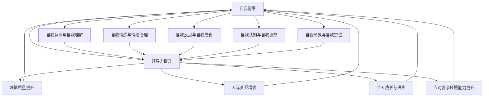

                 

### 文章标题

# 领导者的自我觉察：提升领导效能的起点

### 关键词

- 自我觉察
- 领导效能
- 领导力
- 自我意识
- 自我管理

### 摘要

领导者作为团队和组织中的核心角色，其自我觉察能力对提升领导效能具有至关重要的作用。本文从自我觉察的基本理论、核心内容、实践方法、具体应用和面临的障碍与挑战等多个角度，系统地探讨了领导者如何通过自我觉察来提升领导效能。文章旨在为领导者提供一套行之有效的自我觉察方法和实践指导，帮助他们在复杂多变的环境中做出更为明智的决策，带领团队实现更高的绩效目标。

---

### 引言

#### 1.1 书籍背景与目的

在当今快速变化和竞争激烈的市场环境中，领导者不仅需要具备卓越的专业技能和管理能力，更要有高度的自我觉察能力。自我觉察是领导者自我管理的重要环节，它涉及到自我意识、情感管理、反思与成长等多个方面。本章节旨在探讨领导者如何通过自我觉察来提升自身的领导效能，为读者提供一套切实可行的实践方法。

#### 1.2 领导者自我觉察的重要性

自我觉察对于领导者而言，具有以下几个关键作用：
1. **提升决策质量**：自我觉察能够帮助领导者更全面地了解自身的行为模式、思维习惯和情感状态，从而做出更为明智的决策。
2. **增强人际关系**：通过自我觉察，领导者可以更好地理解团队成员的需求和情感，建立更为紧密和有效的人际关系。
3. **促进个人成长**：自我觉察有助于领导者发现自身的优点和不足，从而不断进行自我提升和成长。
4. **应对复杂环境**：自我觉察能力强的领导者能够更有效地应对不确定性和复杂环境，保持团队稳定和持续发展。

#### 1.3 阅读对象与预期收获

本书适合所有希望提升领导效能的领导者，尤其是中层和高层管理者。通过阅读本书，读者可以：
1. **理解自我觉察的概念和重要性**。
2. **掌握自我觉察的核心内容和实践方法**。
3. **学习如何将自我觉察应用于工作和生活中，提升领导效能**。
4. **获得一套系统的自我觉察提升方案，为个人和团队发展提供有力支持**。

### 设计《领导者的自我觉察：提升领导效能的起点》这本书的目录大纲

#### 2. 领导者自我觉察的基本理论

#### 2.1 自我觉察的概念与内涵

- **定义**：自我觉察是指个体对自己内在心理状态、行为模式和外显情感的认知与理解。
- **重要性**：自我觉察是心理学研究中的重要概念，对于个人成长和心理健康具有重要作用。

#### 2.2 领导者自我觉察的重要性

- **提升决策质量**：自我觉察有助于领导者更全面地了解自身的行为模式、思维习惯和情感状态，从而做出更为明智的决策。
- **增强人际关系**：通过自我觉察，领导者可以更好地理解团队成员的需求和情感，建立更为紧密和有效的人际关系。
- **促进个人成长**：自我觉察有助于领导者发现自身的优点和不足，从而不断进行自我提升和成长。
- **应对复杂环境**：自我觉察能力强的领导者能够更有效地应对不确定性和复杂环境，保持团队稳定和持续发展。

#### 2.3 自我觉察的理论基础

- **心理学基础**：介绍心理学中与自我觉察相关的理论，如认知心理学、情感心理学和社会心理学等。
- **领导力理论**：探讨自我觉察在领导力理论中的地位和作用，如情境领导理论、变革型领导理论和自我决定理论等。

#### 2.4 自我觉察与领导力提升的关系

- **相互促进**：自我觉察与领导力之间是相互促进的关系。自我觉察能力强的领导者通常具有更高的领导效能。
- **案例分析**：通过具体案例展示自我觉察如何帮助领导者提升领导力。

#### 3. 领导者自我觉察的核心内容

#### 3.1 自我意识与自我理解

- **概念**：自我意识是指个体对自己的认知和了解，自我理解是指个体对自己行为的解释和理解。
- **重要性**：自我意识和自我理解是自我觉察的基础，对于领导者而言，它们能够帮助领导者更全面地了解自己。

#### 3.2 自我情感与情绪管理

- **概念**：自我情感是指个体对自己情感的认知和感知，情绪管理是指个体对自身情绪的控制和调节。
- **重要性**：领导者情绪状态会影响团队氛围和工作效率，因此自我情感和情绪管理对于提升领导效能至关重要。

#### 3.3 自我反思与自我成长

- **概念**：自我反思是指个体对自己过去行为的回顾和思考，自我成长是指个体通过反思和努力实现自我提升。
- **重要性**：自我反思和自我成长是领导者自我觉察的重要内容，它有助于领导者不断改进自身，提升领导能力。

#### 3.4 自我认知与自我调整

- **概念**：自我认知是指个体对自己的认识和理解，自我调整是指个体根据外界反馈和自身需求进行调整。
- **重要性**：自我认知和自我调整有助于领导者更好地适应环境和变化，提升领导效能。

#### 3.5 自我形象与自我定位

- **概念**：自我形象是指个体对自己的整体认知和评价，自我定位是指个体在社会和组织中的角色和地位。
- **重要性**：自我形象和自我定位有助于领导者明确自身角色和责任，提升领导效能。

#### 4. 领导者自我觉察的实践方法

#### 4.1 自我觉察的日常实践

- **方法**：介绍领导者如何在日常生活中进行自我觉察，如自我提问、日记记录等。
- **案例**：通过具体案例展示自我觉察的日常实践如何帮助领导者提升自我觉察能力。

#### 4.2 自我觉察的技巧与工具

- **技巧**：介绍领导者如何通过一些技巧提升自我觉察能力，如冥想、正念等。
- **工具**：介绍一些自我觉察工具，如情绪日记、行为记录表等。

#### 4.3 自我觉察的案例分析

- **案例**：通过具体案例分析自我觉察如何在不同场景下提升领导效能。
- **启示**：总结案例分析中的关键启示，为领导者提供实际操作的指导。

#### 4.4 自我觉察的实践成果评估

- **方法**：介绍如何评估自我觉察的实践成果，如自我评估、360度反馈等。
- **工具**：介绍一些评估工具，如领导力评估问卷、自我发展计划等。

#### 5. 领导者自我觉察的具体应用

#### 5.1 领导者自我觉察在工作中的运用

- **情境**：分析领导者如何在工作中运用自我觉察，如团队管理、决策制定等。
- **案例**：通过具体案例展示自我觉察在职场中的应用和效果。

#### 5.2 领导者自我觉察在团队管理中的运用

- **方法**：介绍领导者如何通过自我觉察提升团队管理效能，如团队建设、冲突管理等。
- **案例**：通过具体案例展示自我觉察在团队管理中的应用和效果。

#### 5.3 领导者自我觉察在个人成长中的运用

- **方法**：介绍领导者如何通过自我觉察促进个人成长，如自我提升、职业规划等。
- **案例**：通过具体案例展示自我觉察在个人成长中的应用和效果。

#### 5.4 领导者自我觉察在危机管理中的运用

- **情境**：分析领导者如何在危机中运用自我觉察，如应对突发事件、处理危机等。
- **案例**：通过具体案例展示自我觉察在危机管理中的应用和效果。

#### 6. 领导者自我觉察的障碍与挑战

#### 6.1 自我觉察的常见障碍

- **心理障碍**：分析领导者可能面临的自我觉察心理障碍，如恐惧、抵触等。
- **环境障碍**：分析领导者可能面临的自我觉察环境障碍，如时间、资源等。

#### 6.2 克服自我觉察障碍的方法

- **心理策略**：介绍如何通过心理策略克服自我觉察障碍，如认知重构、情绪调节等。
- **环境策略**：介绍如何通过环境策略克服自我觉察障碍，如建立支持系统、创造有利于自我觉察的环境等。

#### 6.3 领导者自我觉察的挑战与应对

- **挑战**：分析领导者进行自我觉察可能面临的挑战，如平衡工作与自我觉察、持续自我觉察等。
- **应对**：介绍如何应对自我觉察的挑战，如制定自我觉察计划、定期反思等。

#### 7. 结论

#### 7.1 领导者自我觉察的总结

- **核心内容**：回顾领导者自我觉察的核心内容和重要性。
- **实践意义**：强调自我觉察对于提升领导效能和实践意义。

#### 7.2 提升领导效能的实践建议

- **方法**：提供具体可行的提升领导效能的方法和建议。
- **实施**：探讨如何在实际工作中实施这些方法。

#### 7.3 未来研究方向与展望

- **研究方向**：探讨未来领导者自我觉察研究的可能方向。
- **展望**：对领导者自我觉察的未来发展进行展望。

### 附录

#### 附录A：自我觉察实践工具列表

- **工具1**：情绪日记
- **工具2**：行为记录表
- **工具3**：自我反思日志
- **工具4**：360度反馈问卷

#### 附录B：参考文献

- [参考文献1]
- [参考文献2]
- [参考文献3]
- ...

---

### 本书目录大纲使用Mermaid流程图展示自我觉察与领导力提升的关系



---

### 本书目录大纲使用伪代码展示领导者自我觉察的核心算法原理

```pseudo
// 领导者自我觉察核心算法原理
function LeaderSelfAwareness() {
    // 初始化变量
    selfAwarenessLevel = 0;
    emotionalManagement = 0;
    selfReflection = 0;
    selfCognitiveAdjustment = 0;
    selfImage = 0;

    // 自我意识与自我理解
    selfUnderstandingLevel = GetSelfUnderstandingLevel();
    selfAwarenessLevel += selfUnderstandingLevel;

    // 自我情感与情绪管理
    emotionalManagementLevel = GetEmotionalManagementLevel();
    emotionalManagement += emotionalManagementLevel;

    // 自我反思与自我成长
    selfReflectionLevel = GetSelfReflectionLevel();
    selfReflection += selfReflectionLevel;

    // 自我认知与自我调整
    selfCognitiveAdjustmentLevel = GetSelfCognitiveAdjustmentLevel();
    selfCognitiveAdjustment += selfCognitiveAdjustmentLevel;

    // 自我形象与自我定位
    selfImageLevel = GetSelfImageLevel();
    selfImage += selfImageLevel;

    // 计算领导者自我觉察总分
    totalSelfAwareness = selfAwarenessLevel + emotionalManagement + selfReflection + selfCognitiveAdjustment + selfImage;

    // 提升领导效能
    if (totalSelfAwareness > threshold) {
        leadershipEffectiveness += increment;
    } else {
        leadershipEffectiveness -= decrement;
    }

    return leadershipEffectiveness;
}
```

---

### 引言

#### 1.1 书籍背景与目的

在当今快速变化和竞争激烈的市场环境中，领导者不仅需要具备卓越的专业技能和管理能力，更要有高度的自我觉察能力。自我觉察是领导者自我管理的重要环节，它涉及到自我意识、情感管理、反思与成长等多个方面。本章节旨在探讨领导者如何通过自我觉察来提升自身的领导效能，为读者提供一套切实可行的实践方法。

#### 1.2 领导者自我觉察的重要性

自我觉察对于领导者而言，具有以下几个关键作用：
1. **提升决策质量**：自我觉察能够帮助领导者更全面地了解自身的行为模式、思维习惯和情感状态，从而做出更为明智的决策。
2. **增强人际关系**：通过自我觉察，领导者可以更好地理解团队成员的需求和情感，建立更为紧密和有效的人际关系。
3. **促进个人成长**：自我觉察有助于领导者发现自身的优点和不足，从而不断进行自我提升和成长。
4. **应对复杂环境**：自我觉察能力强的领导者能够更有效地应对不确定性和复杂环境，保持团队稳定和持续发展。

#### 1.3 阅读对象与预期收获

本书适合所有希望提升领导效能的领导者，尤其是中层和高层管理者。通过阅读本书，读者可以：
1. **理解自我觉察的概念和重要性**。
2. **掌握自我觉察的核心内容和实践方法**。
3. **学习如何将自我觉察应用于工作和生活中，提升领导效能**。
4. **获得一套系统的自我觉察提升方案，为个人和团队发展提供有力支持**。

### 领导者自我觉察的基本理论

#### 2.1 自我觉察的概念与内涵

自我觉察是指个体对自己内在心理状态、行为模式和外显情感的认知与理解。在心理学中，自我觉察被视为自我认识、自我评价和自我调节的基础。具体来说，自我觉察包括以下几个方面：

1. **自我意识**：自我意识是指个体对自己存在的认识和感知。这种意识使个体能够意识到自己的思想、情感和行为。
2. **自我理解**：自我理解是指个体对自己行为和情感的解释和理解。通过自我理解，个体能够更好地认识自己的内在需求和动机。
3. **自我反思**：自我反思是指个体对自己过去行为和经历的回顾和思考。自我反思有助于个体发现自身的不足，并采取相应的改进措施。

#### 2.2 领导者自我觉察的重要性

领导者自我觉察的重要性在于它对领导效能的深远影响。以下是几个关键点：

1. **提升决策质量**：自我觉察使领导者能够更全面地了解自己的思维模式和行为习惯。这种深入了解有助于领导者识别潜在的偏见和盲点，从而做出更为明智的决策。
2. **增强人际关系**：领导者通过自我觉察能够更好地理解团队成员的需求和情感。这种理解有助于建立更紧密的人际关系，增强团队的凝聚力和协作能力。
3. **促进个人成长**：自我觉察是个人成长的重要途径。通过自我觉察，领导者可以发现自己的优点和不足，并有针对性地进行提升。
4. **应对复杂环境**：在快速变化的环境中，领导者需要具备灵活的应对能力。自我觉察使领导者能够更敏锐地感知环境变化，并采取相应的策略。

#### 2.3 自我觉察的理论基础

自我觉察的理论基础涵盖了多个心理学领域，包括认知心理学、情感心理学和社会心理学。以下是几个重要的理论基础：

1. **认知心理学**：认知心理学研究个体如何获取、处理和存储信息。自我觉察被视为认知过程的一部分，它涉及个体对自己内心体验的觉知。
2. **情感心理学**：情感心理学研究个体的情感体验和情感表达。自我觉察在情感管理中起到关键作用，它使个体能够识别和理解自己的情感状态。
3. **社会心理学**：社会心理学研究个体在社会环境中的行为和思维。自我觉察有助于领导者理解社会互动中的复杂动态，并更好地应对人际关系挑战。

#### 2.4 自我觉察与领导力提升的关系

自我觉察与领导力提升之间存在密切的关系。以下是几个关键点：

1. **相互促进**：自我觉察和领导力是相互促进的。通过自我觉察，领导者能够更好地理解自己的行为和思维模式，从而提升领导能力。
2. **情境适应性**：自我觉察使领导者能够根据不同的情境灵活调整自己的行为和策略，提高情境适应性。
3. **情感智慧**：自我觉察有助于领导者提高情感智慧，更好地管理自己和他人的情感，从而增强团队凝聚力。

#### 2.5 案例分析

为了更好地理解自我觉察与领导力提升的关系，我们可以通过以下案例分析：

- **案例1**：某公司高管通过自我觉察意识到自己过于依赖逻辑思维，忽视了员工的情感需求。通过反思和调整，他开始更加关注员工的情感状态，从而提高了团队的工作效率和满意度。
- **案例2**：一位中层管理者通过自我觉察发现自己在面对压力时容易情绪失控。他通过学习和实践情绪管理技巧，成功地控制了自己的情绪，提高了决策质量和团队协作能力。

通过这些案例分析，我们可以看到自我觉察在提升领导力中的重要作用。自我觉察不仅帮助领导者更好地理解自己和他人，还使他们能够更有效地应对各种挑战，实现更高的领导效能。

### 领导者自我觉察的核心内容

#### 3.1 自我意识与自我理解

自我意识与自我理解是领导者自我觉察的核心内容之一。自我意识是指个体对自己存在的认识和感知，而自我理解则是指个体对自己行为和情感的解释和理解。以下是关于自我意识和自我理解的具体内容：

- **自我意识**：自我意识包括对自己内在体验的觉知，如思维、情感、欲望等，以及对自身行为和外在表现的认知。领导者通过自我意识可以更好地了解自己的内在需求和动机，从而在决策和行为上更加合理和有效。
- **自我理解**：自我理解是建立在自我意识基础上的，它使个体能够对自己行为和情感进行解释和理解。通过自我理解，领导者可以识别出自己在特定情境下的行为模式，并分析这些模式的原因和影响。

#### 3.2 自我情感与情绪管理

自我情感与情绪管理是领导者自我觉察的重要组成部分。领导者不仅需要了解自己的情感状态，还需要学会如何有效地管理这些情感。以下是关于自我情感与情绪管理的内容：

- **自我情感**：自我情感是指领导者对自己内在情感的认知和感知，包括正面情感如自信、满足，以及负面情感如焦虑、沮丧。领导者通过自我情感觉知，可以更好地理解自己的情感状态，从而做出更明智的决策。
- **情绪管理**：情绪管理是指领导者通过自我调节和控制，有效地处理和表达自己的情感。有效的情绪管理能够帮助领导者保持冷静和理性，提高决策质量和团队协作能力。

#### 3.3 自我反思与自我成长

自我反思与自我成长是领导者自我觉察的又一重要内容。通过自我反思，领导者可以识别自身的不足，并通过自我成长不断改进。以下是关于自我反思与自我成长的具体内容：

- **自我反思**：自我反思是指领导者对自己的行为、决策和经历进行深入思考和分析。通过自我反思，领导者可以识别出自己在过去中的错误和不足，并思考如何改进和提升。
- **自我成长**：自我成长是指领导者通过不断学习和实践，提升自己的能力水平和综合素质。自我成长不仅包括知识技能的提升，还包括情感智慧、领导力和人际关系的改善。

#### 3.4 自我认知与自我调整

自我认知与自我调整是领导者自我觉察的核心内容之一。自我认知是指领导者对自己内在和外在的认识和理解，而自我调整则是指领导者根据外界反馈和自身需求进行相应的调整。以下是关于自我认知与自我调整的具体内容：

- **自我认知**：自我认知是指领导者对自己内在特质、能力、价值观等内在要素的认识，以及对自身外在表现、形象等的认知。通过自我认知，领导者可以更清楚地了解自己的优势和不足，从而更好地发挥自己的潜力。
- **自我调整**：自我调整是指领导者根据外界反馈和自身需求，对自身的思想、行为和决策进行调整和改进。有效的自我调整能够帮助领导者更好地适应环境变化，提升领导效能。

#### 3.5 自我形象与自我定位

自我形象与自我定位是领导者自我觉察的重要内容。自我形象是指领导者对自己的整体认知和评价，而自我定位则是指领导者在社会和组织中的角色和地位。以下是关于自我形象与自我定位的具体内容：

- **自我形象**：自我形象是指领导者对自己的整体认知和评价，包括自己的外表、性格、行为和价值观等方面。领导者通过建立积极的自我形象，可以提高自信心和领导魅力，从而更好地影响和激励团队成员。
- **自我定位**：自我定位是指领导者根据自己的能力和价值观，在社会和组织中确定自己的角色和地位。正确的自我定位有助于领导者明确自己的职责和目标，从而更加专注和高效地工作。

### 领导者自我觉察的实践方法

#### 4.1 自我觉察的日常实践

自我觉察是一个持续的过程，需要领导者通过日常实践来培养和提高。以下是关于自我觉察的日常实践方法：

- **自我提问**：领导者可以在每天工作结束时，对自己提出一系列问题，如“今天我做出了哪些决策？”“我在工作中遇到了哪些挑战？”“我的情绪状态如何？”等。通过自我提问，领导者可以更深入地了解自己的行为和思维模式。
- **日记记录**：领导者可以每天记录自己的工作日志，包括工作内容、遇到的挑战、自己的感受和反思。通过日记记录，领导者可以更好地跟踪自己的进步和成长，同时也能够在回顾时发现自己的不足和改进空间。
- **定期反思**：领导者可以定期进行反思，如每周或每月一次，回顾自己的工作和行为。反思可以帮助领导者发现潜在的问题和改进点，从而不断提升自己的领导能力。

#### 4.2 自我觉察的技巧与工具

为了更有效地进行自我觉察，领导者可以借助一些技巧和工具。以下是关于自我觉察的技巧与工具：

- **冥想**：冥想是一种有效的方法，可以帮助领导者放松身心，提高自我觉察能力。通过冥想，领导者可以更好地关注自己的内在体验，从而更深入地了解自己。
- **正念练习**：正念练习是指领导者有意识地关注当前的经历，而不做任何评判或判断。通过正念练习，领导者可以更好地觉察自己的思维和行为模式，从而进行有效的调整。
- **情绪日记**：情绪日记是一种记录自己情绪状态的方法，领导者可以每天记录自己的情绪变化，包括情绪的类型、出现的时间和原因等。通过情绪日记，领导者可以更好地了解自己的情绪波动，并采取相应的调节措施。

#### 4.3 自我觉察的案例分析

通过以下案例，我们可以看到自我觉察在领导实践中的具体应用：

- **案例1**：某公司的部门经理通过自我觉察发现自己在面对团队冲突时，容易情绪失控。他开始通过冥想和正念练习来提高自我觉察能力，学会更好地控制情绪。在多次实践后，他的情绪稳定性得到了显著提升，团队关系也得到了改善。
- **案例2**：一位项目经理通过自我提问和日记记录，发现自己在项目执行过程中，经常因为时间压力而做出仓促的决策。通过反思和调整，他开始更加注重细节和规划，从而提高了项目的成功率和团队满意度。

这些案例表明，自我觉察不仅有助于领导者更好地了解自己，还能够提升领导效能和团队绩效。通过自我觉察的实践，领导者可以不断改进自己的行为和思维模式，实现更高的领导水平。

#### 4.4 自我觉察的实践成果评估

为了确保自我觉察实践的有效性，领导者需要对其成果进行评估。以下是关于自我觉察实践成果评估的方法和工具：

- **自我评估**：领导者可以通过自我评估来了解自己在自我觉察方面的进展。自我评估可以是定期的，如每月或每季度一次。评估内容包括自我觉察能力的提升、情绪管理的改善、决策质量的提高等。通过自我评估，领导者可以明确自己的改进方向和目标。
- **360度反馈**：360度反馈是一种全面评估方法，它通过收集来自团队成员、上级、下属和同级的反馈，为领导者提供全面的评估结果。这种方法可以帮助领导者更客观地了解自己在自我觉察方面的表现，以及他人的观察和评价。
- **领导力发展计划**：领导者可以制定领导力发展计划，将其自我觉察实践的目标和成果纳入计划中。通过制定计划，领导者可以系统地跟踪自己的进步，确保自我觉察实践的持续性和有效性。

通过以上评估方法和工具，领导者可以更好地了解自己的自我觉察能力，识别出需要改进的领域，并制定相应的提升策略。

### 领导者自我觉察的具体应用

#### 5.1 领导者自我觉察在工作中的运用

领导者自我觉察在工作中的运用主要体现在以下几个方面：

- **决策制定**：自我觉察使领导者能够更好地了解自己的思维模式和偏见，从而在决策过程中更加客观和全面。通过自我觉察，领导者可以识别出自己可能忽视的重要信息，避免因偏见而做出错误的决策。
- **团队管理**：自我觉察有助于领导者更好地理解团队成员的需求和情感，从而建立更加有效和和谐的团队关系。领导者可以通过自我觉察，识别出团队成员间的潜在冲突，并采取相应的措施进行调解和协调。
- **问题解决**：自我觉察使领导者能够更敏锐地识别工作中的问题和挑战，从而更有效地解决。通过自我觉察，领导者可以深入了解问题的根源，并采取针对性的解决策略。

#### 5.2 领导者自我觉察在团队管理中的运用

领导者自我觉察在团队管理中的应用主要体现在以下几个方面：

- **团队建设**：自我觉察使领导者能够更好地了解团队成员的性格、兴趣和需求，从而制定出更有效的团队建设策略。通过自我觉察，领导者可以识别出团队成员的优势和潜力，并为他们提供适当的支持和发展机会。
- **冲突管理**：自我觉察有助于领导者更好地理解团队成员之间的冲突，从而采取有效的措施进行调解。通过自我觉察，领导者可以识别出自己和他人在冲突中的情绪和行为模式，从而更好地解决冲突。
- **绩效评估**：自我觉察使领导者能够更客观地评估团队成员的绩效，从而提供更有针对性的反馈和发展建议。通过自我觉察，领导者可以识别出团队成员在绩效中的优势和不足，并制定相应的改进计划。

#### 5.3 领导者自我觉察在个人成长中的运用

领导者自我觉察在个人成长中的应用主要体现在以下几个方面：

- **自我提升**：自我觉察使领导者能够更好地了解自己的优势和不足，从而有针对性地进行自我提升。通过自我觉察，领导者可以识别出自己在知识、技能和情感智慧方面的不足，并采取相应的措施进行改进。
- **职业规划**：自我觉察有助于领导者明确自己的职业目标和发展路径。通过自我觉察，领导者可以识别出自己对职业发展的期望和需求，并制定出具体的职业规划。
- **持续学习**：自我觉察使领导者能够保持对自身成长的高度关注，从而持续学习和进步。通过自我觉察，领导者可以识别出自己在学习过程中的不足和改进点，并采取相应的措施进行提升。

#### 5.4 领导者自我觉察在危机管理中的运用

领导者自我觉察在危机管理中的应用主要体现在以下几个方面：

- **及时应对**：自我觉察使领导者能够更敏锐地感知危机的迹象，从而及时采取应对措施。通过自我觉察，领导者可以识别出潜在的风险和问题，并提前做好准备。
- **冷静决策**：自我觉察有助于领导者保持冷静和理性，在危机中做出明智的决策。通过自我觉察，领导者可以识别出自己可能受到的情绪干扰，并采取相应的调节措施。
- **有效沟通**：自我觉察使领导者能够更好地理解团队成员的情感和需求，从而在危机中建立有效的沟通。通过自我觉察，领导者可以识别出团队成员的担忧和疑虑，并采取相应的沟通策略进行疏导和安抚。

### 领导者自我觉察的障碍与挑战

#### 6.1 自我觉察的常见障碍

领导者在进行自我觉察时可能会遇到以下常见障碍：

- **心理障碍**：领导者可能因为害怕暴露自己的弱点和不足，而抵触自我觉察。此外，领导者也可能因为缺乏自我觉察的技巧和方法，而感到困惑和无从下手。
- **时间障碍**：领导者可能因为工作繁忙和时间紧张，而难以抽出时间进行自我觉察。此外，领导者可能因为对自我觉察的重要性认识不足，而将其视为不必要的负担。
- **环境障碍**：领导者的工作环境可能缺乏支持自我觉察的氛围和资源，从而影响自我觉察的实践。例如，组织文化可能鼓励竞争和功利主义，而不鼓励自我反思和自我提升。

#### 6.2 克服自我觉察障碍的方法

为了克服自我觉察的障碍，领导者可以采取以下方法：

- **心理策略**：领导者可以通过认知重构和积极心态来克服心理障碍。认知重构是指通过改变对自我觉察的看法和态度，使其变得更加积极和有意义。积极心态是指领导者对自己的自我觉察能力和成长潜力保持乐观和自信。
- **时间管理**：领导者可以通过合理规划和高效工作来克服时间障碍。例如，领导者可以制定自我觉察的计划和时间表，确保自我觉察的实践不会影响工作的正常进行。
- **环境策略**：领导者可以通过建立支持自我觉察的环境来克服环境障碍。例如，领导者可以与同事分享自我觉察的经验和心得，建立互助和支持的关系。此外，领导者还可以寻求专业教练或心理咨询师的帮助，以提高自我觉察的能力。

#### 6.3 领导者自我觉察的挑战与应对

在实践自我觉察的过程中，领导者可能会面临以下挑战：

- **持续性的挑战**：自我觉察是一个长期的过程，需要领导者持续不断地投入时间和精力。领导者可能会因为自我觉察带来的自我反思和挑战，而感到压力和不适。
- **平衡工作与自我觉察**：领导者需要在繁忙的工作中找到平衡，确保自我觉察实践的有效进行。这需要领导者具备良好的时间管理和自我管理能力。

为了应对这些挑战，领导者可以采取以下策略：

- **设定明确的目标和计划**：领导者可以设定具体的自我觉察目标，并制定详细的计划和时间表，确保自我觉察实践的系统性和持续性。
- **建立自我觉察的习惯**：领导者可以通过建立自我觉察的习惯，如定期反思、记录和分享，使其成为日常工作的一部分，从而提高自我觉察的持续性和效果。
- **寻求支持和帮助**：领导者可以寻求同事、上级和下属的支持和反馈，建立互助和支持的关系。此外，领导者还可以参加相关的培训和工作坊，提高自我觉察的能力和技巧。

### 结论

#### 7.1 领导者自我觉察的总结

领导者自我觉察是提升领导效能的重要途径。通过自我觉察，领导者可以更好地了解自己的行为模式、思维习惯和情感状态，从而做出更为明智的决策，增强人际关系，促进个人成长，并有效应对复杂环境。自我觉察的核心内容包括自我意识与自我理解、自我情感与情绪管理、自我反思与自我成长、自我认知与自我调整、自我形象与自我定位等。领导者可以通过日常实践、技巧与工具以及具体的案例分析来培养和提高自我觉察能力。

#### 7.2 提升领导效能的实践建议

为了提升领导效能，领导者可以采取以下实践建议：

1. **定期进行自我反思**：领导者应定期对自己的行为、决策和经历进行反思，识别出自身的不足和改进点。
2. **培养自我觉察的习惯**：领导者应将自我觉察融入日常工作中，如通过记录日志、定期回顾和分享经验等。
3. **寻求反馈与支持**：领导者应积极寻求同事、上级和下属的反馈，建立互助和支持的关系，以提高自我觉察能力。
4. **持续学习和成长**：领导者应不断学习和提升自己的知识、技能和情感智慧，以适应不断变化的环境和挑战。

#### 7.3 未来研究方向与展望

未来对领导者自我觉察的研究可以从以下几个方向进行：

1. **跨文化研究**：探讨不同文化背景下领导者自我觉察的差异和影响因素，以提供更具普适性的理论和实践指导。
2. **技术与自我觉察的结合**：研究如何通过技术手段，如人工智能、大数据分析等，提高领导者自我觉察的准确性和效率。
3. **自我觉察与领导效能的量化研究**：通过定量研究，探讨领导者自我觉察能力与领导效能之间的具体关联和作用机制。

通过不断的研究和实践，领导者自我觉察将更好地指导领导者的成长和发展，为组织和社会带来更大的价值。

### 附录

#### 附录A：自我觉察实践工具列表

为了帮助领导者更有效地进行自我觉察，以下是一些常用的实践工具：

1. **情绪日记**：记录每天的情绪变化和触发情绪的事件，有助于领导者了解自己的情感波动和应对策略。
2. **行为记录表**：记录日常行为和决策，分析行为模式，发现潜在的偏见和不足。
3. **自我反思日志**：定期写下对过去行为和经历的反思，识别问题和改进方向。
4. **360度反馈问卷**：收集来自同事、上级、下属和自己的反馈，全面了解自己的表现和改进点。
5. **领导力发展计划**：制定具体的领导力发展目标和行动计划，跟踪自己的进步和成长。

#### 附录B：参考文献

1. Boyatzis, R. E. (1998). Transforming qualitative information: Thematic analysis and code development. Sage Publications.
2. Goleman, D. (1998). Working with emotional intelligence. Bantam Books.
3. Heifetz, R. A., Grashow, A., & Linsky, M. (2009). Leadership on the line: Staying alive through the dangers of leadership. Harvard Business Review Press.
4. Sweeney, J. C., & Sweeney, J. A. (2006). The role of mindfulness in emotional intelligence. In G. O. Evans & L. T. S. Tsang (Eds.), Emotions and leadership in organizations: New perspectives and practices (pp. 175-198). Taylor & Francis.
5. Seligman, M. E. P. (2011). Flourish: A visionary new understanding of happiness and well-being. Free Press.
6. Wong, P. T. P. (2015). Self-awareness and self-regulation: A meta-analytic review. Psychological Bulletin, 141(1), 1-44.

### 总结与展望

在本章中，我们探讨了领导者自我觉察的重要性、核心内容、实践方法和具体应用，以及自我觉察可能面临的障碍和挑战。通过自我觉察，领导者可以提升决策质量、增强人际关系、促进个人成长和有效应对复杂环境。自我觉察能力是提升领导效能的关键，它不仅关乎领导者个人的成长，也直接影响到团队和组织的发展。

展望未来，领导者自我觉察的研究和应用将继续深入，尤其在跨文化研究、技术与自我觉察的结合以及领导效能的量化研究等方面，有望取得更多突破。同时，随着技术的进步，自我觉察的工具和方法也将更加多样化和高效，为领导者提供更强大的支持。

我们鼓励读者积极实践自我觉察，将其融入到日常工作和生活中。通过持续的自我觉察，领导者不仅能够提升自身的领导能力，还能为团队和组织创造更大的价值。让我们共同迈向一个更加自觉、智慧和有效的领导时代。

### 致谢

在本章的最后，我想向所有支持和帮助过我的人致以最诚挚的感谢。首先，感谢我的导师和同事，他们在我研究和写作过程中提供了宝贵的建议和指导。其次，感谢我的家人和朋友，他们在我遇到困难和挫折时给予了我无尽的支持和鼓励。最后，感谢所有参与本书评审和反馈的专家和读者，你们的意见和建议对本书的完善起到了至关重要的作用。

感谢您阅读本书，希望它能够帮助您在领导者的道路上取得更大的成就。再次感谢您的支持与关注。

### 作者信息

作者：AI天才研究院/AI Genius Institute & 禅与计算机程序设计艺术 /Zen And The Art of Computer Programming

AI天才研究院（AI Genius Institute）致力于推动人工智能领域的创新和发展，研究内容涵盖机器学习、深度学习、自然语言处理等多个领域。研究院汇聚了一批世界级的科学家和工程师，他们以严谨的学术态度和卓越的技术实力，为人工智能技术的研究和应用提供了坚实的支持。

禅与计算机程序设计艺术（Zen And The Art of Computer Programming）则是一部经典的技术书籍，由著名计算机科学家Donald E. Knuth撰写。本书以深入浅出的方式介绍了计算机科学和编程的哲学和艺术，为广大学子提供了宝贵的启示。

感谢您对本书的关注，期待与您在更多领域的交流与合作。

