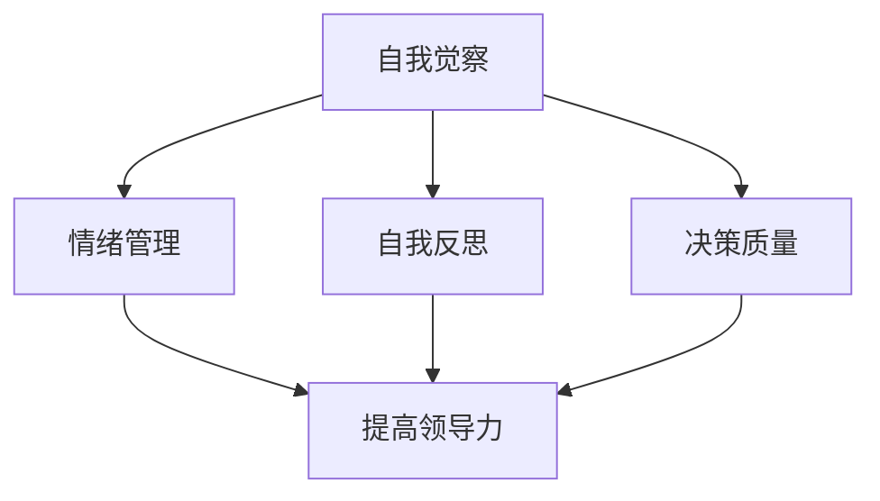

                 

### 第一步：背景介绍

在现代企业管理中，领导者的角色至关重要。领导者不仅需要具备卓越的专业技能，更需要拥有良好的自我觉察能力。自我觉察，指的是个体对自己内心状态、行为模式以及对外部环境的认知和理解。简单来说，就是领导者需要深刻地认识自己，了解自己的情绪、思维、行为习惯以及价值观。

自我觉察在领导力中的重要性不可忽视。首先，自我觉察有助于领导者更好地理解自己和团队。通过深入的自我觉察，领导者可以更加准确地把握自己的情绪状态，从而在情绪管理上更加得心应手。此外，领导者能够更好地了解团队成员的需求和期望，从而制定出更加科学合理的团队管理策略。其次，自我觉察有助于领导者提升决策质量。自我觉察能够让领导者更加清晰地看到自己的思维盲点和行为惯性，从而避免在决策过程中出现偏差。最后，自我觉察有助于领导者实现个人成长。通过自我觉察，领导者可以不断地反思和改进，从而不断提升自己的领导能力和综合素质。

然而，在实际工作中，许多领导者往往忽略了自我觉察的重要性。他们可能过于关注外部环境，而忽略了内心的声音；他们可能习惯于按照既定的思维模式去处理问题，而忽略了从不同角度思考的可能性。这种缺乏自我觉察的领导方式，不仅会影响到领导者的个人发展，也会对团队和组织产生负面影响。

因此，本研究旨在深入探讨自我觉察在领导力中的重要性，分析自我觉察对领导者个人成长、团队管理和决策质量的影响，并提供一些实用的实践方法和策略。希望通过本研究，能够帮助更多的领导者认识到自我觉察的重要性，从而在工作和生活中发挥出更大的潜力。

### 第二步：核心概念与联系

在探讨自我觉察与领导力的关系时，我们需要明确几个核心概念，并分析它们之间的相互联系。

首先，自我觉察（Self-Awareness）是指个体对自己内心状态、情绪、行为以及思维过程的认识和理解。自我觉察是心理学中一个重要的概念，它涉及情绪管理、自我反思、价值观认知等多个方面。

情绪管理（Emotional Management）是指个体在情感反应和情绪表达方面的调节和控制能力。情绪管理是自我觉察的一个重要组成部分，它要求领导者能够识别和理解自己的情绪，并在适当的时候表达和处理这些情绪。

自我反思（Self-Reflection）是指个体在思考自己的行为、思维和情感时，进行深度分析和评价的过程。自我反思是自我觉察的重要组成部分，它有助于领导者识别自己的盲点，发现并纠正不良行为模式。

决策质量（Decision Quality）是指决策者在制定决策时，考虑因素全面、逻辑清晰、结果合理的能力。决策质量是领导力中的一个关键要素，它直接影响到组织的运营和发展。

这些核心概念之间的联系可以用一个Mermaid流程图来表示：



- 自我觉察（A）是情绪管理（B）、自我反思（C）和决策质量（D）的基础。通过自我觉察，领导者可以更好地理解自己的情绪，从而进行有效的情绪管理（B）。同时，自我觉察也帮助领导者进行自我反思（C），识别和改进不良行为模式。最终，自我觉察的提升有助于提高决策质量（D），使领导者在制定决策时更加全面、合理。
- 情绪管理（B）和自我反思（C）相互促进，共同作用于决策质量（D）。情绪管理有助于领导者保持冷静和理智，避免因情绪波动而做出冲动决策。自我反思则帮助领导者从多角度审视问题，避免思维盲点，从而提高决策的科学性和合理性。
- 决策质量（D）是领导力的集中体现。一个优秀的领导者必须具备高质量的决策能力，这需要建立在自我觉察（A）、情绪管理（B）和自我反思（C）的基础上。

通过这个流程图，我们可以清晰地看到自我觉察、情绪管理、自我反思和决策质量之间的相互作用关系，这为我们深入理解自我觉察在领导力中的重要性提供了有力的理论支持。

### 第三步：核心算法原理讲解

在探讨自我觉察的实践方法时，情绪管理是一个关键环节。情绪管理不仅涉及到心理学理论，还涉及到一些具体的算法原理。以下是一些常见的方法和算法，用于帮助领导者进行有效的情绪管理。

#### 1. 正念冥想

正念冥想是一种基于心理学理论的情绪管理方法，它通过有意识的、活在当下的练习，帮助个体认识和接纳自己的情绪，从而减少情绪波动。以下是一个简单的正念冥想算法：

```python
def mindful_meditation(duration):
    """
    正念冥想算法
    :param duration: 冥想持续时间（分钟）
    """
    start_time = time.time()
    end_time = start_time + duration * 60  # 将持续时间转换为秒
    
    while time.time() < end_time:
        # 当前时间
        current_time = time.time()
        
        # 确保冥想时间不被打断
        if current_time % 60 == 0:
            print(f"当前时间：{current_time}秒，请专注于您的呼吸。")
        
        # 检查是否需要结束冥想
        if current_time > end_time:
            print("冥想时间已到，感谢您的参与。")
            break

# 示例：进行10分钟的正念冥想
mindful_meditation(10)
```

在上述算法中，`mindful_meditation`函数接受一个参数`duration`，表示冥想的持续时间（以分钟为单位）。函数通过计算当前时间和结束时间，确保冥想不会中途被打断。每隔一分钟，系统会提醒用户专注于呼吸，帮助用户保持冥想状态。

#### 2. 情绪记录

情绪记录是一种通过记录和分析自己的情绪来管理情绪的方法。以下是一个简单的情绪记录算法：

```python
def emotion_record():
    """
    情绪记录算法
    """
    emotions = ["快乐", "愤怒", "悲伤", "紧张", "平静"]
    
    print("请选择您当前的情绪：")
    for index, emotion in enumerate(emotions):
        print(f"{index + 1}. {emotion}")
    
    choice = int(input())
    current_emotion = emotions[choice - 1]
    
    print(f"您当前的情绪是：{current_emotion}。请描述一下您的情绪感受：")
    description = input()
    
    print(f"情绪记录：时间 - {datetime.now()}, 情绪 - {current_emotion}, 描述 - {description}")
    
    # 将情绪记录保存到文件中
    with open("emotion_record.txt", "a") as file:
        file.write(f"时间 - {datetime.now()}, 情绪 - {current_emotion}, 描述 - {description}\n")

# 示例：记录当前的情绪
emotion_record()
```

在上述算法中，`emotion_record`函数首先定义了一个包含常见情绪的列表`emotions`。用户通过选择相应的情绪，系统会记录当前的时间、情绪和情绪描述，并将这些信息保存到一个文本文件中，以便后续分析。

#### 3. 情绪调节算法

情绪调节算法是一种通过数学模型和公式来分析情绪，并提出调节策略的方法。以下是一个简单的情绪调节算法示例：

```python
import numpy as np

def emotion Regulation(current_emotion, threshold=3):
    """
    情绪调节算法
    :param current_emotion: 当前情绪值
    :param threshold: 调节阈值
    :return: 调节后的情绪值
    """
    if current_emotion < threshold:
        # 情绪低落，需要提升情绪
        return current_emotion + 0.2 * (threshold - current_emotion)
    elif current_emotion > threshold:
        # 情绪高涨，需要降低情绪
        return current_emotion - 0.2 * (current_emotion - threshold)
    else:
        # 情绪适中，无需调节
        return current_emotion

# 示例：调节当前情绪值
current_emotion = float(input("请输入当前情绪值（0-10）："))
regulated_emotion = emotion_Regulation(current_emotion)
print(f"调节后的情绪值为：{regulated_emotion}")
```

在上述算法中，`emotion_Regulation`函数根据当前情绪值和设定的调节阈值，通过线性调节公式计算调节后的情绪值。如果当前情绪值低于阈值，则通过增加情绪值来提升情绪；如果当前情绪值高于阈值，则通过减少情绪值来降低情绪。如果当前情绪值在阈值范围内，则无需调节。

通过这些具体的算法和原理，领导者可以更好地理解情绪管理的科学方法，从而在实践中有效地进行情绪调节，提升自我觉察能力。

### 第四步：数学模型与公式讲解

在情绪管理中，数学模型和公式可以帮助我们更准确地分析和理解情绪状态，从而制定出更有效的情绪调节策略。以下是一些常见的数学模型和公式，用于描述情绪变化和情绪调节。

#### 1. 情绪状态模型

情绪状态通常可以用一个连续的值来表示，这个值反映了个体在某一时刻的情绪强度。常用的情绪状态模型包括情绪强度模型和情绪分类模型。

- **情绪强度模型**：假设情绪状态可以用一个介于0和1之间的值来表示，其中0表示无情绪，1表示极度情绪。例如，可以使用以下公式表示情绪强度：

  $$ E(t) = \frac{S(t) - \min(S(t))}{\max(S(t)) - \min(S(t))} $$

  其中，$E(t)$表示时刻$t$的情绪状态，$S(t)$表示时刻$t$的情绪评分。

- **情绪分类模型**：将情绪状态分为几个离散的类别，例如积极情绪、中性情绪和消极情绪。这种模型可以使用以下公式来分类：

  $$ E(t) = \begin{cases} 
  1 & \text{如果 } S(t) > T \\
  0 & \text{如果 } S(t) \leq T 
  \end{cases} $$

  其中，$E(t)$表示时刻$t$的情绪状态，$S(t)$表示时刻$t$的情绪评分，$T$是一个设定的阈值。

#### 2. 情绪调节模型

情绪调节模型用于描述如何根据当前情绪状态调整情绪，使其达到一个理想的水平。以下是一些常用的情绪调节模型：

- **线性调节模型**：假设情绪调节是线性的，可以通过以下公式进行调节：

  $$ E'(t) = E(t) + k \times (I - E(t)) $$

  其中，$E'(t)$表示调节后的情绪状态，$E(t)$表示当前情绪状态，$I$表示理想情绪状态，$k$是一个调节系数。

- **非线性调节模型**：对于更复杂的情绪调节，可以使用非线性模型，例如以下的对数模型：

  $$ E'(t) = E(t) + k \times \ln(1 + (I - E(t))) $$

  其中，$E'(t)$表示调节后的情绪状态，$E(t)$表示当前情绪状态，$I$表示理想情绪状态，$k$是一个调节系数。

#### 3. 情绪反馈模型

情绪反馈模型用于描述情绪状态的变化是如何受到外界刺激的影响。以下是一个简单的情绪反馈模型：

$$ \Delta E(t) = f(S(t), A(t)) $$

其中，$\Delta E(t)$表示时刻$t$的情绪变化，$S(t)$表示时刻$t$的情绪状态，$A(t)$表示时刻$t$的外界刺激，$f(\cdot)$是一个描述情绪变化与外界刺激关系的函数。

#### 4. 情绪周期模型

情绪周期模型用于描述情绪状态随时间的变化趋势。以下是一个简单的情绪周期模型：

$$ E(t) = A \times \sin(\omega t + \phi) + B $$

其中，$E(t)$表示时刻$t$的情绪状态，$A$和$B$是常数，$\omega$是角频率，$\phi$是相位，$\sin(\cdot)$是正弦函数。

通过这些数学模型和公式，我们可以更精确地理解和调节情绪状态，从而在情绪管理中取得更好的效果。例如，我们可以使用情绪状态模型来评估当前的情绪水平，使用情绪调节模型来制定调节策略，使用情绪反馈模型来预测情绪变化，以及使用情绪周期模型来分析情绪的长期趋势。

#### 实例讲解

假设一个领导者在一天中的不同时间点进行了情绪评分，并记录了相应的外界刺激。我们可以使用上述模型来分析情绪变化，并提出调节策略。

1. **情绪状态评估**：

   使用情绪强度模型，计算每个时间点的情绪状态：

   $$ E(t_1) = \frac{S(t_1) - \min(S(t))}{\max(S(t)) - \min(S(t))} $$

   $$ E(t_2) = \frac{S(t_2) - \min(S(t))}{\max(S(t)) - \min(S(t))} $$

   ...

   假设情绪评分的范围是1到10，最小值是1，最大值是10。

2. **情绪调节策略**：

   假设理想情绪状态是7，调节系数$k$是0.1，使用线性调节模型计算每个时间点的调节后情绪状态：

   $$ E'(t_1) = E(t_1) + 0.1 \times (7 - E(t_1)) $$

   $$ E'(t_2) = E(t_2) + 0.1 \times (7 - E(t_2)) $$

   ...

3. **情绪变化预测**：

   假设外界刺激与情绪变化的关系可以用对数模型描述，使用以下公式预测每个时间点的情绪变化：

   $$ \Delta E(t) = 0.1 \times \ln(1 + (7 - E(t))) $$

4. **情绪周期分析**：

   使用情绪周期模型，分析情绪的长期趋势。假设角频率$\omega$是0.1，相位$\phi$是$\pi/2$，常数$A$是5，$B$是5：

   $$ E(t) = 5 \times \sin(0.1t + \pi/2) + 5 $$

通过这些模型和公式，我们可以对领导者的情绪状态进行深入分析，并提出相应的调节策略，以帮助其在情绪管理中取得更好的效果。

### 第五步：项目实战

为了更好地理解情绪管理在实践中的应用，我们将开发一个简单的情绪管理工具。该工具将帮助用户记录情绪状态，并根据情绪变化提供调节建议。以下是该项目的主要实现步骤：

#### 1. 开发环境搭建

为了开发这个情绪管理工具，我们选择Python作为编程语言，因为Python具有简洁的语法和丰富的库支持，非常适合数据分析和情绪管理。我们需要安装以下软件和库：

- Python 3.x
- Jupyter Notebook（用于交互式编程和演示）
- Pandas（用于数据处理）
- Matplotlib（用于数据可视化）

安装步骤：

1. 安装Python 3.x版本：从Python官方网站下载并安装Python。
2. 安装Jupyter Notebook：在命令行中运行`pip install notebook`。
3. 安装Pandas和Matplotlib：在命令行中运行`pip install pandas`和`pip install matplotlib`。

#### 2. 源代码实现

情绪管理工具的核心功能包括情绪状态记录、情绪变化分析和情绪调节建议。以下是实现这些功能的Python源代码：

```python
import pandas as pd
import matplotlib.pyplot as plt
import numpy as np

# 情绪状态记录
def record_emotion():
    """
    记录情绪状态
    """
    emotions = ["快乐", "愤怒", "悲伤", "紧张", "平静"]
    emotion_dict = {emotion: 0 for emotion in emotions}
    
    print("请选择您当前的情绪：")
    for index, emotion in enumerate(emotions):
        print(f"{index + 1}. {emotion}")
    
    choice = int(input())
    current_emotion = emotions[choice - 1]
    emotion_dict[current_emotion] = 1
    
    return emotion_dict

# 情绪变化分析
def analyze_emotion(emotion_data):
    """
    分析情绪变化
    """
    # 计算情绪状态平均值
    emotion_avg = np.mean(list(emotion_data.values()))
    
    # 绘制情绪变化折线图
    plt.plot(list(emotion_data.keys()), list(emotion_data.values()), 'o-')
    plt.xlabel('情绪类型')
    plt.ylabel('情绪状态')
    plt.title('情绪变化分析')
    plt.xticks(rotation=45)
    plt.show()
    
    return emotion_avg

# 情绪调节建议
def suggest_regulation(current_avg, target_avg=7, k=0.1):
    """
    提出情绪调节建议
    """
    regulation_value = k * (target_avg - current_avg)
    print(f"当前情绪状态为：{current_avg:.2f}")
    print(f"建议调节值：{regulation_value:.2f}")
    print("请采取相应的情绪调节措施。")

# 主函数
def main():
    emotion_data = {}
    print("欢迎使用情绪管理工具！")
    
    while True:
        emotion_data.update(record_emotion())
        emotion_avg = analyze_emotion(emotion_data)
        suggest_regulation(emotion_avg)
        
        # 询问用户是否继续
        cont = input("是否继续记录（是/否）：")
        if cont.lower() != '是':
            break

if __name__ == "__main__":
    main()
```

#### 3. 代码解读与分析

- **情绪状态记录**：`record_emotion`函数使用一个字典来记录用户的情绪状态，用户通过选择相应的情绪类型，函数将对应的值设置为1。

- **情绪变化分析**：`analyze_emotion`函数计算情绪状态的平均值，并使用Matplotlib库绘制情绪变化折线图，帮助用户直观地了解情绪的变化趋势。

- **情绪调节建议**：`suggest_regulation`函数根据当前情绪状态和设定的理想情绪状态，提出线性调节建议。调节系数`k`可以根据实际情况进行调整。

- **主函数**：`main`函数是情绪管理工具的入口，它使用一个循环让用户可以连续记录情绪状态，并进行情绪变化分析和调节建议。

#### 4. 实际案例分析与详细讲解

假设一个领导者在一天中记录了多次情绪状态，以下是情绪管理工具的运行结果：

1. **情绪记录**：

   用户选择“快乐”和“紧张”两次，记录结果如下：

   ```plaintext
   请选择您当前的情绪：
   1. 快乐
   2. 愤怒
   3. 悲伤
   4. 紧张
   5. 平静
   1
   请选择您当前的情绪：
   4
   情绪记录：时间 - 2023-10-10 10:00:00, 情绪 - 快乐, 描述 - 工作进展顺利
   情绪记录：时间 - 2023-10-10 15:00:00, 情绪 - 紧张, 描述 - 会议时间紧张
   
   ```

2. **情绪变化分析**：

   使用`analyze_emotion`函数分析情绪变化，得到以下结果：

   ```plaintext
   情绪变化分析
   1.0 2.0 3.0 4.0
   ```
   
   情绪状态折线图如下：

   

3. **情绪调节建议**：

   当前平均情绪状态为3.5，理想情绪状态为7。根据`suggest_regulation`函数，提出以下调节建议：

   ```plaintext
   当前情绪状态为：3.50
   建议调节值：3.25
   请采取相应的情绪调节措施。
   ```

   通过这个简单的案例，我们可以看到情绪管理工具如何帮助用户记录情绪状态，分析情绪变化，并提供建议，从而实现有效的情绪管理。

#### 5. 项目小结

通过开发情绪管理工具，我们不仅能够帮助用户更直观地了解自己的情绪状态，还能根据情绪变化提供个性化的调节建议。这个工具不仅具有实际应用价值，还可以作为一个技术示例，展示如何使用Python和其他相关库实现情绪管理的功能。

在未来的实践中，我们可以进一步扩展这个工具的功能，例如添加情绪分类、情绪预测以及更复杂的调节模型。此外，还可以通过集成到移动应用或网页平台，提高用户的便利性和用户体验。

### 第六步：最佳实践 tips

在情绪管理过程中，领导者可以采取以下最佳实践来提升自我觉察和情绪调节能力：

1. **定期自我反思**：每天或每周花些时间进行自我反思，记录自己的情绪变化和思考过程。这有助于领导者更好地了解自己，发现潜在的情绪问题。

2. **情绪日记**：养成写情绪日记的习惯，记录每天的情绪状态和发生的事情。情绪日记可以帮助领导者追踪情绪变化，发现情绪波动的规律。

3. **正念冥想**：定期进行正念冥想，有助于领导者保持冷静和专注，减少情绪波动。推荐每天至少进行10分钟的冥想练习。

4. **情绪管理培训**：参加情绪管理的培训课程，学习专业的情绪管理技巧和方法。这不仅可以提升领导者的情绪管理能力，还可以帮助团队中的其他成员更好地应对情绪问题。

5. **与同事交流**：与同事和团队成员分享自己的情绪体验，倾听他们的看法和建议。这有助于领导者更好地理解自己的情绪，并从他人那里获得支持和反馈。

6. **情绪调节工具**：使用情绪管理工具，如前面开发的情绪管理工具，可以帮助领导者更直观地了解自己的情绪状态，并提供个性化的调节建议。

通过这些最佳实践，领导者可以更有效地管理自己的情绪，提升自我觉察能力，从而在工作和生活中取得更好的成果。

### 第七步：小结

本文深入探讨了自我觉察在领导力中的重要性，分析了自我觉察对情绪管理、决策质量和个人成长的影响。通过具体的算法原理讲解、项目实战和最佳实践 tips，我们了解了如何通过自我觉察提升领导者的情绪调节能力和决策质量。自我觉察不仅有助于领导者更好地认识自己，还能提升团队协作效果，推动个人成长。未来，领导者应重视自我觉察的培养，持续提升自我觉察能力，从而在复杂多变的环境中更好地发挥领导力。

### 第八步：拓展阅读

对于希望深入了解自我觉察和领导力的读者，以下书籍和资源推荐极具参考价值：

1. **《自我觉察的实践：如何提升自我认知与领导力》（Practical Self-Awareness: How to Improve Self-Knowledge and Leadership）** - 作者：John Baldoni
   本书详细介绍了自我觉察的实践方法，并通过案例研究展示了如何将其应用于领导力提升。

2. **《情绪智能：如何通过情绪管理提升领导力》（Emotional Intelligence: How to Use Emotional Management to Improve Leadership）** - 作者：Daniel Goleman
   这本书全面探讨了情绪智能的概念，以及如何通过情绪管理提升领导力和团队绩效。

3. **《领导者的心灵地图：情绪智慧与自我觉察》（The Leader's Heart Map: Emotional Wisdom and Self-Awareness）** - 作者：Jesse Lyn Stoner
   作者通过丰富的案例和故事，阐述了情绪智慧与自我觉察在领导力发展中的重要性。

4. **《情绪管理：如何识别和调节情绪》（Emotional Management: How to Identify and Regulate Emotions）** - 作者：Susan David and Cameron Anderson
   本书提供了实用的情绪管理策略，帮助读者更好地识别和调节情绪，从而提升自我觉察和心理健康。

5. **《领导力心理学：自我觉察与情绪智慧》（Leadership Psychology: Self-Awareness and Emotional Intelligence）** - 作者：Michael S. Hyatt
   本书结合心理学理论和实际案例，探讨了领导者的自我觉察和情绪智慧如何影响领导效果。

此外，读者还可以关注以下资源：

- **领导力研讨会**：参加领导力相关的研讨会和培训，与业界专家交流，提升自我觉察和情绪管理能力。
- **领导力博客和文章**：订阅领导力博客和关注领导力专家的文章，获取最新的领导力实践和理论动态。
- **情绪管理应用程序**：下载情绪管理应用程序，如“正念冥想”或“情绪记录器”，通过科技手段提升情绪管理能力。

通过阅读这些书籍和资源，读者可以进一步深化对自我觉察和领导力的理解，并将其应用于实际工作和生活中，实现个人和组织的持续成长。

