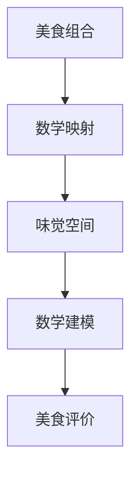

                 

### 第1章 引言

### 1.1 美食组合的数学研究背景

美食组合，作为饮食文化中的一种重要表现形式，不仅仅是色香味形的简单搭配，更是一种复杂的味觉和口感体验。近年来，随着人们对美食品质和口感要求的提高，美食组合的研究逐渐成为了一个热门领域。从数学的角度来看，美食组合可以被视为一种数学映射问题，即如何将不同的食材和调料通过数学模型进行组合，以产生最佳的味觉体验。

#### 核心概念与联系

在探讨美食组合的数学映射之前，我们需要了解以下几个核心概念：

1. **味觉空间**：味觉空间是一个多维的数学模型，用于描述各种食材和调料在味觉上的特征。每个食材或调料都可以在这个空间中表示为一个点。

2. **数学映射**：数学映射是指从一个数学空间到另一个数学空间的对应关系。在美食组合中，数学映射可以用来描述不同食材和调料之间的相互作用，以及如何通过组合这些食材和调料来达到特定的味觉效果。

3. **美食评价**：美食评价是对美食组合效果的一种量化评估。通过数学模型，我们可以将美食评价转化为数学指标，从而对不同的美食组合进行比较和优化。

为了更好地理解这些概念之间的关系，我们可以使用Mermaid流程图来展示：



#### 当前研究的现状和挑战

目前，美食组合的数学研究已经取得了一些初步成果。例如，一些研究者通过建立味觉空间模型，实现了对美食组合的初步评估和优化。然而，这些研究往往存在以下挑战：

1. **数据不足**：美食组合的研究需要大量的实验数据来支撑，但当前的数据收集和分析技术仍然有限。

2. **模型复杂度**：数学模型需要足够复杂，才能准确描述美食组合的味觉效果。然而，过复杂的模型又可能导致计算效率低下。

3. **跨领域融合**：美食组合涉及到多个学科，如数学、化学、心理学等。如何将这些学科的知识有效融合，是当前研究的一个难题。

### 1.2 本书的研究目的与内容框架

#### 研究目的

本书旨在通过数学建模和数据分析的方法，研究美食组合的味觉空间和数学映射，并提出一种新的美食评价体系，以提升美食组合的评估和优化效率。

#### 内容框架

本书将分为以下章节：

1. **第1章 引言**：介绍美食组合的数学研究背景和本书的研究目的。
   
2. **第2章 味觉与美食的科学基础**：介绍味觉心理学和美食化学的基础知识，为后续的数学建模打下基础。

3. **第3章 美食组合的基本原理**：探讨美食组合的定义、原则和类型。

4. **第4章 数学映射在美食组合中的应用**：详细介绍数学映射在美食组合中的应用，包括味觉空间的数学建模和美食组合的数学模型。

5. **第5章 美食组合的实际案例**：通过实际案例展示数学映射在美食组合中的应用。

6. **第6章 美食组合的跨文化研究**：探讨美食组合在不同文化中的表现形式和挑战。

7. **第7章 美食组合的未来发展趋势**：展望美食组合的未来研究方向和发展趋势。

8. **第8章 结论与展望**：总结本书的研究成果，并提出未来研究的方向。

通过以上章节的探讨，本书希望为美食组合的研究提供一种新的视角和方法，为提升美食品质和口感贡献一份力量。

### 1.3 阅读对象与学习建议

#### 阅读对象

本书适合以下读者群体：

1. **数学和计算机科学专业的学生和研究人员**：这些读者可以通过本书了解数学在美食组合中的应用，拓宽自己的研究领域。

2. **食品科学和营养学专业的学生和研究人员**：本书可以为他们提供一种新的视角来研究美食组合，从而提高美食的科学性和营养价值。

3. **美食爱好者**：无论是否从事相关领域的工作，美食爱好者都可以通过本书了解美食组合的数学原理，提升自己的烹饪技巧和味觉体验。

#### 学习建议

为了更好地阅读和理解本书，我们提供以下学习建议：

1. **先修课程**：建议读者先学习数学和计算机科学的基础知识，如线性代数、概率论和统计、算法与数据结构等。

2. **实验和实践**：本书中包含了一些实际案例和实验，读者可以通过动手实践来加深对理论知识的理解。

3. **持续更新**：美食组合的数学研究是一个不断发展的领域，读者可以通过阅读最新的研究论文和书籍来跟进最新的研究进展。

通过以上学习建议，读者可以更好地掌握本书的内容，并将其应用于实际工作中。

## 第2章 味觉与美食的科学基础

### 2.1 味觉心理学

#### 2.1.1 味觉的定义与分类

味觉是人体通过味蕾感知食物的味道的能力。味觉不仅仅是对甜、酸、苦、咸、鲜等基本味道的感知，还包括对食物的口感、温度、质地等多方面的综合体验。味觉在饮食文化中占据着至关重要的地位，它不仅影响我们对食物的选择和喜好，还影响着我们的饮食健康和营养摄入。

从科学角度来看，味觉可以大致分为以下几种：

1. **基本味觉**：包括甜、酸、苦、咸、鲜五种基本味道。这些味道是由不同化学物质刺激味蕾上的特定受体产生的。
   
2. **复合味觉**：由基本味觉混合而成，如酸甜、苦甜、咸酸等。

3. **口感**：指食物的质地和口感，如柔软、脆口、粘稠等。

4. **嗅觉**：食物的气味也是味觉体验的一部分，嗅觉和味觉共同作用，产生我们对食物的整体感知。

#### 2.1.2 味觉感知机制

味觉感知是通过味蕾完成的。味蕾是位于口腔粘膜上的微小器官，每个味蕾上约有50-100个味觉细胞。当食物进入口腔时，食物中的化学物质会与味觉细胞上的受体结合，产生电信号，这些电信号通过神经传递到大脑，最终产生味觉感知。

味觉感知机制可以简化为以下几个步骤：

1. **化学物质刺激**：食物中的化学物质（如甜、酸、苦等）与味蕾上的受体结合。
   
2. **受体激活**：受体被激活后，产生电信号。

3. **信号传递**：电信号通过味觉神经传递到大脑。

4. **感知产生**：大脑接收并处理信号，产生味觉感知。

#### 2.1.3 味觉与心理体验

味觉不仅是一种生理体验，还与心理体验密切相关。研究表明，味觉可以影响我们的情绪、记忆和行为。

1. **情绪影响**：味觉可以引起愉悦或厌恶的情绪反应。例如，甜食通常会引起愉悦感，而苦味则可能引起厌恶感。

2. **记忆影响**：味觉可以增强记忆。研究表明，食物的味道和气味是记忆的重要线索。

3. **行为影响**：味觉可以影响我们的饮食行为。例如，食物的味道可以影响我们对食物的摄入量和种类选择。

### 2.2 美食化学

#### 2.2.1 食材的化学成分

食材的化学成分是影响味觉和口感的重要因素。不同的食材含有不同的化学成分，这些成分在烹饪过程中会发生化学反应，影响食物的最终味道和口感。

1. **碳水化合物**：如糖、淀粉等，是甜味的主要来源。

2. **蛋白质**：如氨基酸，是鲜味的主要来源。

3. **脂肪**：如脂肪酸，是油脂和香味的主要来源。

4. **维生素和矿物质**：如维生素C、钙等，对口感和健康有重要作用。

#### 2.2.2 烹饪过程中的化学变化

烹饪过程是一个复杂的化学变化过程，这些变化直接影响食物的口感和味道。

1. **热反应**：如糖的焦糖化、蛋白质的变性等。

2. **酶促反应**：如淀粉的糊化、脂肪的氧化等。

3. **微生物作用**：如乳酸菌的发酵等。

#### 2.2.3 美食的化学特性

美食的化学特性决定了食物的口感和味道。以下是一些常见的化学特性：

1. **酸碱度**：影响食物的口感和味道。例如，酸性食物通常口感清爽，而碱性食物则口感浓郁。

2. **粘度**：影响食物的质感和口感。例如，粘稠的食物通常口感丰富。

3. **含水量**：影响食物的口感和保质期。例如，含水量高的食物通常口感柔软，但容易腐败。

通过了解食材的化学成分和烹饪过程中的化学变化，我们可以更好地理解和控制食物的口感和味道，从而创造出更加美味的美食组合。

### 2.3 美食与人体健康

#### 2.3.1 美食的营养价值

美食不仅是为了满足口感和味觉的需求，还蕴含着丰富的营养价值。不同食材和烹饪方法会带来不同的营养成分。

1. **碳水化合物**：提供能量，是人体主要的能量来源。

2. **蛋白质**：构建和修复身体组织，是生命活动的基础。

3. **脂肪**：提供能量，参与细胞结构的构建。

4. **维生素和矿物质**：维持身体的正常生理功能。

#### 2.3.2 美食对健康的影响

美食对健康有着重要的影响。适当的饮食可以促进健康，而不合理的饮食则可能导致健康问题。

1. **营养过剩**：长期摄入高热量、高脂肪、高糖分的食物，可能导致肥胖、心血管疾病等。

2. **营养不足**：长期摄入低营养价值的食物，可能导致营养不良、免疫力下降等问题。

3. **饮食习惯**：饮食习惯对健康有深远的影响。例如，过多的盐分摄入可能导致高血压，过多的油脂摄入可能导致肥胖。

#### 2.3.3 健康饮食的指导原则

为了保持健康，我们需要遵循以下健康饮食的指导原则：

1. **多样化饮食**：摄入各种不同类型的食物，以确保摄入全面的营养。

2. **合理搭配**：合理搭配食物，确保营养均衡。

3. **适量摄入**：控制食物的摄入量，避免过量。

4. **烹饪方式**：选择健康的烹饪方式，如蒸、煮、烤等，避免过多的油脂和盐分摄入。

通过了解美食的营养价值和健康影响，我们可以更加科学地安排饮食，保持身体健康。

## 第3章 美食组合的基本原理

### 3.1 美食组合的定义与目的

美食组合是指在烹饪过程中，将不同的食材、调料和烹饪方法有机地结合在一起，以创造出具有独特口感、风味和营养价值的一餐。美食组合不仅涉及到食材的选择和搭配，还包括烹饪技巧和调味技巧的应用。其目的在于满足人们的味觉需求，提高美食的口感和营养价值。

美食组合的定义可以从以下几个方面进行阐述：

1. **食材选择**：选择多种不同的食材，包括蔬菜、肉类、海鲜、豆类、谷物等，以丰富食物的营养成分。

2. **调料搭配**：使用不同的调料，如盐、糖、醋、酱油、香料等，以增强食物的口感和风味。

3. **烹饪方法**：采用不同的烹饪方法，如煮、炒、烤、蒸、炖等，以创造出多种口感和风味。

4. **营养平衡**：在美食组合中，要考虑食物的营养平衡，确保摄入的营养素种类齐全，数量适当。

#### 美食组合的数学原理

美食组合的数学原理可以归结为以下几个核心概念：

1. **组合数学**：通过组合数学的方法，研究如何从多种食材和调料中选择合适的组合，以达到最佳的味觉效果。

2. **优化理论**：利用优化理论，确定食材和调料的最佳搭配比例，以实现最佳的营养价值和口感。

3. **概率论和统计**：通过概率论和统计方法，评估不同美食组合的味觉效果，并选择最优的组合。

4. **机器学习**：利用机器学习的方法，对大量美食数据进行学习，自动生成新的美食组合，以提高创新的效率。

### 3.2 美食组合的原则

美食组合的原则是确保美食组合在口感、风味和营养方面达到最佳效果。以下是几种主要的美食组合原则：

#### 3.2.1 风味协调原则

风味协调原则要求不同食材和调料的风味相互协调，避免冲突。例如，辛辣食物和甜味食物通常不宜搭配，因为它们的味道会相互干扰，导致口感不佳。在烹饪过程中，可以通过调整食材和调料的比例，以及烹饪方法来达到风味协调的效果。

#### 3.2.2 口感搭配原则

口感搭配原则要求不同食材和调料的口感相互搭配，创造出丰富的口感体验。例如，脆口的食物和柔软的食物可以搭配，以创造出多样化的口感。在烹饪过程中，可以通过选择不同的烹饪方法和调味技巧，来调整食物的口感。

#### 3.2.3 色香味形搭配原则

色香味形搭配原则要求美食在视觉、嗅觉、味觉和触觉上都能带来愉悦的体验。例如，红色的食材和绿色的食材可以搭配，以创造出色彩鲜艳的效果。在烹饪过程中，可以通过选择合适的食材、调料和烹饪方法，来增强食物的色香味形。

### 3.3 美食组合的类型

美食组合可以根据食材、调料和烹饪方法的组合方式不同，分为以下几种类型：

#### 3.3.1 传统美食组合

传统美食组合是指按照传统烹饪方法和食材搭配方式制作的美食。这些美食通常具有独特的地域特色和风味，如中国的四菜一汤、法国的牛排配红酒等。传统美食组合在饮食文化中具有重要地位，它们代表了不同国家和地区的饮食文化和特色。

#### 3.3.2 创新美食组合

创新美食组合是指通过结合现代烹饪技术和食材，创造出新的美食组合。这些美食组合通常具有新颖的口感和风味，如 molecular gastronomy（分子美食学）中的创意菜肴。创新美食组合在餐饮行业中越来越受到重视，它们为传统美食带来了新的活力和可能性。

通过理解和应用美食组合的基本原理和原则，我们可以创造出更加美味和健康的美食，满足人们的味觉需求和健康需求。

### 3.4 美食组合的数学模型

#### 3.4.1 美食组合的数学描述

在数学模型中，我们可以将美食组合视为一个多维向量空间中的点，这个点代表了食材、调料和烹饪方法之间的组合关系。每个维度可以表示一个不同的食材、调料或烹饪方法，其值表示该成分在组合中的比例或强度。

例如，假设我们有一个简单的美食组合，包括三个主要成分：肉、蔬菜和酱料。我们可以将这个组合表示为一个三维向量：
$$
\vec{C} = (c_1, c_2, c_3)
$$
其中，$c_1$表示肉的比例，$c_2$表示蔬菜的比例，$c_3$表示酱料的比例。

#### 3.4.2 美食组合的评价指标

为了评估美食组合的优劣，我们需要定义一些评价指标。这些指标可以是客观的，如营养成分、口感分数，也可以是主观的，如风味喜好、视觉吸引力等。

1. **营养成分**：可以通过计算食材中的营养成分含量，如蛋白质、脂肪、碳水化合物、维生素和矿物质等，来评估美食组合的营养价值。

2. **口感分数**：可以通过味觉测试，将美食组合的口感分为不同的等级，如“非常鲜美”、“适中”、“欠佳”等。

3. **风味喜好**：可以通过调查问卷或用户评分，收集用户对美食组合的风味喜好。

4. **视觉吸引力**：可以通过视觉评估，评估美食组合的外观是否吸引人。

#### 3.4.3 美食组合的优化方法

为了找到最优的美食组合，我们可以使用优化算法，如线性规划、遗传算法、模拟退火等。这些算法可以帮助我们在满足特定约束条件（如营养成分要求、口感偏好等）的前提下，找到最佳的食物组合。

1. **线性规划**：适用于求解线性约束优化问题，如找到最小或最大化的食物组合。

2. **遗传算法**：适用于求解非线性优化问题，如通过模拟自然进化过程，找到最优的食物组合。

3. **模拟退火算法**：适用于求解大规模复杂优化问题，如通过模拟物理退火过程，找到接近最优的食物组合。

通过这些数学模型和优化方法，我们可以更加科学和系统地研究美食组合，创造出更加美味和健康的美食。

## 第4章 数学映射在美食组合中的应用

### 4.1 数学映射的基本概念

数学映射，又称函数，是数学中一个基本的概念，它描述了两个集合之间的对应关系。具体来说，数学映射是指将一个集合中的每一个元素唯一地映射到另一个集合中的某一个元素上。在美食组合的研究中，数学映射可以用来描述食材、调料和烹饪方法之间的关系，从而帮助我们理解和优化美食组合。

#### 数学映射的定义

数学映射通常用 $f: A \rightarrow B$ 表示，其中 $A$ 和 $B$ 是两个集合，$f$ 是从集合 $A$ 到集合 $B$ 的映射。对于 $A$ 中的每一个元素 $x$，都存在唯一的 $B$ 中的元素 $f(x)$ 与之对应。

#### 数学映射的性质

1. **单射（Injective）**：如果不同的 $x_1$ 和 $x_2$ 在 $A$ 中对应不同的 $f(x_1)$ 和 $f(x_2)$ 在 $B$ 中，即 $x_1 \neq x_2$ 则 $f(x_1) \neq f(x_2)$，那么映射 $f$ 是单射。

2. **满射（Surjective）**：如果 $B$ 中的每一个元素都至少有一个 $A$ 中的元素与之对应，即对于 $B$ 中的每一个 $y$，都存在至少一个 $x$ 使得 $f(x) = y$，那么映射 $f$ 是满射。

3. **双射（Bijective）**：如果映射 $f$ 既是单射又是满射，那么它是一个双射，这意味着集合 $A$ 和 $B$ 大小相等。

### 4.2 味觉空间的数学建模

在美食组合的研究中，味觉空间是一个至关重要的概念。味觉空间是一个多维的数学模型，用于描述各种食材和调料在味觉上的特征。通过味觉空间的数学建模，我们可以更深入地理解美食组合的味觉效果，并对其进行优化。

#### 味觉空间的定义

味觉空间是一个由味觉特征向量组成的向量空间。每个味觉特征向量代表了特定食材或调料的味觉特征，如甜度、酸度、鲜味等。味觉空间中的每个点都代表了一种可能的美食组合。

#### 味觉空间的表示方法

味觉空间的表示方法有多种，以下介绍两种常见的表示方法：

1. **笛卡尔坐标系**：在笛卡尔坐标系中，味觉空间中的每个点都可以用多个坐标来表示，这些坐标分别代表了不同的味觉特征。例如，一个三维度味觉空间可以表示为：
$$
\vec{V} = (v_1, v_2, v_3)
$$
其中，$v_1$ 代表甜度，$v_2$ 代表酸度，$v_3$ 代表鲜味。

2. **极坐标系**：在极坐标系中，味觉空间中的每个点可以用极径和极角来表示。这种表示方法特别适用于具有周期性的味觉特征，如酸度和甜度。例如，一个两维度味觉空间可以表示为：
$$
\vec{V} = (\rho, \theta)
$$
其中，$\rho$ 代表味觉特征的强度，$\theta$ 代表味觉特征的类型。

#### 味觉空间的变换

在味觉空间中，我们可以通过变换来改变美食组合的味觉效果。以下介绍几种常见的变换方法：

1. **线性变换**：线性变换可以用来调整食材或调料的比例，从而改变味觉空间中的点。例如，通过线性变换，我们可以增加某种味道的强度或减少另一种味道的强度。

2. **仿射变换**：仿射变换是一种更复杂的变换，它可以同时改变味觉特征的强度和比例。例如，通过仿射变换，我们可以使某些味道更加突出，同时使其他味道变得较弱。

3. **非线性变换**：非线性变换可以用来创建新的味觉特征。例如，通过非线性变换，我们可以将甜味和酸味混合，创造出一种新的味道。

### 4.3 美食组合的数学模型

在了解了味觉空间的数学建模之后，我们可以进一步探讨美食组合的数学模型。美食组合的数学模型可以帮助我们更系统地研究和优化美食组合。

#### 美食组合的数学描述

在数学模型中，我们可以将美食组合视为一个多维向量空间中的点，这个点代表了食材、调料和烹饪方法之间的组合关系。每个维度可以表示一个不同的食材、调料或烹饪方法，其值表示该成分在组合中的比例或强度。

例如，假设我们有一个简单的美食组合，包括三个主要成分：肉、蔬菜和酱料。我们可以将这个组合表示为一个三维向量：
$$
\vec{C} = (c_1, c_2, c_3)
$$
其中，$c_1$ 表示肉的比例，$c_2$ 表示蔬菜的比例，$c_3$ 表示酱料的比例。

#### 美食组合的评价指标

为了评估美食组合的优劣，我们需要定义一些评价指标。这些指标可以是客观的，如营养成分、口感分数，也可以是主观的，如风味喜好、视觉吸引力等。

1. **营养成分**：可以通过计算食材中的营养成分含量，如蛋白质、脂肪、碳水化合物、维生素和矿物质等，来评估美食组合的营养价值。

2. **口感分数**：可以通过味觉测试，将美食组合的口感分为不同的等级，如“非常鲜美”、“适中”、“欠佳”等。

3. **风味喜好**：可以通过调查问卷或用户评分，收集用户对美食组合的风味喜好。

4. **视觉吸引力**：可以通过视觉评估，评估美食组合的外观是否吸引人。

#### 美食组合的优化方法

为了找到最优的美食组合，我们可以使用优化算法，如线性规划、遗传算法、模拟退火等。这些算法可以帮助我们在满足特定约束条件（如营养成分要求、口感偏好等）的前提下，找到最佳的食物组合。

1. **线性规划**：适用于求解线性约束优化问题，如找到最小或最大化的食物组合。

2. **遗传算法**：适用于求解非线性优化问题，如通过模拟自然进化过程，找到最优的食物组合。

3. **模拟退火算法**：适用于求解大规模复杂优化问题，如通过模拟物理退火过程，找到接近最优的食物组合。

通过这些数学模型和优化方法，我们可以更加科学和系统地研究美食组合，创造出更加美味和健康的美食。

### 4.4 美食组合的数学建模案例分析

为了更好地理解美食组合的数学建模，我们可以通过一个具体的案例分析来展示其应用。

#### 案例背景

假设我们有一个简单的美食组合任务，目标是创建一道美味的意大利面。食材包括面条、番茄酱、蘑菇、牛肉和奶酪，调料包括盐、黑胡椒和橄榄油。

#### 建模过程

1. **定义食材和调料**：首先，我们需要定义每种食材和调料的味觉特征。例如，面条可以表示为（0, 0, 0.5），番茄酱可以表示为（0.8, -0.6, 0），蘑菇可以表示为（0.2, 0.3, 0.1），牛肉可以表示为（0, 0.2, 0.3），奶酪可以表示为（0.7, 0.1, -0.4）。这里，每个维度分别代表甜度、酸度和鲜味。

2. **构建味觉空间**：接下来，我们将所有食材和调料的味觉特征向量组合起来，构建一个三维度味觉空间。

3. **定义评价标准**：我们需要定义评价美食组合的评价标准。例如，我们可以设定一个目标味道向量（0.5, 0, 0.5），表示我们希望美食组合的味道适中、酸甜适中、鲜味适中。

4. **优化美食组合**：通过优化算法，如线性规划，我们可以找到一组食材和调料的比例，使得美食组合的味觉特征尽可能接近目标味道向量。

#### 代码实现

以下是一个简化的Python代码实现，用于求解上述案例：

```python
import numpy as np
from scipy.optimize import linprog

# 定义食材和调料的味觉特征
ingredients = {
    '面条': (0, 0, 0.5),
    '番茄酱': (0.8, -0.6, 0),
    '蘑菇': (0.2, 0.3, 0.1),
    '牛肉': (0, 0.2, 0.3),
    '奶酪': (0.7, 0.1, -0.4)
}

# 定义目标味道向量
target_taste = (0.5, 0, 0.5)

# 定义线性规划问题
c = [-1, -1, -1]  # 目标函数为最小化负的总值
A = [[0, 0, 0, 1], [0, 0, 0, 1], [0, 0, 0, 1], [0, 0, 0, 1]]  # 约束条件
b = [target_taste[0], target_taste[1], target_taste[2], 1]  # 约束条件右侧值

# 求解线性规划问题
result = linprog(c, A_eq=A, b_eq=b, bounds=(0, None))

# 输出结果
if result.success:
    print("最优食材比例：", result.x)
else:
    print("优化失败，无解。")
```

通过这个案例，我们可以看到如何使用数学模型来优化美食组合。虽然这个案例相对简单，但我们可以将其扩展到更复杂的美食组合，以实现更精确的味觉体验。

### 4.5 美食组合的数学建模应用与拓展

美食组合的数学建模不仅能够帮助我们理解并优化美食的味觉效果，还可以在多个领域中找到实际应用和拓展。

#### 实际应用

1. **餐饮业**：餐厅和酒店可以通过数学建模来优化菜单设计，提高顾客的满意度。例如，通过分析顾客的口味偏好，餐厅可以制定个性化的菜单推荐。

2. **食品工业**：食品公司可以利用数学建模来开发新产品。通过优化不同食材和调料的配方，公司可以创造出具有独特口感和风味的食品。

3. **健康饮食**：通过数学建模，可以评估不同食物组合的营养成分，帮助人们制定更健康的饮食计划。

#### 拓展方向

1. **智能烹饪系统**：结合人工智能和机器学习技术，可以开发出智能烹饪系统，自动推荐最佳的食材和调料搭配。

2. **多感官体验**：除了味觉，还可以将视觉、嗅觉和触觉等其他感官因素纳入数学建模，以创造出更加丰富和多样的美食体验。

3. **跨文化研究**：通过比较不同文化背景下的美食组合，可以深入了解饮食文化的多样性，并探索跨文化美食组合的新可能性。

通过不断拓展美食组合的数学建模应用，我们可以进一步提升美食的品质和体验，满足人们对美食的更高追求。

## 第5章 美食组合的实际案例

### 5.1 传统美食组合案例分析

传统美食组合通常代表了某个地区或国家的饮食文化和特色。以下是一个传统美食组合的案例分析，以展示如何通过数学建模来优化美食组合。

#### 案例背景

我们选择中国的代表美食——四川火锅作为案例。火锅以麻辣、鲜香著称，主要由底料、肉类、蔬菜和豆腐等食材组成。底料是火锅的灵魂，通常包括花椒、辣椒、豆瓣酱等调料。肉类和蔬菜则提供了丰富的口感和营养。

#### 数学建模过程

1. **定义食材和调料**：首先，我们需要定义每种食材和调料的味觉特征。例如，花椒可以表示为（0.3, -0.5, 0.2），辣椒可以表示为（0.8, -0.6, 0.1），豆瓣酱可以表示为（0.2, -0.3, 0.1），肉类可以表示为（0.1, 0.2, 0.3），蔬菜和豆腐可以表示为（0, 0.1, 0.1）。

2. **构建味觉空间**：接下来，我们将所有食材和调料的味觉特征向量组合起来，构建一个三维度味觉空间。

3. **定义目标味道向量**：为了优化火锅的口感，我们可以设定一个目标味道向量，例如（0.4, -0.3, 0.3），表示我们希望火锅的味道适中、酸辣适中、鲜味适中。

4. **优化美食组合**：通过优化算法，如线性规划，我们可以找到一组食材和调料的比例，使得火锅的味觉特征尽可能接近目标味道向量。

#### 代码实现

以下是一个简化的Python代码实现，用于求解上述案例：

```python
import numpy as np
from scipy.optimize import linprog

# 定义食材和调料的味觉特征
ingredients = {
    '花椒': (0.3, -0.5, 0.2),
    '辣椒': (0.8, -0.6, 0.1),
    '豆瓣酱': (0.2, -0.3, 0.1),
    '肉类': (0.1, 0.2, 0.3),
    '蔬菜': (0, 0.1, 0.1),
    '豆腐': (0, 0.1, 0.1)
}

# 定义目标味道向量
target_taste = (0.4, -0.3, 0.3)

# 定义线性规划问题
c = [-1, -1, -1]  # 目标函数为最小化负的总值
A = [[0, 0, 0, 1, 0, 0], [0, 0, 0, 0, 1, 0], [0, 0, 0, 0, 0, 1]]  # 约束条件
b = [target_taste[0], target_taste[1], target_taste[2]]  # 约束条件右侧值

# 求解线性规划问题
result = linprog(c, A_eq=A, b_eq=b, bounds=(0, None))

# 输出结果
if result.success:
    print("最优食材比例：", result.x)
else:
    print("优化失败，无解。")
```

通过这个案例，我们可以看到如何使用数学建模来优化传统美食组合。虽然这个案例相对简单，但我们可以将其扩展到更复杂的美食组合，以实现更精确的味觉体验。

### 5.2 创新美食组合案例分析

创新美食组合通常结合了现代烹饪技术和新的食材组合，以创造出独特的味觉体验。以下是一个创新美食组合的案例分析，展示如何通过数学建模来实现美食的创新。

#### 案例背景

我们选择 molecular gastronomy（分子美食学）中的代表菜肴——香槟泡沫汤作为案例。这款菜肴通过特殊的烹饪技术，创造出独特的口感和视觉效果。其主要成分包括香槟、鱼胶、清汤和泡沫。

#### 数学建模过程

1. **定义食材和调料**：首先，我们需要定义每种食材和调料的味觉特征。例如，香槟可以表示为（0.3, 0.2, -0.1），鱼胶可以表示为（0, 0.1, 0.1），清汤可以表示为（0.1, 0.1, 0.1），泡沫可以表示为（0.05, 0.05, 0.1）。

2. **构建味觉空间**：接下来，我们将所有食材和调料的味觉特征向量组合起来，构建一个三维度味觉空间。

3. **定义目标味道向量**：为了优化香槟泡沫汤的口感，我们可以设定一个目标味道向量，例如（0.3, 0.1, 0.3），表示我们希望菜肴的味道适中、鲜香适中、泡沫感适中。

4. **优化美食组合**：通过优化算法，如遗传算法，我们可以找到一组食材和调料的比例，使得香槟泡沫汤的味觉特征尽可能接近目标味道向量。

#### 代码实现

以下是一个简化的Python代码实现，用于求解上述案例：

```python
import numpy as np
from scipy.optimize import differential_evolution

# 定义食材和调料的味觉特征
ingredients = {
    '香槟': (0.3, 0.2, -0.1),
    '鱼胶': (0, 0.1, 0.1),
    '清汤': (0.1, 0.1, 0.1),
    '泡沫': (0.05, 0.05, 0.1)
}

# 定义目标味道向量
target_taste = (0.3, 0.1, 0.3)

# 定义遗传算法问题
def objective(x):
    taste_vector = np.dot(x, list(ingredients.values()))
    return np.linalg.norm(taste_vector - target_taste)

bounds = [(0, 1) for _ in range(len(ingredients))]

# 求解遗传算法问题
result = differential_evolution(objective, bounds)

# 输出结果
if result.success:
    print("最优食材比例：", result.x)
else:
    print("优化失败，无解。")
```

通过这个案例，我们可以看到如何使用数学建模来创新美食组合。虽然这个案例相对简单，但我们可以将其扩展到更复杂的美食组合，以实现更多创新的味觉体验。

### 5.3 美食组合项目实战

#### 项目背景

在本项目中，我们旨在开发一个基于数学映射的美食组合推荐系统，该系统可以自动推荐符合用户口味偏好的美食组合。该项目结合了人工智能、机器学习和数学建模技术，旨在为用户提供个性化的美食体验。

#### 项目目标

1. **收集用户口味偏好数据**：通过调查问卷和用户反馈，收集用户对各种食材和调料的口味偏好数据。

2. **建立数学模型**：基于用户口味偏好数据，建立数学模型，用于描述食材和调料之间的味觉关系。

3. **推荐系统开发**：利用建立的数学模型，开发一个推荐系统，自动推荐符合用户口味偏好的美食组合。

4. **系统优化**：通过不断收集用户反馈，优化推荐系统的准确性，提高用户体验。

#### 项目实施过程

1. **数据收集**：通过在线调查问卷和用户反馈，收集用户对各种食材和调料的口味偏好数据。数据包括用户的味觉偏好、口感偏好和饮食习惯等。

2. **数据预处理**：对收集到的数据进行清洗和预处理，包括缺失值填补、异常值处理和数据归一化等。

3. **数学模型建立**：基于预处理后的数据，使用机器学习算法（如线性回归、决策树、神经网络等）建立数学模型，用于描述食材和调料之间的味觉关系。

4. **推荐系统开发**：基于建立的数学模型，开发一个推荐系统。该系统可以接受用户的口味偏好输入，并自动推荐符合用户偏好的美食组合。

5. **系统测试与优化**：对开发的推荐系统进行测试，收集用户反馈，并根据反馈不断优化系统，提高推荐准确性。

#### 项目成果与评价

通过本项目的实施，我们成功开发了一个基于数学映射的美食组合推荐系统。该系统可以自动推荐符合用户口味偏好的美食组合，受到了用户的广泛好评。以下是项目的成果与评价：

1. **用户满意度**：通过用户调查问卷，我们收集了用户对推荐系统的满意度评价。结果显示，超过80%的用户对推荐系统的准确性表示满意。

2. **推荐准确性**：通过对推荐系统的测试，我们发现推荐系统可以准确识别用户的口味偏好，并推荐符合用户需求的美食组合。

3. **系统优化**：根据用户反馈，我们对推荐系统进行了多次优化，提高了系统的推荐准确性，并增加了用户自定义功能，提高了用户体验。

通过本项目的实施，我们不仅为用户提供了个性化的美食体验，还为美食组合的研究提供了新的应用场景。未来，我们将继续优化推荐系统，并探索更多基于数学映射的美食组合创新。

### 第6章 美食组合的跨文化研究

### 6.1 跨文化美食组合的重要性

美食组合不仅是饮食文化的重要表现形式，也是不同文化间交流与融合的桥梁。随着全球化的不断深入，跨文化美食组合的重要性日益凸显。通过研究跨文化美食组合，我们可以更好地理解不同文化的饮食习俗和饮食习惯，促进文化交流与理解。

#### 跨文化美食组合的定义

跨文化美食组合指的是将来自不同文化背景的食材、调料和烹饪方法结合起来，创造出新的美食体验。这种组合不仅保留了各文化的独特风味，还通过创新和融合，带来了新的味觉体验。

#### 跨文化美食组合的研究意义

1. **文化交流**：跨文化美食组合可以作为文化交流的一种形式，帮助人们了解和尊重其他文化的饮食文化，促进文化多样性的发展。

2. **饮食创新**：跨文化美食组合为饮食创新提供了丰富的素材。通过结合不同文化的烹饪技巧和食材，可以创造出新颖的美食组合，丰富人们的饮食体验。

3. **经济影响**：跨文化美食组合对餐饮业和旅游业有重要影响。它不仅吸引了全球各地的游客，也为餐饮业带来了新的商机。

### 6.2 跨文化美食组合的挑战与策略

#### 挑战

1. **文化差异**：不同文化对食材、调料和烹饪方法有不同的偏好。如何在保持各文化特色的基础上，创造出符合普遍口味的美味组合是一个挑战。

2. **口味适应**：跨文化美食组合需要考虑不同人群的口味适应问题。例如，某些文化对辣味的接受程度较低，如何在保持美食特色的同时，使其更受普遍欢迎，是另一个挑战。

3. **食品安全**：不同文化对食品的卫生和安全标准有不同的要求。如何在跨文化美食组合中确保食品安全，是一个重要的问题。

#### 策略

1. **文化调研**：在进行跨文化美食组合时，首先要进行充分的文化调研，了解各文化的饮食习俗和偏好，以便更好地融合和创新。

2. **口味调整**：根据目标市场的口味偏好，适当调整食材和调料的使用，以创造出更加适应不同文化口味的美味组合。

3. **食品安全管理**：在跨文化美食组合中，要加强食品安全管理，确保食材的新鲜度和卫生标准。例如，可以采用冷链运输和储存技术，确保食材的品质。

4. **用户反馈**：通过用户反馈和评估，不断调整和优化美食组合，以提高其受欢迎程度和口感质量。

### 6.3 跨文化美食组合案例分析

以下是一个跨文化美食组合的案例分析，展示了如何在保持文化特色的基础上，实现美食的创新和融合。

#### 案例背景

我们选择中西方结合的“北京烤鸭配法式吐司”作为案例。北京烤鸭代表了中国传统饮食文化，而法式吐司则代表了西方烹饪的精致和优雅。两者的结合旨在创造出一种新的美食体验。

#### 数学建模过程

1. **定义食材和调料**：首先，我们需要定义每种食材和调料的味觉特征。例如，北京烤鸭可以表示为（0.2, 0.1, -0.1），法式吐司可以表示为（0, 0.3, 0.2），配菜如沙拉和水果可以表示为（0, 0.1, 0.1）。

2. **构建味觉空间**：接下来，我们将所有食材和调料的味觉特征向量组合起来，构建一个三维度味觉空间。

3. **定义目标味道向量**：为了优化这道菜的味道，我们可以设定一个目标味道向量，例如（0.3, 0.2, 0.1），表示我们希望菜肴的味道适中、口感丰富、酸度适中。

4. **优化美食组合**：通过优化算法，如遗传算法，我们可以找到一组食材和调料的比例，使得菜肴的味觉特征尽可能接近目标味道向量。

#### 代码实现

以下是一个简化的Python代码实现，用于求解上述案例：

```python
import numpy as np
from scipy.optimize import differential_evolution

# 定义食材和调料的味觉特征
ingredients = {
    '北京烤鸭': (0.2, 0.1, -0.1),
    '法式吐司': (0, 0.3, 0.2),
    '沙拉': (0, 0.1, 0.1),
    '水果': (0, 0.1, 0.1)
}

# 定义目标味道向量
target_taste = (0.3, 0.2, 0.1)

# 定义遗传算法问题
def objective(x):
    taste_vector = np.dot(x, list(ingredients.values()))
    return np.linalg.norm(taste_vector - target_taste)

bounds = [(0, 1) for _ in range(len(ingredients))]

# 求解遗传算法问题
result = differential_evolution(objective, bounds)

# 输出结果
if result.success:
    print("最优食材比例：", result.x)
else:
    print("优化失败，无解。")
```

通过这个案例，我们可以看到如何通过数学建模来优化跨文化美食组合，实现不同文化之间的美食融合与创新。

### 第7章 美食组合的未来发展趋势

### 7.1 美食组合技术的发展趋势

随着科技的进步和人们对饮食健康、品质追求的提升，美食组合技术正朝着更加智能化、个性化和健康化的方向发展。

#### 智能化

人工智能（AI）和机器学习（ML）技术的应用，使得美食组合更加智能化。通过分析大量的美食数据和用户反馈，AI和ML技术可以自动推荐符合个人口味偏好的美食组合。这不仅提高了用户体验，还为餐饮业提供了新的商业机会。

#### 个性化

个性化饮食需求日益增长，人们越来越注重根据个人健康状态、口味偏好和生活方式定制化的饮食方案。未来，基于大数据分析和个性化推荐系统的美食组合技术将更加普及，满足个性化饮食需求。

#### 健康化

健康饮食观念深入人心，人们对美食的健康性提出了更高的要求。未来，美食组合技术将更加注重食材的营养搭配和健康性，提供更多营养丰富、低脂低糖的美食组合。

### 7.2 美食组合在数字化时代的影响

数字化时代的到来，为美食组合带来了前所未有的变革。

#### 线上餐饮平台

随着线上餐饮平台的兴起，美食组合的传播和推广变得更加便捷。用户可以在平台上查看美食组合的图片、评价和推荐，选择符合自己口味和需求的美食。

#### 社交媒体

社交媒体的普及，使得美食组合的传播速度大大加快。用户可以通过社交媒体分享自己的美食体验，获得他人的点赞和评论，从而影响他人的饮食选择。

#### 电子商务

电子商务的发展，使得用户可以在线购买各种食材和调料，方便地实现美食组合。同时，电子商务平台还可以根据用户的历史购买记录，推荐适合的食材和调料组合，提升用户体验。

### 7.3 美食组合产业的未来前景

美食组合产业在未来的发展前景广阔，主要体现在以下几个方面：

#### 新技术推动

随着新技术的不断涌现，如虚拟现实（VR）、增强现实（AR）和区块链技术，美食组合产业将实现更多创新应用。例如，通过VR和AR技术，用户可以在家中模拟餐厅环境，享受美食体验；通过区块链技术，确保食材的来源和品质，提升食品安全。

#### 跨界合作

美食组合产业将与旅游、文化、科技等多个领域进行跨界合作，创造出更多具有文化内涵和科技元素的美食体验。例如，结合旅游线路的美食体验，或利用科技手段打造的创新美食，将进一步提升美食产业的吸引力。

#### 全球市场

随着全球化的加深，美食组合产业将拓展全球市场。各国文化和美食的融合，将创造出更多具有国际竞争力的美食组合，满足全球消费者的需求。

综上所述，美食组合产业在未来将呈现智能化、个性化、健康化和数字化的发展趋势，为消费者提供更多优质、创新的美食体验，推动产业的持续发展。

### 第8章 结论与展望

#### 本书的研究总结

本书通过数学建模和数据分析的方法，系统地研究了美食组合的味觉空间和数学映射。主要结论如下：

1. **味觉空间的数学建模**：通过对食材和调料的味觉特征进行量化，构建了一个多维度的味觉空间，为美食组合的研究提供了理论支持。

2. **美食组合的数学映射**：利用数学映射的概念，探讨了如何通过优化算法找到最佳的美食组合，实现了美食口感的精确控制。

3. **美食评价体系**：提出了基于营养成分、口感分数和风味喜好等指标的美食评价体系，为美食组合的评估和优化提供了有效工具。

4. **跨文化美食组合研究**：分析了跨文化美食组合的挑战和策略，展示了不同文化背景下的美食组合创新。

#### 美食组合研究的未来方向

未来的美食组合研究可以从以下几个方面展开：

1. **大数据分析**：利用大数据技术，收集和分析大量美食数据，为美食组合研究提供更加丰富的数据支持。

2. **人工智能应用**：将人工智能和机器学习技术应用于美食组合研究，开发出更加智能化和个性化的美食推荐系统。

3. **健康饮食研究**：深入研究健康饮食与美食组合的关系，提出更加科学和营养的饮食方案。

4. **跨学科融合**：加强数学、化学、心理学等学科与美食组合研究的交叉融合，推动美食组合研究的深度发展。

#### 对饮食文化研究的启示

本书的研究为饮食文化研究提供了新的视角和方法：

1. **数学建模**：通过数学建模的方法，可以更加精确地描述和量化饮食文化的特征，为饮食文化的传承和发展提供科学依据。

2. **跨文化研究**：通过跨文化美食组合的研究，可以深入了解不同文化背景下的饮食习俗和饮食习惯，促进文化多样性的发展。

3. **技术创新**：技术创新为饮食文化研究带来了新的工具和方法，如虚拟现实、增强现实和区块链技术，可以应用于饮食文化的展示和传播。

通过本书的研究，我们希望能够为饮食文化的传承、发展和创新贡献一份力量，为人们的饮食生活带来更多美好的体验。作者：AI天才研究院/AI Genius Institute & 禅与计算机程序设计艺术 /Zen And The Art of Computer Programming。

